# Total and Indirect Effect Centrality in Continuous-Time Mediation Model

The `cTMed` package offers tools for estimating total and indirect
effect centrality in continuous-time mediation models and for
quantifying uncertainty in these centrality indices using the delta and
Monte Carlo methods. Effect centrality summarizes node-specific effects
across the dynamic system over a selected time interval. The total
effect centrality includes both direct and indirect dynamic pathways,
whereas the indirect effect centrality summarizes effects transmitted
through indirect dynamic pathways. To implement these approaches,
estimates from a continuous-time vector autoregressive (CT-VAR) model
are required, particularly the drift matrix and its corresponding
sampling variance-covariance matrix. For guidance on fitting CT-VAR
models using the `dynr` or `OpenMx` packages, refer to [Fit the
Continuous-Time Vector Autoregressive Model Using the dynr
Package](https://jeksterslab.github.io/cTMed/articles/fit-ct-var-dynr.html)
and [Fit the Continuous-Time Vector Autoregressive Model Using the
OpenMx
Package](https://jeksterslab.github.io/cTMed/articles/fit-ct-var-mx.html),
respectively.

``` r

summary(fit)
#> Coefficients:
#>             Estimate Std. Error t value  ci.lower  ci.upper Pr(>|t|)
#> phi_1_1    -0.351839   0.036416  -9.662 -0.423213 -0.280465   <2e-16 ***
#> phi_2_1     0.744282   0.021777  34.177  0.701599  0.786964   <2e-16 ***
#> phi_3_1    -0.458680   0.023534 -19.490 -0.504806 -0.412554   <2e-16 ***
#> phi_1_2     0.017311   0.031705   0.546 -0.044829  0.079451   0.2925
#> phi_2_2    -0.488821   0.019277 -25.358 -0.526602 -0.451039   <2e-16 ***
#> phi_3_2     0.726800   0.020871  34.824  0.685894  0.767706   <2e-16 ***
#> phi_1_3    -0.023814   0.024025  -0.991 -0.070903  0.023275   0.1608
#> phi_2_3    -0.009810   0.014718  -0.667 -0.038657  0.019036   0.2525
#> phi_3_3    -0.688334   0.016040 -42.913 -0.719773 -0.656896   <2e-16 ***
#> sigma_1_1   0.242180   0.006794  35.646  0.228864  0.255496   <2e-16 ***
#> sigma_2_1   0.023273   0.002545   9.146  0.018285  0.028261   <2e-16 ***
#> sigma_3_1  -0.050574   0.002749 -18.395 -0.055963 -0.045186   <2e-16 ***
#> sigma_2_2   0.070722   0.001907  37.093  0.066985  0.074458   <2e-16 ***
#> sigma_3_2   0.014987   0.001381  10.854  0.012281  0.017694   <2e-16 ***
#> sigma_3_3   0.072376   0.002099  34.475  0.068261  0.076491   <2e-16 ***
#> theta_1_1   0.198861   0.001170 169.909  0.196567  0.201155   <2e-16 ***
#> theta_2_2   0.199520   0.001000 199.500  0.197560  0.201480   <2e-16 ***
#> theta_3_3   0.201172   0.001016 198.052  0.199181  0.203162   <2e-16 ***
#> mu0_1_1     0.006324   0.111110   0.057 -0.211447  0.224095   0.4773
#> mu0_2_1    -0.042530   0.114320  -0.372 -0.266593  0.181533   0.3549
#> mu0_3_1     0.130043   0.102109   1.274 -0.070086  0.330172   0.1014
#> sigma0_1_1  1.150287   0.168811   6.814  0.819425  1.481150   <2e-16 ***
#> sigma0_2_1  0.413648   0.133495   3.099  0.152003  0.675293   0.0010 ***
#> sigma0_3_1  0.225993   0.123478   1.830 -0.016019  0.468006   0.0336 *
#> sigma0_2_2  1.221957   0.182233   6.705  0.864787  1.579128   <2e-16 ***
#> sigma0_3_2  0.235327   0.117629   2.001  0.004779  0.465875   0.0227 *
#> sigma0_3_3  0.962594   0.142152   6.772  0.683981  1.241207   <2e-16 ***
#> ---
#> Signif. codes:  0 '***' 0.001 '**' 0.01 '*' 0.05 '.' 0.1 ' ' 1
#>
#> -2 log-likelihood value at convergence = 429365.49
#> AIC = 429419.49
#> BIC = 429676.34
```

``` r

phi_varnames <- c(
  "phi_1_1",
  "phi_2_1",
  "phi_3_1",
  "phi_1_2",
  "phi_2_2",
  "phi_3_2",
  "phi_1_3",
  "phi_2_3",
  "phi_3_3"
)
phi <- matrix(
  data = coef(fit)[phi_varnames],
  nrow = 3,
  ncol = 3
)
colnames(phi) <- rownames(phi) <- c("x", "m", "y")
vcov_phi_vec <- vcov(fit)[phi_varnames, phi_varnames]
```

``` r

# Drift matrix
phi
#>            x           m            y
#> x -0.3518392  0.01731083 -0.023814339
#> m  0.7442816 -0.48882067 -0.009810166
#> y -0.4586796  0.72679980 -0.688334177
# Sampling variance-covariance matrix
vcov_phi_vec
#>               phi_1_1       phi_2_1       phi_3_1       phi_1_2       phi_2_2
#> phi_1_1  1.326121e-03  9.158296e-05 -2.258193e-04 -1.108000e-03 -8.829144e-05
#> phi_2_1  9.158296e-05  4.742430e-04 -3.596064e-06 -6.566903e-05 -4.021299e-04
#> phi_3_1 -2.258193e-04 -3.596064e-06  5.538551e-04  1.845433e-04  1.077730e-05
#> phi_1_2 -1.108000e-03 -6.566903e-05  1.845433e-04  1.005190e-03  7.060966e-05
#> phi_2_2 -8.829144e-05 -4.021299e-04  1.077730e-05  7.060966e-05  3.715859e-04
#> phi_3_2  1.994853e-04 -3.470399e-06 -4.716662e-04 -1.780693e-04 -3.561584e-06
#> phi_1_3  7.414387e-04  3.913166e-05 -1.151977e-04 -6.965449e-04 -4.344659e-05
#> phi_2_3  6.974956e-05  2.704005e-04 -1.452237e-05 -5.931610e-05 -2.595864e-04
#> phi_3_3 -1.424724e-04  7.176532e-06  3.208390e-04  1.318148e-04 -2.963173e-06
#>               phi_3_2       phi_1_3       phi_2_3       phi_3_3
#> phi_1_1  1.994853e-04  7.414387e-04  6.974956e-05 -1.424724e-04
#> phi_2_1 -3.470399e-06  3.913166e-05  2.704005e-04  7.176532e-06
#> phi_3_1 -4.716662e-04 -1.151977e-04 -1.452237e-05  3.208390e-04
#> phi_1_2 -1.780693e-04 -6.965449e-04 -5.931610e-05  1.318148e-04
#> phi_2_2 -3.561584e-06 -4.344659e-05 -2.595864e-04 -2.963173e-06
#> phi_3_2  4.355884e-04  1.163975e-04  1.028072e-05 -3.075120e-04
#> phi_1_3  1.163975e-04  5.772234e-04  4.373490e-05 -1.045143e-04
#> phi_2_3  1.028072e-05  4.373490e-05  2.166149e-04 -2.958830e-06
#> phi_3_3 -3.075120e-04 -1.045143e-04 -2.958830e-06  2.572924e-04
```

In this example, we calculate total and indirect effect centrality for
the variables `x`, `m`, and `y` over time intervals ranging from 0 to
10. Unlike the path-specific mediation functions, the centrality
functions do not require `from`, `to`, or `med` arguments because
centrality is computed for each variable in the dynamic system.

``` r

# time intervals
delta_t <- seq(from = 0, to = 10, length.out = 1000)
```

## Delta Method

The delta method uses the estimated drift matrix and its sampling
variance-covariance matrix to approximate the sampling distribution of
the centrality estimates.

``` r

library(cTMed)
start <- Sys.time()
delta_total <- DeltaTotalCentral(
  phi = phi,
  vcov_phi_vec = vcov_phi_vec,
  delta_t = delta_t,
  ncores = parallel::detectCores() # use multiple cores
)
end <- Sys.time()
elapsed <- end - start
elapsed
#> Time difference of 0.7756305 secs
```

``` r

summary(delta_total)
#> Call:
#> DeltaTotalCentral(phi = phi, vcov_phi_vec = vcov_phi_vec, delta_t = delta_t,
#>     ncores = parallel::detectCores())
#>
#> Total Effect Centrality
#>      variable interval     est     se       z      p    2.5%  97.5%
#> 1           x   0.0010  0.0003 0.0000  8.9517 0.0000  0.0002 0.0003
#> 2           m   0.0010  0.0007 0.0000 22.6003 0.0000  0.0007 0.0008
#> 3           y   0.0010  0.0000 0.0000 -1.1327 0.2574 -0.0001 0.0000
#> 4           x   0.0100  0.0029 0.0003  9.0704 0.0000  0.0023 0.0035
#> 5           m   0.0100  0.0074 0.0003 22.6565 0.0000  0.0068 0.0080
#> 6           y   0.0100 -0.0003 0.0003 -1.1327 0.2573 -0.0009 0.0002
#> 7           x   0.0200  0.0058 0.0006  9.2028 0.0000  0.0046 0.0070
#> 8           m   0.0200  0.0147 0.0006 22.7187 0.0000  0.0134 0.0160
#> 9           y   0.0200 -0.0007 0.0006 -1.1328 0.2573 -0.0018 0.0005
#> 10          x   0.0300  0.0088 0.0009  9.3358 0.0000  0.0069 0.0106
#> 11          m   0.0300  0.0219 0.0010 22.7807 0.0000  0.0201 0.0238
#> 12          y   0.0300 -0.0010 0.0009 -1.1329 0.2572 -0.0027 0.0007
#> 13          x   0.0400  0.0117 0.0012  9.4695 0.0000  0.0093 0.0142
#> 14          m   0.0400  0.0291 0.0013 22.8426 0.0000  0.0266 0.0316
#> 15          y   0.0400 -0.0013 0.0012 -1.1330 0.2572 -0.0036 0.0010
#> 16          x   0.0501  0.0148 0.0015  9.6037 0.0000  0.0118 0.0178
#> 17          m   0.0501  0.0361 0.0016 22.9044 0.0000  0.0330 0.0392
#> 18          y   0.0501 -0.0017 0.0015 -1.1331 0.2572 -0.0045 0.0012
#> 19          x   0.0601  0.0178 0.0018  9.7386 0.0000  0.0142 0.0214
#> 20          m   0.0601  0.0431 0.0019 22.9659 0.0000  0.0394 0.0468
#> 21          y   0.0601 -0.0020 0.0018 -1.1332 0.2571 -0.0054 0.0014
#> 22          x   0.0701  0.0209 0.0021  9.8740 0.0000  0.0168 0.0251
#> 23          m   0.0701  0.0500 0.0022 23.0273 0.0000  0.0457 0.0542
#> 24          y   0.0701 -0.0023 0.0020 -1.1332 0.2571 -0.0063 0.0017
#> 25          x   0.0801  0.0241 0.0024 10.0101 0.0000  0.0194 0.0288
#> 26          m   0.0801  0.0568 0.0025 23.0884 0.0000  0.0520 0.0616
#> 27          y   0.0801 -0.0026 0.0023 -1.1333 0.2571 -0.0072 0.0019
#> 28          x   0.0901  0.0272 0.0027 10.1467 0.0000  0.0220 0.0325
#> 29          m   0.0901  0.0635 0.0027 23.1494 0.0000  0.0581 0.0689
#> 30          y   0.0901 -0.0030 0.0026 -1.1334 0.2571 -0.0081 0.0022
#> 31          x   0.1001  0.0304 0.0030 10.2840 0.0000  0.0246 0.0362
#> 32          m   0.1001  0.0701 0.0030 23.2102 0.0000  0.0642 0.0761
#> 33          y   0.1001 -0.0033 0.0029 -1.1334 0.2570 -0.0089 0.0024
#> 34          x   0.1101  0.0337 0.0032 10.4219 0.0000  0.0273 0.0400
#> 35          m   0.1101  0.0767 0.0033 23.2708 0.0000  0.0702 0.0831
#> 36          y   0.1101 -0.0036 0.0032 -1.1335 0.2570 -0.0098 0.0026
#> 37          x   0.1201  0.0369 0.0035 10.5603 0.0000  0.0301 0.0438
#> 38          m   0.1201  0.0832 0.0036 23.3311 0.0000  0.0762 0.0901
#> 39          y   0.1201 -0.0039 0.0034 -1.1335 0.2570 -0.0107 0.0028
#> 40          x   0.1301  0.0402 0.0038 10.6993 0.0000  0.0329 0.0476
#> 41          m   0.1301  0.0895 0.0038 23.3913 0.0000  0.0820 0.0970
#> 42          y   0.1301 -0.0042 0.0037 -1.1336 0.2570 -0.0115 0.0031
#> 43          x   0.1401  0.0436 0.0040 10.8390 0.0000  0.0357 0.0514
#> 44          m   0.1401  0.0959 0.0041 23.4512 0.0000  0.0878 0.1039
#> 45          y   0.1401 -0.0045 0.0040 -1.1336 0.2570 -0.0124 0.0033
#> 46          x   0.1502  0.0469 0.0043 10.9792 0.0000  0.0385 0.0553
#> 47          m   0.1502  0.1021 0.0043 23.5109 0.0000  0.0936 0.1106
#> 48          y   0.1502 -0.0048 0.0043 -1.1337 0.2569 -0.0132 0.0035
#> 49          x   0.1602  0.0503 0.0045 11.1200 0.0000  0.0414 0.0592
#> 50          m   0.1602  0.1082 0.0046 23.5704 0.0000  0.0992 0.1172
#> 51          y   0.1602 -0.0052 0.0045 -1.1337 0.2569 -0.0141 0.0038
#> 52          x   0.1702  0.0537 0.0048 11.2614 0.0000  0.0444 0.0631
#> 53          m   0.1702  0.1143 0.0048 23.6296 0.0000  0.1048 0.1238
#> 54          y   0.1702 -0.0055 0.0048 -1.1337 0.2569 -0.0149 0.0040
#> 55          x   0.1802  0.0571 0.0050 11.4034 0.0000  0.0473 0.0670
#> 56          m   0.1802  0.1203 0.0051 23.6886 0.0000  0.1104 0.1303
#> 57          y   0.1802 -0.0058 0.0051 -1.1338 0.2569 -0.0157 0.0042
#> 58          x   0.1902  0.0606 0.0052 11.5459 0.0000  0.0503 0.0709
#> 59          m   0.1902  0.1262 0.0053 23.7474 0.0000  0.1158 0.1367
#> 60          y   0.1902 -0.0061 0.0054 -1.1338 0.2569 -0.0166 0.0044
#> 61          x   0.2002  0.0641 0.0055 11.6890 0.0000  0.0534 0.0748
#> 62          m   0.2002  0.1321 0.0055 23.8059 0.0000  0.1212 0.1430
#> 63          y   0.2002 -0.0064 0.0056 -1.1338 0.2569 -0.0174 0.0046
#> 64          x   0.2102  0.0676 0.0057 11.8327 0.0000  0.0564 0.0788
#> 65          m   0.2102  0.1379 0.0058 23.8641 0.0000  0.1265 0.1492
#> 66          y   0.2102 -0.0067 0.0059 -1.1338 0.2569 -0.0182 0.0049
#> 67          x   0.2202  0.0712 0.0059 11.9770 0.0000  0.0595 0.0828
#> 68          m   0.2202  0.1436 0.0060 23.9221 0.0000  0.1318 0.1553
#> 69          y   0.2202 -0.0070 0.0061 -1.1339 0.2569 -0.0190 0.0051
#> 70          x   0.2302  0.0747 0.0062 12.1218 0.0000  0.0626 0.0868
#> 71          m   0.2302  0.1492 0.0062 23.9798 0.0000  0.1370 0.1614
#> 72          y   0.2302 -0.0073 0.0064 -1.1339 0.2568 -0.0198 0.0053
#> 73          x   0.2402  0.0783 0.0064 12.2672 0.0000  0.0658 0.0908
#> 74          m   0.2402  0.1547 0.0064 24.0372 0.0000  0.1421 0.1674
#> 75          y   0.2402 -0.0076 0.0067 -1.1339 0.2568 -0.0206 0.0055
#> 76          x   0.2503  0.0819 0.0066 12.4131 0.0000  0.0690 0.0948
#> 77          m   0.2503  0.1602 0.0066 24.0943 0.0000  0.1472 0.1733
#> 78          y   0.2503 -0.0078 0.0069 -1.1339 0.2568 -0.0214 0.0057
#> 79          x   0.2603  0.0855 0.0068 12.5596 0.0000  0.0722 0.0989
#> 80          m   0.2603  0.1656 0.0069 24.1512 0.0000  0.1522 0.1791
#> 81          y   0.2603 -0.0081 0.0072 -1.1339 0.2568 -0.0222 0.0059
#> 82          x   0.2703  0.0892 0.0070 12.7066 0.0000  0.0754 0.1030
#> 83          m   0.2703  0.1710 0.0071 24.2078 0.0000  0.1571 0.1848
#> 84          y   0.2703 -0.0084 0.0074 -1.1339 0.2568 -0.0230 0.0061
#> 85          x   0.2803  0.0929 0.0072 12.8541 0.0000  0.0787 0.1070
#> 86          m   0.2803  0.1762 0.0073 24.2640 0.0000  0.1620 0.1905
#> 87          y   0.2803 -0.0087 0.0077 -1.1339 0.2568 -0.0238 0.0063
#> 88          x   0.2903  0.0966 0.0074 13.0022 0.0000  0.0820 0.1111
#> 89          m   0.2903  0.1814 0.0075 24.3200 0.0000  0.1668 0.1961
#> 90          y   0.2903 -0.0090 0.0079 -1.1339 0.2568 -0.0246 0.0066
#> 91          x   0.3003  0.1003 0.0076 13.1509 0.0000  0.0853 0.1152
#> 92          m   0.3003  0.1866 0.0077 24.3756 0.0000  0.1716 0.2016
#> 93          y   0.3003 -0.0093 0.0082 -1.1339 0.2568 -0.0253 0.0068
#> 94          x   0.3103  0.1040 0.0078 13.3000 0.0000  0.0887 0.1193
#> 95          m   0.3103  0.1916 0.0078 24.4310 0.0000  0.1763 0.2070
#> 96          y   0.3103 -0.0096 0.0084 -1.1339 0.2569 -0.0261 0.0070
#> 97          x   0.3203  0.1078 0.0080 13.4497 0.0000  0.0921 0.1235
#> 98          m   0.3203  0.1966 0.0080 24.4860 0.0000  0.1809 0.2124
#> 99          y   0.3203 -0.0098 0.0087 -1.1338 0.2569 -0.0269 0.0072
#> 100         x   0.3303  0.1115 0.0082 13.5999 0.0000  0.0954 0.1276
#> 101         m   0.3303  0.2016 0.0082 24.5407 0.0000  0.1855 0.2177
#> 102         y   0.3303 -0.0101 0.0089 -1.1338 0.2569 -0.0276 0.0074
#> 103         x   0.3403  0.1153 0.0084 13.7506 0.0000  0.0989 0.1317
#> 104         m   0.3403  0.2064 0.0084 24.5951 0.0000  0.1900 0.2229
#> 105         y   0.3403 -0.0104 0.0092 -1.1338 0.2569 -0.0284 0.0076
#> 106         x   0.3504  0.1191 0.0086 13.9017 0.0000  0.1023 0.1359
#> 107         m   0.3504  0.2112 0.0086 24.6491 0.0000  0.1944 0.2280
#> 108         y   0.3504 -0.0107 0.0094 -1.1338 0.2569 -0.0291 0.0078
#> 109         x   0.3604  0.1229 0.0087 14.0534 0.0000  0.1058 0.1401
#> 110         m   0.3604  0.2160 0.0087 24.7028 0.0000  0.1988 0.2331
#> 111         y   0.3604 -0.0110 0.0097 -1.1338 0.2569 -0.0299 0.0080
#> 112         x   0.3704  0.1268 0.0089 14.2056 0.0000  0.1093 0.1443
#> 113         m   0.3704  0.2206 0.0089 24.7561 0.0000  0.2032 0.2381
#> 114         y   0.3704 -0.0112 0.0099 -1.1337 0.2569 -0.0306 0.0082
#> 115         x   0.3804  0.1306 0.0091 14.3582 0.0000  0.1128 0.1484
#> 116         m   0.3804  0.2253 0.0091 24.8091 0.0000  0.2075 0.2430
#> 117         y   0.3804 -0.0115 0.0101 -1.1337 0.2569 -0.0314 0.0084
#> 118         x   0.3904  0.1345 0.0093 14.5113 0.0000  0.1163 0.1526
#> 119         m   0.3904  0.2298 0.0092 24.8617 0.0000  0.2117 0.2479
#> 120         y   0.3904 -0.0118 0.0104 -1.1337 0.2569 -0.0321 0.0086
#> 121         x   0.4004  0.1384 0.0094 14.6649 0.0000  0.1199 0.1568
#> 122         m   0.4004  0.2343 0.0094 24.9140 0.0000  0.2158 0.2527
#> 123         y   0.4004 -0.0120 0.0106 -1.1336 0.2570 -0.0328 0.0088
#> 124         x   0.4104  0.1422 0.0096 14.8189 0.0000  0.1234 0.1611
#> 125         m   0.4104  0.2387 0.0096 24.9658 0.0000  0.2200 0.2574
#> 126         y   0.4104 -0.0123 0.0108 -1.1336 0.2570 -0.0335 0.0090
#> 127         x   0.4204  0.1461 0.0098 14.9734 0.0000  0.1270 0.1653
#> 128         m   0.4204  0.2431 0.0097 25.0173 0.0000  0.2240 0.2621
#> 129         y   0.4204 -0.0126 0.0111 -1.1335 0.2570 -0.0343 0.0092
#> 130         x   0.4304  0.1501 0.0099 15.1283 0.0000  0.1306 0.1695
#> 131         m   0.4304  0.2474 0.0099 25.0685 0.0000  0.2280 0.2667
#> 132         y   0.4304 -0.0128 0.0113 -1.1335 0.2570 -0.0350 0.0093
#> 133         x   0.4404  0.1540 0.0101 15.2837 0.0000  0.1342 0.1737
#> 134         m   0.4404  0.2516 0.0100 25.1192 0.0000  0.2320 0.2712
#> 135         y   0.4404 -0.0131 0.0115 -1.1334 0.2570 -0.0357 0.0095
#> 136         x   0.4505  0.1579 0.0102 15.4395 0.0000  0.1379 0.1780
#> 137         m   0.4505  0.2558 0.0102 25.1696 0.0000  0.2359 0.2757
#> 138         y   0.4505 -0.0133 0.0118 -1.1334 0.2570 -0.0364 0.0097
#> 139         x   0.4605  0.1619 0.0104 15.5957 0.0000  0.1415 0.1822
#> 140         m   0.4605  0.2599 0.0103 25.2195 0.0000  0.2397 0.2801
#> 141         y   0.4605 -0.0136 0.0120 -1.1333 0.2571 -0.0371 0.0099
#> 142         x   0.4705  0.1658 0.0105 15.7523 0.0000  0.1452 0.1865
#> 143         m   0.4705  0.2640 0.0104 25.2690 0.0000  0.2435 0.2844
#> 144         y   0.4705 -0.0138 0.0122 -1.1333 0.2571 -0.0378 0.0101
#> 145         x   0.4805  0.1698 0.0107 15.9092 0.0000  0.1489 0.1907
#> 146         m   0.4805  0.2680 0.0106 25.3182 0.0000  0.2472 0.2887
#> 147         y   0.4805 -0.0141 0.0124 -1.1332 0.2571 -0.0385 0.0103
#> 148         x   0.4905  0.1738 0.0108 16.0666 0.0000  0.1526 0.1950
#> 149         m   0.4905  0.2719 0.0107 25.3669 0.0000  0.2509 0.2929
#> 150         y   0.4905 -0.0144 0.0127 -1.1332 0.2571 -0.0392 0.0105
#> 151         x   0.5005  0.1778 0.0110 16.2244 0.0000  0.1563 0.1993
#> 152         m   0.5005  0.2758 0.0109 25.4152 0.0000  0.2545 0.2971
#> 153         y   0.5005 -0.0146 0.0129 -1.1331 0.2572 -0.0399 0.0107
#> 154         x   0.5105  0.1818 0.0111 16.3825 0.0000  0.1600 0.2035
#> 155         m   0.5105  0.2796 0.0110 25.4631 0.0000  0.2581 0.3012
#> 156         y   0.5105 -0.0149 0.0131 -1.1330 0.2572 -0.0405 0.0108
#> 157         x   0.5205  0.1858 0.0112 16.5409 0.0000  0.1638 0.2078
#> 158         m   0.5205  0.2834 0.0111 25.5105 0.0000  0.2617 0.3052
#> 159         y   0.5205 -0.0151 0.0133 -1.1330 0.2572 -0.0412 0.0110
#> 160         x   0.5305  0.1898 0.0114 16.6998 0.0000  0.1675 0.2121
#> 161         m   0.5305  0.2872 0.0112 25.5575 0.0000  0.2651 0.3092
#> 162         y   0.5305 -0.0153 0.0135 -1.1329 0.2573 -0.0419 0.0112
#> 163         x   0.5405  0.1938 0.0115 16.8589 0.0000  0.1713 0.2164
#> 164         m   0.5405  0.2908 0.0114 25.6041 0.0000  0.2686 0.3131
#> 165         y   0.5405 -0.0156 0.0138 -1.1328 0.2573 -0.0426 0.0114
#> 166         x   0.5506  0.1979 0.0116 17.0184 0.0000  0.1751 0.2207
#> 167         m   0.5506  0.2944 0.0115 25.6502 0.0000  0.2719 0.3169
#> 168         y   0.5506 -0.0158 0.0140 -1.1327 0.2573 -0.0432 0.0116
#> 169         x   0.5606  0.2019 0.0118 17.1781 0.0000  0.1789 0.2249
#> 170         m   0.5606  0.2980 0.0116 25.6959 0.0000  0.2753 0.3207
#> 171         y   0.5606 -0.0161 0.0142 -1.1327 0.2574 -0.0439 0.0117
#> 172         x   0.5706  0.2060 0.0119 17.3382 0.0000  0.1827 0.2292
#> 173         m   0.5706  0.3015 0.0117 25.7411 0.0000  0.2786 0.3245
#> 174         y   0.5706 -0.0163 0.0144 -1.1326 0.2574 -0.0445 0.0119
#> 175         x   0.5806  0.2100 0.0120 17.4986 0.0000  0.1865 0.2335
#> 176         m   0.5806  0.3050 0.0118 25.7858 0.0000  0.2818 0.3282
#> 177         y   0.5806 -0.0165 0.0146 -1.1325 0.2574 -0.0452 0.0121
#> 178         x   0.5906  0.2141 0.0121 17.6592 0.0000  0.1903 0.2378
#> 179         m   0.5906  0.3084 0.0119 25.8301 0.0000  0.2850 0.3318
#> 180         y   0.5906 -0.0168 0.0148 -1.1324 0.2575 -0.0458 0.0123
#> 181         x   0.6006  0.2181 0.0122 17.8201 0.0000  0.1941 0.2421
#> 182         m   0.6006  0.3117 0.0120 25.8739 0.0000  0.2881 0.3353
#> 183         y   0.6006 -0.0170 0.0150 -1.1323 0.2575 -0.0465 0.0124
#> 184         x   0.6106  0.2222 0.0124 17.9812 0.0000  0.1980 0.2464
#> 185         m   0.6106  0.3150 0.0122 25.9173 0.0000  0.2912 0.3389
#> 186         y   0.6106 -0.0172 0.0152 -1.1322 0.2575 -0.0471 0.0126
#> 187         x   0.6206  0.2263 0.0125 18.1426 0.0000  0.2018 0.2507
#> 188         m   0.6206  0.3183 0.0123 25.9601 0.0000  0.2943 0.3423
#> 189         y   0.6206 -0.0175 0.0154 -1.1322 0.2576 -0.0477 0.0128
#> 190         x   0.6306  0.2303 0.0126 18.3042 0.0000  0.2057 0.2550
#> 191         m   0.6306  0.3215 0.0124 26.0025 0.0000  0.2973 0.3457
#> 192         y   0.6306 -0.0177 0.0156 -1.1321 0.2576 -0.0484 0.0130
#> 193         x   0.6406  0.2344 0.0127 18.4660 0.0000  0.2095 0.2593
#> 194         m   0.6406  0.3246 0.0125 26.0443 0.0000  0.3002 0.3491
#> 195         y   0.6406 -0.0179 0.0158 -1.1320 0.2576 -0.0490 0.0131
#> 196         x   0.6507  0.2385 0.0128 18.6280 0.0000  0.2134 0.2636
#> 197         m   0.6507  0.3278 0.0126 26.0857 0.0000  0.3031 0.3524
#> 198         y   0.6507 -0.0182 0.0160 -1.1319 0.2577 -0.0496 0.0133
#> 199         x   0.6607  0.2426 0.0129 18.7902 0.0000  0.2173 0.2679
#> 200         m   0.6607  0.3308 0.0127 26.1266 0.0000  0.3060 0.3556
#> 201         y   0.6607 -0.0184 0.0162 -1.1318 0.2577 -0.0502 0.0135
#> 202         x   0.6707  0.2466 0.0130 18.9526 0.0000  0.2211 0.2722
#> 203         m   0.6707  0.3338 0.0128 26.1670 0.0000  0.3088 0.3588
#> 204         y   0.6707 -0.0186 0.0164 -1.1317 0.2578 -0.0508 0.0136
#> 205         x   0.6807  0.2507 0.0131 19.1151 0.0000  0.2250 0.2764
#> 206         m   0.6807  0.3368 0.0129 26.2068 0.0000  0.3116 0.3620
#> 207         y   0.6807 -0.0188 0.0166 -1.1316 0.2578 -0.0515 0.0138
#> 208         x   0.6907  0.2548 0.0132 19.2777 0.0000  0.2289 0.2807
#> 209         m   0.6907  0.3397 0.0129 26.2462 0.0000  0.3143 0.3651
#> 210         y   0.6907 -0.0191 0.0168 -1.1315 0.2579 -0.0521 0.0140
#> 211         x   0.7007  0.2589 0.0133 19.4405 0.0000  0.2328 0.2850
#> 212         m   0.7007  0.3426 0.0130 26.2850 0.0000  0.3170 0.3681
#> 213         y   0.7007 -0.0193 0.0170 -1.1314 0.2579 -0.0527 0.0141
#> 214         x   0.7107  0.2630 0.0134 19.6033 0.0000  0.2367 0.2893
#> 215         m   0.7107  0.3454 0.0131 26.3233 0.0000  0.3197 0.3711
#> 216         y   0.7107 -0.0195 0.0172 -1.1312 0.2580 -0.0533 0.0143
#> 217         x   0.7207  0.2671 0.0135 19.7663 0.0000  0.2406 0.2936
#> 218         m   0.7207  0.3482 0.0132 26.3610 0.0000  0.3223 0.3741
#> 219         y   0.7207 -0.0197 0.0174 -1.1311 0.2580 -0.0538 0.0144
#> 220         x   0.7307  0.2712 0.0136 19.9293 0.0000  0.2445 0.2978
#> 221         m   0.7307  0.3509 0.0133 26.3983 0.0000  0.3248 0.3769
#> 222         y   0.7307 -0.0199 0.0176 -1.1310 0.2580 -0.0544 0.0146
#> 223         x   0.7407  0.2753 0.0137 20.0924 0.0000  0.2484 0.3021
#> 224         m   0.7407  0.3536 0.0134 26.4350 0.0000  0.3274 0.3798
#> 225         y   0.7407 -0.0201 0.0178 -1.1309 0.2581 -0.0550 0.0148
#> 226         x   0.7508  0.2794 0.0138 20.2556 0.0000  0.2523 0.3064
#> 227         m   0.7508  0.3562 0.0135 26.4711 0.0000  0.3298 0.3826
#> 228         y   0.7508 -0.0203 0.0180 -1.1308 0.2581 -0.0556 0.0149
#> 229         x   0.7608  0.2834 0.0139 20.4188 0.0000  0.2562 0.3107
#> 230         m   0.7608  0.3588 0.0135 26.5067 0.0000  0.3323 0.3854
#> 231         y   0.7608 -0.0206 0.0182 -1.1307 0.2582 -0.0562 0.0151
#> 232         x   0.7708  0.2875 0.0140 20.5820 0.0000  0.2602 0.3149
#> 233         m   0.7708  0.3614 0.0136 26.5418 0.0000  0.3347 0.3881
#> 234         y   0.7708 -0.0208 0.0184 -1.1306 0.2582 -0.0567 0.0152
#> 235         x   0.7808  0.2916 0.0141 20.7451 0.0000  0.2641 0.3192
#> 236         m   0.7808  0.3639 0.0137 26.5763 0.0000  0.3371 0.3907
#> 237         y   0.7808 -0.0210 0.0185 -1.1304 0.2583 -0.0573 0.0154
#> 238         x   0.7908  0.2957 0.0141 20.9083 0.0000  0.2680 0.3234
#> 239         m   0.7908  0.3664 0.0138 26.6102 0.0000  0.3394 0.3933
#> 240         y   0.7908 -0.0212 0.0187 -1.1303 0.2583 -0.0579 0.0155
#> 241         x   0.8008  0.2998 0.0142 21.0714 0.0000  0.2719 0.3277
#> 242         m   0.8008  0.3688 0.0138 26.6436 0.0000  0.3417 0.3959
#> 243         y   0.8008 -0.0214 0.0189 -1.1302 0.2584 -0.0584 0.0157
#> 244         x   0.8108  0.3039 0.0143 21.2345 0.0000  0.2758 0.3319
#> 245         m   0.8108  0.3712 0.0139 26.6764 0.0000  0.3439 0.3984
#> 246         y   0.8108 -0.0216 0.0191 -1.1301 0.2584 -0.0590 0.0158
#> 247         x   0.8208  0.3079 0.0144 21.3975 0.0000  0.2797 0.3361
#> 248         m   0.8208  0.3735 0.0140 26.7086 0.0000  0.3461 0.4009
#> 249         y   0.8208 -0.0218 0.0193 -1.1299 0.2585 -0.0595 0.0160
#> 250         x   0.8308  0.3120 0.0145 21.5604 0.0000  0.2837 0.3404
#> 251         m   0.8308  0.3758 0.0141 26.7403 0.0000  0.3483 0.4034
#> 252         y   0.8308 -0.0220 0.0194 -1.1298 0.2586 -0.0601 0.0161
#> 253         x   0.8408  0.3161 0.0146 21.7232 0.0000  0.2876 0.3446
#> 254         m   0.8408  0.3781 0.0141 26.7714 0.0000  0.3504 0.4058
#> 255         y   0.8408 -0.0222 0.0196 -1.1297 0.2586 -0.0606 0.0163
#> 256         x   0.8509  0.3202 0.0146 21.8859 0.0000  0.2915 0.3488
#> 257         m   0.8509  0.3803 0.0142 26.8019 0.0000  0.3525 0.4081
#> 258         y   0.8509 -0.0224 0.0198 -1.1296 0.2587 -0.0612 0.0164
#> 259         x   0.8609  0.3242 0.0147 22.0484 0.0000  0.2954 0.3530
#> 260         m   0.8609  0.3825 0.0143 26.8318 0.0000  0.3545 0.4104
#> 261         y   0.8609 -0.0226 0.0200 -1.1294 0.2587 -0.0617 0.0166
#> 262         x   0.8709  0.3283 0.0148 22.2108 0.0000  0.2993 0.3572
#> 263         m   0.8709  0.3846 0.0143 26.8611 0.0000  0.3566 0.4127
#> 264         y   0.8709 -0.0228 0.0202 -1.1293 0.2588 -0.0622 0.0167
#> 265         x   0.8809  0.3323 0.0149 22.3730 0.0000  0.3032 0.3614
#> 266         m   0.8809  0.3867 0.0144 26.8899 0.0000  0.3585 0.4149
#> 267         y   0.8809 -0.0229 0.0203 -1.1291 0.2588 -0.0628 0.0169
#> 268         x   0.8909  0.3364 0.0149 22.5350 0.0000  0.3071 0.3656
#> 269         m   0.8909  0.3888 0.0144 26.9180 0.0000  0.3605 0.4171
#> 270         y   0.8909 -0.0231 0.0205 -1.1290 0.2589 -0.0633 0.0170
#> 271         x   0.9009  0.3404 0.0150 22.6968 0.0000  0.3110 0.3698
#> 272         m   0.9009  0.3908 0.0145 26.9455 0.0000  0.3624 0.4193
#> 273         y   0.9009 -0.0233 0.0207 -1.1289 0.2590 -0.0638 0.0172
#> 274         x   0.9109  0.3445 0.0151 22.8583 0.0000  0.3149 0.3740
#> 275         m   0.9109  0.3928 0.0146 26.9725 0.0000  0.3643 0.4214
#> 276         y   0.9109 -0.0235 0.0208 -1.1287 0.2590 -0.0643 0.0173
#> 277         x   0.9209  0.3485 0.0151 23.0196 0.0000  0.3188 0.3782
#> 278         m   0.9209  0.3948 0.0146 26.9988 0.0000  0.3661 0.4234
#> 279         y   0.9209 -0.0237 0.0210 -1.1286 0.2591 -0.0649 0.0175
#> 280         x   0.9309  0.3525 0.0152 23.1807 0.0000  0.3227 0.3823
#> 281         m   0.9309  0.3967 0.0147 27.0246 0.0000  0.3679 0.4255
#> 282         y   0.9309 -0.0239 0.0212 -1.1284 0.2591 -0.0654 0.0176
#> 283         x   0.9409  0.3566 0.0153 23.3414 0.0000  0.3266 0.3865
#> 284         m   0.9409  0.3986 0.0147 27.0497 0.0000  0.3697 0.4274
#> 285         y   0.9409 -0.0241 0.0213 -1.1283 0.2592 -0.0659 0.0177
#> 286         x   0.9510  0.3606 0.0153 23.5018 0.0000  0.3305 0.3906
#> 287         m   0.9510  0.4004 0.0148 27.0742 0.0000  0.3714 0.4294
#> 288         y   0.9510 -0.0242 0.0215 -1.1282 0.2593 -0.0664 0.0179
#> 289         x   0.9610  0.3646 0.0154 23.6619 0.0000  0.3344 0.3948
#> 290         m   0.9610  0.4022 0.0148 27.0981 0.0000  0.3731 0.4313
#> 291         y   0.9610 -0.0244 0.0217 -1.1280 0.2593 -0.0669 0.0180
#> 292         x   0.9710  0.3686 0.0155 23.8217 0.0000  0.3383 0.3989
#> 293         m   0.9710  0.4040 0.0149 27.1213 0.0000  0.3748 0.4332
#> 294         y   0.9710 -0.0246 0.0218 -1.1279 0.2594 -0.0674 0.0182
#> 295         x   0.9810  0.3726 0.0155 23.9811 0.0000  0.3421 0.4030
#> 296         m   0.9810  0.4057 0.0149 27.1440 0.0000  0.3764 0.4350
#> 297         y   0.9810 -0.0248 0.0220 -1.1277 0.2594 -0.0679 0.0183
#> 298         x   0.9910  0.3766 0.0156 24.1401 0.0000  0.3460 0.4072
#> 299         m   0.9910  0.4074 0.0150 27.1660 0.0000  0.3780 0.4368
#> 300         y   0.9910 -0.0250 0.0221 -1.1276 0.2595 -0.0684 0.0184
#> 301         x   1.0010  0.3806 0.0157 24.2987 0.0000  0.3499 0.4113
#> 302         m   1.0010  0.4091 0.0150 27.1874 0.0000  0.3796 0.4386
#> 303         y   1.0010 -0.0251 0.0223 -1.1274 0.2596 -0.0688 0.0186
#> 304         x   1.0110  0.3845 0.0157 24.4568 0.0000  0.3537 0.4154
#> 305         m   1.0110  0.4107 0.0151 27.2082 0.0000  0.3811 0.4403
#> 306         y   1.0110 -0.0253 0.0225 -1.1273 0.2596 -0.0693 0.0187
#> 307         x   1.0210  0.3885 0.0158 24.6146 0.0000  0.3576 0.4194
#> 308         m   1.0210  0.4123 0.0151 27.2283 0.0000  0.3826 0.4420
#> 309         y   1.0210 -0.0255 0.0226 -1.1271 0.2597 -0.0698 0.0188
#> 310         x   1.0310  0.3925 0.0158 24.7718 0.0000  0.3614 0.4235
#> 311         m   1.0310  0.4139 0.0152 27.2478 0.0000  0.3841 0.4437
#> 312         y   1.0310 -0.0257 0.0228 -1.1269 0.2598 -0.0703 0.0190
#> 313         x   1.0410  0.3964 0.0159 24.9286 0.0000  0.3653 0.4276
#> 314         m   1.0410  0.4154 0.0152 27.2667 0.0000  0.3856 0.4453
#> 315         y   1.0410 -0.0258 0.0229 -1.1268 0.2598 -0.0707 0.0191
#> 316         x   1.0511  0.4004 0.0160 25.0849 0.0000  0.3691 0.4316
#> 317         m   1.0511  0.4169 0.0153 27.2849 0.0000  0.3870 0.4469
#> 318         y   1.0511 -0.0260 0.0231 -1.1266 0.2599 -0.0712 0.0192
#> 319         x   1.0611  0.4043 0.0160 25.2407 0.0000  0.3729 0.4357
#> 320         m   1.0611  0.4184 0.0153 27.3025 0.0000  0.3884 0.4484
#> 321         y   1.0611 -0.0262 0.0232 -1.1265 0.2600 -0.0717 0.0194
#> 322         x   1.0711  0.4082 0.0161 25.3960 0.0000  0.3767 0.4397
#> 323         m   1.0711  0.4198 0.0154 27.3195 0.0000  0.3897 0.4499
#> 324         y   1.0711 -0.0263 0.0234 -1.1263 0.2600 -0.0721 0.0195
#> 325         x   1.0811  0.4121 0.0161 25.5506 0.0000  0.3805 0.4438
#> 326         m   1.0811  0.4212 0.0154 27.3358 0.0000  0.3910 0.4514
#> 327         y   1.0811 -0.0265 0.0235 -1.1261 0.2601 -0.0726 0.0196
#> 328         x   1.0911  0.4160 0.0162 25.7048 0.0000  0.3843 0.4478
#> 329         m   1.0911  0.4226 0.0155 27.3515 0.0000  0.3923 0.4529
#> 330         y   1.0911 -0.0266 0.0237 -1.1260 0.2602 -0.0730 0.0197
#> 331         x   1.1011  0.4199 0.0162 25.8583 0.0000  0.3881 0.4518
#> 332         m   1.1011  0.4239 0.0155 27.3665 0.0000  0.3936 0.4543
#> 333         y   1.1011 -0.0268 0.0238 -1.1258 0.2602 -0.0735 0.0199
#> 334         x   1.1111  0.4238 0.0163 26.0112 0.0000  0.3919 0.4558
#> 335         m   1.1111  0.4253 0.0155 27.3809 0.0000  0.3948 0.4557
#> 336         y   1.1111 -0.0270 0.0240 -1.1257 0.2603 -0.0739 0.0200
#> 337         x   1.1211  0.4277 0.0163 26.1635 0.0000  0.3957 0.4598
#> 338         m   1.1211  0.4265 0.0156 27.3946 0.0000  0.3960 0.4570
#> 339         y   1.1211 -0.0271 0.0241 -1.1255 0.2604 -0.0744 0.0201
#> 340         x   1.1311  0.4316 0.0164 26.3151 0.0000  0.3994 0.4637
#> 341         m   1.1311  0.4278 0.0156 27.4077 0.0000  0.3972 0.4584
#> 342         y   1.1311 -0.0273 0.0242 -1.1253 0.2605 -0.0748 0.0202
#> 343         x   1.1411  0.4354 0.0165 26.4661 0.0000  0.4032 0.4677
#> 344         m   1.1411  0.4290 0.0156 27.4202 0.0000  0.3983 0.4597
#> 345         y   1.1411 -0.0274 0.0244 -1.1252 0.2605 -0.0752 0.0204
#> 346         x   1.1512  0.4393 0.0165 26.6163 0.0000  0.4069 0.4716
#> 347         m   1.1512  0.4302 0.0157 27.4319 0.0000  0.3995 0.4609
#> 348         y   1.1512 -0.0276 0.0245 -1.1250 0.2606 -0.0757 0.0205
#> 349         x   1.1612  0.4431 0.0166 26.7659 0.0000  0.4107 0.4756
#> 350         m   1.1612  0.4314 0.0157 27.4431 0.0000  0.4006 0.4622
#> 351         y   1.1612 -0.0278 0.0247 -1.1248 0.2607 -0.0761 0.0206
#> 352         x   1.1712  0.4470 0.0166 26.9148 0.0000  0.4144 0.4795
#> 353         m   1.1712  0.4325 0.0158 27.4536 0.0000  0.4016 0.4634
#> 354         y   1.1712 -0.0279 0.0248 -1.1246 0.2607 -0.0765 0.0207
#> 355         x   1.1812  0.4508 0.0167 27.0629 0.0000  0.4181 0.4834
#> 356         m   1.1812  0.4336 0.0158 27.4634 0.0000  0.4027 0.4645
#> 357         y   1.1812 -0.0281 0.0249 -1.1245 0.2608 -0.0770 0.0208
#> 358         x   1.1912  0.4546 0.0167 27.2103 0.0000  0.4218 0.4873
#> 359         m   1.1912  0.4347 0.0158 27.4726 0.0000  0.4037 0.4657
#> 360         y   1.1912 -0.0282 0.0251 -1.1243 0.2609 -0.0774 0.0210
#> 361         x   1.2012  0.4584 0.0168 27.3569 0.0000  0.4255 0.4912
#> 362         m   1.2012  0.4357 0.0159 27.4811 0.0000  0.4046 0.4668
#> 363         y   1.2012 -0.0284 0.0252 -1.1241 0.2610 -0.0778 0.0211
#> 364         x   1.2112  0.4622 0.0168 27.5027 0.0000  0.4292 0.4951
#> 365         m   1.2112  0.4367 0.0159 27.4889 0.0000  0.4056 0.4679
#> 366         y   1.2112 -0.0285 0.0254 -1.1240 0.2610 -0.0782 0.0212
#> 367         x   1.2212  0.4659 0.0169 27.6477 0.0000  0.4329 0.4990
#> 368         m   1.2212  0.4377 0.0159 27.4962 0.0000  0.4065 0.4689
#> 369         y   1.2212 -0.0286 0.0255 -1.1238 0.2611 -0.0786 0.0213
#> 370         x   1.2312  0.4697 0.0169 27.7918 0.0000  0.4366 0.5028
#> 371         m   1.2312  0.4387 0.0160 27.5027 0.0000  0.4074 0.4700
#> 372         y   1.2312 -0.0288 0.0256 -1.1236 0.2612 -0.0790 0.0214
#> 373         x   1.2412  0.4734 0.0169 27.9352 0.0000  0.4402 0.5066
#> 374         m   1.2412  0.4396 0.0160 27.5086 0.0000  0.4083 0.4710
#> 375         y   1.2412 -0.0289 0.0258 -1.1234 0.2613 -0.0794 0.0215
#> 376         x   1.2513  0.4772 0.0170 28.0776 0.0000  0.4439 0.5105
#> 377         m   1.2513  0.4406 0.0160 27.5139 0.0000  0.4092 0.4719
#> 378         y   1.2513 -0.0291 0.0259 -1.1232 0.2613 -0.0798 0.0217
#> 379         x   1.2613  0.4809 0.0170 28.2193 0.0000  0.4475 0.5143
#> 380         m   1.2613  0.4414 0.0160 27.5185 0.0000  0.4100 0.4729
#> 381         y   1.2613 -0.0292 0.0260 -1.1231 0.2614 -0.0802 0.0218
#> 382         x   1.2713  0.4846 0.0171 28.3600 0.0000  0.4511 0.5181
#> 383         m   1.2713  0.4423 0.0161 27.5224 0.0000  0.4108 0.4738
#> 384         y   1.2713 -0.0294 0.0261 -1.1229 0.2615 -0.0806 0.0219
#> 385         x   1.2813  0.4883 0.0171 28.4998 0.0000  0.4547 0.5219
#> 386         m   1.2813  0.4431 0.0161 27.5257 0.0000  0.4116 0.4747
#> 387         y   1.2813 -0.0295 0.0263 -1.1227 0.2616 -0.0810 0.0220
#> 388         x   1.2913  0.4920 0.0172 28.6387 0.0000  0.4583 0.5257
#> 389         m   1.2913  0.4439 0.0161 27.5283 0.0000  0.4123 0.4756
#> 390         y   1.2913 -0.0296 0.0264 -1.1225 0.2616 -0.0814 0.0221
#> 391         x   1.3013  0.4957 0.0172 28.7767 0.0000  0.4619 0.5294
#> 392         m   1.3013  0.4447 0.0162 27.5303 0.0000  0.4131 0.4764
#> 393         y   1.3013 -0.0298 0.0265 -1.1223 0.2617 -0.0817 0.0222
#> 394         x   1.3113  0.4993 0.0173 28.9137 0.0000  0.4655 0.5332
#> 395         m   1.3113  0.4455 0.0162 27.5316 0.0000  0.4138 0.4772
#> 396         y   1.3113 -0.0299 0.0266 -1.1222 0.2618 -0.0821 0.0223
#> 397         x   1.3213  0.5030 0.0173 29.0498 0.0000  0.4690 0.5369
#> 398         m   1.3213  0.4462 0.0162 27.5322 0.0000  0.4145 0.4780
#> 399         y   1.3213 -0.0300 0.0268 -1.1220 0.2619 -0.0825 0.0224
#> 400         x   1.3313  0.5066 0.0174 29.1848 0.0000  0.4726 0.5406
#> 401         m   1.3313  0.4469 0.0162 27.5323 0.0000  0.4151 0.4788
#> 402         y   1.3313 -0.0302 0.0269 -1.1218 0.2620 -0.0829 0.0225
#> 403         x   1.3413  0.5102 0.0174 29.3189 0.0000  0.4761 0.5443
#> 404         m   1.3413  0.4476 0.0163 27.5316 0.0000  0.4158 0.4795
#> 405         y   1.3413 -0.0303 0.0270 -1.1216 0.2620 -0.0832 0.0226
#> 406         x   1.3514  0.5138 0.0174 29.4520 0.0000  0.4796 0.5480
#> 407         m   1.3514  0.4483 0.0163 27.5303 0.0000  0.4164 0.4802
#> 408         y   1.3514 -0.0304 0.0271 -1.1214 0.2621 -0.0836 0.0228
#> 409         x   1.3614  0.5174 0.0175 29.5841 0.0000  0.4832 0.5517
#> 410         m   1.3614  0.4489 0.0163 27.5284 0.0000  0.4170 0.4809
#> 411         y   1.3614 -0.0306 0.0273 -1.1212 0.2622 -0.0840 0.0229
#> 412         x   1.3714  0.5210 0.0175 29.7152 0.0000  0.4866 0.5554
#> 413         m   1.3714  0.4496 0.0163 27.5258 0.0000  0.4175 0.4816
#> 414         y   1.3714 -0.0307 0.0274 -1.1210 0.2623 -0.0843 0.0230
#> 415         x   1.3814  0.5246 0.0176 29.8452 0.0000  0.4901 0.5590
#> 416         m   1.3814  0.4501 0.0164 27.5226 0.0000  0.4181 0.4822
#> 417         y   1.3814 -0.0308 0.0275 -1.1209 0.2623 -0.0847 0.0231
#> 418         x   1.3914  0.5281 0.0176 29.9741 0.0000  0.4936 0.5627
#> 419         m   1.3914  0.4507 0.0164 27.5187 0.0000  0.4186 0.4828
#> 420         y   1.3914 -0.0309 0.0276 -1.1207 0.2624 -0.0850 0.0232
#> 421         x   1.4014  0.5317 0.0177 30.1020 0.0000  0.4971 0.5663
#> 422         m   1.4014  0.4513 0.0164 27.5142 0.0000  0.4191 0.4834
#> 423         y   1.4014 -0.0311 0.0277 -1.1205 0.2625 -0.0854 0.0233
#> 424         x   1.4114  0.5352 0.0177 30.2289 0.0000  0.5005 0.5699
#> 425         m   1.4114  0.4518 0.0164 27.5090 0.0000  0.4196 0.4840
#> 426         y   1.4114 -0.0312 0.0278 -1.1203 0.2626 -0.0857 0.0234
#> 427         x   1.4214  0.5387 0.0177 30.3546 0.0000  0.5039 0.5735
#> 428         m   1.4214  0.4523 0.0164 27.5032 0.0000  0.4201 0.4845
#> 429         y   1.4214 -0.0313 0.0279 -1.1201 0.2627 -0.0861 0.0235
#> 430         x   1.4314  0.5422 0.0178 30.4793 0.0000  0.5073 0.5771
#> 431         m   1.4314  0.4528 0.0165 27.4968 0.0000  0.4205 0.4851
#> 432         y   1.4314 -0.0314 0.0281 -1.1199 0.2628 -0.0864 0.0236
#> 433         x   1.4414  0.5457 0.0178 30.6028 0.0000  0.5107 0.5806
#> 434         m   1.4414  0.4532 0.0165 27.4897 0.0000  0.4209 0.4856
#> 435         y   1.4414 -0.0315 0.0282 -1.1197 0.2628 -0.0868 0.0237
#> 436         x   1.4515  0.5492 0.0179 30.7252 0.0000  0.5141 0.5842
#> 437         m   1.4515  0.4537 0.0165 27.4820 0.0000  0.4213 0.4860
#> 438         y   1.4515 -0.0317 0.0283 -1.1195 0.2629 -0.0871 0.0238
#> 439         x   1.4615  0.5526 0.0179 30.8465 0.0000  0.5175 0.5877
#> 440         m   1.4615  0.4541 0.0165 27.4736 0.0000  0.4217 0.4865
#> 441         y   1.4615 -0.0318 0.0284 -1.1193 0.2630 -0.0874 0.0239
#> 442         x   1.4715  0.5561 0.0180 30.9667 0.0000  0.5209 0.5912
#> 443         m   1.4715  0.4545 0.0165 27.4646 0.0000  0.4221 0.4869
#> 444         y   1.4715 -0.0319 0.0285 -1.1191 0.2631 -0.0877 0.0240
#> 445         x   1.4815  0.5595 0.0180 31.0857 0.0000  0.5242 0.5948
#> 446         m   1.4815  0.4549 0.0166 27.4550 0.0000  0.4224 0.4873
#> 447         y   1.4815 -0.0320 0.0286 -1.1189 0.2632 -0.0881 0.0241
#> 448         x   1.4915  0.5629 0.0180 31.2035 0.0000  0.5275 0.5982
#> 449         m   1.4915  0.4552 0.0166 27.4447 0.0000  0.4227 0.4877
#> 450         y   1.4915 -0.0321 0.0287 -1.1187 0.2632 -0.0884 0.0242
#> 451         x   1.5015  0.5663 0.0181 31.3203 0.0000  0.5308 0.6017
#> 452         m   1.5015  0.4556 0.0166 27.4339 0.0000  0.4230 0.4881
#> 453         y   1.5015 -0.0322 0.0288 -1.1186 0.2633 -0.0887 0.0242
#> 454         x   1.5115  0.5697 0.0181 31.4358 0.0000  0.5341 0.6052
#> 455         m   1.5115  0.4559 0.0166 27.4224 0.0000  0.4233 0.4885
#> 456         y   1.5115 -0.0323 0.0289 -1.1184 0.2634 -0.0890 0.0243
#> 457         x   1.5215  0.5730 0.0182 31.5502 0.0000  0.5374 0.6086
#> 458         m   1.5215  0.4562 0.0166 27.4103 0.0000  0.4236 0.4888
#> 459         y   1.5215 -0.0325 0.0290 -1.1182 0.2635 -0.0893 0.0244
#> 460         x   1.5315  0.5764 0.0182 31.6633 0.0000  0.5407 0.6121
#> 461         m   1.5315  0.4565 0.0167 27.3975 0.0000  0.4238 0.4891
#> 462         y   1.5315 -0.0326 0.0291 -1.1180 0.2636 -0.0897 0.0245
#> 463         x   1.5415  0.5797 0.0182 31.7753 0.0000  0.5440 0.6155
#> 464         m   1.5415  0.4567 0.0167 27.3842 0.0000  0.4240 0.4894
#> 465         y   1.5415 -0.0327 0.0292 -1.1178 0.2637 -0.0900 0.0246
#> 466         x   1.5516  0.5830 0.0183 31.8861 0.0000  0.5472 0.6189
#> 467         m   1.5516  0.4570 0.0167 27.3702 0.0000  0.4242 0.4897
#> 468         y   1.5516 -0.0328 0.0293 -1.1176 0.2638 -0.0903 0.0247
#> 469         x   1.5616  0.5863 0.0183 31.9958 0.0000  0.5504 0.6223
#> 470         m   1.5616  0.4572 0.0167 27.3556 0.0000  0.4244 0.4899
#> 471         y   1.5616 -0.0329 0.0294 -1.1174 0.2638 -0.0906 0.0248
#> 472         x   1.5716  0.5896 0.0184 32.1042 0.0000  0.5536 0.6256
#> 473         m   1.5716  0.4574 0.0167 27.3404 0.0000  0.4246 0.4902
#> 474         y   1.5716 -0.0330 0.0295 -1.1172 0.2639 -0.0909 0.0249
#> 475         x   1.5816  0.5929 0.0184 32.2114 0.0000  0.5568 0.6290
#> 476         m   1.5816  0.4576 0.0167 27.3247 0.0000  0.4248 0.4904
#> 477         y   1.5816 -0.0331 0.0296 -1.1170 0.2640 -0.0912 0.0250
#> 478         x   1.5916  0.5962 0.0184 32.3173 0.0000  0.5600 0.6323
#> 479         m   1.5916  0.4577 0.0168 27.3083 0.0000  0.4249 0.4906
#> 480         y   1.5916 -0.0332 0.0297 -1.1168 0.2641 -0.0915 0.0251
#> 481         x   1.6016  0.5994 0.0185 32.4221 0.0000  0.5632 0.6356
#> 482         m   1.6016  0.4579 0.0168 27.2913 0.0000  0.4250 0.4908
#> 483         y   1.6016 -0.0333 0.0298 -1.1166 0.2642 -0.0917 0.0252
#> 484         x   1.6116  0.6026 0.0185 32.5256 0.0000  0.5663 0.6389
#> 485         m   1.6116  0.4580 0.0168 27.2737 0.0000  0.4251 0.4909
#> 486         y   1.6116 -0.0334 0.0299 -1.1164 0.2643 -0.0920 0.0252
#> 487         x   1.6216  0.6058 0.0186 32.6280 0.0000  0.5694 0.6422
#> 488         m   1.6216  0.4581 0.0168 27.2555 0.0000  0.4252 0.4911
#> 489         y   1.6216 -0.0335 0.0300 -1.1162 0.2644 -0.0923 0.0253
#> 490         x   1.6316  0.6090 0.0186 32.7291 0.0000  0.5726 0.6455
#> 491         m   1.6316  0.4582 0.0168 27.2367 0.0000  0.4253 0.4912
#> 492         y   1.6316 -0.0336 0.0301 -1.1160 0.2644 -0.0926 0.0254
#> 493         x   1.6416  0.6122 0.0186 32.8289 0.0000  0.5757 0.6488
#> 494         m   1.6416  0.4583 0.0168 27.2174 0.0000  0.4253 0.4913
#> 495         y   1.6416 -0.0337 0.0302 -1.1158 0.2645 -0.0929 0.0255
#> 496         x   1.6517  0.6154 0.0187 32.9276 0.0000  0.5787 0.6520
#> 497         m   1.6517  0.4584 0.0169 27.1974 0.0000  0.4253 0.4914
#> 498         y   1.6517 -0.0338 0.0303 -1.1156 0.2646 -0.0932 0.0256
#> 499         x   1.6617  0.6185 0.0187 33.0250 0.0000  0.5818 0.6552
#> 500         m   1.6617  0.4584 0.0169 27.1769 0.0000  0.4254 0.4915
#> 501         y   1.6617 -0.0339 0.0304 -1.1154 0.2647 -0.0934 0.0257
#> 502         x   1.6717  0.6216 0.0188 33.1212 0.0000  0.5849 0.6584
#> 503         m   1.6717  0.4584 0.0169 27.1558 0.0000  0.4254 0.4915
#> 504         y   1.6717 -0.0340 0.0305 -1.1152 0.2648 -0.0937 0.0257
#> 505         x   1.6817  0.6248 0.0188 33.2161 0.0000  0.5879 0.6616
#> 506         m   1.6817  0.4585 0.0169 27.1341 0.0000  0.4253 0.4916
#> 507         y   1.6817 -0.0341 0.0306 -1.1149 0.2649 -0.0940 0.0258
#> 508         x   1.6917  0.6279 0.0188 33.3098 0.0000  0.5909 0.6648
#> 509         m   1.6917  0.4585 0.0169 27.1119 0.0000  0.4253 0.4916
#> 510         y   1.6917 -0.0342 0.0306 -1.1147 0.2650 -0.0942 0.0259
#> 511         x   1.7017  0.6309 0.0189 33.4023 0.0000  0.5939 0.6680
#> 512         m   1.7017  0.4584 0.0169 27.0891 0.0000  0.4253 0.4916
#> 513         y   1.7017 -0.0343 0.0307 -1.1145 0.2650 -0.0945 0.0260
#> 514         x   1.7117  0.6340 0.0189 33.4935 0.0000  0.5969 0.6711
#> 515         m   1.7117  0.4584 0.0169 27.0657 0.0000  0.4252 0.4916
#> 516         y   1.7117 -0.0343 0.0308 -1.1143 0.2651 -0.0947 0.0261
#> 517         x   1.7217  0.6370 0.0190 33.5835 0.0000  0.5999 0.6742
#> 518         m   1.7217  0.4583 0.0169 27.0418 0.0000  0.4251 0.4916
#> 519         y   1.7217 -0.0344 0.0309 -1.1141 0.2652 -0.0950 0.0261
#> 520         x   1.7317  0.6401 0.0190 33.6723 0.0000  0.6028 0.6773
#> 521         m   1.7317  0.4583 0.0170 27.0173 0.0000  0.4250 0.4915
#> 522         y   1.7317 -0.0345 0.0310 -1.1139 0.2653 -0.0953 0.0262
#> 523         x   1.7417  0.6431 0.0190 33.7598 0.0000  0.6058 0.6804
#> 524         m   1.7417  0.4582 0.0170 26.9923 0.0000  0.4249 0.4915
#> 525         y   1.7417 -0.0346 0.0311 -1.1137 0.2654 -0.0955 0.0263
#> 526         x   1.7518  0.6461 0.0191 33.8461 0.0000  0.6087 0.6835
#> 527         m   1.7518  0.4581 0.0170 26.9667 0.0000  0.4248 0.4914
#> 528         y   1.7518 -0.0347 0.0312 -1.1135 0.2655 -0.0958 0.0264
#> 529         x   1.7618  0.6491 0.0191 33.9312 0.0000  0.6116 0.6866
#> 530         m   1.7618  0.4580 0.0170 26.9406 0.0000  0.4247 0.4913
#> 531         y   1.7618 -0.0348 0.0312 -1.1133 0.2656 -0.0960 0.0264
#> 532         x   1.7718  0.6520 0.0192 34.0150 0.0000  0.6145 0.6896
#> 533         m   1.7718  0.4579 0.0170 26.9139 0.0000  0.4245 0.4912
#> 534         y   1.7718 -0.0349 0.0313 -1.1131 0.2657 -0.0962 0.0265
#> 535         x   1.7818  0.6550 0.0192 34.0977 0.0000  0.6173 0.6926
#> 536         m   1.7818  0.4577 0.0170 26.8867 0.0000  0.4244 0.4911
#> 537         y   1.7818 -0.0349 0.0314 -1.1129 0.2658 -0.0965 0.0266
#> 538         x   1.7918  0.6579 0.0192 34.1791 0.0000  0.6202 0.6956
#> 539         m   1.7918  0.4576 0.0170 26.8590 0.0000  0.4242 0.4910
#> 540         y   1.7918 -0.0350 0.0315 -1.1127 0.2658 -0.0967 0.0267
#> 541         x   1.8018  0.6608 0.0193 34.2592 0.0000  0.6230 0.6986
#> 542         m   1.8018  0.4574 0.0170 26.8307 0.0000  0.4240 0.4908
#> 543         y   1.8018 -0.0351 0.0316 -1.1125 0.2659 -0.0970 0.0267
#> 544         x   1.8118  0.6637 0.0193 34.3382 0.0000  0.6258 0.7016
#> 545         m   1.8118  0.4572 0.0171 26.8019 0.0000  0.4238 0.4907
#> 546         y   1.8118 -0.0352 0.0316 -1.1123 0.2660 -0.0972 0.0268
#> 547         x   1.8218  0.6666 0.0194 34.4160 0.0000  0.6286 0.7046
#> 548         m   1.8218  0.4570 0.0171 26.7726 0.0000  0.4236 0.4905
#> 549         y   1.8218 -0.0353 0.0317 -1.1121 0.2661 -0.0974 0.0269
#> 550         x   1.8318  0.6695 0.0194 34.4925 0.0000  0.6314 0.7075
#> 551         m   1.8318  0.4568 0.0171 26.7428 0.0000  0.4233 0.4903
#> 552         y   1.8318 -0.0353 0.0318 -1.1118 0.2662 -0.0977 0.0270
#> 553         x   1.8418  0.6723 0.0194 34.5679 0.0000  0.6342 0.7104
#> 554         m   1.8418  0.4566 0.0171 26.7125 0.0000  0.4231 0.4901
#> 555         y   1.8418 -0.0354 0.0319 -1.1116 0.2663 -0.0979 0.0270
#> 556         x   1.8519  0.6752 0.0195 34.6420 0.0000  0.6370 0.7134
#> 557         m   1.8519  0.4563 0.0171 26.6817 0.0000  0.4228 0.4899
#> 558         y   1.8519 -0.0355 0.0319 -1.1114 0.2664 -0.0981 0.0271
#> 559         x   1.8619  0.6780 0.0195 34.7150 0.0000  0.6397 0.7162
#> 560         m   1.8619  0.4561 0.0171 26.6503 0.0000  0.4226 0.4896
#> 561         y   1.8619 -0.0356 0.0320 -1.1112 0.2665 -0.0983 0.0272
#> 562         x   1.8719  0.6808 0.0196 34.7868 0.0000  0.6424 0.7191
#> 563         m   1.8719  0.4558 0.0171 26.6185 0.0000  0.4223 0.4894
#> 564         y   1.8719 -0.0356 0.0321 -1.1110 0.2666 -0.0985 0.0272
#> 565         x   1.8819  0.6835 0.0196 34.8574 0.0000  0.6451 0.7220
#> 566         m   1.8819  0.4556 0.0171 26.5862 0.0000  0.4220 0.4891
#> 567         y   1.8819 -0.0357 0.0322 -1.1108 0.2667 -0.0988 0.0273
#> 568         x   1.8919  0.6863 0.0196 34.9268 0.0000  0.6478 0.7248
#> 569         m   1.8919  0.4553 0.0171 26.5534 0.0000  0.4217 0.4889
#> 570         y   1.8919 -0.0358 0.0322 -1.1106 0.2667 -0.0990 0.0274
#> 571         x   1.9019  0.6891 0.0197 34.9950 0.0000  0.6505 0.7276
#> 572         m   1.9019  0.4550 0.0172 26.5201 0.0000  0.4213 0.4886
#> 573         y   1.9019 -0.0359 0.0323 -1.1104 0.2668 -0.0992 0.0274
#> 574         x   1.9119  0.6918 0.0197 35.0621 0.0000  0.6531 0.7304
#> 575         m   1.9119  0.4547 0.0172 26.4863 0.0000  0.4210 0.4883
#> 576         y   1.9119 -0.0359 0.0324 -1.1102 0.2669 -0.0994 0.0275
#> 577         x   1.9219  0.6945 0.0198 35.1280 0.0000  0.6557 0.7332
#> 578         m   1.9219  0.4543 0.0172 26.4521 0.0000  0.4207 0.4880
#> 579         y   1.9219 -0.0360 0.0324 -1.1100 0.2670 -0.0996 0.0276
#> 580         x   1.9319  0.6972 0.0198 35.1928 0.0000  0.6584 0.7360
#> 581         m   1.9319  0.4540 0.0172 26.4174 0.0000  0.4203 0.4877
#> 582         y   1.9319 -0.0361 0.0325 -1.1097 0.2671 -0.0998 0.0276
#> 583         x   1.9419  0.6999 0.0199 35.2564 0.0000  0.6610 0.7388
#> 584         m   1.9419  0.4536 0.0172 26.3822 0.0000  0.4199 0.4873
#> 585         y   1.9419 -0.0361 0.0326 -1.1095 0.2672 -0.1000 0.0277
#> 586         x   1.9520  0.7025 0.0199 35.3189 0.0000  0.6635 0.7415
#> 587         m   1.9520  0.4533 0.0172 26.3465 0.0000  0.4196 0.4870
#> 588         y   1.9520 -0.0362 0.0326 -1.1093 0.2673 -0.1002 0.0278
#> 589         x   1.9620  0.7052 0.0199 35.3803 0.0000  0.6661 0.7442
#> 590         m   1.9620  0.4529 0.0172 26.3105 0.0000  0.4192 0.4866
#> 591         y   1.9620 -0.0363 0.0327 -1.1091 0.2674 -0.1004 0.0278
#> 592         x   1.9720  0.7078 0.0200 35.4405 0.0000  0.6686 0.7469
#> 593         m   1.9720  0.4525 0.0172 26.2739 0.0000  0.4188 0.4863
#> 594         y   1.9720 -0.0363 0.0328 -1.1089 0.2675 -0.1006 0.0279
#> 595         x   1.9820  0.7104 0.0200 35.4996 0.0000  0.6712 0.7496
#> 596         m   1.9820  0.4521 0.0172 26.2369 0.0000  0.4184 0.4859
#> 597         y   1.9820 -0.0364 0.0328 -1.1087 0.2676 -0.1008 0.0280
#> 598         x   1.9920  0.7130 0.0201 35.5576 0.0000  0.6737 0.7523
#> 599         m   1.9920  0.4517 0.0172 26.1995 0.0000  0.4179 0.4855
#> 600         y   1.9920 -0.0365 0.0329 -1.1085 0.2677 -0.1010 0.0280
#> 601         x   2.0020  0.7156 0.0201 35.6145 0.0000  0.6762 0.7549
#> 602         m   2.0020  0.4513 0.0173 26.1616 0.0000  0.4175 0.4851
#> 603         y   2.0020 -0.0365 0.0330 -1.1083 0.2677 -0.1011 0.0281
#> 604         x   2.0120  0.7181 0.0201 35.6704 0.0000  0.6787 0.7576
#> 605         m   2.0120  0.4509 0.0173 26.1233 0.0000  0.4171 0.4847
#> 606         y   2.0120 -0.0366 0.0330 -1.1081 0.2678 -0.1013 0.0281
#> 607         x   2.0220  0.7207 0.0202 35.7251 0.0000  0.6811 0.7602
#> 608         m   2.0220  0.4504 0.0173 26.0846 0.0000  0.4166 0.4843
#> 609         y   2.0220 -0.0367 0.0331 -1.1078 0.2679 -0.1015 0.0282
#> 610         x   2.0320  0.7232 0.0202 35.7787 0.0000  0.6836 0.7628
#> 611         m   2.0320  0.4500 0.0173 26.0454 0.0000  0.4161 0.4839
#> 612         y   2.0320 -0.0367 0.0331 -1.1076 0.2680 -0.1017 0.0283
#> 613         x   2.0420  0.7257 0.0203 35.8313 0.0000  0.6860 0.7654
#> 614         m   2.0420  0.4495 0.0173 26.0059 0.0000  0.4157 0.4834
#> 615         y   2.0420 -0.0368 0.0332 -1.1074 0.2681 -0.1019 0.0283
#> 616         x   2.0521  0.7282 0.0203 35.8829 0.0000  0.6884 0.7679
#> 617         m   2.0521  0.4491 0.0173 25.9659 0.0000  0.4152 0.4830
#> 618         y   2.0521 -0.0368 0.0333 -1.1072 0.2682 -0.1020 0.0284
#> 619         x   2.0621  0.7306 0.0203 35.9333 0.0000  0.6908 0.7705
#> 620         m   2.0621  0.4486 0.0173 25.9255 0.0000  0.4147 0.4825
#> 621         y   2.0621 -0.0369 0.0333 -1.1070 0.2683 -0.1022 0.0284
#> 622         x   2.0721  0.7331 0.0204 35.9828 0.0000  0.6932 0.7730
#> 623         m   2.0721  0.4481 0.0173 25.8847 0.0000  0.4142 0.4820
#> 624         y   2.0721 -0.0369 0.0334 -1.1068 0.2684 -0.1024 0.0285
#> 625         x   2.0821  0.7355 0.0204 36.0312 0.0000  0.6955 0.7755
#> 626         m   2.0821  0.4476 0.0173 25.8435 0.0000  0.4136 0.4815
#> 627         y   2.0821 -0.0370 0.0334 -1.1066 0.2685 -0.1025 0.0285
#> 628         x   2.0921  0.7379 0.0205 36.0786 0.0000  0.6979 0.7780
#> 629         m   2.0921  0.4471 0.0173 25.8020 0.0000  0.4131 0.4810
#> 630         y   2.0921 -0.0371 0.0335 -1.1063 0.2686 -0.1027 0.0286
#> 631         x   2.1021  0.7404 0.0205 36.1250 0.0000  0.7002 0.7805
#> 632         m   2.1021  0.4466 0.0173 25.7600 0.0000  0.4126 0.4805
#> 633         y   2.1021 -0.0371 0.0335 -1.1061 0.2687 -0.1029 0.0286
#> 634         x   2.1121  0.7427 0.0205 36.1703 0.0000  0.7025 0.7830
#> 635         m   2.1121  0.4460 0.0173 25.7176 0.0000  0.4120 0.4800
#> 636         y   2.1121 -0.0372 0.0336 -1.1059 0.2688 -0.1030 0.0287
#> 637         x   2.1221  0.7451 0.0206 36.2147 0.0000  0.7048 0.7854
#> 638         m   2.1221  0.4455 0.0174 25.6749 0.0000  0.4115 0.4795
#> 639         y   2.1221 -0.0372 0.0337 -1.1057 0.2689 -0.1032 0.0288
#> 640         x   2.1321  0.7474 0.0206 36.2581 0.0000  0.7070 0.7879
#> 641         m   2.1321  0.4449 0.0174 25.6318 0.0000  0.4109 0.4790
#> 642         y   2.1321 -0.0373 0.0337 -1.1055 0.2689 -0.1033 0.0288
#> 643         x   2.1421  0.7498 0.0207 36.3005 0.0000  0.7093 0.7903
#> 644         m   2.1421  0.4444 0.0174 25.5883 0.0000  0.4104 0.4784
#> 645         y   2.1421 -0.0373 0.0338 -1.1053 0.2690 -0.1035 0.0289
#> 646         x   2.1522  0.7521 0.0207 36.3419 0.0000  0.7115 0.7927
#> 647         m   2.1522  0.4438 0.0174 25.5445 0.0000  0.4098 0.4779
#> 648         y   2.1522 -0.0374 0.0338 -1.1051 0.2691 -0.1036 0.0289
#> 649         x   2.1622  0.7544 0.0207 36.3824 0.0000  0.7138 0.7950
#> 650         m   2.1622  0.4433 0.0174 25.5003 0.0000  0.4092 0.4773
#> 651         y   2.1622 -0.0374 0.0339 -1.1048 0.2692 -0.1038 0.0290
#> 652         x   2.1722  0.7567 0.0208 36.4220 0.0000  0.7160 0.7974
#> 653         m   2.1722  0.4427 0.0174 25.4558 0.0000  0.4086 0.4768
#> 654         y   2.1722 -0.0375 0.0339 -1.1046 0.2693 -0.1039 0.0290
#> 655         x   2.1822  0.7589 0.0208 36.4606 0.0000  0.7181 0.7997
#> 656         m   2.1822  0.4421 0.0174 25.4109 0.0000  0.4080 0.4762
#> 657         y   2.1822 -0.0375 0.0340 -1.1044 0.2694 -0.1041 0.0291
#> 658         x   2.1922  0.7612 0.0209 36.4983 0.0000  0.7203 0.8021
#> 659         m   2.1922  0.4415 0.0174 25.3656 0.0000  0.4074 0.4756
#> 660         y   2.1922 -0.0376 0.0340 -1.1042 0.2695 -0.1042 0.0291
#> 661         x   2.2022  0.7634 0.0209 36.5350 0.0000  0.7225 0.8044
#> 662         m   2.2022  0.4409 0.0174 25.3201 0.0000  0.4067 0.4750
#> 663         y   2.2022 -0.0376 0.0341 -1.1040 0.2696 -0.1044 0.0292
#> 664         x   2.2122  0.7656 0.0209 36.5709 0.0000  0.7246 0.8067
#> 665         m   2.2122  0.4403 0.0174 25.2741 0.0000  0.4061 0.4744
#> 666         y   2.2122 -0.0376 0.0341 -1.1038 0.2697 -0.1045 0.0292
#> 667         x   2.2222  0.7678 0.0210 36.6058 0.0000  0.7267 0.8089
#> 668         m   2.2222  0.4396 0.0174 25.2279 0.0000  0.4055 0.4738
#> 669         y   2.2222 -0.0377 0.0342 -1.1036 0.2698 -0.1046 0.0292
#> 670         x   2.2322  0.7700 0.0210 36.6399 0.0000  0.7288 0.8112
#> 671         m   2.2322  0.4390 0.0174 25.1813 0.0000  0.4048 0.4732
#> 672         y   2.2322 -0.0377 0.0342 -1.1033 0.2699 -0.1048 0.0293
#> 673         x   2.2422  0.7721 0.0211 36.6731 0.0000  0.7309 0.8134
#> 674         m   2.2422  0.4384 0.0174 25.1345 0.0000  0.4042 0.4725
#> 675         y   2.2422 -0.0378 0.0342 -1.1031 0.2700 -0.1049 0.0293
#> 676         x   2.2523  0.7743 0.0211 36.7054 0.0000  0.7329 0.8156
#> 677         m   2.2523  0.4377 0.0174 25.0873 0.0000  0.4035 0.4719
#> 678         y   2.2523 -0.0378 0.0343 -1.1029 0.2701 -0.1050 0.0294
#> 679         x   2.2623  0.7764 0.0211 36.7369 0.0000  0.7350 0.8178
#> 680         m   2.2623  0.4371 0.0175 25.0397 0.0000  0.4028 0.4713
#> 681         y   2.2623 -0.0379 0.0343 -1.1027 0.2702 -0.1052 0.0294
#> 682         x   2.2723  0.7785 0.0212 36.7675 0.0000  0.7370 0.8200
#> 683         m   2.2723  0.4364 0.0175 24.9919 0.0000  0.4022 0.4706
#> 684         y   2.2723 -0.0379 0.0344 -1.1025 0.2702 -0.1053 0.0295
#> 685         x   2.2823  0.7806 0.0212 36.7973 0.0000  0.7390 0.8222
#> 686         m   2.2823  0.4357 0.0175 24.9438 0.0000  0.4015 0.4700
#> 687         y   2.2823 -0.0379 0.0344 -1.1023 0.2703 -0.1054 0.0295
#> 688         x   2.2923  0.7827 0.0213 36.8262 0.0000  0.7410 0.8243
#> 689         m   2.2923  0.4350 0.0175 24.8954 0.0000  0.4008 0.4693
#> 690         y   2.2923 -0.0380 0.0345 -1.1021 0.2704 -0.1055 0.0296
#> 691         x   2.3023  0.7847 0.0213 36.8543 0.0000  0.7430 0.8265
#> 692         m   2.3023  0.4344 0.0175 24.8467 0.0000  0.4001 0.4686
#> 693         y   2.3023 -0.0380 0.0345 -1.1018 0.2705 -0.1056 0.0296
#> 694         x   2.3123  0.7868 0.0213 36.8817 0.0000  0.7450 0.8286
#> 695         m   2.3123  0.4337 0.0175 24.7977 0.0000  0.3994 0.4679
#> 696         y   2.3123 -0.0381 0.0345 -1.1016 0.2706 -0.1058 0.0297
#> 697         x   2.3223  0.7888 0.0214 36.9082 0.0000  0.7469 0.8307
#> 698         m   2.3223  0.4330 0.0175 24.7485 0.0000  0.3987 0.4673
#> 699         y   2.3223 -0.0381 0.0346 -1.1014 0.2707 -0.1059 0.0297
#> 700         x   2.3323  0.7908 0.0214 36.9339 0.0000  0.7488 0.8328
#> 701         m   2.3323  0.4323 0.0175 24.6989 0.0000  0.3980 0.4666
#> 702         y   2.3323 -0.0381 0.0346 -1.1012 0.2708 -0.1060 0.0297
#> 703         x   2.3423  0.7928 0.0215 36.9589 0.0000  0.7508 0.8348
#> 704         m   2.3423  0.4315 0.0175 24.6491 0.0000  0.3972 0.4659
#> 705         y   2.3423 -0.0382 0.0347 -1.1010 0.2709 -0.1061 0.0298
#> 706         x   2.3524  0.7948 0.0215 36.9831 0.0000  0.7526 0.8369
#> 707         m   2.3524  0.4308 0.0175 24.5991 0.0000  0.3965 0.4652
#> 708         y   2.3524 -0.0382 0.0347 -1.1008 0.2710 -0.1062 0.0298
#> 709         x   2.3624  0.7967 0.0215 37.0065 0.0000  0.7545 0.8389
#> 710         m   2.3624  0.4301 0.0175 24.5487 0.0000  0.3958 0.4644
#> 711         y   2.3624 -0.0382 0.0347 -1.1006 0.2711 -0.1063 0.0299
#> 712         x   2.3724  0.7987 0.0216 37.0292 0.0000  0.7564 0.8409
#> 713         m   2.3724  0.4294 0.0175 24.4981 0.0000  0.3950 0.4637
#> 714         y   2.3724 -0.0383 0.0348 -1.1003 0.2712 -0.1064 0.0299
#> 715         x   2.3824  0.8006 0.0216 37.0511 0.0000  0.7582 0.8429
#> 716         m   2.3824  0.4286 0.0175 24.4473 0.0000  0.3943 0.4630
#> 717         y   2.3824 -0.0383 0.0348 -1.1001 0.2713 -0.1065 0.0299
#> 718         x   2.3924  0.8025 0.0216 37.0724 0.0000  0.7601 0.8449
#> 719         m   2.3924  0.4279 0.0175 24.3962 0.0000  0.3935 0.4623
#> 720         y   2.3924 -0.0383 0.0348 -1.0999 0.2714 -0.1066 0.0300
#> 721         x   2.4024  0.8044 0.0217 37.0929 0.0000  0.7619 0.8469
#> 722         m   2.4024  0.4271 0.0175 24.3449 0.0000  0.3927 0.4615
#> 723         y   2.4024 -0.0384 0.0349 -1.0997 0.2715 -0.1067 0.0300
#> 724         x   2.4124  0.8062 0.0217 37.1126 0.0000  0.7637 0.8488
#> 725         m   2.4124  0.4264 0.0176 24.2933 0.0000  0.3920 0.4608
#> 726         y   2.4124 -0.0384 0.0349 -1.0995 0.2716 -0.1068 0.0300
#> 727         x   2.4224  0.8081 0.0218 37.1317 0.0000  0.7654 0.8507
#> 728         m   2.4224  0.4256 0.0176 24.2415 0.0000  0.3912 0.4600
#> 729         y   2.4224 -0.0384 0.0349 -1.0993 0.2717 -0.1069 0.0301
#> 730         x   2.4324  0.8099 0.0218 37.1501 0.0000  0.7672 0.8526
#> 731         m   2.4324  0.4248 0.0176 24.1895 0.0000  0.3904 0.4593
#> 732         y   2.4324 -0.0384 0.0350 -1.0991 0.2717 -0.1070 0.0301
#> 733         x   2.4424  0.8117 0.0218 37.1678 0.0000  0.7689 0.8545
#> 734         m   2.4424  0.4241 0.0176 24.1372 0.0000  0.3896 0.4585
#> 735         y   2.4424 -0.0385 0.0350 -1.0988 0.2718 -0.1071 0.0301
#> 736         x   2.4525  0.8135 0.0219 37.1849 0.0000  0.7707 0.8564
#> 737         m   2.4525  0.4233 0.0176 24.0848 0.0000  0.3888 0.4577
#> 738         y   2.4525 -0.0385 0.0350 -1.0986 0.2719 -0.1072 0.0302
#> 739         x   2.4625  0.8153 0.0219 37.2013 0.0000  0.7724 0.8583
#> 740         m   2.4625  0.4225 0.0176 24.0321 0.0000  0.3880 0.4570
#> 741         y   2.4625 -0.0385 0.0351 -1.0984 0.2720 -0.1073 0.0302
#> 742         x   2.4725  0.8171 0.0220 37.2170 0.0000  0.7741 0.8601
#> 743         m   2.4725  0.4217 0.0176 23.9792 0.0000  0.3872 0.4562
#> 744         y   2.4725 -0.0386 0.0351 -1.0982 0.2721 -0.1074 0.0303
#> 745         x   2.4825  0.8188 0.0220 37.2321 0.0000  0.7757 0.8619
#> 746         m   2.4825  0.4209 0.0176 23.9261 0.0000  0.3864 0.4554
#> 747         y   2.4825 -0.0386 0.0351 -1.0980 0.2722 -0.1074 0.0303
#> 748         x   2.4925  0.8206 0.0220 37.2465 0.0000  0.7774 0.8638
#> 749         m   2.4925  0.4201 0.0176 23.8728 0.0000  0.3856 0.4546
#> 750         y   2.4925 -0.0386 0.0352 -1.0978 0.2723 -0.1075 0.0303
#> 751         x   2.5025  0.8223 0.0221 37.2603 0.0000  0.7790 0.8655
#> 752         m   2.5025  0.4193 0.0176 23.8193 0.0000  0.3848 0.4538
#> 753         y   2.5025 -0.0386 0.0352 -1.0976 0.2724 -0.1076 0.0304
#> 754         x   2.5125  0.8240 0.0221 37.2736 0.0000  0.7807 0.8673
#> 755         m   2.5125  0.4185 0.0176 23.7656 0.0000  0.3840 0.4530
#> 756         y   2.5125 -0.0386 0.0352 -1.0973 0.2725 -0.1077 0.0304
#> 757         x   2.5225  0.8257 0.0221 37.2862 0.0000  0.7823 0.8691
#> 758         m   2.5225  0.4177 0.0176 23.7117 0.0000  0.3831 0.4522
#> 759         y   2.5225 -0.0387 0.0352 -1.0971 0.2726 -0.1078 0.0304
#> 760         x   2.5325  0.8273 0.0222 37.2982 0.0000  0.7839 0.8708
#> 761         m   2.5325  0.4168 0.0176 23.6576 0.0000  0.3823 0.4514
#> 762         y   2.5325 -0.0387 0.0353 -1.0969 0.2727 -0.1078 0.0304
#> 763         x   2.5425  0.8290 0.0222 37.3096 0.0000  0.7854 0.8725
#> 764         m   2.5425  0.4160 0.0176 23.6034 0.0000  0.3815 0.4506
#> 765         y   2.5425 -0.0387 0.0353 -1.0967 0.2728 -0.1079 0.0305
#> 766         x   2.5526  0.8306 0.0223 37.3204 0.0000  0.7870 0.8743
#> 767         m   2.5526  0.4152 0.0176 23.5489 0.0000  0.3806 0.4497
#> 768         y   2.5526 -0.0387 0.0353 -1.0965 0.2729 -0.1080 0.0305
#> 769         x   2.5626  0.8323 0.0223 37.3307 0.0000  0.7886 0.8759
#> 770         m   2.5626  0.4144 0.0176 23.4944 0.0000  0.3798 0.4489
#> 771         y   2.5626 -0.0388 0.0354 -1.0963 0.2730 -0.1080 0.0305
#> 772         x   2.5726  0.8339 0.0223 37.3403 0.0000  0.7901 0.8776
#> 773         m   2.5726  0.4135 0.0176 23.4396 0.0000  0.3789 0.4481
#> 774         y   2.5726 -0.0388 0.0354 -1.0961 0.2731 -0.1081 0.0306
#> 775         x   2.5826  0.8354 0.0224 37.3495 0.0000  0.7916 0.8793
#> 776         m   2.5826  0.4127 0.0176 23.3847 0.0000  0.3781 0.4472
#> 777         y   2.5826 -0.0388 0.0354 -1.0958 0.2731 -0.1082 0.0306
#> 778         x   2.5926  0.8370 0.0224 37.3581 0.0000  0.7931 0.8809
#> 779         m   2.5926  0.4118 0.0177 23.3296 0.0000  0.3772 0.4464
#> 780         y   2.5926 -0.0388 0.0354 -1.0956 0.2732 -0.1082 0.0306
#> 781         x   2.6026  0.8386 0.0224 37.3661 0.0000  0.7946 0.8825
#> 782         m   2.6026  0.4110 0.0177 23.2744 0.0000  0.3763 0.4456
#> 783         y   2.6026 -0.0388 0.0354 -1.0954 0.2733 -0.1083 0.0306
#> 784         x   2.6126  0.8401 0.0225 37.3736 0.0000  0.7960 0.8842
#> 785         m   2.6126  0.4101 0.0177 23.2190 0.0000  0.3755 0.4447
#> 786         y   2.6126 -0.0388 0.0355 -1.0952 0.2734 -0.1084 0.0307
#> 787         x   2.6226  0.8416 0.0225 37.3806 0.0000  0.7975 0.8857
#> 788         m   2.6226  0.4092 0.0177 23.1635 0.0000  0.3746 0.4439
#> 789         y   2.6226 -0.0389 0.0355 -1.0950 0.2735 -0.1084 0.0307
#> 790         x   2.6326  0.8431 0.0226 37.3871 0.0000  0.7989 0.8873
#> 791         m   2.6326  0.4084 0.0177 23.1078 0.0000  0.3737 0.4430
#> 792         y   2.6326 -0.0389 0.0355 -1.0948 0.2736 -0.1085 0.0307
#> 793         x   2.6426  0.8446 0.0226 37.3931 0.0000  0.8003 0.8889
#> 794         m   2.6426  0.4075 0.0177 23.0520 0.0000  0.3728 0.4421
#> 795         y   2.6426 -0.0389 0.0355 -1.0946 0.2737 -0.1085 0.0307
#> 796         x   2.6527  0.8461 0.0226 37.3986 0.0000  0.8017 0.8904
#> 797         m   2.6527  0.4066 0.0177 22.9961 0.0000  0.3720 0.4413
#> 798         y   2.6527 -0.0389 0.0356 -1.0944 0.2738 -0.1086 0.0308
#> 799         x   2.6627  0.8475 0.0227 37.4036 0.0000  0.8031 0.8919
#> 800         m   2.6627  0.4057 0.0177 22.9400 0.0000  0.3711 0.4404
#> 801         y   2.6627 -0.0389 0.0356 -1.0941 0.2739 -0.1086 0.0308
#> 802         x   2.6727  0.8490 0.0227 37.4081 0.0000  0.8045 0.8935
#> 803         m   2.6727  0.4049 0.0177 22.8838 0.0000  0.3702 0.4395
#> 804         y   2.6727 -0.0389 0.0356 -1.0939 0.2740 -0.1087 0.0308
#> 805         x   2.6827  0.8504 0.0227 37.4121 0.0000  0.8058 0.8950
#> 806         m   2.6827  0.4040 0.0177 22.8275 0.0000  0.3693 0.4386
#> 807         y   2.6827 -0.0389 0.0356 -1.0937 0.2741 -0.1087 0.0308
#> 808         x   2.6927  0.8518 0.0228 37.4157 0.0000  0.8072 0.8964
#> 809         m   2.6927  0.4031 0.0177 22.7711 0.0000  0.3684 0.4378
#> 810         y   2.6927 -0.0390 0.0356 -1.0935 0.2742 -0.1088 0.0309
#> 811         x   2.7027  0.8532 0.0228 37.4188 0.0000  0.8085 0.8979
#> 812         m   2.7027  0.4022 0.0177 22.7145 0.0000  0.3675 0.4369
#> 813         y   2.7027 -0.0390 0.0356 -1.0933 0.2743 -0.1088 0.0309
#> 814         x   2.7127  0.8546 0.0228 37.4214 0.0000  0.8098 0.8993
#> 815         m   2.7127  0.4013 0.0177 22.6579 0.0000  0.3666 0.4360
#> 816         y   2.7127 -0.0390 0.0357 -1.0931 0.2744 -0.1089 0.0309
#> 817         x   2.7227  0.8559 0.0229 37.4237 0.0000  0.8111 0.9008
#> 818         m   2.7227  0.4004 0.0177 22.6011 0.0000  0.3657 0.4351
#> 819         y   2.7227 -0.0390 0.0357 -1.0929 0.2745 -0.1089 0.0309
#> 820         x   2.7327  0.8573 0.0229 37.4254 0.0000  0.8124 0.9022
#> 821         m   2.7327  0.3995 0.0177 22.5442 0.0000  0.3647 0.4342
#> 822         y   2.7327 -0.0390 0.0357 -1.0927 0.2745 -0.1089 0.0310
#> 823         x   2.7427  0.8586 0.0229 37.4268 0.0000  0.8136 0.9036
#> 824         m   2.7427  0.3986 0.0177 22.4873 0.0000  0.3638 0.4333
#> 825         y   2.7427 -0.0390 0.0357 -1.0924 0.2746 -0.1090 0.0310
#> 826         x   2.7528  0.8599 0.0230 37.4277 0.0000  0.8149 0.9049
#> 827         m   2.7528  0.3976 0.0177 22.4302 0.0000  0.3629 0.4324
#> 828         y   2.7528 -0.0390 0.0357 -1.0922 0.2747 -0.1090 0.0310
#> 829         x   2.7628  0.8612 0.0230 37.4282 0.0000  0.8161 0.9063
#> 830         m   2.7628  0.3967 0.0177 22.3731 0.0000  0.3620 0.4315
#> 831         y   2.7628 -0.0390 0.0357 -1.0920 0.2748 -0.1091 0.0310
#> 832         x   2.7728  0.8625 0.0230 37.4283 0.0000  0.8173 0.9077
#> 833         m   2.7728  0.3958 0.0177 22.3158 0.0000  0.3611 0.4306
#> 834         y   2.7728 -0.0390 0.0357 -1.0918 0.2749 -0.1091 0.0310
#> 835         x   2.7828  0.8638 0.0231 37.4279 0.0000  0.8185 0.9090
#> 836         m   2.7828  0.3949 0.0177 22.2585 0.0000  0.3601 0.4297
#> 837         y   2.7828 -0.0390 0.0358 -1.0916 0.2750 -0.1091 0.0311
#> 838         x   2.7928  0.8650 0.0231 37.4272 0.0000  0.8197 0.9103
#> 839         m   2.7928  0.3940 0.0177 22.2011 0.0000  0.3592 0.4287
#> 840         y   2.7928 -0.0390 0.0358 -1.0914 0.2751 -0.1092 0.0311
#> 841         x   2.8028  0.8662 0.0231 37.4261 0.0000  0.8209 0.9116
#> 842         m   2.8028  0.3930 0.0177 22.1436 0.0000  0.3583 0.4278
#> 843         y   2.8028 -0.0390 0.0358 -1.0912 0.2752 -0.1092 0.0311
#> 844         x   2.8128  0.8675 0.0232 37.4246 0.0000  0.8220 0.9129
#> 845         m   2.8128  0.3921 0.0178 22.0861 0.0000  0.3573 0.4269
#> 846         y   2.8128 -0.0391 0.0358 -1.0910 0.2753 -0.1092 0.0311
#> 847         x   2.8228  0.8687 0.0232 37.4228 0.0000  0.8232 0.9142
#> 848         m   2.8228  0.3912 0.0178 22.0285 0.0000  0.3564 0.4260
#> 849         y   2.8228 -0.0391 0.0358 -1.0908 0.2754 -0.1092 0.0311
#> 850         x   2.8328  0.8699 0.0232 37.4205 0.0000  0.8243 0.9154
#> 851         m   2.8328  0.3902 0.0178 21.9708 0.0000  0.3554 0.4251
#> 852         y   2.8328 -0.0391 0.0358 -1.0905 0.2755 -0.1093 0.0311
#> 853         x   2.8428  0.8710 0.0233 37.4179 0.0000  0.8254 0.9167
#> 854         m   2.8428  0.3893 0.0178 21.9130 0.0000  0.3545 0.4241
#> 855         y   2.8428 -0.0391 0.0358 -1.0903 0.2756 -0.1093 0.0312
#> 856         x   2.8529  0.8722 0.0233 37.4150 0.0000  0.8265 0.9179
#> 857         m   2.8529  0.3884 0.0178 21.8552 0.0000  0.3535 0.4232
#> 858         y   2.8529 -0.0391 0.0358 -1.0901 0.2757 -0.1093 0.0312
#> 859         x   2.8629  0.8733 0.0233 37.4117 0.0000  0.8276 0.9191
#> 860         m   2.8629  0.3874 0.0178 21.7973 0.0000  0.3526 0.4223
#> 861         y   2.8629 -0.0391 0.0358 -1.0899 0.2757 -0.1093 0.0312
#> 862         x   2.8729  0.8745 0.0234 37.4080 0.0000  0.8286 0.9203
#> 863         m   2.8729  0.3865 0.0178 21.7394 0.0000  0.3516 0.4213
#> 864         y   2.8729 -0.0391 0.0359 -1.0897 0.2758 -0.1093 0.0312
#> 865         x   2.8829  0.8756 0.0234 37.4040 0.0000  0.8297 0.9214
#> 866         m   2.8829  0.3855 0.0178 21.6815 0.0000  0.3507 0.4204
#> 867         y   2.8829 -0.0391 0.0359 -1.0895 0.2759 -0.1094 0.0312
#> 868         x   2.8929  0.8767 0.0234 37.3997 0.0000  0.8307 0.9226
#> 869         m   2.8929  0.3846 0.0178 21.6234 0.0000  0.3497 0.4194
#> 870         y   2.8929 -0.0391 0.0359 -1.0893 0.2760 -0.1094 0.0312
#> 871         x   2.9029  0.8777 0.0235 37.3950 0.0000  0.8317 0.9237
#> 872         m   2.9029  0.3836 0.0178 21.5654 0.0000  0.3488 0.4185
#> 873         y   2.9029 -0.0391 0.0359 -1.0891 0.2761 -0.1094 0.0312
#> 874         x   2.9129  0.8788 0.0235 37.3900 0.0000  0.8327 0.9249
#> 875         m   2.9129  0.3827 0.0178 21.5073 0.0000  0.3478 0.4175
#> 876         y   2.9129 -0.0391 0.0359 -1.0889 0.2762 -0.1094 0.0313
#> 877         x   2.9229  0.8799 0.0235 37.3847 0.0000  0.8337 0.9260
#> 878         m   2.9229  0.3817 0.0178 21.4491 0.0000  0.3468 0.4166
#> 879         y   2.9229 -0.0391 0.0359 -1.0887 0.2763 -0.1094 0.0313
#> 880         x   2.9329  0.8809 0.0236 37.3791 0.0000  0.8347 0.9271
#> 881         m   2.9329  0.3807 0.0178 21.3910 0.0000  0.3459 0.4156
#> 882         y   2.9329 -0.0391 0.0359 -1.0885 0.2764 -0.1094 0.0313
#> 883         x   2.9429  0.8819 0.0236 37.3732 0.0000  0.8357 0.9282
#> 884         m   2.9429  0.3798 0.0178 21.3328 0.0000  0.3449 0.4147
#> 885         y   2.9429 -0.0391 0.0359 -1.0882 0.2765 -0.1094 0.0313
#> 886         x   2.9530  0.8829 0.0236 37.3669 0.0000  0.8366 0.9292
#> 887         m   2.9530  0.3788 0.0178 21.2745 0.0000  0.3439 0.4137
#> 888         y   2.9530 -0.0391 0.0359 -1.0880 0.2766 -0.1094 0.0313
#> 889         x   2.9630  0.8839 0.0237 37.3604 0.0000  0.8375 0.9303
#> 890         m   2.9630  0.3779 0.0178 21.2163 0.0000  0.3429 0.4128
#> 891         y   2.9630 -0.0391 0.0359 -1.0878 0.2767 -0.1094 0.0313
#> 892         x   2.9730  0.8849 0.0237 37.3536 0.0000  0.8385 0.9313
#> 893         m   2.9730  0.3769 0.0178 21.1580 0.0000  0.3420 0.4118
#> 894         y   2.9730 -0.0391 0.0359 -1.0876 0.2768 -0.1094 0.0313
#> 895         x   2.9830  0.8858 0.0237 37.3465 0.0000  0.8394 0.9323
#> 896         m   2.9830  0.3759 0.0178 21.0997 0.0000  0.3410 0.4108
#> 897         y   2.9830 -0.0391 0.0359 -1.0874 0.2769 -0.1094 0.0313
#> 898         x   2.9930  0.8868 0.0237 37.3391 0.0000  0.8402 0.9333
#> 899         m   2.9930  0.3749 0.0178 21.0414 0.0000  0.3400 0.4099
#> 900         y   2.9930 -0.0390 0.0359 -1.0872 0.2769 -0.1094 0.0313
#> 901         x   3.0030  0.8877 0.0238 37.3314 0.0000  0.8411 0.9343
#> 902         m   3.0030  0.3740 0.0178 20.9830 0.0000  0.3390 0.4089
#> 903         y   3.0030 -0.0390 0.0359 -1.0870 0.2770 -0.1094 0.0314
#> 904         x   3.0130  0.8886 0.0238 37.3235 0.0000  0.8420 0.9353
#> 905         m   3.0130  0.3730 0.0178 20.9247 0.0000  0.3381 0.4079
#> 906         y   3.0130 -0.0390 0.0359 -1.0868 0.2771 -0.1094 0.0314
#> 907         x   3.0230  0.8895 0.0238 37.3153 0.0000  0.8428 0.9363
#> 908         m   3.0230  0.3720 0.0178 20.8664 0.0000  0.3371 0.4070
#> 909         y   3.0230 -0.0390 0.0359 -1.0866 0.2772 -0.1094 0.0314
#> 910         x   3.0330  0.8904 0.0239 37.3068 0.0000  0.8437 0.9372
#> 911         m   3.0330  0.3710 0.0178 20.8080 0.0000  0.3361 0.4060
#> 912         y   3.0330 -0.0390 0.0359 -1.0864 0.2773 -0.1094 0.0314
#> 913         x   3.0430  0.8913 0.0239 37.2981 0.0000  0.8445 0.9381
#> 914         m   3.0430  0.3701 0.0178 20.7496 0.0000  0.3351 0.4050
#> 915         y   3.0430 -0.0390 0.0359 -1.0862 0.2774 -0.1094 0.0314
#> 916         x   3.0531  0.8922 0.0239 37.2891 0.0000  0.8453 0.9391
#> 917         m   3.0531  0.3691 0.0178 20.6913 0.0000  0.3341 0.4040
#> 918         y   3.0531 -0.0390 0.0359 -1.0860 0.2775 -0.1094 0.0314
#> 919         x   3.0631  0.8930 0.0240 37.2799 0.0000  0.8461 0.9400
#> 920         m   3.0631  0.3681 0.0178 20.6329 0.0000  0.3331 0.4031
#> 921         y   3.0631 -0.0390 0.0359 -1.0858 0.2776 -0.1094 0.0314
#> 922         x   3.0731  0.8938 0.0240 37.2704 0.0000  0.8468 0.9409
#> 923         m   3.0731  0.3671 0.0178 20.5746 0.0000  0.3321 0.4021
#> 924         y   3.0731 -0.0390 0.0359 -1.0856 0.2777 -0.1094 0.0314
#> 925         x   3.0831  0.8947 0.0240 37.2607 0.0000  0.8476 0.9417
#> 926         m   3.0831  0.3661 0.0178 20.5162 0.0000  0.3312 0.4011
#> 927         y   3.0831 -0.0390 0.0359 -1.0854 0.2778 -0.1094 0.0314
#> 928         x   3.0931  0.8955 0.0240 37.2508 0.0000  0.8484 0.9426
#> 929         m   3.0931  0.3651 0.0178 20.4579 0.0000  0.3302 0.4001
#> 930         y   3.0931 -0.0390 0.0359 -1.0851 0.2779 -0.1094 0.0314
#> 931         x   3.1031  0.8963 0.0241 37.2406 0.0000  0.8491 0.9434
#> 932         m   3.1031  0.3642 0.0179 20.3996 0.0000  0.3292 0.3991
#> 933         y   3.1031 -0.0390 0.0359 -1.0849 0.2779 -0.1094 0.0314
#> 934         x   3.1131  0.8970 0.0241 37.2302 0.0000  0.8498 0.9443
#> 935         m   3.1131  0.3632 0.0179 20.3413 0.0000  0.3282 0.3982
#> 936         y   3.1131 -0.0390 0.0359 -1.0847 0.2780 -0.1093 0.0314
#> 937         x   3.1231  0.8978 0.0241 37.2195 0.0000  0.8505 0.9451
#> 938         m   3.1231  0.3622 0.0179 20.2830 0.0000  0.3272 0.3972
#> 939         y   3.1231 -0.0389 0.0359 -1.0845 0.2781 -0.1093 0.0314
#> 940         x   3.1331  0.8985 0.0241 37.2087 0.0000  0.8512 0.9459
#> 941         m   3.1331  0.3612 0.0179 20.2247 0.0000  0.3262 0.3962
#> 942         y   3.1331 -0.0389 0.0359 -1.0843 0.2782 -0.1093 0.0314
#> 943         x   3.1431  0.8993 0.0242 37.1976 0.0000  0.8519 0.9467
#> 944         m   3.1431  0.3602 0.0179 20.1665 0.0000  0.3252 0.3952
#> 945         y   3.1431 -0.0389 0.0359 -1.0841 0.2783 -0.1093 0.0314
#> 946         x   3.1532  0.9000 0.0242 37.1863 0.0000  0.8526 0.9474
#> 947         m   3.1532  0.3592 0.0179 20.1083 0.0000  0.3242 0.3942
#> 948         y   3.1532 -0.0389 0.0359 -1.0839 0.2784 -0.1093 0.0314
#> 949         x   3.1632  0.9007 0.0242 37.1748 0.0000  0.8532 0.9482
#> 950         m   3.1632  0.3582 0.0179 20.0501 0.0000  0.3232 0.3932
#> 951         y   3.1632 -0.0389 0.0359 -1.0837 0.2785 -0.1092 0.0314
#> 952         x   3.1732  0.9014 0.0243 37.1631 0.0000  0.8538 0.9489
#> 953         m   3.1732  0.3572 0.0179 19.9919 0.0000  0.3222 0.3922
#> 954         y   3.1732 -0.0389 0.0359 -1.0835 0.2786 -0.1092 0.0315
#> 955         x   3.1832  0.9021 0.0243 37.1512 0.0000  0.8545 0.9497
#> 956         m   3.1832  0.3562 0.0179 19.9338 0.0000  0.3212 0.3912
#> 957         y   3.1832 -0.0389 0.0359 -1.0833 0.2787 -0.1092 0.0315
#> 958         x   3.1932  0.9027 0.0243 37.1391 0.0000  0.8551 0.9504
#> 959         m   3.1932  0.3552 0.0179 19.8757 0.0000  0.3202 0.3902
#> 960         y   3.1932 -0.0389 0.0359 -1.0831 0.2788 -0.1092 0.0315
#> 961         x   3.2032  0.9034 0.0243 37.1268 0.0000  0.8557 0.9511
#> 962         m   3.2032  0.3542 0.0179 19.8177 0.0000  0.3192 0.3893
#> 963         y   3.2032 -0.0388 0.0359 -1.0829 0.2789 -0.1091 0.0315
#> 964         x   3.2132  0.9040 0.0244 37.1143 0.0000  0.8563 0.9518
#> 965         m   3.2132  0.3532 0.0179 19.7596 0.0000  0.3182 0.3883
#> 966         y   3.2132 -0.0388 0.0359 -1.0827 0.2789 -0.1091 0.0315
#> 967         x   3.2232  0.9046 0.0244 37.1016 0.0000  0.8568 0.9524
#> 968         m   3.2232  0.3522 0.0179 19.7016 0.0000  0.3172 0.3873
#> 969         y   3.2232 -0.0388 0.0359 -1.0825 0.2790 -0.1091 0.0315
#> 970         x   3.2332  0.9052 0.0244 37.0888 0.0000  0.8574 0.9531
#> 971         m   3.2332  0.3512 0.0179 19.6437 0.0000  0.3162 0.3863
#> 972         y   3.2332 -0.0388 0.0358 -1.0823 0.2791 -0.1091 0.0315
#> 973         x   3.2432  0.9058 0.0244 37.0757 0.0000  0.8580 0.9537
#> 974         m   3.2432  0.3502 0.0179 19.5858 0.0000  0.3152 0.3853
#> 975         y   3.2432 -0.0388 0.0358 -1.0821 0.2792 -0.1090 0.0315
#> 976         x   3.2533  0.9064 0.0245 37.0625 0.0000  0.8585 0.9544
#> 977         m   3.2533  0.3492 0.0179 19.5280 0.0000  0.3142 0.3843
#> 978         y   3.2533 -0.0388 0.0358 -1.0819 0.2793 -0.1090 0.0315
#> 979         x   3.2633  0.9070 0.0245 37.0491 0.0000  0.8590 0.9550
#> 980         m   3.2633  0.3482 0.0179 19.4702 0.0000  0.3132 0.3833
#> 981         y   3.2633 -0.0387 0.0358 -1.0817 0.2794 -0.1090 0.0315
#> 982         x   3.2733  0.9075 0.0245 37.0355 0.0000  0.8595 0.9556
#> 983         m   3.2733  0.3472 0.0179 19.4124 0.0000  0.3122 0.3823
#> 984         y   3.2733 -0.0387 0.0358 -1.0815 0.2795 -0.1089 0.0315
#> 985         x   3.2833  0.9081 0.0245 37.0218 0.0000  0.8600 0.9562
#> 986         m   3.2833  0.3462 0.0179 19.3547 0.0000  0.3112 0.3813
#> 987         y   3.2833 -0.0387 0.0358 -1.0813 0.2796 -0.1089 0.0315
#> 988         x   3.2933  0.9086 0.0246 37.0079 0.0000  0.8605 0.9567
#> 989         m   3.2933  0.3452 0.0179 19.2971 0.0000  0.3102 0.3803
#> 990         y   3.2933 -0.0387 0.0358 -1.0811 0.2797 -0.1088 0.0315
#> 991         x   3.3033  0.9091 0.0246 36.9938 0.0000  0.8610 0.9573
#> 992         m   3.3033  0.3442 0.0179 19.2395 0.0000  0.3091 0.3793
#> 993         y   3.3033 -0.0387 0.0358 -1.0809 0.2797 -0.1088 0.0315
#> 994         x   3.3133  0.9096 0.0246 36.9795 0.0000  0.8614 0.9579
#> 995         m   3.3133  0.3432 0.0179 19.1820 0.0000  0.3081 0.3783
#> 996         y   3.3133 -0.0387 0.0358 -1.0807 0.2798 -0.1088 0.0315
#> 997         x   3.3233  0.9101 0.0246 36.9651 0.0000  0.8619 0.9584
#> 998         m   3.3233  0.3422 0.0179 19.1245 0.0000  0.3071 0.3773
#> 999         y   3.3233 -0.0386 0.0358 -1.0805 0.2799 -0.1087 0.0314
#> 1000        x   3.3333  0.9106 0.0246 36.9506 0.0000  0.8623 0.9589
#> 1001        m   3.3333  0.3412 0.0179 19.0671 0.0000  0.3061 0.3763
#> 1002        y   3.3333 -0.0386 0.0357 -1.0803 0.2800 -0.1087 0.0314
#> 1003        x   3.3433  0.9111 0.0247 36.9359 0.0000  0.8627 0.9594
#> 1004        m   3.3433  0.3402 0.0179 19.0097 0.0000  0.3051 0.3753
#> 1005        y   3.3433 -0.0386 0.0357 -1.0801 0.2801 -0.1086 0.0314
#> 1006        x   3.3534  0.9115 0.0247 36.9210 0.0000  0.8631 0.9599
#> 1007        m   3.3534  0.3392 0.0179 18.9525 0.0000  0.3041 0.3743
#> 1008        y   3.3534 -0.0386 0.0357 -1.0799 0.2802 -0.1086 0.0314
#> 1009        x   3.3634  0.9120 0.0247 36.9060 0.0000  0.8635 0.9604
#> 1010        m   3.3634  0.3382 0.0179 18.8952 0.0000  0.3031 0.3733
#> 1011        y   3.3634 -0.0386 0.0357 -1.0797 0.2803 -0.1085 0.0314
#> 1012        x   3.3734  0.9124 0.0247 36.8909 0.0000  0.8639 0.9609
#> 1013        m   3.3734  0.3372 0.0179 18.8381 0.0000  0.3021 0.3723
#> 1014        y   3.3734 -0.0385 0.0357 -1.0795 0.2804 -0.1085 0.0314
#> 1015        x   3.3834  0.9128 0.0248 36.8756 0.0000  0.8643 0.9613
#> 1016        m   3.3834  0.3362 0.0179 18.7810 0.0000  0.3011 0.3713
#> 1017        y   3.3834 -0.0385 0.0357 -1.0793 0.2805 -0.1084 0.0314
#> 1018        x   3.3934  0.9132 0.0248 36.8601 0.0000  0.8647 0.9618
#> 1019        m   3.3934  0.3352 0.0179 18.7240 0.0000  0.3001 0.3703
#> 1020        y   3.3934 -0.0385 0.0357 -1.0791 0.2805 -0.1084 0.0314
#> 1021        x   3.4034  0.9136 0.0248 36.8445 0.0000  0.8650 0.9622
#> 1022        m   3.4034  0.3342 0.0179 18.6671 0.0000  0.2991 0.3693
#> 1023        y   3.4034 -0.0385 0.0357 -1.0789 0.2806 -0.1084 0.0314
#> 1024        x   3.4134  0.9140 0.0248 36.8288 0.0000  0.8653 0.9626
#> 1025        m   3.4134  0.3332 0.0179 18.6102 0.0000  0.2981 0.3682
#> 1026        y   3.4134 -0.0384 0.0356 -1.0787 0.2807 -0.1083 0.0314
#> 1027        x   3.4234  0.9143 0.0248 36.8130 0.0000  0.8657 0.9630
#> 1028        m   3.4234  0.3322 0.0179 18.5535 0.0000  0.2971 0.3672
#> 1029        y   3.4234 -0.0384 0.0356 -1.0785 0.2808 -0.1082 0.0314
#> 1030        x   3.4334  0.9147 0.0249 36.7970 0.0000  0.8660 0.9634
#> 1031        m   3.4334  0.3312 0.0179 18.4967 0.0000  0.2961 0.3662
#> 1032        y   3.4334 -0.0384 0.0356 -1.0783 0.2809 -0.1082 0.0314
#> 1033        x   3.4434  0.9150 0.0249 36.7808 0.0000  0.8663 0.9638
#> 1034        m   3.4434  0.3301 0.0179 18.4401 0.0000  0.2951 0.3652
#> 1035        y   3.4434 -0.0384 0.0356 -1.0781 0.2810 -0.1081 0.0314
#> 1036        x   3.4535  0.9154 0.0249 36.7646 0.0000  0.8666 0.9642
#> 1037        m   3.4535  0.3291 0.0179 18.3836 0.0000  0.2941 0.3642
#> 1038        y   3.4535 -0.0384 0.0356 -1.0779 0.2811 -0.1081 0.0314
#> 1039        x   3.4635  0.9157 0.0249 36.7482 0.0000  0.8668 0.9645
#> 1040        m   3.4635  0.3281 0.0179 18.3271 0.0000  0.2930 0.3632
#> 1041        y   3.4635 -0.0383 0.0356 -1.0777 0.2812 -0.1080 0.0314
#> 1042        x   3.4735  0.9160 0.0249 36.7317 0.0000  0.8671 0.9648
#> 1043        m   3.4735  0.3271 0.0179 18.2707 0.0000  0.2920 0.3622
#> 1044        y   3.4735 -0.0383 0.0355 -1.0775 0.2812 -0.1080 0.0314
#> 1045        x   3.4835  0.9163 0.0250 36.7151 0.0000  0.8673 0.9652
#> 1046        m   3.4835  0.3261 0.0179 18.2145 0.0000  0.2910 0.3612
#> 1047        y   3.4835 -0.0383 0.0355 -1.0773 0.2813 -0.1079 0.0314
#> 1048        x   3.4935  0.9165 0.0250 36.6984 0.0000  0.8676 0.9655
#> 1049        m   3.4935  0.3251 0.0179 18.1583 0.0000  0.2900 0.3602
#> 1050        y   3.4935 -0.0383 0.0355 -1.0771 0.2814 -0.1079 0.0314
#> 1051        x   3.5035  0.9168 0.0250 36.6815 0.0000  0.8678 0.9658
#> 1052        m   3.5035  0.3241 0.0179 18.1021 0.0000  0.2890 0.3592
#> 1053        y   3.5035 -0.0382 0.0355 -1.0769 0.2815 -0.1078 0.0313
#> 1054        x   3.5135  0.9171 0.0250 36.6645 0.0000  0.8680 0.9661
#> 1055        m   3.5135  0.3231 0.0179 18.0461 0.0000  0.2880 0.3582
#> 1056        y   3.5135 -0.0382 0.0355 -1.0767 0.2816 -0.1077 0.0313
#> 1057        x   3.5235  0.9173 0.0250 36.6474 0.0000  0.8682 0.9664
#> 1058        m   3.5235  0.3221 0.0179 17.9902 0.0000  0.2870 0.3572
#> 1059        y   3.5235 -0.0382 0.0355 -1.0766 0.2817 -0.1077 0.0313
#> 1060        x   3.5335  0.9175 0.0250 36.6302 0.0000  0.8684 0.9666
#> 1061        m   3.5335  0.3211 0.0179 17.9343 0.0000  0.2860 0.3562
#> 1062        y   3.5335 -0.0381 0.0354 -1.0764 0.2818 -0.1076 0.0313
#> 1063        x   3.5435  0.9178 0.0251 36.6129 0.0000  0.8686 0.9669
#> 1064        m   3.5435  0.3201 0.0179 17.8786 0.0000  0.2850 0.3552
#> 1065        y   3.5435 -0.0381 0.0354 -1.0762 0.2819 -0.1075 0.0313
#> 1066        x   3.5536  0.9180 0.0251 36.5954 0.0000  0.8688 0.9671
#> 1067        m   3.5536  0.3191 0.0179 17.8229 0.0000  0.2840 0.3542
#> 1068        y   3.5536 -0.0381 0.0354 -1.0760 0.2819 -0.1075 0.0313
#> 1069        x   3.5636  0.9182 0.0251 36.5779 0.0000  0.8690 0.9673
#> 1070        m   3.5636  0.3181 0.0179 17.7673 0.0000  0.2830 0.3532
#> 1071        y   3.5636 -0.0381 0.0354 -1.0758 0.2820 -0.1074 0.0313
#> 1072        x   3.5736  0.9183 0.0251 36.5602 0.0000  0.8691 0.9676
#> 1073        m   3.5736  0.3171 0.0179 17.7119 0.0000  0.2820 0.3522
#> 1074        y   3.5736 -0.0380 0.0354 -1.0756 0.2821 -0.1073 0.0313
#> 1075        x   3.5836  0.9185 0.0251 36.5425 0.0000  0.8692 0.9678
#> 1076        m   3.5836  0.3161 0.0179 17.6565 0.0000  0.2810 0.3512
#> 1077        y   3.5836 -0.0380 0.0353 -1.0754 0.2822 -0.1073 0.0313
#> 1078        x   3.5936  0.9187 0.0252 36.5246 0.0000  0.8694 0.9680
#> 1079        m   3.5936  0.3151 0.0179 17.6012 0.0000  0.2800 0.3502
#> 1080        y   3.5936 -0.0380 0.0353 -1.0752 0.2823 -0.1072 0.0312
#> 1081        x   3.6036  0.9188 0.0252 36.5067 0.0000  0.8695 0.9681
#> 1082        m   3.6036  0.3141 0.0179 17.5460 0.0000  0.2790 0.3492
#> 1083        y   3.6036 -0.0379 0.0353 -1.0750 0.2824 -0.1071 0.0312
#> 1084        x   3.6136  0.9190 0.0252 36.4886 0.0000  0.8696 0.9683
#> 1085        m   3.6136  0.3131 0.0179 17.4910 0.0000  0.2780 0.3482
#> 1086        y   3.6136 -0.0379 0.0353 -1.0748 0.2825 -0.1071 0.0312
#> 1087        x   3.6236  0.9191 0.0252 36.4704 0.0000  0.8697 0.9685
#> 1088        m   3.6236  0.3121 0.0179 17.4360 0.0000  0.2770 0.3472
#> 1089        y   3.6236 -0.0379 0.0353 -1.0746 0.2825 -0.1070 0.0312
#> 1090        x   3.6336  0.9192 0.0252 36.4522 0.0000  0.8698 0.9686
#> 1091        m   3.6336  0.3111 0.0179 17.3811 0.0000  0.2760 0.3462
#> 1092        y   3.6336 -0.0379 0.0352 -1.0744 0.2826 -0.1069 0.0312
#> 1093        x   3.6436  0.9193 0.0252 36.4338 0.0000  0.8698 0.9688
#> 1094        m   3.6436  0.3101 0.0179 17.3264 0.0000  0.2750 0.3452
#> 1095        y   3.6436 -0.0378 0.0352 -1.0742 0.2827 -0.1068 0.0312
#> 1096        x   3.6537  0.9194 0.0252 36.4153 0.0000  0.8699 0.9689
#> 1097        m   3.6537  0.3091 0.0179 17.2717 0.0000  0.2740 0.3442
#> 1098        y   3.6537 -0.0378 0.0352 -1.0741 0.2828 -0.1068 0.0312
#> 1099        x   3.6637  0.9195 0.0253 36.3968 0.0000  0.8700 0.9690
#> 1100        m   3.6637  0.3081 0.0179 17.2171 0.0000  0.2731 0.3432
#> 1101        y   3.6637 -0.0378 0.0352 -1.0739 0.2829 -0.1067 0.0312
#> 1102        x   3.6737  0.9195 0.0253 36.3781 0.0000  0.8700 0.9691
#> 1103        m   3.6737  0.3071 0.0179 17.1627 0.0000  0.2721 0.3422
#> 1104        y   3.6737 -0.0377 0.0351 -1.0737 0.2830 -0.1066 0.0311
#> 1105        x   3.6837  0.9196 0.0253 36.3594 0.0000  0.8700 0.9692
#> 1106        m   3.6837  0.3061 0.0179 17.1084 0.0000  0.2711 0.3412
#> 1107        y   3.6837 -0.0377 0.0351 -1.0735 0.2831 -0.1065 0.0311
#> 1108        x   3.6937  0.9196 0.0253 36.3405 0.0000  0.8700 0.9692
#> 1109        m   3.6937  0.3052 0.0179 17.0541 0.0000  0.2701 0.3402
#> 1110        y   3.6937 -0.0377 0.0351 -1.0733 0.2831 -0.1065 0.0311
#> 1111        x   3.7037  0.9197 0.0253 36.3216 0.0000  0.8701 0.9693
#> 1112        m   3.7037  0.3042 0.0179 17.0000 0.0000  0.2691 0.3392
#> 1113        y   3.7037 -0.0376 0.0351 -1.0731 0.2832 -0.1064 0.0311
#> 1114        x   3.7137  0.9197 0.0253 36.3026 0.0000  0.8701 0.9694
#> 1115        m   3.7137  0.3032 0.0179 16.9460 0.0000  0.2681 0.3382
#> 1116        y   3.7137 -0.0376 0.0350 -1.0729 0.2833 -0.1063 0.0311
#> 1117        x   3.7237  0.9197 0.0253 36.2835 0.0000  0.8700 0.9694
#> 1118        m   3.7237  0.3022 0.0179 16.8921 0.0000  0.2671 0.3372
#> 1119        y   3.7237 -0.0376 0.0350 -1.0727 0.2834 -0.1062 0.0311
#> 1120        x   3.7337  0.9197 0.0254 36.2643 0.0000  0.8700 0.9694
#> 1121        m   3.7337  0.3012 0.0179 16.8383 0.0000  0.2661 0.3363
#> 1122        y   3.7337 -0.0375 0.0350 -1.0725 0.2835 -0.1061 0.0311
#> 1123        x   3.7437  0.9197 0.0254 36.2450 0.0000  0.8700 0.9695
#> 1124        m   3.7437  0.3002 0.0179 16.7846 0.0000  0.2651 0.3353
#> 1125        y   3.7437 -0.0375 0.0350 -1.0723 0.2836 -0.1061 0.0310
#> 1126        x   3.7538  0.9197 0.0254 36.2256 0.0000  0.8699 0.9695
#> 1127        m   3.7538  0.2992 0.0179 16.7310 0.0000  0.2642 0.3343
#> 1128        y   3.7538 -0.0375 0.0349 -1.0722 0.2836 -0.1060 0.0310
#> 1129        x   3.7638  0.9197 0.0254 36.2062 0.0000  0.8699 0.9695
#> 1130        m   3.7638  0.2982 0.0179 16.6776 0.0000  0.2632 0.3333
#> 1131        y   3.7638 -0.0374 0.0349 -1.0720 0.2837 -0.1059 0.0310
#> 1132        x   3.7738  0.9196 0.0254 36.1866 0.0000  0.8698 0.9695
#> 1133        m   3.7738  0.2972 0.0179 16.6243 0.0000  0.2622 0.3323
#> 1134        y   3.7738 -0.0374 0.0349 -1.0718 0.2838 -0.1058 0.0310
#> 1135        x   3.7838  0.9196 0.0254 36.1670 0.0000  0.8698 0.9694
#> 1136        m   3.7838  0.2963 0.0179 16.5710 0.0000  0.2612 0.3313
#> 1137        y   3.7838 -0.0374 0.0349 -1.0716 0.2839 -0.1057 0.0310
#> 1138        x   3.7938  0.9195 0.0254 36.1473 0.0000  0.8697 0.9694
#> 1139        m   3.7938  0.2953 0.0179 16.5179 0.0000  0.2602 0.3303
#> 1140        y   3.7938 -0.0373 0.0348 -1.0714 0.2840 -0.1056 0.0310
#> 1141        x   3.8038  0.9195 0.0255 36.1275 0.0000  0.8696 0.9693
#> 1142        m   3.8038  0.2943 0.0179 16.4649 0.0000  0.2593 0.3293
#> 1143        y   3.8038 -0.0373 0.0348 -1.0712 0.2841 -0.1055 0.0309
#> 1144        x   3.8138  0.9194 0.0255 36.1077 0.0000  0.8695 0.9693
#> 1145        m   3.8138  0.2933 0.0179 16.4121 0.0000  0.2583 0.3283
#> 1146        y   3.8138 -0.0373 0.0348 -1.0710 0.2842 -0.1054 0.0309
#> 1147        x   3.8238  0.9193 0.0255 36.0877 0.0000  0.8694 0.9692
#> 1148        m   3.8238  0.2923 0.0179 16.3593 0.0000  0.2573 0.3274
#> 1149        y   3.8238 -0.0372 0.0348 -1.0709 0.2842 -0.1054 0.0309
#> 1150        x   3.8338  0.9192 0.0255 36.0677 0.0000  0.8692 0.9691
#> 1151        m   3.8338  0.2914 0.0179 16.3067 0.0000  0.2563 0.3264
#> 1152        y   3.8338 -0.0372 0.0347 -1.0707 0.2843 -0.1053 0.0309
#> 1153        x   3.8438  0.9191 0.0255 36.0476 0.0000  0.8691 0.9691
#> 1154        m   3.8438  0.2904 0.0179 16.2542 0.0000  0.2554 0.3254
#> 1155        y   3.8438 -0.0372 0.0347 -1.0705 0.2844 -0.1052 0.0309
#> 1156        x   3.8539  0.9190 0.0255 36.0274 0.0000  0.8690 0.9690
#> 1157        m   3.8539  0.2894 0.0179 16.2018 0.0000  0.2544 0.3244
#> 1158        y   3.8539 -0.0371 0.0347 -1.0703 0.2845 -0.1051 0.0309
#> 1159        x   3.8639  0.9188 0.0255 36.0071 0.0000  0.8688 0.9688
#> 1160        m   3.8639  0.2884 0.0179 16.1495 0.0000  0.2534 0.3234
#> 1161        y   3.8639 -0.0371 0.0346 -1.0701 0.2846 -0.1050 0.0308
#> 1162        x   3.8739  0.9187 0.0255 35.9868 0.0000  0.8687 0.9687
#> 1163        m   3.8739  0.2875 0.0179 16.0973 0.0000  0.2525 0.3225
#> 1164        y   3.8739 -0.0370 0.0346 -1.0699 0.2846 -0.1049 0.0308
#> 1165        x   3.8839  0.9185 0.0255 35.9664 0.0000  0.8685 0.9686
#> 1166        m   3.8839  0.2865 0.0179 16.0453 0.0000  0.2515 0.3215
#> 1167        y   3.8839 -0.0370 0.0346 -1.0697 0.2847 -0.1048 0.0308
#> 1168        x   3.8939  0.9184 0.0255 35.9459 0.0000  0.8683 0.9685
#> 1169        m   3.8939  0.2855 0.0179 15.9934 0.0000  0.2505 0.3205
#> 1170        y   3.8939 -0.0370 0.0346 -1.0696 0.2848 -0.1047 0.0308
#> 1171        x   3.9039  0.9182 0.0256 35.9253 0.0000  0.8681 0.9683
#> 1172        m   3.9039  0.2845 0.0178 15.9416 0.0000  0.2496 0.3195
#> 1173        y   3.9039 -0.0369 0.0345 -1.0694 0.2849 -0.1046 0.0308
#> 1174        x   3.9139  0.9180 0.0256 35.9047 0.0000  0.8679 0.9681
#> 1175        m   3.9139  0.2836 0.0178 15.8899 0.0000  0.2486 0.3186
#> 1176        y   3.9139 -0.0369 0.0345 -1.0692 0.2850 -0.1045 0.0307
#> 1177        x   3.9239  0.9178 0.0256 35.8840 0.0000  0.8677 0.9680
#> 1178        m   3.9239  0.2826 0.0178 15.8384 0.0000  0.2476 0.3176
#> 1179        y   3.9239 -0.0369 0.0345 -1.0690 0.2851 -0.1044 0.0307
#> 1180        x   3.9339  0.9176 0.0256 35.8632 0.0000  0.8675 0.9678
#> 1181        m   3.9339  0.2816 0.0178 15.7870 0.0000  0.2467 0.3166
#> 1182        y   3.9339 -0.0368 0.0344 -1.0688 0.2851 -0.1043 0.0307
#> 1183        x   3.9439  0.9174 0.0256 35.8424 0.0000  0.8673 0.9676
#> 1184        m   3.9439  0.2807 0.0178 15.7357 0.0000  0.2457 0.3156
#> 1185        y   3.9439 -0.0368 0.0344 -1.0687 0.2852 -0.1042 0.0307
#> 1186        x   3.9540  0.9172 0.0256 35.8214 0.0000  0.8670 0.9674
#> 1187        m   3.9540  0.2797 0.0178 15.6845 0.0000  0.2448 0.3147
#> 1188        y   3.9540 -0.0367 0.0344 -1.0685 0.2853 -0.1041 0.0307
#> 1189        x   3.9640  0.9170 0.0256 35.8004 0.0000  0.8668 0.9672
#> 1190        m   3.9640  0.2787 0.0178 15.6335 0.0000  0.2438 0.3137
#> 1191        y   3.9640 -0.0367 0.0344 -1.0683 0.2854 -0.1040 0.0306
#> 1192        x   3.9740  0.9167 0.0256 35.7794 0.0000  0.8665 0.9670
#> 1193        m   3.9740  0.2778 0.0178 15.5825 0.0000  0.2428 0.3127
#> 1194        y   3.9740 -0.0367 0.0343 -1.0681 0.2855 -0.1039 0.0306
#> 1195        x   3.9840  0.9165 0.0256 35.7582 0.0000  0.8663 0.9667
#> 1196        m   3.9840  0.2768 0.0178 15.5318 0.0000  0.2419 0.3118
#> 1197        y   3.9840 -0.0366 0.0343 -1.0679 0.2856 -0.1038 0.0306
#> 1198        x   3.9940  0.9162 0.0256 35.7370 0.0000  0.8660 0.9665
#> 1199        m   3.9940  0.2759 0.0178 15.4811 0.0000  0.2409 0.3108
#> 1200        y   3.9940 -0.0366 0.0343 -1.0678 0.2856 -0.1037 0.0306
#> 1201        x   4.0040  0.9160 0.0256 35.7157 0.0000  0.8657 0.9662
#> 1202        m   4.0040  0.2749 0.0178 15.4306 0.0000  0.2400 0.3098
#> 1203        y   4.0040 -0.0365 0.0342 -1.0676 0.2857 -0.1036 0.0305
#> 1204        x   4.0140  0.9157 0.0257 35.6944 0.0000  0.8654 0.9660
#> 1205        m   4.0140  0.2740 0.0178 15.3801 0.0000  0.2390 0.3089
#> 1206        y   4.0140 -0.0365 0.0342 -1.0674 0.2858 -0.1035 0.0305
#> 1207        x   4.0240  0.9154 0.0257 35.6729 0.0000  0.8651 0.9657
#> 1208        m   4.0240  0.2730 0.0178 15.3299 0.0000  0.2381 0.3079
#> 1209        y   4.0240 -0.0365 0.0342 -1.0672 0.2859 -0.1034 0.0305
#> 1210        x   4.0340  0.9151 0.0257 35.6515 0.0000  0.8648 0.9654
#> 1211        m   4.0340  0.2720 0.0178 15.2797 0.0000  0.2372 0.3069
#> 1212        y   4.0340 -0.0364 0.0341 -1.0670 0.2860 -0.1033 0.0305
#> 1213        x   4.0440  0.9148 0.0257 35.6299 0.0000  0.8645 0.9651
#> 1214        m   4.0440  0.2711 0.0178 15.2297 0.0000  0.2362 0.3060
#> 1215        y   4.0440 -0.0364 0.0341 -1.0669 0.2860 -0.1032 0.0305
#> 1216        x   4.0541  0.9145 0.0257 35.6083 0.0000  0.8642 0.9648
#> 1217        m   4.0541  0.2701 0.0178 15.1798 0.0000  0.2353 0.3050
#> 1218        y   4.0541 -0.0363 0.0341 -1.0667 0.2861 -0.1031 0.0304
#> 1219        x   4.0641  0.9142 0.0257 35.5866 0.0000  0.8638 0.9645
#> 1220        m   4.0641  0.2692 0.0178 15.1300 0.0000  0.2343 0.3041
#> 1221        y   4.0641 -0.0363 0.0340 -1.0665 0.2862 -0.1030 0.0304
#> 1222        x   4.0741  0.9138 0.0257 35.5648 0.0000  0.8635 0.9642
#> 1223        m   4.0741  0.2683 0.0178 15.0804 0.0000  0.2334 0.3031
#> 1224        y   4.0741 -0.0362 0.0340 -1.0663 0.2863 -0.1029 0.0304
#> 1225        x   4.0841  0.9135 0.0257 35.5430 0.0000  0.8631 0.9639
#> 1226        m   4.0841  0.2673 0.0178 15.0309 0.0000  0.2325 0.3022
#> 1227        y   4.0841 -0.0362 0.0340 -1.0661 0.2864 -0.1028 0.0304
#> 1228        x   4.0941  0.9132 0.0257 35.5211 0.0000  0.8628 0.9635
#> 1229        m   4.0941  0.2664 0.0178 14.9815 0.0000  0.2315 0.3012
#> 1230        y   4.0941 -0.0362 0.0339 -1.0660 0.2864 -0.1027 0.0303
#> 1231        x   4.1041  0.9128 0.0257 35.4991 0.0000  0.8624 0.9632
#> 1232        m   4.1041  0.2654 0.0178 14.9322 0.0000  0.2306 0.3003
#> 1233        y   4.1041 -0.0361 0.0339 -1.0658 0.2865 -0.1026 0.0303
#> 1234        x   4.1141  0.9124 0.0257 35.4771 0.0000  0.8620 0.9628
#> 1235        m   4.1141  0.2645 0.0178 14.8831 0.0000  0.2297 0.2993
#> 1236        y   4.1141 -0.0361 0.0339 -1.0656 0.2866 -0.1024 0.0303
#> 1237        x   4.1241  0.9121 0.0257 35.4550 0.0000  0.8616 0.9625
#> 1238        m   4.1241  0.2635 0.0178 14.8341 0.0000  0.2287 0.2984
#> 1239        y   4.1241 -0.0360 0.0338 -1.0654 0.2867 -0.1023 0.0303
#> 1240        x   4.1341  0.9117 0.0257 35.4328 0.0000  0.8613 0.9621
#> 1241        m   4.1341  0.2626 0.0178 14.7853 0.0000  0.2278 0.2974
#> 1242        y   4.1341 -0.0360 0.0338 -1.0653 0.2868 -0.1022 0.0302
#> 1243        x   4.1441  0.9113 0.0257 35.4106 0.0000  0.8609 0.9617
#> 1244        m   4.1441  0.2617 0.0178 14.7365 0.0000  0.2269 0.2965
#> 1245        y   4.1441 -0.0360 0.0338 -1.0651 0.2868 -0.1021 0.0302
#> 1246        x   4.1542  0.9109 0.0257 35.3883 0.0000  0.8604 0.9613
#> 1247        m   4.1542  0.2607 0.0178 14.6879 0.0000  0.2259 0.2955
#> 1248        y   4.1542 -0.0359 0.0337 -1.0649 0.2869 -0.1020 0.0302
#> 1249        x   4.1642  0.9105 0.0257 35.3659 0.0000  0.8600 0.9609
#> 1250        m   4.1642  0.2598 0.0177 14.6395 0.0000  0.2250 0.2946
#> 1251        y   4.1642 -0.0359 0.0337 -1.0647 0.2870 -0.1019 0.0302
#> 1252        x   4.1742  0.9101 0.0257 35.3435 0.0000  0.8596 0.9605
#> 1253        m   4.1742  0.2589 0.0177 14.5911 0.0000  0.2241 0.2937
#> 1254        y   4.1742 -0.0358 0.0336 -1.0646 0.2871 -0.1018 0.0301
#> 1255        x   4.1842  0.9096 0.0258 35.3210 0.0000  0.8592 0.9601
#> 1256        m   4.1842  0.2579 0.0177 14.5429 0.0000  0.2232 0.2927
#> 1257        y   4.1842 -0.0358 0.0336 -1.0644 0.2872 -0.1017 0.0301
#> 1258        x   4.1942  0.9092 0.0258 35.2984 0.0000  0.8587 0.9597
#> 1259        m   4.1942  0.2570 0.0177 14.4948 0.0000  0.2223 0.2918
#> 1260        y   4.1942 -0.0357 0.0336 -1.0642 0.2872 -0.1015 0.0301
#> 1261        x   4.2042  0.9088 0.0258 35.2758 0.0000  0.8583 0.9593
#> 1262        m   4.2042  0.2561 0.0177 14.4469 0.0000  0.2214 0.2908
#> 1263        y   4.2042 -0.0357 0.0335 -1.0640 0.2873 -0.1014 0.0300
#> 1264        x   4.2142  0.9083 0.0258 35.2531 0.0000  0.8578 0.9588
#> 1265        m   4.2142  0.2552 0.0177 14.3991 0.0000  0.2204 0.2899
#> 1266        y   4.2142 -0.0356 0.0335 -1.0639 0.2874 -0.1013 0.0300
#> 1267        x   4.2242  0.9079 0.0258 35.2304 0.0000  0.8573 0.9584
#> 1268        m   4.2242  0.2543 0.0177 14.3514 0.0000  0.2195 0.2890
#> 1269        y   4.2242 -0.0356 0.0335 -1.0637 0.2875 -0.1012 0.0300
#> 1270        x   4.2342  0.9074 0.0258 35.2075 0.0000  0.8569 0.9579
#> 1271        m   4.2342  0.2533 0.0177 14.3039 0.0000  0.2186 0.2880
#> 1272        y   4.2342 -0.0356 0.0334 -1.0635 0.2875 -0.1011 0.0300
#> 1273        x   4.2442  0.9069 0.0258 35.1847 0.0000  0.8564 0.9574
#> 1274        m   4.2442  0.2524 0.0177 14.2564 0.0000  0.2177 0.2871
#> 1275        y   4.2442 -0.0355 0.0334 -1.0634 0.2876 -0.1010 0.0299
#> 1276        x   4.2543  0.9064 0.0258 35.1617 0.0000  0.8559 0.9570
#> 1277        m   4.2543  0.2515 0.0177 14.2092 0.0000  0.2168 0.2862
#> 1278        y   4.2543 -0.0355 0.0334 -1.0632 0.2877 -0.1008 0.0299
#> 1279        x   4.2643  0.9059 0.0258 35.1387 0.0000  0.8554 0.9565
#> 1280        m   4.2643  0.2506 0.0177 14.1620 0.0000  0.2159 0.2853
#> 1281        y   4.2643 -0.0354 0.0333 -1.0630 0.2878 -0.1007 0.0299
#> 1282        x   4.2743  0.9054 0.0258 35.1156 0.0000  0.8549 0.9560
#> 1283        m   4.2743  0.2497 0.0177 14.1150 0.0000  0.2150 0.2843
#> 1284        y   4.2743 -0.0354 0.0333 -1.0628 0.2879 -0.1006 0.0299
#> 1285        x   4.2843  0.9049 0.0258 35.0925 0.0000  0.8544 0.9555
#> 1286        m   4.2843  0.2488 0.0177 14.0681 0.0000  0.2141 0.2834
#> 1287        y   4.2843 -0.0353 0.0332 -1.0627 0.2879 -0.1005 0.0298
#> 1288        x   4.2943  0.9044 0.0258 35.0692 0.0000  0.8539 0.9550
#> 1289        m   4.2943  0.2478 0.0177 14.0213 0.0000  0.2132 0.2825
#> 1290        y   4.2943 -0.0353 0.0332 -1.0625 0.2880 -0.1004 0.0298
#> 1291        x   4.3043  0.9039 0.0258 35.0460 0.0000  0.8533 0.9544
#> 1292        m   4.3043  0.2469 0.0177 13.9747 0.0000  0.2123 0.2816
#> 1293        y   4.3043 -0.0352 0.0332 -1.0623 0.2881 -0.1002 0.0298
#> 1294        x   4.3143  0.9034 0.0258 35.0226 0.0000  0.8528 0.9539
#> 1295        m   4.3143  0.2460 0.0177 13.9282 0.0000  0.2114 0.2807
#> 1296        y   4.3143 -0.0352 0.0331 -1.0622 0.2882 -0.1001 0.0297
#> 1297        x   4.3243  0.9028 0.0258 34.9992 0.0000  0.8523 0.9534
#> 1298        m   4.3243  0.2451 0.0177 13.8819 0.0000  0.2105 0.2797
#> 1299        y   4.3243 -0.0351 0.0331 -1.0620 0.2882 -0.1000 0.0297
#> 1300        x   4.3343  0.9023 0.0258 34.9757 0.0000  0.8517 0.9528
#> 1301        m   4.3343  0.2442 0.0177 13.8356 0.0000  0.2096 0.2788
#> 1302        y   4.3343 -0.0351 0.0331 -1.0618 0.2883 -0.0999 0.0297
#> 1303        x   4.3443  0.9017 0.0258 34.9522 0.0000  0.8512 0.9523
#> 1304        m   4.3443  0.2433 0.0176 13.7895 0.0000  0.2087 0.2779
#> 1305        y   4.3443 -0.0350 0.0330 -1.0617 0.2884 -0.0997 0.0297
#> 1306        x   4.3544  0.9012 0.0258 34.9286 0.0000  0.8506 0.9517
#> 1307        m   4.3544  0.2424 0.0176 13.7436 0.0000  0.2079 0.2770
#> 1308        y   4.3544 -0.0350 0.0330 -1.0615 0.2885 -0.0996 0.0296
#> 1309        x   4.3644  0.9006 0.0258 34.9049 0.0000  0.8500 0.9512
#> 1310        m   4.3644  0.2415 0.0176 13.6977 0.0000  0.2070 0.2761
#> 1311        y   4.3644 -0.0350 0.0329 -1.0613 0.2885 -0.0995 0.0296
#> 1312        x   4.3744  0.9000 0.0258 34.8812 0.0000  0.8495 0.9506
#> 1313        m   4.3744  0.2406 0.0176 13.6520 0.0000  0.2061 0.2752
#> 1314        y   4.3744 -0.0349 0.0329 -1.0611 0.2886 -0.0994 0.0296
#> 1315        x   4.3844  0.8994 0.0258 34.8574 0.0000  0.8489 0.9500
#> 1316        m   4.3844  0.2397 0.0176 13.6065 0.0000  0.2052 0.2743
#> 1317        y   4.3844 -0.0349 0.0329 -1.0610 0.2887 -0.0993 0.0295
#> 1318        x   4.3944  0.8988 0.0258 34.8335 0.0000  0.8483 0.9494
#> 1319        m   4.3944  0.2388 0.0176 13.5610 0.0000  0.2043 0.2734
#> 1320        y   4.3944 -0.0348 0.0328 -1.0608 0.2888 -0.0991 0.0295
#> 1321        x   4.4044  0.8983 0.0258 34.8096 0.0000  0.8477 0.9488
#> 1322        m   4.4044  0.2380 0.0176 13.5157 0.0000  0.2035 0.2725
#> 1323        y   4.4044 -0.0348 0.0328 -1.0606 0.2888 -0.0990 0.0295
#> 1324        x   4.4144  0.8976 0.0258 34.7856 0.0000  0.8471 0.9482
#> 1325        m   4.4144  0.2371 0.0176 13.4706 0.0000  0.2026 0.2716
#> 1326        y   4.4144 -0.0347 0.0327 -1.0605 0.2889 -0.0989 0.0294
#> 1327        x   4.4244  0.8970 0.0258 34.7616 0.0000  0.8465 0.9476
#> 1328        m   4.4244  0.2362 0.0176 13.4255 0.0000  0.2017 0.2707
#> 1329        y   4.4244 -0.0347 0.0327 -1.0603 0.2890 -0.0987 0.0294
#> 1330        x   4.4344  0.8964 0.0258 34.7374 0.0000  0.8458 0.9470
#> 1331        m   4.4344  0.2353 0.0176 13.3806 0.0000  0.2008 0.2698
#> 1332        y   4.4344 -0.0346 0.0327 -1.0602 0.2891 -0.0986 0.0294
#> 1333        x   4.4444  0.8958 0.0258 34.7133 0.0000  0.8452 0.9464
#> 1334        m   4.4444  0.2344 0.0176 13.3359 0.0000  0.2000 0.2689
#> 1335        y   4.4444 -0.0346 0.0326 -1.0600 0.2892 -0.0985 0.0294
#> 1336        x   4.4545  0.8952 0.0258 34.6890 0.0000  0.8446 0.9457
#> 1337        m   4.4545  0.2335 0.0176 13.2912 0.0000  0.1991 0.2680
#> 1338        y   4.4545 -0.0345 0.0326 -1.0598 0.2892 -0.0984 0.0293
#> 1339        x   4.4645  0.8945 0.0258 34.6647 0.0000  0.8439 0.9451
#> 1340        m   4.4645  0.2327 0.0176 13.2467 0.0000  0.1982 0.2671
#> 1341        y   4.4645 -0.0345 0.0325 -1.0597 0.2893 -0.0982 0.0293
#> 1342        x   4.4745  0.8939 0.0258 34.6403 0.0000  0.8433 0.9444
#> 1343        m   4.4745  0.2318 0.0176 13.2023 0.0000  0.1974 0.2662
#> 1344        y   4.4745 -0.0344 0.0325 -1.0595 0.2894 -0.0981 0.0293
#> 1345        x   4.4845  0.8932 0.0258 34.6158 0.0000  0.8426 0.9438
#> 1346        m   4.4845  0.2309 0.0175 13.1581 0.0000  0.1965 0.2653
#> 1347        y   4.4845 -0.0344 0.0324 -1.0593 0.2894 -0.0980 0.0292
#> 1348        x   4.4945  0.8925 0.0258 34.5913 0.0000  0.8420 0.9431
#> 1349        m   4.4945  0.2300 0.0175 13.1139 0.0000  0.1957 0.2644
#> 1350        y   4.4945 -0.0343 0.0324 -1.0592 0.2895 -0.0978 0.0292
#> 1351        x   4.5045  0.8919 0.0258 34.5667 0.0000  0.8413 0.9424
#> 1352        m   4.5045  0.2292 0.0175 13.0700 0.0000  0.1948 0.2635
#> 1353        y   4.5045 -0.0343 0.0324 -1.0590 0.2896 -0.0977 0.0292
#> 1354        x   4.5145  0.8912 0.0258 34.5421 0.0000  0.8406 0.9418
#> 1355        m   4.5145  0.2283 0.0175 13.0261 0.0000  0.1939 0.2627
#> 1356        y   4.5145 -0.0342 0.0323 -1.0588 0.2897 -0.0976 0.0291
#> 1357        x   4.5245  0.8905 0.0258 34.5174 0.0000  0.8400 0.9411
#> 1358        m   4.5245  0.2274 0.0175 12.9824 0.0000  0.1931 0.2618
#> 1359        y   4.5245 -0.0342 0.0323 -1.0587 0.2897 -0.0975 0.0291
#> 1360        x   4.5345  0.8898 0.0258 34.4926 0.0000  0.8393 0.9404
#> 1361        m   4.5345  0.2266 0.0175 12.9388 0.0000  0.1922 0.2609
#> 1362        y   4.5345 -0.0341 0.0322 -1.0585 0.2898 -0.0973 0.0291
#> 1363        x   4.5445  0.8891 0.0258 34.4677 0.0000  0.8386 0.9397
#> 1364        m   4.5445  0.2257 0.0175 12.8953 0.0000  0.1914 0.2600
#> 1365        y   4.5445 -0.0341 0.0322 -1.0584 0.2899 -0.0972 0.0290
#> 1366        x   4.5546  0.8884 0.0258 34.4428 0.0000  0.8379 0.9390
#> 1367        m   4.5546  0.2248 0.0175 12.8520 0.0000  0.1906 0.2591
#> 1368        y   4.5546 -0.0340 0.0322 -1.0582 0.2900 -0.0971 0.0290
#> 1369        x   4.5646  0.8877 0.0258 34.4178 0.0000  0.8372 0.9383
#> 1370        m   4.5646  0.2240 0.0175 12.8088 0.0000  0.1897 0.2583
#> 1371        y   4.5646 -0.0340 0.0321 -1.0580 0.2900 -0.0969 0.0290
#> 1372        x   4.5746  0.8870 0.0258 34.3928 0.0000  0.8365 0.9376
#> 1373        m   4.5746  0.2231 0.0175 12.7657 0.0000  0.1889 0.2574
#> 1374        y   4.5746 -0.0339 0.0321 -1.0579 0.2901 -0.0968 0.0289
#> 1375        x   4.5846  0.8863 0.0258 34.3676 0.0000  0.8357 0.9368
#> 1376        m   4.5846  0.2223 0.0175 12.7228 0.0000  0.1880 0.2565
#> 1377        y   4.5846 -0.0339 0.0320 -1.0577 0.2902 -0.0967 0.0289
#> 1378        x   4.5946  0.8856 0.0258 34.3425 0.0000  0.8350 0.9361
#> 1379        m   4.5946  0.2214 0.0175 12.6799 0.0000  0.1872 0.2557
#> 1380        y   4.5946 -0.0338 0.0320 -1.0576 0.2903 -0.0965 0.0289
#> 1381        x   4.6046  0.8848 0.0258 34.3172 0.0000  0.8343 0.9354
#> 1382        m   4.6046  0.2206 0.0175 12.6373 0.0000  0.1864 0.2548
#> 1383        y   4.6046 -0.0338 0.0319 -1.0574 0.2903 -0.0964 0.0288
#> 1384        x   4.6146  0.8841 0.0258 34.2919 0.0000  0.8336 0.9346
#> 1385        m   4.6146  0.2197 0.0174 12.5947 0.0000  0.1855 0.2539
#> 1386        y   4.6146 -0.0337 0.0319 -1.0572 0.2904 -0.0962 0.0288
#> 1387        x   4.6246  0.8833 0.0258 34.2665 0.0000  0.8328 0.9339
#> 1388        m   4.6246  0.2189 0.0174 12.5523 0.0000  0.1847 0.2531
#> 1389        y   4.6246 -0.0337 0.0319 -1.0571 0.2905 -0.0961 0.0288
#> 1390        x   4.6346  0.8826 0.0258 34.2410 0.0000  0.8321 0.9331
#> 1391        m   4.6346  0.2180 0.0174 12.5100 0.0000  0.1839 0.2522
#> 1392        y   4.6346 -0.0336 0.0318 -1.0569 0.2905 -0.0960 0.0287
#> 1393        x   4.6446  0.8818 0.0258 34.2155 0.0000  0.8313 0.9323
#> 1394        m   4.6446  0.2172 0.0174 12.4678 0.0000  0.1830 0.2513
#> 1395        y   4.6446 -0.0336 0.0318 -1.0568 0.2906 -0.0958 0.0287
#> 1396        x   4.6547  0.8811 0.0258 34.1899 0.0000  0.8306 0.9316
#> 1397        m   4.6547  0.2164 0.0174 12.4258 0.0000  0.1822 0.2505
#> 1398        y   4.6547 -0.0335 0.0317 -1.0566 0.2907 -0.0957 0.0287
#> 1399        x   4.6647  0.8803 0.0258 34.1642 0.0000  0.8298 0.9308
#> 1400        m   4.6647  0.2155 0.0174 12.3838 0.0000  0.1814 0.2496
#> 1401        y   4.6647 -0.0335 0.0317 -1.0564 0.2908 -0.0956 0.0286
#> 1402        x   4.6747  0.8795 0.0258 34.1385 0.0000  0.8290 0.9300
#> 1403        m   4.6747  0.2147 0.0174 12.3421 0.0000  0.1806 0.2488
#> 1404        y   4.6747 -0.0334 0.0316 -1.0563 0.2908 -0.0954 0.0286
#> 1405        x   4.6847  0.8787 0.0258 34.1127 0.0000  0.8282 0.9292
#> 1406        m   4.6847  0.2138 0.0174 12.3004 0.0000  0.1798 0.2479
#> 1407        y   4.6847 -0.0334 0.0316 -1.0561 0.2909 -0.0953 0.0286
#> 1408        x   4.6947  0.8779 0.0258 34.0868 0.0000  0.8275 0.9284
#> 1409        m   4.6947  0.2130 0.0174 12.2589 0.0000  0.1790 0.2471
#> 1410        y   4.6947 -0.0333 0.0315 -1.0560 0.2910 -0.0952 0.0285
#> 1411        x   4.7047  0.8771 0.0258 34.0609 0.0000  0.8267 0.9276
#> 1412        m   4.7047  0.2122 0.0174 12.2175 0.0000  0.1781 0.2462
#> 1413        y   4.7047 -0.0333 0.0315 -1.0558 0.2911 -0.0950 0.0285
#> 1414        x   4.7147  0.8763 0.0257 34.0349 0.0000  0.8259 0.9268
#> 1415        m   4.7147  0.2114 0.0174 12.1762 0.0000  0.1773 0.2454
#> 1416        y   4.7147 -0.0332 0.0315 -1.0557 0.2911 -0.0949 0.0285
#> 1417        x   4.7247  0.8755 0.0257 34.0088 0.0000  0.8251 0.9260
#> 1418        m   4.7247  0.2105 0.0173 12.1351 0.0000  0.1765 0.2445
#> 1419        y   4.7247 -0.0332 0.0314 -1.0555 0.2912 -0.0947 0.0284
#> 1420        x   4.7347  0.8747 0.0257 33.9826 0.0000  0.8243 0.9252
#> 1421        m   4.7347  0.2097 0.0173 12.0940 0.0000  0.1757 0.2437
#> 1422        y   4.7347 -0.0331 0.0314 -1.0554 0.2913 -0.0946 0.0284
#> 1423        x   4.7447  0.8739 0.0257 33.9564 0.0000  0.8235 0.9243
#> 1424        m   4.7447  0.2089 0.0173 12.0531 0.0000  0.1749 0.2428
#> 1425        y   4.7447 -0.0331 0.0313 -1.0552 0.2913 -0.0945 0.0283
#> 1426        x   4.7548  0.8731 0.0257 33.9301 0.0000  0.8226 0.9235
#> 1427        m   4.7548  0.2081 0.0173 12.0124 0.0000  0.1741 0.2420
#> 1428        y   4.7548 -0.0330 0.0313 -1.0550 0.2914 -0.0943 0.0283
#> 1429        x   4.7648  0.8722 0.0257 33.9038 0.0000  0.8218 0.9227
#> 1430        m   4.7648  0.2072 0.0173 11.9717 0.0000  0.1733 0.2412
#> 1431        y   4.7648 -0.0330 0.0312 -1.0549 0.2915 -0.0942 0.0283
#> 1432        x   4.7748  0.8714 0.0257 33.8773 0.0000  0.8210 0.9218
#> 1433        m   4.7748  0.2064 0.0173 11.9312 0.0000  0.1725 0.2403
#> 1434        y   4.7748 -0.0329 0.0312 -1.0547 0.2915 -0.0940 0.0282
#> 1435        x   4.7848  0.8706 0.0257 33.8508 0.0000  0.8202 0.9210
#> 1436        m   4.7848  0.2056 0.0173 11.8908 0.0000  0.1717 0.2395
#> 1437        y   4.7848 -0.0328 0.0311 -1.0546 0.2916 -0.0939 0.0282
#> 1438        x   4.7948  0.8697 0.0257 33.8243 0.0000  0.8193 0.9201
#> 1439        m   4.7948  0.2048 0.0173 11.8506 0.0000  0.1709 0.2387
#> 1440        y   4.7948 -0.0328 0.0311 -1.0544 0.2917 -0.0938 0.0282
#> 1441        x   4.8048  0.8689 0.0257 33.7976 0.0000  0.8185 0.9192
#> 1442        m   4.8048  0.2040 0.0173 11.8104 0.0000  0.1701 0.2379
#> 1443        y   4.8048 -0.0327 0.0311 -1.0543 0.2918 -0.0936 0.0281
#> 1444        x   4.8148  0.8680 0.0257 33.7709 0.0000  0.8176 0.9184
#> 1445        m   4.8148  0.2032 0.0173 11.7704 0.0000  0.1694 0.2370
#> 1446        y   4.8148 -0.0327 0.0310 -1.0541 0.2918 -0.0935 0.0281
#> 1447        x   4.8248  0.8671 0.0257 33.7441 0.0000  0.8168 0.9175
#> 1448        m   4.8248  0.2024 0.0173 11.7305 0.0000  0.1686 0.2362
#> 1449        y   4.8248 -0.0326 0.0310 -1.0540 0.2919 -0.0933 0.0281
#> 1450        x   4.8348  0.8663 0.0257 33.7172 0.0000  0.8159 0.9166
#> 1451        m   4.8348  0.2016 0.0172 11.6907 0.0000  0.1678 0.2354
#> 1452        y   4.8348 -0.0326 0.0309 -1.0538 0.2920 -0.0932 0.0280
#> 1453        x   4.8448  0.8654 0.0257 33.6903 0.0000  0.8150 0.9157
#> 1454        m   4.8448  0.2008 0.0172 11.6511 0.0000  0.1670 0.2346
#> 1455        y   4.8448 -0.0325 0.0309 -1.0537 0.2920 -0.0930 0.0280
#> 1456        x   4.8549  0.8645 0.0257 33.6633 0.0000  0.8142 0.9148
#> 1457        m   4.8549  0.2000 0.0172 11.6116 0.0000  0.1662 0.2337
#> 1458        y   4.8549 -0.0325 0.0308 -1.0535 0.2921 -0.0929 0.0279
#> 1459        x   4.8649  0.8636 0.0257 33.6362 0.0000  0.8133 0.9140
#> 1460        m   4.8649  0.1992 0.0172 11.5722 0.0000  0.1655 0.2329
#> 1461        y   4.8649 -0.0324 0.0308 -1.0534 0.2922 -0.0928 0.0279
#> 1462        x   4.8749  0.8627 0.0257 33.6091 0.0000  0.8124 0.9131
#> 1463        m   4.8749  0.1984 0.0172 11.5329 0.0000  0.1647 0.2321
#> 1464        y   4.8749 -0.0324 0.0307 -1.0532 0.2922 -0.0926 0.0279
#> 1465        x   4.8849  0.8618 0.0257 33.5818 0.0000  0.8115 0.9121
#> 1466        m   4.8849  0.1976 0.0172 11.4938 0.0000  0.1639 0.2313
#> 1467        y   4.8849 -0.0323 0.0307 -1.0531 0.2923 -0.0925 0.0278
#> 1468        x   4.8949  0.8609 0.0257 33.5545 0.0000  0.8107 0.9112
#> 1469        m   4.8949  0.1968 0.0172 11.4547 0.0000  0.1631 0.2305
#> 1470        y   4.8949 -0.0323 0.0306 -1.0529 0.2924 -0.0923 0.0278
#> 1471        x   4.9049  0.8600 0.0257 33.5272 0.0000  0.8098 0.9103
#> 1472        m   4.9049  0.1960 0.0172 11.4158 0.0000  0.1624 0.2297
#> 1473        y   4.9049 -0.0322 0.0306 -1.0528 0.2924 -0.0922 0.0278
#> 1474        x   4.9149  0.8591 0.0256 33.4997 0.0000  0.8089 0.9094
#> 1475        m   4.9149  0.1952 0.0172 11.3770 0.0000  0.1616 0.2289
#> 1476        y   4.9149 -0.0322 0.0305 -1.0526 0.2925 -0.0920 0.0277
#> 1477        x   4.9249  0.8582 0.0256 33.4722 0.0000  0.8080 0.9085
#> 1478        m   4.9249  0.1945 0.0171 11.3384 0.0000  0.1608 0.2281
#> 1479        y   4.9249 -0.0321 0.0305 -1.0525 0.2926 -0.0919 0.0277
#> 1480        x   4.9349  0.8573 0.0256 33.4446 0.0000  0.8070 0.9075
#> 1481        m   4.9349  0.1937 0.0171 11.2998 0.0000  0.1601 0.2273
#> 1482        y   4.9349 -0.0320 0.0305 -1.0523 0.2926 -0.0917 0.0276
#> 1483        x   4.9449  0.8564 0.0256 33.4169 0.0000  0.8061 0.9066
#> 1484        m   4.9449  0.1929 0.0171 11.2614 0.0000  0.1593 0.2265
#> 1485        y   4.9449 -0.0320 0.0304 -1.0522 0.2927 -0.0916 0.0276
#> 1486        x   4.9550  0.8554 0.0256 33.3892 0.0000  0.8052 0.9056
#> 1487        m   4.9550  0.1921 0.0171 11.2231 0.0000  0.1586 0.2257
#> 1488        y   4.9550 -0.0319 0.0304 -1.0520 0.2928 -0.0914 0.0276
#> 1489        x   4.9650  0.8545 0.0256 33.3614 0.0000  0.8043 0.9047
#> 1490        m   4.9650  0.1913 0.0171 11.1849 0.0000  0.1578 0.2249
#> 1491        y   4.9650 -0.0319 0.0303 -1.0519 0.2928 -0.0913 0.0275
#> 1492        x   4.9750  0.8536 0.0256 33.3335 0.0000  0.8034 0.9037
#> 1493        m   4.9750  0.1906 0.0171 11.1469 0.0000  0.1571 0.2241
#> 1494        y   4.9750 -0.0318 0.0303 -1.0517 0.2929 -0.0912 0.0275
#> 1495        x   4.9850  0.8526 0.0256 33.3055 0.0000  0.8024 0.9028
#> 1496        m   4.9850  0.1898 0.0171 11.1089 0.0000  0.1563 0.2233
#> 1497        y   4.9850 -0.0318 0.0302 -1.0516 0.2930 -0.0910 0.0274
#> 1498        x   4.9950  0.8517 0.0256 33.2775 0.0000  0.8015 0.9018
#> 1499        m   4.9950  0.1890 0.0171 11.0711 0.0000  0.1556 0.2225
#> 1500        y   4.9950 -0.0317 0.0302 -1.0515 0.2930 -0.0909 0.0274
#> 1501        x   5.0050  0.8507 0.0256 33.2494 0.0000  0.8006 0.9009
#> 1502        m   5.0050  0.1883 0.0171 11.0334 0.0000  0.1548 0.2217
#> 1503        y   5.0050 -0.0317 0.0301 -1.0513 0.2931 -0.0907 0.0274
#> 1504        x   5.0150  0.8497 0.0256 33.2212 0.0000  0.7996 0.8999
#> 1505        m   5.0150  0.1875 0.0171 10.9958 0.0000  0.1541 0.2209
#> 1506        y   5.0150 -0.0316 0.0301 -1.0512 0.2932 -0.0906 0.0273
#> 1507        x   5.0250  0.8488 0.0256 33.1929 0.0000  0.7987 0.8989
#> 1508        m   5.0250  0.1867 0.0170 10.9584 0.0000  0.1533 0.2201
#> 1509        y   5.0250 -0.0316 0.0300 -1.0510 0.2932 -0.0904 0.0273
#> 1510        x   5.0350  0.8478 0.0256 33.1646 0.0000  0.7977 0.8979
#> 1511        m   5.0350  0.1860 0.0170 10.9210 0.0000  0.1526 0.2193
#> 1512        y   5.0350 -0.0315 0.0300 -1.0509 0.2933 -0.0903 0.0273
#> 1513        x   5.0450  0.8468 0.0256 33.1361 0.0000  0.7968 0.8969
#> 1514        m   5.0450  0.1852 0.0170 10.8838 0.0000  0.1519 0.2186
#> 1515        y   5.0450 -0.0315 0.0299 -1.0507 0.2934 -0.0901 0.0272
#> 1516        x   5.0551  0.8459 0.0255 33.1076 0.0000  0.7958 0.8959
#> 1517        m   5.0551  0.1845 0.0170 10.8467 0.0000  0.1511 0.2178
#> 1518        y   5.0551 -0.0314 0.0299 -1.0506 0.2934 -0.0900 0.0272
#> 1519        x   5.0651  0.8449 0.0255 33.0791 0.0000  0.7948 0.8949
#> 1520        m   5.0651  0.1837 0.0170 10.8097 0.0000  0.1504 0.2170
#> 1521        y   5.0651 -0.0313 0.0298 -1.0504 0.2935 -0.0898 0.0271
#> 1522        x   5.0751  0.8439 0.0255 33.0504 0.0000  0.7939 0.8939
#> 1523        m   5.0751  0.1830 0.0170 10.7728 0.0000  0.1497 0.2162
#> 1524        y   5.0751 -0.0313 0.0298 -1.0503 0.2936 -0.0897 0.0271
#> 1525        x   5.0851  0.8429 0.0255 33.0217 0.0000  0.7929 0.8929
#> 1526        m   5.0851  0.1822 0.0170 10.7361 0.0000  0.1489 0.2155
#> 1527        y   5.0851 -0.0312 0.0297 -1.0502 0.2936 -0.0895 0.0271
#> 1528        x   5.0951  0.8419 0.0255 32.9929 0.0000  0.7919 0.8919
#> 1529        m   5.0951  0.1815 0.0170 10.6994 0.0000  0.1482 0.2147
#> 1530        y   5.0951 -0.0312 0.0297 -1.0500 0.2937 -0.0894 0.0270
#> 1531        x   5.1051  0.8409 0.0255 32.9640 0.0000  0.7909 0.8909
#> 1532        m   5.1051  0.1807 0.0169 10.6629 0.0000  0.1475 0.2139
#> 1533        y   5.1051 -0.0311 0.0296 -1.0499 0.2938 -0.0892 0.0270
#> 1534        x   5.1151  0.8399 0.0255 32.9351 0.0000  0.7899 0.8899
#> 1535        m   5.1151  0.1800 0.0169 10.6265 0.0000  0.1468 0.2132
#> 1536        y   5.1151 -0.0311 0.0296 -1.0497 0.2938 -0.0891 0.0269
#> 1537        x   5.1251  0.8389 0.0255 32.9060 0.0000  0.7889 0.8889
#> 1538        m   5.1251  0.1792 0.0169 10.5902 0.0000  0.1461 0.2124
#> 1539        y   5.1251 -0.0310 0.0295 -1.0496 0.2939 -0.0889 0.0269
#> 1540        x   5.1351  0.8379 0.0255 32.8769 0.0000  0.7879 0.8878
#> 1541        m   5.1351  0.1785 0.0169 10.5540 0.0000  0.1453 0.2116
#> 1542        y   5.1351 -0.0310 0.0295 -1.0495 0.2940 -0.0888 0.0269
#> 1543        x   5.1451  0.8369 0.0255 32.8477 0.0000  0.7869 0.8868
#> 1544        m   5.1451  0.1777 0.0169 10.5180 0.0000  0.1446 0.2109
#> 1545        y   5.1451 -0.0309 0.0295 -1.0493 0.2940 -0.0886 0.0268
#> 1546        x   5.1552  0.8359 0.0255 32.8185 0.0000  0.7859 0.8858
#> 1547        m   5.1552  0.1770 0.0169 10.4820 0.0000  0.1439 0.2101
#> 1548        y   5.1552 -0.0308 0.0294 -1.0492 0.2941 -0.0885 0.0268
#> 1549        x   5.1652  0.8348 0.0255 32.7891 0.0000  0.7849 0.8847
#> 1550        m   5.1652  0.1763 0.0169 10.4462 0.0000  0.1432 0.2094
#> 1551        y   5.1652 -0.0308 0.0294 -1.0490 0.2942 -0.0883 0.0267
#> 1552        x   5.1752  0.8338 0.0255 32.7597 0.0000  0.7839 0.8837
#> 1553        m   5.1752  0.1756 0.0169 10.4105 0.0000  0.1425 0.2086
#> 1554        y   5.1752 -0.0307 0.0293 -1.0489 0.2942 -0.0882 0.0267
#> 1555        x   5.1852  0.8328 0.0254 32.7302 0.0000  0.7829 0.8826
#> 1556        m   5.1852  0.1748 0.0169 10.3748 0.0000  0.1418 0.2078
#> 1557        y   5.1852 -0.0307 0.0293 -1.0488 0.2943 -0.0880 0.0267
#> 1558        x   5.1952  0.8317 0.0254 32.7006 0.0000  0.7819 0.8816
#> 1559        m   5.1952  0.1741 0.0168 10.3394 0.0000  0.1411 0.2071
#> 1560        y   5.1952 -0.0306 0.0292 -1.0486 0.2943 -0.0879 0.0266
#> 1561        x   5.2052  0.8307 0.0254 32.6709 0.0000  0.7809 0.8805
#> 1562        m   5.2052  0.1734 0.0168 10.3040 0.0000  0.1404 0.2064
#> 1563        y   5.2052 -0.0306 0.0292 -1.0485 0.2944 -0.0877 0.0266
#> 1564        x   5.2152  0.8297 0.0254 32.6412 0.0000  0.7798 0.8795
#> 1565        m   5.2152  0.1727 0.0168 10.2687 0.0000  0.1397 0.2056
#> 1566        y   5.2152 -0.0305 0.0291 -1.0484 0.2945 -0.0876 0.0265
#> 1567        x   5.2252  0.8286 0.0254 32.6114 0.0000  0.7788 0.8784
#> 1568        m   5.2252  0.1719 0.0168 10.2335 0.0000  0.1390 0.2049
#> 1569        y   5.2252 -0.0305 0.0291 -1.0482 0.2945 -0.0874 0.0265
#> 1570        x   5.2352  0.8276 0.0254 32.5815 0.0000  0.7778 0.8773
#> 1571        m   5.2352  0.1712 0.0168 10.1985 0.0000  0.1383 0.2041
#> 1572        y   5.2352 -0.0304 0.0290 -1.0481 0.2946 -0.0873 0.0265
#> 1573        x   5.2452  0.8265 0.0254 32.5515 0.0000  0.7767 0.8763
#> 1574        m   5.2452  0.1705 0.0168 10.1636 0.0000  0.1376 0.2034
#> 1575        y   5.2452 -0.0303 0.0290 -1.0479 0.2947 -0.0871 0.0264
#> 1576        x   5.2553  0.8254 0.0254 32.5215 0.0000  0.7757 0.8752
#> 1577        m   5.2553  0.1698 0.0168 10.1287 0.0000  0.1369 0.2026
#> 1578        y   5.2553 -0.0303 0.0289 -1.0478 0.2947 -0.0870 0.0264
#> 1579        x   5.2653  0.8244 0.0254 32.4913 0.0000  0.7746 0.8741
#> 1580        m   5.2653  0.1691 0.0167 10.0940 0.0000  0.1362 0.2019
#> 1581        y   5.2653 -0.0302 0.0289 -1.0477 0.2948 -0.0868 0.0263
#> 1582        x   5.2753  0.8233 0.0254 32.4611 0.0000  0.7736 0.8730
#> 1583        m   5.2753  0.1684 0.0167 10.0594 0.0000  0.1356 0.2012
#> 1584        y   5.2753 -0.0302 0.0288 -1.0475 0.2949 -0.0867 0.0263
#> 1585        x   5.2853  0.8222 0.0254 32.4308 0.0000  0.7725 0.8719
#> 1586        m   5.2853  0.1677 0.0167 10.0249 0.0000  0.1349 0.2004
#> 1587        y   5.2853 -0.0301 0.0288 -1.0474 0.2949 -0.0865 0.0262
#> 1588        x   5.2953  0.8212 0.0253 32.4004 0.0000  0.7715 0.8708
#> 1589        m   5.2953  0.1670 0.0167  9.9905 0.0000  0.1342 0.1997
#> 1590        y   5.2953 -0.0301 0.0287 -1.0473 0.2950 -0.0864 0.0262
#> 1591        x   5.3053  0.8201 0.0253 32.3700 0.0000  0.7704 0.8697
#> 1592        m   5.3053  0.1663 0.0167  9.9563 0.0000  0.1335 0.1990
#> 1593        y   5.3053 -0.0300 0.0287 -1.0471 0.2950 -0.0862 0.0262
#> 1594        x   5.3153  0.8190 0.0253 32.3395 0.0000  0.7694 0.8686
#> 1595        m   5.3153  0.1656 0.0167  9.9221 0.0000  0.1328 0.1983
#> 1596        y   5.3153 -0.0300 0.0286 -1.0470 0.2951 -0.0860 0.0261
#> 1597        x   5.3253  0.8179 0.0253 32.3088 0.0000  0.7683 0.8675
#> 1598        m   5.3253  0.1649 0.0167  9.8880 0.0000  0.1322 0.1975
#> 1599        y   5.3253 -0.0299 0.0286 -1.0469 0.2952 -0.0859 0.0261
#> 1600        x   5.3353  0.8168 0.0253 32.2782 0.0000  0.7672 0.8664
#> 1601        m   5.3353  0.1642 0.0167  9.8541 0.0000  0.1315 0.1968
#> 1602        y   5.3353 -0.0298 0.0285 -1.0467 0.2952 -0.0857 0.0260
#> 1603        x   5.3453  0.8157 0.0253 32.2474 0.0000  0.7662 0.8653
#> 1604        m   5.3453  0.1635 0.0166  9.8202 0.0000  0.1308 0.1961
#> 1605        y   5.3453 -0.0298 0.0285 -1.0466 0.2953 -0.0856 0.0260
#> 1606        x   5.3554  0.8146 0.0253 32.2165 0.0000  0.7651 0.8642
#> 1607        m   5.3554  0.1628 0.0166  9.7865 0.0000  0.1302 0.1954
#> 1608        y   5.3554 -0.0297 0.0284 -1.0465 0.2953 -0.0854 0.0260
#> 1609        x   5.3654  0.8136 0.0253 32.1856 0.0000  0.7640 0.8631
#> 1610        m   5.3654  0.1621 0.0166  9.7529 0.0000  0.1295 0.1947
#> 1611        y   5.3654 -0.0297 0.0284 -1.0463 0.2954 -0.0853 0.0259
#> 1612        x   5.3754  0.8125 0.0253 32.1546 0.0000  0.7629 0.8620
#> 1613        m   5.3754  0.1614 0.0166  9.7194 0.0000  0.1288 0.1939
#> 1614        y   5.3754 -0.0296 0.0283 -1.0462 0.2955 -0.0851 0.0259
#> 1615        x   5.3854  0.8113 0.0253 32.1235 0.0000  0.7618 0.8608
#> 1616        m   5.3854  0.1607 0.0166  9.6860 0.0000  0.1282 0.1932
#> 1617        y   5.3854 -0.0296 0.0283 -1.0461 0.2955 -0.0850 0.0258
#> 1618        x   5.3954  0.8102 0.0252 32.0923 0.0000  0.7608 0.8597
#> 1619        m   5.3954  0.1600 0.0166  9.6527 0.0000  0.1275 0.1925
#> 1620        y   5.3954 -0.0295 0.0282 -1.0459 0.2956 -0.0848 0.0258
#> 1621        x   5.4054  0.8091 0.0252 32.0610 0.0000  0.7597 0.8586
#> 1622        m   5.4054  0.1593 0.0166  9.6194 0.0000  0.1269 0.1918
#> 1623        y   5.4054 -0.0295 0.0282 -1.0458 0.2956 -0.0847 0.0257
#> 1624        x   5.4154  0.8080 0.0252 32.0297 0.0000  0.7586 0.8575
#> 1625        m   5.4154  0.1587 0.0166  9.5864 0.0000  0.1262 0.1911
#> 1626        y   5.4154 -0.0294 0.0281 -1.0457 0.2957 -0.0845 0.0257
#> 1627        x   5.4254  0.8069 0.0252 31.9983 0.0000  0.7575 0.8563
#> 1628        m   5.4254  0.1580 0.0165  9.5534 0.0000  0.1256 0.1904
#> 1629        y   5.4254 -0.0293 0.0281 -1.0456 0.2958 -0.0844 0.0257
#> 1630        x   5.4354  0.8058 0.0252 31.9668 0.0000  0.7564 0.8552
#> 1631        m   5.4354  0.1573 0.0165  9.5205 0.0000  0.1249 0.1897
#> 1632        y   5.4354 -0.0293 0.0280 -1.0454 0.2958 -0.0842 0.0256
#> 1633        x   5.4454  0.8047 0.0252 31.9352 0.0000  0.7553 0.8540
#> 1634        m   5.4454  0.1566 0.0165  9.4877 0.0000  0.1243 0.1890
#> 1635        y   5.4454 -0.0292 0.0280 -1.0453 0.2959 -0.0840 0.0256
#> 1636        x   5.4555  0.8035 0.0252 31.9035 0.0000  0.7542 0.8529
#> 1637        m   5.4555  0.1560 0.0165  9.4550 0.0000  0.1236 0.1883
#> 1638        y   5.4555 -0.0292 0.0279 -1.0452 0.2959 -0.0839 0.0255
#> 1639        x   5.4655  0.8024 0.0252 31.8718 0.0000  0.7531 0.8517
#> 1640        m   5.4655  0.1553 0.0165  9.4224 0.0000  0.1230 0.1876
#> 1641        y   5.4655 -0.0291 0.0279 -1.0450 0.2960 -0.0837 0.0255
#> 1642        x   5.4755  0.8013 0.0252 31.8400 0.0000  0.7519 0.8506
#> 1643        m   5.4755  0.1546 0.0165  9.3900 0.0000  0.1224 0.1869
#> 1644        y   5.4755 -0.0291 0.0278 -1.0449 0.2961 -0.0836 0.0255
#> 1645        x   5.4855  0.8001 0.0252 31.8081 0.0000  0.7508 0.8494
#> 1646        m   5.4855  0.1540 0.0165  9.3576 0.0000  0.1217 0.1862
#> 1647        y   5.4855 -0.0290 0.0278 -1.0448 0.2961 -0.0834 0.0254
#> 1648        x   5.4955  0.7990 0.0251 31.7761 0.0000  0.7497 0.8483
#> 1649        m   5.4955  0.1533 0.0164  9.3253 0.0000  0.1211 0.1855
#> 1650        y   5.4955 -0.0290 0.0277 -1.0447 0.2962 -0.0833 0.0254
#> 1651        x   5.5055  0.7978 0.0251 31.7440 0.0000  0.7486 0.8471
#> 1652        m   5.5055  0.1526 0.0164  9.2932 0.0000  0.1205 0.1848
#> 1653        y   5.5055 -0.0289 0.0277 -1.0445 0.2962 -0.0831 0.0253
#> 1654        x   5.5155  0.7967 0.0251 31.7118 0.0000  0.7475 0.8459
#> 1655        m   5.5155  0.1520 0.0164  9.2611 0.0000  0.1198 0.1842
#> 1656        y   5.5155 -0.0288 0.0276 -1.0444 0.2963 -0.0830 0.0253
#> 1657        x   5.5255  0.7956 0.0251 31.6796 0.0000  0.7463 0.8448
#> 1658        m   5.5255  0.1513 0.0164  9.2292 0.0000  0.1192 0.1835
#> 1659        y   5.5255 -0.0288 0.0276 -1.0443 0.2964 -0.0828 0.0252
#> 1660        x   5.5355  0.7944 0.0251 31.6473 0.0000  0.7452 0.8436
#> 1661        m   5.5355  0.1507 0.0164  9.1973 0.0000  0.1186 0.1828
#> 1662        y   5.5355 -0.0287 0.0275 -1.0442 0.2964 -0.0826 0.0252
#> 1663        x   5.5455  0.7933 0.0251 31.6149 0.0000  0.7441 0.8424
#> 1664        m   5.5455  0.1500 0.0164  9.1656 0.0000  0.1179 0.1821
#> 1665        y   5.5455 -0.0287 0.0275 -1.0440 0.2965 -0.0825 0.0252
#> 1666        x   5.5556  0.7921 0.0251 31.5824 0.0000  0.7429 0.8413
#> 1667        m   5.5556  0.1494 0.0164  9.1339 0.0000  0.1173 0.1814
#> 1668        y   5.5556 -0.0286 0.0274 -1.0439 0.2965 -0.0823 0.0251
#> 1669        x   5.5656  0.7909 0.0251 31.5499 0.0000  0.7418 0.8401
#> 1670        m   5.5656  0.1487 0.0163  9.1023 0.0000  0.1167 0.1808
#> 1671        y   5.5656 -0.0286 0.0274 -1.0438 0.2966 -0.0822 0.0251
#> 1672        x   5.5756  0.7898 0.0251 31.5172 0.0000  0.7407 0.8389
#> 1673        m   5.5756  0.1481 0.0163  9.0709 0.0000  0.1161 0.1801
#> 1674        y   5.5756 -0.0285 0.0273 -1.0437 0.2966 -0.0820 0.0250
#> 1675        x   5.5856  0.7886 0.0250 31.4845 0.0000  0.7395 0.8377
#> 1676        m   5.5856  0.1474 0.0163  9.0395 0.0000  0.1155 0.1794
#> 1677        y   5.5856 -0.0284 0.0273 -1.0435 0.2967 -0.0819 0.0250
#> 1678        x   5.5956  0.7875 0.0250 31.4517 0.0000  0.7384 0.8365
#> 1679        m   5.5956  0.1468 0.0163  9.0083 0.0000  0.1149 0.1787
#> 1680        y   5.5956 -0.0284 0.0272 -1.0434 0.2968 -0.0817 0.0249
#> 1681        x   5.6056  0.7863 0.0250 31.4188 0.0000  0.7372 0.8353
#> 1682        m   5.6056  0.1462 0.0163  8.9771 0.0000  0.1143 0.1781
#> 1683        y   5.6056 -0.0283 0.0272 -1.0433 0.2968 -0.0816 0.0249
#> 1684        x   5.6156  0.7851 0.0250 31.3858 0.0000  0.7361 0.8341
#> 1685        m   5.6156  0.1455 0.0163  8.9461 0.0000  0.1136 0.1774
#> 1686        y   5.6156 -0.0283 0.0271 -1.0432 0.2969 -0.0814 0.0248
#> 1687        x   5.6256  0.7839 0.0250 31.3528 0.0000  0.7349 0.8329
#> 1688        m   5.6256  0.1449 0.0163  8.9151 0.0000  0.1130 0.1767
#> 1689        y   5.6256 -0.0282 0.0271 -1.0431 0.2969 -0.0812 0.0248
#> 1690        x   5.6356  0.7828 0.0250 31.3197 0.0000  0.7338 0.8317
#> 1691        m   5.6356  0.1443 0.0162  8.8842 0.0000  0.1124 0.1761
#> 1692        y   5.6356 -0.0282 0.0270 -1.0429 0.2970 -0.0811 0.0248
#> 1693        x   5.6456  0.7816 0.0250 31.2864 0.0000  0.7326 0.8305
#> 1694        m   5.6456  0.1436 0.0162  8.8535 0.0000  0.1118 0.1754
#> 1695        y   5.6456 -0.0281 0.0270 -1.0428 0.2970 -0.0809 0.0247
#> 1696        x   5.6557  0.7804 0.0250 31.2532 0.0000  0.7315 0.8293
#> 1697        m   5.6557  0.1430 0.0162  8.8228 0.0000  0.1112 0.1748
#> 1698        y   5.6557 -0.0280 0.0269 -1.0427 0.2971 -0.0808 0.0247
#> 1699        x   5.6657  0.7792 0.0250 31.2198 0.0000  0.7303 0.8281
#> 1700        m   5.6657  0.1424 0.0162  8.7922 0.0000  0.1106 0.1741
#> 1701        y   5.6657 -0.0280 0.0269 -1.0426 0.2971 -0.0806 0.0246
#> 1702        x   5.6757  0.7780 0.0249 31.1863 0.0000  0.7291 0.8269
#> 1703        m   5.6757  0.1417 0.0162  8.7618 0.0000  0.1100 0.1735
#> 1704        y   5.6757 -0.0279 0.0268 -1.0425 0.2972 -0.0805 0.0246
#> 1705        x   5.6857  0.7768 0.0249 31.1528 0.0000  0.7280 0.8257
#> 1706        m   5.6857  0.1411 0.0162  8.7314 0.0000  0.1094 0.1728
#> 1707        y   5.6857 -0.0279 0.0267 -1.0423 0.2973 -0.0803 0.0245
#> 1708        x   5.6957  0.7757 0.0249 31.1192 0.0000  0.7268 0.8245
#> 1709        m   5.6957  0.1405 0.0161  8.7011 0.0000  0.1089 0.1722
#> 1710        y   5.6957 -0.0278 0.0267 -1.0422 0.2973 -0.0802 0.0245
#> 1711        x   5.7057  0.7745 0.0249 31.0855 0.0000  0.7256 0.8233
#> 1712        m   5.7057  0.1399 0.0161  8.6709 0.0000  0.1083 0.1715
#> 1713        y   5.7057 -0.0278 0.0266 -1.0421 0.2974 -0.0800 0.0245
#> 1714        x   5.7157  0.7733 0.0249 31.0517 0.0000  0.7245 0.8221
#> 1715        m   5.7157  0.1393 0.0161  8.6408 0.0000  0.1077 0.1709
#> 1716        y   5.7157 -0.0277 0.0266 -1.0420 0.2974 -0.0798 0.0244
#> 1717        x   5.7257  0.7721 0.0249 31.0178 0.0000  0.7233 0.8209
#> 1718        m   5.7257  0.1387 0.0161  8.6108 0.0000  0.1071 0.1702
#> 1719        y   5.7257 -0.0277 0.0265 -1.0419 0.2975 -0.0797 0.0244
#> 1720        x   5.7357  0.7709 0.0249 30.9839 0.0000  0.7221 0.8196
#> 1721        m   5.7357  0.1380 0.0161  8.5809 0.0000  0.1065 0.1696
#> 1722        y   5.7357 -0.0276 0.0265 -1.0417 0.2975 -0.0795 0.0243
#> 1723        x   5.7457  0.7697 0.0249 30.9498 0.0000  0.7209 0.8184
#> 1724        m   5.7457  0.1374 0.0161  8.5511 0.0000  0.1059 0.1689
#> 1725        y   5.7457 -0.0275 0.0264 -1.0416 0.2976 -0.0794 0.0243
#> 1726        x   5.7558  0.7685 0.0249 30.9157 0.0000  0.7197 0.8172
#> 1727        m   5.7558  0.1368 0.0161  8.5214 0.0000  0.1054 0.1683
#> 1728        y   5.7558 -0.0275 0.0264 -1.0415 0.2976 -0.0792 0.0242
#> 1729        x   5.7658  0.7673 0.0248 30.8815 0.0000  0.7186 0.8160
#> 1730        m   5.7658  0.1362 0.0160  8.4918 0.0000  0.1048 0.1677
#> 1731        y   5.7658 -0.0274 0.0263 -1.0414 0.2977 -0.0791 0.0242
#> 1732        x   5.7758  0.7661 0.0248 30.8473 0.0000  0.7174 0.8147
#> 1733        m   5.7758  0.1356 0.0160  8.4623 0.0000  0.1042 0.1670
#> 1734        y   5.7758 -0.0274 0.0263 -1.0413 0.2977 -0.0789 0.0242
#> 1735        x   5.7858  0.7648 0.0248 30.8129 0.0000  0.7162 0.8135
#> 1736        m   5.7858  0.1350 0.0160  8.4328 0.0000  0.1036 0.1664
#> 1737        y   5.7858 -0.0273 0.0262 -1.0412 0.2978 -0.0787 0.0241
#> 1738        x   5.7958  0.7636 0.0248 30.7785 0.0000  0.7150 0.8123
#> 1739        m   5.7958  0.1344 0.0160  8.4035 0.0000  0.1031 0.1658
#> 1740        y   5.7958 -0.0273 0.0262 -1.0410 0.2979 -0.0786 0.0241
#> 1741        x   5.8058  0.7624 0.0248 30.7440 0.0000  0.7138 0.8110
#> 1742        m   5.8058  0.1338 0.0160  8.3743 0.0000  0.1025 0.1651
#> 1743        y   5.8058 -0.0272 0.0261 -1.0409 0.2979 -0.0784 0.0240
#> 1744        x   5.8158  0.7612 0.0248 30.7094 0.0000  0.7126 0.8098
#> 1745        m   5.8158  0.1332 0.0160  8.3451 0.0000  0.1019 0.1645
#> 1746        y   5.8158 -0.0271 0.0261 -1.0408 0.2980 -0.0783 0.0240
#> 1747        x   5.8258  0.7600 0.0248 30.6747 0.0000  0.7114 0.8085
#> 1748        m   5.8258  0.1326 0.0159  8.3160 0.0000  0.1014 0.1639
#> 1749        y   5.8258 -0.0271 0.0260 -1.0407 0.2980 -0.0781 0.0239
#> 1750        x   5.8358  0.7588 0.0248 30.6399 0.0000  0.7102 0.8073
#> 1751        m   5.8358  0.1320 0.0159  8.2871 0.0000  0.1008 0.1633
#> 1752        y   5.8358 -0.0270 0.0260 -1.0406 0.2981 -0.0780 0.0239
#> 1753        x   5.8458  0.7575 0.0248 30.6051 0.0000  0.7090 0.8061
#> 1754        m   5.8458  0.1314 0.0159  8.2582 0.0000  0.1002 0.1626
#> 1755        y   5.8458 -0.0270 0.0259 -1.0405 0.2981 -0.0778 0.0238
#> 1756        x   5.8559  0.7563 0.0247 30.5702 0.0000  0.7078 0.8048
#> 1757        m   5.8559  0.1309 0.0159  8.2294 0.0000  0.0997 0.1620
#> 1758        y   5.8559 -0.0269 0.0259 -1.0404 0.2982 -0.0776 0.0238
#> 1759        x   5.8659  0.7551 0.0247 30.5352 0.0000  0.7066 0.8036
#> 1760        m   5.8659  0.1303 0.0159  8.2007 0.0000  0.0991 0.1614
#> 1761        y   5.8659 -0.0269 0.0258 -1.0402 0.2982 -0.0775 0.0238
#> 1762        x   5.8759  0.7539 0.0247 30.5001 0.0000  0.7054 0.8023
#> 1763        m   5.8759  0.1297 0.0159  8.1721 0.0000  0.0986 0.1608
#> 1764        y   5.8759 -0.0268 0.0258 -1.0401 0.2983 -0.0773 0.0237
#> 1765        x   5.8859  0.7526 0.0247 30.4650 0.0000  0.7042 0.8011
#> 1766        m   5.8859  0.1291 0.0159  8.1435 0.0000  0.0980 0.1602
#> 1767        y   5.8859 -0.0268 0.0257 -1.0400 0.2983 -0.0772 0.0237
#> 1768        x   5.8959  0.7514 0.0247 30.4297 0.0000  0.7030 0.7998
#> 1769        m   5.8959  0.1285 0.0158  8.1151 0.0000  0.0975 0.1596
#> 1770        y   5.8959 -0.0267 0.0257 -1.0399 0.2984 -0.0770 0.0236
#> 1771        x   5.9059  0.7502 0.0247 30.3944 0.0000  0.7018 0.7986
#> 1772        m   5.9059  0.1279 0.0158  8.0868 0.0000  0.0969 0.1590
#> 1773        y   5.9059 -0.0266 0.0256 -1.0398 0.2984 -0.0769 0.0236
#> 1774        x   5.9159  0.7489 0.0247 30.3590 0.0000  0.7006 0.7973
#> 1775        m   5.9159  0.1274 0.0158  8.0585 0.0000  0.0964 0.1583
#> 1776        y   5.9159 -0.0266 0.0256 -1.0397 0.2985 -0.0767 0.0235
#> 1777        x   5.9259  0.7477 0.0247 30.3236 0.0000  0.6994 0.7960
#> 1778        m   5.9259  0.1268 0.0158  8.0303 0.0000  0.0958 0.1577
#> 1779        y   5.9259 -0.0265 0.0255 -1.0396 0.2985 -0.0765 0.0235
#> 1780        x   5.9359  0.7465 0.0246 30.2880 0.0000  0.6982 0.7948
#> 1781        m   5.9359  0.1262 0.0158  8.0023 0.0000  0.0953 0.1571
#> 1782        y   5.9359 -0.0265 0.0255 -1.0395 0.2986 -0.0764 0.0234
#> 1783        x   5.9459  0.7452 0.0246 30.2524 0.0000  0.6970 0.7935
#> 1784        m   5.9459  0.1257 0.0158  7.9743 0.0000  0.0948 0.1565
#> 1785        y   5.9459 -0.0264 0.0254 -1.0394 0.2986 -0.0762 0.0234
#> 1786        x   5.9560  0.7440 0.0246 30.2167 0.0000  0.6957 0.7923
#> 1787        m   5.9560  0.1251 0.0157  7.9464 0.0000  0.0942 0.1559
#> 1788        y   5.9560 -0.0264 0.0254 -1.0393 0.2987 -0.0761 0.0234
#> 1789        x   5.9660  0.7428 0.0246 30.1809 0.0000  0.6945 0.7910
#> 1790        m   5.9660  0.1245 0.0157  7.9185 0.0000  0.0937 0.1553
#> 1791        y   5.9660 -0.0263 0.0253 -1.0391 0.2987 -0.0759 0.0233
#> 1792        x   5.9760  0.7415 0.0246 30.1450 0.0000  0.6933 0.7897
#> 1793        m   5.9760  0.1240 0.0157  7.8908 0.0000  0.0932 0.1547
#> 1794        y   5.9760 -0.0262 0.0253 -1.0390 0.2988 -0.0758 0.0233
#> 1795        x   5.9860  0.7403 0.0246 30.1091 0.0000  0.6921 0.7885
#> 1796        m   5.9860  0.1234 0.0157  7.8632 0.0000  0.0926 0.1542
#> 1797        y   5.9860 -0.0262 0.0252 -1.0389 0.2988 -0.0756 0.0232
#> 1798        x   5.9960  0.7390 0.0246 30.0731 0.0000  0.6909 0.7872
#> 1799        m   5.9960  0.1228 0.0157  7.8356 0.0000  0.0921 0.1536
#> 1800        y   5.9960 -0.0261 0.0252 -1.0388 0.2989 -0.0755 0.0232
#> 1801        x   6.0060  0.7378 0.0246 30.0370 0.0000  0.6896 0.7859
#> 1802        m   6.0060  0.1223 0.0157  7.8081 0.0000  0.0916 0.1530
#> 1803        y   6.0060 -0.0261 0.0251 -1.0387 0.2989 -0.0753 0.0231
#> 1804        x   6.0160  0.7365 0.0246 30.0008 0.0000  0.6884 0.7846
#> 1805        m   6.0160  0.1217 0.0156  7.7808 0.0000  0.0911 0.1524
#> 1806        y   6.0160 -0.0260 0.0251 -1.0386 0.2990 -0.0751 0.0231
#> 1807        x   6.0260  0.7353 0.0245 29.9645 0.0000  0.6872 0.7834
#> 1808        m   6.0260  0.1212 0.0156  7.7535 0.0000  0.0905 0.1518
#> 1809        y   6.0260 -0.0260 0.0250 -1.0385 0.2990 -0.0750 0.0230
#> 1810        x   6.0360  0.7340 0.0245 29.9282 0.0000  0.6860 0.7821
#> 1811        m   6.0360  0.1206 0.0156  7.7262 0.0000  0.0900 0.1512
#> 1812        y   6.0360 -0.0259 0.0250 -1.0384 0.2991 -0.0748 0.0230
#> 1813        x   6.0460  0.7328 0.0245 29.8918 0.0000  0.6847 0.7808
#> 1814        m   6.0460  0.1201 0.0156  7.6991 0.0000  0.0895 0.1506
#> 1815        y   6.0460 -0.0259 0.0249 -1.0383 0.2991 -0.0747 0.0230
#> 1816        x   6.0561  0.7315 0.0245 29.8553 0.0000  0.6835 0.7795
#> 1817        m   6.0561  0.1195 0.0156  7.6721 0.0000  0.0890 0.1500
#> 1818        y   6.0561 -0.0258 0.0249 -1.0382 0.2992 -0.0745 0.0229
#> 1819        x   6.0661  0.7303 0.0245 29.8187 0.0000  0.6823 0.7783
#> 1820        m   6.0661  0.1190 0.0156  7.6451 0.0000  0.0885 0.1495
#> 1821        y   6.0661 -0.0257 0.0248 -1.0381 0.2992 -0.0744 0.0229
#> 1822        x   6.0761  0.7290 0.0245 29.7821 0.0000  0.6810 0.7770
#> 1823        m   6.0761  0.1184 0.0155  7.6182 0.0000  0.0880 0.1489
#> 1824        y   6.0761 -0.0257 0.0248 -1.0380 0.2993 -0.0742 0.0228
#> 1825        x   6.0861  0.7277 0.0245 29.7454 0.0000  0.6798 0.7757
#> 1826        m   6.0861  0.1179 0.0155  7.5914 0.0000  0.0874 0.1483
#> 1827        y   6.0861 -0.0256 0.0247 -1.0379 0.2993 -0.0740 0.0228
#> 1828        x   6.0961  0.7265 0.0245 29.7086 0.0000  0.6786 0.7744
#> 1829        m   6.0961  0.1173 0.0155  7.5647 0.0000  0.0869 0.1477
#> 1830        y   6.0961 -0.0256 0.0246 -1.0378 0.2994 -0.0739 0.0227
#> 1831        x   6.1061  0.7252 0.0244 29.6717 0.0000  0.6773 0.7731
#> 1832        m   6.1061  0.1168 0.0155  7.5381 0.0000  0.0864 0.1472
#> 1833        y   6.1061 -0.0255 0.0246 -1.0377 0.2994 -0.0737 0.0227
#> 1834        x   6.1161  0.7240 0.0244 29.6348 0.0000  0.6761 0.7718
#> 1835        m   6.1161  0.1163 0.0155  7.5115 0.0000  0.0859 0.1466
#> 1836        y   6.1161 -0.0255 0.0245 -1.0376 0.2995 -0.0736 0.0226
#> 1837        x   6.1261  0.7227 0.0244 29.5977 0.0000  0.6748 0.7706
#> 1838        m   6.1261  0.1157 0.0155  7.4850 0.0000  0.0854 0.1460
#> 1839        y   6.1261 -0.0254 0.0245 -1.0375 0.2995 -0.0734 0.0226
#> 1840        x   6.1361  0.7214 0.0244 29.5606 0.0000  0.6736 0.7693
#> 1841        m   6.1361  0.1152 0.0154  7.4587 0.0000  0.0849 0.1455
#> 1842        y   6.1361 -0.0254 0.0244 -1.0374 0.2996 -0.0733 0.0226
#> 1843        x   6.1461  0.7202 0.0244 29.5235 0.0000  0.6724 0.7680
#> 1844        m   6.1461  0.1147 0.0154  7.4324 0.0000  0.0844 0.1449
#> 1845        y   6.1461 -0.0253 0.0244 -1.0373 0.2996 -0.0731 0.0225
#> 1846        x   6.1562  0.7189 0.0244 29.4862 0.0000  0.6711 0.7667
#> 1847        m   6.1562  0.1141 0.0154  7.4061 0.0000  0.0839 0.1443
#> 1848        y   6.1562 -0.0252 0.0243 -1.0372 0.2997 -0.0730 0.0225
#> 1849        x   6.1662  0.7176 0.0244 29.4489 0.0000  0.6699 0.7654
#> 1850        m   6.1662  0.1136 0.0154  7.3800 0.0000  0.0834 0.1438
#> 1851        y   6.1662 -0.0252 0.0243 -1.0371 0.2997 -0.0728 0.0224
#> 1852        x   6.1762  0.7164 0.0244 29.4115 0.0000  0.6686 0.7641
#> 1853        m   6.1762  0.1131 0.0154  7.3539 0.0000  0.0829 0.1432
#> 1854        y   6.1762 -0.0251 0.0242 -1.0370 0.2998 -0.0726 0.0224
#> 1855        x   6.1862  0.7151 0.0243 29.3741 0.0000  0.6674 0.7628
#> 1856        m   6.1862  0.1126 0.0154  7.3279 0.0000  0.0825 0.1427
#> 1857        y   6.1862 -0.0251 0.0242 -1.0369 0.2998 -0.0725 0.0223
#> 1858        x   6.1962  0.7138 0.0243 29.3365 0.0000  0.6661 0.7615
#> 1859        m   6.1962  0.1120 0.0153  7.3020 0.0000  0.0820 0.1421
#> 1860        y   6.1962 -0.0250 0.0241 -1.0368 0.2998 -0.0723 0.0223
#> 1861        x   6.2062  0.7126 0.0243 29.2989 0.0000  0.6649 0.7602
#> 1862        m   6.2062  0.1115 0.0153  7.2762 0.0000  0.0815 0.1416
#> 1863        y   6.2062 -0.0250 0.0241 -1.0367 0.2999 -0.0722 0.0222
#> 1864        x   6.2162  0.7113 0.0243 29.2612 0.0000  0.6636 0.7589
#> 1865        m   6.2162  0.1110 0.0153  7.2505 0.0000  0.0810 0.1410
#> 1866        y   6.2162 -0.0249 0.0240 -1.0366 0.2999 -0.0720 0.0222
#> 1867        x   6.2262  0.7100 0.0243 29.2235 0.0000  0.6624 0.7576
#> 1868        m   6.2262  0.1105 0.0153  7.2248 0.0000  0.0805 0.1405
#> 1869        y   6.2262 -0.0249 0.0240 -1.0365 0.3000 -0.0719 0.0221
#> 1870        x   6.2362  0.7087 0.0243 29.1856 0.0000  0.6611 0.7563
#> 1871        m   6.2362  0.1100 0.0153  7.1992 0.0000  0.0800 0.1399
#> 1872        y   6.2362 -0.0248 0.0239 -1.0364 0.3000 -0.0717 0.0221
#> 1873        x   6.2462  0.7075 0.0243 29.1477 0.0000  0.6599 0.7550
#> 1874        m   6.2462  0.1095 0.0153  7.1737 0.0000  0.0796 0.1394
#> 1875        y   6.2462 -0.0247 0.0239 -1.0363 0.3001 -0.0716 0.0221
#> 1876        x   6.2563  0.7062 0.0243 29.1097 0.0000  0.6586 0.7537
#> 1877        m   6.2563  0.1090 0.0152  7.1483 0.0000  0.0791 0.1388
#> 1878        y   6.2563 -0.0247 0.0238 -1.0362 0.3001 -0.0714 0.0220
#> 1879        x   6.2663  0.7049 0.0242 29.0717 0.0000  0.6574 0.7524
#> 1880        m   6.2663  0.1084 0.0152  7.1230 0.0000  0.0786 0.1383
#> 1881        y   6.2663 -0.0246 0.0238 -1.0361 0.3002 -0.0712 0.0220
#> 1882        x   6.2763  0.7036 0.0242 29.0336 0.0000  0.6561 0.7511
#> 1883        m   6.2763  0.1079 0.0152  7.0977 0.0000  0.0781 0.1377
#> 1884        y   6.2763 -0.0246 0.0237 -1.0360 0.3002 -0.0711 0.0219
#> 1885        x   6.2863  0.7024 0.0242 28.9954 0.0000  0.6549 0.7498
#> 1886        m   6.2863  0.1074 0.0152  7.0725 0.0000  0.0777 0.1372
#> 1887        y   6.2863 -0.0245 0.0237 -1.0359 0.3003 -0.0709 0.0219
#> 1888        x   6.2963  0.7011 0.0242 28.9571 0.0000  0.6536 0.7485
#> 1889        m   6.2963  0.1069 0.0152  7.0474 0.0000  0.0772 0.1367
#> 1890        y   6.2963 -0.0245 0.0236 -1.0358 0.3003 -0.0708 0.0218
#> 1891        x   6.3063  0.6998 0.0242 28.9188 0.0000  0.6524 0.7472
#> 1892        m   6.3063  0.1064 0.0152  7.0223 0.0000  0.0767 0.1361
#> 1893        y   6.3063 -0.0244 0.0236 -1.0357 0.3003 -0.0706 0.0218
#> 1894        x   6.3163  0.6985 0.0242 28.8804 0.0000  0.6511 0.7459
#> 1895        m   6.3163  0.1059 0.0151  6.9974 0.0000  0.0763 0.1356
#> 1896        y   6.3163 -0.0244 0.0235 -1.0356 0.3004 -0.0705 0.0217
#> 1897        x   6.3263  0.6972 0.0242 28.8419 0.0000  0.6498 0.7446
#> 1898        m   6.3263  0.1054 0.0151  6.9725 0.0000  0.0758 0.1351
#> 1899        y   6.3263 -0.0243 0.0235 -1.0355 0.3004 -0.0703 0.0217
#> 1900        x   6.3363  0.6959 0.0242 28.8034 0.0000  0.6486 0.7433
#> 1901        m   6.3363  0.1049 0.0151  6.9477 0.0000  0.0753 0.1345
#> 1902        y   6.3363 -0.0243 0.0234 -1.0354 0.3005 -0.0702 0.0217
#> 1903        x   6.3463  0.6947 0.0241 28.7648 0.0000  0.6473 0.7420
#> 1904        m   6.3463  0.1044 0.0151  6.9229 0.0000  0.0749 0.1340
#> 1905        y   6.3463 -0.0242 0.0234 -1.0353 0.3005 -0.0700 0.0216
#> 1906        x   6.3564  0.6934 0.0241 28.7261 0.0000  0.6461 0.7407
#> 1907        m   6.3564  0.1039 0.0151  6.8983 0.0000  0.0744 0.1335
#> 1908        y   6.3564 -0.0241 0.0233 -1.0352 0.3006 -0.0698 0.0216
#> 1909        x   6.3664  0.6921 0.0241 28.6873 0.0000  0.6448 0.7394
#> 1910        m   6.3664  0.1035 0.0151  6.8737 0.0000  0.0740 0.1330
#> 1911        y   6.3664 -0.0241 0.0233 -1.0351 0.3006 -0.0697 0.0215
#> 1912        x   6.3764  0.6908 0.0241 28.6485 0.0000  0.6436 0.7381
#> 1913        m   6.3764  0.1030 0.0150  6.8492 0.0000  0.0735 0.1324
#> 1914        y   6.3764 -0.0240 0.0232 -1.0350 0.3007 -0.0695 0.0215
#> 1915        x   6.3864  0.6895 0.0241 28.6097 0.0000  0.6423 0.7368
#> 1916        m   6.3864  0.1025 0.0150  6.8247 0.0000  0.0731 0.1319
#> 1917        y   6.3864 -0.0240 0.0232 -1.0349 0.3007 -0.0694 0.0214
#> 1918        x   6.3964  0.6882 0.0241 28.5707 0.0000  0.6410 0.7355
#> 1919        m   6.3964  0.1020 0.0150  6.8004 0.0000  0.0726 0.1314
#> 1920        y   6.3964 -0.0239 0.0231 -1.0349 0.3007 -0.0692 0.0214
#> 1921        x   6.4064  0.6870 0.0241 28.5317 0.0000  0.6398 0.7341
#> 1922        m   6.4064  0.1015 0.0150  6.7761 0.0000  0.0722 0.1309
#> 1923        y   6.4064 -0.0239 0.0231 -1.0348 0.3008 -0.0691 0.0213
#> 1924        x   6.4164  0.6857 0.0241 28.4926 0.0000  0.6385 0.7328
#> 1925        m   6.4164  0.1010 0.0150  6.7519 0.0000  0.0717 0.1304
#> 1926        y   6.4164 -0.0238 0.0230 -1.0347 0.3008 -0.0689 0.0213
#> 1927        x   6.4264  0.6844 0.0241 28.4535 0.0000  0.6372 0.7315
#> 1928        m   6.4264  0.1006 0.0149  6.7277 0.0000  0.0713 0.1299
#> 1929        y   6.4264 -0.0238 0.0230 -1.0346 0.3009 -0.0688 0.0213
#> 1930        x   6.4364  0.6831 0.0240 28.4142 0.0000  0.6360 0.7302
#> 1931        m   6.4364  0.1001 0.0149  6.7037 0.0000  0.0708 0.1293
#> 1932        y   6.4364 -0.0237 0.0229 -1.0345 0.3009 -0.0686 0.0212
#> 1933        x   6.4464  0.6818 0.0240 28.3750 0.0000  0.6347 0.7289
#> 1934        m   6.4464  0.0996 0.0149  6.6797 0.0000  0.0704 0.1288
#> 1935        y   6.4464 -0.0237 0.0229 -1.0344 0.3009 -0.0685 0.0212
#> 1936        x   6.4565  0.6805 0.0240 28.3356 0.0000  0.6334 0.7276
#> 1937        m   6.4565  0.0991 0.0149  6.6557 0.0000  0.0699 0.1283
#> 1938        y   6.4565 -0.0236 0.0228 -1.0343 0.3010 -0.0683 0.0211
#> 1939        x   6.4665  0.6792 0.0240 28.2962 0.0000  0.6322 0.7263
#> 1940        m   6.4665  0.0987 0.0149  6.6319 0.0000  0.0695 0.1278
#> 1941        y   6.4665 -0.0235 0.0228 -1.0342 0.3010 -0.0682 0.0211
#> 1942        x   6.4765  0.6779 0.0240 28.2567 0.0000  0.6309 0.7250
#> 1943        m   6.4765  0.0982 0.0149  6.6081 0.0000  0.0691 0.1273
#> 1944        y   6.4765 -0.0235 0.0227 -1.0341 0.3011 -0.0680 0.0210
#> 1945        x   6.4865  0.6766 0.0240 28.2172 0.0000  0.6296 0.7236
#> 1946        m   6.4865  0.0977 0.0148  6.5844 0.0000  0.0686 0.1268
#> 1947        y   6.4865 -0.0234 0.0227 -1.0340 0.3011 -0.0679 0.0210
#> 1948        x   6.4965  0.6754 0.0240 28.1776 0.0000  0.6284 0.7223
#> 1949        m   6.4965  0.0973 0.0148  6.5608 0.0000  0.0682 0.1263
#> 1950        y   6.4965 -0.0234 0.0226 -1.0340 0.3012 -0.0677 0.0209
#> 1951        x   6.5065  0.6741 0.0240 28.1379 0.0000  0.6271 0.7210
#> 1952        m   6.5065  0.0968 0.0148  6.5372 0.0000  0.0678 0.1258
#> 1953        y   6.5065 -0.0233 0.0226 -1.0339 0.3012 -0.0675 0.0209
#> 1954        x   6.5165  0.6728 0.0239 28.0982 0.0000  0.6258 0.7197
#> 1955        m   6.5165  0.0963 0.0148  6.5137 0.0000  0.0673 0.1253
#> 1956        y   6.5165 -0.0233 0.0225 -1.0338 0.3012 -0.0674 0.0208
#> 1957        x   6.5265  0.6715 0.0239 28.0584 0.0000  0.6246 0.7184
#> 1958        m   6.5265  0.0959 0.0148  6.4903 0.0000  0.0669 0.1248
#> 1959        y   6.5265 -0.0232 0.0225 -1.0337 0.3013 -0.0672 0.0208
#> 1960        x   6.5365  0.6702 0.0239 28.0185 0.0000  0.6233 0.7171
#> 1961        m   6.5365  0.0954 0.0148  6.4670 0.0000  0.0665 0.1243
#> 1962        y   6.5365 -0.0232 0.0224 -1.0336 0.3013 -0.0671 0.0208
#> 1963        x   6.5465  0.6689 0.0239 27.9786 0.0000  0.6220 0.7158
#> 1964        m   6.5465  0.0949 0.0147  6.4437 0.0000  0.0661 0.1238
#> 1965        y   6.5465 -0.0231 0.0224 -1.0335 0.3014 -0.0669 0.0207
#> 1966        x   6.5566  0.6676 0.0239 27.9386 0.0000  0.6208 0.7144
#> 1967        m   6.5566  0.0945 0.0147  6.4205 0.0000  0.0656 0.1233
#> 1968        y   6.5566 -0.0231 0.0223 -1.0334 0.3014 -0.0668 0.0207
#> 1969        x   6.5666  0.6663 0.0239 27.8986 0.0000  0.6195 0.7131
#> 1970        m   6.5666  0.0940 0.0147  6.3973 0.0000  0.0652 0.1228
#> 1971        y   6.5666 -0.0230 0.0223 -1.0334 0.3014 -0.0666 0.0206
#> 1972        x   6.5766  0.6650 0.0239 27.8585 0.0000  0.6182 0.7118
#> 1973        m   6.5766  0.0936 0.0147  6.3743 0.0000  0.0648 0.1224
#> 1974        y   6.5766 -0.0229 0.0222 -1.0333 0.3015 -0.0665 0.0206
#> 1975        x   6.5866  0.6637 0.0239 27.8184 0.0000  0.6170 0.7105
#> 1976        m   6.5866  0.0931 0.0147  6.3513 0.0000  0.0644 0.1219
#> 1977        y   6.5866 -0.0229 0.0222 -1.0332 0.3015 -0.0663 0.0205
#> 1978        x   6.5966  0.6624 0.0238 27.7781 0.0000  0.6157 0.7092
#> 1979        m   6.5966  0.0927 0.0146  6.3283 0.0000  0.0640 0.1214
#> 1980        y   6.5966 -0.0228 0.0221 -1.0331 0.3016 -0.0662 0.0205
#> 1981        x   6.6066  0.6611 0.0238 27.7379 0.0000  0.6144 0.7079
#> 1982        m   6.6066  0.0922 0.0146  6.3055 0.0000  0.0636 0.1209
#> 1983        y   6.6066 -0.0228 0.0221 -1.0330 0.3016 -0.0660 0.0204
#> 1984        x   6.6166  0.6599 0.0238 27.6975 0.0000  0.6132 0.7065
#> 1985        m   6.6166  0.0918 0.0146  6.2827 0.0000  0.0632 0.1204
#> 1986        y   6.6166 -0.0227 0.0220 -1.0329 0.3016 -0.0659 0.0204
#> 1987        x   6.6266  0.6586 0.0238 27.6571 0.0000  0.6119 0.7052
#> 1988        m   6.6266  0.0913 0.0146  6.2600 0.0000  0.0627 0.1199
#> 1989        y   6.6266 -0.0227 0.0220 -1.0329 0.3017 -0.0657 0.0204
#> 1990        x   6.6366  0.6573 0.0238 27.6167 0.0000  0.6106 0.7039
#> 1991        m   6.6366  0.0909 0.0146  6.2373 0.0000  0.0623 0.1195
#> 1992        y   6.6366 -0.0226 0.0219 -1.0328 0.3017 -0.0656 0.0203
#> 1993        x   6.6466  0.6560 0.0238 27.5762 0.0000  0.6094 0.7026
#> 1994        m   6.6466  0.0905 0.0146  6.2147 0.0000  0.0619 0.1190
#> 1995        y   6.6466 -0.0226 0.0219 -1.0327 0.3017 -0.0654 0.0203
#> 1996        x   6.6567  0.6547 0.0238 27.5356 0.0000  0.6081 0.7013
#> 1997        m   6.6567  0.0900 0.0145  6.1922 0.0000  0.0615 0.1185
#> 1998        y   6.6567 -0.0225 0.0218 -1.0326 0.3018 -0.0653 0.0202
#> 1999        x   6.6667  0.6534 0.0238 27.4950 0.0000  0.6068 0.7000
#> 2000        m   6.6667  0.0896 0.0145  6.1697 0.0000  0.0611 0.1180
#> 2001        y   6.6667 -0.0225 0.0218 -1.0325 0.3018 -0.0651 0.0202
#> 2002        x   6.6767  0.6521 0.0238 27.4543 0.0000  0.6055 0.6986
#> 2003        m   6.6767  0.0891 0.0145  6.1474 0.0000  0.0607 0.1176
#> 2004        y   6.6767 -0.0224 0.0217 -1.0325 0.3019 -0.0650 0.0201
#> 2005        x   6.6867  0.6508 0.0237 27.4136 0.0000  0.6043 0.6973
#> 2006        m   6.6867  0.0887 0.0145  6.1250 0.0000  0.0603 0.1171
#> 2007        y   6.6867 -0.0224 0.0217 -1.0324 0.3019 -0.0648 0.0201
#> 2008        x   6.6967  0.6495 0.0237 27.3728 0.0000  0.6030 0.6960
#> 2009        m   6.6967  0.0883 0.0145  6.1028 0.0000  0.0599 0.1166
#> 2010        y   6.6967 -0.0223 0.0216 -1.0323 0.3019 -0.0647 0.0200
#> 2011        x   6.7067  0.6482 0.0237 27.3319 0.0000  0.6017 0.6947
#> 2012        m   6.7067  0.0878 0.0144  6.0806 0.0000  0.0595 0.1162
#> 2013        y   6.7067 -0.0223 0.0216 -1.0322 0.3020 -0.0645 0.0200
#> 2014        x   6.7167  0.6469 0.0237 27.2910 0.0000  0.6005 0.6934
#> 2015        m   6.7167  0.0874 0.0144  6.0585 0.0000  0.0591 0.1157
#> 2016        y   6.7167 -0.0222 0.0215 -1.0321 0.3020 -0.0644 0.0200
#> 2017        x   6.7267  0.6456 0.0237 27.2501 0.0000  0.5992 0.6921
#> 2018        m   6.7267  0.0870 0.0144  6.0364 0.0000  0.0587 0.1152
#> 2019        y   6.7267 -0.0221 0.0215 -1.0321 0.3020 -0.0642 0.0199
#> 2020        x   6.7367  0.6443 0.0237 27.2091 0.0000  0.5979 0.6907
#> 2021        m   6.7367  0.0866 0.0144  6.0144 0.0000  0.0584 0.1148
#> 2022        y   6.7367 -0.0221 0.0214 -1.0320 0.3021 -0.0641 0.0199
#> 2023        x   6.7467  0.6430 0.0237 27.1680 0.0000  0.5966 0.6894
#> 2024        m   6.7467  0.0861 0.0144  5.9925 0.0000  0.0580 0.1143
#> 2025        y   6.7467 -0.0220 0.0214 -1.0319 0.3021 -0.0639 0.0198
#> 2026        x   6.7568  0.6417 0.0237 27.1269 0.0000  0.5954 0.6881
#> 2027        m   6.7568  0.0857 0.0144  5.9707 0.0000  0.0576 0.1139
#> 2028        y   6.7568 -0.0220 0.0213 -1.0318 0.3022 -0.0638 0.0198
#> 2029        x   6.7668  0.6405 0.0236 27.0857 0.0000  0.5941 0.6868
#> 2030        m   6.7668  0.0853 0.0143  5.9489 0.0000  0.0572 0.1134
#> 2031        y   6.7668 -0.0219 0.0213 -1.0318 0.3022 -0.0636 0.0197
#> 2032        x   6.7768  0.6392 0.0236 27.0445 0.0000  0.5928 0.6855
#> 2033        m   6.7768  0.0849 0.0143  5.9271 0.0000  0.0568 0.1129
#> 2034        y   6.7768 -0.0219 0.0212 -1.0317 0.3022 -0.0635 0.0197
#> 2035        x   6.7868  0.6379 0.0236 27.0033 0.0000  0.5916 0.6842
#> 2036        m   6.7868  0.0845 0.0143  5.9055 0.0000  0.0564 0.1125
#> 2037        y   6.7868 -0.0218 0.0212 -1.0316 0.3023 -0.0633 0.0196
#> 2038        x   6.7968  0.6366 0.0236 26.9619 0.0000  0.5903 0.6828
#> 2039        m   6.7968  0.0840 0.0143  5.8839 0.0000  0.0561 0.1120
#> 2040        y   6.7968 -0.0218 0.0211 -1.0315 0.3023 -0.0632 0.0196
#> 2041        x   6.8068  0.6353 0.0236 26.9206 0.0000  0.5890 0.6815
#> 2042        m   6.8068  0.0836 0.0143  5.8623 0.0000  0.0557 0.1116
#> 2043        y   6.8068 -0.0217 0.0211 -1.0315 0.3023 -0.0630 0.0196
#> 2044        x   6.8168  0.6340 0.0236 26.8792 0.0000  0.5878 0.6802
#> 2045        m   6.8168  0.0832 0.0142  5.8409 0.0000  0.0553 0.1111
#> 2046        y   6.8168 -0.0217 0.0210 -1.0314 0.3024 -0.0629 0.0195
#> 2047        x   6.8268  0.6327 0.0236 26.8377 0.0000  0.5865 0.6789
#> 2048        m   6.8268  0.0828 0.0142  5.8195 0.0000  0.0549 0.1107
#> 2049        y   6.8268 -0.0216 0.0210 -1.0313 0.3024 -0.0627 0.0195
#> 2050        x   6.8368  0.6314 0.0236 26.7962 0.0000  0.5852 0.6776
#> 2051        m   6.8368  0.0824 0.0142  5.7981 0.0000  0.0545 0.1103
#> 2052        y   6.8368 -0.0216 0.0209 -1.0312 0.3024 -0.0626 0.0194
#> 2053        x   6.8468  0.6301 0.0236 26.7546 0.0000  0.5840 0.6763
#> 2054        m   6.8468  0.0820 0.0142  5.7768 0.0000  0.0542 0.1098
#> 2055        y   6.8468 -0.0215 0.0209 -1.0312 0.3025 -0.0624 0.0194
#> 2056        x   6.8569  0.6288 0.0235 26.7130 0.0000  0.5827 0.6750
#> 2057        m   6.8569  0.0816 0.0142  5.7556 0.0000  0.0538 0.1094
#> 2058        y   6.8569 -0.0215 0.0208 -1.0311 0.3025 -0.0623 0.0193
#> 2059        x   6.8669  0.6275 0.0235 26.6714 0.0000  0.5814 0.6736
#> 2060        m   6.8669  0.0812 0.0142  5.7345 0.0000  0.0534 0.1089
#> 2061        y   6.8669 -0.0214 0.0208 -1.0310 0.3025 -0.0621 0.0193
#> 2062        x   6.8769  0.6262 0.0235 26.6296 0.0000  0.5801 0.6723
#> 2063        m   6.8769  0.0808 0.0141  5.7134 0.0000  0.0531 0.1085
#> 2064        y   6.8769 -0.0214 0.0207 -1.0309 0.3026 -0.0620 0.0192
#> 2065        x   6.8869  0.6250 0.0235 26.5879 0.0000  0.5789 0.6710
#> 2066        m   6.8869  0.0804 0.0141  5.6923 0.0000  0.0527 0.1081
#> 2067        y   6.8869 -0.0213 0.0207 -1.0309 0.3026 -0.0618 0.0192
#> 2068        x   6.8969  0.6237 0.0235 26.5461 0.0000  0.5776 0.6697
#> 2069        m   6.8969  0.0800 0.0141  5.6714 0.0000  0.0523 0.1076
#> 2070        y   6.8969 -0.0213 0.0206 -1.0308 0.3026 -0.0617 0.0192
#> 2071        x   6.9069  0.6224 0.0235 26.5043 0.0000  0.5763 0.6684
#> 2072        m   6.9069  0.0796 0.0141  5.6505 0.0000  0.0520 0.1072
#> 2073        y   6.9069 -0.0212 0.0206 -1.0307 0.3027 -0.0615 0.0191
#> 2074        x   6.9169  0.6211 0.0235 26.4624 0.0000  0.5751 0.6671
#> 2075        m   6.9169  0.0792 0.0141  5.6296 0.0000  0.0516 0.1068
#> 2076        y   6.9169 -0.0212 0.0205 -1.0307 0.3027 -0.0614 0.0191
#> 2077        x   6.9269  0.6198 0.0235 26.4204 0.0000  0.5738 0.6658
#> 2078        m   6.9269  0.0788 0.0140  5.6088 0.0000  0.0513 0.1063
#> 2079        y   6.9269 -0.0211 0.0205 -1.0306 0.3027 -0.0612 0.0190
#> 2080        x   6.9369  0.6185 0.0234 26.3785 0.0000  0.5725 0.6645
#> 2081        m   6.9369  0.0784 0.0140  5.5881 0.0000  0.0509 0.1059
#> 2082        y   6.9369 -0.0211 0.0204 -1.0305 0.3028 -0.0611 0.0190
#> 2083        x   6.9469  0.6172 0.0234 26.3365 0.0000  0.5713 0.6631
#> 2084        m   6.9469  0.0780 0.0140  5.5675 0.0000  0.0505 0.1055
#> 2085        y   6.9469 -0.0210 0.0204 -1.0304 0.3028 -0.0609 0.0189
#> 2086        x   6.9570  0.6159 0.0234 26.2944 0.0000  0.5700 0.6618
#> 2087        m   6.9570  0.0776 0.0140  5.5469 0.0000  0.0502 0.1050
#> 2088        y   6.9570 -0.0209 0.0203 -1.0304 0.3028 -0.0608 0.0189
#> 2089        x   6.9670  0.6146 0.0234 26.2523 0.0000  0.5688 0.6605
#> 2090        m   6.9670  0.0772 0.0140  5.5263 0.0000  0.0498 0.1046
#> 2091        y   6.9670 -0.0209 0.0203 -1.0303 0.3029 -0.0606 0.0189
#> 2092        x   6.9770  0.6134 0.0234 26.2102 0.0000  0.5675 0.6592
#> 2093        m   6.9770  0.0768 0.0140  5.5058 0.0000  0.0495 0.1042
#> 2094        y   6.9770 -0.0208 0.0202 -1.0302 0.3029 -0.0605 0.0188
#> 2095        x   6.9870  0.6121 0.0234 26.1680 0.0000  0.5662 0.6579
#> 2096        m   6.9870  0.0764 0.0139  5.4854 0.0000  0.0491 0.1038
#> 2097        y   6.9870 -0.0208 0.0202 -1.0302 0.3029 -0.0604 0.0188
#> 2098        x   6.9970  0.6108 0.0234 26.1258 0.0000  0.5650 0.6566
#> 2099        m   6.9970  0.0761 0.0139  5.4651 0.0000  0.0488 0.1033
#> 2100        y   6.9970 -0.0207 0.0201 -1.0301 0.3030 -0.0602 0.0187
#> 2101        x   7.0070  0.6095 0.0234 26.0835 0.0000  0.5637 0.6553
#> 2102        m   7.0070  0.0757 0.0139  5.4448 0.0000  0.0484 0.1029
#> 2103        y   7.0070 -0.0207 0.0201 -1.0300 0.3030 -0.0601 0.0187
#> 2104        x   7.0170  0.6082 0.0234 26.0412 0.0000  0.5624 0.6540
#> 2105        m   7.0170  0.0753 0.0139  5.4245 0.0000  0.0481 0.1025
#> 2106        y   7.0170 -0.0206 0.0200 -1.0300 0.3030 -0.0599 0.0186
#> 2107        x   7.0270  0.6069 0.0233 25.9988 0.0000  0.5612 0.6527
#> 2108        m   7.0270  0.0749 0.0139  5.4043 0.0000  0.0478 0.1021
#> 2109        y   7.0270 -0.0206 0.0200 -1.0299 0.3031 -0.0598 0.0186
#> 2110        x   7.0370  0.6056 0.0233 25.9565 0.0000  0.5599 0.6514
#> 2111        m   7.0370  0.0745 0.0138  5.3842 0.0000  0.0474 0.1017
#> 2112        y   7.0370 -0.0205 0.0199 -1.0298 0.3031 -0.0596 0.0185
#> 2113        x   7.0470  0.6044 0.0233 25.9140 0.0000  0.5586 0.6501
#> 2114        m   7.0470  0.0742 0.0138  5.3642 0.0000  0.0471 0.1013
#> 2115        y   7.0470 -0.0205 0.0199 -1.0298 0.3031 -0.0595 0.0185
#> 2116        x   7.0571  0.6031 0.0233 25.8716 0.0000  0.5574 0.6488
#> 2117        m   7.0571  0.0738 0.0138  5.3442 0.0000  0.0467 0.1009
#> 2118        y   7.0571 -0.0204 0.0198 -1.0297 0.3031 -0.0593 0.0185
#> 2119        x   7.0671  0.6018 0.0233 25.8291 0.0000  0.5561 0.6475
#> 2120        m   7.0671  0.0734 0.0138  5.3242 0.0000  0.0464 0.1004
#> 2121        y   7.0671 -0.0204 0.0198 -1.0296 0.3032 -0.0592 0.0184
#> 2122        x   7.0771  0.6005 0.0233 25.7866 0.0000  0.5549 0.6462
#> 2123        m   7.0771  0.0730 0.0138  5.3043 0.0000  0.0461 0.1000
#> 2124        y   7.0771 -0.0203 0.0198 -1.0296 0.3032 -0.0590 0.0184
#> 2125        x   7.0871  0.5992 0.0233 25.7440 0.0000  0.5536 0.6449
#> 2126        m   7.0871  0.0727 0.0138  5.2845 0.0000  0.0457 0.0996
#> 2127        y   7.0871 -0.0203 0.0197 -1.0295 0.3032 -0.0589 0.0183
#> 2128        x   7.0971  0.5980 0.0233 25.7014 0.0000  0.5524 0.6435
#> 2129        m   7.0971  0.0723 0.0137  5.2647 0.0000  0.0454 0.0992
#> 2130        y   7.0971 -0.0202 0.0197 -1.0295 0.3033 -0.0588 0.0183
#> 2131        x   7.1071  0.5967 0.0233 25.6588 0.0000  0.5511 0.6422
#> 2132        m   7.1071  0.0719 0.0137  5.2450 0.0000  0.0451 0.0988
#> 2133        y   7.1071 -0.0202 0.0196 -1.0294 0.3033 -0.0586 0.0182
#> 2134        x   7.1171  0.5954 0.0232 25.6161 0.0000  0.5498 0.6409
#> 2135        m   7.1171  0.0716 0.0137  5.2254 0.0000  0.0447 0.0984
#> 2136        y   7.1171 -0.0201 0.0196 -1.0293 0.3033 -0.0585 0.0182
#> 2137        x   7.1271  0.5941 0.0232 25.5734 0.0000  0.5486 0.6396
#> 2138        m   7.1271  0.0712 0.0137  5.2058 0.0000  0.0444 0.0980
#> 2139        y   7.1271 -0.0201 0.0195 -1.0293 0.3034 -0.0583 0.0182
#> 2140        x   7.1371  0.5928 0.0232 25.5307 0.0000  0.5473 0.6383
#> 2141        m   7.1371  0.0708 0.0137  5.1862 0.0000  0.0441 0.0976
#> 2142        y   7.1371 -0.0200 0.0195 -1.0292 0.3034 -0.0582 0.0181
#> 2143        x   7.1471  0.5916 0.0232 25.4879 0.0000  0.5461 0.6370
#> 2144        m   7.1471  0.0705 0.0136  5.1667 0.0000  0.0437 0.0972
#> 2145        y   7.1471 -0.0200 0.0194 -1.0292 0.3034 -0.0580 0.0181
#> 2146        x   7.1572  0.5903 0.0232 25.4451 0.0000  0.5448 0.6357
#> 2147        m   7.1572  0.0701 0.0136  5.1473 0.0000  0.0434 0.0968
#> 2148        y   7.1572 -0.0199 0.0194 -1.0291 0.3034 -0.0579 0.0180
#> 2149        x   7.1672  0.5890 0.0232 25.4023 0.0000  0.5436 0.6345
#> 2150        m   7.1672  0.0698 0.0136  5.1279 0.0000  0.0431 0.0964
#> 2151        y   7.1672 -0.0199 0.0193 -1.0290 0.3035 -0.0577 0.0180
#> 2152        x   7.1772  0.5877 0.0232 25.3594 0.0000  0.5423 0.6332
#> 2153        m   7.1772  0.0694 0.0136  5.1086 0.0000  0.0428 0.0960
#> 2154        y   7.1772 -0.0198 0.0193 -1.0290 0.3035 -0.0576 0.0179
#> 2155        x   7.1872  0.5865 0.0232 25.3165 0.0000  0.5411 0.6319
#> 2156        m   7.1872  0.0691 0.0136  5.0894 0.0000  0.0425 0.0956
#> 2157        y   7.1872 -0.0198 0.0192 -1.0289 0.3035 -0.0575 0.0179
#> 2158        x   7.1972  0.5852 0.0232 25.2736 0.0000  0.5398 0.6306
#> 2159        m   7.1972  0.0687 0.0135  5.0702 0.0000  0.0421 0.0953
#> 2160        y   7.1972 -0.0197 0.0192 -1.0289 0.3035 -0.0573 0.0179
#> 2161        x   7.2072  0.5839 0.0231 25.2306 0.0000  0.5385 0.6293
#> 2162        m   7.2072  0.0683 0.0135  5.0510 0.0000  0.0418 0.0949
#> 2163        y   7.2072 -0.0197 0.0191 -1.0288 0.3036 -0.0572 0.0178
#> 2164        x   7.2172  0.5826 0.0231 25.1876 0.0000  0.5373 0.6280
#> 2165        m   7.2172  0.0680 0.0135  5.0319 0.0000  0.0415 0.0945
#> 2166        y   7.2172 -0.0196 0.0191 -1.0287 0.3036 -0.0570 0.0178
#> 2167        x   7.2272  0.5814 0.0231 25.1446 0.0000  0.5360 0.6267
#> 2168        m   7.2272  0.0676 0.0135  5.0129 0.0000  0.0412 0.0941
#> 2169        y   7.2272 -0.0196 0.0190 -1.0287 0.3036 -0.0569 0.0177
#> 2170        x   7.2372  0.5801 0.0231 25.1016 0.0000  0.5348 0.6254
#> 2171        m   7.2372  0.0673 0.0135  4.9939 0.0000  0.0409 0.0937
#> 2172        y   7.2372 -0.0195 0.0190 -1.0286 0.3037 -0.0568 0.0177
#> 2173        x   7.2472  0.5788 0.0231 25.0585 0.0000  0.5336 0.6241
#> 2174        m   7.2472  0.0669 0.0135  4.9750 0.0000  0.0406 0.0933
#> 2175        y   7.2472 -0.0195 0.0189 -1.0286 0.3037 -0.0566 0.0176
#> 2176        x   7.2573  0.5776 0.0231 25.0154 0.0000  0.5323 0.6228
#> 2177        m   7.2573  0.0666 0.0134  4.9561 0.0000  0.0403 0.0929
#> 2178        y   7.2573 -0.0194 0.0189 -1.0285 0.3037 -0.0565 0.0176
#> 2179        x   7.2673  0.5763 0.0231 24.9723 0.0000  0.5311 0.6215
#> 2180        m   7.2673  0.0663 0.0134  4.9373 0.0000  0.0400 0.0926
#> 2181        y   7.2673 -0.0194 0.0188 -1.0285 0.3037 -0.0563 0.0176
#> 2182        x   7.2773  0.5750 0.0231 24.9292 0.0000  0.5298 0.6202
#> 2183        m   7.2773  0.0659 0.0134  4.9186 0.0000  0.0396 0.0922
#> 2184        y   7.2773 -0.0193 0.0188 -1.0284 0.3038 -0.0562 0.0175
#> 2185        x   7.2873  0.5738 0.0231 24.8860 0.0000  0.5286 0.6189
#> 2186        m   7.2873  0.0656 0.0134  4.8999 0.0000  0.0393 0.0918
#> 2187        y   7.2873 -0.0193 0.0188 -1.0283 0.3038 -0.0560 0.0175
#> 2188        x   7.2973  0.5725 0.0230 24.8428 0.0000  0.5273 0.6177
#> 2189        m   7.2973  0.0652 0.0134  4.8812 0.0000  0.0390 0.0914
#> 2190        y   7.2973 -0.0192 0.0187 -1.0283 0.3038 -0.0559 0.0174
#> 2191        x   7.3073  0.5712 0.0230 24.7996 0.0000  0.5261 0.6164
#> 2192        m   7.3073  0.0649 0.0133  4.8626 0.0000  0.0387 0.0911
#> 2193        y   7.3073 -0.0192 0.0187 -1.0282 0.3038 -0.0558 0.0174
#> 2194        x   7.3173  0.5700 0.0230 24.7564 0.0000  0.5248 0.6151
#> 2195        m   7.3173  0.0646 0.0133  4.8441 0.0000  0.0384 0.0907
#> 2196        y   7.3173 -0.0191 0.0186 -1.0282 0.3039 -0.0556 0.0173
#> 2197        x   7.3273  0.5687 0.0230 24.7131 0.0000  0.5236 0.6138
#> 2198        m   7.3273  0.0642 0.0133  4.8256 0.0000  0.0381 0.0903
#> 2199        y   7.3273 -0.0191 0.0186 -1.0281 0.3039 -0.0555 0.0173
#> 2200        x   7.3373  0.5674 0.0230 24.6698 0.0000  0.5224 0.6125
#> 2201        m   7.3373  0.0639 0.0133  4.8071 0.0000  0.0378 0.0899
#> 2202        y   7.3373 -0.0190 0.0185 -1.0281 0.3039 -0.0553 0.0173
#> 2203        x   7.3473  0.5662 0.0230 24.6265 0.0000  0.5211 0.6112
#> 2204        m   7.3473  0.0636 0.0133  4.7888 0.0000  0.0375 0.0896
#> 2205        y   7.3473 -0.0190 0.0185 -1.0280 0.3039 -0.0552 0.0172
#> 2206        x   7.3574  0.5649 0.0230 24.5832 0.0000  0.5199 0.6099
#> 2207        m   7.3574  0.0632 0.0133  4.7704 0.0000  0.0372 0.0892
#> 2208        y   7.3574 -0.0189 0.0184 -1.0280 0.3040 -0.0551 0.0172
#> 2209        x   7.3674  0.5636 0.0230 24.5399 0.0000  0.5186 0.6087
#> 2210        m   7.3674  0.0629 0.0132  4.7522 0.0000  0.0370 0.0888
#> 2211        y   7.3674 -0.0189 0.0184 -1.0279 0.3040 -0.0549 0.0171
#> 2212        x   7.3774  0.5624 0.0230 24.4965 0.0000  0.5174 0.6074
#> 2213        m   7.3774  0.0626 0.0132  4.7339 0.0000  0.0367 0.0885
#> 2214        y   7.3774 -0.0188 0.0183 -1.0279 0.3040 -0.0548 0.0171
#> 2215        x   7.3874  0.5611 0.0229 24.4531 0.0000  0.5162 0.6061
#> 2216        m   7.3874  0.0622 0.0132  4.7158 0.0000  0.0364 0.0881
#> 2217        y   7.3874 -0.0188 0.0183 -1.0278 0.3040 -0.0546 0.0170
#> 2218        x   7.3974  0.5599 0.0229 24.4097 0.0000  0.5149 0.6048
#> 2219        m   7.3974  0.0619 0.0132  4.6976 0.0000  0.0361 0.0877
#> 2220        y   7.3974 -0.0187 0.0182 -1.0278 0.3041 -0.0545 0.0170
#> 2221        x   7.4074  0.5586 0.0229 24.3663 0.0000  0.5137 0.6036
#> 2222        m   7.4074  0.0616 0.0132  4.6796 0.0000  0.0358 0.0874
#> 2223        y   7.4074 -0.0187 0.0182 -1.0277 0.3041 -0.0544 0.0170
#> 2224        x   7.4174  0.5574 0.0229 24.3229 0.0000  0.5125 0.6023
#> 2225        m   7.4174  0.0613 0.0131  4.6616 0.0000  0.0355 0.0870
#> 2226        y   7.4174 -0.0187 0.0182 -1.0277 0.3041 -0.0542 0.0169
#> 2227        x   7.4274  0.5561 0.0229 24.2794 0.0000  0.5112 0.6010
#> 2228        m   7.4274  0.0609 0.0131  4.6436 0.0000  0.0352 0.0867
#> 2229        y   7.4274 -0.0186 0.0181 -1.0276 0.3041 -0.0541 0.0169
#> 2230        x   7.4374  0.5549 0.0229 24.2359 0.0000  0.5100 0.5997
#> 2231        m   7.4374  0.0606 0.0131  4.6257 0.0000  0.0349 0.0863
#> 2232        y   7.4374 -0.0186 0.0181 -1.0276 0.3042 -0.0540 0.0168
#> 2233        x   7.4474  0.5536 0.0229 24.1924 0.0000  0.5088 0.5985
#> 2234        m   7.4474  0.0603 0.0131  4.6078 0.0000  0.0347 0.0860
#> 2235        y   7.4474 -0.0185 0.0180 -1.0275 0.3042 -0.0538 0.0168
#> 2236        x   7.4575  0.5524 0.0229 24.1489 0.0000  0.5075 0.5972
#> 2237        m   7.4575  0.0600 0.0131  4.5900 0.0000  0.0344 0.0856
#> 2238        y   7.4575 -0.0185 0.0180 -1.0275 0.3042 -0.0537 0.0168
#> 2239        x   7.4675  0.5511 0.0229 24.1054 0.0000  0.5063 0.5959
#> 2240        m   7.4675  0.0597 0.0130  4.5723 0.0000  0.0341 0.0852
#> 2241        y   7.4675 -0.0184 0.0179 -1.0274 0.3042 -0.0535 0.0167
#> 2242        x   7.4775  0.5499 0.0229 24.0619 0.0000  0.5051 0.5946
#> 2243        m   7.4775  0.0594 0.0130  4.5546 0.0000  0.0338 0.0849
#> 2244        y   7.4775 -0.0184 0.0179 -1.0274 0.3042 -0.0534 0.0167
#> 2245        x   7.4875  0.5486 0.0228 24.0183 0.0000  0.5038 0.5934
#> 2246        m   7.4875  0.0590 0.0130  4.5369 0.0000  0.0335 0.0845
#> 2247        y   7.4875 -0.0183 0.0178 -1.0273 0.3043 -0.0533 0.0166
#> 2248        x   7.4975  0.5474 0.0228 23.9748 0.0000  0.5026 0.5921
#> 2249        m   7.4975  0.0587 0.0130  4.5193 0.0000  0.0333 0.0842
#> 2250        y   7.4975 -0.0183 0.0178 -1.0273 0.3043 -0.0531 0.0166
#> 2251        x   7.5075  0.5461 0.0228 23.9312 0.0000  0.5014 0.5908
#> 2252        m   7.5075  0.0584 0.0130  4.5018 0.0000  0.0330 0.0838
#> 2253        y   7.5075 -0.0182 0.0177 -1.0272 0.3043 -0.0530 0.0165
#> 2254        x   7.5175  0.5449 0.0228 23.8876 0.0000  0.5002 0.5896
#> 2255        m   7.5175  0.0581 0.0130  4.4843 0.0000  0.0327 0.0835
#> 2256        y   7.5175 -0.0182 0.0177 -1.0272 0.3043 -0.0529 0.0165
#> 2257        x   7.5275  0.5436 0.0228 23.8440 0.0000  0.4989 0.5883
#> 2258        m   7.5275  0.0578 0.0129  4.4668 0.0000  0.0324 0.0832
#> 2259        y   7.5275 -0.0181 0.0176 -1.0272 0.3043 -0.0527 0.0165
#> 2260        x   7.5375  0.5424 0.0228 23.8004 0.0000  0.4977 0.5871
#> 2261        m   7.5375  0.0575 0.0129  4.4494 0.0000  0.0322 0.0828
#> 2262        y   7.5375 -0.0181 0.0176 -1.0271 0.3044 -0.0526 0.0164
#> 2263        x   7.5475  0.5411 0.0228 23.7568 0.0000  0.4965 0.5858
#> 2264        m   7.5475  0.0572 0.0129  4.4321 0.0000  0.0319 0.0825
#> 2265        y   7.5475 -0.0180 0.0176 -1.0271 0.3044 -0.0524 0.0164
#> 2266        x   7.5576  0.5399 0.0228 23.7132 0.0000  0.4953 0.5845
#> 2267        m   7.5576  0.0569 0.0129  4.4148 0.0000  0.0316 0.0821
#> 2268        y   7.5576 -0.0180 0.0175 -1.0270 0.3044 -0.0523 0.0163
#> 2269        x   7.5676  0.5387 0.0228 23.6695 0.0000  0.4941 0.5833
#> 2270        m   7.5676  0.0566 0.0129  4.3975 0.0000  0.0314 0.0818
#> 2271        y   7.5676 -0.0179 0.0175 -1.0270 0.3044 -0.0522 0.0163
#> 2272        x   7.5776  0.5374 0.0227 23.6259 0.0000  0.4928 0.5820
#> 2273        m   7.5776  0.0563 0.0128  4.3803 0.0000  0.0311 0.0814
#> 2274        y   7.5776 -0.0179 0.0174 -1.0269 0.3045 -0.0520 0.0163
#> 2275        x   7.5876  0.5362 0.0227 23.5822 0.0000  0.4916 0.5808
#> 2276        m   7.5876  0.0560 0.0128  4.3631 0.0000  0.0308 0.0811
#> 2277        y   7.5876 -0.0178 0.0174 -1.0269 0.3045 -0.0519 0.0162
#> 2278        x   7.5976  0.5350 0.0227 23.5386 0.0000  0.4904 0.5795
#> 2279        m   7.5976  0.0557 0.0128  4.3460 0.0000  0.0306 0.0808
#> 2280        y   7.5976 -0.0178 0.0173 -1.0269 0.3045 -0.0518 0.0162
#> 2281        x   7.6076  0.5337 0.0227 23.4949 0.0000  0.4892 0.5782
#> 2282        m   7.6076  0.0554 0.0128  4.3290 0.0000  0.0303 0.0804
#> 2283        y   7.6076 -0.0178 0.0173 -1.0268 0.3045 -0.0516 0.0161
#> 2284        x   7.6176  0.5325 0.0227 23.4512 0.0000  0.4880 0.5770
#> 2285        m   7.6176  0.0551 0.0128  4.3120 0.0000  0.0300 0.0801
#> 2286        y   7.6176 -0.0177 0.0172 -1.0268 0.3045 -0.0515 0.0161
#> 2287        x   7.6276  0.5313 0.0227 23.4075 0.0000  0.4868 0.5757
#> 2288        m   7.6276  0.0548 0.0128  4.2950 0.0000  0.0298 0.0798
#> 2289        y   7.6276 -0.0177 0.0172 -1.0267 0.3045 -0.0514 0.0160
#> 2290        x   7.6376  0.5300 0.0227 23.3639 0.0000  0.4856 0.5745
#> 2291        m   7.6376  0.0545 0.0127  4.2781 0.0000  0.0295 0.0794
#> 2292        y   7.6376 -0.0176 0.0172 -1.0267 0.3046 -0.0512 0.0160
#> 2293        x   7.6476  0.5288 0.0227 23.3202 0.0000  0.4844 0.5732
#> 2294        m   7.6476  0.0542 0.0127  4.2613 0.0000  0.0293 0.0791
#> 2295        y   7.6476 -0.0176 0.0171 -1.0267 0.3046 -0.0511 0.0160
#> 2296        x   7.6577  0.5276 0.0227 23.2765 0.0000  0.4831 0.5720
#> 2297        m   7.6577  0.0539 0.0127  4.2444 0.0000  0.0290 0.0788
#> 2298        y   7.6577 -0.0175 0.0171 -1.0266 0.3046 -0.0510 0.0159
#> 2299        x   7.6677  0.5263 0.0227 23.2328 0.0000  0.4819 0.5707
#> 2300        m   7.6677  0.0536 0.0127  4.2277 0.0000  0.0288 0.0785
#> 2301        y   7.6677 -0.0175 0.0170 -1.0266 0.3046 -0.0508 0.0159
#> 2302        x   7.6777  0.5251 0.0226 23.1891 0.0000  0.4807 0.5695
#> 2303        m   7.6777  0.0533 0.0127  4.2110 0.0000  0.0285 0.0781
#> 2304        y   7.6777 -0.0174 0.0170 -1.0265 0.3046 -0.0507 0.0158
#> 2305        x   7.6877  0.5239 0.0226 23.1454 0.0000  0.4795 0.5683
#> 2306        m   7.6877  0.0530 0.0126  4.1943 0.0000  0.0282 0.0778
#> 2307        y   7.6877 -0.0174 0.0169 -1.0265 0.3047 -0.0506 0.0158
#> 2308        x   7.6977  0.5227 0.0226 23.1016 0.0000  0.4783 0.5670
#> 2309        m   7.6977  0.0527 0.0126  4.1777 0.0000  0.0280 0.0775
#> 2310        y   7.6977 -0.0173 0.0169 -1.0265 0.3047 -0.0504 0.0158
#> 2311        x   7.7077  0.5214 0.0226 23.0579 0.0000  0.4771 0.5658
#> 2312        m   7.7077  0.0525 0.0126  4.1611 0.0000  0.0277 0.0772
#> 2313        y   7.7077 -0.0173 0.0168 -1.0264 0.3047 -0.0503 0.0157
#> 2314        x   7.7177  0.5202 0.0226 23.0142 0.0000  0.4759 0.5645
#> 2315        m   7.7177  0.0522 0.0126  4.1446 0.0000  0.0275 0.0768
#> 2316        y   7.7177 -0.0172 0.0168 -1.0264 0.3047 -0.0502 0.0157
#> 2317        x   7.7277  0.5190 0.0226 22.9705 0.0000  0.4747 0.5633
#> 2318        m   7.7277  0.0519 0.0126  4.1281 0.0000  0.0273 0.0765
#> 2319        y   7.7277 -0.0172 0.0168 -1.0264 0.3047 -0.0500 0.0156
#> 2320        x   7.7377  0.5178 0.0226 22.9268 0.0000  0.4735 0.5621
#> 2321        m   7.7377  0.0516 0.0126  4.1117 0.0000  0.0270 0.0762
#> 2322        y   7.7377 -0.0171 0.0167 -1.0263 0.3047 -0.0499 0.0156
#> 2323        x   7.7477  0.5166 0.0226 22.8831 0.0000  0.4723 0.5608
#> 2324        m   7.7477  0.0513 0.0125  4.0953 0.0000  0.0268 0.0759
#> 2325        y   7.7477 -0.0171 0.0167 -1.0263 0.3048 -0.0498 0.0156
#> 2326        x   7.7578  0.5154 0.0226 22.8394 0.0000  0.4711 0.5596
#> 2327        m   7.7578  0.0510 0.0125  4.0790 0.0000  0.0265 0.0756
#> 2328        y   7.7578 -0.0171 0.0166 -1.0262 0.3048 -0.0496 0.0155
#> 2329        x   7.7678  0.5141 0.0226 22.7957 0.0000  0.4699 0.5583
#> 2330        m   7.7678  0.0508 0.0125  4.0627 0.0000  0.0263 0.0753
#> 2331        y   7.7678 -0.0170 0.0166 -1.0262 0.3048 -0.0495 0.0155
#> 2332        x   7.7778  0.5129 0.0225 22.7520 0.0000  0.4687 0.5571
#> 2333        m   7.7778  0.0505 0.0125  4.0464 0.0001  0.0260 0.0749
#> 2334        y   7.7778 -0.0170 0.0165 -1.0262 0.3048 -0.0494 0.0154
#> 2335        x   7.7878  0.5117 0.0225 22.7083 0.0000  0.4676 0.5559
#> 2336        m   7.7878  0.0502 0.0125  4.0302 0.0001  0.0258 0.0746
#> 2337        y   7.7878 -0.0169 0.0165 -1.0261 0.3048 -0.0492 0.0154
#> 2338        x   7.7978  0.5105 0.0225 22.6646 0.0000  0.4664 0.5547
#> 2339        m   7.7978  0.0499 0.0124  4.0141 0.0001  0.0256 0.0743
#> 2340        y   7.7978 -0.0169 0.0164 -1.0261 0.3048 -0.0491 0.0154
#> 2341        x   7.8078  0.5093 0.0225 22.6209 0.0000  0.4652 0.5534
#> 2342        m   7.8078  0.0497 0.0124  3.9980 0.0001  0.0253 0.0740
#> 2343        y   7.8078 -0.0168 0.0164 -1.0261 0.3049 -0.0490 0.0153
#> 2344        x   7.8178  0.5081 0.0225 22.5772 0.0000  0.4640 0.5522
#> 2345        m   7.8178  0.0494 0.0124  3.9819 0.0001  0.0251 0.0737
#> 2346        y   7.8178 -0.0168 0.0164 -1.0260 0.3049 -0.0489 0.0153
#> 2347        x   7.8278  0.5069 0.0225 22.5335 0.0000  0.4628 0.5510
#> 2348        m   7.8278  0.0491 0.0124  3.9659 0.0001  0.0248 0.0734
#> 2349        y   7.8278 -0.0167 0.0163 -1.0260 0.3049 -0.0487 0.0152
#> 2350        x   7.8378  0.5057 0.0225 22.4898 0.0000  0.4616 0.5497
#> 2351        m   7.8378  0.0488 0.0124  3.9499 0.0001  0.0246 0.0731
#> 2352        y   7.8378 -0.0167 0.0163 -1.0260 0.3049 -0.0486 0.0152
#> 2353        x   7.8478  0.5045 0.0225 22.4461 0.0000  0.4604 0.5485
#> 2354        m   7.8478  0.0486 0.0123  3.9340 0.0001  0.0244 0.0728
#> 2355        y   7.8478 -0.0167 0.0162 -1.0260 0.3049 -0.0485 0.0152
#> 2356        x   7.8579  0.5033 0.0225 22.4025 0.0000  0.4592 0.5473
#> 2357        m   7.8579  0.0483 0.0123  3.9181 0.0001  0.0241 0.0725
#> 2358        y   7.8579 -0.0166 0.0162 -1.0259 0.3049 -0.0483 0.0151
#> 2359        x   7.8679  0.5021 0.0225 22.3588 0.0000  0.4581 0.5461
#> 2360        m   7.8679  0.0480 0.0123  3.9023 0.0001  0.0239 0.0722
#> 2361        y   7.8679 -0.0166 0.0161 -1.0259 0.3049 -0.0482 0.0151
#> 2362        x   7.8779  0.5009 0.0224 22.3151 0.0000  0.4569 0.5449
#> 2363        m   7.8779  0.0478 0.0123  3.8865 0.0001  0.0237 0.0719
#> 2364        y   7.8779 -0.0165 0.0161 -1.0259 0.3050 -0.0481 0.0150
#> 2365        x   7.8879  0.4997 0.0224 22.2715 0.0000  0.4557 0.5436
#> 2366        m   7.8879  0.0475 0.0123  3.8708 0.0001  0.0235 0.0716
#> 2367        y   7.8879 -0.0165 0.0161 -1.0258 0.3050 -0.0479 0.0150
#> 2368        x   7.8979  0.4985 0.0224 22.2278 0.0000  0.4545 0.5424
#> 2369        m   7.8979  0.0473 0.0123  3.8551 0.0001  0.0232 0.0713
#> 2370        y   7.8979 -0.0164 0.0160 -1.0258 0.3050 -0.0478 0.0150
#> 2371        x   7.9079  0.4973 0.0224 22.1842 0.0000  0.4533 0.5412
#> 2372        m   7.9079  0.0470 0.0122  3.8394 0.0001  0.0230 0.0710
#> 2373        y   7.9079 -0.0164 0.0160 -1.0258 0.3050 -0.0477 0.0149
#> 2374        x   7.9179  0.4961 0.0224 22.1406 0.0000  0.4522 0.5400
#> 2375        m   7.9179  0.0467 0.0122  3.8238 0.0001  0.0228 0.0707
#> 2376        y   7.9179 -0.0163 0.0159 -1.0258 0.3050 -0.0476 0.0149
#> 2377        x   7.9279  0.4949 0.0224 22.0970 0.0000  0.4510 0.5388
#> 2378        m   7.9279  0.0465 0.0122  3.8083 0.0001  0.0226 0.0704
#> 2379        y   7.9279 -0.0163 0.0159 -1.0257 0.3050 -0.0474 0.0148
#> 2380        x   7.9379  0.4937 0.0224 22.0534 0.0000  0.4498 0.5376
#> 2381        m   7.9379  0.0462 0.0122  3.7927 0.0001  0.0223 0.0701
#> 2382        y   7.9379 -0.0163 0.0158 -1.0257 0.3050 -0.0473 0.0148
#> 2383        x   7.9479  0.4925 0.0224 22.0098 0.0000  0.4487 0.5364
#> 2384        m   7.9479  0.0460 0.0122  3.7773 0.0002  0.0221 0.0698
#> 2385        y   7.9479 -0.0162 0.0158 -1.0257 0.3050 -0.0472 0.0148
#> 2386        x   7.9580  0.4913 0.0224 21.9662 0.0000  0.4475 0.5352
#> 2387        m   7.9580  0.0457 0.0121  3.7618 0.0002  0.0219 0.0695
#> 2388        y   7.9580 -0.0162 0.0158 -1.0256 0.3051 -0.0470 0.0147
#> 2389        x   7.9680  0.4901 0.0224 21.9226 0.0000  0.4463 0.5340
#> 2390        m   7.9680  0.0454 0.0121  3.7465 0.0002  0.0217 0.0692
#> 2391        y   7.9680 -0.0161 0.0157 -1.0256 0.3051 -0.0469 0.0147
#> 2392        x   7.9780  0.4889 0.0223 21.8791 0.0000  0.4451 0.5328
#> 2393        m   7.9780  0.0452 0.0121  3.7311 0.0002  0.0215 0.0689
#> 2394        y   7.9780 -0.0161 0.0157 -1.0256 0.3051 -0.0468 0.0146
#> 2395        x   7.9880  0.4878 0.0223 21.8355 0.0000  0.4440 0.5315
#> 2396        m   7.9880  0.0449 0.0121  3.7158 0.0002  0.0212 0.0686
#> 2397        y   7.9880 -0.0160 0.0156 -1.0256 0.3051 -0.0467 0.0146
#> 2398        x   7.9980  0.4866 0.0223 21.7920 0.0000  0.4428 0.5303
#> 2399        m   7.9980  0.0447 0.0121  3.7006 0.0002  0.0210 0.0683
#> 2400        y   7.9980 -0.0160 0.0156 -1.0255 0.3051 -0.0465 0.0146
#> 2401        x   8.0080  0.4854 0.0223 21.7485 0.0000  0.4417 0.5291
#> 2402        m   8.0080  0.0444 0.0121  3.6854 0.0002  0.0208 0.0681
#> 2403        y   8.0080 -0.0159 0.0155 -1.0255 0.3051 -0.0464 0.0145
#> 2404        x   8.0180  0.4842 0.0223 21.7050 0.0000  0.4405 0.5279
#> 2405        m   8.0180  0.0442 0.0120  3.6702 0.0002  0.0206 0.0678
#> 2406        y   8.0180 -0.0159 0.0155 -1.0255 0.3051 -0.0463 0.0145
#> 2407        x   8.0280  0.4830 0.0223 21.6615 0.0000  0.4393 0.5267
#> 2408        m   8.0280  0.0439 0.0120  3.6551 0.0003  0.0204 0.0675
#> 2409        y   8.0280 -0.0159 0.0155 -1.0255 0.3051 -0.0462 0.0144
#> 2410        x   8.0380  0.4819 0.0223 21.6181 0.0000  0.4382 0.5256
#> 2411        m   8.0380  0.0437 0.0120  3.6400 0.0003  0.0202 0.0672
#> 2412        y   8.0380 -0.0158 0.0154 -1.0255 0.3051 -0.0460 0.0144
#> 2413        x   8.0480  0.4807 0.0223 21.5746 0.0000  0.4370 0.5244
#> 2414        m   8.0480  0.0434 0.0120  3.6250 0.0003  0.0200 0.0669
#> 2415        y   8.0480 -0.0158 0.0154 -1.0254 0.3052 -0.0459 0.0144
#> 2416        x   8.0581  0.4795 0.0223 21.5312 0.0000  0.4359 0.5232
#> 2417        m   8.0581  0.0432 0.0120  3.6100 0.0003  0.0197 0.0666
#> 2418        y   8.0581 -0.0157 0.0153 -1.0254 0.3052 -0.0458 0.0143
#> 2419        x   8.0681  0.4783 0.0223 21.4877 0.0000  0.4347 0.5220
#> 2420        m   8.0681  0.0430 0.0119  3.5950 0.0003  0.0195 0.0664
#> 2421        y   8.0681 -0.0157 0.0153 -1.0254 0.3052 -0.0457 0.0143
#> 2422        x   8.0781  0.4772 0.0223 21.4443 0.0000  0.4336 0.5208
#> 2423        m   8.0781  0.0427 0.0119  3.5801 0.0003  0.0193 0.0661
#> 2424        y   8.0781 -0.0156 0.0153 -1.0254 0.3052 -0.0455 0.0143
#> 2425        x   8.0881  0.4760 0.0222 21.4010 0.0000  0.4324 0.5196
#> 2426        m   8.0881  0.0425 0.0119  3.5652 0.0004  0.0191 0.0658
#> 2427        y   8.0881 -0.0156 0.0152 -1.0254 0.3052 -0.0454 0.0142
#> 2428        x   8.0981  0.4748 0.0222 21.3576 0.0000  0.4313 0.5184
#> 2429        m   8.0981  0.0422 0.0119  3.5504 0.0004  0.0189 0.0655
#> 2430        y   8.0981 -0.0156 0.0152 -1.0253 0.3052 -0.0453 0.0142
#> 2431        x   8.1081  0.4737 0.0222 21.3143 0.0000  0.4301 0.5172
#> 2432        m   8.1081  0.0420 0.0119  3.5356 0.0004  0.0187 0.0653
#> 2433        y   8.1081 -0.0155 0.0151 -1.0253 0.3052 -0.0452 0.0141
#> 2434        x   8.1181  0.4725 0.0222 21.2709 0.0000  0.4290 0.5160
#> 2435        m   8.1181  0.0417 0.0119  3.5209 0.0004  0.0185 0.0650
#> 2436        y   8.1181 -0.0155 0.0151 -1.0253 0.3052 -0.0450 0.0141
#> 2437        x   8.1281  0.4713 0.0222 21.2276 0.0000  0.4278 0.5149
#> 2438        m   8.1281  0.0415 0.0118  3.5062 0.0005  0.0183 0.0647
#> 2439        y   8.1281 -0.0154 0.0150 -1.0253 0.3052 -0.0449 0.0141
#> 2440        x   8.1381  0.4702 0.0222 21.1843 0.0000  0.4267 0.5137
#> 2441        m   8.1381  0.0413 0.0118  3.4915 0.0005  0.0181 0.0644
#> 2442        y   8.1381 -0.0154 0.0150 -1.0253 0.3052 -0.0448 0.0140
#> 2443        x   8.1481  0.4690 0.0222 21.1411 0.0000  0.4255 0.5125
#> 2444        m   8.1481  0.0410 0.0118  3.4769 0.0005  0.0179 0.0642
#> 2445        y   8.1481 -0.0153 0.0150 -1.0252 0.3052 -0.0447 0.0140
#> 2446        x   8.1582  0.4679 0.0222 21.0978 0.0000  0.4244 0.5113
#> 2447        m   8.1582  0.0408 0.0118  3.4623 0.0005  0.0177 0.0639
#> 2448        y   8.1582 -0.0153 0.0149 -1.0252 0.3053 -0.0445 0.0139
#> 2449        x   8.1682  0.4667 0.0222 21.0546 0.0000  0.4233 0.5102
#> 2450        m   8.1682  0.0406 0.0118  3.4478 0.0006  0.0175 0.0636
#> 2451        y   8.1682 -0.0153 0.0149 -1.0252 0.3053 -0.0444 0.0139
#> 2452        x   8.1782  0.4656 0.0222 21.0114 0.0000  0.4221 0.5090
#> 2453        m   8.1782  0.0403 0.0117  3.4333 0.0006  0.0173 0.0634
#> 2454        y   8.1782 -0.0152 0.0148 -1.0252 0.3053 -0.0443 0.0139
#> 2455        x   8.1882  0.4644 0.0221 20.9682 0.0000  0.4210 0.5078
#> 2456        m   8.1882  0.0401 0.0117  3.4189 0.0006  0.0171 0.0631
#> 2457        y   8.1882 -0.0152 0.0148 -1.0252 0.3053 -0.0442 0.0138
#> 2458        x   8.1982  0.4632 0.0221 20.9251 0.0000  0.4199 0.5066
#> 2459        m   8.1982  0.0399 0.0117  3.4045 0.0007  0.0169 0.0628
#> 2460        y   8.1982 -0.0151 0.0148 -1.0252 0.3053 -0.0441 0.0138
#> 2461        x   8.2082  0.4621 0.0221 20.8819 0.0000  0.4187 0.5055
#> 2462        m   8.2082  0.0396 0.0117  3.3901 0.0007  0.0167 0.0626
#> 2463        y   8.2082 -0.0151 0.0147 -1.0251 0.3053 -0.0439 0.0138
#> 2464        x   8.2182  0.4609 0.0221 20.8388 0.0000  0.4176 0.5043
#> 2465        m   8.2182  0.0394 0.0117  3.3758 0.0007  0.0165 0.0623
#> 2466        y   8.2182 -0.0150 0.0147 -1.0251 0.3053 -0.0438 0.0137
#> 2467        x   8.2282  0.4598 0.0221 20.7957 0.0000  0.4165 0.5031
#> 2468        m   8.2282  0.0392 0.0117  3.3615 0.0008  0.0163 0.0620
#> 2469        y   8.2282 -0.0150 0.0146 -1.0251 0.3053 -0.0437 0.0137
#> 2470        x   8.2382  0.4587 0.0221 20.7527 0.0000  0.4153 0.5020
#> 2471        m   8.2382  0.0390 0.0116  3.3473 0.0008  0.0161 0.0618
#> 2472        y   8.2382 -0.0150 0.0146 -1.0251 0.3053 -0.0436 0.0136
#> 2473        x   8.2482  0.4575 0.0221 20.7097 0.0000  0.4142 0.5008
#> 2474        m   8.2482  0.0387 0.0116  3.3331 0.0009  0.0160 0.0615
#> 2475        y   8.2482 -0.0149 0.0146 -1.0251 0.3053 -0.0435 0.0136
#> 2476        x   8.2583  0.4564 0.0221 20.6666 0.0000  0.4131 0.4996
#> 2477        m   8.2583  0.0385 0.0116  3.3189 0.0009  0.0158 0.0613
#> 2478        y   8.2583 -0.0149 0.0145 -1.0251 0.3053 -0.0433 0.0136
#> 2479        x   8.2683  0.4552 0.0221 20.6237 0.0000  0.4120 0.4985
#> 2480        m   8.2683  0.0383 0.0116  3.3048 0.0010  0.0156 0.0610
#> 2481        y   8.2683 -0.0148 0.0145 -1.0251 0.3053 -0.0432 0.0135
#> 2482        x   8.2783  0.4541 0.0221 20.5807 0.0000  0.4108 0.4973
#> 2483        m   8.2783  0.0381 0.0116  3.2907 0.0010  0.0154 0.0607
#> 2484        y   8.2783 -0.0148 0.0144 -1.0251 0.3053 -0.0431 0.0135
#> 2485        x   8.2883  0.4529 0.0221 20.5378 0.0000  0.4097 0.4962
#> 2486        m   8.2883  0.0378 0.0116  3.2766 0.0011  0.0152 0.0605
#> 2487        y   8.2883 -0.0148 0.0144 -1.0250 0.3053 -0.0430 0.0135
#> 2488        x   8.2983  0.4518 0.0220 20.4949 0.0000  0.4086 0.4950
#> 2489        m   8.2983  0.0376 0.0115  3.2626 0.0011  0.0150 0.0602
#> 2490        y   8.2983 -0.0147 0.0144 -1.0250 0.3053 -0.0428 0.0134
#> 2491        x   8.3083  0.4507 0.0220 20.4520 0.0000  0.4075 0.4939
#> 2492        m   8.3083  0.0374 0.0115  3.2487 0.0012  0.0148 0.0600
#> 2493        y   8.3083 -0.0147 0.0143 -1.0250 0.3054 -0.0427 0.0134
#> 2494        x   8.3183  0.4495 0.0220 20.4092 0.0000  0.4064 0.4927
#> 2495        m   8.3183  0.0372 0.0115  3.2348 0.0012  0.0147 0.0597
#> 2496        y   8.3183 -0.0146 0.0143 -1.0250 0.3054 -0.0426 0.0133
#> 2497        x   8.3283  0.4484 0.0220 20.3664 0.0000  0.4053 0.4916
#> 2498        m   8.3283  0.0370 0.0115  3.2209 0.0013  0.0145 0.0595
#> 2499        y   8.3283 -0.0146 0.0142 -1.0250 0.3054 -0.0425 0.0133
#> 2500        x   8.3383  0.4473 0.0220 20.3236 0.0000  0.4041 0.4904
#> 2501        m   8.3383  0.0368 0.0115  3.2070 0.0013  0.0143 0.0592
#> 2502        y   8.3383 -0.0146 0.0142 -1.0250 0.3054 -0.0424 0.0133
#> 2503        x   8.3483  0.4462 0.0220 20.2808 0.0000  0.4030 0.4893
#> 2504        m   8.3483  0.0365 0.0114  3.1932 0.0014  0.0141 0.0590
#> 2505        y   8.3483 -0.0145 0.0142 -1.0250 0.3054 -0.0423 0.0132
#> 2506        x   8.3584  0.4450 0.0220 20.2381 0.0000  0.4019 0.4881
#> 2507        m   8.3584  0.0363 0.0114  3.1795 0.0015  0.0139 0.0587
#> 2508        y   8.3584 -0.0145 0.0141 -1.0250 0.3054 -0.0421 0.0132
#> 2509        x   8.3684  0.4439 0.0220 20.1954 0.0000  0.4008 0.4870
#> 2510        m   8.3684  0.0361 0.0114  3.1658 0.0015  0.0138 0.0585
#> 2511        y   8.3684 -0.0144 0.0141 -1.0250 0.3054 -0.0420 0.0132
#> 2512        x   8.3784  0.4428 0.0220 20.1528 0.0000  0.3997 0.4858
#> 2513        m   8.3784  0.0359 0.0114  3.1521 0.0016  0.0136 0.0582
#> 2514        y   8.3784 -0.0144 0.0140 -1.0250 0.3054 -0.0419 0.0131
#> 2515        x   8.3884  0.4417 0.0220 20.1101 0.0000  0.3986 0.4847
#> 2516        m   8.3884  0.0357 0.0114  3.1384 0.0017  0.0134 0.0580
#> 2517        y   8.3884 -0.0143 0.0140 -1.0250 0.3054 -0.0418 0.0131
#> 2518        x   8.3984  0.4405 0.0220 20.0675 0.0000  0.3975 0.4836
#> 2519        m   8.3984  0.0355 0.0114  3.1248 0.0018  0.0132 0.0577
#> 2520        y   8.3984 -0.0143 0.0140 -1.0250 0.3054 -0.0417 0.0131
#> 2521        x   8.4084  0.4394 0.0219 20.0250 0.0000  0.3964 0.4824
#> 2522        m   8.4084  0.0353 0.0113  3.1112 0.0019  0.0131 0.0575
#> 2523        y   8.4084 -0.0143 0.0139 -1.0250 0.3054 -0.0415 0.0130
#> 2524        x   8.4184  0.4383 0.0219 19.9824 0.0000  0.3953 0.4813
#> 2525        m   8.4184  0.0351 0.0113  3.0977 0.0020  0.0129 0.0572
#> 2526        y   8.4184 -0.0142 0.0139 -1.0249 0.3054 -0.0414 0.0130
#> 2527        x   8.4284  0.4372 0.0219 19.9399 0.0000  0.3942 0.4802
#> 2528        m   8.4284  0.0349 0.0113  3.0842 0.0020  0.0127 0.0570
#> 2529        y   8.4284 -0.0142 0.0138 -1.0249 0.3054 -0.0413 0.0129
#> 2530        x   8.4384  0.4361 0.0219 19.8975 0.0000  0.3931 0.4790
#> 2531        m   8.4384  0.0347 0.0113  3.0708 0.0021  0.0125 0.0568
#> 2532        y   8.4384 -0.0141 0.0138 -1.0249 0.3054 -0.0412 0.0129
#> 2533        x   8.4484  0.4350 0.0219 19.8550 0.0000  0.3920 0.4779
#> 2534        m   8.4484  0.0344 0.0113  3.0574 0.0022  0.0124 0.0565
#> 2535        y   8.4484 -0.0141 0.0138 -1.0249 0.3054 -0.0411 0.0129
#> 2536        x   8.4585  0.4339 0.0219 19.8126 0.0000  0.3909 0.4768
#> 2537        m   8.4585  0.0342 0.0112  3.0440 0.0023  0.0122 0.0563
#> 2538        y   8.4585 -0.0141 0.0137 -1.0249 0.3054 -0.0410 0.0128
#> 2539        x   8.4685  0.4327 0.0219 19.7703 0.0000  0.3898 0.4756
#> 2540        m   8.4685  0.0340 0.0112  3.0307 0.0024  0.0120 0.0560
#> 2541        y   8.4685 -0.0140 0.0137 -1.0249 0.3054 -0.0408 0.0128
#> 2542        x   8.4785  0.4316 0.0219 19.7279 0.0000  0.3888 0.4745
#> 2543        m   8.4785  0.0338 0.0112  3.0174 0.0025  0.0119 0.0558
#> 2544        y   8.4785 -0.0140 0.0136 -1.0249 0.3054 -0.0407 0.0128
#> 2545        x   8.4885  0.4305 0.0219 19.6857 0.0000  0.3877 0.4734
#> 2546        m   8.4885  0.0336 0.0112  3.0041 0.0027  0.0117 0.0556
#> 2547        y   8.4885 -0.0139 0.0136 -1.0249 0.3054 -0.0406 0.0127
#> 2548        x   8.4985  0.4294 0.0219 19.6434 0.0000  0.3866 0.4723
#> 2549        m   8.4985  0.0334 0.0112  2.9909 0.0028  0.0115 0.0553
#> 2550        y   8.4985 -0.0139 0.0136 -1.0249 0.3054 -0.0405 0.0127
#> 2551        x   8.5085  0.4283 0.0219 19.6012 0.0000  0.3855 0.4712
#> 2552        m   8.5085  0.0332 0.0112  2.9777 0.0029  0.0114 0.0551
#> 2553        y   8.5085 -0.0139 0.0135 -1.0249 0.3054 -0.0404 0.0127
#> 2554        x   8.5185  0.4272 0.0218 19.5590 0.0000  0.3844 0.4700
#> 2555        m   8.5185  0.0330 0.0111  2.9645 0.0030  0.0112 0.0549
#> 2556        y   8.5185 -0.0138 0.0135 -1.0249 0.3054 -0.0403 0.0126
#> 2557        x   8.5285  0.4261 0.0218 19.5169 0.0000  0.3833 0.4689
#> 2558        m   8.5285  0.0328 0.0111  2.9514 0.0032  0.0110 0.0546
#> 2559        y   8.5285 -0.0138 0.0135 -1.0249 0.3054 -0.0402 0.0126
#> 2560        x   8.5385  0.4250 0.0218 19.4747 0.0000  0.3823 0.4678
#> 2561        m   8.5385  0.0326 0.0111  2.9384 0.0033  0.0109 0.0544
#> 2562        y   8.5385 -0.0137 0.0134 -1.0249 0.3054 -0.0400 0.0125
#> 2563        x   8.5485  0.4239 0.0218 19.4327 0.0000  0.3812 0.4667
#> 2564        m   8.5485  0.0324 0.0111  2.9253 0.0034  0.0107 0.0542
#> 2565        y   8.5485 -0.0137 0.0134 -1.0249 0.3054 -0.0399 0.0125
#> 2566        x   8.5586  0.4228 0.0218 19.3906 0.0000  0.3801 0.4656
#> 2567        m   8.5586  0.0322 0.0111  2.9123 0.0036  0.0105 0.0539
#> 2568        y   8.5586 -0.0137 0.0133 -1.0249 0.3054 -0.0398 0.0125
#> 2569        x   8.5686  0.4218 0.0218 19.3487 0.0000  0.3790 0.4645
#> 2570        m   8.5686  0.0321 0.0111  2.8994 0.0037  0.0104 0.0537
#> 2571        y   8.5686 -0.0136 0.0133 -1.0249 0.3054 -0.0397 0.0124
#> 2572        x   8.5786  0.4207 0.0218 19.3067 0.0000  0.3780 0.4634
#> 2573        m   8.5786  0.0319 0.0110  2.8864 0.0039  0.0102 0.0535
#> 2574        y   8.5786 -0.0136 0.0133 -1.0249 0.3054 -0.0396 0.0124
#> 2575        x   8.5886  0.4196 0.0218 19.2648 0.0000  0.3769 0.4623
#> 2576        m   8.5886  0.0317 0.0110  2.8736 0.0041  0.0101 0.0533
#> 2577        y   8.5886 -0.0136 0.0132 -1.0249 0.3054 -0.0395 0.0124
#> 2578        x   8.5986  0.4185 0.0218 19.2229 0.0000  0.3758 0.4612
#> 2579        m   8.5986  0.0315 0.0110  2.8607 0.0042  0.0099 0.0530
#> 2580        y   8.5986 -0.0135 0.0132 -1.0249 0.3054 -0.0394 0.0123
#> 2581        x   8.6086  0.4174 0.0218 19.1811 0.0000  0.3748 0.4601
#> 2582        m   8.6086  0.0313 0.0110  2.8479 0.0044  0.0098 0.0528
#> 2583        y   8.6086 -0.0135 0.0131 -1.0249 0.3054 -0.0392 0.0123
#> 2584        x   8.6186  0.4163 0.0218 19.1393 0.0000  0.3737 0.4590
#> 2585        m   8.6186  0.0311 0.0110  2.8351 0.0046  0.0096 0.0526
#> 2586        y   8.6186 -0.0134 0.0131 -1.0250 0.3054 -0.0391 0.0123
#> 2587        x   8.6286  0.4152 0.0217 19.0975 0.0000  0.3726 0.4579
#> 2588        m   8.6286  0.0309 0.0109  2.8224 0.0048  0.0094 0.0524
#> 2589        y   8.6286 -0.0134 0.0131 -1.0250 0.3054 -0.0390 0.0122
#> 2590        x   8.6386  0.4142 0.0217 19.0558 0.0000  0.3716 0.4568
#> 2591        m   8.6386  0.0307 0.0109  2.8097 0.0050  0.0093 0.0521
#> 2592        y   8.6386 -0.0134 0.0130 -1.0250 0.3054 -0.0389 0.0122
#> 2593        x   8.6486  0.4131 0.0217 19.0141 0.0000  0.3705 0.4557
#> 2594        m   8.6486  0.0305 0.0109  2.7970 0.0052  0.0091 0.0519
#> 2595        y   8.6486 -0.0133 0.0130 -1.0250 0.3054 -0.0388 0.0122
#> 2596        x   8.6587  0.4120 0.0217 18.9725 0.0000  0.3694 0.4546
#> 2597        m   8.6587  0.0303 0.0109  2.7844 0.0054  0.0090 0.0517
#> 2598        y   8.6587 -0.0133 0.0130 -1.0250 0.3054 -0.0387 0.0121
#> 2599        x   8.6687  0.4109 0.0217 18.9309 0.0000  0.3684 0.4535
#> 2600        m   8.6687  0.0302 0.0109  2.7718 0.0056  0.0088 0.0515
#> 2601        y   8.6687 -0.0132 0.0129 -1.0250 0.3054 -0.0386 0.0121
#> 2602        x   8.6787  0.4099 0.0217 18.8894 0.0000  0.3673 0.4524
#> 2603        m   8.6787  0.0300 0.0109  2.7592 0.0058  0.0087 0.0513
#> 2604        y   8.6787 -0.0132 0.0129 -1.0250 0.3054 -0.0385 0.0120
#> 2605        x   8.6887  0.4088 0.0217 18.8479 0.0000  0.3663 0.4513
#> 2606        m   8.6887  0.0298 0.0108  2.7467 0.0060  0.0085 0.0510
#> 2607        y   8.6887 -0.0132 0.0128 -1.0250 0.3054 -0.0384 0.0120
#> 2608        x   8.6987  0.4077 0.0217 18.8064 0.0000  0.3652 0.4502
#> 2609        m   8.6987  0.0296 0.0108  2.7342 0.0063  0.0084 0.0508
#> 2610        y   8.6987 -0.0131 0.0128 -1.0250 0.3054 -0.0382 0.0120
#> 2611        x   8.7087  0.4067 0.0217 18.7650 0.0000  0.3642 0.4491
#> 2612        m   8.7087  0.0294 0.0108  2.7218 0.0065  0.0082 0.0506
#> 2613        y   8.7087 -0.0131 0.0128 -1.0250 0.3054 -0.0381 0.0119
#> 2614        x   8.7187  0.4056 0.0217 18.7237 0.0000  0.3631 0.4481
#> 2615        m   8.7187  0.0292 0.0108  2.7094 0.0067  0.0081 0.0504
#> 2616        y   8.7187 -0.0131 0.0127 -1.0250 0.3054 -0.0380 0.0119
#> 2617        x   8.7287  0.4045 0.0217 18.6823 0.0000  0.3621 0.4470
#> 2618        m   8.7287  0.0291 0.0108  2.6970 0.0070  0.0079 0.0502
#> 2619        y   8.7287 -0.0130 0.0127 -1.0250 0.3053 -0.0379 0.0119
#> 2620        x   8.7387  0.4035 0.0216 18.6410 0.0000  0.3611 0.4459
#> 2621        m   8.7387  0.0289 0.0108  2.6846 0.0073  0.0078 0.0500
#> 2622        y   8.7387 -0.0130 0.0127 -1.0250 0.3053 -0.0378 0.0118
#> 2623        x   8.7487  0.4024 0.0216 18.5998 0.0000  0.3600 0.4448
#> 2624        m   8.7487  0.0287 0.0107  2.6723 0.0075  0.0077 0.0498
#> 2625        y   8.7487 -0.0129 0.0126 -1.0251 0.3053 -0.0377 0.0118
#> 2626        x   8.7588  0.4014 0.0216 18.5586 0.0000  0.3590 0.4437
#> 2627        m   8.7588  0.0285 0.0107  2.6601 0.0078  0.0075 0.0495
#> 2628        y   8.7588 -0.0129 0.0126 -1.0251 0.3053 -0.0376 0.0118
#> 2629        x   8.7688  0.4003 0.0216 18.5175 0.0000  0.3579 0.4427
#> 2630        m   8.7688  0.0283 0.0107  2.6478 0.0081  0.0074 0.0493
#> 2631        y   8.7688 -0.0129 0.0126 -1.0251 0.3053 -0.0375 0.0117
#> 2632        x   8.7788  0.3992 0.0216 18.4764 0.0000  0.3569 0.4416
#> 2633        m   8.7788  0.0282 0.0107  2.6356 0.0084  0.0072 0.0491
#> 2634        y   8.7788 -0.0128 0.0125 -1.0251 0.3053 -0.0374 0.0117
#> 2635        x   8.7888  0.3982 0.0216 18.4353 0.0000  0.3559 0.4405
#> 2636        m   8.7888  0.0280 0.0107  2.6235 0.0087  0.0071 0.0489
#> 2637        y   8.7888 -0.0128 0.0125 -1.0251 0.3053 -0.0373 0.0117
#> 2638        x   8.7988  0.3971 0.0216 18.3943 0.0000  0.3548 0.4395
#> 2639        m   8.7988  0.0278 0.0107  2.6113 0.0090  0.0069 0.0487
#> 2640        y   8.7988 -0.0128 0.0124 -1.0251 0.3053 -0.0371 0.0116
#> 2641        x   8.8088  0.3961 0.0216 18.3534 0.0000  0.3538 0.4384
#> 2642        m   8.8088  0.0276 0.0106  2.5992 0.0093  0.0068 0.0485
#> 2643        y   8.8088 -0.0127 0.0124 -1.0251 0.3053 -0.0370 0.0116
#> 2644        x   8.8188  0.3950 0.0216 18.3125 0.0000  0.3528 0.4373
#> 2645        m   8.8188  0.0275 0.0106  2.5872 0.0097  0.0067 0.0483
#> 2646        y   8.8188 -0.0127 0.0124 -1.0251 0.3053 -0.0369 0.0116
#> 2647        x   8.8288  0.3940 0.0216 18.2716 0.0000  0.3517 0.4363
#> 2648        m   8.8288  0.0273 0.0106  2.5751 0.0100  0.0065 0.0481
#> 2649        y   8.8288 -0.0126 0.0123 -1.0252 0.3053 -0.0368 0.0115
#> 2650        x   8.8388  0.3930 0.0216 18.2308 0.0000  0.3507 0.4352
#> 2651        m   8.8388  0.0271 0.0106  2.5632 0.0104  0.0064 0.0479
#> 2652        y   8.8388 -0.0126 0.0123 -1.0252 0.3053 -0.0367 0.0115
#> 2653        x   8.8488  0.3919 0.0215 18.1900 0.0000  0.3497 0.4341
#> 2654        m   8.8488  0.0270 0.0106  2.5512 0.0107  0.0062 0.0477
#> 2655        y   8.8488 -0.0126 0.0123 -1.0252 0.3053 -0.0366 0.0115
#> 2656        x   8.8589  0.3909 0.0215 18.1493 0.0000  0.3487 0.4331
#> 2657        m   8.8589  0.0268 0.0106  2.5393 0.0111  0.0061 0.0475
#> 2658        y   8.8589 -0.0125 0.0122 -1.0252 0.3053 -0.0365 0.0114
#> 2659        x   8.8689  0.3898 0.0215 18.1086 0.0000  0.3476 0.4320
#> 2660        m   8.8689  0.0266 0.0105  2.5274 0.0115  0.0060 0.0473
#> 2661        y   8.8689 -0.0125 0.0122 -1.0252 0.3053 -0.0364 0.0114
#> 2662        x   8.8789  0.3888 0.0215 18.0680 0.0000  0.3466 0.4310
#> 2663        m   8.8789  0.0265 0.0105  2.5155 0.0119  0.0058 0.0471
#> 2664        y   8.8789 -0.0125 0.0122 -1.0252 0.3053 -0.0363 0.0114
#> 2665        x   8.8889  0.3878 0.0215 18.0274 0.0000  0.3456 0.4299
#> 2666        m   8.8889  0.0263 0.0105  2.5037 0.0123  0.0057 0.0469
#> 2667        y   8.8889 -0.0124 0.0121 -1.0253 0.3052 -0.0362 0.0113
#> 2668        x   8.8989  0.3867 0.0215 17.9869 0.0000  0.3446 0.4289
#> 2669        m   8.8989  0.0261 0.0105  2.4919 0.0127  0.0056 0.0467
#> 2670        y   8.8989 -0.0124 0.0121 -1.0253 0.3052 -0.0361 0.0113
#> 2671        x   8.9089  0.3857 0.0215 17.9464 0.0000  0.3436 0.4278
#> 2672        m   8.9089  0.0260 0.0105  2.4802 0.0131  0.0054 0.0465
#> 2673        y   8.9089 -0.0124 0.0120 -1.0253 0.3052 -0.0360 0.0113
#> 2674        x   8.9189  0.3847 0.0215 17.9060 0.0000  0.3426 0.4268
#> 2675        m   8.9189  0.0258 0.0104  2.4685 0.0136  0.0053 0.0463
#> 2676        y   8.9189 -0.0123 0.0120 -1.0253 0.3052 -0.0359 0.0112
#> 2677        x   8.9289  0.3836 0.0215 17.8656 0.0000  0.3416 0.4257
#> 2678        m   8.9289  0.0256 0.0104  2.4568 0.0140  0.0052 0.0461
#> 2679        y   8.9289 -0.0123 0.0120 -1.0253 0.3052 -0.0358 0.0112
#> 2680        x   8.9389  0.3826 0.0215 17.8253 0.0000  0.3406 0.4247
#> 2681        m   8.9389  0.0255 0.0104  2.4451 0.0145  0.0051 0.0459
#> 2682        y   8.9389 -0.0122 0.0119 -1.0254 0.3052 -0.0357 0.0112
#> 2683        x   8.9489  0.3816 0.0215 17.7851 0.0000  0.3395 0.4237
#> 2684        m   8.9489  0.0253 0.0104  2.4335 0.0150  0.0049 0.0457
#> 2685        y   8.9489 -0.0122 0.0119 -1.0254 0.3052 -0.0355 0.0111
#> 2686        x   8.9590  0.3806 0.0214 17.7448 0.0000  0.3385 0.4226
#> 2687        m   8.9590  0.0251 0.0104  2.4219 0.0154  0.0048 0.0455
#> 2688        y   8.9590 -0.0122 0.0119 -1.0254 0.3052 -0.0354 0.0111
#> 2689        x   8.9690  0.3796 0.0214 17.7047 0.0000  0.3375 0.4216
#> 2690        m   8.9690  0.0250 0.0104  2.4104 0.0159  0.0047 0.0453
#> 2691        y   8.9690 -0.0121 0.0118 -1.0254 0.3052 -0.0353 0.0111
#> 2692        x   8.9790  0.3785 0.0214 17.6646 0.0000  0.3365 0.4205
#> 2693        m   8.9790  0.0248 0.0103  2.3989 0.0164  0.0045 0.0451
#> 2694        y   8.9790 -0.0121 0.0118 -1.0254 0.3052 -0.0352 0.0110
#> 2695        x   8.9890  0.3775 0.0214 17.6245 0.0000  0.3355 0.4195
#> 2696        m   8.9890  0.0247 0.0103  2.3874 0.0170  0.0044 0.0449
#> 2697        y   8.9890 -0.0121 0.0118 -1.0255 0.3051 -0.0351 0.0110
#> 2698        x   8.9990  0.3765 0.0214 17.5845 0.0000  0.3345 0.4185
#> 2699        m   8.9990  0.0245 0.0103  2.3759 0.0175  0.0043 0.0447
#> 2700        y   8.9990 -0.0120 0.0117 -1.0255 0.3051 -0.0350 0.0110
#> 2701        x   9.0090  0.3755 0.0214 17.5445 0.0000  0.3335 0.4174
#> 2702        m   9.0090  0.0243 0.0103  2.3645 0.0181  0.0042 0.0445
#> 2703        y   9.0090 -0.0120 0.0117 -1.0255 0.3051 -0.0349 0.0109
#> 2704        x   9.0190  0.3745 0.0214 17.5046 0.0000  0.3326 0.4164
#> 2705        m   9.0190  0.0242 0.0103  2.3531 0.0186  0.0040 0.0443
#> 2706        y   9.0190 -0.0120 0.0117 -1.0255 0.3051 -0.0348 0.0109
#> 2707        x   9.0290  0.3735 0.0214 17.4648 0.0000  0.3316 0.4154
#> 2708        m   9.0290  0.0240 0.0103  2.3418 0.0192  0.0039 0.0441
#> 2709        y   9.0290 -0.0119 0.0116 -1.0256 0.3051 -0.0347 0.0109
#> 2710        x   9.0390  0.3725 0.0214 17.4250 0.0000  0.3306 0.4144
#> 2711        m   9.0390  0.0239 0.0102  2.3305 0.0198  0.0038 0.0440
#> 2712        y   9.0390 -0.0119 0.0116 -1.0256 0.3051 -0.0346 0.0108
#> 2713        x   9.0490  0.3715 0.0214 17.3852 0.0000  0.3296 0.4133
#> 2714        m   9.0490  0.0237 0.0102  2.3192 0.0204  0.0037 0.0438
#> 2715        y   9.0490 -0.0119 0.0116 -1.0256 0.3051 -0.0345 0.0108
#> 2716        x   9.0591  0.3705 0.0214 17.3455 0.0000  0.3286 0.4123
#> 2717        m   9.0591  0.0236 0.0102  2.3079 0.0210  0.0036 0.0436
#> 2718        y   9.0591 -0.0118 0.0115 -1.0256 0.3051 -0.0344 0.0108
#> 2719        x   9.0691  0.3695 0.0213 17.3059 0.0000  0.3276 0.4113
#> 2720        m   9.0691  0.0234 0.0102  2.2967 0.0216  0.0034 0.0434
#> 2721        y   9.0691 -0.0118 0.0115 -1.0257 0.3051 -0.0343 0.0107
#> 2722        x   9.0791  0.3685 0.0213 17.2663 0.0000  0.3266 0.4103
#> 2723        m   9.0791  0.0233 0.0102  2.2855 0.0223  0.0033 0.0432
#> 2724        y   9.0791 -0.0117 0.0115 -1.0257 0.3050 -0.0342 0.0107
#> 2725        x   9.0891  0.3675 0.0213 17.2268 0.0000  0.3257 0.4093
#> 2726        m   9.0891  0.0231 0.0102  2.2744 0.0229  0.0032 0.0430
#> 2727        y   9.0891 -0.0117 0.0114 -1.0257 0.3050 -0.0341 0.0107
#> 2728        x   9.0991  0.3665 0.0213 17.1873 0.0000  0.3247 0.4083
#> 2729        m   9.0991  0.0230 0.0101  2.2632 0.0236  0.0031 0.0428
#> 2730        y   9.0991 -0.0117 0.0114 -1.0257 0.3050 -0.0340 0.0106
#> 2731        x   9.1091  0.3655 0.0213 17.1479 0.0000  0.3237 0.4072
#> 2732        m   9.1091  0.0228 0.0101  2.2521 0.0243  0.0030 0.0427
#> 2733        y   9.1091 -0.0116 0.0114 -1.0258 0.3050 -0.0339 0.0106
#> 2734        x   9.1191  0.3645 0.0213 17.1085 0.0000  0.3227 0.4062
#> 2735        m   9.1191  0.0227 0.0101  2.2411 0.0250  0.0028 0.0425
#> 2736        y   9.1191 -0.0116 0.0113 -1.0258 0.3050 -0.0338 0.0106
#> 2737        x   9.1291  0.3635 0.0213 17.0692 0.0000  0.3217 0.4052
#> 2738        m   9.1291  0.0225 0.0101  2.2301 0.0257  0.0027 0.0423
#> 2739        y   9.1291 -0.0116 0.0113 -1.0258 0.3050 -0.0337 0.0105
#> 2740        x   9.1391  0.3625 0.0213 17.0300 0.0000  0.3208 0.4042
#> 2741        m   9.1391  0.0224 0.0101  2.2191 0.0265  0.0026 0.0421
#> 2742        y   9.1391 -0.0115 0.0113 -1.0259 0.3050 -0.0336 0.0105
#> 2743        x   9.1491  0.3615 0.0213 16.9908 0.0000  0.3198 0.4032
#> 2744        m   9.1491  0.0222 0.0101  2.2081 0.0272  0.0025 0.0419
#> 2745        y   9.1491 -0.0115 0.0112 -1.0259 0.3049 -0.0335 0.0105
#> 2746        x   9.1592  0.3605 0.0213 16.9517 0.0000  0.3188 0.4022
#> 2747        m   9.1592  0.0221 0.0100  2.1972 0.0280  0.0024 0.0418
#> 2748        y   9.1592 -0.0115 0.0112 -1.0259 0.3049 -0.0334 0.0104
#> 2749        x   9.1692  0.3595 0.0213 16.9126 0.0000  0.3179 0.4012
#> 2750        m   9.1692  0.0219 0.0100  2.1863 0.0288  0.0023 0.0416
#> 2751        y   9.1692 -0.0114 0.0111 -1.0260 0.3049 -0.0333 0.0104
#> 2752        x   9.1792  0.3586 0.0212 16.8735 0.0000  0.3169 0.4002
#> 2753        m   9.1792  0.0218 0.0100  2.1754 0.0296  0.0022 0.0414
#> 2754        y   9.1792 -0.0114 0.0111 -1.0260 0.3049 -0.0332 0.0104
#> 2755        x   9.1892  0.3576 0.0212 16.8346 0.0000  0.3159 0.3992
#> 2756        m   9.1892  0.0216 0.0100  2.1646 0.0304  0.0020 0.0412
#> 2757        y   9.1892 -0.0114 0.0111 -1.0260 0.3049 -0.0331 0.0104
#> 2758        x   9.1992  0.3566 0.0212 16.7957 0.0000  0.3150 0.3982
#> 2759        m   9.1992  0.0215 0.0100  2.1538 0.0313  0.0019 0.0410
#> 2760        y   9.1992 -0.0113 0.0110 -1.0260 0.3049 -0.0330 0.0103
#> 2761        x   9.2092  0.3556 0.0212 16.7568 0.0000  0.3140 0.3972
#> 2762        m   9.2092  0.0213 0.0100  2.1430 0.0321  0.0018 0.0409
#> 2763        y   9.2092 -0.0113 0.0110 -1.0261 0.3049 -0.0329 0.0103
#> 2764        x   9.2192  0.3547 0.0212 16.7180 0.0000  0.3131 0.3962
#> 2765        m   9.2192  0.0212 0.0099  2.1323 0.0330  0.0017 0.0407
#> 2766        y   9.2192 -0.0113 0.0110 -1.0261 0.3048 -0.0328 0.0103
#> 2767        x   9.2292  0.3537 0.0212 16.6793 0.0000  0.3121 0.3952
#> 2768        m   9.2292  0.0211 0.0099  2.1216 0.0339  0.0016 0.0405
#> 2769        y   9.2292 -0.0112 0.0109 -1.0262 0.3048 -0.0327 0.0102
#> 2770        x   9.2392  0.3527 0.0212 16.6406 0.0000  0.3112 0.3943
#> 2771        m   9.2392  0.0209 0.0099  2.1109 0.0348  0.0015 0.0404
#> 2772        y   9.2392 -0.0112 0.0109 -1.0262 0.3048 -0.0326 0.0102
#> 2773        x   9.2492  0.3517 0.0212 16.6020 0.0000  0.3102 0.3933
#> 2774        m   9.2492  0.0208 0.0099  2.1002 0.0357  0.0014 0.0402
#> 2775        y   9.2492 -0.0112 0.0109 -1.0262 0.3048 -0.0325 0.0102
#> 2776        x   9.2593  0.3508 0.0212 16.5634 0.0000  0.3093 0.3923
#> 2777        m   9.2593  0.0206 0.0099  2.0896 0.0367  0.0013 0.0400
#> 2778        y   9.2593 -0.0111 0.0108 -1.0263 0.3048 -0.0324 0.0101
#> 2779        x   9.2693  0.3498 0.0212 16.5249 0.0000  0.3083 0.3913
#> 2780        m   9.2693  0.0205 0.0099  2.0790 0.0376  0.0012 0.0398
#> 2781        y   9.2693 -0.0111 0.0108 -1.0263 0.3048 -0.0323 0.0101
#> 2782        x   9.2793  0.3488 0.0212 16.4865 0.0000  0.3074 0.3903
#> 2783        m   9.2793  0.0204 0.0098  2.0685 0.0386  0.0011 0.0397
#> 2784        y   9.2793 -0.0111 0.0108 -1.0263 0.3047 -0.0322 0.0101
#> 2785        x   9.2893  0.3479 0.0212 16.4481 0.0000  0.3064 0.3893
#> 2786        m   9.2893  0.0202 0.0098  2.0580 0.0396  0.0010 0.0395
#> 2787        y   9.2893 -0.0110 0.0108 -1.0264 0.3047 -0.0321 0.0100
#> 2788        x   9.2993  0.3469 0.0211 16.4098 0.0000  0.3055 0.3884
#> 2789        m   9.2993  0.0201 0.0098  2.0475 0.0406  0.0009 0.0393
#> 2790        y   9.2993 -0.0110 0.0107 -1.0264 0.3047 -0.0320 0.0100
#> 2791        x   9.3093  0.3460 0.0211 16.3715 0.0000  0.3046 0.3874
#> 2792        m   9.3093  0.0200 0.0098  2.0370 0.0416  0.0008 0.0392
#> 2793        y   9.3093 -0.0110 0.0107 -1.0264 0.3047 -0.0319 0.0100
#> 2794        x   9.3193  0.3450 0.0211 16.3333 0.0000  0.3036 0.3864
#> 2795        m   9.3193  0.0198 0.0098  2.0266 0.0427  0.0007 0.0390
#> 2796        y   9.3193 -0.0109 0.0107 -1.0265 0.3047 -0.0318 0.0099
#> 2797        x   9.3293  0.3441 0.0211 16.2951 0.0000  0.3027 0.3854
#> 2798        m   9.3293  0.0197 0.0098  2.0162 0.0438  0.0005 0.0388
#> 2799        y   9.3293 -0.0109 0.0106 -1.0265 0.3046 -0.0317 0.0099
#> 2800        x   9.3393  0.3431 0.0211 16.2570 0.0000  0.3017 0.3845
#> 2801        m   9.3393  0.0196 0.0097  2.0058 0.0449  0.0004 0.0387
#> 2802        y   9.3393 -0.0109 0.0106 -1.0266 0.3046 -0.0316 0.0099
#> 2803        x   9.3493  0.3422 0.0211 16.2190 0.0000  0.3008 0.3835
#> 2804        m   9.3493  0.0194 0.0097  1.9955 0.0460  0.0003 0.0385
#> 2805        y   9.3493 -0.0108 0.0106 -1.0266 0.3046 -0.0315 0.0099
#> 2806        x   9.3594  0.3412 0.0211 16.1810 0.0000  0.2999 0.3825
#> 2807        m   9.3594  0.0193 0.0097  1.9852 0.0471  0.0002 0.0383
#> 2808        y   9.3594 -0.0108 0.0105 -1.0266 0.3046 -0.0314 0.0098
#> 2809        x   9.3694  0.3403 0.0211 16.1431 0.0000  0.2990 0.3816
#> 2810        m   9.3694  0.0192 0.0097  1.9749 0.0483  0.0001 0.0382
#> 2811        y   9.3694 -0.0108 0.0105 -1.0267 0.3046 -0.0313 0.0098
#> 2812        x   9.3794  0.3393 0.0211 16.1053 0.0000  0.2980 0.3806
#> 2813        m   9.3794  0.0190 0.0097  1.9646 0.0495  0.0000 0.0380
#> 2814        y   9.3794 -0.0107 0.0105 -1.0267 0.3045 -0.0312 0.0098
#> 2815        x   9.3894  0.3384 0.0211 16.0675 0.0000  0.2971 0.3797
#> 2816        m   9.3894  0.0189 0.0097  1.9544 0.0507 -0.0001 0.0378
#> 2817        y   9.3894 -0.0107 0.0104 -1.0268 0.3045 -0.0311 0.0097
#> 2818        x   9.3994  0.3374 0.0211 16.0298 0.0000  0.2962 0.3787
#> 2819        m   9.3994  0.0188 0.0097  1.9442 0.0519 -0.0002 0.0377
#> 2820        y   9.3994 -0.0107 0.0104 -1.0268 0.3045 -0.0310 0.0097
#> 2821        x   9.4094  0.3365 0.0210 15.9921 0.0000  0.2953 0.3777
#> 2822        m   9.4094  0.0186 0.0096  1.9341 0.0531 -0.0002 0.0375
#> 2823        y   9.4094 -0.0106 0.0104 -1.0269 0.3045 -0.0310 0.0097
#> 2824        x   9.4194  0.3356 0.0210 15.9545 0.0000  0.2943 0.3768
#> 2825        m   9.4194  0.0185 0.0096  1.9240 0.0544 -0.0003 0.0374
#> 2826        y   9.4194 -0.0106 0.0103 -1.0269 0.3045 -0.0309 0.0096
#> 2827        x   9.4294  0.3346 0.0210 15.9170 0.0000  0.2934 0.3758
#> 2828        m   9.4294  0.0184 0.0096  1.9139 0.0556 -0.0004 0.0372
#> 2829        y   9.4294 -0.0106 0.0103 -1.0270 0.3044 -0.0308 0.0096
#> 2830        x   9.4394  0.3337 0.0210 15.8795 0.0000  0.2925 0.3749
#> 2831        m   9.4394  0.0182 0.0096  1.9038 0.0569 -0.0005 0.0370
#> 2832        y   9.4394 -0.0105 0.0103 -1.0270 0.3044 -0.0307 0.0096
#> 2833        x   9.4494  0.3328 0.0210 15.8421 0.0000  0.2916 0.3739
#> 2834        m   9.4494  0.0181 0.0096  1.8937 0.0583 -0.0006 0.0369
#> 2835        y   9.4494 -0.0105 0.0102 -1.0270 0.3044 -0.0306 0.0095
#> 2836        x   9.4595  0.3318 0.0210 15.8047 0.0000  0.2907 0.3730
#> 2837        m   9.4595  0.0180 0.0096  1.8837 0.0596 -0.0007 0.0367
#> 2838        y   9.4595 -0.0105 0.0102 -1.0271 0.3044 -0.0305 0.0095
#> 2839        x   9.4695  0.3309 0.0210 15.7674 0.0000  0.2898 0.3720
#> 2840        m   9.4695  0.0179 0.0095  1.8738 0.0610 -0.0008 0.0366
#> 2841        y   9.4695 -0.0104 0.0102 -1.0271 0.3044 -0.0304 0.0095
#> 2842        x   9.4795  0.3300 0.0210 15.7302 0.0000  0.2889 0.3711
#> 2843        m   9.4795  0.0177 0.0095  1.8638 0.0623 -0.0009 0.0364
#> 2844        y   9.4795 -0.0104 0.0101 -1.0272 0.3043 -0.0303 0.0095
#> 2845        x   9.4895  0.3291 0.0210 15.6930 0.0000  0.2880 0.3702
#> 2846        m   9.4895  0.0176 0.0095  1.8539 0.0638 -0.0010 0.0362
#> 2847        y   9.4895 -0.0104 0.0101 -1.0272 0.3043 -0.0302 0.0094
#> 2848        x   9.4995  0.3281 0.0210 15.6559 0.0000  0.2871 0.3692
#> 2849        m   9.4995  0.0175 0.0095  1.8440 0.0652 -0.0011 0.0361
#> 2850        y   9.4995 -0.0104 0.0101 -1.0273 0.3043 -0.0301 0.0094
#> 2851        x   9.5095  0.3272 0.0209 15.6188 0.0000  0.2862 0.3683
#> 2852        m   9.5095  0.0174 0.0095  1.8341 0.0666 -0.0012 0.0359
#> 2853        y   9.5095 -0.0103 0.0100 -1.0273 0.3043 -0.0300 0.0094
#> 2854        x   9.5195  0.3263 0.0209 15.5819 0.0000  0.2853 0.3673
#> 2855        m   9.5195  0.0173 0.0095  1.8243 0.0681 -0.0013 0.0358
#> 2856        y   9.5195 -0.0103 0.0100 -1.0274 0.3042 -0.0299 0.0093
#> 2857        x   9.5295  0.3254 0.0209 15.5449 0.0000  0.2844 0.3664
#> 2858        m   9.5295  0.0171 0.0094  1.8145 0.0696 -0.0014 0.0356
#> 2859        y   9.5295 -0.0103 0.0100 -1.0274 0.3042 -0.0298 0.0093
#> 2860        x   9.5395  0.3245 0.0209 15.5081 0.0000  0.2835 0.3655
#> 2861        m   9.5395  0.0170 0.0094  1.8047 0.0711 -0.0015 0.0355
#> 2862        y   9.5395 -0.0102 0.0100 -1.0275 0.3042 -0.0297 0.0093
#> 2863        x   9.5495  0.3236 0.0209 15.4713 0.0000  0.2826 0.3645
#> 2864        m   9.5495  0.0169 0.0094  1.7950 0.0727 -0.0016 0.0353
#> 2865        y   9.5495 -0.0102 0.0099 -1.0275 0.3042 -0.0296 0.0093
#> 2866        x   9.5596  0.3226 0.0209 15.4346 0.0000  0.2817 0.3636
#> 2867        m   9.5596  0.0168 0.0094  1.7853 0.0742 -0.0016 0.0352
#> 2868        y   9.5596 -0.0102 0.0099 -1.0276 0.3041 -0.0296 0.0092
#> 2869        x   9.5696  0.3217 0.0209 15.3979 0.0000  0.2808 0.3627
#> 2870        m   9.5696  0.0166 0.0094  1.7756 0.0758 -0.0017 0.0350
#> 2871        y   9.5696 -0.0101 0.0099 -1.0276 0.3041 -0.0295 0.0092
#> 2872        x   9.5796  0.3208 0.0209 15.3613 0.0000  0.2799 0.3618
#> 2873        m   9.5796  0.0165 0.0094  1.7659 0.0774 -0.0018 0.0349
#> 2874        y   9.5796 -0.0101 0.0098 -1.0277 0.3041 -0.0294 0.0092
#> 2875        x   9.5896  0.3199 0.0209 15.3247 0.0000  0.2790 0.3608
#> 2876        m   9.5896  0.0164 0.0093  1.7563 0.0790 -0.0019 0.0347
#> 2877        y   9.5896 -0.0101 0.0098 -1.0277 0.3041 -0.0293 0.0091
#> 2878        x   9.5996  0.3190 0.0209 15.2883 0.0000  0.2781 0.3599
#> 2879        m   9.5996  0.0163 0.0093  1.7467 0.0807 -0.0020 0.0346
#> 2880        y   9.5996 -0.0100 0.0098 -1.0278 0.3040 -0.0292 0.0091
#> 2881        x   9.6096  0.3181 0.0209 15.2519 0.0000  0.2772 0.3590
#> 2882        m   9.6096  0.0162 0.0093  1.7371 0.0824 -0.0021 0.0344
#> 2883        y   9.6096 -0.0100 0.0097 -1.0279 0.3040 -0.0291 0.0091
#> 2884        x   9.6196  0.3172 0.0208 15.2155 0.0000  0.2764 0.3581
#> 2885        m   9.6196  0.0161 0.0093  1.7275 0.0841 -0.0022 0.0343
#> 2886        y   9.6196 -0.0100 0.0097 -1.0279 0.3040 -0.0290 0.0091
#> 2887        x   9.6296  0.3163 0.0208 15.1792 0.0000  0.2755 0.3572
#> 2888        m   9.6296  0.0159 0.0093  1.7180 0.0858 -0.0022 0.0341
#> 2889        y   9.6296 -0.0100 0.0097 -1.0280 0.3040 -0.0289 0.0090
#> 2890        x   9.6396  0.3154 0.0208 15.1430 0.0000  0.2746 0.3562
#> 2891        m   9.6396  0.0158 0.0093  1.7085 0.0875 -0.0023 0.0340
#> 2892        y   9.6396 -0.0099 0.0096 -1.0280 0.3039 -0.0288 0.0090
#> 2893        x   9.6496  0.3145 0.0208 15.1068 0.0000  0.2737 0.3553
#> 2894        m   9.6496  0.0157 0.0092  1.6991 0.0893 -0.0024 0.0338
#> 2895        y   9.6496 -0.0099 0.0096 -1.0281 0.3039 -0.0287 0.0090
#> 2896        x   9.6597  0.3136 0.0208 15.0707 0.0000  0.2728 0.3544
#> 2897        m   9.6597  0.0156 0.0092  1.6896 0.0911 -0.0025 0.0337
#> 2898        y   9.6597 -0.0099 0.0096 -1.0281 0.3039 -0.0287 0.0089
#> 2899        x   9.6697  0.3127 0.0208 15.0347 0.0000  0.2720 0.3535
#> 2900        m   9.6697  0.0155 0.0092  1.6802 0.0929 -0.0026 0.0336
#> 2901        y   9.6697 -0.0098 0.0096 -1.0282 0.3039 -0.0286 0.0089
#> 2902        x   9.6797  0.3119 0.0208 14.9988 0.0000  0.2711 0.3526
#> 2903        m   9.6797  0.0154 0.0092  1.6709 0.0948 -0.0027 0.0334
#> 2904        y   9.6797 -0.0098 0.0095 -1.0283 0.3038 -0.0285 0.0089
#> 2905        x   9.6897  0.3110 0.0208 14.9629 0.0000  0.2702 0.3517
#> 2906        m   9.6897  0.0153 0.0092  1.6615 0.0966 -0.0027 0.0333
#> 2907        y   9.6897 -0.0098 0.0095 -1.0283 0.3038 -0.0284 0.0089
#> 2908        x   9.6997  0.3101 0.0208 14.9270 0.0000  0.2694 0.3508
#> 2909        m   9.6997  0.0151 0.0092  1.6522 0.0985 -0.0028 0.0331
#> 2910        y   9.6997 -0.0097 0.0095 -1.0284 0.3038 -0.0283 0.0088
#> 2911        x   9.7097  0.3092 0.0208 14.8913 0.0000  0.2685 0.3499
#> 2912        m   9.7097  0.0150 0.0092  1.6429 0.1004 -0.0029 0.0330
#> 2913        y   9.7097 -0.0097 0.0094 -1.0284 0.3037 -0.0282 0.0088
#> 2914        x   9.7197  0.3083 0.0208 14.8556 0.0000  0.2676 0.3490
#> 2915        m   9.7197  0.0149 0.0091  1.6336 0.1023 -0.0030 0.0328
#> 2916        y   9.7197 -0.0097 0.0094 -1.0285 0.3037 -0.0281 0.0088
#> 2917        x   9.7297  0.3074 0.0207 14.8199 0.0000  0.2668 0.3481
#> 2918        m   9.7297  0.0148 0.0091  1.6244 0.1043 -0.0031 0.0327
#> 2919        y   9.7297 -0.0096 0.0094 -1.0285 0.3037 -0.0280 0.0087
#> 2920        x   9.7397  0.3066 0.0207 14.7843 0.0000  0.2659 0.3472
#> 2921        m   9.7397  0.0147 0.0091  1.6152 0.1063 -0.0031 0.0326
#> 2922        y   9.7397 -0.0096 0.0094 -1.0286 0.3037 -0.0279 0.0087
#> 2923        x   9.7497  0.3057 0.0207 14.7488 0.0000  0.2651 0.3463
#> 2924        m   9.7497  0.0146 0.0091  1.6060 0.1083 -0.0032 0.0324
#> 2925        y   9.7497 -0.0096 0.0093 -1.0287 0.3036 -0.0279 0.0087
#> 2926        x   9.7598  0.3048 0.0207 14.7134 0.0000  0.2642 0.3454
#> 2927        m   9.7598  0.0145 0.0091  1.5968 0.1103 -0.0033 0.0323
#> 2928        y   9.7598 -0.0096 0.0093 -1.0287 0.3036 -0.0278 0.0087
#> 2929        x   9.7698  0.3039 0.0207 14.6780 0.0000  0.2634 0.3445
#> 2930        m   9.7698  0.0144 0.0091  1.5877 0.1124 -0.0034 0.0321
#> 2931        y   9.7698 -0.0095 0.0093 -1.0288 0.3036 -0.0277 0.0086
#> 2932        x   9.7798  0.3031 0.0207 14.6427 0.0000  0.2625 0.3436
#> 2933        m   9.7798  0.0143 0.0090  1.5786 0.1144 -0.0034 0.0320
#> 2934        y   9.7798 -0.0095 0.0092 -1.0289 0.3035 -0.0276 0.0086
#> 2935        x   9.7898  0.3022 0.0207 14.6075 0.0000  0.2617 0.3428
#> 2936        m   9.7898  0.0142 0.0090  1.5695 0.1165 -0.0035 0.0319
#> 2937        y   9.7898 -0.0095 0.0092 -1.0289 0.3035 -0.0275 0.0086
#> 2938        x   9.7998  0.3013 0.0207 14.5723 0.0000  0.2608 0.3419
#> 2939        m   9.7998  0.0141 0.0090  1.5605 0.1187 -0.0036 0.0317
#> 2940        y   9.7998 -0.0094 0.0092 -1.0290 0.3035 -0.0274 0.0085
#> 2941        x   9.8098  0.3005 0.0207 14.5372 0.0000  0.2600 0.3410
#> 2942        m   9.8098  0.0140 0.0090  1.5514 0.1208 -0.0037 0.0316
#> 2943        y   9.8098 -0.0094 0.0091 -1.0291 0.3035 -0.0273 0.0085
#> 2944        x   9.8198  0.2996 0.0207 14.5021 0.0000  0.2591 0.3401
#> 2945        m   9.8198  0.0139 0.0090  1.5424 0.1230 -0.0037 0.0315
#> 2946        y   9.8198 -0.0094 0.0091 -1.0291 0.3034 -0.0273 0.0085
#> 2947        x   9.8298  0.2987 0.0207 14.4671 0.0000  0.2583 0.3392
#> 2948        m   9.8298  0.0137 0.0090  1.5335 0.1252 -0.0038 0.0313
#> 2949        y   9.8298 -0.0094 0.0091 -1.0292 0.3034 -0.0272 0.0085
#> 2950        x   9.8398  0.2979 0.0206 14.4322 0.0000  0.2574 0.3383
#> 2951        m   9.8398  0.0136 0.0090  1.5245 0.1274 -0.0039 0.0312
#> 2952        y   9.8398 -0.0093 0.0091 -1.0293 0.3034 -0.0271 0.0084
#> 2953        x   9.8498  0.2970 0.0206 14.3974 0.0000  0.2566 0.3375
#> 2954        m   9.8498  0.0135 0.0089  1.5156 0.1296 -0.0040 0.0311
#> 2955        y   9.8498 -0.0093 0.0090 -1.0293 0.3033 -0.0270 0.0084
#> 2956        x   9.8599  0.2962 0.0206 14.3626 0.0000  0.2558 0.3366
#> 2957        m   9.8599  0.0134 0.0089  1.5067 0.1319 -0.0040 0.0309
#> 2958        y   9.8599 -0.0093 0.0090 -1.0294 0.3033 -0.0269 0.0084
#> 2959        x   9.8699  0.2953 0.0206 14.3279 0.0000  0.2549 0.3357
#> 2960        m   9.8699  0.0133 0.0089  1.4979 0.1342 -0.0041 0.0308
#> 2961        y   9.8699 -0.0092 0.0090 -1.0295 0.3033 -0.0268 0.0083
#> 2962        x   9.8799  0.2945 0.0206 14.2932 0.0000  0.2541 0.3349
#> 2963        m   9.8799  0.0132 0.0089  1.4890 0.1365 -0.0042 0.0307
#> 2964        y   9.8799 -0.0092 0.0089 -1.0295 0.3032 -0.0267 0.0083
#> 2965        x   9.8899  0.2936 0.0206 14.2586 0.0000  0.2533 0.3340
#> 2966        m   9.8899  0.0131 0.0089  1.4802 0.1388 -0.0043 0.0305
#> 2967        y   9.8899 -0.0092 0.0089 -1.0296 0.3032 -0.0267 0.0083
#> 2968        x   9.8999  0.2928 0.0206 14.2241 0.0000  0.2524 0.3331
#> 2969        m   9.8999  0.0130 0.0089  1.4714 0.1412 -0.0043 0.0304
#> 2970        y   9.8999 -0.0092 0.0089 -1.0297 0.3032 -0.0266 0.0083
#> 2971        x   9.9099  0.2919 0.0206 14.1897 0.0000  0.2516 0.3323
#> 2972        m   9.9099  0.0129 0.0088  1.4627 0.1436 -0.0044 0.0303
#> 2973        y   9.9099 -0.0091 0.0089 -1.0297 0.3031 -0.0265 0.0082
#> 2974        x   9.9199  0.2911 0.0206 14.1553 0.0000  0.2508 0.3314
#> 2975        m   9.9199  0.0128 0.0088  1.4540 0.1460 -0.0045 0.0301
#> 2976        y   9.9199 -0.0091 0.0088 -1.0298 0.3031 -0.0264 0.0082
#> 2977        x   9.9299  0.2902 0.0206 14.1210 0.0000  0.2500 0.3305
#> 2978        m   9.9299  0.0127 0.0088  1.4453 0.1484 -0.0045 0.0300
#> 2979        y   9.9299 -0.0091 0.0088 -1.0299 0.3031 -0.0263 0.0082
#> 2980        x   9.9399  0.2894 0.0205 14.0867 0.0000  0.2491 0.3297
#> 2981        m   9.9399  0.0126 0.0088  1.4366 0.1508 -0.0046 0.0299
#> 2982        y   9.9399 -0.0090 0.0088 -1.0300 0.3030 -0.0262 0.0082
#> 2983        x   9.9499  0.2886 0.0205 14.0525 0.0000  0.2483 0.3288
#> 2984        m   9.9499  0.0125 0.0088  1.4279 0.1533 -0.0047 0.0297
#> 2985        y   9.9499 -0.0090 0.0087 -1.0300 0.3030 -0.0262 0.0081
#> 2986        x   9.9600  0.2877 0.0205 14.0184 0.0000  0.2475 0.3280
#> 2987        m   9.9600  0.0124 0.0088  1.4193 0.1558 -0.0047 0.0296
#> 2988        y   9.9600 -0.0090 0.0087 -1.0301 0.3030 -0.0261 0.0081
#> 2989        x   9.9700  0.2869 0.0205 13.9843 0.0000  0.2467 0.3271
#> 2990        m   9.9700  0.0123 0.0087  1.4107 0.1583 -0.0048 0.0295
#> 2991        y   9.9700 -0.0090 0.0087 -1.0302 0.3029 -0.0260 0.0081
#> 2992        x   9.9800  0.2861 0.0205 13.9504 0.0000  0.2459 0.3262
#> 2993        m   9.9800  0.0122 0.0087  1.4021 0.1609 -0.0049 0.0294
#> 2994        y   9.9800 -0.0089 0.0087 -1.0303 0.3029 -0.0259 0.0081
#> 2995        x   9.9900  0.2852 0.0205 13.9164 0.0000  0.2451 0.3254
#> 2996        m   9.9900  0.0122 0.0087  1.3936 0.1634 -0.0049 0.0292
#> 2997        y   9.9900 -0.0089 0.0086 -1.0303 0.3029 -0.0258 0.0080
#> 2998        x  10.0000  0.2844 0.0205 13.8826 0.0000  0.2442 0.3245
#> 2999        m  10.0000  0.0121 0.0087  1.3851 0.1660 -0.0050 0.0291
#> 3000        y  10.0000 -0.0089 0.0086 -1.0304 0.3028 -0.0257 0.0080
```

``` r

plot(delta_total)
```

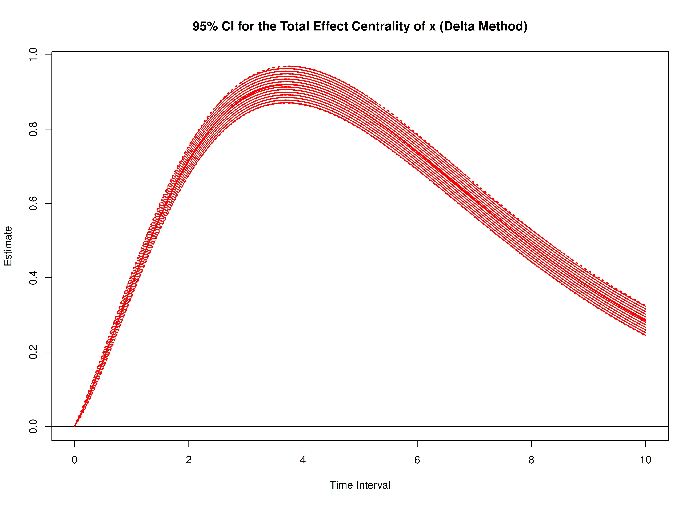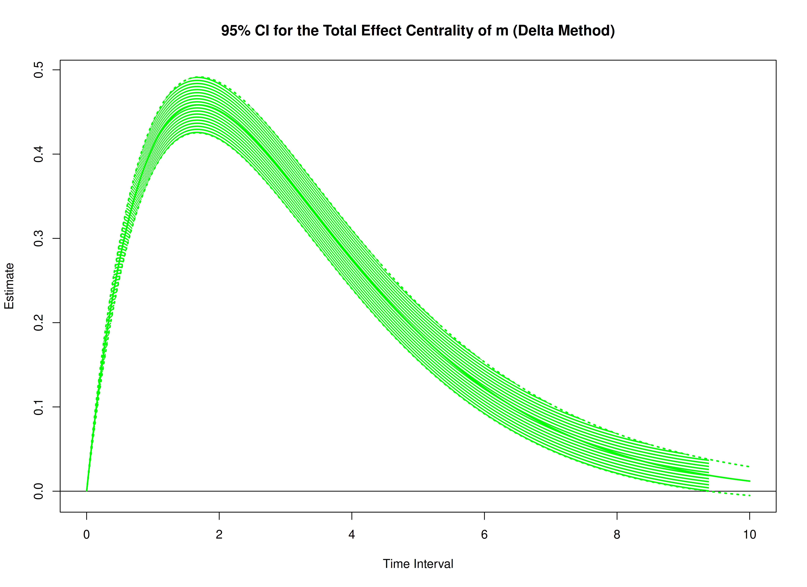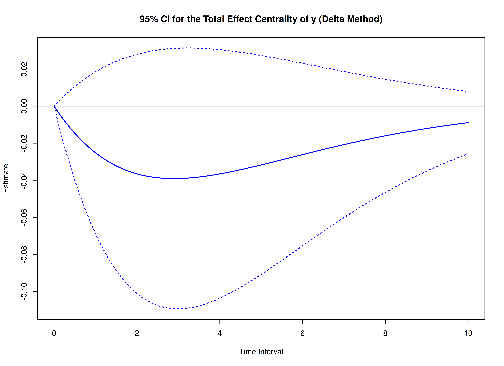

``` r

start <- Sys.time()
delta_indirect <- DeltaIndirectCentral(
  phi = phi,
  vcov_phi_vec = vcov_phi_vec,
  delta_t = delta_t,
  ncores = parallel::detectCores() # use multiple cores
)
end <- Sys.time()
elapsed <- end - start
elapsed
#> Time difference of 1.00811 secs
```

``` r

summary(delta_indirect)
#> Call:
#> DeltaIndirectCentral(phi = phi, vcov_phi_vec = vcov_phi_vec,
#>     delta_t = delta_t, ncores = parallel::detectCores())
#>
#> Indirect Effect Centrality
#>      variable interval     est     se       z      p    2.5%  97.5%
#> 1           x   0.0010  0.0000 0.0000 -0.8122 0.4167  0.0000 0.0000
#> 2           m   0.0010  0.0000 0.0000 24.2149 0.0000  0.0000 0.0000
#> 3           y   0.0010  0.0000 0.0000 -0.7171 0.4733  0.0000 0.0000
#> 4           x   0.0100  0.0000 0.0000 -0.8125 0.4165  0.0000 0.0000
#> 5           m   0.0100  0.0000 0.0000 24.2388 0.0000  0.0000 0.0000
#> 6           y   0.0100  0.0000 0.0000 -0.7179 0.4728  0.0000 0.0000
#> 7           x   0.0200  0.0000 0.0000 -0.8128 0.4163  0.0000 0.0000
#> 8           m   0.0200  0.0001 0.0000 24.2649 0.0000  0.0001 0.0001
#> 9           y   0.0200  0.0000 0.0000 -0.7187 0.4723  0.0000 0.0000
#> 10          x   0.0300  0.0000 0.0000 -0.8131 0.4161  0.0000 0.0000
#> 11          m   0.0300  0.0002 0.0000 24.2906 0.0000  0.0002 0.0003
#> 12          y   0.0300  0.0000 0.0000 -0.7196 0.4718  0.0000 0.0000
#> 13          x   0.0400  0.0000 0.0000 -0.8135 0.4160 -0.0001 0.0000
#> 14          m   0.0400  0.0004 0.0000 24.3158 0.0000  0.0004 0.0005
#> 15          y   0.0400  0.0000 0.0000 -0.7204 0.4713  0.0000 0.0000
#> 16          x   0.0501  0.0000 0.0000 -0.8138 0.4158 -0.0001 0.0000
#> 17          m   0.0501  0.0007 0.0000 24.3406 0.0000  0.0006 0.0007
#> 18          y   0.0501  0.0000 0.0000 -0.7213 0.4707 -0.0001 0.0000
#> 19          x   0.0601  0.0000 0.0001 -0.8141 0.4156 -0.0002 0.0001
#> 20          m   0.0601  0.0009 0.0000 24.3649 0.0000  0.0009 0.0010
#> 21          y   0.0601  0.0000 0.0000 -0.7222 0.4702 -0.0001 0.0000
#> 22          x   0.0701 -0.0001 0.0001 -0.8144 0.4154 -0.0002 0.0001
#> 23          m   0.0701  0.0013 0.0001 24.3887 0.0000  0.0012 0.0014
#> 24          y   0.0701  0.0000 0.0000 -0.7230 0.4697 -0.0001 0.0001
#> 25          x   0.0801 -0.0001 0.0001 -0.8148 0.4152 -0.0003 0.0001
#> 26          m   0.0801  0.0017 0.0001 24.4120 0.0000  0.0015 0.0018
#> 27          y   0.0801  0.0000 0.0001 -0.7239 0.4691 -0.0001 0.0001
#> 28          x   0.0901 -0.0001 0.0001 -0.8151 0.4150 -0.0003 0.0001
#> 29          m   0.0901  0.0021 0.0001 24.4349 0.0000  0.0019 0.0023
#> 30          y   0.0901  0.0000 0.0001 -0.7248 0.4686 -0.0002 0.0001
#> 31          x   0.1001 -0.0001 0.0001 -0.8154 0.4148 -0.0004 0.0002
#> 32          m   0.1001  0.0026 0.0001 24.4573 0.0000  0.0024 0.0028
#> 33          y   0.1001 -0.0001 0.0001 -0.7257 0.4680 -0.0002 0.0001
#> 34          x   0.1101 -0.0001 0.0002 -0.8158 0.4146 -0.0005 0.0002
#> 35          m   0.1101  0.0031 0.0001 24.4793 0.0000  0.0029 0.0033
#> 36          y   0.1101 -0.0001 0.0001 -0.7266 0.4675 -0.0003 0.0001
#> 37          x   0.1201 -0.0002 0.0002 -0.8161 0.4144 -0.0006 0.0002
#> 38          m   0.1201  0.0037 0.0001 24.5007 0.0000  0.0034 0.0040
#> 39          y   0.1201 -0.0001 0.0001 -0.7275 0.4669 -0.0003 0.0001
#> 40          x   0.1301 -0.0002 0.0002 -0.8165 0.4142 -0.0007 0.0003
#> 41          m   0.1301  0.0043 0.0002 24.5218 0.0000  0.0039 0.0046
#> 42          y   0.1301 -0.0001 0.0001 -0.7284 0.4664 -0.0004 0.0002
#> 43          x   0.1401 -0.0002 0.0003 -0.8168 0.4140 -0.0008 0.0003
#> 44          m   0.1401  0.0049 0.0002 24.5423 0.0000  0.0045 0.0053
#> 45          y   0.1401 -0.0001 0.0002 -0.7293 0.4658 -0.0004 0.0002
#> 46          x   0.1502 -0.0003 0.0003 -0.8171 0.4138 -0.0009 0.0004
#> 47          m   0.1502  0.0056 0.0002 24.5624 0.0000  0.0052 0.0061
#> 48          y   0.1502 -0.0001 0.0002 -0.7302 0.4653 -0.0005 0.0002
#> 49          x   0.1602 -0.0003 0.0004 -0.8175 0.4136 -0.0010 0.0004
#> 50          m   0.1602  0.0064 0.0003 24.5820 0.0000  0.0059 0.0069
#> 51          y   0.1602 -0.0001 0.0002 -0.7311 0.4647 -0.0006 0.0003
#> 52          x   0.1702 -0.0003 0.0004 -0.8178 0.4134 -0.0011 0.0005
#> 53          m   0.1702  0.0072 0.0003 24.6012 0.0000  0.0066 0.0078
#> 54          y   0.1702 -0.0002 0.0002 -0.7320 0.4641 -0.0006 0.0003
#> 55          x   0.1802 -0.0004 0.0004 -0.8182 0.4132 -0.0012 0.0005
#> 56          m   0.1802  0.0080 0.0003 24.6199 0.0000  0.0074 0.0086
#> 57          y   0.1802 -0.0002 0.0003 -0.7330 0.4636 -0.0007 0.0003
#> 58          x   0.1902 -0.0004 0.0005 -0.8186 0.4130 -0.0014 0.0006
#> 59          m   0.1902  0.0089 0.0004 24.6381 0.0000  0.0082 0.0096
#> 60          y   0.1902 -0.0002 0.0003 -0.7339 0.4630 -0.0008 0.0003
#> 61          x   0.2002 -0.0004 0.0005 -0.8189 0.4128 -0.0015 0.0006
#> 62          m   0.2002  0.0098 0.0004 24.6559 0.0000  0.0090 0.0106
#> 63          y   0.2002 -0.0002 0.0003 -0.7348 0.4624 -0.0008 0.0004
#> 64          x   0.2102 -0.0005 0.0006 -0.8193 0.4126 -0.0017 0.0007
#> 65          m   0.2102  0.0107 0.0004 24.6732 0.0000  0.0099 0.0116
#> 66          y   0.2102 -0.0003 0.0003 -0.7358 0.4619 -0.0009 0.0004
#> 67          x   0.2202 -0.0005 0.0006 -0.8197 0.4124 -0.0018 0.0007
#> 68          m   0.2202  0.0117 0.0005 24.6901 0.0000  0.0108 0.0126
#> 69          y   0.2202 -0.0003 0.0004 -0.7367 0.4613 -0.0010 0.0005
#> 70          x   0.2302 -0.0006 0.0007 -0.8200 0.4122 -0.0020 0.0008
#> 71          m   0.2302  0.0127 0.0005 24.7065 0.0000  0.0117 0.0138
#> 72          y   0.2302 -0.0003 0.0004 -0.7377 0.4607 -0.0011 0.0005
#> 73          x   0.2402 -0.0006 0.0008 -0.8204 0.4120 -0.0021 0.0009
#> 74          m   0.2402  0.0138 0.0006 24.7225 0.0000  0.0127 0.0149
#> 75          y   0.2402 -0.0003 0.0004 -0.7386 0.4601 -0.0012 0.0005
#> 76          x   0.2503 -0.0007 0.0008 -0.8208 0.4118 -0.0023 0.0009
#> 77          m   0.2503  0.0149 0.0006 24.7380 0.0000  0.0137 0.0161
#> 78          y   0.2503 -0.0003 0.0005 -0.7396 0.4596 -0.0013 0.0006
#> 79          x   0.2603 -0.0007 0.0009 -0.8211 0.4116 -0.0024 0.0010
#> 80          m   0.2603  0.0160 0.0006 24.7531 0.0000  0.0148 0.0173
#> 81          y   0.2603 -0.0004 0.0005 -0.7405 0.4590 -0.0014 0.0006
#> 82          x   0.2703 -0.0008 0.0009 -0.8215 0.4114 -0.0026 0.0011
#> 83          m   0.2703  0.0172 0.0007 24.7677 0.0000  0.0158 0.0186
#> 84          y   0.2703 -0.0004 0.0005 -0.7415 0.4584 -0.0015 0.0007
#> 85          x   0.2803 -0.0008 0.0010 -0.8219 0.4111 -0.0028 0.0011
#> 86          m   0.2803  0.0184 0.0007 24.7819 0.0000  0.0170 0.0199
#> 87          y   0.2803 -0.0004 0.0006 -0.7425 0.4578 -0.0016 0.0007
#> 88          x   0.2903 -0.0009 0.0011 -0.8223 0.4109 -0.0030 0.0012
#> 89          m   0.2903  0.0196 0.0008 24.7956 0.0000  0.0181 0.0212
#> 90          y   0.2903 -0.0005 0.0006 -0.7435 0.4572 -0.0017 0.0007
#> 91          x   0.3003 -0.0009 0.0011 -0.8227 0.4107 -0.0031 0.0013
#> 92          m   0.3003  0.0209 0.0008 24.8089 0.0000  0.0193 0.0226
#> 93          y   0.3003 -0.0005 0.0007 -0.7444 0.4566 -0.0018 0.0008
#> 94          x   0.3103 -0.0010 0.0012 -0.8231 0.4105 -0.0033 0.0014
#> 95          m   0.3103  0.0222 0.0009 24.8217 0.0000  0.0205 0.0240
#> 96          y   0.3103 -0.0005 0.0007 -0.7454 0.4560 -0.0019 0.0008
#> 97          x   0.3203 -0.0010 0.0013 -0.8235 0.4103 -0.0035 0.0014
#> 98          m   0.3203  0.0236 0.0009 24.8341 0.0000  0.0217 0.0254
#> 99          y   0.3203 -0.0005 0.0007 -0.7464 0.4554 -0.0020 0.0009
#> 100         x   0.3303 -0.0011 0.0013 -0.8238 0.4100 -0.0037 0.0015
#> 101         m   0.3303  0.0249 0.0010 24.8461 0.0000  0.0230 0.0269
#> 102         y   0.3303 -0.0006 0.0008 -0.7474 0.4548 -0.0021 0.0009
#> 103         x   0.3403 -0.0012 0.0014 -0.8242 0.4098 -0.0039 0.0016
#> 104         m   0.3403  0.0263 0.0011 24.8576 0.0000  0.0243 0.0284
#> 105         y   0.3403 -0.0006 0.0008 -0.7484 0.4542 -0.0022 0.0010
#> 106         x   0.3504 -0.0012 0.0015 -0.8246 0.4096 -0.0041 0.0017
#> 107         m   0.3504  0.0278 0.0011 24.8687 0.0000  0.0256 0.0299
#> 108         y   0.3504 -0.0006 0.0009 -0.7494 0.4536 -0.0023 0.0010
#> 109         x   0.3604 -0.0013 0.0016 -0.8250 0.4093 -0.0043 0.0018
#> 110         m   0.3604  0.0292 0.0012 24.8794 0.0000  0.0269 0.0315
#> 111         y   0.3604 -0.0007 0.0009 -0.7504 0.4530 -0.0025 0.0011
#> 112         x   0.3704 -0.0013 0.0016 -0.8255 0.4091 -0.0045 0.0018
#> 113         m   0.3704  0.0307 0.0012 24.8897 0.0000  0.0283 0.0331
#> 114         y   0.3704 -0.0007 0.0009 -0.7514 0.4524 -0.0026 0.0011
#> 115         x   0.3804 -0.0014 0.0017 -0.8259 0.4089 -0.0048 0.0019
#> 116         m   0.3804  0.0322 0.0013 24.8995 0.0000  0.0297 0.0348
#> 117         y   0.3804 -0.0007 0.0010 -0.7525 0.4518 -0.0027 0.0012
#> 118         x   0.3904 -0.0015 0.0018 -0.8263 0.4086 -0.0050 0.0020
#> 119         m   0.3904  0.0338 0.0014 24.9089 0.0000  0.0311 0.0364
#> 120         y   0.3904 -0.0008 0.0010 -0.7535 0.4512 -0.0028 0.0013
#> 121         x   0.4004 -0.0015 0.0019 -0.8267 0.4084 -0.0052 0.0021
#> 122         m   0.4004  0.0353 0.0014 24.9179 0.0000  0.0326 0.0381
#> 123         y   0.4004 -0.0008 0.0011 -0.7545 0.4505 -0.0030 0.0013
#> 124         x   0.4104 -0.0016 0.0019 -0.8271 0.4082 -0.0054 0.0022
#> 125         m   0.4104  0.0369 0.0015 24.9264 0.0000  0.0340 0.0399
#> 126         y   0.4104 -0.0009 0.0011 -0.7555 0.4499 -0.0031 0.0014
#> 127         x   0.4204 -0.0017 0.0020 -0.8275 0.4079 -0.0056 0.0023
#> 128         m   0.4204  0.0386 0.0015 24.9346 0.0000  0.0355 0.0416
#> 129         y   0.4204 -0.0009 0.0012 -0.7566 0.4493 -0.0032 0.0014
#> 130         x   0.4304 -0.0017 0.0021 -0.8280 0.4077 -0.0059 0.0024
#> 131         m   0.4304  0.0402 0.0016 24.9423 0.0000  0.0371 0.0434
#> 132         y   0.4304 -0.0009 0.0012 -0.7576 0.4487 -0.0033 0.0015
#> 133         x   0.4404 -0.0018 0.0022 -0.8284 0.4075 -0.0061 0.0025
#> 134         m   0.4404  0.0419 0.0017 24.9497 0.0000  0.0386 0.0452
#> 135         y   0.4404 -0.0010 0.0013 -0.7587 0.4481 -0.0035 0.0015
#> 136         x   0.4505 -0.0019 0.0023 -0.8288 0.4072 -0.0063 0.0026
#> 137         m   0.4505  0.0436 0.0017 24.9566 0.0000  0.0402 0.0470
#> 138         y   0.4505 -0.0010 0.0013 -0.7597 0.4474 -0.0036 0.0016
#> 139         x   0.4605 -0.0019 0.0024 -0.8292 0.4070 -0.0066 0.0027
#> 140         m   0.4605  0.0453 0.0018 24.9631 0.0000  0.0418 0.0489
#> 141         y   0.4605 -0.0011 0.0014 -0.7608 0.4468 -0.0038 0.0017
#> 142         x   0.4705 -0.0020 0.0024 -0.8297 0.4067 -0.0068 0.0028
#> 143         m   0.4705  0.0471 0.0019 24.9693 0.0000  0.0434 0.0508
#> 144         y   0.4705 -0.0011 0.0014 -0.7618 0.4462 -0.0039 0.0017
#> 145         x   0.4805 -0.0021 0.0025 -0.8301 0.4065 -0.0070 0.0028
#> 146         m   0.4805  0.0489 0.0020 24.9750 0.0000  0.0450 0.0527
#> 147         y   0.4805 -0.0011 0.0015 -0.7629 0.4455 -0.0040 0.0018
#> 148         x   0.4905 -0.0022 0.0026 -0.8306 0.4062 -0.0073 0.0029
#> 149         m   0.4905  0.0507 0.0020 24.9803 0.0000  0.0467 0.0546
#> 150         y   0.4905 -0.0012 0.0015 -0.7639 0.4449 -0.0042 0.0018
#> 151         x   0.5005 -0.0022 0.0027 -0.8310 0.4060 -0.0075 0.0030
#> 152         m   0.5005  0.0525 0.0021 24.9853 0.0000  0.0484 0.0566
#> 153         y   0.5005 -0.0012 0.0016 -0.7650 0.4443 -0.0043 0.0019
#> 154         x   0.5105 -0.0023 0.0028 -0.8314 0.4057 -0.0078 0.0031
#> 155         m   0.5105  0.0543 0.0022 24.9898 0.0000  0.0501 0.0586
#> 156         y   0.5105 -0.0013 0.0016 -0.7661 0.4436 -0.0045 0.0020
#> 157         x   0.5205 -0.0024 0.0029 -0.8319 0.4055 -0.0080 0.0032
#> 158         m   0.5205  0.0562 0.0022 24.9940 0.0000  0.0518 0.0606
#> 159         y   0.5205 -0.0013 0.0017 -0.7672 0.4430 -0.0046 0.0020
#> 160         x   0.5305 -0.0025 0.0030 -0.8323 0.4052 -0.0083 0.0033
#> 161         m   0.5305  0.0581 0.0023 24.9978 0.0000  0.0535 0.0626
#> 162         y   0.5305 -0.0013 0.0017 -0.7682 0.4423 -0.0048 0.0021
#> 163         x   0.5405 -0.0025 0.0030 -0.8328 0.4050 -0.0085 0.0034
#> 164         m   0.5405  0.0600 0.0024 25.0012 0.0000  0.0553 0.0647
#> 165         y   0.5405 -0.0014 0.0018 -0.7693 0.4417 -0.0049 0.0021
#> 166         x   0.5506 -0.0026 0.0031 -0.8333 0.4047 -0.0088 0.0035
#> 167         m   0.5506  0.0619 0.0025 25.0043 0.0000  0.0571 0.0668
#> 168         y   0.5506 -0.0014 0.0019 -0.7704 0.4411 -0.0051 0.0022
#> 169         x   0.5606 -0.0027 0.0032 -0.8337 0.4044 -0.0090 0.0036
#> 170         m   0.5606  0.0639 0.0026 25.0069 0.0000  0.0589 0.0689
#> 171         y   0.5606 -0.0015 0.0019 -0.7715 0.4404 -0.0052 0.0023
#> 172         x   0.5706 -0.0028 0.0033 -0.8342 0.4042 -0.0093 0.0037
#> 173         m   0.5706  0.0658 0.0026 25.0092 0.0000  0.0607 0.0710
#> 174         y   0.5706 -0.0015 0.0020 -0.7726 0.4398 -0.0054 0.0023
#> 175         x   0.5806 -0.0028 0.0034 -0.8347 0.4039 -0.0095 0.0038
#> 176         m   0.5806  0.0678 0.0027 25.0112 0.0000  0.0625 0.0731
#> 177         y   0.5806 -0.0016 0.0020 -0.7737 0.4391 -0.0055 0.0024
#> 178         x   0.5906 -0.0029 0.0035 -0.8351 0.4036 -0.0098 0.0039
#> 179         m   0.5906  0.0698 0.0028 25.0127 0.0000  0.0644 0.0753
#> 180         y   0.5906 -0.0016 0.0021 -0.7748 0.4385 -0.0057 0.0025
#> 181         x   0.6006 -0.0030 0.0036 -0.8356 0.4034 -0.0100 0.0040
#> 182         m   0.6006  0.0719 0.0029 25.0140 0.0000  0.0662 0.0775
#> 183         y   0.6006 -0.0017 0.0021 -0.7759 0.4378 -0.0059 0.0025
#> 184         x   0.6106 -0.0031 0.0037 -0.8361 0.4031 -0.0103 0.0041
#> 185         m   0.6106  0.0739 0.0030 25.0148 0.0000  0.0681 0.0797
#> 186         y   0.6106 -0.0017 0.0022 -0.7770 0.4371 -0.0060 0.0026
#> 187         x   0.6206 -0.0032 0.0038 -0.8366 0.4028 -0.0106 0.0042
#> 188         m   0.6206  0.0760 0.0030 25.0153 0.0000  0.0700 0.0819
#> 189         y   0.6206 -0.0018 0.0023 -0.7781 0.4365 -0.0062 0.0027
#> 190         x   0.6306 -0.0032 0.0039 -0.8370 0.4026 -0.0108 0.0043
#> 191         m   0.6306  0.0780 0.0031 25.0155 0.0000  0.0719 0.0841
#> 192         y   0.6306 -0.0018 0.0023 -0.7793 0.4358 -0.0063 0.0027
#> 193         x   0.6406 -0.0033 0.0040 -0.8375 0.4023 -0.0111 0.0044
#> 194         m   0.6406  0.0801 0.0032 25.0153 0.0000  0.0738 0.0864
#> 195         y   0.6406 -0.0019 0.0024 -0.7804 0.4352 -0.0065 0.0028
#> 196         x   0.6507 -0.0034 0.0041 -0.8380 0.4020 -0.0113 0.0045
#> 197         m   0.6507  0.0822 0.0033 25.0148 0.0000  0.0758 0.0887
#> 198         y   0.6507 -0.0019 0.0024 -0.7815 0.4345 -0.0067 0.0029
#> 199         x   0.6607 -0.0035 0.0041 -0.8385 0.4017 -0.0116 0.0047
#> 200         m   0.6607  0.0843 0.0034 25.0140 0.0000  0.0777 0.0910
#> 201         y   0.6607 -0.0019 0.0025 -0.7827 0.4338 -0.0068 0.0029
#> 202         x   0.6707 -0.0036 0.0042 -0.8390 0.4015 -0.0119 0.0048
#> 203         m   0.6707  0.0865 0.0035 25.0128 0.0000  0.0797 0.0933
#> 204         y   0.6707 -0.0020 0.0026 -0.7838 0.4332 -0.0070 0.0030
#> 205         x   0.6807 -0.0036 0.0043 -0.8395 0.4012 -0.0121 0.0049
#> 206         m   0.6807  0.0886 0.0035 25.0113 0.0000  0.0817 0.0956
#> 207         y   0.6807 -0.0020 0.0026 -0.7849 0.4325 -0.0072 0.0031
#> 208         x   0.6907 -0.0037 0.0044 -0.8400 0.4009 -0.0124 0.0050
#> 209         m   0.6907  0.0908 0.0036 25.0094 0.0000  0.0837 0.0979
#> 210         y   0.6907 -0.0021 0.0027 -0.7861 0.4318 -0.0073 0.0031
#> 211         x   0.7007 -0.0038 0.0045 -0.8405 0.4006 -0.0127 0.0051
#> 212         m   0.7007  0.0930 0.0037 25.0073 0.0000  0.0857 0.1003
#> 213         y   0.7007 -0.0021 0.0027 -0.7872 0.4312 -0.0075 0.0032
#> 214         x   0.7107 -0.0039 0.0046 -0.8410 0.4003 -0.0129 0.0052
#> 215         m   0.7107  0.0952 0.0038 25.0048 0.0000  0.0877 0.1026
#> 216         y   0.7107 -0.0022 0.0028 -0.7884 0.4305 -0.0077 0.0033
#> 217         x   0.7207 -0.0040 0.0047 -0.8415 0.4001 -0.0132 0.0053
#> 218         m   0.7207  0.0974 0.0039 25.0020 0.0000  0.0897 0.1050
#> 219         y   0.7207 -0.0023 0.0029 -0.7895 0.4298 -0.0078 0.0033
#> 220         x   0.7307 -0.0040 0.0048 -0.8420 0.3998 -0.0135 0.0054
#> 221         m   0.7307  0.0996 0.0040 24.9989 0.0000  0.0918 0.1074
#> 222         y   0.7307 -0.0023 0.0029 -0.7907 0.4291 -0.0080 0.0034
#> 223         x   0.7407 -0.0041 0.0049 -0.8426 0.3995 -0.0137 0.0055
#> 224         m   0.7407  0.1018 0.0041 24.9955 0.0000  0.0938 0.1098
#> 225         y   0.7407 -0.0024 0.0030 -0.7918 0.4285 -0.0082 0.0035
#> 226         x   0.7508 -0.0042 0.0050 -0.8431 0.3992 -0.0140 0.0056
#> 227         m   0.7508  0.1041 0.0042 24.9917 0.0000  0.0959 0.1122
#> 228         y   0.7508 -0.0024 0.0030 -0.7930 0.4278 -0.0084 0.0035
#> 229         x   0.7608 -0.0043 0.0051 -0.8436 0.3989 -0.0143 0.0057
#> 230         m   0.7608  0.1063 0.0043 24.9877 0.0000  0.0980 0.1147
#> 231         y   0.7608 -0.0025 0.0031 -0.7942 0.4271 -0.0085 0.0036
#> 232         x   0.7708 -0.0044 0.0052 -0.8441 0.3986 -0.0145 0.0058
#> 233         m   0.7708  0.1086 0.0043 24.9834 0.0000  0.1001 0.1171
#> 234         y   0.7708 -0.0025 0.0032 -0.7953 0.4264 -0.0087 0.0037
#> 235         x   0.7808 -0.0045 0.0053 -0.8447 0.3983 -0.0148 0.0059
#> 236         m   0.7808  0.1109 0.0044 24.9788 0.0000  0.1022 0.1196
#> 237         y   0.7808 -0.0026 0.0032 -0.7965 0.4257 -0.0089 0.0037
#> 238         x   0.7908 -0.0045 0.0054 -0.8452 0.3980 -0.0151 0.0060
#> 239         m   0.7908  0.1132 0.0045 24.9739 0.0000  0.1043 0.1220
#> 240         y   0.7908 -0.0026 0.0033 -0.7977 0.4250 -0.0091 0.0038
#> 241         x   0.8008 -0.0046 0.0055 -0.8457 0.3977 -0.0154 0.0061
#> 242         m   0.8008  0.1155 0.0046 24.9687 0.0000  0.1064 0.1245
#> 243         y   0.8008 -0.0027 0.0033 -0.7989 0.4244 -0.0092 0.0039
#> 244         x   0.8108 -0.0047 0.0056 -0.8463 0.3974 -0.0156 0.0062
#> 245         m   0.8108  0.1178 0.0047 24.9632 0.0000  0.1085 0.1270
#> 246         y   0.8108 -0.0027 0.0034 -0.8001 0.4237 -0.0094 0.0040
#> 247         x   0.8208 -0.0048 0.0057 -0.8468 0.3971 -0.0159 0.0063
#> 248         m   0.8208  0.1201 0.0048 24.9575 0.0000  0.1106 0.1295
#> 249         y   0.8208 -0.0028 0.0035 -0.8012 0.4230 -0.0096 0.0040
#> 250         x   0.8308 -0.0049 0.0058 -0.8474 0.3968 -0.0162 0.0064
#> 251         m   0.8308  0.1224 0.0049 24.9515 0.0000  0.1128 0.1320
#> 252         y   0.8308 -0.0028 0.0035 -0.8024 0.4223 -0.0098 0.0041
#> 253         x   0.8408 -0.0050 0.0058 -0.8479 0.3965 -0.0164 0.0065
#> 254         m   0.8408  0.1247 0.0050 24.9452 0.0000  0.1149 0.1345
#> 255         y   0.8408 -0.0029 0.0036 -0.8036 0.4216 -0.0099 0.0042
#> 256         x   0.8509 -0.0050 0.0059 -0.8485 0.3962 -0.0167 0.0066
#> 257         m   0.8509  0.1271 0.0051 24.9386 0.0000  0.1171 0.1371
#> 258         y   0.8509 -0.0029 0.0037 -0.8048 0.4209 -0.0101 0.0042
#> 259         x   0.8609 -0.0051 0.0060 -0.8491 0.3959 -0.0170 0.0067
#> 260         m   0.8609  0.1294 0.0052 24.9318 0.0000  0.1193 0.1396
#> 261         y   0.8609 -0.0030 0.0037 -0.8060 0.4202 -0.0103 0.0043
#> 262         x   0.8709 -0.0052 0.0061 -0.8496 0.3955 -0.0172 0.0068
#> 263         m   0.8709  0.1318 0.0053 24.9247 0.0000  0.1214 0.1422
#> 264         y   0.8709 -0.0031 0.0038 -0.8072 0.4195 -0.0105 0.0044
#> 265         x   0.8809 -0.0053 0.0062 -0.8502 0.3952 -0.0175 0.0069
#> 266         m   0.8809  0.1342 0.0054 24.9174 0.0000  0.1236 0.1447
#> 267         y   0.8809 -0.0031 0.0038 -0.8084 0.4188 -0.0107 0.0044
#> 268         x   0.8909 -0.0054 0.0063 -0.8507 0.3949 -0.0178 0.0070
#> 269         m   0.8909  0.1365 0.0055 24.9098 0.0000  0.1258 0.1473
#> 270         y   0.8909 -0.0032 0.0039 -0.8096 0.4182 -0.0108 0.0045
#> 271         x   0.9009 -0.0055 0.0064 -0.8513 0.3946 -0.0180 0.0071
#> 272         m   0.9009  0.1389 0.0056 24.9019 0.0000  0.1280 0.1499
#> 273         y   0.9009 -0.0032 0.0040 -0.8108 0.4175 -0.0110 0.0046
#> 274         x   0.9109 -0.0055 0.0065 -0.8519 0.3943 -0.0183 0.0072
#> 275         m   0.9109  0.1413 0.0057 24.8939 0.0000  0.1302 0.1524
#> 276         y   0.9109 -0.0033 0.0040 -0.8121 0.4168 -0.0112 0.0046
#> 277         x   0.9209 -0.0056 0.0066 -0.8525 0.3939 -0.0186 0.0073
#> 278         m   0.9209  0.1437 0.0058 24.8855 0.0000  0.1324 0.1550
#> 279         y   0.9209 -0.0033 0.0041 -0.8133 0.4161 -0.0114 0.0047
#> 280         x   0.9309 -0.0057 0.0067 -0.8531 0.3936 -0.0188 0.0074
#> 281         m   0.9309  0.1461 0.0059 24.8770 0.0000  0.1346 0.1576
#> 282         y   0.9309 -0.0034 0.0042 -0.8145 0.4154 -0.0116 0.0048
#> 283         x   0.9409 -0.0058 0.0068 -0.8537 0.3933 -0.0191 0.0075
#> 284         m   0.9409  0.1485 0.0060 24.8682 0.0000  0.1368 0.1602
#> 285         y   0.9409 -0.0035 0.0042 -0.8157 0.4147 -0.0117 0.0048
#> 286         x   0.9510 -0.0059 0.0069 -0.8542 0.3930 -0.0193 0.0076
#> 287         m   0.9510  0.1509 0.0061 24.8591 0.0000  0.1390 0.1628
#> 288         y   0.9510 -0.0035 0.0043 -0.8169 0.4140 -0.0119 0.0049
#> 289         x   0.9610 -0.0060 0.0070 -0.8548 0.3926 -0.0196 0.0077
#> 290         m   0.9610  0.1534 0.0062 24.8499 0.0000  0.1413 0.1655
#> 291         y   0.9610 -0.0036 0.0044 -0.8182 0.4133 -0.0121 0.0050
#> 292         x   0.9710 -0.0060 0.0071 -0.8554 0.3923 -0.0199 0.0078
#> 293         m   0.9710  0.1558 0.0063 24.8404 0.0000  0.1435 0.1681
#> 294         y   0.9710 -0.0036 0.0044 -0.8194 0.4126 -0.0123 0.0050
#> 295         x   0.9810 -0.0061 0.0071 -0.8560 0.3920 -0.0201 0.0079
#> 296         m   0.9810  0.1582 0.0064 24.8307 0.0000  0.1457 0.1707
#> 297         y   0.9810 -0.0037 0.0045 -0.8206 0.4119 -0.0125 0.0051
#> 298         x   0.9910 -0.0062 0.0072 -0.8566 0.3916 -0.0204 0.0080
#> 299         m   0.9910  0.1606 0.0065 24.8208 0.0000  0.1480 0.1733
#> 300         y   0.9910 -0.0037 0.0046 -0.8218 0.4112 -0.0127 0.0052
#> 301         x   1.0010 -0.0063 0.0073 -0.8572 0.3913 -0.0207 0.0081
#> 302         m   1.0010  0.1631 0.0066 24.8107 0.0000  0.1502 0.1760
#> 303         y   1.0010 -0.0038 0.0046 -0.8231 0.4105 -0.0128 0.0052
#> 304         x   1.0110 -0.0064 0.0074 -0.8579 0.3910 -0.0209 0.0082
#> 305         m   1.0110  0.1655 0.0067 24.8003 0.0000  0.1524 0.1786
#> 306         y   1.0110 -0.0039 0.0047 -0.8243 0.4098 -0.0130 0.0053
#> 307         x   1.0210 -0.0064 0.0075 -0.8585 0.3906 -0.0212 0.0083
#> 308         m   1.0210  0.1680 0.0068 24.7898 0.0000  0.1547 0.1813
#> 309         y   1.0210 -0.0039 0.0047 -0.8256 0.4091 -0.0132 0.0054
#> 310         x   1.0310 -0.0065 0.0076 -0.8591 0.3903 -0.0214 0.0084
#> 311         m   1.0310  0.1704 0.0069 24.7790 0.0000  0.1569 0.1839
#> 312         y   1.0310 -0.0040 0.0048 -0.8268 0.4083 -0.0134 0.0054
#> 313         x   1.0410 -0.0066 0.0077 -0.8597 0.3899 -0.0217 0.0085
#> 314         m   1.0410  0.1729 0.0070 24.7681 0.0000  0.1592 0.1866
#> 315         y   1.0410 -0.0040 0.0049 -0.8280 0.4076 -0.0136 0.0055
#> 316         x   1.0511 -0.0067 0.0078 -0.8603 0.3896 -0.0219 0.0086
#> 317         m   1.0511  0.1753 0.0071 24.7569 0.0000  0.1615 0.1892
#> 318         y   1.0511 -0.0041 0.0049 -0.8293 0.4069 -0.0138 0.0056
#> 319         x   1.0611 -0.0068 0.0079 -0.8610 0.3892 -0.0222 0.0086
#> 320         m   1.0611  0.1778 0.0072 24.7456 0.0000  0.1637 0.1919
#> 321         y   1.0611 -0.0042 0.0050 -0.8305 0.4062 -0.0140 0.0056
#> 322         x   1.0711 -0.0069 0.0080 -0.8616 0.3889 -0.0224 0.0087
#> 323         m   1.0711  0.1803 0.0073 24.7341 0.0000  0.1660 0.1945
#> 324         y   1.0711 -0.0042 0.0051 -0.8318 0.4055 -0.0141 0.0057
#> 325         x   1.0811 -0.0069 0.0080 -0.8623 0.3885 -0.0227 0.0088
#> 326         m   1.0811  0.1827 0.0074 24.7224 0.0000  0.1682 0.1972
#> 327         y   1.0811 -0.0043 0.0051 -0.8330 0.4048 -0.0143 0.0058
#> 328         x   1.0911 -0.0070 0.0081 -0.8629 0.3882 -0.0229 0.0089
#> 329         m   1.0911  0.1852 0.0075 24.7105 0.0000  0.1705 0.1999
#> 330         y   1.0911 -0.0043 0.0052 -0.8343 0.4041 -0.0145 0.0058
#> 331         x   1.1011 -0.0071 0.0082 -0.8635 0.3878 -0.0232 0.0090
#> 332         m   1.1011  0.1877 0.0076 24.6984 0.0000  0.1728 0.2025
#> 333         y   1.1011 -0.0044 0.0053 -0.8355 0.4034 -0.0147 0.0059
#> 334         x   1.1111 -0.0072 0.0083 -0.8642 0.3875 -0.0234 0.0091
#> 335         m   1.1111  0.1901 0.0077 24.6862 0.0000  0.1750 0.2052
#> 336         y   1.1111 -0.0045 0.0053 -0.8368 0.4027 -0.0149 0.0060
#> 337         x   1.1211 -0.0073 0.0084 -0.8648 0.3871 -0.0237 0.0092
#> 338         m   1.1211  0.1926 0.0078 24.6737 0.0000  0.1773 0.2079
#> 339         y   1.1211 -0.0045 0.0054 -0.8381 0.4020 -0.0151 0.0060
#> 340         x   1.1311 -0.0073 0.0085 -0.8655 0.3868 -0.0239 0.0093
#> 341         m   1.1311  0.1951 0.0079 24.6612 0.0000  0.1796 0.2106
#> 342         y   1.1311 -0.0046 0.0055 -0.8393 0.4013 -0.0153 0.0061
#> 343         x   1.1411 -0.0074 0.0086 -0.8662 0.3864 -0.0242 0.0094
#> 344         m   1.1411  0.1975 0.0080 24.6484 0.0000  0.1818 0.2132
#> 345         y   1.1411 -0.0046 0.0055 -0.8406 0.4006 -0.0154 0.0062
#> 346         x   1.1512 -0.0075 0.0086 -0.8668 0.3860 -0.0244 0.0094
#> 347         m   1.1512  0.2000 0.0081 24.6355 0.0000  0.1841 0.2159
#> 348         y   1.1512 -0.0047 0.0056 -0.8418 0.3999 -0.0156 0.0062
#> 349         x   1.1612 -0.0076 0.0087 -0.8675 0.3857 -0.0247 0.0095
#> 350         m   1.1612  0.2025 0.0082 24.6224 0.0000  0.1864 0.2186
#> 351         y   1.1612 -0.0048 0.0056 -0.8431 0.3992 -0.0158 0.0063
#> 352         x   1.1712 -0.0076 0.0088 -0.8682 0.3853 -0.0249 0.0096
#> 353         m   1.1712  0.2050 0.0083 24.6092 0.0000  0.1886 0.2213
#> 354         y   1.1712 -0.0048 0.0057 -0.8444 0.3985 -0.0160 0.0064
#> 355         x   1.1812 -0.0077 0.0089 -0.8688 0.3849 -0.0252 0.0097
#> 356         m   1.1812  0.2074 0.0084 24.5958 0.0000  0.1909 0.2240
#> 357         y   1.1812 -0.0049 0.0058 -0.8456 0.3978 -0.0162 0.0064
#> 358         x   1.1912 -0.0078 0.0090 -0.8695 0.3846 -0.0254 0.0098
#> 359         m   1.1912  0.2099 0.0085 24.5823 0.0000  0.1932 0.2266
#> 360         y   1.1912 -0.0049 0.0058 -0.8469 0.3970 -0.0164 0.0065
#> 361         x   1.2012 -0.0079 0.0091 -0.8702 0.3842 -0.0256 0.0099
#> 362         m   1.2012  0.2124 0.0086 24.5686 0.0000  0.1954 0.2293
#> 363         y   1.2012 -0.0050 0.0059 -0.8482 0.3963 -0.0166 0.0066
#> 364         x   1.2112 -0.0080 0.0091 -0.8709 0.3838 -0.0259 0.0100
#> 365         m   1.2112  0.2149 0.0088 24.5548 0.0000  0.1977 0.2320
#> 366         y   1.2112 -0.0051 0.0060 -0.8494 0.3956 -0.0167 0.0066
#> 367         x   1.2212 -0.0080 0.0092 -0.8716 0.3834 -0.0261 0.0100
#> 368         m   1.2212  0.2173 0.0089 24.5408 0.0000  0.2000 0.2347
#> 369         y   1.2212 -0.0051 0.0060 -0.8507 0.3949 -0.0169 0.0067
#> 370         x   1.2312 -0.0081 0.0093 -0.8723 0.3831 -0.0263 0.0101
#> 371         m   1.2312  0.2198 0.0090 24.5267 0.0000  0.2022 0.2374
#> 372         y   1.2312 -0.0052 0.0061 -0.8520 0.3942 -0.0171 0.0067
#> 373         x   1.2412 -0.0082 0.0094 -0.8730 0.3827 -0.0266 0.0102
#> 374         m   1.2412  0.2223 0.0091 24.5125 0.0000  0.2045 0.2400
#> 375         y   1.2412 -0.0053 0.0062 -0.8533 0.3935 -0.0173 0.0068
#> 376         x   1.2513 -0.0083 0.0095 -0.8737 0.3823 -0.0268 0.0103
#> 377         m   1.2513  0.2247 0.0092 24.4981 0.0000  0.2068 0.2427
#> 378         y   1.2513 -0.0053 0.0062 -0.8545 0.3928 -0.0175 0.0069
#> 379         x   1.2613 -0.0083 0.0095 -0.8744 0.3819 -0.0270 0.0104
#> 380         m   1.2613  0.2272 0.0093 24.4836 0.0000  0.2090 0.2454
#> 381         y   1.2613 -0.0054 0.0063 -0.8558 0.3921 -0.0177 0.0069
#> 382         x   1.2713 -0.0084 0.0096 -0.8751 0.3815 -0.0273 0.0104
#> 383         m   1.2713  0.2297 0.0094 24.4690 0.0000  0.2113 0.2481
#> 384         y   1.2713 -0.0054 0.0063 -0.8571 0.3914 -0.0179 0.0070
#> 385         x   1.2813 -0.0085 0.0097 -0.8758 0.3811 -0.0275 0.0105
#> 386         m   1.2813  0.2321 0.0095 24.4542 0.0000  0.2135 0.2507
#> 387         y   1.2813 -0.0055 0.0064 -0.8583 0.3907 -0.0181 0.0071
#> 388         x   1.2913 -0.0086 0.0098 -0.8765 0.3807 -0.0277 0.0106
#> 389         m   1.2913  0.2346 0.0096 24.4394 0.0000  0.2158 0.2534
#> 390         y   1.2913 -0.0056 0.0065 -0.8596 0.3900 -0.0182 0.0071
#> 391         x   1.3013 -0.0086 0.0098 -0.8773 0.3803 -0.0279 0.0107
#> 392         m   1.3013  0.2371 0.0097 24.4244 0.0000  0.2180 0.2561
#> 393         y   1.3013 -0.0056 0.0065 -0.8609 0.3893 -0.0184 0.0072
#> 394         x   1.3113 -0.0087 0.0099 -0.8780 0.3800 -0.0282 0.0107
#> 395         m   1.3113  0.2395 0.0098 24.4093 0.0000  0.2203 0.2588
#> 396         y   1.3113 -0.0057 0.0066 -0.8622 0.3886 -0.0186 0.0072
#> 397         x   1.3213 -0.0088 0.0100 -0.8787 0.3796 -0.0284 0.0108
#> 398         m   1.3213  0.2420 0.0099 24.3941 0.0000  0.2225 0.2614
#> 399         y   1.3213 -0.0058 0.0067 -0.8635 0.3879 -0.0188 0.0073
#> 400         x   1.3313 -0.0089 0.0101 -0.8794 0.3792 -0.0286 0.0109
#> 401         m   1.3313  0.2444 0.0100 24.3787 0.0000  0.2248 0.2641
#> 402         y   1.3313 -0.0058 0.0067 -0.8647 0.3872 -0.0190 0.0074
#> 403         x   1.3413 -0.0089 0.0101 -0.8802 0.3788 -0.0288 0.0110
#> 404         m   1.3413  0.2469 0.0101 24.3633 0.0000  0.2270 0.2667
#> 405         y   1.3413 -0.0059 0.0068 -0.8660 0.3865 -0.0192 0.0074
#> 406         x   1.3514 -0.0090 0.0102 -0.8809 0.3784 -0.0290 0.0110
#> 407         m   1.3514  0.2493 0.0102 24.3478 0.0000  0.2293 0.2694
#> 408         y   1.3514 -0.0059 0.0068 -0.8673 0.3858 -0.0194 0.0075
#> 409         x   1.3614 -0.0091 0.0103 -0.8817 0.3780 -0.0292 0.0111
#> 410         m   1.3614  0.2518 0.0103 24.3322 0.0000  0.2315 0.2721
#> 411         y   1.3614 -0.0060 0.0069 -0.8686 0.3851 -0.0196 0.0075
#> 412         x   1.3714 -0.0091 0.0104 -0.8824 0.3775 -0.0295 0.0112
#> 413         m   1.3714  0.2542 0.0105 24.3164 0.0000  0.2337 0.2747
#> 414         y   1.3714 -0.0061 0.0070 -0.8698 0.3844 -0.0197 0.0076
#> 415         x   1.3814 -0.0092 0.0104 -0.8832 0.3771 -0.0297 0.0112
#> 416         m   1.3814  0.2566 0.0106 24.3006 0.0000  0.2359 0.2773
#> 417         y   1.3814 -0.0061 0.0070 -0.8711 0.3837 -0.0199 0.0077
#> 418         x   1.3914 -0.0093 0.0105 -0.8839 0.3767 -0.0299 0.0113
#> 419         m   1.3914  0.2591 0.0107 24.2847 0.0000  0.2382 0.2800
#> 420         y   1.3914 -0.0062 0.0071 -0.8724 0.3830 -0.0201 0.0077
#> 421         x   1.4014 -0.0094 0.0106 -0.8847 0.3763 -0.0301 0.0114
#> 422         m   1.4014  0.2615 0.0108 24.2687 0.0000  0.2404 0.2826
#> 423         y   1.4014 -0.0063 0.0072 -0.8737 0.3823 -0.0203 0.0078
#> 424         x   1.4114 -0.0094 0.0107 -0.8855 0.3759 -0.0303 0.0114
#> 425         m   1.4114  0.2639 0.0109 24.2526 0.0000  0.2426 0.2853
#> 426         y   1.4114 -0.0063 0.0072 -0.8749 0.3816 -0.0205 0.0078
#> 427         x   1.4214 -0.0095 0.0107 -0.8862 0.3755 -0.0305 0.0115
#> 428         m   1.4214  0.2664 0.0110 24.2364 0.0000  0.2448 0.2879
#> 429         y   1.4214 -0.0064 0.0073 -0.8762 0.3809 -0.0207 0.0079
#> 430         x   1.4314 -0.0096 0.0108 -0.8870 0.3751 -0.0307 0.0116
#> 431         m   1.4314  0.2688 0.0111 24.2201 0.0000  0.2470 0.2905
#> 432         y   1.4314 -0.0065 0.0074 -0.8775 0.3802 -0.0209 0.0080
#> 433         x   1.4414 -0.0096 0.0109 -0.8878 0.3746 -0.0309 0.0116
#> 434         m   1.4414  0.2712 0.0112 24.2038 0.0000  0.2492 0.2931
#> 435         y   1.4414 -0.0065 0.0074 -0.8788 0.3795 -0.0210 0.0080
#> 436         x   1.4515 -0.0097 0.0109 -0.8886 0.3742 -0.0311 0.0117
#> 437         m   1.4515  0.2736 0.0113 24.1874 0.0000  0.2514 0.2958
#> 438         y   1.4515 -0.0066 0.0075 -0.8801 0.3788 -0.0212 0.0081
#> 439         x   1.4615 -0.0098 0.0110 -0.8894 0.3738 -0.0313 0.0118
#> 440         m   1.4615  0.2760 0.0114 24.1709 0.0000  0.2536 0.2984
#> 441         y   1.4615 -0.0066 0.0075 -0.8813 0.3781 -0.0214 0.0081
#> 442         x   1.4715 -0.0098 0.0111 -0.8902 0.3734 -0.0315 0.0118
#> 443         m   1.4715  0.2784 0.0115 24.1543 0.0000  0.2558 0.3010
#> 444         y   1.4715 -0.0067 0.0076 -0.8826 0.3775 -0.0216 0.0082
#> 445         x   1.4815 -0.0099 0.0111 -0.8910 0.3730 -0.0317 0.0119
#> 446         m   1.4815  0.2808 0.0116 24.1376 0.0000  0.2580 0.3036
#> 447         y   1.4815 -0.0068 0.0077 -0.8839 0.3768 -0.0218 0.0082
#> 448         x   1.4915 -0.0100 0.0112 -0.8918 0.3725 -0.0319 0.0120
#> 449         m   1.4915  0.2832 0.0117 24.1209 0.0000  0.2602 0.3062
#> 450         y   1.4915 -0.0068 0.0077 -0.8851 0.3761 -0.0220 0.0083
#> 451         x   1.5015 -0.0100 0.0113 -0.8926 0.3721 -0.0321 0.0120
#> 452         m   1.5015  0.2856 0.0118 24.1041 0.0000  0.2623 0.3088
#> 453         y   1.5015 -0.0069 0.0078 -0.8864 0.3754 -0.0222 0.0084
#> 454         x   1.5115 -0.0101 0.0113 -0.8934 0.3717 -0.0323 0.0121
#> 455         m   1.5115  0.2879 0.0120 24.0873 0.0000  0.2645 0.3114
#> 456         y   1.5115 -0.0070 0.0078 -0.8877 0.3747 -0.0223 0.0084
#> 457         x   1.5215 -0.0102 0.0114 -0.8942 0.3712 -0.0325 0.0121
#> 458         m   1.5215  0.2903 0.0121 24.0704 0.0000  0.2667 0.3140
#> 459         y   1.5215 -0.0070 0.0079 -0.8890 0.3740 -0.0225 0.0085
#> 460         x   1.5315 -0.0102 0.0114 -0.8950 0.3708 -0.0327 0.0122
#> 461         m   1.5315  0.2927 0.0122 24.0534 0.0000  0.2688 0.3165
#> 462         y   1.5315 -0.0071 0.0080 -0.8902 0.3733 -0.0227 0.0085
#> 463         x   1.5415 -0.0103 0.0115 -0.8958 0.3704 -0.0329 0.0122
#> 464         m   1.5415  0.2950 0.0123 24.0364 0.0000  0.2710 0.3191
#> 465         y   1.5415 -0.0072 0.0080 -0.8915 0.3727 -0.0229 0.0086
#> 466         x   1.5516 -0.0104 0.0116 -0.8966 0.3699 -0.0330 0.0123
#> 467         m   1.5516  0.2974 0.0124 24.0193 0.0000  0.2731 0.3217
#> 468         y   1.5516 -0.0072 0.0081 -0.8928 0.3720 -0.0231 0.0086
#> 469         x   1.5616 -0.0104 0.0116 -0.8975 0.3695 -0.0332 0.0124
#> 470         m   1.5616  0.2997 0.0125 24.0021 0.0000  0.2753 0.3242
#> 471         y   1.5616 -0.0073 0.0082 -0.8940 0.3713 -0.0233 0.0087
#> 472         x   1.5716 -0.0105 0.0117 -0.8983 0.3690 -0.0334 0.0124
#> 473         m   1.5716  0.3021 0.0126 23.9849 0.0000  0.2774 0.3268
#> 474         y   1.5716 -0.0074 0.0082 -0.8953 0.3706 -0.0235 0.0087
#> 475         x   1.5816 -0.0106 0.0118 -0.8991 0.3686 -0.0336 0.0125
#> 476         m   1.5816  0.3044 0.0127 23.9677 0.0000  0.2795 0.3293
#> 477         y   1.5816 -0.0074 0.0083 -0.8966 0.3700 -0.0236 0.0088
#> 478         x   1.5916 -0.0106 0.0118 -0.9000 0.3681 -0.0338 0.0125
#> 479         m   1.5916  0.3068 0.0128 23.9504 0.0000  0.2817 0.3319
#> 480         y   1.5916 -0.0075 0.0083 -0.8978 0.3693 -0.0238 0.0089
#> 481         x   1.6016 -0.0107 0.0119 -0.9008 0.3677 -0.0340 0.0126
#> 482         m   1.6016  0.3091 0.0129 23.9331 0.0000  0.2838 0.3344
#> 483         y   1.6016 -0.0076 0.0084 -0.8991 0.3686 -0.0240 0.0089
#> 484         x   1.6116 -0.0108 0.0119 -0.9017 0.3672 -0.0341 0.0126
#> 485         m   1.6116  0.3114 0.0130 23.9157 0.0000  0.2859 0.3369
#> 486         y   1.6116 -0.0076 0.0085 -0.9003 0.3679 -0.0242 0.0090
#> 487         x   1.6216 -0.0108 0.0120 -0.9025 0.3668 -0.0343 0.0127
#> 488         m   1.6216  0.3137 0.0131 23.8983 0.0000  0.2880 0.3394
#> 489         y   1.6216 -0.0077 0.0085 -0.9016 0.3673 -0.0244 0.0090
#> 490         x   1.6316 -0.0109 0.0120 -0.9034 0.3663 -0.0345 0.0127
#> 491         m   1.6316  0.3160 0.0132 23.8808 0.0000  0.2901 0.3420
#> 492         y   1.6316 -0.0077 0.0086 -0.9029 0.3666 -0.0246 0.0091
#> 493         x   1.6416 -0.0109 0.0121 -0.9043 0.3659 -0.0346 0.0128
#> 494         m   1.6416  0.3183 0.0133 23.8633 0.0000  0.2922 0.3445
#> 495         y   1.6416 -0.0078 0.0086 -0.9041 0.3659 -0.0248 0.0091
#> 496         x   1.6517 -0.0110 0.0122 -0.9051 0.3654 -0.0348 0.0128
#> 497         m   1.6517  0.3206 0.0134 23.8458 0.0000  0.2943 0.3470
#> 498         y   1.6517 -0.0079 0.0087 -0.9054 0.3653 -0.0249 0.0092
#> 499         x   1.6617 -0.0111 0.0122 -0.9060 0.3649 -0.0350 0.0129
#> 500         m   1.6617  0.3229 0.0136 23.8282 0.0000  0.2963 0.3495
#> 501         y   1.6617 -0.0079 0.0088 -0.9066 0.3646 -0.0251 0.0092
#> 502         x   1.6717 -0.0111 0.0123 -0.9069 0.3645 -0.0352 0.0129
#> 503         m   1.6717  0.3252 0.0137 23.8106 0.0000  0.2984 0.3519
#> 504         y   1.6717 -0.0080 0.0088 -0.9079 0.3640 -0.0253 0.0093
#> 505         x   1.6817 -0.0112 0.0123 -0.9077 0.3640 -0.0353 0.0130
#> 506         m   1.6817  0.3274 0.0138 23.7930 0.0000  0.3005 0.3544
#> 507         y   1.6817 -0.0081 0.0089 -0.9091 0.3633 -0.0255 0.0093
#> 508         x   1.6917 -0.0112 0.0124 -0.9086 0.3635 -0.0355 0.0130
#> 509         m   1.6917  0.3297 0.0139 23.7753 0.0000  0.3025 0.3569
#> 510         y   1.6917 -0.0081 0.0089 -0.9103 0.3626 -0.0257 0.0094
#> 511         x   1.7017 -0.0113 0.0124 -0.9095 0.3631 -0.0356 0.0130
#> 512         m   1.7017  0.3320 0.0140 23.7576 0.0000  0.3046 0.3593
#> 513         y   1.7017 -0.0082 0.0090 -0.9116 0.3620 -0.0259 0.0094
#> 514         x   1.7117 -0.0114 0.0125 -0.9104 0.3626 -0.0358 0.0131
#> 515         m   1.7117  0.3342 0.0141 23.7399 0.0000  0.3066 0.3618
#> 516         y   1.7117 -0.0083 0.0091 -0.9128 0.3613 -0.0260 0.0095
#> 517         x   1.7217 -0.0114 0.0125 -0.9113 0.3621 -0.0360 0.0131
#> 518         m   1.7217  0.3364 0.0142 23.7221 0.0000  0.3086 0.3642
#> 519         y   1.7217 -0.0083 0.0091 -0.9141 0.3607 -0.0262 0.0095
#> 520         x   1.7317 -0.0115 0.0126 -0.9122 0.3617 -0.0361 0.0132
#> 521         m   1.7317  0.3387 0.0143 23.7044 0.0000  0.3107 0.3667
#> 522         y   1.7317 -0.0084 0.0092 -0.9153 0.3600 -0.0264 0.0096
#> 523         x   1.7417 -0.0115 0.0126 -0.9131 0.3612 -0.0363 0.0132
#> 524         m   1.7417  0.3409 0.0144 23.6866 0.0000  0.3127 0.3691
#> 525         y   1.7417 -0.0085 0.0092 -0.9165 0.3594 -0.0266 0.0096
#> 526         x   1.7518 -0.0116 0.0127 -0.9140 0.3607 -0.0364 0.0133
#> 527         m   1.7518  0.3431 0.0145 23.6688 0.0000  0.3147 0.3715
#> 528         y   1.7518 -0.0085 0.0093 -0.9178 0.3587 -0.0268 0.0097
#> 529         x   1.7618 -0.0116 0.0127 -0.9149 0.3602 -0.0366 0.0133
#> 530         m   1.7618  0.3453 0.0146 23.6509 0.0000  0.3167 0.3739
#> 531         y   1.7618 -0.0086 0.0094 -0.9190 0.3581 -0.0270 0.0097
#> 532         x   1.7718 -0.0117 0.0128 -0.9159 0.3597 -0.0367 0.0133
#> 533         m   1.7718  0.3475 0.0147 23.6331 0.0000  0.3187 0.3764
#> 534         y   1.7718 -0.0087 0.0094 -0.9202 0.3575 -0.0271 0.0098
#> 535         x   1.7818 -0.0118 0.0128 -0.9168 0.3593 -0.0369 0.0134
#> 536         m   1.7818  0.3497 0.0148 23.6152 0.0000  0.3207 0.3788
#> 537         y   1.7818 -0.0087 0.0095 -0.9214 0.3568 -0.0273 0.0098
#> 538         x   1.7918 -0.0118 0.0129 -0.9177 0.3588 -0.0370 0.0134
#> 539         m   1.7918  0.3519 0.0149 23.5974 0.0000  0.3227 0.3811
#> 540         y   1.7918 -0.0088 0.0095 -0.9227 0.3562 -0.0275 0.0099
#> 541         x   1.8018 -0.0119 0.0129 -0.9186 0.3583 -0.0372 0.0134
#> 542         m   1.8018  0.3541 0.0150 23.5795 0.0000  0.3247 0.3835
#> 543         y   1.8018 -0.0089 0.0096 -0.9239 0.3556 -0.0277 0.0099
#> 544         x   1.8118 -0.0119 0.0130 -0.9196 0.3578 -0.0373 0.0135
#> 545         m   1.8118  0.3563 0.0151 23.5616 0.0000  0.3266 0.3859
#> 546         y   1.8118 -0.0089 0.0097 -0.9251 0.3549 -0.0279 0.0100
#> 547         x   1.8218 -0.0120 0.0130 -0.9205 0.3573 -0.0375 0.0135
#> 548         m   1.8218  0.3584 0.0152 23.5437 0.0000  0.3286 0.3883
#> 549         y   1.8218 -0.0090 0.0097 -0.9263 0.3543 -0.0281 0.0100
#> 550         x   1.8318 -0.0120 0.0130 -0.9215 0.3568 -0.0376 0.0136
#> 551         m   1.8318  0.3606 0.0153 23.5258 0.0000  0.3305 0.3906
#> 552         y   1.8318 -0.0091 0.0098 -0.9275 0.3537 -0.0282 0.0101
#> 553         x   1.8418 -0.0121 0.0131 -0.9224 0.3563 -0.0377 0.0136
#> 554         m   1.8418  0.3627 0.0154 23.5079 0.0000  0.3325 0.3930
#> 555         y   1.8418 -0.0091 0.0098 -0.9287 0.3530 -0.0284 0.0101
#> 556         x   1.8519 -0.0121 0.0131 -0.9234 0.3558 -0.0379 0.0136
#> 557         m   1.8519  0.3648 0.0155 23.4899 0.0000  0.3344 0.3953
#> 558         y   1.8519 -0.0092 0.0099 -0.9299 0.3524 -0.0286 0.0102
#> 559         x   1.8619 -0.0122 0.0132 -0.9243 0.3553 -0.0380 0.0137
#> 560         m   1.8619  0.3670 0.0156 23.4720 0.0000  0.3363 0.3976
#> 561         y   1.8619 -0.0093 0.0100 -0.9311 0.3518 -0.0288 0.0102
#> 562         x   1.8719 -0.0122 0.0132 -0.9253 0.3548 -0.0381 0.0137
#> 563         m   1.8719  0.3691 0.0157 23.4541 0.0000  0.3382 0.3999
#> 564         y   1.8719 -0.0093 0.0100 -0.9323 0.3512 -0.0290 0.0103
#> 565         x   1.8819 -0.0123 0.0133 -0.9262 0.3543 -0.0383 0.0137
#> 566         m   1.8819  0.3712 0.0158 23.4362 0.0000  0.3402 0.4022
#> 567         y   1.8819 -0.0094 0.0101 -0.9335 0.3506 -0.0291 0.0103
#> 568         x   1.8919 -0.0123 0.0133 -0.9272 0.3538 -0.0384 0.0137
#> 569         m   1.8919  0.3733 0.0159 23.4182 0.0000  0.3421 0.4045
#> 570         y   1.8919 -0.0095 0.0101 -0.9347 0.3499 -0.0293 0.0104
#> 571         x   1.9019 -0.0124 0.0133 -0.9282 0.3533 -0.0385 0.0138
#> 572         m   1.9019  0.3754 0.0160 23.4003 0.0000  0.3440 0.4068
#> 573         y   1.9019 -0.0095 0.0102 -0.9359 0.3493 -0.0295 0.0104
#> 574         x   1.9119 -0.0124 0.0134 -0.9292 0.3528 -0.0387 0.0138
#> 575         m   1.9119  0.3775 0.0161 23.3824 0.0000  0.3458 0.4091
#> 576         y   1.9119 -0.0096 0.0102 -0.9371 0.3487 -0.0297 0.0105
#> 577         x   1.9219 -0.0125 0.0134 -0.9301 0.3523 -0.0388 0.0138
#> 578         m   1.9219  0.3795 0.0162 23.3645 0.0000  0.3477 0.4114
#> 579         y   1.9219 -0.0097 0.0103 -0.9382 0.3481 -0.0299 0.0105
#> 580         x   1.9319 -0.0125 0.0135 -0.9311 0.3518 -0.0389 0.0139
#> 581         m   1.9319  0.3816 0.0163 23.3465 0.0000  0.3496 0.4136
#> 582         y   1.9319 -0.0097 0.0104 -0.9394 0.3475 -0.0301 0.0106
#> 583         x   1.9419 -0.0126 0.0135 -0.9321 0.3513 -0.0391 0.0139
#> 584         m   1.9419  0.3837 0.0164 23.3286 0.0000  0.3514 0.4159
#> 585         y   1.9419 -0.0098 0.0104 -0.9406 0.3469 -0.0302 0.0106
#> 586         x   1.9520 -0.0126 0.0135 -0.9331 0.3508 -0.0392 0.0139
#> 587         m   1.9520  0.3857 0.0165 23.3107 0.0000  0.3533 0.4181
#> 588         y   1.9520 -0.0099 0.0105 -0.9418 0.3463 -0.0304 0.0107
#> 589         x   1.9620 -0.0127 0.0136 -0.9341 0.3503 -0.0393 0.0139
#> 590         m   1.9620  0.3878 0.0166 23.2928 0.0000  0.3551 0.4204
#> 591         y   1.9620 -0.0099 0.0105 -0.9429 0.3457 -0.0306 0.0107
#> 592         x   1.9720 -0.0127 0.0136 -0.9351 0.3497 -0.0394 0.0140
#> 593         m   1.9720  0.3898 0.0167 23.2750 0.0000  0.3570 0.4226
#> 594         y   1.9720 -0.0100 0.0106 -0.9441 0.3451 -0.0308 0.0108
#> 595         x   1.9820 -0.0128 0.0137 -0.9361 0.3492 -0.0395 0.0140
#> 596         m   1.9820  0.3918 0.0168 23.2571 0.0000  0.3588 0.4248
#> 597         y   1.9820 -0.0101 0.0107 -0.9453 0.3445 -0.0310 0.0108
#> 598         x   1.9920 -0.0128 0.0137 -0.9371 0.3487 -0.0396 0.0140
#> 599         m   1.9920  0.3938 0.0169 23.2392 0.0000  0.3606 0.4270
#> 600         y   1.9920 -0.0101 0.0107 -0.9464 0.3439 -0.0311 0.0109
#> 601         x   2.0020 -0.0129 0.0137 -0.9381 0.3482 -0.0398 0.0140
#> 602         m   2.0020  0.3958 0.0170 23.2214 0.0000  0.3624 0.4292
#> 603         y   2.0020 -0.0102 0.0108 -0.9476 0.3434 -0.0313 0.0109
#> 604         x   2.0120 -0.0129 0.0138 -0.9392 0.3476 -0.0399 0.0140
#> 605         m   2.0120  0.3978 0.0171 23.2035 0.0000  0.3642 0.4314
#> 606         y   2.0120 -0.0103 0.0108 -0.9487 0.3428 -0.0315 0.0110
#> 607         x   2.0220 -0.0130 0.0138 -0.9402 0.3471 -0.0400 0.0141
#> 608         m   2.0220  0.3998 0.0172 23.1857 0.0000  0.3660 0.4336
#> 609         y   2.0220 -0.0103 0.0109 -0.9499 0.3422 -0.0317 0.0110
#> 610         x   2.0320 -0.0130 0.0138 -0.9412 0.3466 -0.0401 0.0141
#> 611         m   2.0320  0.4017 0.0173 23.1679 0.0000  0.3678 0.4357
#> 612         y   2.0320 -0.0104 0.0109 -0.9510 0.3416 -0.0319 0.0110
#> 613         x   2.0420 -0.0131 0.0139 -0.9422 0.3461 -0.0402 0.0141
#> 614         m   2.0420  0.4037 0.0174 23.1501 0.0000  0.3695 0.4379
#> 615         y   2.0420 -0.0105 0.0110 -0.9521 0.3410 -0.0321 0.0111
#> 616         x   2.0521 -0.0131 0.0139 -0.9433 0.3455 -0.0403 0.0141
#> 617         m   2.0521  0.4057 0.0175 23.1324 0.0000  0.3713 0.4400
#> 618         y   2.0521 -0.0105 0.0111 -0.9533 0.3405 -0.0322 0.0111
#> 619         x   2.0621 -0.0131 0.0139 -0.9443 0.3450 -0.0404 0.0141
#> 620         m   2.0621  0.4076 0.0176 23.1146 0.0000  0.3730 0.4422
#> 621         y   2.0621 -0.0106 0.0111 -0.9544 0.3399 -0.0324 0.0112
#> 622         x   2.0721 -0.0132 0.0140 -0.9454 0.3445 -0.0405 0.0142
#> 623         m   2.0721  0.4095 0.0177 23.0969 0.0000  0.3748 0.4443
#> 624         y   2.0721 -0.0107 0.0112 -0.9555 0.3393 -0.0326 0.0112
#> 625         x   2.0821 -0.0132 0.0140 -0.9464 0.3439 -0.0406 0.0142
#> 626         m   2.0821  0.4115 0.0178 23.0792 0.0000  0.3765 0.4464
#> 627         y   2.0821 -0.0107 0.0112 -0.9566 0.3388 -0.0328 0.0113
#> 628         x   2.0921 -0.0133 0.0140 -0.9475 0.3434 -0.0407 0.0142
#> 629         m   2.0921  0.4134 0.0179 23.0615 0.0000  0.3782 0.4485
#> 630         y   2.0921 -0.0108 0.0113 -0.9577 0.3382 -0.0330 0.0113
#> 631         x   2.1021 -0.0133 0.0140 -0.9485 0.3429 -0.0408 0.0142
#> 632         m   2.1021  0.4153 0.0180 23.0438 0.0000  0.3799 0.4506
#> 633         y   2.1021 -0.0109 0.0114 -0.9589 0.3376 -0.0331 0.0114
#> 634         x   2.1121 -0.0134 0.0141 -0.9496 0.3423 -0.0409 0.0142
#> 635         m   2.1121  0.4172 0.0181 23.0261 0.0000  0.3817 0.4527
#> 636         y   2.1121 -0.0110 0.0114 -0.9600 0.3371 -0.0333 0.0114
#> 637         x   2.1221 -0.0134 0.0141 -0.9507 0.3418 -0.0410 0.0142
#> 638         m   2.1221  0.4190 0.0182 23.0085 0.0000  0.3833 0.4547
#> 639         y   2.1221 -0.0110 0.0115 -0.9611 0.3365 -0.0335 0.0115
#> 640         x   2.1321 -0.0134 0.0141 -0.9517 0.3412 -0.0411 0.0142
#> 641         m   2.1321  0.4209 0.0183 22.9909 0.0000  0.3850 0.4568
#> 642         y   2.1321 -0.0111 0.0115 -0.9622 0.3360 -0.0337 0.0115
#> 643         x   2.1421 -0.0135 0.0142 -0.9528 0.3407 -0.0412 0.0143
#> 644         m   2.1421  0.4228 0.0184 22.9734 0.0000  0.3867 0.4589
#> 645         y   2.1421 -0.0112 0.0116 -0.9632 0.3354 -0.0339 0.0115
#> 646         x   2.1522 -0.0135 0.0142 -0.9539 0.3401 -0.0413 0.0143
#> 647         m   2.1522  0.4246 0.0185 22.9558 0.0000  0.3884 0.4609
#> 648         y   2.1522 -0.0112 0.0116 -0.9643 0.3349 -0.0340 0.0116
#> 649         x   2.1622 -0.0136 0.0142 -0.9550 0.3396 -0.0414 0.0143
#> 650         m   2.1622  0.4265 0.0186 22.9383 0.0000  0.3900 0.4629
#> 651         y   2.1622 -0.0113 0.0117 -0.9654 0.3343 -0.0342 0.0116
#> 652         x   2.1722 -0.0136 0.0142 -0.9561 0.3390 -0.0415 0.0143
#> 653         m   2.1722  0.4283 0.0187 22.9208 0.0000  0.3917 0.4649
#> 654         y   2.1722 -0.0114 0.0118 -0.9665 0.3338 -0.0344 0.0117
#> 655         x   2.1822 -0.0136 0.0143 -0.9571 0.3385 -0.0416 0.0143
#> 656         m   2.1822  0.4301 0.0188 22.9033 0.0000  0.3933 0.4669
#> 657         y   2.1822 -0.0114 0.0118 -0.9676 0.3333 -0.0346 0.0117
#> 658         x   2.1922 -0.0137 0.0143 -0.9582 0.3379 -0.0417 0.0143
#> 659         m   2.1922  0.4319 0.0189 22.8859 0.0000  0.3950 0.4689
#> 660         y   2.1922 -0.0115 0.0119 -0.9686 0.3327 -0.0348 0.0118
#> 661         x   2.2022 -0.0137 0.0143 -0.9593 0.3374 -0.0418 0.0143
#> 662         m   2.2022  0.4337 0.0190 22.8685 0.0000  0.3966 0.4709
#> 663         y   2.2022 -0.0116 0.0119 -0.9697 0.3322 -0.0349 0.0118
#> 664         x   2.2122 -0.0138 0.0143 -0.9604 0.3368 -0.0419 0.0143
#> 665         m   2.2122  0.4355 0.0191 22.8511 0.0000  0.3982 0.4729
#> 666         y   2.2122 -0.0116 0.0120 -0.9708 0.3317 -0.0351 0.0119
#> 667         x   2.2222 -0.0138 0.0144 -0.9615 0.3363 -0.0419 0.0143
#> 668         m   2.2222  0.4373 0.0192 22.8338 0.0000  0.3998 0.4749
#> 669         y   2.2222 -0.0117 0.0120 -0.9718 0.3311 -0.0353 0.0119
#> 670         x   2.2322 -0.0138 0.0144 -0.9627 0.3357 -0.0420 0.0143
#> 671         m   2.2322  0.4391 0.0192 22.8165 0.0000  0.4014 0.4768
#> 672         y   2.2322 -0.0118 0.0121 -0.9729 0.3306 -0.0355 0.0119
#> 673         x   2.2422 -0.0139 0.0144 -0.9638 0.3352 -0.0421 0.0143
#> 674         m   2.2422  0.4409 0.0193 22.7992 0.0000  0.4030 0.4788
#> 675         y   2.2422 -0.0118 0.0122 -0.9739 0.3301 -0.0357 0.0120
#> 676         x   2.2523 -0.0139 0.0144 -0.9649 0.3346 -0.0422 0.0144
#> 677         m   2.2523  0.4426 0.0194 22.7819 0.0000  0.4045 0.4807
#> 678         y   2.2523 -0.0119 0.0122 -0.9750 0.3296 -0.0358 0.0120
#> 679         x   2.2623 -0.0140 0.0144 -0.9660 0.3340 -0.0423 0.0144
#> 680         m   2.2623  0.4443 0.0195 22.7647 0.0000  0.4061 0.4826
#> 681         y   2.2623 -0.0120 0.0123 -0.9760 0.3291 -0.0360 0.0121
#> 682         x   2.2723 -0.0140 0.0145 -0.9671 0.3335 -0.0423 0.0144
#> 683         m   2.2723  0.4461 0.0196 22.7475 0.0000  0.4076 0.4845
#> 684         y   2.2723 -0.0120 0.0123 -0.9770 0.3286 -0.0362 0.0121
#> 685         x   2.2823 -0.0140 0.0145 -0.9683 0.3329 -0.0424 0.0144
#> 686         m   2.2823  0.4478 0.0197 22.7304 0.0000  0.4092 0.4864
#> 687         y   2.2823 -0.0121 0.0124 -0.9781 0.3280 -0.0364 0.0122
#> 688         x   2.2923 -0.0141 0.0145 -0.9694 0.3323 -0.0425 0.0144
#> 689         m   2.2923  0.4495 0.0198 22.7133 0.0000  0.4107 0.4883
#> 690         y   2.2923 -0.0122 0.0124 -0.9791 0.3275 -0.0366 0.0122
#> 691         x   2.3023 -0.0141 0.0145 -0.9705 0.3318 -0.0426 0.0144
#> 692         m   2.3023  0.4512 0.0199 22.6962 0.0000  0.4122 0.4902
#> 693         y   2.3023 -0.0122 0.0125 -0.9801 0.3270 -0.0367 0.0122
#> 694         x   2.3123 -0.0141 0.0145 -0.9717 0.3312 -0.0426 0.0144
#> 695         m   2.3123  0.4529 0.0200 22.6792 0.0000  0.4138 0.4920
#> 696         y   2.3123 -0.0123 0.0126 -0.9811 0.3265 -0.0369 0.0123
#> 697         x   2.3223 -0.0142 0.0146 -0.9728 0.3306 -0.0427 0.0144
#> 698         m   2.3223  0.4546 0.0201 22.6622 0.0000  0.4153 0.4939
#> 699         y   2.3223 -0.0124 0.0126 -0.9821 0.3260 -0.0371 0.0123
#> 700         x   2.3323 -0.0142 0.0146 -0.9740 0.3301 -0.0428 0.0144
#> 701         m   2.3323  0.4562 0.0201 22.6452 0.0000  0.4168 0.4957
#> 702         y   2.3323 -0.0125 0.0127 -0.9831 0.3255 -0.0373 0.0124
#> 703         x   2.3423 -0.0142 0.0146 -0.9751 0.3295 -0.0429 0.0144
#> 704         m   2.3423  0.4579 0.0202 22.6283 0.0000  0.4182 0.4976
#> 705         y   2.3423 -0.0125 0.0127 -0.9841 0.3251 -0.0375 0.0124
#> 706         x   2.3524 -0.0143 0.0146 -0.9763 0.3289 -0.0429 0.0144
#> 707         m   2.3524  0.4595 0.0203 22.6114 0.0000  0.4197 0.4994
#> 708         y   2.3524 -0.0126 0.0128 -0.9851 0.3246 -0.0376 0.0125
#> 709         x   2.3624 -0.0143 0.0146 -0.9775 0.3283 -0.0430 0.0144
#> 710         m   2.3624  0.4612 0.0204 22.5945 0.0000  0.4212 0.5012
#> 711         y   2.3624 -0.0127 0.0128 -0.9861 0.3241 -0.0378 0.0125
#> 712         x   2.3724 -0.0143 0.0147 -0.9786 0.3278 -0.0431 0.0144
#> 713         m   2.3724  0.4628 0.0205 22.5777 0.0000  0.4226 0.5030
#> 714         y   2.3724 -0.0127 0.0129 -0.9871 0.3236 -0.0380 0.0125
#> 715         x   2.3824 -0.0144 0.0147 -0.9798 0.3272 -0.0431 0.0144
#> 716         m   2.3824  0.4644 0.0206 22.5610 0.0000  0.4241 0.5048
#> 717         y   2.3824 -0.0128 0.0130 -0.9881 0.3231 -0.0382 0.0126
#> 718         x   2.3924 -0.0144 0.0147 -0.9810 0.3266 -0.0432 0.0144
#> 719         m   2.3924  0.4660 0.0207 22.5442 0.0000  0.4255 0.5066
#> 720         y   2.3924 -0.0129 0.0130 -0.9890 0.3226 -0.0384 0.0126
#> 721         x   2.4024 -0.0144 0.0147 -0.9821 0.3260 -0.0433 0.0144
#> 722         m   2.4024  0.4676 0.0208 22.5276 0.0000  0.4269 0.5083
#> 723         y   2.4024 -0.0129 0.0131 -0.9900 0.3222 -0.0385 0.0127
#> 724         x   2.4124 -0.0145 0.0147 -0.9833 0.3254 -0.0433 0.0144
#> 725         m   2.4124  0.4692 0.0208 22.5109 0.0000  0.4284 0.5101
#> 726         y   2.4124 -0.0130 0.0131 -0.9910 0.3217 -0.0387 0.0127
#> 727         x   2.4224 -0.0145 0.0147 -0.9845 0.3249 -0.0434 0.0144
#> 728         m   2.4224  0.4708 0.0209 22.4943 0.0000  0.4298 0.5118
#> 729         y   2.4224 -0.0131 0.0132 -0.9919 0.3212 -0.0389 0.0128
#> 730         x   2.4324 -0.0145 0.0147 -0.9857 0.3243 -0.0434 0.0144
#> 731         m   2.4324  0.4724 0.0210 22.4777 0.0000  0.4312 0.5135
#> 732         y   2.4324 -0.0131 0.0132 -0.9929 0.3208 -0.0391 0.0128
#> 733         x   2.4424 -0.0146 0.0148 -0.9869 0.3237 -0.0435 0.0144
#> 734         m   2.4424  0.4739 0.0211 22.4612 0.0000  0.4326 0.5153
#> 735         y   2.4424 -0.0132 0.0133 -0.9938 0.3203 -0.0393 0.0128
#> 736         x   2.4525 -0.0146 0.0148 -0.9881 0.3231 -0.0435 0.0144
#> 737         m   2.4525  0.4754 0.0212 22.4447 0.0000  0.4339 0.5170
#> 738         y   2.4525 -0.0133 0.0133 -0.9948 0.3199 -0.0394 0.0129
#> 739         x   2.4625 -0.0146 0.0148 -0.9893 0.3225 -0.0436 0.0144
#> 740         m   2.4625  0.4770 0.0213 22.4283 0.0000  0.4353 0.5187
#> 741         y   2.4625 -0.0133 0.0134 -0.9957 0.3194 -0.0396 0.0129
#> 742         x   2.4725 -0.0147 0.0148 -0.9905 0.3219 -0.0437 0.0143
#> 743         m   2.4725  0.4785 0.0214 22.4119 0.0000  0.4367 0.5203
#> 744         y   2.4725 -0.0134 0.0135 -0.9966 0.3189 -0.0398 0.0130
#> 745         x   2.4825 -0.0147 0.0148 -0.9917 0.3213 -0.0437 0.0143
#> 746         m   2.4825  0.4800 0.0214 22.3956 0.0000  0.4380 0.5220
#> 747         y   2.4825 -0.0135 0.0135 -0.9975 0.3185 -0.0400 0.0130
#> 748         x   2.4925 -0.0147 0.0148 -0.9929 0.3208 -0.0438 0.0143
#> 749         m   2.4925  0.4815 0.0215 22.3793 0.0000  0.4393 0.5237
#> 750         y   2.4925 -0.0136 0.0136 -0.9985 0.3181 -0.0402 0.0131
#> 751         x   2.5025 -0.0147 0.0148 -0.9941 0.3202 -0.0438 0.0143
#> 752         m   2.5025  0.4830 0.0216 22.3630 0.0000  0.4407 0.5253
#> 753         y   2.5025 -0.0136 0.0136 -0.9994 0.3176 -0.0403 0.0131
#> 754         x   2.5125 -0.0148 0.0148 -0.9953 0.3196 -0.0439 0.0143
#> 755         m   2.5125  0.4845 0.0217 22.3468 0.0000  0.4420 0.5270
#> 756         y   2.5125 -0.0137 0.0137 -1.0003 0.3172 -0.0405 0.0131
#> 757         x   2.5225 -0.0148 0.0149 -0.9966 0.3190 -0.0439 0.0143
#> 758         m   2.5225  0.4859 0.0218 22.3306 0.0000  0.4433 0.5286
#> 759         y   2.5225 -0.0138 0.0137 -1.0012 0.3167 -0.0407 0.0132
#> 760         x   2.5325 -0.0148 0.0149 -0.9978 0.3184 -0.0440 0.0143
#> 761         m   2.5325  0.4874 0.0218 22.3145 0.0000  0.4446 0.5302
#> 762         y   2.5325 -0.0138 0.0138 -1.0021 0.3163 -0.0409 0.0132
#> 763         x   2.5425 -0.0149 0.0149 -0.9990 0.3178 -0.0440 0.0143
#> 764         m   2.5425  0.4888 0.0219 22.2984 0.0000  0.4459 0.5318
#> 765         y   2.5425 -0.0139 0.0139 -1.0030 0.3159 -0.0411 0.0133
#> 766         x   2.5526 -0.0149 0.0149 -1.0002 0.3172 -0.0441 0.0143
#> 767         m   2.5526  0.4903 0.0220 22.2824 0.0000  0.4472 0.5334
#> 768         y   2.5526 -0.0140 0.0139 -1.0039 0.3154 -0.0412 0.0133
#> 769         x   2.5626 -0.0149 0.0149 -1.0015 0.3166 -0.0441 0.0143
#> 770         m   2.5626  0.4917 0.0221 22.2664 0.0000  0.4484 0.5350
#> 771         y   2.5626 -0.0140 0.0140 -1.0047 0.3150 -0.0414 0.0133
#> 772         x   2.5726 -0.0149 0.0149 -1.0027 0.3160 -0.0441 0.0143
#> 773         m   2.5726  0.4931 0.0222 22.2505 0.0000  0.4497 0.5366
#> 774         y   2.5726 -0.0141 0.0140 -1.0056 0.3146 -0.0416 0.0134
#> 775         x   2.5826 -0.0150 0.0149 -1.0040 0.3154 -0.0442 0.0143
#> 776         m   2.5826  0.4945 0.0222 22.2346 0.0000  0.4509 0.5381
#> 777         y   2.5826 -0.0142 0.0141 -1.0065 0.3142 -0.0418 0.0134
#> 778         x   2.5926 -0.0150 0.0149 -1.0052 0.3148 -0.0442 0.0142
#> 779         m   2.5926  0.4959 0.0223 22.2187 0.0000  0.4522 0.5397
#> 780         y   2.5926 -0.0142 0.0141 -1.0074 0.3138 -0.0420 0.0135
#> 781         x   2.6026 -0.0150 0.0149 -1.0065 0.3142 -0.0443 0.0142
#> 782         m   2.6026  0.4973 0.0224 22.2029 0.0000  0.4534 0.5412
#> 783         y   2.6026 -0.0143 0.0142 -1.0082 0.3133 -0.0421 0.0135
#> 784         x   2.6126 -0.0150 0.0149 -1.0077 0.3136 -0.0443 0.0142
#> 785         m   2.6126  0.4987 0.0225 22.1872 0.0000  0.4546 0.5427
#> 786         y   2.6126 -0.0144 0.0143 -1.0091 0.3129 -0.0423 0.0136
#> 787         x   2.6226 -0.0151 0.0149 -1.0090 0.3130 -0.0444 0.0142
#> 788         m   2.6226  0.5000 0.0226 22.1715 0.0000  0.4558 0.5442
#> 789         y   2.6226 -0.0145 0.0143 -1.0099 0.3125 -0.0425 0.0136
#> 790         x   2.6326 -0.0151 0.0149 -1.0102 0.3124 -0.0444 0.0142
#> 791         m   2.6326  0.5014 0.0226 22.1558 0.0000  0.4570 0.5457
#> 792         y   2.6326 -0.0145 0.0144 -1.0108 0.3121 -0.0427 0.0136
#> 793         x   2.6426 -0.0151 0.0150 -1.0115 0.3118 -0.0444 0.0142
#> 794         m   2.6426  0.5027 0.0227 22.1402 0.0000  0.4582 0.5472
#> 795         y   2.6426 -0.0146 0.0144 -1.0116 0.3117 -0.0429 0.0137
#> 796         x   2.6527 -0.0152 0.0150 -1.0127 0.3112 -0.0445 0.0142
#> 797         m   2.6527  0.5041 0.0228 22.1246 0.0000  0.4594 0.5487
#> 798         y   2.6527 -0.0147 0.0145 -1.0124 0.3113 -0.0430 0.0137
#> 799         x   2.6627 -0.0152 0.0150 -1.0140 0.3106 -0.0445 0.0142
#> 800         m   2.6627  0.5054 0.0229 22.1091 0.0000  0.4606 0.5502
#> 801         y   2.6627 -0.0147 0.0145 -1.0133 0.3109 -0.0432 0.0138
#> 802         x   2.6727 -0.0152 0.0150 -1.0153 0.3100 -0.0445 0.0141
#> 803         m   2.6727  0.5067 0.0229 22.0937 0.0000  0.4617 0.5516
#> 804         y   2.6727 -0.0148 0.0146 -1.0141 0.3105 -0.0434 0.0138
#> 805         x   2.6827 -0.0152 0.0150 -1.0165 0.3094 -0.0446 0.0141
#> 806         m   2.6827  0.5080 0.0230 22.0782 0.0000  0.4629 0.5531
#> 807         y   2.6827 -0.0149 0.0147 -1.0149 0.3102 -0.0436 0.0138
#> 808         x   2.6927 -0.0152 0.0150 -1.0178 0.3088 -0.0446 0.0141
#> 809         m   2.6927  0.5093 0.0231 22.0629 0.0000  0.4640 0.5545
#> 810         y   2.6927 -0.0149 0.0147 -1.0157 0.3098 -0.0438 0.0139
#> 811         x   2.7027 -0.0153 0.0150 -1.0191 0.3082 -0.0446 0.0141
#> 812         m   2.7027  0.5106 0.0232 22.0476 0.0000  0.4652 0.5559
#> 813         y   2.7027 -0.0150 0.0148 -1.0165 0.3094 -0.0439 0.0139
#> 814         x   2.7127 -0.0153 0.0150 -1.0204 0.3075 -0.0447 0.0141
#> 815         m   2.7127  0.5118 0.0232 22.0323 0.0000  0.4663 0.5574
#> 816         y   2.7127 -0.0151 0.0148 -1.0173 0.3090 -0.0441 0.0140
#> 817         x   2.7227 -0.0153 0.0150 -1.0217 0.3069 -0.0447 0.0141
#> 818         m   2.7227  0.5131 0.0233 22.0171 0.0000  0.4674 0.5588
#> 819         y   2.7227 -0.0151 0.0149 -1.0181 0.3086 -0.0443 0.0140
#> 820         x   2.7327 -0.0153 0.0150 -1.0230 0.3063 -0.0447 0.0141
#> 821         m   2.7327  0.5143 0.0234 22.0019 0.0000  0.4685 0.5601
#> 822         y   2.7327 -0.0152 0.0149 -1.0189 0.3082 -0.0445 0.0141
#> 823         x   2.7427 -0.0154 0.0150 -1.0242 0.3057 -0.0448 0.0140
#> 824         m   2.7427  0.5156 0.0234 21.9868 0.0000  0.4696 0.5615
#> 825         y   2.7427 -0.0153 0.0150 -1.0197 0.3079 -0.0447 0.0141
#> 826         x   2.7528 -0.0154 0.0150 -1.0255 0.3051 -0.0448 0.0140
#> 827         m   2.7528  0.5168 0.0235 21.9717 0.0000  0.4707 0.5629
#> 828         y   2.7528 -0.0154 0.0150 -1.0205 0.3075 -0.0449 0.0141
#> 829         x   2.7628 -0.0154 0.0150 -1.0268 0.3045 -0.0448 0.0140
#> 830         m   2.7628  0.5180 0.0236 21.9567 0.0000  0.4718 0.5642
#> 831         y   2.7628 -0.0154 0.0151 -1.0212 0.3071 -0.0450 0.0142
#> 832         x   2.7728 -0.0154 0.0150 -1.0281 0.3039 -0.0448 0.0140
#> 833         m   2.7728  0.5192 0.0237 21.9417 0.0000  0.4728 0.5656
#> 834         y   2.7728 -0.0155 0.0152 -1.0220 0.3068 -0.0452 0.0142
#> 835         x   2.7828 -0.0155 0.0150 -1.0294 0.3033 -0.0449 0.0140
#> 836         m   2.7828  0.5204 0.0237 21.9268 0.0000  0.4739 0.5669
#> 837         y   2.7828 -0.0156 0.0152 -1.0228 0.3064 -0.0454 0.0143
#> 838         x   2.7928 -0.0155 0.0150 -1.0307 0.3027 -0.0449 0.0139
#> 839         m   2.7928  0.5216 0.0238 21.9119 0.0000  0.4749 0.5682
#> 840         y   2.7928 -0.0156 0.0153 -1.0235 0.3061 -0.0456 0.0143
#> 841         x   2.8028 -0.0155 0.0150 -1.0320 0.3021 -0.0449 0.0139
#> 842         m   2.8028  0.5228 0.0239 21.8971 0.0000  0.4760 0.5695
#> 843         y   2.8028 -0.0157 0.0153 -1.0243 0.3057 -0.0458 0.0143
#> 844         x   2.8128 -0.0155 0.0150 -1.0333 0.3014 -0.0449 0.0139
#> 845         m   2.8128  0.5239 0.0239 21.8823 0.0000  0.4770 0.5708
#> 846         y   2.8128 -0.0158 0.0154 -1.0250 0.3054 -0.0459 0.0144
#> 847         x   2.8228 -0.0155 0.0150 -1.0347 0.3008 -0.0450 0.0139
#> 848         m   2.8228  0.5251 0.0240 21.8676 0.0000  0.4780 0.5721
#> 849         y   2.8228 -0.0158 0.0154 -1.0258 0.3050 -0.0461 0.0144
#> 850         x   2.8328 -0.0156 0.0150 -1.0360 0.3002 -0.0450 0.0139
#> 851         m   2.8328  0.5262 0.0241 21.8530 0.0000  0.4790 0.5734
#> 852         y   2.8328 -0.0159 0.0155 -1.0265 0.3047 -0.0463 0.0145
#> 853         x   2.8428 -0.0156 0.0150 -1.0373 0.2996 -0.0450 0.0139
#> 854         m   2.8428  0.5273 0.0241 21.8383 0.0000  0.4800 0.5747
#> 855         y   2.8428 -0.0160 0.0156 -1.0272 0.3043 -0.0465 0.0145
#> 856         x   2.8529 -0.0156 0.0150 -1.0386 0.2990 -0.0450 0.0138
#> 857         m   2.8529  0.5285 0.0242 21.8238 0.0000  0.4810 0.5759
#> 858         y   2.8529 -0.0161 0.0156 -1.0279 0.3040 -0.0467 0.0146
#> 859         x   2.8629 -0.0156 0.0150 -1.0399 0.2984 -0.0450 0.0138
#> 860         m   2.8629  0.5296 0.0243 21.8093 0.0000  0.4820 0.5772
#> 861         y   2.8629 -0.0161 0.0157 -1.0287 0.3036 -0.0468 0.0146
#> 862         x   2.8729 -0.0156 0.0150 -1.0412 0.2978 -0.0451 0.0138
#> 863         m   2.8729  0.5307 0.0243 21.7948 0.0000  0.4830 0.5784
#> 864         y   2.8729 -0.0162 0.0157 -1.0294 0.3033 -0.0470 0.0146
#> 865         x   2.8829 -0.0157 0.0150 -1.0426 0.2971 -0.0451 0.0138
#> 866         m   2.8829  0.5318 0.0244 21.7804 0.0000  0.4839 0.5796
#> 867         y   2.8829 -0.0163 0.0158 -1.0301 0.3030 -0.0472 0.0147
#> 868         x   2.8929 -0.0157 0.0150 -1.0439 0.2965 -0.0451 0.0138
#> 869         m   2.8929  0.5328 0.0245 21.7660 0.0000  0.4849 0.5808
#> 870         y   2.8929 -0.0163 0.0158 -1.0308 0.3026 -0.0474 0.0147
#> 871         x   2.9029 -0.0157 0.0150 -1.0452 0.2959 -0.0451 0.0137
#> 872         m   2.9029  0.5339 0.0245 21.7517 0.0000  0.4858 0.5820
#> 873         y   2.9029 -0.0164 0.0159 -1.0315 0.3023 -0.0476 0.0148
#> 874         x   2.9129 -0.0157 0.0150 -1.0466 0.2953 -0.0451 0.0137
#> 875         m   2.9129  0.5350 0.0246 21.7374 0.0000  0.4867 0.5832
#> 876         y   2.9129 -0.0165 0.0160 -1.0322 0.3020 -0.0477 0.0148
#> 877         x   2.9229 -0.0157 0.0150 -1.0479 0.2947 -0.0451 0.0137
#> 878         m   2.9229  0.5360 0.0247 21.7232 0.0000  0.4877 0.5844
#> 879         y   2.9229 -0.0165 0.0160 -1.0329 0.3017 -0.0479 0.0148
#> 880         x   2.9329 -0.0157 0.0150 -1.0492 0.2941 -0.0452 0.0137
#> 881         m   2.9329  0.5371 0.0247 21.7091 0.0000  0.4886 0.5855
#> 882         y   2.9329 -0.0166 0.0161 -1.0336 0.3013 -0.0481 0.0149
#> 883         x   2.9429 -0.0158 0.0150 -1.0506 0.2935 -0.0452 0.0136
#> 884         m   2.9429  0.5381 0.0248 21.6949 0.0000  0.4895 0.5867
#> 885         y   2.9429 -0.0167 0.0161 -1.0342 0.3010 -0.0483 0.0149
#> 886         x   2.9530 -0.0158 0.0150 -1.0519 0.2928 -0.0452 0.0136
#> 887         m   2.9530  0.5391 0.0249 21.6809 0.0000  0.4904 0.5878
#> 888         y   2.9530 -0.0168 0.0162 -1.0349 0.3007 -0.0485 0.0150
#> 889         x   2.9630 -0.0158 0.0150 -1.0533 0.2922 -0.0452 0.0136
#> 890         m   2.9630  0.5401 0.0249 21.6669 0.0000  0.4913 0.5890
#> 891         y   2.9630 -0.0168 0.0162 -1.0356 0.3004 -0.0487 0.0150
#> 892         x   2.9730 -0.0158 0.0150 -1.0546 0.2916 -0.0452 0.0136
#> 893         m   2.9730  0.5411 0.0250 21.6529 0.0000  0.4921 0.5901
#> 894         y   2.9730 -0.0169 0.0163 -1.0362 0.3001 -0.0488 0.0151
#> 895         x   2.9830 -0.0158 0.0150 -1.0559 0.2910 -0.0452 0.0136
#> 896         m   2.9830  0.5421 0.0251 21.6390 0.0000  0.4930 0.5912
#> 897         y   2.9830 -0.0170 0.0164 -1.0369 0.2998 -0.0490 0.0151
#> 898         x   2.9930 -0.0159 0.0150 -1.0573 0.2904 -0.0452 0.0135
#> 899         m   2.9930  0.5431 0.0251 21.6252 0.0000  0.4939 0.5923
#> 900         y   2.9930 -0.0170 0.0164 -1.0375 0.2995 -0.0492 0.0151
#> 901         x   3.0030 -0.0159 0.0150 -1.0586 0.2898 -0.0452 0.0135
#> 902         m   3.0030  0.5440 0.0252 21.6113 0.0000  0.4947 0.5934
#> 903         y   3.0030 -0.0171 0.0165 -1.0382 0.2992 -0.0494 0.0152
#> 904         x   3.0130 -0.0159 0.0150 -1.0600 0.2892 -0.0453 0.0135
#> 905         m   3.0130  0.5450 0.0252 21.5976 0.0000  0.4955 0.5945
#> 906         y   3.0130 -0.0172 0.0165 -1.0388 0.2989 -0.0496 0.0152
#> 907         x   3.0230 -0.0159 0.0150 -1.0613 0.2885 -0.0453 0.0135
#> 908         m   3.0230  0.5460 0.0253 21.5839 0.0000  0.4964 0.5955
#> 909         y   3.0230 -0.0172 0.0166 -1.0395 0.2986 -0.0497 0.0153
#> 910         x   3.0330 -0.0159 0.0150 -1.0627 0.2879 -0.0453 0.0134
#> 911         m   3.0330  0.5469 0.0254 21.5702 0.0000  0.4972 0.5966
#> 912         y   3.0330 -0.0173 0.0166 -1.0401 0.2983 -0.0499 0.0153
#> 913         x   3.0430 -0.0159 0.0150 -1.0640 0.2873 -0.0453 0.0134
#> 914         m   3.0430  0.5478 0.0254 21.5566 0.0000  0.4980 0.5976
#> 915         y   3.0430 -0.0174 0.0167 -1.0407 0.2980 -0.0501 0.0154
#> 916         x   3.0531 -0.0159 0.0150 -1.0654 0.2867 -0.0453 0.0134
#> 917         m   3.0531  0.5487 0.0255 21.5431 0.0000  0.4988 0.5987
#> 918         y   3.0531 -0.0174 0.0168 -1.0413 0.2977 -0.0503 0.0154
#> 919         x   3.0631 -0.0160 0.0150 -1.0668 0.2861 -0.0453 0.0134
#> 920         m   3.0631  0.5496 0.0255 21.5296 0.0000  0.4996 0.5997
#> 921         y   3.0631 -0.0175 0.0168 -1.0419 0.2974 -0.0505 0.0154
#> 922         x   3.0731 -0.0160 0.0150 -1.0681 0.2855 -0.0453 0.0133
#> 923         m   3.0731  0.5505 0.0256 21.5161 0.0000  0.5004 0.6007
#> 924         y   3.0731 -0.0176 0.0169 -1.0425 0.2972 -0.0507 0.0155
#> 925         x   3.0831 -0.0160 0.0150 -1.0695 0.2849 -0.0453 0.0133
#> 926         m   3.0831  0.5514 0.0256 21.5027 0.0000  0.5012 0.6017
#> 927         y   3.0831 -0.0177 0.0169 -1.0432 0.2969 -0.0508 0.0155
#> 928         x   3.0931 -0.0160 0.0149 -1.0708 0.2842 -0.0453 0.0133
#> 929         m   3.0931  0.5523 0.0257 21.4894 0.0000  0.5019 0.6027
#> 930         y   3.0931 -0.0177 0.0170 -1.0438 0.2966 -0.0510 0.0156
#> 931         x   3.1031 -0.0160 0.0149 -1.0722 0.2836 -0.0453 0.0133
#> 932         m   3.1031  0.5532 0.0258 21.4761 0.0000  0.5027 0.6037
#> 933         y   3.1031 -0.0178 0.0170 -1.0443 0.2963 -0.0512 0.0156
#> 934         x   3.1131 -0.0160 0.0149 -1.0736 0.2830 -0.0453 0.0132
#> 935         m   3.1131  0.5540 0.0258 21.4628 0.0000  0.5034 0.6046
#> 936         y   3.1131 -0.0179 0.0171 -1.0449 0.2961 -0.0514 0.0156
#> 937         x   3.1231 -0.0161 0.0149 -1.0749 0.2824 -0.0453 0.0132
#> 938         m   3.1231  0.5549 0.0259 21.4496 0.0000  0.5042 0.6056
#> 939         y   3.1231 -0.0179 0.0172 -1.0455 0.2958 -0.0516 0.0157
#> 940         x   3.1331 -0.0161 0.0149 -1.0763 0.2818 -0.0453 0.0132
#> 941         m   3.1331  0.5557 0.0259 21.4365 0.0000  0.5049 0.6065
#> 942         y   3.1331 -0.0180 0.0172 -1.0461 0.2955 -0.0518 0.0157
#> 943         x   3.1431 -0.0161 0.0149 -1.0777 0.2812 -0.0453 0.0132
#> 944         m   3.1431  0.5565 0.0260 21.4234 0.0000  0.5056 0.6075
#> 945         y   3.1431 -0.0181 0.0173 -1.0467 0.2952 -0.0519 0.0158
#> 946         x   3.1532 -0.0161 0.0149 -1.0790 0.2806 -0.0453 0.0131
#> 947         m   3.1532  0.5574 0.0260 21.4103 0.0000  0.5063 0.6084
#> 948         y   3.1532 -0.0181 0.0173 -1.0472 0.2950 -0.0521 0.0158
#> 949         x   3.1632 -0.0161 0.0149 -1.0804 0.2800 -0.0453 0.0131
#> 950         m   3.1632  0.5582 0.0261 21.3973 0.0000  0.5070 0.6093
#> 951         y   3.1632 -0.0182 0.0174 -1.0478 0.2947 -0.0523 0.0159
#> 952         x   3.1732 -0.0161 0.0149 -1.0818 0.2794 -0.0453 0.0131
#> 953         m   3.1732  0.5590 0.0261 21.3844 0.0000  0.5077 0.6102
#> 954         y   3.1732 -0.0183 0.0174 -1.0484 0.2945 -0.0525 0.0159
#> 955         x   3.1832 -0.0161 0.0149 -1.0831 0.2787 -0.0453 0.0131
#> 956         m   3.1832  0.5598 0.0262 21.3715 0.0000  0.5084 0.6111
#> 957         y   3.1832 -0.0184 0.0175 -1.0489 0.2942 -0.0527 0.0159
#> 958         x   3.1932 -0.0161 0.0149 -1.0845 0.2781 -0.0453 0.0130
#> 959         m   3.1932  0.5605 0.0262 21.3587 0.0000  0.5091 0.6120
#> 960         y   3.1932 -0.0184 0.0176 -1.0495 0.2940 -0.0528 0.0160
#> 961         x   3.2032 -0.0162 0.0149 -1.0859 0.2775 -0.0453 0.0130
#> 962         m   3.2032  0.5613 0.0263 21.3459 0.0000  0.5098 0.6129
#> 963         y   3.2032 -0.0185 0.0176 -1.0500 0.2937 -0.0530 0.0160
#> 964         x   3.2132 -0.0162 0.0149 -1.0873 0.2769 -0.0453 0.0130
#> 965         m   3.2132  0.5621 0.0263 21.3331 0.0000  0.5104 0.6137
#> 966         y   3.2132 -0.0186 0.0177 -1.0506 0.2935 -0.0532 0.0161
#> 967         x   3.2232 -0.0162 0.0149 -1.0886 0.2763 -0.0453 0.0130
#> 968         m   3.2232  0.5628 0.0264 21.3204 0.0000  0.5111 0.6146
#> 969         y   3.2232 -0.0186 0.0177 -1.0511 0.2932 -0.0534 0.0161
#> 970         x   3.2332 -0.0162 0.0149 -1.0900 0.2757 -0.0453 0.0129
#> 971         m   3.2332  0.5636 0.0264 21.3078 0.0000  0.5117 0.6154
#> 972         y   3.2332 -0.0187 0.0178 -1.0516 0.2930 -0.0536 0.0162
#> 973         x   3.2432 -0.0162 0.0149 -1.0914 0.2751 -0.0453 0.0129
#> 974         m   3.2432  0.5643 0.0265 21.2952 0.0000  0.5124 0.6162
#> 975         y   3.2432 -0.0188 0.0178 -1.0522 0.2927 -0.0538 0.0162
#> 976         x   3.2533 -0.0162 0.0148 -1.0928 0.2745 -0.0453 0.0129
#> 977         m   3.2533  0.5650 0.0265 21.2826 0.0000  0.5130 0.6171
#> 978         y   3.2533 -0.0188 0.0179 -1.0527 0.2925 -0.0539 0.0162
#> 979         x   3.2633 -0.0162 0.0148 -1.0941 0.2739 -0.0453 0.0128
#> 980         m   3.2633  0.5657 0.0266 21.2701 0.0000  0.5136 0.6179
#> 981         y   3.2633 -0.0189 0.0180 -1.0532 0.2922 -0.0541 0.0163
#> 982         x   3.2733 -0.0162 0.0148 -1.0955 0.2733 -0.0453 0.0128
#> 983         m   3.2733  0.5664 0.0266 21.2577 0.0000  0.5142 0.6187
#> 984         y   3.2733 -0.0190 0.0180 -1.0537 0.2920 -0.0543 0.0163
#> 985         x   3.2833 -0.0163 0.0148 -1.0969 0.2727 -0.0453 0.0128
#> 986         m   3.2833  0.5671 0.0267 21.2453 0.0000  0.5148 0.6194
#> 987         y   3.2833 -0.0191 0.0181 -1.0542 0.2918 -0.0545 0.0164
#> 988         x   3.2933 -0.0163 0.0148 -1.0983 0.2721 -0.0453 0.0128
#> 989         m   3.2933  0.5678 0.0267 21.2329 0.0000  0.5154 0.6202
#> 990         y   3.2933 -0.0191 0.0181 -1.0547 0.2916 -0.0547 0.0164
#> 991         x   3.3033 -0.0163 0.0148 -1.0996 0.2715 -0.0453 0.0127
#> 992         m   3.3033  0.5685 0.0268 21.2206 0.0000  0.5160 0.6210
#> 993         y   3.3033 -0.0192 0.0182 -1.0552 0.2913 -0.0549 0.0165
#> 994         x   3.3133 -0.0163 0.0148 -1.1010 0.2709 -0.0453 0.0127
#> 995         m   3.3133  0.5692 0.0268 21.2083 0.0000  0.5166 0.6218
#> 996         y   3.3133 -0.0193 0.0183 -1.0557 0.2911 -0.0550 0.0165
#> 997         x   3.3233 -0.0163 0.0148 -1.1024 0.2703 -0.0453 0.0127
#> 998         m   3.3233  0.5698 0.0269 21.1961 0.0000  0.5171 0.6225
#> 999         y   3.3233 -0.0193 0.0183 -1.0562 0.2909 -0.0552 0.0165
#> 1000        x   3.3333 -0.0163 0.0148 -1.1038 0.2697 -0.0453 0.0127
#> 1001        m   3.3333  0.5705 0.0269 21.1840 0.0000  0.5177 0.6232
#> 1002        y   3.3333 -0.0194 0.0184 -1.0567 0.2907 -0.0554 0.0166
#> 1003        x   3.3433 -0.0163 0.0148 -1.1051 0.2691 -0.0453 0.0126
#> 1004        m   3.3433  0.5711 0.0270 21.1719 0.0000  0.5182 0.6240
#> 1005        y   3.3433 -0.0195 0.0184 -1.0572 0.2904 -0.0556 0.0166
#> 1006        x   3.3534 -0.0163 0.0148 -1.1065 0.2685 -0.0453 0.0126
#> 1007        m   3.3534  0.5717 0.0270 21.1598 0.0000  0.5188 0.6247
#> 1008        y   3.3534 -0.0195 0.0185 -1.0577 0.2902 -0.0558 0.0167
#> 1009        x   3.3634 -0.0163 0.0147 -1.1079 0.2679 -0.0452 0.0126
#> 1010        m   3.3634  0.5723 0.0271 21.1478 0.0000  0.5193 0.6254
#> 1011        y   3.3634 -0.0196 0.0185 -1.0581 0.2900 -0.0560 0.0167
#> 1012        x   3.3734 -0.0164 0.0147 -1.1092 0.2673 -0.0452 0.0125
#> 1013        m   3.3734  0.5730 0.0271 21.1358 0.0000  0.5198 0.6261
#> 1014        y   3.3734 -0.0197 0.0186 -1.0586 0.2898 -0.0561 0.0168
#> 1015        x   3.3834 -0.0164 0.0147 -1.1106 0.2667 -0.0452 0.0125
#> 1016        m   3.3834  0.5736 0.0272 21.1239 0.0000  0.5203 0.6268
#> 1017        y   3.3834 -0.0198 0.0187 -1.0591 0.2896 -0.0563 0.0168
#> 1018        x   3.3934 -0.0164 0.0147 -1.1120 0.2661 -0.0452 0.0125
#> 1019        m   3.3934  0.5742 0.0272 21.1120 0.0000  0.5209 0.6275
#> 1020        y   3.3934 -0.0198 0.0187 -1.0595 0.2894 -0.0565 0.0168
#> 1021        x   3.4034 -0.0164 0.0147 -1.1134 0.2656 -0.0452 0.0125
#> 1022        m   3.4034  0.5747 0.0272 21.1002 0.0000  0.5213 0.6281
#> 1023        y   3.4034 -0.0199 0.0188 -1.0600 0.2892 -0.0567 0.0169
#> 1024        x   3.4134 -0.0164 0.0147 -1.1147 0.2650 -0.0452 0.0124
#> 1025        m   3.4134  0.5753 0.0273 21.0884 0.0000  0.5218 0.6288
#> 1026        y   3.4134 -0.0200 0.0188 -1.0604 0.2890 -0.0569 0.0169
#> 1027        x   3.4234 -0.0164 0.0147 -1.1161 0.2644 -0.0452 0.0124
#> 1028        m   3.4234  0.5759 0.0273 21.0767 0.0000  0.5223 0.6294
#> 1029        y   3.4234 -0.0200 0.0189 -1.0609 0.2887 -0.0570 0.0170
#> 1030        x   3.4334 -0.0164 0.0147 -1.1175 0.2638 -0.0452 0.0124
#> 1031        m   3.4334  0.5764 0.0274 21.0650 0.0000  0.5228 0.6301
#> 1032        y   3.4334 -0.0201 0.0189 -1.0613 0.2885 -0.0572 0.0170
#> 1033        x   3.4434 -0.0164 0.0147 -1.1189 0.2632 -0.0452 0.0123
#> 1034        m   3.4434  0.5770 0.0274 21.0534 0.0000  0.5233 0.6307
#> 1035        y   3.4434 -0.0202 0.0190 -1.0618 0.2883 -0.0574 0.0171
#> 1036        x   3.4535 -0.0164 0.0147 -1.1202 0.2626 -0.0452 0.0123
#> 1037        m   3.4535  0.5775 0.0274 21.0418 0.0000  0.5237 0.6313
#> 1038        y   3.4535 -0.0202 0.0191 -1.0622 0.2882 -0.0576 0.0171
#> 1039        x   3.4635 -0.0164 0.0147 -1.1216 0.2620 -0.0452 0.0123
#> 1040        m   3.4635  0.5780 0.0275 21.0302 0.0000  0.5242 0.6319
#> 1041        y   3.4635 -0.0203 0.0191 -1.0626 0.2880 -0.0578 0.0172
#> 1042        x   3.4735 -0.0164 0.0146 -1.1230 0.2615 -0.0451 0.0123
#> 1043        m   3.4735  0.5786 0.0275 21.0187 0.0000  0.5246 0.6325
#> 1044        y   3.4735 -0.0204 0.0192 -1.0630 0.2878 -0.0580 0.0172
#> 1045        x   3.4835 -0.0165 0.0146 -1.1243 0.2609 -0.0451 0.0122
#> 1046        m   3.4835  0.5791 0.0276 21.0073 0.0000  0.5251 0.6331
#> 1047        y   3.4835 -0.0205 0.0192 -1.0635 0.2876 -0.0581 0.0172
#> 1048        x   3.4935 -0.0165 0.0146 -1.1257 0.2603 -0.0451 0.0122
#> 1049        m   3.4935  0.5796 0.0276 20.9959 0.0000  0.5255 0.6337
#> 1050        y   3.4935 -0.0205 0.0193 -1.0639 0.2874 -0.0583 0.0173
#> 1051        x   3.5035 -0.0165 0.0146 -1.1271 0.2597 -0.0451 0.0122
#> 1052        m   3.5035  0.5801 0.0276 20.9845 0.0000  0.5259 0.6343
#> 1053        y   3.5035 -0.0206 0.0193 -1.0643 0.2872 -0.0585 0.0173
#> 1054        x   3.5135 -0.0165 0.0146 -1.1284 0.2591 -0.0451 0.0121
#> 1055        m   3.5135  0.5806 0.0277 20.9732 0.0000  0.5263 0.6348
#> 1056        y   3.5135 -0.0207 0.0194 -1.0647 0.2870 -0.0587 0.0174
#> 1057        x   3.5235 -0.0165 0.0146 -1.1298 0.2586 -0.0451 0.0121
#> 1058        m   3.5235  0.5810 0.0277 20.9619 0.0000  0.5267 0.6354
#> 1059        y   3.5235 -0.0207 0.0195 -1.0651 0.2868 -0.0589 0.0174
#> 1060        x   3.5335 -0.0165 0.0146 -1.1311 0.2580 -0.0451 0.0121
#> 1061        m   3.5335  0.5815 0.0278 20.9507 0.0000  0.5271 0.6359
#> 1062        y   3.5335 -0.0208 0.0195 -1.0655 0.2866 -0.0591 0.0175
#> 1063        x   3.5435 -0.0165 0.0146 -1.1325 0.2574 -0.0451 0.0121
#> 1064        m   3.5435  0.5820 0.0278 20.9396 0.0000  0.5275 0.6364
#> 1065        y   3.5435 -0.0209 0.0196 -1.0659 0.2865 -0.0592 0.0175
#> 1066        x   3.5536 -0.0165 0.0146 -1.1338 0.2569 -0.0450 0.0120
#> 1067        m   3.5536  0.5824 0.0278 20.9284 0.0000  0.5279 0.6370
#> 1068        y   3.5536 -0.0209 0.0196 -1.0663 0.2863 -0.0594 0.0175
#> 1069        x   3.5636 -0.0165 0.0145 -1.1352 0.2563 -0.0450 0.0120
#> 1070        m   3.5636  0.5829 0.0279 20.9173 0.0000  0.5282 0.6375
#> 1071        y   3.5636 -0.0210 0.0197 -1.0667 0.2861 -0.0596 0.0176
#> 1072        x   3.5736 -0.0165 0.0145 -1.1366 0.2557 -0.0450 0.0120
#> 1073        m   3.5736  0.5833 0.0279 20.9063 0.0000  0.5286 0.6380
#> 1074        y   3.5736 -0.0211 0.0198 -1.0671 0.2859 -0.0598 0.0176
#> 1075        x   3.5836 -0.0165 0.0145 -1.1379 0.2552 -0.0450 0.0119
#> 1076        m   3.5836  0.5837 0.0279 20.8953 0.0000  0.5290 0.6385
#> 1077        y   3.5836 -0.0211 0.0198 -1.0675 0.2858 -0.0600 0.0177
#> 1078        x   3.5936 -0.0165 0.0145 -1.1393 0.2546 -0.0450 0.0119
#> 1079        m   3.5936  0.5841 0.0280 20.8844 0.0000  0.5293 0.6390
#> 1080        y   3.5936 -0.0212 0.0199 -1.0678 0.2856 -0.0602 0.0177
#> 1081        x   3.6036 -0.0165 0.0145 -1.1406 0.2540 -0.0450 0.0119
#> 1082        m   3.6036  0.5845 0.0280 20.8734 0.0000  0.5297 0.6394
#> 1083        y   3.6036 -0.0213 0.0199 -1.0682 0.2854 -0.0603 0.0178
#> 1084        x   3.6136 -0.0166 0.0145 -1.1420 0.2535 -0.0450 0.0119
#> 1085        m   3.6136  0.5849 0.0280 20.8626 0.0000  0.5300 0.6399
#> 1086        y   3.6136 -0.0214 0.0200 -1.0686 0.2853 -0.0605 0.0178
#> 1087        x   3.6236 -0.0166 0.0145 -1.1433 0.2529 -0.0449 0.0118
#> 1088        m   3.6236  0.5853 0.0281 20.8518 0.0000  0.5303 0.6404
#> 1089        y   3.6236 -0.0214 0.0200 -1.0690 0.2851 -0.0607 0.0179
#> 1090        x   3.6336 -0.0166 0.0145 -1.1446 0.2524 -0.0449 0.0118
#> 1091        m   3.6336  0.5857 0.0281 20.8410 0.0000  0.5306 0.6408
#> 1092        y   3.6336 -0.0215 0.0201 -1.0693 0.2849 -0.0609 0.0179
#> 1093        x   3.6436 -0.0166 0.0145 -1.1460 0.2518 -0.0449 0.0118
#> 1094        m   3.6436  0.5861 0.0281 20.8303 0.0000  0.5309 0.6412
#> 1095        y   3.6436 -0.0216 0.0202 -1.0697 0.2848 -0.0611 0.0179
#> 1096        x   3.6537 -0.0166 0.0144 -1.1473 0.2512 -0.0449 0.0117
#> 1097        m   3.6537  0.5865 0.0282 20.8196 0.0000  0.5312 0.6417
#> 1098        y   3.6537 -0.0216 0.0202 -1.0700 0.2846 -0.0613 0.0180
#> 1099        x   3.6637 -0.0166 0.0144 -1.1487 0.2507 -0.0449 0.0117
#> 1100        m   3.6637  0.5868 0.0282 20.8089 0.0000  0.5315 0.6421
#> 1101        y   3.6637 -0.0217 0.0203 -1.0704 0.2844 -0.0614 0.0180
#> 1102        x   3.6737 -0.0166 0.0144 -1.1500 0.2501 -0.0449 0.0117
#> 1103        m   3.6737  0.5872 0.0282 20.7983 0.0000  0.5318 0.6425
#> 1104        y   3.6737 -0.0218 0.0203 -1.0707 0.2843 -0.0616 0.0181
#> 1105        x   3.6837 -0.0166 0.0144 -1.1513 0.2496 -0.0448 0.0117
#> 1106        m   3.6837  0.5875 0.0283 20.7878 0.0000  0.5321 0.6429
#> 1107        y   3.6837 -0.0218 0.0204 -1.0711 0.2841 -0.0618 0.0181
#> 1108        x   3.6937 -0.0166 0.0144 -1.1527 0.2491 -0.0448 0.0116
#> 1109        m   3.6937  0.5878 0.0283 20.7773 0.0000  0.5324 0.6433
#> 1110        y   3.6937 -0.0219 0.0204 -1.0714 0.2840 -0.0620 0.0182
#> 1111        x   3.7037 -0.0166 0.0144 -1.1540 0.2485 -0.0448 0.0116
#> 1112        m   3.7037  0.5882 0.0283 20.7668 0.0000  0.5327 0.6437
#> 1113        y   3.7037 -0.0220 0.0205 -1.0718 0.2838 -0.0622 0.0182
#> 1114        x   3.7137 -0.0166 0.0144 -1.1553 0.2480 -0.0448 0.0116
#> 1115        m   3.7137  0.5885 0.0284 20.7564 0.0000  0.5329 0.6440
#> 1116        y   3.7137 -0.0220 0.0206 -1.0721 0.2837 -0.0624 0.0183
#> 1117        x   3.7237 -0.0166 0.0144 -1.1566 0.2474 -0.0448 0.0115
#> 1118        m   3.7237  0.5888 0.0284 20.7460 0.0000  0.5332 0.6444
#> 1119        y   3.7237 -0.0221 0.0206 -1.0724 0.2835 -0.0625 0.0183
#> 1120        x   3.7337 -0.0166 0.0144 -1.1580 0.2469 -0.0448 0.0115
#> 1121        m   3.7337  0.5891 0.0284 20.7356 0.0000  0.5334 0.6448
#> 1122        y   3.7337 -0.0222 0.0207 -1.0728 0.2834 -0.0627 0.0183
#> 1123        x   3.7437 -0.0166 0.0143 -1.1593 0.2463 -0.0447 0.0115
#> 1124        m   3.7437  0.5894 0.0284 20.7253 0.0000  0.5336 0.6451
#> 1125        y   3.7437 -0.0223 0.0207 -1.0731 0.2832 -0.0629 0.0184
#> 1126        x   3.7538 -0.0166 0.0143 -1.1606 0.2458 -0.0447 0.0115
#> 1127        m   3.7538  0.5897 0.0285 20.7151 0.0000  0.5339 0.6455
#> 1128        y   3.7538 -0.0223 0.0208 -1.0734 0.2831 -0.0631 0.0184
#> 1129        x   3.7638 -0.0166 0.0143 -1.1619 0.2453 -0.0447 0.0114
#> 1130        m   3.7638  0.5899 0.0285 20.7048 0.0000  0.5341 0.6458
#> 1131        y   3.7638 -0.0224 0.0209 -1.0737 0.2830 -0.0633 0.0185
#> 1132        x   3.7738 -0.0166 0.0143 -1.1632 0.2447 -0.0447 0.0114
#> 1133        m   3.7738  0.5902 0.0285 20.6947 0.0000  0.5343 0.6461
#> 1134        y   3.7738 -0.0225 0.0209 -1.0740 0.2828 -0.0634 0.0185
#> 1135        x   3.7838 -0.0167 0.0143 -1.1645 0.2442 -0.0447 0.0114
#> 1136        m   3.7838  0.5905 0.0285 20.6845 0.0000  0.5345 0.6464
#> 1137        y   3.7838 -0.0225 0.0210 -1.0743 0.2827 -0.0636 0.0186
#> 1138        x   3.7938 -0.0167 0.0143 -1.1658 0.2437 -0.0447 0.0113
#> 1139        m   3.7938  0.5907 0.0286 20.6744 0.0000  0.5347 0.6467
#> 1140        y   3.7938 -0.0226 0.0210 -1.0746 0.2825 -0.0638 0.0186
#> 1141        x   3.8038 -0.0167 0.0143 -1.1671 0.2432 -0.0446 0.0113
#> 1142        m   3.8038  0.5910 0.0286 20.6644 0.0000  0.5349 0.6470
#> 1143        y   3.8038 -0.0227 0.0211 -1.0750 0.2824 -0.0640 0.0187
#> 1144        x   3.8138 -0.0167 0.0143 -1.1684 0.2426 -0.0446 0.0113
#> 1145        m   3.8138  0.5912 0.0286 20.6544 0.0000  0.5351 0.6473
#> 1146        y   3.8138 -0.0227 0.0211 -1.0753 0.2823 -0.0642 0.0187
#> 1147        x   3.8238 -0.0167 0.0143 -1.1697 0.2421 -0.0446 0.0113
#> 1148        m   3.8238  0.5914 0.0286 20.6444 0.0000  0.5353 0.6476
#> 1149        y   3.8238 -0.0228 0.0212 -1.0755 0.2821 -0.0644 0.0188
#> 1150        x   3.8338 -0.0167 0.0142 -1.1710 0.2416 -0.0446 0.0112
#> 1151        m   3.8338  0.5917 0.0287 20.6345 0.0000  0.5355 0.6479
#> 1152        y   3.8338 -0.0229 0.0213 -1.0758 0.2820 -0.0645 0.0188
#> 1153        x   3.8438 -0.0167 0.0142 -1.1723 0.2411 -0.0446 0.0112
#> 1154        m   3.8438  0.5919 0.0287 20.6246 0.0000  0.5356 0.6481
#> 1155        y   3.8438 -0.0229 0.0213 -1.0761 0.2819 -0.0647 0.0188
#> 1156        x   3.8539 -0.0167 0.0142 -1.1736 0.2406 -0.0445 0.0112
#> 1157        m   3.8539  0.5921 0.0287 20.6147 0.0000  0.5358 0.6484
#> 1158        y   3.8539 -0.0230 0.0214 -1.0764 0.2817 -0.0649 0.0189
#> 1159        x   3.8639 -0.0167 0.0142 -1.1748 0.2401 -0.0445 0.0112
#> 1160        m   3.8639  0.5923 0.0287 20.6049 0.0000  0.5359 0.6486
#> 1161        y   3.8639 -0.0231 0.0214 -1.0767 0.2816 -0.0651 0.0189
#> 1162        x   3.8739 -0.0167 0.0142 -1.1761 0.2395 -0.0445 0.0111
#> 1163        m   3.8739  0.5925 0.0288 20.5951 0.0000  0.5361 0.6489
#> 1164        y   3.8739 -0.0231 0.0215 -1.0770 0.2815 -0.0653 0.0190
#> 1165        x   3.8839 -0.0167 0.0142 -1.1774 0.2390 -0.0445 0.0111
#> 1166        m   3.8839  0.5927 0.0288 20.5854 0.0000  0.5362 0.6491
#> 1167        y   3.8839 -0.0232 0.0215 -1.0773 0.2814 -0.0654 0.0190
#> 1168        x   3.8939 -0.0167 0.0142 -1.1787 0.2385 -0.0445 0.0111
#> 1169        m   3.8939  0.5928 0.0288 20.5757 0.0000  0.5364 0.6493
#> 1170        y   3.8939 -0.0233 0.0216 -1.0775 0.2812 -0.0656 0.0191
#> 1171        x   3.9039 -0.0167 0.0142 -1.1799 0.2380 -0.0445 0.0110
#> 1172        m   3.9039  0.5930 0.0288 20.5660 0.0000  0.5365 0.6495
#> 1173        y   3.9039 -0.0234 0.0217 -1.0778 0.2811 -0.0658 0.0191
#> 1174        x   3.9139 -0.0167 0.0141 -1.1812 0.2375 -0.0444 0.0110
#> 1175        m   3.9139  0.5932 0.0289 20.5564 0.0000  0.5366 0.6497
#> 1176        y   3.9139 -0.0234 0.0217 -1.0781 0.2810 -0.0660 0.0192
#> 1177        x   3.9239 -0.0167 0.0141 -1.1825 0.2370 -0.0444 0.0110
#> 1178        m   3.9239  0.5933 0.0289 20.5468 0.0000  0.5367 0.6499
#> 1179        y   3.9239 -0.0235 0.0218 -1.0784 0.2809 -0.0662 0.0192
#> 1180        x   3.9339 -0.0167 0.0141 -1.1837 0.2365 -0.0444 0.0110
#> 1181        m   3.9339  0.5935 0.0289 20.5373 0.0000  0.5368 0.6501
#> 1182        y   3.9339 -0.0236 0.0218 -1.0786 0.2808 -0.0664 0.0192
#> 1183        x   3.9439 -0.0167 0.0141 -1.1850 0.2360 -0.0444 0.0109
#> 1184        m   3.9439  0.5936 0.0289 20.5278 0.0000  0.5369 0.6503
#> 1185        y   3.9439 -0.0236 0.0219 -1.0789 0.2806 -0.0665 0.0193
#> 1186        x   3.9540 -0.0167 0.0141 -1.1862 0.2355 -0.0444 0.0109
#> 1187        m   3.9540  0.5937 0.0289 20.5183 0.0000  0.5370 0.6504
#> 1188        y   3.9540 -0.0237 0.0220 -1.0791 0.2805 -0.0667 0.0193
#> 1189        x   3.9640 -0.0167 0.0141 -1.1874 0.2351 -0.0443 0.0109
#> 1190        m   3.9640  0.5939 0.0290 20.5089 0.0000  0.5371 0.6506
#> 1191        y   3.9640 -0.0238 0.0220 -1.0794 0.2804 -0.0669 0.0194
#> 1192        x   3.9740 -0.0167 0.0141 -1.1887 0.2346 -0.0443 0.0109
#> 1193        m   3.9740  0.5940 0.0290 20.4995 0.0000  0.5372 0.6508
#> 1194        y   3.9740 -0.0238 0.0221 -1.0796 0.2803 -0.0671 0.0194
#> 1195        x   3.9840 -0.0167 0.0141 -1.1899 0.2341 -0.0443 0.0108
#> 1196        m   3.9840  0.5941 0.0290 20.4902 0.0000  0.5373 0.6509
#> 1197        y   3.9840 -0.0239 0.0221 -1.0799 0.2802 -0.0673 0.0195
#> 1198        x   3.9940 -0.0167 0.0140 -1.1912 0.2336 -0.0443 0.0108
#> 1199        m   3.9940  0.5942 0.0290 20.4809 0.0000  0.5373 0.6511
#> 1200        y   3.9940 -0.0240 0.0222 -1.0801 0.2801 -0.0674 0.0195
#> 1201        x   4.0040 -0.0167 0.0140 -1.1924 0.2331 -0.0443 0.0108
#> 1202        m   4.0040  0.5943 0.0290 20.4716 0.0000  0.5374 0.6512
#> 1203        y   4.0040 -0.0240 0.0222 -1.0804 0.2800 -0.0676 0.0196
#> 1204        x   4.0140 -0.0167 0.0140 -1.1936 0.2326 -0.0442 0.0107
#> 1205        m   4.0140  0.5944 0.0290 20.4623 0.0000  0.5374 0.6513
#> 1206        y   4.0140 -0.0241 0.0223 -1.0806 0.2799 -0.0678 0.0196
#> 1207        x   4.0240 -0.0167 0.0140 -1.1948 0.2322 -0.0442 0.0107
#> 1208        m   4.0240  0.5945 0.0291 20.4531 0.0000  0.5375 0.6514
#> 1209        y   4.0240 -0.0242 0.0224 -1.0809 0.2798 -0.0680 0.0197
#> 1210        x   4.0340 -0.0167 0.0140 -1.1960 0.2317 -0.0442 0.0107
#> 1211        m   4.0340  0.5945 0.0291 20.4440 0.0000  0.5375 0.6515
#> 1212        y   4.0340 -0.0242 0.0224 -1.0811 0.2797 -0.0682 0.0197
#> 1213        x   4.0440 -0.0167 0.0140 -1.1972 0.2312 -0.0442 0.0107
#> 1214        m   4.0440  0.5946 0.0291 20.4348 0.0000  0.5376 0.6516
#> 1215        y   4.0440 -0.0243 0.0225 -1.0813 0.2796 -0.0683 0.0197
#> 1216        x   4.0541 -0.0168 0.0140 -1.1985 0.2307 -0.0441 0.0106
#> 1217        m   4.0541  0.5947 0.0291 20.4257 0.0000  0.5376 0.6517
#> 1218        y   4.0541 -0.0244 0.0225 -1.0816 0.2794 -0.0685 0.0198
#> 1219        x   4.0641 -0.0168 0.0140 -1.1997 0.2303 -0.0441 0.0106
#> 1220        m   4.0641  0.5947 0.0291 20.4167 0.0000  0.5376 0.6518
#> 1221        y   4.0641 -0.0244 0.0226 -1.0818 0.2793 -0.0687 0.0198
#> 1222        x   4.0741 -0.0168 0.0140 -1.2009 0.2298 -0.0441 0.0106
#> 1223        m   4.0741  0.5948 0.0291 20.4077 0.0000  0.5376 0.6519
#> 1224        y   4.0741 -0.0245 0.0226 -1.0820 0.2792 -0.0689 0.0199
#> 1225        x   4.0841 -0.0168 0.0139 -1.2020 0.2293 -0.0441 0.0106
#> 1226        m   4.0841  0.5948 0.0292 20.3987 0.0000  0.5376 0.6519
#> 1227        y   4.0841 -0.0246 0.0227 -1.0822 0.2792 -0.0691 0.0199
#> 1228        x   4.0941 -0.0168 0.0139 -1.2032 0.2289 -0.0441 0.0105
#> 1229        m   4.0941  0.5948 0.0292 20.3897 0.0000  0.5377 0.6520
#> 1230        y   4.0941 -0.0246 0.0228 -1.0824 0.2791 -0.0692 0.0200
#> 1231        x   4.1041 -0.0168 0.0139 -1.2044 0.2284 -0.0440 0.0105
#> 1232        m   4.1041  0.5949 0.0292 20.3808 0.0000  0.5376 0.6521
#> 1233        y   4.1041 -0.0247 0.0228 -1.0827 0.2790 -0.0694 0.0200
#> 1234        x   4.1141 -0.0168 0.0139 -1.2056 0.2280 -0.0440 0.0105
#> 1235        m   4.1141  0.5949 0.0292 20.3719 0.0000  0.5376 0.6521
#> 1236        y   4.1141 -0.0248 0.0229 -1.0829 0.2789 -0.0696 0.0201
#> 1237        x   4.1241 -0.0168 0.0139 -1.2068 0.2275 -0.0440 0.0105
#> 1238        m   4.1241  0.5949 0.0292 20.3631 0.0000  0.5376 0.6521
#> 1239        y   4.1241 -0.0248 0.0229 -1.0831 0.2788 -0.0698 0.0201
#> 1240        x   4.1341 -0.0168 0.0139 -1.2079 0.2271 -0.0440 0.0104
#> 1241        m   4.1341  0.5949 0.0292 20.3543 0.0000  0.5376 0.6522
#> 1242        y   4.1341 -0.0249 0.0230 -1.0833 0.2787 -0.0700 0.0202
#> 1243        x   4.1441 -0.0168 0.0139 -1.2091 0.2266 -0.0440 0.0104
#> 1244        m   4.1441  0.5949 0.0292 20.3455 0.0000  0.5376 0.6522
#> 1245        y   4.1441 -0.0250 0.0230 -1.0835 0.2786 -0.0701 0.0202
#> 1246        x   4.1542 -0.0168 0.0139 -1.2103 0.2262 -0.0439 0.0104
#> 1247        m   4.1542  0.5949 0.0293 20.3367 0.0000  0.5376 0.6522
#> 1248        y   4.1542 -0.0250 0.0231 -1.0837 0.2785 -0.0703 0.0202
#> 1249        x   4.1642 -0.0168 0.0138 -1.2114 0.2257 -0.0439 0.0104
#> 1250        m   4.1642  0.5949 0.0293 20.3280 0.0000  0.5375 0.6522
#> 1251        y   4.1642 -0.0251 0.0232 -1.0839 0.2784 -0.0705 0.0203
#> 1252        x   4.1742 -0.0168 0.0138 -1.2126 0.2253 -0.0439 0.0103
#> 1253        m   4.1742  0.5948 0.0293 20.3193 0.0000  0.5375 0.6522
#> 1254        y   4.1742 -0.0252 0.0232 -1.0841 0.2783 -0.0707 0.0203
#> 1255        x   4.1842 -0.0168 0.0138 -1.2137 0.2249 -0.0439 0.0103
#> 1256        m   4.1842  0.5948 0.0293 20.3107 0.0000  0.5374 0.6522
#> 1257        y   4.1842 -0.0252 0.0233 -1.0843 0.2782 -0.0709 0.0204
#> 1258        x   4.1942 -0.0168 0.0138 -1.2148 0.2244 -0.0439 0.0103
#> 1259        m   4.1942  0.5948 0.0293 20.3021 0.0000  0.5374 0.6522
#> 1260        y   4.1942 -0.0253 0.0233 -1.0845 0.2781 -0.0710 0.0204
#> 1261        x   4.2042 -0.0168 0.0138 -1.2160 0.2240 -0.0438 0.0103
#> 1262        m   4.2042  0.5947 0.0293 20.2935 0.0000  0.5373 0.6522
#> 1263        y   4.2042 -0.0254 0.0234 -1.0847 0.2781 -0.0712 0.0205
#> 1264        x   4.2142 -0.0168 0.0138 -1.2171 0.2236 -0.0438 0.0102
#> 1265        m   4.2142  0.5947 0.0293 20.2850 0.0000  0.5372 0.6522
#> 1266        y   4.2142 -0.0254 0.0234 -1.0849 0.2780 -0.0714 0.0205
#> 1267        x   4.2242 -0.0168 0.0138 -1.2182 0.2231 -0.0438 0.0102
#> 1268        m   4.2242  0.5946 0.0293 20.2765 0.0000  0.5372 0.6521
#> 1269        y   4.2242 -0.0255 0.0235 -1.0851 0.2779 -0.0716 0.0206
#> 1270        x   4.2342 -0.0168 0.0138 -1.2193 0.2227 -0.0438 0.0102
#> 1271        m   4.2342  0.5946 0.0293 20.2680 0.0000  0.5371 0.6521
#> 1272        y   4.2342 -0.0256 0.0236 -1.0853 0.2778 -0.0717 0.0206
#> 1273        x   4.2442 -0.0168 0.0138 -1.2205 0.2223 -0.0438 0.0102
#> 1274        m   4.2442  0.5945 0.0293 20.2595 0.0000  0.5370 0.6520
#> 1275        y   4.2442 -0.0256 0.0236 -1.0854 0.2777 -0.0719 0.0207
#> 1276        x   4.2543 -0.0168 0.0137 -1.2216 0.2219 -0.0437 0.0101
#> 1277        m   4.2543  0.5944 0.0294 20.2511 0.0000  0.5369 0.6520
#> 1278        y   4.2543 -0.0257 0.0237 -1.0856 0.2776 -0.0721 0.0207
#> 1279        x   4.2643 -0.0168 0.0137 -1.2227 0.2215 -0.0437 0.0101
#> 1280        m   4.2643  0.5944 0.0294 20.2427 0.0000  0.5368 0.6519
#> 1281        y   4.2643 -0.0258 0.0237 -1.0858 0.2776 -0.0723 0.0207
#> 1282        x   4.2743 -0.0168 0.0137 -1.2238 0.2210 -0.0437 0.0101
#> 1283        m   4.2743  0.5943 0.0294 20.2344 0.0000  0.5367 0.6518
#> 1284        y   4.2743 -0.0258 0.0238 -1.0860 0.2775 -0.0725 0.0208
#> 1285        x   4.2843 -0.0168 0.0137 -1.2249 0.2206 -0.0437 0.0101
#> 1286        m   4.2843  0.5942 0.0294 20.2260 0.0000  0.5366 0.6518
#> 1287        y   4.2843 -0.0259 0.0238 -1.0861 0.2774 -0.0726 0.0208
#> 1288        x   4.2943 -0.0168 0.0137 -1.2259 0.2202 -0.0436 0.0101
#> 1289        m   4.2943  0.5941 0.0294 20.2178 0.0000  0.5365 0.6517
#> 1290        y   4.2943 -0.0260 0.0239 -1.0863 0.2773 -0.0728 0.0209
#> 1291        x   4.3043 -0.0168 0.0137 -1.2270 0.2198 -0.0436 0.0100
#> 1292        m   4.3043  0.5940 0.0294 20.2095 0.0000  0.5364 0.6516
#> 1293        y   4.3043 -0.0260 0.0240 -1.0865 0.2773 -0.0730 0.0209
#> 1294        x   4.3143 -0.0168 0.0137 -1.2281 0.2194 -0.0436 0.0100
#> 1295        m   4.3143  0.5939 0.0294 20.2013 0.0000  0.5363 0.6515
#> 1296        y   4.3143 -0.0261 0.0240 -1.0867 0.2772 -0.0732 0.0210
#> 1297        x   4.3243 -0.0168 0.0137 -1.2292 0.2190 -0.0436 0.0100
#> 1298        m   4.3243  0.5938 0.0294 20.1931 0.0000  0.5361 0.6514
#> 1299        y   4.3243 -0.0262 0.0241 -1.0868 0.2771 -0.0733 0.0210
#> 1300        x   4.3343 -0.0168 0.0137 -1.2302 0.2186 -0.0436 0.0100
#> 1301        m   4.3343  0.5936 0.0294 20.1849 0.0000  0.5360 0.6513
#> 1302        y   4.3343 -0.0262 0.0241 -1.0870 0.2770 -0.0735 0.0211
#> 1303        x   4.3443 -0.0168 0.0136 -1.2313 0.2182 -0.0435 0.0099
#> 1304        m   4.3443  0.5935 0.0294 20.1768 0.0000  0.5359 0.6512
#> 1305        y   4.3443 -0.0263 0.0242 -1.0871 0.2770 -0.0737 0.0211
#> 1306        x   4.3544 -0.0168 0.0136 -1.2323 0.2178 -0.0435 0.0099
#> 1307        m   4.3544  0.5934 0.0294 20.1687 0.0000  0.5357 0.6510
#> 1308        y   4.3544 -0.0264 0.0242 -1.0873 0.2769 -0.0739 0.0212
#> 1309        x   4.3644 -0.0168 0.0136 -1.2334 0.2174 -0.0435 0.0099
#> 1310        m   4.3644  0.5932 0.0294 20.1606 0.0000  0.5356 0.6509
#> 1311        y   4.3644 -0.0264 0.0243 -1.0875 0.2768 -0.0740 0.0212
#> 1312        x   4.3744 -0.0168 0.0136 -1.2344 0.2170 -0.0435 0.0099
#> 1313        m   4.3744  0.5931 0.0294 20.1525 0.0000  0.5354 0.6508
#> 1314        y   4.3744 -0.0265 0.0244 -1.0876 0.2768 -0.0742 0.0212
#> 1315        x   4.3844 -0.0168 0.0136 -1.2355 0.2167 -0.0435 0.0099
#> 1316        m   4.3844  0.5929 0.0294 20.1445 0.0000  0.5352 0.6506
#> 1317        y   4.3844 -0.0266 0.0244 -1.0878 0.2767 -0.0744 0.0213
#> 1318        x   4.3944 -0.0168 0.0136 -1.2365 0.2163 -0.0434 0.0098
#> 1319        m   4.3944  0.5928 0.0294 20.1365 0.0000  0.5351 0.6505
#> 1320        y   4.3944 -0.0266 0.0245 -1.0879 0.2766 -0.0746 0.0213
#> 1321        x   4.4044 -0.0168 0.0136 -1.2375 0.2159 -0.0434 0.0098
#> 1322        m   4.4044  0.5926 0.0294 20.1286 0.0000  0.5349 0.6503
#> 1323        y   4.4044 -0.0267 0.0245 -1.0881 0.2766 -0.0747 0.0214
#> 1324        x   4.4144 -0.0168 0.0136 -1.2385 0.2155 -0.0434 0.0098
#> 1325        m   4.4144  0.5924 0.0294 20.1206 0.0000  0.5347 0.6502
#> 1326        y   4.4144 -0.0267 0.0246 -1.0882 0.2765 -0.0749 0.0214
#> 1327        x   4.4244 -0.0168 0.0136 -1.2395 0.2151 -0.0434 0.0098
#> 1328        m   4.4244  0.5923 0.0294 20.1127 0.0000  0.5346 0.6500
#> 1329        y   4.4244 -0.0268 0.0246 -1.0883 0.2764 -0.0751 0.0215
#> 1330        x   4.4344 -0.0168 0.0135 -1.2406 0.2148 -0.0434 0.0097
#> 1331        m   4.4344  0.5921 0.0295 20.1049 0.0000  0.5344 0.6498
#> 1332        y   4.4344 -0.0269 0.0247 -1.0885 0.2764 -0.0753 0.0215
#> 1333        x   4.4444 -0.0168 0.0135 -1.2416 0.2144 -0.0433 0.0097
#> 1334        m   4.4444  0.5919 0.0295 20.0970 0.0000  0.5342 0.6496
#> 1335        y   4.4444 -0.0269 0.0247 -1.0886 0.2763 -0.0754 0.0216
#> 1336        x   4.4545 -0.0168 0.0135 -1.2426 0.2140 -0.0433 0.0097
#> 1337        m   4.4545  0.5917 0.0295 20.0892 0.0000  0.5340 0.6494
#> 1338        y   4.4545 -0.0270 0.0248 -1.0888 0.2763 -0.0756 0.0216
#> 1339        x   4.4645 -0.0168 0.0135 -1.2435 0.2137 -0.0433 0.0097
#> 1340        m   4.4645  0.5915 0.0295 20.0814 0.0000  0.5338 0.6492
#> 1341        y   4.4645 -0.0271 0.0249 -1.0889 0.2762 -0.0758 0.0217
#> 1342        x   4.4745 -0.0168 0.0135 -1.2445 0.2133 -0.0433 0.0097
#> 1343        m   4.4745  0.5913 0.0295 20.0736 0.0000  0.5336 0.6490
#> 1344        y   4.4745 -0.0271 0.0249 -1.0890 0.2761 -0.0760 0.0217
#> 1345        x   4.4845 -0.0168 0.0135 -1.2455 0.2129 -0.0433 0.0096
#> 1346        m   4.4845  0.5911 0.0295 20.0659 0.0000  0.5334 0.6488
#> 1347        y   4.4845 -0.0272 0.0250 -1.0892 0.2761 -0.0761 0.0217
#> 1348        x   4.4945 -0.0168 0.0135 -1.2465 0.2126 -0.0432 0.0096
#> 1349        m   4.4945  0.5909 0.0295 20.0582 0.0000  0.5331 0.6486
#> 1350        y   4.4945 -0.0273 0.0250 -1.0893 0.2760 -0.0763 0.0218
#> 1351        x   4.5045 -0.0168 0.0135 -1.2474 0.2122 -0.0432 0.0096
#> 1352        m   4.5045  0.5907 0.0295 20.0505 0.0000  0.5329 0.6484
#> 1353        y   4.5045 -0.0273 0.0251 -1.0894 0.2760 -0.0765 0.0218
#> 1354        x   4.5145 -0.0168 0.0135 -1.2484 0.2119 -0.0432 0.0096
#> 1355        m   4.5145  0.5904 0.0295 20.0429 0.0000  0.5327 0.6482
#> 1356        y   4.5145 -0.0274 0.0251 -1.0896 0.2759 -0.0767 0.0219
#> 1357        x   4.5245 -0.0168 0.0135 -1.2493 0.2115 -0.0432 0.0096
#> 1358        m   4.5245  0.5902 0.0295 20.0352 0.0000  0.5325 0.6479
#> 1359        y   4.5245 -0.0275 0.0252 -1.0897 0.2759 -0.0768 0.0219
#> 1360        x   4.5345 -0.0168 0.0134 -1.2503 0.2112 -0.0431 0.0095
#> 1361        m   4.5345  0.5900 0.0295 20.0276 0.0000  0.5322 0.6477
#> 1362        y   4.5345 -0.0275 0.0253 -1.0898 0.2758 -0.0770 0.0220
#> 1363        x   4.5445 -0.0168 0.0134 -1.2512 0.2108 -0.0431 0.0095
#> 1364        m   4.5445  0.5897 0.0295 20.0201 0.0000  0.5320 0.6475
#> 1365        y   4.5445 -0.0276 0.0253 -1.0899 0.2757 -0.0772 0.0220
#> 1366        x   4.5546 -0.0168 0.0134 -1.2522 0.2105 -0.0431 0.0095
#> 1367        m   4.5546  0.5895 0.0295 20.0125 0.0000  0.5317 0.6472
#> 1368        y   4.5546 -0.0276 0.0254 -1.0900 0.2757 -0.0774 0.0221
#> 1369        x   4.5646 -0.0168 0.0134 -1.2531 0.2102 -0.0431 0.0095
#> 1370        m   4.5646  0.5892 0.0295 20.0050 0.0000  0.5315 0.6470
#> 1371        y   4.5646 -0.0277 0.0254 -1.0902 0.2756 -0.0775 0.0221
#> 1372        x   4.5746 -0.0168 0.0134 -1.2540 0.2098 -0.0431 0.0095
#> 1373        m   4.5746  0.5890 0.0295 19.9975 0.0000  0.5312 0.6467
#> 1374        y   4.5746 -0.0278 0.0255 -1.0903 0.2756 -0.0777 0.0222
#> 1375        x   4.5846 -0.0168 0.0134 -1.2549 0.2095 -0.0430 0.0094
#> 1376        m   4.5846  0.5887 0.0294 19.9900 0.0000  0.5310 0.6464
#> 1377        y   4.5846 -0.0278 0.0255 -1.0904 0.2755 -0.0779 0.0222
#> 1378        x   4.5946 -0.0168 0.0134 -1.2558 0.2092 -0.0430 0.0094
#> 1379        m   4.5946  0.5884 0.0294 19.9826 0.0000  0.5307 0.6462
#> 1380        y   4.5946 -0.0279 0.0256 -1.0905 0.2755 -0.0780 0.0222
#> 1381        x   4.6046 -0.0168 0.0134 -1.2568 0.2088 -0.0430 0.0094
#> 1382        m   4.6046  0.5882 0.0294 19.9752 0.0000  0.5305 0.6459
#> 1383        y   4.6046 -0.0280 0.0256 -1.0906 0.2754 -0.0782 0.0223
#> 1384        x   4.6146 -0.0168 0.0134 -1.2576 0.2085 -0.0430 0.0094
#> 1385        m   4.6146  0.5879 0.0294 19.9678 0.0000  0.5302 0.6456
#> 1386        y   4.6146 -0.0280 0.0257 -1.0907 0.2754 -0.0784 0.0223
#> 1387        x   4.6246 -0.0168 0.0133 -1.2585 0.2082 -0.0430 0.0094
#> 1388        m   4.6246  0.5876 0.0294 19.9604 0.0000  0.5299 0.6453
#> 1389        y   4.6246 -0.0281 0.0257 -1.0908 0.2753 -0.0786 0.0224
#> 1390        x   4.6346 -0.0168 0.0133 -1.2594 0.2079 -0.0429 0.0093
#> 1391        m   4.6346  0.5873 0.0294 19.9530 0.0000  0.5296 0.6450
#> 1392        y   4.6346 -0.0281 0.0258 -1.0909 0.2753 -0.0787 0.0224
#> 1393        x   4.6446 -0.0168 0.0133 -1.2603 0.2076 -0.0429 0.0093
#> 1394        m   4.6446  0.5870 0.0294 19.9457 0.0000  0.5293 0.6447
#> 1395        y   4.6446 -0.0282 0.0259 -1.0910 0.2753 -0.0789 0.0225
#> 1396        x   4.6547 -0.0168 0.0133 -1.2612 0.2072 -0.0429 0.0093
#> 1397        m   4.6547  0.5867 0.0294 19.9384 0.0000  0.5290 0.6444
#> 1398        y   4.6547 -0.0283 0.0259 -1.0911 0.2752 -0.0791 0.0225
#> 1399        x   4.6647 -0.0168 0.0133 -1.2620 0.2069 -0.0429 0.0093
#> 1400        m   4.6647  0.5864 0.0294 19.9311 0.0000  0.5287 0.6441
#> 1401        y   4.6647 -0.0283 0.0260 -1.0912 0.2752 -0.0792 0.0226
#> 1402        x   4.6747 -0.0168 0.0133 -1.2629 0.2066 -0.0429 0.0093
#> 1403        m   4.6747  0.5861 0.0294 19.9239 0.0000  0.5284 0.6438
#> 1404        y   4.6747 -0.0284 0.0260 -1.0913 0.2751 -0.0794 0.0226
#> 1405        x   4.6847 -0.0168 0.0133 -1.2638 0.2063 -0.0428 0.0093
#> 1406        m   4.6847  0.5858 0.0294 19.9167 0.0000  0.5281 0.6434
#> 1407        y   4.6847 -0.0285 0.0261 -1.0914 0.2751 -0.0796 0.0226
#> 1408        x   4.6947 -0.0168 0.0133 -1.2646 0.2060 -0.0428 0.0092
#> 1409        m   4.6947  0.5855 0.0294 19.9095 0.0000  0.5278 0.6431
#> 1410        y   4.6947 -0.0285 0.0261 -1.0915 0.2750 -0.0797 0.0227
#> 1411        x   4.7047 -0.0168 0.0133 -1.2655 0.2057 -0.0428 0.0092
#> 1412        m   4.7047  0.5851 0.0294 19.9023 0.0000  0.5275 0.6428
#> 1413        y   4.7047 -0.0286 0.0262 -1.0916 0.2750 -0.0799 0.0227
#> 1414        x   4.7147 -0.0168 0.0133 -1.2663 0.2054 -0.0428 0.0092
#> 1415        m   4.7147  0.5848 0.0294 19.8951 0.0000  0.5272 0.6424
#> 1416        y   4.7147 -0.0286 0.0262 -1.0917 0.2750 -0.0801 0.0228
#> 1417        x   4.7247 -0.0168 0.0133 -1.2671 0.2051 -0.0428 0.0092
#> 1418        m   4.7247  0.5845 0.0294 19.8880 0.0000  0.5269 0.6421
#> 1419        y   4.7247 -0.0287 0.0263 -1.0918 0.2749 -0.0802 0.0228
#> 1420        x   4.7347 -0.0168 0.0132 -1.2679 0.2048 -0.0427 0.0092
#> 1421        m   4.7347  0.5841 0.0294 19.8809 0.0000  0.5266 0.6417
#> 1422        y   4.7347 -0.0288 0.0263 -1.0919 0.2749 -0.0804 0.0229
#> 1423        x   4.7447 -0.0168 0.0132 -1.2688 0.2045 -0.0427 0.0091
#> 1424        m   4.7447  0.5838 0.0294 19.8738 0.0000  0.5262 0.6414
#> 1425        y   4.7447 -0.0288 0.0264 -1.0920 0.2748 -0.0806 0.0229
#> 1426        x   4.7548 -0.0168 0.0132 -1.2696 0.2042 -0.0427 0.0091
#> 1427        m   4.7548  0.5834 0.0294 19.8667 0.0000  0.5259 0.6410
#> 1428        y   4.7548 -0.0289 0.0265 -1.0921 0.2748 -0.0808 0.0230
#> 1429        x   4.7648 -0.0168 0.0132 -1.2704 0.2040 -0.0427 0.0091
#> 1430        m   4.7648  0.5831 0.0294 19.8597 0.0000  0.5255 0.6406
#> 1431        y   4.7648 -0.0290 0.0265 -1.0922 0.2748 -0.0809 0.0230
#> 1432        x   4.7748 -0.0168 0.0132 -1.2712 0.2037 -0.0427 0.0091
#> 1433        m   4.7748  0.5827 0.0294 19.8526 0.0000  0.5252 0.6403
#> 1434        y   4.7748 -0.0290 0.0266 -1.0923 0.2747 -0.0811 0.0231
#> 1435        x   4.7848 -0.0168 0.0132 -1.2720 0.2034 -0.0426 0.0091
#> 1436        m   4.7848  0.5824 0.0293 19.8456 0.0000  0.5249 0.6399
#> 1437        y   4.7848 -0.0291 0.0266 -1.0923 0.2747 -0.0813 0.0231
#> 1438        x   4.7948 -0.0168 0.0132 -1.2727 0.2031 -0.0426 0.0091
#> 1439        m   4.7948  0.5820 0.0293 19.8386 0.0000  0.5245 0.6395
#> 1440        y   4.7948 -0.0291 0.0267 -1.0924 0.2747 -0.0814 0.0231
#> 1441        x   4.8048 -0.0168 0.0132 -1.2735 0.2028 -0.0426 0.0090
#> 1442        m   4.8048  0.5816 0.0293 19.8317 0.0000  0.5241 0.6391
#> 1443        y   4.8048 -0.0292 0.0267 -1.0925 0.2746 -0.0816 0.0232
#> 1444        x   4.8148 -0.0168 0.0132 -1.2743 0.2026 -0.0426 0.0090
#> 1445        m   4.8148  0.5813 0.0293 19.8247 0.0000  0.5238 0.6387
#> 1446        y   4.8148 -0.0293 0.0268 -1.0926 0.2746 -0.0818 0.0232
#> 1447        x   4.8248 -0.0168 0.0132 -1.2751 0.2023 -0.0426 0.0090
#> 1448        m   4.8248  0.5809 0.0293 19.8178 0.0000  0.5234 0.6383
#> 1449        y   4.8248 -0.0293 0.0268 -1.0926 0.2745 -0.0819 0.0233
#> 1450        x   4.8348 -0.0168 0.0132 -1.2758 0.2020 -0.0426 0.0090
#> 1451        m   4.8348  0.5805 0.0293 19.8109 0.0000  0.5231 0.6379
#> 1452        y   4.8348 -0.0294 0.0269 -1.0927 0.2745 -0.0821 0.0233
#> 1453        x   4.8448 -0.0168 0.0131 -1.2766 0.2017 -0.0425 0.0090
#> 1454        m   4.8448  0.5801 0.0293 19.8040 0.0000  0.5227 0.6375
#> 1455        y   4.8448 -0.0294 0.0269 -1.0928 0.2745 -0.0822 0.0234
#> 1456        x   4.8549 -0.0168 0.0131 -1.2773 0.2015 -0.0425 0.0090
#> 1457        m   4.8549  0.5797 0.0293 19.7972 0.0000  0.5223 0.6371
#> 1458        y   4.8549 -0.0295 0.0270 -1.0929 0.2745 -0.0824 0.0234
#> 1459        x   4.8649 -0.0168 0.0131 -1.2781 0.2012 -0.0425 0.0089
#> 1460        m   4.8649  0.5793 0.0293 19.7903 0.0000  0.5219 0.6367
#> 1461        y   4.8649 -0.0296 0.0270 -1.0929 0.2744 -0.0826 0.0235
#> 1462        x   4.8749 -0.0168 0.0131 -1.2788 0.2010 -0.0425 0.0089
#> 1463        m   4.8749  0.5789 0.0293 19.7835 0.0000  0.5215 0.6363
#> 1464        y   4.8749 -0.0296 0.0271 -1.0930 0.2744 -0.0827 0.0235
#> 1465        x   4.8849 -0.0168 0.0131 -1.2795 0.2007 -0.0425 0.0089
#> 1466        m   4.8849  0.5785 0.0293 19.7767 0.0000  0.5212 0.6358
#> 1467        y   4.8849 -0.0297 0.0272 -1.0931 0.2744 -0.0829 0.0235
#> 1468        x   4.8949 -0.0168 0.0131 -1.2803 0.2005 -0.0424 0.0089
#> 1469        m   4.8949  0.5781 0.0292 19.7699 0.0000  0.5208 0.6354
#> 1470        y   4.8949 -0.0297 0.0272 -1.0931 0.2743 -0.0831 0.0236
#> 1471        x   4.9049 -0.0168 0.0131 -1.2810 0.2002 -0.0424 0.0089
#> 1472        m   4.9049  0.5777 0.0292 19.7632 0.0000  0.5204 0.6350
#> 1473        y   4.9049 -0.0298 0.0273 -1.0932 0.2743 -0.0832 0.0236
#> 1474        x   4.9149 -0.0168 0.0131 -1.2817 0.1999 -0.0424 0.0089
#> 1475        m   4.9149  0.5772 0.0292 19.7564 0.0000  0.5200 0.6345
#> 1476        y   4.9149 -0.0299 0.0273 -1.0933 0.2743 -0.0834 0.0237
#> 1477        x   4.9249 -0.0168 0.0131 -1.2824 0.1997 -0.0424 0.0089
#> 1478        m   4.9249  0.5768 0.0292 19.7497 0.0000  0.5196 0.6341
#> 1479        y   4.9249 -0.0299 0.0274 -1.0933 0.2742 -0.0836 0.0237
#> 1480        x   4.9349 -0.0168 0.0131 -1.2831 0.1995 -0.0424 0.0088
#> 1481        m   4.9349  0.5764 0.0292 19.7430 0.0000  0.5192 0.6336
#> 1482        y   4.9349 -0.0300 0.0274 -1.0934 0.2742 -0.0837 0.0238
#> 1483        x   4.9449 -0.0168 0.0131 -1.2838 0.1992 -0.0423 0.0088
#> 1484        m   4.9449  0.5760 0.0292 19.7363 0.0000  0.5188 0.6332
#> 1485        y   4.9449 -0.0300 0.0275 -1.0935 0.2742 -0.0839 0.0238
#> 1486        x   4.9550 -0.0168 0.0130 -1.2845 0.1990 -0.0423 0.0088
#> 1487        m   4.9550  0.5755 0.0292 19.7297 0.0000  0.5183 0.6327
#> 1488        y   4.9550 -0.0301 0.0275 -1.0935 0.2742 -0.0840 0.0238
#> 1489        x   4.9650 -0.0168 0.0130 -1.2852 0.1987 -0.0423 0.0088
#> 1490        m   4.9650  0.5751 0.0292 19.7230 0.0000  0.5179 0.6322
#> 1491        y   4.9650 -0.0302 0.0276 -1.0936 0.2741 -0.0842 0.0239
#> 1492        x   4.9750 -0.0168 0.0130 -1.2858 0.1985 -0.0423 0.0088
#> 1493        m   4.9750  0.5746 0.0291 19.7164 0.0000  0.5175 0.6318
#> 1494        y   4.9750 -0.0302 0.0276 -1.0936 0.2741 -0.0844 0.0239
#> 1495        x   4.9850 -0.0167 0.0130 -1.2865 0.1983 -0.0423 0.0088
#> 1496        m   4.9850  0.5742 0.0291 19.7098 0.0000  0.5171 0.6313
#> 1497        y   4.9850 -0.0303 0.0277 -1.0937 0.2741 -0.0845 0.0240
#> 1498        x   4.9950 -0.0167 0.0130 -1.2872 0.1980 -0.0422 0.0088
#> 1499        m   4.9950  0.5737 0.0291 19.7032 0.0000  0.5167 0.6308
#> 1500        y   4.9950 -0.0303 0.0277 -1.0937 0.2741 -0.0847 0.0240
#> 1501        x   5.0050 -0.0167 0.0130 -1.2878 0.1978 -0.0422 0.0087
#> 1502        m   5.0050  0.5733 0.0291 19.6966 0.0000  0.5162 0.6303
#> 1503        y   5.0050 -0.0304 0.0278 -1.0938 0.2740 -0.0849 0.0241
#> 1504        x   5.0150 -0.0167 0.0130 -1.2885 0.1976 -0.0422 0.0087
#> 1505        m   5.0150  0.5728 0.0291 19.6900 0.0000  0.5158 0.6298
#> 1506        y   5.0150 -0.0305 0.0278 -1.0939 0.2740 -0.0850 0.0241
#> 1507        x   5.0250 -0.0167 0.0130 -1.2891 0.1974 -0.0422 0.0087
#> 1508        m   5.0250  0.5723 0.0291 19.6835 0.0000  0.5154 0.6293
#> 1509        y   5.0250 -0.0305 0.0279 -1.0939 0.2740 -0.0852 0.0242
#> 1510        x   5.0350 -0.0167 0.0130 -1.2898 0.1971 -0.0422 0.0087
#> 1511        m   5.0350  0.5719 0.0291 19.6769 0.0000  0.5149 0.6288
#> 1512        y   5.0350 -0.0306 0.0279 -1.0940 0.2740 -0.0853 0.0242
#> 1513        x   5.0450 -0.0167 0.0130 -1.2904 0.1969 -0.0422 0.0087
#> 1514        m   5.0450  0.5714 0.0290 19.6704 0.0000  0.5145 0.6283
#> 1515        y   5.0450 -0.0306 0.0280 -1.0940 0.2740 -0.0855 0.0242
#> 1516        x   5.0551 -0.0167 0.0130 -1.2910 0.1967 -0.0421 0.0087
#> 1517        m   5.0551  0.5709 0.0290 19.6639 0.0000  0.5140 0.6278
#> 1518        y   5.0551 -0.0307 0.0280 -1.0940 0.2739 -0.0857 0.0243
#> 1519        x   5.0651 -0.0167 0.0130 -1.2916 0.1965 -0.0421 0.0087
#> 1520        m   5.0651  0.5704 0.0290 19.6575 0.0000  0.5136 0.6273
#> 1521        y   5.0651 -0.0307 0.0281 -1.0941 0.2739 -0.0858 0.0243
#> 1522        x   5.0751 -0.0167 0.0129 -1.2923 0.1963 -0.0421 0.0086
#> 1523        m   5.0751  0.5700 0.0290 19.6510 0.0000  0.5131 0.6268
#> 1524        y   5.0751 -0.0308 0.0281 -1.0941 0.2739 -0.0860 0.0244
#> 1525        x   5.0851 -0.0167 0.0129 -1.2929 0.1961 -0.0421 0.0086
#> 1526        m   5.0851  0.5695 0.0290 19.6445 0.0000  0.5126 0.6263
#> 1527        y   5.0851 -0.0309 0.0282 -1.0942 0.2739 -0.0861 0.0244
#> 1528        x   5.0951 -0.0167 0.0129 -1.2935 0.1958 -0.0421 0.0086
#> 1529        m   5.0951  0.5690 0.0290 19.6381 0.0000  0.5122 0.6258
#> 1530        y   5.0951 -0.0309 0.0283 -1.0942 0.2739 -0.0863 0.0245
#> 1531        x   5.1051 -0.0167 0.0129 -1.2941 0.1956 -0.0420 0.0086
#> 1532        m   5.1051  0.5685 0.0290 19.6317 0.0000  0.5117 0.6252
#> 1533        y   5.1051 -0.0310 0.0283 -1.0943 0.2738 -0.0864 0.0245
#> 1534        x   5.1151 -0.0167 0.0129 -1.2947 0.1954 -0.0420 0.0086
#> 1535        m   5.1151  0.5680 0.0289 19.6253 0.0000  0.5113 0.6247
#> 1536        y   5.1151 -0.0310 0.0284 -1.0943 0.2738 -0.0866 0.0245
#> 1537        x   5.1251 -0.0167 0.0129 -1.2953 0.1952 -0.0420 0.0086
#> 1538        m   5.1251  0.5675 0.0289 19.6189 0.0000  0.5108 0.6242
#> 1539        y   5.1251 -0.0311 0.0284 -1.0943 0.2738 -0.0868 0.0246
#> 1540        x   5.1351 -0.0167 0.0129 -1.2958 0.1950 -0.0420 0.0086
#> 1541        m   5.1351  0.5670 0.0289 19.6125 0.0000  0.5103 0.6236
#> 1542        y   5.1351 -0.0311 0.0285 -1.0944 0.2738 -0.0869 0.0246
#> 1543        x   5.1451 -0.0167 0.0129 -1.2964 0.1948 -0.0420 0.0086
#> 1544        m   5.1451  0.5665 0.0289 19.6062 0.0000  0.5098 0.6231
#> 1545        y   5.1451 -0.0312 0.0285 -1.0944 0.2738 -0.0871 0.0247
#> 1546        x   5.1552 -0.0167 0.0129 -1.2970 0.1946 -0.0420 0.0085
#> 1547        m   5.1552  0.5659 0.0289 19.5998 0.0000  0.5093 0.6225
#> 1548        y   5.1552 -0.0313 0.0286 -1.0945 0.2738 -0.0872 0.0247
#> 1549        x   5.1652 -0.0167 0.0129 -1.2975 0.1944 -0.0419 0.0085
#> 1550        m   5.1652  0.5654 0.0289 19.5935 0.0000  0.5089 0.6220
#> 1551        y   5.1652 -0.0313 0.0286 -1.0945 0.2737 -0.0874 0.0248
#> 1552        x   5.1752 -0.0167 0.0129 -1.2981 0.1943 -0.0419 0.0085
#> 1553        m   5.1752  0.5649 0.0288 19.5872 0.0000  0.5084 0.6214
#> 1554        y   5.1752 -0.0314 0.0287 -1.0945 0.2737 -0.0875 0.0248
#> 1555        x   5.1852 -0.0167 0.0129 -1.2987 0.1941 -0.0419 0.0085
#> 1556        m   5.1852  0.5644 0.0288 19.5809 0.0000  0.5079 0.6209
#> 1557        y   5.1852 -0.0314 0.0287 -1.0946 0.2737 -0.0877 0.0248
#> 1558        x   5.1952 -0.0167 0.0129 -1.2992 0.1939 -0.0419 0.0085
#> 1559        m   5.1952  0.5638 0.0288 19.5746 0.0000  0.5074 0.6203
#> 1560        y   5.1952 -0.0315 0.0288 -1.0946 0.2737 -0.0878 0.0249
#> 1561        x   5.2052 -0.0167 0.0128 -1.2997 0.1937 -0.0419 0.0085
#> 1562        m   5.2052  0.5633 0.0288 19.5683 0.0000  0.5069 0.6197
#> 1563        y   5.2052 -0.0315 0.0288 -1.0946 0.2737 -0.0880 0.0249
#> 1564        x   5.2152 -0.0167 0.0128 -1.3003 0.1935 -0.0419 0.0085
#> 1565        m   5.2152  0.5628 0.0288 19.5621 0.0000  0.5064 0.6192
#> 1566        y   5.2152 -0.0316 0.0289 -1.0946 0.2737 -0.0882 0.0250
#> 1567        x   5.2252 -0.0167 0.0128 -1.3008 0.1933 -0.0418 0.0085
#> 1568        m   5.2252  0.5622 0.0287 19.5558 0.0000  0.5059 0.6186
#> 1569        y   5.2252 -0.0316 0.0289 -1.0947 0.2737 -0.0883 0.0250
#> 1570        x   5.2352 -0.0167 0.0128 -1.3013 0.1931 -0.0418 0.0084
#> 1571        m   5.2352  0.5617 0.0287 19.5496 0.0000  0.5054 0.6180
#> 1572        y   5.2352 -0.0317 0.0290 -1.0947 0.2736 -0.0885 0.0251
#> 1573        x   5.2452 -0.0167 0.0128 -1.3019 0.1930 -0.0418 0.0084
#> 1574        m   5.2452  0.5611 0.0287 19.5434 0.0000  0.5049 0.6174
#> 1575        y   5.2452 -0.0318 0.0290 -1.0947 0.2736 -0.0886 0.0251
#> 1576        x   5.2553 -0.0167 0.0128 -1.3024 0.1928 -0.0418 0.0084
#> 1577        m   5.2553  0.5606 0.0287 19.5372 0.0000  0.5044 0.6168
#> 1578        y   5.2553 -0.0318 0.0291 -1.0948 0.2736 -0.0888 0.0251
#> 1579        x   5.2653 -0.0167 0.0128 -1.3029 0.1926 -0.0418 0.0084
#> 1580        m   5.2653  0.5600 0.0287 19.5310 0.0000  0.5038 0.6162
#> 1581        y   5.2653 -0.0319 0.0291 -1.0948 0.2736 -0.0889 0.0252
#> 1582        x   5.2753 -0.0167 0.0128 -1.3034 0.1924 -0.0417 0.0084
#> 1583        m   5.2753  0.5595 0.0287 19.5248 0.0000  0.5033 0.6156
#> 1584        y   5.2753 -0.0319 0.0292 -1.0948 0.2736 -0.0891 0.0252
#> 1585        x   5.2853 -0.0167 0.0128 -1.3039 0.1923 -0.0417 0.0084
#> 1586        m   5.2853  0.5589 0.0286 19.5186 0.0000  0.5028 0.6150
#> 1587        y   5.2853 -0.0320 0.0292 -1.0948 0.2736 -0.0892 0.0253
#> 1588        x   5.2953 -0.0167 0.0128 -1.3044 0.1921 -0.0417 0.0084
#> 1589        m   5.2953  0.5584 0.0286 19.5125 0.0000  0.5023 0.6144
#> 1590        y   5.2953 -0.0320 0.0293 -1.0948 0.2736 -0.0894 0.0253
#> 1591        x   5.3053 -0.0167 0.0128 -1.3049 0.1919 -0.0417 0.0084
#> 1592        m   5.3053  0.5578 0.0286 19.5063 0.0000  0.5017 0.6138
#> 1593        y   5.3053 -0.0321 0.0293 -1.0949 0.2736 -0.0895 0.0254
#> 1594        x   5.3153 -0.0167 0.0128 -1.3053 0.1918 -0.0417 0.0084
#> 1595        m   5.3153  0.5572 0.0286 19.5002 0.0000  0.5012 0.6132
#> 1596        y   5.3153 -0.0321 0.0294 -1.0949 0.2736 -0.0897 0.0254
#> 1597        x   5.3253 -0.0167 0.0128 -1.3058 0.1916 -0.0417 0.0083
#> 1598        m   5.3253  0.5567 0.0286 19.4941 0.0000  0.5007 0.6126
#> 1599        y   5.3253 -0.0322 0.0294 -1.0949 0.2736 -0.0898 0.0254
#> 1600        x   5.3353 -0.0167 0.0128 -1.3063 0.1915 -0.0416 0.0083
#> 1601        m   5.3353  0.5561 0.0285 19.4880 0.0000  0.5001 0.6120
#> 1602        y   5.3353 -0.0322 0.0295 -1.0949 0.2736 -0.0900 0.0255
#> 1603        x   5.3453 -0.0167 0.0127 -1.3068 0.1913 -0.0416 0.0083
#> 1604        m   5.3453  0.5555 0.0285 19.4819 0.0000  0.4996 0.6114
#> 1605        y   5.3453 -0.0323 0.0295 -1.0949 0.2735 -0.0901 0.0255
#> 1606        x   5.3554 -0.0166 0.0127 -1.3072 0.1911 -0.0416 0.0083
#> 1607        m   5.3554  0.5549 0.0285 19.4758 0.0000  0.4991 0.6108
#> 1608        y   5.3554 -0.0324 0.0296 -1.0950 0.2735 -0.0903 0.0256
#> 1609        x   5.3654 -0.0166 0.0127 -1.3077 0.1910 -0.0416 0.0083
#> 1610        m   5.3654  0.5543 0.0285 19.4697 0.0000  0.4985 0.6101
#> 1611        y   5.3654 -0.0324 0.0296 -1.0950 0.2735 -0.0904 0.0256
#> 1612        x   5.3754 -0.0166 0.0127 -1.3081 0.1908 -0.0416 0.0083
#> 1613        m   5.3754  0.5537 0.0284 19.4636 0.0000  0.4980 0.6095
#> 1614        y   5.3754 -0.0325 0.0296 -1.0950 0.2735 -0.0906 0.0256
#> 1615        x   5.3854 -0.0166 0.0127 -1.3086 0.1907 -0.0416 0.0083
#> 1616        m   5.3854  0.5531 0.0284 19.4576 0.0000  0.4974 0.6089
#> 1617        y   5.3854 -0.0325 0.0297 -1.0950 0.2735 -0.0907 0.0257
#> 1618        x   5.3954 -0.0166 0.0127 -1.3090 0.1905 -0.0415 0.0083
#> 1619        m   5.3954  0.5526 0.0284 19.4515 0.0000  0.4969 0.6082
#> 1620        y   5.3954 -0.0326 0.0297 -1.0950 0.2735 -0.0909 0.0257
#> 1621        x   5.4054 -0.0166 0.0127 -1.3094 0.1904 -0.0415 0.0083
#> 1622        m   5.4054  0.5520 0.0284 19.4455 0.0000  0.4963 0.6076
#> 1623        y   5.4054 -0.0326 0.0298 -1.0950 0.2735 -0.0910 0.0258
#> 1624        x   5.4154 -0.0166 0.0127 -1.3099 0.1902 -0.0415 0.0083
#> 1625        m   5.4154  0.5514 0.0284 19.4395 0.0000  0.4958 0.6069
#> 1626        y   5.4154 -0.0327 0.0298 -1.0950 0.2735 -0.0912 0.0258
#> 1627        x   5.4254 -0.0166 0.0127 -1.3103 0.1901 -0.0415 0.0082
#> 1628        m   5.4254  0.5508 0.0283 19.4335 0.0000  0.4952 0.6063
#> 1629        y   5.4254 -0.0327 0.0299 -1.0950 0.2735 -0.0913 0.0259
#> 1630        x   5.4354 -0.0166 0.0127 -1.3107 0.1899 -0.0415 0.0082
#> 1631        m   5.4354  0.5501 0.0283 19.4275 0.0000  0.4946 0.6057
#> 1632        y   5.4354 -0.0328 0.0299 -1.0950 0.2735 -0.0915 0.0259
#> 1633        x   5.4454 -0.0166 0.0127 -1.3111 0.1898 -0.0415 0.0082
#> 1634        m   5.4454  0.5495 0.0283 19.4215 0.0000  0.4941 0.6050
#> 1635        y   5.4454 -0.0328 0.0300 -1.0951 0.2735 -0.0916 0.0259
#> 1636        x   5.4555 -0.0166 0.0127 -1.3116 0.1897 -0.0414 0.0082
#> 1637        m   5.4555  0.5489 0.0283 19.4155 0.0000  0.4935 0.6043
#> 1638        y   5.4555 -0.0329 0.0300 -1.0951 0.2735 -0.0917 0.0260
#> 1639        x   5.4655 -0.0166 0.0127 -1.3120 0.1895 -0.0414 0.0082
#> 1640        m   5.4655  0.5483 0.0282 19.4095 0.0000  0.4929 0.6037
#> 1641        y   5.4655 -0.0329 0.0301 -1.0951 0.2735 -0.0919 0.0260
#> 1642        x   5.4755 -0.0166 0.0127 -1.3124 0.1894 -0.0414 0.0082
#> 1643        m   5.4755  0.5477 0.0282 19.4035 0.0000  0.4924 0.6030
#> 1644        y   5.4755 -0.0330 0.0301 -1.0951 0.2735 -0.0920 0.0261
#> 1645        x   5.4855 -0.0166 0.0126 -1.3128 0.1893 -0.0414 0.0082
#> 1646        m   5.4855  0.5471 0.0282 19.3976 0.0000  0.4918 0.6024
#> 1647        y   5.4855 -0.0330 0.0302 -1.0951 0.2735 -0.0922 0.0261
#> 1648        x   5.4955 -0.0166 0.0126 -1.3132 0.1891 -0.0414 0.0082
#> 1649        m   5.4955  0.5465 0.0282 19.3916 0.0000  0.4912 0.6017
#> 1650        y   5.4955 -0.0331 0.0302 -1.0951 0.2735 -0.0923 0.0261
#> 1651        x   5.5055 -0.0166 0.0126 -1.3135 0.1890 -0.0414 0.0082
#> 1652        m   5.5055  0.5458 0.0282 19.3857 0.0000  0.4906 0.6010
#> 1653        y   5.5055 -0.0331 0.0303 -1.0951 0.2735 -0.0925 0.0262
#> 1654        x   5.5155 -0.0166 0.0126 -1.3139 0.1889 -0.0413 0.0082
#> 1655        m   5.5155  0.5452 0.0281 19.3797 0.0000  0.4901 0.6003
#> 1656        y   5.5155 -0.0332 0.0303 -1.0951 0.2735 -0.0926 0.0262
#> 1657        x   5.5255 -0.0166 0.0126 -1.3143 0.1887 -0.0413 0.0081
#> 1658        m   5.5255  0.5446 0.0281 19.3738 0.0000  0.4895 0.5997
#> 1659        y   5.5255 -0.0332 0.0304 -1.0951 0.2735 -0.0928 0.0263
#> 1660        x   5.5355 -0.0166 0.0126 -1.3147 0.1886 -0.0413 0.0081
#> 1661        m   5.5355  0.5439 0.0281 19.3679 0.0000  0.4889 0.5990
#> 1662        y   5.5355 -0.0333 0.0304 -1.0951 0.2735 -0.0929 0.0263
#> 1663        x   5.5455 -0.0166 0.0126 -1.3151 0.1885 -0.0413 0.0081
#> 1664        m   5.5455  0.5433 0.0281 19.3620 0.0000  0.4883 0.5983
#> 1665        y   5.5455 -0.0333 0.0305 -1.0951 0.2735 -0.0930 0.0263
#> 1666        x   5.5556 -0.0166 0.0126 -1.3154 0.1884 -0.0413 0.0081
#> 1667        m   5.5556  0.5427 0.0280 19.3561 0.0000  0.4877 0.5976
#> 1668        y   5.5556 -0.0334 0.0305 -1.0951 0.2735 -0.0932 0.0264
#> 1669        x   5.5656 -0.0166 0.0126 -1.3158 0.1882 -0.0413 0.0081
#> 1670        m   5.5656  0.5420 0.0280 19.3502 0.0000  0.4871 0.5969
#> 1671        y   5.5656 -0.0334 0.0305 -1.0951 0.2735 -0.0933 0.0264
#> 1672        x   5.5756 -0.0166 0.0126 -1.3161 0.1881 -0.0412 0.0081
#> 1673        m   5.5756  0.5414 0.0280 19.3443 0.0000  0.4865 0.5962
#> 1674        y   5.5756 -0.0335 0.0306 -1.0951 0.2735 -0.0935 0.0265
#> 1675        x   5.5856 -0.0166 0.0126 -1.3165 0.1880 -0.0412 0.0081
#> 1676        m   5.5856  0.5407 0.0280 19.3384 0.0000  0.4859 0.5955
#> 1677        y   5.5856 -0.0336 0.0306 -1.0951 0.2735 -0.0936 0.0265
#> 1678        x   5.5956 -0.0166 0.0126 -1.3168 0.1879 -0.0412 0.0081
#> 1679        m   5.5956  0.5401 0.0279 19.3326 0.0000  0.4853 0.5948
#> 1680        y   5.5956 -0.0336 0.0307 -1.0951 0.2735 -0.0937 0.0265
#> 1681        x   5.6056 -0.0166 0.0126 -1.3172 0.1878 -0.0412 0.0081
#> 1682        m   5.6056  0.5394 0.0279 19.3267 0.0000  0.4847 0.5941
#> 1683        y   5.6056 -0.0337 0.0307 -1.0951 0.2735 -0.0939 0.0266
#> 1684        x   5.6156 -0.0166 0.0126 -1.3175 0.1877 -0.0412 0.0081
#> 1685        m   5.6156  0.5388 0.0279 19.3208 0.0000  0.4841 0.5934
#> 1686        y   5.6156 -0.0337 0.0308 -1.0951 0.2735 -0.0940 0.0266
#> 1687        x   5.6256 -0.0165 0.0126 -1.3179 0.1876 -0.0412 0.0081
#> 1688        m   5.6256  0.5381 0.0279 19.3150 0.0000  0.4835 0.5927
#> 1689        y   5.6256 -0.0337 0.0308 -1.0951 0.2735 -0.0942 0.0267
#> 1690        x   5.6356 -0.0165 0.0126 -1.3182 0.1874 -0.0411 0.0081
#> 1691        m   5.6356  0.5375 0.0278 19.3091 0.0000  0.4829 0.5920
#> 1692        y   5.6356 -0.0338 0.0309 -1.0950 0.2735 -0.0943 0.0267
#> 1693        x   5.6456 -0.0165 0.0125 -1.3185 0.1873 -0.0411 0.0080
#> 1694        m   5.6456  0.5368 0.0278 19.3033 0.0000  0.4823 0.5913
#> 1695        y   5.6456 -0.0338 0.0309 -1.0950 0.2735 -0.0944 0.0267
#> 1696        x   5.6557 -0.0165 0.0125 -1.3188 0.1872 -0.0411 0.0080
#> 1697        m   5.6557  0.5361 0.0278 19.2974 0.0000  0.4817 0.5906
#> 1698        y   5.6557 -0.0339 0.0310 -1.0950 0.2735 -0.0946 0.0268
#> 1699        x   5.6657 -0.0165 0.0125 -1.3192 0.1871 -0.0411 0.0080
#> 1700        m   5.6657  0.5355 0.0278 19.2916 0.0000  0.4811 0.5899
#> 1701        y   5.6657 -0.0339 0.0310 -1.0950 0.2735 -0.0947 0.0268
#> 1702        x   5.6757 -0.0165 0.0125 -1.3195 0.1870 -0.0411 0.0080
#> 1703        m   5.6757  0.5348 0.0277 19.2858 0.0000  0.4805 0.5892
#> 1704        y   5.6757 -0.0340 0.0310 -1.0950 0.2735 -0.0948 0.0269
#> 1705        x   5.6857 -0.0165 0.0125 -1.3198 0.1869 -0.0411 0.0080
#> 1706        m   5.6857  0.5341 0.0277 19.2800 0.0000  0.4798 0.5884
#> 1707        y   5.6857 -0.0340 0.0311 -1.0950 0.2735 -0.0950 0.0269
#> 1708        x   5.6957 -0.0165 0.0125 -1.3201 0.1868 -0.0410 0.0080
#> 1709        m   5.6957  0.5335 0.0277 19.2742 0.0000  0.4792 0.5877
#> 1710        y   5.6957 -0.0341 0.0311 -1.0950 0.2735 -0.0951 0.0269
#> 1711        x   5.7057 -0.0165 0.0125 -1.3204 0.1867 -0.0410 0.0080
#> 1712        m   5.7057  0.5328 0.0277 19.2684 0.0000  0.4786 0.5870
#> 1713        y   5.7057 -0.0341 0.0312 -1.0950 0.2735 -0.0952 0.0270
#> 1714        x   5.7157 -0.0165 0.0125 -1.3207 0.1866 -0.0410 0.0080
#> 1715        m   5.7157  0.5321 0.0276 19.2626 0.0000  0.4780 0.5862
#> 1716        y   5.7157 -0.0342 0.0312 -1.0950 0.2735 -0.0954 0.0270
#> 1717        x   5.7257 -0.0165 0.0125 -1.3210 0.1865 -0.0410 0.0080
#> 1718        m   5.7257  0.5314 0.0276 19.2568 0.0000  0.4773 0.5855
#> 1719        y   5.7257 -0.0342 0.0313 -1.0949 0.2735 -0.0955 0.0270
#> 1720        x   5.7357 -0.0165 0.0125 -1.3213 0.1864 -0.0410 0.0080
#> 1721        m   5.7357  0.5307 0.0276 19.2510 0.0000  0.4767 0.5848
#> 1722        y   5.7357 -0.0343 0.0313 -1.0949 0.2735 -0.0957 0.0271
#> 1723        x   5.7457 -0.0165 0.0125 -1.3216 0.1863 -0.0410 0.0080
#> 1724        m   5.7457  0.5301 0.0275 19.2452 0.0000  0.4761 0.5840
#> 1725        y   5.7457 -0.0343 0.0314 -1.0949 0.2736 -0.0958 0.0271
#> 1726        x   5.7558 -0.0165 0.0125 -1.3219 0.1862 -0.0409 0.0080
#> 1727        m   5.7558  0.5294 0.0275 19.2394 0.0000  0.4754 0.5833
#> 1728        y   5.7558 -0.0344 0.0314 -1.0949 0.2736 -0.0959 0.0272
#> 1729        x   5.7658 -0.0165 0.0125 -1.3221 0.1861 -0.0409 0.0080
#> 1730        m   5.7658  0.5287 0.0275 19.2336 0.0000  0.4748 0.5826
#> 1731        y   5.7658 -0.0344 0.0314 -1.0949 0.2736 -0.0961 0.0272
#> 1732        x   5.7758 -0.0165 0.0125 -1.3224 0.1860 -0.0409 0.0079
#> 1733        m   5.7758  0.5280 0.0275 19.2278 0.0000  0.4742 0.5818
#> 1734        y   5.7758 -0.0345 0.0315 -1.0949 0.2736 -0.0962 0.0272
#> 1735        x   5.7858 -0.0165 0.0125 -1.3227 0.1859 -0.0409 0.0079
#> 1736        m   5.7858  0.5273 0.0274 19.2221 0.0000  0.4735 0.5811
#> 1737        y   5.7858 -0.0345 0.0315 -1.0948 0.2736 -0.0963 0.0273
#> 1738        x   5.7958 -0.0165 0.0125 -1.3230 0.1858 -0.0409 0.0079
#> 1739        m   5.7958  0.5266 0.0274 19.2163 0.0000  0.4729 0.5803
#> 1740        y   5.7958 -0.0346 0.0316 -1.0948 0.2736 -0.0964 0.0273
#> 1741        x   5.8058 -0.0165 0.0124 -1.3232 0.1858 -0.0409 0.0079
#> 1742        m   5.8058  0.5259 0.0274 19.2105 0.0000  0.4723 0.5796
#> 1743        y   5.8058 -0.0346 0.0316 -1.0948 0.2736 -0.0966 0.0274
#> 1744        x   5.8158 -0.0165 0.0124 -1.3235 0.1857 -0.0408 0.0079
#> 1745        m   5.8158  0.5252 0.0273 19.2048 0.0000  0.4716 0.5788
#> 1746        y   5.8158 -0.0347 0.0317 -1.0948 0.2736 -0.0967 0.0274
#> 1747        x   5.8258 -0.0165 0.0124 -1.3237 0.1856 -0.0408 0.0079
#> 1748        m   5.8258  0.5245 0.0273 19.1990 0.0000  0.4710 0.5781
#> 1749        y   5.8258 -0.0347 0.0317 -1.0948 0.2736 -0.0968 0.0274
#> 1750        x   5.8358 -0.0165 0.0124 -1.3240 0.1855 -0.0408 0.0079
#> 1751        m   5.8358  0.5238 0.0273 19.1933 0.0000  0.4703 0.5773
#> 1752        y   5.8358 -0.0348 0.0317 -1.0947 0.2736 -0.0970 0.0275
#> 1753        x   5.8458 -0.0164 0.0124 -1.3243 0.1854 -0.0408 0.0079
#> 1754        m   5.8458  0.5231 0.0273 19.1875 0.0000  0.4697 0.5765
#> 1755        y   5.8458 -0.0348 0.0318 -1.0947 0.2736 -0.0971 0.0275
#> 1756        x   5.8559 -0.0164 0.0124 -1.3245 0.1853 -0.0408 0.0079
#> 1757        m   5.8559  0.5224 0.0272 19.1818 0.0000  0.4690 0.5758
#> 1758        y   5.8559 -0.0348 0.0318 -1.0947 0.2737 -0.0972 0.0275
#> 1759        x   5.8659 -0.0164 0.0124 -1.3247 0.1853 -0.0408 0.0079
#> 1760        m   5.8659  0.5217 0.0272 19.1760 0.0000  0.4684 0.5750
#> 1761        y   5.8659 -0.0349 0.0319 -1.0947 0.2737 -0.0974 0.0276
#> 1762        x   5.8759 -0.0164 0.0124 -1.3250 0.1852 -0.0407 0.0079
#> 1763        m   5.8759  0.5210 0.0272 19.1703 0.0000  0.4677 0.5742
#> 1764        y   5.8759 -0.0349 0.0319 -1.0946 0.2737 -0.0975 0.0276
#> 1765        x   5.8859 -0.0164 0.0124 -1.3252 0.1851 -0.0407 0.0079
#> 1766        m   5.8859  0.5203 0.0271 19.1645 0.0000  0.4671 0.5735
#> 1767        y   5.8859 -0.0350 0.0320 -1.0946 0.2737 -0.0976 0.0277
#> 1768        x   5.8959 -0.0164 0.0124 -1.3255 0.1850 -0.0407 0.0079
#> 1769        m   5.8959  0.5195 0.0271 19.1588 0.0000  0.4664 0.5727
#> 1770        y   5.8959 -0.0350 0.0320 -1.0946 0.2737 -0.0977 0.0277
#> 1771        x   5.9059 -0.0164 0.0124 -1.3257 0.1849 -0.0407 0.0079
#> 1772        m   5.9059  0.5188 0.0271 19.1531 0.0000  0.4657 0.5719
#> 1773        y   5.9059 -0.0351 0.0320 -1.0946 0.2737 -0.0979 0.0277
#> 1774        x   5.9159 -0.0164 0.0124 -1.3259 0.1849 -0.0407 0.0078
#> 1775        m   5.9159  0.5181 0.0271 19.1473 0.0000  0.4651 0.5711
#> 1776        y   5.9159 -0.0351 0.0321 -1.0945 0.2737 -0.0980 0.0278
#> 1777        x   5.9259 -0.0164 0.0124 -1.3262 0.1848 -0.0407 0.0078
#> 1778        m   5.9259  0.5174 0.0270 19.1416 0.0000  0.4644 0.5704
#> 1779        y   5.9259 -0.0352 0.0321 -1.0945 0.2737 -0.0981 0.0278
#> 1780        x   5.9359 -0.0164 0.0124 -1.3264 0.1847 -0.0406 0.0078
#> 1781        m   5.9359  0.5167 0.0270 19.1359 0.0000  0.4638 0.5696
#> 1782        y   5.9359 -0.0352 0.0322 -1.0945 0.2737 -0.0982 0.0278
#> 1783        x   5.9459 -0.0164 0.0124 -1.3266 0.1846 -0.0406 0.0078
#> 1784        m   5.9459  0.5159 0.0270 19.1302 0.0000  0.4631 0.5688
#> 1785        y   5.9459 -0.0352 0.0322 -1.0945 0.2738 -0.0984 0.0279
#> 1786        x   5.9560 -0.0164 0.0124 -1.3268 0.1846 -0.0406 0.0078
#> 1787        m   5.9560  0.5152 0.0269 19.1244 0.0000  0.4624 0.5680
#> 1788        y   5.9560 -0.0353 0.0322 -1.0944 0.2738 -0.0985 0.0279
#> 1789        x   5.9660 -0.0164 0.0124 -1.3270 0.1845 -0.0406 0.0078
#> 1790        m   5.9660  0.5145 0.0269 19.1187 0.0000  0.4618 0.5672
#> 1791        y   5.9660 -0.0353 0.0323 -1.0944 0.2738 -0.0986 0.0279
#> 1792        x   5.9760 -0.0164 0.0123 -1.3272 0.1844 -0.0406 0.0078
#> 1793        m   5.9760  0.5138 0.0269 19.1130 0.0000  0.4611 0.5665
#> 1794        y   5.9760 -0.0354 0.0323 -1.0944 0.2738 -0.0987 0.0280
#> 1795        x   5.9860 -0.0164 0.0123 -1.3274 0.1844 -0.0406 0.0078
#> 1796        m   5.9860  0.5130 0.0269 19.1073 0.0000  0.4604 0.5657
#> 1797        y   5.9860 -0.0354 0.0324 -1.0943 0.2738 -0.0989 0.0280
#> 1798        x   5.9960 -0.0164 0.0123 -1.3276 0.1843 -0.0405 0.0078
#> 1799        m   5.9960  0.5123 0.0268 19.1015 0.0000  0.4597 0.5649
#> 1800        y   5.9960 -0.0355 0.0324 -1.0943 0.2738 -0.0990 0.0281
#> 1801        x   6.0060 -0.0164 0.0123 -1.3279 0.1842 -0.0405 0.0078
#> 1802        m   6.0060  0.5116 0.0268 19.0958 0.0000  0.4591 0.5641
#> 1803        y   6.0060 -0.0355 0.0325 -1.0943 0.2738 -0.0991 0.0281
#> 1804        x   6.0160 -0.0164 0.0123 -1.3281 0.1842 -0.0405 0.0078
#> 1805        m   6.0160  0.5108 0.0268 19.0901 0.0000  0.4584 0.5633
#> 1806        y   6.0160 -0.0356 0.0325 -1.0942 0.2738 -0.0992 0.0281
#> 1807        x   6.0260 -0.0164 0.0123 -1.3282 0.1841 -0.0405 0.0078
#> 1808        m   6.0260  0.5101 0.0267 19.0844 0.0000  0.4577 0.5625
#> 1809        y   6.0260 -0.0356 0.0325 -1.0942 0.2739 -0.0994 0.0282
#> 1810        x   6.0360 -0.0164 0.0123 -1.3284 0.1840 -0.0405 0.0078
#> 1811        m   6.0360  0.5094 0.0267 19.0786 0.0000  0.4570 0.5617
#> 1812        y   6.0360 -0.0356 0.0326 -1.0942 0.2739 -0.0995 0.0282
#> 1813        x   6.0460 -0.0163 0.0123 -1.3286 0.1840 -0.0405 0.0078
#> 1814        m   6.0460  0.5086 0.0267 19.0729 0.0000  0.4564 0.5609
#> 1815        y   6.0460 -0.0357 0.0326 -1.0941 0.2739 -0.0996 0.0282
#> 1816        x   6.0561 -0.0163 0.0123 -1.3288 0.1839 -0.0404 0.0078
#> 1817        m   6.0561  0.5079 0.0266 19.0672 0.0000  0.4557 0.5601
#> 1818        y   6.0561 -0.0357 0.0326 -1.0941 0.2739 -0.0997 0.0283
#> 1819        x   6.0661 -0.0163 0.0123 -1.3290 0.1838 -0.0404 0.0078
#> 1820        m   6.0661  0.5071 0.0266 19.0615 0.0000  0.4550 0.5593
#> 1821        y   6.0661 -0.0358 0.0327 -1.0941 0.2739 -0.0998 0.0283
#> 1822        x   6.0761 -0.0163 0.0123 -1.3292 0.1838 -0.0404 0.0077
#> 1823        m   6.0761  0.5064 0.0266 19.0558 0.0000  0.4543 0.5585
#> 1824        y   6.0761 -0.0358 0.0327 -1.0940 0.2739 -0.1000 0.0283
#> 1825        x   6.0861 -0.0163 0.0123 -1.3294 0.1837 -0.0404 0.0077
#> 1826        m   6.0861  0.5056 0.0265 19.0500 0.0000  0.4536 0.5577
#> 1827        y   6.0861 -0.0358 0.0328 -1.0940 0.2740 -0.1001 0.0284
#> 1828        x   6.0961 -0.0163 0.0123 -1.3295 0.1837 -0.0404 0.0077
#> 1829        m   6.0961  0.5049 0.0265 19.0443 0.0000  0.4529 0.5569
#> 1830        y   6.0961 -0.0359 0.0328 -1.0940 0.2740 -0.1002 0.0284
#> 1831        x   6.1061 -0.0163 0.0123 -1.3297 0.1836 -0.0404 0.0077
#> 1832        m   6.1061  0.5041 0.0265 19.0386 0.0000  0.4522 0.5560
#> 1833        y   6.1061 -0.0359 0.0328 -1.0939 0.2740 -0.1003 0.0284
#> 1834        x   6.1161 -0.0163 0.0123 -1.3299 0.1836 -0.0403 0.0077
#> 1835        m   6.1161  0.5034 0.0264 19.0329 0.0000  0.4516 0.5552
#> 1836        y   6.1161 -0.0360 0.0329 -1.0939 0.2740 -0.1004 0.0285
#> 1837        x   6.1261 -0.0163 0.0123 -1.3301 0.1835 -0.0403 0.0077
#> 1838        m   6.1261  0.5026 0.0264 19.0271 0.0000  0.4509 0.5544
#> 1839        y   6.1261 -0.0360 0.0329 -1.0938 0.2740 -0.1005 0.0285
#> 1840        x   6.1361 -0.0163 0.0123 -1.3302 0.1834 -0.0403 0.0077
#> 1841        m   6.1361  0.5019 0.0264 19.0214 0.0000  0.4502 0.5536
#> 1842        y   6.1361 -0.0361 0.0330 -1.0938 0.2740 -0.1007 0.0286
#> 1843        x   6.1461 -0.0163 0.0122 -1.3304 0.1834 -0.0403 0.0077
#> 1844        m   6.1461  0.5011 0.0264 19.0157 0.0000  0.4495 0.5528
#> 1845        y   6.1461 -0.0361 0.0330 -1.0938 0.2741 -0.1008 0.0286
#> 1846        x   6.1562 -0.0163 0.0122 -1.3306 0.1833 -0.0403 0.0077
#> 1847        m   6.1562  0.5004 0.0263 19.0100 0.0000  0.4488 0.5520
#> 1848        y   6.1562 -0.0361 0.0330 -1.0937 0.2741 -0.1009 0.0286
#> 1849        x   6.1662 -0.0163 0.0122 -1.3307 0.1833 -0.0403 0.0077
#> 1850        m   6.1662  0.4996 0.0263 19.0042 0.0000  0.4481 0.5511
#> 1851        y   6.1662 -0.0362 0.0331 -1.0937 0.2741 -0.1010 0.0287
#> 1852        x   6.1762 -0.0163 0.0122 -1.3309 0.1832 -0.0402 0.0077
#> 1853        m   6.1762  0.4989 0.0263 18.9985 0.0000  0.4474 0.5503
#> 1854        y   6.1762 -0.0362 0.0331 -1.0936 0.2741 -0.1011 0.0287
#> 1855        x   6.1862 -0.0163 0.0122 -1.3310 0.1832 -0.0402 0.0077
#> 1856        m   6.1862  0.4981 0.0262 18.9928 0.0000  0.4467 0.5495
#> 1857        y   6.1862 -0.0363 0.0332 -1.0936 0.2741 -0.1012 0.0287
#> 1858        x   6.1962 -0.0163 0.0122 -1.3312 0.1831 -0.0402 0.0077
#> 1859        m   6.1962  0.4973 0.0262 18.9870 0.0000  0.4460 0.5487
#> 1860        y   6.1962 -0.0363 0.0332 -1.0936 0.2742 -0.1013 0.0288
#> 1861        x   6.2062 -0.0163 0.0122 -1.3313 0.1831 -0.0402 0.0077
#> 1862        m   6.2062  0.4966 0.0262 18.9813 0.0000  0.4453 0.5479
#> 1863        y   6.2062 -0.0363 0.0332 -1.0935 0.2742 -0.1015 0.0288
#> 1864        x   6.2162 -0.0163 0.0122 -1.3315 0.1830 -0.0402 0.0077
#> 1865        m   6.2162  0.4958 0.0261 18.9755 0.0000  0.4446 0.5470
#> 1866        y   6.2162 -0.0364 0.0333 -1.0935 0.2742 -0.1016 0.0288
#> 1867        x   6.2262 -0.0162 0.0122 -1.3316 0.1830 -0.0402 0.0077
#> 1868        m   6.2262  0.4950 0.0261 18.9698 0.0000  0.4439 0.5462
#> 1869        y   6.2262 -0.0364 0.0333 -1.0934 0.2742 -0.1017 0.0289
#> 1870        x   6.2362 -0.0162 0.0122 -1.3318 0.1829 -0.0401 0.0077
#> 1871        m   6.2362  0.4943 0.0261 18.9640 0.0000  0.4432 0.5454
#> 1872        y   6.2362 -0.0365 0.0333 -1.0934 0.2742 -0.1018 0.0289
#> 1873        x   6.2462 -0.0162 0.0122 -1.3319 0.1829 -0.0401 0.0077
#> 1874        m   6.2462  0.4935 0.0260 18.9583 0.0000  0.4425 0.5445
#> 1875        y   6.2462 -0.0365 0.0334 -1.0933 0.2742 -0.1019 0.0289
#> 1876        x   6.2563 -0.0162 0.0122 -1.3321 0.1828 -0.0401 0.0076
#> 1877        m   6.2563  0.4927 0.0260 18.9525 0.0000  0.4418 0.5437
#> 1878        y   6.2563 -0.0365 0.0334 -1.0933 0.2743 -0.1020 0.0290
#> 1879        x   6.2663 -0.0162 0.0122 -1.3322 0.1828 -0.0401 0.0076
#> 1880        m   6.2663  0.4920 0.0260 18.9468 0.0000  0.4411 0.5429
#> 1881        y   6.2663 -0.0366 0.0334 -1.0932 0.2743 -0.1021 0.0290
#> 1882        x   6.2763 -0.0162 0.0122 -1.3324 0.1827 -0.0401 0.0076
#> 1883        m   6.2763  0.4912 0.0259 18.9410 0.0000  0.4404 0.5420
#> 1884        y   6.2763 -0.0366 0.0335 -1.0932 0.2743 -0.1022 0.0290
#> 1885        x   6.2863 -0.0162 0.0122 -1.3325 0.1827 -0.0401 0.0076
#> 1886        m   6.2863  0.4904 0.0259 18.9353 0.0000  0.4397 0.5412
#> 1887        y   6.2863 -0.0366 0.0335 -1.0931 0.2743 -0.1023 0.0291
#> 1888        x   6.2963 -0.0162 0.0122 -1.3326 0.1827 -0.0400 0.0076
#> 1889        m   6.2963  0.4897 0.0259 18.9295 0.0000  0.4390 0.5404
#> 1890        y   6.2963 -0.0367 0.0336 -1.0931 0.2744 -0.1025 0.0291
#> 1891        x   6.3063 -0.0162 0.0122 -1.3328 0.1826 -0.0400 0.0076
#> 1892        m   6.3063  0.4889 0.0258 18.9237 0.0000  0.4382 0.5395
#> 1893        y   6.3063 -0.0367 0.0336 -1.0930 0.2744 -0.1026 0.0291
#> 1894        x   6.3163 -0.0162 0.0121 -1.3329 0.1826 -0.0400 0.0076
#> 1895        m   6.3163  0.4881 0.0258 18.9180 0.0000  0.4375 0.5387
#> 1896        y   6.3163 -0.0368 0.0336 -1.0930 0.2744 -0.1027 0.0292
#> 1897        x   6.3263 -0.0162 0.0121 -1.3330 0.1825 -0.0400 0.0076
#> 1898        m   6.3263  0.4873 0.0258 18.9122 0.0000  0.4368 0.5378
#> 1899        y   6.3263 -0.0368 0.0337 -1.0929 0.2744 -0.1028 0.0292
#> 1900        x   6.3363 -0.0162 0.0121 -1.3331 0.1825 -0.0400 0.0076
#> 1901        m   6.3363  0.4865 0.0257 18.9064 0.0000  0.4361 0.5370
#> 1902        y   6.3363 -0.0368 0.0337 -1.0929 0.2744 -0.1029 0.0292
#> 1903        x   6.3463 -0.0162 0.0121 -1.3333 0.1824 -0.0399 0.0076
#> 1904        m   6.3463  0.4858 0.0257 18.9006 0.0000  0.4354 0.5361
#> 1905        y   6.3463 -0.0369 0.0337 -1.0928 0.2745 -0.1030 0.0293
#> 1906        x   6.3564 -0.0162 0.0121 -1.3334 0.1824 -0.0399 0.0076
#> 1907        m   6.3564  0.4850 0.0257 18.8948 0.0000  0.4347 0.5353
#> 1908        y   6.3564 -0.0369 0.0338 -1.0928 0.2745 -0.1031 0.0293
#> 1909        x   6.3664 -0.0162 0.0121 -1.3335 0.1824 -0.0399 0.0076
#> 1910        m   6.3664  0.4842 0.0256 18.8890 0.0000  0.4340 0.5344
#> 1911        y   6.3664 -0.0369 0.0338 -1.0927 0.2745 -0.1032 0.0293
#> 1912        x   6.3764 -0.0162 0.0121 -1.3336 0.1823 -0.0399 0.0076
#> 1913        m   6.3764  0.4834 0.0256 18.8832 0.0000  0.4332 0.5336
#> 1914        y   6.3764 -0.0370 0.0338 -1.0927 0.2745 -0.1033 0.0294
#> 1915        x   6.3864 -0.0161 0.0121 -1.3337 0.1823 -0.0399 0.0076
#> 1916        m   6.3864  0.4826 0.0256 18.8774 0.0000  0.4325 0.5327
#> 1917        y   6.3864 -0.0370 0.0339 -1.0926 0.2746 -0.1034 0.0294
#> 1918        x   6.3964 -0.0161 0.0121 -1.3339 0.1823 -0.0399 0.0076
#> 1919        m   6.3964  0.4819 0.0255 18.8716 0.0000  0.4318 0.5319
#> 1920        y   6.3964 -0.0371 0.0339 -1.0926 0.2746 -0.1035 0.0294
#> 1921        x   6.4064 -0.0161 0.0121 -1.3340 0.1822 -0.0398 0.0076
#> 1922        m   6.4064  0.4811 0.0255 18.8658 0.0000  0.4311 0.5310
#> 1923        y   6.4064 -0.0371 0.0339 -1.0925 0.2746 -0.1036 0.0294
#> 1924        x   6.4164 -0.0161 0.0121 -1.3341 0.1822 -0.0398 0.0076
#> 1925        m   6.4164  0.4803 0.0255 18.8600 0.0000  0.4304 0.5302
#> 1926        y   6.4164 -0.0371 0.0340 -1.0925 0.2746 -0.1037 0.0295
#> 1927        x   6.4264 -0.0161 0.0121 -1.3342 0.1821 -0.0398 0.0076
#> 1928        m   6.4264  0.4795 0.0254 18.8542 0.0000  0.4296 0.5293
#> 1929        y   6.4264 -0.0372 0.0340 -1.0924 0.2746 -0.1038 0.0295
#> 1930        x   6.4364 -0.0161 0.0121 -1.3343 0.1821 -0.0398 0.0076
#> 1931        m   6.4364  0.4787 0.0254 18.8484 0.0000  0.4289 0.5285
#> 1932        y   6.4364 -0.0372 0.0340 -1.0924 0.2747 -0.1039 0.0295
#> 1933        x   6.4464 -0.0161 0.0121 -1.3344 0.1821 -0.0398 0.0076
#> 1934        m   6.4464  0.4779 0.0254 18.8425 0.0000  0.4282 0.5276
#> 1935        y   6.4464 -0.0372 0.0341 -1.0923 0.2747 -0.1040 0.0296
#> 1936        x   6.4565 -0.0161 0.0121 -1.3345 0.1820 -0.0397 0.0075
#> 1937        m   6.4565  0.4771 0.0253 18.8367 0.0000  0.4275 0.5268
#> 1938        y   6.4565 -0.0373 0.0341 -1.0923 0.2747 -0.1041 0.0296
#> 1939        x   6.4665 -0.0161 0.0121 -1.3346 0.1820 -0.0397 0.0075
#> 1940        m   6.4665  0.4763 0.0253 18.8308 0.0000  0.4268 0.5259
#> 1941        y   6.4665 -0.0373 0.0342 -1.0922 0.2747 -0.1042 0.0296
#> 1942        x   6.4765 -0.0161 0.0121 -1.3347 0.1820 -0.0397 0.0075
#> 1943        m   6.4765  0.4755 0.0253 18.8250 0.0000  0.4260 0.5251
#> 1944        y   6.4765 -0.0373 0.0342 -1.0921 0.2748 -0.1043 0.0297
#> 1945        x   6.4865 -0.0161 0.0120 -1.3348 0.1819 -0.0397 0.0075
#> 1946        m   6.4865  0.4748 0.0252 18.8191 0.0000  0.4253 0.5242
#> 1947        y   6.4865 -0.0374 0.0342 -1.0921 0.2748 -0.1044 0.0297
#> 1948        x   6.4965 -0.0161 0.0120 -1.3349 0.1819 -0.0397 0.0075
#> 1949        m   6.4965  0.4740 0.0252 18.8133 0.0000  0.4246 0.5233
#> 1950        y   6.4965 -0.0374 0.0343 -1.0920 0.2748 -0.1045 0.0297
#> 1951        x   6.5065 -0.0161 0.0120 -1.3350 0.1819 -0.0397 0.0075
#> 1952        m   6.5065  0.4732 0.0252 18.8074 0.0000  0.4239 0.5225
#> 1953        y   6.5065 -0.0374 0.0343 -1.0920 0.2748 -0.1046 0.0298
#> 1954        x   6.5165 -0.0161 0.0120 -1.3351 0.1818 -0.0396 0.0075
#> 1955        m   6.5165  0.4724 0.0251 18.8015 0.0000  0.4231 0.5216
#> 1956        y   6.5165 -0.0375 0.0343 -1.0919 0.2749 -0.1047 0.0298
#> 1957        x   6.5265 -0.0161 0.0120 -1.3352 0.1818 -0.0396 0.0075
#> 1958        m   6.5265  0.4716 0.0251 18.7956 0.0000  0.4224 0.5207
#> 1959        y   6.5265 -0.0375 0.0343 -1.0919 0.2749 -0.1048 0.0298
#> 1960        x   6.5365 -0.0160 0.0120 -1.3353 0.1818 -0.0396 0.0075
#> 1961        m   6.5365  0.4708 0.0251 18.7897 0.0000  0.4217 0.5199
#> 1962        y   6.5365 -0.0375 0.0344 -1.0918 0.2749 -0.1049 0.0298
#> 1963        x   6.5465 -0.0160 0.0120 -1.3354 0.1817 -0.0396 0.0075
#> 1964        m   6.5465  0.4700 0.0250 18.7839 0.0000  0.4209 0.5190
#> 1965        y   6.5465 -0.0376 0.0344 -1.0917 0.2749 -0.1050 0.0299
#> 1966        x   6.5566 -0.0160 0.0120 -1.3355 0.1817 -0.0396 0.0075
#> 1967        m   6.5566  0.4692 0.0250 18.7780 0.0000  0.4202 0.5182
#> 1968        y   6.5566 -0.0376 0.0344 -1.0917 0.2750 -0.1051 0.0299
#> 1969        x   6.5666 -0.0160 0.0120 -1.3356 0.1817 -0.0395 0.0075
#> 1970        m   6.5666  0.4684 0.0250 18.7720 0.0000  0.4195 0.5173
#> 1971        y   6.5666 -0.0376 0.0345 -1.0916 0.2750 -0.1052 0.0299
#> 1972        x   6.5766 -0.0160 0.0120 -1.3357 0.1817 -0.0395 0.0075
#> 1973        m   6.5766  0.4676 0.0249 18.7661 0.0000  0.4187 0.5164
#> 1974        y   6.5766 -0.0377 0.0345 -1.0916 0.2750 -0.1053 0.0300
#> 1975        x   6.5866 -0.0160 0.0120 -1.3358 0.1816 -0.0395 0.0075
#> 1976        m   6.5866  0.4668 0.0249 18.7602 0.0000  0.4180 0.5156
#> 1977        y   6.5866 -0.0377 0.0345 -1.0915 0.2751 -0.1054 0.0300
#> 1978        x   6.5966 -0.0160 0.0120 -1.3358 0.1816 -0.0395 0.0075
#> 1979        m   6.5966  0.4660 0.0248 18.7543 0.0000  0.4173 0.5147
#> 1980        y   6.5966 -0.0377 0.0346 -1.0914 0.2751 -0.1055 0.0300
#> 1981        x   6.6066 -0.0160 0.0120 -1.3359 0.1816 -0.0395 0.0075
#> 1982        m   6.6066  0.4652 0.0248 18.7483 0.0000  0.4166 0.5138
#> 1983        y   6.6066 -0.0378 0.0346 -1.0914 0.2751 -0.1056 0.0301
#> 1984        x   6.6166 -0.0160 0.0120 -1.3360 0.1815 -0.0394 0.0075
#> 1985        m   6.6166  0.4644 0.0248 18.7424 0.0000  0.4158 0.5129
#> 1986        y   6.6166 -0.0378 0.0346 -1.0913 0.2751 -0.1057 0.0301
#> 1987        x   6.6266 -0.0160 0.0120 -1.3361 0.1815 -0.0394 0.0075
#> 1988        m   6.6266  0.4636 0.0247 18.7364 0.0000  0.4151 0.5121
#> 1989        y   6.6266 -0.0378 0.0347 -1.0913 0.2752 -0.1058 0.0301
#> 1990        x   6.6366 -0.0160 0.0120 -1.3362 0.1815 -0.0394 0.0075
#> 1991        m   6.6366  0.4628 0.0247 18.7305 0.0000  0.4143 0.5112
#> 1992        y   6.6366 -0.0379 0.0347 -1.0912 0.2752 -0.1059 0.0301
#> 1993        x   6.6466 -0.0160 0.0119 -1.3363 0.1815 -0.0394 0.0075
#> 1994        m   6.6466  0.4620 0.0247 18.7245 0.0000  0.4136 0.5103
#> 1995        y   6.6466 -0.0379 0.0347 -1.0911 0.2752 -0.1060 0.0302
#> 1996        x   6.6567 -0.0160 0.0119 -1.3363 0.1814 -0.0394 0.0074
#> 1997        m   6.6567  0.4612 0.0246 18.7185 0.0000  0.4129 0.5095
#> 1998        y   6.6567 -0.0379 0.0348 -1.0911 0.2752 -0.1061 0.0302
#> 1999        x   6.6667 -0.0160 0.0119 -1.3364 0.1814 -0.0393 0.0074
#> 2000        m   6.6667  0.4604 0.0246 18.7125 0.0000  0.4121 0.5086
#> 2001        y   6.6667 -0.0380 0.0348 -1.0910 0.2753 -0.1061 0.0302
#> 2002        x   6.6767 -0.0159 0.0119 -1.3365 0.1814 -0.0393 0.0074
#> 2003        m   6.6767  0.4596 0.0246 18.7065 0.0000  0.4114 0.5077
#> 2004        y   6.6767 -0.0380 0.0348 -1.0909 0.2753 -0.1062 0.0303
#> 2005        x   6.6867 -0.0159 0.0119 -1.3366 0.1814 -0.0393 0.0074
#> 2006        m   6.6867  0.4587 0.0245 18.7005 0.0000  0.4107 0.5068
#> 2007        y   6.6867 -0.0380 0.0349 -1.0909 0.2753 -0.1063 0.0303
#> 2008        x   6.6967 -0.0159 0.0119 -1.3367 0.1813 -0.0393 0.0074
#> 2009        m   6.6967  0.4579 0.0245 18.6945 0.0000  0.4099 0.5060
#> 2010        y   6.6967 -0.0380 0.0349 -1.0908 0.2754 -0.1064 0.0303
#> 2011        x   6.7067 -0.0159 0.0119 -1.3367 0.1813 -0.0393 0.0074
#> 2012        m   6.7067  0.4571 0.0245 18.6885 0.0000  0.4092 0.5051
#> 2013        y   6.7067 -0.0381 0.0349 -1.0907 0.2754 -0.1065 0.0303
#> 2014        x   6.7167 -0.0159 0.0119 -1.3368 0.1813 -0.0393 0.0074
#> 2015        m   6.7167  0.4563 0.0244 18.6825 0.0000  0.4085 0.5042
#> 2016        y   6.7167 -0.0381 0.0349 -1.0907 0.2754 -0.1066 0.0304
#> 2017        x   6.7267 -0.0159 0.0119 -1.3369 0.1813 -0.0392 0.0074
#> 2018        m   6.7267  0.4555 0.0244 18.6764 0.0000  0.4077 0.5033
#> 2019        y   6.7267 -0.0381 0.0350 -1.0906 0.2754 -0.1067 0.0304
#> 2020        x   6.7367 -0.0159 0.0119 -1.3370 0.1812 -0.0392 0.0074
#> 2021        m   6.7367  0.4547 0.0244 18.6704 0.0000  0.4070 0.5024
#> 2022        y   6.7367 -0.0382 0.0350 -1.0905 0.2755 -0.1068 0.0304
#> 2023        x   6.7467 -0.0159 0.0119 -1.3370 0.1812 -0.0392 0.0074
#> 2024        m   6.7467  0.4539 0.0243 18.6643 0.0000  0.4062 0.5016
#> 2025        y   6.7467 -0.0382 0.0350 -1.0905 0.2755 -0.1069 0.0305
#> 2026        x   6.7568 -0.0159 0.0119 -1.3371 0.1812 -0.0392 0.0074
#> 2027        m   6.7568  0.4531 0.0243 18.6583 0.0000  0.4055 0.5007
#> 2028        y   6.7568 -0.0382 0.0351 -1.0904 0.2755 -0.1069 0.0305
#> 2029        x   6.7668 -0.0159 0.0119 -1.3372 0.1812 -0.0392 0.0074
#> 2030        m   6.7668  0.4523 0.0242 18.6522 0.0000  0.4048 0.4998
#> 2031        y   6.7668 -0.0383 0.0351 -1.0903 0.2756 -0.1070 0.0305
#> 2032        x   6.7768 -0.0159 0.0119 -1.3372 0.1811 -0.0391 0.0074
#> 2033        m   6.7768  0.4515 0.0242 18.6461 0.0000  0.4040 0.4989
#> 2034        y   6.7768 -0.0383 0.0351 -1.0903 0.2756 -0.1071 0.0305
#> 2035        x   6.7868 -0.0159 0.0119 -1.3373 0.1811 -0.0391 0.0074
#> 2036        m   6.7868  0.4507 0.0242 18.6400 0.0000  0.4033 0.4980
#> 2037        y   6.7868 -0.0383 0.0351 -1.0902 0.2756 -0.1072 0.0306
#> 2038        x   6.7968 -0.0159 0.0119 -1.3374 0.1811 -0.0391 0.0074
#> 2039        m   6.7968  0.4498 0.0241 18.6339 0.0000  0.4025 0.4972
#> 2040        y   6.7968 -0.0383 0.0352 -1.0901 0.2757 -0.1073 0.0306
#> 2041        x   6.8068 -0.0158 0.0118 -1.3374 0.1811 -0.0391 0.0074
#> 2042        m   6.8068  0.4490 0.0241 18.6278 0.0000  0.4018 0.4963
#> 2043        y   6.8068 -0.0384 0.0352 -1.0901 0.2757 -0.1074 0.0306
#> 2044        x   6.8168 -0.0158 0.0118 -1.3375 0.1811 -0.0390 0.0074
#> 2045        m   6.8168  0.4482 0.0241 18.6217 0.0000  0.4010 0.4954
#> 2046        y   6.8168 -0.0384 0.0352 -1.0900 0.2757 -0.1074 0.0306
#> 2047        x   6.8268 -0.0158 0.0118 -1.3376 0.1810 -0.0390 0.0074
#> 2048        m   6.8268  0.4474 0.0240 18.6155 0.0000  0.4003 0.4945
#> 2049        y   6.8268 -0.0384 0.0353 -1.0899 0.2758 -0.1075 0.0307
#> 2050        x   6.8368 -0.0158 0.0118 -1.3376 0.1810 -0.0390 0.0074
#> 2051        m   6.8368  0.4466 0.0240 18.6094 0.0000  0.3996 0.4936
#> 2052        y   6.8368 -0.0385 0.0353 -1.0898 0.2758 -0.1076 0.0307
#> 2053        x   6.8468 -0.0158 0.0118 -1.3377 0.1810 -0.0390 0.0074
#> 2054        m   6.8468  0.4458 0.0240 18.6032 0.0000  0.3988 0.4928
#> 2055        y   6.8468 -0.0385 0.0353 -1.0898 0.2758 -0.1077 0.0307
#> 2056        x   6.8569 -0.0158 0.0118 -1.3378 0.1810 -0.0390 0.0074
#> 2057        m   6.8569  0.4450 0.0239 18.5971 0.0000  0.3981 0.4919
#> 2058        y   6.8569 -0.0385 0.0353 -1.0897 0.2758 -0.1078 0.0308
#> 2059        x   6.8669 -0.0158 0.0118 -1.3378 0.1810 -0.0389 0.0073
#> 2060        m   6.8669  0.4442 0.0239 18.5909 0.0000  0.3973 0.4910
#> 2061        y   6.8669 -0.0385 0.0354 -1.0896 0.2759 -0.1079 0.0308
#> 2062        x   6.8769 -0.0158 0.0118 -1.3379 0.1809 -0.0389 0.0073
#> 2063        m   6.8769  0.4433 0.0239 18.5847 0.0000  0.3966 0.4901
#> 2064        y   6.8769 -0.0386 0.0354 -1.0896 0.2759 -0.1079 0.0308
#> 2065        x   6.8869 -0.0158 0.0118 -1.3379 0.1809 -0.0389 0.0073
#> 2066        m   6.8869  0.4425 0.0238 18.5785 0.0000  0.3958 0.4892
#> 2067        y   6.8869 -0.0386 0.0354 -1.0895 0.2759 -0.1080 0.0308
#> 2068        x   6.8969 -0.0158 0.0118 -1.3380 0.1809 -0.0389 0.0073
#> 2069        m   6.8969  0.4417 0.0238 18.5723 0.0000  0.3951 0.4883
#> 2070        y   6.8969 -0.0386 0.0354 -1.0894 0.2760 -0.1081 0.0309
#> 2071        x   6.9069 -0.0158 0.0118 -1.3381 0.1809 -0.0389 0.0073
#> 2072        m   6.9069  0.4409 0.0237 18.5661 0.0000  0.3944 0.4874
#> 2073        y   6.9069 -0.0386 0.0355 -1.0893 0.2760 -0.1082 0.0309
#> 2074        x   6.9169 -0.0158 0.0118 -1.3381 0.1809 -0.0388 0.0073
#> 2075        m   6.9169  0.4401 0.0237 18.5599 0.0000  0.3936 0.4866
#> 2076        y   6.9169 -0.0387 0.0355 -1.0893 0.2760 -0.1082 0.0309
#> 2077        x   6.9269 -0.0158 0.0118 -1.3382 0.1808 -0.0388 0.0073
#> 2078        m   6.9269  0.4393 0.0237 18.5536 0.0000  0.3929 0.4857
#> 2079        y   6.9269 -0.0387 0.0355 -1.0892 0.2761 -0.1083 0.0309
#> 2080        x   6.9369 -0.0157 0.0118 -1.3382 0.1808 -0.0388 0.0073
#> 2081        m   6.9369  0.4385 0.0236 18.5474 0.0000  0.3921 0.4848
#> 2082        y   6.9369 -0.0387 0.0356 -1.0891 0.2761 -0.1084 0.0310
#> 2083        x   6.9469 -0.0157 0.0118 -1.3383 0.1808 -0.0388 0.0073
#> 2084        m   6.9469  0.4376 0.0236 18.5411 0.0000  0.3914 0.4839
#> 2085        y   6.9469 -0.0387 0.0356 -1.0890 0.2761 -0.1085 0.0310
#> 2086        x   6.9570 -0.0157 0.0118 -1.3384 0.1808 -0.0388 0.0073
#> 2087        m   6.9570  0.4368 0.0236 18.5348 0.0000  0.3906 0.4830
#> 2088        y   6.9570 -0.0388 0.0356 -1.0890 0.2762 -0.1086 0.0310
#> 2089        x   6.9670 -0.0157 0.0117 -1.3384 0.1808 -0.0387 0.0073
#> 2090        m   6.9670  0.4360 0.0235 18.5285 0.0000  0.3899 0.4821
#> 2091        y   6.9670 -0.0388 0.0356 -1.0889 0.2762 -0.1086 0.0310
#> 2092        x   6.9770 -0.0157 0.0117 -1.3385 0.1807 -0.0387 0.0073
#> 2093        m   6.9770  0.4352 0.0235 18.5222 0.0000  0.3891 0.4812
#> 2094        y   6.9770 -0.0388 0.0357 -1.0888 0.2762 -0.1087 0.0311
#> 2095        x   6.9870 -0.0157 0.0117 -1.3385 0.1807 -0.0387 0.0073
#> 2096        m   6.9870  0.4344 0.0235 18.5159 0.0000  0.3884 0.4804
#> 2097        y   6.9870 -0.0388 0.0357 -1.0887 0.2763 -0.1088 0.0311
#> 2098        x   6.9970 -0.0157 0.0117 -1.3386 0.1807 -0.0387 0.0073
#> 2099        m   6.9970  0.4336 0.0234 18.5096 0.0000  0.3876 0.4795
#> 2100        y   6.9970 -0.0389 0.0357 -1.0887 0.2763 -0.1089 0.0311
#> 2101        x   7.0070 -0.0157 0.0117 -1.3386 0.1807 -0.0386 0.0073
#> 2102        m   7.0070  0.4327 0.0234 18.5032 0.0000  0.3869 0.4786
#> 2103        y   7.0070 -0.0389 0.0357 -1.0886 0.2763 -0.1089 0.0311
#> 2104        x   7.0170 -0.0157 0.0117 -1.3387 0.1807 -0.0386 0.0073
#> 2105        m   7.0170  0.4319 0.0234 18.4969 0.0000  0.3862 0.4777
#> 2106        y   7.0170 -0.0389 0.0358 -1.0885 0.2764 -0.1090 0.0312
#> 2107        x   7.0270 -0.0157 0.0117 -1.3388 0.1807 -0.0386 0.0073
#> 2108        m   7.0270  0.4311 0.0233 18.4905 0.0000  0.3854 0.4768
#> 2109        y   7.0270 -0.0389 0.0358 -1.0884 0.2764 -0.1091 0.0312
#> 2110        x   7.0370 -0.0157 0.0117 -1.3388 0.1806 -0.0386 0.0073
#> 2111        m   7.0370  0.4303 0.0233 18.4842 0.0000  0.3847 0.4759
#> 2112        y   7.0370 -0.0390 0.0358 -1.0883 0.2764 -0.1091 0.0312
#> 2113        x   7.0470 -0.0157 0.0117 -1.3389 0.1806 -0.0386 0.0073
#> 2114        m   7.0470  0.4295 0.0232 18.4778 0.0000  0.3839 0.4750
#> 2115        y   7.0470 -0.0390 0.0358 -1.0883 0.2765 -0.1092 0.0312
#> 2116        x   7.0571 -0.0156 0.0117 -1.3389 0.1806 -0.0385 0.0073
#> 2117        m   7.0571  0.4287 0.0232 18.4714 0.0000  0.3832 0.4741
#> 2118        y   7.0571 -0.0390 0.0359 -1.0882 0.2765 -0.1093 0.0313
#> 2119        x   7.0671 -0.0156 0.0117 -1.3390 0.1806 -0.0385 0.0073
#> 2120        m   7.0671  0.4278 0.0232 18.4650 0.0000  0.3824 0.4732
#> 2121        y   7.0671 -0.0390 0.0359 -1.0881 0.2765 -0.1094 0.0313
#> 2122        x   7.0771 -0.0156 0.0117 -1.3390 0.1806 -0.0385 0.0072
#> 2123        m   7.0771  0.4270 0.0231 18.4585 0.0000  0.3817 0.4724
#> 2124        y   7.0771 -0.0391 0.0359 -1.0880 0.2766 -0.1094 0.0313
#> 2125        x   7.0871 -0.0156 0.0117 -1.3391 0.1805 -0.0385 0.0072
#> 2126        m   7.0871  0.4262 0.0231 18.4521 0.0000  0.3809 0.4715
#> 2127        y   7.0871 -0.0391 0.0359 -1.0880 0.2766 -0.1095 0.0313
#> 2128        x   7.0971 -0.0156 0.0117 -1.3391 0.1805 -0.0385 0.0072
#> 2129        m   7.0971  0.4254 0.0231 18.4456 0.0000  0.3802 0.4706
#> 2130        y   7.0971 -0.0391 0.0359 -1.0879 0.2767 -0.1096 0.0314
#> 2131        x   7.1071 -0.0156 0.0116 -1.3392 0.1805 -0.0384 0.0072
#> 2132        m   7.1071  0.4246 0.0230 18.4392 0.0000  0.3794 0.4697
#> 2133        y   7.1071 -0.0391 0.0360 -1.0878 0.2767 -0.1096 0.0314
#> 2134        x   7.1171 -0.0156 0.0116 -1.3392 0.1805 -0.0384 0.0072
#> 2135        m   7.1171  0.4237 0.0230 18.4327 0.0000  0.3787 0.4688
#> 2136        y   7.1171 -0.0392 0.0360 -1.0877 0.2767 -0.1097 0.0314
#> 2137        x   7.1271 -0.0156 0.0116 -1.3393 0.1805 -0.0384 0.0072
#> 2138        m   7.1271  0.4229 0.0230 18.4262 0.0000  0.3779 0.4679
#> 2139        y   7.1271 -0.0392 0.0360 -1.0876 0.2768 -0.1098 0.0314
#> 2140        x   7.1371 -0.0156 0.0116 -1.3393 0.1805 -0.0384 0.0072
#> 2141        m   7.1371  0.4221 0.0229 18.4197 0.0000  0.3772 0.4670
#> 2142        y   7.1371 -0.0392 0.0360 -1.0875 0.2768 -0.1098 0.0314
#> 2143        x   7.1471 -0.0156 0.0116 -1.3394 0.1804 -0.0383 0.0072
#> 2144        m   7.1471  0.4213 0.0229 18.4132 0.0000  0.3765 0.4661
#> 2145        y   7.1471 -0.0392 0.0361 -1.0875 0.2768 -0.1099 0.0315
#> 2146        x   7.1572 -0.0156 0.0116 -1.3394 0.1804 -0.0383 0.0072
#> 2147        m   7.1572  0.4205 0.0228 18.4066 0.0000  0.3757 0.4652
#> 2148        y   7.1572 -0.0392 0.0361 -1.0874 0.2769 -0.1100 0.0315
#> 2149        x   7.1672 -0.0155 0.0116 -1.3395 0.1804 -0.0383 0.0072
#> 2150        m   7.1672  0.4197 0.0228 18.4001 0.0000  0.3750 0.4644
#> 2151        y   7.1672 -0.0393 0.0361 -1.0873 0.2769 -0.1100 0.0315
#> 2152        x   7.1772 -0.0155 0.0116 -1.3395 0.1804 -0.0383 0.0072
#> 2153        m   7.1772  0.4188 0.0228 18.3935 0.0000  0.3742 0.4635
#> 2154        y   7.1772 -0.0393 0.0361 -1.0872 0.2769 -0.1101 0.0315
#> 2155        x   7.1872 -0.0155 0.0116 -1.3396 0.1804 -0.0382 0.0072
#> 2156        m   7.1872  0.4180 0.0227 18.3869 0.0000  0.3735 0.4626
#> 2157        y   7.1872 -0.0393 0.0362 -1.0871 0.2770 -0.1102 0.0316
#> 2158        x   7.1972 -0.0155 0.0116 -1.3396 0.1804 -0.0382 0.0072
#> 2159        m   7.1972  0.4172 0.0227 18.3803 0.0000  0.3727 0.4617
#> 2160        y   7.1972 -0.0393 0.0362 -1.0871 0.2770 -0.1102 0.0316
#> 2161        x   7.2072 -0.0155 0.0116 -1.3397 0.1804 -0.0382 0.0072
#> 2162        m   7.2072  0.4164 0.0227 18.3737 0.0000  0.3720 0.4608
#> 2163        y   7.2072 -0.0393 0.0362 -1.0870 0.2770 -0.1103 0.0316
#> 2164        x   7.2172 -0.0155 0.0116 -1.3397 0.1803 -0.0382 0.0072
#> 2165        m   7.2172  0.4156 0.0226 18.3671 0.0000  0.3712 0.4599
#> 2166        y   7.2172 -0.0394 0.0362 -1.0869 0.2771 -0.1104 0.0316
#> 2167        x   7.2272 -0.0155 0.0116 -1.3398 0.1803 -0.0382 0.0072
#> 2168        m   7.2272  0.4148 0.0226 18.3605 0.0000  0.3705 0.4590
#> 2169        y   7.2272 -0.0394 0.0362 -1.0868 0.2771 -0.1104 0.0316
#> 2170        x   7.2372 -0.0155 0.0116 -1.3398 0.1803 -0.0381 0.0072
#> 2171        m   7.2372  0.4139 0.0226 18.3538 0.0000  0.3697 0.4581
#> 2172        y   7.2372 -0.0394 0.0363 -1.0867 0.2772 -0.1105 0.0317
#> 2173        x   7.2472 -0.0155 0.0115 -1.3399 0.1803 -0.0381 0.0072
#> 2174        m   7.2472  0.4131 0.0225 18.3472 0.0000  0.3690 0.4573
#> 2175        y   7.2472 -0.0394 0.0363 -1.0866 0.2772 -0.1105 0.0317
#> 2176        x   7.2573 -0.0155 0.0115 -1.3399 0.1803 -0.0381 0.0072
#> 2177        m   7.2573  0.4123 0.0225 18.3405 0.0000  0.3682 0.4564
#> 2178        y   7.2573 -0.0394 0.0363 -1.0866 0.2772 -0.1106 0.0317
#> 2179        x   7.2673 -0.0155 0.0115 -1.3400 0.1803 -0.0381 0.0072
#> 2180        m   7.2673  0.4115 0.0224 18.3338 0.0000  0.3675 0.4555
#> 2181        y   7.2673 -0.0395 0.0363 -1.0865 0.2773 -0.1107 0.0317
#> 2182        x   7.2773 -0.0154 0.0115 -1.3400 0.1802 -0.0380 0.0071
#> 2183        m   7.2773  0.4107 0.0224 18.3271 0.0000  0.3667 0.4546
#> 2184        y   7.2773 -0.0395 0.0363 -1.0864 0.2773 -0.1107 0.0318
#> 2185        x   7.2873 -0.0154 0.0115 -1.3400 0.1802 -0.0380 0.0071
#> 2186        m   7.2873  0.4099 0.0224 18.3204 0.0000  0.3660 0.4537
#> 2187        y   7.2873 -0.0395 0.0364 -1.0863 0.2773 -0.1108 0.0318
#> 2188        x   7.2973 -0.0154 0.0115 -1.3401 0.1802 -0.0380 0.0071
#> 2189        m   7.2973  0.4090 0.0223 18.3136 0.0000  0.3653 0.4528
#> 2190        y   7.2973 -0.0395 0.0364 -1.0862 0.2774 -0.1108 0.0318
#> 2191        x   7.3073 -0.0154 0.0115 -1.3401 0.1802 -0.0380 0.0071
#> 2192        m   7.3073  0.4082 0.0223 18.3069 0.0000  0.3645 0.4519
#> 2193        y   7.3073 -0.0395 0.0364 -1.0861 0.2774 -0.1109 0.0318
#> 2194        x   7.3173 -0.0154 0.0115 -1.3402 0.1802 -0.0379 0.0071
#> 2195        m   7.3173  0.4074 0.0223 18.3001 0.0000  0.3638 0.4510
#> 2196        y   7.3173 -0.0396 0.0364 -1.0860 0.2775 -0.1110 0.0318
#> 2197        x   7.3273 -0.0154 0.0115 -1.3402 0.1802 -0.0379 0.0071
#> 2198        m   7.3273  0.4066 0.0222 18.2933 0.0000  0.3630 0.4501
#> 2199        y   7.3273 -0.0396 0.0364 -1.0859 0.2775 -0.1110 0.0319
#> 2200        x   7.3373 -0.0154 0.0115 -1.3403 0.1802 -0.0379 0.0071
#> 2201        m   7.3373  0.4058 0.0222 18.2865 0.0000  0.3623 0.4493
#> 2202        y   7.3373 -0.0396 0.0365 -1.0859 0.2775 -0.1111 0.0319
#> 2203        x   7.3473 -0.0154 0.0115 -1.3403 0.1801 -0.0379 0.0071
#> 2204        m   7.3473  0.4050 0.0222 18.2797 0.0000  0.3615 0.4484
#> 2205        y   7.3473 -0.0396 0.0365 -1.0858 0.2776 -0.1111 0.0319
#> 2206        x   7.3574 -0.0154 0.0115 -1.3404 0.1801 -0.0378 0.0071
#> 2207        m   7.3574  0.4041 0.0221 18.2728 0.0000  0.3608 0.4475
#> 2208        y   7.3574 -0.0396 0.0365 -1.0857 0.2776 -0.1112 0.0319
#> 2209        x   7.3674 -0.0154 0.0115 -1.3404 0.1801 -0.0378 0.0071
#> 2210        m   7.3674  0.4033 0.0221 18.2660 0.0000  0.3600 0.4466
#> 2211        y   7.3674 -0.0397 0.0365 -1.0856 0.2777 -0.1112 0.0319
#> 2212        x   7.3774 -0.0154 0.0115 -1.3405 0.1801 -0.0378 0.0071
#> 2213        m   7.3774  0.4025 0.0220 18.2591 0.0000  0.3593 0.4457
#> 2214        y   7.3774 -0.0397 0.0365 -1.0855 0.2777 -0.1113 0.0320
#> 2215        x   7.3874 -0.0153 0.0114 -1.3405 0.1801 -0.0378 0.0071
#> 2216        m   7.3874  0.4017 0.0220 18.2522 0.0000  0.3586 0.4448
#> 2217        y   7.3874 -0.0397 0.0366 -1.0854 0.2777 -0.1113 0.0320
#> 2218        x   7.3974 -0.0153 0.0114 -1.3406 0.1801 -0.0377 0.0071
#> 2219        m   7.3974  0.4009 0.0220 18.2453 0.0000  0.3578 0.4439
#> 2220        y   7.3974 -0.0397 0.0366 -1.0853 0.2778 -0.1114 0.0320
#> 2221        x   7.4074 -0.0153 0.0114 -1.3406 0.1800 -0.0377 0.0071
#> 2222        m   7.4074  0.4001 0.0219 18.2384 0.0000  0.3571 0.4431
#> 2223        y   7.4074 -0.0397 0.0366 -1.0852 0.2778 -0.1115 0.0320
#> 2224        x   7.4174 -0.0153 0.0114 -1.3407 0.1800 -0.0377 0.0071
#> 2225        m   7.4174  0.3993 0.0219 18.2315 0.0000  0.3563 0.4422
#> 2226        y   7.4174 -0.0397 0.0366 -1.0852 0.2779 -0.1115 0.0320
#> 2227        x   7.4274 -0.0153 0.0114 -1.3407 0.1800 -0.0377 0.0071
#> 2228        m   7.4274  0.3984 0.0219 18.2245 0.0000  0.3556 0.4413
#> 2229        y   7.4274 -0.0398 0.0366 -1.0851 0.2779 -0.1116 0.0321
#> 2230        x   7.4374 -0.0153 0.0114 -1.3407 0.1800 -0.0376 0.0071
#> 2231        m   7.4374  0.3976 0.0218 18.2176 0.0000  0.3548 0.4404
#> 2232        y   7.4374 -0.0398 0.0367 -1.0850 0.2779 -0.1116 0.0321
#> 2233        x   7.4474 -0.0153 0.0114 -1.3408 0.1800 -0.0376 0.0071
#> 2234        m   7.4474  0.3968 0.0218 18.2106 0.0000  0.3541 0.4395
#> 2235        y   7.4474 -0.0398 0.0367 -1.0849 0.2780 -0.1117 0.0321
#> 2236        x   7.4575 -0.0153 0.0114 -1.3408 0.1800 -0.0376 0.0071
#> 2237        m   7.4575  0.3960 0.0218 18.2036 0.0000  0.3534 0.4386
#> 2238        y   7.4575 -0.0398 0.0367 -1.0848 0.2780 -0.1117 0.0321
#> 2239        x   7.4675 -0.0153 0.0114 -1.3409 0.1800 -0.0376 0.0070
#> 2240        m   7.4675  0.3952 0.0217 18.1965 0.0000  0.3526 0.4378
#> 2241        y   7.4675 -0.0398 0.0367 -1.0847 0.2781 -0.1118 0.0321
#> 2242        x   7.4775 -0.0153 0.0114 -1.3409 0.1799 -0.0375 0.0070
#> 2243        m   7.4775  0.3944 0.0217 18.1895 0.0000  0.3519 0.4369
#> 2244        y   7.4775 -0.0398 0.0367 -1.0846 0.2781 -0.1118 0.0321
#> 2245        x   7.4875 -0.0152 0.0114 -1.3410 0.1799 -0.0375 0.0070
#> 2246        m   7.4875  0.3936 0.0216 18.1825 0.0000  0.3511 0.4360
#> 2247        y   7.4875 -0.0398 0.0367 -1.0845 0.2781 -0.1119 0.0322
#> 2248        x   7.4975 -0.0152 0.0114 -1.3410 0.1799 -0.0375 0.0070
#> 2249        m   7.4975  0.3928 0.0216 18.1754 0.0000  0.3504 0.4351
#> 2250        y   7.4975 -0.0399 0.0368 -1.0844 0.2782 -0.1119 0.0322
#> 2251        x   7.5075 -0.0152 0.0114 -1.3411 0.1799 -0.0375 0.0070
#> 2252        m   7.5075  0.3919 0.0216 18.1683 0.0000  0.3497 0.4342
#> 2253        y   7.5075 -0.0399 0.0368 -1.0843 0.2782 -0.1120 0.0322
#> 2254        x   7.5175 -0.0152 0.0113 -1.3411 0.1799 -0.0374 0.0070
#> 2255        m   7.5175  0.3911 0.0215 18.1612 0.0000  0.3489 0.4333
#> 2256        y   7.5175 -0.0399 0.0368 -1.0842 0.2783 -0.1120 0.0322
#> 2257        x   7.5275 -0.0152 0.0113 -1.3412 0.1799 -0.0374 0.0070
#> 2258        m   7.5275  0.3903 0.0215 18.1541 0.0000  0.3482 0.4325
#> 2259        y   7.5275 -0.0399 0.0368 -1.0841 0.2783 -0.1121 0.0322
#> 2260        x   7.5375 -0.0152 0.0113 -1.3412 0.1799 -0.0374 0.0070
#> 2261        m   7.5375  0.3895 0.0215 18.1469 0.0000  0.3474 0.4316
#> 2262        y   7.5375 -0.0399 0.0368 -1.0841 0.2783 -0.1121 0.0323
#> 2263        x   7.5475 -0.0152 0.0113 -1.3413 0.1798 -0.0374 0.0070
#> 2264        m   7.5475  0.3887 0.0214 18.1398 0.0000  0.3467 0.4307
#> 2265        y   7.5475 -0.0399 0.0368 -1.0840 0.2784 -0.1121 0.0323
#> 2266        x   7.5576 -0.0152 0.0113 -1.3413 0.1798 -0.0373 0.0070
#> 2267        m   7.5576  0.3879 0.0214 18.1326 0.0000  0.3460 0.4298
#> 2268        y   7.5576 -0.0399 0.0369 -1.0839 0.2784 -0.1122 0.0323
#> 2269        x   7.5676 -0.0152 0.0113 -1.3414 0.1798 -0.0373 0.0070
#> 2270        m   7.5676  0.3871 0.0214 18.1254 0.0000  0.3452 0.4289
#> 2271        y   7.5676 -0.0400 0.0369 -1.0838 0.2785 -0.1122 0.0323
#> 2272        x   7.5776 -0.0152 0.0113 -1.3414 0.1798 -0.0373 0.0070
#> 2273        m   7.5776  0.3863 0.0213 18.1182 0.0000  0.3445 0.4281
#> 2274        y   7.5776 -0.0400 0.0369 -1.0837 0.2785 -0.1123 0.0323
#> 2275        x   7.5876 -0.0151 0.0113 -1.3415 0.1798 -0.0373 0.0070
#> 2276        m   7.5876  0.3855 0.0213 18.1109 0.0000  0.3437 0.4272
#> 2277        y   7.5876 -0.0400 0.0369 -1.0836 0.2785 -0.1123 0.0323
#> 2278        x   7.5976 -0.0151 0.0113 -1.3415 0.1798 -0.0372 0.0070
#> 2279        m   7.5976  0.3847 0.0212 18.1037 0.0000  0.3430 0.4263
#> 2280        y   7.5976 -0.0400 0.0369 -1.0835 0.2786 -0.1124 0.0324
#> 2281        x   7.6076 -0.0151 0.0113 -1.3415 0.1797 -0.0372 0.0070
#> 2282        m   7.6076  0.3838 0.0212 18.0964 0.0000  0.3423 0.4254
#> 2283        y   7.6076 -0.0400 0.0369 -1.0834 0.2786 -0.1124 0.0324
#> 2284        x   7.6176 -0.0151 0.0113 -1.3416 0.1797 -0.0372 0.0070
#> 2285        m   7.6176  0.3830 0.0212 18.0891 0.0000  0.3415 0.4245
#> 2286        y   7.6176 -0.0400 0.0370 -1.0833 0.2787 -0.1125 0.0324
#> 2287        x   7.6276 -0.0151 0.0113 -1.3416 0.1797 -0.0372 0.0070
#> 2288        m   7.6276  0.3822 0.0211 18.0818 0.0000  0.3408 0.4237
#> 2289        y   7.6276 -0.0400 0.0370 -1.0832 0.2787 -0.1125 0.0324
#> 2290        x   7.6376 -0.0151 0.0112 -1.3417 0.1797 -0.0371 0.0070
#> 2291        m   7.6376  0.3814 0.0211 18.0745 0.0000  0.3401 0.4228
#> 2292        y   7.6376 -0.0401 0.0370 -1.0831 0.2788 -0.1125 0.0324
#> 2293        x   7.6476 -0.0151 0.0112 -1.3417 0.1797 -0.0371 0.0069
#> 2294        m   7.6476  0.3806 0.0211 18.0671 0.0000  0.3393 0.4219
#> 2295        y   7.6476 -0.0401 0.0370 -1.0830 0.2788 -0.1126 0.0324
#> 2296        x   7.6577 -0.0151 0.0112 -1.3418 0.1797 -0.0371 0.0069
#> 2297        m   7.6577  0.3798 0.0210 18.0598 0.0000  0.3386 0.4210
#> 2298        y   7.6577 -0.0401 0.0370 -1.0829 0.2788 -0.1126 0.0325
#> 2299        x   7.6677 -0.0151 0.0112 -1.3418 0.1796 -0.0371 0.0069
#> 2300        m   7.6677  0.3790 0.0210 18.0524 0.0000  0.3379 0.4202
#> 2301        y   7.6677 -0.0401 0.0370 -1.0828 0.2789 -0.1127 0.0325
#> 2302        x   7.6777 -0.0150 0.0112 -1.3419 0.1796 -0.0370 0.0069
#> 2303        m   7.6777  0.3782 0.0210 18.0450 0.0000  0.3371 0.4193
#> 2304        y   7.6777 -0.0401 0.0370 -1.0827 0.2789 -0.1127 0.0325
#> 2305        x   7.6877 -0.0150 0.0112 -1.3419 0.1796 -0.0370 0.0069
#> 2306        m   7.6877  0.3774 0.0209 18.0376 0.0000  0.3364 0.4184
#> 2307        y   7.6877 -0.0401 0.0371 -1.0826 0.2790 -0.1127 0.0325
#> 2308        x   7.6977 -0.0150 0.0112 -1.3420 0.1796 -0.0370 0.0069
#> 2309        m   7.6977  0.3766 0.0209 18.0301 0.0000  0.3357 0.4175
#> 2310        y   7.6977 -0.0401 0.0371 -1.0825 0.2790 -0.1128 0.0325
#> 2311        x   7.7077 -0.0150 0.0112 -1.3420 0.1796 -0.0369 0.0069
#> 2312        m   7.7077  0.3758 0.0209 18.0226 0.0000  0.3349 0.4167
#> 2313        y   7.7077 -0.0401 0.0371 -1.0824 0.2791 -0.1128 0.0325
#> 2314        x   7.7177 -0.0150 0.0112 -1.3421 0.1796 -0.0369 0.0069
#> 2315        m   7.7177  0.3750 0.0208 18.0152 0.0000  0.3342 0.4158
#> 2316        y   7.7177 -0.0401 0.0371 -1.0823 0.2791 -0.1129 0.0326
#> 2317        x   7.7277 -0.0150 0.0112 -1.3421 0.1796 -0.0369 0.0069
#> 2318        m   7.7277  0.3742 0.0208 18.0077 0.0000  0.3335 0.4149
#> 2319        y   7.7277 -0.0402 0.0371 -1.0822 0.2791 -0.1129 0.0326
#> 2320        x   7.7377 -0.0150 0.0112 -1.3422 0.1795 -0.0369 0.0069
#> 2321        m   7.7377  0.3734 0.0207 18.0001 0.0000  0.3327 0.4141
#> 2322        y   7.7377 -0.0402 0.0371 -1.0821 0.2792 -0.1129 0.0326
#> 2323        x   7.7477 -0.0150 0.0112 -1.3422 0.1795 -0.0368 0.0069
#> 2324        m   7.7477  0.3726 0.0207 17.9926 0.0000  0.3320 0.4132
#> 2325        y   7.7477 -0.0402 0.0371 -1.0821 0.2792 -0.1130 0.0326
#> 2326        x   7.7578 -0.0150 0.0111 -1.3423 0.1795 -0.0368 0.0069
#> 2327        m   7.7578  0.3718 0.0207 17.9850 0.0000  0.3313 0.4123
#> 2328        y   7.7578 -0.0402 0.0371 -1.0820 0.2793 -0.1130 0.0326
#> 2329        x   7.7678 -0.0149 0.0111 -1.3423 0.1795 -0.0368 0.0069
#> 2330        m   7.7678  0.3710 0.0206 17.9775 0.0000  0.3305 0.4114
#> 2331        y   7.7678 -0.0402 0.0372 -1.0819 0.2793 -0.1130 0.0326
#> 2332        x   7.7778 -0.0149 0.0111 -1.3424 0.1795 -0.0368 0.0069
#> 2333        m   7.7778  0.3702 0.0206 17.9699 0.0000  0.3298 0.4106
#> 2334        y   7.7778 -0.0402 0.0372 -1.0818 0.2794 -0.1131 0.0326
#> 2335        x   7.7878 -0.0149 0.0111 -1.3424 0.1795 -0.0367 0.0069
#> 2336        m   7.7878  0.3694 0.0206 17.9622 0.0000  0.3291 0.4097
#> 2337        y   7.7878 -0.0402 0.0372 -1.0817 0.2794 -0.1131 0.0327
#> 2338        x   7.7978 -0.0149 0.0111 -1.3425 0.1794 -0.0367 0.0069
#> 2339        m   7.7978  0.3686 0.0205 17.9546 0.0000  0.3284 0.4088
#> 2340        y   7.7978 -0.0402 0.0372 -1.0816 0.2794 -0.1131 0.0327
#> 2341        x   7.8078 -0.0149 0.0111 -1.3425 0.1794 -0.0367 0.0069
#> 2342        m   7.8078  0.3678 0.0205 17.9469 0.0000  0.3276 0.4080
#> 2343        y   7.8078 -0.0402 0.0372 -1.0815 0.2795 -0.1132 0.0327
#> 2344        x   7.8178 -0.0149 0.0111 -1.3426 0.1794 -0.0366 0.0068
#> 2345        m   7.8178  0.3670 0.0205 17.9393 0.0000  0.3269 0.4071
#> 2346        y   7.8178 -0.0402 0.0372 -1.0814 0.2795 -0.1132 0.0327
#> 2347        x   7.8278 -0.0149 0.0111 -1.3426 0.1794 -0.0366 0.0068
#> 2348        m   7.8278  0.3662 0.0204 17.9315 0.0000  0.3262 0.4062
#> 2349        y   7.8278 -0.0403 0.0372 -1.0813 0.2796 -0.1132 0.0327
#> 2350        x   7.8378 -0.0149 0.0111 -1.3427 0.1794 -0.0366 0.0068
#> 2351        m   7.8378  0.3654 0.0204 17.9238 0.0000  0.3255 0.4054
#> 2352        y   7.8378 -0.0403 0.0372 -1.0812 0.2796 -0.1133 0.0327
#> 2353        x   7.8478 -0.0149 0.0111 -1.3427 0.1794 -0.0366 0.0068
#> 2354        m   7.8478  0.3646 0.0204 17.9161 0.0000  0.3247 0.4045
#> 2355        y   7.8478 -0.0403 0.0373 -1.0811 0.2797 -0.1133 0.0327
#> 2356        x   7.8579 -0.0149 0.0111 -1.3428 0.1793 -0.0365 0.0068
#> 2357        m   7.8579  0.3638 0.0203 17.9083 0.0000  0.3240 0.4036
#> 2358        y   7.8579 -0.0403 0.0373 -1.0810 0.2797 -0.1133 0.0328
#> 2359        x   7.8679 -0.0148 0.0111 -1.3428 0.1793 -0.0365 0.0068
#> 2360        m   7.8679  0.3630 0.0203 17.9005 0.0000  0.3233 0.4028
#> 2361        y   7.8679 -0.0403 0.0373 -1.0809 0.2798 -0.1134 0.0328
#> 2362        x   7.8779 -0.0148 0.0110 -1.3429 0.1793 -0.0365 0.0068
#> 2363        m   7.8779  0.3622 0.0202 17.8927 0.0000  0.3226 0.4019
#> 2364        y   7.8779 -0.0403 0.0373 -1.0808 0.2798 -0.1134 0.0328
#> 2365        x   7.8879 -0.0148 0.0110 -1.3429 0.1793 -0.0364 0.0068
#> 2366        m   7.8879  0.3614 0.0202 17.8849 0.0000  0.3218 0.4011
#> 2367        y   7.8879 -0.0403 0.0373 -1.0807 0.2799 -0.1134 0.0328
#> 2368        x   7.8979 -0.0148 0.0110 -1.3430 0.1793 -0.0364 0.0068
#> 2369        m   7.8979  0.3606 0.0202 17.8770 0.0000  0.3211 0.4002
#> 2370        y   7.8979 -0.0403 0.0373 -1.0806 0.2799 -0.1134 0.0328
#> 2371        x   7.9079 -0.0148 0.0110 -1.3430 0.1793 -0.0364 0.0068
#> 2372        m   7.9079  0.3599 0.0201 17.8692 0.0000  0.3204 0.3993
#> 2373        y   7.9079 -0.0403 0.0373 -1.0805 0.2799 -0.1135 0.0328
#> 2374        x   7.9179 -0.0148 0.0110 -1.3431 0.1792 -0.0364 0.0068
#> 2375        m   7.9179  0.3591 0.0201 17.8613 0.0000  0.3197 0.3985
#> 2376        y   7.9179 -0.0403 0.0373 -1.0803 0.2800 -0.1135 0.0328
#> 2377        x   7.9279 -0.0148 0.0110 -1.3432 0.1792 -0.0363 0.0068
#> 2378        m   7.9279  0.3583 0.0201 17.8534 0.0000  0.3189 0.3976
#> 2379        y   7.9279 -0.0403 0.0373 -1.0802 0.2800 -0.1135 0.0329
#> 2380        x   7.9379 -0.0148 0.0110 -1.3432 0.1792 -0.0363 0.0068
#> 2381        m   7.9379  0.3575 0.0200 17.8454 0.0000  0.3182 0.3967
#> 2382        y   7.9379 -0.0403 0.0374 -1.0801 0.2801 -0.1136 0.0329
#> 2383        x   7.9479 -0.0147 0.0110 -1.3433 0.1792 -0.0363 0.0068
#> 2384        m   7.9479  0.3567 0.0200 17.8375 0.0000  0.3175 0.3959
#> 2385        y   7.9479 -0.0404 0.0374 -1.0800 0.2801 -0.1136 0.0329
#> 2386        x   7.9580 -0.0147 0.0110 -1.3433 0.1792 -0.0362 0.0068
#> 2387        m   7.9580  0.3559 0.0200 17.8295 0.0000  0.3168 0.3950
#> 2388        y   7.9580 -0.0404 0.0374 -1.0799 0.2802 -0.1136 0.0329
#> 2389        x   7.9680 -0.0147 0.0110 -1.3434 0.1792 -0.0362 0.0068
#> 2390        m   7.9680  0.3551 0.0199 17.8215 0.0000  0.3161 0.3942
#> 2391        y   7.9680 -0.0404 0.0374 -1.0798 0.2802 -0.1136 0.0329
#> 2392        x   7.9780 -0.0147 0.0110 -1.3434 0.1791 -0.0362 0.0068
#> 2393        m   7.9780  0.3543 0.0199 17.8135 0.0000  0.3153 0.3933
#> 2394        y   7.9780 -0.0404 0.0374 -1.0797 0.2803 -0.1137 0.0329
#> 2395        x   7.9880 -0.0147 0.0109 -1.3435 0.1791 -0.0362 0.0067
#> 2396        m   7.9880  0.3535 0.0199 17.8054 0.0000  0.3146 0.3925
#> 2397        y   7.9880 -0.0404 0.0374 -1.0796 0.2803 -0.1137 0.0329
#> 2398        x   7.9980 -0.0147 0.0109 -1.3435 0.1791 -0.0361 0.0067
#> 2399        m   7.9980  0.3528 0.0198 17.7973 0.0000  0.3139 0.3916
#> 2400        y   7.9980 -0.0404 0.0374 -1.0795 0.2804 -0.1137 0.0329
#> 2401        x   8.0080 -0.0147 0.0109 -1.3436 0.1791 -0.0361 0.0067
#> 2402        m   8.0080  0.3520 0.0198 17.7892 0.0000  0.3132 0.3908
#> 2403        y   8.0080 -0.0404 0.0374 -1.0794 0.2804 -0.1137 0.0329
#> 2404        x   8.0180 -0.0147 0.0109 -1.3436 0.1791 -0.0361 0.0067
#> 2405        m   8.0180  0.3512 0.0198 17.7811 0.0000  0.3125 0.3899
#> 2406        y   8.0180 -0.0404 0.0374 -1.0793 0.2804 -0.1138 0.0330
#> 2407        x   8.0280 -0.0147 0.0109 -1.3437 0.1790 -0.0360 0.0067
#> 2408        m   8.0280  0.3504 0.0197 17.7730 0.0000  0.3118 0.3891
#> 2409        y   8.0280 -0.0404 0.0374 -1.0792 0.2805 -0.1138 0.0330
#> 2410        x   8.0380 -0.0146 0.0109 -1.3438 0.1790 -0.0360 0.0067
#> 2411        m   8.0380  0.3496 0.0197 17.7648 0.0000  0.3111 0.3882
#> 2412        y   8.0380 -0.0404 0.0374 -1.0791 0.2805 -0.1138 0.0330
#> 2413        x   8.0480 -0.0146 0.0109 -1.3438 0.1790 -0.0360 0.0067
#> 2414        m   8.0480  0.3488 0.0196 17.7567 0.0000  0.3103 0.3874
#> 2415        y   8.0480 -0.0404 0.0375 -1.0790 0.2806 -0.1138 0.0330
#> 2416        x   8.0581 -0.0146 0.0109 -1.3439 0.1790 -0.0359 0.0067
#> 2417        m   8.0581  0.3481 0.0196 17.7485 0.0000  0.3096 0.3865
#> 2418        y   8.0581 -0.0404 0.0375 -1.0789 0.2806 -0.1138 0.0330
#> 2419        x   8.0681 -0.0146 0.0109 -1.3439 0.1790 -0.0359 0.0067
#> 2420        m   8.0681  0.3473 0.0196 17.7402 0.0000  0.3089 0.3857
#> 2421        y   8.0681 -0.0404 0.0375 -1.0788 0.2807 -0.1139 0.0330
#> 2422        x   8.0781 -0.0146 0.0109 -1.3440 0.1790 -0.0359 0.0067
#> 2423        m   8.0781  0.3465 0.0195 17.7320 0.0000  0.3082 0.3848
#> 2424        y   8.0781 -0.0404 0.0375 -1.0787 0.2807 -0.1139 0.0330
#> 2425        x   8.0881 -0.0146 0.0109 -1.3440 0.1789 -0.0359 0.0067
#> 2426        m   8.0881  0.3457 0.0195 17.7237 0.0000  0.3075 0.3840
#> 2427        y   8.0881 -0.0404 0.0375 -1.0786 0.2808 -0.1139 0.0330
#> 2428        x   8.0981 -0.0146 0.0108 -1.3441 0.1789 -0.0358 0.0067
#> 2429        m   8.0981  0.3449 0.0195 17.7154 0.0000  0.3068 0.3831
#> 2430        y   8.0981 -0.0404 0.0375 -1.0785 0.2808 -0.1139 0.0330
#> 2431        x   8.1081 -0.0146 0.0108 -1.3442 0.1789 -0.0358 0.0067
#> 2432        m   8.1081  0.3442 0.0194 17.7071 0.0000  0.3061 0.3823
#> 2433        y   8.1081 -0.0404 0.0375 -1.0784 0.2809 -0.1139 0.0331
#> 2434        x   8.1181 -0.0146 0.0108 -1.3442 0.1789 -0.0358 0.0067
#> 2435        m   8.1181  0.3434 0.0194 17.6988 0.0000  0.3054 0.3814
#> 2436        y   8.1181 -0.0404 0.0375 -1.0783 0.2809 -0.1140 0.0331
#> 2437        x   8.1281 -0.0145 0.0108 -1.3443 0.1789 -0.0357 0.0067
#> 2438        m   8.1281  0.3426 0.0194 17.6904 0.0000  0.3047 0.3806
#> 2439        y   8.1281 -0.0404 0.0375 -1.0782 0.2810 -0.1140 0.0331
#> 2440        x   8.1381 -0.0145 0.0108 -1.3443 0.1788 -0.0357 0.0067
#> 2441        m   8.1381  0.3418 0.0193 17.6820 0.0000  0.3039 0.3797
#> 2442        y   8.1381 -0.0404 0.0375 -1.0781 0.2810 -0.1140 0.0331
#> 2443        x   8.1481 -0.0145 0.0108 -1.3444 0.1788 -0.0357 0.0066
#> 2444        m   8.1481  0.3411 0.0193 17.6736 0.0000  0.3032 0.3789
#> 2445        y   8.1481 -0.0405 0.0375 -1.0779 0.2811 -0.1140 0.0331
#> 2446        x   8.1582 -0.0145 0.0108 -1.3445 0.1788 -0.0356 0.0066
#> 2447        m   8.1582  0.3403 0.0193 17.6652 0.0000  0.3025 0.3780
#> 2448        y   8.1582 -0.0405 0.0375 -1.0778 0.2811 -0.1140 0.0331
#> 2449        x   8.1682 -0.0145 0.0108 -1.3445 0.1788 -0.0356 0.0066
#> 2450        m   8.1682  0.3395 0.0192 17.6567 0.0000  0.3018 0.3772
#> 2451        y   8.1682 -0.0405 0.0375 -1.0777 0.2812 -0.1140 0.0331
#> 2452        x   8.1782 -0.0145 0.0108 -1.3446 0.1788 -0.0356 0.0066
#> 2453        m   8.1782  0.3387 0.0192 17.6482 0.0000  0.3011 0.3764
#> 2454        y   8.1782 -0.0405 0.0375 -1.0776 0.2812 -0.1141 0.0331
#> 2455        x   8.1882 -0.0145 0.0108 -1.3446 0.1787 -0.0356 0.0066
#> 2456        m   8.1882  0.3380 0.0192 17.6397 0.0000  0.3004 0.3755
#> 2457        y   8.1882 -0.0405 0.0376 -1.0775 0.2812 -0.1141 0.0331
#> 2458        x   8.1982 -0.0145 0.0107 -1.3447 0.1787 -0.0355 0.0066
#> 2459        m   8.1982  0.3372 0.0191 17.6312 0.0000  0.2997 0.3747
#> 2460        y   8.1982 -0.0405 0.0376 -1.0774 0.2813 -0.1141 0.0331
#> 2461        x   8.2082 -0.0144 0.0107 -1.3448 0.1787 -0.0355 0.0066
#> 2462        m   8.2082  0.3364 0.0191 17.6226 0.0000  0.2990 0.3739
#> 2463        y   8.2082 -0.0405 0.0376 -1.0773 0.2813 -0.1141 0.0332
#> 2464        x   8.2182 -0.0144 0.0107 -1.3448 0.1787 -0.0355 0.0066
#> 2465        m   8.2182  0.3357 0.0191 17.6140 0.0000  0.2983 0.3730
#> 2466        y   8.2182 -0.0405 0.0376 -1.0772 0.2814 -0.1141 0.0332
#> 2467        x   8.2282 -0.0144 0.0107 -1.3449 0.1787 -0.0354 0.0066
#> 2468        m   8.2282  0.3349 0.0190 17.6054 0.0000  0.2976 0.3722
#> 2469        y   8.2282 -0.0405 0.0376 -1.0771 0.2814 -0.1141 0.0332
#> 2470        x   8.2382 -0.0144 0.0107 -1.3449 0.1786 -0.0354 0.0066
#> 2471        m   8.2382  0.3341 0.0190 17.5968 0.0000  0.2969 0.3713
#> 2472        y   8.2382 -0.0405 0.0376 -1.0770 0.2815 -0.1141 0.0332
#> 2473        x   8.2482 -0.0144 0.0107 -1.3450 0.1786 -0.0354 0.0066
#> 2474        m   8.2482  0.3334 0.0190 17.5882 0.0000  0.2962 0.3705
#> 2475        y   8.2482 -0.0405 0.0376 -1.0769 0.2815 -0.1141 0.0332
#> 2476        x   8.2583 -0.0144 0.0107 -1.3451 0.1786 -0.0353 0.0066
#> 2477        m   8.2583  0.3326 0.0189 17.5795 0.0000  0.2955 0.3697
#> 2478        y   8.2583 -0.0405 0.0376 -1.0768 0.2816 -0.1142 0.0332
#> 2479        x   8.2683 -0.0144 0.0107 -1.3451 0.1786 -0.0353 0.0066
#> 2480        m   8.2683  0.3318 0.0189 17.5708 0.0000  0.2948 0.3688
#> 2481        y   8.2683 -0.0405 0.0376 -1.0766 0.2816 -0.1142 0.0332
#> 2482        x   8.2783 -0.0144 0.0107 -1.3452 0.1786 -0.0353 0.0066
#> 2483        m   8.2783  0.3311 0.0189 17.5621 0.0000  0.2941 0.3680
#> 2484        y   8.2783 -0.0405 0.0376 -1.0765 0.2817 -0.1142 0.0332
#> 2485        x   8.2883 -0.0143 0.0107 -1.3453 0.1785 -0.0352 0.0066
#> 2486        m   8.2883  0.3303 0.0188 17.5533 0.0000  0.2934 0.3672
#> 2487        y   8.2883 -0.0405 0.0376 -1.0764 0.2817 -0.1142 0.0332
#> 2488        x   8.2983 -0.0143 0.0107 -1.3453 0.1785 -0.0352 0.0065
#> 2489        m   8.2983  0.3295 0.0188 17.5446 0.0000  0.2927 0.3664
#> 2490        y   8.2983 -0.0405 0.0376 -1.0763 0.2818 -0.1142 0.0332
#> 2491        x   8.3083 -0.0143 0.0106 -1.3454 0.1785 -0.0352 0.0065
#> 2492        m   8.3083  0.3288 0.0187 17.5358 0.0000  0.2920 0.3655
#> 2493        y   8.3083 -0.0405 0.0376 -1.0762 0.2818 -0.1142 0.0332
#> 2494        x   8.3183 -0.0143 0.0106 -1.3454 0.1785 -0.0351 0.0065
#> 2495        m   8.3183  0.3280 0.0187 17.5269 0.0000  0.2913 0.3647
#> 2496        y   8.3183 -0.0405 0.0376 -1.0761 0.2819 -0.1142 0.0333
#> 2497        x   8.3283 -0.0143 0.0106 -1.3455 0.1785 -0.0351 0.0065
#> 2498        m   8.3283  0.3273 0.0187 17.5181 0.0000  0.2906 0.3639
#> 2499        y   8.3283 -0.0405 0.0376 -1.0760 0.2819 -0.1142 0.0333
#> 2500        x   8.3383 -0.0143 0.0106 -1.3456 0.1784 -0.0351 0.0065
#> 2501        m   8.3383  0.3265 0.0186 17.5092 0.0000  0.2899 0.3630
#> 2502        y   8.3383 -0.0405 0.0376 -1.0759 0.2820 -0.1142 0.0333
#> 2503        x   8.3483 -0.0143 0.0106 -1.3456 0.1784 -0.0351 0.0065
#> 2504        m   8.3483  0.3257 0.0186 17.5003 0.0000  0.2893 0.3622
#> 2505        y   8.3483 -0.0405 0.0376 -1.0758 0.2820 -0.1142 0.0333
#> 2506        x   8.3584 -0.0143 0.0106 -1.3457 0.1784 -0.0350 0.0065
#> 2507        m   8.3584  0.3250 0.0186 17.4914 0.0000  0.2886 0.3614
#> 2508        y   8.3584 -0.0405 0.0376 -1.0757 0.2821 -0.1142 0.0333
#> 2509        x   8.3684 -0.0142 0.0106 -1.3458 0.1784 -0.0350 0.0065
#> 2510        m   8.3684  0.3242 0.0185 17.4824 0.0000  0.2879 0.3606
#> 2511        y   8.3684 -0.0405 0.0376 -1.0755 0.2821 -0.1142 0.0333
#> 2512        x   8.3784 -0.0142 0.0106 -1.3458 0.1784 -0.0350 0.0065
#> 2513        m   8.3784  0.3235 0.0185 17.4735 0.0000  0.2872 0.3598
#> 2514        y   8.3784 -0.0405 0.0376 -1.0754 0.2822 -0.1143 0.0333
#> 2515        x   8.3884 -0.0142 0.0106 -1.3459 0.1783 -0.0349 0.0065
#> 2516        m   8.3884  0.3227 0.0185 17.4645 0.0000  0.2865 0.3589
#> 2517        y   8.3884 -0.0405 0.0376 -1.0753 0.2822 -0.1143 0.0333
#> 2518        x   8.3984 -0.0142 0.0106 -1.3460 0.1783 -0.0349 0.0065
#> 2519        m   8.3984  0.3220 0.0184 17.4554 0.0000  0.2858 0.3581
#> 2520        y   8.3984 -0.0405 0.0376 -1.0752 0.2823 -0.1143 0.0333
#> 2521        x   8.4084 -0.0142 0.0105 -1.3460 0.1783 -0.0349 0.0065
#> 2522        m   8.4084  0.3212 0.0184 17.4464 0.0000  0.2851 0.3573
#> 2523        y   8.4084 -0.0405 0.0376 -1.0751 0.2823 -0.1143 0.0333
#> 2524        x   8.4184 -0.0142 0.0105 -1.3461 0.1783 -0.0348 0.0065
#> 2525        m   8.4184  0.3205 0.0184 17.4373 0.0000  0.2844 0.3565
#> 2526        y   8.4184 -0.0405 0.0377 -1.0750 0.2824 -0.1143 0.0333
#> 2527        x   8.4284 -0.0142 0.0105 -1.3462 0.1782 -0.0348 0.0065
#> 2528        m   8.4284  0.3197 0.0183 17.4282 0.0000  0.2837 0.3557
#> 2529        y   8.4284 -0.0405 0.0377 -1.0749 0.2824 -0.1143 0.0333
#> 2530        x   8.4384 -0.0142 0.0105 -1.3462 0.1782 -0.0348 0.0065
#> 2531        m   8.4384  0.3190 0.0183 17.4191 0.0000  0.2831 0.3548
#> 2532        y   8.4384 -0.0405 0.0377 -1.0748 0.2825 -0.1143 0.0333
#> 2533        x   8.4484 -0.0141 0.0105 -1.3463 0.1782 -0.0347 0.0064
#> 2534        m   8.4484  0.3182 0.0183 17.4099 0.0000  0.2824 0.3540
#> 2535        y   8.4484 -0.0405 0.0377 -1.0747 0.2825 -0.1143 0.0333
#> 2536        x   8.4585 -0.0141 0.0105 -1.3464 0.1782 -0.0347 0.0064
#> 2537        m   8.4585  0.3175 0.0182 17.4008 0.0000  0.2817 0.3532
#> 2538        y   8.4585 -0.0405 0.0377 -1.0745 0.2826 -0.1143 0.0333
#> 2539        x   8.4685 -0.0141 0.0105 -1.3464 0.1782 -0.0347 0.0064
#> 2540        m   8.4685  0.3167 0.0182 17.3916 0.0000  0.2810 0.3524
#> 2541        y   8.4685 -0.0405 0.0377 -1.0744 0.2826 -0.1143 0.0334
#> 2542        x   8.4785 -0.0141 0.0105 -1.3465 0.1781 -0.0346 0.0064
#> 2543        m   8.4785  0.3160 0.0182 17.3823 0.0000  0.2803 0.3516
#> 2544        y   8.4785 -0.0405 0.0377 -1.0743 0.2827 -0.1143 0.0334
#> 2545        x   8.4885 -0.0141 0.0105 -1.3466 0.1781 -0.0346 0.0064
#> 2546        m   8.4885  0.3152 0.0181 17.3731 0.0000  0.2797 0.3508
#> 2547        y   8.4885 -0.0405 0.0377 -1.0742 0.2827 -0.1143 0.0334
#> 2548        x   8.4985 -0.0141 0.0105 -1.3466 0.1781 -0.0346 0.0064
#> 2549        m   8.4985  0.3145 0.0181 17.3638 0.0000  0.2790 0.3500
#> 2550        y   8.4985 -0.0405 0.0377 -1.0741 0.2828 -0.1143 0.0334
#> 2551        x   8.5085 -0.0141 0.0104 -1.3467 0.1781 -0.0345 0.0064
#> 2552        m   8.5085  0.3137 0.0181 17.3545 0.0000  0.2783 0.3492
#> 2553        y   8.5085 -0.0405 0.0377 -1.0740 0.2828 -0.1143 0.0334
#> 2554        x   8.5185 -0.0141 0.0104 -1.3468 0.1780 -0.0345 0.0064
#> 2555        m   8.5185  0.3130 0.0180 17.3452 0.0000  0.2776 0.3483
#> 2556        y   8.5185 -0.0405 0.0377 -1.0739 0.2829 -0.1143 0.0334
#> 2557        x   8.5285 -0.0140 0.0104 -1.3469 0.1780 -0.0345 0.0064
#> 2558        m   8.5285  0.3122 0.0180 17.3358 0.0000  0.2769 0.3475
#> 2559        y   8.5285 -0.0405 0.0377 -1.0737 0.2829 -0.1143 0.0334
#> 2560        x   8.5385 -0.0140 0.0104 -1.3469 0.1780 -0.0344 0.0064
#> 2561        m   8.5385  0.3115 0.0180 17.3264 0.0000  0.2763 0.3467
#> 2562        y   8.5385 -0.0404 0.0377 -1.0736 0.2830 -0.1143 0.0334
#> 2563        x   8.5485 -0.0140 0.0104 -1.3470 0.1780 -0.0344 0.0064
#> 2564        m   8.5485  0.3108 0.0179 17.3170 0.0000  0.2756 0.3459
#> 2565        y   8.5485 -0.0404 0.0377 -1.0735 0.2830 -0.1143 0.0334
#> 2566        x   8.5586 -0.0140 0.0104 -1.3471 0.1780 -0.0344 0.0064
#> 2567        m   8.5586  0.3100 0.0179 17.3076 0.0000  0.2749 0.3451
#> 2568        y   8.5586 -0.0404 0.0377 -1.0734 0.2831 -0.1143 0.0334
#> 2569        x   8.5686 -0.0140 0.0104 -1.3471 0.1779 -0.0343 0.0064
#> 2570        m   8.5686  0.3093 0.0179 17.2981 0.0000  0.2742 0.3443
#> 2571        y   8.5686 -0.0404 0.0377 -1.0733 0.2831 -0.1143 0.0334
#> 2572        x   8.5786 -0.0140 0.0104 -1.3472 0.1779 -0.0343 0.0064
#> 2573        m   8.5786  0.3085 0.0178 17.2886 0.0000  0.2736 0.3435
#> 2574        y   8.5786 -0.0404 0.0377 -1.0732 0.2832 -0.1143 0.0334
#> 2575        x   8.5886 -0.0140 0.0104 -1.3473 0.1779 -0.0343 0.0063
#> 2576        m   8.5886  0.3078 0.0178 17.2791 0.0000  0.2729 0.3427
#> 2577        y   8.5886 -0.0404 0.0377 -1.0731 0.2832 -0.1143 0.0334
#> 2578        x   8.5986 -0.0139 0.0103 -1.3474 0.1779 -0.0342 0.0063
#> 2579        m   8.5986  0.3071 0.0178 17.2695 0.0000  0.2722 0.3419
#> 2580        y   8.5986 -0.0404 0.0377 -1.0729 0.2833 -0.1143 0.0334
#> 2581        x   8.6086 -0.0139 0.0103 -1.3474 0.1778 -0.0342 0.0063
#> 2582        m   8.6086  0.3063 0.0177 17.2599 0.0000  0.2715 0.3411
#> 2583        y   8.6086 -0.0404 0.0377 -1.0728 0.2833 -0.1143 0.0334
#> 2584        x   8.6186 -0.0139 0.0103 -1.3475 0.1778 -0.0342 0.0063
#> 2585        m   8.6186  0.3056 0.0177 17.2503 0.0000  0.2709 0.3403
#> 2586        y   8.6186 -0.0404 0.0377 -1.0727 0.2834 -0.1143 0.0334
#> 2587        x   8.6286 -0.0139 0.0103 -1.3476 0.1778 -0.0341 0.0063
#> 2588        m   8.6286  0.3049 0.0177 17.2407 0.0000  0.2702 0.3395
#> 2589        y   8.6286 -0.0404 0.0377 -1.0726 0.2834 -0.1143 0.0334
#> 2590        x   8.6386 -0.0139 0.0103 -1.3477 0.1778 -0.0341 0.0063
#> 2591        m   8.6386  0.3041 0.0177 17.2311 0.0000  0.2695 0.3387
#> 2592        y   8.6386 -0.0404 0.0377 -1.0725 0.2835 -0.1142 0.0334
#> 2593        x   8.6486 -0.0139 0.0103 -1.3477 0.1777 -0.0341 0.0063
#> 2594        m   8.6486  0.3034 0.0176 17.2214 0.0000  0.2689 0.3379
#> 2595        y   8.6486 -0.0404 0.0377 -1.0724 0.2836 -0.1142 0.0334
#> 2596        x   8.6587 -0.0139 0.0103 -1.3478 0.1777 -0.0340 0.0063
#> 2597        m   8.6587  0.3027 0.0176 17.2117 0.0000  0.2682 0.3371
#> 2598        y   8.6587 -0.0404 0.0377 -1.0723 0.2836 -0.1142 0.0334
#> 2599        x   8.6687 -0.0139 0.0103 -1.3479 0.1777 -0.0340 0.0063
#> 2600        m   8.6687  0.3019 0.0176 17.2019 0.0000  0.2675 0.3363
#> 2601        y   8.6687 -0.0404 0.0377 -1.0721 0.2837 -0.1142 0.0334
#> 2602        x   8.6787 -0.0138 0.0103 -1.3480 0.1777 -0.0340 0.0063
#> 2603        m   8.6787  0.3012 0.0175 17.1922 0.0000  0.2669 0.3356
#> 2604        y   8.6787 -0.0404 0.0377 -1.0720 0.2837 -0.1142 0.0334
#> 2605        x   8.6887 -0.0138 0.0103 -1.3480 0.1776 -0.0339 0.0063
#> 2606        m   8.6887  0.3005 0.0175 17.1824 0.0000  0.2662 0.3348
#> 2607        y   8.6887 -0.0404 0.0377 -1.0719 0.2838 -0.1142 0.0335
#> 2608        x   8.6987 -0.0138 0.0102 -1.3481 0.1776 -0.0339 0.0063
#> 2609        m   8.6987  0.2998 0.0175 17.1725 0.0000  0.2655 0.3340
#> 2610        y   8.6987 -0.0404 0.0377 -1.0718 0.2838 -0.1142 0.0335
#> 2611        x   8.7087 -0.0138 0.0102 -1.3482 0.1776 -0.0339 0.0063
#> 2612        m   8.7087  0.2990 0.0174 17.1627 0.0000  0.2649 0.3332
#> 2613        y   8.7087 -0.0404 0.0377 -1.0717 0.2839 -0.1142 0.0335
#> 2614        x   8.7187 -0.0138 0.0102 -1.3483 0.1776 -0.0338 0.0063
#> 2615        m   8.7187  0.2983 0.0174 17.1528 0.0000  0.2642 0.3324
#> 2616        y   8.7187 -0.0404 0.0377 -1.0716 0.2839 -0.1142 0.0335
#> 2617        x   8.7287 -0.0138 0.0102 -1.3483 0.1775 -0.0338 0.0062
#> 2618        m   8.7287  0.2976 0.0174 17.1429 0.0000  0.2636 0.3316
#> 2619        y   8.7287 -0.0404 0.0377 -1.0714 0.2840 -0.1142 0.0335
#> 2620        x   8.7387 -0.0138 0.0102 -1.3484 0.1775 -0.0338 0.0062
#> 2621        m   8.7387  0.2969 0.0173 17.1330 0.0000  0.2629 0.3308
#> 2622        y   8.7387 -0.0403 0.0377 -1.0713 0.2840 -0.1142 0.0335
#> 2623        x   8.7487 -0.0137 0.0102 -1.3485 0.1775 -0.0337 0.0062
#> 2624        m   8.7487  0.2961 0.0173 17.1230 0.0000  0.2622 0.3300
#> 2625        y   8.7487 -0.0403 0.0377 -1.0712 0.2841 -0.1142 0.0335
#> 2626        x   8.7588 -0.0137 0.0102 -1.3486 0.1775 -0.0337 0.0062
#> 2627        m   8.7588  0.2954 0.0173 17.1130 0.0000  0.2616 0.3293
#> 2628        y   8.7588 -0.0403 0.0377 -1.0711 0.2841 -0.1141 0.0335
#> 2629        x   8.7688 -0.0137 0.0102 -1.3486 0.1775 -0.0336 0.0062
#> 2630        m   8.7688  0.2947 0.0172 17.1030 0.0000  0.2609 0.3285
#> 2631        y   8.7688 -0.0403 0.0377 -1.0710 0.2842 -0.1141 0.0335
#> 2632        x   8.7788 -0.0137 0.0102 -1.3487 0.1774 -0.0336 0.0062
#> 2633        m   8.7788  0.2940 0.0172 17.0930 0.0000  0.2603 0.3277
#> 2634        y   8.7788 -0.0403 0.0377 -1.0709 0.2842 -0.1141 0.0335
#> 2635        x   8.7888 -0.0137 0.0101 -1.3488 0.1774 -0.0336 0.0062
#> 2636        m   8.7888  0.2933 0.0172 17.0829 0.0000  0.2596 0.3269
#> 2637        y   8.7888 -0.0403 0.0376 -1.0707 0.2843 -0.1141 0.0335
#> 2638        x   8.7988 -0.0137 0.0101 -1.3489 0.1774 -0.0335 0.0062
#> 2639        m   8.7988  0.2926 0.0171 17.0728 0.0000  0.2590 0.3261
#> 2640        y   8.7988 -0.0403 0.0376 -1.0706 0.2843 -0.1141 0.0335
#> 2641        x   8.8088 -0.0137 0.0101 -1.3490 0.1773 -0.0335 0.0062
#> 2642        m   8.8088  0.2918 0.0171 17.0627 0.0000  0.2583 0.3254
#> 2643        y   8.8088 -0.0403 0.0376 -1.0705 0.2844 -0.1141 0.0335
#> 2644        x   8.8188 -0.0136 0.0101 -1.3490 0.1773 -0.0335 0.0062
#> 2645        m   8.8188  0.2911 0.0171 17.0525 0.0000  0.2577 0.3246
#> 2646        y   8.8188 -0.0403 0.0376 -1.0704 0.2844 -0.1141 0.0335
#> 2647        x   8.8288 -0.0136 0.0101 -1.3491 0.1773 -0.0334 0.0062
#> 2648        m   8.8288  0.2904 0.0170 17.0424 0.0000  0.2570 0.3238
#> 2649        y   8.8288 -0.0403 0.0376 -1.0703 0.2845 -0.1140 0.0335
#> 2650        x   8.8388 -0.0136 0.0101 -1.3492 0.1773 -0.0334 0.0062
#> 2651        m   8.8388  0.2897 0.0170 17.0321 0.0000  0.2564 0.3230
#> 2652        y   8.8388 -0.0403 0.0376 -1.0701 0.2846 -0.1140 0.0335
#> 2653        x   8.8488 -0.0136 0.0101 -1.3493 0.1772 -0.0334 0.0062
#> 2654        m   8.8488  0.2890 0.0170 17.0219 0.0000  0.2557 0.3223
#> 2655        y   8.8488 -0.0403 0.0376 -1.0700 0.2846 -0.1140 0.0335
#> 2656        x   8.8589 -0.0136 0.0101 -1.3494 0.1772 -0.0333 0.0062
#> 2657        m   8.8589  0.2883 0.0169 17.0116 0.0000  0.2551 0.3215
#> 2658        y   8.8589 -0.0403 0.0376 -1.0699 0.2847 -0.1140 0.0335
#> 2659        x   8.8689 -0.0136 0.0101 -1.3494 0.1772 -0.0333 0.0061
#> 2660        m   8.8689  0.2876 0.0169 17.0013 0.0000  0.2544 0.3207
#> 2661        y   8.8689 -0.0402 0.0376 -1.0698 0.2847 -0.1140 0.0335
#> 2662        x   8.8789 -0.0136 0.0101 -1.3495 0.1772 -0.0333 0.0061
#> 2663        m   8.8789  0.2869 0.0169 16.9910 0.0000  0.2538 0.3200
#> 2664        y   8.8789 -0.0402 0.0376 -1.0697 0.2848 -0.1140 0.0335
#> 2665        x   8.8889 -0.0135 0.0100 -1.3496 0.1771 -0.0332 0.0061
#> 2666        m   8.8889  0.2862 0.0169 16.9807 0.0000  0.2531 0.3192
#> 2667        y   8.8889 -0.0402 0.0376 -1.0695 0.2848 -0.1140 0.0335
#> 2668        x   8.8989 -0.0135 0.0100 -1.3497 0.1771 -0.0332 0.0061
#> 2669        m   8.8989  0.2854 0.0168 16.9703 0.0000  0.2525 0.3184
#> 2670        y   8.8989 -0.0402 0.0376 -1.0694 0.2849 -0.1139 0.0335
#> 2671        x   8.9089 -0.0135 0.0100 -1.3498 0.1771 -0.0332 0.0061
#> 2672        m   8.9089  0.2847 0.0168 16.9599 0.0000  0.2518 0.3177
#> 2673        y   8.9089 -0.0402 0.0376 -1.0693 0.2849 -0.1139 0.0335
#> 2674        x   8.9189 -0.0135 0.0100 -1.3499 0.1771 -0.0331 0.0061
#> 2675        m   8.9189  0.2840 0.0168 16.9494 0.0000  0.2512 0.3169
#> 2676        y   8.9189 -0.0402 0.0376 -1.0692 0.2850 -0.1139 0.0335
#> 2677        x   8.9289 -0.0135 0.0100 -1.3499 0.1770 -0.0331 0.0061
#> 2678        m   8.9289  0.2833 0.0167 16.9389 0.0000  0.2506 0.3161
#> 2679        y   8.9289 -0.0402 0.0376 -1.0691 0.2850 -0.1139 0.0335
#> 2680        x   8.9389 -0.0135 0.0100 -1.3500 0.1770 -0.0330 0.0061
#> 2681        m   8.9389  0.2826 0.0167 16.9284 0.0000  0.2499 0.3154
#> 2682        y   8.9389 -0.0402 0.0376 -1.0689 0.2851 -0.1139 0.0335
#> 2683        x   8.9489 -0.0135 0.0100 -1.3501 0.1770 -0.0330 0.0061
#> 2684        m   8.9489  0.2819 0.0167 16.9179 0.0000  0.2493 0.3146
#> 2685        y   8.9489 -0.0402 0.0376 -1.0688 0.2851 -0.1138 0.0335
#> 2686        x   8.9590 -0.0135 0.0100 -1.3502 0.1770 -0.0330 0.0061
#> 2687        m   8.9590  0.2812 0.0166 16.9074 0.0000  0.2486 0.3138
#> 2688        y   8.9590 -0.0402 0.0376 -1.0687 0.2852 -0.1138 0.0335
#> 2689        x   8.9690 -0.0134 0.0100 -1.3503 0.1769 -0.0329 0.0061
#> 2690        m   8.9690  0.2805 0.0166 16.8968 0.0000  0.2480 0.3131
#> 2691        y   8.9690 -0.0402 0.0376 -1.0686 0.2853 -0.1138 0.0335
#> 2692        x   8.9790 -0.0134 0.0099 -1.3504 0.1769 -0.0329 0.0061
#> 2693        m   8.9790  0.2798 0.0166 16.8862 0.0000  0.2474 0.3123
#> 2694        y   8.9790 -0.0401 0.0376 -1.0685 0.2853 -0.1138 0.0335
#> 2695        x   8.9890 -0.0134 0.0099 -1.3504 0.1769 -0.0329 0.0061
#> 2696        m   8.9890  0.2791 0.0165 16.8755 0.0000  0.2467 0.3116
#> 2697        y   8.9890 -0.0401 0.0376 -1.0683 0.2854 -0.1138 0.0335
#> 2698        x   8.9990 -0.0134 0.0099 -1.3505 0.1768 -0.0328 0.0060
#> 2699        m   8.9990  0.2784 0.0165 16.8648 0.0000  0.2461 0.3108
#> 2700        y   8.9990 -0.0401 0.0376 -1.0682 0.2854 -0.1137 0.0335
#> 2701        x   9.0090 -0.0134 0.0099 -1.3506 0.1768 -0.0328 0.0060
#> 2702        m   9.0090  0.2778 0.0165 16.8541 0.0000  0.2455 0.3101
#> 2703        y   9.0090 -0.0401 0.0376 -1.0681 0.2855 -0.1137 0.0335
#> 2704        x   9.0190 -0.0134 0.0099 -1.3507 0.1768 -0.0328 0.0060
#> 2705        m   9.0190  0.2771 0.0164 16.8434 0.0000  0.2448 0.3093
#> 2706        y   9.0190 -0.0401 0.0375 -1.0680 0.2855 -0.1137 0.0335
#> 2707        x   9.0290 -0.0134 0.0099 -1.3508 0.1768 -0.0327 0.0060
#> 2708        m   9.0290  0.2764 0.0164 16.8326 0.0000  0.2442 0.3085
#> 2709        y   9.0290 -0.0401 0.0375 -1.0679 0.2856 -0.1137 0.0335
#> 2710        x   9.0390 -0.0133 0.0099 -1.3509 0.1767 -0.0327 0.0060
#> 2711        m   9.0390  0.2757 0.0164 16.8218 0.0000  0.2436 0.3078
#> 2712        y   9.0390 -0.0401 0.0375 -1.0677 0.2856 -0.1137 0.0335
#> 2713        x   9.0490 -0.0133 0.0099 -1.3510 0.1767 -0.0327 0.0060
#> 2714        m   9.0490  0.2750 0.0164 16.8110 0.0000  0.2429 0.3070
#> 2715        y   9.0490 -0.0401 0.0375 -1.0676 0.2857 -0.1136 0.0335
#> 2716        x   9.0591 -0.0133 0.0099 -1.3510 0.1767 -0.0326 0.0060
#> 2717        m   9.0591  0.2743 0.0163 16.8002 0.0000  0.2423 0.3063
#> 2718        y   9.0591 -0.0401 0.0375 -1.0675 0.2857 -0.1136 0.0335
#> 2719        x   9.0691 -0.0133 0.0098 -1.3511 0.1767 -0.0326 0.0060
#> 2720        m   9.0691  0.2736 0.0163 16.7893 0.0000  0.2417 0.3055
#> 2721        y   9.0691 -0.0400 0.0375 -1.0674 0.2858 -0.1136 0.0335
#> 2722        x   9.0791 -0.0133 0.0098 -1.3512 0.1766 -0.0325 0.0060
#> 2723        m   9.0791  0.2729 0.0163 16.7784 0.0000  0.2410 0.3048
#> 2724        y   9.0791 -0.0400 0.0375 -1.0673 0.2859 -0.1136 0.0335
#> 2725        x   9.0891 -0.0133 0.0098 -1.3513 0.1766 -0.0325 0.0060
#> 2726        m   9.0891  0.2722 0.0162 16.7674 0.0000  0.2404 0.3041
#> 2727        y   9.0891 -0.0400 0.0375 -1.0671 0.2859 -0.1135 0.0335
#> 2728        x   9.0991 -0.0133 0.0098 -1.3514 0.1766 -0.0325 0.0060
#> 2729        m   9.0991  0.2716 0.0162 16.7565 0.0000  0.2398 0.3033
#> 2730        y   9.0991 -0.0400 0.0375 -1.0670 0.2860 -0.1135 0.0335
#> 2731        x   9.1091 -0.0132 0.0098 -1.3515 0.1765 -0.0324 0.0060
#> 2732        m   9.1091  0.2709 0.0162 16.7455 0.0000  0.2392 0.3026
#> 2733        y   9.1091 -0.0400 0.0375 -1.0669 0.2860 -0.1135 0.0335
#> 2734        x   9.1191 -0.0132 0.0098 -1.3516 0.1765 -0.0324 0.0060
#> 2735        m   9.1191  0.2702 0.0161 16.7344 0.0000  0.2385 0.3018
#> 2736        y   9.1191 -0.0400 0.0375 -1.0668 0.2861 -0.1135 0.0335
#> 2737        x   9.1291 -0.0132 0.0098 -1.3517 0.1765 -0.0324 0.0059
#> 2738        m   9.1291  0.2695 0.0161 16.7234 0.0000  0.2379 0.3011
#> 2739        y   9.1291 -0.0400 0.0375 -1.0666 0.2861 -0.1134 0.0335
#> 2740        x   9.1391 -0.0132 0.0098 -1.3517 0.1765 -0.0323 0.0059
#> 2741        m   9.1391  0.2688 0.0161 16.7123 0.0000  0.2373 0.3003
#> 2742        y   9.1391 -0.0400 0.0375 -1.0665 0.2862 -0.1134 0.0335
#> 2743        x   9.1491 -0.0132 0.0097 -1.3518 0.1764 -0.0323 0.0059
#> 2744        m   9.1491  0.2681 0.0161 16.7012 0.0000  0.2367 0.2996
#> 2745        y   9.1491 -0.0399 0.0375 -1.0664 0.2862 -0.1134 0.0335
#> 2746        x   9.1592 -0.0132 0.0097 -1.3519 0.1764 -0.0323 0.0059
#> 2747        m   9.1592  0.2675 0.0160 16.6900 0.0000  0.2361 0.2989
#> 2748        y   9.1592 -0.0399 0.0375 -1.0663 0.2863 -0.1133 0.0335
#> 2749        x   9.1692 -0.0132 0.0097 -1.3520 0.1764 -0.0322 0.0059
#> 2750        m   9.1692  0.2668 0.0160 16.6788 0.0000  0.2354 0.2981
#> 2751        y   9.1692 -0.0399 0.0374 -1.0661 0.2864 -0.1133 0.0335
#> 2752        x   9.1792 -0.0131 0.0097 -1.3521 0.1763 -0.0322 0.0059
#> 2753        m   9.1792  0.2661 0.0160 16.6676 0.0000  0.2348 0.2974
#> 2754        y   9.1792 -0.0399 0.0374 -1.0660 0.2864 -0.1133 0.0335
#> 2755        x   9.1892 -0.0131 0.0097 -1.3522 0.1763 -0.0321 0.0059
#> 2756        m   9.1892  0.2654 0.0159 16.6564 0.0000  0.2342 0.2967
#> 2757        y   9.1892 -0.0399 0.0374 -1.0659 0.2865 -0.1133 0.0335
#> 2758        x   9.1992 -0.0131 0.0097 -1.3523 0.1763 -0.0321 0.0059
#> 2759        m   9.1992  0.2648 0.0159 16.6451 0.0000  0.2336 0.2959
#> 2760        y   9.1992 -0.0399 0.0374 -1.0658 0.2865 -0.1132 0.0335
#> 2761        x   9.2092 -0.0131 0.0097 -1.3524 0.1763 -0.0321 0.0059
#> 2762        m   9.2092  0.2641 0.0159 16.6338 0.0000  0.2330 0.2952
#> 2763        y   9.2092 -0.0399 0.0374 -1.0657 0.2866 -0.1132 0.0335
#> 2764        x   9.2192 -0.0131 0.0097 -1.3525 0.1762 -0.0320 0.0059
#> 2765        m   9.2192  0.2634 0.0158 16.6225 0.0000  0.2324 0.2945
#> 2766        y   9.2192 -0.0399 0.0374 -1.0655 0.2866 -0.1132 0.0335
#> 2767        x   9.2292 -0.0131 0.0097 -1.3525 0.1762 -0.0320 0.0059
#> 2768        m   9.2292  0.2627 0.0158 16.6111 0.0000  0.2317 0.2937
#> 2769        y   9.2292 -0.0398 0.0374 -1.0654 0.2867 -0.1131 0.0335
#> 2770        x   9.2392 -0.0130 0.0096 -1.3526 0.1762 -0.0320 0.0059
#> 2771        m   9.2392  0.2621 0.0158 16.5997 0.0000  0.2311 0.2930
#> 2772        y   9.2392 -0.0398 0.0374 -1.0653 0.2867 -0.1131 0.0335
#> 2773        x   9.2492 -0.0130 0.0096 -1.3527 0.1761 -0.0319 0.0059
#> 2774        m   9.2492  0.2614 0.0158 16.5883 0.0000  0.2305 0.2923
#> 2775        y   9.2492 -0.0398 0.0374 -1.0652 0.2868 -0.1131 0.0334
#> 2776        x   9.2593 -0.0130 0.0096 -1.3528 0.1761 -0.0319 0.0058
#> 2777        m   9.2593  0.2607 0.0157 16.5769 0.0000  0.2299 0.2916
#> 2778        y   9.2593 -0.0398 0.0374 -1.0650 0.2869 -0.1130 0.0334
#> 2779        x   9.2693 -0.0130 0.0096 -1.3529 0.1761 -0.0318 0.0058
#> 2780        m   9.2693  0.2601 0.0157 16.5654 0.0000  0.2293 0.2908
#> 2781        y   9.2693 -0.0398 0.0374 -1.0649 0.2869 -0.1130 0.0334
#> 2782        x   9.2793 -0.0130 0.0096 -1.3530 0.1761 -0.0318 0.0058
#> 2783        m   9.2793  0.2594 0.0157 16.5539 0.0000  0.2287 0.2901
#> 2784        y   9.2793 -0.0398 0.0374 -1.0648 0.2870 -0.1130 0.0334
#> 2785        x   9.2893 -0.0130 0.0096 -1.3531 0.1760 -0.0318 0.0058
#> 2786        m   9.2893  0.2587 0.0156 16.5423 0.0000  0.2281 0.2894
#> 2787        y   9.2893 -0.0398 0.0373 -1.0647 0.2870 -0.1129 0.0334
#> 2788        x   9.2993 -0.0130 0.0096 -1.3532 0.1760 -0.0317 0.0058
#> 2789        m   9.2993  0.2581 0.0156 16.5308 0.0000  0.2275 0.2887
#> 2790        y   9.2993 -0.0397 0.0373 -1.0645 0.2871 -0.1129 0.0334
#> 2791        x   9.3093 -0.0129 0.0096 -1.3533 0.1760 -0.0317 0.0058
#> 2792        m   9.3093  0.2574 0.0156 16.5192 0.0000  0.2269 0.2880
#> 2793        y   9.3093 -0.0397 0.0373 -1.0644 0.2871 -0.1129 0.0334
#> 2794        x   9.3193 -0.0129 0.0096 -1.3534 0.1759 -0.0317 0.0058
#> 2795        m   9.3193  0.2568 0.0156 16.5075 0.0000  0.2263 0.2872
#> 2796        y   9.3193 -0.0397 0.0373 -1.0643 0.2872 -0.1128 0.0334
#> 2797        x   9.3293 -0.0129 0.0095 -1.3535 0.1759 -0.0316 0.0058
#> 2798        m   9.3293  0.2561 0.0155 16.4958 0.0000  0.2257 0.2865
#> 2799        y   9.3293 -0.0397 0.0373 -1.0642 0.2873 -0.1128 0.0334
#> 2800        x   9.3393 -0.0129 0.0095 -1.3536 0.1759 -0.0316 0.0058
#> 2801        m   9.3393  0.2554 0.0155 16.4842 0.0000  0.2251 0.2858
#> 2802        y   9.3393 -0.0397 0.0373 -1.0640 0.2873 -0.1128 0.0334
#> 2803        x   9.3493 -0.0129 0.0095 -1.3537 0.1758 -0.0315 0.0058
#> 2804        m   9.3493  0.2548 0.0155 16.4724 0.0000  0.2245 0.2851
#> 2805        y   9.3493 -0.0397 0.0373 -1.0639 0.2874 -0.1127 0.0334
#> 2806        x   9.3594 -0.0129 0.0095 -1.3538 0.1758 -0.0315 0.0058
#> 2807        m   9.3594  0.2541 0.0154 16.4607 0.0000  0.2239 0.2844
#> 2808        y   9.3594 -0.0397 0.0373 -1.0638 0.2874 -0.1127 0.0334
#> 2809        x   9.3694 -0.0129 0.0095 -1.3539 0.1758 -0.0315 0.0058
#> 2810        m   9.3694  0.2535 0.0154 16.4489 0.0000  0.2233 0.2837
#> 2811        y   9.3694 -0.0396 0.0373 -1.0637 0.2875 -0.1127 0.0334
#> 2812        x   9.3794 -0.0128 0.0095 -1.3539 0.1758 -0.0314 0.0057
#> 2813        m   9.3794  0.2528 0.0154 16.4371 0.0000  0.2227 0.2830
#> 2814        y   9.3794 -0.0396 0.0373 -1.0635 0.2875 -0.1126 0.0334
#> 2815        x   9.3894 -0.0128 0.0095 -1.3540 0.1757 -0.0314 0.0057
#> 2816        m   9.3894  0.2522 0.0154 16.4252 0.0000  0.2221 0.2823
#> 2817        y   9.3894 -0.0396 0.0372 -1.0634 0.2876 -0.1126 0.0334
#> 2818        x   9.3994 -0.0128 0.0095 -1.3541 0.1757 -0.0314 0.0057
#> 2819        m   9.3994  0.2515 0.0153 16.4133 0.0000  0.2215 0.2816
#> 2820        y   9.3994 -0.0396 0.0372 -1.0633 0.2877 -0.1126 0.0334
#> 2821        x   9.4094 -0.0128 0.0094 -1.3542 0.1757 -0.0313 0.0057
#> 2822        m   9.4094  0.2509 0.0153 16.4014 0.0000  0.2209 0.2808
#> 2823        y   9.4094 -0.0396 0.0372 -1.0632 0.2877 -0.1125 0.0334
#> 2824        x   9.4194 -0.0128 0.0094 -1.3543 0.1756 -0.0313 0.0057
#> 2825        m   9.4194  0.2502 0.0153 16.3895 0.0000  0.2203 0.2801
#> 2826        y   9.4194 -0.0396 0.0372 -1.0630 0.2878 -0.1125 0.0334
#> 2827        x   9.4294 -0.0128 0.0094 -1.3544 0.1756 -0.0312 0.0057
#> 2828        m   9.4294  0.2496 0.0152 16.3775 0.0000  0.2197 0.2794
#> 2829        y   9.4294 -0.0395 0.0372 -1.0629 0.2878 -0.1124 0.0334
#> 2830        x   9.4394 -0.0127 0.0094 -1.3545 0.1756 -0.0312 0.0057
#> 2831        m   9.4394  0.2489 0.0152 16.3655 0.0000  0.2191 0.2787
#> 2832        y   9.4394 -0.0395 0.0372 -1.0628 0.2879 -0.1124 0.0334
#> 2833        x   9.4494 -0.0127 0.0094 -1.3546 0.1755 -0.0312 0.0057
#> 2834        m   9.4494  0.2483 0.0152 16.3535 0.0000  0.2185 0.2780
#> 2835        y   9.4494 -0.0395 0.0372 -1.0626 0.2879 -0.1124 0.0334
#> 2836        x   9.4595 -0.0127 0.0094 -1.3547 0.1755 -0.0311 0.0057
#> 2837        m   9.4595  0.2476 0.0152 16.3414 0.0000  0.2179 0.2773
#> 2838        y   9.4595 -0.0395 0.0372 -1.0625 0.2880 -0.1123 0.0334
#> 2839        x   9.4695 -0.0127 0.0094 -1.3548 0.1755 -0.0311 0.0057
#> 2840        m   9.4695  0.2470 0.0151 16.3293 0.0000  0.2173 0.2766
#> 2841        y   9.4695 -0.0395 0.0372 -1.0624 0.2881 -0.1123 0.0333
#> 2842        x   9.4795 -0.0127 0.0094 -1.3549 0.1754 -0.0310 0.0057
#> 2843        m   9.4795  0.2463 0.0151 16.3172 0.0000  0.2168 0.2759
#> 2844        y   9.4795 -0.0395 0.0371 -1.0623 0.2881 -0.1123 0.0333
#> 2845        x   9.4895 -0.0127 0.0094 -1.3550 0.1754 -0.0310 0.0057
#> 2846        m   9.4895  0.2457 0.0151 16.3050 0.0000  0.2162 0.2752
#> 2847        y   9.4895 -0.0394 0.0371 -1.0621 0.2882 -0.1122 0.0333
#> 2848        x   9.4995 -0.0127 0.0093 -1.3551 0.1754 -0.0310 0.0057
#> 2849        m   9.4995  0.2451 0.0150 16.2928 0.0000  0.2156 0.2745
#> 2850        y   9.4995 -0.0394 0.0371 -1.0620 0.2882 -0.1122 0.0333
#> 2851        x   9.5095 -0.0126 0.0093 -1.3552 0.1754 -0.0309 0.0056
#> 2852        m   9.5095  0.2444 0.0150 16.2806 0.0000  0.2150 0.2738
#> 2853        y   9.5095 -0.0394 0.0371 -1.0619 0.2883 -0.1121 0.0333
#> 2854        x   9.5195 -0.0126 0.0093 -1.3553 0.1753 -0.0309 0.0056
#> 2855        m   9.5195  0.2438 0.0150 16.2683 0.0000  0.2144 0.2732
#> 2856        y   9.5195 -0.0394 0.0371 -1.0618 0.2883 -0.1121 0.0333
#> 2857        x   9.5295 -0.0126 0.0093 -1.3554 0.1753 -0.0309 0.0056
#> 2858        m   9.5295  0.2431 0.0150 16.2560 0.0000  0.2138 0.2725
#> 2859        y   9.5295 -0.0394 0.0371 -1.0616 0.2884 -0.1120 0.0333
#> 2860        x   9.5395 -0.0126 0.0093 -1.3555 0.1753 -0.0308 0.0056
#> 2861        m   9.5395  0.2425 0.0149 16.2437 0.0000  0.2132 0.2718
#> 2862        y   9.5395 -0.0393 0.0371 -1.0615 0.2885 -0.1120 0.0333
#> 2863        x   9.5495 -0.0126 0.0093 -1.3556 0.1752 -0.0308 0.0056
#> 2864        m   9.5495  0.2419 0.0149 16.2314 0.0000  0.2127 0.2711
#> 2865        y   9.5495 -0.0393 0.0371 -1.0614 0.2885 -0.1120 0.0333
#> 2866        x   9.5596 -0.0126 0.0093 -1.3557 0.1752 -0.0307 0.0056
#> 2867        m   9.5596  0.2412 0.0149 16.2190 0.0000  0.2121 0.2704
#> 2868        y   9.5596 -0.0393 0.0370 -1.0612 0.2886 -0.1119 0.0333
#> 2869        x   9.5696 -0.0126 0.0093 -1.3558 0.1752 -0.0307 0.0056
#> 2870        m   9.5696  0.2406 0.0148 16.2066 0.0000  0.2115 0.2697
#> 2871        y   9.5696 -0.0393 0.0370 -1.0611 0.2886 -0.1119 0.0333
#> 2872        x   9.5796 -0.0125 0.0092 -1.3559 0.1751 -0.0307 0.0056
#> 2873        m   9.5796  0.2400 0.0148 16.1942 0.0000  0.2109 0.2690
#> 2874        y   9.5796 -0.0393 0.0370 -1.0610 0.2887 -0.1118 0.0333
#> 2875        x   9.5896 -0.0125 0.0092 -1.3560 0.1751 -0.0306 0.0056
#> 2876        m   9.5896  0.2393 0.0148 16.1817 0.0000  0.2104 0.2683
#> 2877        y   9.5896 -0.0393 0.0370 -1.0609 0.2888 -0.1118 0.0333
#> 2878        x   9.5996 -0.0125 0.0092 -1.3561 0.1751 -0.0306 0.0056
#> 2879        m   9.5996  0.2387 0.0148 16.1692 0.0000  0.2098 0.2677
#> 2880        y   9.5996 -0.0392 0.0370 -1.0607 0.2888 -0.1117 0.0333
#> 2881        x   9.6096 -0.0125 0.0092 -1.3562 0.1750 -0.0305 0.0056
#> 2882        m   9.6096  0.2381 0.0147 16.1566 0.0000  0.2092 0.2670
#> 2883        y   9.6096 -0.0392 0.0370 -1.0606 0.2889 -0.1117 0.0333
#> 2884        x   9.6196 -0.0125 0.0092 -1.3563 0.1750 -0.0305 0.0056
#> 2885        m   9.6196  0.2375 0.0147 16.1441 0.0000  0.2086 0.2663
#> 2886        y   9.6196 -0.0392 0.0370 -1.0605 0.2889 -0.1117 0.0333
#> 2887        x   9.6296 -0.0125 0.0092 -1.3564 0.1750 -0.0305 0.0055
#> 2888        m   9.6296  0.2368 0.0147 16.1315 0.0000  0.2081 0.2656
#> 2889        y   9.6296 -0.0392 0.0370 -1.0603 0.2890 -0.1116 0.0332
#> 2890        x   9.6396 -0.0124 0.0092 -1.3565 0.1749 -0.0304 0.0055
#> 2891        m   9.6396  0.2362 0.0147 16.1188 0.0000  0.2075 0.2649
#> 2892        y   9.6396 -0.0392 0.0369 -1.0602 0.2890 -0.1116 0.0332
#> 2893        x   9.6496 -0.0124 0.0092 -1.3566 0.1749 -0.0304 0.0055
#> 2894        m   9.6496  0.2356 0.0146 16.1062 0.0000  0.2069 0.2643
#> 2895        y   9.6496 -0.0391 0.0369 -1.0601 0.2891 -0.1115 0.0332
#> 2896        x   9.6597 -0.0124 0.0092 -1.3567 0.1749 -0.0303 0.0055
#> 2897        m   9.6597  0.2350 0.0146 16.0935 0.0000  0.2064 0.2636
#> 2898        y   9.6597 -0.0391 0.0369 -1.0600 0.2892 -0.1115 0.0332
#> 2899        x   9.6697 -0.0124 0.0091 -1.3568 0.1748 -0.0303 0.0055
#> 2900        m   9.6697  0.2343 0.0146 16.0808 0.0000  0.2058 0.2629
#> 2901        y   9.6697 -0.0391 0.0369 -1.0598 0.2892 -0.1114 0.0332
#> 2902        x   9.6797 -0.0124 0.0091 -1.3569 0.1748 -0.0303 0.0055
#> 2903        m   9.6797  0.2337 0.0145 16.0680 0.0000  0.2052 0.2622
#> 2904        y   9.6797 -0.0391 0.0369 -1.0597 0.2893 -0.1114 0.0332
#> 2905        x   9.6897 -0.0124 0.0091 -1.3570 0.1748 -0.0302 0.0055
#> 2906        m   9.6897  0.2331 0.0145 16.0552 0.0000  0.2047 0.2616
#> 2907        y   9.6897 -0.0391 0.0369 -1.0596 0.2893 -0.1113 0.0332
#> 2908        x   9.6997 -0.0124 0.0091 -1.3571 0.1747 -0.0302 0.0055
#> 2909        m   9.6997  0.2325 0.0145 16.0424 0.0000  0.2041 0.2609
#> 2910        y   9.6997 -0.0390 0.0369 -1.0594 0.2894 -0.1113 0.0332
#> 2911        x   9.7097 -0.0123 0.0091 -1.3572 0.1747 -0.0302 0.0055
#> 2912        m   9.7097  0.2319 0.0145 16.0296 0.0000  0.2035 0.2602
#> 2913        y   9.7097 -0.0390 0.0368 -1.0593 0.2895 -0.1112 0.0332
#> 2914        x   9.7197 -0.0123 0.0091 -1.3573 0.1747 -0.0301 0.0055
#> 2915        m   9.7197  0.2313 0.0144 16.0167 0.0000  0.2030 0.2596
#> 2916        y   9.7197 -0.0390 0.0368 -1.0592 0.2895 -0.1112 0.0332
#> 2917        x   9.7297 -0.0123 0.0091 -1.3574 0.1746 -0.0301 0.0055
#> 2918        m   9.7297  0.2306 0.0144 16.0038 0.0000  0.2024 0.2589
#> 2919        y   9.7297 -0.0390 0.0368 -1.0591 0.2896 -0.1111 0.0332
#> 2920        x   9.7397 -0.0123 0.0091 -1.3575 0.1746 -0.0300 0.0055
#> 2921        m   9.7397  0.2300 0.0144 15.9908 0.0000  0.2018 0.2582
#> 2922        y   9.7397 -0.0390 0.0368 -1.0589 0.2896 -0.1111 0.0332
#> 2923        x   9.7497 -0.0123 0.0090 -1.3576 0.1746 -0.0300 0.0054
#> 2924        m   9.7497  0.2294 0.0144 15.9779 0.0000  0.2013 0.2576
#> 2925        y   9.7497 -0.0389 0.0368 -1.0588 0.2897 -0.1110 0.0331
#> 2926        x   9.7598 -0.0123 0.0090 -1.3577 0.1745 -0.0300 0.0054
#> 2927        m   9.7598  0.2288 0.0143 15.9648 0.0000  0.2007 0.2569
#> 2928        y   9.7598 -0.0389 0.0368 -1.0587 0.2898 -0.1110 0.0331
#> 2929        x   9.7698 -0.0122 0.0090 -1.3578 0.1745 -0.0299 0.0054
#> 2930        m   9.7698  0.2282 0.0143 15.9518 0.0000  0.2002 0.2562
#> 2931        y   9.7698 -0.0389 0.0368 -1.0585 0.2898 -0.1109 0.0331
#> 2932        x   9.7798 -0.0122 0.0090 -1.3579 0.1745 -0.0299 0.0054
#> 2933        m   9.7798  0.2276 0.0143 15.9387 0.0000  0.1996 0.2556
#> 2934        y   9.7798 -0.0389 0.0367 -1.0584 0.2899 -0.1109 0.0331
#> 2935        x   9.7898 -0.0122 0.0090 -1.3580 0.1744 -0.0298 0.0054
#> 2936        m   9.7898  0.2270 0.0143 15.9256 0.0000  0.1990 0.2549
#> 2937        y   9.7898 -0.0389 0.0367 -1.0583 0.2899 -0.1108 0.0331
#> 2938        x   9.7998 -0.0122 0.0090 -1.3582 0.1744 -0.0298 0.0054
#> 2939        m   9.7998  0.2264 0.0142 15.9125 0.0000  0.1985 0.2543
#> 2940        y   9.7998 -0.0388 0.0367 -1.0581 0.2900 -0.1108 0.0331
#> 2941        x   9.8098 -0.0122 0.0090 -1.3583 0.1744 -0.0298 0.0054
#> 2942        m   9.8098  0.2258 0.0142 15.8993 0.0000  0.1979 0.2536
#> 2943        y   9.8098 -0.0388 0.0367 -1.0580 0.2901 -0.1107 0.0331
#> 2944        x   9.8198 -0.0122 0.0090 -1.3584 0.1743 -0.0297 0.0054
#> 2945        m   9.8198  0.2252 0.0142 15.8862 0.0000  0.1974 0.2529
#> 2946        y   9.8198 -0.0388 0.0367 -1.0579 0.2901 -0.1107 0.0331
#> 2947        x   9.8298 -0.0122 0.0089 -1.3585 0.1743 -0.0297 0.0054
#> 2948        m   9.8298  0.2246 0.0141 15.8729 0.0000  0.1968 0.2523
#> 2949        y   9.8298 -0.0388 0.0367 -1.0577 0.2902 -0.1106 0.0331
#> 2950        x   9.8398 -0.0121 0.0089 -1.3586 0.1743 -0.0296 0.0054
#> 2951        m   9.8398  0.2240 0.0141 15.8597 0.0000  0.1963 0.2516
#> 2952        y   9.8398 -0.0388 0.0366 -1.0576 0.2902 -0.1106 0.0331
#> 2953        x   9.8498 -0.0121 0.0089 -1.3587 0.1742 -0.0296 0.0054
#> 2954        m   9.8498  0.2234 0.0141 15.8464 0.0000  0.1957 0.2510
#> 2955        y   9.8498 -0.0387 0.0366 -1.0575 0.2903 -0.1105 0.0331
#> 2956        x   9.8599 -0.0121 0.0089 -1.3588 0.1742 -0.0296 0.0054
#> 2957        m   9.8599  0.2228 0.0141 15.8331 0.0000  0.1952 0.2503
#> 2958        y   9.8599 -0.0387 0.0366 -1.0574 0.2903 -0.1105 0.0330
#> 2959        x   9.8699 -0.0121 0.0089 -1.3589 0.1742 -0.0295 0.0053
#> 2960        m   9.8699  0.2222 0.0140 15.8197 0.0000  0.1946 0.2497
#> 2961        y   9.8699 -0.0387 0.0366 -1.0572 0.2904 -0.1104 0.0330
#> 2962        x   9.8799 -0.0121 0.0089 -1.3590 0.1741 -0.0295 0.0053
#> 2963        m   9.8799  0.2216 0.0140 15.8063 0.0000  0.1941 0.2490
#> 2964        y   9.8799 -0.0387 0.0366 -1.0571 0.2905 -0.1104 0.0330
#> 2965        x   9.8899 -0.0121 0.0089 -1.3591 0.1741 -0.0294 0.0053
#> 2966        m   9.8899  0.2210 0.0140 15.7929 0.0000  0.1935 0.2484
#> 2967        y   9.8899 -0.0386 0.0366 -1.0570 0.2905 -0.1103 0.0330
#> 2968        x   9.8999 -0.0120 0.0089 -1.3592 0.1741 -0.0294 0.0053
#> 2969        m   9.8999  0.2204 0.0140 15.7795 0.0000  0.1930 0.2477
#> 2970        y   9.8999 -0.0386 0.0365 -1.0568 0.2906 -0.1103 0.0330
#> 2971        x   9.9099 -0.0120 0.0088 -1.3593 0.1740 -0.0294 0.0053
#> 2972        m   9.9099  0.2198 0.0139 15.7660 0.0000  0.1925 0.2471
#> 2973        y   9.9099 -0.0386 0.0365 -1.0567 0.2906 -0.1102 0.0330
#> 2974        x   9.9199 -0.0120 0.0088 -1.3594 0.1740 -0.0293 0.0053
#> 2975        m   9.9199  0.2192 0.0139 15.7525 0.0000  0.1919 0.2465
#> 2976        y   9.9199 -0.0386 0.0365 -1.0566 0.2907 -0.1101 0.0330
#> 2977        x   9.9299 -0.0120 0.0088 -1.3595 0.1740 -0.0293 0.0053
#> 2978        m   9.9299  0.2186 0.0139 15.7389 0.0000  0.1914 0.2458
#> 2979        y   9.9299 -0.0386 0.0365 -1.0564 0.2908 -0.1101 0.0330
#> 2980        x   9.9399 -0.0120 0.0088 -1.3596 0.1739 -0.0292 0.0053
#> 2981        m   9.9399  0.2180 0.0139 15.7254 0.0000  0.1908 0.2452
#> 2982        y   9.9399 -0.0385 0.0365 -1.0563 0.2908 -0.1100 0.0330
#> 2983        x   9.9499 -0.0120 0.0088 -1.3598 0.1739 -0.0292 0.0053
#> 2984        m   9.9499  0.2174 0.0138 15.7118 0.0000  0.1903 0.2445
#> 2985        y   9.9499 -0.0385 0.0365 -1.0562 0.2909 -0.1100 0.0330
#> 2986        x   9.9600 -0.0119 0.0088 -1.3599 0.1739 -0.0292 0.0053
#> 2987        m   9.9600  0.2168 0.0138 15.6981 0.0000  0.1898 0.2439
#> 2988        y   9.9600 -0.0385 0.0364 -1.0560 0.2909 -0.1099 0.0329
#> 2989        x   9.9700 -0.0119 0.0088 -1.3600 0.1738 -0.0291 0.0053
#> 2990        m   9.9700  0.2162 0.0138 15.6845 0.0000  0.1892 0.2433
#> 2991        y   9.9700 -0.0385 0.0364 -1.0559 0.2910 -0.1099 0.0329
#> 2992        x   9.9800 -0.0119 0.0088 -1.3601 0.1738 -0.0291 0.0053
#> 2993        m   9.9800  0.2157 0.0138 15.6708 0.0000  0.1887 0.2426
#> 2994        y   9.9800 -0.0384 0.0364 -1.0558 0.2911 -0.1098 0.0329
#> 2995        x   9.9900 -0.0119 0.0087 -1.3602 0.1738 -0.0290 0.0052
#> 2996        m   9.9900  0.2151 0.0137 15.6571 0.0000  0.1882 0.2420
#> 2997        y   9.9900 -0.0384 0.0364 -1.0556 0.2911 -0.1098 0.0329
#> 2998        x  10.0000 -0.0119 0.0087 -1.3603 0.1737 -0.0290 0.0052
#> 2999        m  10.0000  0.2145 0.0137 15.6433 0.0000  0.1876 0.2414
#> 3000        y  10.0000 -0.0384 0.0364 -1.0555 0.2912 -0.1097 0.0329
```

``` r

plot(delta_indirect)
```

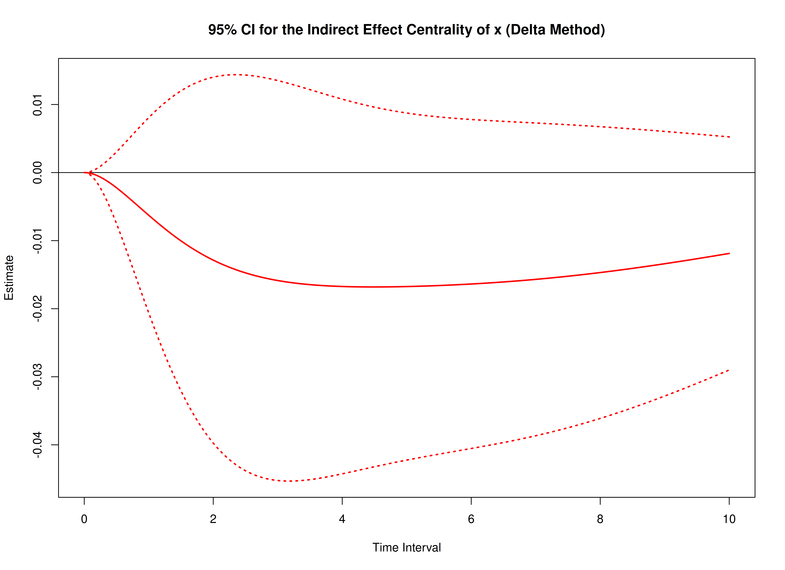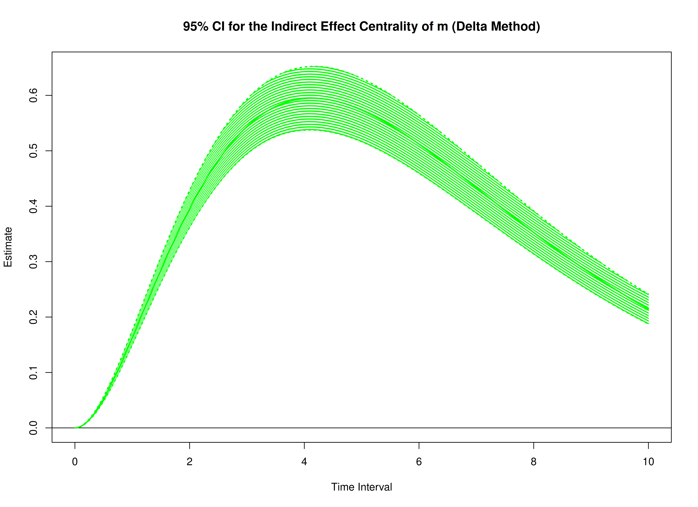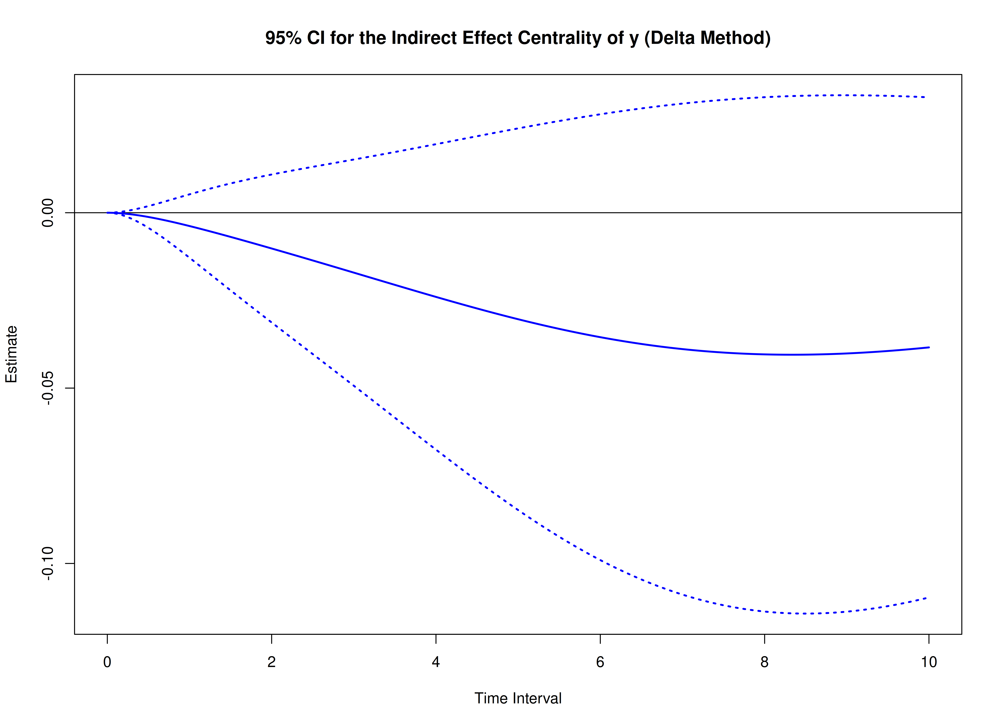

## Monte Carlo Method

The Monte Carlo method draws from the approximate sampling distribution
of the drift matrix and evaluates the centrality functions across those
draws.

``` r

start <- Sys.time()
mc_total <- MCTotalCentral(
  phi = phi,
  vcov_phi_vec = vcov_phi_vec,
  delta_t = delta_t,
  R = 20000L,
  ncores = parallel::detectCores() # use multiple cores
)
end <- Sys.time()
elapsed <- end - start
elapsed
#> Time difference of 13.88243 mins
```

``` r

summary(mc_total)
#> Call:
#> MCTotalCentral(phi = phi, vcov_phi_vec = vcov_phi_vec, delta_t = delta_t,
#>     R = 20000L, ncores = parallel::detectCores())
#>
#> Total Effect Centrality
#>      variable interval     est     se     R    2.5%  97.5%
#> 1           x   0.0010  0.0003 0.0000 20000  0.0002 0.0003
#> 2           m   0.0010  0.0007 0.0000 20000  0.0007 0.0008
#> 3           y   0.0010  0.0000 0.0000 20000 -0.0001 0.0000
#> 4           x   0.0100  0.0029 0.0003 20000  0.0023 0.0035
#> 5           m   0.0100  0.0074 0.0003 20000  0.0068 0.0080
#> 6           y   0.0100 -0.0003 0.0003 20000 -0.0009 0.0002
#> 7           x   0.0200  0.0058 0.0006 20000  0.0046 0.0070
#> 8           m   0.0200  0.0147 0.0006 20000  0.0135 0.0160
#> 9           y   0.0200 -0.0007 0.0006 20000 -0.0018 0.0005
#> 10          x   0.0300  0.0088 0.0009 20000  0.0069 0.0106
#> 11          m   0.0300  0.0219 0.0010 20000  0.0201 0.0238
#> 12          y   0.0300 -0.0010 0.0009 20000 -0.0027 0.0007
#> 13          x   0.0400  0.0117 0.0012 20000  0.0093 0.0142
#> 14          m   0.0400  0.0291 0.0013 20000  0.0266 0.0316
#> 15          y   0.0400 -0.0013 0.0012 20000 -0.0036 0.0010
#> 16          x   0.0501  0.0148 0.0015 20000  0.0118 0.0178
#> 17          m   0.0501  0.0361 0.0016 20000  0.0330 0.0392
#> 18          y   0.0501 -0.0017 0.0015 20000 -0.0045 0.0012
#> 19          x   0.0601  0.0178 0.0018 20000  0.0142 0.0214
#> 20          m   0.0601  0.0431 0.0019 20000  0.0394 0.0468
#> 21          y   0.0601 -0.0020 0.0018 20000 -0.0054 0.0014
#> 22          x   0.0701  0.0209 0.0021 20000  0.0168 0.0251
#> 23          m   0.0701  0.0500 0.0022 20000  0.0457 0.0542
#> 24          y   0.0701 -0.0023 0.0020 20000 -0.0063 0.0017
#> 25          x   0.0801  0.0241 0.0024 20000  0.0193 0.0288
#> 26          m   0.0801  0.0568 0.0025 20000  0.0520 0.0616
#> 27          y   0.0801 -0.0026 0.0023 20000 -0.0072 0.0019
#> 28          x   0.0901  0.0272 0.0027 20000  0.0220 0.0325
#> 29          m   0.0901  0.0635 0.0027 20000  0.0581 0.0689
#> 30          y   0.0901 -0.0030 0.0026 20000 -0.0081 0.0021
#> 31          x   0.1001  0.0304 0.0030 20000  0.0246 0.0362
#> 32          m   0.1001  0.0701 0.0030 20000  0.0642 0.0761
#> 33          y   0.1001 -0.0033 0.0029 20000 -0.0090 0.0024
#> 34          x   0.1101  0.0337 0.0032 20000  0.0273 0.0400
#> 35          m   0.1101  0.0767 0.0033 20000  0.0702 0.0831
#> 36          y   0.1101 -0.0036 0.0032 20000 -0.0099 0.0026
#> 37          x   0.1201  0.0369 0.0035 20000  0.0301 0.0438
#> 38          m   0.1201  0.0832 0.0036 20000  0.0761 0.0901
#> 39          y   0.1201 -0.0039 0.0035 20000 -0.0107 0.0028
#> 40          x   0.1301  0.0402 0.0038 20000  0.0328 0.0476
#> 41          m   0.1301  0.0895 0.0038 20000  0.0820 0.0971
#> 42          y   0.1301 -0.0042 0.0037 20000 -0.0116 0.0030
#> 43          x   0.1401  0.0436 0.0040 20000  0.0356 0.0514
#> 44          m   0.1401  0.0959 0.0041 20000  0.0878 0.1039
#> 45          y   0.1401 -0.0045 0.0040 20000 -0.0124 0.0033
#> 46          x   0.1502  0.0469 0.0043 20000  0.0385 0.0552
#> 47          m   0.1502  0.1021 0.0043 20000  0.0935 0.1106
#> 48          y   0.1502 -0.0048 0.0043 20000 -0.0133 0.0035
#> 49          x   0.1602  0.0503 0.0045 20000  0.0414 0.0591
#> 50          m   0.1602  0.1082 0.0046 20000  0.0992 0.1172
#> 51          y   0.1602 -0.0052 0.0046 20000 -0.0141 0.0037
#> 52          x   0.1702  0.0537 0.0048 20000  0.0443 0.0630
#> 53          m   0.1702  0.1143 0.0048 20000  0.1048 0.1238
#> 54          y   0.1702 -0.0055 0.0048 20000 -0.0150 0.0039
#> 55          x   0.1802  0.0571 0.0050 20000  0.0473 0.0669
#> 56          m   0.1802  0.1203 0.0051 20000  0.1103 0.1303
#> 57          y   0.1802 -0.0058 0.0051 20000 -0.0158 0.0041
#> 58          x   0.1902  0.0606 0.0052 20000  0.0503 0.0708
#> 59          m   0.1902  0.1262 0.0053 20000  0.1157 0.1366
#> 60          y   0.1902 -0.0061 0.0054 20000 -0.0166 0.0044
#> 61          x   0.2002  0.0641 0.0055 20000  0.0533 0.0748
#> 62          m   0.2002  0.1321 0.0055 20000  0.1211 0.1430
#> 63          y   0.2002 -0.0064 0.0056 20000 -0.0175 0.0046
#> 64          x   0.2102  0.0676 0.0057 20000  0.0564 0.0787
#> 65          m   0.2102  0.1379 0.0058 20000  0.1265 0.1492
#> 66          y   0.2102 -0.0067 0.0059 20000 -0.0183 0.0048
#> 67          x   0.2202  0.0712 0.0059 20000  0.0595 0.0827
#> 68          m   0.2202  0.1436 0.0060 20000  0.1317 0.1553
#> 69          y   0.2202 -0.0070 0.0062 20000 -0.0191 0.0050
#> 70          x   0.2302  0.0747 0.0062 20000  0.0626 0.0867
#> 71          m   0.2302  0.1492 0.0062 20000  0.1369 0.1613
#> 72          y   0.2302 -0.0073 0.0064 20000 -0.0199 0.0052
#> 73          x   0.2402  0.0783 0.0064 20000  0.0658 0.0907
#> 74          m   0.2402  0.1547 0.0064 20000  0.1420 0.1673
#> 75          y   0.2402 -0.0076 0.0067 20000 -0.0207 0.0054
#> 76          x   0.2503  0.0819 0.0066 20000  0.0690 0.0947
#> 77          m   0.2503  0.1602 0.0066 20000  0.1471 0.1732
#> 78          y   0.2503 -0.0078 0.0069 20000 -0.0215 0.0057
#> 79          x   0.2603  0.0855 0.0068 20000  0.0722 0.0988
#> 80          m   0.2603  0.1656 0.0069 20000  0.1521 0.1791
#> 81          y   0.2603 -0.0081 0.0072 20000 -0.0223 0.0059
#> 82          x   0.2703  0.0892 0.0070 20000  0.0754 0.1029
#> 83          m   0.2703  0.1710 0.0071 20000  0.1571 0.1848
#> 84          y   0.2703 -0.0084 0.0075 20000 -0.0231 0.0061
#> 85          x   0.2803  0.0929 0.0072 20000  0.0787 0.1069
#> 86          m   0.2803  0.1762 0.0073 20000  0.1619 0.1905
#> 87          y   0.2803 -0.0087 0.0077 20000 -0.0239 0.0063
#> 88          x   0.2903  0.0966 0.0074 20000  0.0820 0.1110
#> 89          m   0.2903  0.1814 0.0075 20000  0.1667 0.1961
#> 90          y   0.2903 -0.0090 0.0080 20000 -0.0247 0.0065
#> 91          x   0.3003  0.1003 0.0076 20000  0.0853 0.1151
#> 92          m   0.3003  0.1866 0.0076 20000  0.1715 0.2016
#> 93          y   0.3003 -0.0093 0.0082 20000 -0.0255 0.0067
#> 94          x   0.3103  0.1040 0.0078 20000  0.0887 0.1192
#> 95          m   0.3103  0.1916 0.0078 20000  0.1762 0.2070
#> 96          y   0.3103 -0.0096 0.0085 20000 -0.0262 0.0069
#> 97          x   0.3203  0.1078 0.0080 20000  0.0920 0.1233
#> 98          m   0.3203  0.1966 0.0080 20000  0.1808 0.2123
#> 99          y   0.3203 -0.0098 0.0087 20000 -0.0270 0.0071
#> 100         x   0.3303  0.1115 0.0082 20000  0.0954 0.1274
#> 101         m   0.3303  0.2016 0.0082 20000  0.1854 0.2176
#> 102         y   0.3303 -0.0101 0.0090 20000 -0.0277 0.0073
#> 103         x   0.3403  0.1153 0.0084 20000  0.0988 0.1316
#> 104         m   0.3403  0.2064 0.0084 20000  0.1899 0.2229
#> 105         y   0.3403 -0.0104 0.0092 20000 -0.0285 0.0075
#> 106         x   0.3504  0.1191 0.0086 20000  0.1023 0.1357
#> 107         m   0.3504  0.2112 0.0086 20000  0.1944 0.2280
#> 108         y   0.3504 -0.0107 0.0095 20000 -0.0293 0.0077
#> 109         x   0.3604  0.1229 0.0087 20000  0.1058 0.1399
#> 110         m   0.3604  0.2160 0.0087 20000  0.1988 0.2331
#> 111         y   0.3604 -0.0110 0.0097 20000 -0.0300 0.0079
#> 112         x   0.3704  0.1268 0.0089 20000  0.1093 0.1441
#> 113         m   0.3704  0.2206 0.0089 20000  0.2031 0.2381
#> 114         y   0.3704 -0.0112 0.0099 20000 -0.0307 0.0081
#> 115         x   0.3804  0.1306 0.0091 20000  0.1128 0.1483
#> 116         m   0.3804  0.2253 0.0091 20000  0.2074 0.2430
#> 117         y   0.3804 -0.0115 0.0102 20000 -0.0315 0.0083
#> 118         x   0.3904  0.1345 0.0093 20000  0.1163 0.1525
#> 119         m   0.3904  0.2298 0.0092 20000  0.2116 0.2479
#> 120         y   0.3904 -0.0118 0.0104 20000 -0.0322 0.0085
#> 121         x   0.4004  0.1384 0.0094 20000  0.1199 0.1567
#> 122         m   0.4004  0.2343 0.0094 20000  0.2157 0.2526
#> 123         y   0.4004 -0.0120 0.0107 20000 -0.0329 0.0087
#> 124         x   0.4104  0.1422 0.0096 20000  0.1234 0.1609
#> 125         m   0.4104  0.2387 0.0096 20000  0.2198 0.2573
#> 126         y   0.4104 -0.0123 0.0109 20000 -0.0336 0.0089
#> 127         x   0.4204  0.1461 0.0098 20000  0.1270 0.1651
#> 128         m   0.4204  0.2431 0.0097 20000  0.2239 0.2620
#> 129         y   0.4204 -0.0126 0.0111 20000 -0.0343 0.0091
#> 130         x   0.4304  0.1501 0.0099 20000  0.1306 0.1693
#> 131         m   0.4304  0.2474 0.0099 20000  0.2279 0.2666
#> 132         y   0.4304 -0.0128 0.0114 20000 -0.0351 0.0093
#> 133         x   0.4404  0.1540 0.0101 20000  0.1342 0.1736
#> 134         m   0.4404  0.2516 0.0100 20000  0.2318 0.2711
#> 135         y   0.4404 -0.0131 0.0116 20000 -0.0358 0.0095
#> 136         x   0.4505  0.1579 0.0102 20000  0.1378 0.1778
#> 137         m   0.4505  0.2558 0.0102 20000  0.2357 0.2756
#> 138         y   0.4505 -0.0133 0.0118 20000 -0.0365 0.0097
#> 139         x   0.4605  0.1619 0.0104 20000  0.1415 0.1821
#> 140         m   0.4605  0.2599 0.0103 20000  0.2395 0.2799
#> 141         y   0.4605 -0.0136 0.0120 20000 -0.0372 0.0099
#> 142         x   0.4705  0.1658 0.0105 20000  0.1451 0.1863
#> 143         m   0.4705  0.2640 0.0104 20000  0.2433 0.2843
#> 144         y   0.4705 -0.0138 0.0123 20000 -0.0379 0.0101
#> 145         x   0.4805  0.1698 0.0107 20000  0.1488 0.1906
#> 146         m   0.4805  0.2680 0.0106 20000  0.2471 0.2886
#> 147         y   0.4805 -0.0141 0.0125 20000 -0.0385 0.0103
#> 148         x   0.4905  0.1738 0.0108 20000  0.1525 0.1948
#> 149         m   0.4905  0.2719 0.0107 20000  0.2507 0.2928
#> 150         y   0.4905 -0.0144 0.0127 20000 -0.0392 0.0105
#> 151         x   0.5005  0.1778 0.0110 20000  0.1563 0.1991
#> 152         m   0.5005  0.2758 0.0108 20000  0.2544 0.2969
#> 153         y   0.5005 -0.0146 0.0129 20000 -0.0399 0.0107
#> 154         x   0.5105  0.1818 0.0111 20000  0.1600 0.2034
#> 155         m   0.5105  0.2796 0.0110 20000  0.2580 0.3011
#> 156         y   0.5105 -0.0149 0.0132 20000 -0.0406 0.0109
#> 157         x   0.5205  0.1858 0.0112 20000  0.1637 0.2076
#> 158         m   0.5205  0.2834 0.0111 20000  0.2615 0.3051
#> 159         y   0.5205 -0.0151 0.0134 20000 -0.0413 0.0110
#> 160         x   0.5305  0.1898 0.0114 20000  0.1674 0.2119
#> 161         m   0.5305  0.2872 0.0112 20000  0.2649 0.3091
#> 162         y   0.5305 -0.0153 0.0136 20000 -0.0419 0.0112
#> 163         x   0.5405  0.1938 0.0115 20000  0.1712 0.2162
#> 164         m   0.5405  0.2908 0.0114 20000  0.2684 0.3130
#> 165         y   0.5405 -0.0156 0.0138 20000 -0.0426 0.0114
#> 166         x   0.5506  0.1979 0.0116 20000  0.1750 0.2205
#> 167         m   0.5506  0.2944 0.0115 20000  0.2717 0.3169
#> 168         y   0.5506 -0.0158 0.0140 20000 -0.0432 0.0116
#> 169         x   0.5606  0.2019 0.0117 20000  0.1788 0.2248
#> 170         m   0.5606  0.2980 0.0116 20000  0.2751 0.3207
#> 171         y   0.5606 -0.0161 0.0142 20000 -0.0439 0.0118
#> 172         x   0.5706  0.2060 0.0119 20000  0.1826 0.2291
#> 173         m   0.5706  0.3015 0.0117 20000  0.2784 0.3244
#> 174         y   0.5706 -0.0163 0.0145 20000 -0.0445 0.0120
#> 175         x   0.5806  0.2100 0.0120 20000  0.1864 0.2334
#> 176         m   0.5806  0.3050 0.0118 20000  0.2816 0.3281
#> 177         y   0.5806 -0.0165 0.0147 20000 -0.0452 0.0121
#> 178         x   0.5906  0.2141 0.0121 20000  0.1902 0.2377
#> 179         m   0.5906  0.3084 0.0119 20000  0.2848 0.3317
#> 180         y   0.5906 -0.0168 0.0149 20000 -0.0458 0.0123
#> 181         x   0.6006  0.2181 0.0122 20000  0.1940 0.2421
#> 182         m   0.6006  0.3117 0.0120 20000  0.2879 0.3353
#> 183         y   0.6006 -0.0170 0.0151 20000 -0.0464 0.0125
#> 184         x   0.6106  0.2222 0.0123 20000  0.1979 0.2464
#> 185         m   0.6106  0.3150 0.0122 20000  0.2910 0.3388
#> 186         y   0.6106 -0.0172 0.0153 20000 -0.0471 0.0126
#> 187         x   0.6206  0.2263 0.0125 20000  0.2017 0.2507
#> 188         m   0.6206  0.3183 0.0123 20000  0.2941 0.3422
#> 189         y   0.6206 -0.0175 0.0155 20000 -0.0477 0.0129
#> 190         x   0.6306  0.2303 0.0126 20000  0.2055 0.2549
#> 191         m   0.6306  0.3215 0.0124 20000  0.2970 0.3456
#> 192         y   0.6306 -0.0177 0.0157 20000 -0.0484 0.0130
#> 193         x   0.6406  0.2344 0.0127 20000  0.2094 0.2592
#> 194         m   0.6406  0.3246 0.0125 20000  0.3000 0.3490
#> 195         y   0.6406 -0.0179 0.0159 20000 -0.0490 0.0132
#> 196         x   0.6507  0.2385 0.0128 20000  0.2132 0.2635
#> 197         m   0.6507  0.3278 0.0126 20000  0.3029 0.3523
#> 198         y   0.6507 -0.0182 0.0161 20000 -0.0496 0.0134
#> 199         x   0.6607  0.2426 0.0129 20000  0.2171 0.2678
#> 200         m   0.6607  0.3308 0.0127 20000  0.3058 0.3555
#> 201         y   0.6607 -0.0184 0.0163 20000 -0.0502 0.0136
#> 202         x   0.6707  0.2466 0.0130 20000  0.2210 0.2721
#> 203         m   0.6707  0.3338 0.0128 20000  0.3086 0.3587
#> 204         y   0.6707 -0.0186 0.0165 20000 -0.0508 0.0138
#> 205         x   0.6807  0.2507 0.0131 20000  0.2249 0.2764
#> 206         m   0.6807  0.3368 0.0129 20000  0.3114 0.3619
#> 207         y   0.6807 -0.0188 0.0167 20000 -0.0514 0.0139
#> 208         x   0.6907  0.2548 0.0132 20000  0.2288 0.2807
#> 209         m   0.6907  0.3397 0.0129 20000  0.3141 0.3650
#> 210         y   0.6907 -0.0191 0.0169 20000 -0.0520 0.0141
#> 211         x   0.7007  0.2589 0.0133 20000  0.2327 0.2850
#> 212         m   0.7007  0.3426 0.0130 20000  0.3168 0.3680
#> 213         y   0.7007 -0.0193 0.0171 20000 -0.0526 0.0142
#> 214         x   0.7107  0.2630 0.0134 20000  0.2366 0.2893
#> 215         m   0.7107  0.3454 0.0131 20000  0.3194 0.3710
#> 216         y   0.7107 -0.0195 0.0173 20000 -0.0532 0.0144
#> 217         x   0.7207  0.2671 0.0135 20000  0.2405 0.2936
#> 218         m   0.7207  0.3482 0.0132 20000  0.3220 0.3739
#> 219         y   0.7207 -0.0197 0.0175 20000 -0.0538 0.0146
#> 220         x   0.7307  0.2712 0.0136 20000  0.2443 0.2979
#> 221         m   0.7307  0.3509 0.0133 20000  0.3246 0.3769
#> 222         y   0.7307 -0.0199 0.0177 20000 -0.0544 0.0147
#> 223         x   0.7407  0.2753 0.0137 20000  0.2482 0.3022
#> 224         m   0.7407  0.3536 0.0134 20000  0.3271 0.3797
#> 225         y   0.7407 -0.0201 0.0179 20000 -0.0549 0.0148
#> 226         x   0.7508  0.2794 0.0138 20000  0.2521 0.3065
#> 227         m   0.7508  0.3562 0.0135 20000  0.3295 0.3825
#> 228         y   0.7508 -0.0203 0.0181 20000 -0.0555 0.0150
#> 229         x   0.7608  0.2834 0.0139 20000  0.2560 0.3108
#> 230         m   0.7608  0.3588 0.0135 20000  0.3320 0.3852
#> 231         y   0.7608 -0.0206 0.0183 20000 -0.0561 0.0151
#> 232         x   0.7708  0.2875 0.0140 20000  0.2599 0.3151
#> 233         m   0.7708  0.3614 0.0136 20000  0.3344 0.3879
#> 234         y   0.7708 -0.0208 0.0184 20000 -0.0566 0.0153
#> 235         x   0.7808  0.2916 0.0140 20000  0.2639 0.3193
#> 236         m   0.7808  0.3639 0.0137 20000  0.3367 0.3906
#> 237         y   0.7808 -0.0210 0.0186 20000 -0.0572 0.0155
#> 238         x   0.7908  0.2957 0.0141 20000  0.2678 0.3236
#> 239         m   0.7908  0.3664 0.0138 20000  0.3391 0.3932
#> 240         y   0.7908 -0.0212 0.0188 20000 -0.0578 0.0156
#> 241         x   0.8008  0.2998 0.0142 20000  0.2717 0.3279
#> 242         m   0.8008  0.3688 0.0138 20000  0.3413 0.3957
#> 243         y   0.8008 -0.0214 0.0190 20000 -0.0583 0.0158
#> 244         x   0.8108  0.3039 0.0143 20000  0.2757 0.3321
#> 245         m   0.8108  0.3712 0.0139 20000  0.3436 0.3982
#> 246         y   0.8108 -0.0216 0.0192 20000 -0.0589 0.0159
#> 247         x   0.8208  0.3079 0.0144 20000  0.2796 0.3363
#> 248         m   0.8208  0.3735 0.0140 20000  0.3458 0.4007
#> 249         y   0.8208 -0.0218 0.0194 20000 -0.0594 0.0161
#> 250         x   0.8308  0.3120 0.0145 20000  0.2836 0.3405
#> 251         m   0.8308  0.3758 0.0141 20000  0.3479 0.4032
#> 252         y   0.8308 -0.0220 0.0195 20000 -0.0600 0.0162
#> 253         x   0.8408  0.3161 0.0145 20000  0.2874 0.3447
#> 254         m   0.8408  0.3781 0.0141 20000  0.3501 0.4056
#> 255         y   0.8408 -0.0222 0.0197 20000 -0.0605 0.0163
#> 256         x   0.8509  0.3202 0.0146 20000  0.2913 0.3489
#> 257         m   0.8509  0.3803 0.0142 20000  0.3522 0.4079
#> 258         y   0.8509 -0.0224 0.0199 20000 -0.0610 0.0165
#> 259         x   0.8609  0.3242 0.0147 20000  0.2953 0.3531
#> 260         m   0.8609  0.3825 0.0143 20000  0.3542 0.4102
#> 261         y   0.8609 -0.0226 0.0201 20000 -0.0616 0.0167
#> 262         x   0.8709  0.3283 0.0148 20000  0.2991 0.3573
#> 263         m   0.8709  0.3846 0.0143 20000  0.3562 0.4125
#> 264         y   0.8709 -0.0228 0.0202 20000 -0.0621 0.0168
#> 265         x   0.8809  0.3323 0.0148 20000  0.3031 0.3615
#> 266         m   0.8809  0.3867 0.0144 20000  0.3581 0.4148
#> 267         y   0.8809 -0.0229 0.0204 20000 -0.0626 0.0169
#> 268         x   0.8909  0.3364 0.0149 20000  0.3069 0.3656
#> 269         m   0.8909  0.3888 0.0145 20000  0.3601 0.4170
#> 270         y   0.8909 -0.0231 0.0206 20000 -0.0631 0.0171
#> 271         x   0.9009  0.3404 0.0150 20000  0.3108 0.3698
#> 272         m   0.9009  0.3908 0.0145 20000  0.3620 0.4191
#> 273         y   0.9009 -0.0233 0.0208 20000 -0.0636 0.0173
#> 274         x   0.9109  0.3445 0.0151 20000  0.3147 0.3740
#> 275         m   0.9109  0.3928 0.0146 20000  0.3638 0.4211
#> 276         y   0.9109 -0.0235 0.0209 20000 -0.0641 0.0175
#> 277         x   0.9209  0.3485 0.0151 20000  0.3186 0.3782
#> 278         m   0.9209  0.3948 0.0146 20000  0.3657 0.4232
#> 279         y   0.9209 -0.0237 0.0211 20000 -0.0646 0.0176
#> 280         x   0.9309  0.3525 0.0152 20000  0.3224 0.3823
#> 281         m   0.9309  0.3967 0.0147 20000  0.3675 0.4252
#> 282         y   0.9309 -0.0239 0.0213 20000 -0.0651 0.0178
#> 283         x   0.9409  0.3566 0.0153 20000  0.3263 0.3865
#> 284         m   0.9409  0.3986 0.0147 20000  0.3693 0.4272
#> 285         y   0.9409 -0.0241 0.0214 20000 -0.0657 0.0180
#> 286         x   0.9510  0.3606 0.0153 20000  0.3303 0.3906
#> 287         m   0.9510  0.4004 0.0148 20000  0.3710 0.4292
#> 288         y   0.9510 -0.0242 0.0216 20000 -0.0662 0.0181
#> 289         x   0.9610  0.3646 0.0154 20000  0.3341 0.3947
#> 290         m   0.9610  0.4022 0.0149 20000  0.3727 0.4311
#> 291         y   0.9610 -0.0244 0.0218 20000 -0.0667 0.0183
#> 292         x   0.9710  0.3686 0.0155 20000  0.3381 0.3989
#> 293         m   0.9710  0.4040 0.0149 20000  0.3743 0.4330
#> 294         y   0.9710 -0.0246 0.0219 20000 -0.0672 0.0184
#> 295         x   0.9810  0.3726 0.0155 20000  0.3419 0.4030
#> 296         m   0.9810  0.4057 0.0150 20000  0.3760 0.4348
#> 297         y   0.9810 -0.0248 0.0221 20000 -0.0677 0.0186
#> 298         x   0.9910  0.3766 0.0156 20000  0.3458 0.4071
#> 299         m   0.9910  0.4074 0.0150 20000  0.3776 0.4366
#> 300         y   0.9910 -0.0250 0.0222 20000 -0.0682 0.0187
#> 301         x   1.0010  0.3806 0.0157 20000  0.3496 0.4112
#> 302         m   1.0010  0.4091 0.0151 20000  0.3791 0.4384
#> 303         y   1.0010 -0.0251 0.0224 20000 -0.0687 0.0188
#> 304         x   1.0110  0.3845 0.0157 20000  0.3534 0.4153
#> 305         m   1.0110  0.4107 0.0151 20000  0.3807 0.4401
#> 306         y   1.0110 -0.0253 0.0226 20000 -0.0691 0.0190
#> 307         x   1.0210  0.3885 0.0158 20000  0.3573 0.4194
#> 308         m   1.0210  0.4123 0.0152 20000  0.3822 0.4418
#> 309         y   1.0210 -0.0255 0.0227 20000 -0.0696 0.0191
#> 310         x   1.0310  0.3925 0.0158 20000  0.3612 0.4235
#> 311         m   1.0310  0.4139 0.0152 20000  0.3836 0.4434
#> 312         y   1.0310 -0.0257 0.0229 20000 -0.0702 0.0193
#> 313         x   1.0410  0.3964 0.0159 20000  0.3651 0.4275
#> 314         m   1.0410  0.4154 0.0153 20000  0.3851 0.4451
#> 315         y   1.0410 -0.0258 0.0230 20000 -0.0706 0.0194
#> 316         x   1.0511  0.4004 0.0160 20000  0.3689 0.4315
#> 317         m   1.0511  0.4169 0.0153 20000  0.3865 0.4467
#> 318         y   1.0511 -0.0260 0.0232 20000 -0.0710 0.0195
#> 319         x   1.0611  0.4043 0.0160 20000  0.3728 0.4356
#> 320         m   1.0611  0.4184 0.0153 20000  0.3879 0.4482
#> 321         y   1.0611 -0.0262 0.0233 20000 -0.0715 0.0197
#> 322         x   1.0711  0.4082 0.0161 20000  0.3766 0.4396
#> 323         m   1.0711  0.4198 0.0154 20000  0.3892 0.4497
#> 324         y   1.0711 -0.0263 0.0235 20000 -0.0720 0.0198
#> 325         x   1.0811  0.4121 0.0161 20000  0.3804 0.4436
#> 326         m   1.0811  0.4212 0.0154 20000  0.3905 0.4512
#> 327         y   1.0811 -0.0265 0.0236 20000 -0.0725 0.0199
#> 328         x   1.0911  0.4160 0.0162 20000  0.3842 0.4477
#> 329         m   1.0911  0.4226 0.0155 20000  0.3918 0.4527
#> 330         y   1.0911 -0.0266 0.0238 20000 -0.0729 0.0201
#> 331         x   1.1011  0.4199 0.0162 20000  0.3880 0.4517
#> 332         m   1.1011  0.4239 0.0155 20000  0.3931 0.4541
#> 333         y   1.1011 -0.0268 0.0239 20000 -0.0733 0.0202
#> 334         x   1.1111  0.4238 0.0163 20000  0.3917 0.4557
#> 335         m   1.1111  0.4253 0.0156 20000  0.3943 0.4555
#> 336         y   1.1111 -0.0270 0.0241 20000 -0.0738 0.0203
#> 337         x   1.1211  0.4277 0.0163 20000  0.3955 0.4596
#> 338         m   1.1211  0.4265 0.0156 20000  0.3955 0.4568
#> 339         y   1.1211 -0.0271 0.0242 20000 -0.0742 0.0205
#> 340         x   1.1311  0.4316 0.0164 20000  0.3992 0.4636
#> 341         m   1.1311  0.4278 0.0156 20000  0.3967 0.4581
#> 342         y   1.1311 -0.0273 0.0244 20000 -0.0747 0.0206
#> 343         x   1.1411  0.4354 0.0165 20000  0.4030 0.4676
#> 344         m   1.1411  0.4290 0.0157 20000  0.3978 0.4593
#> 345         y   1.1411 -0.0274 0.0245 20000 -0.0751 0.0207
#> 346         x   1.1512  0.4393 0.0165 20000  0.4068 0.4715
#> 347         m   1.1512  0.4302 0.0157 20000  0.3989 0.4606
#> 348         y   1.1512 -0.0276 0.0246 20000 -0.0755 0.0208
#> 349         x   1.1612  0.4431 0.0166 20000  0.4105 0.4755
#> 350         m   1.1612  0.4314 0.0157 20000  0.4000 0.4618
#> 351         y   1.1612 -0.0278 0.0248 20000 -0.0759 0.0210
#> 352         x   1.1712  0.4470 0.0166 20000  0.4142 0.4794
#> 353         m   1.1712  0.4325 0.0158 20000  0.4011 0.4631
#> 354         y   1.1712 -0.0279 0.0249 20000 -0.0764 0.0211
#> 355         x   1.1812  0.4508 0.0167 20000  0.4179 0.4833
#> 356         m   1.1812  0.4336 0.0158 20000  0.4021 0.4642
#> 357         y   1.1812 -0.0281 0.0251 20000 -0.0768 0.0212
#> 358         x   1.1912  0.4546 0.0167 20000  0.4217 0.4873
#> 359         m   1.1912  0.4347 0.0159 20000  0.4031 0.4653
#> 360         y   1.1912 -0.0282 0.0252 20000 -0.0772 0.0214
#> 361         x   1.2012  0.4584 0.0168 20000  0.4253 0.4912
#> 362         m   1.2012  0.4357 0.0159 20000  0.4040 0.4665
#> 363         y   1.2012 -0.0284 0.0253 20000 -0.0776 0.0215
#> 364         x   1.2112  0.4622 0.0168 20000  0.4290 0.4951
#> 365         m   1.2112  0.4367 0.0159 20000  0.4050 0.4675
#> 366         y   1.2112 -0.0285 0.0255 20000 -0.0780 0.0216
#> 367         x   1.2212  0.4659 0.0169 20000  0.4327 0.4990
#> 368         m   1.2212  0.4377 0.0160 20000  0.4059 0.4686
#> 369         y   1.2212 -0.0286 0.0256 20000 -0.0784 0.0217
#> 370         x   1.2312  0.4697 0.0169 20000  0.4363 0.5028
#> 371         m   1.2312  0.4387 0.0160 20000  0.4067 0.4696
#> 372         y   1.2312 -0.0288 0.0257 20000 -0.0788 0.0218
#> 373         x   1.2412  0.4734 0.0170 20000  0.4400 0.5067
#> 374         m   1.2412  0.4396 0.0160 20000  0.4076 0.4706
#> 375         y   1.2412 -0.0289 0.0259 20000 -0.0792 0.0219
#> 376         x   1.2513  0.4772 0.0170 20000  0.4436 0.5106
#> 377         m   1.2513  0.4406 0.0160 20000  0.4085 0.4715
#> 378         y   1.2513 -0.0291 0.0260 20000 -0.0796 0.0220
#> 379         x   1.2613  0.4809 0.0170 20000  0.4472 0.5143
#> 380         m   1.2613  0.4414 0.0161 20000  0.4094 0.4724
#> 381         y   1.2613 -0.0292 0.0261 20000 -0.0800 0.0221
#> 382         x   1.2713  0.4846 0.0171 20000  0.4508 0.5181
#> 383         m   1.2713  0.4423 0.0161 20000  0.4102 0.4734
#> 384         y   1.2713 -0.0294 0.0263 20000 -0.0804 0.0223
#> 385         x   1.2813  0.4883 0.0171 20000  0.4544 0.5219
#> 386         m   1.2813  0.4431 0.0161 20000  0.4110 0.4742
#> 387         y   1.2813 -0.0295 0.0264 20000 -0.0808 0.0224
#> 388         x   1.2913  0.4920 0.0172 20000  0.4580 0.5257
#> 389         m   1.2913  0.4439 0.0162 20000  0.4117 0.4751
#> 390         y   1.2913 -0.0296 0.0265 20000 -0.0811 0.0225
#> 391         x   1.3013  0.4957 0.0172 20000  0.4616 0.5294
#> 392         m   1.3013  0.4447 0.0162 20000  0.4125 0.4759
#> 393         y   1.3013 -0.0298 0.0267 20000 -0.0815 0.0226
#> 394         x   1.3113  0.4993 0.0173 20000  0.4652 0.5332
#> 395         m   1.3113  0.4455 0.0162 20000  0.4132 0.4767
#> 396         y   1.3113 -0.0299 0.0268 20000 -0.0818 0.0227
#> 397         x   1.3213  0.5030 0.0173 20000  0.4688 0.5370
#> 398         m   1.3213  0.4462 0.0162 20000  0.4139 0.4775
#> 399         y   1.3213 -0.0300 0.0269 20000 -0.0822 0.0228
#> 400         x   1.3313  0.5066 0.0174 20000  0.4723 0.5408
#> 401         m   1.3313  0.4469 0.0163 20000  0.4145 0.4783
#> 402         y   1.3313 -0.0302 0.0270 20000 -0.0826 0.0230
#> 403         x   1.3413  0.5102 0.0174 20000  0.4758 0.5445
#> 404         m   1.3413  0.4476 0.0163 20000  0.4152 0.4791
#> 405         y   1.3413 -0.0303 0.0271 20000 -0.0829 0.0231
#> 406         x   1.3514  0.5138 0.0175 20000  0.4793 0.5482
#> 407         m   1.3514  0.4483 0.0163 20000  0.4157 0.4798
#> 408         y   1.3514 -0.0304 0.0273 20000 -0.0833 0.0232
#> 409         x   1.3614  0.5174 0.0175 20000  0.4828 0.5519
#> 410         m   1.3614  0.4489 0.0163 20000  0.4163 0.4805
#> 411         y   1.3614 -0.0306 0.0274 20000 -0.0836 0.0233
#> 412         x   1.3714  0.5210 0.0175 20000  0.4863 0.5555
#> 413         m   1.3714  0.4496 0.0164 20000  0.4169 0.4811
#> 414         y   1.3714 -0.0307 0.0275 20000 -0.0839 0.0234
#> 415         x   1.3814  0.5246 0.0176 20000  0.4897 0.5591
#> 416         m   1.3814  0.4501 0.0164 20000  0.4174 0.4817
#> 417         y   1.3814 -0.0308 0.0276 20000 -0.0843 0.0235
#> 418         x   1.3914  0.5281 0.0176 20000  0.4931 0.5628
#> 419         m   1.3914  0.4507 0.0164 20000  0.4180 0.4824
#> 420         y   1.3914 -0.0309 0.0277 20000 -0.0847 0.0236
#> 421         x   1.4014  0.5317 0.0177 20000  0.4966 0.5664
#> 422         m   1.4014  0.4513 0.0164 20000  0.4185 0.4830
#> 423         y   1.4014 -0.0311 0.0279 20000 -0.0850 0.0236
#> 424         x   1.4114  0.5352 0.0177 20000  0.5001 0.5700
#> 425         m   1.4114  0.4518 0.0165 20000  0.4190 0.4835
#> 426         y   1.4114 -0.0312 0.0280 20000 -0.0854 0.0237
#> 427         x   1.4214  0.5387 0.0178 20000  0.5036 0.5736
#> 428         m   1.4214  0.4523 0.0165 20000  0.4195 0.4841
#> 429         y   1.4214 -0.0313 0.0281 20000 -0.0857 0.0238
#> 430         x   1.4314  0.5422 0.0178 20000  0.5070 0.5772
#> 431         m   1.4314  0.4528 0.0165 20000  0.4199 0.4846
#> 432         y   1.4314 -0.0314 0.0282 20000 -0.0861 0.0239
#> 433         x   1.4414  0.5457 0.0178 20000  0.5104 0.5808
#> 434         m   1.4414  0.4532 0.0165 20000  0.4203 0.4851
#> 435         y   1.4414 -0.0315 0.0283 20000 -0.0864 0.0240
#> 436         x   1.4515  0.5492 0.0179 20000  0.5137 0.5844
#> 437         m   1.4515  0.4537 0.0166 20000  0.4208 0.4856
#> 438         y   1.4515 -0.0317 0.0284 20000 -0.0868 0.0241
#> 439         x   1.4615  0.5526 0.0179 20000  0.5170 0.5879
#> 440         m   1.4615  0.4541 0.0166 20000  0.4211 0.4860
#> 441         y   1.4615 -0.0318 0.0285 20000 -0.0871 0.0242
#> 442         x   1.4715  0.5561 0.0180 20000  0.5204 0.5915
#> 443         m   1.4715  0.4545 0.0166 20000  0.4215 0.4865
#> 444         y   1.4715 -0.0319 0.0286 20000 -0.0874 0.0244
#> 445         x   1.4815  0.5595 0.0180 20000  0.5238 0.5951
#> 446         m   1.4815  0.4549 0.0166 20000  0.4218 0.4869
#> 447         y   1.4815 -0.0320 0.0287 20000 -0.0877 0.0245
#> 448         x   1.4915  0.5629 0.0181 20000  0.5271 0.5985
#> 449         m   1.4915  0.4552 0.0166 20000  0.4221 0.4873
#> 450         y   1.4915 -0.0321 0.0289 20000 -0.0881 0.0246
#> 451         x   1.5015  0.5663 0.0181 20000  0.5305 0.6020
#> 452         m   1.5015  0.4556 0.0167 20000  0.4224 0.4876
#> 453         y   1.5015 -0.0322 0.0290 20000 -0.0884 0.0247
#> 454         x   1.5115  0.5697 0.0181 20000  0.5338 0.6054
#> 455         m   1.5115  0.4559 0.0167 20000  0.4227 0.4880
#> 456         y   1.5115 -0.0323 0.0291 20000 -0.0887 0.0248
#> 457         x   1.5215  0.5730 0.0182 20000  0.5371 0.6089
#> 458         m   1.5215  0.4562 0.0167 20000  0.4229 0.4884
#> 459         y   1.5215 -0.0325 0.0292 20000 -0.0890 0.0249
#> 460         x   1.5315  0.5764 0.0182 20000  0.5403 0.6123
#> 461         m   1.5315  0.4565 0.0167 20000  0.4231 0.4887
#> 462         y   1.5315 -0.0326 0.0293 20000 -0.0893 0.0250
#> 463         x   1.5415  0.5797 0.0183 20000  0.5436 0.6157
#> 464         m   1.5415  0.4567 0.0167 20000  0.4234 0.4890
#> 465         y   1.5415 -0.0327 0.0294 20000 -0.0896 0.0251
#> 466         x   1.5516  0.5830 0.0183 20000  0.5468 0.6191
#> 467         m   1.5516  0.4570 0.0168 20000  0.4236 0.4893
#> 468         y   1.5516 -0.0328 0.0295 20000 -0.0899 0.0252
#> 469         x   1.5616  0.5863 0.0183 20000  0.5501 0.6225
#> 470         m   1.5616  0.4572 0.0168 20000  0.4237 0.4895
#> 471         y   1.5616 -0.0329 0.0296 20000 -0.0902 0.0252
#> 472         x   1.5716  0.5896 0.0184 20000  0.5533 0.6259
#> 473         m   1.5716  0.4574 0.0168 20000  0.4239 0.4898
#> 474         y   1.5716 -0.0330 0.0297 20000 -0.0905 0.0253
#> 475         x   1.5816  0.5929 0.0184 20000  0.5564 0.6293
#> 476         m   1.5816  0.4576 0.0168 20000  0.4240 0.4900
#> 477         y   1.5816 -0.0331 0.0298 20000 -0.0908 0.0254
#> 478         x   1.5916  0.5962 0.0185 20000  0.5596 0.6326
#> 479         m   1.5916  0.4577 0.0168 20000  0.4241 0.4901
#> 480         y   1.5916 -0.0332 0.0299 20000 -0.0911 0.0255
#> 481         x   1.6016  0.5994 0.0185 20000  0.5627 0.6360
#> 482         m   1.6016  0.4579 0.0168 20000  0.4242 0.4903
#> 483         y   1.6016 -0.0333 0.0300 20000 -0.0914 0.0256
#> 484         x   1.6116  0.6026 0.0186 20000  0.5658 0.6392
#> 485         m   1.6116  0.4580 0.0169 20000  0.4244 0.4905
#> 486         y   1.6116 -0.0334 0.0301 20000 -0.0917 0.0256
#> 487         x   1.6216  0.6058 0.0186 20000  0.5689 0.6425
#> 488         m   1.6216  0.4581 0.0169 20000  0.4245 0.4906
#> 489         y   1.6216 -0.0335 0.0302 20000 -0.0920 0.0257
#> 490         x   1.6316  0.6090 0.0186 20000  0.5720 0.6459
#> 491         m   1.6316  0.4582 0.0169 20000  0.4246 0.4908
#> 492         y   1.6316 -0.0336 0.0303 20000 -0.0923 0.0258
#> 493         x   1.6416  0.6122 0.0187 20000  0.5751 0.6492
#> 494         m   1.6416  0.4583 0.0169 20000  0.4246 0.4909
#> 495         y   1.6416 -0.0337 0.0304 20000 -0.0925 0.0258
#> 496         x   1.6517  0.6154 0.0187 20000  0.5782 0.6524
#> 497         m   1.6517  0.4584 0.0169 20000  0.4247 0.4910
#> 498         y   1.6517 -0.0338 0.0304 20000 -0.0928 0.0259
#> 499         x   1.6617  0.6185 0.0188 20000  0.5813 0.6557
#> 500         m   1.6617  0.4584 0.0169 20000  0.4247 0.4911
#> 501         y   1.6617 -0.0339 0.0305 20000 -0.0931 0.0260
#> 502         x   1.6717  0.6216 0.0188 20000  0.5844 0.6589
#> 503         m   1.6717  0.4584 0.0169 20000  0.4247 0.4912
#> 504         y   1.6717 -0.0340 0.0306 20000 -0.0934 0.0261
#> 505         x   1.6817  0.6248 0.0188 20000  0.5875 0.6621
#> 506         m   1.6817  0.4585 0.0170 20000  0.4246 0.4912
#> 507         y   1.6817 -0.0341 0.0307 20000 -0.0936 0.0262
#> 508         x   1.6917  0.6279 0.0189 20000  0.5905 0.6653
#> 509         m   1.6917  0.4585 0.0170 20000  0.4247 0.4912
#> 510         y   1.6917 -0.0342 0.0308 20000 -0.0939 0.0263
#> 511         x   1.7017  0.6309 0.0189 20000  0.5935 0.6685
#> 512         m   1.7017  0.4584 0.0170 20000  0.4246 0.4912
#> 513         y   1.7017 -0.0343 0.0309 20000 -0.0941 0.0264
#> 514         x   1.7117  0.6340 0.0190 20000  0.5964 0.6717
#> 515         m   1.7117  0.4584 0.0170 20000  0.4246 0.4913
#> 516         y   1.7117 -0.0343 0.0310 20000 -0.0944 0.0264
#> 517         x   1.7217  0.6370 0.0190 20000  0.5994 0.6748
#> 518         m   1.7217  0.4583 0.0170 20000  0.4245 0.4912
#> 519         y   1.7217 -0.0344 0.0311 20000 -0.0946 0.0265
#> 520         x   1.7317  0.6401 0.0190 20000  0.6023 0.6780
#> 521         m   1.7317  0.4583 0.0170 20000  0.4244 0.4912
#> 522         y   1.7317 -0.0345 0.0312 20000 -0.0949 0.0266
#> 523         x   1.7417  0.6431 0.0191 20000  0.6052 0.6811
#> 524         m   1.7417  0.4582 0.0170 20000  0.4243 0.4911
#> 525         y   1.7417 -0.0346 0.0312 20000 -0.0951 0.0267
#> 526         x   1.7518  0.6461 0.0191 20000  0.6082 0.6842
#> 527         m   1.7518  0.4581 0.0171 20000  0.4242 0.4911
#> 528         y   1.7518 -0.0347 0.0313 20000 -0.0953 0.0268
#> 529         x   1.7618  0.6491 0.0192 20000  0.6111 0.6872
#> 530         m   1.7618  0.4580 0.0171 20000  0.4240 0.4910
#> 531         y   1.7618 -0.0348 0.0314 20000 -0.0956 0.0269
#> 532         x   1.7718  0.6520 0.0192 20000  0.6141 0.6902
#> 533         m   1.7718  0.4579 0.0171 20000  0.4239 0.4909
#> 534         y   1.7718 -0.0349 0.0315 20000 -0.0958 0.0270
#> 535         x   1.7818  0.6550 0.0192 20000  0.6170 0.6933
#> 536         m   1.7818  0.4577 0.0171 20000  0.4237 0.4908
#> 537         y   1.7818 -0.0349 0.0316 20000 -0.0961 0.0271
#> 538         x   1.7918  0.6579 0.0193 20000  0.6199 0.6963
#> 539         m   1.7918  0.4576 0.0171 20000  0.4235 0.4907
#> 540         y   1.7918 -0.0350 0.0316 20000 -0.0963 0.0272
#> 541         x   1.8018  0.6608 0.0193 20000  0.6227 0.6993
#> 542         m   1.8018  0.4574 0.0171 20000  0.4233 0.4905
#> 543         y   1.8018 -0.0351 0.0317 20000 -0.0965 0.0273
#> 544         x   1.8118  0.6637 0.0194 20000  0.6255 0.7023
#> 545         m   1.8118  0.4572 0.0171 20000  0.4231 0.4904
#> 546         y   1.8118 -0.0352 0.0318 20000 -0.0967 0.0274
#> 547         x   1.8218  0.6666 0.0194 20000  0.6283 0.7052
#> 548         m   1.8218  0.4570 0.0171 20000  0.4229 0.4903
#> 549         y   1.8218 -0.0353 0.0319 20000 -0.0970 0.0274
#> 550         x   1.8318  0.6695 0.0194 20000  0.6310 0.7082
#> 551         m   1.8318  0.4568 0.0172 20000  0.4226 0.4901
#> 552         y   1.8318 -0.0353 0.0320 20000 -0.0972 0.0275
#> 553         x   1.8418  0.6723 0.0195 20000  0.6338 0.7111
#> 554         m   1.8418  0.4566 0.0172 20000  0.4223 0.4898
#> 555         y   1.8418 -0.0354 0.0320 20000 -0.0974 0.0276
#> 556         x   1.8519  0.6752 0.0195 20000  0.6367 0.7140
#> 557         m   1.8519  0.4563 0.0172 20000  0.4221 0.4896
#> 558         y   1.8519 -0.0355 0.0321 20000 -0.0976 0.0277
#> 559         x   1.8619  0.6780 0.0196 20000  0.6394 0.7169
#> 560         m   1.8619  0.4561 0.0172 20000  0.4218 0.4894
#> 561         y   1.8619 -0.0356 0.0322 20000 -0.0978 0.0278
#> 562         x   1.8719  0.6808 0.0196 20000  0.6421 0.7199
#> 563         m   1.8719  0.4558 0.0172 20000  0.4215 0.4892
#> 564         y   1.8719 -0.0356 0.0323 20000 -0.0980 0.0278
#> 565         x   1.8819  0.6835 0.0196 20000  0.6448 0.7228
#> 566         m   1.8819  0.4556 0.0172 20000  0.4212 0.4889
#> 567         y   1.8819 -0.0357 0.0323 20000 -0.0982 0.0279
#> 568         x   1.8919  0.6863 0.0197 20000  0.6476 0.7256
#> 569         m   1.8919  0.4553 0.0172 20000  0.4209 0.4886
#> 570         y   1.8919 -0.0358 0.0324 20000 -0.0984 0.0280
#> 571         x   1.9019  0.6891 0.0197 20000  0.6503 0.7285
#> 572         m   1.9019  0.4550 0.0172 20000  0.4206 0.4883
#> 573         y   1.9019 -0.0359 0.0325 20000 -0.0986 0.0281
#> 574         x   1.9119  0.6918 0.0198 20000  0.6530 0.7313
#> 575         m   1.9119  0.4547 0.0172 20000  0.4203 0.4880
#> 576         y   1.9119 -0.0359 0.0325 20000 -0.0988 0.0282
#> 577         x   1.9219  0.6945 0.0198 20000  0.6556 0.7341
#> 578         m   1.9219  0.4543 0.0173 20000  0.4199 0.4877
#> 579         y   1.9219 -0.0360 0.0326 20000 -0.0990 0.0283
#> 580         x   1.9319  0.6972 0.0198 20000  0.6582 0.7369
#> 581         m   1.9319  0.4540 0.0173 20000  0.4195 0.4874
#> 582         y   1.9319 -0.0361 0.0327 20000 -0.0992 0.0283
#> 583         x   1.9419  0.6999 0.0199 20000  0.6608 0.7396
#> 584         m   1.9419  0.4536 0.0173 20000  0.4191 0.4871
#> 585         y   1.9419 -0.0361 0.0328 20000 -0.0994 0.0284
#> 586         x   1.9520  0.7025 0.0199 20000  0.6634 0.7424
#> 587         m   1.9520  0.4533 0.0173 20000  0.4187 0.4868
#> 588         y   1.9520 -0.0362 0.0328 20000 -0.0996 0.0284
#> 589         x   1.9620  0.7052 0.0200 20000  0.6660 0.7451
#> 590         m   1.9620  0.4529 0.0173 20000  0.4183 0.4864
#> 591         y   1.9620 -0.0363 0.0329 20000 -0.0998 0.0285
#> 592         x   1.9720  0.7078 0.0200 20000  0.6686 0.7479
#> 593         m   1.9720  0.4525 0.0173 20000  0.4180 0.4860
#> 594         y   1.9720 -0.0363 0.0330 20000 -0.0999 0.0286
#> 595         x   1.9820  0.7104 0.0201 20000  0.6712 0.7505
#> 596         m   1.9820  0.4521 0.0173 20000  0.4175 0.4856
#> 597         y   1.9820 -0.0364 0.0330 20000 -0.1001 0.0287
#> 598         x   1.9920  0.7130 0.0201 20000  0.6738 0.7532
#> 599         m   1.9920  0.4517 0.0173 20000  0.4172 0.4852
#> 600         y   1.9920 -0.0365 0.0331 20000 -0.1003 0.0288
#> 601         x   2.0020  0.7156 0.0201 20000  0.6763 0.7558
#> 602         m   2.0020  0.4513 0.0173 20000  0.4167 0.4849
#> 603         y   2.0020 -0.0365 0.0331 20000 -0.1005 0.0288
#> 604         x   2.0120  0.7181 0.0202 20000  0.6788 0.7584
#> 605         m   2.0120  0.4509 0.0173 20000  0.4163 0.4845
#> 606         y   2.0120 -0.0366 0.0332 20000 -0.1006 0.0289
#> 607         x   2.0220  0.7207 0.0202 20000  0.6813 0.7610
#> 608         m   2.0220  0.4504 0.0174 20000  0.4158 0.4841
#> 609         y   2.0220 -0.0367 0.0333 20000 -0.1008 0.0289
#> 610         x   2.0320  0.7232 0.0203 20000  0.6837 0.7636
#> 611         m   2.0320  0.4500 0.0174 20000  0.4153 0.4836
#> 612         y   2.0320 -0.0367 0.0333 20000 -0.1010 0.0289
#> 613         x   2.0420  0.7257 0.0203 20000  0.6861 0.7662
#> 614         m   2.0420  0.4495 0.0174 20000  0.4148 0.4832
#> 615         y   2.0420 -0.0368 0.0334 20000 -0.1012 0.0290
#> 616         x   2.0521  0.7282 0.0203 20000  0.6886 0.7688
#> 617         m   2.0521  0.4491 0.0174 20000  0.4144 0.4827
#> 618         y   2.0521 -0.0368 0.0334 20000 -0.1013 0.0291
#> 619         x   2.0621  0.7306 0.0204 20000  0.6910 0.7714
#> 620         m   2.0621  0.4486 0.0174 20000  0.4139 0.4823
#> 621         y   2.0621 -0.0369 0.0335 20000 -0.1015 0.0292
#> 622         x   2.0721  0.7331 0.0204 20000  0.6934 0.7739
#> 623         m   2.0721  0.4481 0.0174 20000  0.4134 0.4818
#> 624         y   2.0721 -0.0369 0.0336 20000 -0.1017 0.0293
#> 625         x   2.0821  0.7355 0.0205 20000  0.6959 0.7763
#> 626         m   2.0821  0.4476 0.0174 20000  0.4129 0.4813
#> 627         y   2.0821 -0.0370 0.0336 20000 -0.1019 0.0293
#> 628         x   2.0921  0.7379 0.0205 20000  0.6982 0.7788
#> 629         m   2.0921  0.4471 0.0174 20000  0.4124 0.4808
#> 630         y   2.0921 -0.0371 0.0337 20000 -0.1020 0.0294
#> 631         x   2.1021  0.7404 0.0205 20000  0.7005 0.7813
#> 632         m   2.1021  0.4466 0.0174 20000  0.4119 0.4803
#> 633         y   2.1021 -0.0371 0.0337 20000 -0.1022 0.0295
#> 634         x   2.1121  0.7427 0.0206 20000  0.7028 0.7838
#> 635         m   2.1121  0.4460 0.0174 20000  0.4113 0.4798
#> 636         y   2.1121 -0.0372 0.0338 20000 -0.1024 0.0295
#> 637         x   2.1221  0.7451 0.0206 20000  0.7051 0.7863
#> 638         m   2.1221  0.4455 0.0174 20000  0.4108 0.4793
#> 639         y   2.1221 -0.0372 0.0338 20000 -0.1025 0.0296
#> 640         x   2.1321  0.7474 0.0207 20000  0.7073 0.7888
#> 641         m   2.1321  0.4449 0.0175 20000  0.4101 0.4787
#> 642         y   2.1321 -0.0373 0.0339 20000 -0.1027 0.0296
#> 643         x   2.1421  0.7498 0.0207 20000  0.7096 0.7912
#> 644         m   2.1421  0.4444 0.0175 20000  0.4096 0.4782
#> 645         y   2.1421 -0.0373 0.0340 20000 -0.1029 0.0297
#> 646         x   2.1522  0.7521 0.0207 20000  0.7118 0.7936
#> 647         m   2.1522  0.4438 0.0175 20000  0.4090 0.4776
#> 648         y   2.1522 -0.0374 0.0340 20000 -0.1030 0.0297
#> 649         x   2.1622  0.7544 0.0208 20000  0.7140 0.7960
#> 650         m   2.1622  0.4433 0.0175 20000  0.4084 0.4770
#> 651         y   2.1622 -0.0374 0.0341 20000 -0.1032 0.0298
#> 652         x   2.1722  0.7567 0.0208 20000  0.7162 0.7985
#> 653         m   2.1722  0.4427 0.0175 20000  0.4078 0.4765
#> 654         y   2.1722 -0.0375 0.0341 20000 -0.1033 0.0298
#> 655         x   2.1822  0.7589 0.0209 20000  0.7183 0.8009
#> 656         m   2.1822  0.4421 0.0175 20000  0.4072 0.4759
#> 657         y   2.1822 -0.0375 0.0342 20000 -0.1035 0.0299
#> 658         x   2.1922  0.7612 0.0209 20000  0.7205 0.8032
#> 659         m   2.1922  0.4415 0.0175 20000  0.4066 0.4753
#> 660         y   2.1922 -0.0376 0.0342 20000 -0.1036 0.0299
#> 661         x   2.2022  0.7634 0.0209 20000  0.7226 0.8054
#> 662         m   2.2022  0.4409 0.0175 20000  0.4059 0.4747
#> 663         y   2.2022 -0.0376 0.0343 20000 -0.1038 0.0300
#> 664         x   2.2122  0.7656 0.0210 20000  0.7248 0.8077
#> 665         m   2.2122  0.4403 0.0175 20000  0.4053 0.4741
#> 666         y   2.2122 -0.0376 0.0343 20000 -0.1039 0.0300
#> 667         x   2.2222  0.7678 0.0210 20000  0.7270 0.8100
#> 668         m   2.2222  0.4396 0.0175 20000  0.4047 0.4735
#> 669         y   2.2222 -0.0377 0.0343 20000 -0.1041 0.0300
#> 670         x   2.2322  0.7700 0.0211 20000  0.7291 0.8123
#> 671         m   2.2322  0.4390 0.0175 20000  0.4041 0.4729
#> 672         y   2.2322 -0.0377 0.0344 20000 -0.1042 0.0301
#> 673         x   2.2422  0.7721 0.0211 20000  0.7311 0.8146
#> 674         m   2.2422  0.4384 0.0175 20000  0.4034 0.4722
#> 675         y   2.2422 -0.0378 0.0344 20000 -0.1043 0.0302
#> 676         x   2.2523  0.7743 0.0211 20000  0.7332 0.8168
#> 677         m   2.2523  0.4377 0.0176 20000  0.4027 0.4716
#> 678         y   2.2523 -0.0378 0.0345 20000 -0.1044 0.0302
#> 679         x   2.2623  0.7764 0.0212 20000  0.7353 0.8190
#> 680         m   2.2623  0.4371 0.0176 20000  0.4021 0.4710
#> 681         y   2.2623 -0.0379 0.0345 20000 -0.1046 0.0303
#> 682         x   2.2723  0.7785 0.0212 20000  0.7373 0.8211
#> 683         m   2.2723  0.4364 0.0176 20000  0.4013 0.4703
#> 684         y   2.2723 -0.0379 0.0346 20000 -0.1047 0.0303
#> 685         x   2.2823  0.7806 0.0213 20000  0.7393 0.8232
#> 686         m   2.2823  0.4357 0.0176 20000  0.4006 0.4696
#> 687         y   2.2823 -0.0379 0.0346 20000 -0.1048 0.0304
#> 688         x   2.2923  0.7827 0.0213 20000  0.7413 0.8254
#> 689         m   2.2923  0.4350 0.0176 20000  0.4000 0.4690
#> 690         y   2.2923 -0.0380 0.0347 20000 -0.1049 0.0304
#> 691         x   2.3023  0.7847 0.0213 20000  0.7432 0.8275
#> 692         m   2.3023  0.4344 0.0176 20000  0.3993 0.4683
#> 693         y   2.3023 -0.0380 0.0347 20000 -0.1050 0.0305
#> 694         x   2.3123  0.7868 0.0214 20000  0.7452 0.8295
#> 695         m   2.3123  0.4337 0.0176 20000  0.3986 0.4676
#> 696         y   2.3123 -0.0381 0.0347 20000 -0.1051 0.0305
#> 697         x   2.3223  0.7888 0.0214 20000  0.7471 0.8317
#> 698         m   2.3223  0.4330 0.0176 20000  0.3979 0.4669
#> 699         y   2.3223 -0.0381 0.0348 20000 -0.1052 0.0306
#> 700         x   2.3323  0.7908 0.0215 20000  0.7490 0.8338
#> 701         m   2.3323  0.4323 0.0176 20000  0.3972 0.4662
#> 702         y   2.3323 -0.0381 0.0348 20000 -0.1053 0.0307
#> 703         x   2.3423  0.7928 0.0215 20000  0.7510 0.8358
#> 704         m   2.3423  0.4315 0.0176 20000  0.3965 0.4655
#> 705         y   2.3423 -0.0382 0.0349 20000 -0.1054 0.0307
#> 706         x   2.3524  0.7948 0.0215 20000  0.7529 0.8378
#> 707         m   2.3524  0.4308 0.0176 20000  0.3957 0.4648
#> 708         y   2.3524 -0.0382 0.0349 20000 -0.1055 0.0308
#> 709         x   2.3624  0.7967 0.0216 20000  0.7548 0.8398
#> 710         m   2.3624  0.4301 0.0176 20000  0.3950 0.4640
#> 711         y   2.3624 -0.0382 0.0349 20000 -0.1056 0.0308
#> 712         x   2.3724  0.7987 0.0216 20000  0.7566 0.8419
#> 713         m   2.3724  0.4294 0.0176 20000  0.3942 0.4633
#> 714         y   2.3724 -0.0383 0.0350 20000 -0.1057 0.0309
#> 715         x   2.3824  0.8006 0.0217 20000  0.7584 0.8439
#> 716         m   2.3824  0.4286 0.0176 20000  0.3934 0.4625
#> 717         y   2.3824 -0.0383 0.0350 20000 -0.1058 0.0309
#> 718         x   2.3924  0.8025 0.0217 20000  0.7603 0.8460
#> 719         m   2.3924  0.4279 0.0177 20000  0.3927 0.4618
#> 720         y   2.3924 -0.0383 0.0350 20000 -0.1059 0.0310
#> 721         x   2.4024  0.8044 0.0217 20000  0.7621 0.8479
#> 722         m   2.4024  0.4271 0.0177 20000  0.3919 0.4611
#> 723         y   2.4024 -0.0384 0.0351 20000 -0.1060 0.0310
#> 724         x   2.4124  0.8062 0.0218 20000  0.7640 0.8499
#> 725         m   2.4124  0.4264 0.0177 20000  0.3912 0.4603
#> 726         y   2.4124 -0.0384 0.0351 20000 -0.1061 0.0310
#> 727         x   2.4224  0.8081 0.0218 20000  0.7658 0.8518
#> 728         m   2.4224  0.4256 0.0177 20000  0.3905 0.4596
#> 729         y   2.4224 -0.0384 0.0352 20000 -0.1061 0.0311
#> 730         x   2.4324  0.8099 0.0219 20000  0.7676 0.8537
#> 731         m   2.4324  0.4248 0.0177 20000  0.3897 0.4588
#> 732         y   2.4324 -0.0384 0.0352 20000 -0.1062 0.0311
#> 733         x   2.4424  0.8117 0.0219 20000  0.7693 0.8556
#> 734         m   2.4424  0.4241 0.0177 20000  0.3889 0.4581
#> 735         y   2.4424 -0.0385 0.0352 20000 -0.1063 0.0311
#> 736         x   2.4525  0.8135 0.0219 20000  0.7710 0.8575
#> 737         m   2.4525  0.4233 0.0177 20000  0.3881 0.4573
#> 738         y   2.4525 -0.0385 0.0353 20000 -0.1064 0.0311
#> 739         x   2.4625  0.8153 0.0220 20000  0.7727 0.8594
#> 740         m   2.4625  0.4225 0.0177 20000  0.3873 0.4565
#> 741         y   2.4625 -0.0385 0.0353 20000 -0.1065 0.0311
#> 742         x   2.4725  0.8171 0.0220 20000  0.7745 0.8612
#> 743         m   2.4725  0.4217 0.0177 20000  0.3865 0.4558
#> 744         y   2.4725 -0.0386 0.0353 20000 -0.1065 0.0312
#> 745         x   2.4825  0.8188 0.0220 20000  0.7762 0.8630
#> 746         m   2.4825  0.4209 0.0177 20000  0.3857 0.4550
#> 747         y   2.4825 -0.0386 0.0353 20000 -0.1066 0.0312
#> 748         x   2.4925  0.8206 0.0221 20000  0.7778 0.8648
#> 749         m   2.4925  0.4201 0.0177 20000  0.3849 0.4542
#> 750         y   2.4925 -0.0386 0.0354 20000 -0.1066 0.0312
#> 751         x   2.5025  0.8223 0.0221 20000  0.7794 0.8666
#> 752         m   2.5025  0.4193 0.0177 20000  0.3841 0.4534
#> 753         y   2.5025 -0.0386 0.0354 20000 -0.1066 0.0313
#> 754         x   2.5125  0.8240 0.0222 20000  0.7810 0.8683
#> 755         m   2.5125  0.4185 0.0177 20000  0.3832 0.4526
#> 756         y   2.5125 -0.0386 0.0354 20000 -0.1067 0.0313
#> 757         x   2.5225  0.8257 0.0222 20000  0.7825 0.8701
#> 758         m   2.5225  0.4177 0.0177 20000  0.3824 0.4518
#> 759         y   2.5225 -0.0387 0.0355 20000 -0.1068 0.0313
#> 760         x   2.5325  0.8273 0.0222 20000  0.7842 0.8719
#> 761         m   2.5325  0.4168 0.0177 20000  0.3816 0.4510
#> 762         y   2.5325 -0.0387 0.0355 20000 -0.1069 0.0314
#> 763         x   2.5425  0.8290 0.0223 20000  0.7857 0.8736
#> 764         m   2.5425  0.4160 0.0177 20000  0.3808 0.4502
#> 765         y   2.5425 -0.0387 0.0355 20000 -0.1070 0.0314
#> 766         x   2.5526  0.8306 0.0223 20000  0.7873 0.8752
#> 767         m   2.5526  0.4152 0.0178 20000  0.3799 0.4494
#> 768         y   2.5526 -0.0387 0.0355 20000 -0.1070 0.0314
#> 769         x   2.5626  0.8323 0.0223 20000  0.7888 0.8769
#> 770         m   2.5626  0.4144 0.0178 20000  0.3791 0.4486
#> 771         y   2.5626 -0.0388 0.0356 20000 -0.1071 0.0315
#> 772         x   2.5726  0.8339 0.0224 20000  0.7904 0.8786
#> 773         m   2.5726  0.4135 0.0178 20000  0.3782 0.4477
#> 774         y   2.5726 -0.0388 0.0356 20000 -0.1072 0.0315
#> 775         x   2.5826  0.8354 0.0224 20000  0.7919 0.8802
#> 776         m   2.5826  0.4127 0.0178 20000  0.3773 0.4469
#> 777         y   2.5826 -0.0388 0.0356 20000 -0.1072 0.0315
#> 778         x   2.5926  0.8370 0.0225 20000  0.7934 0.8819
#> 779         m   2.5926  0.4118 0.0178 20000  0.3765 0.4461
#> 780         y   2.5926 -0.0388 0.0356 20000 -0.1073 0.0315
#> 781         x   2.6026  0.8386 0.0225 20000  0.7949 0.8834
#> 782         m   2.6026  0.4110 0.0178 20000  0.3756 0.4453
#> 783         y   2.6026 -0.0388 0.0357 20000 -0.1073 0.0316
#> 784         x   2.6126  0.8401 0.0225 20000  0.7964 0.8850
#> 785         m   2.6126  0.4101 0.0178 20000  0.3747 0.4444
#> 786         y   2.6126 -0.0388 0.0357 20000 -0.1074 0.0316
#> 787         x   2.6226  0.8416 0.0226 20000  0.7978 0.8866
#> 788         m   2.6226  0.4092 0.0178 20000  0.3738 0.4436
#> 789         y   2.6226 -0.0389 0.0357 20000 -0.1075 0.0316
#> 790         x   2.6326  0.8431 0.0226 20000  0.7993 0.8882
#> 791         m   2.6326  0.4084 0.0178 20000  0.3730 0.4427
#> 792         y   2.6326 -0.0389 0.0357 20000 -0.1075 0.0316
#> 793         x   2.6426  0.8446 0.0226 20000  0.8007 0.8897
#> 794         m   2.6426  0.4075 0.0178 20000  0.3721 0.4418
#> 795         y   2.6426 -0.0389 0.0357 20000 -0.1076 0.0316
#> 796         x   2.6527  0.8461 0.0227 20000  0.8021 0.8912
#> 797         m   2.6527  0.4066 0.0178 20000  0.3712 0.4410
#> 798         y   2.6527 -0.0389 0.0358 20000 -0.1076 0.0317
#> 799         x   2.6627  0.8475 0.0227 20000  0.8036 0.8927
#> 800         m   2.6627  0.4057 0.0178 20000  0.3703 0.4401
#> 801         y   2.6627 -0.0389 0.0358 20000 -0.1077 0.0317
#> 802         x   2.6727  0.8490 0.0227 20000  0.8049 0.8943
#> 803         m   2.6727  0.4049 0.0178 20000  0.3695 0.4393
#> 804         y   2.6727 -0.0389 0.0358 20000 -0.1077 0.0317
#> 805         x   2.6827  0.8504 0.0228 20000  0.8063 0.8958
#> 806         m   2.6827  0.4040 0.0178 20000  0.3686 0.4384
#> 807         y   2.6827 -0.0389 0.0358 20000 -0.1077 0.0318
#> 808         x   2.6927  0.8518 0.0228 20000  0.8076 0.8973
#> 809         m   2.6927  0.4031 0.0178 20000  0.3677 0.4375
#> 810         y   2.6927 -0.0390 0.0358 20000 -0.1078 0.0318
#> 811         x   2.7027  0.8532 0.0229 20000  0.8090 0.8987
#> 812         m   2.7027  0.4022 0.0178 20000  0.3668 0.4367
#> 813         y   2.7027 -0.0390 0.0359 20000 -0.1078 0.0318
#> 814         x   2.7127  0.8546 0.0229 20000  0.8103 0.9002
#> 815         m   2.7127  0.4013 0.0178 20000  0.3659 0.4358
#> 816         y   2.7127 -0.0390 0.0359 20000 -0.1078 0.0319
#> 817         x   2.7227  0.8559 0.0229 20000  0.8116 0.9015
#> 818         m   2.7227  0.4004 0.0178 20000  0.3650 0.4349
#> 819         y   2.7227 -0.0390 0.0359 20000 -0.1079 0.0319
#> 820         x   2.7327  0.8573 0.0230 20000  0.8129 0.9029
#> 821         m   2.7327  0.3995 0.0179 20000  0.3641 0.4341
#> 822         y   2.7327 -0.0390 0.0359 20000 -0.1079 0.0319
#> 823         x   2.7427  0.8586 0.0230 20000  0.8142 0.9043
#> 824         m   2.7427  0.3986 0.0179 20000  0.3632 0.4332
#> 825         y   2.7427 -0.0390 0.0359 20000 -0.1079 0.0320
#> 826         x   2.7528  0.8599 0.0230 20000  0.8155 0.9057
#> 827         m   2.7528  0.3976 0.0179 20000  0.3622 0.4323
#> 828         y   2.7528 -0.0390 0.0359 20000 -0.1079 0.0320
#> 829         x   2.7628  0.8612 0.0231 20000  0.8168 0.9070
#> 830         m   2.7628  0.3967 0.0179 20000  0.3613 0.4314
#> 831         y   2.7628 -0.0390 0.0360 20000 -0.1080 0.0320
#> 832         x   2.7728  0.8625 0.0231 20000  0.8180 0.9083
#> 833         m   2.7728  0.3958 0.0179 20000  0.3604 0.4305
#> 834         y   2.7728 -0.0390 0.0360 20000 -0.1081 0.0320
#> 835         x   2.7828  0.8638 0.0231 20000  0.8191 0.9097
#> 836         m   2.7828  0.3949 0.0179 20000  0.3594 0.4296
#> 837         y   2.7828 -0.0390 0.0360 20000 -0.1081 0.0320
#> 838         x   2.7928  0.8650 0.0232 20000  0.8203 0.9111
#> 839         m   2.7928  0.3940 0.0179 20000  0.3585 0.4287
#> 840         y   2.7928 -0.0390 0.0360 20000 -0.1081 0.0320
#> 841         x   2.8028  0.8662 0.0232 20000  0.8215 0.9124
#> 842         m   2.8028  0.3930 0.0179 20000  0.3576 0.4278
#> 843         y   2.8028 -0.0390 0.0360 20000 -0.1081 0.0320
#> 844         x   2.8128  0.8675 0.0232 20000  0.8227 0.9136
#> 845         m   2.8128  0.3921 0.0179 20000  0.3567 0.4268
#> 846         y   2.8128 -0.0391 0.0360 20000 -0.1082 0.0320
#> 847         x   2.8228  0.8687 0.0233 20000  0.8238 0.9149
#> 848         m   2.8228  0.3912 0.0179 20000  0.3557 0.4259
#> 849         y   2.8228 -0.0391 0.0360 20000 -0.1082 0.0321
#> 850         x   2.8328  0.8699 0.0233 20000  0.8249 0.9162
#> 851         m   2.8328  0.3902 0.0179 20000  0.3548 0.4250
#> 852         y   2.8328 -0.0391 0.0360 20000 -0.1082 0.0321
#> 853         x   2.8428  0.8710 0.0233 20000  0.8261 0.9174
#> 854         m   2.8428  0.3893 0.0179 20000  0.3539 0.4241
#> 855         y   2.8428 -0.0391 0.0360 20000 -0.1082 0.0321
#> 856         x   2.8529  0.8722 0.0234 20000  0.8272 0.9186
#> 857         m   2.8529  0.3884 0.0179 20000  0.3530 0.4231
#> 858         y   2.8529 -0.0391 0.0361 20000 -0.1083 0.0321
#> 859         x   2.8629  0.8733 0.0234 20000  0.8283 0.9198
#> 860         m   2.8629  0.3874 0.0179 20000  0.3520 0.4222
#> 861         y   2.8629 -0.0391 0.0361 20000 -0.1083 0.0321
#> 862         x   2.8729  0.8745 0.0234 20000  0.8294 0.9210
#> 863         m   2.8729  0.3865 0.0179 20000  0.3511 0.4213
#> 864         y   2.8729 -0.0391 0.0361 20000 -0.1083 0.0321
#> 865         x   2.8829  0.8756 0.0235 20000  0.8305 0.9223
#> 866         m   2.8829  0.3855 0.0179 20000  0.3501 0.4203
#> 867         y   2.8829 -0.0391 0.0361 20000 -0.1084 0.0321
#> 868         x   2.8929  0.8767 0.0235 20000  0.8316 0.9234
#> 869         m   2.8929  0.3846 0.0179 20000  0.3491 0.4194
#> 870         y   2.8929 -0.0391 0.0361 20000 -0.1084 0.0321
#> 871         x   2.9029  0.8777 0.0235 20000  0.8326 0.9246
#> 872         m   2.9029  0.3836 0.0179 20000  0.3482 0.4184
#> 873         y   2.9029 -0.0391 0.0361 20000 -0.1084 0.0321
#> 874         x   2.9129  0.8788 0.0235 20000  0.8336 0.9257
#> 875         m   2.9129  0.3827 0.0179 20000  0.3472 0.4175
#> 876         y   2.9129 -0.0391 0.0361 20000 -0.1084 0.0322
#> 877         x   2.9229  0.8799 0.0236 20000  0.8346 0.9268
#> 878         m   2.9229  0.3817 0.0179 20000  0.3463 0.4166
#> 879         y   2.9229 -0.0391 0.0361 20000 -0.1084 0.0322
#> 880         x   2.9329  0.8809 0.0236 20000  0.8355 0.9279
#> 881         m   2.9329  0.3807 0.0179 20000  0.3453 0.4156
#> 882         y   2.9329 -0.0391 0.0361 20000 -0.1085 0.0322
#> 883         x   2.9429  0.8819 0.0236 20000  0.8365 0.9290
#> 884         m   2.9429  0.3798 0.0179 20000  0.3444 0.4147
#> 885         y   2.9429 -0.0391 0.0361 20000 -0.1085 0.0322
#> 886         x   2.9530  0.8829 0.0237 20000  0.8375 0.9301
#> 887         m   2.9530  0.3788 0.0179 20000  0.3434 0.4137
#> 888         y   2.9530 -0.0391 0.0361 20000 -0.1085 0.0323
#> 889         x   2.9630  0.8839 0.0237 20000  0.8384 0.9311
#> 890         m   2.9630  0.3779 0.0180 20000  0.3424 0.4127
#> 891         y   2.9630 -0.0391 0.0361 20000 -0.1085 0.0322
#> 892         x   2.9730  0.8849 0.0237 20000  0.8393 0.9322
#> 893         m   2.9730  0.3769 0.0180 20000  0.3415 0.4118
#> 894         y   2.9730 -0.0391 0.0361 20000 -0.1085 0.0323
#> 895         x   2.9830  0.8858 0.0238 20000  0.8403 0.9332
#> 896         m   2.9830  0.3759 0.0180 20000  0.3405 0.4108
#> 897         y   2.9830 -0.0391 0.0361 20000 -0.1085 0.0323
#> 898         x   2.9930  0.8868 0.0238 20000  0.8412 0.9342
#> 899         m   2.9930  0.3749 0.0180 20000  0.3395 0.4099
#> 900         y   2.9930 -0.0390 0.0361 20000 -0.1085 0.0323
#> 901         x   3.0030  0.8877 0.0238 20000  0.8421 0.9352
#> 902         m   3.0030  0.3740 0.0180 20000  0.3385 0.4089
#> 903         y   3.0030 -0.0390 0.0361 20000 -0.1084 0.0323
#> 904         x   3.0130  0.8886 0.0239 20000  0.8430 0.9362
#> 905         m   3.0130  0.3730 0.0180 20000  0.3375 0.4079
#> 906         y   3.0130 -0.0390 0.0361 20000 -0.1084 0.0323
#> 907         x   3.0230  0.8895 0.0239 20000  0.8438 0.9372
#> 908         m   3.0230  0.3720 0.0180 20000  0.3366 0.4070
#> 909         y   3.0230 -0.0390 0.0361 20000 -0.1084 0.0323
#> 910         x   3.0330  0.8904 0.0239 20000  0.8447 0.9381
#> 911         m   3.0330  0.3710 0.0180 20000  0.3356 0.4060
#> 912         y   3.0330 -0.0390 0.0361 20000 -0.1085 0.0324
#> 913         x   3.0430  0.8913 0.0239 20000  0.8455 0.9391
#> 914         m   3.0430  0.3701 0.0180 20000  0.3346 0.4050
#> 915         y   3.0430 -0.0390 0.0361 20000 -0.1085 0.0324
#> 916         x   3.0531  0.8922 0.0240 20000  0.8463 0.9400
#> 917         m   3.0531  0.3691 0.0180 20000  0.3336 0.4041
#> 918         y   3.0531 -0.0390 0.0361 20000 -0.1085 0.0324
#> 919         x   3.0631  0.8930 0.0240 20000  0.8471 0.9409
#> 920         m   3.0631  0.3681 0.0180 20000  0.3326 0.4031
#> 921         y   3.0631 -0.0390 0.0361 20000 -0.1085 0.0324
#> 922         x   3.0731  0.8938 0.0240 20000  0.8478 0.9417
#> 923         m   3.0731  0.3671 0.0180 20000  0.3316 0.4021
#> 924         y   3.0731 -0.0390 0.0361 20000 -0.1084 0.0324
#> 925         x   3.0831  0.8947 0.0241 20000  0.8486 0.9427
#> 926         m   3.0831  0.3661 0.0180 20000  0.3306 0.4012
#> 927         y   3.0831 -0.0390 0.0361 20000 -0.1084 0.0324
#> 928         x   3.0931  0.8955 0.0241 20000  0.8494 0.9435
#> 929         m   3.0931  0.3651 0.0180 20000  0.3296 0.4002
#> 930         y   3.0931 -0.0390 0.0361 20000 -0.1084 0.0324
#> 931         x   3.1031  0.8963 0.0241 20000  0.8502 0.9443
#> 932         m   3.1031  0.3642 0.0180 20000  0.3286 0.3992
#> 933         y   3.1031 -0.0390 0.0361 20000 -0.1084 0.0324
#> 934         x   3.1131  0.8970 0.0241 20000  0.8509 0.9452
#> 935         m   3.1131  0.3632 0.0180 20000  0.3277 0.3982
#> 936         y   3.1131 -0.0390 0.0361 20000 -0.1084 0.0325
#> 937         x   3.1231  0.8978 0.0242 20000  0.8515 0.9460
#> 938         m   3.1231  0.3622 0.0180 20000  0.3267 0.3972
#> 939         y   3.1231 -0.0389 0.0361 20000 -0.1084 0.0324
#> 940         x   3.1331  0.8985 0.0242 20000  0.8522 0.9468
#> 941         m   3.1331  0.3612 0.0180 20000  0.3257 0.3962
#> 942         y   3.1331 -0.0389 0.0361 20000 -0.1084 0.0324
#> 943         x   3.1431  0.8993 0.0242 20000  0.8529 0.9476
#> 944         m   3.1431  0.3602 0.0180 20000  0.3247 0.3953
#> 945         y   3.1431 -0.0389 0.0361 20000 -0.1084 0.0324
#> 946         x   3.1532  0.9000 0.0242 20000  0.8535 0.9483
#> 947         m   3.1532  0.3592 0.0180 20000  0.3237 0.3943
#> 948         y   3.1532 -0.0389 0.0361 20000 -0.1084 0.0324
#> 949         x   3.1632  0.9007 0.0243 20000  0.8542 0.9491
#> 950         m   3.1632  0.3582 0.0180 20000  0.3227 0.3933
#> 951         y   3.1632 -0.0389 0.0361 20000 -0.1084 0.0324
#> 952         x   3.1732  0.9014 0.0243 20000  0.8548 0.9499
#> 953         m   3.1732  0.3572 0.0180 20000  0.3217 0.3922
#> 954         y   3.1732 -0.0389 0.0361 20000 -0.1083 0.0324
#> 955         x   3.1832  0.9021 0.0243 20000  0.8555 0.9506
#> 956         m   3.1832  0.3562 0.0180 20000  0.3207 0.3912
#> 957         y   3.1832 -0.0389 0.0361 20000 -0.1083 0.0324
#> 958         x   3.1932  0.9027 0.0243 20000  0.8561 0.9513
#> 959         m   3.1932  0.3552 0.0180 20000  0.3197 0.3903
#> 960         y   3.1932 -0.0389 0.0361 20000 -0.1083 0.0324
#> 961         x   3.2032  0.9034 0.0244 20000  0.8567 0.9520
#> 962         m   3.2032  0.3542 0.0180 20000  0.3187 0.3893
#> 963         y   3.2032 -0.0388 0.0361 20000 -0.1083 0.0324
#> 964         x   3.2132  0.9040 0.0244 20000  0.8574 0.9527
#> 965         m   3.2132  0.3532 0.0180 20000  0.3177 0.3883
#> 966         y   3.2132 -0.0388 0.0361 20000 -0.1082 0.0324
#> 967         x   3.2232  0.9046 0.0244 20000  0.8579 0.9534
#> 968         m   3.2232  0.3522 0.0180 20000  0.3167 0.3873
#> 969         y   3.2232 -0.0388 0.0361 20000 -0.1082 0.0324
#> 970         x   3.2332  0.9052 0.0244 20000  0.8585 0.9540
#> 971         m   3.2332  0.3512 0.0180 20000  0.3157 0.3863
#> 972         y   3.2332 -0.0388 0.0361 20000 -0.1082 0.0324
#> 973         x   3.2432  0.9058 0.0245 20000  0.8590 0.9547
#> 974         m   3.2432  0.3502 0.0180 20000  0.3147 0.3853
#> 975         y   3.2432 -0.0388 0.0361 20000 -0.1082 0.0324
#> 976         x   3.2533  0.9064 0.0245 20000  0.8595 0.9554
#> 977         m   3.2533  0.3492 0.0180 20000  0.3137 0.3843
#> 978         y   3.2533 -0.0388 0.0361 20000 -0.1081 0.0324
#> 979         x   3.2633  0.9070 0.0245 20000  0.8600 0.9559
#> 980         m   3.2633  0.3482 0.0180 20000  0.3127 0.3833
#> 981         y   3.2633 -0.0387 0.0361 20000 -0.1081 0.0324
#> 982         x   3.2733  0.9075 0.0245 20000  0.8605 0.9565
#> 983         m   3.2733  0.3472 0.0180 20000  0.3117 0.3824
#> 984         y   3.2733 -0.0387 0.0360 20000 -0.1081 0.0325
#> 985         x   3.2833  0.9081 0.0246 20000  0.8610 0.9572
#> 986         m   3.2833  0.3462 0.0180 20000  0.3108 0.3814
#> 987         y   3.2833 -0.0387 0.0360 20000 -0.1080 0.0325
#> 988         x   3.2933  0.9086 0.0246 20000  0.8616 0.9577
#> 989         m   3.2933  0.3452 0.0180 20000  0.3098 0.3804
#> 990         y   3.2933 -0.0387 0.0360 20000 -0.1080 0.0325
#> 991         x   3.3033  0.9091 0.0246 20000  0.8621 0.9583
#> 992         m   3.3033  0.3442 0.0180 20000  0.3088 0.3793
#> 993         y   3.3033 -0.0387 0.0360 20000 -0.1080 0.0325
#> 994         x   3.3133  0.9096 0.0246 20000  0.8625 0.9589
#> 995         m   3.3133  0.3432 0.0180 20000  0.3078 0.3783
#> 996         y   3.3133 -0.0387 0.0360 20000 -0.1079 0.0325
#> 997         x   3.3233  0.9101 0.0247 20000  0.8630 0.9594
#> 998         m   3.3233  0.3422 0.0181 20000  0.3067 0.3773
#> 999         y   3.3233 -0.0386 0.0360 20000 -0.1079 0.0325
#> 1000        x   3.3333  0.9106 0.0247 20000  0.8634 0.9600
#> 1001        m   3.3333  0.3412 0.0181 20000  0.3057 0.3763
#> 1002        y   3.3333 -0.0386 0.0360 20000 -0.1078 0.0325
#> 1003        x   3.3433  0.9111 0.0247 20000  0.8638 0.9605
#> 1004        m   3.3433  0.3402 0.0181 20000  0.3047 0.3753
#> 1005        y   3.3433 -0.0386 0.0360 20000 -0.1078 0.0325
#> 1006        x   3.3534  0.9115 0.0247 20000  0.8643 0.9611
#> 1007        m   3.3534  0.3392 0.0181 20000  0.3037 0.3743
#> 1008        y   3.3534 -0.0386 0.0360 20000 -0.1078 0.0325
#> 1009        x   3.3634  0.9120 0.0247 20000  0.8646 0.9616
#> 1010        m   3.3634  0.3382 0.0181 20000  0.3027 0.3732
#> 1011        y   3.3634 -0.0386 0.0359 20000 -0.1077 0.0325
#> 1012        x   3.3734  0.9124 0.0248 20000  0.8651 0.9620
#> 1013        m   3.3734  0.3372 0.0181 20000  0.3017 0.3722
#> 1014        y   3.3734 -0.0385 0.0359 20000 -0.1077 0.0325
#> 1015        x   3.3834  0.9128 0.0248 20000  0.8654 0.9625
#> 1016        m   3.3834  0.3362 0.0181 20000  0.3007 0.3712
#> 1017        y   3.3834 -0.0385 0.0359 20000 -0.1077 0.0325
#> 1018        x   3.3934  0.9132 0.0248 20000  0.8658 0.9629
#> 1019        m   3.3934  0.3352 0.0181 20000  0.2997 0.3702
#> 1020        y   3.3934 -0.0385 0.0359 20000 -0.1076 0.0325
#> 1021        x   3.4034  0.9136 0.0248 20000  0.8662 0.9633
#> 1022        m   3.4034  0.3342 0.0181 20000  0.2987 0.3692
#> 1023        y   3.4034 -0.0385 0.0359 20000 -0.1076 0.0325
#> 1024        x   3.4134  0.9140 0.0248 20000  0.8665 0.9637
#> 1025        m   3.4134  0.3332 0.0181 20000  0.2977 0.3682
#> 1026        y   3.4134 -0.0384 0.0359 20000 -0.1075 0.0325
#> 1027        x   3.4234  0.9143 0.0249 20000  0.8669 0.9641
#> 1028        m   3.4234  0.3322 0.0181 20000  0.2967 0.3672
#> 1029        y   3.4234 -0.0384 0.0359 20000 -0.1074 0.0325
#> 1030        x   3.4334  0.9147 0.0249 20000  0.8672 0.9645
#> 1031        m   3.4334  0.3312 0.0181 20000  0.2957 0.3662
#> 1032        y   3.4334 -0.0384 0.0358 20000 -0.1074 0.0325
#> 1033        x   3.4434  0.9150 0.0249 20000  0.8675 0.9649
#> 1034        m   3.4434  0.3301 0.0181 20000  0.2947 0.3652
#> 1035        y   3.4434 -0.0384 0.0358 20000 -0.1073 0.0325
#> 1036        x   3.4535  0.9154 0.0249 20000  0.8679 0.9653
#> 1037        m   3.4535  0.3291 0.0181 20000  0.2936 0.3642
#> 1038        y   3.4535 -0.0384 0.0358 20000 -0.1073 0.0325
#> 1039        x   3.4635  0.9157 0.0249 20000  0.8682 0.9656
#> 1040        m   3.4635  0.3281 0.0181 20000  0.2926 0.3631
#> 1041        y   3.4635 -0.0383 0.0358 20000 -0.1072 0.0325
#> 1042        x   3.4735  0.9160 0.0250 20000  0.8685 0.9660
#> 1043        m   3.4735  0.3271 0.0181 20000  0.2916 0.3622
#> 1044        y   3.4735 -0.0383 0.0358 20000 -0.1071 0.0325
#> 1045        x   3.4835  0.9163 0.0250 20000  0.8688 0.9663
#> 1046        m   3.4835  0.3261 0.0181 20000  0.2906 0.3611
#> 1047        y   3.4835 -0.0383 0.0358 20000 -0.1071 0.0325
#> 1048        x   3.4935  0.9165 0.0250 20000  0.8690 0.9666
#> 1049        m   3.4935  0.3251 0.0181 20000  0.2896 0.3601
#> 1050        y   3.4935 -0.0383 0.0357 20000 -0.1070 0.0325
#> 1051        x   3.5035  0.9168 0.0250 20000  0.8693 0.9670
#> 1052        m   3.5035  0.3241 0.0181 20000  0.2886 0.3591
#> 1053        y   3.5035 -0.0382 0.0357 20000 -0.1070 0.0325
#> 1054        x   3.5135  0.9171 0.0250 20000  0.8696 0.9672
#> 1055        m   3.5135  0.3231 0.0181 20000  0.2876 0.3581
#> 1056        y   3.5135 -0.0382 0.0357 20000 -0.1069 0.0325
#> 1057        x   3.5235  0.9173 0.0251 20000  0.8697 0.9676
#> 1058        m   3.5235  0.3221 0.0181 20000  0.2866 0.3571
#> 1059        y   3.5235 -0.0382 0.0357 20000 -0.1069 0.0325
#> 1060        x   3.5335  0.9175 0.0251 20000  0.8699 0.9678
#> 1061        m   3.5335  0.3211 0.0181 20000  0.2856 0.3562
#> 1062        y   3.5335 -0.0381 0.0357 20000 -0.1068 0.0325
#> 1063        x   3.5435  0.9178 0.0251 20000  0.8701 0.9681
#> 1064        m   3.5435  0.3201 0.0181 20000  0.2846 0.3552
#> 1065        y   3.5435 -0.0381 0.0357 20000 -0.1067 0.0324
#> 1066        x   3.5536  0.9180 0.0251 20000  0.8703 0.9683
#> 1067        m   3.5536  0.3191 0.0181 20000  0.2836 0.3542
#> 1068        y   3.5536 -0.0381 0.0356 20000 -0.1067 0.0324
#> 1069        x   3.5636  0.9182 0.0251 20000  0.8705 0.9686
#> 1070        m   3.5636  0.3181 0.0181 20000  0.2826 0.3532
#> 1071        y   3.5636 -0.0381 0.0356 20000 -0.1066 0.0324
#> 1072        x   3.5736  0.9183 0.0251 20000  0.8706 0.9688
#> 1073        m   3.5736  0.3171 0.0181 20000  0.2816 0.3522
#> 1074        y   3.5736 -0.0380 0.0356 20000 -0.1066 0.0323
#> 1075        x   3.5836  0.9185 0.0252 20000  0.8708 0.9690
#> 1076        m   3.5836  0.3161 0.0181 20000  0.2806 0.3512
#> 1077        y   3.5836 -0.0380 0.0356 20000 -0.1065 0.0323
#> 1078        x   3.5936  0.9187 0.0252 20000  0.8709 0.9693
#> 1079        m   3.5936  0.3151 0.0181 20000  0.2796 0.3503
#> 1080        y   3.5936 -0.0380 0.0356 20000 -0.1064 0.0323
#> 1081        x   3.6036  0.9188 0.0252 20000  0.8711 0.9695
#> 1082        m   3.6036  0.3141 0.0181 20000  0.2786 0.3492
#> 1083        y   3.6036 -0.0379 0.0355 20000 -0.1064 0.0323
#> 1084        x   3.6136  0.9190 0.0252 20000  0.8712 0.9696
#> 1085        m   3.6136  0.3131 0.0181 20000  0.2776 0.3482
#> 1086        y   3.6136 -0.0379 0.0355 20000 -0.1063 0.0322
#> 1087        x   3.6236  0.9191 0.0252 20000  0.8713 0.9698
#> 1088        m   3.6236  0.3121 0.0181 20000  0.2766 0.3472
#> 1089        y   3.6236 -0.0379 0.0355 20000 -0.1062 0.0322
#> 1090        x   3.6336  0.9192 0.0252 20000  0.8715 0.9699
#> 1091        m   3.6336  0.3111 0.0181 20000  0.2756 0.3462
#> 1092        y   3.6336 -0.0379 0.0355 20000 -0.1062 0.0322
#> 1093        x   3.6436  0.9193 0.0252 20000  0.8716 0.9700
#> 1094        m   3.6436  0.3101 0.0181 20000  0.2746 0.3453
#> 1095        y   3.6436 -0.0378 0.0354 20000 -0.1061 0.0321
#> 1096        x   3.6537  0.9194 0.0253 20000  0.8716 0.9701
#> 1097        m   3.6537  0.3091 0.0181 20000  0.2736 0.3443
#> 1098        y   3.6537 -0.0378 0.0354 20000 -0.1060 0.0321
#> 1099        x   3.6637  0.9195 0.0253 20000  0.8717 0.9702
#> 1100        m   3.6637  0.3081 0.0181 20000  0.2726 0.3433
#> 1101        y   3.6637 -0.0378 0.0354 20000 -0.1060 0.0321
#> 1102        x   3.6737  0.9195 0.0253 20000  0.8718 0.9704
#> 1103        m   3.6737  0.3071 0.0181 20000  0.2717 0.3424
#> 1104        y   3.6737 -0.0377 0.0354 20000 -0.1059 0.0321
#> 1105        x   3.6837  0.9196 0.0253 20000  0.8718 0.9705
#> 1106        m   3.6837  0.3061 0.0181 20000  0.2707 0.3414
#> 1107        y   3.6837 -0.0377 0.0354 20000 -0.1058 0.0321
#> 1108        x   3.6937  0.9196 0.0253 20000  0.8718 0.9705
#> 1109        m   3.6937  0.3052 0.0181 20000  0.2697 0.3404
#> 1110        y   3.6937 -0.0377 0.0353 20000 -0.1057 0.0320
#> 1111        x   3.7037  0.9197 0.0253 20000  0.8719 0.9706
#> 1112        m   3.7037  0.3042 0.0181 20000  0.2687 0.3394
#> 1113        y   3.7037 -0.0376 0.0353 20000 -0.1057 0.0320
#> 1114        x   3.7137  0.9197 0.0253 20000  0.8719 0.9706
#> 1115        m   3.7137  0.3032 0.0181 20000  0.2678 0.3384
#> 1116        y   3.7137 -0.0376 0.0353 20000 -0.1056 0.0320
#> 1117        x   3.7237  0.9197 0.0254 20000  0.8719 0.9707
#> 1118        m   3.7237  0.3022 0.0181 20000  0.2668 0.3374
#> 1119        y   3.7237 -0.0376 0.0353 20000 -0.1056 0.0320
#> 1120        x   3.7337  0.9197 0.0254 20000  0.8719 0.9707
#> 1121        m   3.7337  0.3012 0.0181 20000  0.2658 0.3364
#> 1122        y   3.7337 -0.0375 0.0352 20000 -0.1055 0.0320
#> 1123        x   3.7437  0.9197 0.0254 20000  0.8719 0.9707
#> 1124        m   3.7437  0.3002 0.0181 20000  0.2648 0.3354
#> 1125        y   3.7437 -0.0375 0.0352 20000 -0.1054 0.0320
#> 1126        x   3.7538  0.9197 0.0254 20000  0.8718 0.9708
#> 1127        m   3.7538  0.2992 0.0181 20000  0.2639 0.3344
#> 1128        y   3.7538 -0.0375 0.0352 20000 -0.1054 0.0320
#> 1129        x   3.7638  0.9197 0.0254 20000  0.8717 0.9707
#> 1130        m   3.7638  0.2982 0.0180 20000  0.2629 0.3334
#> 1131        y   3.7638 -0.0374 0.0352 20000 -0.1053 0.0320
#> 1132        x   3.7738  0.9196 0.0254 20000  0.8717 0.9707
#> 1133        m   3.7738  0.2972 0.0180 20000  0.2619 0.3324
#> 1134        y   3.7738 -0.0374 0.0351 20000 -0.1052 0.0320
#> 1135        x   3.7838  0.9196 0.0254 20000  0.8716 0.9707
#> 1136        m   3.7838  0.2963 0.0180 20000  0.2609 0.3314
#> 1137        y   3.7838 -0.0374 0.0351 20000 -0.1052 0.0320
#> 1138        x   3.7938  0.9195 0.0254 20000  0.8715 0.9707
#> 1139        m   3.7938  0.2953 0.0180 20000  0.2599 0.3304
#> 1140        y   3.7938 -0.0373 0.0351 20000 -0.1051 0.0320
#> 1141        x   3.8038  0.9195 0.0255 20000  0.8715 0.9707
#> 1142        m   3.8038  0.2943 0.0180 20000  0.2590 0.3294
#> 1143        y   3.8038 -0.0373 0.0351 20000 -0.1051 0.0320
#> 1144        x   3.8138  0.9194 0.0255 20000  0.8714 0.9707
#> 1145        m   3.8138  0.2933 0.0180 20000  0.2580 0.3284
#> 1146        y   3.8138 -0.0373 0.0350 20000 -0.1050 0.0319
#> 1147        x   3.8238  0.9193 0.0255 20000  0.8713 0.9705
#> 1148        m   3.8238  0.2923 0.0180 20000  0.2570 0.3274
#> 1149        y   3.8238 -0.0372 0.0350 20000 -0.1049 0.0319
#> 1150        x   3.8338  0.9192 0.0255 20000  0.8711 0.9705
#> 1151        m   3.8338  0.2914 0.0180 20000  0.2560 0.3264
#> 1152        y   3.8338 -0.0372 0.0350 20000 -0.1048 0.0319
#> 1153        x   3.8438  0.9191 0.0255 20000  0.8710 0.9704
#> 1154        m   3.8438  0.2904 0.0180 20000  0.2550 0.3255
#> 1155        y   3.8438 -0.0372 0.0349 20000 -0.1046 0.0319
#> 1156        x   3.8539  0.9190 0.0255 20000  0.8709 0.9703
#> 1157        m   3.8539  0.2894 0.0180 20000  0.2540 0.3245
#> 1158        y   3.8539 -0.0371 0.0349 20000 -0.1045 0.0319
#> 1159        x   3.8639  0.9188 0.0255 20000  0.8707 0.9702
#> 1160        m   3.8639  0.2884 0.0180 20000  0.2531 0.3235
#> 1161        y   3.8639 -0.0371 0.0349 20000 -0.1044 0.0319
#> 1162        x   3.8739  0.9187 0.0255 20000  0.8705 0.9701
#> 1163        m   3.8739  0.2875 0.0180 20000  0.2521 0.3226
#> 1164        y   3.8739 -0.0370 0.0349 20000 -0.1043 0.0319
#> 1165        x   3.8839  0.9185 0.0255 20000  0.8704 0.9700
#> 1166        m   3.8839  0.2865 0.0180 20000  0.2512 0.3216
#> 1167        y   3.8839 -0.0370 0.0348 20000 -0.1042 0.0318
#> 1168        x   3.8939  0.9184 0.0256 20000  0.8702 0.9698
#> 1169        m   3.8939  0.2855 0.0180 20000  0.2502 0.3206
#> 1170        y   3.8939 -0.0370 0.0348 20000 -0.1041 0.0318
#> 1171        x   3.9039  0.9182 0.0256 20000  0.8700 0.9697
#> 1172        m   3.9039  0.2845 0.0180 20000  0.2492 0.3196
#> 1173        y   3.9039 -0.0369 0.0348 20000 -0.1040 0.0318
#> 1174        x   3.9139  0.9180 0.0256 20000  0.8698 0.9694
#> 1175        m   3.9139  0.2836 0.0180 20000  0.2483 0.3186
#> 1176        y   3.9139 -0.0369 0.0347 20000 -0.1040 0.0318
#> 1177        x   3.9239  0.9178 0.0256 20000  0.8696 0.9693
#> 1178        m   3.9239  0.2826 0.0180 20000  0.2474 0.3177
#> 1179        y   3.9239 -0.0369 0.0347 20000 -0.1039 0.0317
#> 1180        x   3.9339  0.9176 0.0256 20000  0.8695 0.9691
#> 1181        m   3.9339  0.2816 0.0180 20000  0.2464 0.3167
#> 1182        y   3.9339 -0.0368 0.0347 20000 -0.1038 0.0317
#> 1183        x   3.9439  0.9174 0.0256 20000  0.8693 0.9688
#> 1184        m   3.9439  0.2807 0.0180 20000  0.2455 0.3157
#> 1185        y   3.9439 -0.0368 0.0346 20000 -0.1037 0.0317
#> 1186        x   3.9540  0.9172 0.0256 20000  0.8690 0.9687
#> 1187        m   3.9540  0.2797 0.0180 20000  0.2445 0.3147
#> 1188        y   3.9540 -0.0367 0.0346 20000 -0.1036 0.0317
#> 1189        x   3.9640  0.9170 0.0256 20000  0.8688 0.9685
#> 1190        m   3.9640  0.2787 0.0180 20000  0.2436 0.3138
#> 1191        y   3.9640 -0.0367 0.0346 20000 -0.1035 0.0316
#> 1192        x   3.9740  0.9167 0.0256 20000  0.8686 0.9683
#> 1193        m   3.9740  0.2778 0.0180 20000  0.2426 0.3129
#> 1194        y   3.9740 -0.0367 0.0346 20000 -0.1034 0.0316
#> 1195        x   3.9840  0.9165 0.0256 20000  0.8683 0.9680
#> 1196        m   3.9840  0.2768 0.0180 20000  0.2417 0.3119
#> 1197        y   3.9840 -0.0366 0.0345 20000 -0.1033 0.0316
#> 1198        x   3.9940  0.9162 0.0256 20000  0.8680 0.9677
#> 1199        m   3.9940  0.2759 0.0180 20000  0.2407 0.3110
#> 1200        y   3.9940 -0.0366 0.0345 20000 -0.1032 0.0316
#> 1201        x   4.0040  0.9160 0.0256 20000  0.8678 0.9674
#> 1202        m   4.0040  0.2749 0.0180 20000  0.2398 0.3100
#> 1203        y   4.0040 -0.0365 0.0345 20000 -0.1031 0.0316
#> 1204        x   4.0140  0.9157 0.0257 20000  0.8675 0.9672
#> 1205        m   4.0140  0.2740 0.0180 20000  0.2388 0.3090
#> 1206        y   4.0140 -0.0365 0.0344 20000 -0.1030 0.0316
#> 1207        x   4.0240  0.9154 0.0257 20000  0.8672 0.9670
#> 1208        m   4.0240  0.2730 0.0180 20000  0.2379 0.3080
#> 1209        y   4.0240 -0.0365 0.0344 20000 -0.1028 0.0316
#> 1210        x   4.0340  0.9151 0.0257 20000  0.8670 0.9666
#> 1211        m   4.0340  0.2720 0.0180 20000  0.2369 0.3071
#> 1212        y   4.0340 -0.0364 0.0344 20000 -0.1027 0.0316
#> 1213        x   4.0440  0.9148 0.0257 20000  0.8667 0.9663
#> 1214        m   4.0440  0.2711 0.0180 20000  0.2360 0.3062
#> 1215        y   4.0440 -0.0364 0.0343 20000 -0.1026 0.0315
#> 1216        x   4.0541  0.9145 0.0257 20000  0.8664 0.9660
#> 1217        m   4.0541  0.2701 0.0180 20000  0.2350 0.3052
#> 1218        y   4.0541 -0.0363 0.0343 20000 -0.1025 0.0314
#> 1219        x   4.0641  0.9142 0.0257 20000  0.8661 0.9657
#> 1220        m   4.0641  0.2692 0.0180 20000  0.2341 0.3042
#> 1221        y   4.0641 -0.0363 0.0343 20000 -0.1024 0.0314
#> 1222        x   4.0741  0.9138 0.0257 20000  0.8657 0.9654
#> 1223        m   4.0741  0.2683 0.0180 20000  0.2332 0.3033
#> 1224        y   4.0741 -0.0362 0.0342 20000 -0.1023 0.0314
#> 1225        x   4.0841  0.9135 0.0257 20000  0.8653 0.9651
#> 1226        m   4.0841  0.2673 0.0180 20000  0.2322 0.3023
#> 1227        y   4.0841 -0.0362 0.0342 20000 -0.1022 0.0314
#> 1228        x   4.0941  0.9132 0.0257 20000  0.8650 0.9647
#> 1229        m   4.0941  0.2664 0.0179 20000  0.2313 0.3014
#> 1230        y   4.0941 -0.0362 0.0342 20000 -0.1021 0.0313
#> 1231        x   4.1041  0.9128 0.0257 20000  0.8646 0.9644
#> 1232        m   4.1041  0.2654 0.0179 20000  0.2304 0.3004
#> 1233        y   4.1041 -0.0361 0.0341 20000 -0.1020 0.0313
#> 1234        x   4.1141  0.9124 0.0257 20000  0.8642 0.9641
#> 1235        m   4.1141  0.2645 0.0179 20000  0.2295 0.2995
#> 1236        y   4.1141 -0.0361 0.0341 20000 -0.1019 0.0313
#> 1237        x   4.1241  0.9121 0.0257 20000  0.8639 0.9637
#> 1238        m   4.1241  0.2635 0.0179 20000  0.2285 0.2985
#> 1239        y   4.1241 -0.0360 0.0341 20000 -0.1018 0.0313
#> 1240        x   4.1341  0.9117 0.0257 20000  0.8635 0.9633
#> 1241        m   4.1341  0.2626 0.0179 20000  0.2276 0.2976
#> 1242        y   4.1341 -0.0360 0.0340 20000 -0.1017 0.0313
#> 1243        x   4.1441  0.9113 0.0257 20000  0.8631 0.9629
#> 1244        m   4.1441  0.2617 0.0179 20000  0.2267 0.2967
#> 1245        y   4.1441 -0.0360 0.0340 20000 -0.1016 0.0312
#> 1246        x   4.1542  0.9109 0.0257 20000  0.8627 0.9626
#> 1247        m   4.1542  0.2607 0.0179 20000  0.2257 0.2957
#> 1248        y   4.1542 -0.0359 0.0340 20000 -0.1014 0.0312
#> 1249        x   4.1642  0.9105 0.0257 20000  0.8623 0.9622
#> 1250        m   4.1642  0.2598 0.0179 20000  0.2248 0.2947
#> 1251        y   4.1642 -0.0359 0.0339 20000 -0.1013 0.0312
#> 1252        x   4.1742  0.9101 0.0257 20000  0.8619 0.9618
#> 1253        m   4.1742  0.2589 0.0179 20000  0.2239 0.2938
#> 1254        y   4.1742 -0.0358 0.0339 20000 -0.1012 0.0311
#> 1255        x   4.1842  0.9096 0.0257 20000  0.8614 0.9613
#> 1256        m   4.1842  0.2579 0.0179 20000  0.2230 0.2929
#> 1257        y   4.1842 -0.0358 0.0338 20000 -0.1011 0.0311
#> 1258        x   4.1942  0.9092 0.0257 20000  0.8609 0.9609
#> 1259        m   4.1942  0.2570 0.0179 20000  0.2220 0.2919
#> 1260        y   4.1942 -0.0357 0.0338 20000 -0.1010 0.0311
#> 1261        x   4.2042  0.9088 0.0258 20000  0.8604 0.9605
#> 1262        m   4.2042  0.2561 0.0179 20000  0.2212 0.2909
#> 1263        y   4.2042 -0.0357 0.0338 20000 -0.1009 0.0311
#> 1264        x   4.2142  0.9083 0.0258 20000  0.8600 0.9601
#> 1265        m   4.2142  0.2552 0.0179 20000  0.2202 0.2900
#> 1266        y   4.2142 -0.0356 0.0337 20000 -0.1008 0.0311
#> 1267        x   4.2242  0.9079 0.0258 20000  0.8596 0.9597
#> 1268        m   4.2242  0.2543 0.0179 20000  0.2193 0.2891
#> 1269        y   4.2242 -0.0356 0.0337 20000 -0.1007 0.0310
#> 1270        x   4.2342  0.9074 0.0258 20000  0.8591 0.9593
#> 1271        m   4.2342  0.2533 0.0179 20000  0.2184 0.2881
#> 1272        y   4.2342 -0.0356 0.0337 20000 -0.1006 0.0310
#> 1273        x   4.2442  0.9069 0.0258 20000  0.8587 0.9588
#> 1274        m   4.2442  0.2524 0.0179 20000  0.2175 0.2872
#> 1275        y   4.2442 -0.0355 0.0336 20000 -0.1005 0.0310
#> 1276        x   4.2543  0.9064 0.0258 20000  0.8582 0.9583
#> 1277        m   4.2543  0.2515 0.0179 20000  0.2166 0.2863
#> 1278        y   4.2543 -0.0355 0.0336 20000 -0.1004 0.0309
#> 1279        x   4.2643  0.9059 0.0258 20000  0.8577 0.9578
#> 1280        m   4.2643  0.2506 0.0179 20000  0.2157 0.2853
#> 1281        y   4.2643 -0.0354 0.0336 20000 -0.1002 0.0309
#> 1282        x   4.2743  0.9054 0.0258 20000  0.8573 0.9573
#> 1283        m   4.2743  0.2497 0.0179 20000  0.2148 0.2844
#> 1284        y   4.2743 -0.0354 0.0335 20000 -0.1001 0.0309
#> 1285        x   4.2843  0.9049 0.0258 20000  0.8567 0.9569
#> 1286        m   4.2843  0.2488 0.0179 20000  0.2139 0.2835
#> 1287        y   4.2843 -0.0353 0.0335 20000 -0.1000 0.0309
#> 1288        x   4.2943  0.9044 0.0258 20000  0.8562 0.9564
#> 1289        m   4.2943  0.2478 0.0178 20000  0.2130 0.2826
#> 1290        y   4.2943 -0.0353 0.0334 20000 -0.0999 0.0309
#> 1291        x   4.3043  0.9039 0.0258 20000  0.8556 0.9559
#> 1292        m   4.3043  0.2469 0.0178 20000  0.2121 0.2817
#> 1293        y   4.3043 -0.0352 0.0334 20000 -0.0998 0.0308
#> 1294        x   4.3143  0.9034 0.0258 20000  0.8551 0.9554
#> 1295        m   4.3143  0.2460 0.0178 20000  0.2112 0.2808
#> 1296        y   4.3143 -0.0352 0.0334 20000 -0.0997 0.0308
#> 1297        x   4.3243  0.9028 0.0258 20000  0.8546 0.9549
#> 1298        m   4.3243  0.2451 0.0178 20000  0.2103 0.2798
#> 1299        y   4.3243 -0.0351 0.0333 20000 -0.0995 0.0307
#> 1300        x   4.3343  0.9023 0.0258 20000  0.8541 0.9543
#> 1301        m   4.3343  0.2442 0.0178 20000  0.2094 0.2789
#> 1302        y   4.3343 -0.0351 0.0333 20000 -0.0994 0.0307
#> 1303        x   4.3443  0.9017 0.0258 20000  0.8535 0.9537
#> 1304        m   4.3443  0.2433 0.0178 20000  0.2085 0.2780
#> 1305        y   4.3443 -0.0350 0.0332 20000 -0.0993 0.0307
#> 1306        x   4.3544  0.9012 0.0258 20000  0.8530 0.9531
#> 1307        m   4.3544  0.2424 0.0178 20000  0.2076 0.2771
#> 1308        y   4.3544 -0.0350 0.0332 20000 -0.0992 0.0307
#> 1309        x   4.3644  0.9006 0.0258 20000  0.8524 0.9526
#> 1310        m   4.3644  0.2415 0.0178 20000  0.2067 0.2762
#> 1311        y   4.3644 -0.0350 0.0332 20000 -0.0991 0.0306
#> 1312        x   4.3744  0.9000 0.0258 20000  0.8518 0.9520
#> 1313        m   4.3744  0.2406 0.0178 20000  0.2059 0.2753
#> 1314        y   4.3744 -0.0349 0.0331 20000 -0.0990 0.0306
#> 1315        x   4.3844  0.8994 0.0258 20000  0.8512 0.9514
#> 1316        m   4.3844  0.2397 0.0178 20000  0.2050 0.2744
#> 1317        y   4.3844 -0.0349 0.0331 20000 -0.0989 0.0306
#> 1318        x   4.3944  0.8988 0.0258 20000  0.8506 0.9508
#> 1319        m   4.3944  0.2388 0.0178 20000  0.2041 0.2735
#> 1320        y   4.3944 -0.0348 0.0330 20000 -0.0987 0.0306
#> 1321        x   4.4044  0.8983 0.0258 20000  0.8500 0.9503
#> 1322        m   4.4044  0.2380 0.0178 20000  0.2032 0.2726
#> 1323        y   4.4044 -0.0348 0.0330 20000 -0.0986 0.0305
#> 1324        x   4.4144  0.8976 0.0258 20000  0.8494 0.9497
#> 1325        m   4.4144  0.2371 0.0178 20000  0.2024 0.2717
#> 1326        y   4.4144 -0.0347 0.0330 20000 -0.0985 0.0305
#> 1327        x   4.4244  0.8970 0.0258 20000  0.8488 0.9491
#> 1328        m   4.4244  0.2362 0.0178 20000  0.2015 0.2708
#> 1329        y   4.4244 -0.0347 0.0329 20000 -0.0983 0.0305
#> 1330        x   4.4344  0.8964 0.0258 20000  0.8481 0.9484
#> 1331        m   4.4344  0.2353 0.0178 20000  0.2006 0.2699
#> 1332        y   4.4344 -0.0346 0.0329 20000 -0.0982 0.0304
#> 1333        x   4.4444  0.8958 0.0258 20000  0.8475 0.9478
#> 1334        m   4.4444  0.2344 0.0177 20000  0.1998 0.2690
#> 1335        y   4.4444 -0.0346 0.0328 20000 -0.0981 0.0304
#> 1336        x   4.4545  0.8952 0.0258 20000  0.8469 0.9472
#> 1337        m   4.4545  0.2335 0.0177 20000  0.1989 0.2682
#> 1338        y   4.4545 -0.0345 0.0328 20000 -0.0979 0.0304
#> 1339        x   4.4645  0.8945 0.0258 20000  0.8462 0.9465
#> 1340        m   4.4645  0.2327 0.0177 20000  0.1980 0.2673
#> 1341        y   4.4645 -0.0345 0.0328 20000 -0.0978 0.0303
#> 1342        x   4.4745  0.8939 0.0258 20000  0.8456 0.9460
#> 1343        m   4.4745  0.2318 0.0177 20000  0.1971 0.2663
#> 1344        y   4.4745 -0.0344 0.0327 20000 -0.0977 0.0303
#> 1345        x   4.4845  0.8932 0.0258 20000  0.8450 0.9453
#> 1346        m   4.4845  0.2309 0.0177 20000  0.1963 0.2655
#> 1347        y   4.4845 -0.0344 0.0327 20000 -0.0975 0.0303
#> 1348        x   4.4945  0.8925 0.0258 20000  0.8444 0.9446
#> 1349        m   4.4945  0.2300 0.0177 20000  0.1954 0.2646
#> 1350        y   4.4945 -0.0343 0.0326 20000 -0.0974 0.0302
#> 1351        x   4.5045  0.8919 0.0258 20000  0.8437 0.9440
#> 1352        m   4.5045  0.2292 0.0177 20000  0.1946 0.2637
#> 1353        y   4.5045 -0.0343 0.0326 20000 -0.0973 0.0302
#> 1354        x   4.5145  0.8912 0.0258 20000  0.8430 0.9434
#> 1355        m   4.5145  0.2283 0.0177 20000  0.1937 0.2628
#> 1356        y   4.5145 -0.0342 0.0326 20000 -0.0972 0.0302
#> 1357        x   4.5245  0.8905 0.0258 20000  0.8423 0.9427
#> 1358        m   4.5245  0.2274 0.0177 20000  0.1929 0.2619
#> 1359        y   4.5245 -0.0342 0.0325 20000 -0.0971 0.0301
#> 1360        x   4.5345  0.8898 0.0258 20000  0.8417 0.9420
#> 1361        m   4.5345  0.2266 0.0177 20000  0.1920 0.2610
#> 1362        y   4.5345 -0.0341 0.0325 20000 -0.0969 0.0301
#> 1363        x   4.5445  0.8891 0.0258 20000  0.8410 0.9413
#> 1364        m   4.5445  0.2257 0.0177 20000  0.1912 0.2601
#> 1365        y   4.5445 -0.0341 0.0324 20000 -0.0968 0.0300
#> 1366        x   4.5546  0.8884 0.0258 20000  0.8404 0.9407
#> 1367        m   4.5546  0.2248 0.0177 20000  0.1904 0.2592
#> 1368        y   4.5546 -0.0340 0.0324 20000 -0.0966 0.0300
#> 1369        x   4.5646  0.8877 0.0258 20000  0.8396 0.9400
#> 1370        m   4.5646  0.2240 0.0177 20000  0.1896 0.2583
#> 1371        y   4.5646 -0.0340 0.0323 20000 -0.0965 0.0299
#> 1372        x   4.5746  0.8870 0.0258 20000  0.8389 0.9393
#> 1373        m   4.5746  0.2231 0.0176 20000  0.1887 0.2575
#> 1374        y   4.5746 -0.0339 0.0323 20000 -0.0964 0.0299
#> 1375        x   4.5846  0.8863 0.0258 20000  0.8382 0.9385
#> 1376        m   4.5846  0.2223 0.0176 20000  0.1879 0.2566
#> 1377        y   4.5846 -0.0339 0.0323 20000 -0.0962 0.0299
#> 1378        x   4.5946  0.8856 0.0258 20000  0.8374 0.9378
#> 1379        m   4.5946  0.2214 0.0176 20000  0.1870 0.2557
#> 1380        y   4.5946 -0.0338 0.0322 20000 -0.0961 0.0298
#> 1381        x   4.6046  0.8848 0.0258 20000  0.8367 0.9371
#> 1382        m   4.6046  0.2206 0.0176 20000  0.1862 0.2549
#> 1383        y   4.6046 -0.0338 0.0322 20000 -0.0960 0.0298
#> 1384        x   4.6146  0.8841 0.0258 20000  0.8359 0.9363
#> 1385        m   4.6146  0.2197 0.0176 20000  0.1853 0.2540
#> 1386        y   4.6146 -0.0337 0.0321 20000 -0.0959 0.0297
#> 1387        x   4.6246  0.8833 0.0257 20000  0.8352 0.9356
#> 1388        m   4.6246  0.2189 0.0176 20000  0.1845 0.2531
#> 1389        y   4.6246 -0.0337 0.0321 20000 -0.0957 0.0297
#> 1390        x   4.6346  0.8826 0.0257 20000  0.8344 0.9348
#> 1391        m   4.6346  0.2180 0.0176 20000  0.1836 0.2523
#> 1392        y   4.6346 -0.0336 0.0320 20000 -0.0956 0.0297
#> 1393        x   4.6446  0.8818 0.0257 20000  0.8337 0.9340
#> 1394        m   4.6446  0.2172 0.0176 20000  0.1828 0.2514
#> 1395        y   4.6446 -0.0336 0.0320 20000 -0.0955 0.0297
#> 1396        x   4.6547  0.8811 0.0257 20000  0.8329 0.9332
#> 1397        m   4.6547  0.2164 0.0176 20000  0.1820 0.2506
#> 1398        y   4.6547 -0.0335 0.0320 20000 -0.0953 0.0296
#> 1399        x   4.6647  0.8803 0.0257 20000  0.8321 0.9324
#> 1400        m   4.6647  0.2155 0.0176 20000  0.1812 0.2497
#> 1401        y   4.6647 -0.0335 0.0319 20000 -0.0952 0.0295
#> 1402        x   4.6747  0.8795 0.0257 20000  0.8313 0.9316
#> 1403        m   4.6747  0.2147 0.0176 20000  0.1804 0.2489
#> 1404        y   4.6747 -0.0334 0.0319 20000 -0.0950 0.0295
#> 1405        x   4.6847  0.8787 0.0257 20000  0.8305 0.9308
#> 1406        m   4.6847  0.2138 0.0176 20000  0.1796 0.2480
#> 1407        y   4.6847 -0.0334 0.0318 20000 -0.0949 0.0295
#> 1408        x   4.6947  0.8779 0.0257 20000  0.8298 0.9300
#> 1409        m   4.6947  0.2130 0.0175 20000  0.1788 0.2472
#> 1410        y   4.6947 -0.0333 0.0318 20000 -0.0948 0.0294
#> 1411        x   4.7047  0.8771 0.0257 20000  0.8290 0.9292
#> 1412        m   4.7047  0.2122 0.0175 20000  0.1780 0.2464
#> 1413        y   4.7047 -0.0333 0.0317 20000 -0.0946 0.0294
#> 1414        x   4.7147  0.8763 0.0257 20000  0.8282 0.9284
#> 1415        m   4.7147  0.2114 0.0175 20000  0.1772 0.2455
#> 1416        y   4.7147 -0.0332 0.0317 20000 -0.0945 0.0294
#> 1417        x   4.7247  0.8755 0.0257 20000  0.8275 0.9275
#> 1418        m   4.7247  0.2105 0.0175 20000  0.1764 0.2447
#> 1419        y   4.7247 -0.0332 0.0316 20000 -0.0944 0.0293
#> 1420        x   4.7347  0.8747 0.0257 20000  0.8267 0.9267
#> 1421        m   4.7347  0.2097 0.0175 20000  0.1756 0.2439
#> 1422        y   4.7347 -0.0331 0.0316 20000 -0.0942 0.0293
#> 1423        x   4.7447  0.8739 0.0257 20000  0.8259 0.9259
#> 1424        m   4.7447  0.2089 0.0175 20000  0.1747 0.2430
#> 1425        y   4.7447 -0.0331 0.0316 20000 -0.0941 0.0293
#> 1426        x   4.7548  0.8731 0.0257 20000  0.8251 0.9251
#> 1427        m   4.7548  0.2081 0.0175 20000  0.1739 0.2422
#> 1428        y   4.7548 -0.0330 0.0315 20000 -0.0940 0.0293
#> 1429        x   4.7648  0.8722 0.0257 20000  0.8243 0.9242
#> 1430        m   4.7648  0.2072 0.0175 20000  0.1731 0.2414
#> 1431        y   4.7648 -0.0330 0.0315 20000 -0.0939 0.0292
#> 1432        x   4.7748  0.8714 0.0257 20000  0.8235 0.9234
#> 1433        m   4.7748  0.2064 0.0175 20000  0.1723 0.2405
#> 1434        y   4.7748 -0.0329 0.0314 20000 -0.0937 0.0292
#> 1435        x   4.7848  0.8706 0.0257 20000  0.8226 0.9226
#> 1436        m   4.7848  0.2056 0.0175 20000  0.1716 0.2397
#> 1437        y   4.7848 -0.0328 0.0314 20000 -0.0936 0.0292
#> 1438        x   4.7948  0.8697 0.0257 20000  0.8218 0.9217
#> 1439        m   4.7948  0.2048 0.0174 20000  0.1708 0.2389
#> 1440        y   4.7948 -0.0328 0.0313 20000 -0.0935 0.0292
#> 1441        x   4.8048  0.8689 0.0257 20000  0.8209 0.9209
#> 1442        m   4.8048  0.2040 0.0174 20000  0.1700 0.2380
#> 1443        y   4.8048 -0.0327 0.0313 20000 -0.0934 0.0291
#> 1444        x   4.8148  0.8680 0.0257 20000  0.8201 0.9200
#> 1445        m   4.8148  0.2032 0.0174 20000  0.1692 0.2372
#> 1446        y   4.8148 -0.0327 0.0312 20000 -0.0932 0.0291
#> 1447        x   4.8248  0.8671 0.0257 20000  0.8193 0.9191
#> 1448        m   4.8248  0.2024 0.0174 20000  0.1684 0.2364
#> 1449        y   4.8248 -0.0326 0.0312 20000 -0.0931 0.0291
#> 1450        x   4.8348  0.8663 0.0257 20000  0.8184 0.9183
#> 1451        m   4.8348  0.2016 0.0174 20000  0.1676 0.2356
#> 1452        y   4.8348 -0.0326 0.0311 20000 -0.0929 0.0290
#> 1453        x   4.8448  0.8654 0.0256 20000  0.8175 0.9174
#> 1454        m   4.8448  0.2008 0.0174 20000  0.1668 0.2348
#> 1455        y   4.8448 -0.0325 0.0311 20000 -0.0928 0.0290
#> 1456        x   4.8549  0.8645 0.0256 20000  0.8166 0.9165
#> 1457        m   4.8549  0.2000 0.0174 20000  0.1661 0.2339
#> 1458        y   4.8549 -0.0325 0.0311 20000 -0.0927 0.0289
#> 1459        x   4.8649  0.8636 0.0256 20000  0.8158 0.9156
#> 1460        m   4.8649  0.1992 0.0174 20000  0.1653 0.2331
#> 1461        y   4.8649 -0.0324 0.0310 20000 -0.0925 0.0288
#> 1462        x   4.8749  0.8627 0.0256 20000  0.8149 0.9147
#> 1463        m   4.8749  0.1984 0.0174 20000  0.1645 0.2323
#> 1464        y   4.8749 -0.0324 0.0310 20000 -0.0924 0.0288
#> 1465        x   4.8849  0.8618 0.0256 20000  0.8140 0.9138
#> 1466        m   4.8849  0.1976 0.0174 20000  0.1638 0.2315
#> 1467        y   4.8849 -0.0323 0.0309 20000 -0.0922 0.0287
#> 1468        x   4.8949  0.8609 0.0256 20000  0.8131 0.9129
#> 1469        m   4.8949  0.1968 0.0173 20000  0.1630 0.2306
#> 1470        y   4.8949 -0.0323 0.0309 20000 -0.0921 0.0287
#> 1471        x   4.9049  0.8600 0.0256 20000  0.8122 0.9120
#> 1472        m   4.9049  0.1960 0.0173 20000  0.1622 0.2298
#> 1473        y   4.9049 -0.0322 0.0308 20000 -0.0919 0.0286
#> 1474        x   4.9149  0.8591 0.0256 20000  0.8113 0.9111
#> 1475        m   4.9149  0.1952 0.0173 20000  0.1614 0.2290
#> 1476        y   4.9149 -0.0322 0.0308 20000 -0.0918 0.0286
#> 1477        x   4.9249  0.8582 0.0256 20000  0.8104 0.9101
#> 1478        m   4.9249  0.1945 0.0173 20000  0.1606 0.2282
#> 1479        y   4.9249 -0.0321 0.0307 20000 -0.0917 0.0285
#> 1480        x   4.9349  0.8573 0.0256 20000  0.8095 0.9092
#> 1481        m   4.9349  0.1937 0.0173 20000  0.1599 0.2274
#> 1482        y   4.9349 -0.0320 0.0307 20000 -0.0915 0.0285
#> 1483        x   4.9449  0.8564 0.0256 20000  0.8086 0.9082
#> 1484        m   4.9449  0.1929 0.0173 20000  0.1591 0.2266
#> 1485        y   4.9449 -0.0320 0.0306 20000 -0.0914 0.0285
#> 1486        x   4.9550  0.8554 0.0256 20000  0.8076 0.9073
#> 1487        m   4.9550  0.1921 0.0173 20000  0.1584 0.2258
#> 1488        y   4.9550 -0.0319 0.0306 20000 -0.0913 0.0284
#> 1489        x   4.9650  0.8545 0.0256 20000  0.8067 0.9063
#> 1490        m   4.9650  0.1913 0.0173 20000  0.1576 0.2250
#> 1491        y   4.9650 -0.0319 0.0305 20000 -0.0911 0.0284
#> 1492        x   4.9750  0.8536 0.0256 20000  0.8058 0.9054
#> 1493        m   4.9750  0.1906 0.0173 20000  0.1569 0.2242
#> 1494        y   4.9750 -0.0318 0.0305 20000 -0.0910 0.0284
#> 1495        x   4.9850  0.8526 0.0256 20000  0.8048 0.9045
#> 1496        m   4.9850  0.1898 0.0172 20000  0.1561 0.2234
#> 1497        y   4.9850 -0.0318 0.0304 20000 -0.0908 0.0283
#> 1498        x   4.9950  0.8517 0.0256 20000  0.8040 0.9035
#> 1499        m   4.9950  0.1890 0.0172 20000  0.1553 0.2226
#> 1500        y   4.9950 -0.0317 0.0304 20000 -0.0907 0.0283
#> 1501        x   5.0050  0.8507 0.0255 20000  0.8030 0.9026
#> 1502        m   5.0050  0.1883 0.0172 20000  0.1546 0.2219
#> 1503        y   5.0050 -0.0317 0.0303 20000 -0.0905 0.0282
#> 1504        x   5.0150  0.8497 0.0255 20000  0.8020 0.9016
#> 1505        m   5.0150  0.1875 0.0172 20000  0.1538 0.2211
#> 1506        y   5.0150 -0.0316 0.0303 20000 -0.0903 0.0282
#> 1507        x   5.0250  0.8488 0.0255 20000  0.8011 0.9006
#> 1508        m   5.0250  0.1867 0.0172 20000  0.1531 0.2203
#> 1509        y   5.0250 -0.0316 0.0303 20000 -0.0902 0.0281
#> 1510        x   5.0350  0.8478 0.0255 20000  0.8002 0.8996
#> 1511        m   5.0350  0.1860 0.0172 20000  0.1524 0.2195
#> 1512        y   5.0350 -0.0315 0.0302 20000 -0.0901 0.0281
#> 1513        x   5.0450  0.8468 0.0255 20000  0.7992 0.8986
#> 1514        m   5.0450  0.1852 0.0172 20000  0.1517 0.2187
#> 1515        y   5.0450 -0.0315 0.0302 20000 -0.0899 0.0281
#> 1516        x   5.0551  0.8459 0.0255 20000  0.7982 0.8976
#> 1517        m   5.0551  0.1845 0.0172 20000  0.1509 0.2179
#> 1518        y   5.0551 -0.0314 0.0301 20000 -0.0898 0.0280
#> 1519        x   5.0651  0.8449 0.0255 20000  0.7973 0.8966
#> 1520        m   5.0651  0.1837 0.0172 20000  0.1502 0.2172
#> 1521        y   5.0651 -0.0313 0.0301 20000 -0.0896 0.0280
#> 1522        x   5.0751  0.8439 0.0255 20000  0.7963 0.8956
#> 1523        m   5.0751  0.1830 0.0171 20000  0.1495 0.2164
#> 1524        y   5.0751 -0.0313 0.0300 20000 -0.0895 0.0279
#> 1525        x   5.0851  0.8429 0.0255 20000  0.7954 0.8946
#> 1526        m   5.0851  0.1822 0.0171 20000  0.1488 0.2156
#> 1527        y   5.0851 -0.0312 0.0300 20000 -0.0893 0.0279
#> 1528        x   5.0951  0.8419 0.0255 20000  0.7944 0.8936
#> 1529        m   5.0951  0.1815 0.0171 20000  0.1480 0.2148
#> 1530        y   5.0951 -0.0312 0.0299 20000 -0.0892 0.0278
#> 1531        x   5.1051  0.8409 0.0255 20000  0.7934 0.8926
#> 1532        m   5.1051  0.1807 0.0171 20000  0.1473 0.2140
#> 1533        y   5.1051 -0.0311 0.0299 20000 -0.0890 0.0278
#> 1534        x   5.1151  0.8399 0.0255 20000  0.7924 0.8915
#> 1535        m   5.1151  0.1800 0.0171 20000  0.1466 0.2133
#> 1536        y   5.1151 -0.0311 0.0298 20000 -0.0889 0.0277
#> 1537        x   5.1251  0.8389 0.0254 20000  0.7913 0.8905
#> 1538        m   5.1251  0.1792 0.0171 20000  0.1458 0.2125
#> 1539        y   5.1251 -0.0310 0.0298 20000 -0.0888 0.0277
#> 1540        x   5.1351  0.8379 0.0254 20000  0.7904 0.8895
#> 1541        m   5.1351  0.1785 0.0171 20000  0.1451 0.2118
#> 1542        y   5.1351 -0.0310 0.0297 20000 -0.0886 0.0277
#> 1543        x   5.1451  0.8369 0.0254 20000  0.7894 0.8885
#> 1544        m   5.1451  0.1777 0.0171 20000  0.1444 0.2110
#> 1545        y   5.1451 -0.0309 0.0297 20000 -0.0885 0.0276
#> 1546        x   5.1552  0.8359 0.0254 20000  0.7883 0.8875
#> 1547        m   5.1552  0.1770 0.0170 20000  0.1437 0.2102
#> 1548        y   5.1552 -0.0308 0.0296 20000 -0.0883 0.0275
#> 1549        x   5.1652  0.8348 0.0254 20000  0.7873 0.8864
#> 1550        m   5.1652  0.1763 0.0170 20000  0.1430 0.2095
#> 1551        y   5.1652 -0.0308 0.0296 20000 -0.0882 0.0275
#> 1552        x   5.1752  0.8338 0.0254 20000  0.7862 0.8854
#> 1553        m   5.1752  0.1756 0.0170 20000  0.1423 0.2087
#> 1554        y   5.1752 -0.0307 0.0295 20000 -0.0881 0.0274
#> 1555        x   5.1852  0.8328 0.0254 20000  0.7852 0.8843
#> 1556        m   5.1852  0.1748 0.0170 20000  0.1416 0.2079
#> 1557        y   5.1852 -0.0307 0.0295 20000 -0.0879 0.0274
#> 1558        x   5.1952  0.8317 0.0254 20000  0.7842 0.8832
#> 1559        m   5.1952  0.1741 0.0170 20000  0.1409 0.2072
#> 1560        y   5.1952 -0.0306 0.0294 20000 -0.0878 0.0273
#> 1561        x   5.2052  0.8307 0.0254 20000  0.7832 0.8821
#> 1562        m   5.2052  0.1734 0.0170 20000  0.1402 0.2064
#> 1563        y   5.2052 -0.0306 0.0294 20000 -0.0876 0.0273
#> 1564        x   5.2152  0.8297 0.0254 20000  0.7822 0.8811
#> 1565        m   5.2152  0.1727 0.0170 20000  0.1395 0.2057
#> 1566        y   5.2152 -0.0305 0.0293 20000 -0.0875 0.0272
#> 1567        x   5.2252  0.8286 0.0254 20000  0.7812 0.8800
#> 1568        m   5.2252  0.1719 0.0170 20000  0.1389 0.2049
#> 1569        y   5.2252 -0.0305 0.0293 20000 -0.0874 0.0272
#> 1570        x   5.2352  0.8276 0.0254 20000  0.7801 0.8789
#> 1571        m   5.2352  0.1712 0.0169 20000  0.1382 0.2042
#> 1572        y   5.2352 -0.0304 0.0292 20000 -0.0872 0.0271
#> 1573        x   5.2452  0.8265 0.0253 20000  0.7791 0.8779
#> 1574        m   5.2452  0.1705 0.0169 20000  0.1375 0.2034
#> 1575        y   5.2452 -0.0303 0.0292 20000 -0.0871 0.0271
#> 1576        x   5.2553  0.8254 0.0253 20000  0.7781 0.8768
#> 1577        m   5.2553  0.1698 0.0169 20000  0.1368 0.2027
#> 1578        y   5.2553 -0.0303 0.0291 20000 -0.0869 0.0271
#> 1579        x   5.2653  0.8244 0.0253 20000  0.7770 0.8757
#> 1580        m   5.2653  0.1691 0.0169 20000  0.1361 0.2020
#> 1581        y   5.2653 -0.0302 0.0291 20000 -0.0868 0.0270
#> 1582        x   5.2753  0.8233 0.0253 20000  0.7760 0.8746
#> 1583        m   5.2753  0.1684 0.0169 20000  0.1354 0.2013
#> 1584        y   5.2753 -0.0302 0.0290 20000 -0.0866 0.0270
#> 1585        x   5.2853  0.8222 0.0253 20000  0.7749 0.8735
#> 1586        m   5.2853  0.1677 0.0169 20000  0.1347 0.2005
#> 1587        y   5.2853 -0.0301 0.0290 20000 -0.0865 0.0269
#> 1588        x   5.2953  0.8212 0.0253 20000  0.7739 0.8724
#> 1589        m   5.2953  0.1670 0.0169 20000  0.1341 0.1998
#> 1590        y   5.2953 -0.0301 0.0289 20000 -0.0863 0.0269
#> 1591        x   5.3053  0.8201 0.0253 20000  0.7728 0.8713
#> 1592        m   5.3053  0.1663 0.0169 20000  0.1334 0.1991
#> 1593        y   5.3053 -0.0300 0.0289 20000 -0.0862 0.0269
#> 1594        x   5.3153  0.8190 0.0253 20000  0.7717 0.8703
#> 1595        m   5.3153  0.1656 0.0168 20000  0.1328 0.1984
#> 1596        y   5.3153 -0.0300 0.0288 20000 -0.0860 0.0268
#> 1597        x   5.3253  0.8179 0.0253 20000  0.7706 0.8691
#> 1598        m   5.3253  0.1649 0.0168 20000  0.1321 0.1976
#> 1599        y   5.3253 -0.0299 0.0288 20000 -0.0859 0.0268
#> 1600        x   5.3353  0.8168 0.0253 20000  0.7695 0.8680
#> 1601        m   5.3353  0.1642 0.0168 20000  0.1314 0.1969
#> 1602        y   5.3353 -0.0298 0.0287 20000 -0.0857 0.0267
#> 1603        x   5.3453  0.8157 0.0252 20000  0.7684 0.8670
#> 1604        m   5.3453  0.1635 0.0168 20000  0.1307 0.1962
#> 1605        y   5.3453 -0.0298 0.0287 20000 -0.0856 0.0266
#> 1606        x   5.3554  0.8146 0.0252 20000  0.7673 0.8658
#> 1607        m   5.3554  0.1628 0.0168 20000  0.1301 0.1955
#> 1608        y   5.3554 -0.0297 0.0286 20000 -0.0854 0.0266
#> 1609        x   5.3654  0.8136 0.0252 20000  0.7663 0.8647
#> 1610        m   5.3654  0.1621 0.0168 20000  0.1294 0.1948
#> 1611        y   5.3654 -0.0297 0.0286 20000 -0.0853 0.0265
#> 1612        x   5.3754  0.8125 0.0252 20000  0.7652 0.8636
#> 1613        m   5.3754  0.1614 0.0168 20000  0.1287 0.1941
#> 1614        y   5.3754 -0.0296 0.0285 20000 -0.0851 0.0265
#> 1615        x   5.3854  0.8113 0.0252 20000  0.7641 0.8624
#> 1616        m   5.3854  0.1607 0.0167 20000  0.1281 0.1934
#> 1617        y   5.3854 -0.0296 0.0285 20000 -0.0850 0.0265
#> 1618        x   5.3954  0.8102 0.0252 20000  0.7630 0.8613
#> 1619        m   5.3954  0.1600 0.0167 20000  0.1274 0.1926
#> 1620        y   5.3954 -0.0295 0.0284 20000 -0.0848 0.0264
#> 1621        x   5.4054  0.8091 0.0252 20000  0.7619 0.8602
#> 1622        m   5.4054  0.1593 0.0167 20000  0.1267 0.1919
#> 1623        y   5.4054 -0.0295 0.0284 20000 -0.0846 0.0264
#> 1624        x   5.4154  0.8080 0.0252 20000  0.7608 0.8591
#> 1625        m   5.4154  0.1587 0.0167 20000  0.1261 0.1912
#> 1626        y   5.4154 -0.0294 0.0283 20000 -0.0845 0.0263
#> 1627        x   5.4254  0.8069 0.0252 20000  0.7597 0.8580
#> 1628        m   5.4254  0.1580 0.0167 20000  0.1254 0.1905
#> 1629        y   5.4254 -0.0293 0.0283 20000 -0.0843 0.0263
#> 1630        x   5.4354  0.8058 0.0252 20000  0.7586 0.8569
#> 1631        m   5.4354  0.1573 0.0167 20000  0.1248 0.1899
#> 1632        y   5.4354 -0.0293 0.0282 20000 -0.0841 0.0263
#> 1633        x   5.4454  0.8047 0.0251 20000  0.7575 0.8557
#> 1634        m   5.4454  0.1566 0.0167 20000  0.1241 0.1891
#> 1635        y   5.4454 -0.0292 0.0282 20000 -0.0840 0.0262
#> 1636        x   5.4555  0.8035 0.0251 20000  0.7564 0.8546
#> 1637        m   5.4555  0.1560 0.0167 20000  0.1235 0.1884
#> 1638        y   5.4555 -0.0292 0.0281 20000 -0.0838 0.0262
#> 1639        x   5.4655  0.8024 0.0251 20000  0.7553 0.8534
#> 1640        m   5.4655  0.1553 0.0166 20000  0.1228 0.1877
#> 1641        y   5.4655 -0.0291 0.0281 20000 -0.0837 0.0261
#> 1642        x   5.4755  0.8013 0.0251 20000  0.7541 0.8523
#> 1643        m   5.4755  0.1546 0.0166 20000  0.1222 0.1871
#> 1644        y   5.4755 -0.0291 0.0280 20000 -0.0835 0.0261
#> 1645        x   5.4855  0.8001 0.0251 20000  0.7530 0.8512
#> 1646        m   5.4855  0.1540 0.0166 20000  0.1216 0.1864
#> 1647        y   5.4855 -0.0290 0.0280 20000 -0.0834 0.0261
#> 1648        x   5.4955  0.7990 0.0251 20000  0.7519 0.8500
#> 1649        m   5.4955  0.1533 0.0166 20000  0.1209 0.1857
#> 1650        y   5.4955 -0.0290 0.0279 20000 -0.0832 0.0260
#> 1651        x   5.5055  0.7978 0.0251 20000  0.7508 0.8488
#> 1652        m   5.5055  0.1526 0.0166 20000  0.1203 0.1850
#> 1653        y   5.5055 -0.0289 0.0279 20000 -0.0831 0.0260
#> 1654        x   5.5155  0.7967 0.0251 20000  0.7497 0.8477
#> 1655        m   5.5155  0.1520 0.0166 20000  0.1197 0.1844
#> 1656        y   5.5155 -0.0288 0.0278 20000 -0.0829 0.0259
#> 1657        x   5.5255  0.7956 0.0251 20000  0.7485 0.8465
#> 1658        m   5.5255  0.1513 0.0166 20000  0.1190 0.1837
#> 1659        y   5.5255 -0.0288 0.0278 20000 -0.0828 0.0259
#> 1660        x   5.5355  0.7944 0.0250 20000  0.7474 0.8454
#> 1661        m   5.5355  0.1507 0.0165 20000  0.1184 0.1830
#> 1662        y   5.5355 -0.0287 0.0277 20000 -0.0826 0.0258
#> 1663        x   5.5455  0.7933 0.0250 20000  0.7463 0.8442
#> 1664        m   5.5455  0.1500 0.0165 20000  0.1178 0.1823
#> 1665        y   5.5455 -0.0287 0.0277 20000 -0.0825 0.0258
#> 1666        x   5.5556  0.7921 0.0250 20000  0.7452 0.8430
#> 1667        m   5.5556  0.1494 0.0165 20000  0.1172 0.1817
#> 1668        y   5.5556 -0.0286 0.0276 20000 -0.0823 0.0258
#> 1669        x   5.5656  0.7909 0.0250 20000  0.7440 0.8418
#> 1670        m   5.5656  0.1487 0.0165 20000  0.1166 0.1810
#> 1671        y   5.5656 -0.0286 0.0276 20000 -0.0821 0.0257
#> 1672        x   5.5756  0.7898 0.0250 20000  0.7429 0.8406
#> 1673        m   5.5756  0.1481 0.0165 20000  0.1160 0.1804
#> 1674        y   5.5756 -0.0285 0.0275 20000 -0.0820 0.0257
#> 1675        x   5.5856  0.7886 0.0250 20000  0.7417 0.8395
#> 1676        m   5.5856  0.1474 0.0165 20000  0.1154 0.1797
#> 1677        y   5.5856 -0.0284 0.0275 20000 -0.0818 0.0256
#> 1678        x   5.5956  0.7875 0.0250 20000  0.7406 0.8383
#> 1679        m   5.5956  0.1468 0.0164 20000  0.1147 0.1790
#> 1680        y   5.5956 -0.0284 0.0274 20000 -0.0817 0.0256
#> 1681        x   5.6056  0.7863 0.0250 20000  0.7394 0.8371
#> 1682        m   5.6056  0.1462 0.0164 20000  0.1141 0.1784
#> 1683        y   5.6056 -0.0283 0.0274 20000 -0.0816 0.0255
#> 1684        x   5.6156  0.7851 0.0250 20000  0.7382 0.8359
#> 1685        m   5.6156  0.1455 0.0164 20000  0.1135 0.1777
#> 1686        y   5.6156 -0.0283 0.0273 20000 -0.0814 0.0255
#> 1687        x   5.6256  0.7839 0.0249 20000  0.7371 0.8347
#> 1688        m   5.6256  0.1449 0.0164 20000  0.1129 0.1771
#> 1689        y   5.6256 -0.0282 0.0273 20000 -0.0813 0.0254
#> 1690        x   5.6356  0.7828 0.0249 20000  0.7360 0.8335
#> 1691        m   5.6356  0.1443 0.0164 20000  0.1123 0.1764
#> 1692        y   5.6356 -0.0282 0.0272 20000 -0.0811 0.0254
#> 1693        x   5.6456  0.7816 0.0249 20000  0.7348 0.8323
#> 1694        m   5.6456  0.1436 0.0164 20000  0.1117 0.1757
#> 1695        y   5.6456 -0.0281 0.0272 20000 -0.0809 0.0253
#> 1696        x   5.6557  0.7804 0.0249 20000  0.7336 0.8311
#> 1697        m   5.6557  0.1430 0.0164 20000  0.1111 0.1751
#> 1698        y   5.6557 -0.0280 0.0271 20000 -0.0808 0.0253
#> 1699        x   5.6657  0.7792 0.0249 20000  0.7325 0.8299
#> 1700        m   5.6657  0.1424 0.0163 20000  0.1105 0.1744
#> 1701        y   5.6657 -0.0280 0.0271 20000 -0.0806 0.0252
#> 1702        x   5.6757  0.7780 0.0249 20000  0.7313 0.8287
#> 1703        m   5.6757  0.1417 0.0163 20000  0.1099 0.1738
#> 1704        y   5.6757 -0.0279 0.0270 20000 -0.0804 0.0252
#> 1705        x   5.6857  0.7768 0.0249 20000  0.7301 0.8275
#> 1706        m   5.6857  0.1411 0.0163 20000  0.1093 0.1732
#> 1707        y   5.6857 -0.0279 0.0270 20000 -0.0803 0.0251
#> 1708        x   5.6957  0.7757 0.0249 20000  0.7289 0.8263
#> 1709        m   5.6957  0.1405 0.0163 20000  0.1087 0.1725
#> 1710        y   5.6957 -0.0278 0.0269 20000 -0.0801 0.0251
#> 1711        x   5.7057  0.7745 0.0249 20000  0.7278 0.8250
#> 1712        m   5.7057  0.1399 0.0163 20000  0.1082 0.1719
#> 1713        y   5.7057 -0.0278 0.0269 20000 -0.0800 0.0250
#> 1714        x   5.7157  0.7733 0.0248 20000  0.7266 0.8238
#> 1715        m   5.7157  0.1393 0.0163 20000  0.1076 0.1713
#> 1716        y   5.7157 -0.0277 0.0268 20000 -0.0798 0.0250
#> 1717        x   5.7257  0.7721 0.0248 20000  0.7254 0.8226
#> 1718        m   5.7257  0.1387 0.0163 20000  0.1070 0.1706
#> 1719        y   5.7257 -0.0277 0.0268 20000 -0.0797 0.0250
#> 1720        x   5.7357  0.7709 0.0248 20000  0.7242 0.8213
#> 1721        m   5.7357  0.1380 0.0162 20000  0.1064 0.1700
#> 1722        y   5.7357 -0.0276 0.0267 20000 -0.0795 0.0249
#> 1723        x   5.7457  0.7697 0.0248 20000  0.7231 0.8201
#> 1724        m   5.7457  0.1374 0.0162 20000  0.1058 0.1694
#> 1725        y   5.7457 -0.0275 0.0266 20000 -0.0794 0.0249
#> 1726        x   5.7558  0.7685 0.0248 20000  0.7219 0.8189
#> 1727        m   5.7558  0.1368 0.0162 20000  0.1052 0.1688
#> 1728        y   5.7558 -0.0275 0.0266 20000 -0.0792 0.0248
#> 1729        x   5.7658  0.7673 0.0248 20000  0.7207 0.8176
#> 1730        m   5.7658  0.1362 0.0162 20000  0.1047 0.1681
#> 1731        y   5.7658 -0.0274 0.0265 20000 -0.0790 0.0248
#> 1732        x   5.7758  0.7661 0.0248 20000  0.7195 0.8164
#> 1733        m   5.7758  0.1356 0.0162 20000  0.1041 0.1675
#> 1734        y   5.7758 -0.0274 0.0265 20000 -0.0789 0.0248
#> 1735        x   5.7858  0.7648 0.0248 20000  0.7182 0.8152
#> 1736        m   5.7858  0.1350 0.0162 20000  0.1036 0.1669
#> 1737        y   5.7858 -0.0273 0.0264 20000 -0.0787 0.0247
#> 1738        x   5.7958  0.7636 0.0248 20000  0.7170 0.8139
#> 1739        m   5.7958  0.1344 0.0161 20000  0.1030 0.1663
#> 1740        y   5.7958 -0.0273 0.0264 20000 -0.0786 0.0247
#> 1741        x   5.8058  0.7624 0.0247 20000  0.7158 0.8127
#> 1742        m   5.8058  0.1338 0.0161 20000  0.1024 0.1656
#> 1743        y   5.8058 -0.0272 0.0263 20000 -0.0784 0.0246
#> 1744        x   5.8158  0.7612 0.0247 20000  0.7147 0.8114
#> 1745        m   5.8158  0.1332 0.0161 20000  0.1019 0.1650
#> 1746        y   5.8158 -0.0271 0.0263 20000 -0.0783 0.0246
#> 1747        x   5.8258  0.7600 0.0247 20000  0.7135 0.8102
#> 1748        m   5.8258  0.1326 0.0161 20000  0.1013 0.1644
#> 1749        y   5.8258 -0.0271 0.0262 20000 -0.0781 0.0246
#> 1750        x   5.8358  0.7588 0.0247 20000  0.7123 0.8090
#> 1751        m   5.8358  0.1320 0.0161 20000  0.1008 0.1637
#> 1752        y   5.8358 -0.0270 0.0262 20000 -0.0780 0.0245
#> 1753        x   5.8458  0.7575 0.0247 20000  0.7111 0.8077
#> 1754        m   5.8458  0.1314 0.0161 20000  0.1002 0.1631
#> 1755        y   5.8458 -0.0270 0.0261 20000 -0.0778 0.0245
#> 1756        x   5.8559  0.7563 0.0247 20000  0.7099 0.8065
#> 1757        m   5.8559  0.1309 0.0160 20000  0.0997 0.1625
#> 1758        y   5.8559 -0.0269 0.0261 20000 -0.0777 0.0244
#> 1759        x   5.8659  0.7551 0.0247 20000  0.7087 0.8053
#> 1760        m   5.8659  0.1303 0.0160 20000  0.0991 0.1619
#> 1761        y   5.8659 -0.0269 0.0260 20000 -0.0775 0.0244
#> 1762        x   5.8759  0.7539 0.0247 20000  0.7075 0.8040
#> 1763        m   5.8759  0.1297 0.0160 20000  0.0985 0.1613
#> 1764        y   5.8759 -0.0268 0.0260 20000 -0.0774 0.0243
#> 1765        x   5.8859  0.7526 0.0246 20000  0.7063 0.8028
#> 1766        m   5.8859  0.1291 0.0160 20000  0.0980 0.1607
#> 1767        y   5.8859 -0.0268 0.0259 20000 -0.0772 0.0243
#> 1768        x   5.8959  0.7514 0.0246 20000  0.7051 0.8015
#> 1769        m   5.8959  0.1285 0.0160 20000  0.0974 0.1600
#> 1770        y   5.8959 -0.0267 0.0259 20000 -0.0771 0.0243
#> 1771        x   5.9059  0.7502 0.0246 20000  0.7039 0.8003
#> 1772        m   5.9059  0.1279 0.0160 20000  0.0969 0.1594
#> 1773        y   5.9059 -0.0266 0.0258 20000 -0.0769 0.0242
#> 1774        x   5.9159  0.7489 0.0246 20000  0.7027 0.7991
#> 1775        m   5.9159  0.1274 0.0159 20000  0.0963 0.1588
#> 1776        y   5.9159 -0.0266 0.0258 20000 -0.0768 0.0242
#> 1777        x   5.9259  0.7477 0.0246 20000  0.7015 0.7978
#> 1778        m   5.9259  0.1268 0.0159 20000  0.0958 0.1582
#> 1779        y   5.9259 -0.0265 0.0257 20000 -0.0766 0.0241
#> 1780        x   5.9359  0.7465 0.0246 20000  0.7003 0.7966
#> 1781        m   5.9359  0.1262 0.0159 20000  0.0952 0.1576
#> 1782        y   5.9359 -0.0265 0.0257 20000 -0.0764 0.0241
#> 1783        x   5.9459  0.7452 0.0246 20000  0.6991 0.7953
#> 1784        m   5.9459  0.1257 0.0159 20000  0.0947 0.1570
#> 1785        y   5.9459 -0.0264 0.0256 20000 -0.0763 0.0240
#> 1786        x   5.9560  0.7440 0.0246 20000  0.6979 0.7941
#> 1787        m   5.9560  0.1251 0.0159 20000  0.0942 0.1564
#> 1788        y   5.9560 -0.0264 0.0256 20000 -0.0761 0.0240
#> 1789        x   5.9660  0.7428 0.0246 20000  0.6966 0.7928
#> 1790        m   5.9660  0.1245 0.0159 20000  0.0937 0.1558
#> 1791        y   5.9660 -0.0263 0.0255 20000 -0.0760 0.0239
#> 1792        x   5.9760  0.7415 0.0245 20000  0.6954 0.7916
#> 1793        m   5.9760  0.1240 0.0159 20000  0.0931 0.1552
#> 1794        y   5.9760 -0.0262 0.0255 20000 -0.0758 0.0239
#> 1795        x   5.9860  0.7403 0.0245 20000  0.6942 0.7903
#> 1796        m   5.9860  0.1234 0.0158 20000  0.0926 0.1546
#> 1797        y   5.9860 -0.0262 0.0254 20000 -0.0756 0.0238
#> 1798        x   5.9960  0.7390 0.0245 20000  0.6929 0.7890
#> 1799        m   5.9960  0.1228 0.0158 20000  0.0921 0.1540
#> 1800        y   5.9960 -0.0261 0.0254 20000 -0.0755 0.0238
#> 1801        x   6.0060  0.7378 0.0245 20000  0.6918 0.7878
#> 1802        m   6.0060  0.1223 0.0158 20000  0.0916 0.1534
#> 1803        y   6.0060 -0.0261 0.0253 20000 -0.0754 0.0237
#> 1804        x   6.0160  0.7365 0.0245 20000  0.6905 0.7865
#> 1805        m   6.0160  0.1217 0.0158 20000  0.0910 0.1529
#> 1806        y   6.0160 -0.0260 0.0253 20000 -0.0752 0.0237
#> 1807        x   6.0260  0.7353 0.0245 20000  0.6893 0.7853
#> 1808        m   6.0260  0.1212 0.0158 20000  0.0905 0.1523
#> 1809        y   6.0260 -0.0260 0.0252 20000 -0.0750 0.0236
#> 1810        x   6.0360  0.7340 0.0245 20000  0.6880 0.7840
#> 1811        m   6.0360  0.1206 0.0158 20000  0.0900 0.1517
#> 1812        y   6.0360 -0.0259 0.0252 20000 -0.0749 0.0236
#> 1813        x   6.0460  0.7328 0.0245 20000  0.6868 0.7827
#> 1814        m   6.0460  0.1201 0.0157 20000  0.0895 0.1511
#> 1815        y   6.0460 -0.0259 0.0251 20000 -0.0747 0.0235
#> 1816        x   6.0561  0.7315 0.0244 20000  0.6855 0.7814
#> 1817        m   6.0561  0.1195 0.0157 20000  0.0890 0.1505
#> 1818        y   6.0561 -0.0258 0.0251 20000 -0.0746 0.0235
#> 1819        x   6.0661  0.7303 0.0244 20000  0.6843 0.7801
#> 1820        m   6.0661  0.1190 0.0157 20000  0.0885 0.1500
#> 1821        y   6.0661 -0.0257 0.0250 20000 -0.0744 0.0235
#> 1822        x   6.0761  0.7290 0.0244 20000  0.6830 0.7789
#> 1823        m   6.0761  0.1184 0.0157 20000  0.0880 0.1494
#> 1824        y   6.0761 -0.0257 0.0249 20000 -0.0743 0.0234
#> 1825        x   6.0861  0.7277 0.0244 20000  0.6818 0.7776
#> 1826        m   6.0861  0.1179 0.0157 20000  0.0875 0.1488
#> 1827        y   6.0861 -0.0256 0.0249 20000 -0.0741 0.0234
#> 1828        x   6.0961  0.7265 0.0244 20000  0.6805 0.7763
#> 1829        m   6.0961  0.1173 0.0157 20000  0.0870 0.1482
#> 1830        y   6.0961 -0.0256 0.0248 20000 -0.0740 0.0233
#> 1831        x   6.1061  0.7252 0.0244 20000  0.6793 0.7750
#> 1832        m   6.1061  0.1168 0.0156 20000  0.0866 0.1477
#> 1833        y   6.1061 -0.0255 0.0248 20000 -0.0738 0.0233
#> 1834        x   6.1161  0.7240 0.0244 20000  0.6780 0.7738
#> 1835        m   6.1161  0.1163 0.0156 20000  0.0861 0.1471
#> 1836        y   6.1161 -0.0255 0.0247 20000 -0.0737 0.0232
#> 1837        x   6.1261  0.7227 0.0244 20000  0.6768 0.7725
#> 1838        m   6.1261  0.1157 0.0156 20000  0.0855 0.1465
#> 1839        y   6.1261 -0.0254 0.0247 20000 -0.0735 0.0232
#> 1840        x   6.1361  0.7214 0.0243 20000  0.6756 0.7712
#> 1841        m   6.1361  0.1152 0.0156 20000  0.0850 0.1459
#> 1842        y   6.1361 -0.0254 0.0246 20000 -0.0734 0.0231
#> 1843        x   6.1461  0.7202 0.0243 20000  0.6743 0.7700
#> 1844        m   6.1461  0.1147 0.0156 20000  0.0845 0.1453
#> 1845        y   6.1461 -0.0253 0.0246 20000 -0.0732 0.0231
#> 1846        x   6.1562  0.7189 0.0243 20000  0.6731 0.7686
#> 1847        m   6.1562  0.1141 0.0155 20000  0.0840 0.1448
#> 1848        y   6.1562 -0.0252 0.0245 20000 -0.0731 0.0230
#> 1849        x   6.1662  0.7176 0.0243 20000  0.6718 0.7673
#> 1850        m   6.1662  0.1136 0.0155 20000  0.0835 0.1442
#> 1851        y   6.1662 -0.0252 0.0245 20000 -0.0729 0.0230
#> 1852        x   6.1762  0.7164 0.0243 20000  0.6706 0.7661
#> 1853        m   6.1762  0.1131 0.0155 20000  0.0831 0.1437
#> 1854        y   6.1762 -0.0251 0.0244 20000 -0.0727 0.0229
#> 1855        x   6.1862  0.7151 0.0243 20000  0.6694 0.7647
#> 1856        m   6.1862  0.1126 0.0155 20000  0.0826 0.1431
#> 1857        y   6.1862 -0.0251 0.0244 20000 -0.0726 0.0229
#> 1858        x   6.1962  0.7138 0.0243 20000  0.6682 0.7634
#> 1859        m   6.1962  0.1120 0.0155 20000  0.0821 0.1425
#> 1860        y   6.1962 -0.0250 0.0243 20000 -0.0724 0.0228
#> 1861        x   6.2062  0.7126 0.0243 20000  0.6669 0.7621
#> 1862        m   6.2062  0.1115 0.0155 20000  0.0816 0.1420
#> 1863        y   6.2062 -0.0250 0.0243 20000 -0.0723 0.0228
#> 1864        x   6.2162  0.7113 0.0242 20000  0.6657 0.7609
#> 1865        m   6.2162  0.1110 0.0154 20000  0.0811 0.1415
#> 1866        y   6.2162 -0.0249 0.0242 20000 -0.0721 0.0227
#> 1867        x   6.2262  0.7100 0.0242 20000  0.6643 0.7596
#> 1868        m   6.2262  0.1105 0.0154 20000  0.0807 0.1409
#> 1869        y   6.2262 -0.0249 0.0242 20000 -0.0720 0.0227
#> 1870        x   6.2362  0.7087 0.0242 20000  0.6632 0.7583
#> 1871        m   6.2362  0.1100 0.0154 20000  0.0802 0.1404
#> 1872        y   6.2362 -0.0248 0.0241 20000 -0.0718 0.0227
#> 1873        x   6.2462  0.7075 0.0242 20000  0.6619 0.7570
#> 1874        m   6.2462  0.1095 0.0154 20000  0.0797 0.1398
#> 1875        y   6.2462 -0.0247 0.0241 20000 -0.0717 0.0226
#> 1876        x   6.2563  0.7062 0.0242 20000  0.6606 0.7557
#> 1877        m   6.2563  0.1090 0.0154 20000  0.0792 0.1392
#> 1878        y   6.2563 -0.0247 0.0240 20000 -0.0715 0.0226
#> 1879        x   6.2663  0.7049 0.0242 20000  0.6593 0.7544
#> 1880        m   6.2663  0.1084 0.0154 20000  0.0788 0.1387
#> 1881        y   6.2663 -0.0246 0.0240 20000 -0.0713 0.0225
#> 1882        x   6.2763  0.7036 0.0242 20000  0.6581 0.7531
#> 1883        m   6.2763  0.1079 0.0153 20000  0.0783 0.1381
#> 1884        y   6.2763 -0.0246 0.0239 20000 -0.0712 0.0225
#> 1885        x   6.2863  0.7024 0.0242 20000  0.6569 0.7518
#> 1886        m   6.2863  0.1074 0.0153 20000  0.0778 0.1376
#> 1887        y   6.2863 -0.0245 0.0239 20000 -0.0710 0.0224
#> 1888        x   6.2963  0.7011 0.0241 20000  0.6556 0.7506
#> 1889        m   6.2963  0.1069 0.0153 20000  0.0773 0.1371
#> 1890        y   6.2963 -0.0245 0.0238 20000 -0.0709 0.0224
#> 1891        x   6.3063  0.6998 0.0241 20000  0.6544 0.7493
#> 1892        m   6.3063  0.1064 0.0153 20000  0.0769 0.1365
#> 1893        y   6.3063 -0.0244 0.0238 20000 -0.0707 0.0223
#> 1894        x   6.3163  0.6985 0.0241 20000  0.6532 0.7480
#> 1895        m   6.3163  0.1059 0.0153 20000  0.0764 0.1360
#> 1896        y   6.3163 -0.0244 0.0237 20000 -0.0705 0.0223
#> 1897        x   6.3263  0.6972 0.0241 20000  0.6519 0.7467
#> 1898        m   6.3263  0.1054 0.0153 20000  0.0760 0.1355
#> 1899        y   6.3263 -0.0243 0.0237 20000 -0.0704 0.0222
#> 1900        x   6.3363  0.6959 0.0241 20000  0.6506 0.7454
#> 1901        m   6.3363  0.1049 0.0152 20000  0.0755 0.1350
#> 1902        y   6.3363 -0.0243 0.0236 20000 -0.0702 0.0222
#> 1903        x   6.3463  0.6947 0.0241 20000  0.6494 0.7441
#> 1904        m   6.3463  0.1044 0.0152 20000  0.0751 0.1344
#> 1905        y   6.3463 -0.0242 0.0236 20000 -0.0700 0.0221
#> 1906        x   6.3564  0.6934 0.0241 20000  0.6481 0.7428
#> 1907        m   6.3564  0.1039 0.0152 20000  0.0747 0.1339
#> 1908        y   6.3564 -0.0241 0.0235 20000 -0.0699 0.0220
#> 1909        x   6.3664  0.6921 0.0241 20000  0.6468 0.7415
#> 1910        m   6.3664  0.1035 0.0152 20000  0.0742 0.1334
#> 1911        y   6.3664 -0.0241 0.0235 20000 -0.0697 0.0220
#> 1912        x   6.3764  0.6908 0.0241 20000  0.6455 0.7402
#> 1913        m   6.3764  0.1030 0.0152 20000  0.0738 0.1329
#> 1914        y   6.3764 -0.0240 0.0234 20000 -0.0695 0.0220
#> 1915        x   6.3864  0.6895 0.0240 20000  0.6443 0.7389
#> 1916        m   6.3864  0.1025 0.0151 20000  0.0733 0.1323
#> 1917        y   6.3864 -0.0240 0.0234 20000 -0.0694 0.0219
#> 1918        x   6.3964  0.6882 0.0240 20000  0.6430 0.7375
#> 1919        m   6.3964  0.1020 0.0151 20000  0.0729 0.1318
#> 1920        y   6.3964 -0.0239 0.0233 20000 -0.0692 0.0219
#> 1921        x   6.4064  0.6870 0.0240 20000  0.6418 0.7362
#> 1922        m   6.4064  0.1015 0.0151 20000  0.0724 0.1313
#> 1923        y   6.4064 -0.0239 0.0233 20000 -0.0691 0.0218
#> 1924        x   6.4164  0.6857 0.0240 20000  0.6405 0.7349
#> 1925        m   6.4164  0.1010 0.0151 20000  0.0720 0.1307
#> 1926        y   6.4164 -0.0238 0.0232 20000 -0.0689 0.0218
#> 1927        x   6.4264  0.6844 0.0240 20000  0.6393 0.7336
#> 1928        m   6.4264  0.1006 0.0151 20000  0.0715 0.1302
#> 1929        y   6.4264 -0.0238 0.0232 20000 -0.0688 0.0217
#> 1930        x   6.4364  0.6831 0.0240 20000  0.6380 0.7323
#> 1931        m   6.4364  0.1001 0.0151 20000  0.0711 0.1297
#> 1932        y   6.4364 -0.0237 0.0231 20000 -0.0687 0.0217
#> 1933        x   6.4464  0.6818 0.0240 20000  0.6368 0.7310
#> 1934        m   6.4464  0.0996 0.0150 20000  0.0707 0.1292
#> 1935        y   6.4464 -0.0237 0.0231 20000 -0.0685 0.0216
#> 1936        x   6.4565  0.6805 0.0240 20000  0.6355 0.7297
#> 1937        m   6.4565  0.0991 0.0150 20000  0.0702 0.1287
#> 1938        y   6.4565 -0.0236 0.0230 20000 -0.0683 0.0216
#> 1939        x   6.4665  0.6792 0.0239 20000  0.6341 0.7284
#> 1940        m   6.4665  0.0987 0.0150 20000  0.0698 0.1282
#> 1941        y   6.4665 -0.0235 0.0230 20000 -0.0682 0.0215
#> 1942        x   6.4765  0.6779 0.0239 20000  0.6329 0.7271
#> 1943        m   6.4765  0.0982 0.0150 20000  0.0694 0.1277
#> 1944        y   6.4765 -0.0235 0.0229 20000 -0.0680 0.0215
#> 1945        x   6.4865  0.6766 0.0239 20000  0.6316 0.7258
#> 1946        m   6.4865  0.0977 0.0150 20000  0.0689 0.1272
#> 1947        y   6.4865 -0.0234 0.0229 20000 -0.0679 0.0214
#> 1948        x   6.4965  0.6754 0.0239 20000  0.6305 0.7245
#> 1949        m   6.4965  0.0973 0.0150 20000  0.0685 0.1267
#> 1950        y   6.4965 -0.0234 0.0228 20000 -0.0677 0.0214
#> 1951        x   6.5065  0.6741 0.0239 20000  0.6292 0.7231
#> 1952        m   6.5065  0.0968 0.0149 20000  0.0680 0.1262
#> 1953        y   6.5065 -0.0233 0.0227 20000 -0.0676 0.0213
#> 1954        x   6.5165  0.6728 0.0239 20000  0.6279 0.7219
#> 1955        m   6.5165  0.0963 0.0149 20000  0.0676 0.1257
#> 1956        y   6.5165 -0.0233 0.0227 20000 -0.0674 0.0213
#> 1957        x   6.5265  0.6715 0.0239 20000  0.6267 0.7206
#> 1958        m   6.5265  0.0959 0.0149 20000  0.0671 0.1253
#> 1959        y   6.5265 -0.0232 0.0226 20000 -0.0673 0.0213
#> 1960        x   6.5365  0.6702 0.0239 20000  0.6254 0.7192
#> 1961        m   6.5365  0.0954 0.0149 20000  0.0667 0.1248
#> 1962        y   6.5365 -0.0232 0.0226 20000 -0.0671 0.0212
#> 1963        x   6.5465  0.6689 0.0238 20000  0.6241 0.7179
#> 1964        m   6.5465  0.0949 0.0149 20000  0.0663 0.1243
#> 1965        y   6.5465 -0.0231 0.0225 20000 -0.0669 0.0212
#> 1966        x   6.5566  0.6676 0.0238 20000  0.6229 0.7166
#> 1967        m   6.5566  0.0945 0.0148 20000  0.0659 0.1238
#> 1968        y   6.5566 -0.0231 0.0225 20000 -0.0668 0.0211
#> 1969        x   6.5666  0.6663 0.0238 20000  0.6216 0.7153
#> 1970        m   6.5666  0.0940 0.0148 20000  0.0654 0.1233
#> 1971        y   6.5666 -0.0230 0.0224 20000 -0.0666 0.0211
#> 1972        x   6.5766  0.6650 0.0238 20000  0.6203 0.7140
#> 1973        m   6.5766  0.0936 0.0148 20000  0.0650 0.1229
#> 1974        y   6.5766 -0.0229 0.0224 20000 -0.0664 0.0211
#> 1975        x   6.5866  0.6637 0.0238 20000  0.6191 0.7127
#> 1976        m   6.5866  0.0931 0.0148 20000  0.0646 0.1224
#> 1977        y   6.5866 -0.0229 0.0223 20000 -0.0663 0.0210
#> 1978        x   6.5966  0.6624 0.0238 20000  0.6178 0.7113
#> 1979        m   6.5966  0.0927 0.0148 20000  0.0642 0.1219
#> 1980        y   6.5966 -0.0228 0.0223 20000 -0.0661 0.0210
#> 1981        x   6.6066  0.6611 0.0238 20000  0.6166 0.7100
#> 1982        m   6.6066  0.0922 0.0148 20000  0.0638 0.1214
#> 1983        y   6.6066 -0.0228 0.0222 20000 -0.0660 0.0209
#> 1984        x   6.6166  0.6599 0.0238 20000  0.6152 0.7087
#> 1985        m   6.6166  0.0918 0.0147 20000  0.0634 0.1209
#> 1986        y   6.6166 -0.0227 0.0222 20000 -0.0658 0.0209
#> 1987        x   6.6266  0.6586 0.0238 20000  0.6140 0.7074
#> 1988        m   6.6266  0.0913 0.0147 20000  0.0629 0.1204
#> 1989        y   6.6266 -0.0227 0.0221 20000 -0.0657 0.0209
#> 1990        x   6.6366  0.6573 0.0237 20000  0.6127 0.7061
#> 1991        m   6.6366  0.0909 0.0147 20000  0.0625 0.1200
#> 1992        y   6.6366 -0.0226 0.0221 20000 -0.0655 0.0208
#> 1993        x   6.6466  0.6560 0.0237 20000  0.6115 0.7047
#> 1994        m   6.6466  0.0905 0.0147 20000  0.0621 0.1195
#> 1995        y   6.6466 -0.0226 0.0220 20000 -0.0654 0.0208
#> 1996        x   6.6567  0.6547 0.0237 20000  0.6102 0.7034
#> 1997        m   6.6567  0.0900 0.0147 20000  0.0617 0.1190
#> 1998        y   6.6567 -0.0225 0.0220 20000 -0.0652 0.0207
#> 1999        x   6.6667  0.6534 0.0237 20000  0.6090 0.7021
#> 2000        m   6.6667  0.0896 0.0146 20000  0.0613 0.1186
#> 2001        y   6.6667 -0.0225 0.0219 20000 -0.0651 0.0207
#> 2002        x   6.6767  0.6521 0.0237 20000  0.6077 0.7008
#> 2003        m   6.6767  0.0891 0.0146 20000  0.0609 0.1181
#> 2004        y   6.6767 -0.0224 0.0219 20000 -0.0649 0.0206
#> 2005        x   6.6867  0.6508 0.0237 20000  0.6064 0.6995
#> 2006        m   6.6867  0.0887 0.0146 20000  0.0605 0.1176
#> 2007        y   6.6867 -0.0224 0.0218 20000 -0.0648 0.0206
#> 2008        x   6.6967  0.6495 0.0237 20000  0.6051 0.6982
#> 2009        m   6.6967  0.0883 0.0146 20000  0.0601 0.1172
#> 2010        y   6.6967 -0.0223 0.0218 20000 -0.0646 0.0206
#> 2011        x   6.7067  0.6482 0.0237 20000  0.6039 0.6969
#> 2012        m   6.7067  0.0878 0.0146 20000  0.0597 0.1167
#> 2013        y   6.7067 -0.0223 0.0217 20000 -0.0645 0.0205
#> 2014        x   6.7167  0.6469 0.0236 20000  0.6026 0.6956
#> 2015        m   6.7167  0.0874 0.0146 20000  0.0593 0.1163
#> 2016        y   6.7167 -0.0222 0.0217 20000 -0.0643 0.0205
#> 2017        x   6.7267  0.6456 0.0236 20000  0.6013 0.6942
#> 2018        m   6.7267  0.0870 0.0145 20000  0.0590 0.1158
#> 2019        y   6.7267 -0.0221 0.0216 20000 -0.0642 0.0204
#> 2020        x   6.7367  0.6443 0.0236 20000  0.6000 0.6929
#> 2021        m   6.7367  0.0866 0.0145 20000  0.0586 0.1153
#> 2022        y   6.7367 -0.0221 0.0216 20000 -0.0640 0.0204
#> 2023        x   6.7467  0.6430 0.0236 20000  0.5987 0.6916
#> 2024        m   6.7467  0.0861 0.0145 20000  0.0581 0.1149
#> 2025        y   6.7467 -0.0220 0.0215 20000 -0.0639 0.0204
#> 2026        x   6.7568  0.6417 0.0236 20000  0.5974 0.6903
#> 2027        m   6.7568  0.0857 0.0145 20000  0.0578 0.1144
#> 2028        y   6.7568 -0.0220 0.0215 20000 -0.0638 0.0203
#> 2029        x   6.7668  0.6405 0.0236 20000  0.5962 0.6890
#> 2030        m   6.7668  0.0853 0.0145 20000  0.0574 0.1140
#> 2031        y   6.7668 -0.0219 0.0214 20000 -0.0636 0.0203
#> 2032        x   6.7768  0.6392 0.0236 20000  0.5949 0.6877
#> 2033        m   6.7768  0.0849 0.0144 20000  0.0570 0.1135
#> 2034        y   6.7768 -0.0219 0.0214 20000 -0.0635 0.0202
#> 2035        x   6.7868  0.6379 0.0236 20000  0.5936 0.6864
#> 2036        m   6.7868  0.0845 0.0144 20000  0.0566 0.1131
#> 2037        y   6.7868 -0.0218 0.0213 20000 -0.0633 0.0202
#> 2038        x   6.7968  0.6366 0.0236 20000  0.5923 0.6851
#> 2039        m   6.7968  0.0840 0.0144 20000  0.0562 0.1126
#> 2040        y   6.7968 -0.0218 0.0213 20000 -0.0632 0.0201
#> 2041        x   6.8068  0.6353 0.0235 20000  0.5910 0.6838
#> 2042        m   6.8068  0.0836 0.0144 20000  0.0558 0.1122
#> 2043        y   6.8068 -0.0217 0.0212 20000 -0.0630 0.0201
#> 2044        x   6.8168  0.6340 0.0235 20000  0.5897 0.6825
#> 2045        m   6.8168  0.0832 0.0144 20000  0.0555 0.1118
#> 2046        y   6.8168 -0.0217 0.0212 20000 -0.0629 0.0200
#> 2047        x   6.8268  0.6327 0.0235 20000  0.5885 0.6812
#> 2048        m   6.8268  0.0828 0.0143 20000  0.0551 0.1113
#> 2049        y   6.8268 -0.0216 0.0211 20000 -0.0627 0.0200
#> 2050        x   6.8368  0.6314 0.0235 20000  0.5872 0.6799
#> 2051        m   6.8368  0.0824 0.0143 20000  0.0547 0.1109
#> 2052        y   6.8368 -0.0216 0.0211 20000 -0.0626 0.0199
#> 2053        x   6.8468  0.6301 0.0235 20000  0.5860 0.6786
#> 2054        m   6.8468  0.0820 0.0143 20000  0.0543 0.1104
#> 2055        y   6.8468 -0.0215 0.0210 20000 -0.0624 0.0199
#> 2056        x   6.8569  0.6288 0.0235 20000  0.5847 0.6773
#> 2057        m   6.8569  0.0816 0.0143 20000  0.0540 0.1100
#> 2058        y   6.8569 -0.0215 0.0210 20000 -0.0623 0.0198
#> 2059        x   6.8669  0.6275 0.0235 20000  0.5834 0.6760
#> 2060        m   6.8669  0.0812 0.0143 20000  0.0536 0.1096
#> 2061        y   6.8669 -0.0214 0.0209 20000 -0.0621 0.0198
#> 2062        x   6.8769  0.6262 0.0235 20000  0.5822 0.6747
#> 2063        m   6.8769  0.0808 0.0143 20000  0.0532 0.1091
#> 2064        y   6.8769 -0.0214 0.0209 20000 -0.0620 0.0198
#> 2065        x   6.8869  0.6250 0.0234 20000  0.5809 0.6734
#> 2066        m   6.8869  0.0804 0.0142 20000  0.0528 0.1087
#> 2067        y   6.8869 -0.0213 0.0209 20000 -0.0619 0.0197
#> 2068        x   6.8969  0.6237 0.0234 20000  0.5796 0.6721
#> 2069        m   6.8969  0.0800 0.0142 20000  0.0525 0.1083
#> 2070        y   6.8969 -0.0213 0.0208 20000 -0.0617 0.0197
#> 2071        x   6.9069  0.6224 0.0234 20000  0.5783 0.6708
#> 2072        m   6.9069  0.0796 0.0142 20000  0.0521 0.1079
#> 2073        y   6.9069 -0.0212 0.0208 20000 -0.0616 0.0196
#> 2074        x   6.9169  0.6211 0.0234 20000  0.5771 0.6694
#> 2075        m   6.9169  0.0792 0.0142 20000  0.0517 0.1074
#> 2076        y   6.9169 -0.0212 0.0207 20000 -0.0614 0.0196
#> 2077        x   6.9269  0.6198 0.0234 20000  0.5757 0.6681
#> 2078        m   6.9269  0.0788 0.0142 20000  0.0514 0.1070
#> 2079        y   6.9269 -0.0211 0.0207 20000 -0.0613 0.0195
#> 2080        x   6.9369  0.6185 0.0234 20000  0.5745 0.6668
#> 2081        m   6.9369  0.0784 0.0141 20000  0.0510 0.1066
#> 2082        y   6.9369 -0.0211 0.0206 20000 -0.0611 0.0195
#> 2083        x   6.9469  0.6172 0.0234 20000  0.5732 0.6655
#> 2084        m   6.9469  0.0780 0.0141 20000  0.0507 0.1062
#> 2085        y   6.9469 -0.0210 0.0206 20000 -0.0610 0.0194
#> 2086        x   6.9570  0.6159 0.0234 20000  0.5719 0.6641
#> 2087        m   6.9570  0.0776 0.0141 20000  0.0503 0.1057
#> 2088        y   6.9570 -0.0209 0.0205 20000 -0.0608 0.0194
#> 2089        x   6.9670  0.6146 0.0234 20000  0.5707 0.6628
#> 2090        m   6.9670  0.0772 0.0141 20000  0.0500 0.1053
#> 2091        y   6.9670 -0.0209 0.0205 20000 -0.0607 0.0193
#> 2092        x   6.9770  0.6134 0.0233 20000  0.5694 0.6615
#> 2093        m   6.9770  0.0768 0.0141 20000  0.0496 0.1049
#> 2094        y   6.9770 -0.0208 0.0204 20000 -0.0605 0.0193
#> 2095        x   6.9870  0.6121 0.0233 20000  0.5681 0.6602
#> 2096        m   6.9870  0.0764 0.0141 20000  0.0493 0.1045
#> 2097        y   6.9870 -0.0208 0.0204 20000 -0.0604 0.0192
#> 2098        x   6.9970  0.6108 0.0233 20000  0.5668 0.6589
#> 2099        m   6.9970  0.0761 0.0140 20000  0.0490 0.1040
#> 2100        y   6.9970 -0.0207 0.0203 20000 -0.0603 0.0192
#> 2101        x   7.0070  0.6095 0.0233 20000  0.5656 0.6576
#> 2102        m   7.0070  0.0757 0.0140 20000  0.0486 0.1036
#> 2103        y   7.0070 -0.0207 0.0203 20000 -0.0601 0.0191
#> 2104        x   7.0170  0.6082 0.0233 20000  0.5644 0.6563
#> 2105        m   7.0170  0.0753 0.0140 20000  0.0483 0.1032
#> 2106        y   7.0170 -0.0206 0.0202 20000 -0.0600 0.0191
#> 2107        x   7.0270  0.6069 0.0233 20000  0.5630 0.6550
#> 2108        m   7.0270  0.0749 0.0140 20000  0.0479 0.1028
#> 2109        y   7.0270 -0.0206 0.0202 20000 -0.0598 0.0191
#> 2110        x   7.0370  0.6056 0.0233 20000  0.5618 0.6537
#> 2111        m   7.0370  0.0745 0.0140 20000  0.0476 0.1024
#> 2112        y   7.0370 -0.0205 0.0201 20000 -0.0597 0.0190
#> 2113        x   7.0470  0.6044 0.0233 20000  0.5606 0.6524
#> 2114        m   7.0470  0.0742 0.0139 20000  0.0472 0.1020
#> 2115        y   7.0470 -0.0205 0.0201 20000 -0.0595 0.0190
#> 2116        x   7.0571  0.6031 0.0233 20000  0.5593 0.6511
#> 2117        m   7.0571  0.0738 0.0139 20000  0.0469 0.1016
#> 2118        y   7.0571 -0.0204 0.0200 20000 -0.0594 0.0189
#> 2119        x   7.0671  0.6018 0.0232 20000  0.5581 0.6498
#> 2120        m   7.0671  0.0734 0.0139 20000  0.0466 0.1012
#> 2121        y   7.0671 -0.0204 0.0200 20000 -0.0592 0.0189
#> 2122        x   7.0771  0.6005 0.0232 20000  0.5568 0.6484
#> 2123        m   7.0771  0.0730 0.0139 20000  0.0462 0.1008
#> 2124        y   7.0771 -0.0203 0.0199 20000 -0.0591 0.0189
#> 2125        x   7.0871  0.5992 0.0232 20000  0.5556 0.6471
#> 2126        m   7.0871  0.0727 0.0139 20000  0.0459 0.1004
#> 2127        y   7.0871 -0.0203 0.0199 20000 -0.0589 0.0188
#> 2128        x   7.0971  0.5980 0.0232 20000  0.5543 0.6458
#> 2129        m   7.0971  0.0723 0.0138 20000  0.0455 0.1000
#> 2130        y   7.0971 -0.0202 0.0198 20000 -0.0588 0.0188
#> 2131        x   7.1071  0.5967 0.0232 20000  0.5531 0.6445
#> 2132        m   7.1071  0.0719 0.0138 20000  0.0452 0.0996
#> 2133        y   7.1071 -0.0202 0.0198 20000 -0.0586 0.0187
#> 2134        x   7.1171  0.5954 0.0232 20000  0.5519 0.6432
#> 2135        m   7.1171  0.0716 0.0138 20000  0.0449 0.0992
#> 2136        y   7.1171 -0.0201 0.0197 20000 -0.0585 0.0187
#> 2137        x   7.1271  0.5941 0.0232 20000  0.5506 0.6419
#> 2138        m   7.1271  0.0712 0.0138 20000  0.0445 0.0988
#> 2139        y   7.1271 -0.0201 0.0197 20000 -0.0584 0.0187
#> 2140        x   7.1371  0.5928 0.0232 20000  0.5493 0.6406
#> 2141        m   7.1371  0.0708 0.0138 20000  0.0442 0.0984
#> 2142        y   7.1371 -0.0200 0.0196 20000 -0.0582 0.0186
#> 2143        x   7.1471  0.5916 0.0232 20000  0.5480 0.6393
#> 2144        m   7.1471  0.0705 0.0138 20000  0.0439 0.0980
#> 2145        y   7.1471 -0.0200 0.0196 20000 -0.0581 0.0186
#> 2146        x   7.1572  0.5903 0.0231 20000  0.5468 0.6380
#> 2147        m   7.1572  0.0701 0.0137 20000  0.0435 0.0976
#> 2148        y   7.1572 -0.0199 0.0195 20000 -0.0580 0.0185
#> 2149        x   7.1672  0.5890 0.0231 20000  0.5456 0.6368
#> 2150        m   7.1672  0.0698 0.0137 20000  0.0432 0.0972
#> 2151        y   7.1672 -0.0199 0.0195 20000 -0.0578 0.0185
#> 2152        x   7.1772  0.5877 0.0231 20000  0.5443 0.6355
#> 2153        m   7.1772  0.0694 0.0137 20000  0.0429 0.0968
#> 2154        y   7.1772 -0.0198 0.0194 20000 -0.0576 0.0185
#> 2155        x   7.1872  0.5865 0.0231 20000  0.5431 0.6342
#> 2156        m   7.1872  0.0691 0.0137 20000  0.0426 0.0964
#> 2157        y   7.1872 -0.0198 0.0194 20000 -0.0575 0.0184
#> 2158        x   7.1972  0.5852 0.0231 20000  0.5418 0.6329
#> 2159        m   7.1972  0.0687 0.0137 20000  0.0423 0.0961
#> 2160        y   7.1972 -0.0197 0.0194 20000 -0.0574 0.0184
#> 2161        x   7.2072  0.5839 0.0231 20000  0.5406 0.6316
#> 2162        m   7.2072  0.0683 0.0136 20000  0.0420 0.0956
#> 2163        y   7.2072 -0.0197 0.0193 20000 -0.0572 0.0184
#> 2164        x   7.2172  0.5826 0.0231 20000  0.5393 0.6303
#> 2165        m   7.2172  0.0680 0.0136 20000  0.0417 0.0953
#> 2166        y   7.2172 -0.0196 0.0193 20000 -0.0571 0.0183
#> 2167        x   7.2272  0.5814 0.0231 20000  0.5381 0.6289
#> 2168        m   7.2272  0.0676 0.0136 20000  0.0414 0.0949
#> 2169        y   7.2272 -0.0196 0.0192 20000 -0.0569 0.0183
#> 2170        x   7.2372  0.5801 0.0231 20000  0.5368 0.6276
#> 2171        m   7.2372  0.0673 0.0136 20000  0.0411 0.0946
#> 2172        y   7.2372 -0.0195 0.0192 20000 -0.0568 0.0182
#> 2173        x   7.2472  0.5788 0.0230 20000  0.5356 0.6263
#> 2174        m   7.2472  0.0669 0.0136 20000  0.0407 0.0942
#> 2175        y   7.2472 -0.0195 0.0191 20000 -0.0567 0.0182
#> 2176        x   7.2573  0.5776 0.0230 20000  0.5344 0.6251
#> 2177        m   7.2573  0.0666 0.0135 20000  0.0404 0.0938
#> 2178        y   7.2573 -0.0194 0.0191 20000 -0.0565 0.0182
#> 2179        x   7.2673  0.5763 0.0230 20000  0.5331 0.6238
#> 2180        m   7.2673  0.0663 0.0135 20000  0.0401 0.0935
#> 2181        y   7.2673 -0.0194 0.0190 20000 -0.0564 0.0181
#> 2182        x   7.2773  0.5750 0.0230 20000  0.5319 0.6225
#> 2183        m   7.2773  0.0659 0.0135 20000  0.0398 0.0931
#> 2184        y   7.2773 -0.0193 0.0190 20000 -0.0562 0.0181
#> 2185        x   7.2873  0.5738 0.0230 20000  0.5306 0.6212
#> 2186        m   7.2873  0.0656 0.0135 20000  0.0395 0.0927
#> 2187        y   7.2873 -0.0193 0.0189 20000 -0.0561 0.0180
#> 2188        x   7.2973  0.5725 0.0230 20000  0.5294 0.6199
#> 2189        m   7.2973  0.0652 0.0135 20000  0.0392 0.0923
#> 2190        y   7.2973 -0.0192 0.0189 20000 -0.0559 0.0180
#> 2191        x   7.3073  0.5712 0.0230 20000  0.5281 0.6187
#> 2192        m   7.3073  0.0649 0.0135 20000  0.0389 0.0920
#> 2193        y   7.3073 -0.0192 0.0188 20000 -0.0558 0.0179
#> 2194        x   7.3173  0.5700 0.0230 20000  0.5269 0.6174
#> 2195        m   7.3173  0.0646 0.0134 20000  0.0386 0.0916
#> 2196        y   7.3173 -0.0191 0.0188 20000 -0.0557 0.0179
#> 2197        x   7.3273  0.5687 0.0230 20000  0.5256 0.6161
#> 2198        m   7.3273  0.0642 0.0134 20000  0.0383 0.0912
#> 2199        y   7.3273 -0.0191 0.0187 20000 -0.0555 0.0179
#> 2200        x   7.3373  0.5674 0.0229 20000  0.5243 0.6148
#> 2201        m   7.3373  0.0639 0.0134 20000  0.0380 0.0908
#> 2202        y   7.3373 -0.0190 0.0187 20000 -0.0554 0.0178
#> 2203        x   7.3473  0.5662 0.0229 20000  0.5231 0.6135
#> 2204        m   7.3473  0.0636 0.0134 20000  0.0377 0.0904
#> 2205        y   7.3473 -0.0190 0.0186 20000 -0.0553 0.0178
#> 2206        x   7.3574  0.5649 0.0229 20000  0.5219 0.6122
#> 2207        m   7.3574  0.0632 0.0134 20000  0.0374 0.0901
#> 2208        y   7.3574 -0.0189 0.0186 20000 -0.0551 0.0177
#> 2209        x   7.3674  0.5636 0.0229 20000  0.5207 0.6109
#> 2210        m   7.3674  0.0629 0.0133 20000  0.0371 0.0897
#> 2211        y   7.3674 -0.0189 0.0185 20000 -0.0550 0.0177
#> 2212        x   7.3774  0.5624 0.0229 20000  0.5194 0.6096
#> 2213        m   7.3774  0.0626 0.0133 20000  0.0368 0.0893
#> 2214        y   7.3774 -0.0188 0.0185 20000 -0.0548 0.0177
#> 2215        x   7.3874  0.5611 0.0229 20000  0.5182 0.6083
#> 2216        m   7.3874  0.0622 0.0133 20000  0.0365 0.0890
#> 2217        y   7.3874 -0.0188 0.0185 20000 -0.0547 0.0176
#> 2218        x   7.3974  0.5599 0.0229 20000  0.5170 0.6071
#> 2219        m   7.3974  0.0619 0.0133 20000  0.0362 0.0886
#> 2220        y   7.3974 -0.0187 0.0184 20000 -0.0546 0.0176
#> 2221        x   7.4074  0.5586 0.0229 20000  0.5158 0.6058
#> 2222        m   7.4074  0.0616 0.0133 20000  0.0359 0.0883
#> 2223        y   7.4074 -0.0187 0.0184 20000 -0.0544 0.0176
#> 2224        x   7.4174  0.5574 0.0229 20000  0.5145 0.6045
#> 2225        m   7.4174  0.0613 0.0132 20000  0.0357 0.0879
#> 2226        y   7.4174 -0.0187 0.0183 20000 -0.0543 0.0175
#> 2227        x   7.4274  0.5561 0.0229 20000  0.5133 0.6032
#> 2228        m   7.4274  0.0609 0.0132 20000  0.0354 0.0876
#> 2229        y   7.4274 -0.0186 0.0183 20000 -0.0541 0.0175
#> 2230        x   7.4374  0.5549 0.0228 20000  0.5120 0.6019
#> 2231        m   7.4374  0.0606 0.0132 20000  0.0351 0.0872
#> 2232        y   7.4374 -0.0186 0.0182 20000 -0.0540 0.0174
#> 2233        x   7.4474  0.5536 0.0228 20000  0.5108 0.6006
#> 2234        m   7.4474  0.0603 0.0132 20000  0.0348 0.0869
#> 2235        y   7.4474 -0.0185 0.0182 20000 -0.0538 0.0174
#> 2236        x   7.4575  0.5524 0.0228 20000  0.5096 0.5994
#> 2237        m   7.4575  0.0600 0.0132 20000  0.0345 0.0865
#> 2238        y   7.4575 -0.0185 0.0181 20000 -0.0537 0.0173
#> 2239        x   7.4675  0.5511 0.0228 20000  0.5084 0.5981
#> 2240        m   7.4675  0.0597 0.0132 20000  0.0342 0.0861
#> 2241        y   7.4675 -0.0184 0.0181 20000 -0.0535 0.0173
#> 2242        x   7.4775  0.5499 0.0228 20000  0.5071 0.5968
#> 2243        m   7.4775  0.0594 0.0131 20000  0.0339 0.0858
#> 2244        y   7.4775 -0.0184 0.0180 20000 -0.0534 0.0172
#> 2245        x   7.4875  0.5486 0.0228 20000  0.5059 0.5956
#> 2246        m   7.4875  0.0590 0.0131 20000  0.0337 0.0854
#> 2247        y   7.4875 -0.0183 0.0180 20000 -0.0533 0.0172
#> 2248        x   7.4975  0.5474 0.0228 20000  0.5046 0.5943
#> 2249        m   7.4975  0.0587 0.0131 20000  0.0334 0.0850
#> 2250        y   7.4975 -0.0183 0.0179 20000 -0.0532 0.0172
#> 2251        x   7.5075  0.5461 0.0228 20000  0.5034 0.5930
#> 2252        m   7.5075  0.0584 0.0131 20000  0.0331 0.0847
#> 2253        y   7.5075 -0.0182 0.0179 20000 -0.0530 0.0171
#> 2254        x   7.5175  0.5449 0.0228 20000  0.5022 0.5918
#> 2255        m   7.5175  0.0581 0.0131 20000  0.0329 0.0844
#> 2256        y   7.5175 -0.0182 0.0179 20000 -0.0529 0.0171
#> 2257        x   7.5275  0.5436 0.0227 20000  0.5010 0.5905
#> 2258        m   7.5275  0.0578 0.0130 20000  0.0326 0.0841
#> 2259        y   7.5275 -0.0181 0.0178 20000 -0.0528 0.0170
#> 2260        x   7.5375  0.5424 0.0227 20000  0.4997 0.5892
#> 2261        m   7.5375  0.0575 0.0130 20000  0.0323 0.0838
#> 2262        y   7.5375 -0.0181 0.0178 20000 -0.0526 0.0170
#> 2263        x   7.5475  0.5411 0.0227 20000  0.4985 0.5880
#> 2264        m   7.5475  0.0572 0.0130 20000  0.0320 0.0834
#> 2265        y   7.5475 -0.0180 0.0177 20000 -0.0525 0.0169
#> 2266        x   7.5576  0.5399 0.0227 20000  0.4973 0.5867
#> 2267        m   7.5576  0.0569 0.0130 20000  0.0317 0.0831
#> 2268        y   7.5576 -0.0180 0.0177 20000 -0.0524 0.0169
#> 2269        x   7.5676  0.5387 0.0227 20000  0.4961 0.5854
#> 2270        m   7.5676  0.0566 0.0130 20000  0.0315 0.0828
#> 2271        y   7.5676 -0.0179 0.0176 20000 -0.0522 0.0169
#> 2272        x   7.5776  0.5374 0.0227 20000  0.4949 0.5842
#> 2273        m   7.5776  0.0563 0.0129 20000  0.0312 0.0824
#> 2274        y   7.5776 -0.0179 0.0176 20000 -0.0521 0.0168
#> 2275        x   7.5876  0.5362 0.0227 20000  0.4937 0.5829
#> 2276        m   7.5876  0.0560 0.0129 20000  0.0310 0.0821
#> 2277        y   7.5876 -0.0178 0.0175 20000 -0.0520 0.0168
#> 2278        x   7.5976  0.5350 0.0227 20000  0.4924 0.5817
#> 2279        m   7.5976  0.0557 0.0129 20000  0.0307 0.0818
#> 2280        y   7.5976 -0.0178 0.0175 20000 -0.0518 0.0167
#> 2281        x   7.6076  0.5337 0.0227 20000  0.4912 0.5804
#> 2282        m   7.6076  0.0554 0.0129 20000  0.0305 0.0814
#> 2283        y   7.6076 -0.0178 0.0174 20000 -0.0517 0.0167
#> 2284        x   7.6176  0.5325 0.0227 20000  0.4900 0.5791
#> 2285        m   7.6176  0.0551 0.0129 20000  0.0302 0.0811
#> 2286        y   7.6176 -0.0177 0.0174 20000 -0.0515 0.0167
#> 2287        x   7.6276  0.5313 0.0226 20000  0.4889 0.5779
#> 2288        m   7.6276  0.0548 0.0129 20000  0.0299 0.0807
#> 2289        y   7.6276 -0.0177 0.0174 20000 -0.0514 0.0166
#> 2290        x   7.6376  0.5300 0.0226 20000  0.4877 0.5766
#> 2291        m   7.6376  0.0545 0.0128 20000  0.0297 0.0804
#> 2292        y   7.6376 -0.0176 0.0173 20000 -0.0513 0.0166
#> 2293        x   7.6476  0.5288 0.0226 20000  0.4864 0.5753
#> 2294        m   7.6476  0.0542 0.0128 20000  0.0294 0.0801
#> 2295        y   7.6476 -0.0176 0.0173 20000 -0.0511 0.0165
#> 2296        x   7.6577  0.5276 0.0226 20000  0.4852 0.5741
#> 2297        m   7.6577  0.0539 0.0128 20000  0.0291 0.0798
#> 2298        y   7.6577 -0.0175 0.0172 20000 -0.0510 0.0165
#> 2299        x   7.6677  0.5263 0.0226 20000  0.4840 0.5728
#> 2300        m   7.6677  0.0536 0.0128 20000  0.0289 0.0794
#> 2301        y   7.6677 -0.0175 0.0172 20000 -0.0509 0.0165
#> 2302        x   7.6777  0.5251 0.0226 20000  0.4828 0.5716
#> 2303        m   7.6777  0.0533 0.0128 20000  0.0286 0.0791
#> 2304        y   7.6777 -0.0174 0.0171 20000 -0.0507 0.0164
#> 2305        x   7.6877  0.5239 0.0226 20000  0.4816 0.5703
#> 2306        m   7.6877  0.0530 0.0127 20000  0.0284 0.0788
#> 2307        y   7.6877 -0.0174 0.0171 20000 -0.0506 0.0164
#> 2308        x   7.6977  0.5227 0.0226 20000  0.4804 0.5692
#> 2309        m   7.6977  0.0527 0.0127 20000  0.0282 0.0784
#> 2310        y   7.6977 -0.0173 0.0170 20000 -0.0505 0.0163
#> 2311        x   7.7077  0.5214 0.0226 20000  0.4792 0.5679
#> 2312        m   7.7077  0.0525 0.0127 20000  0.0279 0.0781
#> 2313        y   7.7077 -0.0173 0.0170 20000 -0.0503 0.0163
#> 2314        x   7.7177  0.5202 0.0226 20000  0.4780 0.5667
#> 2315        m   7.7177  0.0522 0.0127 20000  0.0277 0.0778
#> 2316        y   7.7177 -0.0172 0.0170 20000 -0.0502 0.0163
#> 2317        x   7.7277  0.5190 0.0225 20000  0.4768 0.5654
#> 2318        m   7.7277  0.0519 0.0127 20000  0.0274 0.0774
#> 2319        y   7.7277 -0.0172 0.0169 20000 -0.0501 0.0162
#> 2320        x   7.7377  0.5178 0.0225 20000  0.4756 0.5642
#> 2321        m   7.7377  0.0516 0.0126 20000  0.0272 0.0771
#> 2322        y   7.7377 -0.0171 0.0169 20000 -0.0500 0.0162
#> 2323        x   7.7477  0.5166 0.0225 20000  0.4744 0.5629
#> 2324        m   7.7477  0.0513 0.0126 20000  0.0270 0.0768
#> 2325        y   7.7477 -0.0171 0.0168 20000 -0.0498 0.0161
#> 2326        x   7.7578  0.5154 0.0225 20000  0.4732 0.5617
#> 2327        m   7.7578  0.0510 0.0126 20000  0.0267 0.0765
#> 2328        y   7.7578 -0.0171 0.0168 20000 -0.0497 0.0161
#> 2329        x   7.7678  0.5141 0.0225 20000  0.4720 0.5605
#> 2330        m   7.7678  0.0508 0.0126 20000  0.0265 0.0762
#> 2331        y   7.7678 -0.0170 0.0167 20000 -0.0496 0.0160
#> 2332        x   7.7778  0.5129 0.0225 20000  0.4708 0.5593
#> 2333        m   7.7778  0.0505 0.0126 20000  0.0263 0.0758
#> 2334        y   7.7778 -0.0170 0.0167 20000 -0.0495 0.0160
#> 2335        x   7.7878  0.5117 0.0225 20000  0.4696 0.5580
#> 2336        m   7.7878  0.0502 0.0126 20000  0.0260 0.0755
#> 2337        y   7.7878 -0.0169 0.0166 20000 -0.0493 0.0160
#> 2338        x   7.7978  0.5105 0.0225 20000  0.4684 0.5568
#> 2339        m   7.7978  0.0499 0.0125 20000  0.0258 0.0752
#> 2340        y   7.7978 -0.0169 0.0166 20000 -0.0492 0.0159
#> 2341        x   7.8078  0.5093 0.0225 20000  0.4673 0.5556
#> 2342        m   7.8078  0.0497 0.0125 20000  0.0255 0.0749
#> 2343        y   7.8078 -0.0168 0.0166 20000 -0.0491 0.0159
#> 2344        x   7.8178  0.5081 0.0225 20000  0.4661 0.5544
#> 2345        m   7.8178  0.0494 0.0125 20000  0.0253 0.0746
#> 2346        y   7.8178 -0.0168 0.0165 20000 -0.0489 0.0158
#> 2347        x   7.8278  0.5069 0.0224 20000  0.4649 0.5532
#> 2348        m   7.8278  0.0491 0.0125 20000  0.0251 0.0743
#> 2349        y   7.8278 -0.0167 0.0165 20000 -0.0488 0.0158
#> 2350        x   7.8378  0.5057 0.0224 20000  0.4637 0.5520
#> 2351        m   7.8378  0.0488 0.0125 20000  0.0249 0.0740
#> 2352        y   7.8378 -0.0167 0.0164 20000 -0.0487 0.0158
#> 2353        x   7.8478  0.5045 0.0224 20000  0.4626 0.5508
#> 2354        m   7.8478  0.0486 0.0124 20000  0.0246 0.0737
#> 2355        y   7.8478 -0.0167 0.0164 20000 -0.0485 0.0157
#> 2356        x   7.8579  0.5033 0.0224 20000  0.4614 0.5496
#> 2357        m   7.8579  0.0483 0.0124 20000  0.0244 0.0734
#> 2358        y   7.8579 -0.0166 0.0163 20000 -0.0484 0.0157
#> 2359        x   7.8679  0.5021 0.0224 20000  0.4602 0.5483
#> 2360        m   7.8679  0.0480 0.0124 20000  0.0242 0.0731
#> 2361        y   7.8679 -0.0166 0.0163 20000 -0.0483 0.0156
#> 2362        x   7.8779  0.5009 0.0224 20000  0.4590 0.5471
#> 2363        m   7.8779  0.0478 0.0124 20000  0.0240 0.0728
#> 2364        y   7.8779 -0.0165 0.0163 20000 -0.0482 0.0156
#> 2365        x   7.8879  0.4997 0.0224 20000  0.4578 0.5459
#> 2366        m   7.8879  0.0475 0.0124 20000  0.0237 0.0725
#> 2367        y   7.8879 -0.0165 0.0162 20000 -0.0480 0.0156
#> 2368        x   7.8979  0.4985 0.0224 20000  0.4567 0.5446
#> 2369        m   7.8979  0.0473 0.0124 20000  0.0235 0.0722
#> 2370        y   7.8979 -0.0164 0.0162 20000 -0.0479 0.0155
#> 2371        x   7.9079  0.4973 0.0224 20000  0.4555 0.5435
#> 2372        m   7.9079  0.0470 0.0123 20000  0.0233 0.0719
#> 2373        y   7.9079 -0.0164 0.0161 20000 -0.0478 0.0155
#> 2374        x   7.9179  0.4961 0.0224 20000  0.4543 0.5422
#> 2375        m   7.9179  0.0467 0.0123 20000  0.0230 0.0716
#> 2376        y   7.9179 -0.0163 0.0161 20000 -0.0477 0.0154
#> 2377        x   7.9279  0.4949 0.0224 20000  0.4531 0.5410
#> 2378        m   7.9279  0.0465 0.0123 20000  0.0228 0.0713
#> 2379        y   7.9279 -0.0163 0.0160 20000 -0.0475 0.0154
#> 2380        x   7.9379  0.4937 0.0223 20000  0.4520 0.5398
#> 2381        m   7.9379  0.0462 0.0123 20000  0.0226 0.0710
#> 2382        y   7.9379 -0.0163 0.0160 20000 -0.0474 0.0154
#> 2383        x   7.9479  0.4925 0.0223 20000  0.4508 0.5386
#> 2384        m   7.9479  0.0460 0.0123 20000  0.0223 0.0707
#> 2385        y   7.9479 -0.0162 0.0160 20000 -0.0473 0.0153
#> 2386        x   7.9580  0.4913 0.0223 20000  0.4496 0.5374
#> 2387        m   7.9580  0.0457 0.0122 20000  0.0221 0.0704
#> 2388        y   7.9580 -0.0162 0.0159 20000 -0.0472 0.0153
#> 2389        x   7.9680  0.4901 0.0223 20000  0.4485 0.5362
#> 2390        m   7.9680  0.0454 0.0122 20000  0.0219 0.0701
#> 2391        y   7.9680 -0.0161 0.0159 20000 -0.0470 0.0153
#> 2392        x   7.9780  0.4889 0.0223 20000  0.4473 0.5350
#> 2393        m   7.9780  0.0452 0.0122 20000  0.0217 0.0698
#> 2394        y   7.9780 -0.0161 0.0158 20000 -0.0469 0.0152
#> 2395        x   7.9880  0.4878 0.0223 20000  0.4461 0.5338
#> 2396        m   7.9880  0.0449 0.0122 20000  0.0214 0.0696
#> 2397        y   7.9880 -0.0160 0.0158 20000 -0.0468 0.0152
#> 2398        x   7.9980  0.4866 0.0223 20000  0.4450 0.5326
#> 2399        m   7.9980  0.0447 0.0122 20000  0.0212 0.0693
#> 2400        y   7.9980 -0.0160 0.0157 20000 -0.0467 0.0151
#> 2401        x   8.0080  0.4854 0.0223 20000  0.4438 0.5314
#> 2402        m   8.0080  0.0444 0.0121 20000  0.0210 0.0690
#> 2403        y   8.0080 -0.0159 0.0157 20000 -0.0465 0.0151
#> 2404        x   8.0180  0.4842 0.0223 20000  0.4426 0.5302
#> 2405        m   8.0180  0.0442 0.0121 20000  0.0208 0.0687
#> 2406        y   8.0180 -0.0159 0.0157 20000 -0.0464 0.0151
#> 2407        x   8.0280  0.4830 0.0223 20000  0.4415 0.5291
#> 2408        m   8.0280  0.0439 0.0121 20000  0.0206 0.0684
#> 2409        y   8.0280 -0.0159 0.0156 20000 -0.0463 0.0150
#> 2410        x   8.0380  0.4819 0.0222 20000  0.4403 0.5279
#> 2411        m   8.0380  0.0437 0.0121 20000  0.0204 0.0681
#> 2412        y   8.0380 -0.0158 0.0156 20000 -0.0461 0.0150
#> 2413        x   8.0480  0.4807 0.0222 20000  0.4391 0.5266
#> 2414        m   8.0480  0.0434 0.0121 20000  0.0201 0.0678
#> 2415        y   8.0480 -0.0158 0.0155 20000 -0.0460 0.0150
#> 2416        x   8.0581  0.4795 0.0222 20000  0.4380 0.5254
#> 2417        m   8.0581  0.0432 0.0121 20000  0.0199 0.0676
#> 2418        y   8.0581 -0.0157 0.0155 20000 -0.0459 0.0149
#> 2419        x   8.0681  0.4783 0.0222 20000  0.4368 0.5242
#> 2420        m   8.0681  0.0430 0.0120 20000  0.0197 0.0672
#> 2421        y   8.0681 -0.0157 0.0154 20000 -0.0458 0.0149
#> 2422        x   8.0781  0.4772 0.0222 20000  0.4357 0.5231
#> 2423        m   8.0781  0.0427 0.0120 20000  0.0195 0.0670
#> 2424        y   8.0781 -0.0156 0.0154 20000 -0.0456 0.0149
#> 2425        x   8.0881  0.4760 0.0222 20000  0.4345 0.5219
#> 2426        m   8.0881  0.0425 0.0120 20000  0.0193 0.0667
#> 2427        y   8.0881 -0.0156 0.0154 20000 -0.0455 0.0148
#> 2428        x   8.0981  0.4748 0.0222 20000  0.4334 0.5206
#> 2429        m   8.0981  0.0422 0.0120 20000  0.0191 0.0664
#> 2430        y   8.0981 -0.0156 0.0153 20000 -0.0454 0.0148
#> 2431        x   8.1081  0.4737 0.0222 20000  0.4322 0.5194
#> 2432        m   8.1081  0.0420 0.0120 20000  0.0189 0.0662
#> 2433        y   8.1081 -0.0155 0.0153 20000 -0.0453 0.0148
#> 2434        x   8.1181  0.4725 0.0222 20000  0.4311 0.5182
#> 2435        m   8.1181  0.0417 0.0119 20000  0.0187 0.0659
#> 2436        y   8.1181 -0.0155 0.0152 20000 -0.0451 0.0147
#> 2437        x   8.1281  0.4713 0.0222 20000  0.4299 0.5171
#> 2438        m   8.1281  0.0415 0.0119 20000  0.0185 0.0656
#> 2439        y   8.1281 -0.0154 0.0152 20000 -0.0450 0.0147
#> 2440        x   8.1381  0.4702 0.0222 20000  0.4288 0.5159
#> 2441        m   8.1381  0.0413 0.0119 20000  0.0183 0.0654
#> 2442        y   8.1381 -0.0154 0.0152 20000 -0.0449 0.0147
#> 2443        x   8.1481  0.4690 0.0221 20000  0.4277 0.5147
#> 2444        m   8.1481  0.0410 0.0119 20000  0.0181 0.0651
#> 2445        y   8.1481 -0.0153 0.0151 20000 -0.0447 0.0146
#> 2446        x   8.1582  0.4679 0.0221 20000  0.4265 0.5136
#> 2447        m   8.1582  0.0408 0.0119 20000  0.0179 0.0649
#> 2448        y   8.1582 -0.0153 0.0151 20000 -0.0446 0.0146
#> 2449        x   8.1682  0.4667 0.0221 20000  0.4254 0.5124
#> 2450        m   8.1682  0.0406 0.0119 20000  0.0177 0.0646
#> 2451        y   8.1682 -0.0153 0.0150 20000 -0.0445 0.0146
#> 2452        x   8.1782  0.4656 0.0221 20000  0.4243 0.5112
#> 2453        m   8.1782  0.0403 0.0118 20000  0.0175 0.0643
#> 2454        y   8.1782 -0.0152 0.0150 20000 -0.0444 0.0145
#> 2455        x   8.1882  0.4644 0.0221 20000  0.4231 0.5101
#> 2456        m   8.1882  0.0401 0.0118 20000  0.0173 0.0641
#> 2457        y   8.1882 -0.0152 0.0149 20000 -0.0442 0.0145
#> 2458        x   8.1982  0.4632 0.0221 20000  0.4220 0.5089
#> 2459        m   8.1982  0.0399 0.0118 20000  0.0171 0.0638
#> 2460        y   8.1982 -0.0151 0.0149 20000 -0.0441 0.0144
#> 2461        x   8.2082  0.4621 0.0221 20000  0.4209 0.5078
#> 2462        m   8.2082  0.0396 0.0118 20000  0.0169 0.0636
#> 2463        y   8.2082 -0.0151 0.0149 20000 -0.0440 0.0144
#> 2464        x   8.2182  0.4609 0.0221 20000  0.4197 0.5066
#> 2465        m   8.2182  0.0394 0.0118 20000  0.0167 0.0633
#> 2466        y   8.2182 -0.0150 0.0148 20000 -0.0439 0.0144
#> 2467        x   8.2282  0.4598 0.0221 20000  0.4186 0.5054
#> 2468        m   8.2282  0.0392 0.0117 20000  0.0165 0.0631
#> 2469        y   8.2282 -0.0150 0.0148 20000 -0.0438 0.0143
#> 2470        x   8.2382  0.4587 0.0221 20000  0.4175 0.5042
#> 2471        m   8.2382  0.0390 0.0117 20000  0.0163 0.0628
#> 2472        y   8.2382 -0.0150 0.0147 20000 -0.0436 0.0143
#> 2473        x   8.2482  0.4575 0.0221 20000  0.4164 0.5031
#> 2474        m   8.2482  0.0387 0.0117 20000  0.0161 0.0625
#> 2475        y   8.2482 -0.0149 0.0147 20000 -0.0435 0.0143
#> 2476        x   8.2583  0.4564 0.0220 20000  0.4152 0.5019
#> 2477        m   8.2583  0.0385 0.0117 20000  0.0159 0.0623
#> 2478        y   8.2583 -0.0149 0.0147 20000 -0.0434 0.0142
#> 2479        x   8.2683  0.4552 0.0220 20000  0.4141 0.5008
#> 2480        m   8.2683  0.0383 0.0117 20000  0.0158 0.0620
#> 2481        y   8.2683 -0.0148 0.0146 20000 -0.0433 0.0142
#> 2482        x   8.2783  0.4541 0.0220 20000  0.4130 0.4996
#> 2483        m   8.2783  0.0381 0.0117 20000  0.0156 0.0617
#> 2484        y   8.2783 -0.0148 0.0146 20000 -0.0432 0.0142
#> 2485        x   8.2883  0.4529 0.0220 20000  0.4119 0.4985
#> 2486        m   8.2883  0.0378 0.0116 20000  0.0154 0.0615
#> 2487        y   8.2883 -0.0148 0.0145 20000 -0.0430 0.0141
#> 2488        x   8.2983  0.4518 0.0220 20000  0.4107 0.4973
#> 2489        m   8.2983  0.0376 0.0116 20000  0.0152 0.0612
#> 2490        y   8.2983 -0.0147 0.0145 20000 -0.0429 0.0141
#> 2491        x   8.3083  0.4507 0.0220 20000  0.4096 0.4961
#> 2492        m   8.3083  0.0374 0.0116 20000  0.0151 0.0610
#> 2493        y   8.3083 -0.0147 0.0145 20000 -0.0428 0.0141
#> 2494        x   8.3183  0.4495 0.0220 20000  0.4085 0.4950
#> 2495        m   8.3183  0.0372 0.0116 20000  0.0149 0.0607
#> 2496        y   8.3183 -0.0146 0.0144 20000 -0.0427 0.0140
#> 2497        x   8.3283  0.4484 0.0220 20000  0.4074 0.4938
#> 2498        m   8.3283  0.0370 0.0116 20000  0.0147 0.0605
#> 2499        y   8.3283 -0.0146 0.0144 20000 -0.0426 0.0140
#> 2500        x   8.3383  0.4473 0.0220 20000  0.4063 0.4927
#> 2501        m   8.3383  0.0368 0.0115 20000  0.0145 0.0602
#> 2502        y   8.3383 -0.0146 0.0143 20000 -0.0424 0.0140
#> 2503        x   8.3483  0.4462 0.0220 20000  0.4052 0.4915
#> 2504        m   8.3483  0.0365 0.0115 20000  0.0143 0.0599
#> 2505        y   8.3483 -0.0145 0.0143 20000 -0.0423 0.0139
#> 2506        x   8.3584  0.4450 0.0220 20000  0.4041 0.4904
#> 2507        m   8.3584  0.0363 0.0115 20000  0.0141 0.0597
#> 2508        y   8.3584 -0.0145 0.0143 20000 -0.0422 0.0139
#> 2509        x   8.3684  0.4439 0.0219 20000  0.4029 0.4893
#> 2510        m   8.3684  0.0361 0.0115 20000  0.0140 0.0594
#> 2511        y   8.3684 -0.0144 0.0142 20000 -0.0421 0.0139
#> 2512        x   8.3784  0.4428 0.0219 20000  0.4019 0.4881
#> 2513        m   8.3784  0.0359 0.0115 20000  0.0138 0.0592
#> 2514        y   8.3784 -0.0144 0.0142 20000 -0.0419 0.0138
#> 2515        x   8.3884  0.4417 0.0219 20000  0.4007 0.4870
#> 2516        m   8.3884  0.0357 0.0115 20000  0.0136 0.0590
#> 2517        y   8.3884 -0.0143 0.0141 20000 -0.0418 0.0138
#> 2518        x   8.3984  0.4405 0.0219 20000  0.3996 0.4858
#> 2519        m   8.3984  0.0355 0.0114 20000  0.0134 0.0587
#> 2520        y   8.3984 -0.0143 0.0141 20000 -0.0417 0.0138
#> 2521        x   8.4084  0.4394 0.0219 20000  0.3985 0.4847
#> 2522        m   8.4084  0.0353 0.0114 20000  0.0132 0.0585
#> 2523        y   8.4084 -0.0143 0.0141 20000 -0.0416 0.0137
#> 2524        x   8.4184  0.4383 0.0219 20000  0.3974 0.4835
#> 2525        m   8.4184  0.0351 0.0114 20000  0.0131 0.0582
#> 2526        y   8.4184 -0.0142 0.0140 20000 -0.0415 0.0137
#> 2527        x   8.4284  0.4372 0.0219 20000  0.3963 0.4824
#> 2528        m   8.4284  0.0349 0.0114 20000  0.0129 0.0580
#> 2529        y   8.4284 -0.0142 0.0140 20000 -0.0413 0.0137
#> 2530        x   8.4384  0.4361 0.0219 20000  0.3952 0.4812
#> 2531        m   8.4384  0.0347 0.0114 20000  0.0127 0.0577
#> 2532        y   8.4384 -0.0141 0.0139 20000 -0.0412 0.0136
#> 2533        x   8.4484  0.4350 0.0219 20000  0.3942 0.4801
#> 2534        m   8.4484  0.0344 0.0113 20000  0.0126 0.0575
#> 2535        y   8.4484 -0.0141 0.0139 20000 -0.0411 0.0136
#> 2536        x   8.4585  0.4339 0.0219 20000  0.3931 0.4790
#> 2537        m   8.4585  0.0342 0.0113 20000  0.0124 0.0573
#> 2538        y   8.4585 -0.0141 0.0139 20000 -0.0410 0.0135
#> 2539        x   8.4685  0.4327 0.0219 20000  0.3920 0.4778
#> 2540        m   8.4685  0.0340 0.0113 20000  0.0123 0.0570
#> 2541        y   8.4685 -0.0140 0.0138 20000 -0.0409 0.0135
#> 2542        x   8.4785  0.4316 0.0218 20000  0.3909 0.4767
#> 2543        m   8.4785  0.0338 0.0113 20000  0.0121 0.0568
#> 2544        y   8.4785 -0.0140 0.0138 20000 -0.0407 0.0135
#> 2545        x   8.4885  0.4305 0.0218 20000  0.3898 0.4756
#> 2546        m   8.4885  0.0336 0.0113 20000  0.0119 0.0565
#> 2547        y   8.4885 -0.0139 0.0138 20000 -0.0406 0.0134
#> 2548        x   8.4985  0.4294 0.0218 20000  0.3887 0.4745
#> 2549        m   8.4985  0.0334 0.0113 20000  0.0118 0.0563
#> 2550        y   8.4985 -0.0139 0.0137 20000 -0.0405 0.0134
#> 2551        x   8.5085  0.4283 0.0218 20000  0.3877 0.4733
#> 2552        m   8.5085  0.0332 0.0112 20000  0.0116 0.0561
#> 2553        y   8.5085 -0.0139 0.0137 20000 -0.0404 0.0134
#> 2554        x   8.5185  0.4272 0.0218 20000  0.3866 0.4722
#> 2555        m   8.5185  0.0330 0.0112 20000  0.0114 0.0559
#> 2556        y   8.5185 -0.0138 0.0136 20000 -0.0403 0.0133
#> 2557        x   8.5285  0.4261 0.0218 20000  0.3855 0.4711
#> 2558        m   8.5285  0.0328 0.0112 20000  0.0113 0.0556
#> 2559        y   8.5285 -0.0138 0.0136 20000 -0.0401 0.0133
#> 2560        x   8.5385  0.4250 0.0218 20000  0.3844 0.4699
#> 2561        m   8.5385  0.0326 0.0112 20000  0.0111 0.0554
#> 2562        y   8.5385 -0.0137 0.0136 20000 -0.0400 0.0133
#> 2563        x   8.5485  0.4239 0.0218 20000  0.3834 0.4688
#> 2564        m   8.5485  0.0324 0.0112 20000  0.0109 0.0551
#> 2565        y   8.5485 -0.0137 0.0135 20000 -0.0399 0.0132
#> 2566        x   8.5586  0.4228 0.0218 20000  0.3823 0.4678
#> 2567        m   8.5586  0.0322 0.0112 20000  0.0108 0.0549
#> 2568        y   8.5586 -0.0137 0.0135 20000 -0.0398 0.0132
#> 2569        x   8.5686  0.4218 0.0218 20000  0.3813 0.4666
#> 2570        m   8.5686  0.0321 0.0111 20000  0.0106 0.0547
#> 2571        y   8.5686 -0.0136 0.0134 20000 -0.0397 0.0132
#> 2572        x   8.5786  0.4207 0.0218 20000  0.3802 0.4655
#> 2573        m   8.5786  0.0319 0.0111 20000  0.0105 0.0544
#> 2574        y   8.5786 -0.0136 0.0134 20000 -0.0396 0.0131
#> 2575        x   8.5886  0.4196 0.0217 20000  0.3791 0.4644
#> 2576        m   8.5886  0.0317 0.0111 20000  0.0103 0.0542
#> 2577        y   8.5886 -0.0136 0.0134 20000 -0.0395 0.0131
#> 2578        x   8.5986  0.4185 0.0217 20000  0.3781 0.4633
#> 2579        m   8.5986  0.0315 0.0111 20000  0.0101 0.0540
#> 2580        y   8.5986 -0.0135 0.0133 20000 -0.0393 0.0131
#> 2581        x   8.6086  0.4174 0.0217 20000  0.3770 0.4622
#> 2582        m   8.6086  0.0313 0.0111 20000  0.0100 0.0538
#> 2583        y   8.6086 -0.0135 0.0133 20000 -0.0392 0.0130
#> 2584        x   8.6186  0.4163 0.0217 20000  0.3759 0.4611
#> 2585        m   8.6186  0.0311 0.0110 20000  0.0098 0.0536
#> 2586        y   8.6186 -0.0134 0.0133 20000 -0.0391 0.0130
#> 2587        x   8.6286  0.4152 0.0217 20000  0.3749 0.4600
#> 2588        m   8.6286  0.0309 0.0110 20000  0.0097 0.0533
#> 2589        y   8.6286 -0.0134 0.0132 20000 -0.0390 0.0130
#> 2590        x   8.6386  0.4142 0.0217 20000  0.3738 0.4590
#> 2591        m   8.6386  0.0307 0.0110 20000  0.0095 0.0531
#> 2592        y   8.6386 -0.0134 0.0132 20000 -0.0389 0.0129
#> 2593        x   8.6486  0.4131 0.0217 20000  0.3728 0.4579
#> 2594        m   8.6486  0.0305 0.0110 20000  0.0093 0.0529
#> 2595        y   8.6486 -0.0133 0.0131 20000 -0.0388 0.0129
#> 2596        x   8.6587  0.4120 0.0217 20000  0.3717 0.4568
#> 2597        m   8.6587  0.0303 0.0110 20000  0.0092 0.0527
#> 2598        y   8.6587 -0.0133 0.0131 20000 -0.0386 0.0129
#> 2599        x   8.6687  0.4109 0.0217 20000  0.3707 0.4557
#> 2600        m   8.6687  0.0302 0.0110 20000  0.0090 0.0524
#> 2601        y   8.6687 -0.0132 0.0131 20000 -0.0385 0.0128
#> 2602        x   8.6787  0.4099 0.0217 20000  0.3696 0.4547
#> 2603        m   8.6787  0.0300 0.0109 20000  0.0089 0.0522
#> 2604        y   8.6787 -0.0132 0.0130 20000 -0.0384 0.0128
#> 2605        x   8.6887  0.4088 0.0217 20000  0.3685 0.4536
#> 2606        m   8.6887  0.0298 0.0109 20000  0.0088 0.0520
#> 2607        y   8.6887 -0.0132 0.0130 20000 -0.0383 0.0128
#> 2608        x   8.6987  0.4077 0.0216 20000  0.3675 0.4525
#> 2609        m   8.6987  0.0296 0.0109 20000  0.0086 0.0518
#> 2610        y   8.6987 -0.0131 0.0130 20000 -0.0382 0.0128
#> 2611        x   8.7087  0.4067 0.0216 20000  0.3664 0.4514
#> 2612        m   8.7087  0.0294 0.0109 20000  0.0085 0.0516
#> 2613        y   8.7087 -0.0131 0.0129 20000 -0.0380 0.0127
#> 2614        x   8.7187  0.4056 0.0216 20000  0.3654 0.4504
#> 2615        m   8.7187  0.0292 0.0109 20000  0.0083 0.0513
#> 2616        y   8.7187 -0.0131 0.0129 20000 -0.0379 0.0127
#> 2617        x   8.7287  0.4045 0.0216 20000  0.3643 0.4493
#> 2618        m   8.7287  0.0291 0.0109 20000  0.0082 0.0511
#> 2619        y   8.7287 -0.0130 0.0128 20000 -0.0378 0.0127
#> 2620        x   8.7387  0.4035 0.0216 20000  0.3633 0.4482
#> 2621        m   8.7387  0.0289 0.0108 20000  0.0080 0.0509
#> 2622        y   8.7387 -0.0130 0.0128 20000 -0.0377 0.0126
#> 2623        x   8.7487  0.4024 0.0216 20000  0.3622 0.4471
#> 2624        m   8.7487  0.0287 0.0108 20000  0.0079 0.0507
#> 2625        y   8.7487 -0.0129 0.0128 20000 -0.0376 0.0126
#> 2626        x   8.7588  0.4014 0.0216 20000  0.3612 0.4461
#> 2627        m   8.7588  0.0285 0.0108 20000  0.0077 0.0505
#> 2628        y   8.7588 -0.0129 0.0127 20000 -0.0375 0.0126
#> 2629        x   8.7688  0.4003 0.0216 20000  0.3601 0.4450
#> 2630        m   8.7688  0.0283 0.0108 20000  0.0076 0.0503
#> 2631        y   8.7688 -0.0129 0.0127 20000 -0.0374 0.0125
#> 2632        x   8.7788  0.3992 0.0216 20000  0.3591 0.4439
#> 2633        m   8.7788  0.0282 0.0108 20000  0.0074 0.0501
#> 2634        y   8.7788 -0.0128 0.0127 20000 -0.0373 0.0125
#> 2635        x   8.7888  0.3982 0.0216 20000  0.3581 0.4429
#> 2636        m   8.7888  0.0280 0.0108 20000  0.0073 0.0498
#> 2637        y   8.7888 -0.0128 0.0126 20000 -0.0372 0.0125
#> 2638        x   8.7988  0.3971 0.0216 20000  0.3570 0.4418
#> 2639        m   8.7988  0.0278 0.0107 20000  0.0071 0.0496
#> 2640        y   8.7988 -0.0128 0.0126 20000 -0.0370 0.0124
#> 2641        x   8.8088  0.3961 0.0216 20000  0.3560 0.4408
#> 2642        m   8.8088  0.0276 0.0107 20000  0.0070 0.0494
#> 2643        y   8.8088 -0.0127 0.0125 20000 -0.0369 0.0124
#> 2644        x   8.8188  0.3950 0.0215 20000  0.3550 0.4397
#> 2645        m   8.8188  0.0275 0.0107 20000  0.0068 0.0492
#> 2646        y   8.8188 -0.0127 0.0125 20000 -0.0368 0.0124
#> 2647        x   8.8288  0.3940 0.0215 20000  0.3540 0.4387
#> 2648        m   8.8288  0.0273 0.0107 20000  0.0067 0.0490
#> 2649        y   8.8288 -0.0126 0.0125 20000 -0.0367 0.0123
#> 2650        x   8.8388  0.3930 0.0215 20000  0.3529 0.4376
#> 2651        m   8.8388  0.0271 0.0107 20000  0.0065 0.0488
#> 2652        y   8.8388 -0.0126 0.0124 20000 -0.0367 0.0123
#> 2653        x   8.8488  0.3919 0.0215 20000  0.3519 0.4365
#> 2654        m   8.8488  0.0270 0.0106 20000  0.0064 0.0486
#> 2655        y   8.8488 -0.0126 0.0124 20000 -0.0366 0.0123
#> 2656        x   8.8589  0.3909 0.0215 20000  0.3509 0.4354
#> 2657        m   8.8589  0.0268 0.0106 20000  0.0063 0.0484
#> 2658        y   8.8589 -0.0125 0.0124 20000 -0.0365 0.0123
#> 2659        x   8.8689  0.3898 0.0215 20000  0.3499 0.4344
#> 2660        m   8.8689  0.0266 0.0106 20000  0.0061 0.0482
#> 2661        y   8.8689 -0.0125 0.0123 20000 -0.0364 0.0122
#> 2662        x   8.8789  0.3888 0.0215 20000  0.3489 0.4333
#> 2663        m   8.8789  0.0265 0.0106 20000  0.0060 0.0480
#> 2664        y   8.8789 -0.0125 0.0123 20000 -0.0362 0.0122
#> 2665        x   8.8889  0.3878 0.0215 20000  0.3479 0.4323
#> 2666        m   8.8889  0.0263 0.0106 20000  0.0059 0.0478
#> 2667        y   8.8889 -0.0124 0.0123 20000 -0.0361 0.0122
#> 2668        x   8.8989  0.3867 0.0215 20000  0.3468 0.4312
#> 2669        m   8.8989  0.0261 0.0106 20000  0.0058 0.0476
#> 2670        y   8.8989 -0.0124 0.0122 20000 -0.0360 0.0121
#> 2671        x   8.9089  0.3857 0.0215 20000  0.3458 0.4302
#> 2672        m   8.9089  0.0260 0.0105 20000  0.0056 0.0474
#> 2673        y   8.9089 -0.0124 0.0122 20000 -0.0359 0.0121
#> 2674        x   8.9189  0.3847 0.0215 20000  0.3448 0.4291
#> 2675        m   8.9189  0.0258 0.0105 20000  0.0055 0.0472
#> 2676        y   8.9189 -0.0123 0.0121 20000 -0.0358 0.0121
#> 2677        x   8.9289  0.3836 0.0214 20000  0.3438 0.4281
#> 2678        m   8.9289  0.0256 0.0105 20000  0.0054 0.0470
#> 2679        y   8.9289 -0.0123 0.0121 20000 -0.0357 0.0120
#> 2680        x   8.9389  0.3826 0.0214 20000  0.3427 0.4270
#> 2681        m   8.9389  0.0255 0.0105 20000  0.0053 0.0468
#> 2682        y   8.9389 -0.0122 0.0121 20000 -0.0356 0.0120
#> 2683        x   8.9489  0.3816 0.0214 20000  0.3417 0.4260
#> 2684        m   8.9489  0.0253 0.0105 20000  0.0051 0.0466
#> 2685        y   8.9489 -0.0122 0.0120 20000 -0.0355 0.0120
#> 2686        x   8.9590  0.3806 0.0214 20000  0.3407 0.4249
#> 2687        m   8.9590  0.0251 0.0105 20000  0.0050 0.0464
#> 2688        y   8.9590 -0.0122 0.0120 20000 -0.0354 0.0120
#> 2689        x   8.9690  0.3796 0.0214 20000  0.3397 0.4239
#> 2690        m   8.9690  0.0250 0.0104 20000  0.0049 0.0462
#> 2691        y   8.9690 -0.0121 0.0120 20000 -0.0353 0.0119
#> 2692        x   8.9790  0.3785 0.0214 20000  0.3387 0.4229
#> 2693        m   8.9790  0.0248 0.0104 20000  0.0047 0.0460
#> 2694        y   8.9790 -0.0121 0.0119 20000 -0.0351 0.0119
#> 2695        x   8.9890  0.3775 0.0214 20000  0.3377 0.4218
#> 2696        m   8.9890  0.0247 0.0104 20000  0.0046 0.0458
#> 2697        y   8.9890 -0.0121 0.0119 20000 -0.0350 0.0119
#> 2698        x   8.9990  0.3765 0.0214 20000  0.3367 0.4208
#> 2699        m   8.9990  0.0245 0.0104 20000  0.0045 0.0456
#> 2700        y   8.9990 -0.0120 0.0119 20000 -0.0349 0.0118
#> 2701        x   9.0090  0.3755 0.0214 20000  0.3357 0.4198
#> 2702        m   9.0090  0.0243 0.0104 20000  0.0044 0.0454
#> 2703        y   9.0090 -0.0120 0.0118 20000 -0.0348 0.0118
#> 2704        x   9.0190  0.3745 0.0214 20000  0.3348 0.4188
#> 2705        m   9.0190  0.0242 0.0104 20000  0.0043 0.0452
#> 2706        y   9.0190 -0.0120 0.0118 20000 -0.0347 0.0118
#> 2707        x   9.0290  0.3735 0.0214 20000  0.3338 0.4178
#> 2708        m   9.0290  0.0240 0.0103 20000  0.0041 0.0451
#> 2709        y   9.0290 -0.0119 0.0118 20000 -0.0346 0.0117
#> 2710        x   9.0390  0.3725 0.0214 20000  0.3328 0.4167
#> 2711        m   9.0390  0.0239 0.0103 20000  0.0040 0.0448
#> 2712        y   9.0390 -0.0119 0.0117 20000 -0.0345 0.0117
#> 2713        x   9.0490  0.3715 0.0213 20000  0.3318 0.4157
#> 2714        m   9.0490  0.0237 0.0103 20000  0.0039 0.0447
#> 2715        y   9.0490 -0.0119 0.0117 20000 -0.0344 0.0117
#> 2716        x   9.0591  0.3705 0.0213 20000  0.3308 0.4147
#> 2717        m   9.0591  0.0236 0.0103 20000  0.0038 0.0444
#> 2718        y   9.0591 -0.0118 0.0117 20000 -0.0343 0.0117
#> 2719        x   9.0691  0.3695 0.0213 20000  0.3298 0.4137
#> 2720        m   9.0691  0.0234 0.0103 20000  0.0037 0.0443
#> 2721        y   9.0691 -0.0118 0.0116 20000 -0.0342 0.0116
#> 2722        x   9.0791  0.3685 0.0213 20000  0.3288 0.4127
#> 2723        m   9.0791  0.0233 0.0103 20000  0.0035 0.0441
#> 2724        y   9.0791 -0.0117 0.0116 20000 -0.0341 0.0116
#> 2725        x   9.0891  0.3675 0.0213 20000  0.3278 0.4117
#> 2726        m   9.0891  0.0231 0.0102 20000  0.0034 0.0439
#> 2727        y   9.0891 -0.0117 0.0116 20000 -0.0340 0.0116
#> 2728        x   9.0991  0.3665 0.0213 20000  0.3269 0.4107
#> 2729        m   9.0991  0.0230 0.0102 20000  0.0033 0.0437
#> 2730        y   9.0991 -0.0117 0.0115 20000 -0.0339 0.0115
#> 2731        x   9.1091  0.3655 0.0213 20000  0.3259 0.4097
#> 2732        m   9.1091  0.0228 0.0102 20000  0.0032 0.0435
#> 2733        y   9.1091 -0.0116 0.0115 20000 -0.0338 0.0115
#> 2734        x   9.1191  0.3645 0.0213 20000  0.3249 0.4086
#> 2735        m   9.1191  0.0227 0.0102 20000  0.0031 0.0433
#> 2736        y   9.1191 -0.0116 0.0115 20000 -0.0337 0.0115
#> 2737        x   9.1291  0.3635 0.0213 20000  0.3240 0.4076
#> 2738        m   9.1291  0.0225 0.0102 20000  0.0030 0.0431
#> 2739        y   9.1291 -0.0116 0.0114 20000 -0.0336 0.0114
#> 2740        x   9.1391  0.3625 0.0213 20000  0.3230 0.4066
#> 2741        m   9.1391  0.0224 0.0102 20000  0.0028 0.0429
#> 2742        y   9.1391 -0.0115 0.0114 20000 -0.0335 0.0114
#> 2743        x   9.1491  0.3615 0.0213 20000  0.3220 0.4056
#> 2744        m   9.1491  0.0222 0.0101 20000  0.0027 0.0428
#> 2745        y   9.1491 -0.0115 0.0113 20000 -0.0334 0.0114
#> 2746        x   9.1592  0.3605 0.0212 20000  0.3211 0.4046
#> 2747        m   9.1592  0.0221 0.0101 20000  0.0026 0.0426
#> 2748        y   9.1592 -0.0115 0.0113 20000 -0.0333 0.0113
#> 2749        x   9.1692  0.3595 0.0212 20000  0.3201 0.4035
#> 2750        m   9.1692  0.0219 0.0101 20000  0.0025 0.0424
#> 2751        y   9.1692 -0.0114 0.0113 20000 -0.0332 0.0113
#> 2752        x   9.1792  0.3586 0.0212 20000  0.3192 0.4025
#> 2753        m   9.1792  0.0218 0.0101 20000  0.0024 0.0422
#> 2754        y   9.1792 -0.0114 0.0112 20000 -0.0331 0.0113
#> 2755        x   9.1892  0.3576 0.0212 20000  0.3182 0.4015
#> 2756        m   9.1892  0.0216 0.0101 20000  0.0023 0.0421
#> 2757        y   9.1892 -0.0114 0.0112 20000 -0.0330 0.0112
#> 2758        x   9.1992  0.3566 0.0212 20000  0.3173 0.4006
#> 2759        m   9.1992  0.0215 0.0101 20000  0.0022 0.0419
#> 2760        y   9.1992 -0.0113 0.0112 20000 -0.0329 0.0112
#> 2761        x   9.2092  0.3556 0.0212 20000  0.3163 0.3996
#> 2762        m   9.2092  0.0213 0.0100 20000  0.0021 0.0417
#> 2763        y   9.2092 -0.0113 0.0111 20000 -0.0328 0.0112
#> 2764        x   9.2192  0.3547 0.0212 20000  0.3153 0.3986
#> 2765        m   9.2192  0.0212 0.0100 20000  0.0020 0.0415
#> 2766        y   9.2192 -0.0113 0.0111 20000 -0.0327 0.0112
#> 2767        x   9.2292  0.3537 0.0212 20000  0.3143 0.3976
#> 2768        m   9.2292  0.0211 0.0100 20000  0.0018 0.0414
#> 2769        y   9.2292 -0.0112 0.0111 20000 -0.0326 0.0111
#> 2770        x   9.2392  0.3527 0.0212 20000  0.3134 0.3966
#> 2771        m   9.2392  0.0209 0.0100 20000  0.0017 0.0412
#> 2772        y   9.2392 -0.0112 0.0110 20000 -0.0325 0.0111
#> 2773        x   9.2492  0.3517 0.0212 20000  0.3124 0.3956
#> 2774        m   9.2492  0.0208 0.0100 20000  0.0016 0.0410
#> 2775        y   9.2492 -0.0112 0.0110 20000 -0.0324 0.0111
#> 2776        x   9.2593  0.3508 0.0212 20000  0.3115 0.3946
#> 2777        m   9.2593  0.0206 0.0100 20000  0.0015 0.0408
#> 2778        y   9.2593 -0.0111 0.0110 20000 -0.0323 0.0110
#> 2779        x   9.2693  0.3498 0.0211 20000  0.3106 0.3936
#> 2780        m   9.2693  0.0205 0.0099 20000  0.0014 0.0407
#> 2781        y   9.2693 -0.0111 0.0109 20000 -0.0322 0.0110
#> 2782        x   9.2793  0.3488 0.0211 20000  0.3096 0.3926
#> 2783        m   9.2793  0.0204 0.0099 20000  0.0013 0.0405
#> 2784        y   9.2793 -0.0111 0.0109 20000 -0.0321 0.0110
#> 2785        x   9.2893  0.3479 0.0211 20000  0.3087 0.3916
#> 2786        m   9.2893  0.0202 0.0099 20000  0.0012 0.0403
#> 2787        y   9.2893 -0.0110 0.0109 20000 -0.0320 0.0110
#> 2788        x   9.2993  0.3469 0.0211 20000  0.3078 0.3906
#> 2789        m   9.2993  0.0201 0.0099 20000  0.0011 0.0401
#> 2790        y   9.2993 -0.0110 0.0108 20000 -0.0319 0.0109
#> 2791        x   9.3093  0.3460 0.0211 20000  0.3068 0.3897
#> 2792        m   9.3093  0.0200 0.0099 20000  0.0010 0.0400
#> 2793        y   9.3093 -0.0110 0.0108 20000 -0.0318 0.0109
#> 2794        x   9.3193  0.3450 0.0211 20000  0.3059 0.3887
#> 2795        m   9.3193  0.0198 0.0099 20000  0.0009 0.0398
#> 2796        y   9.3193 -0.0109 0.0108 20000 -0.0317 0.0109
#> 2797        x   9.3293  0.3441 0.0211 20000  0.3050 0.3877
#> 2798        m   9.3293  0.0197 0.0098 20000  0.0008 0.0396
#> 2799        y   9.3293 -0.0109 0.0108 20000 -0.0316 0.0109
#> 2800        x   9.3393  0.3431 0.0211 20000  0.3040 0.3868
#> 2801        m   9.3393  0.0196 0.0098 20000  0.0007 0.0395
#> 2802        y   9.3393 -0.0109 0.0107 20000 -0.0315 0.0108
#> 2803        x   9.3493  0.3422 0.0211 20000  0.3031 0.3858
#> 2804        m   9.3493  0.0194 0.0098 20000  0.0006 0.0393
#> 2805        y   9.3493 -0.0108 0.0107 20000 -0.0314 0.0108
#> 2806        x   9.3594  0.3412 0.0211 20000  0.3022 0.3849
#> 2807        m   9.3594  0.0193 0.0098 20000  0.0005 0.0391
#> 2808        y   9.3594 -0.0108 0.0107 20000 -0.0313 0.0108
#> 2809        x   9.3694  0.3403 0.0211 20000  0.3013 0.3839
#> 2810        m   9.3694  0.0192 0.0098 20000  0.0004 0.0389
#> 2811        y   9.3694 -0.0108 0.0106 20000 -0.0312 0.0107
#> 2812        x   9.3794  0.3393 0.0211 20000  0.3003 0.3830
#> 2813        m   9.3794  0.0190 0.0098 20000  0.0003 0.0388
#> 2814        y   9.3794 -0.0107 0.0106 20000 -0.0311 0.0107
#> 2815        x   9.3894  0.3384 0.0210 20000  0.2994 0.3820
#> 2816        m   9.3894  0.0189 0.0097 20000  0.0002 0.0386
#> 2817        y   9.3894 -0.0107 0.0106 20000 -0.0310 0.0107
#> 2818        x   9.3994  0.3374 0.0210 20000  0.2985 0.3810
#> 2819        m   9.3994  0.0188 0.0097 20000  0.0001 0.0385
#> 2820        y   9.3994 -0.0107 0.0105 20000 -0.0309 0.0107
#> 2821        x   9.4094  0.3365 0.0210 20000  0.2976 0.3800
#> 2822        m   9.4094  0.0186 0.0097 20000  0.0000 0.0383
#> 2823        y   9.4094 -0.0106 0.0105 20000 -0.0308 0.0106
#> 2824        x   9.4194  0.3356 0.0210 20000  0.2967 0.3790
#> 2825        m   9.4194  0.0185 0.0097 20000 -0.0001 0.0381
#> 2826        y   9.4194 -0.0106 0.0105 20000 -0.0307 0.0106
#> 2827        x   9.4294  0.3346 0.0210 20000  0.2958 0.3781
#> 2828        m   9.4294  0.0184 0.0097 20000 -0.0002 0.0380
#> 2829        y   9.4294 -0.0106 0.0104 20000 -0.0306 0.0106
#> 2830        x   9.4394  0.3337 0.0210 20000  0.2949 0.3772
#> 2831        m   9.4394  0.0182 0.0097 20000 -0.0003 0.0378
#> 2832        y   9.4394 -0.0105 0.0104 20000 -0.0305 0.0105
#> 2833        x   9.4494  0.3328 0.0210 20000  0.2939 0.3762
#> 2834        m   9.4494  0.0181 0.0096 20000 -0.0004 0.0376
#> 2835        y   9.4494 -0.0105 0.0104 20000 -0.0304 0.0105
#> 2836        x   9.4595  0.3318 0.0210 20000  0.2930 0.3753
#> 2837        m   9.4595  0.0180 0.0096 20000 -0.0005 0.0375
#> 2838        y   9.4595 -0.0105 0.0103 20000 -0.0303 0.0105
#> 2839        x   9.4695  0.3309 0.0210 20000  0.2920 0.3744
#> 2840        m   9.4695  0.0179 0.0096 20000 -0.0006 0.0373
#> 2841        y   9.4695 -0.0104 0.0103 20000 -0.0302 0.0105
#> 2842        x   9.4795  0.3300 0.0210 20000  0.2911 0.3734
#> 2843        m   9.4795  0.0177 0.0096 20000 -0.0007 0.0372
#> 2844        y   9.4795 -0.0104 0.0103 20000 -0.0301 0.0104
#> 2845        x   9.4895  0.3291 0.0210 20000  0.2902 0.3724
#> 2846        m   9.4895  0.0176 0.0096 20000 -0.0008 0.0370
#> 2847        y   9.4895 -0.0104 0.0102 20000 -0.0300 0.0104
#> 2848        x   9.4995  0.3281 0.0209 20000  0.2893 0.3714
#> 2849        m   9.4995  0.0175 0.0096 20000 -0.0009 0.0368
#> 2850        y   9.4995 -0.0104 0.0102 20000 -0.0299 0.0104
#> 2851        x   9.5095  0.3272 0.0209 20000  0.2884 0.3705
#> 2852        m   9.5095  0.0174 0.0095 20000 -0.0010 0.0367
#> 2853        y   9.5095 -0.0103 0.0102 20000 -0.0298 0.0103
#> 2854        x   9.5195  0.3263 0.0209 20000  0.2875 0.3696
#> 2855        m   9.5195  0.0173 0.0095 20000 -0.0011 0.0366
#> 2856        y   9.5195 -0.0103 0.0101 20000 -0.0297 0.0103
#> 2857        x   9.5295  0.3254 0.0209 20000  0.2866 0.3687
#> 2858        m   9.5295  0.0171 0.0095 20000 -0.0012 0.0364
#> 2859        y   9.5295 -0.0103 0.0101 20000 -0.0296 0.0103
#> 2860        x   9.5395  0.3245 0.0209 20000  0.2857 0.3677
#> 2861        m   9.5395  0.0170 0.0095 20000 -0.0013 0.0363
#> 2862        y   9.5395 -0.0102 0.0101 20000 -0.0295 0.0103
#> 2863        x   9.5495  0.3236 0.0209 20000  0.2848 0.3668
#> 2864        m   9.5495  0.0169 0.0095 20000 -0.0014 0.0361
#> 2865        y   9.5495 -0.0102 0.0101 20000 -0.0294 0.0102
#> 2866        x   9.5596  0.3226 0.0209 20000  0.2839 0.3658
#> 2867        m   9.5596  0.0168 0.0095 20000 -0.0015 0.0360
#> 2868        y   9.5596 -0.0102 0.0100 20000 -0.0293 0.0102
#> 2869        x   9.5696  0.3217 0.0209 20000  0.2830 0.3649
#> 2870        m   9.5696  0.0166 0.0094 20000 -0.0016 0.0358
#> 2871        y   9.5696 -0.0101 0.0100 20000 -0.0292 0.0102
#> 2872        x   9.5796  0.3208 0.0209 20000  0.2821 0.3640
#> 2873        m   9.5796  0.0165 0.0094 20000 -0.0017 0.0356
#> 2874        y   9.5796 -0.0101 0.0100 20000 -0.0291 0.0101
#> 2875        x   9.5896  0.3199 0.0209 20000  0.2812 0.3632
#> 2876        m   9.5896  0.0164 0.0094 20000 -0.0017 0.0355
#> 2877        y   9.5896 -0.0101 0.0099 20000 -0.0291 0.0101
#> 2878        x   9.5996  0.3190 0.0209 20000  0.2804 0.3622
#> 2879        m   9.5996  0.0163 0.0094 20000 -0.0018 0.0353
#> 2880        y   9.5996 -0.0100 0.0099 20000 -0.0290 0.0101
#> 2881        x   9.6096  0.3181 0.0208 20000  0.2795 0.3613
#> 2882        m   9.6096  0.0162 0.0094 20000 -0.0019 0.0352
#> 2883        y   9.6096 -0.0100 0.0099 20000 -0.0289 0.0101
#> 2884        x   9.6196  0.3172 0.0208 20000  0.2786 0.3604
#> 2885        m   9.6196  0.0161 0.0094 20000 -0.0020 0.0351
#> 2886        y   9.6196 -0.0100 0.0098 20000 -0.0288 0.0100
#> 2887        x   9.6296  0.3163 0.0208 20000  0.2777 0.3594
#> 2888        m   9.6296  0.0159 0.0093 20000 -0.0021 0.0349
#> 2889        y   9.6296 -0.0100 0.0098 20000 -0.0287 0.0100
#> 2890        x   9.6396  0.3154 0.0208 20000  0.2768 0.3585
#> 2891        m   9.6396  0.0158 0.0093 20000 -0.0022 0.0348
#> 2892        y   9.6396 -0.0099 0.0098 20000 -0.0286 0.0100
#> 2893        x   9.6496  0.3145 0.0208 20000  0.2760 0.3576
#> 2894        m   9.6496  0.0157 0.0093 20000 -0.0023 0.0346
#> 2895        y   9.6496 -0.0099 0.0097 20000 -0.0285 0.0099
#> 2896        x   9.6597  0.3136 0.0208 20000  0.2751 0.3567
#> 2897        m   9.6597  0.0156 0.0093 20000 -0.0023 0.0345
#> 2898        y   9.6597 -0.0099 0.0097 20000 -0.0284 0.0099
#> 2899        x   9.6697  0.3127 0.0208 20000  0.2742 0.3558
#> 2900        m   9.6697  0.0155 0.0093 20000 -0.0024 0.0343
#> 2901        y   9.6697 -0.0098 0.0097 20000 -0.0283 0.0099
#> 2902        x   9.6797  0.3119 0.0208 20000  0.2734 0.3549
#> 2903        m   9.6797  0.0154 0.0093 20000 -0.0025 0.0342
#> 2904        y   9.6797 -0.0098 0.0097 20000 -0.0282 0.0099
#> 2905        x   9.6897  0.3110 0.0208 20000  0.2725 0.3540
#> 2906        m   9.6897  0.0153 0.0093 20000 -0.0026 0.0341
#> 2907        y   9.6897 -0.0098 0.0096 20000 -0.0281 0.0098
#> 2908        x   9.6997  0.3101 0.0208 20000  0.2716 0.3531
#> 2909        m   9.6997  0.0151 0.0092 20000 -0.0026 0.0339
#> 2910        y   9.6997 -0.0097 0.0096 20000 -0.0280 0.0098
#> 2911        x   9.7097  0.3092 0.0208 20000  0.2708 0.3522
#> 2912        m   9.7097  0.0150 0.0092 20000 -0.0027 0.0338
#> 2913        y   9.7097 -0.0097 0.0096 20000 -0.0279 0.0098
#> 2914        x   9.7197  0.3083 0.0207 20000  0.2700 0.3513
#> 2915        m   9.7197  0.0149 0.0092 20000 -0.0028 0.0337
#> 2916        y   9.7197 -0.0097 0.0095 20000 -0.0278 0.0097
#> 2917        x   9.7297  0.3074 0.0207 20000  0.2691 0.3504
#> 2918        m   9.7297  0.0148 0.0092 20000 -0.0029 0.0335
#> 2919        y   9.7297 -0.0096 0.0095 20000 -0.0277 0.0097
#> 2920        x   9.7397  0.3066 0.0207 20000  0.2682 0.3495
#> 2921        m   9.7397  0.0147 0.0092 20000 -0.0030 0.0333
#> 2922        y   9.7397 -0.0096 0.0095 20000 -0.0277 0.0097
#> 2923        x   9.7497  0.3057 0.0207 20000  0.2673 0.3487
#> 2924        m   9.7497  0.0146 0.0092 20000 -0.0030 0.0332
#> 2925        y   9.7497 -0.0096 0.0094 20000 -0.0276 0.0097
#> 2926        x   9.7598  0.3048 0.0207 20000  0.2664 0.3478
#> 2927        m   9.7598  0.0145 0.0091 20000 -0.0031 0.0331
#> 2928        y   9.7598 -0.0096 0.0094 20000 -0.0275 0.0096
#> 2929        x   9.7698  0.3039 0.0207 20000  0.2656 0.3469
#> 2930        m   9.7698  0.0144 0.0091 20000 -0.0032 0.0329
#> 2931        y   9.7698 -0.0095 0.0094 20000 -0.0274 0.0096
#> 2932        x   9.7798  0.3031 0.0207 20000  0.2647 0.3460
#> 2933        m   9.7798  0.0143 0.0091 20000 -0.0033 0.0328
#> 2934        y   9.7798 -0.0095 0.0094 20000 -0.0273 0.0096
#> 2935        x   9.7898  0.3022 0.0207 20000  0.2638 0.3451
#> 2936        m   9.7898  0.0142 0.0091 20000 -0.0033 0.0326
#> 2937        y   9.7898 -0.0095 0.0093 20000 -0.0272 0.0095
#> 2938        x   9.7998  0.3013 0.0207 20000  0.2630 0.3442
#> 2939        m   9.7998  0.0141 0.0091 20000 -0.0034 0.0325
#> 2940        y   9.7998 -0.0094 0.0093 20000 -0.0271 0.0095
#> 2941        x   9.8098  0.3005 0.0207 20000  0.2621 0.3434
#> 2942        m   9.8098  0.0140 0.0091 20000 -0.0035 0.0324
#> 2943        y   9.8098 -0.0094 0.0093 20000 -0.0270 0.0095
#> 2944        x   9.8198  0.2996 0.0207 20000  0.2612 0.3425
#> 2945        m   9.8198  0.0139 0.0090 20000 -0.0036 0.0323
#> 2946        y   9.8198 -0.0094 0.0092 20000 -0.0269 0.0095
#> 2947        x   9.8298  0.2987 0.0206 20000  0.2604 0.3416
#> 2948        m   9.8298  0.0137 0.0090 20000 -0.0037 0.0321
#> 2949        y   9.8298 -0.0094 0.0092 20000 -0.0268 0.0094
#> 2950        x   9.8398  0.2979 0.0206 20000  0.2596 0.3407
#> 2951        m   9.8398  0.0136 0.0090 20000 -0.0037 0.0320
#> 2952        y   9.8398 -0.0093 0.0092 20000 -0.0267 0.0094
#> 2953        x   9.8498  0.2970 0.0206 20000  0.2587 0.3399
#> 2954        m   9.8498  0.0135 0.0090 20000 -0.0038 0.0318
#> 2955        y   9.8498 -0.0093 0.0092 20000 -0.0266 0.0094
#> 2956        x   9.8599  0.2962 0.0206 20000  0.2579 0.3390
#> 2957        m   9.8599  0.0134 0.0090 20000 -0.0039 0.0317
#> 2958        y   9.8599 -0.0093 0.0091 20000 -0.0266 0.0094
#> 2959        x   9.8699  0.2953 0.0206 20000  0.2571 0.3381
#> 2960        m   9.8699  0.0133 0.0090 20000 -0.0039 0.0316
#> 2961        y   9.8699 -0.0092 0.0091 20000 -0.0265 0.0093
#> 2962        x   9.8799  0.2945 0.0206 20000  0.2562 0.3373
#> 2963        m   9.8799  0.0132 0.0090 20000 -0.0040 0.0314
#> 2964        y   9.8799 -0.0092 0.0091 20000 -0.0264 0.0093
#> 2965        x   9.8899  0.2936 0.0206 20000  0.2554 0.3364
#> 2966        m   9.8899  0.0131 0.0089 20000 -0.0041 0.0313
#> 2967        y   9.8899 -0.0092 0.0090 20000 -0.0263 0.0093
#> 2968        x   9.8999  0.2928 0.0206 20000  0.2545 0.3356
#> 2969        m   9.8999  0.0130 0.0089 20000 -0.0041 0.0312
#> 2970        y   9.8999 -0.0092 0.0090 20000 -0.0262 0.0093
#> 2971        x   9.9099  0.2919 0.0206 20000  0.2537 0.3347
#> 2972        m   9.9099  0.0129 0.0089 20000 -0.0042 0.0311
#> 2973        y   9.9099 -0.0091 0.0090 20000 -0.0261 0.0092
#> 2974        x   9.9199  0.2911 0.0206 20000  0.2529 0.3339
#> 2975        m   9.9199  0.0128 0.0089 20000 -0.0042 0.0309
#> 2976        y   9.9199 -0.0091 0.0090 20000 -0.0260 0.0092
#> 2977        x   9.9299  0.2902 0.0205 20000  0.2521 0.3330
#> 2978        m   9.9299  0.0127 0.0089 20000 -0.0043 0.0308
#> 2979        y   9.9299 -0.0091 0.0089 20000 -0.0259 0.0092
#> 2980        x   9.9399  0.2894 0.0205 20000  0.2512 0.3322
#> 2981        m   9.9399  0.0126 0.0089 20000 -0.0044 0.0307
#> 2982        y   9.9399 -0.0090 0.0089 20000 -0.0259 0.0092
#> 2983        x   9.9499  0.2886 0.0205 20000  0.2503 0.3313
#> 2984        m   9.9499  0.0125 0.0088 20000 -0.0044 0.0305
#> 2985        y   9.9499 -0.0090 0.0089 20000 -0.0258 0.0091
#> 2986        x   9.9600  0.2877 0.0205 20000  0.2495 0.3305
#> 2987        m   9.9600  0.0124 0.0088 20000 -0.0045 0.0304
#> 2988        y   9.9600 -0.0090 0.0088 20000 -0.0257 0.0091
#> 2989        x   9.9700  0.2869 0.0205 20000  0.2487 0.3296
#> 2990        m   9.9700  0.0123 0.0088 20000 -0.0046 0.0303
#> 2991        y   9.9700 -0.0090 0.0088 20000 -0.0256 0.0091
#> 2992        x   9.9800  0.2861 0.0205 20000  0.2478 0.3288
#> 2993        m   9.9800  0.0122 0.0088 20000 -0.0046 0.0302
#> 2994        y   9.9800 -0.0089 0.0088 20000 -0.0255 0.0091
#> 2995        x   9.9900  0.2852 0.0205 20000  0.2470 0.3279
#> 2996        m   9.9900  0.0122 0.0088 20000 -0.0047 0.0300
#> 2997        y   9.9900 -0.0089 0.0088 20000 -0.0254 0.0090
#> 2998        x  10.0000  0.2844 0.0205 20000  0.2462 0.3271
#> 2999        m  10.0000  0.0121 0.0088 20000 -0.0047 0.0299
#> 3000        y  10.0000 -0.0089 0.0087 20000 -0.0253 0.0090
```

``` r

plot(mc_total)
```

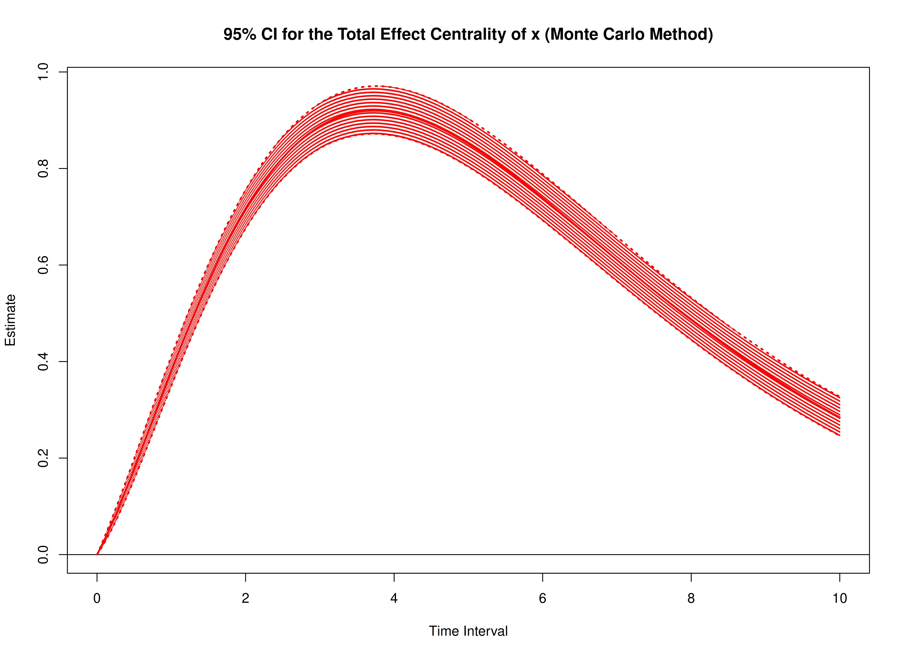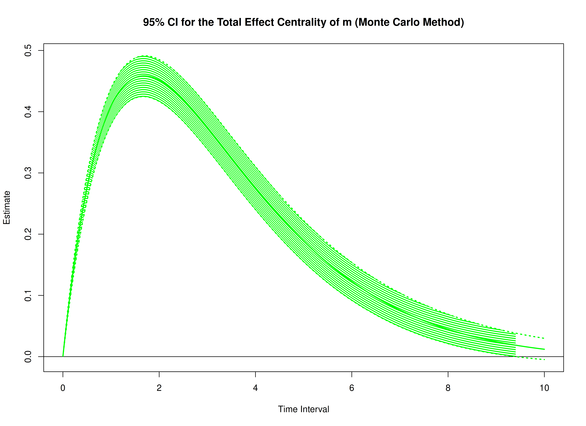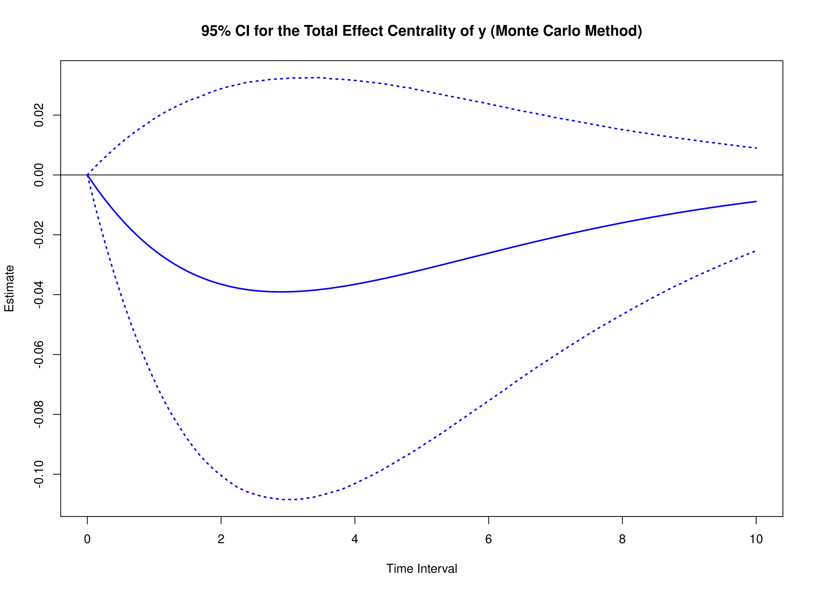

``` r

start <- Sys.time()
mc_indirect <- MCIndirectCentral(
  phi = phi,
  vcov_phi_vec = vcov_phi_vec,
  delta_t = delta_t,
  R = 20000L,
  ncores = parallel::detectCores() # use multiple cores
)
end <- Sys.time()
elapsed <- end - start
elapsed
#> Time difference of 22.02802 mins
```

``` r

summary(mc_indirect)
#> Call:
#> MCIndirectCentral(phi = phi, vcov_phi_vec = vcov_phi_vec, delta_t = delta_t,
#>     R = 20000L, ncores = parallel::detectCores())
#>
#> Indirect Effect Centrality
#>      variable interval     est     se     R    2.5%  97.5%
#> 1           x   0.0010  0.0000 0.0000 20000  0.0000 0.0000
#> 2           m   0.0010  0.0000 0.0000 20000  0.0000 0.0000
#> 3           y   0.0010  0.0000 0.0000 20000  0.0000 0.0000
#> 4           x   0.0100  0.0000 0.0000 20000  0.0000 0.0000
#> 5           m   0.0100  0.0000 0.0000 20000  0.0000 0.0000
#> 6           y   0.0100  0.0000 0.0000 20000  0.0000 0.0000
#> 7           x   0.0200  0.0000 0.0000 20000  0.0000 0.0000
#> 8           m   0.0200  0.0001 0.0000 20000  0.0001 0.0001
#> 9           y   0.0200  0.0000 0.0000 20000  0.0000 0.0000
#> 10          x   0.0300  0.0000 0.0000 20000  0.0000 0.0000
#> 11          m   0.0300  0.0002 0.0000 20000  0.0002 0.0003
#> 12          y   0.0300  0.0000 0.0000 20000  0.0000 0.0000
#> 13          x   0.0400  0.0000 0.0000 20000 -0.0001 0.0000
#> 14          m   0.0400  0.0004 0.0000 20000  0.0004 0.0005
#> 15          y   0.0400  0.0000 0.0000 20000  0.0000 0.0000
#> 16          x   0.0501  0.0000 0.0000 20000 -0.0001 0.0000
#> 17          m   0.0501  0.0007 0.0000 20000  0.0006 0.0007
#> 18          y   0.0501  0.0000 0.0000 20000 -0.0001 0.0000
#> 19          x   0.0601  0.0000 0.0001 20000 -0.0002 0.0001
#> 20          m   0.0601  0.0009 0.0000 20000  0.0009 0.0010
#> 21          y   0.0601  0.0000 0.0000 20000 -0.0001 0.0000
#> 22          x   0.0701 -0.0001 0.0001 20000 -0.0002 0.0001
#> 23          m   0.0701  0.0013 0.0001 20000  0.0012 0.0014
#> 24          y   0.0701  0.0000 0.0000 20000 -0.0001 0.0001
#> 25          x   0.0801 -0.0001 0.0001 20000 -0.0003 0.0001
#> 26          m   0.0801  0.0017 0.0001 20000  0.0015 0.0018
#> 27          y   0.0801  0.0000 0.0001 20000 -0.0001 0.0001
#> 28          x   0.0901 -0.0001 0.0001 20000 -0.0003 0.0001
#> 29          m   0.0901  0.0021 0.0001 20000  0.0019 0.0023
#> 30          y   0.0901  0.0000 0.0001 20000 -0.0002 0.0001
#> 31          x   0.1001 -0.0001 0.0001 20000 -0.0004 0.0002
#> 32          m   0.1001  0.0026 0.0001 20000  0.0024 0.0028
#> 33          y   0.1001 -0.0001 0.0001 20000 -0.0002 0.0001
#> 34          x   0.1101 -0.0001 0.0002 20000 -0.0005 0.0002
#> 35          m   0.1101  0.0031 0.0001 20000  0.0028 0.0034
#> 36          y   0.1101 -0.0001 0.0001 20000 -0.0003 0.0001
#> 37          x   0.1201 -0.0002 0.0002 20000 -0.0006 0.0002
#> 38          m   0.1201  0.0037 0.0002 20000  0.0034 0.0040
#> 39          y   0.1201 -0.0001 0.0001 20000 -0.0003 0.0002
#> 40          x   0.1301 -0.0002 0.0002 20000 -0.0007 0.0003
#> 41          m   0.1301  0.0043 0.0002 20000  0.0039 0.0046
#> 42          y   0.1301 -0.0001 0.0001 20000 -0.0004 0.0002
#> 43          x   0.1401 -0.0002 0.0003 20000 -0.0008 0.0003
#> 44          m   0.1401  0.0049 0.0002 20000  0.0045 0.0053
#> 45          y   0.1401 -0.0001 0.0002 20000 -0.0004 0.0002
#> 46          x   0.1502 -0.0003 0.0003 20000 -0.0009 0.0004
#> 47          m   0.1502  0.0056 0.0002 20000  0.0052 0.0061
#> 48          y   0.1502 -0.0001 0.0002 20000 -0.0005 0.0002
#> 49          x   0.1602 -0.0003 0.0004 20000 -0.0010 0.0004
#> 50          m   0.1602  0.0064 0.0003 20000  0.0059 0.0069
#> 51          y   0.1602 -0.0001 0.0002 20000 -0.0005 0.0003
#> 52          x   0.1702 -0.0003 0.0004 20000 -0.0011 0.0005
#> 53          m   0.1702  0.0072 0.0003 20000  0.0066 0.0078
#> 54          y   0.1702 -0.0002 0.0002 20000 -0.0006 0.0003
#> 55          x   0.1802 -0.0004 0.0004 20000 -0.0012 0.0005
#> 56          m   0.1802  0.0080 0.0003 20000  0.0074 0.0087
#> 57          y   0.1802 -0.0002 0.0003 20000 -0.0007 0.0003
#> 58          x   0.1902 -0.0004 0.0005 20000 -0.0014 0.0006
#> 59          m   0.1902  0.0089 0.0004 20000  0.0082 0.0096
#> 60          y   0.1902 -0.0002 0.0003 20000 -0.0008 0.0004
#> 61          x   0.2002 -0.0004 0.0005 20000 -0.0015 0.0006
#> 62          m   0.2002  0.0098 0.0004 20000  0.0090 0.0106
#> 63          y   0.2002 -0.0002 0.0003 20000 -0.0008 0.0004
#> 64          x   0.2102 -0.0005 0.0006 20000 -0.0016 0.0007
#> 65          m   0.2102  0.0107 0.0004 20000  0.0099 0.0116
#> 66          y   0.2102 -0.0003 0.0003 20000 -0.0009 0.0004
#> 67          x   0.2202 -0.0005 0.0006 20000 -0.0018 0.0008
#> 68          m   0.2202  0.0117 0.0005 20000  0.0108 0.0127
#> 69          y   0.2202 -0.0003 0.0004 20000 -0.0010 0.0005
#> 70          x   0.2302 -0.0006 0.0007 20000 -0.0019 0.0008
#> 71          m   0.2302  0.0127 0.0005 20000  0.0117 0.0138
#> 72          y   0.2302 -0.0003 0.0004 20000 -0.0011 0.0005
#> 73          x   0.2402 -0.0006 0.0008 20000 -0.0021 0.0009
#> 74          m   0.2402  0.0138 0.0006 20000  0.0127 0.0149
#> 75          y   0.2402 -0.0003 0.0004 20000 -0.0012 0.0006
#> 76          x   0.2503 -0.0007 0.0008 20000 -0.0023 0.0010
#> 77          m   0.2503  0.0149 0.0006 20000  0.0137 0.0161
#> 78          y   0.2503 -0.0003 0.0005 20000 -0.0013 0.0006
#> 79          x   0.2603 -0.0007 0.0009 20000 -0.0024 0.0010
#> 80          m   0.2603  0.0160 0.0007 20000  0.0148 0.0173
#> 81          y   0.2603 -0.0004 0.0005 20000 -0.0013 0.0006
#> 82          x   0.2703 -0.0008 0.0009 20000 -0.0026 0.0011
#> 83          m   0.2703  0.0172 0.0007 20000  0.0158 0.0186
#> 84          y   0.2703 -0.0004 0.0005 20000 -0.0014 0.0007
#> 85          x   0.2803 -0.0008 0.0010 20000 -0.0028 0.0012
#> 86          m   0.2803  0.0184 0.0007 20000  0.0169 0.0199
#> 87          y   0.2803 -0.0004 0.0006 20000 -0.0015 0.0007
#> 88          x   0.2903 -0.0009 0.0011 20000 -0.0030 0.0013
#> 89          m   0.2903  0.0196 0.0008 20000  0.0181 0.0212
#> 90          y   0.2903 -0.0005 0.0006 20000 -0.0016 0.0008
#> 91          x   0.3003 -0.0009 0.0011 20000 -0.0031 0.0013
#> 92          m   0.3003  0.0209 0.0008 20000  0.0193 0.0226
#> 93          y   0.3003 -0.0005 0.0007 20000 -0.0017 0.0008
#> 94          x   0.3103 -0.0010 0.0012 20000 -0.0033 0.0014
#> 95          m   0.3103  0.0222 0.0009 20000  0.0205 0.0240
#> 96          y   0.3103 -0.0005 0.0007 20000 -0.0018 0.0009
#> 97          x   0.3203 -0.0010 0.0013 20000 -0.0035 0.0015
#> 98          m   0.3203  0.0236 0.0010 20000  0.0217 0.0254
#> 99          y   0.3203 -0.0005 0.0007 20000 -0.0020 0.0009
#> 100         x   0.3303 -0.0011 0.0013 20000 -0.0037 0.0016
#> 101         m   0.3303  0.0249 0.0010 20000  0.0229 0.0269
#> 102         y   0.3303 -0.0006 0.0008 20000 -0.0021 0.0010
#> 103         x   0.3403 -0.0012 0.0014 20000 -0.0039 0.0017
#> 104         m   0.3403  0.0263 0.0011 20000  0.0242 0.0284
#> 105         y   0.3403 -0.0006 0.0008 20000 -0.0022 0.0010
#> 106         x   0.3504 -0.0012 0.0015 20000 -0.0041 0.0017
#> 107         m   0.3504  0.0278 0.0011 20000  0.0255 0.0300
#> 108         y   0.3504 -0.0006 0.0009 20000 -0.0023 0.0011
#> 109         x   0.3604 -0.0013 0.0016 20000 -0.0043 0.0018
#> 110         m   0.3604  0.0292 0.0012 20000  0.0269 0.0315
#> 111         y   0.3604 -0.0007 0.0009 20000 -0.0024 0.0011
#> 112         x   0.3704 -0.0013 0.0016 20000 -0.0045 0.0019
#> 113         m   0.3704  0.0307 0.0012 20000  0.0283 0.0331
#> 114         y   0.3704 -0.0007 0.0009 20000 -0.0025 0.0012
#> 115         x   0.3804 -0.0014 0.0017 20000 -0.0047 0.0020
#> 116         m   0.3804  0.0322 0.0013 20000  0.0297 0.0348
#> 117         y   0.3804 -0.0007 0.0010 20000 -0.0026 0.0013
#> 118         x   0.3904 -0.0015 0.0018 20000 -0.0050 0.0021
#> 119         m   0.3904  0.0338 0.0014 20000  0.0311 0.0364
#> 120         y   0.3904 -0.0008 0.0010 20000 -0.0028 0.0013
#> 121         x   0.4004 -0.0015 0.0019 20000 -0.0052 0.0022
#> 122         m   0.4004  0.0353 0.0014 20000  0.0325 0.0382
#> 123         y   0.4004 -0.0008 0.0011 20000 -0.0029 0.0014
#> 124         x   0.4104 -0.0016 0.0019 20000 -0.0054 0.0023
#> 125         m   0.4104  0.0369 0.0015 20000  0.0340 0.0399
#> 126         y   0.4104 -0.0009 0.0011 20000 -0.0030 0.0014
#> 127         x   0.4204 -0.0017 0.0020 20000 -0.0056 0.0024
#> 128         m   0.4204  0.0386 0.0016 20000  0.0355 0.0416
#> 129         y   0.4204 -0.0009 0.0012 20000 -0.0032 0.0015
#> 130         x   0.4304 -0.0017 0.0021 20000 -0.0058 0.0025
#> 131         m   0.4304  0.0402 0.0016 20000  0.0370 0.0434
#> 132         y   0.4304 -0.0009 0.0012 20000 -0.0033 0.0016
#> 133         x   0.4404 -0.0018 0.0022 20000 -0.0061 0.0026
#> 134         m   0.4404  0.0419 0.0017 20000  0.0386 0.0452
#> 135         y   0.4404 -0.0010 0.0013 20000 -0.0034 0.0016
#> 136         x   0.4505 -0.0019 0.0023 20000 -0.0063 0.0027
#> 137         m   0.4505  0.0436 0.0018 20000  0.0401 0.0471
#> 138         y   0.4505 -0.0010 0.0013 20000 -0.0035 0.0017
#> 139         x   0.4605 -0.0019 0.0024 20000 -0.0065 0.0028
#> 140         m   0.4605  0.0453 0.0018 20000  0.0417 0.0489
#> 141         y   0.4605 -0.0011 0.0014 20000 -0.0037 0.0017
#> 142         x   0.4705 -0.0020 0.0024 20000 -0.0068 0.0029
#> 143         m   0.4705  0.0471 0.0019 20000  0.0433 0.0508
#> 144         y   0.4705 -0.0011 0.0014 20000 -0.0038 0.0018
#> 145         x   0.4805 -0.0021 0.0025 20000 -0.0070 0.0030
#> 146         m   0.4805  0.0489 0.0020 20000  0.0450 0.0527
#> 147         y   0.4805 -0.0011 0.0015 20000 -0.0040 0.0019
#> 148         x   0.4905 -0.0022 0.0026 20000 -0.0073 0.0031
#> 149         m   0.4905  0.0507 0.0020 20000  0.0466 0.0547
#> 150         y   0.4905 -0.0012 0.0015 20000 -0.0041 0.0019
#> 151         x   0.5005 -0.0022 0.0027 20000 -0.0075 0.0032
#> 152         m   0.5005  0.0525 0.0021 20000  0.0483 0.0566
#> 153         y   0.5005 -0.0012 0.0016 20000 -0.0042 0.0020
#> 154         x   0.5105 -0.0023 0.0028 20000 -0.0077 0.0033
#> 155         m   0.5105  0.0543 0.0022 20000  0.0500 0.0586
#> 156         y   0.5105 -0.0013 0.0016 20000 -0.0044 0.0021
#> 157         x   0.5205 -0.0024 0.0029 20000 -0.0080 0.0034
#> 158         m   0.5205  0.0562 0.0023 20000  0.0517 0.0606
#> 159         y   0.5205 -0.0013 0.0017 20000 -0.0045 0.0021
#> 160         x   0.5305 -0.0025 0.0030 20000 -0.0082 0.0035
#> 161         m   0.5305  0.0581 0.0023 20000  0.0535 0.0627
#> 162         y   0.5305 -0.0013 0.0017 20000 -0.0047 0.0022
#> 163         x   0.5405 -0.0025 0.0030 20000 -0.0085 0.0036
#> 164         m   0.5405  0.0600 0.0024 20000  0.0552 0.0647
#> 165         y   0.5405 -0.0014 0.0018 20000 -0.0048 0.0023
#> 166         x   0.5506 -0.0026 0.0031 20000 -0.0087 0.0037
#> 167         m   0.5506  0.0619 0.0025 20000  0.0570 0.0668
#> 168         y   0.5506 -0.0014 0.0019 20000 -0.0050 0.0023
#> 169         x   0.5606 -0.0027 0.0032 20000 -0.0090 0.0038
#> 170         m   0.5606  0.0639 0.0026 20000  0.0588 0.0689
#> 171         y   0.5606 -0.0015 0.0019 20000 -0.0051 0.0024
#> 172         x   0.5706 -0.0028 0.0033 20000 -0.0092 0.0039
#> 173         m   0.5706  0.0658 0.0027 20000  0.0606 0.0710
#> 174         y   0.5706 -0.0015 0.0020 20000 -0.0053 0.0025
#> 175         x   0.5806 -0.0028 0.0034 20000 -0.0095 0.0040
#> 176         m   0.5806  0.0678 0.0027 20000  0.0624 0.0732
#> 177         y   0.5806 -0.0016 0.0020 20000 -0.0054 0.0025
#> 178         x   0.5906 -0.0029 0.0035 20000 -0.0097 0.0041
#> 179         m   0.5906  0.0698 0.0028 20000  0.0643 0.0753
#> 180         y   0.5906 -0.0016 0.0021 20000 -0.0056 0.0026
#> 181         x   0.6006 -0.0030 0.0036 20000 -0.0100 0.0042
#> 182         m   0.6006  0.0719 0.0029 20000  0.0661 0.0775
#> 183         y   0.6006 -0.0017 0.0021 20000 -0.0057 0.0027
#> 184         x   0.6106 -0.0031 0.0037 20000 -0.0103 0.0043
#> 185         m   0.6106  0.0739 0.0030 20000  0.0680 0.0797
#> 186         y   0.6106 -0.0017 0.0022 20000 -0.0059 0.0028
#> 187         x   0.6206 -0.0032 0.0038 20000 -0.0105 0.0044
#> 188         m   0.6206  0.0760 0.0031 20000  0.0699 0.0819
#> 189         y   0.6206 -0.0018 0.0023 20000 -0.0061 0.0028
#> 190         x   0.6306 -0.0032 0.0039 20000 -0.0108 0.0045
#> 191         m   0.6306  0.0780 0.0031 20000  0.0718 0.0842
#> 192         y   0.6306 -0.0018 0.0023 20000 -0.0062 0.0029
#> 193         x   0.6406 -0.0033 0.0040 20000 -0.0110 0.0046
#> 194         m   0.6406  0.0801 0.0032 20000  0.0737 0.0864
#> 195         y   0.6406 -0.0019 0.0024 20000 -0.0064 0.0030
#> 196         x   0.6507 -0.0034 0.0041 20000 -0.0113 0.0047
#> 197         m   0.6507  0.0822 0.0033 20000  0.0757 0.0887
#> 198         y   0.6507 -0.0019 0.0024 20000 -0.0065 0.0030
#> 199         x   0.6607 -0.0035 0.0042 20000 -0.0116 0.0048
#> 200         m   0.6607  0.0843 0.0034 20000  0.0776 0.0910
#> 201         y   0.6607 -0.0019 0.0025 20000 -0.0067 0.0031
#> 202         x   0.6707 -0.0036 0.0042 20000 -0.0118 0.0049
#> 203         m   0.6707  0.0865 0.0035 20000  0.0796 0.0933
#> 204         y   0.6707 -0.0020 0.0025 20000 -0.0069 0.0032
#> 205         x   0.6807 -0.0036 0.0043 20000 -0.0121 0.0050
#> 206         m   0.6807  0.0886 0.0036 20000  0.0816 0.0956
#> 207         y   0.6807 -0.0020 0.0026 20000 -0.0070 0.0033
#> 208         x   0.6907 -0.0037 0.0044 20000 -0.0123 0.0052
#> 209         m   0.6907  0.0908 0.0037 20000  0.0836 0.0979
#> 210         y   0.6907 -0.0021 0.0027 20000 -0.0072 0.0033
#> 211         x   0.7007 -0.0038 0.0045 20000 -0.0126 0.0053
#> 212         m   0.7007  0.0930 0.0037 20000  0.0856 0.1003
#> 213         y   0.7007 -0.0021 0.0027 20000 -0.0074 0.0034
#> 214         x   0.7107 -0.0039 0.0046 20000 -0.0129 0.0054
#> 215         m   0.7107  0.0952 0.0038 20000  0.0876 0.1027
#> 216         y   0.7107 -0.0022 0.0028 20000 -0.0075 0.0035
#> 217         x   0.7207 -0.0040 0.0047 20000 -0.0131 0.0055
#> 218         m   0.7207  0.0974 0.0039 20000  0.0896 0.1050
#> 219         y   0.7207 -0.0023 0.0028 20000 -0.0077 0.0035
#> 220         x   0.7307 -0.0040 0.0048 20000 -0.0134 0.0056
#> 221         m   0.7307  0.0996 0.0040 20000  0.0917 0.1074
#> 222         y   0.7307 -0.0023 0.0029 20000 -0.0079 0.0036
#> 223         x   0.7407 -0.0041 0.0049 20000 -0.0137 0.0057
#> 224         m   0.7407  0.1018 0.0041 20000  0.0937 0.1098
#> 225         y   0.7407 -0.0024 0.0030 20000 -0.0080 0.0037
#> 226         x   0.7508 -0.0042 0.0050 20000 -0.0140 0.0058
#> 227         m   0.7508  0.1041 0.0042 20000  0.0958 0.1122
#> 228         y   0.7508 -0.0024 0.0030 20000 -0.0082 0.0038
#> 229         x   0.7608 -0.0043 0.0051 20000 -0.0142 0.0059
#> 230         m   0.7608  0.1063 0.0043 20000  0.0979 0.1147
#> 231         y   0.7608 -0.0025 0.0031 20000 -0.0084 0.0038
#> 232         x   0.7708 -0.0044 0.0052 20000 -0.0145 0.0060
#> 233         m   0.7708  0.1086 0.0044 20000  0.0999 0.1171
#> 234         y   0.7708 -0.0025 0.0032 20000 -0.0085 0.0039
#> 235         x   0.7808 -0.0045 0.0053 20000 -0.0147 0.0061
#> 236         m   0.7808  0.1109 0.0045 20000  0.1020 0.1196
#> 237         y   0.7808 -0.0026 0.0032 20000 -0.0087 0.0040
#> 238         x   0.7908 -0.0045 0.0054 20000 -0.0150 0.0062
#> 239         m   0.7908  0.1132 0.0046 20000  0.1041 0.1220
#> 240         y   0.7908 -0.0026 0.0033 20000 -0.0089 0.0041
#> 241         x   0.8008 -0.0046 0.0055 20000 -0.0153 0.0063
#> 242         m   0.8008  0.1155 0.0047 20000  0.1062 0.1245
#> 243         y   0.8008 -0.0027 0.0033 20000 -0.0090 0.0041
#> 244         x   0.8108 -0.0047 0.0056 20000 -0.0155 0.0064
#> 245         m   0.8108  0.1178 0.0047 20000  0.1084 0.1270
#> 246         y   0.8108 -0.0027 0.0034 20000 -0.0092 0.0042
#> 247         x   0.8208 -0.0048 0.0057 20000 -0.0158 0.0065
#> 248         m   0.8208  0.1201 0.0048 20000  0.1105 0.1295
#> 249         y   0.8208 -0.0028 0.0035 20000 -0.0094 0.0043
#> 250         x   0.8308 -0.0049 0.0058 20000 -0.0161 0.0067
#> 251         m   0.8308  0.1224 0.0049 20000  0.1126 0.1320
#> 252         y   0.8308 -0.0028 0.0035 20000 -0.0095 0.0044
#> 253         x   0.8408 -0.0050 0.0059 20000 -0.0163 0.0068
#> 254         m   0.8408  0.1247 0.0050 20000  0.1148 0.1345
#> 255         y   0.8408 -0.0029 0.0036 20000 -0.0097 0.0044
#> 256         x   0.8509 -0.0050 0.0059 20000 -0.0166 0.0069
#> 257         m   0.8509  0.1271 0.0051 20000  0.1169 0.1371
#> 258         y   0.8509 -0.0029 0.0037 20000 -0.0099 0.0045
#> 259         x   0.8609 -0.0051 0.0060 20000 -0.0169 0.0070
#> 260         m   0.8609  0.1294 0.0052 20000  0.1191 0.1396
#> 261         y   0.8609 -0.0030 0.0037 20000 -0.0101 0.0046
#> 262         x   0.8709 -0.0052 0.0061 20000 -0.0171 0.0071
#> 263         m   0.8709  0.1318 0.0053 20000  0.1213 0.1422
#> 264         y   0.8709 -0.0031 0.0038 20000 -0.0102 0.0047
#> 265         x   0.8809 -0.0053 0.0062 20000 -0.0174 0.0072
#> 266         m   0.8809  0.1342 0.0054 20000  0.1235 0.1447
#> 267         y   0.8809 -0.0031 0.0038 20000 -0.0104 0.0047
#> 268         x   0.8909 -0.0054 0.0063 20000 -0.0176 0.0073
#> 269         m   0.8909  0.1365 0.0055 20000  0.1256 0.1473
#> 270         y   0.8909 -0.0032 0.0039 20000 -0.0106 0.0048
#> 271         x   0.9009 -0.0055 0.0064 20000 -0.0179 0.0074
#> 272         m   0.9009  0.1389 0.0056 20000  0.1278 0.1499
#> 273         y   0.9009 -0.0032 0.0040 20000 -0.0108 0.0049
#> 274         x   0.9109 -0.0055 0.0065 20000 -0.0182 0.0075
#> 275         m   0.9109  0.1413 0.0057 20000  0.1300 0.1524
#> 276         y   0.9109 -0.0033 0.0040 20000 -0.0110 0.0050
#> 277         x   0.9209 -0.0056 0.0066 20000 -0.0184 0.0076
#> 278         m   0.9209  0.1437 0.0058 20000  0.1323 0.1550
#> 279         y   0.9209 -0.0033 0.0041 20000 -0.0111 0.0050
#> 280         x   0.9309 -0.0057 0.0067 20000 -0.0187 0.0077
#> 281         m   0.9309  0.1461 0.0059 20000  0.1345 0.1576
#> 282         y   0.9309 -0.0034 0.0042 20000 -0.0113 0.0051
#> 283         x   0.9409 -0.0058 0.0068 20000 -0.0190 0.0078
#> 284         m   0.9409  0.1485 0.0060 20000  0.1367 0.1602
#> 285         y   0.9409 -0.0035 0.0042 20000 -0.0115 0.0052
#> 286         x   0.9510 -0.0059 0.0069 20000 -0.0192 0.0079
#> 287         m   0.9510  0.1509 0.0061 20000  0.1389 0.1628
#> 288         y   0.9510 -0.0035 0.0043 20000 -0.0117 0.0053
#> 289         x   0.9610 -0.0060 0.0070 20000 -0.0195 0.0080
#> 290         m   0.9610  0.1534 0.0062 20000  0.1411 0.1655
#> 291         y   0.9610 -0.0036 0.0044 20000 -0.0118 0.0053
#> 292         x   0.9710 -0.0060 0.0071 20000 -0.0197 0.0081
#> 293         m   0.9710  0.1558 0.0063 20000  0.1433 0.1681
#> 294         y   0.9710 -0.0036 0.0044 20000 -0.0120 0.0054
#> 295         x   0.9810 -0.0061 0.0072 20000 -0.0200 0.0082
#> 296         m   0.9810  0.1582 0.0064 20000  0.1455 0.1707
#> 297         y   0.9810 -0.0037 0.0045 20000 -0.0122 0.0055
#> 298         x   0.9910 -0.0062 0.0072 20000 -0.0202 0.0083
#> 299         m   0.9910  0.1606 0.0065 20000  0.1478 0.1733
#> 300         y   0.9910 -0.0037 0.0045 20000 -0.0124 0.0055
#> 301         x   1.0010 -0.0063 0.0073 20000 -0.0205 0.0084
#> 302         m   1.0010  0.1631 0.0066 20000  0.1500 0.1760
#> 303         y   1.0010 -0.0038 0.0046 20000 -0.0126 0.0056
#> 304         x   1.0110 -0.0064 0.0074 20000 -0.0207 0.0085
#> 305         m   1.0110  0.1655 0.0067 20000  0.1523 0.1786
#> 306         y   1.0110 -0.0039 0.0047 20000 -0.0127 0.0057
#> 307         x   1.0210 -0.0064 0.0075 20000 -0.0210 0.0086
#> 308         m   1.0210  0.1680 0.0068 20000  0.1545 0.1812
#> 309         y   1.0210 -0.0039 0.0047 20000 -0.0129 0.0058
#> 310         x   1.0310 -0.0065 0.0076 20000 -0.0213 0.0087
#> 311         m   1.0310  0.1704 0.0069 20000  0.1567 0.1839
#> 312         y   1.0310 -0.0040 0.0048 20000 -0.0131 0.0058
#> 313         x   1.0410 -0.0066 0.0077 20000 -0.0215 0.0088
#> 314         m   1.0410  0.1729 0.0070 20000  0.1590 0.1865
#> 315         y   1.0410 -0.0040 0.0049 20000 -0.0133 0.0059
#> 316         x   1.0511 -0.0067 0.0078 20000 -0.0218 0.0089
#> 317         m   1.0511  0.1753 0.0071 20000  0.1613 0.1892
#> 318         y   1.0511 -0.0041 0.0049 20000 -0.0135 0.0060
#> 319         x   1.0611 -0.0068 0.0079 20000 -0.0220 0.0090
#> 320         m   1.0611  0.1778 0.0072 20000  0.1635 0.1919
#> 321         y   1.0611 -0.0042 0.0050 20000 -0.0136 0.0061
#> 322         x   1.0711 -0.0069 0.0080 20000 -0.0223 0.0091
#> 323         m   1.0711  0.1803 0.0073 20000  0.1658 0.1945
#> 324         y   1.0711 -0.0042 0.0051 20000 -0.0138 0.0061
#> 325         x   1.0811 -0.0069 0.0080 20000 -0.0225 0.0092
#> 326         m   1.0811  0.1827 0.0074 20000  0.1680 0.1972
#> 327         y   1.0811 -0.0043 0.0051 20000 -0.0140 0.0062
#> 328         x   1.0911 -0.0070 0.0081 20000 -0.0228 0.0093
#> 329         m   1.0911  0.1852 0.0075 20000  0.1703 0.1998
#> 330         y   1.0911 -0.0043 0.0052 20000 -0.0142 0.0063
#> 331         x   1.1011 -0.0071 0.0082 20000 -0.0230 0.0094
#> 332         m   1.1011  0.1877 0.0076 20000  0.1726 0.2025
#> 333         y   1.1011 -0.0044 0.0053 20000 -0.0144 0.0064
#> 334         x   1.1111 -0.0072 0.0083 20000 -0.0233 0.0095
#> 335         m   1.1111  0.1901 0.0078 20000  0.1748 0.2052
#> 336         y   1.1111 -0.0045 0.0053 20000 -0.0146 0.0064
#> 337         x   1.1211 -0.0073 0.0084 20000 -0.0235 0.0096
#> 338         m   1.1211  0.1926 0.0079 20000  0.1771 0.2079
#> 339         y   1.1211 -0.0045 0.0054 20000 -0.0147 0.0065
#> 340         x   1.1311 -0.0073 0.0085 20000 -0.0238 0.0097
#> 341         m   1.1311  0.1951 0.0080 20000  0.1794 0.2106
#> 342         y   1.1311 -0.0046 0.0054 20000 -0.0149 0.0066
#> 343         x   1.1411 -0.0074 0.0086 20000 -0.0240 0.0098
#> 344         m   1.1411  0.1975 0.0081 20000  0.1816 0.2132
#> 345         y   1.1411 -0.0046 0.0055 20000 -0.0151 0.0066
#> 346         x   1.1512 -0.0075 0.0086 20000 -0.0243 0.0099
#> 347         m   1.1512  0.2000 0.0082 20000  0.1839 0.2159
#> 348         y   1.1512 -0.0047 0.0056 20000 -0.0153 0.0067
#> 349         x   1.1612 -0.0076 0.0087 20000 -0.0245 0.0099
#> 350         m   1.1612  0.2025 0.0083 20000  0.1862 0.2186
#> 351         y   1.1612 -0.0048 0.0056 20000 -0.0155 0.0068
#> 352         x   1.1712 -0.0076 0.0088 20000 -0.0247 0.0100
#> 353         m   1.1712  0.2050 0.0084 20000  0.1884 0.2213
#> 354         y   1.1712 -0.0048 0.0057 20000 -0.0157 0.0068
#> 355         x   1.1812 -0.0077 0.0089 20000 -0.0249 0.0101
#> 356         m   1.1812  0.2074 0.0085 20000  0.1907 0.2240
#> 357         y   1.1812 -0.0049 0.0058 20000 -0.0158 0.0069
#> 358         x   1.1912 -0.0078 0.0090 20000 -0.0252 0.0102
#> 359         m   1.1912  0.2099 0.0086 20000  0.1930 0.2267
#> 360         y   1.1912 -0.0049 0.0058 20000 -0.0160 0.0070
#> 361         x   1.2012 -0.0079 0.0091 20000 -0.0254 0.0103
#> 362         m   1.2012  0.2124 0.0087 20000  0.1952 0.2294
#> 363         y   1.2012 -0.0050 0.0059 20000 -0.0162 0.0070
#> 364         x   1.2112 -0.0080 0.0091 20000 -0.0257 0.0104
#> 365         m   1.2112  0.2149 0.0088 20000  0.1975 0.2321
#> 366         y   1.2112 -0.0051 0.0060 20000 -0.0164 0.0071
#> 367         x   1.2212 -0.0080 0.0092 20000 -0.0259 0.0105
#> 368         m   1.2212  0.2173 0.0089 20000  0.1998 0.2347
#> 369         y   1.2212 -0.0051 0.0060 20000 -0.0166 0.0072
#> 370         x   1.2312 -0.0081 0.0093 20000 -0.0261 0.0106
#> 371         m   1.2312  0.2198 0.0090 20000  0.2020 0.2374
#> 372         y   1.2312 -0.0052 0.0061 20000 -0.0168 0.0073
#> 373         x   1.2412 -0.0082 0.0094 20000 -0.0264 0.0107
#> 374         m   1.2412  0.2223 0.0091 20000  0.2043 0.2401
#> 375         y   1.2412 -0.0053 0.0062 20000 -0.0170 0.0073
#> 376         x   1.2513 -0.0083 0.0095 20000 -0.0266 0.0108
#> 377         m   1.2513  0.2247 0.0092 20000  0.2065 0.2428
#> 378         y   1.2513 -0.0053 0.0062 20000 -0.0171 0.0074
#> 379         x   1.2613 -0.0083 0.0095 20000 -0.0268 0.0108
#> 380         m   1.2613  0.2272 0.0093 20000  0.2088 0.2454
#> 381         y   1.2613 -0.0054 0.0063 20000 -0.0173 0.0075
#> 382         x   1.2713 -0.0084 0.0096 20000 -0.0270 0.0109
#> 383         m   1.2713  0.2297 0.0094 20000  0.2111 0.2481
#> 384         y   1.2713 -0.0054 0.0063 20000 -0.0175 0.0075
#> 385         x   1.2813 -0.0085 0.0097 20000 -0.0273 0.0110
#> 386         m   1.2813  0.2321 0.0096 20000  0.2133 0.2508
#> 387         y   1.2813 -0.0055 0.0064 20000 -0.0177 0.0076
#> 388         x   1.2913 -0.0086 0.0098 20000 -0.0275 0.0111
#> 389         m   1.2913  0.2346 0.0097 20000  0.2156 0.2535
#> 390         y   1.2913 -0.0056 0.0065 20000 -0.0179 0.0077
#> 391         x   1.3013 -0.0086 0.0099 20000 -0.0277 0.0112
#> 392         m   1.3013  0.2371 0.0098 20000  0.2178 0.2561
#> 393         y   1.3013 -0.0056 0.0065 20000 -0.0181 0.0078
#> 394         x   1.3113 -0.0087 0.0099 20000 -0.0279 0.0113
#> 395         m   1.3113  0.2395 0.0099 20000  0.2200 0.2588
#> 396         y   1.3113 -0.0057 0.0066 20000 -0.0182 0.0078
#> 397         x   1.3213 -0.0088 0.0100 20000 -0.0282 0.0113
#> 398         m   1.3213  0.2420 0.0100 20000  0.2223 0.2615
#> 399         y   1.3213 -0.0058 0.0067 20000 -0.0184 0.0079
#> 400         x   1.3313 -0.0089 0.0101 20000 -0.0284 0.0114
#> 401         m   1.3313  0.2444 0.0101 20000  0.2245 0.2641
#> 402         y   1.3313 -0.0058 0.0067 20000 -0.0186 0.0079
#> 403         x   1.3413 -0.0089 0.0102 20000 -0.0286 0.0115
#> 404         m   1.3413  0.2469 0.0102 20000  0.2267 0.2667
#> 405         y   1.3413 -0.0059 0.0068 20000 -0.0188 0.0080
#> 406         x   1.3514 -0.0090 0.0102 20000 -0.0288 0.0116
#> 407         m   1.3514  0.2493 0.0103 20000  0.2290 0.2694
#> 408         y   1.3514 -0.0059 0.0068 20000 -0.0190 0.0081
#> 409         x   1.3614 -0.0091 0.0103 20000 -0.0290 0.0117
#> 410         m   1.3614  0.2518 0.0104 20000  0.2312 0.2720
#> 411         y   1.3614 -0.0060 0.0069 20000 -0.0192 0.0081
#> 412         x   1.3714 -0.0091 0.0104 20000 -0.0292 0.0117
#> 413         m   1.3714  0.2542 0.0105 20000  0.2334 0.2747
#> 414         y   1.3714 -0.0061 0.0070 20000 -0.0193 0.0082
#> 415         x   1.3814 -0.0092 0.0104 20000 -0.0295 0.0118
#> 416         m   1.3814  0.2566 0.0106 20000  0.2357 0.2773
#> 417         y   1.3814 -0.0061 0.0070 20000 -0.0195 0.0083
#> 418         x   1.3914 -0.0093 0.0105 20000 -0.0297 0.0119
#> 419         m   1.3914  0.2591 0.0107 20000  0.2379 0.2800
#> 420         y   1.3914 -0.0062 0.0071 20000 -0.0197 0.0083
#> 421         x   1.4014 -0.0094 0.0106 20000 -0.0299 0.0119
#> 422         m   1.4014  0.2615 0.0108 20000  0.2401 0.2826
#> 423         y   1.4014 -0.0063 0.0072 20000 -0.0199 0.0084
#> 424         x   1.4114 -0.0094 0.0107 20000 -0.0301 0.0120
#> 425         m   1.4114  0.2639 0.0109 20000  0.2423 0.2852
#> 426         y   1.4114 -0.0063 0.0072 20000 -0.0201 0.0085
#> 427         x   1.4214 -0.0095 0.0107 20000 -0.0303 0.0121
#> 428         m   1.4214  0.2664 0.0111 20000  0.2446 0.2879
#> 429         y   1.4214 -0.0064 0.0073 20000 -0.0202 0.0085
#> 430         x   1.4314 -0.0096 0.0108 20000 -0.0305 0.0122
#> 431         m   1.4314  0.2688 0.0112 20000  0.2468 0.2905
#> 432         y   1.4314 -0.0065 0.0074 20000 -0.0204 0.0086
#> 433         x   1.4414 -0.0096 0.0109 20000 -0.0307 0.0122
#> 434         m   1.4414  0.2712 0.0113 20000  0.2490 0.2931
#> 435         y   1.4414 -0.0065 0.0074 20000 -0.0206 0.0086
#> 436         x   1.4515 -0.0097 0.0109 20000 -0.0309 0.0123
#> 437         m   1.4515  0.2736 0.0114 20000  0.2512 0.2958
#> 438         y   1.4515 -0.0066 0.0075 20000 -0.0208 0.0087
#> 439         x   1.4615 -0.0098 0.0110 20000 -0.0311 0.0123
#> 440         m   1.4615  0.2760 0.0115 20000  0.2534 0.2984
#> 441         y   1.4615 -0.0066 0.0075 20000 -0.0210 0.0088
#> 442         x   1.4715 -0.0098 0.0111 20000 -0.0313 0.0124
#> 443         m   1.4715  0.2784 0.0116 20000  0.2556 0.3010
#> 444         y   1.4715 -0.0067 0.0076 20000 -0.0212 0.0089
#> 445         x   1.4815 -0.0099 0.0111 20000 -0.0315 0.0125
#> 446         m   1.4815  0.2808 0.0117 20000  0.2578 0.3036
#> 447         y   1.4815 -0.0068 0.0077 20000 -0.0213 0.0089
#> 448         x   1.4915 -0.0100 0.0112 20000 -0.0317 0.0125
#> 449         m   1.4915  0.2832 0.0118 20000  0.2599 0.3062
#> 450         y   1.4915 -0.0068 0.0077 20000 -0.0215 0.0090
#> 451         x   1.5015 -0.0100 0.0113 20000 -0.0319 0.0126
#> 452         m   1.5015  0.2856 0.0119 20000  0.2621 0.3088
#> 453         y   1.5015 -0.0069 0.0078 20000 -0.0217 0.0090
#> 454         x   1.5115 -0.0101 0.0113 20000 -0.0321 0.0126
#> 455         m   1.5115  0.2879 0.0120 20000  0.2643 0.3114
#> 456         y   1.5115 -0.0070 0.0078 20000 -0.0218 0.0091
#> 457         x   1.5215 -0.0102 0.0114 20000 -0.0322 0.0127
#> 458         m   1.5215  0.2903 0.0121 20000  0.2664 0.3139
#> 459         y   1.5215 -0.0070 0.0079 20000 -0.0220 0.0092
#> 460         x   1.5315 -0.0102 0.0115 20000 -0.0324 0.0127
#> 461         m   1.5315  0.2927 0.0122 20000  0.2686 0.3166
#> 462         y   1.5315 -0.0071 0.0080 20000 -0.0222 0.0092
#> 463         x   1.5415 -0.0103 0.0115 20000 -0.0326 0.0128
#> 464         m   1.5415  0.2950 0.0123 20000  0.2708 0.3191
#> 465         y   1.5415 -0.0072 0.0080 20000 -0.0224 0.0093
#> 466         x   1.5516 -0.0104 0.0116 20000 -0.0328 0.0129
#> 467         m   1.5516  0.2974 0.0125 20000  0.2729 0.3217
#> 468         y   1.5516 -0.0072 0.0081 20000 -0.0226 0.0093
#> 469         x   1.5616 -0.0104 0.0116 20000 -0.0330 0.0129
#> 470         m   1.5616  0.2997 0.0126 20000  0.2750 0.3242
#> 471         y   1.5616 -0.0073 0.0082 20000 -0.0228 0.0094
#> 472         x   1.5716 -0.0105 0.0117 20000 -0.0331 0.0130
#> 473         m   1.5716  0.3021 0.0127 20000  0.2772 0.3268
#> 474         y   1.5716 -0.0074 0.0082 20000 -0.0229 0.0094
#> 475         x   1.5816 -0.0106 0.0118 20000 -0.0333 0.0130
#> 476         m   1.5816  0.3044 0.0128 20000  0.2793 0.3293
#> 477         y   1.5816 -0.0074 0.0083 20000 -0.0231 0.0095
#> 478         x   1.5916 -0.0106 0.0118 20000 -0.0335 0.0131
#> 479         m   1.5916  0.3068 0.0129 20000  0.2815 0.3319
#> 480         y   1.5916 -0.0075 0.0083 20000 -0.0233 0.0096
#> 481         x   1.6016 -0.0107 0.0119 20000 -0.0337 0.0132
#> 482         m   1.6016  0.3091 0.0130 20000  0.2836 0.3345
#> 483         y   1.6016 -0.0076 0.0084 20000 -0.0235 0.0096
#> 484         x   1.6116 -0.0108 0.0119 20000 -0.0338 0.0132
#> 485         m   1.6116  0.3114 0.0131 20000  0.2857 0.3370
#> 486         y   1.6116 -0.0076 0.0085 20000 -0.0237 0.0097
#> 487         x   1.6216 -0.0108 0.0120 20000 -0.0340 0.0133
#> 488         m   1.6216  0.3137 0.0132 20000  0.2878 0.3395
#> 489         y   1.6216 -0.0077 0.0085 20000 -0.0239 0.0097
#> 490         x   1.6316 -0.0109 0.0120 20000 -0.0342 0.0133
#> 491         m   1.6316  0.3160 0.0133 20000  0.2899 0.3420
#> 492         y   1.6316 -0.0077 0.0086 20000 -0.0241 0.0098
#> 493         x   1.6416 -0.0109 0.0121 20000 -0.0343 0.0134
#> 494         m   1.6416  0.3183 0.0134 20000  0.2920 0.3445
#> 495         y   1.6416 -0.0078 0.0086 20000 -0.0242 0.0099
#> 496         x   1.6517 -0.0110 0.0122 20000 -0.0345 0.0134
#> 497         m   1.6517  0.3206 0.0135 20000  0.2941 0.3470
#> 498         y   1.6517 -0.0079 0.0087 20000 -0.0244 0.0099
#> 499         x   1.6617 -0.0111 0.0122 20000 -0.0347 0.0135
#> 500         m   1.6617  0.3229 0.0136 20000  0.2962 0.3495
#> 501         y   1.6617 -0.0079 0.0088 20000 -0.0246 0.0099
#> 502         x   1.6717 -0.0111 0.0123 20000 -0.0348 0.0135
#> 503         m   1.6717  0.3252 0.0137 20000  0.2982 0.3520
#> 504         y   1.6717 -0.0080 0.0088 20000 -0.0248 0.0100
#> 505         x   1.6817 -0.0112 0.0123 20000 -0.0350 0.0136
#> 506         m   1.6817  0.3274 0.0138 20000  0.3003 0.3545
#> 507         y   1.6817 -0.0081 0.0089 20000 -0.0250 0.0101
#> 508         x   1.6917 -0.0112 0.0124 20000 -0.0351 0.0136
#> 509         m   1.6917  0.3297 0.0139 20000  0.3023 0.3570
#> 510         y   1.6917 -0.0081 0.0089 20000 -0.0252 0.0101
#> 511         x   1.7017 -0.0113 0.0124 20000 -0.0353 0.0137
#> 512         m   1.7017  0.3320 0.0141 20000  0.3044 0.3594
#> 513         y   1.7017 -0.0082 0.0090 20000 -0.0253 0.0102
#> 514         x   1.7117 -0.0114 0.0125 20000 -0.0355 0.0137
#> 515         m   1.7117  0.3342 0.0142 20000  0.3064 0.3619
#> 516         y   1.7117 -0.0083 0.0091 20000 -0.0255 0.0102
#> 517         x   1.7217 -0.0114 0.0125 20000 -0.0356 0.0138
#> 518         m   1.7217  0.3364 0.0143 20000  0.3085 0.3643
#> 519         y   1.7217 -0.0083 0.0091 20000 -0.0257 0.0103
#> 520         x   1.7317 -0.0115 0.0126 20000 -0.0358 0.0138
#> 521         m   1.7317  0.3387 0.0144 20000  0.3105 0.3667
#> 522         y   1.7317 -0.0084 0.0092 20000 -0.0259 0.0103
#> 523         x   1.7417 -0.0115 0.0126 20000 -0.0360 0.0138
#> 524         m   1.7417  0.3409 0.0145 20000  0.3125 0.3692
#> 525         y   1.7417 -0.0085 0.0092 20000 -0.0261 0.0104
#> 526         x   1.7518 -0.0116 0.0127 20000 -0.0361 0.0139
#> 527         m   1.7518  0.3431 0.0146 20000  0.3145 0.3717
#> 528         y   1.7518 -0.0085 0.0093 20000 -0.0263 0.0105
#> 529         x   1.7618 -0.0116 0.0127 20000 -0.0363 0.0139
#> 530         m   1.7618  0.3453 0.0147 20000  0.3165 0.3740
#> 531         y   1.7618 -0.0086 0.0094 20000 -0.0264 0.0105
#> 532         x   1.7718 -0.0117 0.0128 20000 -0.0364 0.0139
#> 533         m   1.7718  0.3475 0.0148 20000  0.3185 0.3765
#> 534         y   1.7718 -0.0087 0.0094 20000 -0.0266 0.0106
#> 535         x   1.7818 -0.0118 0.0128 20000 -0.0366 0.0140
#> 536         m   1.7818  0.3497 0.0149 20000  0.3205 0.3789
#> 537         y   1.7818 -0.0087 0.0095 20000 -0.0268 0.0106
#> 538         x   1.7918 -0.0118 0.0129 20000 -0.0367 0.0140
#> 539         m   1.7918  0.3519 0.0150 20000  0.3225 0.3813
#> 540         y   1.7918 -0.0088 0.0095 20000 -0.0270 0.0107
#> 541         x   1.8018 -0.0119 0.0129 20000 -0.0368 0.0140
#> 542         m   1.8018  0.3541 0.0151 20000  0.3245 0.3837
#> 543         y   1.8018 -0.0089 0.0096 20000 -0.0272 0.0107
#> 544         x   1.8118 -0.0119 0.0130 20000 -0.0370 0.0141
#> 545         m   1.8118  0.3563 0.0152 20000  0.3265 0.3861
#> 546         y   1.8118 -0.0089 0.0097 20000 -0.0274 0.0108
#> 547         x   1.8218 -0.0120 0.0130 20000 -0.0371 0.0141
#> 548         m   1.8218  0.3584 0.0153 20000  0.3284 0.3884
#> 549         y   1.8218 -0.0090 0.0097 20000 -0.0275 0.0109
#> 550         x   1.8318 -0.0120 0.0131 20000 -0.0372 0.0142
#> 551         m   1.8318  0.3606 0.0154 20000  0.3304 0.3908
#> 552         y   1.8318 -0.0091 0.0098 20000 -0.0277 0.0109
#> 553         x   1.8418 -0.0121 0.0131 20000 -0.0374 0.0142
#> 554         m   1.8418  0.3627 0.0155 20000  0.3324 0.3932
#> 555         y   1.8418 -0.0091 0.0098 20000 -0.0279 0.0110
#> 556         x   1.8519 -0.0121 0.0131 20000 -0.0375 0.0142
#> 557         m   1.8519  0.3648 0.0156 20000  0.3343 0.3955
#> 558         y   1.8519 -0.0092 0.0099 20000 -0.0281 0.0110
#> 559         x   1.8619 -0.0122 0.0132 20000 -0.0377 0.0143
#> 560         m   1.8619  0.3670 0.0157 20000  0.3362 0.3978
#> 561         y   1.8619 -0.0093 0.0100 20000 -0.0283 0.0111
#> 562         x   1.8719 -0.0122 0.0132 20000 -0.0378 0.0143
#> 563         m   1.8719  0.3691 0.0158 20000  0.3382 0.4002
#> 564         y   1.8719 -0.0093 0.0100 20000 -0.0284 0.0111
#> 565         x   1.8819 -0.0123 0.0133 20000 -0.0379 0.0143
#> 566         m   1.8819  0.3712 0.0159 20000  0.3401 0.4025
#> 567         y   1.8819 -0.0094 0.0101 20000 -0.0286 0.0112
#> 568         x   1.8919 -0.0123 0.0133 20000 -0.0381 0.0143
#> 569         m   1.8919  0.3733 0.0160 20000  0.3420 0.4048
#> 570         y   1.8919 -0.0095 0.0101 20000 -0.0288 0.0112
#> 571         x   1.9019 -0.0124 0.0134 20000 -0.0382 0.0144
#> 572         m   1.9019  0.3754 0.0161 20000  0.3439 0.4071
#> 573         y   1.9019 -0.0095 0.0102 20000 -0.0290 0.0113
#> 574         x   1.9119 -0.0124 0.0134 20000 -0.0383 0.0144
#> 575         m   1.9119  0.3775 0.0162 20000  0.3458 0.4094
#> 576         y   1.9119 -0.0096 0.0103 20000 -0.0292 0.0113
#> 577         x   1.9219 -0.0125 0.0134 20000 -0.0385 0.0144
#> 578         m   1.9219  0.3795 0.0163 20000  0.3476 0.4117
#> 579         y   1.9219 -0.0097 0.0103 20000 -0.0293 0.0114
#> 580         x   1.9319 -0.0125 0.0135 20000 -0.0386 0.0144
#> 581         m   1.9319  0.3816 0.0164 20000  0.3495 0.4139
#> 582         y   1.9319 -0.0097 0.0104 20000 -0.0295 0.0115
#> 583         x   1.9419 -0.0126 0.0135 20000 -0.0387 0.0144
#> 584         m   1.9419  0.3837 0.0165 20000  0.3513 0.4161
#> 585         y   1.9419 -0.0098 0.0104 20000 -0.0297 0.0115
#> 586         x   1.9520 -0.0126 0.0135 20000 -0.0388 0.0145
#> 587         m   1.9520  0.3857 0.0166 20000  0.3531 0.4184
#> 588         y   1.9520 -0.0099 0.0105 20000 -0.0299 0.0115
#> 589         x   1.9620 -0.0127 0.0136 20000 -0.0389 0.0145
#> 590         m   1.9620  0.3878 0.0167 20000  0.3549 0.4206
#> 591         y   1.9620 -0.0099 0.0106 20000 -0.0301 0.0116
#> 592         x   1.9720 -0.0127 0.0136 20000 -0.0390 0.0145
#> 593         m   1.9720  0.3898 0.0168 20000  0.3568 0.4229
#> 594         y   1.9720 -0.0100 0.0106 20000 -0.0302 0.0116
#> 595         x   1.9820 -0.0128 0.0137 20000 -0.0392 0.0145
#> 596         m   1.9820  0.3918 0.0169 20000  0.3586 0.4251
#> 597         y   1.9820 -0.0101 0.0107 20000 -0.0304 0.0117
#> 598         x   1.9920 -0.0128 0.0137 20000 -0.0393 0.0146
#> 599         m   1.9920  0.3938 0.0170 20000  0.3603 0.4273
#> 600         y   1.9920 -0.0101 0.0107 20000 -0.0306 0.0117
#> 601         x   2.0020 -0.0129 0.0137 20000 -0.0394 0.0146
#> 602         m   2.0020  0.3958 0.0171 20000  0.3621 0.4296
#> 603         y   2.0020 -0.0102 0.0108 20000 -0.0308 0.0117
#> 604         x   2.0120 -0.0129 0.0138 20000 -0.0395 0.0146
#> 605         m   2.0120  0.3978 0.0172 20000  0.3640 0.4318
#> 606         y   2.0120 -0.0103 0.0108 20000 -0.0310 0.0118
#> 607         x   2.0220 -0.0130 0.0138 20000 -0.0397 0.0147
#> 608         m   2.0220  0.3998 0.0173 20000  0.3658 0.4340
#> 609         y   2.0220 -0.0103 0.0109 20000 -0.0311 0.0118
#> 610         x   2.0320 -0.0130 0.0138 20000 -0.0398 0.0147
#> 611         m   2.0320  0.4017 0.0174 20000  0.3675 0.4361
#> 612         y   2.0320 -0.0104 0.0110 20000 -0.0313 0.0119
#> 613         x   2.0420 -0.0131 0.0139 20000 -0.0399 0.0147
#> 614         m   2.0420  0.4037 0.0175 20000  0.3693 0.4383
#> 615         y   2.0420 -0.0105 0.0110 20000 -0.0315 0.0119
#> 616         x   2.0521 -0.0131 0.0139 20000 -0.0400 0.0147
#> 617         m   2.0521  0.4057 0.0176 20000  0.3711 0.4405
#> 618         y   2.0521 -0.0105 0.0111 20000 -0.0317 0.0120
#> 619         x   2.0621 -0.0131 0.0139 20000 -0.0401 0.0148
#> 620         m   2.0621  0.4076 0.0177 20000  0.3729 0.4426
#> 621         y   2.0621 -0.0106 0.0111 20000 -0.0318 0.0120
#> 622         x   2.0721 -0.0132 0.0140 20000 -0.0403 0.0148
#> 623         m   2.0721  0.4095 0.0178 20000  0.3746 0.4447
#> 624         y   2.0721 -0.0107 0.0112 20000 -0.0320 0.0121
#> 625         x   2.0821 -0.0132 0.0140 20000 -0.0404 0.0148
#> 626         m   2.0821  0.4115 0.0179 20000  0.3764 0.4468
#> 627         y   2.0821 -0.0107 0.0113 20000 -0.0322 0.0121
#> 628         x   2.0921 -0.0133 0.0140 20000 -0.0405 0.0148
#> 629         m   2.0921  0.4134 0.0180 20000  0.3781 0.4489
#> 630         y   2.0921 -0.0108 0.0113 20000 -0.0324 0.0122
#> 631         x   2.1021 -0.0133 0.0140 20000 -0.0406 0.0148
#> 632         m   2.1021  0.4153 0.0181 20000  0.3798 0.4510
#> 633         y   2.1021 -0.0109 0.0114 20000 -0.0326 0.0122
#> 634         x   2.1121 -0.0134 0.0141 20000 -0.0407 0.0148
#> 635         m   2.1121  0.4172 0.0182 20000  0.3815 0.4531
#> 636         y   2.1121 -0.0110 0.0114 20000 -0.0328 0.0123
#> 637         x   2.1221 -0.0134 0.0141 20000 -0.0408 0.0148
#> 638         m   2.1221  0.4190 0.0183 20000  0.3832 0.4552
#> 639         y   2.1221 -0.0110 0.0115 20000 -0.0329 0.0123
#> 640         x   2.1321 -0.0134 0.0141 20000 -0.0409 0.0148
#> 641         m   2.1321  0.4209 0.0184 20000  0.3849 0.4573
#> 642         y   2.1321 -0.0111 0.0115 20000 -0.0331 0.0124
#> 643         x   2.1421 -0.0135 0.0142 20000 -0.0410 0.0148
#> 644         m   2.1421  0.4228 0.0185 20000  0.3866 0.4593
#> 645         y   2.1421 -0.0112 0.0116 20000 -0.0333 0.0124
#> 646         x   2.1522 -0.0135 0.0142 20000 -0.0410 0.0149
#> 647         m   2.1522  0.4246 0.0186 20000  0.3882 0.4614
#> 648         y   2.1522 -0.0112 0.0117 20000 -0.0335 0.0125
#> 649         x   2.1622 -0.0136 0.0142 20000 -0.0411 0.0149
#> 650         m   2.1622  0.4265 0.0187 20000  0.3899 0.4634
#> 651         y   2.1622 -0.0113 0.0117 20000 -0.0337 0.0126
#> 652         x   2.1722 -0.0136 0.0142 20000 -0.0412 0.0149
#> 653         m   2.1722  0.4283 0.0188 20000  0.3916 0.4654
#> 654         y   2.1722 -0.0114 0.0118 20000 -0.0339 0.0126
#> 655         x   2.1822 -0.0136 0.0143 20000 -0.0413 0.0149
#> 656         m   2.1822  0.4301 0.0189 20000  0.3932 0.4674
#> 657         y   2.1822 -0.0114 0.0118 20000 -0.0341 0.0126
#> 658         x   2.1922 -0.0137 0.0143 20000 -0.0414 0.0149
#> 659         m   2.1922  0.4319 0.0190 20000  0.3949 0.4695
#> 660         y   2.1922 -0.0115 0.0119 20000 -0.0342 0.0127
#> 661         x   2.2022 -0.0137 0.0143 20000 -0.0415 0.0149
#> 662         m   2.2022  0.4337 0.0191 20000  0.3966 0.4715
#> 663         y   2.2022 -0.0116 0.0119 20000 -0.0344 0.0127
#> 664         x   2.2122 -0.0138 0.0143 20000 -0.0416 0.0149
#> 665         m   2.2122  0.4355 0.0191 20000  0.3982 0.4735
#> 666         y   2.2122 -0.0116 0.0120 20000 -0.0346 0.0127
#> 667         x   2.2222 -0.0138 0.0144 20000 -0.0416 0.0149
#> 668         m   2.2222  0.4373 0.0192 20000  0.3997 0.4754
#> 669         y   2.2222 -0.0117 0.0121 20000 -0.0348 0.0127
#> 670         x   2.2322 -0.0138 0.0144 20000 -0.0417 0.0150
#> 671         m   2.2322  0.4391 0.0193 20000  0.4014 0.4774
#> 672         y   2.2322 -0.0118 0.0121 20000 -0.0350 0.0128
#> 673         x   2.2422 -0.0139 0.0144 20000 -0.0418 0.0150
#> 674         m   2.2422  0.4409 0.0194 20000  0.4030 0.4794
#> 675         y   2.2422 -0.0118 0.0122 20000 -0.0352 0.0128
#> 676         x   2.2523 -0.0139 0.0144 20000 -0.0419 0.0150
#> 677         m   2.2523  0.4426 0.0195 20000  0.4046 0.4813
#> 678         y   2.2523 -0.0119 0.0122 20000 -0.0354 0.0129
#> 679         x   2.2623 -0.0140 0.0144 20000 -0.0420 0.0150
#> 680         m   2.2623  0.4443 0.0196 20000  0.4061 0.4832
#> 681         y   2.2623 -0.0120 0.0123 20000 -0.0355 0.0129
#> 682         x   2.2723 -0.0140 0.0145 20000 -0.0421 0.0150
#> 683         m   2.2723  0.4461 0.0197 20000  0.4077 0.4851
#> 684         y   2.2723 -0.0120 0.0123 20000 -0.0357 0.0130
#> 685         x   2.2823 -0.0140 0.0145 20000 -0.0422 0.0150
#> 686         m   2.2823  0.4478 0.0198 20000  0.4092 0.4871
#> 687         y   2.2823 -0.0121 0.0124 20000 -0.0359 0.0130
#> 688         x   2.2923 -0.0141 0.0145 20000 -0.0422 0.0150
#> 689         m   2.2923  0.4495 0.0199 20000  0.4107 0.4890
#> 690         y   2.2923 -0.0122 0.0125 20000 -0.0361 0.0131
#> 691         x   2.3023 -0.0141 0.0145 20000 -0.0423 0.0150
#> 692         m   2.3023  0.4512 0.0200 20000  0.4122 0.4908
#> 693         y   2.3023 -0.0122 0.0125 20000 -0.0363 0.0131
#> 694         x   2.3123 -0.0141 0.0145 20000 -0.0424 0.0150
#> 695         m   2.3123  0.4529 0.0201 20000  0.4138 0.4927
#> 696         y   2.3123 -0.0123 0.0126 20000 -0.0365 0.0132
#> 697         x   2.3223 -0.0142 0.0146 20000 -0.0424 0.0150
#> 698         m   2.3223  0.4546 0.0201 20000  0.4153 0.4946
#> 699         y   2.3223 -0.0124 0.0126 20000 -0.0367 0.0132
#> 700         x   2.3323 -0.0142 0.0146 20000 -0.0425 0.0150
#> 701         m   2.3323  0.4562 0.0202 20000  0.4167 0.4964
#> 702         y   2.3323 -0.0125 0.0127 20000 -0.0369 0.0132
#> 703         x   2.3423 -0.0142 0.0146 20000 -0.0426 0.0150
#> 704         m   2.3423  0.4579 0.0203 20000  0.4182 0.4983
#> 705         y   2.3423 -0.0125 0.0127 20000 -0.0370 0.0133
#> 706         x   2.3524 -0.0143 0.0146 20000 -0.0427 0.0150
#> 707         m   2.3524  0.4595 0.0204 20000  0.4197 0.5001
#> 708         y   2.3524 -0.0126 0.0128 20000 -0.0372 0.0133
#> 709         x   2.3624 -0.0143 0.0146 20000 -0.0427 0.0150
#> 710         m   2.3624  0.4612 0.0205 20000  0.4212 0.5019
#> 711         y   2.3624 -0.0127 0.0129 20000 -0.0374 0.0134
#> 712         x   2.3724 -0.0143 0.0147 20000 -0.0428 0.0150
#> 713         m   2.3724  0.4628 0.0206 20000  0.4226 0.5037
#> 714         y   2.3724 -0.0127 0.0129 20000 -0.0376 0.0134
#> 715         x   2.3824 -0.0144 0.0147 20000 -0.0428 0.0150
#> 716         m   2.3824  0.4644 0.0207 20000  0.4240 0.5055
#> 717         y   2.3824 -0.0128 0.0130 20000 -0.0378 0.0134
#> 718         x   2.3924 -0.0144 0.0147 20000 -0.0429 0.0150
#> 719         m   2.3924  0.4660 0.0208 20000  0.4255 0.5072
#> 720         y   2.3924 -0.0129 0.0130 20000 -0.0379 0.0135
#> 721         x   2.4024 -0.0144 0.0147 20000 -0.0430 0.0150
#> 722         m   2.4024  0.4676 0.0208 20000  0.4269 0.5090
#> 723         y   2.4024 -0.0129 0.0131 20000 -0.0381 0.0135
#> 724         x   2.4124 -0.0145 0.0147 20000 -0.0430 0.0150
#> 725         m   2.4124  0.4692 0.0209 20000  0.4283 0.5108
#> 726         y   2.4124 -0.0130 0.0131 20000 -0.0383 0.0135
#> 727         x   2.4224 -0.0145 0.0147 20000 -0.0431 0.0150
#> 728         m   2.4224  0.4708 0.0210 20000  0.4298 0.5125
#> 729         y   2.4224 -0.0131 0.0132 20000 -0.0385 0.0136
#> 730         x   2.4324 -0.0145 0.0147 20000 -0.0432 0.0150
#> 731         m   2.4324  0.4724 0.0211 20000  0.4312 0.5143
#> 732         y   2.4324 -0.0131 0.0133 20000 -0.0387 0.0136
#> 733         x   2.4424 -0.0146 0.0148 20000 -0.0433 0.0149
#> 734         m   2.4424  0.4739 0.0212 20000  0.4326 0.5160
#> 735         y   2.4424 -0.0132 0.0133 20000 -0.0388 0.0136
#> 736         x   2.4525 -0.0146 0.0148 20000 -0.0434 0.0149
#> 737         m   2.4525  0.4754 0.0213 20000  0.4339 0.5178
#> 738         y   2.4525 -0.0133 0.0134 20000 -0.0390 0.0137
#> 739         x   2.4625 -0.0146 0.0148 20000 -0.0434 0.0149
#> 740         m   2.4625  0.4770 0.0214 20000  0.4353 0.5195
#> 741         y   2.4625 -0.0133 0.0134 20000 -0.0392 0.0137
#> 742         x   2.4725 -0.0147 0.0148 20000 -0.0434 0.0149
#> 743         m   2.4725  0.4785 0.0214 20000  0.4367 0.5212
#> 744         y   2.4725 -0.0134 0.0135 20000 -0.0394 0.0138
#> 745         x   2.4825 -0.0147 0.0148 20000 -0.0435 0.0149
#> 746         m   2.4825  0.4800 0.0215 20000  0.4380 0.5228
#> 747         y   2.4825 -0.0135 0.0135 20000 -0.0396 0.0139
#> 748         x   2.4925 -0.0147 0.0148 20000 -0.0435 0.0149
#> 749         m   2.4925  0.4815 0.0216 20000  0.4394 0.5245
#> 750         y   2.4925 -0.0136 0.0136 20000 -0.0398 0.0139
#> 751         x   2.5025 -0.0147 0.0148 20000 -0.0436 0.0149
#> 752         m   2.5025  0.4830 0.0217 20000  0.4407 0.5261
#> 753         y   2.5025 -0.0136 0.0137 20000 -0.0400 0.0140
#> 754         x   2.5125 -0.0148 0.0148 20000 -0.0436 0.0149
#> 755         m   2.5125  0.4845 0.0218 20000  0.4420 0.5278
#> 756         y   2.5125 -0.0137 0.0137 20000 -0.0402 0.0140
#> 757         x   2.5225 -0.0148 0.0149 20000 -0.0436 0.0148
#> 758         m   2.5225  0.4859 0.0219 20000  0.4433 0.5294
#> 759         y   2.5225 -0.0138 0.0138 20000 -0.0403 0.0140
#> 760         x   2.5325 -0.0148 0.0149 20000 -0.0437 0.0148
#> 761         m   2.5325  0.4874 0.0219 20000  0.4446 0.5310
#> 762         y   2.5325 -0.0138 0.0138 20000 -0.0405 0.0141
#> 763         x   2.5425 -0.0149 0.0149 20000 -0.0437 0.0148
#> 764         m   2.5425  0.4888 0.0220 20000  0.4459 0.5326
#> 765         y   2.5425 -0.0139 0.0139 20000 -0.0407 0.0141
#> 766         x   2.5526 -0.0149 0.0149 20000 -0.0437 0.0148
#> 767         m   2.5526  0.4903 0.0221 20000  0.4472 0.5342
#> 768         y   2.5526 -0.0140 0.0139 20000 -0.0409 0.0141
#> 769         x   2.5626 -0.0149 0.0149 20000 -0.0438 0.0148
#> 770         m   2.5626  0.4917 0.0222 20000  0.4485 0.5358
#> 771         y   2.5626 -0.0140 0.0140 20000 -0.0410 0.0142
#> 772         x   2.5726 -0.0149 0.0149 20000 -0.0438 0.0148
#> 773         m   2.5726  0.4931 0.0223 20000  0.4498 0.5373
#> 774         y   2.5726 -0.0141 0.0141 20000 -0.0412 0.0142
#> 775         x   2.5826 -0.0150 0.0149 20000 -0.0439 0.0148
#> 776         m   2.5826  0.4945 0.0223 20000  0.4511 0.5389
#> 777         y   2.5826 -0.0142 0.0141 20000 -0.0414 0.0142
#> 778         x   2.5926 -0.0150 0.0149 20000 -0.0439 0.0147
#> 779         m   2.5926  0.4959 0.0224 20000  0.4523 0.5404
#> 780         y   2.5926 -0.0142 0.0142 20000 -0.0416 0.0143
#> 781         x   2.6026 -0.0150 0.0149 20000 -0.0440 0.0147
#> 782         m   2.6026  0.4973 0.0225 20000  0.4536 0.5420
#> 783         y   2.6026 -0.0143 0.0142 20000 -0.0418 0.0143
#> 784         x   2.6126 -0.0150 0.0149 20000 -0.0440 0.0147
#> 785         m   2.6126  0.4987 0.0226 20000  0.4548 0.5435
#> 786         y   2.6126 -0.0144 0.0143 20000 -0.0419 0.0144
#> 787         x   2.6226 -0.0151 0.0149 20000 -0.0441 0.0148
#> 788         m   2.6226  0.5000 0.0226 20000  0.4559 0.5450
#> 789         y   2.6226 -0.0145 0.0143 20000 -0.0421 0.0144
#> 790         x   2.6326 -0.0151 0.0149 20000 -0.0441 0.0148
#> 791         m   2.6326  0.5014 0.0227 20000  0.4572 0.5466
#> 792         y   2.6326 -0.0145 0.0144 20000 -0.0423 0.0145
#> 793         x   2.6426 -0.0151 0.0149 20000 -0.0441 0.0147
#> 794         m   2.6426  0.5027 0.0228 20000  0.4584 0.5481
#> 795         y   2.6426 -0.0146 0.0145 20000 -0.0425 0.0146
#> 796         x   2.6527 -0.0152 0.0150 20000 -0.0442 0.0147
#> 797         m   2.6527  0.5041 0.0229 20000  0.4596 0.5496
#> 798         y   2.6527 -0.0147 0.0145 20000 -0.0426 0.0146
#> 799         x   2.6627 -0.0152 0.0150 20000 -0.0442 0.0147
#> 800         m   2.6627  0.5054 0.0229 20000  0.4608 0.5511
#> 801         y   2.6627 -0.0147 0.0146 20000 -0.0428 0.0146
#> 802         x   2.6727 -0.0152 0.0150 20000 -0.0442 0.0147
#> 803         m   2.6727  0.5067 0.0230 20000  0.4620 0.5526
#> 804         y   2.6727 -0.0148 0.0146 20000 -0.0430 0.0147
#> 805         x   2.6827 -0.0152 0.0150 20000 -0.0443 0.0147
#> 806         m   2.6827  0.5080 0.0231 20000  0.4631 0.5540
#> 807         y   2.6827 -0.0149 0.0147 20000 -0.0432 0.0147
#> 808         x   2.6927 -0.0152 0.0150 20000 -0.0443 0.0147
#> 809         m   2.6927  0.5093 0.0232 20000  0.4642 0.5554
#> 810         y   2.6927 -0.0149 0.0147 20000 -0.0434 0.0147
#> 811         x   2.7027 -0.0153 0.0150 20000 -0.0444 0.0146
#> 812         m   2.7027  0.5106 0.0232 20000  0.4654 0.5569
#> 813         y   2.7027 -0.0150 0.0148 20000 -0.0436 0.0148
#> 814         x   2.7127 -0.0153 0.0150 20000 -0.0444 0.0146
#> 815         m   2.7127  0.5118 0.0233 20000  0.4665 0.5583
#> 816         y   2.7127 -0.0151 0.0149 20000 -0.0438 0.0149
#> 817         x   2.7227 -0.0153 0.0150 20000 -0.0444 0.0146
#> 818         m   2.7227  0.5131 0.0234 20000  0.4677 0.5597
#> 819         y   2.7227 -0.0151 0.0149 20000 -0.0440 0.0149
#> 820         x   2.7327 -0.0153 0.0150 20000 -0.0444 0.0146
#> 821         m   2.7327  0.5143 0.0235 20000  0.4688 0.5611
#> 822         y   2.7327 -0.0152 0.0150 20000 -0.0441 0.0149
#> 823         x   2.7427 -0.0154 0.0150 20000 -0.0445 0.0146
#> 824         m   2.7427  0.5156 0.0235 20000  0.4699 0.5624
#> 825         y   2.7427 -0.0153 0.0150 20000 -0.0443 0.0150
#> 826         x   2.7528 -0.0154 0.0150 20000 -0.0445 0.0145
#> 827         m   2.7528  0.5168 0.0236 20000  0.4709 0.5638
#> 828         y   2.7528 -0.0154 0.0151 20000 -0.0445 0.0150
#> 829         x   2.7628 -0.0154 0.0150 20000 -0.0445 0.0145
#> 830         m   2.7628  0.5180 0.0237 20000  0.4720 0.5652
#> 831         y   2.7628 -0.0154 0.0151 20000 -0.0447 0.0150
#> 832         x   2.7728 -0.0154 0.0150 20000 -0.0446 0.0145
#> 833         m   2.7728  0.5192 0.0237 20000  0.4731 0.5665
#> 834         y   2.7728 -0.0155 0.0152 20000 -0.0449 0.0151
#> 835         x   2.7828 -0.0155 0.0150 20000 -0.0446 0.0144
#> 836         m   2.7828  0.5204 0.0238 20000  0.4742 0.5679
#> 837         y   2.7828 -0.0156 0.0153 20000 -0.0451 0.0151
#> 838         x   2.7928 -0.0155 0.0150 20000 -0.0446 0.0144
#> 839         m   2.7928  0.5216 0.0239 20000  0.4752 0.5693
#> 840         y   2.7928 -0.0156 0.0153 20000 -0.0453 0.0152
#> 841         x   2.8028 -0.0155 0.0150 20000 -0.0446 0.0144
#> 842         m   2.8028  0.5228 0.0240 20000  0.4763 0.5706
#> 843         y   2.8028 -0.0157 0.0154 20000 -0.0454 0.0152
#> 844         x   2.8128 -0.0155 0.0150 20000 -0.0446 0.0144
#> 845         m   2.8128  0.5239 0.0240 20000  0.4773 0.5720
#> 846         y   2.8128 -0.0158 0.0154 20000 -0.0456 0.0152
#> 847         x   2.8228 -0.0155 0.0150 20000 -0.0446 0.0143
#> 848         m   2.8228  0.5251 0.0241 20000  0.4783 0.5733
#> 849         y   2.8228 -0.0158 0.0155 20000 -0.0458 0.0153
#> 850         x   2.8328 -0.0156 0.0150 20000 -0.0446 0.0143
#> 851         m   2.8328  0.5262 0.0242 20000  0.4794 0.5746
#> 852         y   2.8328 -0.0159 0.0155 20000 -0.0460 0.0153
#> 853         x   2.8428 -0.0156 0.0150 20000 -0.0447 0.0143
#> 854         m   2.8428  0.5273 0.0242 20000  0.4804 0.5758
#> 855         y   2.8428 -0.0160 0.0156 20000 -0.0462 0.0154
#> 856         x   2.8529 -0.0156 0.0150 20000 -0.0447 0.0143
#> 857         m   2.8529  0.5285 0.0243 20000  0.4814 0.5771
#> 858         y   2.8529 -0.0161 0.0156 20000 -0.0463 0.0154
#> 859         x   2.8629 -0.0156 0.0150 20000 -0.0447 0.0142
#> 860         m   2.8629  0.5296 0.0244 20000  0.4823 0.5782
#> 861         y   2.8629 -0.0161 0.0157 20000 -0.0465 0.0154
#> 862         x   2.8729 -0.0156 0.0150 20000 -0.0447 0.0142
#> 863         m   2.8729  0.5307 0.0244 20000  0.4833 0.5794
#> 864         y   2.8729 -0.0162 0.0158 20000 -0.0467 0.0155
#> 865         x   2.8829 -0.0157 0.0150 20000 -0.0447 0.0142
#> 866         m   2.8829  0.5318 0.0245 20000  0.4843 0.5807
#> 867         y   2.8829 -0.0163 0.0158 20000 -0.0469 0.0155
#> 868         x   2.8929 -0.0157 0.0150 20000 -0.0448 0.0142
#> 869         m   2.8929  0.5328 0.0246 20000  0.4852 0.5818
#> 870         y   2.8929 -0.0163 0.0159 20000 -0.0470 0.0155
#> 871         x   2.9029 -0.0157 0.0150 20000 -0.0448 0.0142
#> 872         m   2.9029  0.5339 0.0246 20000  0.4862 0.5831
#> 873         y   2.9029 -0.0164 0.0159 20000 -0.0472 0.0156
#> 874         x   2.9129 -0.0157 0.0150 20000 -0.0448 0.0142
#> 875         m   2.9129  0.5350 0.0247 20000  0.4872 0.5842
#> 876         y   2.9129 -0.0165 0.0160 20000 -0.0474 0.0156
#> 877         x   2.9229 -0.0157 0.0150 20000 -0.0448 0.0142
#> 878         m   2.9229  0.5360 0.0248 20000  0.4881 0.5854
#> 879         y   2.9229 -0.0165 0.0160 20000 -0.0476 0.0156
#> 880         x   2.9329 -0.0157 0.0150 20000 -0.0448 0.0141
#> 881         m   2.9329  0.5371 0.0248 20000  0.4890 0.5866
#> 882         y   2.9329 -0.0166 0.0161 20000 -0.0478 0.0157
#> 883         x   2.9429 -0.0158 0.0150 20000 -0.0449 0.0141
#> 884         m   2.9429  0.5381 0.0249 20000  0.4899 0.5877
#> 885         y   2.9429 -0.0167 0.0162 20000 -0.0480 0.0158
#> 886         x   2.9530 -0.0158 0.0150 20000 -0.0448 0.0141
#> 887         m   2.9530  0.5391 0.0249 20000  0.4908 0.5888
#> 888         y   2.9530 -0.0168 0.0162 20000 -0.0481 0.0158
#> 889         x   2.9630 -0.0158 0.0150 20000 -0.0449 0.0141
#> 890         m   2.9630  0.5401 0.0250 20000  0.4917 0.5900
#> 891         y   2.9630 -0.0168 0.0163 20000 -0.0483 0.0159
#> 892         x   2.9730 -0.0158 0.0150 20000 -0.0449 0.0140
#> 893         m   2.9730  0.5411 0.0251 20000  0.4926 0.5910
#> 894         y   2.9730 -0.0169 0.0163 20000 -0.0485 0.0159
#> 895         x   2.9830 -0.0158 0.0150 20000 -0.0449 0.0140
#> 896         m   2.9830  0.5421 0.0251 20000  0.4935 0.5921
#> 897         y   2.9830 -0.0170 0.0164 20000 -0.0487 0.0160
#> 898         x   2.9930 -0.0159 0.0150 20000 -0.0449 0.0140
#> 899         m   2.9930  0.5431 0.0252 20000  0.4944 0.5932
#> 900         y   2.9930 -0.0170 0.0165 20000 -0.0489 0.0160
#> 901         x   3.0030 -0.0159 0.0150 20000 -0.0449 0.0140
#> 902         m   3.0030  0.5440 0.0253 20000  0.4953 0.5943
#> 903         y   3.0030 -0.0171 0.0165 20000 -0.0491 0.0160
#> 904         x   3.0130 -0.0159 0.0150 20000 -0.0450 0.0140
#> 905         m   3.0130  0.5450 0.0253 20000  0.4961 0.5954
#> 906         y   3.0130 -0.0172 0.0166 20000 -0.0493 0.0161
#> 907         x   3.0230 -0.0159 0.0150 20000 -0.0450 0.0139
#> 908         m   3.0230  0.5460 0.0254 20000  0.4970 0.5965
#> 909         y   3.0230 -0.0172 0.0166 20000 -0.0494 0.0161
#> 910         x   3.0330 -0.0159 0.0150 20000 -0.0450 0.0138
#> 911         m   3.0330  0.5469 0.0254 20000  0.4978 0.5975
#> 912         y   3.0330 -0.0173 0.0167 20000 -0.0496 0.0162
#> 913         x   3.0430 -0.0159 0.0150 20000 -0.0450 0.0138
#> 914         m   3.0430  0.5478 0.0255 20000  0.4986 0.5985
#> 915         y   3.0430 -0.0174 0.0167 20000 -0.0498 0.0162
#> 916         x   3.0531 -0.0159 0.0150 20000 -0.0450 0.0138
#> 917         m   3.0531  0.5487 0.0256 20000  0.4994 0.5996
#> 918         y   3.0531 -0.0174 0.0168 20000 -0.0500 0.0162
#> 919         x   3.0631 -0.0160 0.0149 20000 -0.0450 0.0138
#> 920         m   3.0631  0.5496 0.0256 20000  0.5003 0.6006
#> 921         y   3.0631 -0.0175 0.0169 20000 -0.0501 0.0163
#> 922         x   3.0731 -0.0160 0.0149 20000 -0.0451 0.0137
#> 923         m   3.0731  0.5505 0.0257 20000  0.5010 0.6016
#> 924         y   3.0731 -0.0176 0.0169 20000 -0.0503 0.0163
#> 925         x   3.0831 -0.0160 0.0149 20000 -0.0451 0.0137
#> 926         m   3.0831  0.5514 0.0257 20000  0.5018 0.6026
#> 927         y   3.0831 -0.0177 0.0170 20000 -0.0505 0.0164
#> 928         x   3.0931 -0.0160 0.0149 20000 -0.0451 0.0137
#> 929         m   3.0931  0.5523 0.0258 20000  0.5026 0.6037
#> 930         y   3.0931 -0.0177 0.0170 20000 -0.0507 0.0164
#> 931         x   3.1031 -0.0160 0.0149 20000 -0.0451 0.0137
#> 932         m   3.1031  0.5532 0.0258 20000  0.5034 0.6047
#> 933         y   3.1031 -0.0178 0.0171 20000 -0.0509 0.0165
#> 934         x   3.1131 -0.0160 0.0149 20000 -0.0451 0.0137
#> 935         m   3.1131  0.5540 0.0259 20000  0.5041 0.6057
#> 936         y   3.1131 -0.0179 0.0171 20000 -0.0511 0.0165
#> 937         x   3.1231 -0.0161 0.0149 20000 -0.0451 0.0137
#> 938         m   3.1231  0.5549 0.0259 20000  0.5049 0.6067
#> 939         y   3.1231 -0.0179 0.0172 20000 -0.0513 0.0166
#> 940         x   3.1331 -0.0161 0.0149 20000 -0.0451 0.0136
#> 941         m   3.1331  0.5557 0.0260 20000  0.5056 0.6076
#> 942         y   3.1331 -0.0180 0.0173 20000 -0.0515 0.0166
#> 943         x   3.1431 -0.0161 0.0149 20000 -0.0451 0.0136
#> 944         m   3.1431  0.5565 0.0261 20000  0.5063 0.6085
#> 945         y   3.1431 -0.0181 0.0173 20000 -0.0516 0.0166
#> 946         x   3.1532 -0.0161 0.0149 20000 -0.0451 0.0136
#> 947         m   3.1532  0.5574 0.0261 20000  0.5070 0.6095
#> 948         y   3.1532 -0.0181 0.0174 20000 -0.0518 0.0167
#> 949         x   3.1632 -0.0161 0.0149 20000 -0.0451 0.0135
#> 950         m   3.1632  0.5582 0.0262 20000  0.5077 0.6104
#> 951         y   3.1632 -0.0182 0.0174 20000 -0.0520 0.0167
#> 952         x   3.1732 -0.0161 0.0149 20000 -0.0451 0.0135
#> 953         m   3.1732  0.5590 0.0262 20000  0.5084 0.6113
#> 954         y   3.1732 -0.0183 0.0175 20000 -0.0522 0.0168
#> 955         x   3.1832 -0.0161 0.0149 20000 -0.0451 0.0135
#> 956         m   3.1832  0.5598 0.0263 20000  0.5091 0.6122
#> 957         y   3.1832 -0.0184 0.0175 20000 -0.0523 0.0168
#> 958         x   3.1932 -0.0161 0.0149 20000 -0.0451 0.0135
#> 959         m   3.1932  0.5605 0.0263 20000  0.5098 0.6131
#> 960         y   3.1932 -0.0184 0.0176 20000 -0.0525 0.0169
#> 961         x   3.2032 -0.0162 0.0149 20000 -0.0451 0.0135
#> 962         m   3.2032  0.5613 0.0264 20000  0.5105 0.6139
#> 963         y   3.2032 -0.0185 0.0177 20000 -0.0527 0.0169
#> 964         x   3.2132 -0.0162 0.0149 20000 -0.0451 0.0134
#> 965         m   3.2132  0.5621 0.0264 20000  0.5112 0.6148
#> 966         y   3.2132 -0.0186 0.0177 20000 -0.0529 0.0169
#> 967         x   3.2232 -0.0162 0.0148 20000 -0.0451 0.0134
#> 968         m   3.2232  0.5628 0.0265 20000  0.5118 0.6157
#> 969         y   3.2232 -0.0186 0.0178 20000 -0.0531 0.0170
#> 970         x   3.2332 -0.0162 0.0148 20000 -0.0450 0.0133
#> 971         m   3.2332  0.5636 0.0265 20000  0.5125 0.6165
#> 972         y   3.2332 -0.0187 0.0178 20000 -0.0533 0.0170
#> 973         x   3.2432 -0.0162 0.0148 20000 -0.0450 0.0133
#> 974         m   3.2432  0.5643 0.0266 20000  0.5131 0.6173
#> 975         y   3.2432 -0.0188 0.0179 20000 -0.0534 0.0170
#> 976         x   3.2533 -0.0162 0.0148 20000 -0.0450 0.0133
#> 977         m   3.2533  0.5650 0.0266 20000  0.5138 0.6182
#> 978         y   3.2533 -0.0188 0.0179 20000 -0.0536 0.0171
#> 979         x   3.2633 -0.0162 0.0148 20000 -0.0450 0.0133
#> 980         m   3.2633  0.5657 0.0267 20000  0.5144 0.6191
#> 981         y   3.2633 -0.0189 0.0180 20000 -0.0538 0.0171
#> 982         x   3.2733 -0.0162 0.0148 20000 -0.0450 0.0132
#> 983         m   3.2733  0.5664 0.0267 20000  0.5150 0.6199
#> 984         y   3.2733 -0.0190 0.0181 20000 -0.0539 0.0172
#> 985         x   3.2833 -0.0163 0.0148 20000 -0.0450 0.0132
#> 986         m   3.2833  0.5671 0.0268 20000  0.5156 0.6207
#> 987         y   3.2833 -0.0191 0.0181 20000 -0.0541 0.0172
#> 988         x   3.2933 -0.0163 0.0148 20000 -0.0450 0.0132
#> 989         m   3.2933  0.5678 0.0268 20000  0.5162 0.6215
#> 990         y   3.2933 -0.0191 0.0182 20000 -0.0543 0.0172
#> 991         x   3.3033 -0.0163 0.0148 20000 -0.0450 0.0131
#> 992         m   3.3033  0.5685 0.0269 20000  0.5168 0.6223
#> 993         y   3.3033 -0.0192 0.0182 20000 -0.0545 0.0173
#> 994         x   3.3133 -0.0163 0.0148 20000 -0.0450 0.0131
#> 995         m   3.3133  0.5692 0.0269 20000  0.5174 0.6231
#> 996         y   3.3133 -0.0193 0.0183 20000 -0.0547 0.0173
#> 997         x   3.3233 -0.0163 0.0148 20000 -0.0450 0.0131
#> 998         m   3.3233  0.5698 0.0270 20000  0.5179 0.6238
#> 999         y   3.3233 -0.0193 0.0184 20000 -0.0549 0.0173
#> 1000        x   3.3333 -0.0163 0.0148 20000 -0.0450 0.0131
#> 1001        m   3.3333  0.5705 0.0270 20000  0.5185 0.6246
#> 1002        y   3.3333 -0.0194 0.0184 20000 -0.0551 0.0174
#> 1003        x   3.3433 -0.0163 0.0147 20000 -0.0450 0.0130
#> 1004        m   3.3433  0.5711 0.0271 20000  0.5191 0.6253
#> 1005        y   3.3433 -0.0195 0.0185 20000 -0.0552 0.0174
#> 1006        x   3.3534 -0.0163 0.0147 20000 -0.0450 0.0130
#> 1007        m   3.3534  0.5717 0.0271 20000  0.5197 0.6261
#> 1008        y   3.3534 -0.0195 0.0185 20000 -0.0554 0.0175
#> 1009        x   3.3634 -0.0163 0.0147 20000 -0.0450 0.0130
#> 1010        m   3.3634  0.5723 0.0271 20000  0.5202 0.6268
#> 1011        y   3.3634 -0.0196 0.0186 20000 -0.0556 0.0175
#> 1012        x   3.3734 -0.0164 0.0147 20000 -0.0450 0.0129
#> 1013        m   3.3734  0.5730 0.0272 20000  0.5207 0.6275
#> 1014        y   3.3734 -0.0197 0.0186 20000 -0.0558 0.0176
#> 1015        x   3.3834 -0.0164 0.0147 20000 -0.0450 0.0129
#> 1016        m   3.3834  0.5736 0.0272 20000  0.5212 0.6281
#> 1017        y   3.3834 -0.0198 0.0187 20000 -0.0560 0.0176
#> 1018        x   3.3934 -0.0164 0.0147 20000 -0.0450 0.0128
#> 1019        m   3.3934  0.5742 0.0273 20000  0.5218 0.6288
#> 1020        y   3.3934 -0.0198 0.0188 20000 -0.0562 0.0176
#> 1021        x   3.4034 -0.0164 0.0147 20000 -0.0450 0.0128
#> 1022        m   3.4034  0.5747 0.0273 20000  0.5223 0.6295
#> 1023        y   3.4034 -0.0199 0.0188 20000 -0.0564 0.0177
#> 1024        x   3.4134 -0.0164 0.0147 20000 -0.0449 0.0128
#> 1025        m   3.4134  0.5753 0.0274 20000  0.5228 0.6301
#> 1026        y   3.4134 -0.0200 0.0189 20000 -0.0566 0.0177
#> 1027        x   3.4234 -0.0164 0.0147 20000 -0.0449 0.0128
#> 1028        m   3.4234  0.5759 0.0274 20000  0.5232 0.6307
#> 1029        y   3.4234 -0.0200 0.0189 20000 -0.0568 0.0178
#> 1030        x   3.4334 -0.0164 0.0147 20000 -0.0449 0.0127
#> 1031        m   3.4334  0.5764 0.0274 20000  0.5237 0.6313
#> 1032        y   3.4334 -0.0201 0.0190 20000 -0.0570 0.0178
#> 1033        x   3.4434 -0.0164 0.0146 20000 -0.0449 0.0127
#> 1034        m   3.4434  0.5770 0.0275 20000  0.5243 0.6319
#> 1035        y   3.4434 -0.0202 0.0190 20000 -0.0571 0.0178
#> 1036        x   3.4535 -0.0164 0.0146 20000 -0.0449 0.0126
#> 1037        m   3.4535  0.5775 0.0275 20000  0.5248 0.6326
#> 1038        y   3.4535 -0.0202 0.0191 20000 -0.0573 0.0179
#> 1039        x   3.4635 -0.0164 0.0146 20000 -0.0449 0.0126
#> 1040        m   3.4635  0.5780 0.0276 20000  0.5252 0.6332
#> 1041        y   3.4635 -0.0203 0.0192 20000 -0.0575 0.0179
#> 1042        x   3.4735 -0.0164 0.0146 20000 -0.0449 0.0126
#> 1043        m   3.4735  0.5786 0.0276 20000  0.5257 0.6338
#> 1044        y   3.4735 -0.0204 0.0192 20000 -0.0577 0.0180
#> 1045        x   3.4835 -0.0165 0.0146 20000 -0.0449 0.0126
#> 1046        m   3.4835  0.5791 0.0276 20000  0.5261 0.6344
#> 1047        y   3.4835 -0.0205 0.0193 20000 -0.0578 0.0180
#> 1048        x   3.4935 -0.0165 0.0146 20000 -0.0449 0.0126
#> 1049        m   3.4935  0.5796 0.0277 20000  0.5266 0.6350
#> 1050        y   3.4935 -0.0205 0.0193 20000 -0.0580 0.0181
#> 1051        x   3.5035 -0.0165 0.0146 20000 -0.0449 0.0125
#> 1052        m   3.5035  0.5801 0.0277 20000  0.5270 0.6356
#> 1053        y   3.5035 -0.0206 0.0194 20000 -0.0582 0.0181
#> 1054        x   3.5135 -0.0165 0.0146 20000 -0.0449 0.0125
#> 1055        m   3.5135  0.5806 0.0278 20000  0.5274 0.6362
#> 1056        y   3.5135 -0.0207 0.0195 20000 -0.0584 0.0181
#> 1057        x   3.5235 -0.0165 0.0146 20000 -0.0449 0.0125
#> 1058        m   3.5235  0.5810 0.0278 20000  0.5278 0.6368
#> 1059        y   3.5235 -0.0207 0.0195 20000 -0.0586 0.0182
#> 1060        x   3.5335 -0.0165 0.0146 20000 -0.0449 0.0125
#> 1061        m   3.5335  0.5815 0.0278 20000  0.5282 0.6373
#> 1062        y   3.5335 -0.0208 0.0196 20000 -0.0588 0.0183
#> 1063        x   3.5435 -0.0165 0.0145 20000 -0.0449 0.0124
#> 1064        m   3.5435  0.5820 0.0279 20000  0.5286 0.6379
#> 1065        y   3.5435 -0.0209 0.0196 20000 -0.0590 0.0183
#> 1066        x   3.5536 -0.0165 0.0145 20000 -0.0448 0.0124
#> 1067        m   3.5536  0.5824 0.0279 20000  0.5289 0.6384
#> 1068        y   3.5536 -0.0209 0.0197 20000 -0.0592 0.0183
#> 1069        x   3.5636 -0.0165 0.0145 20000 -0.0449 0.0124
#> 1070        m   3.5636  0.5829 0.0279 20000  0.5293 0.6389
#> 1071        y   3.5636 -0.0210 0.0197 20000 -0.0594 0.0184
#> 1072        x   3.5736 -0.0165 0.0145 20000 -0.0449 0.0123
#> 1073        m   3.5736  0.5833 0.0280 20000  0.5297 0.6394
#> 1074        y   3.5736 -0.0211 0.0198 20000 -0.0595 0.0184
#> 1075        x   3.5836 -0.0165 0.0145 20000 -0.0448 0.0123
#> 1076        m   3.5836  0.5837 0.0280 20000  0.5300 0.6400
#> 1077        y   3.5836 -0.0211 0.0199 20000 -0.0597 0.0185
#> 1078        x   3.5936 -0.0165 0.0145 20000 -0.0448 0.0123
#> 1079        m   3.5936  0.5841 0.0280 20000  0.5304 0.6405
#> 1080        y   3.5936 -0.0212 0.0199 20000 -0.0599 0.0185
#> 1081        x   3.6036 -0.0165 0.0145 20000 -0.0448 0.0122
#> 1082        m   3.6036  0.5845 0.0281 20000  0.5307 0.6409
#> 1083        y   3.6036 -0.0213 0.0200 20000 -0.0601 0.0186
#> 1084        x   3.6136 -0.0166 0.0145 20000 -0.0447 0.0122
#> 1085        m   3.6136  0.5849 0.0281 20000  0.5311 0.6413
#> 1086        y   3.6136 -0.0214 0.0200 20000 -0.0603 0.0186
#> 1087        x   3.6236 -0.0166 0.0145 20000 -0.0447 0.0122
#> 1088        m   3.6236  0.5853 0.0281 20000  0.5314 0.6418
#> 1089        y   3.6236 -0.0214 0.0201 20000 -0.0605 0.0186
#> 1090        x   3.6336 -0.0166 0.0144 20000 -0.0447 0.0121
#> 1091        m   3.6336  0.5857 0.0282 20000  0.5317 0.6422
#> 1092        y   3.6336 -0.0215 0.0202 20000 -0.0607 0.0187
#> 1093        x   3.6436 -0.0166 0.0144 20000 -0.0447 0.0121
#> 1094        m   3.6436  0.5861 0.0282 20000  0.5321 0.6426
#> 1095        y   3.6436 -0.0216 0.0202 20000 -0.0609 0.0187
#> 1096        x   3.6537 -0.0166 0.0144 20000 -0.0447 0.0121
#> 1097        m   3.6537  0.5865 0.0282 20000  0.5324 0.6430
#> 1098        y   3.6537 -0.0216 0.0203 20000 -0.0611 0.0188
#> 1099        x   3.6637 -0.0166 0.0144 20000 -0.0447 0.0121
#> 1100        m   3.6637  0.5868 0.0283 20000  0.5327 0.6434
#> 1101        y   3.6637 -0.0217 0.0203 20000 -0.0613 0.0188
#> 1102        x   3.6737 -0.0166 0.0144 20000 -0.0446 0.0121
#> 1103        m   3.6737  0.5872 0.0283 20000  0.5330 0.6438
#> 1104        y   3.6737 -0.0218 0.0204 20000 -0.0615 0.0188
#> 1105        x   3.6837 -0.0166 0.0144 20000 -0.0446 0.0120
#> 1106        m   3.6837  0.5875 0.0283 20000  0.5333 0.6442
#> 1107        y   3.6837 -0.0218 0.0204 20000 -0.0616 0.0189
#> 1108        x   3.6937 -0.0166 0.0144 20000 -0.0446 0.0120
#> 1109        m   3.6937  0.5878 0.0284 20000  0.5336 0.6446
#> 1110        y   3.6937 -0.0219 0.0205 20000 -0.0618 0.0189
#> 1111        x   3.7037 -0.0166 0.0144 20000 -0.0446 0.0120
#> 1112        m   3.7037  0.5882 0.0284 20000  0.5339 0.6450
#> 1113        y   3.7037 -0.0220 0.0206 20000 -0.0620 0.0190
#> 1114        x   3.7137 -0.0166 0.0143 20000 -0.0446 0.0119
#> 1115        m   3.7137  0.5885 0.0284 20000  0.5342 0.6454
#> 1116        y   3.7137 -0.0220 0.0206 20000 -0.0622 0.0190
#> 1117        x   3.7237 -0.0166 0.0143 20000 -0.0446 0.0119
#> 1118        m   3.7237  0.5888 0.0284 20000  0.5344 0.6458
#> 1119        y   3.7237 -0.0221 0.0207 20000 -0.0624 0.0190
#> 1120        x   3.7337 -0.0166 0.0143 20000 -0.0445 0.0119
#> 1121        m   3.7337  0.5891 0.0285 20000  0.5346 0.6462
#> 1122        y   3.7337 -0.0222 0.0207 20000 -0.0626 0.0191
#> 1123        x   3.7437 -0.0166 0.0143 20000 -0.0445 0.0118
#> 1124        m   3.7437  0.5894 0.0285 20000  0.5349 0.6465
#> 1125        y   3.7437 -0.0223 0.0208 20000 -0.0628 0.0191
#> 1126        x   3.7538 -0.0166 0.0143 20000 -0.0445 0.0118
#> 1127        m   3.7538  0.5897 0.0285 20000  0.5351 0.6469
#> 1128        y   3.7538 -0.0223 0.0208 20000 -0.0629 0.0192
#> 1129        x   3.7638 -0.0166 0.0143 20000 -0.0445 0.0118
#> 1130        m   3.7638  0.5899 0.0286 20000  0.5353 0.6472
#> 1131        y   3.7638 -0.0224 0.0209 20000 -0.0631 0.0192
#> 1132        x   3.7738 -0.0166 0.0143 20000 -0.0445 0.0118
#> 1133        m   3.7738  0.5902 0.0286 20000  0.5355 0.6476
#> 1134        y   3.7738 -0.0225 0.0210 20000 -0.0633 0.0192
#> 1135        x   3.7838 -0.0167 0.0143 20000 -0.0444 0.0118
#> 1136        m   3.7838  0.5905 0.0286 20000  0.5357 0.6479
#> 1137        y   3.7838 -0.0225 0.0210 20000 -0.0634 0.0193
#> 1138        x   3.7938 -0.0167 0.0143 20000 -0.0444 0.0117
#> 1139        m   3.7938  0.5907 0.0286 20000  0.5359 0.6483
#> 1140        y   3.7938 -0.0226 0.0211 20000 -0.0636 0.0193
#> 1141        x   3.8038 -0.0167 0.0142 20000 -0.0444 0.0117
#> 1142        m   3.8038  0.5910 0.0287 20000  0.5360 0.6486
#> 1143        y   3.8038 -0.0227 0.0211 20000 -0.0638 0.0194
#> 1144        x   3.8138 -0.0167 0.0142 20000 -0.0444 0.0117
#> 1145        m   3.8138  0.5912 0.0287 20000  0.5363 0.6489
#> 1146        y   3.8138 -0.0227 0.0212 20000 -0.0640 0.0194
#> 1147        x   3.8238 -0.0167 0.0142 20000 -0.0444 0.0116
#> 1148        m   3.8238  0.5914 0.0287 20000  0.5365 0.6492
#> 1149        y   3.8238 -0.0228 0.0213 20000 -0.0642 0.0195
#> 1150        x   3.8338 -0.0167 0.0142 20000 -0.0443 0.0116
#> 1151        m   3.8338  0.5917 0.0287 20000  0.5367 0.6494
#> 1152        y   3.8338 -0.0229 0.0213 20000 -0.0644 0.0195
#> 1153        x   3.8438 -0.0167 0.0142 20000 -0.0443 0.0116
#> 1154        m   3.8438  0.5919 0.0288 20000  0.5369 0.6497
#> 1155        y   3.8438 -0.0229 0.0214 20000 -0.0646 0.0196
#> 1156        x   3.8539 -0.0167 0.0142 20000 -0.0443 0.0116
#> 1157        m   3.8539  0.5921 0.0288 20000  0.5371 0.6500
#> 1158        y   3.8539 -0.0230 0.0214 20000 -0.0648 0.0196
#> 1159        x   3.8639 -0.0167 0.0142 20000 -0.0443 0.0115
#> 1160        m   3.8639  0.5923 0.0288 20000  0.5373 0.6502
#> 1161        y   3.8639 -0.0231 0.0215 20000 -0.0650 0.0197
#> 1162        x   3.8739 -0.0167 0.0142 20000 -0.0443 0.0115
#> 1163        m   3.8739  0.5925 0.0288 20000  0.5374 0.6505
#> 1164        y   3.8739 -0.0231 0.0215 20000 -0.0651 0.0197
#> 1165        x   3.8839 -0.0167 0.0141 20000 -0.0442 0.0114
#> 1166        m   3.8839  0.5927 0.0289 20000  0.5376 0.6507
#> 1167        y   3.8839 -0.0232 0.0216 20000 -0.0653 0.0197
#> 1168        x   3.8939 -0.0167 0.0141 20000 -0.0442 0.0114
#> 1169        m   3.8939  0.5928 0.0289 20000  0.5377 0.6509
#> 1170        y   3.8939 -0.0233 0.0217 20000 -0.0656 0.0197
#> 1171        x   3.9039 -0.0167 0.0141 20000 -0.0442 0.0114
#> 1172        m   3.9039  0.5930 0.0289 20000  0.5378 0.6512
#> 1173        y   3.9039 -0.0234 0.0217 20000 -0.0657 0.0198
#> 1174        x   3.9139 -0.0167 0.0141 20000 -0.0442 0.0113
#> 1175        m   3.9139  0.5932 0.0289 20000  0.5380 0.6513
#> 1176        y   3.9139 -0.0234 0.0218 20000 -0.0659 0.0198
#> 1177        x   3.9239 -0.0167 0.0141 20000 -0.0442 0.0113
#> 1178        m   3.9239  0.5933 0.0289 20000  0.5381 0.6515
#> 1179        y   3.9239 -0.0235 0.0218 20000 -0.0661 0.0199
#> 1180        x   3.9339 -0.0167 0.0141 20000 -0.0442 0.0113
#> 1181        m   3.9339  0.5935 0.0290 20000  0.5382 0.6517
#> 1182        y   3.9339 -0.0236 0.0219 20000 -0.0663 0.0199
#> 1183        x   3.9439 -0.0167 0.0141 20000 -0.0441 0.0113
#> 1184        m   3.9439  0.5936 0.0290 20000  0.5383 0.6519
#> 1185        y   3.9439 -0.0236 0.0220 20000 -0.0665 0.0200
#> 1186        x   3.9540 -0.0167 0.0141 20000 -0.0441 0.0112
#> 1187        m   3.9540  0.5937 0.0290 20000  0.5384 0.6520
#> 1188        y   3.9540 -0.0237 0.0220 20000 -0.0666 0.0201
#> 1189        x   3.9640 -0.0167 0.0140 20000 -0.0441 0.0112
#> 1190        m   3.9640  0.5939 0.0290 20000  0.5385 0.6522
#> 1191        y   3.9640 -0.0238 0.0221 20000 -0.0669 0.0201
#> 1192        x   3.9740 -0.0167 0.0140 20000 -0.0441 0.0111
#> 1193        m   3.9740  0.5940 0.0290 20000  0.5386 0.6524
#> 1194        y   3.9740 -0.0238 0.0221 20000 -0.0670 0.0202
#> 1195        x   3.9840 -0.0167 0.0140 20000 -0.0441 0.0111
#> 1196        m   3.9840  0.5941 0.0291 20000  0.5386 0.6525
#> 1197        y   3.9840 -0.0239 0.0222 20000 -0.0672 0.0202
#> 1198        x   3.9940 -0.0167 0.0140 20000 -0.0441 0.0111
#> 1199        m   3.9940  0.5942 0.0291 20000  0.5387 0.6526
#> 1200        y   3.9940 -0.0240 0.0222 20000 -0.0674 0.0202
#> 1201        x   4.0040 -0.0167 0.0140 20000 -0.0441 0.0110
#> 1202        m   4.0040  0.5943 0.0291 20000  0.5387 0.6528
#> 1203        y   4.0040 -0.0240 0.0223 20000 -0.0676 0.0203
#> 1204        x   4.0140 -0.0167 0.0140 20000 -0.0440 0.0110
#> 1205        m   4.0140  0.5944 0.0291 20000  0.5387 0.6529
#> 1206        y   4.0140 -0.0241 0.0224 20000 -0.0678 0.0203
#> 1207        x   4.0240 -0.0167 0.0140 20000 -0.0440 0.0110
#> 1208        m   4.0240  0.5945 0.0291 20000  0.5388 0.6530
#> 1209        y   4.0240 -0.0242 0.0224 20000 -0.0679 0.0203
#> 1210        x   4.0340 -0.0167 0.0140 20000 -0.0440 0.0110
#> 1211        m   4.0340  0.5945 0.0291 20000  0.5389 0.6532
#> 1212        y   4.0340 -0.0242 0.0225 20000 -0.0681 0.0204
#> 1213        x   4.0440 -0.0167 0.0140 20000 -0.0439 0.0110
#> 1214        m   4.0440  0.5946 0.0292 20000  0.5389 0.6532
#> 1215        y   4.0440 -0.0243 0.0225 20000 -0.0683 0.0204
#> 1216        x   4.0541 -0.0168 0.0139 20000 -0.0439 0.0109
#> 1217        m   4.0541  0.5947 0.0292 20000  0.5389 0.6533
#> 1218        y   4.0541 -0.0244 0.0226 20000 -0.0685 0.0204
#> 1219        x   4.0641 -0.0168 0.0139 20000 -0.0439 0.0109
#> 1220        m   4.0641  0.5947 0.0292 20000  0.5389 0.6534
#> 1221        y   4.0641 -0.0244 0.0226 20000 -0.0687 0.0204
#> 1222        x   4.0741 -0.0168 0.0139 20000 -0.0439 0.0109
#> 1223        m   4.0741  0.5948 0.0292 20000  0.5389 0.6535
#> 1224        y   4.0741 -0.0245 0.0227 20000 -0.0689 0.0205
#> 1225        x   4.0841 -0.0168 0.0139 20000 -0.0439 0.0109
#> 1226        m   4.0841  0.5948 0.0292 20000  0.5389 0.6536
#> 1227        y   4.0841 -0.0246 0.0228 20000 -0.0691 0.0205
#> 1228        x   4.0941 -0.0168 0.0139 20000 -0.0439 0.0109
#> 1229        m   4.0941  0.5948 0.0292 20000  0.5390 0.6536
#> 1230        y   4.0941 -0.0246 0.0228 20000 -0.0693 0.0206
#> 1231        x   4.1041 -0.0168 0.0139 20000 -0.0439 0.0109
#> 1232        m   4.1041  0.5949 0.0292 20000  0.5390 0.6537
#> 1233        y   4.1041 -0.0247 0.0229 20000 -0.0695 0.0206
#> 1234        x   4.1141 -0.0168 0.0139 20000 -0.0438 0.0108
#> 1235        m   4.1141  0.5949 0.0293 20000  0.5390 0.6537
#> 1236        y   4.1141 -0.0248 0.0229 20000 -0.0697 0.0206
#> 1237        x   4.1241 -0.0168 0.0139 20000 -0.0438 0.0108
#> 1238        m   4.1241  0.5949 0.0293 20000  0.5390 0.6538
#> 1239        y   4.1241 -0.0248 0.0230 20000 -0.0699 0.0207
#> 1240        x   4.1341 -0.0168 0.0138 20000 -0.0438 0.0108
#> 1241        m   4.1341  0.5949 0.0293 20000  0.5390 0.6539
#> 1242        y   4.1341 -0.0249 0.0230 20000 -0.0700 0.0207
#> 1243        x   4.1441 -0.0168 0.0138 20000 -0.0438 0.0107
#> 1244        m   4.1441  0.5949 0.0293 20000  0.5389 0.6539
#> 1245        y   4.1441 -0.0250 0.0231 20000 -0.0702 0.0208
#> 1246        x   4.1542 -0.0168 0.0138 20000 -0.0437 0.0107
#> 1247        m   4.1542  0.5949 0.0293 20000  0.5389 0.6540
#> 1248        y   4.1542 -0.0250 0.0232 20000 -0.0704 0.0208
#> 1249        x   4.1642 -0.0168 0.0138 20000 -0.0437 0.0107
#> 1250        m   4.1642  0.5949 0.0293 20000  0.5389 0.6540
#> 1251        y   4.1642 -0.0251 0.0232 20000 -0.0706 0.0208
#> 1252        x   4.1742 -0.0168 0.0138 20000 -0.0437 0.0107
#> 1253        m   4.1742  0.5948 0.0293 20000  0.5389 0.6540
#> 1254        y   4.1742 -0.0252 0.0233 20000 -0.0707 0.0209
#> 1255        x   4.1842 -0.0168 0.0138 20000 -0.0436 0.0106
#> 1256        m   4.1842  0.5948 0.0293 20000  0.5389 0.6540
#> 1257        y   4.1842 -0.0252 0.0233 20000 -0.0709 0.0209
#> 1258        x   4.1942 -0.0168 0.0138 20000 -0.0436 0.0106
#> 1259        m   4.1942  0.5948 0.0294 20000  0.5388 0.6540
#> 1260        y   4.1942 -0.0253 0.0234 20000 -0.0711 0.0209
#> 1261        x   4.2042 -0.0168 0.0138 20000 -0.0436 0.0105
#> 1262        m   4.2042  0.5947 0.0294 20000  0.5388 0.6540
#> 1263        y   4.2042 -0.0254 0.0234 20000 -0.0713 0.0210
#> 1264        x   4.2142 -0.0168 0.0137 20000 -0.0435 0.0105
#> 1265        m   4.2142  0.5947 0.0294 20000  0.5387 0.6540
#> 1266        y   4.2142 -0.0254 0.0235 20000 -0.0715 0.0210
#> 1267        x   4.2242 -0.0168 0.0137 20000 -0.0435 0.0105
#> 1268        m   4.2242  0.5946 0.0294 20000  0.5387 0.6539
#> 1269        y   4.2242 -0.0255 0.0236 20000 -0.0716 0.0210
#> 1270        x   4.2342 -0.0168 0.0137 20000 -0.0435 0.0105
#> 1271        m   4.2342  0.5946 0.0294 20000  0.5386 0.6539
#> 1272        y   4.2342 -0.0256 0.0236 20000 -0.0718 0.0211
#> 1273        x   4.2442 -0.0168 0.0137 20000 -0.0434 0.0104
#> 1274        m   4.2442  0.5945 0.0294 20000  0.5386 0.6538
#> 1275        y   4.2442 -0.0256 0.0237 20000 -0.0720 0.0211
#> 1276        x   4.2543 -0.0168 0.0137 20000 -0.0434 0.0104
#> 1277        m   4.2543  0.5944 0.0294 20000  0.5385 0.6537
#> 1278        y   4.2543 -0.0257 0.0237 20000 -0.0721 0.0212
#> 1279        x   4.2643 -0.0168 0.0137 20000 -0.0434 0.0104
#> 1280        m   4.2643  0.5944 0.0294 20000  0.5384 0.6537
#> 1281        y   4.2643 -0.0258 0.0238 20000 -0.0723 0.0212
#> 1282        x   4.2743 -0.0168 0.0137 20000 -0.0434 0.0104
#> 1283        m   4.2743  0.5943 0.0294 20000  0.5383 0.6536
#> 1284        y   4.2743 -0.0258 0.0238 20000 -0.0725 0.0213
#> 1285        x   4.2843 -0.0168 0.0137 20000 -0.0433 0.0104
#> 1286        m   4.2843  0.5942 0.0294 20000  0.5382 0.6536
#> 1287        y   4.2843 -0.0259 0.0239 20000 -0.0727 0.0214
#> 1288        x   4.2943 -0.0168 0.0137 20000 -0.0433 0.0104
#> 1289        m   4.2943  0.5941 0.0294 20000  0.5381 0.6535
#> 1290        y   4.2943 -0.0260 0.0240 20000 -0.0728 0.0214
#> 1291        x   4.3043 -0.0168 0.0136 20000 -0.0433 0.0103
#> 1292        m   4.3043  0.5940 0.0294 20000  0.5380 0.6534
#> 1293        y   4.3043 -0.0260 0.0240 20000 -0.0730 0.0215
#> 1294        x   4.3143 -0.0168 0.0136 20000 -0.0433 0.0103
#> 1295        m   4.3143  0.5939 0.0294 20000  0.5379 0.6534
#> 1296        y   4.3143 -0.0261 0.0241 20000 -0.0732 0.0215
#> 1297        x   4.3243 -0.0168 0.0136 20000 -0.0433 0.0103
#> 1298        m   4.3243  0.5938 0.0295 20000  0.5378 0.6533
#> 1299        y   4.3243 -0.0262 0.0241 20000 -0.0734 0.0216
#> 1300        x   4.3343 -0.0168 0.0136 20000 -0.0433 0.0102
#> 1301        m   4.3343  0.5936 0.0295 20000  0.5377 0.6532
#> 1302        y   4.3343 -0.0262 0.0242 20000 -0.0736 0.0216
#> 1303        x   4.3443 -0.0168 0.0136 20000 -0.0433 0.0102
#> 1304        m   4.3443  0.5935 0.0295 20000  0.5375 0.6531
#> 1305        y   4.3443 -0.0263 0.0242 20000 -0.0737 0.0216
#> 1306        x   4.3544 -0.0168 0.0136 20000 -0.0433 0.0102
#> 1307        m   4.3544  0.5934 0.0295 20000  0.5374 0.6529
#> 1308        y   4.3544 -0.0264 0.0243 20000 -0.0739 0.0216
#> 1309        x   4.3644 -0.0168 0.0136 20000 -0.0432 0.0102
#> 1310        m   4.3644  0.5932 0.0295 20000  0.5372 0.6528
#> 1311        y   4.3644 -0.0264 0.0244 20000 -0.0741 0.0217
#> 1312        x   4.3744 -0.0168 0.0136 20000 -0.0432 0.0102
#> 1313        m   4.3744  0.5931 0.0295 20000  0.5371 0.6526
#> 1314        y   4.3744 -0.0265 0.0244 20000 -0.0742 0.0217
#> 1315        x   4.3844 -0.0168 0.0136 20000 -0.0432 0.0101
#> 1316        m   4.3844  0.5929 0.0295 20000  0.5369 0.6526
#> 1317        y   4.3844 -0.0266 0.0245 20000 -0.0744 0.0217
#> 1318        x   4.3944 -0.0168 0.0135 20000 -0.0432 0.0101
#> 1319        m   4.3944  0.5928 0.0295 20000  0.5367 0.6524
#> 1320        y   4.3944 -0.0266 0.0245 20000 -0.0746 0.0218
#> 1321        x   4.4044 -0.0168 0.0135 20000 -0.0431 0.0101
#> 1322        m   4.4044  0.5926 0.0295 20000  0.5366 0.6523
#> 1323        y   4.4044 -0.0267 0.0246 20000 -0.0748 0.0218
#> 1324        x   4.4144 -0.0168 0.0135 20000 -0.0431 0.0100
#> 1325        m   4.4144  0.5924 0.0295 20000  0.5365 0.6521
#> 1326        y   4.4144 -0.0267 0.0246 20000 -0.0750 0.0219
#> 1327        x   4.4244 -0.0168 0.0135 20000 -0.0431 0.0100
#> 1328        m   4.4244  0.5923 0.0295 20000  0.5362 0.6519
#> 1329        y   4.4244 -0.0268 0.0247 20000 -0.0752 0.0219
#> 1330        x   4.4344 -0.0168 0.0135 20000 -0.0431 0.0100
#> 1331        m   4.4344  0.5921 0.0295 20000  0.5361 0.6518
#> 1332        y   4.4344 -0.0269 0.0248 20000 -0.0753 0.0220
#> 1333        x   4.4444 -0.0168 0.0135 20000 -0.0431 0.0100
#> 1334        m   4.4444  0.5919 0.0295 20000  0.5359 0.6516
#> 1335        y   4.4444 -0.0269 0.0248 20000 -0.0755 0.0220
#> 1336        x   4.4545 -0.0168 0.0135 20000 -0.0431 0.0100
#> 1337        m   4.4545  0.5917 0.0295 20000  0.5356 0.6514
#> 1338        y   4.4545 -0.0270 0.0249 20000 -0.0757 0.0220
#> 1339        x   4.4645 -0.0168 0.0135 20000 -0.0430 0.0100
#> 1340        m   4.4645  0.5915 0.0295 20000  0.5354 0.6512
#> 1341        y   4.4645 -0.0271 0.0249 20000 -0.0758 0.0221
#> 1342        x   4.4745 -0.0168 0.0135 20000 -0.0430 0.0099
#> 1343        m   4.4745  0.5913 0.0295 20000  0.5352 0.6510
#> 1344        y   4.4745 -0.0271 0.0250 20000 -0.0760 0.0221
#> 1345        x   4.4845 -0.0168 0.0134 20000 -0.0430 0.0099
#> 1346        m   4.4845  0.5911 0.0295 20000  0.5350 0.6509
#> 1347        y   4.4845 -0.0272 0.0250 20000 -0.0762 0.0222
#> 1348        x   4.4945 -0.0168 0.0134 20000 -0.0430 0.0099
#> 1349        m   4.4945  0.5909 0.0295 20000  0.5348 0.6507
#> 1350        y   4.4945 -0.0273 0.0251 20000 -0.0764 0.0222
#> 1351        x   4.5045 -0.0168 0.0134 20000 -0.0429 0.0099
#> 1352        m   4.5045  0.5907 0.0295 20000  0.5346 0.6506
#> 1353        y   4.5045 -0.0273 0.0251 20000 -0.0765 0.0223
#> 1354        x   4.5145 -0.0168 0.0134 20000 -0.0430 0.0099
#> 1355        m   4.5145  0.5904 0.0295 20000  0.5344 0.6503
#> 1356        y   4.5145 -0.0274 0.0252 20000 -0.0767 0.0223
#> 1357        x   4.5245 -0.0168 0.0134 20000 -0.0429 0.0098
#> 1358        m   4.5245  0.5902 0.0295 20000  0.5342 0.6501
#> 1359        y   4.5245 -0.0275 0.0253 20000 -0.0769 0.0223
#> 1360        x   4.5345 -0.0168 0.0134 20000 -0.0429 0.0098
#> 1361        m   4.5345  0.5900 0.0295 20000  0.5340 0.6499
#> 1362        y   4.5345 -0.0275 0.0253 20000 -0.0770 0.0224
#> 1363        x   4.5445 -0.0168 0.0134 20000 -0.0429 0.0098
#> 1364        m   4.5445  0.5897 0.0295 20000  0.5337 0.6497
#> 1365        y   4.5445 -0.0276 0.0254 20000 -0.0772 0.0224
#> 1366        x   4.5546 -0.0168 0.0134 20000 -0.0429 0.0098
#> 1367        m   4.5546  0.5895 0.0295 20000  0.5335 0.6494
#> 1368        y   4.5546 -0.0276 0.0254 20000 -0.0774 0.0225
#> 1369        x   4.5646 -0.0168 0.0134 20000 -0.0429 0.0097
#> 1370        m   4.5646  0.5892 0.0295 20000  0.5333 0.6491
#> 1371        y   4.5646 -0.0277 0.0255 20000 -0.0776 0.0225
#> 1372        x   4.5746 -0.0168 0.0133 20000 -0.0429 0.0097
#> 1373        m   4.5746  0.5890 0.0295 20000  0.5330 0.6489
#> 1374        y   4.5746 -0.0278 0.0255 20000 -0.0778 0.0226
#> 1375        x   4.5846 -0.0168 0.0133 20000 -0.0428 0.0097
#> 1376        m   4.5846  0.5887 0.0295 20000  0.5328 0.6486
#> 1377        y   4.5846 -0.0278 0.0256 20000 -0.0779 0.0226
#> 1378        x   4.5946 -0.0168 0.0133 20000 -0.0428 0.0097
#> 1379        m   4.5946  0.5884 0.0295 20000  0.5325 0.6483
#> 1380        y   4.5946 -0.0279 0.0257 20000 -0.0781 0.0226
#> 1381        x   4.6046 -0.0168 0.0133 20000 -0.0428 0.0096
#> 1382        m   4.6046  0.5882 0.0295 20000  0.5323 0.6481
#> 1383        y   4.6046 -0.0280 0.0257 20000 -0.0783 0.0227
#> 1384        x   4.6146 -0.0168 0.0133 20000 -0.0428 0.0096
#> 1385        m   4.6146  0.5879 0.0295 20000  0.5320 0.6477
#> 1386        y   4.6146 -0.0280 0.0258 20000 -0.0785 0.0228
#> 1387        x   4.6246 -0.0168 0.0133 20000 -0.0427 0.0096
#> 1388        m   4.6246  0.5876 0.0295 20000  0.5317 0.6474
#> 1389        y   4.6246 -0.0281 0.0258 20000 -0.0786 0.0228
#> 1390        x   4.6346 -0.0168 0.0133 20000 -0.0427 0.0096
#> 1391        m   4.6346  0.5873 0.0295 20000  0.5314 0.6471
#> 1392        y   4.6346 -0.0281 0.0259 20000 -0.0788 0.0228
#> 1393        x   4.6446 -0.0168 0.0133 20000 -0.0427 0.0095
#> 1394        m   4.6446  0.5870 0.0295 20000  0.5312 0.6468
#> 1395        y   4.6446 -0.0282 0.0259 20000 -0.0790 0.0228
#> 1396        x   4.6547 -0.0168 0.0133 20000 -0.0427 0.0095
#> 1397        m   4.6547  0.5867 0.0295 20000  0.5309 0.6465
#> 1398        y   4.6547 -0.0283 0.0260 20000 -0.0792 0.0229
#> 1399        x   4.6647 -0.0168 0.0133 20000 -0.0427 0.0095
#> 1400        m   4.6647  0.5864 0.0295 20000  0.5306 0.6462
#> 1401        y   4.6647 -0.0283 0.0260 20000 -0.0793 0.0229
#> 1402        x   4.6747 -0.0168 0.0132 20000 -0.0426 0.0095
#> 1403        m   4.6747  0.5861 0.0295 20000  0.5303 0.6459
#> 1404        y   4.6747 -0.0284 0.0261 20000 -0.0795 0.0230
#> 1405        x   4.6847 -0.0168 0.0132 20000 -0.0426 0.0094
#> 1406        m   4.6847  0.5858 0.0295 20000  0.5300 0.6456
#> 1407        y   4.6847 -0.0285 0.0261 20000 -0.0797 0.0230
#> 1408        x   4.6947 -0.0168 0.0132 20000 -0.0426 0.0094
#> 1409        m   4.6947  0.5855 0.0294 20000  0.5297 0.6453
#> 1410        y   4.6947 -0.0285 0.0262 20000 -0.0799 0.0231
#> 1411        x   4.7047 -0.0168 0.0132 20000 -0.0426 0.0094
#> 1412        m   4.7047  0.5851 0.0294 20000  0.5294 0.6450
#> 1413        y   4.7047 -0.0286 0.0263 20000 -0.0800 0.0231
#> 1414        x   4.7147 -0.0168 0.0132 20000 -0.0425 0.0093
#> 1415        m   4.7147  0.5848 0.0294 20000  0.5291 0.6447
#> 1416        y   4.7147 -0.0286 0.0263 20000 -0.0802 0.0231
#> 1417        x   4.7247 -0.0168 0.0132 20000 -0.0425 0.0093
#> 1418        m   4.7247  0.5845 0.0294 20000  0.5287 0.6444
#> 1419        y   4.7247 -0.0287 0.0264 20000 -0.0804 0.0232
#> 1420        x   4.7347 -0.0168 0.0132 20000 -0.0425 0.0093
#> 1421        m   4.7347  0.5841 0.0294 20000  0.5284 0.6440
#> 1422        y   4.7347 -0.0288 0.0264 20000 -0.0806 0.0232
#> 1423        x   4.7447 -0.0168 0.0132 20000 -0.0425 0.0092
#> 1424        m   4.7447  0.5838 0.0294 20000  0.5281 0.6437
#> 1425        y   4.7447 -0.0288 0.0265 20000 -0.0807 0.0233
#> 1426        x   4.7548 -0.0168 0.0132 20000 -0.0425 0.0092
#> 1427        m   4.7548  0.5834 0.0294 20000  0.5277 0.6434
#> 1428        y   4.7548 -0.0289 0.0265 20000 -0.0809 0.0233
#> 1429        x   4.7648 -0.0168 0.0132 20000 -0.0425 0.0092
#> 1430        m   4.7648  0.5831 0.0294 20000  0.5274 0.6430
#> 1431        y   4.7648 -0.0290 0.0266 20000 -0.0811 0.0233
#> 1432        x   4.7748 -0.0168 0.0132 20000 -0.0424 0.0092
#> 1433        m   4.7748  0.5827 0.0294 20000  0.5270 0.6426
#> 1434        y   4.7748 -0.0290 0.0266 20000 -0.0813 0.0234
#> 1435        x   4.7848 -0.0168 0.0131 20000 -0.0424 0.0092
#> 1436        m   4.7848  0.5824 0.0294 20000  0.5267 0.6422
#> 1437        y   4.7848 -0.0291 0.0267 20000 -0.0814 0.0234
#> 1438        x   4.7948 -0.0168 0.0131 20000 -0.0424 0.0091
#> 1439        m   4.7948  0.5820 0.0294 20000  0.5264 0.6418
#> 1440        y   4.7948 -0.0291 0.0267 20000 -0.0816 0.0235
#> 1441        x   4.8048 -0.0168 0.0131 20000 -0.0424 0.0091
#> 1442        m   4.8048  0.5816 0.0294 20000  0.5260 0.6414
#> 1443        y   4.8048 -0.0292 0.0268 20000 -0.0818 0.0235
#> 1444        x   4.8148 -0.0168 0.0131 20000 -0.0424 0.0091
#> 1445        m   4.8148  0.5813 0.0294 20000  0.5257 0.6410
#> 1446        y   4.8148 -0.0293 0.0269 20000 -0.0819 0.0235
#> 1447        x   4.8248 -0.0168 0.0131 20000 -0.0424 0.0091
#> 1448        m   4.8248  0.5809 0.0294 20000  0.5254 0.6406
#> 1449        y   4.8248 -0.0293 0.0269 20000 -0.0821 0.0236
#> 1450        x   4.8348 -0.0168 0.0131 20000 -0.0423 0.0090
#> 1451        m   4.8348  0.5805 0.0293 20000  0.5250 0.6402
#> 1452        y   4.8348 -0.0294 0.0270 20000 -0.0823 0.0236
#> 1453        x   4.8448 -0.0168 0.0131 20000 -0.0423 0.0090
#> 1454        m   4.8448  0.5801 0.0293 20000  0.5246 0.6398
#> 1455        y   4.8448 -0.0294 0.0270 20000 -0.0824 0.0236
#> 1456        x   4.8549 -0.0168 0.0131 20000 -0.0423 0.0090
#> 1457        m   4.8549  0.5797 0.0293 20000  0.5243 0.6394
#> 1458        y   4.8549 -0.0295 0.0271 20000 -0.0826 0.0237
#> 1459        x   4.8649 -0.0168 0.0131 20000 -0.0423 0.0090
#> 1460        m   4.8649  0.5793 0.0293 20000  0.5239 0.6390
#> 1461        y   4.8649 -0.0296 0.0271 20000 -0.0828 0.0237
#> 1462        x   4.8749 -0.0168 0.0131 20000 -0.0423 0.0090
#> 1463        m   4.8749  0.5789 0.0293 20000  0.5235 0.6385
#> 1464        y   4.8749 -0.0296 0.0272 20000 -0.0829 0.0238
#> 1465        x   4.8849 -0.0168 0.0131 20000 -0.0422 0.0089
#> 1466        m   4.8849  0.5785 0.0293 20000  0.5231 0.6381
#> 1467        y   4.8849 -0.0297 0.0272 20000 -0.0831 0.0238
#> 1468        x   4.8949 -0.0168 0.0130 20000 -0.0422 0.0090
#> 1469        m   4.8949  0.5781 0.0293 20000  0.5227 0.6377
#> 1470        y   4.8949 -0.0297 0.0273 20000 -0.0833 0.0238
#> 1471        x   4.9049 -0.0168 0.0130 20000 -0.0422 0.0089
#> 1472        m   4.9049  0.5777 0.0293 20000  0.5224 0.6372
#> 1473        y   4.9049 -0.0298 0.0273 20000 -0.0835 0.0239
#> 1474        x   4.9149 -0.0168 0.0130 20000 -0.0422 0.0089
#> 1475        m   4.9149  0.5772 0.0293 20000  0.5220 0.6368
#> 1476        y   4.9149 -0.0299 0.0274 20000 -0.0836 0.0239
#> 1477        x   4.9249 -0.0168 0.0130 20000 -0.0421 0.0089
#> 1478        m   4.9249  0.5768 0.0292 20000  0.5216 0.6363
#> 1479        y   4.9249 -0.0299 0.0274 20000 -0.0838 0.0240
#> 1480        x   4.9349 -0.0168 0.0130 20000 -0.0421 0.0089
#> 1481        m   4.9349  0.5764 0.0292 20000  0.5212 0.6359
#> 1482        y   4.9349 -0.0300 0.0275 20000 -0.0840 0.0240
#> 1483        x   4.9449 -0.0168 0.0130 20000 -0.0421 0.0088
#> 1484        m   4.9449  0.5760 0.0292 20000  0.5208 0.6355
#> 1485        y   4.9449 -0.0300 0.0275 20000 -0.0841 0.0240
#> 1486        x   4.9550 -0.0168 0.0130 20000 -0.0421 0.0088
#> 1487        m   4.9550  0.5755 0.0292 20000  0.5204 0.6350
#> 1488        y   4.9550 -0.0301 0.0276 20000 -0.0843 0.0241
#> 1489        x   4.9650 -0.0168 0.0130 20000 -0.0420 0.0088
#> 1490        m   4.9650  0.5751 0.0292 20000  0.5200 0.6346
#> 1491        y   4.9650 -0.0302 0.0277 20000 -0.0845 0.0241
#> 1492        x   4.9750 -0.0168 0.0130 20000 -0.0420 0.0088
#> 1493        m   4.9750  0.5746 0.0292 20000  0.5195 0.6342
#> 1494        y   4.9750 -0.0302 0.0277 20000 -0.0846 0.0242
#> 1495        x   4.9850 -0.0167 0.0130 20000 -0.0420 0.0088
#> 1496        m   4.9850  0.5742 0.0292 20000  0.5191 0.6337
#> 1497        y   4.9850 -0.0303 0.0278 20000 -0.0848 0.0242
#> 1498        x   4.9950 -0.0167 0.0130 20000 -0.0420 0.0087
#> 1499        m   4.9950  0.5737 0.0292 20000  0.5187 0.6332
#> 1500        y   4.9950 -0.0303 0.0278 20000 -0.0850 0.0242
#> 1501        x   5.0050 -0.0167 0.0129 20000 -0.0419 0.0087
#> 1502        m   5.0050  0.5733 0.0291 20000  0.5182 0.6327
#> 1503        y   5.0050 -0.0304 0.0279 20000 -0.0851 0.0243
#> 1504        x   5.0150 -0.0167 0.0129 20000 -0.0419 0.0087
#> 1505        m   5.0150  0.5728 0.0291 20000  0.5178 0.6322
#> 1506        y   5.0150 -0.0305 0.0279 20000 -0.0853 0.0243
#> 1507        x   5.0250 -0.0167 0.0129 20000 -0.0419 0.0087
#> 1508        m   5.0250  0.5723 0.0291 20000  0.5174 0.6318
#> 1509        y   5.0250 -0.0305 0.0280 20000 -0.0854 0.0243
#> 1510        x   5.0350 -0.0167 0.0129 20000 -0.0419 0.0087
#> 1511        m   5.0350  0.5719 0.0291 20000  0.5169 0.6313
#> 1512        y   5.0350 -0.0306 0.0280 20000 -0.0856 0.0243
#> 1513        x   5.0450 -0.0167 0.0129 20000 -0.0418 0.0087
#> 1514        m   5.0450  0.5714 0.0291 20000  0.5165 0.6308
#> 1515        y   5.0450 -0.0306 0.0281 20000 -0.0858 0.0244
#> 1516        x   5.0551 -0.0167 0.0129 20000 -0.0418 0.0086
#> 1517        m   5.0551  0.5709 0.0291 20000  0.5160 0.6303
#> 1518        y   5.0551 -0.0307 0.0281 20000 -0.0859 0.0244
#> 1519        x   5.0651 -0.0167 0.0129 20000 -0.0418 0.0086
#> 1520        m   5.0651  0.5704 0.0291 20000  0.5156 0.6298
#> 1521        y   5.0651 -0.0307 0.0282 20000 -0.0861 0.0245
#> 1522        x   5.0751 -0.0167 0.0129 20000 -0.0418 0.0086
#> 1523        m   5.0751  0.5700 0.0290 20000  0.5151 0.6293
#> 1524        y   5.0751 -0.0308 0.0282 20000 -0.0862 0.0245
#> 1525        x   5.0851 -0.0167 0.0129 20000 -0.0418 0.0086
#> 1526        m   5.0851  0.5695 0.0290 20000  0.5146 0.6287
#> 1527        y   5.0851 -0.0309 0.0283 20000 -0.0864 0.0245
#> 1528        x   5.0951 -0.0167 0.0129 20000 -0.0418 0.0086
#> 1529        m   5.0951  0.5690 0.0290 20000  0.5142 0.6282
#> 1530        y   5.0951 -0.0309 0.0283 20000 -0.0866 0.0246
#> 1531        x   5.1051 -0.0167 0.0129 20000 -0.0418 0.0086
#> 1532        m   5.1051  0.5685 0.0290 20000  0.5137 0.6277
#> 1533        y   5.1051 -0.0310 0.0284 20000 -0.0867 0.0246
#> 1534        x   5.1151 -0.0167 0.0129 20000 -0.0418 0.0085
#> 1535        m   5.1151  0.5680 0.0290 20000  0.5132 0.6272
#> 1536        y   5.1151 -0.0310 0.0284 20000 -0.0869 0.0247
#> 1537        x   5.1251 -0.0167 0.0128 20000 -0.0418 0.0085
#> 1538        m   5.1251  0.5675 0.0290 20000  0.5127 0.6267
#> 1539        y   5.1251 -0.0311 0.0285 20000 -0.0871 0.0247
#> 1540        x   5.1351 -0.0167 0.0128 20000 -0.0418 0.0085
#> 1541        m   5.1351  0.5670 0.0289 20000  0.5122 0.6262
#> 1542        y   5.1351 -0.0311 0.0285 20000 -0.0872 0.0247
#> 1543        x   5.1451 -0.0167 0.0128 20000 -0.0417 0.0085
#> 1544        m   5.1451  0.5665 0.0289 20000  0.5117 0.6257
#> 1545        y   5.1451 -0.0312 0.0286 20000 -0.0874 0.0248
#> 1546        x   5.1552 -0.0167 0.0128 20000 -0.0417 0.0085
#> 1547        m   5.1552  0.5659 0.0289 20000  0.5113 0.6251
#> 1548        y   5.1552 -0.0313 0.0286 20000 -0.0876 0.0248
#> 1549        x   5.1652 -0.0167 0.0128 20000 -0.0417 0.0084
#> 1550        m   5.1652  0.5654 0.0289 20000  0.5108 0.6246
#> 1551        y   5.1652 -0.0313 0.0287 20000 -0.0877 0.0248
#> 1552        x   5.1752 -0.0167 0.0128 20000 -0.0416 0.0084
#> 1553        m   5.1752  0.5649 0.0289 20000  0.5103 0.6241
#> 1554        y   5.1752 -0.0314 0.0287 20000 -0.0879 0.0249
#> 1555        x   5.1852 -0.0167 0.0128 20000 -0.0416 0.0085
#> 1556        m   5.1852  0.5644 0.0289 20000  0.5098 0.6235
#> 1557        y   5.1852 -0.0314 0.0288 20000 -0.0880 0.0249
#> 1558        x   5.1952 -0.0167 0.0128 20000 -0.0416 0.0085
#> 1559        m   5.1952  0.5638 0.0288 20000  0.5093 0.6230
#> 1560        y   5.1952 -0.0315 0.0288 20000 -0.0882 0.0249
#> 1561        x   5.2052 -0.0167 0.0128 20000 -0.0416 0.0084
#> 1562        m   5.2052  0.5633 0.0288 20000  0.5088 0.6224
#> 1563        y   5.2052 -0.0315 0.0289 20000 -0.0884 0.0250
#> 1564        x   5.2152 -0.0167 0.0128 20000 -0.0416 0.0084
#> 1565        m   5.2152  0.5628 0.0288 20000  0.5082 0.6218
#> 1566        y   5.2152 -0.0316 0.0289 20000 -0.0885 0.0250
#> 1567        x   5.2252 -0.0167 0.0128 20000 -0.0415 0.0085
#> 1568        m   5.2252  0.5622 0.0288 20000  0.5078 0.6213
#> 1569        y   5.2252 -0.0316 0.0290 20000 -0.0886 0.0250
#> 1570        x   5.2352 -0.0167 0.0128 20000 -0.0415 0.0084
#> 1571        m   5.2352  0.5617 0.0288 20000  0.5073 0.6207
#> 1572        y   5.2352 -0.0317 0.0290 20000 -0.0888 0.0251
#> 1573        x   5.2452 -0.0167 0.0128 20000 -0.0415 0.0084
#> 1574        m   5.2452  0.5611 0.0287 20000  0.5068 0.6201
#> 1575        y   5.2452 -0.0318 0.0291 20000 -0.0889 0.0251
#> 1576        x   5.2553 -0.0167 0.0127 20000 -0.0415 0.0084
#> 1577        m   5.2553  0.5606 0.0287 20000  0.5063 0.6195
#> 1578        y   5.2553 -0.0318 0.0291 20000 -0.0891 0.0252
#> 1579        x   5.2653 -0.0167 0.0127 20000 -0.0415 0.0084
#> 1580        m   5.2653  0.5600 0.0287 20000  0.5058 0.6189
#> 1581        y   5.2653 -0.0319 0.0292 20000 -0.0893 0.0252
#> 1582        x   5.2753 -0.0167 0.0127 20000 -0.0415 0.0084
#> 1583        m   5.2753  0.5595 0.0287 20000  0.5053 0.6184
#> 1584        y   5.2753 -0.0319 0.0292 20000 -0.0894 0.0253
#> 1585        x   5.2853 -0.0167 0.0127 20000 -0.0415 0.0084
#> 1586        m   5.2853  0.5589 0.0287 20000  0.5048 0.6178
#> 1587        y   5.2853 -0.0320 0.0293 20000 -0.0896 0.0253
#> 1588        x   5.2953 -0.0167 0.0127 20000 -0.0414 0.0084
#> 1589        m   5.2953  0.5584 0.0286 20000  0.5043 0.6172
#> 1590        y   5.2953 -0.0320 0.0293 20000 -0.0898 0.0253
#> 1591        x   5.3053 -0.0167 0.0127 20000 -0.0414 0.0084
#> 1592        m   5.3053  0.5578 0.0286 20000  0.5037 0.6165
#> 1593        y   5.3053 -0.0321 0.0294 20000 -0.0899 0.0254
#> 1594        x   5.3153 -0.0167 0.0127 20000 -0.0414 0.0084
#> 1595        m   5.3153  0.5572 0.0286 20000  0.5032 0.6160
#> 1596        y   5.3153 -0.0321 0.0294 20000 -0.0901 0.0254
#> 1597        x   5.3253 -0.0167 0.0127 20000 -0.0414 0.0083
#> 1598        m   5.3253  0.5567 0.0286 20000  0.5027 0.6154
#> 1599        y   5.3253 -0.0322 0.0295 20000 -0.0902 0.0255
#> 1600        x   5.3353 -0.0167 0.0127 20000 -0.0413 0.0083
#> 1601        m   5.3353  0.5561 0.0286 20000  0.5021 0.6148
#> 1602        y   5.3353 -0.0322 0.0295 20000 -0.0904 0.0255
#> 1603        x   5.3453 -0.0167 0.0127 20000 -0.0413 0.0083
#> 1604        m   5.3453  0.5555 0.0285 20000  0.5016 0.6142
#> 1605        y   5.3453 -0.0323 0.0296 20000 -0.0905 0.0256
#> 1606        x   5.3554 -0.0166 0.0127 20000 -0.0413 0.0083
#> 1607        m   5.3554  0.5549 0.0285 20000  0.5011 0.6136
#> 1608        y   5.3554 -0.0324 0.0296 20000 -0.0907 0.0256
#> 1609        x   5.3654 -0.0166 0.0127 20000 -0.0413 0.0083
#> 1610        m   5.3654  0.5543 0.0285 20000  0.5006 0.6129
#> 1611        y   5.3654 -0.0324 0.0297 20000 -0.0908 0.0256
#> 1612        x   5.3754 -0.0166 0.0127 20000 -0.0412 0.0082
#> 1613        m   5.3754  0.5537 0.0285 20000  0.5000 0.6123
#> 1614        y   5.3754 -0.0325 0.0297 20000 -0.0910 0.0257
#> 1615        x   5.3854 -0.0166 0.0127 20000 -0.0412 0.0082
#> 1616        m   5.3854  0.5531 0.0285 20000  0.4995 0.6117
#> 1617        y   5.3854 -0.0325 0.0298 20000 -0.0911 0.0257
#> 1618        x   5.3954 -0.0166 0.0126 20000 -0.0412 0.0082
#> 1619        m   5.3954  0.5526 0.0284 20000  0.4990 0.6110
#> 1620        y   5.3954 -0.0326 0.0298 20000 -0.0913 0.0258
#> 1621        x   5.4054 -0.0166 0.0126 20000 -0.0412 0.0082
#> 1622        m   5.4054  0.5520 0.0284 20000  0.4984 0.6104
#> 1623        y   5.4054 -0.0326 0.0299 20000 -0.0915 0.0258
#> 1624        x   5.4154 -0.0166 0.0126 20000 -0.0412 0.0082
#> 1625        m   5.4154  0.5514 0.0284 20000  0.4979 0.6097
#> 1626        y   5.4154 -0.0327 0.0299 20000 -0.0916 0.0258
#> 1627        x   5.4254 -0.0166 0.0126 20000 -0.0411 0.0082
#> 1628        m   5.4254  0.5508 0.0284 20000  0.4973 0.6091
#> 1629        y   5.4254 -0.0327 0.0300 20000 -0.0918 0.0259
#> 1630        x   5.4354 -0.0166 0.0126 20000 -0.0411 0.0082
#> 1631        m   5.4354  0.5501 0.0283 20000  0.4968 0.6084
#> 1632        y   5.4354 -0.0328 0.0300 20000 -0.0919 0.0259
#> 1633        x   5.4454 -0.0166 0.0126 20000 -0.0411 0.0081
#> 1634        m   5.4454  0.5495 0.0283 20000  0.4962 0.6077
#> 1635        y   5.4454 -0.0328 0.0301 20000 -0.0921 0.0259
#> 1636        x   5.4555 -0.0166 0.0126 20000 -0.0411 0.0081
#> 1637        m   5.4555  0.5489 0.0283 20000  0.4957 0.6071
#> 1638        y   5.4555 -0.0329 0.0301 20000 -0.0922 0.0260
#> 1639        x   5.4655 -0.0166 0.0126 20000 -0.0411 0.0081
#> 1640        m   5.4655  0.5483 0.0283 20000  0.4951 0.6065
#> 1641        y   5.4655 -0.0329 0.0302 20000 -0.0924 0.0260
#> 1642        x   5.4755 -0.0166 0.0126 20000 -0.0410 0.0081
#> 1643        m   5.4755  0.5477 0.0283 20000  0.4945 0.6058
#> 1644        y   5.4755 -0.0330 0.0302 20000 -0.0925 0.0261
#> 1645        x   5.4855 -0.0166 0.0126 20000 -0.0410 0.0081
#> 1646        m   5.4855  0.5471 0.0282 20000  0.4940 0.6051
#> 1647        y   5.4855 -0.0330 0.0303 20000 -0.0927 0.0261
#> 1648        x   5.4955 -0.0166 0.0126 20000 -0.0410 0.0081
#> 1649        m   5.4955  0.5465 0.0282 20000  0.4934 0.6044
#> 1650        y   5.4955 -0.0331 0.0303 20000 -0.0928 0.0261
#> 1651        x   5.5055 -0.0166 0.0126 20000 -0.0410 0.0081
#> 1652        m   5.5055  0.5458 0.0282 20000  0.4928 0.6037
#> 1653        y   5.5055 -0.0331 0.0304 20000 -0.0929 0.0262
#> 1654        x   5.5155 -0.0166 0.0126 20000 -0.0409 0.0081
#> 1655        m   5.5155  0.5452 0.0282 20000  0.4922 0.6031
#> 1656        y   5.5155 -0.0332 0.0304 20000 -0.0931 0.0262
#> 1657        x   5.5255 -0.0166 0.0126 20000 -0.0409 0.0081
#> 1658        m   5.5255  0.5446 0.0281 20000  0.4917 0.6025
#> 1659        y   5.5255 -0.0332 0.0304 20000 -0.0932 0.0262
#> 1660        x   5.5355 -0.0166 0.0126 20000 -0.0409 0.0081
#> 1661        m   5.5355  0.5439 0.0281 20000  0.4911 0.6019
#> 1662        y   5.5355 -0.0333 0.0305 20000 -0.0934 0.0263
#> 1663        x   5.5455 -0.0166 0.0125 20000 -0.0409 0.0081
#> 1664        m   5.5455  0.5433 0.0281 20000  0.4905 0.6012
#> 1665        y   5.5455 -0.0333 0.0305 20000 -0.0935 0.0263
#> 1666        x   5.5556 -0.0166 0.0125 20000 -0.0409 0.0081
#> 1667        m   5.5556  0.5427 0.0281 20000  0.4900 0.6005
#> 1668        y   5.5556 -0.0334 0.0306 20000 -0.0937 0.0263
#> 1669        x   5.5656 -0.0166 0.0125 20000 -0.0408 0.0080
#> 1670        m   5.5656  0.5420 0.0280 20000  0.4894 0.5998
#> 1671        y   5.5656 -0.0334 0.0306 20000 -0.0938 0.0264
#> 1672        x   5.5756 -0.0166 0.0125 20000 -0.0408 0.0080
#> 1673        m   5.5756  0.5414 0.0280 20000  0.4888 0.5991
#> 1674        y   5.5756 -0.0335 0.0307 20000 -0.0940 0.0264
#> 1675        x   5.5856 -0.0166 0.0125 20000 -0.0408 0.0080
#> 1676        m   5.5856  0.5407 0.0280 20000  0.4882 0.5984
#> 1677        y   5.5856 -0.0336 0.0307 20000 -0.0941 0.0265
#> 1678        x   5.5956 -0.0166 0.0125 20000 -0.0408 0.0080
#> 1679        m   5.5956  0.5401 0.0280 20000  0.4876 0.5977
#> 1680        y   5.5956 -0.0336 0.0308 20000 -0.0943 0.0265
#> 1681        x   5.6056 -0.0166 0.0125 20000 -0.0408 0.0080
#> 1682        m   5.6056  0.5394 0.0279 20000  0.4871 0.5970
#> 1683        y   5.6056 -0.0337 0.0308 20000 -0.0944 0.0265
#> 1684        x   5.6156 -0.0166 0.0125 20000 -0.0408 0.0079
#> 1685        m   5.6156  0.5388 0.0279 20000  0.4865 0.5963
#> 1686        y   5.6156 -0.0337 0.0309 20000 -0.0945 0.0266
#> 1687        x   5.6256 -0.0165 0.0125 20000 -0.0408 0.0079
#> 1688        m   5.6256  0.5381 0.0279 20000  0.4858 0.5956
#> 1689        y   5.6256 -0.0337 0.0309 20000 -0.0947 0.0266
#> 1690        x   5.6356 -0.0165 0.0125 20000 -0.0407 0.0080
#> 1691        m   5.6356  0.5375 0.0279 20000  0.4852 0.5949
#> 1692        y   5.6356 -0.0338 0.0310 20000 -0.0948 0.0266
#> 1693        x   5.6456 -0.0165 0.0125 20000 -0.0407 0.0080
#> 1694        m   5.6456  0.5368 0.0278 20000  0.4846 0.5942
#> 1695        y   5.6456 -0.0338 0.0310 20000 -0.0950 0.0267
#> 1696        x   5.6557 -0.0165 0.0125 20000 -0.0407 0.0079
#> 1697        m   5.6557  0.5361 0.0278 20000  0.4840 0.5934
#> 1698        y   5.6557 -0.0339 0.0310 20000 -0.0951 0.0267
#> 1699        x   5.6657 -0.0165 0.0125 20000 -0.0407 0.0079
#> 1700        m   5.6657  0.5355 0.0278 20000  0.4834 0.5928
#> 1701        y   5.6657 -0.0339 0.0311 20000 -0.0953 0.0267
#> 1702        x   5.6757 -0.0165 0.0125 20000 -0.0407 0.0079
#> 1703        m   5.6757  0.5348 0.0278 20000  0.4828 0.5920
#> 1704        y   5.6757 -0.0340 0.0311 20000 -0.0954 0.0268
#> 1705        x   5.6857 -0.0165 0.0125 20000 -0.0407 0.0079
#> 1706        m   5.6857  0.5341 0.0277 20000  0.4822 0.5913
#> 1707        y   5.6857 -0.0340 0.0312 20000 -0.0955 0.0268
#> 1708        x   5.6957 -0.0165 0.0125 20000 -0.0407 0.0079
#> 1709        m   5.6957  0.5335 0.0277 20000  0.4816 0.5905
#> 1710        y   5.6957 -0.0341 0.0312 20000 -0.0957 0.0268
#> 1711        x   5.7057 -0.0165 0.0124 20000 -0.0407 0.0079
#> 1712        m   5.7057  0.5328 0.0277 20000  0.4810 0.5898
#> 1713        y   5.7057 -0.0341 0.0313 20000 -0.0958 0.0269
#> 1714        x   5.7157 -0.0165 0.0124 20000 -0.0406 0.0079
#> 1715        m   5.7157  0.5321 0.0277 20000  0.4804 0.5891
#> 1716        y   5.7157 -0.0342 0.0313 20000 -0.0960 0.0269
#> 1717        x   5.7257 -0.0165 0.0124 20000 -0.0406 0.0079
#> 1718        m   5.7257  0.5314 0.0276 20000  0.4798 0.5884
#> 1719        y   5.7257 -0.0342 0.0314 20000 -0.0961 0.0269
#> 1720        x   5.7357 -0.0165 0.0124 20000 -0.0406 0.0079
#> 1721        m   5.7357  0.5307 0.0276 20000  0.4792 0.5876
#> 1722        y   5.7357 -0.0343 0.0314 20000 -0.0962 0.0270
#> 1723        x   5.7457 -0.0165 0.0124 20000 -0.0406 0.0079
#> 1724        m   5.7457  0.5301 0.0276 20000  0.4786 0.5869
#> 1725        y   5.7457 -0.0343 0.0314 20000 -0.0964 0.0270
#> 1726        x   5.7558 -0.0165 0.0124 20000 -0.0406 0.0079
#> 1727        m   5.7558  0.5294 0.0275 20000  0.4780 0.5862
#> 1728        y   5.7558 -0.0344 0.0315 20000 -0.0965 0.0270
#> 1729        x   5.7658 -0.0165 0.0124 20000 -0.0405 0.0079
#> 1730        m   5.7658  0.5287 0.0275 20000  0.4774 0.5855
#> 1731        y   5.7658 -0.0344 0.0315 20000 -0.0967 0.0271
#> 1732        x   5.7758 -0.0165 0.0124 20000 -0.0405 0.0078
#> 1733        m   5.7758  0.5280 0.0275 20000  0.4767 0.5847
#> 1734        y   5.7758 -0.0345 0.0316 20000 -0.0968 0.0271
#> 1735        x   5.7858 -0.0165 0.0124 20000 -0.0405 0.0078
#> 1736        m   5.7858  0.5273 0.0275 20000  0.4761 0.5840
#> 1737        y   5.7858 -0.0345 0.0316 20000 -0.0969 0.0271
#> 1738        x   5.7958 -0.0165 0.0124 20000 -0.0405 0.0078
#> 1739        m   5.7958  0.5266 0.0274 20000  0.4754 0.5833
#> 1740        y   5.7958 -0.0346 0.0317 20000 -0.0971 0.0272
#> 1741        x   5.8058 -0.0165 0.0124 20000 -0.0405 0.0078
#> 1742        m   5.8058  0.5259 0.0274 20000  0.4748 0.5826
#> 1743        y   5.8058 -0.0346 0.0317 20000 -0.0972 0.0272
#> 1744        x   5.8158 -0.0165 0.0124 20000 -0.0405 0.0078
#> 1745        m   5.8158  0.5252 0.0274 20000  0.4742 0.5817
#> 1746        y   5.8158 -0.0347 0.0317 20000 -0.0974 0.0272
#> 1747        x   5.8258 -0.0165 0.0124 20000 -0.0405 0.0078
#> 1748        m   5.8258  0.5245 0.0273 20000  0.4736 0.5809
#> 1749        y   5.8258 -0.0347 0.0318 20000 -0.0975 0.0273
#> 1750        x   5.8358 -0.0165 0.0124 20000 -0.0405 0.0078
#> 1751        m   5.8358  0.5238 0.0273 20000  0.4729 0.5802
#> 1752        y   5.8358 -0.0348 0.0318 20000 -0.0976 0.0273
#> 1753        x   5.8458 -0.0164 0.0124 20000 -0.0404 0.0078
#> 1754        m   5.8458  0.5231 0.0273 20000  0.4722 0.5795
#> 1755        y   5.8458 -0.0348 0.0319 20000 -0.0978 0.0273
#> 1756        x   5.8559 -0.0164 0.0124 20000 -0.0404 0.0078
#> 1757        m   5.8559  0.5224 0.0273 20000  0.4716 0.5787
#> 1758        y   5.8559 -0.0348 0.0319 20000 -0.0979 0.0273
#> 1759        x   5.8659 -0.0164 0.0123 20000 -0.0404 0.0078
#> 1760        m   5.8659  0.5217 0.0272 20000  0.4710 0.5780
#> 1761        y   5.8659 -0.0349 0.0320 20000 -0.0980 0.0274
#> 1762        x   5.8759 -0.0164 0.0123 20000 -0.0404 0.0078
#> 1763        m   5.8759  0.5210 0.0272 20000  0.4704 0.5772
#> 1764        y   5.8759 -0.0349 0.0320 20000 -0.0981 0.0274
#> 1765        x   5.8859 -0.0164 0.0123 20000 -0.0404 0.0078
#> 1766        m   5.8859  0.5203 0.0272 20000  0.4697 0.5764
#> 1767        y   5.8859 -0.0350 0.0320 20000 -0.0983 0.0274
#> 1768        x   5.8959 -0.0164 0.0123 20000 -0.0404 0.0078
#> 1769        m   5.8959  0.5195 0.0271 20000  0.4691 0.5757
#> 1770        y   5.8959 -0.0350 0.0321 20000 -0.0984 0.0275
#> 1771        x   5.9059 -0.0164 0.0123 20000 -0.0404 0.0077
#> 1772        m   5.9059  0.5188 0.0271 20000  0.4685 0.5750
#> 1773        y   5.9059 -0.0351 0.0321 20000 -0.0985 0.0275
#> 1774        x   5.9159 -0.0164 0.0123 20000 -0.0404 0.0077
#> 1775        m   5.9159  0.5181 0.0271 20000  0.4678 0.5742
#> 1776        y   5.9159 -0.0351 0.0322 20000 -0.0987 0.0275
#> 1777        x   5.9259 -0.0164 0.0123 20000 -0.0403 0.0077
#> 1778        m   5.9259  0.5174 0.0271 20000  0.4671 0.5734
#> 1779        y   5.9259 -0.0352 0.0322 20000 -0.0988 0.0276
#> 1780        x   5.9359 -0.0164 0.0123 20000 -0.0403 0.0077
#> 1781        m   5.9359  0.5167 0.0270 20000  0.4665 0.5726
#> 1782        y   5.9359 -0.0352 0.0323 20000 -0.0989 0.0276
#> 1783        x   5.9459 -0.0164 0.0123 20000 -0.0403 0.0077
#> 1784        m   5.9459  0.5159 0.0270 20000  0.4659 0.5718
#> 1785        y   5.9459 -0.0352 0.0323 20000 -0.0991 0.0276
#> 1786        x   5.9560 -0.0164 0.0123 20000 -0.0403 0.0077
#> 1787        m   5.9560  0.5152 0.0270 20000  0.4652 0.5710
#> 1788        y   5.9560 -0.0353 0.0323 20000 -0.0992 0.0277
#> 1789        x   5.9660 -0.0164 0.0123 20000 -0.0403 0.0077
#> 1790        m   5.9660  0.5145 0.0269 20000  0.4645 0.5702
#> 1791        y   5.9660 -0.0353 0.0324 20000 -0.0993 0.0277
#> 1792        x   5.9760 -0.0164 0.0123 20000 -0.0403 0.0077
#> 1793        m   5.9760  0.5138 0.0269 20000  0.4639 0.5694
#> 1794        y   5.9760 -0.0354 0.0324 20000 -0.0994 0.0277
#> 1795        x   5.9860 -0.0164 0.0123 20000 -0.0403 0.0077
#> 1796        m   5.9860  0.5130 0.0269 20000  0.4632 0.5686
#> 1797        y   5.9860 -0.0354 0.0325 20000 -0.0996 0.0278
#> 1798        x   5.9960 -0.0164 0.0123 20000 -0.0402 0.0076
#> 1799        m   5.9960  0.5123 0.0268 20000  0.4626 0.5679
#> 1800        y   5.9960 -0.0355 0.0325 20000 -0.0997 0.0278
#> 1801        x   6.0060 -0.0164 0.0123 20000 -0.0402 0.0076
#> 1802        m   6.0060  0.5116 0.0268 20000  0.4619 0.5671
#> 1803        y   6.0060 -0.0355 0.0325 20000 -0.0998 0.0278
#> 1804        x   6.0160 -0.0164 0.0123 20000 -0.0402 0.0076
#> 1805        m   6.0160  0.5108 0.0268 20000  0.4612 0.5664
#> 1806        y   6.0160 -0.0356 0.0326 20000 -0.0999 0.0279
#> 1807        x   6.0260 -0.0164 0.0123 20000 -0.0402 0.0076
#> 1808        m   6.0260  0.5101 0.0268 20000  0.4606 0.5656
#> 1809        y   6.0260 -0.0356 0.0326 20000 -0.1001 0.0279
#> 1810        x   6.0360 -0.0164 0.0122 20000 -0.0402 0.0076
#> 1811        m   6.0360  0.5094 0.0267 20000  0.4599 0.5648
#> 1812        y   6.0360 -0.0356 0.0327 20000 -0.1002 0.0279
#> 1813        x   6.0460 -0.0163 0.0122 20000 -0.0401 0.0076
#> 1814        m   6.0460  0.5086 0.0267 20000  0.4593 0.5640
#> 1815        y   6.0460 -0.0357 0.0327 20000 -0.1003 0.0280
#> 1816        x   6.0561 -0.0163 0.0122 20000 -0.0401 0.0076
#> 1817        m   6.0561  0.5079 0.0267 20000  0.4586 0.5632
#> 1818        y   6.0561 -0.0357 0.0327 20000 -0.1005 0.0280
#> 1819        x   6.0661 -0.0163 0.0122 20000 -0.0401 0.0076
#> 1820        m   6.0661  0.5071 0.0266 20000  0.4579 0.5624
#> 1821        y   6.0661 -0.0358 0.0328 20000 -0.1006 0.0280
#> 1822        x   6.0761 -0.0163 0.0122 20000 -0.0401 0.0076
#> 1823        m   6.0761  0.5064 0.0266 20000  0.4572 0.5616
#> 1824        y   6.0761 -0.0358 0.0328 20000 -0.1007 0.0280
#> 1825        x   6.0861 -0.0163 0.0122 20000 -0.0401 0.0076
#> 1826        m   6.0861  0.5056 0.0266 20000  0.4566 0.5608
#> 1827        y   6.0861 -0.0358 0.0329 20000 -0.1008 0.0281
#> 1828        x   6.0961 -0.0163 0.0122 20000 -0.0401 0.0076
#> 1829        m   6.0961  0.5049 0.0265 20000  0.4559 0.5600
#> 1830        y   6.0961 -0.0359 0.0329 20000 -0.1010 0.0281
#> 1831        x   6.1061 -0.0163 0.0122 20000 -0.0400 0.0076
#> 1832        m   6.1061  0.5041 0.0265 20000  0.4552 0.5592
#> 1833        y   6.1061 -0.0359 0.0329 20000 -0.1011 0.0281
#> 1834        x   6.1161 -0.0163 0.0122 20000 -0.0400 0.0076
#> 1835        m   6.1161  0.5034 0.0265 20000  0.4545 0.5584
#> 1836        y   6.1161 -0.0360 0.0330 20000 -0.1012 0.0282
#> 1837        x   6.1261 -0.0163 0.0122 20000 -0.0400 0.0076
#> 1838        m   6.1261  0.5026 0.0264 20000  0.4539 0.5576
#> 1839        y   6.1261 -0.0360 0.0330 20000 -0.1013 0.0282
#> 1840        x   6.1361 -0.0163 0.0122 20000 -0.0400 0.0076
#> 1841        m   6.1361  0.5019 0.0264 20000  0.4532 0.5567
#> 1842        y   6.1361 -0.0361 0.0331 20000 -0.1014 0.0282
#> 1843        x   6.1461 -0.0163 0.0122 20000 -0.0400 0.0076
#> 1844        m   6.1461  0.5011 0.0264 20000  0.4525 0.5559
#> 1845        y   6.1461 -0.0361 0.0331 20000 -0.1015 0.0283
#> 1846        x   6.1562 -0.0163 0.0122 20000 -0.0399 0.0076
#> 1847        m   6.1562  0.5004 0.0263 20000  0.4518 0.5551
#> 1848        y   6.1562 -0.0361 0.0331 20000 -0.1016 0.0283
#> 1849        x   6.1662 -0.0163 0.0122 20000 -0.0399 0.0075
#> 1850        m   6.1662  0.4996 0.0263 20000  0.4511 0.5542
#> 1851        y   6.1662 -0.0362 0.0332 20000 -0.1018 0.0283
#> 1852        x   6.1762 -0.0163 0.0122 20000 -0.0399 0.0075
#> 1853        m   6.1762  0.4989 0.0263 20000  0.4505 0.5534
#> 1854        y   6.1762 -0.0362 0.0332 20000 -0.1019 0.0284
#> 1855        x   6.1862 -0.0163 0.0122 20000 -0.0399 0.0075
#> 1856        m   6.1862  0.4981 0.0262 20000  0.4497 0.5526
#> 1857        y   6.1862 -0.0363 0.0332 20000 -0.1020 0.0284
#> 1858        x   6.1962 -0.0163 0.0122 20000 -0.0399 0.0075
#> 1859        m   6.1962  0.4973 0.0262 20000  0.4490 0.5518
#> 1860        y   6.1962 -0.0363 0.0333 20000 -0.1021 0.0284
#> 1861        x   6.2062 -0.0163 0.0121 20000 -0.0399 0.0075
#> 1862        m   6.2062  0.4966 0.0262 20000  0.4483 0.5510
#> 1863        y   6.2062 -0.0363 0.0333 20000 -0.1023 0.0284
#> 1864        x   6.2162 -0.0163 0.0121 20000 -0.0398 0.0075
#> 1865        m   6.2162  0.4958 0.0262 20000  0.4476 0.5502
#> 1866        y   6.2162 -0.0364 0.0334 20000 -0.1024 0.0285
#> 1867        x   6.2262 -0.0162 0.0121 20000 -0.0398 0.0075
#> 1868        m   6.2262  0.4950 0.0261 20000  0.4469 0.5493
#> 1869        y   6.2262 -0.0364 0.0334 20000 -0.1025 0.0285
#> 1870        x   6.2362 -0.0162 0.0121 20000 -0.0398 0.0075
#> 1871        m   6.2362  0.4943 0.0261 20000  0.4463 0.5485
#> 1872        y   6.2362 -0.0365 0.0334 20000 -0.1026 0.0285
#> 1873        x   6.2462 -0.0162 0.0121 20000 -0.0398 0.0075
#> 1874        m   6.2462  0.4935 0.0261 20000  0.4455 0.5477
#> 1875        y   6.2462 -0.0365 0.0335 20000 -0.1027 0.0286
#> 1876        x   6.2563 -0.0162 0.0121 20000 -0.0398 0.0075
#> 1877        m   6.2563  0.4927 0.0260 20000  0.4447 0.5469
#> 1878        y   6.2563 -0.0365 0.0335 20000 -0.1028 0.0286
#> 1879        x   6.2663 -0.0162 0.0121 20000 -0.0397 0.0075
#> 1880        m   6.2663  0.4920 0.0260 20000  0.4440 0.5460
#> 1881        y   6.2663 -0.0366 0.0335 20000 -0.1030 0.0286
#> 1882        x   6.2763 -0.0162 0.0121 20000 -0.0397 0.0075
#> 1883        m   6.2763  0.4912 0.0260 20000  0.4434 0.5452
#> 1884        y   6.2763 -0.0366 0.0336 20000 -0.1031 0.0287
#> 1885        x   6.2863 -0.0162 0.0121 20000 -0.0397 0.0075
#> 1886        m   6.2863  0.4904 0.0259 20000  0.4426 0.5443
#> 1887        y   6.2863 -0.0366 0.0336 20000 -0.1032 0.0287
#> 1888        x   6.2963 -0.0162 0.0121 20000 -0.0397 0.0075
#> 1889        m   6.2963  0.4897 0.0259 20000  0.4419 0.5435
#> 1890        y   6.2963 -0.0367 0.0337 20000 -0.1033 0.0287
#> 1891        x   6.3063 -0.0162 0.0121 20000 -0.0397 0.0075
#> 1892        m   6.3063  0.4889 0.0259 20000  0.4412 0.5426
#> 1893        y   6.3063 -0.0367 0.0337 20000 -0.1034 0.0287
#> 1894        x   6.3163 -0.0162 0.0121 20000 -0.0397 0.0074
#> 1895        m   6.3163  0.4881 0.0258 20000  0.4405 0.5418
#> 1896        y   6.3163 -0.0368 0.0337 20000 -0.1035 0.0288
#> 1897        x   6.3263 -0.0162 0.0121 20000 -0.0396 0.0074
#> 1898        m   6.3263  0.4873 0.0258 20000  0.4398 0.5409
#> 1899        y   6.3263 -0.0368 0.0338 20000 -0.1036 0.0288
#> 1900        x   6.3363 -0.0162 0.0121 20000 -0.0396 0.0074
#> 1901        m   6.3363  0.4865 0.0258 20000  0.4391 0.5401
#> 1902        y   6.3363 -0.0368 0.0338 20000 -0.1038 0.0288
#> 1903        x   6.3463 -0.0162 0.0121 20000 -0.0396 0.0074
#> 1904        m   6.3463  0.4858 0.0257 20000  0.4384 0.5393
#> 1905        y   6.3463 -0.0369 0.0338 20000 -0.1039 0.0289
#> 1906        x   6.3564 -0.0162 0.0121 20000 -0.0396 0.0074
#> 1907        m   6.3564  0.4850 0.0257 20000  0.4377 0.5385
#> 1908        y   6.3564 -0.0369 0.0339 20000 -0.1040 0.0289
#> 1909        x   6.3664 -0.0162 0.0121 20000 -0.0396 0.0074
#> 1910        m   6.3664  0.4842 0.0257 20000  0.4370 0.5377
#> 1911        y   6.3664 -0.0369 0.0339 20000 -0.1041 0.0289
#> 1912        x   6.3764 -0.0162 0.0120 20000 -0.0395 0.0074
#> 1913        m   6.3764  0.4834 0.0256 20000  0.4363 0.5368
#> 1914        y   6.3764 -0.0370 0.0339 20000 -0.1042 0.0289
#> 1915        x   6.3864 -0.0161 0.0120 20000 -0.0395 0.0074
#> 1916        m   6.3864  0.4826 0.0256 20000  0.4356 0.5360
#> 1917        y   6.3864 -0.0370 0.0340 20000 -0.1043 0.0290
#> 1918        x   6.3964 -0.0161 0.0120 20000 -0.0395 0.0074
#> 1919        m   6.3964  0.4819 0.0256 20000  0.4348 0.5351
#> 1920        y   6.3964 -0.0371 0.0340 20000 -0.1044 0.0290
#> 1921        x   6.4064 -0.0161 0.0120 20000 -0.0395 0.0074
#> 1922        m   6.4064  0.4811 0.0255 20000  0.4341 0.5342
#> 1923        y   6.4064 -0.0371 0.0340 20000 -0.1045 0.0290
#> 1924        x   6.4164 -0.0161 0.0120 20000 -0.0395 0.0074
#> 1925        m   6.4164  0.4803 0.0255 20000  0.4334 0.5334
#> 1926        y   6.4164 -0.0371 0.0341 20000 -0.1046 0.0291
#> 1927        x   6.4264 -0.0161 0.0120 20000 -0.0395 0.0074
#> 1928        m   6.4264  0.4795 0.0255 20000  0.4327 0.5326
#> 1929        y   6.4264 -0.0372 0.0341 20000 -0.1048 0.0291
#> 1930        x   6.4364 -0.0161 0.0120 20000 -0.0395 0.0074
#> 1931        m   6.4364  0.4787 0.0254 20000  0.4320 0.5317
#> 1932        y   6.4364 -0.0372 0.0342 20000 -0.1049 0.0291
#> 1933        x   6.4464 -0.0161 0.0120 20000 -0.0394 0.0074
#> 1934        m   6.4464  0.4779 0.0254 20000  0.4313 0.5309
#> 1935        y   6.4464 -0.0372 0.0342 20000 -0.1050 0.0292
#> 1936        x   6.4565 -0.0161 0.0120 20000 -0.0394 0.0074
#> 1937        m   6.4565  0.4771 0.0254 20000  0.4306 0.5300
#> 1938        y   6.4565 -0.0373 0.0342 20000 -0.1051 0.0292
#> 1939        x   6.4665 -0.0161 0.0120 20000 -0.0394 0.0074
#> 1940        m   6.4665  0.4763 0.0253 20000  0.4299 0.5291
#> 1941        y   6.4665 -0.0373 0.0343 20000 -0.1052 0.0292
#> 1942        x   6.4765 -0.0161 0.0120 20000 -0.0394 0.0074
#> 1943        m   6.4765  0.4755 0.0253 20000  0.4291 0.5283
#> 1944        y   6.4765 -0.0373 0.0343 20000 -0.1053 0.0292
#> 1945        x   6.4865 -0.0161 0.0120 20000 -0.0393 0.0074
#> 1946        m   6.4865  0.4748 0.0252 20000  0.4284 0.5274
#> 1947        y   6.4865 -0.0374 0.0343 20000 -0.1054 0.0293
#> 1948        x   6.4965 -0.0161 0.0120 20000 -0.0393 0.0074
#> 1949        m   6.4965  0.4740 0.0252 20000  0.4277 0.5266
#> 1950        y   6.4965 -0.0374 0.0344 20000 -0.1055 0.0293
#> 1951        x   6.5065 -0.0161 0.0120 20000 -0.0393 0.0074
#> 1952        m   6.5065  0.4732 0.0252 20000  0.4269 0.5257
#> 1953        y   6.5065 -0.0374 0.0344 20000 -0.1056 0.0293
#> 1954        x   6.5165 -0.0161 0.0120 20000 -0.0393 0.0074
#> 1955        m   6.5165  0.4724 0.0251 20000  0.4262 0.5249
#> 1956        y   6.5165 -0.0375 0.0344 20000 -0.1057 0.0293
#> 1957        x   6.5265 -0.0161 0.0120 20000 -0.0393 0.0074
#> 1958        m   6.5265  0.4716 0.0251 20000  0.4254 0.5240
#> 1959        y   6.5265 -0.0375 0.0345 20000 -0.1058 0.0294
#> 1960        x   6.5365 -0.0160 0.0120 20000 -0.0392 0.0074
#> 1961        m   6.5365  0.4708 0.0251 20000  0.4247 0.5231
#> 1962        y   6.5365 -0.0375 0.0345 20000 -0.1060 0.0294
#> 1963        x   6.5465 -0.0160 0.0119 20000 -0.0392 0.0074
#> 1964        m   6.5465  0.4700 0.0250 20000  0.4240 0.5223
#> 1965        y   6.5465 -0.0376 0.0345 20000 -0.1061 0.0294
#> 1966        x   6.5566 -0.0160 0.0119 20000 -0.0392 0.0074
#> 1967        m   6.5566  0.4692 0.0250 20000  0.4232 0.5214
#> 1968        y   6.5566 -0.0376 0.0346 20000 -0.1062 0.0294
#> 1969        x   6.5666 -0.0160 0.0119 20000 -0.0392 0.0074
#> 1970        m   6.5666  0.4684 0.0250 20000  0.4225 0.5205
#> 1971        y   6.5666 -0.0376 0.0346 20000 -0.1063 0.0295
#> 1972        x   6.5766 -0.0160 0.0119 20000 -0.0392 0.0074
#> 1973        m   6.5766  0.4676 0.0249 20000  0.4217 0.5197
#> 1974        y   6.5766 -0.0377 0.0346 20000 -0.1064 0.0295
#> 1975        x   6.5866 -0.0160 0.0119 20000 -0.0392 0.0074
#> 1976        m   6.5866  0.4668 0.0249 20000  0.4210 0.5188
#> 1977        y   6.5866 -0.0377 0.0346 20000 -0.1065 0.0295
#> 1978        x   6.5966 -0.0160 0.0119 20000 -0.0392 0.0074
#> 1979        m   6.5966  0.4660 0.0249 20000  0.4203 0.5179
#> 1980        y   6.5966 -0.0377 0.0347 20000 -0.1067 0.0296
#> 1981        x   6.6066 -0.0160 0.0119 20000 -0.0392 0.0074
#> 1982        m   6.6066  0.4652 0.0248 20000  0.4196 0.5170
#> 1983        y   6.6066 -0.0378 0.0347 20000 -0.1068 0.0296
#> 1984        x   6.6166 -0.0160 0.0119 20000 -0.0391 0.0074
#> 1985        m   6.6166  0.4644 0.0248 20000  0.4189 0.5161
#> 1986        y   6.6166 -0.0378 0.0347 20000 -0.1069 0.0296
#> 1987        x   6.6266 -0.0160 0.0119 20000 -0.0391 0.0074
#> 1988        m   6.6266  0.4636 0.0248 20000  0.4182 0.5152
#> 1989        y   6.6266 -0.0378 0.0348 20000 -0.1070 0.0296
#> 1990        x   6.6366 -0.0160 0.0119 20000 -0.0391 0.0074
#> 1991        m   6.6366  0.4628 0.0247 20000  0.4175 0.5143
#> 1992        y   6.6366 -0.0379 0.0348 20000 -0.1071 0.0296
#> 1993        x   6.6466 -0.0160 0.0119 20000 -0.0391 0.0074
#> 1994        m   6.6466  0.4620 0.0247 20000  0.4167 0.5134
#> 1995        y   6.6466 -0.0379 0.0348 20000 -0.1071 0.0297
#> 1996        x   6.6567 -0.0160 0.0119 20000 -0.0390 0.0074
#> 1997        m   6.6567  0.4612 0.0247 20000  0.4160 0.5126
#> 1998        y   6.6567 -0.0379 0.0349 20000 -0.1072 0.0297
#> 1999        x   6.6667 -0.0160 0.0119 20000 -0.0390 0.0074
#> 2000        m   6.6667  0.4604 0.0246 20000  0.4153 0.5117
#> 2001        y   6.6667 -0.0380 0.0349 20000 -0.1073 0.0297
#> 2002        x   6.6767 -0.0159 0.0119 20000 -0.0390 0.0074
#> 2003        m   6.6767  0.4596 0.0246 20000  0.4145 0.5108
#> 2004        y   6.6767 -0.0380 0.0349 20000 -0.1074 0.0297
#> 2005        x   6.6867 -0.0159 0.0119 20000 -0.0390 0.0074
#> 2006        m   6.6867  0.4587 0.0246 20000  0.4138 0.5099
#> 2007        y   6.6867 -0.0380 0.0350 20000 -0.1075 0.0297
#> 2008        x   6.6967 -0.0159 0.0119 20000 -0.0390 0.0074
#> 2009        m   6.6967  0.4579 0.0245 20000  0.4131 0.5090
#> 2010        y   6.6967 -0.0380 0.0350 20000 -0.1076 0.0298
#> 2011        x   6.7067 -0.0159 0.0118 20000 -0.0389 0.0073
#> 2012        m   6.7067  0.4571 0.0245 20000  0.4123 0.5081
#> 2013        y   6.7067 -0.0381 0.0350 20000 -0.1077 0.0298
#> 2014        x   6.7167 -0.0159 0.0118 20000 -0.0389 0.0073
#> 2015        m   6.7167  0.4563 0.0244 20000  0.4115 0.5073
#> 2016        y   6.7167 -0.0381 0.0350 20000 -0.1078 0.0298
#> 2017        x   6.7267 -0.0159 0.0118 20000 -0.0389 0.0073
#> 2018        m   6.7267  0.4555 0.0244 20000  0.4109 0.5064
#> 2019        y   6.7267 -0.0381 0.0351 20000 -0.1079 0.0298
#> 2020        x   6.7367 -0.0159 0.0118 20000 -0.0389 0.0073
#> 2021        m   6.7367  0.4547 0.0244 20000  0.4101 0.5055
#> 2022        y   6.7367 -0.0382 0.0351 20000 -0.1080 0.0298
#> 2023        x   6.7467 -0.0159 0.0118 20000 -0.0389 0.0073
#> 2024        m   6.7467  0.4539 0.0243 20000  0.4094 0.5047
#> 2025        y   6.7467 -0.0382 0.0351 20000 -0.1081 0.0298
#> 2026        x   6.7568 -0.0159 0.0118 20000 -0.0388 0.0073
#> 2027        m   6.7568  0.4531 0.0243 20000  0.4086 0.5038
#> 2028        y   6.7568 -0.0382 0.0352 20000 -0.1082 0.0299
#> 2029        x   6.7668 -0.0159 0.0118 20000 -0.0388 0.0073
#> 2030        m   6.7668  0.4523 0.0243 20000  0.4079 0.5030
#> 2031        y   6.7668 -0.0383 0.0352 20000 -0.1083 0.0299
#> 2032        x   6.7768 -0.0159 0.0118 20000 -0.0388 0.0073
#> 2033        m   6.7768  0.4515 0.0242 20000  0.4071 0.5021
#> 2034        y   6.7768 -0.0383 0.0352 20000 -0.1084 0.0299
#> 2035        x   6.7868 -0.0159 0.0118 20000 -0.0388 0.0074
#> 2036        m   6.7868  0.4507 0.0242 20000  0.4064 0.5013
#> 2037        y   6.7868 -0.0383 0.0353 20000 -0.1085 0.0299
#> 2038        x   6.7968 -0.0159 0.0118 20000 -0.0388 0.0073
#> 2039        m   6.7968  0.4498 0.0242 20000  0.4056 0.5004
#> 2040        y   6.7968 -0.0383 0.0353 20000 -0.1086 0.0299
#> 2041        x   6.8068 -0.0158 0.0118 20000 -0.0388 0.0073
#> 2042        m   6.8068  0.4490 0.0241 20000  0.4049 0.4995
#> 2043        y   6.8068 -0.0384 0.0353 20000 -0.1087 0.0299
#> 2044        x   6.8168 -0.0158 0.0118 20000 -0.0387 0.0073
#> 2045        m   6.8168  0.4482 0.0241 20000  0.4042 0.4986
#> 2046        y   6.8168 -0.0384 0.0353 20000 -0.1087 0.0300
#> 2047        x   6.8268 -0.0158 0.0118 20000 -0.0387 0.0073
#> 2048        m   6.8268  0.4474 0.0241 20000  0.4035 0.4977
#> 2049        y   6.8268 -0.0384 0.0354 20000 -0.1088 0.0300
#> 2050        x   6.8368 -0.0158 0.0118 20000 -0.0387 0.0073
#> 2051        m   6.8368  0.4466 0.0240 20000  0.4027 0.4968
#> 2052        y   6.8368 -0.0385 0.0354 20000 -0.1089 0.0300
#> 2053        x   6.8468 -0.0158 0.0118 20000 -0.0386 0.0073
#> 2054        m   6.8468  0.4458 0.0240 20000  0.4020 0.4959
#> 2055        y   6.8468 -0.0385 0.0354 20000 -0.1090 0.0300
#> 2056        x   6.8569 -0.0158 0.0118 20000 -0.0386 0.0073
#> 2057        m   6.8569  0.4450 0.0240 20000  0.4012 0.4950
#> 2058        y   6.8569 -0.0385 0.0354 20000 -0.1091 0.0300
#> 2059        x   6.8669 -0.0158 0.0117 20000 -0.0386 0.0073
#> 2060        m   6.8669  0.4442 0.0239 20000  0.4004 0.4941
#> 2061        y   6.8669 -0.0385 0.0355 20000 -0.1092 0.0301
#> 2062        x   6.8769 -0.0158 0.0117 20000 -0.0386 0.0073
#> 2063        m   6.8769  0.4433 0.0239 20000  0.3997 0.4933
#> 2064        y   6.8769 -0.0386 0.0355 20000 -0.1093 0.0301
#> 2065        x   6.8869 -0.0158 0.0117 20000 -0.0385 0.0073
#> 2066        m   6.8869  0.4425 0.0238 20000  0.3989 0.4924
#> 2067        y   6.8869 -0.0386 0.0355 20000 -0.1094 0.0301
#> 2068        x   6.8969 -0.0158 0.0117 20000 -0.0385 0.0073
#> 2069        m   6.8969  0.4417 0.0238 20000  0.3982 0.4915
#> 2070        y   6.8969 -0.0386 0.0356 20000 -0.1094 0.0301
#> 2071        x   6.9069 -0.0158 0.0117 20000 -0.0385 0.0073
#> 2072        m   6.9069  0.4409 0.0238 20000  0.3975 0.4906
#> 2073        y   6.9069 -0.0386 0.0356 20000 -0.1095 0.0302
#> 2074        x   6.9169 -0.0158 0.0117 20000 -0.0384 0.0073
#> 2075        m   6.9169  0.4401 0.0237 20000  0.3967 0.4897
#> 2076        y   6.9169 -0.0387 0.0356 20000 -0.1096 0.0302
#> 2077        x   6.9269 -0.0158 0.0117 20000 -0.0384 0.0073
#> 2078        m   6.9269  0.4393 0.0237 20000  0.3960 0.4888
#> 2079        y   6.9269 -0.0387 0.0356 20000 -0.1097 0.0302
#> 2080        x   6.9369 -0.0157 0.0117 20000 -0.0384 0.0073
#> 2081        m   6.9369  0.4385 0.0237 20000  0.3953 0.4879
#> 2082        y   6.9369 -0.0387 0.0357 20000 -0.1098 0.0302
#> 2083        x   6.9469 -0.0157 0.0117 20000 -0.0384 0.0073
#> 2084        m   6.9469  0.4376 0.0236 20000  0.3946 0.4870
#> 2085        y   6.9469 -0.0387 0.0357 20000 -0.1099 0.0303
#> 2086        x   6.9570 -0.0157 0.0117 20000 -0.0383 0.0073
#> 2087        m   6.9570  0.4368 0.0236 20000  0.3938 0.4861
#> 2088        y   6.9570 -0.0388 0.0357 20000 -0.1099 0.0303
#> 2089        x   6.9670 -0.0157 0.0117 20000 -0.0383 0.0073
#> 2090        m   6.9670  0.4360 0.0236 20000  0.3930 0.4853
#> 2091        y   6.9670 -0.0388 0.0357 20000 -0.1100 0.0303
#> 2092        x   6.9770 -0.0157 0.0117 20000 -0.0383 0.0072
#> 2093        m   6.9770  0.4352 0.0235 20000  0.3923 0.4844
#> 2094        y   6.9770 -0.0388 0.0358 20000 -0.1101 0.0303
#> 2095        x   6.9870 -0.0157 0.0117 20000 -0.0383 0.0072
#> 2096        m   6.9870  0.4344 0.0235 20000  0.3915 0.4835
#> 2097        y   6.9870 -0.0388 0.0358 20000 -0.1102 0.0303
#> 2098        x   6.9970 -0.0157 0.0117 20000 -0.0383 0.0072
#> 2099        m   6.9970  0.4336 0.0234 20000  0.3908 0.4826
#> 2100        y   6.9970 -0.0389 0.0358 20000 -0.1102 0.0304
#> 2101        x   7.0070 -0.0157 0.0117 20000 -0.0382 0.0072
#> 2102        m   7.0070  0.4327 0.0234 20000  0.3900 0.4817
#> 2103        y   7.0070 -0.0389 0.0358 20000 -0.1103 0.0304
#> 2104        x   7.0170 -0.0157 0.0116 20000 -0.0382 0.0072
#> 2105        m   7.0170  0.4319 0.0234 20000  0.3893 0.4809
#> 2106        y   7.0170 -0.0389 0.0359 20000 -0.1104 0.0304
#> 2107        x   7.0270 -0.0157 0.0116 20000 -0.0382 0.0072
#> 2108        m   7.0270  0.4311 0.0233 20000  0.3885 0.4800
#> 2109        y   7.0270 -0.0389 0.0359 20000 -0.1105 0.0304
#> 2110        x   7.0370 -0.0157 0.0116 20000 -0.0381 0.0072
#> 2111        m   7.0370  0.4303 0.0233 20000  0.3878 0.4791
#> 2112        y   7.0370 -0.0390 0.0359 20000 -0.1106 0.0305
#> 2113        x   7.0470 -0.0157 0.0116 20000 -0.0381 0.0072
#> 2114        m   7.0470  0.4295 0.0233 20000  0.3870 0.4782
#> 2115        y   7.0470 -0.0390 0.0359 20000 -0.1107 0.0305
#> 2116        x   7.0571 -0.0156 0.0116 20000 -0.0381 0.0072
#> 2117        m   7.0571  0.4287 0.0232 20000  0.3863 0.4774
#> 2118        y   7.0571 -0.0390 0.0360 20000 -0.1107 0.0305
#> 2119        x   7.0671 -0.0156 0.0116 20000 -0.0381 0.0072
#> 2120        m   7.0671  0.4278 0.0232 20000  0.3855 0.4765
#> 2121        y   7.0671 -0.0390 0.0360 20000 -0.1108 0.0306
#> 2122        x   7.0771 -0.0156 0.0116 20000 -0.0380 0.0072
#> 2123        m   7.0771  0.4270 0.0232 20000  0.3847 0.4756
#> 2124        y   7.0771 -0.0391 0.0360 20000 -0.1109 0.0306
#> 2125        x   7.0871 -0.0156 0.0116 20000 -0.0380 0.0072
#> 2126        m   7.0871  0.4262 0.0231 20000  0.3840 0.4747
#> 2127        y   7.0871 -0.0391 0.0360 20000 -0.1110 0.0306
#> 2128        x   7.0971 -0.0156 0.0116 20000 -0.0380 0.0072
#> 2129        m   7.0971  0.4254 0.0231 20000  0.3832 0.4737
#> 2130        y   7.0971 -0.0391 0.0361 20000 -0.1111 0.0306
#> 2131        x   7.1071 -0.0156 0.0116 20000 -0.0380 0.0072
#> 2132        m   7.1071  0.4246 0.0230 20000  0.3825 0.4729
#> 2133        y   7.1071 -0.0391 0.0361 20000 -0.1111 0.0306
#> 2134        x   7.1171 -0.0156 0.0116 20000 -0.0379 0.0072
#> 2135        m   7.1171  0.4237 0.0230 20000  0.3817 0.4720
#> 2136        y   7.1171 -0.0392 0.0361 20000 -0.1112 0.0307
#> 2137        x   7.1271 -0.0156 0.0116 20000 -0.0379 0.0072
#> 2138        m   7.1271  0.4229 0.0230 20000  0.3810 0.4712
#> 2139        y   7.1271 -0.0392 0.0361 20000 -0.1113 0.0307
#> 2140        x   7.1371 -0.0156 0.0116 20000 -0.0379 0.0072
#> 2141        m   7.1371  0.4221 0.0229 20000  0.3802 0.4703
#> 2142        y   7.1371 -0.0392 0.0362 20000 -0.1114 0.0307
#> 2143        x   7.1471 -0.0156 0.0116 20000 -0.0379 0.0072
#> 2144        m   7.1471  0.4213 0.0229 20000  0.3794 0.4694
#> 2145        y   7.1471 -0.0392 0.0362 20000 -0.1114 0.0307
#> 2146        x   7.1572 -0.0156 0.0116 20000 -0.0378 0.0072
#> 2147        m   7.1572  0.4205 0.0229 20000  0.3786 0.4685
#> 2148        y   7.1572 -0.0392 0.0362 20000 -0.1115 0.0307
#> 2149        x   7.1672 -0.0155 0.0115 20000 -0.0378 0.0072
#> 2150        m   7.1672  0.4197 0.0228 20000  0.3779 0.4676
#> 2151        y   7.1672 -0.0393 0.0362 20000 -0.1116 0.0308
#> 2152        x   7.1772 -0.0155 0.0115 20000 -0.0378 0.0072
#> 2153        m   7.1772  0.4188 0.0228 20000  0.3772 0.4667
#> 2154        y   7.1772 -0.0393 0.0362 20000 -0.1116 0.0308
#> 2155        x   7.1872 -0.0155 0.0115 20000 -0.0378 0.0072
#> 2156        m   7.1872  0.4180 0.0228 20000  0.3764 0.4658
#> 2157        y   7.1872 -0.0393 0.0363 20000 -0.1117 0.0308
#> 2158        x   7.1972 -0.0155 0.0115 20000 -0.0377 0.0072
#> 2159        m   7.1972  0.4172 0.0227 20000  0.3756 0.4649
#> 2160        y   7.1972 -0.0393 0.0363 20000 -0.1118 0.0308
#> 2161        x   7.2072 -0.0155 0.0115 20000 -0.0377 0.0072
#> 2162        m   7.2072  0.4164 0.0227 20000  0.3749 0.4641
#> 2163        y   7.2072 -0.0393 0.0363 20000 -0.1118 0.0309
#> 2164        x   7.2172 -0.0155 0.0115 20000 -0.0377 0.0072
#> 2165        m   7.2172  0.4156 0.0227 20000  0.3741 0.4632
#> 2166        y   7.2172 -0.0394 0.0363 20000 -0.1119 0.0309
#> 2167        x   7.2272 -0.0155 0.0115 20000 -0.0377 0.0072
#> 2168        m   7.2272  0.4148 0.0226 20000  0.3734 0.4623
#> 2169        y   7.2272 -0.0394 0.0364 20000 -0.1120 0.0309
#> 2170        x   7.2372 -0.0155 0.0115 20000 -0.0376 0.0072
#> 2171        m   7.2372  0.4139 0.0226 20000  0.3727 0.4614
#> 2172        y   7.2372 -0.0394 0.0364 20000 -0.1120 0.0309
#> 2173        x   7.2472 -0.0155 0.0115 20000 -0.0376 0.0072
#> 2174        m   7.2472  0.4131 0.0225 20000  0.3719 0.4605
#> 2175        y   7.2472 -0.0394 0.0364 20000 -0.1121 0.0309
#> 2176        x   7.2573 -0.0155 0.0115 20000 -0.0376 0.0072
#> 2177        m   7.2573  0.4123 0.0225 20000  0.3712 0.4596
#> 2178        y   7.2573 -0.0394 0.0364 20000 -0.1121 0.0310
#> 2179        x   7.2673 -0.0155 0.0115 20000 -0.0376 0.0072
#> 2180        m   7.2673  0.4115 0.0225 20000  0.3704 0.4587
#> 2181        y   7.2673 -0.0395 0.0364 20000 -0.1122 0.0310
#> 2182        x   7.2773 -0.0154 0.0115 20000 -0.0375 0.0072
#> 2183        m   7.2773  0.4107 0.0224 20000  0.3697 0.4578
#> 2184        y   7.2773 -0.0395 0.0365 20000 -0.1122 0.0310
#> 2185        x   7.2873 -0.0154 0.0115 20000 -0.0375 0.0071
#> 2186        m   7.2873  0.4099 0.0224 20000  0.3689 0.4569
#> 2187        y   7.2873 -0.0395 0.0365 20000 -0.1123 0.0310
#> 2188        x   7.2973 -0.0154 0.0115 20000 -0.0375 0.0071
#> 2189        m   7.2973  0.4090 0.0224 20000  0.3682 0.4560
#> 2190        y   7.2973 -0.0395 0.0365 20000 -0.1123 0.0310
#> 2191        x   7.3073 -0.0154 0.0114 20000 -0.0375 0.0071
#> 2192        m   7.3073  0.4082 0.0223 20000  0.3675 0.4551
#> 2193        y   7.3073 -0.0395 0.0365 20000 -0.1124 0.0310
#> 2194        x   7.3173 -0.0154 0.0114 20000 -0.0375 0.0071
#> 2195        m   7.3173  0.4074 0.0223 20000  0.3667 0.4543
#> 2196        y   7.3173 -0.0396 0.0365 20000 -0.1125 0.0310
#> 2197        x   7.3273 -0.0154 0.0114 20000 -0.0374 0.0071
#> 2198        m   7.3273  0.4066 0.0223 20000  0.3660 0.4534
#> 2199        y   7.3273 -0.0396 0.0366 20000 -0.1126 0.0311
#> 2200        x   7.3373 -0.0154 0.0114 20000 -0.0374 0.0071
#> 2201        m   7.3373  0.4058 0.0222 20000  0.3653 0.4525
#> 2202        y   7.3373 -0.0396 0.0366 20000 -0.1126 0.0311
#> 2203        x   7.3473 -0.0154 0.0114 20000 -0.0374 0.0071
#> 2204        m   7.3473  0.4050 0.0222 20000  0.3645 0.4516
#> 2205        y   7.3473 -0.0396 0.0366 20000 -0.1127 0.0311
#> 2206        x   7.3574 -0.0154 0.0114 20000 -0.0373 0.0071
#> 2207        m   7.3574  0.4041 0.0221 20000  0.3637 0.4507
#> 2208        y   7.3574 -0.0396 0.0366 20000 -0.1128 0.0311
#> 2209        x   7.3674 -0.0154 0.0114 20000 -0.0373 0.0071
#> 2210        m   7.3674  0.4033 0.0221 20000  0.3630 0.4499
#> 2211        y   7.3674 -0.0397 0.0366 20000 -0.1128 0.0311
#> 2212        x   7.3774 -0.0154 0.0114 20000 -0.0373 0.0071
#> 2213        m   7.3774  0.4025 0.0221 20000  0.3623 0.4490
#> 2214        y   7.3774 -0.0397 0.0367 20000 -0.1129 0.0311
#> 2215        x   7.3874 -0.0153 0.0114 20000 -0.0373 0.0071
#> 2216        m   7.3874  0.4017 0.0220 20000  0.3615 0.4481
#> 2217        y   7.3874 -0.0397 0.0367 20000 -0.1129 0.0311
#> 2218        x   7.3974 -0.0153 0.0114 20000 -0.0373 0.0071
#> 2219        m   7.3974  0.4009 0.0220 20000  0.3608 0.4472
#> 2220        y   7.3974 -0.0397 0.0367 20000 -0.1130 0.0312
#> 2221        x   7.4074 -0.0153 0.0114 20000 -0.0372 0.0071
#> 2222        m   7.4074  0.4001 0.0220 20000  0.3601 0.4463
#> 2223        y   7.4074 -0.0397 0.0367 20000 -0.1131 0.0312
#> 2224        x   7.4174 -0.0153 0.0114 20000 -0.0372 0.0071
#> 2225        m   7.4174  0.3993 0.0219 20000  0.3594 0.4454
#> 2226        y   7.4174 -0.0397 0.0367 20000 -0.1131 0.0312
#> 2227        x   7.4274 -0.0153 0.0114 20000 -0.0372 0.0071
#> 2228        m   7.4274  0.3984 0.0219 20000  0.3586 0.4446
#> 2229        y   7.4274 -0.0398 0.0368 20000 -0.1132 0.0312
#> 2230        x   7.4374 -0.0153 0.0113 20000 -0.0371 0.0071
#> 2231        m   7.4374  0.3976 0.0219 20000  0.3578 0.4437
#> 2232        y   7.4374 -0.0398 0.0368 20000 -0.1133 0.0312
#> 2233        x   7.4474 -0.0153 0.0113 20000 -0.0371 0.0071
#> 2234        m   7.4474  0.3968 0.0218 20000  0.3571 0.4428
#> 2235        y   7.4474 -0.0398 0.0368 20000 -0.1133 0.0312
#> 2236        x   7.4575 -0.0153 0.0113 20000 -0.0371 0.0071
#> 2237        m   7.4575  0.3960 0.0218 20000  0.3564 0.4419
#> 2238        y   7.4575 -0.0398 0.0368 20000 -0.1134 0.0312
#> 2239        x   7.4675 -0.0153 0.0113 20000 -0.0370 0.0071
#> 2240        m   7.4675  0.3952 0.0217 20000  0.3557 0.4410
#> 2241        y   7.4675 -0.0398 0.0368 20000 -0.1134 0.0313
#> 2242        x   7.4775 -0.0153 0.0113 20000 -0.0370 0.0071
#> 2243        m   7.4775  0.3944 0.0217 20000  0.3549 0.4401
#> 2244        y   7.4775 -0.0398 0.0368 20000 -0.1135 0.0313
#> 2245        x   7.4875 -0.0152 0.0113 20000 -0.0370 0.0071
#> 2246        m   7.4875  0.3936 0.0217 20000  0.3542 0.4392
#> 2247        y   7.4875 -0.0398 0.0369 20000 -0.1136 0.0313
#> 2248        x   7.4975 -0.0152 0.0113 20000 -0.0370 0.0071
#> 2249        m   7.4975  0.3928 0.0216 20000  0.3534 0.4383
#> 2250        y   7.4975 -0.0399 0.0369 20000 -0.1136 0.0313
#> 2251        x   7.5075 -0.0152 0.0113 20000 -0.0370 0.0071
#> 2252        m   7.5075  0.3919 0.0216 20000  0.3527 0.4374
#> 2253        y   7.5075 -0.0399 0.0369 20000 -0.1137 0.0313
#> 2254        x   7.5175 -0.0152 0.0113 20000 -0.0369 0.0071
#> 2255        m   7.5175  0.3911 0.0216 20000  0.3519 0.4366
#> 2256        y   7.5175 -0.0399 0.0369 20000 -0.1137 0.0313
#> 2257        x   7.5275 -0.0152 0.0113 20000 -0.0369 0.0071
#> 2258        m   7.5275  0.3903 0.0215 20000  0.3512 0.4357
#> 2259        y   7.5275 -0.0399 0.0369 20000 -0.1138 0.0313
#> 2260        x   7.5375 -0.0152 0.0113 20000 -0.0369 0.0071
#> 2261        m   7.5375  0.3895 0.0215 20000  0.3504 0.4348
#> 2262        y   7.5375 -0.0399 0.0370 20000 -0.1139 0.0313
#> 2263        x   7.5475 -0.0152 0.0113 20000 -0.0368 0.0071
#> 2264        m   7.5475  0.3887 0.0215 20000  0.3497 0.4340
#> 2265        y   7.5475 -0.0399 0.0370 20000 -0.1139 0.0313
#> 2266        x   7.5576 -0.0152 0.0113 20000 -0.0368 0.0071
#> 2267        m   7.5576  0.3879 0.0214 20000  0.3489 0.4331
#> 2268        y   7.5576 -0.0399 0.0370 20000 -0.1140 0.0313
#> 2269        x   7.5676 -0.0152 0.0112 20000 -0.0368 0.0071
#> 2270        m   7.5676  0.3871 0.0214 20000  0.3482 0.4322
#> 2271        y   7.5676 -0.0400 0.0370 20000 -0.1140 0.0313
#> 2272        x   7.5776 -0.0152 0.0112 20000 -0.0368 0.0070
#> 2273        m   7.5776  0.3863 0.0213 20000  0.3474 0.4314
#> 2274        y   7.5776 -0.0400 0.0370 20000 -0.1141 0.0313
#> 2275        x   7.5876 -0.0151 0.0112 20000 -0.0367 0.0070
#> 2276        m   7.5876  0.3855 0.0213 20000  0.3467 0.4305
#> 2277        y   7.5876 -0.0400 0.0370 20000 -0.1141 0.0313
#> 2278        x   7.5976 -0.0151 0.0112 20000 -0.0367 0.0070
#> 2279        m   7.5976  0.3847 0.0213 20000  0.3459 0.4296
#> 2280        y   7.5976 -0.0400 0.0370 20000 -0.1142 0.0313
#> 2281        x   7.6076 -0.0151 0.0112 20000 -0.0367 0.0070
#> 2282        m   7.6076  0.3838 0.0212 20000  0.3452 0.4287
#> 2283        y   7.6076 -0.0400 0.0371 20000 -0.1142 0.0313
#> 2284        x   7.6176 -0.0151 0.0112 20000 -0.0367 0.0070
#> 2285        m   7.6176  0.3830 0.0212 20000  0.3444 0.4278
#> 2286        y   7.6176 -0.0400 0.0371 20000 -0.1143 0.0314
#> 2287        x   7.6276 -0.0151 0.0112 20000 -0.0366 0.0070
#> 2288        m   7.6276  0.3822 0.0212 20000  0.3437 0.4270
#> 2289        y   7.6276 -0.0400 0.0371 20000 -0.1143 0.0314
#> 2290        x   7.6376 -0.0151 0.0112 20000 -0.0366 0.0070
#> 2291        m   7.6376  0.3814 0.0211 20000  0.3430 0.4261
#> 2292        y   7.6376 -0.0401 0.0371 20000 -0.1144 0.0314
#> 2293        x   7.6476 -0.0151 0.0112 20000 -0.0366 0.0070
#> 2294        m   7.6476  0.3806 0.0211 20000  0.3423 0.4252
#> 2295        y   7.6476 -0.0401 0.0371 20000 -0.1144 0.0314
#> 2296        x   7.6577 -0.0151 0.0112 20000 -0.0366 0.0070
#> 2297        m   7.6577  0.3798 0.0211 20000  0.3415 0.4243
#> 2298        y   7.6577 -0.0401 0.0371 20000 -0.1144 0.0314
#> 2299        x   7.6677 -0.0151 0.0112 20000 -0.0365 0.0070
#> 2300        m   7.6677  0.3790 0.0210 20000  0.3408 0.4234
#> 2301        y   7.6677 -0.0401 0.0372 20000 -0.1145 0.0314
#> 2302        x   7.6777 -0.0150 0.0112 20000 -0.0365 0.0070
#> 2303        m   7.6777  0.3782 0.0210 20000  0.3400 0.4226
#> 2304        y   7.6777 -0.0401 0.0372 20000 -0.1145 0.0314
#> 2305        x   7.6877 -0.0150 0.0111 20000 -0.0365 0.0070
#> 2306        m   7.6877  0.3774 0.0210 20000  0.3393 0.4217
#> 2307        y   7.6877 -0.0401 0.0372 20000 -0.1146 0.0314
#> 2308        x   7.6977 -0.0150 0.0111 20000 -0.0364 0.0070
#> 2309        m   7.6977  0.3766 0.0209 20000  0.3386 0.4208
#> 2310        y   7.6977 -0.0401 0.0372 20000 -0.1146 0.0314
#> 2311        x   7.7077 -0.0150 0.0111 20000 -0.0364 0.0070
#> 2312        m   7.7077  0.3758 0.0209 20000  0.3378 0.4199
#> 2313        y   7.7077 -0.0401 0.0372 20000 -0.1147 0.0314
#> 2314        x   7.7177 -0.0150 0.0111 20000 -0.0364 0.0070
#> 2315        m   7.7177  0.3750 0.0208 20000  0.3371 0.4191
#> 2316        y   7.7177 -0.0401 0.0372 20000 -0.1147 0.0315
#> 2317        x   7.7277 -0.0150 0.0111 20000 -0.0364 0.0070
#> 2318        m   7.7277  0.3742 0.0208 20000  0.3364 0.4182
#> 2319        y   7.7277 -0.0402 0.0372 20000 -0.1148 0.0315
#> 2320        x   7.7377 -0.0150 0.0111 20000 -0.0363 0.0070
#> 2321        m   7.7377  0.3734 0.0208 20000  0.3357 0.4173
#> 2322        y   7.7377 -0.0402 0.0373 20000 -0.1149 0.0315
#> 2323        x   7.7477 -0.0150 0.0111 20000 -0.0363 0.0070
#> 2324        m   7.7477  0.3726 0.0207 20000  0.3349 0.4164
#> 2325        y   7.7477 -0.0402 0.0373 20000 -0.1149 0.0315
#> 2326        x   7.7578 -0.0150 0.0111 20000 -0.0363 0.0070
#> 2327        m   7.7578  0.3718 0.0207 20000  0.3342 0.4156
#> 2328        y   7.7578 -0.0402 0.0373 20000 -0.1150 0.0315
#> 2329        x   7.7678 -0.0149 0.0111 20000 -0.0362 0.0070
#> 2330        m   7.7678  0.3710 0.0207 20000  0.3334 0.4147
#> 2331        y   7.7678 -0.0402 0.0373 20000 -0.1150 0.0315
#> 2332        x   7.7778 -0.0149 0.0111 20000 -0.0362 0.0070
#> 2333        m   7.7778  0.3702 0.0206 20000  0.3327 0.4138
#> 2334        y   7.7778 -0.0402 0.0373 20000 -0.1151 0.0315
#> 2335        x   7.7878 -0.0149 0.0111 20000 -0.0362 0.0070
#> 2336        m   7.7878  0.3694 0.0206 20000  0.3320 0.4129
#> 2337        y   7.7878 -0.0402 0.0373 20000 -0.1151 0.0315
#> 2338        x   7.7978 -0.0149 0.0111 20000 -0.0362 0.0070
#> 2339        m   7.7978  0.3686 0.0206 20000  0.3313 0.4121
#> 2340        y   7.7978 -0.0402 0.0373 20000 -0.1152 0.0315
#> 2341        x   7.8078 -0.0149 0.0110 20000 -0.0361 0.0070
#> 2342        m   7.8078  0.3678 0.0205 20000  0.3305 0.4112
#> 2343        y   7.8078 -0.0402 0.0373 20000 -0.1152 0.0315
#> 2344        x   7.8178 -0.0149 0.0110 20000 -0.0361 0.0070
#> 2345        m   7.8178  0.3670 0.0205 20000  0.3298 0.4104
#> 2346        y   7.8178 -0.0402 0.0374 20000 -0.1152 0.0315
#> 2347        x   7.8278 -0.0149 0.0110 20000 -0.0361 0.0070
#> 2348        m   7.8278  0.3662 0.0205 20000  0.3291 0.4095
#> 2349        y   7.8278 -0.0403 0.0374 20000 -0.1153 0.0315
#> 2350        x   7.8378 -0.0149 0.0110 20000 -0.0360 0.0070
#> 2351        m   7.8378  0.3654 0.0204 20000  0.3283 0.4086
#> 2352        y   7.8378 -0.0403 0.0374 20000 -0.1153 0.0315
#> 2353        x   7.8478 -0.0149 0.0110 20000 -0.0360 0.0070
#> 2354        m   7.8478  0.3646 0.0204 20000  0.3276 0.4078
#> 2355        y   7.8478 -0.0403 0.0374 20000 -0.1154 0.0316
#> 2356        x   7.8579 -0.0149 0.0110 20000 -0.0360 0.0070
#> 2357        m   7.8579  0.3638 0.0203 20000  0.3269 0.4069
#> 2358        y   7.8579 -0.0403 0.0374 20000 -0.1154 0.0316
#> 2359        x   7.8679 -0.0148 0.0110 20000 -0.0359 0.0070
#> 2360        m   7.8679  0.3630 0.0203 20000  0.3261 0.4060
#> 2361        y   7.8679 -0.0403 0.0374 20000 -0.1154 0.0316
#> 2362        x   7.8779 -0.0148 0.0110 20000 -0.0359 0.0070
#> 2363        m   7.8779  0.3622 0.0203 20000  0.3254 0.4052
#> 2364        y   7.8779 -0.0403 0.0374 20000 -0.1155 0.0316
#> 2365        x   7.8879 -0.0148 0.0110 20000 -0.0359 0.0070
#> 2366        m   7.8879  0.3614 0.0202 20000  0.3247 0.4043
#> 2367        y   7.8879 -0.0403 0.0374 20000 -0.1155 0.0316
#> 2368        x   7.8979 -0.0148 0.0110 20000 -0.0359 0.0070
#> 2369        m   7.8979  0.3606 0.0202 20000  0.3240 0.4034
#> 2370        y   7.8979 -0.0403 0.0374 20000 -0.1156 0.0316
#> 2371        x   7.9079 -0.0148 0.0110 20000 -0.0358 0.0070
#> 2372        m   7.9079  0.3599 0.0202 20000  0.3232 0.4025
#> 2373        y   7.9079 -0.0403 0.0375 20000 -0.1156 0.0316
#> 2374        x   7.9179 -0.0148 0.0110 20000 -0.0358 0.0070
#> 2375        m   7.9179  0.3591 0.0201 20000  0.3225 0.4017
#> 2376        y   7.9179 -0.0403 0.0375 20000 -0.1156 0.0316
#> 2377        x   7.9279 -0.0148 0.0109 20000 -0.0358 0.0069
#> 2378        m   7.9279  0.3583 0.0201 20000  0.3218 0.4008
#> 2379        y   7.9279 -0.0403 0.0375 20000 -0.1157 0.0316
#> 2380        x   7.9379 -0.0148 0.0109 20000 -0.0357 0.0070
#> 2381        m   7.9379  0.3575 0.0201 20000  0.3211 0.4000
#> 2382        y   7.9379 -0.0403 0.0375 20000 -0.1157 0.0316
#> 2383        x   7.9479 -0.0147 0.0109 20000 -0.0357 0.0069
#> 2384        m   7.9479  0.3567 0.0200 20000  0.3204 0.3991
#> 2385        y   7.9479 -0.0404 0.0375 20000 -0.1157 0.0316
#> 2386        x   7.9580 -0.0147 0.0109 20000 -0.0357 0.0069
#> 2387        m   7.9580  0.3559 0.0200 20000  0.3197 0.3983
#> 2388        y   7.9580 -0.0404 0.0375 20000 -0.1158 0.0316
#> 2389        x   7.9680 -0.0147 0.0109 20000 -0.0356 0.0069
#> 2390        m   7.9680  0.3551 0.0200 20000  0.3190 0.3975
#> 2391        y   7.9680 -0.0404 0.0375 20000 -0.1158 0.0316
#> 2392        x   7.9780 -0.0147 0.0109 20000 -0.0356 0.0069
#> 2393        m   7.9780  0.3543 0.0199 20000  0.3182 0.3966
#> 2394        y   7.9780 -0.0404 0.0375 20000 -0.1158 0.0316
#> 2395        x   7.9880 -0.0147 0.0109 20000 -0.0356 0.0069
#> 2396        m   7.9880  0.3535 0.0199 20000  0.3175 0.3958
#> 2397        y   7.9880 -0.0404 0.0375 20000 -0.1159 0.0316
#> 2398        x   7.9980 -0.0147 0.0109 20000 -0.0356 0.0069
#> 2399        m   7.9980  0.3528 0.0199 20000  0.3168 0.3949
#> 2400        y   7.9980 -0.0404 0.0375 20000 -0.1159 0.0316
#> 2401        x   8.0080 -0.0147 0.0109 20000 -0.0355 0.0069
#> 2402        m   8.0080  0.3520 0.0198 20000  0.3161 0.3941
#> 2403        y   8.0080 -0.0404 0.0376 20000 -0.1159 0.0316
#> 2404        x   8.0180 -0.0147 0.0109 20000 -0.0355 0.0069
#> 2405        m   8.0180  0.3512 0.0198 20000  0.3154 0.3932
#> 2406        y   8.0180 -0.0404 0.0376 20000 -0.1160 0.0316
#> 2407        x   8.0280 -0.0147 0.0109 20000 -0.0355 0.0069
#> 2408        m   8.0280  0.3504 0.0197 20000  0.3147 0.3924
#> 2409        y   8.0280 -0.0404 0.0376 20000 -0.1160 0.0316
#> 2410        x   8.0380 -0.0146 0.0108 20000 -0.0354 0.0069
#> 2411        m   8.0380  0.3496 0.0197 20000  0.3140 0.3915
#> 2412        y   8.0380 -0.0404 0.0376 20000 -0.1160 0.0316
#> 2413        x   8.0480 -0.0146 0.0108 20000 -0.0354 0.0069
#> 2414        m   8.0480  0.3488 0.0197 20000  0.3133 0.3906
#> 2415        y   8.0480 -0.0404 0.0376 20000 -0.1161 0.0316
#> 2416        x   8.0581 -0.0146 0.0108 20000 -0.0354 0.0069
#> 2417        m   8.0581  0.3481 0.0196 20000  0.3126 0.3898
#> 2418        y   8.0581 -0.0404 0.0376 20000 -0.1161 0.0316
#> 2419        x   8.0681 -0.0146 0.0108 20000 -0.0353 0.0069
#> 2420        m   8.0681  0.3473 0.0196 20000  0.3119 0.3889
#> 2421        y   8.0681 -0.0404 0.0376 20000 -0.1161 0.0316
#> 2422        x   8.0781 -0.0146 0.0108 20000 -0.0353 0.0069
#> 2423        m   8.0781  0.3465 0.0196 20000  0.3112 0.3881
#> 2424        y   8.0781 -0.0404 0.0376 20000 -0.1162 0.0316
#> 2425        x   8.0881 -0.0146 0.0108 20000 -0.0353 0.0069
#> 2426        m   8.0881  0.3457 0.0195 20000  0.3105 0.3872
#> 2427        y   8.0881 -0.0404 0.0376 20000 -0.1162 0.0316
#> 2428        x   8.0981 -0.0146 0.0108 20000 -0.0352 0.0069
#> 2429        m   8.0981  0.3449 0.0195 20000  0.3098 0.3863
#> 2430        y   8.0981 -0.0404 0.0376 20000 -0.1162 0.0316
#> 2431        x   8.1081 -0.0146 0.0108 20000 -0.0352 0.0069
#> 2432        m   8.1081  0.3442 0.0195 20000  0.3090 0.3855
#> 2433        y   8.1081 -0.0404 0.0376 20000 -0.1162 0.0316
#> 2434        x   8.1181 -0.0146 0.0108 20000 -0.0352 0.0069
#> 2435        m   8.1181  0.3434 0.0194 20000  0.3083 0.3846
#> 2436        y   8.1181 -0.0404 0.0376 20000 -0.1163 0.0316
#> 2437        x   8.1281 -0.0145 0.0108 20000 -0.0351 0.0069
#> 2438        m   8.1281  0.3426 0.0194 20000  0.3076 0.3838
#> 2439        y   8.1281 -0.0404 0.0377 20000 -0.1163 0.0316
#> 2440        x   8.1381 -0.0145 0.0108 20000 -0.0351 0.0068
#> 2441        m   8.1381  0.3418 0.0194 20000  0.3069 0.3829
#> 2442        y   8.1381 -0.0404 0.0377 20000 -0.1163 0.0316
#> 2443        x   8.1481 -0.0145 0.0107 20000 -0.0351 0.0068
#> 2444        m   8.1481  0.3411 0.0193 20000  0.3062 0.3821
#> 2445        y   8.1481 -0.0405 0.0377 20000 -0.1163 0.0316
#> 2446        x   8.1582 -0.0145 0.0107 20000 -0.0350 0.0068
#> 2447        m   8.1582  0.3403 0.0193 20000  0.3055 0.3812
#> 2448        y   8.1582 -0.0405 0.0377 20000 -0.1164 0.0316
#> 2449        x   8.1682 -0.0145 0.0107 20000 -0.0350 0.0068
#> 2450        m   8.1682  0.3395 0.0193 20000  0.3048 0.3804
#> 2451        y   8.1682 -0.0405 0.0377 20000 -0.1164 0.0317
#> 2452        x   8.1782 -0.0145 0.0107 20000 -0.0350 0.0068
#> 2453        m   8.1782  0.3387 0.0192 20000  0.3041 0.3796
#> 2454        y   8.1782 -0.0405 0.0377 20000 -0.1164 0.0317
#> 2455        x   8.1882 -0.0145 0.0107 20000 -0.0349 0.0068
#> 2456        m   8.1882  0.3380 0.0192 20000  0.3034 0.3788
#> 2457        y   8.1882 -0.0405 0.0377 20000 -0.1164 0.0317
#> 2458        x   8.1982 -0.0145 0.0107 20000 -0.0349 0.0068
#> 2459        m   8.1982  0.3372 0.0192 20000  0.3027 0.3779
#> 2460        y   8.1982 -0.0405 0.0377 20000 -0.1165 0.0317
#> 2461        x   8.2082 -0.0144 0.0107 20000 -0.0349 0.0068
#> 2462        m   8.2082  0.3364 0.0191 20000  0.3020 0.3771
#> 2463        y   8.2082 -0.0405 0.0377 20000 -0.1165 0.0317
#> 2464        x   8.2182 -0.0144 0.0107 20000 -0.0348 0.0068
#> 2465        m   8.2182  0.3357 0.0191 20000  0.3013 0.3763
#> 2466        y   8.2182 -0.0405 0.0377 20000 -0.1165 0.0317
#> 2467        x   8.2282 -0.0144 0.0107 20000 -0.0348 0.0068
#> 2468        m   8.2282  0.3349 0.0191 20000  0.3006 0.3754
#> 2469        y   8.2282 -0.0405 0.0377 20000 -0.1165 0.0316
#> 2470        x   8.2382 -0.0144 0.0107 20000 -0.0348 0.0068
#> 2471        m   8.2382  0.3341 0.0190 20000  0.2999 0.3746
#> 2472        y   8.2382 -0.0405 0.0377 20000 -0.1165 0.0316
#> 2473        x   8.2482 -0.0144 0.0107 20000 -0.0348 0.0068
#> 2474        m   8.2482  0.3334 0.0190 20000  0.2992 0.3737
#> 2475        y   8.2482 -0.0405 0.0377 20000 -0.1166 0.0316
#> 2476        x   8.2583 -0.0144 0.0106 20000 -0.0347 0.0068
#> 2477        m   8.2583  0.3326 0.0190 20000  0.2985 0.3729
#> 2478        y   8.2583 -0.0405 0.0377 20000 -0.1166 0.0316
#> 2479        x   8.2683 -0.0144 0.0106 20000 -0.0347 0.0068
#> 2480        m   8.2683  0.3318 0.0189 20000  0.2978 0.3721
#> 2481        y   8.2683 -0.0405 0.0377 20000 -0.1166 0.0316
#> 2482        x   8.2783 -0.0144 0.0106 20000 -0.0347 0.0068
#> 2483        m   8.2783  0.3311 0.0189 20000  0.2971 0.3713
#> 2484        y   8.2783 -0.0405 0.0377 20000 -0.1167 0.0317
#> 2485        x   8.2883 -0.0143 0.0106 20000 -0.0346 0.0068
#> 2486        m   8.2883  0.3303 0.0189 20000  0.2964 0.3705
#> 2487        y   8.2883 -0.0405 0.0377 20000 -0.1167 0.0317
#> 2488        x   8.2983 -0.0143 0.0106 20000 -0.0346 0.0068
#> 2489        m   8.2983  0.3295 0.0188 20000  0.2957 0.3696
#> 2490        y   8.2983 -0.0405 0.0378 20000 -0.1167 0.0317
#> 2491        x   8.3083 -0.0143 0.0106 20000 -0.0346 0.0068
#> 2492        m   8.3083  0.3288 0.0188 20000  0.2950 0.3688
#> 2493        y   8.3083 -0.0405 0.0378 20000 -0.1168 0.0317
#> 2494        x   8.3183 -0.0143 0.0106 20000 -0.0345 0.0068
#> 2495        m   8.3183  0.3280 0.0187 20000  0.2943 0.3679
#> 2496        y   8.3183 -0.0405 0.0378 20000 -0.1168 0.0317
#> 2497        x   8.3283 -0.0143 0.0106 20000 -0.0345 0.0068
#> 2498        m   8.3283  0.3273 0.0187 20000  0.2936 0.3671
#> 2499        y   8.3283 -0.0405 0.0378 20000 -0.1168 0.0317
#> 2500        x   8.3383 -0.0143 0.0106 20000 -0.0345 0.0067
#> 2501        m   8.3383  0.3265 0.0187 20000  0.2929 0.3663
#> 2502        y   8.3383 -0.0405 0.0378 20000 -0.1168 0.0317
#> 2503        x   8.3483 -0.0143 0.0106 20000 -0.0345 0.0067
#> 2504        m   8.3483  0.3257 0.0186 20000  0.2922 0.3654
#> 2505        y   8.3483 -0.0405 0.0378 20000 -0.1168 0.0317
#> 2506        x   8.3584 -0.0143 0.0105 20000 -0.0344 0.0067
#> 2507        m   8.3584  0.3250 0.0186 20000  0.2916 0.3646
#> 2508        y   8.3584 -0.0405 0.0378 20000 -0.1169 0.0317
#> 2509        x   8.3684 -0.0142 0.0105 20000 -0.0344 0.0067
#> 2510        m   8.3684  0.3242 0.0186 20000  0.2908 0.3637
#> 2511        y   8.3684 -0.0405 0.0378 20000 -0.1169 0.0317
#> 2512        x   8.3784 -0.0142 0.0105 20000 -0.0344 0.0067
#> 2513        m   8.3784  0.3235 0.0185 20000  0.2901 0.3629
#> 2514        y   8.3784 -0.0405 0.0378 20000 -0.1169 0.0317
#> 2515        x   8.3884 -0.0142 0.0105 20000 -0.0343 0.0067
#> 2516        m   8.3884  0.3227 0.0185 20000  0.2895 0.3621
#> 2517        y   8.3884 -0.0405 0.0378 20000 -0.1169 0.0317
#> 2518        x   8.3984 -0.0142 0.0105 20000 -0.0343 0.0067
#> 2519        m   8.3984  0.3220 0.0185 20000  0.2888 0.3612
#> 2520        y   8.3984 -0.0405 0.0378 20000 -0.1169 0.0317
#> 2521        x   8.4084 -0.0142 0.0105 20000 -0.0343 0.0067
#> 2522        m   8.4084  0.3212 0.0184 20000  0.2881 0.3604
#> 2523        y   8.4084 -0.0405 0.0378 20000 -0.1169 0.0317
#> 2524        x   8.4184 -0.0142 0.0105 20000 -0.0342 0.0067
#> 2525        m   8.4184  0.3205 0.0184 20000  0.2874 0.3596
#> 2526        y   8.4184 -0.0405 0.0378 20000 -0.1169 0.0317
#> 2527        x   8.4284 -0.0142 0.0105 20000 -0.0342 0.0067
#> 2528        m   8.4284  0.3197 0.0184 20000  0.2867 0.3587
#> 2529        y   8.4284 -0.0405 0.0378 20000 -0.1169 0.0317
#> 2530        x   8.4384 -0.0142 0.0105 20000 -0.0342 0.0067
#> 2531        m   8.4384  0.3190 0.0183 20000  0.2860 0.3579
#> 2532        y   8.4384 -0.0405 0.0378 20000 -0.1169 0.0317
#> 2533        x   8.4484 -0.0141 0.0105 20000 -0.0341 0.0067
#> 2534        m   8.4484  0.3182 0.0183 20000  0.2853 0.3571
#> 2535        y   8.4484 -0.0405 0.0378 20000 -0.1169 0.0317
#> 2536        x   8.4585 -0.0141 0.0104 20000 -0.0341 0.0067
#> 2537        m   8.4585  0.3175 0.0183 20000  0.2847 0.3563
#> 2538        y   8.4585 -0.0405 0.0378 20000 -0.1170 0.0317
#> 2539        x   8.4685 -0.0141 0.0104 20000 -0.0341 0.0067
#> 2540        m   8.4685  0.3167 0.0182 20000  0.2840 0.3555
#> 2541        y   8.4685 -0.0405 0.0378 20000 -0.1170 0.0317
#> 2542        x   8.4785 -0.0141 0.0104 20000 -0.0340 0.0067
#> 2543        m   8.4785  0.3160 0.0182 20000  0.2833 0.3546
#> 2544        y   8.4785 -0.0405 0.0378 20000 -0.1170 0.0317
#> 2545        x   8.4885 -0.0141 0.0104 20000 -0.0340 0.0066
#> 2546        m   8.4885  0.3152 0.0182 20000  0.2826 0.3539
#> 2547        y   8.4885 -0.0405 0.0378 20000 -0.1170 0.0317
#> 2548        x   8.4985 -0.0141 0.0104 20000 -0.0340 0.0066
#> 2549        m   8.4985  0.3145 0.0181 20000  0.2819 0.3530
#> 2550        y   8.4985 -0.0405 0.0378 20000 -0.1170 0.0317
#> 2551        x   8.5085 -0.0141 0.0104 20000 -0.0339 0.0066
#> 2552        m   8.5085  0.3137 0.0181 20000  0.2813 0.3523
#> 2553        y   8.5085 -0.0405 0.0378 20000 -0.1170 0.0317
#> 2554        x   8.5185 -0.0141 0.0104 20000 -0.0339 0.0066
#> 2555        m   8.5185  0.3130 0.0181 20000  0.2806 0.3515
#> 2556        y   8.5185 -0.0405 0.0378 20000 -0.1171 0.0317
#> 2557        x   8.5285 -0.0140 0.0104 20000 -0.0338 0.0066
#> 2558        m   8.5285  0.3122 0.0180 20000  0.2799 0.3506
#> 2559        y   8.5285 -0.0405 0.0378 20000 -0.1171 0.0317
#> 2560        x   8.5385 -0.0140 0.0104 20000 -0.0338 0.0066
#> 2561        m   8.5385  0.3115 0.0180 20000  0.2792 0.3498
#> 2562        y   8.5385 -0.0404 0.0378 20000 -0.1171 0.0317
#> 2563        x   8.5485 -0.0140 0.0104 20000 -0.0338 0.0066
#> 2564        m   8.5485  0.3108 0.0180 20000  0.2786 0.3490
#> 2565        y   8.5485 -0.0404 0.0378 20000 -0.1171 0.0317
#> 2566        x   8.5586 -0.0140 0.0103 20000 -0.0337 0.0066
#> 2567        m   8.5586  0.3100 0.0179 20000  0.2779 0.3483
#> 2568        y   8.5586 -0.0404 0.0378 20000 -0.1171 0.0317
#> 2569        x   8.5686 -0.0140 0.0103 20000 -0.0337 0.0066
#> 2570        m   8.5686  0.3093 0.0179 20000  0.2772 0.3474
#> 2571        y   8.5686 -0.0404 0.0378 20000 -0.1171 0.0317
#> 2572        x   8.5786 -0.0140 0.0103 20000 -0.0337 0.0066
#> 2573        m   8.5786  0.3085 0.0179 20000  0.2765 0.3466
#> 2574        y   8.5786 -0.0404 0.0378 20000 -0.1172 0.0317
#> 2575        x   8.5886 -0.0140 0.0103 20000 -0.0336 0.0066
#> 2576        m   8.5886  0.3078 0.0179 20000  0.2759 0.3458
#> 2577        y   8.5886 -0.0404 0.0378 20000 -0.1172 0.0317
#> 2578        x   8.5986 -0.0139 0.0103 20000 -0.0336 0.0066
#> 2579        m   8.5986  0.3071 0.0178 20000  0.2751 0.3450
#> 2580        y   8.5986 -0.0404 0.0378 20000 -0.1172 0.0317
#> 2581        x   8.6086 -0.0139 0.0103 20000 -0.0336 0.0066
#> 2582        m   8.6086  0.3063 0.0178 20000  0.2745 0.3442
#> 2583        y   8.6086 -0.0404 0.0378 20000 -0.1172 0.0317
#> 2584        x   8.6186 -0.0139 0.0103 20000 -0.0335 0.0066
#> 2585        m   8.6186  0.3056 0.0178 20000  0.2738 0.3434
#> 2586        y   8.6186 -0.0404 0.0378 20000 -0.1172 0.0317
#> 2587        x   8.6286 -0.0139 0.0103 20000 -0.0335 0.0066
#> 2588        m   8.6286  0.3049 0.0177 20000  0.2732 0.3426
#> 2589        y   8.6286 -0.0404 0.0378 20000 -0.1172 0.0317
#> 2590        x   8.6386 -0.0139 0.0103 20000 -0.0335 0.0066
#> 2591        m   8.6386  0.3041 0.0177 20000  0.2725 0.3418
#> 2592        y   8.6386 -0.0404 0.0378 20000 -0.1172 0.0317
#> 2593        x   8.6486 -0.0139 0.0103 20000 -0.0334 0.0066
#> 2594        m   8.6486  0.3034 0.0177 20000  0.2718 0.3410
#> 2595        y   8.6486 -0.0404 0.0378 20000 -0.1172 0.0317
#> 2596        x   8.6587 -0.0139 0.0102 20000 -0.0334 0.0066
#> 2597        m   8.6587  0.3027 0.0176 20000  0.2712 0.3402
#> 2598        y   8.6587 -0.0404 0.0378 20000 -0.1173 0.0317
#> 2599        x   8.6687 -0.0139 0.0102 20000 -0.0334 0.0066
#> 2600        m   8.6687  0.3019 0.0176 20000  0.2705 0.3394
#> 2601        y   8.6687 -0.0404 0.0378 20000 -0.1173 0.0317
#> 2602        x   8.6787 -0.0138 0.0102 20000 -0.0333 0.0066
#> 2603        m   8.6787  0.3012 0.0176 20000  0.2699 0.3386
#> 2604        y   8.6787 -0.0404 0.0378 20000 -0.1173 0.0317
#> 2605        x   8.6887 -0.0138 0.0102 20000 -0.0333 0.0065
#> 2606        m   8.6887  0.3005 0.0175 20000  0.2692 0.3378
#> 2607        y   8.6887 -0.0404 0.0378 20000 -0.1173 0.0317
#> 2608        x   8.6987 -0.0138 0.0102 20000 -0.0333 0.0065
#> 2609        m   8.6987  0.2998 0.0175 20000  0.2685 0.3370
#> 2610        y   8.6987 -0.0404 0.0378 20000 -0.1173 0.0317
#> 2611        x   8.7087 -0.0138 0.0102 20000 -0.0332 0.0065
#> 2612        m   8.7087  0.2990 0.0175 20000  0.2679 0.3362
#> 2613        y   8.7087 -0.0404 0.0378 20000 -0.1173 0.0317
#> 2614        x   8.7187 -0.0138 0.0102 20000 -0.0332 0.0065
#> 2615        m   8.7187  0.2983 0.0174 20000  0.2672 0.3354
#> 2616        y   8.7187 -0.0404 0.0378 20000 -0.1173 0.0317
#> 2617        x   8.7287 -0.0138 0.0102 20000 -0.0331 0.0065
#> 2618        m   8.7287  0.2976 0.0174 20000  0.2665 0.3346
#> 2619        y   8.7287 -0.0404 0.0378 20000 -0.1173 0.0317
#> 2620        x   8.7387 -0.0138 0.0102 20000 -0.0331 0.0065
#> 2621        m   8.7387  0.2969 0.0174 20000  0.2659 0.3338
#> 2622        y   8.7387 -0.0403 0.0378 20000 -0.1173 0.0317
#> 2623        x   8.7487 -0.0137 0.0101 20000 -0.0331 0.0065
#> 2624        m   8.7487  0.2961 0.0173 20000  0.2652 0.3330
#> 2625        y   8.7487 -0.0403 0.0378 20000 -0.1173 0.0317
#> 2626        x   8.7588 -0.0137 0.0101 20000 -0.0330 0.0065
#> 2627        m   8.7588  0.2954 0.0173 20000  0.2645 0.3322
#> 2628        y   8.7588 -0.0403 0.0378 20000 -0.1173 0.0316
#> 2629        x   8.7688 -0.0137 0.0101 20000 -0.0330 0.0065
#> 2630        m   8.7688  0.2947 0.0173 20000  0.2639 0.3314
#> 2631        y   8.7688 -0.0403 0.0378 20000 -0.1172 0.0316
#> 2632        x   8.7788 -0.0137 0.0101 20000 -0.0330 0.0065
#> 2633        m   8.7788  0.2940 0.0172 20000  0.2632 0.3307
#> 2634        y   8.7788 -0.0403 0.0378 20000 -0.1172 0.0316
#> 2635        x   8.7888 -0.0137 0.0101 20000 -0.0329 0.0065
#> 2636        m   8.7888  0.2933 0.0172 20000  0.2625 0.3299
#> 2637        y   8.7888 -0.0403 0.0378 20000 -0.1172 0.0316
#> 2638        x   8.7988 -0.0137 0.0101 20000 -0.0329 0.0065
#> 2639        m   8.7988  0.2926 0.0172 20000  0.2619 0.3291
#> 2640        y   8.7988 -0.0403 0.0378 20000 -0.1172 0.0316
#> 2641        x   8.8088 -0.0137 0.0101 20000 -0.0329 0.0065
#> 2642        m   8.8088  0.2918 0.0171 20000  0.2612 0.3284
#> 2643        y   8.8088 -0.0403 0.0378 20000 -0.1172 0.0316
#> 2644        x   8.8188 -0.0136 0.0101 20000 -0.0328 0.0065
#> 2645        m   8.8188  0.2911 0.0171 20000  0.2606 0.3276
#> 2646        y   8.8188 -0.0403 0.0378 20000 -0.1172 0.0316
#> 2647        x   8.8288 -0.0136 0.0101 20000 -0.0328 0.0065
#> 2648        m   8.8288  0.2904 0.0171 20000  0.2599 0.3268
#> 2649        y   8.8288 -0.0403 0.0378 20000 -0.1172 0.0315
#> 2650        x   8.8388 -0.0136 0.0100 20000 -0.0327 0.0065
#> 2651        m   8.8388  0.2897 0.0170 20000  0.2593 0.3260
#> 2652        y   8.8388 -0.0403 0.0378 20000 -0.1172 0.0315
#> 2653        x   8.8488 -0.0136 0.0100 20000 -0.0327 0.0065
#> 2654        m   8.8488  0.2890 0.0170 20000  0.2586 0.3252
#> 2655        y   8.8488 -0.0403 0.0378 20000 -0.1172 0.0315
#> 2656        x   8.8589 -0.0136 0.0100 20000 -0.0327 0.0065
#> 2657        m   8.8589  0.2883 0.0170 20000  0.2580 0.3245
#> 2658        y   8.8589 -0.0403 0.0378 20000 -0.1172 0.0315
#> 2659        x   8.8689 -0.0136 0.0100 20000 -0.0326 0.0065
#> 2660        m   8.8689  0.2876 0.0170 20000  0.2573 0.3237
#> 2661        y   8.8689 -0.0402 0.0378 20000 -0.1172 0.0315
#> 2662        x   8.8789 -0.0136 0.0100 20000 -0.0326 0.0065
#> 2663        m   8.8789  0.2869 0.0169 20000  0.2567 0.3229
#> 2664        y   8.8789 -0.0402 0.0378 20000 -0.1172 0.0315
#> 2665        x   8.8889 -0.0135 0.0100 20000 -0.0326 0.0064
#> 2666        m   8.8889  0.2862 0.0169 20000  0.2560 0.3221
#> 2667        y   8.8889 -0.0402 0.0378 20000 -0.1172 0.0315
#> 2668        x   8.8989 -0.0135 0.0100 20000 -0.0325 0.0064
#> 2669        m   8.8989  0.2854 0.0169 20000  0.2554 0.3214
#> 2670        y   8.8989 -0.0402 0.0378 20000 -0.1172 0.0315
#> 2671        x   8.9089 -0.0135 0.0100 20000 -0.0325 0.0064
#> 2672        m   8.9089  0.2847 0.0168 20000  0.2547 0.3206
#> 2673        y   8.9089 -0.0402 0.0378 20000 -0.1172 0.0315
#> 2674        x   8.9189 -0.0135 0.0100 20000 -0.0325 0.0064
#> 2675        m   8.9189  0.2840 0.0168 20000  0.2541 0.3199
#> 2676        y   8.9189 -0.0402 0.0378 20000 -0.1172 0.0315
#> 2677        x   8.9289 -0.0135 0.0100 20000 -0.0324 0.0064
#> 2678        m   8.9289  0.2833 0.0168 20000  0.2534 0.3191
#> 2679        y   8.9289 -0.0402 0.0378 20000 -0.1172 0.0315
#> 2680        x   8.9389 -0.0135 0.0099 20000 -0.0324 0.0064
#> 2681        m   8.9389  0.2826 0.0167 20000  0.2528 0.3184
#> 2682        y   8.9389 -0.0402 0.0378 20000 -0.1172 0.0315
#> 2683        x   8.9489 -0.0135 0.0099 20000 -0.0324 0.0064
#> 2684        m   8.9489  0.2819 0.0167 20000  0.2522 0.3176
#> 2685        y   8.9489 -0.0402 0.0377 20000 -0.1171 0.0315
#> 2686        x   8.9590 -0.0135 0.0099 20000 -0.0323 0.0064
#> 2687        m   8.9590  0.2812 0.0167 20000  0.2515 0.3168
#> 2688        y   8.9590 -0.0402 0.0377 20000 -0.1171 0.0315
#> 2689        x   8.9690 -0.0134 0.0099 20000 -0.0323 0.0064
#> 2690        m   8.9690  0.2805 0.0166 20000  0.2509 0.3161
#> 2691        y   8.9690 -0.0402 0.0377 20000 -0.1171 0.0315
#> 2692        x   8.9790 -0.0134 0.0099 20000 -0.0322 0.0064
#> 2693        m   8.9790  0.2798 0.0166 20000  0.2503 0.3153
#> 2694        y   8.9790 -0.0401 0.0377 20000 -0.1171 0.0314
#> 2695        x   8.9890 -0.0134 0.0099 20000 -0.0322 0.0064
#> 2696        m   8.9890  0.2791 0.0166 20000  0.2496 0.3146
#> 2697        y   8.9890 -0.0401 0.0377 20000 -0.1171 0.0314
#> 2698        x   8.9990 -0.0134 0.0099 20000 -0.0322 0.0064
#> 2699        m   8.9990  0.2784 0.0166 20000  0.2490 0.3138
#> 2700        y   8.9990 -0.0401 0.0377 20000 -0.1170 0.0315
#> 2701        x   9.0090 -0.0134 0.0099 20000 -0.0321 0.0064
#> 2702        m   9.0090  0.2778 0.0165 20000  0.2484 0.3131
#> 2703        y   9.0090 -0.0401 0.0377 20000 -0.1170 0.0315
#> 2704        x   9.0190 -0.0134 0.0099 20000 -0.0321 0.0064
#> 2705        m   9.0190  0.2771 0.0165 20000  0.2477 0.3123
#> 2706        y   9.0190 -0.0401 0.0377 20000 -0.1170 0.0315
#> 2707        x   9.0290 -0.0134 0.0098 20000 -0.0321 0.0064
#> 2708        m   9.0290  0.2764 0.0165 20000  0.2471 0.3116
#> 2709        y   9.0290 -0.0401 0.0377 20000 -0.1170 0.0315
#> 2710        x   9.0390 -0.0133 0.0098 20000 -0.0320 0.0064
#> 2711        m   9.0390  0.2757 0.0164 20000  0.2465 0.3108
#> 2712        y   9.0390 -0.0401 0.0377 20000 -0.1170 0.0315
#> 2713        x   9.0490 -0.0133 0.0098 20000 -0.0320 0.0063
#> 2714        m   9.0490  0.2750 0.0164 20000  0.2458 0.3101
#> 2715        y   9.0490 -0.0401 0.0377 20000 -0.1170 0.0315
#> 2716        x   9.0591 -0.0133 0.0098 20000 -0.0319 0.0063
#> 2717        m   9.0591  0.2743 0.0164 20000  0.2452 0.3093
#> 2718        y   9.0591 -0.0401 0.0377 20000 -0.1170 0.0315
#> 2719        x   9.0691 -0.0133 0.0098 20000 -0.0319 0.0063
#> 2720        m   9.0691  0.2736 0.0163 20000  0.2445 0.3086
#> 2721        y   9.0691 -0.0400 0.0377 20000 -0.1170 0.0315
#> 2722        x   9.0791 -0.0133 0.0098 20000 -0.0319 0.0063
#> 2723        m   9.0791  0.2729 0.0163 20000  0.2439 0.3079
#> 2724        y   9.0791 -0.0400 0.0377 20000 -0.1169 0.0315
#> 2725        x   9.0891 -0.0133 0.0098 20000 -0.0318 0.0063
#> 2726        m   9.0891  0.2722 0.0163 20000  0.2433 0.3072
#> 2727        y   9.0891 -0.0400 0.0377 20000 -0.1169 0.0315
#> 2728        x   9.0991 -0.0133 0.0098 20000 -0.0318 0.0063
#> 2729        m   9.0991  0.2716 0.0162 20000  0.2427 0.3064
#> 2730        y   9.0991 -0.0400 0.0377 20000 -0.1169 0.0315
#> 2731        x   9.1091 -0.0132 0.0098 20000 -0.0317 0.0063
#> 2732        m   9.1091  0.2709 0.0162 20000  0.2421 0.3057
#> 2733        y   9.1091 -0.0400 0.0377 20000 -0.1169 0.0315
#> 2734        x   9.1191 -0.0132 0.0097 20000 -0.0317 0.0063
#> 2735        m   9.1191  0.2702 0.0162 20000  0.2415 0.3049
#> 2736        y   9.1191 -0.0400 0.0376 20000 -0.1169 0.0315
#> 2737        x   9.1291 -0.0132 0.0097 20000 -0.0317 0.0063
#> 2738        m   9.1291  0.2695 0.0162 20000  0.2409 0.3042
#> 2739        y   9.1291 -0.0400 0.0376 20000 -0.1168 0.0315
#> 2740        x   9.1391 -0.0132 0.0097 20000 -0.0316 0.0063
#> 2741        m   9.1391  0.2688 0.0161 20000  0.2402 0.3034
#> 2742        y   9.1391 -0.0400 0.0376 20000 -0.1168 0.0315
#> 2743        x   9.1491 -0.0132 0.0097 20000 -0.0316 0.0063
#> 2744        m   9.1491  0.2681 0.0161 20000  0.2396 0.3027
#> 2745        y   9.1491 -0.0399 0.0376 20000 -0.1168 0.0314
#> 2746        x   9.1592 -0.0132 0.0097 20000 -0.0316 0.0063
#> 2747        m   9.1592  0.2675 0.0161 20000  0.2390 0.3020
#> 2748        y   9.1592 -0.0399 0.0376 20000 -0.1167 0.0315
#> 2749        x   9.1692 -0.0132 0.0097 20000 -0.0315 0.0063
#> 2750        m   9.1692  0.2668 0.0160 20000  0.2384 0.3012
#> 2751        y   9.1692 -0.0399 0.0376 20000 -0.1167 0.0315
#> 2752        x   9.1792 -0.0131 0.0097 20000 -0.0315 0.0063
#> 2753        m   9.1792  0.2661 0.0160 20000  0.2377 0.3005
#> 2754        y   9.1792 -0.0399 0.0376 20000 -0.1167 0.0314
#> 2755        x   9.1892 -0.0131 0.0097 20000 -0.0315 0.0063
#> 2756        m   9.1892  0.2654 0.0160 20000  0.2371 0.2997
#> 2757        y   9.1892 -0.0399 0.0376 20000 -0.1167 0.0314
#> 2758        x   9.1992 -0.0131 0.0097 20000 -0.0314 0.0063
#> 2759        m   9.1992  0.2648 0.0159 20000  0.2365 0.2990
#> 2760        y   9.1992 -0.0399 0.0376 20000 -0.1166 0.0314
#> 2761        x   9.2092 -0.0131 0.0096 20000 -0.0314 0.0063
#> 2762        m   9.2092  0.2641 0.0159 20000  0.2359 0.2983
#> 2763        y   9.2092 -0.0399 0.0376 20000 -0.1166 0.0314
#> 2764        x   9.2192 -0.0131 0.0096 20000 -0.0313 0.0063
#> 2765        m   9.2192  0.2634 0.0159 20000  0.2353 0.2975
#> 2766        y   9.2192 -0.0399 0.0376 20000 -0.1166 0.0314
#> 2767        x   9.2292 -0.0131 0.0096 20000 -0.0313 0.0062
#> 2768        m   9.2292  0.2627 0.0159 20000  0.2346 0.2968
#> 2769        y   9.2292 -0.0398 0.0376 20000 -0.1166 0.0314
#> 2770        x   9.2392 -0.0130 0.0096 20000 -0.0313 0.0062
#> 2771        m   9.2392  0.2621 0.0158 20000  0.2340 0.2961
#> 2772        y   9.2392 -0.0398 0.0376 20000 -0.1166 0.0314
#> 2773        x   9.2492 -0.0130 0.0096 20000 -0.0312 0.0062
#> 2774        m   9.2492  0.2614 0.0158 20000  0.2334 0.2953
#> 2775        y   9.2492 -0.0398 0.0375 20000 -0.1165 0.0314
#> 2776        x   9.2593 -0.0130 0.0096 20000 -0.0312 0.0062
#> 2777        m   9.2593  0.2607 0.0158 20000  0.2328 0.2946
#> 2778        y   9.2593 -0.0398 0.0375 20000 -0.1165 0.0314
#> 2779        x   9.2693 -0.0130 0.0096 20000 -0.0312 0.0062
#> 2780        m   9.2693  0.2601 0.0157 20000  0.2322 0.2939
#> 2781        y   9.2693 -0.0398 0.0375 20000 -0.1165 0.0314
#> 2782        x   9.2793 -0.0130 0.0096 20000 -0.0311 0.0062
#> 2783        m   9.2793  0.2594 0.0157 20000  0.2315 0.2932
#> 2784        y   9.2793 -0.0398 0.0375 20000 -0.1165 0.0313
#> 2785        x   9.2893 -0.0130 0.0095 20000 -0.0311 0.0062
#> 2786        m   9.2893  0.2587 0.0157 20000  0.2309 0.2925
#> 2787        y   9.2893 -0.0398 0.0375 20000 -0.1165 0.0313
#> 2788        x   9.2993 -0.0130 0.0095 20000 -0.0311 0.0062
#> 2789        m   9.2993  0.2581 0.0157 20000  0.2303 0.2917
#> 2790        y   9.2993 -0.0397 0.0375 20000 -0.1164 0.0313
#> 2791        x   9.3093 -0.0129 0.0095 20000 -0.0310 0.0062
#> 2792        m   9.3093  0.2574 0.0156 20000  0.2297 0.2910
#> 2793        y   9.3093 -0.0397 0.0375 20000 -0.1164 0.0313
#> 2794        x   9.3193 -0.0129 0.0095 20000 -0.0310 0.0062
#> 2795        m   9.3193  0.2568 0.0156 20000  0.2291 0.2903
#> 2796        y   9.3193 -0.0397 0.0375 20000 -0.1164 0.0313
#> 2797        x   9.3293 -0.0129 0.0095 20000 -0.0309 0.0062
#> 2798        m   9.3293  0.2561 0.0156 20000  0.2285 0.2895
#> 2799        y   9.3293 -0.0397 0.0375 20000 -0.1164 0.0313
#> 2800        x   9.3393 -0.0129 0.0095 20000 -0.0309 0.0062
#> 2801        m   9.3393  0.2554 0.0155 20000  0.2279 0.2888
#> 2802        y   9.3393 -0.0397 0.0375 20000 -0.1163 0.0313
#> 2803        x   9.3493 -0.0129 0.0095 20000 -0.0309 0.0062
#> 2804        m   9.3493  0.2548 0.0155 20000  0.2273 0.2881
#> 2805        y   9.3493 -0.0397 0.0375 20000 -0.1163 0.0313
#> 2806        x   9.3594 -0.0129 0.0095 20000 -0.0308 0.0062
#> 2807        m   9.3594  0.2541 0.0155 20000  0.2267 0.2874
#> 2808        y   9.3594 -0.0397 0.0374 20000 -0.1163 0.0312
#> 2809        x   9.3694 -0.0129 0.0095 20000 -0.0308 0.0062
#> 2810        m   9.3694  0.2535 0.0155 20000  0.2261 0.2867
#> 2811        y   9.3694 -0.0396 0.0374 20000 -0.1163 0.0312
#> 2812        x   9.3794 -0.0128 0.0094 20000 -0.0307 0.0062
#> 2813        m   9.3794  0.2528 0.0154 20000  0.2255 0.2860
#> 2814        y   9.3794 -0.0396 0.0374 20000 -0.1162 0.0312
#> 2815        x   9.3894 -0.0128 0.0094 20000 -0.0307 0.0062
#> 2816        m   9.3894  0.2522 0.0154 20000  0.2249 0.2853
#> 2817        y   9.3894 -0.0396 0.0374 20000 -0.1162 0.0312
#> 2818        x   9.3994 -0.0128 0.0094 20000 -0.0307 0.0061
#> 2819        m   9.3994  0.2515 0.0154 20000  0.2243 0.2846
#> 2820        y   9.3994 -0.0396 0.0374 20000 -0.1162 0.0311
#> 2821        x   9.4094 -0.0128 0.0094 20000 -0.0306 0.0061
#> 2822        m   9.4094  0.2509 0.0153 20000  0.2237 0.2839
#> 2823        y   9.4094 -0.0396 0.0374 20000 -0.1162 0.0311
#> 2824        x   9.4194 -0.0128 0.0094 20000 -0.0306 0.0061
#> 2825        m   9.4194  0.2502 0.0153 20000  0.2231 0.2832
#> 2826        y   9.4194 -0.0396 0.0374 20000 -0.1161 0.0311
#> 2827        x   9.4294 -0.0128 0.0094 20000 -0.0305 0.0061
#> 2828        m   9.4294  0.2496 0.0153 20000  0.2225 0.2825
#> 2829        y   9.4294 -0.0395 0.0374 20000 -0.1161 0.0311
#> 2830        x   9.4394 -0.0127 0.0094 20000 -0.0305 0.0061
#> 2831        m   9.4394  0.2489 0.0153 20000  0.2219 0.2818
#> 2832        y   9.4394 -0.0395 0.0374 20000 -0.1161 0.0311
#> 2833        x   9.4494 -0.0127 0.0094 20000 -0.0305 0.0061
#> 2834        m   9.4494  0.2483 0.0152 20000  0.2213 0.2811
#> 2835        y   9.4494 -0.0395 0.0374 20000 -0.1161 0.0311
#> 2836        x   9.4595 -0.0127 0.0094 20000 -0.0304 0.0061
#> 2837        m   9.4595  0.2476 0.0152 20000  0.2207 0.2804
#> 2838        y   9.4595 -0.0395 0.0373 20000 -0.1161 0.0311
#> 2839        x   9.4695 -0.0127 0.0093 20000 -0.0304 0.0061
#> 2840        m   9.4695  0.2470 0.0152 20000  0.2201 0.2796
#> 2841        y   9.4695 -0.0395 0.0373 20000 -0.1160 0.0311
#> 2842        x   9.4795 -0.0127 0.0093 20000 -0.0303 0.0061
#> 2843        m   9.4795  0.2463 0.0151 20000  0.2195 0.2790
#> 2844        y   9.4795 -0.0395 0.0373 20000 -0.1160 0.0310
#> 2845        x   9.4895 -0.0127 0.0093 20000 -0.0303 0.0061
#> 2846        m   9.4895  0.2457 0.0151 20000  0.2189 0.2783
#> 2847        y   9.4895 -0.0394 0.0373 20000 -0.1160 0.0310
#> 2848        x   9.4995 -0.0127 0.0093 20000 -0.0303 0.0061
#> 2849        m   9.4995  0.2451 0.0151 20000  0.2183 0.2775
#> 2850        y   9.4995 -0.0394 0.0373 20000 -0.1160 0.0310
#> 2851        x   9.5095 -0.0126 0.0093 20000 -0.0302 0.0061
#> 2852        m   9.5095  0.2444 0.0151 20000  0.2177 0.2769
#> 2853        y   9.5095 -0.0394 0.0373 20000 -0.1159 0.0310
#> 2854        x   9.5195 -0.0126 0.0093 20000 -0.0302 0.0061
#> 2855        m   9.5195  0.2438 0.0150 20000  0.2172 0.2762
#> 2856        y   9.5195 -0.0394 0.0373 20000 -0.1159 0.0310
#> 2857        x   9.5295 -0.0126 0.0093 20000 -0.0301 0.0061
#> 2858        m   9.5295  0.2431 0.0150 20000  0.2166 0.2754
#> 2859        y   9.5295 -0.0394 0.0373 20000 -0.1159 0.0310
#> 2860        x   9.5395 -0.0126 0.0093 20000 -0.0301 0.0060
#> 2861        m   9.5395  0.2425 0.0150 20000  0.2160 0.2747
#> 2862        y   9.5395 -0.0393 0.0372 20000 -0.1158 0.0310
#> 2863        x   9.5495 -0.0126 0.0092 20000 -0.0301 0.0060
#> 2864        m   9.5495  0.2419 0.0149 20000  0.2154 0.2740
#> 2865        y   9.5495 -0.0393 0.0372 20000 -0.1158 0.0310
#> 2866        x   9.5596 -0.0126 0.0092 20000 -0.0300 0.0060
#> 2867        m   9.5596  0.2412 0.0149 20000  0.2148 0.2733
#> 2868        y   9.5596 -0.0393 0.0372 20000 -0.1158 0.0309
#> 2869        x   9.5696 -0.0126 0.0092 20000 -0.0300 0.0060
#> 2870        m   9.5696  0.2406 0.0149 20000  0.2142 0.2726
#> 2871        y   9.5696 -0.0393 0.0372 20000 -0.1157 0.0309
#> 2872        x   9.5796 -0.0125 0.0092 20000 -0.0300 0.0060
#> 2873        m   9.5796  0.2400 0.0149 20000  0.2136 0.2720
#> 2874        y   9.5796 -0.0393 0.0372 20000 -0.1157 0.0309
#> 2875        x   9.5896 -0.0125 0.0092 20000 -0.0299 0.0060
#> 2876        m   9.5896  0.2393 0.0148 20000  0.2131 0.2713
#> 2877        y   9.5896 -0.0393 0.0372 20000 -0.1157 0.0309
#> 2878        x   9.5996 -0.0125 0.0092 20000 -0.0299 0.0060
#> 2879        m   9.5996  0.2387 0.0148 20000  0.2125 0.2706
#> 2880        y   9.5996 -0.0392 0.0372 20000 -0.1157 0.0309
#> 2881        x   9.6096 -0.0125 0.0092 20000 -0.0299 0.0060
#> 2882        m   9.6096  0.2381 0.0148 20000  0.2119 0.2699
#> 2883        y   9.6096 -0.0392 0.0372 20000 -0.1156 0.0308
#> 2884        x   9.6196 -0.0125 0.0092 20000 -0.0298 0.0060
#> 2885        m   9.6196  0.2375 0.0148 20000  0.2113 0.2692
#> 2886        y   9.6196 -0.0392 0.0371 20000 -0.1156 0.0308
#> 2887        x   9.6296 -0.0125 0.0092 20000 -0.0298 0.0060
#> 2888        m   9.6296  0.2368 0.0147 20000  0.2107 0.2685
#> 2889        y   9.6296 -0.0392 0.0371 20000 -0.1155 0.0308
#> 2890        x   9.6396 -0.0124 0.0091 20000 -0.0297 0.0060
#> 2891        m   9.6396  0.2362 0.0147 20000  0.2102 0.2679
#> 2892        y   9.6396 -0.0392 0.0371 20000 -0.1155 0.0308
#> 2893        x   9.6496 -0.0124 0.0091 20000 -0.0297 0.0060
#> 2894        m   9.6496  0.2356 0.0147 20000  0.2096 0.2672
#> 2895        y   9.6496 -0.0391 0.0371 20000 -0.1155 0.0308
#> 2896        x   9.6597 -0.0124 0.0091 20000 -0.0297 0.0060
#> 2897        m   9.6597  0.2350 0.0146 20000  0.2090 0.2665
#> 2898        y   9.6597 -0.0391 0.0371 20000 -0.1154 0.0307
#> 2899        x   9.6697 -0.0124 0.0091 20000 -0.0296 0.0060
#> 2900        m   9.6697  0.2343 0.0146 20000  0.2084 0.2658
#> 2901        y   9.6697 -0.0391 0.0371 20000 -0.1154 0.0307
#> 2902        x   9.6797 -0.0124 0.0091 20000 -0.0296 0.0060
#> 2903        m   9.6797  0.2337 0.0146 20000  0.2079 0.2651
#> 2904        y   9.6797 -0.0391 0.0371 20000 -0.1153 0.0307
#> 2905        x   9.6897 -0.0124 0.0091 20000 -0.0295 0.0059
#> 2906        m   9.6897  0.2331 0.0146 20000  0.2073 0.2644
#> 2907        y   9.6897 -0.0391 0.0371 20000 -0.1153 0.0307
#> 2908        x   9.6997 -0.0124 0.0091 20000 -0.0295 0.0059
#> 2909        m   9.6997  0.2325 0.0145 20000  0.2067 0.2637
#> 2910        y   9.6997 -0.0390 0.0370 20000 -0.1152 0.0306
#> 2911        x   9.7097 -0.0123 0.0091 20000 -0.0294 0.0059
#> 2912        m   9.7097  0.2319 0.0145 20000  0.2062 0.2631
#> 2913        y   9.7097 -0.0390 0.0370 20000 -0.1152 0.0306
#> 2914        x   9.7197 -0.0123 0.0090 20000 -0.0294 0.0059
#> 2915        m   9.7197  0.2313 0.0145 20000  0.2056 0.2624
#> 2916        y   9.7197 -0.0390 0.0370 20000 -0.1151 0.0306
#> 2917        x   9.7297 -0.0123 0.0090 20000 -0.0294 0.0059
#> 2918        m   9.7297  0.2306 0.0145 20000  0.2050 0.2617
#> 2919        y   9.7297 -0.0390 0.0370 20000 -0.1151 0.0306
#> 2920        x   9.7397 -0.0123 0.0090 20000 -0.0293 0.0059
#> 2921        m   9.7397  0.2300 0.0144 20000  0.2045 0.2611
#> 2922        y   9.7397 -0.0390 0.0370 20000 -0.1150 0.0306
#> 2923        x   9.7497 -0.0123 0.0090 20000 -0.0293 0.0059
#> 2924        m   9.7497  0.2294 0.0144 20000  0.2039 0.2604
#> 2925        y   9.7497 -0.0389 0.0370 20000 -0.1150 0.0306
#> 2926        x   9.7598 -0.0123 0.0090 20000 -0.0292 0.0059
#> 2927        m   9.7598  0.2288 0.0144 20000  0.2034 0.2597
#> 2928        y   9.7598 -0.0389 0.0370 20000 -0.1149 0.0305
#> 2929        x   9.7698 -0.0122 0.0090 20000 -0.0292 0.0059
#> 2930        m   9.7698  0.2282 0.0144 20000  0.2028 0.2591
#> 2931        y   9.7698 -0.0389 0.0369 20000 -0.1149 0.0305
#> 2932        x   9.7798 -0.0122 0.0090 20000 -0.0292 0.0059
#> 2933        m   9.7798  0.2276 0.0143 20000  0.2023 0.2584
#> 2934        y   9.7798 -0.0389 0.0369 20000 -0.1149 0.0305
#> 2935        x   9.7898 -0.0122 0.0090 20000 -0.0291 0.0059
#> 2936        m   9.7898  0.2270 0.0143 20000  0.2017 0.2578
#> 2937        y   9.7898 -0.0389 0.0369 20000 -0.1148 0.0305
#> 2938        x   9.7998 -0.0122 0.0089 20000 -0.0291 0.0059
#> 2939        m   9.7998  0.2264 0.0143 20000  0.2011 0.2571
#> 2940        y   9.7998 -0.0388 0.0369 20000 -0.1148 0.0305
#> 2941        x   9.8098 -0.0122 0.0089 20000 -0.0290 0.0058
#> 2942        m   9.8098  0.2258 0.0142 20000  0.2006 0.2565
#> 2943        y   9.8098 -0.0388 0.0369 20000 -0.1147 0.0305
#> 2944        x   9.8198 -0.0122 0.0089 20000 -0.0290 0.0058
#> 2945        m   9.8198  0.2252 0.0142 20000  0.2000 0.2558
#> 2946        y   9.8198 -0.0388 0.0369 20000 -0.1146 0.0304
#> 2947        x   9.8298 -0.0122 0.0089 20000 -0.0290 0.0058
#> 2948        m   9.8298  0.2246 0.0142 20000  0.1995 0.2551
#> 2949        y   9.8298 -0.0388 0.0368 20000 -0.1146 0.0304
#> 2950        x   9.8398 -0.0121 0.0089 20000 -0.0289 0.0058
#> 2951        m   9.8398  0.2240 0.0142 20000  0.1989 0.2545
#> 2952        y   9.8398 -0.0388 0.0368 20000 -0.1146 0.0304
#> 2953        x   9.8498 -0.0121 0.0089 20000 -0.0289 0.0058
#> 2954        m   9.8498  0.2234 0.0141 20000  0.1984 0.2538
#> 2955        y   9.8498 -0.0387 0.0368 20000 -0.1145 0.0304
#> 2956        x   9.8599 -0.0121 0.0089 20000 -0.0288 0.0058
#> 2957        m   9.8599  0.2228 0.0141 20000  0.1978 0.2531
#> 2958        y   9.8599 -0.0387 0.0368 20000 -0.1145 0.0304
#> 2959        x   9.8699 -0.0121 0.0089 20000 -0.0288 0.0058
#> 2960        m   9.8699  0.2222 0.0141 20000  0.1973 0.2525
#> 2961        y   9.8699 -0.0387 0.0368 20000 -0.1144 0.0304
#> 2962        x   9.8799 -0.0121 0.0089 20000 -0.0288 0.0058
#> 2963        m   9.8799  0.2216 0.0141 20000  0.1967 0.2519
#> 2964        y   9.8799 -0.0387 0.0368 20000 -0.1144 0.0304
#> 2965        x   9.8899 -0.0121 0.0088 20000 -0.0287 0.0058
#> 2966        m   9.8899  0.2210 0.0140 20000  0.1962 0.2512
#> 2967        y   9.8899 -0.0386 0.0368 20000 -0.1144 0.0303
#> 2968        x   9.8999 -0.0120 0.0088 20000 -0.0287 0.0058
#> 2969        m   9.8999  0.2204 0.0140 20000  0.1956 0.2505
#> 2970        y   9.8999 -0.0386 0.0367 20000 -0.1143 0.0303
#> 2971        x   9.9099 -0.0120 0.0088 20000 -0.0286 0.0058
#> 2972        m   9.9099  0.2198 0.0140 20000  0.1950 0.2499
#> 2973        y   9.9099 -0.0386 0.0367 20000 -0.1142 0.0303
#> 2974        x   9.9199 -0.0120 0.0088 20000 -0.0286 0.0058
#> 2975        m   9.9199  0.2192 0.0140 20000  0.1945 0.2493
#> 2976        y   9.9199 -0.0386 0.0367 20000 -0.1142 0.0303
#> 2977        x   9.9299 -0.0120 0.0088 20000 -0.0286 0.0058
#> 2978        m   9.9299  0.2186 0.0139 20000  0.1939 0.2486
#> 2979        y   9.9299 -0.0386 0.0367 20000 -0.1142 0.0303
#> 2980        x   9.9399 -0.0120 0.0088 20000 -0.0285 0.0058
#> 2981        m   9.9399  0.2180 0.0139 20000  0.1934 0.2480
#> 2982        y   9.9399 -0.0385 0.0367 20000 -0.1141 0.0303
#> 2983        x   9.9499 -0.0120 0.0088 20000 -0.0285 0.0057
#> 2984        m   9.9499  0.2174 0.0139 20000  0.1928 0.2473
#> 2985        y   9.9499 -0.0385 0.0367 20000 -0.1141 0.0302
#> 2986        x   9.9600 -0.0119 0.0088 20000 -0.0284 0.0057
#> 2987        m   9.9600  0.2168 0.0139 20000  0.1923 0.2467
#> 2988        y   9.9600 -0.0385 0.0366 20000 -0.1141 0.0302
#> 2989        x   9.9700 -0.0119 0.0087 20000 -0.0284 0.0057
#> 2990        m   9.9700  0.2162 0.0138 20000  0.1918 0.2460
#> 2991        y   9.9700 -0.0385 0.0366 20000 -0.1140 0.0302
#> 2992        x   9.9800 -0.0119 0.0087 20000 -0.0284 0.0057
#> 2993        m   9.9800  0.2157 0.0138 20000  0.1912 0.2454
#> 2994        y   9.9800 -0.0384 0.0366 20000 -0.1139 0.0302
#> 2995        x   9.9900 -0.0119 0.0087 20000 -0.0283 0.0057
#> 2996        m   9.9900  0.2151 0.0138 20000  0.1907 0.2447
#> 2997        y   9.9900 -0.0384 0.0366 20000 -0.1139 0.0302
#> 2998        x  10.0000 -0.0119 0.0087 20000 -0.0283 0.0057
#> 2999        m  10.0000  0.2145 0.0138 20000  0.1902 0.2441
#> 3000        y  10.0000 -0.0384 0.0366 20000 -0.1138 0.0301
```

``` r

plot(mc_indirect)
```

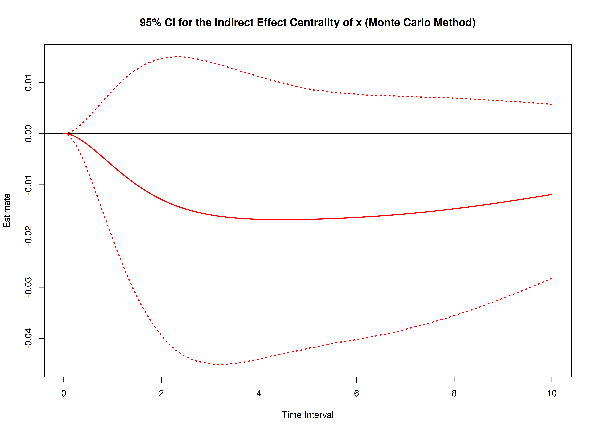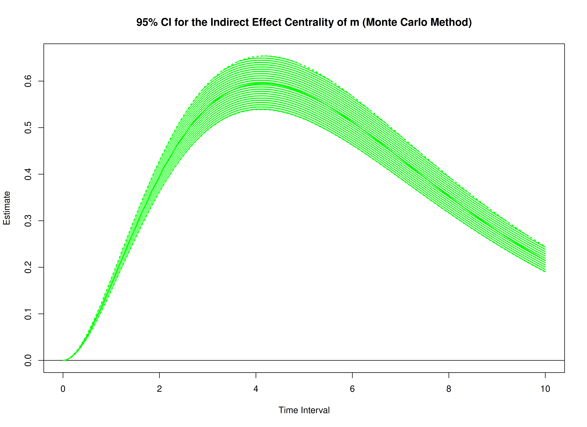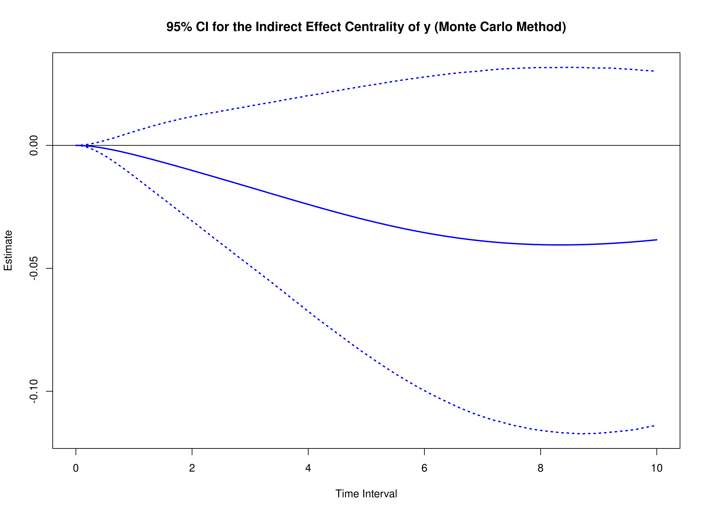

## References

Deboeck, P. R., & Preacher, K. J. (2015). No need to be discrete: A
method for continuous time mediation analysis. *Structural Equation
Modeling: A Multidisciplinary Journal*, *23*(1), 61–75.
<https://doi.org/10.1080/10705511.2014.973960>

Pesigan, I. J. A., Russell, M. A., & Chow, S.-M. (2025). Inferences and
effect sizes for direct, indirect, and total effects in continuous-time
mediation models. *Psychological Methods*.
<https://doi.org/10.1037/met0000779>

R Core Team. (2026). *R: A language and environment for statistical
computing*. R Foundation for Statistical Computing.
<https://www.R-project.org/>

Ryan, O., & Hamaker, E. L. (2021). Time to intervene: A continuous-time
approach to network analysis and centrality. *Psychometrika*, *87*(1),
214–252. <https://doi.org/10.1007/s11336-021-09767-0>
