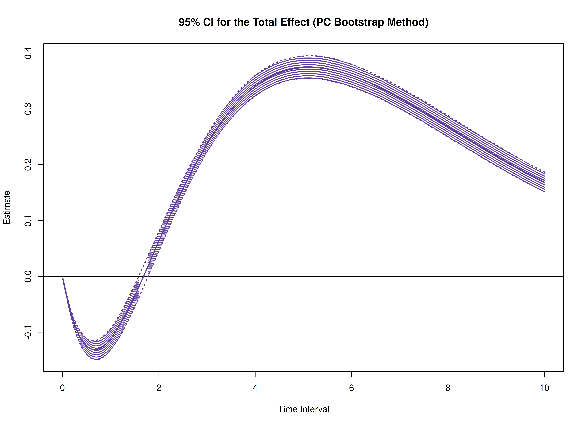
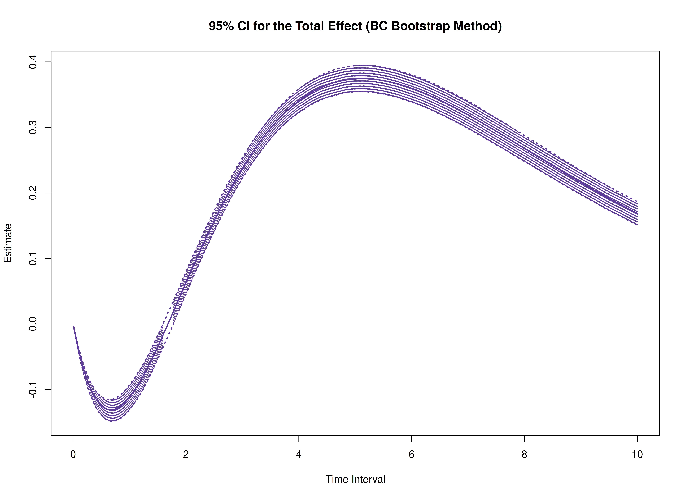
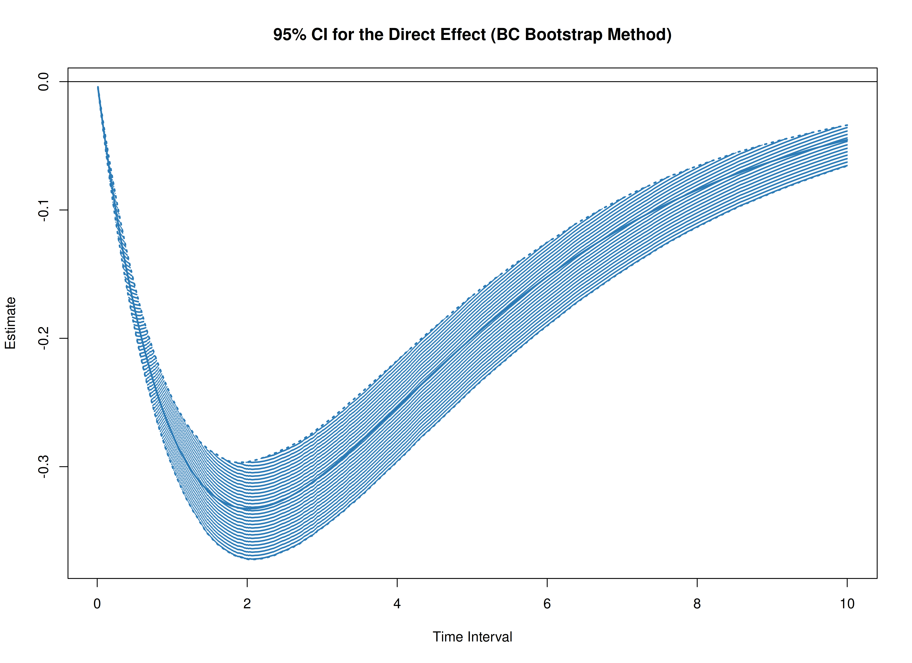
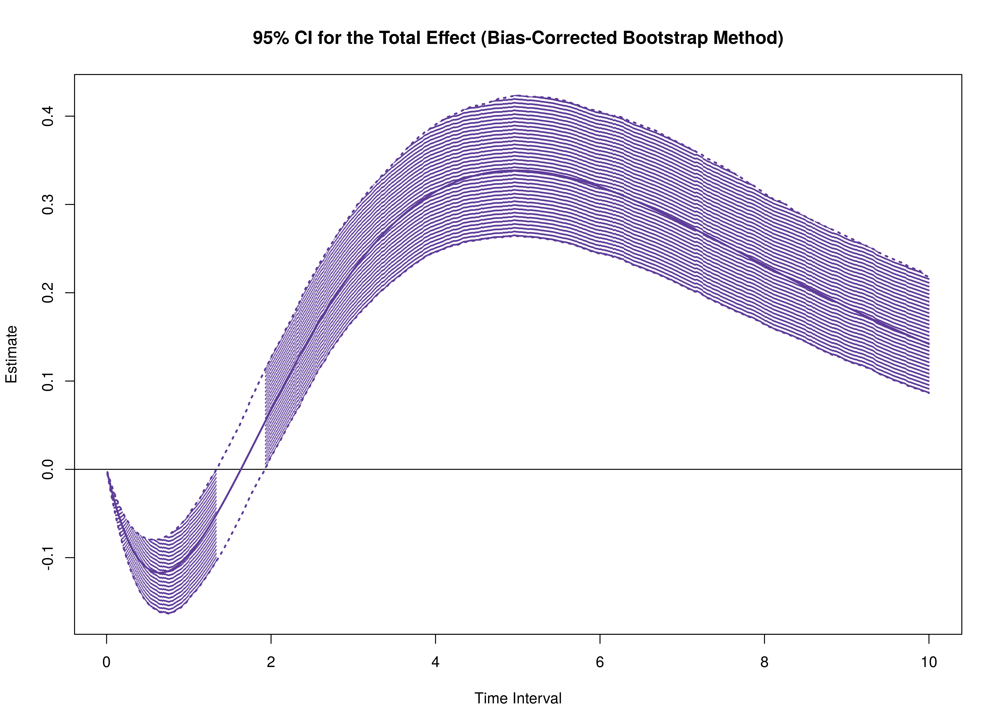
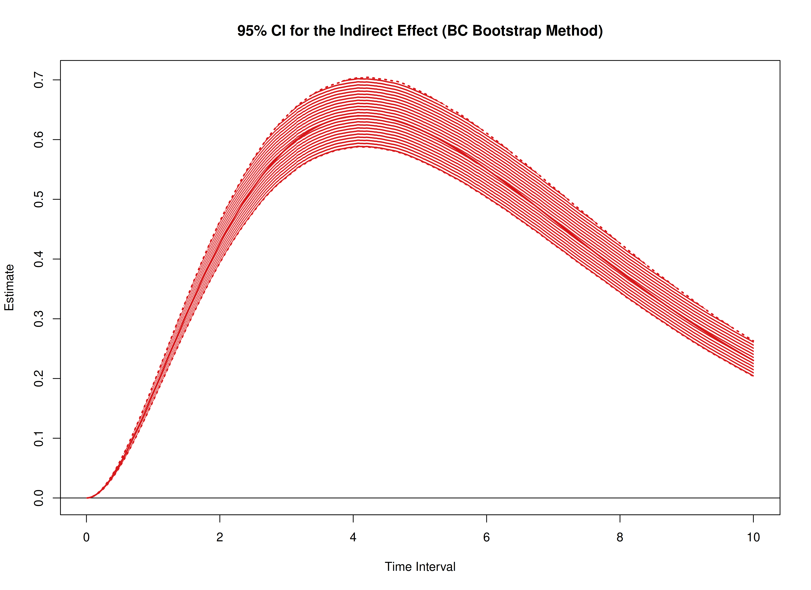

# Total, Direct, and Indirect Effects in Continuous-Time Mediation Model (Bootstrap)

The `cTMed` package provides a bootstrap approach, in addition to the
delta and Monte Carlo methods, for estimating and quantifying
uncertainty in total, direct, and indirect effects within
continuous-time mediation models across different time intervals.

In this example, we will use the fitted model from [Fit the
Continuous-Time Vector Autoregressive Model Using the dynr
Package](https://jeksterslab.github.io/cTMed/articles/fit-ct-var-dynr.html).
The object `fit` represents a fitted CT-VAR model created using the
`dynr` package.

``` r

summary(fit)
#> Coefficients:
#>             Estimate Std. Error t value  ci.lower  ci.upper Pr(>|t|)    
#> phi_1_1    -0.351839   0.036416  -9.662 -0.423213 -0.280465   <2e-16 ***
#> phi_2_1     0.744282   0.021777  34.177  0.701599  0.786964   <2e-16 ***
#> phi_3_1    -0.458680   0.023534 -19.490 -0.504806 -0.412554   <2e-16 ***
#> phi_1_2     0.017311   0.031705   0.546 -0.044829  0.079451   0.2925    
#> phi_2_2    -0.488821   0.019277 -25.358 -0.526602 -0.451039   <2e-16 ***
#> phi_3_2     0.726800   0.020871  34.824  0.685894  0.767706   <2e-16 ***
#> phi_1_3    -0.023814   0.024025  -0.991 -0.070903  0.023275   0.1608    
#> phi_2_3    -0.009810   0.014718  -0.667 -0.038657  0.019036   0.2525    
#> phi_3_3    -0.688334   0.016040 -42.913 -0.719773 -0.656896   <2e-16 ***
#> sigma_1_1   0.242180   0.006794  35.646  0.228864  0.255496   <2e-16 ***
#> sigma_2_1   0.023273   0.002545   9.146  0.018285  0.028261   <2e-16 ***
#> sigma_3_1  -0.050574   0.002749 -18.395 -0.055963 -0.045186   <2e-16 ***
#> sigma_2_2   0.070722   0.001907  37.093  0.066985  0.074458   <2e-16 ***
#> sigma_3_2   0.014987   0.001381  10.854  0.012281  0.017694   <2e-16 ***
#> sigma_3_3   0.072376   0.002099  34.475  0.068261  0.076491   <2e-16 ***
#> theta_1_1   0.198861   0.001170 169.909  0.196567  0.201155   <2e-16 ***
#> theta_2_2   0.199520   0.001000 199.500  0.197560  0.201480   <2e-16 ***
#> theta_3_3   0.201172   0.001016 198.052  0.199181  0.203162   <2e-16 ***
#> mu0_1_1     0.006324   0.111110   0.057 -0.211447  0.224095   0.4773    
#> mu0_2_1    -0.042530   0.114320  -0.372 -0.266593  0.181533   0.3549    
#> mu0_3_1     0.130043   0.102109   1.274 -0.070086  0.330172   0.1014    
#> sigma0_1_1  1.150287   0.168811   6.814  0.819425  1.481150   <2e-16 ***
#> sigma0_2_1  0.413648   0.133495   3.099  0.152003  0.675293   0.0010 ***
#> sigma0_3_1  0.225993   0.123478   1.830 -0.016019  0.468006   0.0336 *  
#> sigma0_2_2  1.221957   0.182233   6.705  0.864787  1.579128   <2e-16 ***
#> sigma0_3_2  0.235327   0.117629   2.001  0.004779  0.465875   0.0227 *  
#> sigma0_3_3  0.962594   0.142152   6.772  0.683981  1.241207   <2e-16 ***
#> ---
#> Signif. codes:  0 '***' 0.001 '**' 0.01 '*' 0.05 '.' 0.1 ' ' 1
#> 
#> -2 log-likelihood value at convergence = 429365.49
#> AIC = 429419.49
#> BIC = 429676.34
```

We need to extract the estimated parameters from the fitted object,
which will be used to generate bootstrap samples.

``` r

est <- coef(fit)
n
#> [1] 100
time
#> [1] 1000
delta_t
#> [1] 0.1
lambda
#>      [,1] [,2] [,3]
#> [1,]    1    0    0
#> [2,]    0    1    0
#> [3,]    0    0    1
nu
#> [1] 0 0 0
mu
#> [1] 0 0 0
mu0 <- est[
  c(
    "mu0_1_1",
    "mu0_2_1",
    "mu0_3_1"
  )
]
mu0
#>      mu0_1_1      mu0_2_1      mu0_3_1 
#>  0.006324029 -0.042529883  0.130043337
sigma0 <- matrix(
  data = est[
    c(
      "sigma0_1_1",
      "sigma0_2_1",
      "sigma0_3_1",
      "sigma0_2_1",
      "sigma0_2_2",
      "sigma0_3_2",
      "sigma0_3_1",
      "sigma0_3_2",
      "sigma0_3_3"
    )
  ],
  nrow = 3,
  ncol = 3
)
sigma0
#>           [,1]      [,2]      [,3]
#> [1,] 1.1502873 0.4136480 0.2259932
#> [2,] 0.4136480 1.2219574 0.2353267
#> [3,] 0.2259932 0.2353267 0.9625940
sigma0_l <- t(chol(sigma0))
phi <- matrix(
  data = est[
    c(
      "phi_1_1",
      "phi_2_1",
      "phi_3_1",
      "phi_1_2",
      "phi_2_2",
      "phi_3_2",
      "phi_1_3",
      "phi_2_3",
      "phi_3_3"
    )
  ],
  nrow = 3,
  ncol = 3
)
phi
#>            [,1]        [,2]         [,3]
#> [1,] -0.3518392  0.01731083 -0.023814339
#> [2,]  0.7442816 -0.48882067 -0.009810166
#> [3,] -0.4586796  0.72679980 -0.688334177
sigma <- matrix(
  data = est[
    c(
      "sigma_1_1", "sigma_2_1", "sigma_3_1",
      "sigma_2_1", "sigma_2_2", "sigma_3_2",
      "sigma_3_1", "sigma_3_2", "sigma_3_3"
    )
  ],
  nrow = 3,
  ncol = 3
)
sigma
#>             [,1]       [,2]        [,3]
#> [1,]  0.24218026 0.02327296 -0.05057416
#> [2,]  0.02327296 0.07072156  0.01498732
#> [3,] -0.05057416 0.01498732  0.07237598
sigma_l <- t(chol(sigma))
theta <- diag(3)
diag(theta) <- est[
  c(
    "theta_1_1",
    "theta_2_2",
    "theta_3_3"
  )
]
theta
#>           [,1]      [,2]      [,3]
#> [1,] 0.1988611 0.0000000 0.0000000
#> [2,] 0.0000000 0.1995203 0.0000000
#> [3,] 0.0000000 0.0000000 0.2011716
theta_l <- t(chol(theta))
```

``` r

R <- 1000L # use at least 1000 in actual research
path <- getwd()
prefix <- "ou"
```

The estimated parameters are then passed as arguments to the
`PBSSMOUFixed` function from the `bootStateSpace` package, which
generates a parametric bootstrap sampling distribution of the parameter
estimates. The argument `R` specifies the number of bootstrap
replications. The generated data and model estimates are stored in
`path` using the specified `prefix` for the file names. The
`ncores = parallel::detectCores()` argument instructs the function to
use all available CPU cores in the system.

> ***NOTE:*** Fitting the CT-VAR model multiple times is computationally
> intensive.

``` r

library(bootStateSpace)
boot <- PBSSMOUFixed(
  R = R,
  path = path,
  prefix = prefix,
  n = n,
  time = time,
  delta_t = delta_t,
  mu0 = mu0,
  sigma0_l = sigma0_l,
  mu = mu,
  phi = phi,
  sigma_l = sigma_l,
  nu = nu,
  lambda = lambda,
  theta_l = theta_l,
  ncores = parallel::detectCores(),
  seed = 42,
  clean = FALSE
)
```

The `extract` function from the `bootStateSpace` package is used to
extract the bootstrap phi matrices as well as the sigma matrices.

``` r

phi <- extract(object = boot, what = "phi")
```

``` r

sigma <- extract(object = boot, what = "sigma")
```

In this example, we aim to calculate the total, direct, and indirect
effects of `x` on `y`, mediated through `m`, over time intervals ranging
from 0 to 10.

``` r

# time intervals
delta_t <- seq(from = 0, to = 10, length.out = 1000)
```

We also need the estimated drift matrix from the original sample.

``` r

# estimated drift matrix
phi_hat <- matrix(
  data = est[
    c(
      "phi_1_1",
      "phi_2_1",
      "phi_3_1",
      "phi_1_2",
      "phi_2_2",
      "phi_3_2",
      "phi_1_3",
      "phi_2_3",
      "phi_3_3"
    )
  ],
  nrow = 3,
  ncol = 3
)
colnames(phi_hat) <- rownames(phi_hat) <- c("x", "m", "y")
```

For the standardized effects, the estimated process noise covariance
matrix from the original sample is also needed.

``` r

# estimated process noise covariance matrix
sigma_hat <- matrix(
  data = est[
    c(
      "sigma_1_1", "sigma_2_1", "sigma_3_1",
      "sigma_2_1", "sigma_2_2", "sigma_3_2",
      "sigma_3_1", "sigma_3_2", "sigma_3_3"
    )
  ],
  nrow = 3,
  ncol = 3
)
```

## Bootstrap Method

``` r

library(cTMed)
boot <- BootMed(
  phi = phi,
  phi_hat = phi_hat,
  delta_t = delta_t,
  from = "x",
  to = "y",
  med = "m",
  ncores = parallel::detectCores() # use multiple cores
)
```

``` r

plot(boot)
```



``` r

plot(boot, type = "bc")
```



The following generates bootstrap confidence intervals for the
standardized effects.

``` r

boot <- BootMedStd(
  phi = phi,
  sigma = sigma,
  phi_hat = phi_hat,
  sigma_hat = sigma_hat,
  delta_t = delta_t,
  from = "x",
  to = "y",
  med = "m",
  ncores = parallel::detectCores() # use multiple cores
)
```

``` r

plot(boot)
```


``` r

plot(boot, type = "bc")
```



## References

Deboeck, P. R., & Preacher, K. J. (2015). No need to be discrete: A
method for continuous time mediation analysis. *Structural Equation
Modeling: A Multidisciplinary Journal*, *23*(1), 61–75.
<https://doi.org/10.1080/10705511.2014.973960>

Pesigan, I. J. A., Russell, M. A., & Chow, S.-M. (2025). Inferences and
effect sizes for direct, indirect, and total effects in continuous-time
mediation models. *Psychological Methods*.
<https://doi.org/10.1037/met0000779>

R Core Team. (2024). *R: A language and environment for statistical
computing*. R Foundation for Statistical Computing.
<https://www.R-project.org/>

Ryan, O., & Hamaker, E. L. (2021). Time to intervene: A continuous-time
approach to network analysis and centrality. *Psychometrika*, *87*(1),
214–252. <https://doi.org/10.1007/s11336-021-09767-0>
