The `cTMed` package offers tools for estimating standardized total and indirect effect centrality in continuous-time mediation models and for quantifying uncertainty in these standardized centrality indices using the delta and Monte Carlo methods. Standardized effect centrality rescales the dynamic effects using the process noise covariance matrix, so the drift matrix, the process noise covariance matrix, and their joint sampling variance-covariance matrix are required. For guidance on fitting CT-VAR models using the `dynr` or `OpenMx` packages, refer to [Fit the Continuous-Time Vector Autoregressive Model Using the dynr Package](https://jeksterslab.github.io/cTMed/articles/fit-ct-var-dynr.html) and [Fit the Continuous-Time Vector Autoregressive Model Using the OpenMx Package](https://jeksterslab.github.io/cTMed/articles/fit-ct-var-mx.html), respectively.


``` r
summary(fit)
#> Coefficients:
#>             Estimate Std. Error t value  ci.lower  ci.upper Pr(>|t|)    
#> phi_1_1    -0.351839   0.036416  -9.662 -0.423213 -0.280465   <2e-16 ***
#> phi_2_1     0.744282   0.021777  34.177  0.701599  0.786964   <2e-16 ***
#> phi_3_1    -0.458680   0.023534 -19.490 -0.504806 -0.412554   <2e-16 ***
#> phi_1_2     0.017311   0.031705   0.546 -0.044829  0.079451   0.2925    
#> phi_2_2    -0.488821   0.019277 -25.358 -0.526602 -0.451039   <2e-16 ***
#> phi_3_2     0.726800   0.020871  34.824  0.685894  0.767706   <2e-16 ***
#> phi_1_3    -0.023814   0.024025  -0.991 -0.070903  0.023275   0.1608    
#> phi_2_3    -0.009810   0.014718  -0.667 -0.038657  0.019036   0.2525    
#> phi_3_3    -0.688334   0.016040 -42.913 -0.719773 -0.656896   <2e-16 ***
#> sigma_1_1   0.242180   0.006794  35.646  0.228864  0.255496   <2e-16 ***
#> sigma_2_1   0.023273   0.002545   9.146  0.018285  0.028261   <2e-16 ***
#> sigma_3_1  -0.050574   0.002749 -18.395 -0.055963 -0.045186   <2e-16 ***
#> sigma_2_2   0.070722   0.001907  37.093  0.066985  0.074458   <2e-16 ***
#> sigma_3_2   0.014987   0.001381  10.854  0.012281  0.017694   <2e-16 ***
#> sigma_3_3   0.072376   0.002099  34.475  0.068261  0.076491   <2e-16 ***
#> theta_1_1   0.198861   0.001170 169.909  0.196567  0.201155   <2e-16 ***
#> theta_2_2   0.199520   0.001000 199.500  0.197560  0.201480   <2e-16 ***
#> theta_3_3   0.201172   0.001016 198.052  0.199181  0.203162   <2e-16 ***
#> mu0_1_1     0.006324   0.111110   0.057 -0.211447  0.224095   0.4773    
#> mu0_2_1    -0.042530   0.114320  -0.372 -0.266593  0.181533   0.3549    
#> mu0_3_1     0.130043   0.102109   1.274 -0.070086  0.330172   0.1014    
#> sigma0_1_1  1.150287   0.168811   6.814  0.819425  1.481150   <2e-16 ***
#> sigma0_2_1  0.413648   0.133495   3.099  0.152003  0.675293   0.0010 ***
#> sigma0_3_1  0.225993   0.123478   1.830 -0.016019  0.468006   0.0336 *  
#> sigma0_2_2  1.221957   0.182233   6.705  0.864787  1.579128   <2e-16 ***
#> sigma0_3_2  0.235327   0.117629   2.001  0.004779  0.465875   0.0227 *  
#> sigma0_3_3  0.962594   0.142152   6.772  0.683981  1.241207   <2e-16 ***
#> ---
#> Signif. codes:  0 '***' 0.001 '**' 0.01 '*' 0.05 '.' 0.1 ' ' 1
#> 
#> -2 log-likelihood value at convergence = 429365.49
#> AIC = 429419.49
#> BIC = 429676.34
```


``` r
phi_varnames <- c(
  "phi_1_1",
  "phi_2_1",
  "phi_3_1",
  "phi_1_2",
  "phi_2_2",
  "phi_3_2",
  "phi_1_3",
  "phi_2_3",
  "phi_3_3"
)
phi <- matrix(
  data = coef(fit)[phi_varnames],
  nrow = 3,
  ncol = 3
)
colnames(phi) <- rownames(phi) <- c("x", "m", "y")
sigma_varnames <- c(
  "sigma_1_1", "sigma_2_1", "sigma_3_1",
  "sigma_2_1", "sigma_2_2", "sigma_3_2",
  "sigma_3_1", "sigma_3_2", "sigma_3_3"
)
sigma <- matrix(
  data = coef(fit)[sigma_varnames],
  nrow = 3,
  ncol = 3
)
theta_varnames <- c(
  phi_varnames,
  "sigma_1_1", "sigma_2_1", "sigma_3_1",
  "sigma_2_2", "sigma_3_2",
  "sigma_3_3"
)
vcov_theta <- vcov(fit)[theta_varnames, theta_varnames]
```


``` r
# Drift matrix
phi
#>            x           m            y
#> x -0.3518392  0.01731083 -0.023814339
#> m  0.7442816 -0.48882067 -0.009810166
#> y -0.4586796  0.72679980 -0.688334177
# Process noise covariance matrix
sigma
#>             [,1]       [,2]        [,3]
#> [1,]  0.24218026 0.02327296 -0.05057416
#> [2,]  0.02327296 0.07072156  0.01498732
#> [3,] -0.05057416 0.01498732  0.07237598
# Sampling variance-covariance matrix
vcov_theta
#>                 phi_1_1       phi_2_1       phi_3_1       phi_1_2       phi_2_2
#> phi_1_1    1.326121e-03  9.158296e-05 -2.258193e-04 -1.108000e-03 -8.829144e-05
#> phi_2_1    9.158296e-05  4.742430e-04 -3.596064e-06 -6.566903e-05 -4.021299e-04
#> phi_3_1   -2.258193e-04 -3.596064e-06  5.538551e-04  1.845433e-04  1.077730e-05
#> phi_1_2   -1.108000e-03 -6.566903e-05  1.845433e-04  1.005190e-03  7.060966e-05
#> phi_2_2   -8.829144e-05 -4.021299e-04  1.077730e-05  7.060966e-05  3.715859e-04
#> phi_3_2    1.994853e-04 -3.470399e-06 -4.716662e-04 -1.780693e-04 -3.561584e-06
#> phi_1_3    7.414387e-04  3.913166e-05 -1.151977e-04 -6.965449e-04 -4.344659e-05
#> phi_2_3    6.974956e-05  2.704005e-04 -1.452237e-05 -5.931610e-05 -2.595864e-04
#> phi_3_3   -1.424724e-04  7.176532e-06  3.208390e-04  1.318148e-04 -2.963173e-06
#> sigma_1_1 -1.982932e-04 -2.184773e-05  3.456919e-05  1.543789e-04  1.849510e-05
#> sigma_2_1  1.502203e-05 -3.437997e-05 -6.620570e-06 -1.591184e-05  2.574007e-05
#> sigma_3_1  1.794495e-05  4.674418e-06 -4.279970e-05 -1.117672e-05 -3.814434e-06
#> sigma_2_2  4.361454e-07  1.424515e-05  1.010140e-06 -1.579752e-07 -1.451605e-05
#> sigma_3_2 -3.741407e-06  1.607279e-06  8.491226e-06  3.585007e-06  4.201294e-07
#> sigma_3_3 -1.043117e-06 -8.607286e-07  3.442663e-06  7.089937e-08  4.858637e-07
#>                 phi_3_2       phi_1_3       phi_2_3       phi_3_3     sigma_1_1
#> phi_1_1    1.994853e-04  7.414387e-04  6.974956e-05 -1.424724e-04 -1.982932e-04
#> phi_2_1   -3.470399e-06  3.913166e-05  2.704005e-04  7.176532e-06 -2.184773e-05
#> phi_3_1   -4.716662e-04 -1.151977e-04 -1.452237e-05  3.208390e-04  3.456919e-05
#> phi_1_2   -1.780693e-04 -6.965449e-04 -5.931610e-05  1.318148e-04  1.543789e-04
#> phi_2_2   -3.561584e-06 -4.344659e-05 -2.595864e-04 -2.963173e-06  1.849510e-05
#> phi_3_2    4.355884e-04  1.163975e-04  1.028072e-05 -3.075120e-04 -2.844219e-05
#> phi_1_3    1.163975e-04  5.772234e-04  4.373490e-05 -1.045143e-04 -9.445101e-05
#> phi_2_3    1.028072e-05  4.373490e-05  2.166149e-04 -2.958830e-06 -1.266847e-05
#> phi_3_3   -3.075120e-04 -1.045143e-04 -2.958830e-06  2.572924e-04  1.859927e-05
#> sigma_1_1 -2.844219e-05 -9.445101e-05 -1.266847e-05  1.859927e-05  4.616001e-05
#> sigma_2_1  6.267263e-06  1.038566e-05 -1.506230e-05 -4.238014e-06 -3.795706e-07
#> sigma_3_1  3.275583e-05  1.446600e-06  2.154429e-06 -1.897455e-05 -5.585381e-06
#> sigma_2_2 -1.392458e-06  1.948765e-08  9.194261e-06  1.027499e-06 -1.692509e-07
#> sigma_3_2 -8.374628e-06 -2.326402e-06 -2.643065e-06  5.086543e-06  3.054065e-07
#> sigma_3_3  6.621115e-07  1.340588e-06  1.970612e-07 -5.788873e-06  6.193436e-07
#>               sigma_2_1     sigma_3_1     sigma_2_2     sigma_3_2     sigma_3_3
#> phi_1_1    1.502203e-05  1.794495e-05  4.361454e-07 -3.741407e-06 -1.043117e-06
#> phi_2_1   -3.437997e-05  4.674418e-06  1.424515e-05  1.607279e-06 -8.607286e-07
#> phi_3_1   -6.620570e-06 -4.279970e-05  1.010140e-06  8.491226e-06  3.442663e-06
#> phi_1_2   -1.591184e-05 -1.117672e-05 -1.579752e-07  3.585007e-06  7.089937e-08
#> phi_2_2    2.574007e-05 -3.814434e-06 -1.451605e-05  4.201294e-07  4.858637e-07
#> phi_3_2    6.267263e-06  3.275583e-05 -1.392458e-06 -8.374628e-06  6.621115e-07
#> phi_1_3    1.038566e-05  1.446600e-06  1.948765e-08 -2.326402e-06  1.340588e-06
#> phi_2_3   -1.506230e-05  2.154429e-06  9.194261e-06 -2.643065e-06  1.970612e-07
#> phi_3_3   -4.238014e-06 -1.897455e-05  1.027499e-06  5.086543e-06 -5.788873e-06
#> sigma_1_1 -3.795706e-07 -5.585381e-06 -1.692509e-07  3.054065e-07  6.193436e-07
#> sigma_2_1  6.475588e-06  1.002384e-07 -4.387889e-07 -9.708718e-07  3.360567e-08
#> sigma_3_1  1.002384e-07  7.558692e-06  9.058849e-08 -3.163361e-07 -1.947016e-06
#> sigma_2_2 -4.387889e-07  9.058849e-08  3.635137e-06  3.523268e-08 -4.509608e-08
#> sigma_3_2 -9.708718e-07 -3.163361e-07  3.523268e-08  1.906780e-06  4.773520e-08
#> sigma_3_3  3.360567e-08 -1.947016e-06 -4.509608e-08  4.773520e-08  4.407331e-06
```

In this example, we calculate standardized total and indirect effect centrality for the variables `x`, `m`, and `y` over time intervals ranging from 0 to 10. Unlike the path-specific mediation functions, the centrality functions do not require `from`, `to`, or `med` arguments because centrality is computed for each variable in the dynamic system.


``` r
# time intervals
delta_t <- seq(from = 0, to = 10, length.out = 1000)
```

## Delta Method

The delta method uses the estimated drift matrix, the estimated process noise covariance matrix, and their joint sampling variance-covariance matrix to approximate the sampling distribution of the standardized centrality estimates.


``` r
library(cTMed)
start <- Sys.time()
delta_total_std <- DeltaTotalCentralStd(
  phi = phi,
  sigma = sigma,
  vcov_theta = vcov_theta,
  delta_t = delta_t,
  ncores = parallel::detectCores() # use multiple cores
)
end <- Sys.time()
elapsed <- end - start
elapsed
#> Time difference of 1.026932 secs
```


``` r
summary(delta_total_std)
#> Call:
#> DeltaTotalCentralStd(phi = phi, sigma = sigma, vcov_theta = vcov_theta, 
#>     delta_t = delta_t, ncores = parallel::detectCores())
#> 
#> Total Effect Centrality
#>      variable interval     est     se       z      p    2.5%  97.5%
#> 1           x   0.0010  0.0001 0.0000  2.7201 0.0065  0.0000 0.0001
#> 2           m   0.0010  0.0010 0.0000 23.4129 0.0000  0.0009 0.0011
#> 3           y   0.0010  0.0000 0.0000 -1.1289 0.2589 -0.0001 0.0000
#> 4           x   0.0100  0.0009 0.0003  2.8308 0.0046  0.0003 0.0014
#> 5           m   0.0100  0.0103 0.0004 23.4722 0.0000  0.0094 0.0111
#> 6           y   0.0100 -0.0003 0.0003 -1.1289 0.2590 -0.0008 0.0002
#> 7           x   0.0200  0.0018 0.0006  2.9545 0.0031  0.0006 0.0030
#> 8           m   0.0200  0.0204 0.0009 23.5379 0.0000  0.0187 0.0221
#> 9           y   0.0200 -0.0006 0.0005 -1.1288 0.2590 -0.0016 0.0004
#> 10          x   0.0300  0.0028 0.0009  3.0788 0.0021  0.0010 0.0045
#> 11          m   0.0300  0.0305 0.0013 23.6034 0.0000  0.0279 0.0330
#> 12          y   0.0300 -0.0009 0.0008 -1.1288 0.2590 -0.0024 0.0006
#> 13          x   0.0400  0.0038 0.0012  3.2039 0.0014  0.0015 0.0061
#> 14          m   0.0400  0.0404 0.0017 23.6688 0.0000  0.0370 0.0437
#> 15          y   0.0400 -0.0012 0.0010 -1.1287 0.2590 -0.0032 0.0009
#> 16          x   0.0501  0.0049 0.0015  3.3297 0.0009  0.0020 0.0078
#> 17          m   0.0501  0.0502 0.0021 23.7340 0.0000  0.0460 0.0543
#> 18          y   0.0501 -0.0014 0.0013 -1.1287 0.2590 -0.0039 0.0011
#> 19          x   0.0601  0.0060 0.0017  3.4562 0.0005  0.0026 0.0094
#> 20          m   0.0601  0.0598 0.0025 23.7991 0.0000  0.0549 0.0648
#> 21          y   0.0601 -0.0017 0.0015 -1.1286 0.2591 -0.0047 0.0013
#> 22          x   0.0701  0.0072 0.0020  3.5834 0.0003  0.0033 0.0112
#> 23          m   0.0701  0.0694 0.0029 23.8639 0.0000  0.0637 0.0751
#> 24          y   0.0701 -0.0020 0.0018 -1.1286 0.2591 -0.0055 0.0015
#> 25          x   0.0801  0.0085 0.0023  3.7113 0.0002  0.0040 0.0130
#> 26          m   0.0801  0.0788 0.0033 23.9286 0.0000  0.0724 0.0853
#> 27          y   0.0801 -0.0023 0.0020 -1.1285 0.2591 -0.0062 0.0017
#> 28          x   0.0901  0.0098 0.0026  3.8399 0.0001  0.0048 0.0148
#> 29          m   0.0901  0.0881 0.0037 23.9931 0.0000  0.0809 0.0953
#> 30          y   0.0901 -0.0026 0.0023 -1.1285 0.2591 -0.0070 0.0019
#> 31          x   0.1001  0.0112 0.0028  3.9692 0.0001  0.0057 0.0167
#> 32          m   0.1001  0.0973 0.0040 24.0573 0.0000  0.0894 0.1053
#> 33          y   0.1001 -0.0028 0.0025 -1.1284 0.2591 -0.0078 0.0021
#> 34          x   0.1101  0.0126 0.0031  4.0993 0.0000  0.0066 0.0186
#> 35          m   0.1101  0.1064 0.0044 24.1214 0.0000  0.0978 0.1151
#> 36          y   0.1101 -0.0031 0.0028 -1.1283 0.2592 -0.0085 0.0023
#> 37          x   0.1201  0.0141 0.0033  4.2300 0.0000  0.0075 0.0206
#> 38          m   0.1201  0.1154 0.0048 24.1853 0.0000  0.1061 0.1248
#> 39          y   0.1201 -0.0034 0.0030 -1.1283 0.2592 -0.0092 0.0025
#> 40          x   0.1301  0.0156 0.0036  4.3615 0.0000  0.0086 0.0226
#> 41          m   0.1301  0.1243 0.0051 24.2489 0.0000  0.1142 0.1343
#> 42          y   0.1301 -0.0036 0.0032 -1.1282 0.2592 -0.0100 0.0027
#> 43          x   0.1401  0.0172 0.0038  4.4937 0.0000  0.0097 0.0246
#> 44          m   0.1401  0.1330 0.0055 24.3123 0.0000  0.1223 0.1438
#> 45          y   0.1401 -0.0039 0.0035 -1.1281 0.2593 -0.0107 0.0029
#> 46          x   0.1502  0.0188 0.0041  4.6267 0.0000  0.0108 0.0267
#> 47          m   0.1502  0.1417 0.0058 24.3755 0.0000  0.1303 0.1531
#> 48          y   0.1502 -0.0042 0.0037 -1.1281 0.2593 -0.0114 0.0031
#> 49          x   0.1602  0.0204 0.0043  4.7603 0.0000  0.0120 0.0289
#> 50          m   0.1602  0.1502 0.0061 24.4385 0.0000  0.1382 0.1623
#> 51          y   0.1602 -0.0044 0.0039 -1.1280 0.2593 -0.0122 0.0033
#> 52          x   0.1702  0.0222 0.0045  4.8947 0.0000  0.0133 0.0310
#> 53          m   0.1702  0.1587 0.0065 24.5012 0.0000  0.1460 0.1714
#> 54          y   0.1702 -0.0047 0.0042 -1.1279 0.2593 -0.0129 0.0035
#> 55          x   0.1802  0.0239 0.0048  5.0298 0.0000  0.0146 0.0332
#> 56          m   0.1802  0.1670 0.0068 24.5637 0.0000  0.1537 0.1803
#> 57          y   0.1802 -0.0050 0.0044 -1.1279 0.2594 -0.0136 0.0037
#> 58          x   0.1902  0.0257 0.0050  5.1657 0.0000  0.0160 0.0355
#> 59          m   0.1902  0.1752 0.0071 24.6260 0.0000  0.1613 0.1892
#> 60          y   0.1902 -0.0052 0.0046 -1.1278 0.2594 -0.0143 0.0039
#> 61          x   0.2002  0.0276 0.0052  5.3023 0.0000  0.0174 0.0378
#> 62          m   0.2002  0.1833 0.0074 24.6879 0.0000  0.1688 0.1979
#> 63          y   0.2002 -0.0055 0.0049 -1.1277 0.2594 -0.0150 0.0040
#> 64          x   0.2102  0.0295 0.0054  5.4396 0.0000  0.0188 0.0401
#> 65          m   0.2102  0.1913 0.0077 24.7497 0.0000  0.1762 0.2065
#> 66          y   0.2102 -0.0057 0.0051 -1.1276 0.2595 -0.0157 0.0042
#> 67          x   0.2202  0.0314 0.0056  5.5777 0.0000  0.0204 0.0424
#> 68          m   0.2202  0.1993 0.0080 24.8111 0.0000  0.1835 0.2150
#> 69          y   0.2202 -0.0060 0.0053 -1.1275 0.2595 -0.0164 0.0044
#> 70          x   0.2302  0.0334 0.0058  5.7165 0.0000  0.0219 0.0448
#> 71          m   0.2302  0.2071 0.0083 24.8723 0.0000  0.1908 0.2234
#> 72          y   0.2302 -0.0062 0.0055 -1.1275 0.2595 -0.0171 0.0046
#> 73          x   0.2402  0.0354 0.0060  5.8560 0.0000  0.0235 0.0472
#> 74          m   0.2402  0.2148 0.0086 24.9332 0.0000  0.1979 0.2317
#> 75          y   0.2402 -0.0065 0.0058 -1.1274 0.2596 -0.0178 0.0048
#> 76          x   0.2503  0.0374 0.0062  5.9963 0.0000  0.0252 0.0497
#> 77          m   0.2503  0.2224 0.0089 24.9938 0.0000  0.2050 0.2398
#> 78          y   0.2503 -0.0067 0.0060 -1.1273 0.2596 -0.0185 0.0050
#> 79          x   0.2603  0.0395 0.0064  6.1373 0.0000  0.0269 0.0522
#> 80          m   0.2603  0.2299 0.0092 25.0542 0.0000  0.2119 0.2479
#> 81          y   0.2603 -0.0070 0.0062 -1.1272 0.2597 -0.0192 0.0052
#> 82          x   0.2703  0.0417 0.0066  6.2790 0.0000  0.0287 0.0547
#> 83          m   0.2703  0.2373 0.0094 25.1142 0.0000  0.2188 0.2558
#> 84          y   0.2703 -0.0072 0.0064 -1.1271 0.2597 -0.0198 0.0054
#> 85          x   0.2803  0.0438 0.0068  6.4215 0.0000  0.0305 0.0572
#> 86          m   0.2803  0.2446 0.0097 25.1740 0.0000  0.2256 0.2637
#> 87          y   0.2803 -0.0075 0.0066 -1.1270 0.2597 -0.0205 0.0055
#> 88          x   0.2903  0.0461 0.0070  6.5647 0.0000  0.0323 0.0598
#> 89          m   0.2903  0.2519 0.0100 25.2334 0.0000  0.2323 0.2714
#> 90          y   0.2903 -0.0077 0.0069 -1.1269 0.2598 -0.0212 0.0057
#> 91          x   0.3003  0.0483 0.0072  6.7087 0.0000  0.0342 0.0624
#> 92          m   0.3003  0.2590 0.0102 25.2925 0.0000  0.2389 0.2791
#> 93          y   0.3003 -0.0080 0.0071 -1.1268 0.2598 -0.0218 0.0059
#> 94          x   0.3103  0.0506 0.0074  6.8534 0.0000  0.0361 0.0651
#> 95          m   0.3103  0.2660 0.0105 25.3513 0.0000  0.2455 0.2866
#> 96          y   0.3103 -0.0082 0.0073 -1.1267 0.2599 -0.0225 0.0061
#> 97          x   0.3203  0.0529 0.0076  6.9989 0.0000  0.0381 0.0677
#> 98          m   0.3203  0.2730 0.0107 25.4098 0.0000  0.2519 0.2940
#> 99          y   0.3203 -0.0084 0.0075 -1.1266 0.2599 -0.0231 0.0062
#> 100         x   0.3303  0.0553 0.0077  7.1451 0.0000  0.0401 0.0704
#> 101         m   0.3303  0.2798 0.0110 25.4679 0.0000  0.2583 0.3013
#> 102         y   0.3303 -0.0087 0.0077 -1.1265 0.2599 -0.0238 0.0064
#> 103         x   0.3403  0.0577 0.0079  7.2920 0.0000  0.0422 0.0731
#> 104         m   0.3403  0.2866 0.0112 25.5257 0.0000  0.2646 0.3086
#> 105         y   0.3403 -0.0089 0.0079 -1.1264 0.2600 -0.0244 0.0066
#> 106         x   0.3504  0.0601 0.0081  7.4397 0.0000  0.0442 0.0759
#> 107         m   0.3504  0.2932 0.0115 25.5832 0.0000  0.2708 0.3157
#> 108         y   0.3504 -0.0091 0.0081 -1.1263 0.2600 -0.0251 0.0068
#> 109         x   0.3604  0.0625 0.0082  7.5881 0.0000  0.0464 0.0787
#> 110         m   0.3604  0.2998 0.0117 25.6403 0.0000  0.2769 0.3227
#> 111         y   0.3604 -0.0094 0.0083 -1.1262 0.2601 -0.0257 0.0069
#> 112         x   0.3704  0.0650 0.0084  7.7373 0.0000  0.0485 0.0815
#> 113         m   0.3704  0.3063 0.0119 25.6971 0.0000  0.2829 0.3296
#> 114         y   0.3704 -0.0096 0.0085 -1.1261 0.2601 -0.0263 0.0071
#> 115         x   0.3804  0.0675 0.0086  7.8872 0.0000  0.0507 0.0843
#> 116         m   0.3804  0.3127 0.0121 25.7535 0.0000  0.2889 0.3365
#> 117         y   0.3804 -0.0098 0.0087 -1.1260 0.2602 -0.0270 0.0073
#> 118         x   0.3904  0.0701 0.0087  8.0378 0.0000  0.0530 0.0872
#> 119         m   0.3904  0.3190 0.0124 25.8095 0.0000  0.2948 0.3432
#> 120         y   0.3904 -0.0101 0.0089 -1.1259 0.2602 -0.0276 0.0075
#> 121         x   0.4004  0.0726 0.0089  8.1892 0.0000  0.0553 0.0900
#> 122         m   0.4004  0.3252 0.0126 25.8652 0.0000  0.3006 0.3499
#> 123         y   0.4004 -0.0103 0.0091 -1.1258 0.2602 -0.0282 0.0076
#> 124         x   0.4104  0.0753 0.0090  8.3413 0.0000  0.0576 0.0929
#> 125         m   0.4104  0.3314 0.0128 25.9205 0.0000  0.3063 0.3564
#> 126         y   0.4104 -0.0105 0.0093 -1.1257 0.2603 -0.0288 0.0078
#> 127         x   0.4204  0.0779 0.0092  8.4942 0.0000  0.0599 0.0959
#> 128         m   0.4204  0.3374 0.0130 25.9754 0.0000  0.3120 0.3629
#> 129         y   0.4204 -0.0107 0.0095 -1.1256 0.2603 -0.0294 0.0080
#> 130         x   0.4304  0.0805 0.0093  8.6477 0.0000  0.0623 0.0988
#> 131         m   0.4304  0.3434 0.0132 26.0299 0.0000  0.3175 0.3692
#> 132         y   0.4304 -0.0110 0.0097 -1.1255 0.2604 -0.0300 0.0081
#> 133         x   0.4404  0.0832 0.0095  8.8020 0.0000  0.0647 0.1018
#> 134         m   0.4404  0.3493 0.0134 26.0841 0.0000  0.3230 0.3755
#> 135         y   0.4404 -0.0112 0.0099 -1.1254 0.2604 -0.0306 0.0083
#> 136         x   0.4505  0.0860 0.0096  8.9571 0.0000  0.0671 0.1048
#> 137         m   0.4505  0.3551 0.0136 26.1378 0.0000  0.3285 0.3817
#> 138         y   0.4505 -0.0114 0.0101 -1.1252 0.2605 -0.0312 0.0084
#> 139         x   0.4605  0.0887 0.0097  9.1128 0.0000  0.0696 0.1078
#> 140         m   0.4605  0.3608 0.0138 26.1911 0.0000  0.3338 0.3878
#> 141         y   0.4605 -0.0116 0.0103 -1.1251 0.2605 -0.0318 0.0086
#> 142         x   0.4705  0.0915 0.0099  9.2693 0.0000  0.0721 0.1108
#> 143         m   0.4705  0.3664 0.0140 26.2440 0.0000  0.3391 0.3938
#> 144         y   0.4705 -0.0118 0.0105 -1.1250 0.2606 -0.0324 0.0088
#> 145         x   0.4805  0.0942 0.0100  9.4265 0.0000  0.0747 0.1138
#> 146         m   0.4805  0.3720 0.0141 26.2965 0.0000  0.3443 0.3997
#> 147         y   0.4805 -0.0120 0.0107 -1.1249 0.2606 -0.0330 0.0089
#> 148         x   0.4905  0.0971 0.0101  9.5844 0.0000  0.0772 0.1169
#> 149         m   0.4905  0.3775 0.0143 26.3485 0.0000  0.3494 0.4056
#> 150         y   0.4905 -0.0122 0.0109 -1.1248 0.2607 -0.0336 0.0091
#> 151         x   0.5005  0.0999 0.0103  9.7431 0.0000  0.0798 0.1200
#> 152         m   0.5005  0.3829 0.0145 26.4002 0.0000  0.3545 0.4113
#> 153         y   0.5005 -0.0124 0.0111 -1.1247 0.2607 -0.0341 0.0092
#> 154         x   0.5105  0.1028 0.0104  9.9024 0.0000  0.0824 0.1231
#> 155         m   0.5105  0.3882 0.0147 26.4514 0.0000  0.3595 0.4170
#> 156         y   0.5105 -0.0127 0.0113 -1.1245 0.2608 -0.0347 0.0094
#> 157         x   0.5205  0.1056 0.0105 10.0625 0.0000  0.0851 0.1262
#> 158         m   0.5205  0.3935 0.0148 26.5021 0.0000  0.3644 0.4226
#> 159         y   0.5205 -0.0129 0.0114 -1.1244 0.2608 -0.0353 0.0096
#> 160         x   0.5305  0.1086 0.0106 10.2232 0.0000  0.0877 0.1294
#> 161         m   0.5305  0.3986 0.0150 26.5524 0.0000  0.3692 0.4281
#> 162         y   0.5305 -0.0131 0.0116 -1.1243 0.2609 -0.0358 0.0097
#> 163         x   0.5405  0.1115 0.0107 10.3847 0.0000  0.0904 0.1325
#> 164         m   0.5405  0.4037 0.0152 26.6023 0.0000  0.3740 0.4335
#> 165         y   0.5405 -0.0133 0.0118 -1.1242 0.2609 -0.0364 0.0099
#> 166         x   0.5506  0.1144 0.0108 10.5468 0.0000  0.0932 0.1357
#> 167         m   0.5506  0.4088 0.0153 26.6517 0.0000  0.3787 0.4388
#> 168         y   0.5506 -0.0135 0.0120 -1.1240 0.2610 -0.0370 0.0100
#> 169         x   0.5606  0.1174 0.0110 10.7097 0.0000  0.0959 0.1389
#> 170         m   0.5606  0.4137 0.0155 26.7006 0.0000  0.3833 0.4441
#> 171         y   0.5606 -0.0137 0.0122 -1.1239 0.2611 -0.0375 0.0102
#> 172         x   0.5706  0.1204 0.0111 10.8732 0.0000  0.0987 0.1421
#> 173         m   0.5706  0.4186 0.0156 26.7491 0.0000  0.3879 0.4493
#> 174         y   0.5706 -0.0139 0.0123 -1.1238 0.2611 -0.0381 0.0103
#> 175         x   0.5806  0.1234 0.0112 11.0374 0.0000  0.1015 0.1453
#> 176         m   0.5806  0.4234 0.0158 26.7971 0.0000  0.3924 0.4544
#> 177         y   0.5806 -0.0141 0.0125 -1.1236 0.2612 -0.0386 0.0105
#> 178         x   0.5906  0.1264 0.0113 11.2023 0.0000  0.1043 0.1485
#> 179         m   0.5906  0.4281 0.0159 26.8446 0.0000  0.3969 0.4594
#> 180         y   0.5906 -0.0143 0.0127 -1.1235 0.2612 -0.0391 0.0106
#> 181         x   0.6006  0.1295 0.0114 11.3678 0.0000  0.1071 0.1518
#> 182         m   0.6006  0.4328 0.0161 26.8916 0.0000  0.4012 0.4643
#> 183         y   0.6006 -0.0145 0.0129 -1.1234 0.2613 -0.0397 0.0108
#> 184         x   0.6106  0.1325 0.0115 11.5341 0.0000  0.1100 0.1550
#> 185         m   0.6106  0.4374 0.0162 26.9382 0.0000  0.4056 0.4692
#> 186         y   0.6106 -0.0146 0.0130 -1.1232 0.2613 -0.0402 0.0109
#> 187         x   0.6206  0.1356 0.0116 11.7010 0.0000  0.1129 0.1583
#> 188         m   0.6206  0.4419 0.0164 26.9842 0.0000  0.4098 0.4740
#> 189         y   0.6206 -0.0148 0.0132 -1.1231 0.2614 -0.0407 0.0111
#> 190         x   0.6306  0.1387 0.0117 11.8685 0.0000  0.1158 0.1616
#> 191         m   0.6306  0.4463 0.0165 27.0298 0.0000  0.4140 0.4787
#> 192         y   0.6306 -0.0150 0.0134 -1.1230 0.2615 -0.0413 0.0112
#> 193         x   0.6406  0.1418 0.0118 12.0367 0.0000  0.1187 0.1649
#> 194         m   0.6406  0.4507 0.0166 27.0748 0.0000  0.4181 0.4834
#> 195         y   0.6406 -0.0152 0.0136 -1.1228 0.2615 -0.0418 0.0113
#> 196         x   0.6507  0.1449 0.0119 12.2055 0.0000  0.1217 0.1682
#> 197         m   0.6507  0.4550 0.0168 27.1193 0.0000  0.4222 0.4879
#> 198         y   0.6507 -0.0154 0.0137 -1.1227 0.2616 -0.0423 0.0115
#> 199         x   0.6607  0.1481 0.0120 12.3749 0.0000  0.1246 0.1715
#> 200         m   0.6607  0.4593 0.0169 27.1633 0.0000  0.4262 0.4924
#> 201         y   0.6607 -0.0156 0.0139 -1.1225 0.2616 -0.0428 0.0116
#> 202         x   0.6707  0.1512 0.0121 12.5450 0.0000  0.1276 0.1749
#> 203         m   0.6707  0.4635 0.0170 27.2068 0.0000  0.4301 0.4969
#> 204         y   0.6707 -0.0158 0.0141 -1.1224 0.2617 -0.0433 0.0118
#> 205         x   0.6807  0.1544 0.0121 12.7157 0.0000  0.1306 0.1782
#> 206         m   0.6807  0.4676 0.0172 27.2498 0.0000  0.4340 0.5012
#> 207         y   0.6807 -0.0160 0.0142 -1.1223 0.2618 -0.0438 0.0119
#> 208         x   0.6907  0.1576 0.0122 12.8870 0.0000  0.1336 0.1815
#> 209         m   0.6907  0.4716 0.0173 27.2922 0.0000  0.4378 0.5055
#> 210         y   0.6907 -0.0161 0.0144 -1.1221 0.2618 -0.0443 0.0120
#> 211         x   0.7007  0.1608 0.0123 13.0589 0.0000  0.1366 0.1849
#> 212         m   0.7007  0.4756 0.0174 27.3341 0.0000  0.4415 0.5097
#> 213         y   0.7007 -0.0163 0.0145 -1.1220 0.2619 -0.0448 0.0122
#> 214         x   0.7107  0.1640 0.0124 13.2314 0.0000  0.1397 0.1883
#> 215         m   0.7107  0.4795 0.0175 27.3754 0.0000  0.4452 0.5139
#> 216         y   0.7107 -0.0165 0.0147 -1.1218 0.2619 -0.0453 0.0123
#> 217         x   0.7207  0.1672 0.0125 13.4045 0.0000  0.1428 0.1917
#> 218         m   0.7207  0.4834 0.0176 27.4162 0.0000  0.4488 0.5180
#> 219         y   0.7207 -0.0167 0.0149 -1.1217 0.2620 -0.0458 0.0125
#> 220         x   0.7307  0.1704 0.0126 13.5782 0.0000  0.1458 0.1950
#> 221         m   0.7307  0.4872 0.0177 27.4565 0.0000  0.4524 0.5220
#> 222         y   0.7307 -0.0168 0.0150 -1.1215 0.2621 -0.0463 0.0126
#> 223         x   0.7407  0.1737 0.0126 13.7524 0.0000  0.1489 0.1984
#> 224         m   0.7407  0.4909 0.0179 27.4961 0.0000  0.4559 0.5259
#> 225         y   0.7407 -0.0170 0.0152 -1.1214 0.2621 -0.0468 0.0127
#> 226         x   0.7508  0.1769 0.0127 13.9272 0.0000  0.1520 0.2018
#> 227         m   0.7508  0.4946 0.0180 27.5353 0.0000  0.4594 0.5298
#> 228         y   0.7508 -0.0172 0.0153 -1.1212 0.2622 -0.0473 0.0129
#> 229         x   0.7608  0.1802 0.0128 14.1025 0.0000  0.1552 0.2053
#> 230         m   0.7608  0.4982 0.0181 27.5738 0.0000  0.4628 0.5336
#> 231         y   0.7608 -0.0174 0.0155 -1.1211 0.2622 -0.0477 0.0130
#> 232         x   0.7708  0.1835 0.0129 14.2784 0.0000  0.1583 0.2087
#> 233         m   0.7708  0.5018 0.0182 27.6118 0.0000  0.4661 0.5374
#> 234         y   0.7708 -0.0175 0.0156 -1.1209 0.2623 -0.0482 0.0131
#> 235         x   0.7808  0.1868 0.0129 14.4548 0.0000  0.1615 0.2121
#> 236         m   0.7808  0.5052 0.0183 27.6492 0.0000  0.4694 0.5411
#> 237         y   0.7808 -0.0177 0.0158 -1.1208 0.2624 -0.0487 0.0133
#> 238         x   0.7908  0.1901 0.0130 14.6317 0.0000  0.1646 0.2155
#> 239         m   0.7908  0.5087 0.0184 27.6861 0.0000  0.4727 0.5447
#> 240         y   0.7908 -0.0179 0.0160 -1.1206 0.2624 -0.0491 0.0134
#> 241         x   0.8008  0.1934 0.0131 14.8091 0.0000  0.1678 0.2190
#> 242         m   0.8008  0.5121 0.0185 27.7223 0.0000  0.4759 0.5483
#> 243         y   0.8008 -0.0180 0.0161 -1.1205 0.2625 -0.0496 0.0135
#> 244         x   0.8108  0.1967 0.0131 14.9869 0.0000  0.1710 0.2224
#> 245         m   0.8108  0.5154 0.0186 27.7580 0.0000  0.4790 0.5518
#> 246         y   0.8108 -0.0182 0.0163 -1.1203 0.2626 -0.0501 0.0136
#> 247         x   0.8208  0.2000 0.0132 15.1653 0.0000  0.1742 0.2259
#> 248         m   0.8208  0.5186 0.0187 27.7931 0.0000  0.4821 0.5552
#> 249         y   0.8208 -0.0184 0.0164 -1.1202 0.2626 -0.0505 0.0138
#> 250         x   0.8308  0.2033 0.0133 15.3442 0.0000  0.1774 0.2293
#> 251         m   0.8308  0.5218 0.0188 27.8276 0.0000  0.4851 0.5586
#> 252         y   0.8308 -0.0185 0.0165 -1.1200 0.2627 -0.0510 0.0139
#> 253         x   0.8408  0.2067 0.0133 15.5235 0.0000  0.1806 0.2328
#> 254         m   0.8408  0.5250 0.0188 27.8614 0.0000  0.4880 0.5619
#> 255         y   0.8408 -0.0187 0.0167 -1.1199 0.2628 -0.0514 0.0140
#> 256         x   0.8509  0.2100 0.0134 15.7032 0.0000  0.1838 0.2362
#> 257         m   0.8509  0.5281 0.0189 27.8947 0.0000  0.4910 0.5652
#> 258         y   0.8509 -0.0189 0.0168 -1.1197 0.2628 -0.0519 0.0141
#> 259         x   0.8609  0.2134 0.0134 15.8833 0.0000  0.1870 0.2397
#> 260         m   0.8609  0.5311 0.0190 27.9274 0.0000  0.4938 0.5684
#> 261         y   0.8609 -0.0190 0.0170 -1.1196 0.2629 -0.0523 0.0143
#> 262         x   0.8709  0.2167 0.0135 16.0639 0.0000  0.1903 0.2432
#> 263         m   0.8709  0.5341 0.0191 27.9594 0.0000  0.4966 0.5715
#> 264         y   0.8709 -0.0192 0.0171 -1.1194 0.2630 -0.0527 0.0144
#> 265         x   0.8809  0.2201 0.0135 16.2449 0.0000  0.1935 0.2467
#> 266         m   0.8809  0.5370 0.0192 27.9909 0.0000  0.4994 0.5746
#> 267         y   0.8809 -0.0193 0.0173 -1.1192 0.2630 -0.0532 0.0145
#> 268         x   0.8909  0.2235 0.0136 16.4263 0.0000  0.1968 0.2501
#> 269         m   0.8909  0.5399 0.0193 28.0217 0.0000  0.5021 0.5776
#> 270         y   0.8909 -0.0195 0.0174 -1.1191 0.2631 -0.0536 0.0146
#> 271         x   0.9009  0.2268 0.0137 16.6080 0.0000  0.2001 0.2536
#> 272         m   0.9009  0.5427 0.0193 28.0519 0.0000  0.5048 0.5806
#> 273         y   0.9009 -0.0196 0.0175 -1.1189 0.2632 -0.0540 0.0148
#> 274         x   0.9109  0.2302 0.0137 16.7901 0.0000  0.2033 0.2571
#> 275         m   0.9109  0.5455 0.0194 28.0814 0.0000  0.5074 0.5835
#> 276         y   0.9109 -0.0198 0.0177 -1.1188 0.2632 -0.0544 0.0149
#> 277         x   0.9209  0.2336 0.0138 16.9725 0.0000  0.2066 0.2606
#> 278         m   0.9209  0.5482 0.0195 28.1104 0.0000  0.5099 0.5864
#> 279         y   0.9209 -0.0199 0.0178 -1.1186 0.2633 -0.0549 0.0150
#> 280         x   0.9309  0.2370 0.0138 17.1553 0.0000  0.2099 0.2641
#> 281         m   0.9309  0.5508 0.0196 28.1387 0.0000  0.5125 0.5892
#> 282         y   0.9309 -0.0201 0.0180 -1.1184 0.2634 -0.0553 0.0151
#> 283         x   0.9409  0.2404 0.0139 17.3383 0.0000  0.2132 0.2676
#> 284         m   0.9409  0.5534 0.0196 28.1663 0.0000  0.5149 0.5920
#> 285         y   0.9409 -0.0202 0.0181 -1.1183 0.2635 -0.0557 0.0152
#> 286         x   0.9510  0.2438 0.0139 17.5217 0.0000  0.2165 0.2710
#> 287         m   0.9510  0.5560 0.0197 28.1934 0.0000  0.5174 0.5947
#> 288         y   0.9510 -0.0204 0.0182 -1.1181 0.2635 -0.0561 0.0153
#> 289         x   0.9610  0.2472 0.0140 17.7054 0.0000  0.2198 0.2745
#> 290         m   0.9610  0.5585 0.0198 28.2197 0.0000  0.5197 0.5973
#> 291         y   0.9610 -0.0205 0.0184 -1.1179 0.2636 -0.0565 0.0155
#> 292         x   0.9710  0.2506 0.0140 17.8893 0.0000  0.2231 0.2780
#> 293         m   0.9710  0.5610 0.0199 28.2455 0.0000  0.5221 0.5999
#> 294         y   0.9710 -0.0207 0.0185 -1.1178 0.2637 -0.0569 0.0156
#> 295         x   0.9810  0.2540 0.0141 18.0734 0.0000  0.2264 0.2815
#> 296         m   0.9810  0.5634 0.0199 28.2706 0.0000  0.5243 0.6025
#> 297         y   0.9810 -0.0208 0.0186 -1.1176 0.2637 -0.0573 0.0157
#> 298         x   0.9910  0.2574 0.0141 18.2578 0.0000  0.2298 0.2850
#> 299         m   0.9910  0.5658 0.0200 28.2950 0.0000  0.5266 0.6050
#> 300         y   0.9910 -0.0210 0.0188 -1.1174 0.2638 -0.0577 0.0158
#> 301         x   1.0010  0.2608 0.0141 18.4424 0.0000  0.2331 0.2885
#> 302         m   1.0010  0.5681 0.0201 28.3188 0.0000  0.5288 0.6074
#> 303         y   1.0010 -0.0211 0.0189 -1.1173 0.2639 -0.0581 0.0159
#> 304         x   1.0110  0.2642 0.0142 18.6271 0.0000  0.2364 0.2920
#> 305         m   1.0110  0.5704 0.0201 28.3419 0.0000  0.5309 0.6098
#> 306         y   1.0110 -0.0212 0.0190 -1.1171 0.2640 -0.0585 0.0160
#> 307         x   1.0210  0.2676 0.0142 18.8121 0.0000  0.2397 0.2955
#> 308         m   1.0210  0.5726 0.0202 28.3643 0.0000  0.5330 0.6121
#> 309         y   1.0210 -0.0214 0.0191 -1.1169 0.2640 -0.0589 0.0161
#> 310         x   1.0310  0.2710 0.0143 18.9972 0.0000  0.2431 0.2990
#> 311         m   1.0310  0.5748 0.0202 28.3861 0.0000  0.5351 0.6144
#> 312         y   1.0310 -0.0215 0.0193 -1.1168 0.2641 -0.0593 0.0162
#> 313         x   1.0410  0.2744 0.0143 19.1824 0.0000  0.2464 0.3025
#> 314         m   1.0410  0.5769 0.0203 28.4073 0.0000  0.5371 0.6167
#> 315         y   1.0410 -0.0216 0.0194 -1.1166 0.2642 -0.0596 0.0164
#> 316         x   1.0511  0.2778 0.0143 19.3678 0.0000  0.2497 0.3060
#> 317         m   1.0511  0.5790 0.0204 28.4277 0.0000  0.5391 0.6189
#> 318         y   1.0511 -0.0218 0.0195 -1.1164 0.2642 -0.0600 0.0165
#> 319         x   1.0611  0.2812 0.0144 19.5532 0.0000  0.2531 0.3094
#> 320         m   1.0611  0.5810 0.0204 28.4475 0.0000  0.5410 0.6210
#> 321         y   1.0611 -0.0219 0.0196 -1.1163 0.2643 -0.0604 0.0166
#> 322         x   1.0711  0.2847 0.0144 19.7388 0.0000  0.2564 0.3129
#> 323         m   1.0711  0.5830 0.0205 28.4666 0.0000  0.5429 0.6232
#> 324         y   1.0711 -0.0220 0.0198 -1.1161 0.2644 -0.0608 0.0167
#> 325         x   1.0811  0.2881 0.0145 19.9243 0.0000  0.2597 0.3164
#> 326         m   1.0811  0.5850 0.0205 28.4851 0.0000  0.5447 0.6252
#> 327         y   1.0811 -0.0222 0.0199 -1.1159 0.2645 -0.0611 0.0168
#> 328         x   1.0911  0.2915 0.0145 20.1100 0.0000  0.2631 0.3199
#> 329         m   1.0911  0.5869 0.0206 28.5028 0.0000  0.5465 0.6272
#> 330         y   1.0911 -0.0223 0.0200 -1.1157 0.2645 -0.0615 0.0169
#> 331         x   1.1011  0.2949 0.0145 20.2956 0.0000  0.2664 0.3234
#> 332         m   1.1011  0.5887 0.0206 28.5199 0.0000  0.5483 0.6292
#> 333         y   1.1011 -0.0224 0.0201 -1.1156 0.2646 -0.0619 0.0170
#> 334         x   1.1111  0.2983 0.0146 20.4812 0.0000  0.2698 0.3268
#> 335         m   1.1111  0.5906 0.0207 28.5363 0.0000  0.5500 0.6311
#> 336         y   1.1111 -0.0226 0.0202 -1.1154 0.2647 -0.0622 0.0171
#> 337         x   1.1211  0.3017 0.0146 20.6669 0.0000  0.2731 0.3303
#> 338         m   1.1211  0.5924 0.0207 28.5520 0.0000  0.5517 0.6330
#> 339         y   1.1211 -0.0227 0.0203 -1.1152 0.2648 -0.0626 0.0172
#> 340         x   1.1311  0.3051 0.0146 20.8524 0.0000  0.2764 0.3338
#> 341         m   1.1311  0.5941 0.0208 28.5671 0.0000  0.5533 0.6349
#> 342         y   1.1311 -0.0228 0.0205 -1.1150 0.2648 -0.0629 0.0173
#> 343         x   1.1411  0.3085 0.0147 21.0379 0.0000  0.2798 0.3373
#> 344         m   1.1411  0.5958 0.0208 28.5814 0.0000  0.5549 0.6366
#> 345         y   1.1411 -0.0229 0.0206 -1.1149 0.2649 -0.0633 0.0174
#> 346         x   1.1512  0.3119 0.0147 21.2233 0.0000  0.2831 0.3407
#> 347         m   1.1512  0.5975 0.0209 28.5951 0.0000  0.5565 0.6384
#> 348         y   1.1512 -0.0231 0.0207 -1.1147 0.2650 -0.0636 0.0175
#> 349         x   1.1612  0.3153 0.0147 21.4086 0.0000  0.2864 0.3442
#> 350         m   1.1612  0.5991 0.0209 28.6081 0.0000  0.5580 0.6401
#> 351         y   1.1612 -0.0232 0.0208 -1.1145 0.2651 -0.0640 0.0176
#> 352         x   1.1712  0.3187 0.0148 21.5938 0.0000  0.2898 0.3476
#> 353         m   1.1712  0.6006 0.0210 28.6204 0.0000  0.5595 0.6418
#> 354         y   1.1712 -0.0233 0.0209 -1.1143 0.2651 -0.0643 0.0177
#> 355         x   1.1812  0.3221 0.0148 21.7788 0.0000  0.2931 0.3511
#> 356         m   1.1812  0.6022 0.0210 28.6320 0.0000  0.5610 0.6434
#> 357         y   1.1812 -0.0234 0.0210 -1.1141 0.2652 -0.0646 0.0178
#> 358         x   1.1912  0.3255 0.0148 21.9637 0.0000  0.2964 0.3545
#> 359         m   1.1912  0.6037 0.0211 28.6429 0.0000  0.5624 0.6450
#> 360         y   1.1912 -0.0235 0.0211 -1.1140 0.2653 -0.0650 0.0179
#> 361         x   1.2012  0.3289 0.0148 22.1483 0.0000  0.2998 0.3580
#> 362         m   1.2012  0.6051 0.0211 28.6531 0.0000  0.5638 0.6465
#> 363         y   1.2012 -0.0237 0.0212 -1.1138 0.2654 -0.0653 0.0180
#> 364         x   1.2112  0.3322 0.0149 22.3327 0.0000  0.3031 0.3614
#> 365         m   1.2112  0.6066 0.0212 28.6626 0.0000  0.5651 0.6480
#> 366         y   1.2112 -0.0238 0.0214 -1.1136 0.2654 -0.0656 0.0181
#> 367         x   1.2212  0.3356 0.0149 22.5169 0.0000  0.3064 0.3648
#> 368         m   1.2212  0.6080 0.0212 28.6715 0.0000  0.5664 0.6495
#> 369         y   1.2212 -0.0239 0.0215 -1.1134 0.2655 -0.0660 0.0182
#> 370         x   1.2312  0.3390 0.0149 22.7008 0.0000  0.3097 0.3683
#> 371         m   1.2312  0.6093 0.0212 28.6796 0.0000  0.5677 0.6509
#> 372         y   1.2312 -0.0240 0.0216 -1.1133 0.2656 -0.0663 0.0183
#> 373         x   1.2412  0.3424 0.0150 22.8844 0.0000  0.3130 0.3717
#> 374         m   1.2412  0.6106 0.0213 28.6871 0.0000  0.5689 0.6523
#> 375         y   1.2412 -0.0241 0.0217 -1.1131 0.2657 -0.0666 0.0184
#> 376         x   1.2513  0.3457 0.0150 23.0677 0.0000  0.3164 0.3751
#> 377         m   1.2513  0.6119 0.0213 28.6938 0.0000  0.5701 0.6537
#> 378         y   1.2513 -0.0242 0.0218 -1.1129 0.2658 -0.0669 0.0184
#> 379         x   1.2613  0.3491 0.0150 23.2507 0.0000  0.3197 0.3785
#> 380         m   1.2613  0.6131 0.0214 28.6999 0.0000  0.5712 0.6550
#> 381         y   1.2613 -0.0243 0.0219 -1.1127 0.2658 -0.0672 0.0185
#> 382         x   1.2713  0.3524 0.0150 23.4333 0.0000  0.3230 0.3819
#> 383         m   1.2713  0.6143 0.0214 28.7052 0.0000  0.5724 0.6563
#> 384         y   1.2713 -0.0245 0.0220 -1.1125 0.2659 -0.0675 0.0186
#> 385         x   1.2813  0.3558 0.0151 23.6156 0.0000  0.3263 0.3853
#> 386         m   1.2813  0.6155 0.0214 28.7099 0.0000  0.5735 0.6575
#> 387         y   1.2813 -0.0246 0.0221 -1.1123 0.2660 -0.0679 0.0187
#> 388         x   1.2913  0.3591 0.0151 23.7974 0.0000  0.3296 0.3887
#> 389         m   1.2913  0.6166 0.0215 28.7139 0.0000  0.5745 0.6587
#> 390         y   1.2913 -0.0247 0.0222 -1.1122 0.2661 -0.0682 0.0188
#> 391         x   1.3013  0.3625 0.0151 23.9788 0.0000  0.3328 0.3921
#> 392         m   1.3013  0.6177 0.0215 28.7171 0.0000  0.5755 0.6599
#> 393         y   1.3013 -0.0248 0.0223 -1.1120 0.2661 -0.0685 0.0189
#> 394         x   1.3113  0.3658 0.0151 24.1597 0.0000  0.3361 0.3955
#> 395         m   1.3113  0.6188 0.0215 28.7197 0.0000  0.5765 0.6610
#> 396         y   1.3113 -0.0249 0.0224 -1.1118 0.2662 -0.0688 0.0190
#> 397         x   1.3213  0.3691 0.0152 24.3402 0.0000  0.3394 0.3988
#> 398         m   1.3213  0.6198 0.0216 28.7216 0.0000  0.5775 0.6621
#> 399         y   1.3213 -0.0250 0.0225 -1.1116 0.2663 -0.0691 0.0191
#> 400         x   1.3313  0.3724 0.0152 24.5202 0.0000  0.3427 0.4022
#> 401         m   1.3313  0.6208 0.0216 28.7228 0.0000  0.5784 0.6631
#> 402         y   1.3313 -0.0251 0.0226 -1.1114 0.2664 -0.0694 0.0192
#> 403         x   1.3413  0.3758 0.0152 24.6996 0.0000  0.3459 0.4056
#> 404         m   1.3413  0.6217 0.0216 28.7233 0.0000  0.5793 0.6642
#> 405         y   1.3413 -0.0252 0.0227 -1.1112 0.2665 -0.0696 0.0192
#> 406         x   1.3514  0.3791 0.0152 24.8785 0.0000  0.3492 0.4089
#> 407         m   1.3514  0.6227 0.0217 28.7231 0.0000  0.5802 0.6652
#> 408         y   1.3514 -0.0253 0.0228 -1.1111 0.2665 -0.0699 0.0193
#> 409         x   1.3614  0.3824 0.0153 25.0569 0.0000  0.3524 0.4123
#> 410         m   1.3614  0.6236 0.0217 28.7222 0.0000  0.5810 0.6661
#> 411         y   1.3614 -0.0254 0.0229 -1.1109 0.2666 -0.0702 0.0194
#> 412         x   1.3714  0.3856 0.0153 25.2346 0.0000  0.3557 0.4156
#> 413         m   1.3714  0.6244 0.0217 28.7206 0.0000  0.5818 0.6670
#> 414         y   1.3714 -0.0255 0.0230 -1.1107 0.2667 -0.0705 0.0195
#> 415         x   1.3814  0.3889 0.0153 25.4118 0.0000  0.3589 0.4189
#> 416         m   1.3814  0.6253 0.0218 28.7184 0.0000  0.5826 0.6679
#> 417         y   1.3814 -0.0256 0.0231 -1.1105 0.2668 -0.0708 0.0196
#> 418         x   1.3914  0.3922 0.0153 25.5883 0.0000  0.3622 0.4223
#> 419         m   1.3914  0.6261 0.0218 28.7154 0.0000  0.5833 0.6688
#> 420         y   1.3914 -0.0257 0.0231 -1.1103 0.2669 -0.0711 0.0197
#> 421         x   1.4014  0.3955 0.0153 25.7641 0.0000  0.3654 0.4256
#> 422         m   1.4014  0.6268 0.0218 28.7118 0.0000  0.5840 0.6696
#> 423         y   1.4014 -0.0258 0.0232 -1.1101 0.2669 -0.0713 0.0197
#> 424         x   1.4114  0.3987 0.0154 25.9393 0.0000  0.3686 0.4289
#> 425         m   1.4114  0.6276 0.0219 28.7074 0.0000  0.5847 0.6704
#> 426         y   1.4114 -0.0259 0.0233 -1.1099 0.2670 -0.0716 0.0198
#> 427         x   1.4214  0.4020 0.0154 26.1137 0.0000  0.3718 0.4322
#> 428         m   1.4214  0.6283 0.0219 28.7024 0.0000  0.5854 0.6712
#> 429         y   1.4214 -0.0260 0.0234 -1.1097 0.2671 -0.0719 0.0199
#> 430         x   1.4314  0.4052 0.0154 26.2874 0.0000  0.3750 0.4355
#> 431         m   1.4314  0.6289 0.0219 28.6967 0.0000  0.5860 0.6719
#> 432         y   1.4314 -0.0261 0.0235 -1.1096 0.2672 -0.0721 0.0200
#> 433         x   1.4414  0.4085 0.0154 26.4604 0.0000  0.3782 0.4387
#> 434         m   1.4414  0.6296 0.0219 28.6903 0.0000  0.5866 0.6726
#> 435         y   1.4414 -0.0262 0.0236 -1.1094 0.2673 -0.0724 0.0201
#> 436         x   1.4515  0.4117 0.0155 26.6326 0.0000  0.3814 0.4420
#> 437         m   1.4515  0.6302 0.0220 28.6832 0.0000  0.5871 0.6733
#> 438         y   1.4515 -0.0263 0.0237 -1.1092 0.2674 -0.0727 0.0201
#> 439         x   1.4615  0.4149 0.0155 26.8040 0.0000  0.3846 0.4453
#> 440         m   1.4615  0.6308 0.0220 28.6755 0.0000  0.5877 0.6739
#> 441         y   1.4615 -0.0264 0.0238 -1.1090 0.2674 -0.0729 0.0202
#> 442         x   1.4715  0.4181 0.0155 26.9746 0.0000  0.3878 0.4485
#> 443         m   1.4715  0.6313 0.0220 28.6671 0.0000  0.5882 0.6745
#> 444         y   1.4715 -0.0264 0.0238 -1.1088 0.2675 -0.0732 0.0203
#> 445         x   1.4815  0.4213 0.0155 27.1444 0.0000  0.3909 0.4518
#> 446         m   1.4815  0.6319 0.0220 28.6580 0.0000  0.5887 0.6751
#> 447         y   1.4815 -0.0265 0.0239 -1.1086 0.2676 -0.0734 0.0204
#> 448         x   1.4915  0.4245 0.0155 27.3133 0.0000  0.3941 0.4550
#> 449         m   1.4915  0.6324 0.0221 28.6482 0.0000  0.5891 0.6756
#> 450         y   1.4915 -0.0266 0.0240 -1.1084 0.2677 -0.0737 0.0205
#> 451         x   1.5015  0.4277 0.0156 27.4813 0.0000  0.3972 0.4582
#> 452         m   1.5015  0.6328 0.0221 28.6377 0.0000  0.5895 0.6762
#> 453         y   1.5015 -0.0267 0.0241 -1.1082 0.2678 -0.0739 0.0205
#> 454         x   1.5115  0.4309 0.0156 27.6484 0.0000  0.4003 0.4614
#> 455         m   1.5115  0.6333 0.0221 28.6266 0.0000  0.5899 0.6766
#> 456         y   1.5115 -0.0268 0.0242 -1.1080 0.2678 -0.0742 0.0206
#> 457         x   1.5215  0.4341 0.0156 27.8146 0.0000  0.4035 0.4646
#> 458         m   1.5215  0.6337 0.0221 28.6148 0.0000  0.5903 0.6771
#> 459         y   1.5215 -0.0269 0.0243 -1.1078 0.2679 -0.0744 0.0207
#> 460         x   1.5315  0.4372 0.0156 27.9798 0.0000  0.4066 0.4678
#> 461         m   1.5315  0.6341 0.0222 28.6024 0.0000  0.5906 0.6775
#> 462         y   1.5315 -0.0270 0.0243 -1.1076 0.2680 -0.0747 0.0207
#> 463         x   1.5415  0.4404 0.0156 28.1441 0.0000  0.4097 0.4710
#> 464         m   1.5415  0.6345 0.0222 28.5892 0.0000  0.5910 0.6780
#> 465         y   1.5415 -0.0270 0.0244 -1.1075 0.2681 -0.0749 0.0208
#> 466         x   1.5516  0.4435 0.0157 28.3075 0.0000  0.4128 0.4742
#> 467         m   1.5516  0.6348 0.0222 28.5755 0.0000  0.5913 0.6783
#> 468         y   1.5516 -0.0271 0.0245 -1.1073 0.2682 -0.0751 0.0209
#> 469         x   1.5616  0.4466 0.0157 28.4698 0.0000  0.4159 0.4774
#> 470         m   1.5616  0.6351 0.0222 28.5610 0.0000  0.5915 0.6787
#> 471         y   1.5616 -0.0272 0.0246 -1.1071 0.2683 -0.0754 0.0210
#> 472         x   1.5716  0.4497 0.0157 28.6311 0.0000  0.4190 0.4805
#> 473         m   1.5716  0.6354 0.0223 28.5459 0.0000  0.5918 0.6790
#> 474         y   1.5716 -0.0273 0.0247 -1.1069 0.2683 -0.0756 0.0210
#> 475         x   1.5816  0.4528 0.0157 28.7913 0.0000  0.4220 0.4837
#> 476         m   1.5816  0.6357 0.0223 28.5302 0.0000  0.5920 0.6793
#> 477         y   1.5816 -0.0274 0.0247 -1.1067 0.2684 -0.0758 0.0211
#> 478         x   1.5916  0.4559 0.0157 28.9505 0.0000  0.4251 0.4868
#> 479         m   1.5916  0.6359 0.0223 28.5138 0.0000  0.5922 0.6796
#> 480         y   1.5916 -0.0274 0.0248 -1.1065 0.2685 -0.0761 0.0212
#> 481         x   1.6016  0.4590 0.0158 29.1086 0.0000  0.4281 0.4899
#> 482         m   1.6016  0.6361 0.0223 28.4968 0.0000  0.5924 0.6799
#> 483         y   1.6016 -0.0275 0.0249 -1.1063 0.2686 -0.0763 0.0212
#> 484         x   1.6116  0.4621 0.0158 29.2657 0.0000  0.4312 0.4930
#> 485         m   1.6116  0.6363 0.0223 28.4791 0.0000  0.5925 0.6801
#> 486         y   1.6116 -0.0276 0.0250 -1.1061 0.2687 -0.0765 0.0213
#> 487         x   1.6216  0.4652 0.0158 29.4216 0.0000  0.4342 0.4962
#> 488         m   1.6216  0.6365 0.0224 28.4608 0.0000  0.5926 0.6803
#> 489         y   1.6216 -0.0277 0.0250 -1.1059 0.2688 -0.0767 0.0214
#> 490         x   1.6316  0.4682 0.0158 29.5764 0.0000  0.4372 0.4992
#> 491         m   1.6316  0.6366 0.0224 28.4418 0.0000  0.5927 0.6805
#> 492         y   1.6316 -0.0278 0.0251 -1.1057 0.2688 -0.0769 0.0214
#> 493         x   1.6416  0.4713 0.0159 29.7301 0.0000  0.4402 0.5023
#> 494         m   1.6416  0.6367 0.0224 28.4222 0.0000  0.5928 0.6806
#> 495         y   1.6416 -0.0278 0.0252 -1.1055 0.2689 -0.0772 0.0215
#> 496         x   1.6517  0.4743 0.0159 29.8826 0.0000  0.4432 0.5054
#> 497         m   1.6517  0.6368 0.0224 28.4020 0.0000  0.5928 0.6807
#> 498         y   1.6517 -0.0279 0.0252 -1.1053 0.2690 -0.0774 0.0216
#> 499         x   1.6617  0.4773 0.0159 30.0339 0.0000  0.4462 0.5085
#> 500         m   1.6617  0.6369 0.0224 28.3811 0.0000  0.5929 0.6808
#> 501         y   1.6617 -0.0280 0.0253 -1.1051 0.2691 -0.0776 0.0216
#> 502         x   1.6717  0.4803 0.0159 30.1840 0.0000  0.4491 0.5115
#> 503         m   1.6717  0.6369 0.0225 28.3596 0.0000  0.5929 0.6809
#> 504         y   1.6717 -0.0280 0.0254 -1.1049 0.2692 -0.0778 0.0217
#> 505         x   1.6817  0.4833 0.0159 30.3330 0.0000  0.4521 0.5145
#> 506         m   1.6817  0.6369 0.0225 28.3375 0.0000  0.5929 0.6810
#> 507         y   1.6817 -0.0281 0.0254 -1.1047 0.2693 -0.0780 0.0218
#> 508         x   1.6917  0.4863 0.0160 30.4807 0.0000  0.4550 0.5176
#> 509         m   1.6917  0.6369 0.0225 28.3148 0.0000  0.5928 0.6810
#> 510         y   1.6917 -0.0282 0.0255 -1.1046 0.2694 -0.0782 0.0218
#> 511         x   1.7017  0.4893 0.0160 30.6272 0.0000  0.4580 0.5206
#> 512         m   1.7017  0.6369 0.0225 28.2915 0.0000  0.5928 0.6810
#> 513         y   1.7017 -0.0283 0.0256 -1.1044 0.2694 -0.0784 0.0219
#> 514         x   1.7117  0.4922 0.0160 30.7725 0.0000  0.4609 0.5236
#> 515         m   1.7117  0.6369 0.0225 28.2675 0.0000  0.5927 0.6810
#> 516         y   1.7117 -0.0283 0.0256 -1.1042 0.2695 -0.0786 0.0220
#> 517         x   1.7217  0.4952 0.0160 30.9164 0.0000  0.4638 0.5266
#> 518         m   1.7217  0.6368 0.0225 28.2430 0.0000  0.5926 0.6810
#> 519         y   1.7217 -0.0284 0.0257 -1.1040 0.2696 -0.0788 0.0220
#> 520         x   1.7317  0.4981 0.0160 31.0592 0.0000  0.4667 0.5296
#> 521         m   1.7317  0.6367 0.0226 28.2178 0.0000  0.5925 0.6809
#> 522         y   1.7317 -0.0285 0.0258 -1.1038 0.2697 -0.0790 0.0221
#> 523         x   1.7417  0.5011 0.0161 31.2006 0.0000  0.4696 0.5325
#> 524         m   1.7417  0.6366 0.0226 28.1921 0.0000  0.5923 0.6809
#> 525         y   1.7417 -0.0285 0.0258 -1.1036 0.2698 -0.0792 0.0221
#> 526         x   1.7518  0.5040 0.0161 31.3408 0.0000  0.4724 0.5355
#> 527         m   1.7518  0.6365 0.0226 28.1657 0.0000  0.5922 0.6808
#> 528         y   1.7518 -0.0286 0.0259 -1.1034 0.2699 -0.0794 0.0222
#> 529         x   1.7618  0.5069 0.0161 31.4796 0.0000  0.4753 0.5384
#> 530         m   1.7618  0.6363 0.0226 28.1388 0.0000  0.5920 0.6806
#> 531         y   1.7618 -0.0286 0.0260 -1.1032 0.2699 -0.0795 0.0222
#> 532         x   1.7718  0.5098 0.0161 31.6172 0.0000  0.4782 0.5414
#> 533         m   1.7718  0.6361 0.0226 28.1113 0.0000  0.5918 0.6805
#> 534         y   1.7718 -0.0287 0.0260 -1.1030 0.2700 -0.0797 0.0223
#> 535         x   1.7818  0.5126 0.0161 31.7534 0.0000  0.4810 0.5443
#> 536         m   1.7818  0.6360 0.0226 28.0832 0.0000  0.5916 0.6803
#> 537         y   1.7818 -0.0288 0.0261 -1.1028 0.2701 -0.0799 0.0224
#> 538         x   1.7918  0.5155 0.0162 31.8883 0.0000  0.4838 0.5472
#> 539         m   1.7918  0.6357 0.0227 28.0545 0.0000  0.5913 0.6802
#> 540         y   1.7918 -0.0288 0.0262 -1.1026 0.2702 -0.0801 0.0224
#> 541         x   1.8018  0.5184 0.0162 32.0218 0.0000  0.4866 0.5501
#> 542         m   1.8018  0.6355 0.0227 28.0252 0.0000  0.5911 0.6800
#> 543         y   1.8018 -0.0289 0.0262 -1.1024 0.2703 -0.0803 0.0225
#> 544         x   1.8118  0.5212 0.0162 32.1540 0.0000  0.4894 0.5530
#> 545         m   1.8118  0.6353 0.0227 27.9954 0.0000  0.5908 0.6797
#> 546         y   1.8118 -0.0290 0.0263 -1.1022 0.2704 -0.0804 0.0225
#> 547         x   1.8218  0.5240 0.0162 32.2848 0.0000  0.4922 0.5558
#> 548         m   1.8218  0.6350 0.0227 27.9650 0.0000  0.5905 0.6795
#> 549         y   1.8218 -0.0290 0.0263 -1.1020 0.2705 -0.0806 0.0226
#> 550         x   1.8318  0.5268 0.0163 32.4143 0.0000  0.4950 0.5587
#> 551         m   1.8318  0.6347 0.0227 27.9341 0.0000  0.5902 0.6792
#> 552         y   1.8318 -0.0291 0.0264 -1.1018 0.2705 -0.0808 0.0226
#> 553         x   1.8418  0.5296 0.0163 32.5424 0.0000  0.4977 0.5615
#> 554         m   1.8418  0.6344 0.0227 27.9026 0.0000  0.5898 0.6790
#> 555         y   1.8418 -0.0291 0.0264 -1.1016 0.2706 -0.0810 0.0227
#> 556         x   1.8519  0.5324 0.0163 32.6691 0.0000  0.5005 0.5644
#> 557         m   1.8519  0.6341 0.0228 27.8705 0.0000  0.5895 0.6787
#> 558         y   1.8519 -0.0292 0.0265 -1.1014 0.2707 -0.0811 0.0228
#> 559         x   1.8619  0.5352 0.0163 32.7944 0.0000  0.5032 0.5672
#> 560         m   1.8619  0.6337 0.0228 27.8379 0.0000  0.5891 0.6784
#> 561         y   1.8619 -0.0292 0.0266 -1.1012 0.2708 -0.0813 0.0228
#> 562         x   1.8719  0.5380 0.0163 32.9184 0.0000  0.5059 0.5700
#> 563         m   1.8719  0.6334 0.0228 27.8047 0.0000  0.5887 0.6780
#> 564         y   1.8719 -0.0293 0.0266 -1.1010 0.2709 -0.0814 0.0229
#> 565         x   1.8819  0.5407 0.0164 33.0409 0.0000  0.5086 0.5728
#> 566         m   1.8819  0.6330 0.0228 27.7710 0.0000  0.5883 0.6777
#> 567         y   1.8819 -0.0294 0.0267 -1.1008 0.2710 -0.0816 0.0229
#> 568         x   1.8919  0.5435 0.0164 33.1621 0.0000  0.5113 0.5756
#> 569         m   1.8919  0.6326 0.0228 27.7368 0.0000  0.5879 0.6773
#> 570         y   1.8919 -0.0294 0.0267 -1.1006 0.2711 -0.0818 0.0230
#> 571         x   1.9019  0.5462 0.0164 33.2818 0.0000  0.5140 0.5783
#> 572         m   1.9019  0.6322 0.0228 27.7021 0.0000  0.5875 0.6769
#> 573         y   1.9019 -0.0295 0.0268 -1.1004 0.2711 -0.0819 0.0230
#> 574         x   1.9119  0.5489 0.0164 33.4002 0.0000  0.5167 0.5811
#> 575         m   1.9119  0.6318 0.0228 27.6668 0.0000  0.5870 0.6765
#> 576         y   1.9119 -0.0295 0.0268 -1.1002 0.2712 -0.0821 0.0231
#> 577         x   1.9219  0.5516 0.0165 33.5171 0.0000  0.5193 0.5838
#> 578         m   1.9219  0.6313 0.0228 27.6310 0.0000  0.5865 0.6761
#> 579         y   1.9219 -0.0296 0.0269 -1.1000 0.2713 -0.0822 0.0231
#> 580         x   1.9319  0.5543 0.0165 33.6326 0.0000  0.5220 0.5866
#> 581         m   1.9319  0.6308 0.0229 27.5947 0.0000  0.5860 0.6756
#> 582         y   1.9319 -0.0296 0.0269 -1.0998 0.2714 -0.0824 0.0232
#> 583         x   1.9419  0.5569 0.0165 33.7467 0.0000  0.5246 0.5893
#> 584         m   1.9419  0.6304 0.0229 27.5579 0.0000  0.5855 0.6752
#> 585         y   1.9419 -0.0297 0.0270 -1.0996 0.2715 -0.0825 0.0232
#> 586         x   1.9520  0.5596 0.0165 33.8594 0.0000  0.5272 0.5920
#> 587         m   1.9520  0.6299 0.0229 27.5206 0.0000  0.5850 0.6747
#> 588         y   1.9520 -0.0297 0.0270 -1.0994 0.2716 -0.0827 0.0233
#> 589         x   1.9620  0.5622 0.0166 33.9707 0.0000  0.5298 0.5947
#> 590         m   1.9620  0.6294 0.0229 27.4827 0.0000  0.5845 0.6742
#> 591         y   1.9620 -0.0298 0.0271 -1.0992 0.2717 -0.0828 0.0233
#> 592         x   1.9720  0.5649 0.0166 34.0806 0.0000  0.5324 0.5974
#> 593         m   1.9720  0.6288 0.0229 27.4444 0.0000  0.5839 0.6737
#> 594         y   1.9720 -0.0298 0.0271 -1.0990 0.2718 -0.0830 0.0233
#> 595         x   1.9820  0.5675 0.0166 34.1890 0.0000  0.5350 0.6000
#> 596         m   1.9820  0.6283 0.0229 27.4056 0.0000  0.5833 0.6732
#> 597         y   1.9820 -0.0299 0.0272 -1.0988 0.2718 -0.0831 0.0234
#> 598         x   1.9920  0.5701 0.0166 34.2960 0.0000  0.5375 0.6027
#> 599         m   1.9920  0.6277 0.0229 27.3663 0.0000  0.5828 0.6727
#> 600         y   1.9920 -0.0299 0.0272 -1.0986 0.2719 -0.0832 0.0234
#> 601         x   2.0020  0.5727 0.0166 34.4016 0.0000  0.5400 0.6053
#> 602         m   2.0020  0.6271 0.0229 27.3266 0.0000  0.5822 0.6721
#> 603         y   2.0020 -0.0299 0.0273 -1.0984 0.2720 -0.0834 0.0235
#> 604         x   2.0120  0.5752 0.0167 34.5058 0.0000  0.5426 0.6079
#> 605         m   2.0120  0.6266 0.0230 27.2863 0.0000  0.5815 0.6716
#> 606         y   2.0120 -0.0300 0.0273 -1.0982 0.2721 -0.0835 0.0235
#> 607         x   2.0220  0.5778 0.0167 34.6086 0.0000  0.5451 0.6105
#> 608         m   2.0220  0.6259 0.0230 27.2456 0.0000  0.5809 0.6710
#> 609         y   2.0220 -0.0300 0.0274 -1.0980 0.2722 -0.0836 0.0236
#> 610         x   2.0320  0.5804 0.0167 34.7100 0.0000  0.5476 0.6131
#> 611         m   2.0320  0.6253 0.0230 27.2045 0.0000  0.5803 0.6704
#> 612         y   2.0320 -0.0301 0.0274 -1.0978 0.2723 -0.0838 0.0236
#> 613         x   2.0420  0.5829 0.0167 34.8099 0.0000  0.5501 0.6157
#> 614         m   2.0420  0.6247 0.0230 27.1628 0.0000  0.5796 0.6698
#> 615         y   2.0420 -0.0301 0.0274 -1.0976 0.2724 -0.0839 0.0237
#> 616         x   2.0521  0.5854 0.0168 34.9085 0.0000  0.5525 0.6183
#> 617         m   2.0521  0.6240 0.0230 27.1207 0.0000  0.5789 0.6691
#> 618         y   2.0521 -0.0302 0.0275 -1.0974 0.2724 -0.0840 0.0237
#> 619         x   2.0621  0.5879 0.0168 35.0056 0.0000  0.5550 0.6208
#> 620         m   2.0621  0.6234 0.0230 27.0782 0.0000  0.5783 0.6685
#> 621         y   2.0621 -0.0302 0.0275 -1.0972 0.2725 -0.0841 0.0237
#> 622         x   2.0721  0.5904 0.0168 35.1014 0.0000  0.5574 0.6234
#> 623         m   2.0721  0.6227 0.0230 27.0352 0.0000  0.5776 0.6679
#> 624         y   2.0721 -0.0302 0.0276 -1.0970 0.2726 -0.0843 0.0238
#> 625         x   2.0821  0.5929 0.0168 35.1957 0.0000  0.5599 0.6259
#> 626         m   2.0821  0.6220 0.0230 26.9918 0.0000  0.5769 0.6672
#> 627         y   2.0821 -0.0303 0.0276 -1.0968 0.2727 -0.0844 0.0238
#> 628         x   2.0921  0.5953 0.0169 35.2887 0.0000  0.5623 0.6284
#> 629         m   2.0921  0.6213 0.0231 26.9480 0.0000  0.5761 0.6665
#> 630         y   2.0921 -0.0303 0.0276 -1.0966 0.2728 -0.0845 0.0239
#> 631         x   2.1021  0.5978 0.0169 35.3803 0.0000  0.5647 0.6309
#> 632         m   2.1021  0.6206 0.0231 26.9037 0.0000  0.5754 0.6658
#> 633         y   2.1021 -0.0304 0.0277 -1.0964 0.2729 -0.0846 0.0239
#> 634         x   2.1121  0.6002 0.0169 35.4705 0.0000  0.5671 0.6334
#> 635         m   2.1121  0.6199 0.0231 26.8590 0.0000  0.5746 0.6651
#> 636         y   2.1121 -0.0304 0.0277 -1.0962 0.2730 -0.0847 0.0239
#> 637         x   2.1221  0.6026 0.0169 35.5593 0.0000  0.5694 0.6359
#> 638         m   2.1221  0.6191 0.0231 26.8139 0.0000  0.5739 0.6644
#> 639         y   2.1221 -0.0304 0.0278 -1.0960 0.2731 -0.0849 0.0240
#> 640         x   2.1321  0.6050 0.0170 35.6467 0.0000  0.5718 0.6383
#> 641         m   2.1321  0.6184 0.0231 26.7684 0.0000  0.5731 0.6636
#> 642         y   2.1321 -0.0305 0.0278 -1.0958 0.2731 -0.0850 0.0240
#> 643         x   2.1421  0.6074 0.0170 35.7328 0.0000  0.5741 0.6408
#> 644         m   2.1421  0.6176 0.0231 26.7224 0.0000  0.5723 0.6629
#> 645         y   2.1421 -0.0305 0.0278 -1.0956 0.2732 -0.0851 0.0241
#> 646         x   2.1522  0.6098 0.0170 35.8175 0.0000  0.5764 0.6432
#> 647         m   2.1522  0.6168 0.0231 26.6761 0.0000  0.5715 0.6621
#> 648         y   2.1522 -0.0305 0.0279 -1.0954 0.2733 -0.0852 0.0241
#> 649         x   2.1622  0.6122 0.0171 35.9009 0.0000  0.5788 0.6456
#> 650         m   2.1622  0.6160 0.0231 26.6294 0.0000  0.5707 0.6614
#> 651         y   2.1622 -0.0306 0.0279 -1.0952 0.2734 -0.0853 0.0241
#> 652         x   2.1722  0.6145 0.0171 35.9829 0.0000  0.5811 0.6480
#> 653         m   2.1722  0.6152 0.0231 26.5823 0.0000  0.5699 0.6606
#> 654         y   2.1722 -0.0306 0.0280 -1.0950 0.2735 -0.0854 0.0242
#> 655         x   2.1822  0.6169 0.0171 36.0636 0.0000  0.5833 0.6504
#> 656         m   2.1822  0.6144 0.0232 26.5348 0.0000  0.5690 0.6598
#> 657         y   2.1822 -0.0306 0.0280 -1.0948 0.2736 -0.0855 0.0242
#> 658         x   2.1922  0.6192 0.0171 36.1430 0.0000  0.5856 0.6528
#> 659         m   2.1922  0.6136 0.0232 26.4869 0.0000  0.5682 0.6590
#> 660         y   2.1922 -0.0307 0.0280 -1.0946 0.2737 -0.0856 0.0242
#> 661         x   2.2022  0.6215 0.0172 36.2210 0.0000  0.5879 0.6551
#> 662         m   2.2022  0.6127 0.0232 26.4386 0.0000  0.5673 0.6582
#> 663         y   2.2022 -0.0307 0.0281 -1.0944 0.2738 -0.0857 0.0243
#> 664         x   2.2122  0.6238 0.0172 36.2977 0.0000  0.5901 0.6575
#> 665         m   2.2122  0.6119 0.0232 26.3900 0.0000  0.5664 0.6573
#> 666         y   2.2122 -0.0307 0.0281 -1.0943 0.2738 -0.0858 0.0243
#> 667         x   2.2222  0.6260 0.0172 36.3732 0.0000  0.5923 0.6598
#> 668         m   2.2222  0.6110 0.0232 26.3410 0.0000  0.5656 0.6565
#> 669         y   2.2222 -0.0308 0.0281 -1.0941 0.2739 -0.0859 0.0243
#> 670         x   2.2322  0.6283 0.0172 36.4473 0.0000  0.5945 0.6621
#> 671         m   2.2322  0.6101 0.0232 26.2917 0.0000  0.5647 0.6556
#> 672         y   2.2322 -0.0308 0.0282 -1.0939 0.2740 -0.0860 0.0244
#> 673         x   2.2422  0.6306 0.0173 36.5201 0.0000  0.5967 0.6644
#> 674         m   2.2422  0.6093 0.0232 26.2420 0.0000  0.5638 0.6548
#> 675         y   2.2422 -0.0308 0.0282 -1.0937 0.2741 -0.0861 0.0244
#> 676         x   2.2523  0.6328 0.0173 36.5917 0.0000  0.5989 0.6667
#> 677         m   2.2523  0.6084 0.0232 26.1920 0.0000  0.5628 0.6539
#> 678         y   2.2523 -0.0309 0.0282 -1.0935 0.2742 -0.0862 0.0244
#> 679         x   2.2623  0.6350 0.0173 36.6620 0.0000  0.6011 0.6690
#> 680         m   2.2623  0.6075 0.0232 26.1416 0.0000  0.5619 0.6530
#> 681         y   2.2623 -0.0309 0.0282 -1.0933 0.2743 -0.0862 0.0245
#> 682         x   2.2723  0.6372 0.0173 36.7310 0.0000  0.6032 0.6712
#> 683         m   2.2723  0.6065 0.0232 26.0909 0.0000  0.5610 0.6521
#> 684         y   2.2723 -0.0309 0.0283 -1.0931 0.2744 -0.0863 0.0245
#> 685         x   2.2823  0.6394 0.0174 36.7988 0.0000  0.6053 0.6734
#> 686         m   2.2823  0.6056 0.0233 26.0398 0.0000  0.5600 0.6512
#> 687         y   2.2823 -0.0309 0.0283 -1.0929 0.2745 -0.0864 0.0245
#> 688         x   2.2923  0.6416 0.0174 36.8653 0.0000  0.6075 0.6757
#> 689         m   2.2923  0.6047 0.0233 25.9885 0.0000  0.5591 0.6503
#> 690         y   2.2923 -0.0310 0.0283 -1.0927 0.2745 -0.0865 0.0246
#> 691         x   2.3023  0.6437 0.0174 36.9306 0.0000  0.6096 0.6779
#> 692         m   2.3023  0.6037 0.0233 25.9368 0.0000  0.5581 0.6494
#> 693         y   2.3023 -0.0310 0.0284 -1.0925 0.2746 -0.0866 0.0246
#> 694         x   2.3123  0.6459 0.0175 36.9947 0.0000  0.6117 0.6801
#> 695         m   2.3123  0.6028 0.0233 25.8848 0.0000  0.5571 0.6484
#> 696         y   2.3123 -0.0310 0.0284 -1.0923 0.2747 -0.0867 0.0246
#> 697         x   2.3223  0.6480 0.0175 37.0576 0.0000  0.6137 0.6823
#> 698         m   2.3223  0.6018 0.0233 25.8324 0.0000  0.5561 0.6475
#> 699         y   2.3223 -0.0310 0.0284 -1.0921 0.2748 -0.0867 0.0247
#> 700         x   2.3323  0.6501 0.0175 37.1192 0.0000  0.6158 0.6844
#> 701         m   2.3323  0.6008 0.0233 25.7798 0.0000  0.5551 0.6465
#> 702         y   2.3323 -0.0311 0.0284 -1.0919 0.2749 -0.0868 0.0247
#> 703         x   2.3423  0.6522 0.0175 37.1797 0.0000  0.6178 0.6866
#> 704         m   2.3423  0.5998 0.0233 25.7269 0.0000  0.5541 0.6455
#> 705         y   2.3423 -0.0311 0.0285 -1.0917 0.2750 -0.0869 0.0247
#> 706         x   2.3524  0.6543 0.0176 37.2390 0.0000  0.6199 0.6887
#> 707         m   2.3524  0.5988 0.0233 25.6737 0.0000  0.5531 0.6446
#> 708         y   2.3524 -0.0311 0.0285 -1.0915 0.2751 -0.0870 0.0247
#> 709         x   2.3624  0.6564 0.0176 37.2972 0.0000  0.6219 0.6909
#> 710         m   2.3624  0.5978 0.0233 25.6202 0.0000  0.5521 0.6436
#> 711         y   2.3624 -0.0311 0.0285 -1.0913 0.2752 -0.0870 0.0248
#> 712         x   2.3724  0.6584 0.0176 37.3541 0.0000  0.6239 0.6930
#> 713         m   2.3724  0.5968 0.0233 25.5664 0.0000  0.5511 0.6426
#> 714         y   2.3724 -0.0311 0.0285 -1.0911 0.2752 -0.0871 0.0248
#> 715         x   2.3824  0.6605 0.0177 37.4100 0.0000  0.6259 0.6951
#> 716         m   2.3824  0.5958 0.0234 25.5123 0.0000  0.5500 0.6416
#> 717         y   2.3824 -0.0312 0.0286 -1.0909 0.2753 -0.0872 0.0248
#> 718         x   2.3924  0.6625 0.0177 37.4647 0.0000  0.6278 0.6972
#> 719         m   2.3924  0.5948 0.0234 25.4580 0.0000  0.5490 0.6406
#> 720         y   2.3924 -0.0312 0.0286 -1.0907 0.2754 -0.0872 0.0249
#> 721         x   2.4024  0.6645 0.0177 37.5183 0.0000  0.6298 0.6992
#> 722         m   2.4024  0.5937 0.0234 25.4034 0.0000  0.5479 0.6395
#> 723         y   2.4024 -0.0312 0.0286 -1.0905 0.2755 -0.0873 0.0249
#> 724         x   2.4124  0.6665 0.0177 37.5707 0.0000  0.6317 0.7013
#> 725         m   2.4124  0.5927 0.0234 25.3485 0.0000  0.5469 0.6385
#> 726         y   2.4124 -0.0312 0.0286 -1.0903 0.2756 -0.0874 0.0249
#> 727         x   2.4224  0.6685 0.0178 37.6221 0.0000  0.6337 0.7033
#> 728         m   2.4224  0.5916 0.0234 25.2934 0.0000  0.5458 0.6375
#> 729         y   2.4224 -0.0312 0.0287 -1.0901 0.2757 -0.0874 0.0249
#> 730         x   2.4324  0.6705 0.0178 37.6724 0.0000  0.6356 0.7053
#> 731         m   2.4324  0.5906 0.0234 25.2380 0.0000  0.5447 0.6364
#> 732         y   2.4324 -0.0313 0.0287 -1.0899 0.2758 -0.0875 0.0250
#> 733         x   2.4424  0.6724 0.0178 37.7216 0.0000  0.6375 0.7073
#> 734         m   2.4424  0.5895 0.0234 25.1824 0.0000  0.5436 0.6354
#> 735         y   2.4424 -0.0313 0.0287 -1.0897 0.2759 -0.0875 0.0250
#> 736         x   2.4525  0.6743 0.0179 37.7697 0.0000  0.6393 0.7093
#> 737         m   2.4525  0.5884 0.0234 25.1265 0.0000  0.5425 0.6343
#> 738         y   2.4525 -0.0313 0.0287 -1.0895 0.2759 -0.0876 0.0250
#> 739         x   2.4625  0.6763 0.0179 37.8168 0.0000  0.6412 0.7113
#> 740         m   2.4625  0.5873 0.0234 25.0704 0.0000  0.5414 0.6332
#> 741         y   2.4625 -0.0313 0.0287 -1.0893 0.2760 -0.0877 0.0250
#> 742         x   2.4725  0.6782 0.0179 37.8628 0.0000  0.6431 0.7133
#> 743         m   2.4725  0.5862 0.0234 25.0140 0.0000  0.5403 0.6322
#> 744         y   2.4725 -0.0313 0.0288 -1.0891 0.2761 -0.0877 0.0251
#> 745         x   2.4825  0.6801 0.0179 37.9079 0.0000  0.6449 0.7152
#> 746         m   2.4825  0.5851 0.0234 24.9575 0.0000  0.5392 0.6311
#> 747         y   2.4825 -0.0313 0.0288 -1.0889 0.2762 -0.0878 0.0251
#> 748         x   2.4925  0.6819 0.0180 37.9518 0.0000  0.6467 0.7172
#> 749         m   2.4925  0.5840 0.0235 24.9007 0.0000  0.5380 0.6300
#> 750         y   2.4925 -0.0314 0.0288 -1.0887 0.2763 -0.0878 0.0251
#> 751         x   2.5025  0.6838 0.0180 37.9948 0.0000  0.6485 0.7191
#> 752         m   2.5025  0.5829 0.0235 24.8437 0.0000  0.5369 0.6289
#> 753         y   2.5025 -0.0314 0.0288 -1.0885 0.2764 -0.0879 0.0251
#> 754         x   2.5125  0.6857 0.0180 38.0368 0.0000  0.6503 0.7210
#> 755         m   2.5125  0.5818 0.0235 24.7865 0.0000  0.5358 0.6278
#> 756         y   2.5125 -0.0314 0.0288 -1.0883 0.2765 -0.0879 0.0251
#> 757         x   2.5225  0.6875 0.0181 38.0778 0.0000  0.6521 0.7229
#> 758         m   2.5225  0.5806 0.0235 24.7290 0.0000  0.5346 0.6267
#> 759         y   2.5225 -0.0314 0.0289 -1.0881 0.2766 -0.0880 0.0252
#> 760         x   2.5325  0.6893 0.0181 38.1179 0.0000  0.6539 0.7248
#> 761         m   2.5325  0.5795 0.0235 24.6714 0.0000  0.5335 0.6255
#> 762         y   2.5325 -0.0314 0.0289 -1.0879 0.2766 -0.0880 0.0252
#> 763         x   2.5425  0.6911 0.0181 38.1569 0.0000  0.6556 0.7266
#> 764         m   2.5425  0.5784 0.0235 24.6136 0.0000  0.5323 0.6244
#> 765         y   2.5425 -0.0314 0.0289 -1.0877 0.2767 -0.0880 0.0252
#> 766         x   2.5526  0.6929 0.0181 38.1951 0.0000  0.6574 0.7285
#> 767         m   2.5526  0.5772 0.0235 24.5556 0.0000  0.5311 0.6233
#> 768         y   2.5526 -0.0314 0.0289 -1.0875 0.2768 -0.0881 0.0252
#> 769         x   2.5626  0.6947 0.0182 38.2323 0.0000  0.6591 0.7303
#> 770         m   2.5626  0.5760 0.0235 24.4974 0.0000  0.5300 0.6221
#> 771         y   2.5626 -0.0314 0.0289 -1.0873 0.2769 -0.0881 0.0252
#> 772         x   2.5726  0.6965 0.0182 38.2685 0.0000  0.6608 0.7321
#> 773         m   2.5726  0.5749 0.0235 24.4390 0.0000  0.5288 0.6210
#> 774         y   2.5726 -0.0315 0.0289 -1.0871 0.2770 -0.0882 0.0253
#> 775         x   2.5826  0.6982 0.0182 38.3039 0.0000  0.6625 0.7339
#> 776         m   2.5826  0.5737 0.0235 24.3804 0.0000  0.5276 0.6198
#> 777         y   2.5826 -0.0315 0.0289 -1.0869 0.2771 -0.0882 0.0253
#> 778         x   2.5926  0.6999 0.0183 38.3384 0.0000  0.6642 0.7357
#> 779         m   2.5926  0.5725 0.0235 24.3216 0.0000  0.5264 0.6187
#> 780         y   2.5926 -0.0315 0.0290 -1.0867 0.2772 -0.0882 0.0253
#> 781         x   2.6026  0.7017 0.0183 38.3719 0.0000  0.6658 0.7375
#> 782         m   2.6026  0.5713 0.0235 24.2627 0.0000  0.5252 0.6175
#> 783         y   2.6026 -0.0315 0.0290 -1.0865 0.2772 -0.0883 0.0253
#> 784         x   2.6126  0.7034 0.0183 38.4046 0.0000  0.6675 0.7392
#> 785         m   2.6126  0.5701 0.0236 24.2037 0.0000  0.5240 0.6163
#> 786         y   2.6126 -0.0315 0.0290 -1.0863 0.2773 -0.0883 0.0253
#> 787         x   2.6226  0.7050 0.0183 38.4365 0.0000  0.6691 0.7410
#> 788         m   2.6226  0.5690 0.0236 24.1444 0.0000  0.5228 0.6151
#> 789         y   2.6226 -0.0315 0.0290 -1.0861 0.2774 -0.0883 0.0253
#> 790         x   2.6326  0.7067 0.0184 38.4674 0.0000  0.6707 0.7427
#> 791         m   2.6326  0.5678 0.0236 24.0850 0.0000  0.5215 0.6140
#> 792         y   2.6326 -0.0315 0.0290 -1.0859 0.2775 -0.0884 0.0254
#> 793         x   2.6426  0.7084 0.0184 38.4976 0.0000  0.6723 0.7444
#> 794         m   2.6426  0.5665 0.0236 24.0255 0.0000  0.5203 0.6128
#> 795         y   2.6426 -0.0315 0.0290 -1.0857 0.2776 -0.0884 0.0254
#> 796         x   2.6527  0.7100 0.0184 38.5269 0.0000  0.6739 0.7461
#> 797         m   2.6527  0.5653 0.0236 23.9658 0.0000  0.5191 0.6116
#> 798         y   2.6527 -0.0315 0.0290 -1.0855 0.2777 -0.0884 0.0254
#> 799         x   2.6627  0.7117 0.0185 38.5553 0.0000  0.6755 0.7478
#> 800         m   2.6627  0.5641 0.0236 23.9059 0.0000  0.5179 0.6104
#> 801         y   2.6627 -0.0315 0.0290 -1.0853 0.2778 -0.0885 0.0254
#> 802         x   2.6727  0.7133 0.0185 38.5830 0.0000  0.6770 0.7495
#> 803         m   2.6727  0.5629 0.0236 23.8460 0.0000  0.5166 0.6092
#> 804         y   2.6727 -0.0315 0.0291 -1.0851 0.2779 -0.0885 0.0254
#> 805         x   2.6827  0.7149 0.0185 38.6099 0.0000  0.6786 0.7512
#> 806         m   2.6827  0.5617 0.0236 23.7859 0.0000  0.5154 0.6079
#> 807         y   2.6827 -0.0315 0.0291 -1.0850 0.2779 -0.0885 0.0254
#> 808         x   2.6927  0.7165 0.0185 38.6360 0.0000  0.6801 0.7528
#> 809         m   2.6927  0.5604 0.0236 23.7256 0.0000  0.5141 0.6067
#> 810         y   2.6927 -0.0315 0.0291 -1.0848 0.2780 -0.0885 0.0254
#> 811         x   2.7027  0.7180 0.0186 38.6613 0.0000  0.6816 0.7544
#> 812         m   2.7027  0.5592 0.0236 23.6653 0.0000  0.5129 0.6055
#> 813         y   2.7027 -0.0315 0.0291 -1.0846 0.2781 -0.0886 0.0255
#> 814         x   2.7127  0.7196 0.0186 38.6859 0.0000  0.6831 0.7560
#> 815         m   2.7127  0.5579 0.0236 23.6048 0.0000  0.5116 0.6043
#> 816         y   2.7127 -0.0315 0.0291 -1.0844 0.2782 -0.0886 0.0255
#> 817         x   2.7227  0.7211 0.0186 38.7097 0.0000  0.6846 0.7576
#> 818         m   2.7227  0.5567 0.0236 23.5442 0.0000  0.5103 0.6030
#> 819         y   2.7227 -0.0316 0.0291 -1.0842 0.2783 -0.0886 0.0255
#> 820         x   2.7327  0.7227 0.0187 38.7327 0.0000  0.6861 0.7592
#> 821         m   2.7327  0.5554 0.0237 23.4835 0.0000  0.5091 0.6018
#> 822         y   2.7327 -0.0316 0.0291 -1.0840 0.2784 -0.0886 0.0255
#> 823         x   2.7427  0.7242 0.0187 38.7550 0.0000  0.6876 0.7608
#> 824         m   2.7427  0.5542 0.0237 23.4227 0.0000  0.5078 0.6005
#> 825         y   2.7427 -0.0316 0.0291 -1.0838 0.2785 -0.0886 0.0255
#> 826         x   2.7528  0.7257 0.0187 38.7767 0.0000  0.6890 0.7624
#> 827         m   2.7528  0.5529 0.0237 23.3618 0.0000  0.5065 0.5993
#> 828         y   2.7528 -0.0316 0.0291 -1.0836 0.2785 -0.0886 0.0255
#> 829         x   2.7628  0.7272 0.0187 38.7976 0.0000  0.6904 0.7639
#> 830         m   2.7628  0.5516 0.0237 23.3007 0.0000  0.5052 0.5980
#> 831         y   2.7628 -0.0316 0.0291 -1.0834 0.2786 -0.0887 0.0255
#> 832         x   2.7728  0.7286 0.0188 38.8178 0.0000  0.6918 0.7654
#> 833         m   2.7728  0.5504 0.0237 23.2396 0.0000  0.5040 0.5968
#> 834         y   2.7728 -0.0316 0.0291 -1.0832 0.2787 -0.0887 0.0255
#> 835         x   2.7828  0.7301 0.0188 38.8373 0.0000  0.6932 0.7669
#> 836         m   2.7828  0.5491 0.0237 23.1784 0.0000  0.5027 0.5955
#> 837         y   2.7828 -0.0316 0.0291 -1.0830 0.2788 -0.0887 0.0256
#> 838         x   2.7928  0.7315 0.0188 38.8561 0.0000  0.6946 0.7684
#> 839         m   2.7928  0.5478 0.0237 23.1171 0.0000  0.5014 0.5943
#> 840         y   2.7928 -0.0316 0.0291 -1.0828 0.2789 -0.0887 0.0256
#> 841         x   2.8028  0.7330 0.0189 38.8743 0.0000  0.6960 0.7699
#> 842         m   2.8028  0.5465 0.0237 23.0558 0.0000  0.5001 0.5930
#> 843         y   2.8028 -0.0316 0.0292 -1.0826 0.2790 -0.0887 0.0256
#> 844         x   2.8128  0.7344 0.0189 38.8918 0.0000  0.6974 0.7714
#> 845         m   2.8128  0.5452 0.0237 22.9943 0.0000  0.4988 0.5917
#> 846         y   2.8128 -0.0316 0.0292 -1.0824 0.2791 -0.0887 0.0256
#> 847         x   2.8228  0.7358 0.0189 38.9087 0.0000  0.6987 0.7728
#> 848         m   2.8228  0.5439 0.0237 22.9328 0.0000  0.4975 0.5904
#> 849         y   2.8228 -0.0316 0.0292 -1.0822 0.2791 -0.0887 0.0256
#> 850         x   2.8328  0.7372 0.0189 38.9249 0.0000  0.7001 0.7743
#> 851         m   2.8328  0.5427 0.0237 22.8712 0.0000  0.4961 0.5892
#> 852         y   2.8328 -0.0316 0.0292 -1.0820 0.2792 -0.0887 0.0256
#> 853         x   2.8428  0.7385 0.0190 38.9405 0.0000  0.7014 0.7757
#> 854         m   2.8428  0.5414 0.0237 22.8095 0.0000  0.4948 0.5879
#> 855         y   2.8428 -0.0316 0.0292 -1.0818 0.2793 -0.0887 0.0256
#> 856         x   2.8529  0.7399 0.0190 38.9555 0.0000  0.7027 0.7771
#> 857         m   2.8529  0.5400 0.0237 22.7478 0.0000  0.4935 0.5866
#> 858         y   2.8529 -0.0316 0.0292 -1.0817 0.2794 -0.0887 0.0256
#> 859         x   2.8629  0.7412 0.0190 38.9698 0.0000  0.7040 0.7785
#> 860         m   2.8629  0.5387 0.0237 22.6860 0.0000  0.4922 0.5853
#> 861         y   2.8629 -0.0315 0.0292 -1.0815 0.2795 -0.0887 0.0256
#> 862         x   2.8729  0.7426 0.0190 38.9836 0.0000  0.7052 0.7799
#> 863         m   2.8729  0.5374 0.0238 22.6241 0.0000  0.4909 0.5840
#> 864         y   2.8729 -0.0315 0.0292 -1.0813 0.2796 -0.0887 0.0256
#> 865         x   2.8829  0.7439 0.0191 38.9968 0.0000  0.7065 0.7813
#> 866         m   2.8829  0.5361 0.0238 22.5622 0.0000  0.4895 0.5827
#> 867         y   2.8829 -0.0315 0.0292 -1.0811 0.2797 -0.0887 0.0256
#> 868         x   2.8929  0.7452 0.0191 39.0094 0.0000  0.7078 0.7826
#> 869         m   2.8929  0.5348 0.0238 22.5003 0.0000  0.4882 0.5814
#> 870         y   2.8929 -0.0315 0.0292 -1.0809 0.2798 -0.0887 0.0256
#> 871         x   2.9029  0.7465 0.0191 39.0214 0.0000  0.7090 0.7840
#> 872         m   2.9029  0.5335 0.0238 22.4383 0.0000  0.4869 0.5801
#> 873         y   2.9029 -0.0315 0.0292 -1.0807 0.2798 -0.0887 0.0257
#> 874         x   2.9129  0.7478 0.0192 39.0329 0.0000  0.7102 0.7853
#> 875         m   2.9129  0.5322 0.0238 22.3762 0.0000  0.4855 0.5788
#> 876         y   2.9129 -0.0315 0.0292 -1.0805 0.2799 -0.0887 0.0257
#> 877         x   2.9229  0.7490 0.0192 39.0438 0.0000  0.7114 0.7866
#> 878         m   2.9229  0.5308 0.0238 22.3141 0.0000  0.4842 0.5774
#> 879         y   2.9229 -0.0315 0.0292 -1.0803 0.2800 -0.0887 0.0257
#> 880         x   2.9329  0.7503 0.0192 39.0542 0.0000  0.7126 0.7879
#> 881         m   2.9329  0.5295 0.0238 22.2520 0.0000  0.4829 0.5761
#> 882         y   2.9329 -0.0315 0.0292 -1.0801 0.2801 -0.0887 0.0257
#> 883         x   2.9429  0.7515 0.0192 39.0641 0.0000  0.7138 0.7892
#> 884         m   2.9429  0.5282 0.0238 22.1899 0.0000  0.4815 0.5748
#> 885         y   2.9429 -0.0315 0.0292 -1.0799 0.2802 -0.0887 0.0257
#> 886         x   2.9530  0.7527 0.0193 39.0734 0.0000  0.7150 0.7905
#> 887         m   2.9530  0.5268 0.0238 22.1277 0.0000  0.4802 0.5735
#> 888         y   2.9530 -0.0315 0.0292 -1.0797 0.2803 -0.0887 0.0257
#> 889         x   2.9630  0.7539 0.0193 39.0822 0.0000  0.7161 0.7917
#> 890         m   2.9630  0.5255 0.0238 22.0655 0.0000  0.4788 0.5722
#> 891         y   2.9630 -0.0315 0.0292 -1.0795 0.2803 -0.0887 0.0257
#> 892         x   2.9730  0.7551 0.0193 39.0905 0.0000  0.7173 0.7930
#> 893         m   2.9730  0.5241 0.0238 22.0033 0.0000  0.4775 0.5708
#> 894         y   2.9730 -0.0315 0.0292 -1.0793 0.2804 -0.0887 0.0257
#> 895         x   2.9830  0.7563 0.0193 39.0983 0.0000  0.7184 0.7942
#> 896         m   2.9830  0.5228 0.0238 21.9410 0.0000  0.4761 0.5695
#> 897         y   2.9830 -0.0315 0.0292 -1.0792 0.2805 -0.0887 0.0257
#> 898         x   2.9930  0.7575 0.0194 39.1056 0.0000  0.7195 0.7954
#> 899         m   2.9930  0.5215 0.0238 21.8788 0.0000  0.4747 0.5682
#> 900         y   2.9930 -0.0315 0.0292 -1.0790 0.2806 -0.0886 0.0257
#> 901         x   3.0030  0.7586 0.0194 39.1124 0.0000  0.7206 0.7966
#> 902         m   3.0030  0.5201 0.0238 21.8165 0.0000  0.4734 0.5668
#> 903         y   3.0030 -0.0315 0.0292 -1.0788 0.2807 -0.0886 0.0257
#> 904         x   3.0130  0.7597 0.0194 39.1188 0.0000  0.7217 0.7978
#> 905         m   3.0130  0.5188 0.0238 21.7542 0.0000  0.4720 0.5655
#> 906         y   3.0130 -0.0315 0.0292 -1.0786 0.2808 -0.0886 0.0257
#> 907         x   3.0230  0.7609 0.0194 39.1247 0.0000  0.7227 0.7990
#> 908         m   3.0230  0.5174 0.0239 21.6919 0.0000  0.4707 0.5642
#> 909         y   3.0230 -0.0314 0.0292 -1.0784 0.2809 -0.0886 0.0257
#> 910         x   3.0330  0.7620 0.0195 39.1301 0.0000  0.7238 0.8001
#> 911         m   3.0330  0.5160 0.0239 21.6296 0.0000  0.4693 0.5628
#> 912         y   3.0330 -0.0314 0.0292 -1.0782 0.2809 -0.0886 0.0257
#> 913         x   3.0430  0.7631 0.0195 39.1350 0.0000  0.7249 0.8013
#> 914         m   3.0430  0.5147 0.0239 21.5673 0.0000  0.4679 0.5615
#> 915         y   3.0430 -0.0314 0.0291 -1.0780 0.2810 -0.0886 0.0257
#> 916         x   3.0531  0.7642 0.0195 39.1396 0.0000  0.7259 0.8024
#> 917         m   3.0531  0.5133 0.0239 21.5051 0.0000  0.4665 0.5601
#> 918         y   3.0531 -0.0314 0.0291 -1.0778 0.2811 -0.0885 0.0257
#> 919         x   3.0631  0.7652 0.0195 39.1437 0.0000  0.7269 0.8035
#> 920         m   3.0631  0.5120 0.0239 21.4428 0.0000  0.4652 0.5588
#> 921         y   3.0631 -0.0314 0.0291 -1.0776 0.2812 -0.0885 0.0257
#> 922         x   3.0731  0.7663 0.0196 39.1473 0.0000  0.7279 0.8046
#> 923         m   3.0731  0.5106 0.0239 21.3805 0.0000  0.4638 0.5574
#> 924         y   3.0731 -0.0314 0.0291 -1.0775 0.2813 -0.0885 0.0257
#> 925         x   3.0831  0.7673 0.0196 39.1506 0.0000  0.7289 0.8057
#> 926         m   3.0831  0.5092 0.0239 21.3182 0.0000  0.4624 0.5561
#> 927         y   3.0831 -0.0314 0.0291 -1.0773 0.2814 -0.0885 0.0257
#> 928         x   3.0931  0.7684 0.0196 39.1534 0.0000  0.7299 0.8068
#> 929         m   3.0931  0.5079 0.0239 21.2560 0.0000  0.4610 0.5547
#> 930         y   3.0931 -0.0314 0.0291 -1.0771 0.2814 -0.0884 0.0257
#> 931         x   3.1031  0.7694 0.0196 39.1558 0.0000  0.7309 0.8079
#> 932         m   3.1031  0.5065 0.0239 21.1938 0.0000  0.4597 0.5533
#> 933         y   3.1031 -0.0314 0.0291 -1.0769 0.2815 -0.0884 0.0257
#> 934         x   3.1131  0.7704 0.0197 39.1578 0.0000  0.7318 0.8089
#> 935         m   3.1131  0.5051 0.0239 21.1316 0.0000  0.4583 0.5520
#> 936         y   3.1131 -0.0313 0.0291 -1.0767 0.2816 -0.0884 0.0257
#> 937         x   3.1231  0.7714 0.0197 39.1594 0.0000  0.7328 0.8100
#> 938         m   3.1231  0.5038 0.0239 21.0694 0.0000  0.4569 0.5506
#> 939         y   3.1231 -0.0313 0.0291 -1.0765 0.2817 -0.0884 0.0257
#> 940         x   3.1331  0.7723 0.0197 39.1607 0.0000  0.7337 0.8110
#> 941         m   3.1331  0.5024 0.0239 21.0072 0.0000  0.4555 0.5493
#> 942         y   3.1331 -0.0313 0.0291 -1.0763 0.2818 -0.0883 0.0257
#> 943         x   3.1431  0.7733 0.0197 39.1615 0.0000  0.7346 0.8120
#> 944         m   3.1431  0.5010 0.0239 20.9451 0.0000  0.4541 0.5479
#> 945         y   3.1431 -0.0313 0.0291 -1.0761 0.2819 -0.0883 0.0257
#> 946         x   3.1532  0.7742 0.0198 39.1620 0.0000  0.7355 0.8130
#> 947         m   3.1532  0.4996 0.0239 20.8830 0.0000  0.4527 0.5465
#> 948         y   3.1532 -0.0313 0.0291 -1.0759 0.2820 -0.0883 0.0257
#> 949         x   3.1632  0.7752 0.0198 39.1621 0.0000  0.7364 0.8140
#> 950         m   3.1632  0.4983 0.0239 20.8209 0.0000  0.4514 0.5452
#> 951         y   3.1632 -0.0313 0.0291 -1.0758 0.2820 -0.0882 0.0257
#> 952         x   3.1732  0.7761 0.0198 39.1619 0.0000  0.7373 0.8150
#> 953         m   3.1732  0.4969 0.0239 20.7589 0.0000  0.4500 0.5438
#> 954         y   3.1732 -0.0313 0.0291 -1.0756 0.2821 -0.0882 0.0257
#> 955         x   3.1832  0.7770 0.0198 39.1613 0.0000  0.7381 0.8159
#> 956         m   3.1832  0.4955 0.0239 20.6969 0.0000  0.4486 0.5424
#> 957         y   3.1832 -0.0312 0.0291 -1.0754 0.2822 -0.0882 0.0257
#> 958         x   3.1932  0.7779 0.0199 39.1603 0.0000  0.7390 0.8169
#> 959         m   3.1932  0.4941 0.0239 20.6349 0.0000  0.4472 0.5410
#> 960         y   3.1932 -0.0312 0.0290 -1.0752 0.2823 -0.0881 0.0257
#> 961         x   3.2032  0.7788 0.0199 39.1590 0.0000  0.7398 0.8178
#> 962         m   3.2032  0.4927 0.0240 20.5730 0.0000  0.4458 0.5397
#> 963         y   3.2032 -0.0312 0.0290 -1.0750 0.2824 -0.0881 0.0257
#> 964         x   3.2132  0.7797 0.0199 39.1574 0.0000  0.7406 0.8187
#> 965         m   3.2132  0.4913 0.0240 20.5112 0.0000  0.4444 0.5383
#> 966         y   3.2132 -0.0312 0.0290 -1.0748 0.2825 -0.0881 0.0257
#> 967         x   3.2232  0.7805 0.0199 39.1554 0.0000  0.7415 0.8196
#> 968         m   3.2232  0.4900 0.0240 20.4493 0.0000  0.4430 0.5369
#> 969         y   3.2232 -0.0312 0.0290 -1.0746 0.2825 -0.0880 0.0257
#> 970         x   3.2332  0.7814 0.0200 39.1531 0.0000  0.7423 0.8205
#> 971         m   3.2332  0.4886 0.0240 20.3876 0.0000  0.4416 0.5355
#> 972         y   3.2332 -0.0312 0.0290 -1.0745 0.2826 -0.0880 0.0257
#> 973         x   3.2432  0.7822 0.0200 39.1505 0.0000  0.7431 0.8214
#> 974         m   3.2432  0.4872 0.0240 20.3259 0.0000  0.4402 0.5342
#> 975         y   3.2432 -0.0311 0.0290 -1.0743 0.2827 -0.0880 0.0257
#> 976         x   3.2533  0.7830 0.0200 39.1476 0.0000  0.7438 0.8222
#> 977         m   3.2533  0.4858 0.0240 20.2642 0.0000  0.4388 0.5328
#> 978         y   3.2533 -0.0311 0.0290 -1.0741 0.2828 -0.0879 0.0257
#> 979         x   3.2633  0.7838 0.0200 39.1444 0.0000  0.7446 0.8231
#> 980         m   3.2633  0.4844 0.0240 20.2026 0.0000  0.4374 0.5314
#> 981         y   3.2633 -0.0311 0.0290 -1.0739 0.2829 -0.0879 0.0257
#> 982         x   3.2733  0.7846 0.0200 39.1409 0.0000  0.7453 0.8239
#> 983         m   3.2733  0.4830 0.0240 20.1411 0.0000  0.4360 0.5300
#> 984         y   3.2733 -0.0311 0.0290 -1.0737 0.2829 -0.0878 0.0257
#> 985         x   3.2833  0.7854 0.0201 39.1370 0.0000  0.7461 0.8248
#> 986         m   3.2833  0.4816 0.0240 20.0796 0.0000  0.4346 0.5286
#> 987         y   3.2833 -0.0311 0.0289 -1.0735 0.2830 -0.0878 0.0257
#> 988         x   3.2933  0.7862 0.0201 39.1329 0.0000  0.7468 0.8256
#> 989         m   3.2933  0.4802 0.0240 20.0182 0.0000  0.4332 0.5273
#> 990         y   3.2933 -0.0311 0.0289 -1.0733 0.2831 -0.0878 0.0257
#> 991         x   3.3033  0.7869 0.0201 39.1285 0.0000  0.7475 0.8264
#> 992         m   3.3033  0.4788 0.0240 19.9568 0.0000  0.4318 0.5259
#> 993         y   3.3033 -0.0310 0.0289 -1.0732 0.2832 -0.0877 0.0256
#> 994         x   3.3133  0.7877 0.0201 39.1238 0.0000  0.7482 0.8272
#> 995         m   3.3133  0.4775 0.0240 19.8955 0.0000  0.4304 0.5245
#> 996         y   3.3133 -0.0310 0.0289 -1.0730 0.2833 -0.0877 0.0256
#> 997         x   3.3233  0.7884 0.0202 39.1188 0.0000  0.7489 0.8279
#> 998         m   3.3233  0.4761 0.0240 19.8343 0.0000  0.4290 0.5231
#> 999         y   3.3233 -0.0310 0.0289 -1.0728 0.2834 -0.0876 0.0256
#> 1000        x   3.3333  0.7891 0.0202 39.1136 0.0000  0.7496 0.8287
#> 1001        m   3.3333  0.4747 0.0240 19.7732 0.0000  0.4276 0.5217
#> 1002        y   3.3333 -0.0310 0.0289 -1.0726 0.2834 -0.0876 0.0256
#> 1003        x   3.3433  0.7899 0.0202 39.1081 0.0000  0.7503 0.8294
#> 1004        m   3.3433  0.4733 0.0240 19.7121 0.0000  0.4262 0.5203
#> 1005        y   3.3433 -0.0310 0.0289 -1.0724 0.2835 -0.0875 0.0256
#> 1006        x   3.3534  0.7905 0.0202 39.1023 0.0000  0.7509 0.8302
#> 1007        m   3.3534  0.4719 0.0240 19.6511 0.0000  0.4248 0.5190
#> 1008        y   3.3534 -0.0309 0.0289 -1.0722 0.2836 -0.0875 0.0256
#> 1009        x   3.3634  0.7912 0.0202 39.0963 0.0000  0.7516 0.8309
#> 1010        m   3.3634  0.4705 0.0240 19.5902 0.0000  0.4234 0.5176
#> 1011        y   3.3634 -0.0309 0.0288 -1.0721 0.2837 -0.0874 0.0256
#> 1012        x   3.3734  0.7919 0.0203 39.0900 0.0000  0.7522 0.8316
#> 1013        m   3.3734  0.4691 0.0240 19.5294 0.0000  0.4220 0.5162
#> 1014        y   3.3734 -0.0309 0.0288 -1.0719 0.2838 -0.0874 0.0256
#> 1015        x   3.3834  0.7926 0.0203 39.0835 0.0000  0.7528 0.8323
#> 1016        m   3.3834  0.4677 0.0240 19.4686 0.0000  0.4206 0.5148
#> 1017        y   3.3834 -0.0309 0.0288 -1.0717 0.2839 -0.0873 0.0256
#> 1018        x   3.3934  0.7932 0.0203 39.0767 0.0000  0.7534 0.8330
#> 1019        m   3.3934  0.4663 0.0240 19.4080 0.0000  0.4192 0.5134
#> 1020        y   3.3934 -0.0308 0.0288 -1.0715 0.2839 -0.0873 0.0256
#> 1021        x   3.4034  0.7938 0.0203 39.0697 0.0000  0.7540 0.8337
#> 1022        m   3.4034  0.4649 0.0240 19.3474 0.0000  0.4178 0.5120
#> 1023        y   3.4034 -0.0308 0.0288 -1.0713 0.2840 -0.0872 0.0256
#> 1024        x   3.4134  0.7945 0.0203 39.0624 0.0000  0.7546 0.8343
#> 1025        m   3.4134  0.4635 0.0240 19.2869 0.0000  0.4164 0.5106
#> 1026        y   3.4134 -0.0308 0.0288 -1.0712 0.2841 -0.0872 0.0256
#> 1027        x   3.4234  0.7951 0.0204 39.0550 0.0000  0.7552 0.8350
#> 1028        m   3.4234  0.4621 0.0240 19.2265 0.0000  0.4150 0.5092
#> 1029        y   3.4234 -0.0308 0.0287 -1.0710 0.2842 -0.0871 0.0256
#> 1030        x   3.4334  0.7957 0.0204 39.0472 0.0000  0.7557 0.8356
#> 1031        m   3.4334  0.4607 0.0240 19.1661 0.0000  0.4136 0.5079
#> 1032        y   3.4334 -0.0308 0.0287 -1.0708 0.2843 -0.0871 0.0255
#> 1033        x   3.4434  0.7963 0.0204 39.0393 0.0000  0.7563 0.8362
#> 1034        m   3.4434  0.4593 0.0240 19.1059 0.0000  0.4122 0.5065
#> 1035        y   3.4434 -0.0307 0.0287 -1.0706 0.2843 -0.0870 0.0255
#> 1036        x   3.4535  0.7968 0.0204 39.0311 0.0000  0.7568 0.8369
#> 1037        m   3.4535  0.4580 0.0240 19.0458 0.0000  0.4108 0.5051
#> 1038        y   3.4535 -0.0307 0.0287 -1.0704 0.2844 -0.0870 0.0255
#> 1039        x   3.4635  0.7974 0.0204 39.0228 0.0000  0.7574 0.8375
#> 1040        m   3.4635  0.4566 0.0240 18.9857 0.0000  0.4094 0.5037
#> 1041        y   3.4635 -0.0307 0.0287 -1.0703 0.2845 -0.0869 0.0255
#> 1042        x   3.4735  0.7980 0.0205 39.0142 0.0000  0.7579 0.8380
#> 1043        m   3.4735  0.4552 0.0241 18.9258 0.0000  0.4080 0.5023
#> 1044        y   3.4735 -0.0307 0.0287 -1.0701 0.2846 -0.0868 0.0255
#> 1045        x   3.4835  0.7985 0.0205 39.0054 0.0000  0.7584 0.8386
#> 1046        m   3.4835  0.4538 0.0241 18.8659 0.0000  0.4066 0.5009
#> 1047        y   3.4835 -0.0306 0.0286 -1.0699 0.2847 -0.0868 0.0255
#> 1048        x   3.4935  0.7990 0.0205 38.9963 0.0000  0.7589 0.8392
#> 1049        m   3.4935  0.4524 0.0241 18.8062 0.0000  0.4052 0.4995
#> 1050        y   3.4935 -0.0306 0.0286 -1.0697 0.2847 -0.0867 0.0255
#> 1051        x   3.5035  0.7995 0.0205 38.9871 0.0000  0.7593 0.8397
#> 1052        m   3.5035  0.4510 0.0241 18.7465 0.0000  0.4038 0.4981
#> 1053        y   3.5035 -0.0306 0.0286 -1.0695 0.2848 -0.0867 0.0255
#> 1054        x   3.5135  0.8000 0.0205 38.9777 0.0000  0.7598 0.8403
#> 1055        m   3.5135  0.4496 0.0241 18.6870 0.0000  0.4024 0.4968
#> 1056        y   3.5135 -0.0306 0.0286 -1.0694 0.2849 -0.0866 0.0255
#> 1057        x   3.5235  0.8005 0.0205 38.9681 0.0000  0.7603 0.8408
#> 1058        m   3.5235  0.4482 0.0241 18.6275 0.0000  0.4010 0.4954
#> 1059        y   3.5235 -0.0305 0.0286 -1.0692 0.2850 -0.0865 0.0254
#> 1060        x   3.5335  0.8010 0.0206 38.9583 0.0000  0.7607 0.8413
#> 1061        m   3.5335  0.4468 0.0241 18.5682 0.0000  0.3997 0.4940
#> 1062        y   3.5335 -0.0305 0.0285 -1.0690 0.2851 -0.0865 0.0254
#> 1063        x   3.5435  0.8015 0.0206 38.9483 0.0000  0.7612 0.8418
#> 1064        m   3.5435  0.4454 0.0241 18.5090 0.0000  0.3983 0.4926
#> 1065        y   3.5435 -0.0305 0.0285 -1.0688 0.2852 -0.0864 0.0254
#> 1066        x   3.5536  0.8019 0.0206 38.9381 0.0000  0.7616 0.8423
#> 1067        m   3.5536  0.4440 0.0241 18.4498 0.0000  0.3969 0.4912
#> 1068        y   3.5536 -0.0305 0.0285 -1.0686 0.2852 -0.0863 0.0254
#> 1069        x   3.5636  0.8024 0.0206 38.9278 0.0000  0.7620 0.8428
#> 1070        m   3.5636  0.4427 0.0241 18.3908 0.0000  0.3955 0.4898
#> 1071        y   3.5636 -0.0304 0.0285 -1.0685 0.2853 -0.0863 0.0254
#> 1072        x   3.5736  0.8028 0.0206 38.9172 0.0000  0.7624 0.8433
#> 1073        m   3.5736  0.4413 0.0241 18.3319 0.0000  0.3941 0.4884
#> 1074        y   3.5736 -0.0304 0.0285 -1.0683 0.2854 -0.0862 0.0254
#> 1075        x   3.5836  0.8033 0.0206 38.9065 0.0000  0.7628 0.8437
#> 1076        m   3.5836  0.4399 0.0241 18.2731 0.0000  0.3927 0.4871
#> 1077        y   3.5836 -0.0304 0.0284 -1.0681 0.2855 -0.0861 0.0254
#> 1078        x   3.5936  0.8037 0.0207 38.8956 0.0000  0.7632 0.8442
#> 1079        m   3.5936  0.4385 0.0241 18.2144 0.0000  0.3913 0.4857
#> 1080        y   3.5936 -0.0304 0.0284 -1.0679 0.2855 -0.0861 0.0254
#> 1081        x   3.6036  0.8041 0.0207 38.8846 0.0000  0.7635 0.8446
#> 1082        m   3.6036  0.4371 0.0241 18.1559 0.0000  0.3899 0.4843
#> 1083        y   3.6036 -0.0303 0.0284 -1.0678 0.2856 -0.0860 0.0253
#> 1084        x   3.6136  0.8045 0.0207 38.8733 0.0000  0.7639 0.8450
#> 1085        m   3.6136  0.4357 0.0241 18.0974 0.0000  0.3885 0.4829
#> 1086        y   3.6136 -0.0303 0.0284 -1.0676 0.2857 -0.0859 0.0253
#> 1087        x   3.6236  0.8048 0.0207 38.8619 0.0000  0.7642 0.8454
#> 1088        m   3.6236  0.4343 0.0241 18.0391 0.0000  0.3871 0.4815
#> 1089        y   3.6236 -0.0303 0.0284 -1.0674 0.2858 -0.0859 0.0253
#> 1090        x   3.6336  0.8052 0.0207 38.8503 0.0000  0.7646 0.8458
#> 1091        m   3.6336  0.4330 0.0241 17.9809 0.0000  0.3858 0.4801
#> 1092        y   3.6336 -0.0302 0.0283 -1.0672 0.2859 -0.0858 0.0253
#> 1093        x   3.6436  0.8056 0.0207 38.8386 0.0000  0.7649 0.8462
#> 1094        m   3.6436  0.4316 0.0241 17.9228 0.0000  0.3844 0.4788
#> 1095        y   3.6436 -0.0302 0.0283 -1.0671 0.2859 -0.0857 0.0253
#> 1096        x   3.6537  0.8059 0.0208 38.8267 0.0000  0.7652 0.8466
#> 1097        m   3.6537  0.4302 0.0241 17.8648 0.0000  0.3830 0.4774
#> 1098        y   3.6537 -0.0302 0.0283 -1.0669 0.2860 -0.0857 0.0253
#> 1099        x   3.6637  0.8062 0.0208 38.8147 0.0000  0.7655 0.8470
#> 1100        m   3.6637  0.4288 0.0241 17.8069 0.0000  0.3816 0.4760
#> 1101        y   3.6637 -0.0302 0.0283 -1.0667 0.2861 -0.0856 0.0253
#> 1102        x   3.6737  0.8066 0.0208 38.8025 0.0000  0.7658 0.8473
#> 1103        m   3.6737  0.4274 0.0241 17.7492 0.0000  0.3802 0.4746
#> 1104        y   3.6737 -0.0301 0.0283 -1.0665 0.2862 -0.0855 0.0252
#> 1105        x   3.6837  0.8069 0.0208 38.7901 0.0000  0.7661 0.8477
#> 1106        m   3.6837  0.4261 0.0241 17.6916 0.0000  0.3789 0.4733
#> 1107        y   3.6837 -0.0301 0.0282 -1.0664 0.2863 -0.0854 0.0252
#> 1108        x   3.6937  0.8072 0.0208 38.7776 0.0000  0.7664 0.8480
#> 1109        m   3.6937  0.4247 0.0241 17.6341 0.0000  0.3775 0.4719
#> 1110        y   3.6937 -0.0301 0.0282 -1.0662 0.2863 -0.0854 0.0252
#> 1111        x   3.7037  0.8075 0.0208 38.7650 0.0000  0.7667 0.8483
#> 1112        m   3.7037  0.4233 0.0241 17.5767 0.0000  0.3761 0.4705
#> 1113        y   3.7037 -0.0300 0.0282 -1.0660 0.2864 -0.0853 0.0252
#> 1114        x   3.7137  0.8078 0.0208 38.7522 0.0000  0.7669 0.8486
#> 1115        m   3.7137  0.4219 0.0241 17.5194 0.0000  0.3747 0.4691
#> 1116        y   3.7137 -0.0300 0.0282 -1.0658 0.2865 -0.0852 0.0252
#> 1117        x   3.7237  0.8080 0.0209 38.7393 0.0000  0.7672 0.8489
#> 1118        m   3.7237  0.4206 0.0241 17.4623 0.0000  0.3734 0.4678
#> 1119        y   3.7237 -0.0300 0.0281 -1.0657 0.2866 -0.0851 0.0252
#> 1120        x   3.7337  0.8083 0.0209 38.7262 0.0000  0.7674 0.8492
#> 1121        m   3.7337  0.4192 0.0241 17.4053 0.0000  0.3720 0.4664
#> 1122        y   3.7337 -0.0300 0.0281 -1.0655 0.2867 -0.0851 0.0251
#> 1123        x   3.7437  0.8085 0.0209 38.7130 0.0000  0.7676 0.8495
#> 1124        m   3.7437  0.4178 0.0241 17.3484 0.0000  0.3706 0.4650
#> 1125        y   3.7437 -0.0299 0.0281 -1.0653 0.2867 -0.0850 0.0251
#> 1126        x   3.7538  0.8088 0.0209 38.6996 0.0000  0.7678 0.8497
#> 1127        m   3.7538  0.4164 0.0241 17.2917 0.0000  0.3692 0.4636
#> 1128        y   3.7538 -0.0299 0.0281 -1.0651 0.2868 -0.0849 0.0251
#> 1129        x   3.7638  0.8090 0.0209 38.6861 0.0000  0.7680 0.8500
#> 1130        m   3.7638  0.4151 0.0241 17.2351 0.0000  0.3679 0.4623
#> 1131        y   3.7638 -0.0299 0.0280 -1.0650 0.2869 -0.0848 0.0251
#> 1132        x   3.7738  0.8092 0.0209 38.6725 0.0000  0.7682 0.8502
#> 1133        m   3.7738  0.4137 0.0241 17.1786 0.0000  0.3665 0.4609
#> 1134        y   3.7738 -0.0298 0.0280 -1.0648 0.2870 -0.0848 0.0251
#> 1135        x   3.7838  0.8094 0.0209 38.6587 0.0000  0.7684 0.8505
#> 1136        m   3.7838  0.4123 0.0241 17.1223 0.0000  0.3651 0.4595
#> 1137        y   3.7838 -0.0298 0.0280 -1.0646 0.2870 -0.0847 0.0251
#> 1138        x   3.7938  0.8096 0.0210 38.6449 0.0000  0.7686 0.8507
#> 1139        m   3.7938  0.4110 0.0241 17.0660 0.0000  0.3638 0.4582
#> 1140        y   3.7938 -0.0298 0.0280 -1.0645 0.2871 -0.0846 0.0250
#> 1141        x   3.8038  0.8098 0.0210 38.6309 0.0000  0.7687 0.8509
#> 1142        m   3.8038  0.4096 0.0241 17.0100 0.0000  0.3624 0.4568
#> 1143        y   3.8038 -0.0297 0.0279 -1.0643 0.2872 -0.0845 0.0250
#> 1144        x   3.8138  0.8100 0.0210 38.6167 0.0000  0.7689 0.8511
#> 1145        m   3.8138  0.4083 0.0241 16.9540 0.0000  0.3611 0.4555
#> 1146        y   3.8138 -0.0297 0.0279 -1.0641 0.2873 -0.0844 0.0250
#> 1147        x   3.8238  0.8102 0.0210 38.6025 0.0000  0.7690 0.8513
#> 1148        m   3.8238  0.4069 0.0241 16.8982 0.0000  0.3597 0.4541
#> 1149        y   3.8238 -0.0297 0.0279 -1.0639 0.2874 -0.0843 0.0250
#> 1150        x   3.8338  0.8103 0.0210 38.5881 0.0000  0.7692 0.8515
#> 1151        m   3.8338  0.4055 0.0241 16.8425 0.0000  0.3583 0.4527
#> 1152        y   3.8338 -0.0296 0.0279 -1.0638 0.2874 -0.0843 0.0250
#> 1153        x   3.8438  0.8105 0.0210 38.5736 0.0000  0.7693 0.8517
#> 1154        m   3.8438  0.4042 0.0241 16.7870 0.0000  0.3570 0.4514
#> 1155        y   3.8438 -0.0296 0.0278 -1.0636 0.2875 -0.0842 0.0250
#> 1156        x   3.8539  0.8106 0.0210 38.5589 0.0000  0.7694 0.8518
#> 1157        m   3.8539  0.4028 0.0241 16.7315 0.0000  0.3556 0.4500
#> 1158        y   3.8539 -0.0296 0.0278 -1.0634 0.2876 -0.0841 0.0249
#> 1159        x   3.8639  0.8107 0.0210 38.5442 0.0000  0.7695 0.8520
#> 1160        m   3.8639  0.4015 0.0241 16.6763 0.0000  0.3543 0.4487
#> 1161        y   3.8639 -0.0295 0.0278 -1.0633 0.2877 -0.0840 0.0249
#> 1162        x   3.8739  0.8108 0.0210 38.5293 0.0000  0.7696 0.8521
#> 1163        m   3.8739  0.4001 0.0241 16.6211 0.0000  0.3529 0.4473
#> 1164        y   3.8739 -0.0295 0.0278 -1.0631 0.2877 -0.0839 0.0249
#> 1165        x   3.8839  0.8110 0.0211 38.5144 0.0000  0.7697 0.8522
#> 1166        m   3.8839  0.3988 0.0241 16.5661 0.0000  0.3516 0.4460
#> 1167        y   3.8839 -0.0295 0.0277 -1.0629 0.2878 -0.0838 0.0249
#> 1168        x   3.8939  0.8111 0.0211 38.4993 0.0000  0.7698 0.8523
#> 1169        m   3.8939  0.3974 0.0241 16.5112 0.0000  0.3503 0.4446
#> 1170        y   3.8939 -0.0294 0.0277 -1.0628 0.2879 -0.0838 0.0249
#> 1171        x   3.9039  0.8111 0.0211 38.4841 0.0000  0.7698 0.8525
#> 1172        m   3.9039  0.3961 0.0241 16.4565 0.0000  0.3489 0.4433
#> 1173        y   3.9039 -0.0294 0.0277 -1.0626 0.2880 -0.0837 0.0248
#> 1174        x   3.9139  0.8112 0.0211 38.4687 0.0000  0.7699 0.8525
#> 1175        m   3.9139  0.3947 0.0241 16.4019 0.0000  0.3476 0.4419
#> 1176        y   3.9139 -0.0294 0.0277 -1.0624 0.2880 -0.0836 0.0248
#> 1177        x   3.9239  0.8113 0.0211 38.4533 0.0000  0.7699 0.8526
#> 1178        m   3.9239  0.3934 0.0241 16.3475 0.0000  0.3462 0.4406
#> 1179        y   3.9239 -0.0293 0.0276 -1.0623 0.2881 -0.0835 0.0248
#> 1180        x   3.9339  0.8113 0.0211 38.4378 0.0000  0.7700 0.8527
#> 1181        m   3.9339  0.3921 0.0241 16.2932 0.0000  0.3449 0.4392
#> 1182        y   3.9339 -0.0293 0.0276 -1.0621 0.2882 -0.0834 0.0248
#> 1183        x   3.9439  0.8114 0.0211 38.4221 0.0000  0.7700 0.8528
#> 1184        m   3.9439  0.3907 0.0241 16.2390 0.0000  0.3436 0.4379
#> 1185        y   3.9439 -0.0293 0.0276 -1.0619 0.2883 -0.0833 0.0248
#> 1186        x   3.9540  0.8114 0.0211 38.4064 0.0000  0.7700 0.8528
#> 1187        m   3.9540  0.3894 0.0241 16.1850 0.0000  0.3422 0.4365
#> 1188        y   3.9540 -0.0292 0.0275 -1.0618 0.2883 -0.0832 0.0247
#> 1189        x   3.9640  0.8115 0.0211 38.3905 0.0000  0.7700 0.8529
#> 1190        m   3.9640  0.3880 0.0241 16.1311 0.0000  0.3409 0.4352
#> 1191        y   3.9640 -0.0292 0.0275 -1.0616 0.2884 -0.0831 0.0247
#> 1192        x   3.9740  0.8115 0.0211 38.3746 0.0000  0.7700 0.8529
#> 1193        m   3.9740  0.3867 0.0241 16.0773 0.0000  0.3396 0.4339
#> 1194        y   3.9740 -0.0292 0.0275 -1.0614 0.2885 -0.0830 0.0247
#> 1195        x   3.9840  0.8115 0.0212 38.3585 0.0000  0.7700 0.8530
#> 1196        m   3.9840  0.3854 0.0241 16.0237 0.0000  0.3382 0.4325
#> 1197        y   3.9840 -0.0291 0.0275 -1.0613 0.2886 -0.0830 0.0247
#> 1198        x   3.9940  0.8115 0.0212 38.3423 0.0000  0.7700 0.8530
#> 1199        m   3.9940  0.3840 0.0240 15.9702 0.0000  0.3369 0.4312
#> 1200        y   3.9940 -0.0291 0.0274 -1.0611 0.2886 -0.0829 0.0247
#> 1201        x   4.0040  0.8115 0.0212 38.3261 0.0000  0.7700 0.8530
#> 1202        m   4.0040  0.3827 0.0240 15.9169 0.0000  0.3356 0.4298
#> 1203        y   4.0040 -0.0291 0.0274 -1.0609 0.2887 -0.0828 0.0246
#> 1204        x   4.0140  0.8115 0.0212 38.3097 0.0000  0.7699 0.8530
#> 1205        m   4.0140  0.3814 0.0240 15.8637 0.0000  0.3343 0.4285
#> 1206        y   4.0140 -0.0290 0.0274 -1.0608 0.2888 -0.0827 0.0246
#> 1207        x   4.0240  0.8114 0.0212 38.2932 0.0000  0.7699 0.8530
#> 1208        m   4.0240  0.3801 0.0240 15.8107 0.0000  0.3330 0.4272
#> 1209        y   4.0240 -0.0290 0.0273 -1.0606 0.2889 -0.0826 0.0246
#> 1210        x   4.0340  0.8114 0.0212 38.2766 0.0000  0.7698 0.8529
#> 1211        m   4.0340  0.3787 0.0240 15.7578 0.0000  0.3316 0.4259
#> 1212        y   4.0340 -0.0290 0.0273 -1.0604 0.2889 -0.0825 0.0246
#> 1213        x   4.0440  0.8114 0.0212 38.2600 0.0000  0.7698 0.8529
#> 1214        m   4.0440  0.3774 0.0240 15.7051 0.0000  0.3303 0.4245
#> 1215        y   4.0440 -0.0289 0.0273 -1.0603 0.2890 -0.0824 0.0245
#> 1216        x   4.0541  0.8113 0.0212 38.2432 0.0000  0.7697 0.8529
#> 1217        m   4.0541  0.3761 0.0240 15.6525 0.0000  0.3290 0.4232
#> 1218        y   4.0541 -0.0289 0.0273 -1.0601 0.2891 -0.0823 0.0245
#> 1219        x   4.0641  0.8112 0.0212 38.2263 0.0000  0.7696 0.8528
#> 1220        m   4.0641  0.3748 0.0240 15.6000 0.0000  0.3277 0.4219
#> 1221        y   4.0641 -0.0289 0.0272 -1.0599 0.2892 -0.0822 0.0245
#> 1222        x   4.0741  0.8112 0.0212 38.2094 0.0000  0.7695 0.8528
#> 1223        m   4.0741  0.3735 0.0240 15.5477 0.0000  0.3264 0.4206
#> 1224        y   4.0741 -0.0288 0.0272 -1.0598 0.2892 -0.0821 0.0245
#> 1225        x   4.0841  0.8111 0.0212 38.1923 0.0000  0.7695 0.8527
#> 1226        m   4.0841  0.3722 0.0240 15.4955 0.0000  0.3251 0.4192
#> 1227        y   4.0841 -0.0288 0.0272 -1.0596 0.2893 -0.0820 0.0245
#> 1228        x   4.0941  0.8110 0.0212 38.1752 0.0000  0.7693 0.8526
#> 1229        m   4.0941  0.3709 0.0240 15.4435 0.0000  0.3238 0.4179
#> 1230        y   4.0941 -0.0287 0.0271 -1.0595 0.2894 -0.0819 0.0244
#> 1231        x   4.1041  0.8109 0.0213 38.1579 0.0000  0.7692 0.8525
#> 1232        m   4.1041  0.3696 0.0240 15.3916 0.0000  0.3225 0.4166
#> 1233        y   4.1041 -0.0287 0.0271 -1.0593 0.2895 -0.0818 0.0244
#> 1234        x   4.1141  0.8108 0.0213 38.1406 0.0000  0.7691 0.8524
#> 1235        m   4.1141  0.3682 0.0240 15.3399 0.0000  0.3212 0.4153
#> 1236        y   4.1141 -0.0287 0.0271 -1.0591 0.2895 -0.0817 0.0244
#> 1237        x   4.1241  0.8107 0.0213 38.1232 0.0000  0.7690 0.8523
#> 1238        m   4.1241  0.3669 0.0240 15.2883 0.0000  0.3199 0.4140
#> 1239        y   4.1241 -0.0286 0.0270 -1.0590 0.2896 -0.0816 0.0244
#> 1240        x   4.1341  0.8105 0.0213 38.1056 0.0000  0.7688 0.8522
#> 1241        m   4.1341  0.3656 0.0240 15.2368 0.0000  0.3186 0.4127
#> 1242        y   4.1341 -0.0286 0.0270 -1.0588 0.2897 -0.0815 0.0243
#> 1243        x   4.1441  0.8104 0.0213 38.0880 0.0000  0.7687 0.8521
#> 1244        m   4.1441  0.3643 0.0240 15.1855 0.0000  0.3173 0.4114
#> 1245        y   4.1441 -0.0286 0.0270 -1.0586 0.2898 -0.0814 0.0243
#> 1246        x   4.1542  0.8103 0.0213 38.0703 0.0000  0.7685 0.8520
#> 1247        m   4.1542  0.3631 0.0240 15.1344 0.0000  0.3160 0.4101
#> 1248        y   4.1542 -0.0285 0.0269 -1.0585 0.2898 -0.0813 0.0243
#> 1249        x   4.1642  0.8101 0.0213 38.0525 0.0000  0.7684 0.8518
#> 1250        m   4.1642  0.3618 0.0240 15.0834 0.0000  0.3147 0.4088
#> 1251        y   4.1642 -0.0285 0.0269 -1.0583 0.2899 -0.0812 0.0243
#> 1252        x   4.1742  0.8099 0.0213 38.0346 0.0000  0.7682 0.8517
#> 1253        m   4.1742  0.3605 0.0240 15.0325 0.0000  0.3135 0.4075
#> 1254        y   4.1742 -0.0284 0.0269 -1.0582 0.2900 -0.0811 0.0242
#> 1255        x   4.1842  0.8098 0.0213 38.0167 0.0000  0.7680 0.8515
#> 1256        m   4.1842  0.3592 0.0240 14.9818 0.0000  0.3122 0.4062
#> 1257        y   4.1842 -0.0284 0.0269 -1.0580 0.2901 -0.0810 0.0242
#> 1258        x   4.1942  0.8096 0.0213 37.9986 0.0000  0.7678 0.8514
#> 1259        m   4.1942  0.3579 0.0240 14.9313 0.0000  0.3109 0.4049
#> 1260        y   4.1942 -0.0284 0.0268 -1.0578 0.2901 -0.0809 0.0242
#> 1261        x   4.2042  0.8094 0.0213 37.9804 0.0000  0.7676 0.8512
#> 1262        m   4.2042  0.3566 0.0240 14.8808 0.0000  0.3096 0.4036
#> 1263        y   4.2042 -0.0283 0.0268 -1.0577 0.2902 -0.0808 0.0242
#> 1264        x   4.2142  0.8092 0.0213 37.9622 0.0000  0.7674 0.8510
#> 1265        m   4.2142  0.3553 0.0240 14.8306 0.0000  0.3084 0.4023
#> 1266        y   4.2142 -0.0283 0.0268 -1.0575 0.2903 -0.0807 0.0241
#> 1267        x   4.2242  0.8090 0.0213 37.9439 0.0000  0.7672 0.8508
#> 1268        m   4.2242  0.3540 0.0240 14.7804 0.0000  0.3071 0.4010
#> 1269        y   4.2242 -0.0283 0.0267 -1.0574 0.2903 -0.0806 0.0241
#> 1270        x   4.2342  0.8088 0.0213 37.9255 0.0000  0.7670 0.8506
#> 1271        m   4.2342  0.3528 0.0239 14.7305 0.0000  0.3058 0.3997
#> 1272        y   4.2342 -0.0282 0.0267 -1.0572 0.2904 -0.0805 0.0241
#> 1273        x   4.2442  0.8086 0.0213 37.9070 0.0000  0.7668 0.8504
#> 1274        m   4.2442  0.3515 0.0239 14.6806 0.0000  0.3046 0.3984
#> 1275        y   4.2442 -0.0282 0.0267 -1.0570 0.2905 -0.0804 0.0241
#> 1276        x   4.2543  0.8083 0.0213 37.8884 0.0000  0.7665 0.8502
#> 1277        m   4.2543  0.3502 0.0239 14.6309 0.0000  0.3033 0.3971
#> 1278        y   4.2543 -0.0281 0.0266 -1.0569 0.2906 -0.0803 0.0240
#> 1279        x   4.2643  0.8081 0.0213 37.8697 0.0000  0.7663 0.8499
#> 1280        m   4.2643  0.3489 0.0239 14.5814 0.0000  0.3020 0.3959
#> 1281        y   4.2643 -0.0281 0.0266 -1.0567 0.2906 -0.0802 0.0240
#> 1282        x   4.2743  0.8079 0.0213 37.8509 0.0000  0.7660 0.8497
#> 1283        m   4.2743  0.3477 0.0239 14.5320 0.0000  0.3008 0.3946
#> 1284        y   4.2743 -0.0281 0.0266 -1.0566 0.2907 -0.0801 0.0240
#> 1285        x   4.2843  0.8076 0.0213 37.8321 0.0000  0.7658 0.8495
#> 1286        m   4.2843  0.3464 0.0239 14.4828 0.0000  0.2995 0.3933
#> 1287        y   4.2843 -0.0280 0.0265 -1.0564 0.2908 -0.0800 0.0240
#> 1288        x   4.2943  0.8074 0.0214 37.8131 0.0000  0.7655 0.8492
#> 1289        m   4.2943  0.3452 0.0239 14.4337 0.0000  0.2983 0.3920
#> 1290        y   4.2943 -0.0280 0.0265 -1.0563 0.2908 -0.0799 0.0239
#> 1291        x   4.3043  0.8071 0.0214 37.7941 0.0000  0.7652 0.8489
#> 1292        m   4.3043  0.3439 0.0239 14.3847 0.0000  0.2970 0.3907
#> 1293        y   4.3043 -0.0279 0.0265 -1.0561 0.2909 -0.0798 0.0239
#> 1294        x   4.3143  0.8068 0.0214 37.7750 0.0000  0.7649 0.8487
#> 1295        m   4.3143  0.3426 0.0239 14.3359 0.0000  0.2958 0.3895
#> 1296        y   4.3143 -0.0279 0.0264 -1.0560 0.2910 -0.0797 0.0239
#> 1297        x   4.3243  0.8065 0.0214 37.7558 0.0000  0.7647 0.8484
#> 1298        m   4.3243  0.3414 0.0239 14.2873 0.0000  0.2945 0.3882
#> 1299        y   4.3243 -0.0279 0.0264 -1.0558 0.2911 -0.0796 0.0239
#> 1300        x   4.3343  0.8062 0.0214 37.7365 0.0000  0.7644 0.8481
#> 1301        m   4.3343  0.3401 0.0239 14.2387 0.0000  0.2933 0.3869
#> 1302        y   4.3343 -0.0278 0.0264 -1.0556 0.2911 -0.0795 0.0238
#> 1303        x   4.3443  0.8059 0.0214 37.7172 0.0000  0.7641 0.8478
#> 1304        m   4.3443  0.3389 0.0239 14.1904 0.0000  0.2921 0.3857
#> 1305        y   4.3443 -0.0278 0.0263 -1.0555 0.2912 -0.0794 0.0238
#> 1306        x   4.3544  0.8056 0.0214 37.6977 0.0000  0.7637 0.8475
#> 1307        m   4.3544  0.3376 0.0239 14.1422 0.0000  0.2908 0.3844
#> 1308        y   4.3544 -0.0277 0.0263 -1.0553 0.2913 -0.0793 0.0238
#> 1309        x   4.3644  0.8053 0.0214 37.6782 0.0000  0.7634 0.8472
#> 1310        m   4.3644  0.3364 0.0239 14.0941 0.0000  0.2896 0.3832
#> 1311        y   4.3644 -0.0277 0.0263 -1.0552 0.2913 -0.0792 0.0238
#> 1312        x   4.3744  0.8050 0.0214 37.6586 0.0000  0.7631 0.8469
#> 1313        m   4.3744  0.3351 0.0239 14.0462 0.0000  0.2884 0.3819
#> 1314        y   4.3744 -0.0277 0.0262 -1.0550 0.2914 -0.0790 0.0237
#> 1315        x   4.3844  0.8047 0.0214 37.6389 0.0000  0.7628 0.8466
#> 1316        m   4.3844  0.3339 0.0239 13.9984 0.0000  0.2871 0.3806
#> 1317        y   4.3844 -0.0276 0.0262 -1.0549 0.2915 -0.0789 0.0237
#> 1318        x   4.3944  0.8043 0.0214 37.6191 0.0000  0.7624 0.8462
#> 1319        m   4.3944  0.3327 0.0238 13.9508 0.0000  0.2859 0.3794
#> 1320        y   4.3944 -0.0276 0.0261 -1.0547 0.2916 -0.0788 0.0237
#> 1321        x   4.4044  0.8040 0.0214 37.5992 0.0000  0.7621 0.8459
#> 1322        m   4.4044  0.3314 0.0238 13.9033 0.0000  0.2847 0.3781
#> 1323        y   4.4044 -0.0275 0.0261 -1.0546 0.2916 -0.0787 0.0236
#> 1324        x   4.4144  0.8036 0.0214 37.5792 0.0000  0.7617 0.8455
#> 1325        m   4.4144  0.3302 0.0238 13.8559 0.0000  0.2835 0.3769
#> 1326        y   4.4144 -0.0275 0.0261 -1.0544 0.2917 -0.0786 0.0236
#> 1327        x   4.4244  0.8033 0.0214 37.5592 0.0000  0.7613 0.8452
#> 1328        m   4.4244  0.3290 0.0238 13.8087 0.0000  0.2823 0.3757
#> 1329        y   4.4244 -0.0275 0.0260 -1.0543 0.2918 -0.0785 0.0236
#> 1330        x   4.4344  0.8029 0.0214 37.5391 0.0000  0.7610 0.8448
#> 1331        m   4.4344  0.3277 0.0238 13.7617 0.0000  0.2811 0.3744
#> 1332        y   4.4344 -0.0274 0.0260 -1.0541 0.2918 -0.0784 0.0236
#> 1333        x   4.4444  0.8025 0.0214 37.5189 0.0000  0.7606 0.8444
#> 1334        m   4.4444  0.3265 0.0238 13.7148 0.0000  0.2799 0.3732
#> 1335        y   4.4444 -0.0274 0.0260 -1.0540 0.2919 -0.0783 0.0235
#> 1336        x   4.4545  0.8021 0.0214 37.4986 0.0000  0.7602 0.8441
#> 1337        m   4.4545  0.3253 0.0238 13.6680 0.0000  0.2786 0.3719
#> 1338        y   4.4545 -0.0273 0.0259 -1.0538 0.2920 -0.0782 0.0235
#> 1339        x   4.4645  0.8017 0.0214 37.4782 0.0000  0.7598 0.8437
#> 1340        m   4.4645  0.3241 0.0238 13.6214 0.0000  0.2774 0.3707
#> 1341        y   4.4645 -0.0273 0.0259 -1.0537 0.2920 -0.0781 0.0235
#> 1342        x   4.4745  0.8013 0.0214 37.4577 0.0000  0.7594 0.8433
#> 1343        m   4.4745  0.3229 0.0238 13.5750 0.0000  0.2762 0.3695
#> 1344        y   4.4745 -0.0273 0.0259 -1.0535 0.2921 -0.0780 0.0234
#> 1345        x   4.4845  0.8009 0.0214 37.4372 0.0000  0.7590 0.8429
#> 1346        m   4.4845  0.3216 0.0238 13.5287 0.0000  0.2750 0.3682
#> 1347        y   4.4845 -0.0272 0.0258 -1.0534 0.2922 -0.0778 0.0234
#> 1348        x   4.4945  0.8005 0.0214 37.4166 0.0000  0.7586 0.8425
#> 1349        m   4.4945  0.3204 0.0238 13.4825 0.0000  0.2738 0.3670
#> 1350        y   4.4945 -0.0272 0.0258 -1.0532 0.2922 -0.0777 0.0234
#> 1351        x   4.5045  0.8001 0.0214 37.3958 0.0000  0.7582 0.8420
#> 1352        m   4.5045  0.3192 0.0238 13.4364 0.0000  0.2727 0.3658
#> 1353        y   4.5045 -0.0271 0.0258 -1.0531 0.2923 -0.0776 0.0234
#> 1354        x   4.5145  0.7997 0.0214 37.3750 0.0000  0.7577 0.8416
#> 1355        m   4.5145  0.3180 0.0237 13.3906 0.0000  0.2715 0.3646
#> 1356        y   4.5145 -0.0271 0.0257 -1.0529 0.2924 -0.0775 0.0233
#> 1357        x   4.5245  0.7992 0.0214 37.3542 0.0000  0.7573 0.8412
#> 1358        m   4.5245  0.3168 0.0237 13.3448 0.0000  0.2703 0.3633
#> 1359        y   4.5245 -0.0270 0.0257 -1.0528 0.2925 -0.0774 0.0233
#> 1360        x   4.5345  0.7988 0.0214 37.3332 0.0000  0.7569 0.8407
#> 1361        m   4.5345  0.3156 0.0237 13.2992 0.0000  0.2691 0.3621
#> 1362        y   4.5345 -0.0270 0.0257 -1.0526 0.2925 -0.0773 0.0233
#> 1363        x   4.5445  0.7984 0.0214 37.3121 0.0000  0.7564 0.8403
#> 1364        m   4.5445  0.3144 0.0237 13.2538 0.0000  0.2679 0.3609
#> 1365        y   4.5445 -0.0270 0.0256 -1.0525 0.2926 -0.0772 0.0232
#> 1366        x   4.5546  0.7979 0.0214 37.2910 0.0000  0.7560 0.8398
#> 1367        m   4.5546  0.3132 0.0237 13.2085 0.0000  0.2667 0.3597
#> 1368        y   4.5546 -0.0269 0.0256 -1.0523 0.2927 -0.0771 0.0232
#> 1369        x   4.5646  0.7974 0.0214 37.2698 0.0000  0.7555 0.8394
#> 1370        m   4.5646  0.3120 0.0237 13.1633 0.0000  0.2656 0.3585
#> 1371        y   4.5646 -0.0269 0.0255 -1.0522 0.2927 -0.0769 0.0232
#> 1372        x   4.5746  0.7970 0.0214 37.2485 0.0000  0.7550 0.8389
#> 1373        m   4.5746  0.3108 0.0237 13.1183 0.0000  0.2644 0.3573
#> 1374        y   4.5746 -0.0268 0.0255 -1.0520 0.2928 -0.0768 0.0232
#> 1375        x   4.5846  0.7965 0.0214 37.2271 0.0000  0.7546 0.8384
#> 1376        m   4.5846  0.3097 0.0237 13.0734 0.0000  0.2632 0.3561
#> 1377        y   4.5846 -0.0268 0.0255 -1.0519 0.2929 -0.0767 0.0231
#> 1378        x   4.5946  0.7960 0.0214 37.2056 0.0000  0.7541 0.8380
#> 1379        m   4.5946  0.3085 0.0237 13.0286 0.0000  0.2621 0.3549
#> 1380        y   4.5946 -0.0267 0.0254 -1.0517 0.2929 -0.0766 0.0231
#> 1381        x   4.6046  0.7955 0.0214 37.1840 0.0000  0.7536 0.8375
#> 1382        m   4.6046  0.3073 0.0237 12.9841 0.0000  0.2609 0.3537
#> 1383        y   4.6046 -0.0267 0.0254 -1.0516 0.2930 -0.0765 0.0231
#> 1384        x   4.6146  0.7950 0.0214 37.1624 0.0000  0.7531 0.8370
#> 1385        m   4.6146  0.3061 0.0237 12.9396 0.0000  0.2597 0.3525
#> 1386        y   4.6146 -0.0267 0.0254 -1.0514 0.2931 -0.0764 0.0230
#> 1387        x   4.6246  0.7945 0.0214 37.1406 0.0000  0.7526 0.8365
#> 1388        m   4.6246  0.3049 0.0236 12.8953 0.0000  0.2586 0.3513
#> 1389        y   4.6246 -0.0266 0.0253 -1.0513 0.2931 -0.0762 0.0230
#> 1390        x   4.6346  0.7940 0.0214 37.1188 0.0000  0.7521 0.8360
#> 1391        m   4.6346  0.3038 0.0236 12.8511 0.0000  0.2574 0.3501
#> 1392        y   4.6346 -0.0266 0.0253 -1.0511 0.2932 -0.0761 0.0230
#> 1393        x   4.6446  0.7935 0.0214 37.0969 0.0000  0.7516 0.8354
#> 1394        m   4.6446  0.3026 0.0236 12.8071 0.0000  0.2563 0.3489
#> 1395        y   4.6446 -0.0265 0.0252 -1.0510 0.2933 -0.0760 0.0229
#> 1396        x   4.6547  0.7930 0.0214 37.0749 0.0000  0.7511 0.8349
#> 1397        m   4.6547  0.3014 0.0236 12.7632 0.0000  0.2551 0.3477
#> 1398        y   4.6547 -0.0265 0.0252 -1.0508 0.2933 -0.0759 0.0229
#> 1399        x   4.6647  0.7925 0.0214 37.0528 0.0000  0.7506 0.8344
#> 1400        m   4.6647  0.3003 0.0236 12.7195 0.0000  0.2540 0.3465
#> 1401        y   4.6647 -0.0264 0.0252 -1.0507 0.2934 -0.0758 0.0229
#> 1402        x   4.6747  0.7919 0.0214 37.0306 0.0000  0.7500 0.8339
#> 1403        m   4.6747  0.2991 0.0236 12.6759 0.0000  0.2529 0.3454
#> 1404        y   4.6747 -0.0264 0.0251 -1.0506 0.2935 -0.0757 0.0229
#> 1405        x   4.6847  0.7914 0.0214 37.0084 0.0000  0.7495 0.8333
#> 1406        m   4.6847  0.2979 0.0236 12.6324 0.0000  0.2517 0.3442
#> 1407        y   4.6847 -0.0264 0.0251 -1.0504 0.2935 -0.0755 0.0228
#> 1408        x   4.6947  0.7909 0.0214 36.9860 0.0000  0.7489 0.8328
#> 1409        m   4.6947  0.2968 0.0236 12.5891 0.0000  0.2506 0.3430
#> 1410        y   4.6947 -0.0263 0.0251 -1.0503 0.2936 -0.0754 0.0228
#> 1411        x   4.7047  0.7903 0.0214 36.9636 0.0000  0.7484 0.8322
#> 1412        m   4.7047  0.2956 0.0236 12.5459 0.0000  0.2495 0.3418
#> 1413        y   4.7047 -0.0263 0.0250 -1.0501 0.2937 -0.0753 0.0228
#> 1414        x   4.7147  0.7897 0.0214 36.9411 0.0000  0.7478 0.8316
#> 1415        m   4.7147  0.2945 0.0236 12.5028 0.0000  0.2483 0.3407
#> 1416        y   4.7147 -0.0262 0.0250 -1.0500 0.2937 -0.0752 0.0227
#> 1417        x   4.7247  0.7892 0.0214 36.9185 0.0000  0.7473 0.8311
#> 1418        m   4.7247  0.2933 0.0235 12.4599 0.0000  0.2472 0.3395
#> 1419        y   4.7247 -0.0262 0.0249 -1.0498 0.2938 -0.0751 0.0227
#> 1420        x   4.7347  0.7886 0.0214 36.8958 0.0000  0.7467 0.8305
#> 1421        m   4.7347  0.2922 0.0235 12.4172 0.0000  0.2461 0.3383
#> 1422        y   4.7347 -0.0261 0.0249 -1.0497 0.2939 -0.0750 0.0227
#> 1423        x   4.7447  0.7880 0.0214 36.8730 0.0000  0.7461 0.8299
#> 1424        m   4.7447  0.2911 0.0235 12.3745 0.0000  0.2450 0.3372
#> 1425        y   4.7447 -0.0261 0.0249 -1.0496 0.2939 -0.0748 0.0226
#> 1426        x   4.7548  0.7874 0.0214 36.8501 0.0000  0.7456 0.8293
#> 1427        m   4.7548  0.2899 0.0235 12.3320 0.0000  0.2438 0.3360
#> 1428        y   4.7548 -0.0261 0.0248 -1.0494 0.2940 -0.0747 0.0226
#> 1429        x   4.7648  0.7869 0.0214 36.8271 0.0000  0.7450 0.8287
#> 1430        m   4.7648  0.2888 0.0235 12.2897 0.0000  0.2427 0.3348
#> 1431        y   4.7648 -0.0260 0.0248 -1.0493 0.2941 -0.0746 0.0226
#> 1432        x   4.7748  0.7863 0.0214 36.8041 0.0000  0.7444 0.8281
#> 1433        m   4.7748  0.2876 0.0235 12.2475 0.0000  0.2416 0.3337
#> 1434        y   4.7748 -0.0260 0.0248 -1.0491 0.2941 -0.0745 0.0225
#> 1435        x   4.7848  0.7857 0.0214 36.7809 0.0000  0.7438 0.8275
#> 1436        m   4.7848  0.2865 0.0235 12.2054 0.0000  0.2405 0.3325
#> 1437        y   4.7848 -0.0259 0.0247 -1.0490 0.2942 -0.0744 0.0225
#> 1438        x   4.7948  0.7851 0.0214 36.7577 0.0000  0.7432 0.8269
#> 1439        m   4.7948  0.2854 0.0235 12.1635 0.0000  0.2394 0.3314
#> 1440        y   4.7948 -0.0259 0.0247 -1.0489 0.2942 -0.0742 0.0225
#> 1441        x   4.8048  0.7844 0.0214 36.7344 0.0000  0.7426 0.8263
#> 1442        m   4.8048  0.2843 0.0235 12.1217 0.0000  0.2383 0.3302
#> 1443        y   4.8048 -0.0258 0.0246 -1.0487 0.2943 -0.0741 0.0225
#> 1444        x   4.8148  0.7838 0.0214 36.7110 0.0000  0.7420 0.8257
#> 1445        m   4.8148  0.2831 0.0234 12.0800 0.0000  0.2372 0.3291
#> 1446        y   4.8148 -0.0258 0.0246 -1.0486 0.2944 -0.0740 0.0224
#> 1447        x   4.8248  0.7832 0.0213 36.6875 0.0000  0.7414 0.8250
#> 1448        m   4.8248  0.2820 0.0234 12.0385 0.0000  0.2361 0.3279
#> 1449        y   4.8248 -0.0257 0.0246 -1.0484 0.2944 -0.0739 0.0224
#> 1450        x   4.8348  0.7826 0.0213 36.6639 0.0000  0.7407 0.8244
#> 1451        m   4.8348  0.2809 0.0234 11.9971 0.0000  0.2350 0.3268
#> 1452        y   4.8348 -0.0257 0.0245 -1.0483 0.2945 -0.0738 0.0224
#> 1453        x   4.8448  0.7819 0.0213 36.6402 0.0000  0.7401 0.8238
#> 1454        m   4.8448  0.2798 0.0234 11.9558 0.0000  0.2339 0.3257
#> 1455        y   4.8448 -0.0257 0.0245 -1.0482 0.2946 -0.0736 0.0223
#> 1456        x   4.8549  0.7813 0.0213 36.6164 0.0000  0.7395 0.8231
#> 1457        m   4.8549  0.2787 0.0234 11.9147 0.0000  0.2328 0.3245
#> 1458        y   4.8549 -0.0256 0.0244 -1.0480 0.2946 -0.0735 0.0223
#> 1459        x   4.8649  0.7807 0.0213 36.5925 0.0000  0.7388 0.8225
#> 1460        m   4.8649  0.2776 0.0234 11.8737 0.0000  0.2318 0.3234
#> 1461        y   4.8649 -0.0256 0.0244 -1.0479 0.2947 -0.0734 0.0223
#> 1462        x   4.8749  0.7800 0.0213 36.5685 0.0000  0.7382 0.8218
#> 1463        m   4.8749  0.2765 0.0234 11.8328 0.0000  0.2307 0.3223
#> 1464        y   4.8749 -0.0255 0.0244 -1.0477 0.2948 -0.0733 0.0222
#> 1465        x   4.8849  0.7793 0.0213 36.5445 0.0000  0.7375 0.8211
#> 1466        m   4.8849  0.2754 0.0234 11.7921 0.0000  0.2296 0.3212
#> 1467        y   4.8849 -0.0255 0.0243 -1.0476 0.2948 -0.0732 0.0222
#> 1468        x   4.8949  0.7787 0.0213 36.5203 0.0000  0.7369 0.8205
#> 1469        m   4.8949  0.2743 0.0233 11.7515 0.0000  0.2285 0.3200
#> 1470        y   4.8949 -0.0254 0.0243 -1.0475 0.2949 -0.0730 0.0222
#> 1471        x   4.9049  0.7780 0.0213 36.4961 0.0000  0.7362 0.8198
#> 1472        m   4.9049  0.2732 0.0233 11.7111 0.0000  0.2275 0.3189
#> 1473        y   4.9049 -0.0254 0.0242 -1.0473 0.2949 -0.0729 0.0221
#> 1474        x   4.9149  0.7773 0.0213 36.4718 0.0000  0.7356 0.8191
#> 1475        m   4.9149  0.2721 0.0233 11.6708 0.0000  0.2264 0.3178
#> 1476        y   4.9149 -0.0254 0.0242 -1.0472 0.2950 -0.0728 0.0221
#> 1477        x   4.9249  0.7767 0.0213 36.4473 0.0000  0.7349 0.8184
#> 1478        m   4.9249  0.2710 0.0233 11.6306 0.0000  0.2253 0.3167
#> 1479        y   4.9249 -0.0253 0.0242 -1.0471 0.2951 -0.0727 0.0221
#> 1480        x   4.9349  0.7760 0.0213 36.4228 0.0000  0.7342 0.8177
#> 1481        m   4.9349  0.2699 0.0233 11.5905 0.0000  0.2243 0.3156
#> 1482        y   4.9349 -0.0253 0.0241 -1.0469 0.2951 -0.0726 0.0220
#> 1483        x   4.9449  0.7753 0.0213 36.3982 0.0000  0.7335 0.8170
#> 1484        m   4.9449  0.2688 0.0233 11.5506 0.0000  0.2232 0.3145
#> 1485        y   4.9449 -0.0252 0.0241 -1.0468 0.2952 -0.0724 0.0220
#> 1486        x   4.9550  0.7746 0.0213 36.3735 0.0000  0.7328 0.8163
#> 1487        m   4.9550  0.2678 0.0233 11.5108 0.0000  0.2222 0.3134
#> 1488        y   4.9550 -0.0252 0.0240 -1.0467 0.2953 -0.0723 0.0220
#> 1489        x   4.9650  0.7739 0.0213 36.3486 0.0000  0.7322 0.8156
#> 1490        m   4.9650  0.2667 0.0232 11.4711 0.0000  0.2211 0.3123
#> 1491        y   4.9650 -0.0251 0.0240 -1.0465 0.2953 -0.0722 0.0219
#> 1492        x   4.9750  0.7732 0.0213 36.3237 0.0000  0.7315 0.8149
#> 1493        m   4.9750  0.2656 0.0232 11.4316 0.0000  0.2201 0.3112
#> 1494        y   4.9750 -0.0251 0.0240 -1.0464 0.2954 -0.0721 0.0219
#> 1495        x   4.9850  0.7725 0.0213 36.2987 0.0000  0.7308 0.8142
#> 1496        m   4.9850  0.2645 0.0232 11.3922 0.0000  0.2190 0.3101
#> 1497        y   4.9850 -0.0250 0.0239 -1.0463 0.2954 -0.0719 0.0219
#> 1498        x   4.9950  0.7718 0.0213 36.2736 0.0000  0.7301 0.8134
#> 1499        m   4.9950  0.2635 0.0232 11.3529 0.0000  0.2180 0.3090
#> 1500        y   4.9950 -0.0250 0.0239 -1.0461 0.2955 -0.0718 0.0218
#> 1501        x   5.0050  0.7710 0.0213 36.2484 0.0000  0.7293 0.8127
#> 1502        m   5.0050  0.2624 0.0232 11.3138 0.0000  0.2169 0.3079
#> 1503        y   5.0050 -0.0249 0.0238 -1.0460 0.2956 -0.0717 0.0218
#> 1504        x   5.0150  0.7703 0.0213 36.2231 0.0000  0.7286 0.8120
#> 1505        m   5.0150  0.2613 0.0232 11.2748 0.0000  0.2159 0.3068
#> 1506        y   5.0150 -0.0249 0.0238 -1.0459 0.2956 -0.0716 0.0218
#> 1507        x   5.0250  0.7696 0.0213 36.1978 0.0000  0.7279 0.8112
#> 1508        m   5.0250  0.2603 0.0232 11.2359 0.0000  0.2149 0.3057
#> 1509        y   5.0250 -0.0249 0.0238 -1.0457 0.2957 -0.0714 0.0217
#> 1510        x   5.0350  0.7688 0.0213 36.1723 0.0000  0.7272 0.8105
#> 1511        m   5.0350  0.2592 0.0232 11.1971 0.0000  0.2139 0.3046
#> 1512        y   5.0350 -0.0248 0.0237 -1.0456 0.2957 -0.0713 0.0217
#> 1513        x   5.0450  0.7681 0.0212 36.1467 0.0000  0.7264 0.8097
#> 1514        m   5.0450  0.2582 0.0231 11.1585 0.0000  0.2128 0.3035
#> 1515        y   5.0450 -0.0248 0.0237 -1.0455 0.2958 -0.0712 0.0217
#> 1516        x   5.0551  0.7673 0.0212 36.1210 0.0000  0.7257 0.8090
#> 1517        m   5.0551  0.2571 0.0231 11.1200 0.0000  0.2118 0.3024
#> 1518        y   5.0551 -0.0247 0.0236 -1.0453 0.2959 -0.0711 0.0216
#> 1519        x   5.0651  0.7666 0.0212 36.0952 0.0000  0.7250 0.8082
#> 1520        m   5.0651  0.2561 0.0231 11.0816 0.0000  0.2108 0.3014
#> 1521        y   5.0651 -0.0247 0.0236 -1.0452 0.2959 -0.0709 0.0216
#> 1522        x   5.0751  0.7658 0.0212 36.0693 0.0000  0.7242 0.8075
#> 1523        m   5.0751  0.2550 0.0231 11.0434 0.0000  0.2098 0.3003
#> 1524        y   5.0751 -0.0246 0.0236 -1.0451 0.2960 -0.0708 0.0216
#> 1525        x   5.0851  0.7651 0.0212 36.0434 0.0000  0.7235 0.8067
#> 1526        m   5.0851  0.2540 0.0231 11.0053 0.0000  0.2088 0.2992
#> 1527        y   5.0851 -0.0246 0.0235 -1.0449 0.2960 -0.0707 0.0215
#> 1528        x   5.0951  0.7643 0.0212 36.0173 0.0000  0.7227 0.8059
#> 1529        m   5.0951  0.2530 0.0231 10.9673 0.0000  0.2077 0.2982
#> 1530        y   5.0951 -0.0245 0.0235 -1.0448 0.2961 -0.0706 0.0215
#> 1531        x   5.1051  0.7635 0.0212 35.9911 0.0000  0.7220 0.8051
#> 1532        m   5.1051  0.2519 0.0230 10.9294 0.0000  0.2067 0.2971
#> 1533        y   5.1051 -0.0245 0.0234 -1.0447 0.2962 -0.0705 0.0215
#> 1534        x   5.1151  0.7628 0.0212 35.9648 0.0000  0.7212 0.8043
#> 1535        m   5.1151  0.2509 0.0230 10.8917 0.0000  0.2057 0.2960
#> 1536        y   5.1151 -0.0244 0.0234 -1.0446 0.2962 -0.0703 0.0214
#> 1537        x   5.1251  0.7620 0.0212 35.9384 0.0000  0.7204 0.8035
#> 1538        m   5.1251  0.2499 0.0230 10.8541 0.0000  0.2047 0.2950
#> 1539        y   5.1251 -0.0244 0.0234 -1.0444 0.2963 -0.0702 0.0214
#> 1540        x   5.1351  0.7612 0.0212 35.9120 0.0000  0.7197 0.8028
#> 1541        m   5.1351  0.2488 0.0230 10.8166 0.0000  0.2037 0.2939
#> 1542        y   5.1351 -0.0244 0.0233 -1.0443 0.2963 -0.0701 0.0214
#> 1543        x   5.1451  0.7604 0.0212 35.8854 0.0000  0.7189 0.8020
#> 1544        m   5.1451  0.2478 0.0230 10.7792 0.0000  0.2027 0.2929
#> 1545        y   5.1451 -0.0243 0.0233 -1.0442 0.2964 -0.0700 0.0213
#> 1546        x   5.1552  0.7596 0.0212 35.8587 0.0000  0.7181 0.8011
#> 1547        m   5.1552  0.2468 0.0230 10.7420 0.0000  0.2018 0.2918
#> 1548        y   5.1552 -0.0243 0.0232 -1.0440 0.2965 -0.0698 0.0213
#> 1549        x   5.1652  0.7588 0.0212 35.8319 0.0000  0.7173 0.8003
#> 1550        m   5.1652  0.2458 0.0230 10.7048 0.0000  0.2008 0.2908
#> 1551        y   5.1652 -0.0242 0.0232 -1.0439 0.2965 -0.0697 0.0213
#> 1552        x   5.1752  0.7580 0.0212 35.8050 0.0000  0.7165 0.7995
#> 1553        m   5.1752  0.2448 0.0229 10.6678 0.0000  0.1998 0.2897
#> 1554        y   5.1752 -0.0242 0.0232 -1.0438 0.2966 -0.0696 0.0212
#> 1555        x   5.1852  0.7572 0.0212 35.7780 0.0000  0.7157 0.7987
#> 1556        m   5.1852  0.2437 0.0229 10.6310 0.0000  0.1988 0.2887
#> 1557        y   5.1852 -0.0241 0.0231 -1.0437 0.2966 -0.0694 0.0212
#> 1558        x   5.1952  0.7564 0.0212 35.7509 0.0000  0.7149 0.7979
#> 1559        m   5.1952  0.2427 0.0229 10.5942 0.0000  0.1978 0.2876
#> 1560        y   5.1952 -0.0241 0.0231 -1.0435 0.2967 -0.0693 0.0212
#> 1561        x   5.2052  0.7556 0.0212 35.7237 0.0000  0.7141 0.7971
#> 1562        m   5.2052  0.2417 0.0229 10.5576 0.0000  0.1969 0.2866
#> 1563        y   5.2052 -0.0240 0.0230 -1.0434 0.2968 -0.0692 0.0211
#> 1564        x   5.2152  0.7548 0.0211 35.6964 0.0000  0.7133 0.7962
#> 1565        m   5.2152  0.2407 0.0229 10.5211 0.0000  0.1959 0.2856
#> 1566        y   5.2152 -0.0240 0.0230 -1.0433 0.2968 -0.0691 0.0211
#> 1567        x   5.2252  0.7540 0.0211 35.6690 0.0000  0.7125 0.7954
#> 1568        m   5.2252  0.2397 0.0229 10.4847 0.0000  0.1949 0.2845
#> 1569        y   5.2252 -0.0239 0.0230 -1.0432 0.2969 -0.0689 0.0210
#> 1570        x   5.2352  0.7531 0.0211 35.6415 0.0000  0.7117 0.7945
#> 1571        m   5.2352  0.2387 0.0228 10.4484 0.0000  0.1939 0.2835
#> 1572        y   5.2352 -0.0239 0.0229 -1.0430 0.2969 -0.0688 0.0210
#> 1573        x   5.2452  0.7523 0.0211 35.6139 0.0000  0.7109 0.7937
#> 1574        m   5.2452  0.2377 0.0228 10.4123 0.0000  0.1930 0.2825
#> 1575        y   5.2452 -0.0239 0.0229 -1.0429 0.2970 -0.0687 0.0210
#> 1576        x   5.2553  0.7515 0.0211 35.5862 0.0000  0.7101 0.7928
#> 1577        m   5.2553  0.2367 0.0228 10.3762 0.0000  0.1920 0.2815
#> 1578        y   5.2553 -0.0238 0.0228 -1.0428 0.2970 -0.0686 0.0209
#> 1579        x   5.2653  0.7506 0.0211 35.5584 0.0000  0.7092 0.7920
#> 1580        m   5.2653  0.2358 0.0228 10.3403 0.0000  0.1911 0.2804
#> 1581        y   5.2653 -0.0238 0.0228 -1.0427 0.2971 -0.0684 0.0209
#> 1582        x   5.2753  0.7498 0.0211 35.5305 0.0000  0.7084 0.7911
#> 1583        m   5.2753  0.2348 0.0228 10.3045 0.0000  0.1901 0.2794
#> 1584        y   5.2753 -0.0237 0.0228 -1.0425 0.2972 -0.0683 0.0209
#> 1585        x   5.2853  0.7489 0.0211 35.5024 0.0000  0.7076 0.7903
#> 1586        m   5.2853  0.2338 0.0228 10.2689 0.0000  0.1892 0.2784
#> 1587        y   5.2853 -0.0237 0.0227 -1.0424 0.2972 -0.0682 0.0208
#> 1588        x   5.2953  0.7481 0.0211 35.4743 0.0000  0.7067 0.7894
#> 1589        m   5.2953  0.2328 0.0228 10.2333 0.0000  0.1882 0.2774
#> 1590        y   5.2953 -0.0236 0.0227 -1.0423 0.2973 -0.0681 0.0208
#> 1591        x   5.3053  0.7472 0.0211 35.4460 0.0000  0.7059 0.7885
#> 1592        m   5.3053  0.2318 0.0227 10.1979 0.0000  0.1873 0.2764
#> 1593        y   5.3053 -0.0236 0.0226 -1.0422 0.2973 -0.0679 0.0208
#> 1594        x   5.3153  0.7464 0.0211 35.4177 0.0000  0.7051 0.7877
#> 1595        m   5.3153  0.2309 0.0227 10.1626 0.0000  0.1863 0.2754
#> 1596        y   5.3153 -0.0235 0.0226 -1.0421 0.2974 -0.0678 0.0207
#> 1597        x   5.3253  0.7455 0.0211 35.3892 0.0000  0.7042 0.7868
#> 1598        m   5.3253  0.2299 0.0227 10.1274 0.0000  0.1854 0.2744
#> 1599        y   5.3253 -0.0235 0.0225 -1.0419 0.2974 -0.0677 0.0207
#> 1600        x   5.3353  0.7446 0.0211 35.3607 0.0000  0.7034 0.7859
#> 1601        m   5.3353  0.2289 0.0227 10.0923 0.0000  0.1845 0.2734
#> 1602        y   5.3353 -0.0234 0.0225 -1.0418 0.2975 -0.0676 0.0207
#> 1603        x   5.3453  0.7438 0.0211 35.3320 0.0000  0.7025 0.7850
#> 1604        m   5.3453  0.2280 0.0227 10.0573 0.0000  0.1835 0.2724
#> 1605        y   5.3453 -0.0234 0.0225 -1.0417 0.2976 -0.0674 0.0206
#> 1606        x   5.3554  0.7429 0.0210 35.3032 0.0000  0.7016 0.7841
#> 1607        m   5.3554  0.2270 0.0226 10.0225 0.0000  0.1826 0.2714
#> 1608        y   5.3554 -0.0234 0.0224 -1.0416 0.2976 -0.0673 0.0206
#> 1609        x   5.3654  0.7420 0.0210 35.2743 0.0000  0.7008 0.7832
#> 1610        m   5.3654  0.2260 0.0226  9.9877 0.0000  0.1817 0.2704
#> 1611        y   5.3654 -0.0233 0.0224 -1.0414 0.2977 -0.0672 0.0206
#> 1612        x   5.3754  0.7411 0.0210 35.2454 0.0000  0.6999 0.7823
#> 1613        m   5.3754  0.2251 0.0226  9.9531 0.0000  0.1808 0.2694
#> 1614        y   5.3754 -0.0233 0.0223 -1.0413 0.2977 -0.0670 0.0205
#> 1615        x   5.3854  0.7402 0.0210 35.2163 0.0000  0.6990 0.7814
#> 1616        m   5.3854  0.2241 0.0226  9.9186 0.0000  0.1798 0.2684
#> 1617        y   5.3854 -0.0232 0.0223 -1.0412 0.2978 -0.0669 0.0205
#> 1618        x   5.3954  0.7393 0.0210 35.1870 0.0000  0.6982 0.7805
#> 1619        m   5.3954  0.2232 0.0226  9.8842 0.0000  0.1789 0.2674
#> 1620        y   5.3954 -0.0232 0.0223 -1.0411 0.2978 -0.0668 0.0205
#> 1621        x   5.4054  0.7384 0.0210 35.1577 0.0000  0.6973 0.7796
#> 1622        m   5.4054  0.2222 0.0226  9.8499 0.0000  0.1780 0.2665
#> 1623        y   5.4054 -0.0231 0.0222 -1.0410 0.2979 -0.0667 0.0204
#> 1624        x   5.4154  0.7375 0.0210 35.1283 0.0000  0.6964 0.7787
#> 1625        m   5.4154  0.2213 0.0225  9.8157 0.0000  0.1771 0.2655
#> 1626        y   5.4154 -0.0231 0.0222 -1.0409 0.2979 -0.0665 0.0204
#> 1627        x   5.4254  0.7366 0.0210 35.0988 0.0000  0.6955 0.7778
#> 1628        m   5.4254  0.2204 0.0225  9.7817 0.0000  0.1762 0.2645
#> 1629        y   5.4254 -0.0230 0.0221 -1.0407 0.2980 -0.0664 0.0203
#> 1630        x   5.4354  0.7357 0.0210 35.0691 0.0000  0.6946 0.7769
#> 1631        m   5.4354  0.2194 0.0225  9.7478 0.0000  0.1753 0.2635
#> 1632        y   5.4354 -0.0230 0.0221 -1.0406 0.2981 -0.0663 0.0203
#> 1633        x   5.4454  0.7348 0.0210 35.0394 0.0000  0.6937 0.7759
#> 1634        m   5.4454  0.2185 0.0225  9.7139 0.0000  0.1744 0.2626
#> 1635        y   5.4454 -0.0229 0.0220 -1.0405 0.2981 -0.0662 0.0203
#> 1636        x   5.4555  0.7339 0.0210 35.0095 0.0000  0.6928 0.7750
#> 1637        m   5.4555  0.2175 0.0225  9.6802 0.0000  0.1735 0.2616
#> 1638        y   5.4555 -0.0229 0.0220 -1.0404 0.2982 -0.0660 0.0202
#> 1639        x   5.4655  0.7330 0.0210 34.9795 0.0000  0.6919 0.7741
#> 1640        m   5.4655  0.2166 0.0225  9.6466 0.0000  0.1726 0.2606
#> 1641        y   5.4655 -0.0228 0.0220 -1.0403 0.2982 -0.0659 0.0202
#> 1642        x   5.4755  0.7321 0.0209 34.9494 0.0000  0.6910 0.7731
#> 1643        m   5.4755  0.2157 0.0224  9.6131 0.0000  0.1717 0.2597
#> 1644        y   5.4755 -0.0228 0.0219 -1.0401 0.2983 -0.0658 0.0202
#> 1645        x   5.4855  0.7312 0.0209 34.9193 0.0000  0.6901 0.7722
#> 1646        m   5.4855  0.2148 0.0224  9.5797 0.0000  0.1708 0.2587
#> 1647        y   5.4855 -0.0228 0.0219 -1.0400 0.2983 -0.0656 0.0201
#> 1648        x   5.4955  0.7302 0.0209 34.8889 0.0000  0.6892 0.7713
#> 1649        m   5.4955  0.2138 0.0224  9.5464 0.0000  0.1699 0.2578
#> 1650        y   5.4955 -0.0227 0.0218 -1.0399 0.2984 -0.0655 0.0201
#> 1651        x   5.5055  0.7293 0.0209 34.8585 0.0000  0.6883 0.7703
#> 1652        m   5.5055  0.2129 0.0224  9.5133 0.0000  0.1691 0.2568
#> 1653        y   5.5055 -0.0227 0.0218 -1.0398 0.2984 -0.0654 0.0201
#> 1654        x   5.5155  0.7284 0.0209 34.8280 0.0000  0.6874 0.7694
#> 1655        m   5.5155  0.2120 0.0224  9.4802 0.0000  0.1682 0.2558
#> 1656        y   5.5155 -0.0226 0.0218 -1.0397 0.2985 -0.0653 0.0200
#> 1657        x   5.5255  0.7274 0.0209 34.7974 0.0000  0.6865 0.7684
#> 1658        m   5.5255  0.2111 0.0223  9.4473 0.0000  0.1673 0.2549
#> 1659        y   5.5255 -0.0226 0.0217 -1.0396 0.2985 -0.0651 0.0200
#> 1660        x   5.5355  0.7265 0.0209 34.7666 0.0000  0.6855 0.7675
#> 1661        m   5.5355  0.2102 0.0223  9.4144 0.0000  0.1664 0.2540
#> 1662        y   5.5355 -0.0225 0.0217 -1.0395 0.2986 -0.0650 0.0199
#> 1663        x   5.5455  0.7256 0.0209 34.7357 0.0000  0.6846 0.7665
#> 1664        m   5.5455  0.2093 0.0223  9.3817 0.0000  0.1656 0.2530
#> 1665        y   5.5455 -0.0225 0.0216 -1.0393 0.2986 -0.0649 0.0199
#> 1666        x   5.5556  0.7246 0.0209 34.7048 0.0000  0.6837 0.7655
#> 1667        m   5.5556  0.2084 0.0223  9.3491 0.0000  0.1647 0.2521
#> 1668        y   5.5556 -0.0224 0.0216 -1.0392 0.2987 -0.0647 0.0199
#> 1669        x   5.5656  0.7237 0.0209 34.6737 0.0000  0.6828 0.7646
#> 1670        m   5.5656  0.2075 0.0223  9.3166 0.0000  0.1638 0.2511
#> 1671        y   5.5656 -0.0224 0.0215 -1.0391 0.2987 -0.0646 0.0198
#> 1672        x   5.5756  0.7227 0.0209 34.6425 0.0000  0.6818 0.7636
#> 1673        m   5.5756  0.2066 0.0223  9.2842 0.0000  0.1630 0.2502
#> 1674        y   5.5756 -0.0223 0.0215 -1.0390 0.2988 -0.0645 0.0198
#> 1675        x   5.5856  0.7218 0.0209 34.6112 0.0000  0.6809 0.7626
#> 1676        m   5.5856  0.2057 0.0222  9.2519 0.0000  0.1621 0.2493
#> 1677        y   5.5856 -0.0223 0.0215 -1.0389 0.2989 -0.0644 0.0198
#> 1678        x   5.5956  0.7208 0.0208 34.5798 0.0000  0.6800 0.7617
#> 1679        m   5.5956  0.2048 0.0222  9.2197 0.0000  0.1613 0.2483
#> 1680        y   5.5956 -0.0223 0.0214 -1.0388 0.2989 -0.0642 0.0197
#> 1681        x   5.6056  0.7198 0.0208 34.5482 0.0000  0.6790 0.7607
#> 1682        m   5.6056  0.2039 0.0222  9.1876 0.0000  0.1604 0.2474
#> 1683        y   5.6056 -0.0222 0.0214 -1.0387 0.2990 -0.0641 0.0197
#> 1684        x   5.6156  0.7189 0.0208 34.5166 0.0000  0.6781 0.7597
#> 1685        m   5.6156  0.2030 0.0222  9.1556 0.0000  0.1596 0.2465
#> 1686        y   5.6156 -0.0222 0.0213 -1.0386 0.2990 -0.0640 0.0197
#> 1687        x   5.6256  0.7179 0.0208 34.4848 0.0000  0.6771 0.7587
#> 1688        m   5.6256  0.2021 0.0222  9.1237 0.0000  0.1587 0.2456
#> 1689        y   5.6256 -0.0221 0.0213 -1.0385 0.2991 -0.0639 0.0196
#> 1690        x   5.6356  0.7169 0.0208 34.4529 0.0000  0.6762 0.7577
#> 1691        m   5.6356  0.2013 0.0221  9.0919 0.0000  0.1579 0.2447
#> 1692        y   5.6356 -0.0221 0.0213 -1.0383 0.2991 -0.0637 0.0196
#> 1693        x   5.6456  0.7160 0.0208 34.4210 0.0000  0.6752 0.7567
#> 1694        m   5.6456  0.2004 0.0221  9.0603 0.0000  0.1570 0.2437
#> 1695        y   5.6456 -0.0220 0.0212 -1.0382 0.2992 -0.0636 0.0196
#> 1696        x   5.6557  0.7150 0.0208 34.3888 0.0000  0.6742 0.7558
#> 1697        m   5.6557  0.1995 0.0221  9.0287 0.0000  0.1562 0.2428
#> 1698        y   5.6557 -0.0220 0.0212 -1.0381 0.2992 -0.0635 0.0195
#> 1699        x   5.6657  0.7140 0.0208 34.3566 0.0000  0.6733 0.7548
#> 1700        m   5.6657  0.1986 0.0221  8.9972 0.0000  0.1554 0.2419
#> 1701        y   5.6657 -0.0219 0.0211 -1.0380 0.2993 -0.0633 0.0195
#> 1702        x   5.6757  0.7130 0.0208 34.3243 0.0000  0.6723 0.7538
#> 1703        m   5.6757  0.1978 0.0221  8.9659 0.0000  0.1545 0.2410
#> 1704        y   5.6757 -0.0219 0.0211 -1.0379 0.2993 -0.0632 0.0194
#> 1705        x   5.6857  0.7121 0.0208 34.2919 0.0000  0.6714 0.7528
#> 1706        m   5.6857  0.1969 0.0220  8.9346 0.0000  0.1537 0.2401
#> 1707        y   5.6857 -0.0218 0.0210 -1.0378 0.2994 -0.0631 0.0194
#> 1708        x   5.6957  0.7111 0.0208 34.2593 0.0000  0.6704 0.7518
#> 1709        m   5.6957  0.1961 0.0220  8.9035 0.0000  0.1529 0.2392
#> 1710        y   5.6957 -0.0218 0.0210 -1.0377 0.2994 -0.0630 0.0194
#> 1711        x   5.7057  0.7101 0.0207 34.2266 0.0000  0.6694 0.7507
#> 1712        m   5.7057  0.1952 0.0220  8.8724 0.0000  0.1521 0.2383
#> 1713        y   5.7057 -0.0217 0.0210 -1.0376 0.2995 -0.0628 0.0193
#> 1714        x   5.7157  0.7091 0.0207 34.1939 0.0000  0.6684 0.7497
#> 1715        m   5.7157  0.1943 0.0220  8.8415 0.0000  0.1513 0.2374
#> 1716        y   5.7157 -0.0217 0.0209 -1.0375 0.2995 -0.0627 0.0193
#> 1717        x   5.7257  0.7081 0.0207 34.1610 0.0000  0.6675 0.7487
#> 1718        m   5.7257  0.1935 0.0220  8.8106 0.0000  0.1504 0.2365
#> 1719        y   5.7257 -0.0217 0.0209 -1.0374 0.2996 -0.0626 0.0193
#> 1720        x   5.7357  0.7071 0.0207 34.1280 0.0000  0.6665 0.7477
#> 1721        m   5.7357  0.1926 0.0219  8.7799 0.0000  0.1496 0.2356
#> 1722        y   5.7357 -0.0216 0.0208 -1.0373 0.2996 -0.0624 0.0192
#> 1723        x   5.7457  0.7061 0.0207 34.0948 0.0000  0.6655 0.7467
#> 1724        m   5.7457  0.1918 0.0219  8.7492 0.0000  0.1488 0.2347
#> 1725        y   5.7457 -0.0216 0.0208 -1.0372 0.2997 -0.0623 0.0192
#> 1726        x   5.7558  0.7051 0.0207 34.0616 0.0000  0.6645 0.7457
#> 1727        m   5.7558  0.1909 0.0219  8.7187 0.0000  0.1480 0.2339
#> 1728        y   5.7558 -0.0215 0.0207 -1.0370 0.2997 -0.0622 0.0192
#> 1729        x   5.7658  0.7041 0.0207 34.0282 0.0000  0.6635 0.7446
#> 1730        m   5.7658  0.1901 0.0219  8.6882 0.0000  0.1472 0.2330
#> 1731        y   5.7658 -0.0215 0.0207 -1.0369 0.2998 -0.0621 0.0191
#> 1732        x   5.7758  0.7031 0.0207 33.9948 0.0000  0.6625 0.7436
#> 1733        m   5.7758  0.1893 0.0219  8.6579 0.0000  0.1464 0.2321
#> 1734        y   5.7758 -0.0214 0.0207 -1.0368 0.2998 -0.0619 0.0191
#> 1735        x   5.7858  0.7021 0.0207 33.9612 0.0000  0.6616 0.7426
#> 1736        m   5.7858  0.1884 0.0218  8.6276 0.0000  0.1456 0.2312
#> 1737        y   5.7858 -0.0214 0.0206 -1.0367 0.2999 -0.0618 0.0190
#> 1738        x   5.7958  0.7011 0.0207 33.9275 0.0000  0.6606 0.7416
#> 1739        m   5.7958  0.1876 0.0218  8.5975 0.0000  0.1448 0.2303
#> 1740        y   5.7958 -0.0213 0.0206 -1.0366 0.2999 -0.0617 0.0190
#> 1741        x   5.8058  0.7000 0.0207 33.8937 0.0000  0.6596 0.7405
#> 1742        m   5.8058  0.1868 0.0218  8.5674 0.0000  0.1440 0.2295
#> 1743        y   5.8058 -0.0213 0.0205 -1.0365 0.3000 -0.0615 0.0190
#> 1744        x   5.8158  0.6990 0.0206 33.8598 0.0000  0.6586 0.7395
#> 1745        m   5.8158  0.1859 0.0218  8.5374 0.0000  0.1432 0.2286
#> 1746        y   5.8158 -0.0212 0.0205 -1.0364 0.3000 -0.0614 0.0189
#> 1747        x   5.8258  0.6980 0.0206 33.8257 0.0000  0.6576 0.7385
#> 1748        m   5.8258  0.1851 0.0218  8.5076 0.0000  0.1425 0.2277
#> 1749        y   5.8258 -0.0212 0.0205 -1.0363 0.3001 -0.0613 0.0189
#> 1750        x   5.8358  0.6970 0.0206 33.7916 0.0000  0.6566 0.7374
#> 1751        m   5.8358  0.1843 0.0217  8.4778 0.0000  0.1417 0.2269
#> 1752        y   5.8358 -0.0212 0.0204 -1.0362 0.3001 -0.0612 0.0189
#> 1753        x   5.8458  0.6960 0.0206 33.7573 0.0000  0.6556 0.7364
#> 1754        m   5.8458  0.1835 0.0217  8.4481 0.0000  0.1409 0.2260
#> 1755        y   5.8458 -0.0211 0.0204 -1.0361 0.3001 -0.0610 0.0188
#> 1756        x   5.8559  0.6949 0.0206 33.7229 0.0000  0.6546 0.7353
#> 1757        m   5.8559  0.1826 0.0217  8.4186 0.0000  0.1401 0.2252
#> 1758        y   5.8559 -0.0211 0.0203 -1.0360 0.3002 -0.0609 0.0188
#> 1759        x   5.8659  0.6939 0.0206 33.6884 0.0000  0.6535 0.7343
#> 1760        m   5.8659  0.1818 0.0217  8.3891 0.0000  0.1393 0.2243
#> 1761        y   5.8659 -0.0210 0.0203 -1.0359 0.3002 -0.0608 0.0187
#> 1762        x   5.8759  0.6929 0.0206 33.6538 0.0000  0.6525 0.7332
#> 1763        m   5.8759  0.1810 0.0217  8.3597 0.0000  0.1386 0.2234
#> 1764        y   5.8759 -0.0210 0.0202 -1.0358 0.3003 -0.0607 0.0187
#> 1765        x   5.8859  0.6918 0.0206 33.6191 0.0000  0.6515 0.7322
#> 1766        m   5.8859  0.1802 0.0216  8.3304 0.0000  0.1378 0.2226
#> 1767        y   5.8859 -0.0209 0.0202 -1.0357 0.3003 -0.0605 0.0187
#> 1768        x   5.8959  0.6908 0.0206 33.5842 0.0000  0.6505 0.7311
#> 1769        m   5.8959  0.1794 0.0216  8.3012 0.0000  0.1370 0.2218
#> 1770        y   5.8959 -0.0209 0.0202 -1.0356 0.3004 -0.0604 0.0186
#> 1771        x   5.9059  0.6898 0.0206 33.5493 0.0000  0.6495 0.7301
#> 1772        m   5.9059  0.1786 0.0216  8.2721 0.0000  0.1363 0.2209
#> 1773        y   5.9059 -0.0208 0.0201 -1.0355 0.3004 -0.0603 0.0186
#> 1774        x   5.9159  0.6887 0.0206 33.5142 0.0000  0.6485 0.7290
#> 1775        m   5.9159  0.1778 0.0216  8.2431 0.0000  0.1355 0.2201
#> 1776        y   5.9159 -0.0208 0.0201 -1.0354 0.3005 -0.0601 0.0186
#> 1777        x   5.9259  0.6877 0.0205 33.4790 0.0000  0.6474 0.7280
#> 1778        m   5.9259  0.1770 0.0215  8.2142 0.0000  0.1348 0.2192
#> 1779        y   5.9259 -0.0207 0.0200 -1.0353 0.3005 -0.0600 0.0185
#> 1780        x   5.9359  0.6866 0.0205 33.4437 0.0000  0.6464 0.7269
#> 1781        m   5.9359  0.1762 0.0215  8.1854 0.0000  0.1340 0.2184
#> 1782        y   5.9359 -0.0207 0.0200 -1.0352 0.3006 -0.0599 0.0185
#> 1783        x   5.9459  0.6856 0.0205 33.4083 0.0000  0.6454 0.7258
#> 1784        m   5.9459  0.1754 0.0215  8.1567 0.0000  0.1333 0.2176
#> 1785        y   5.9459 -0.0207 0.0200 -1.0351 0.3006 -0.0598 0.0185
#> 1786        x   5.9560  0.6846 0.0205 33.3728 0.0000  0.6444 0.7248
#> 1787        m   5.9560  0.1746 0.0215  8.1281 0.0000  0.1325 0.2167
#> 1788        y   5.9560 -0.0206 0.0199 -1.0350 0.3007 -0.0596 0.0184
#> 1789        x   5.9660  0.6835 0.0205 33.3371 0.0000  0.6433 0.7237
#> 1790        m   5.9660  0.1738 0.0215  8.0995 0.0000  0.1318 0.2159
#> 1791        y   5.9660 -0.0206 0.0199 -1.0349 0.3007 -0.0595 0.0184
#> 1792        x   5.9760  0.6825 0.0205 33.3014 0.0000  0.6423 0.7226
#> 1793        m   5.9760  0.1730 0.0214  8.0711 0.0000  0.1310 0.2151
#> 1794        y   5.9760 -0.0205 0.0198 -1.0348 0.3008 -0.0594 0.0183
#> 1795        x   5.9860  0.6814 0.0205 33.2655 0.0000  0.6413 0.7215
#> 1796        m   5.9860  0.1723 0.0214  8.0427 0.0000  0.1303 0.2142
#> 1797        y   5.9860 -0.0205 0.0198 -1.0347 0.3008 -0.0592 0.0183
#> 1798        x   5.9960  0.6803 0.0205 33.2295 0.0000  0.6402 0.7205
#> 1799        m   5.9960  0.1715 0.0214  8.0144 0.0000  0.1295 0.2134
#> 1800        y   5.9960 -0.0204 0.0197 -1.0346 0.3008 -0.0591 0.0183
#> 1801        x   6.0060  0.6793 0.0205 33.1934 0.0000  0.6392 0.7194
#> 1802        m   6.0060  0.1707 0.0214  7.9863 0.0000  0.1288 0.2126
#> 1803        y   6.0060 -0.0204 0.0197 -1.0345 0.3009 -0.0590 0.0182
#> 1804        x   6.0160  0.6782 0.0205 33.1572 0.0000  0.6381 0.7183
#> 1805        m   6.0160  0.1699 0.0214  7.9582 0.0000  0.1281 0.2118
#> 1806        y   6.0160 -0.0203 0.0197 -1.0344 0.3009 -0.0589 0.0182
#> 1807        x   6.0260  0.6772 0.0204 33.1209 0.0000  0.6371 0.7172
#> 1808        m   6.0260  0.1692 0.0213  7.9302 0.0000  0.1274 0.2110
#> 1809        y   6.0260 -0.0203 0.0196 -1.0343 0.3010 -0.0587 0.0182
#> 1810        x   6.0360  0.6761 0.0204 33.0845 0.0000  0.6360 0.7162
#> 1811        m   6.0360  0.1684 0.0213  7.9023 0.0000  0.1266 0.2102
#> 1812        y   6.0360 -0.0202 0.0196 -1.0342 0.3010 -0.0586 0.0181
#> 1813        x   6.0460  0.6750 0.0204 33.0479 0.0000  0.6350 0.7151
#> 1814        m   6.0460  0.1676 0.0213  7.8745 0.0000  0.1259 0.2094
#> 1815        y   6.0460 -0.0202 0.0195 -1.0341 0.3011 -0.0585 0.0181
#> 1816        x   6.0561  0.6740 0.0204 33.0113 0.0000  0.6340 0.7140
#> 1817        m   6.0561  0.1669 0.0213  7.8468 0.0000  0.1252 0.2085
#> 1818        y   6.0561 -0.0202 0.0195 -1.0340 0.3011 -0.0584 0.0180
#> 1819        x   6.0661  0.6729 0.0204 32.9745 0.0000  0.6329 0.7129
#> 1820        m   6.0661  0.1661 0.0212  7.8191 0.0000  0.1245 0.2077
#> 1821        y   6.0661 -0.0201 0.0195 -1.0340 0.3012 -0.0582 0.0180
#> 1822        x   6.0761  0.6718 0.0204 32.9376 0.0000  0.6319 0.7118
#> 1823        m   6.0761  0.1654 0.0212  7.7916 0.0000  0.1238 0.2069
#> 1824        y   6.0761 -0.0201 0.0194 -1.0339 0.3012 -0.0581 0.0180
#> 1825        x   6.0861  0.6708 0.0204 32.9006 0.0000  0.6308 0.7107
#> 1826        m   6.0861  0.1646 0.0212  7.7641 0.0000  0.1230 0.2061
#> 1827        y   6.0861 -0.0200 0.0194 -1.0338 0.3012 -0.0580 0.0179
#> 1828        x   6.0961  0.6697 0.0204 32.8635 0.0000  0.6297 0.7096
#> 1829        m   6.0961  0.1638 0.0212  7.7367 0.0000  0.1223 0.2054
#> 1830        y   6.0961 -0.0200 0.0193 -1.0337 0.3013 -0.0579 0.0179
#> 1831        x   6.1061  0.6686 0.0204 32.8263 0.0000  0.6287 0.7085
#> 1832        m   6.1061  0.1631 0.0212  7.7094 0.0000  0.1216 0.2046
#> 1833        y   6.1061 -0.0199 0.0193 -1.0336 0.3013 -0.0577 0.0179
#> 1834        x   6.1161  0.6675 0.0204 32.7889 0.0000  0.6276 0.7074
#> 1835        m   6.1161  0.1623 0.0211  7.6822 0.0000  0.1209 0.2038
#> 1836        y   6.1161 -0.0199 0.0192 -1.0335 0.3014 -0.0576 0.0178
#> 1837        x   6.1261  0.6665 0.0203 32.7515 0.0000  0.6266 0.7063
#> 1838        m   6.1261  0.1616 0.0211  7.6551 0.0000  0.1202 0.2030
#> 1839        y   6.1261 -0.0198 0.0192 -1.0334 0.3014 -0.0575 0.0178
#> 1840        x   6.1361  0.6654 0.0203 32.7139 0.0000  0.6255 0.7052
#> 1841        m   6.1361  0.1609 0.0211  7.6281 0.0000  0.1195 0.2022
#> 1842        y   6.1361 -0.0198 0.0192 -1.0333 0.3015 -0.0573 0.0178
#> 1843        x   6.1461  0.6643 0.0203 32.6762 0.0000  0.6244 0.7041
#> 1844        m   6.1461  0.1601 0.0211  7.6012 0.0000  0.1188 0.2014
#> 1845        y   6.1461 -0.0198 0.0191 -1.0332 0.3015 -0.0572 0.0177
#> 1846        x   6.1562  0.6632 0.0203 32.6385 0.0000  0.6234 0.7030
#> 1847        m   6.1562  0.1594 0.0210  7.5743 0.0000  0.1181 0.2006
#> 1848        y   6.1562 -0.0197 0.0191 -1.0331 0.3015 -0.0571 0.0177
#> 1849        x   6.1662  0.6621 0.0203 32.6006 0.0000  0.6223 0.7019
#> 1850        m   6.1662  0.1587 0.0210  7.5475 0.0000  0.1175 0.1999
#> 1851        y   6.1662 -0.0197 0.0190 -1.0330 0.3016 -0.0570 0.0176
#> 1852        x   6.1762  0.6610 0.0203 32.5626 0.0000  0.6212 0.7008
#> 1853        m   6.1762  0.1579 0.0210  7.5209 0.0000  0.1168 0.1991
#> 1854        y   6.1762 -0.0196 0.0190 -1.0329 0.3016 -0.0568 0.0176
#> 1855        x   6.1862  0.6599 0.0203 32.5245 0.0000  0.6202 0.6997
#> 1856        m   6.1862  0.1572 0.0210  7.4943 0.0000  0.1161 0.1983
#> 1857        y   6.1862 -0.0196 0.0190 -1.0329 0.3017 -0.0567 0.0176
#> 1858        x   6.1962  0.6589 0.0203 32.4862 0.0000  0.6191 0.6986
#> 1859        m   6.1962  0.1565 0.0210  7.4677 0.0000  0.1154 0.1975
#> 1860        y   6.1962 -0.0195 0.0189 -1.0328 0.3017 -0.0566 0.0175
#> 1861        x   6.2062  0.6578 0.0203 32.4479 0.0000  0.6180 0.6975
#> 1862        m   6.2062  0.1557 0.0209  7.4413 0.0000  0.1147 0.1968
#> 1863        y   6.2062 -0.0195 0.0189 -1.0327 0.3018 -0.0565 0.0175
#> 1864        x   6.2162  0.6567 0.0203 32.4094 0.0000  0.6170 0.6964
#> 1865        m   6.2162  0.1550 0.0209  7.4150 0.0000  0.1141 0.1960
#> 1866        y   6.2162 -0.0194 0.0188 -1.0326 0.3018 -0.0563 0.0175
#> 1867        x   6.2262  0.6556 0.0203 32.3709 0.0000  0.6159 0.6953
#> 1868        m   6.2262  0.1543 0.0209  7.3887 0.0000  0.1134 0.1952
#> 1869        y   6.2262 -0.0194 0.0188 -1.0325 0.3018 -0.0562 0.0174
#> 1870        x   6.2362  0.6545 0.0202 32.3322 0.0000  0.6148 0.6942
#> 1871        m   6.2362  0.1536 0.0209  7.3625 0.0000  0.1127 0.1945
#> 1872        y   6.2362 -0.0194 0.0187 -1.0324 0.3019 -0.0561 0.0174
#> 1873        x   6.2462  0.6534 0.0202 32.2935 0.0000  0.6137 0.6930
#> 1874        m   6.2462  0.1529 0.0208  7.3364 0.0000  0.1120 0.1937
#> 1875        y   6.2462 -0.0193 0.0187 -1.0323 0.3019 -0.0560 0.0173
#> 1876        x   6.2563  0.6523 0.0202 32.2546 0.0000  0.6127 0.6919
#> 1877        m   6.2563  0.1522 0.0208  7.3104 0.0000  0.1114 0.1930
#> 1878        y   6.2563 -0.0193 0.0187 -1.0322 0.3020 -0.0558 0.0173
#> 1879        x   6.2663  0.6512 0.0202 32.2156 0.0000  0.6116 0.6908
#> 1880        m   6.2663  0.1515 0.0208  7.2844 0.0000  0.1107 0.1922
#> 1881        y   6.2663 -0.0192 0.0186 -1.0322 0.3020 -0.0557 0.0173
#> 1882        x   6.2763  0.6501 0.0202 32.1765 0.0000  0.6105 0.6897
#> 1883        m   6.2763  0.1508 0.0208  7.2586 0.0000  0.1101 0.1915
#> 1884        y   6.2763 -0.0192 0.0186 -1.0321 0.3020 -0.0556 0.0172
#> 1885        x   6.2863  0.6490 0.0202 32.1373 0.0000  0.6094 0.6886
#> 1886        m   6.2863  0.1501 0.0207  7.2328 0.0000  0.1094 0.1907
#> 1887        y   6.2863 -0.0191 0.0185 -1.0320 0.3021 -0.0555 0.0172
#> 1888        x   6.2963  0.6479 0.0202 32.0980 0.0000  0.6083 0.6875
#> 1889        m   6.2963  0.1494 0.0207  7.2071 0.0000  0.1087 0.1900
#> 1890        y   6.2963 -0.0191 0.0185 -1.0319 0.3021 -0.0553 0.0172
#> 1891        x   6.3063  0.6468 0.0202 32.0585 0.0000  0.6072 0.6863
#> 1892        m   6.3063  0.1487 0.0207  7.1815 0.0000  0.1081 0.1892
#> 1893        y   6.3063 -0.0190 0.0185 -1.0318 0.3022 -0.0552 0.0171
#> 1894        x   6.3163  0.6457 0.0202 32.0190 0.0000  0.6062 0.6852
#> 1895        m   6.3163  0.1480 0.0207  7.1560 0.0000  0.1074 0.1885
#> 1896        y   6.3163 -0.0190 0.0184 -1.0317 0.3022 -0.0551 0.0171
#> 1897        x   6.3263  0.6446 0.0202 31.9794 0.0000  0.6051 0.6841
#> 1898        m   6.3263  0.1473 0.0207  7.1305 0.0000  0.1068 0.1878
#> 1899        y   6.3263 -0.0190 0.0184 -1.0316 0.3022 -0.0550 0.0171
#> 1900        x   6.3363  0.6435 0.0201 31.9396 0.0000  0.6040 0.6830
#> 1901        m   6.3363  0.1466 0.0206  7.1052 0.0000  0.1062 0.1870
#> 1902        y   6.3363 -0.0189 0.0183 -1.0316 0.3023 -0.0548 0.0170
#> 1903        x   6.3463  0.6424 0.0201 31.8998 0.0000  0.6029 0.6818
#> 1904        m   6.3463  0.1459 0.0206  7.0799 0.0000  0.1055 0.1863
#> 1905        y   6.3463 -0.0189 0.0183 -1.0315 0.3023 -0.0547 0.0170
#> 1906        x   6.3564  0.6413 0.0201 31.8598 0.0000  0.6018 0.6807
#> 1907        m   6.3564  0.1452 0.0206  7.0546 0.0000  0.1049 0.1856
#> 1908        y   6.3564 -0.0188 0.0182 -1.0314 0.3024 -0.0546 0.0169
#> 1909        x   6.3664  0.6401 0.0201 31.8198 0.0000  0.6007 0.6796
#> 1910        m   6.3664  0.1445 0.0206  7.0295 0.0000  0.1042 0.1848
#> 1911        y   6.3664 -0.0188 0.0182 -1.0313 0.3024 -0.0545 0.0169
#> 1912        x   6.3764  0.6390 0.0201 31.7796 0.0000  0.5996 0.6784
#> 1913        m   6.3764  0.1439 0.0205  7.0045 0.0000  0.1036 0.1841
#> 1914        y   6.3764 -0.0187 0.0182 -1.0312 0.3024 -0.0543 0.0169
#> 1915        x   6.3864  0.6379 0.0201 31.7393 0.0000  0.5985 0.6773
#> 1916        m   6.3864  0.1432 0.0205  6.9795 0.0000  0.1030 0.1834
#> 1917        y   6.3864 -0.0187 0.0181 -1.0311 0.3025 -0.0542 0.0168
#> 1918        x   6.3964  0.6368 0.0201 31.6990 0.0000  0.5974 0.6762
#> 1919        m   6.3964  0.1425 0.0205  6.9546 0.0000  0.1023 0.1827
#> 1920        y   6.3964 -0.0186 0.0181 -1.0311 0.3025 -0.0541 0.0168
#> 1921        x   6.4064  0.6357 0.0201 31.6585 0.0000  0.5963 0.6750
#> 1922        m   6.4064  0.1418 0.0205  6.9298 0.0000  0.1017 0.1819
#> 1923        y   6.4064 -0.0186 0.0180 -1.0310 0.3025 -0.0540 0.0168
#> 1924        x   6.4164  0.6346 0.0201 31.6179 0.0000  0.5952 0.6739
#> 1925        m   6.4164  0.1412 0.0204  6.9050 0.0000  0.1011 0.1812
#> 1926        y   6.4164 -0.0186 0.0180 -1.0309 0.3026 -0.0538 0.0167
#> 1927        x   6.4264  0.6335 0.0201 31.5772 0.0000  0.5941 0.6728
#> 1928        m   6.4264  0.1405 0.0204  6.8803 0.0000  0.1005 0.1805
#> 1929        y   6.4264 -0.0185 0.0180 -1.0308 0.3026 -0.0537 0.0167
#> 1930        x   6.4364  0.6323 0.0201 31.5364 0.0000  0.5930 0.6716
#> 1931        m   6.4364  0.1398 0.0204  6.8557 0.0000  0.0999 0.1798
#> 1932        y   6.4364 -0.0185 0.0179 -1.0307 0.3027 -0.0536 0.0166
#> 1933        x   6.4464  0.6312 0.0200 31.4956 0.0000  0.5919 0.6705
#> 1934        m   6.4464  0.1392 0.0204  6.8312 0.0000  0.0992 0.1791
#> 1935        y   6.4464 -0.0184 0.0179 -1.0307 0.3027 -0.0535 0.0166
#> 1936        x   6.4565  0.6301 0.0200 31.4546 0.0000  0.5908 0.6694
#> 1937        m   6.4565  0.1385 0.0203  6.8068 0.0000  0.0986 0.1784
#> 1938        y   6.4565 -0.0184 0.0178 -1.0306 0.3027 -0.0533 0.0166
#> 1939        x   6.4665  0.6290 0.0200 31.4135 0.0000  0.5897 0.6682
#> 1940        m   6.4665  0.1379 0.0203  6.7824 0.0000  0.0980 0.1777
#> 1941        y   6.4665 -0.0183 0.0178 -1.0305 0.3028 -0.0532 0.0165
#> 1942        x   6.4765  0.6279 0.0200 31.3723 0.0000  0.5886 0.6671
#> 1943        m   6.4765  0.1372 0.0203  6.7581 0.0000  0.0974 0.1770
#> 1944        y   6.4765 -0.0183 0.0178 -1.0304 0.3028 -0.0531 0.0165
#> 1945        x   6.4865  0.6267 0.0200 31.3310 0.0000  0.5875 0.6659
#> 1946        m   6.4865  0.1366 0.0203  6.7339 0.0000  0.0968 0.1763
#> 1947        y   6.4865 -0.0183 0.0177 -1.0304 0.3028 -0.0530 0.0165
#> 1948        x   6.4965  0.6256 0.0200 31.2896 0.0000  0.5864 0.6648
#> 1949        m   6.4965  0.1359 0.0203  6.7098 0.0000  0.0962 0.1756
#> 1950        y   6.4965 -0.0182 0.0177 -1.0303 0.3029 -0.0528 0.0164
#> 1951        x   6.5065  0.6245 0.0200 31.2481 0.0000  0.5853 0.6637
#> 1952        m   6.5065  0.1353 0.0202  6.6857 0.0000  0.0956 0.1749
#> 1953        y   6.5065 -0.0182 0.0176 -1.0302 0.3029 -0.0527 0.0164
#> 1954        x   6.5165  0.6234 0.0200 31.2065 0.0000  0.5842 0.6625
#> 1955        m   6.5165  0.1346 0.0202  6.6617 0.0000  0.0950 0.1742
#> 1956        y   6.5165 -0.0181 0.0176 -1.0301 0.3030 -0.0526 0.0164
#> 1957        x   6.5265  0.6222 0.0200 31.1648 0.0000  0.5831 0.6614
#> 1958        m   6.5265  0.1340 0.0202  6.6378 0.0000  0.0944 0.1735
#> 1959        y   6.5265 -0.0181 0.0176 -1.0300 0.3030 -0.0525 0.0163
#> 1960        x   6.5365  0.6211 0.0200 31.1230 0.0000  0.5820 0.6602
#> 1961        m   6.5365  0.1333 0.0202  6.6140 0.0000  0.0938 0.1728
#> 1962        y   6.5365 -0.0180 0.0175 -1.0300 0.3030 -0.0524 0.0163
#> 1963        x   6.5465  0.6200 0.0199 31.0812 0.0000  0.5809 0.6591
#> 1964        m   6.5465  0.1327 0.0201  6.5902 0.0000  0.0932 0.1722
#> 1965        y   6.5465 -0.0180 0.0175 -1.0299 0.3031 -0.0522 0.0162
#> 1966        x   6.5566  0.6189 0.0199 31.0392 0.0000  0.5798 0.6579
#> 1967        m   6.5566  0.1321 0.0201  6.5665 0.0000  0.0926 0.1715
#> 1968        y   6.5566 -0.0179 0.0174 -1.0298 0.3031 -0.0521 0.0162
#> 1969        x   6.5666  0.6177 0.0199 30.9971 0.0000  0.5787 0.6568
#> 1970        m   6.5666  0.1314 0.0201  6.5429 0.0000  0.0921 0.1708
#> 1971        y   6.5666 -0.0179 0.0174 -1.0297 0.3031 -0.0520 0.0162
#> 1972        x   6.5766  0.6166 0.0199 30.9549 0.0000  0.5776 0.6557
#> 1973        m   6.5766  0.1308 0.0201  6.5193 0.0000  0.0915 0.1701
#> 1974        y   6.5766 -0.0179 0.0173 -1.0297 0.3032 -0.0519 0.0161
#> 1975        x   6.5866  0.6155 0.0199 30.9126 0.0000  0.5765 0.6545
#> 1976        m   6.5866  0.1302 0.0200  6.4959 0.0000  0.0909 0.1694
#> 1977        y   6.5866 -0.0178 0.0173 -1.0296 0.3032 -0.0517 0.0161
#> 1978        x   6.5966  0.6144 0.0199 30.8703 0.0000  0.5754 0.6534
#> 1979        m   6.5966  0.1295 0.0200  6.4724 0.0000  0.0903 0.1688
#> 1980        y   6.5966 -0.0178 0.0173 -1.0295 0.3032 -0.0516 0.0161
#> 1981        x   6.6066  0.6132 0.0199 30.8278 0.0000  0.5742 0.6522
#> 1982        m   6.6066  0.1289 0.0200  6.4491 0.0000  0.0897 0.1681
#> 1983        y   6.6066 -0.0177 0.0172 -1.0295 0.3033 -0.0515 0.0160
#> 1984        x   6.6166  0.6121 0.0199 30.7853 0.0000  0.5731 0.6511
#> 1985        m   6.6166  0.1283 0.0200  6.4259 0.0000  0.0892 0.1674
#> 1986        y   6.6166 -0.0177 0.0172 -1.0294 0.3033 -0.0514 0.0160
#> 1987        x   6.6266  0.6110 0.0199 30.7426 0.0000  0.5720 0.6499
#> 1988        m   6.6266  0.1277 0.0199  6.4027 0.0000  0.0886 0.1668
#> 1989        y   6.6266 -0.0176 0.0171 -1.0293 0.3033 -0.0513 0.0160
#> 1990        x   6.6366  0.6098 0.0199 30.6999 0.0000  0.5709 0.6488
#> 1991        m   6.6366  0.1271 0.0199  6.3795 0.0000  0.0880 0.1661
#> 1992        y   6.6366 -0.0176 0.0171 -1.0292 0.3034 -0.0511 0.0159
#> 1993        x   6.6466  0.6087 0.0199 30.6570 0.0000  0.5698 0.6476
#> 1994        m   6.6466  0.1264 0.0199  6.3565 0.0000  0.0875 0.1654
#> 1995        y   6.6466 -0.0176 0.0171 -1.0292 0.3034 -0.0510 0.0159
#> 1996        x   6.6567  0.6076 0.0198 30.6141 0.0000  0.5687 0.6465
#> 1997        m   6.6567  0.1258 0.0199  6.3335 0.0000  0.0869 0.1648
#> 1998        y   6.6567 -0.0175 0.0170 -1.0291 0.3034 -0.0509 0.0158
#> 1999        x   6.6667  0.6064 0.0198 30.5711 0.0000  0.5676 0.6453
#> 2000        m   6.6667  0.1252 0.0198  6.3106 0.0000  0.0863 0.1641
#> 2001        y   6.6667 -0.0175 0.0170 -1.0290 0.3035 -0.0508 0.0158
#> 2002        x   6.6767  0.6053 0.0198 30.5280 0.0000  0.5664 0.6442
#> 2003        m   6.6767  0.1246 0.0198  6.2878 0.0000  0.0858 0.1635
#> 2004        y   6.6767 -0.0174 0.0169 -1.0290 0.3035 -0.0506 0.0158
#> 2005        x   6.6867  0.6042 0.0198 30.4848 0.0000  0.5653 0.6430
#> 2006        m   6.6867  0.1240 0.0198  6.2650 0.0000  0.0852 0.1628
#> 2007        y   6.6867 -0.0174 0.0169 -1.0289 0.3035 -0.0505 0.0157
#> 2008        x   6.6967  0.6030 0.0198 30.4415 0.0000  0.5642 0.6419
#> 2009        m   6.6967  0.1234 0.0198  6.2423 0.0000  0.0847 0.1622
#> 2010        y   6.6967 -0.0174 0.0169 -1.0288 0.3036 -0.0504 0.0157
#> 2011        x   6.7067  0.6019 0.0198 30.3981 0.0000  0.5631 0.6407
#> 2012        m   6.7067  0.1228 0.0197  6.2197 0.0000  0.0841 0.1615
#> 2013        y   6.7067 -0.0173 0.0168 -1.0287 0.3036 -0.0503 0.0157
#> 2014        x   6.7167  0.6008 0.0198 30.3546 0.0000  0.5620 0.6396
#> 2015        m   6.7167  0.1222 0.0197  6.1971 0.0000  0.0836 0.1609
#> 2016        y   6.7167 -0.0173 0.0168 -1.0287 0.3036 -0.0502 0.0156
#> 2017        x   6.7267  0.5996 0.0198 30.3111 0.0000  0.5609 0.6384
#> 2018        m   6.7267  0.1216 0.0197  6.1746 0.0000  0.0830 0.1602
#> 2019        y   6.7267 -0.0172 0.0167 -1.0286 0.3037 -0.0500 0.0156
#> 2020        x   6.7367  0.5985 0.0198 30.2674 0.0000  0.5597 0.6372
#> 2021        m   6.7367  0.1210 0.0197  6.1522 0.0000  0.0825 0.1596
#> 2022        y   6.7367 -0.0172 0.0167 -1.0285 0.3037 -0.0499 0.0156
#> 2023        x   6.7467  0.5974 0.0198 30.2237 0.0000  0.5586 0.6361
#> 2024        m   6.7467  0.1204 0.0196  6.1298 0.0000  0.0819 0.1590
#> 2025        y   6.7467 -0.0171 0.0167 -1.0285 0.3037 -0.0498 0.0155
#> 2026        x   6.7568  0.5962 0.0198 30.1798 0.0000  0.5575 0.6349
#> 2027        m   6.7568  0.1199 0.0196  6.1075 0.0000  0.0814 0.1583
#> 2028        y   6.7568 -0.0171 0.0166 -1.0284 0.3038 -0.0497 0.0155
#> 2029        x   6.7668  0.5951 0.0197 30.1359 0.0000  0.5564 0.6338
#> 2030        m   6.7668  0.1193 0.0196  6.0853 0.0000  0.0809 0.1577
#> 2031        y   6.7668 -0.0171 0.0166 -1.0283 0.3038 -0.0496 0.0155
#> 2032        x   6.7768  0.5939 0.0197 30.0919 0.0000  0.5553 0.6326
#> 2033        m   6.7768  0.1187 0.0196  6.0632 0.0000  0.0803 0.1571
#> 2034        y   6.7768 -0.0170 0.0165 -1.0283 0.3038 -0.0494 0.0154
#> 2035        x   6.7868  0.5928 0.0197 30.0479 0.0000  0.5541 0.6315
#> 2036        m   6.7868  0.1181 0.0196  6.0411 0.0000  0.0798 0.1564
#> 2037        y   6.7868 -0.0170 0.0165 -1.0282 0.3039 -0.0493 0.0154
#> 2038        x   6.7968  0.5917 0.0197 30.0037 0.0000  0.5530 0.6303
#> 2039        m   6.7968  0.1175 0.0195  6.0190 0.0000  0.0793 0.1558
#> 2040        y   6.7968 -0.0169 0.0165 -1.0281 0.3039 -0.0492 0.0153
#> 2041        x   6.8068  0.5905 0.0197 29.9595 0.0000  0.5519 0.6292
#> 2042        m   6.8068  0.1169 0.0195  5.9971 0.0000  0.0787 0.1552
#> 2043        y   6.8068 -0.0169 0.0164 -1.0281 0.3039 -0.0491 0.0153
#> 2044        x   6.8168  0.5894 0.0197 29.9151 0.0000  0.5508 0.6280
#> 2045        m   6.8168  0.1164 0.0195  5.9752 0.0000  0.0782 0.1545
#> 2046        y   6.8168 -0.0168 0.0164 -1.0280 0.3039 -0.0490 0.0153
#> 2047        x   6.8268  0.5883 0.0197 29.8707 0.0000  0.5497 0.6268
#> 2048        m   6.8268  0.1158 0.0195  5.9534 0.0000  0.0777 0.1539
#> 2049        y   6.8268 -0.0168 0.0163 -1.0279 0.3040 -0.0488 0.0152
#> 2050        x   6.8368  0.5871 0.0197 29.8262 0.0000  0.5485 0.6257
#> 2051        m   6.8368  0.1152 0.0194  5.9316 0.0000  0.0772 0.1533
#> 2052        y   6.8368 -0.0168 0.0163 -1.0279 0.3040 -0.0487 0.0152
#> 2053        x   6.8468  0.5860 0.0197 29.7816 0.0000  0.5474 0.6245
#> 2054        m   6.8468  0.1147 0.0194  5.9099 0.0000  0.0766 0.1527
#> 2055        y   6.8468 -0.0167 0.0163 -1.0278 0.3040 -0.0486 0.0152
#> 2056        x   6.8569  0.5848 0.0197 29.7370 0.0000  0.5463 0.6234
#> 2057        m   6.8569  0.1141 0.0194  5.8883 0.0000  0.0761 0.1521
#> 2058        y   6.8569 -0.0167 0.0162 -1.0278 0.3041 -0.0485 0.0151
#> 2059        x   6.8669  0.5837 0.0197 29.6922 0.0000  0.5452 0.6222
#> 2060        m   6.8669  0.1135 0.0194  5.8667 0.0000  0.0756 0.1515
#> 2061        y   6.8669 -0.0166 0.0162 -1.0277 0.3041 -0.0484 0.0151
#> 2062        x   6.8769  0.5826 0.0196 29.6474 0.0000  0.5440 0.6211
#> 2063        m   6.8769  0.1130 0.0193  5.8452 0.0000  0.0751 0.1509
#> 2064        y   6.8769 -0.0166 0.0162 -1.0276 0.3041 -0.0483 0.0151
#> 2065        x   6.8869  0.5814 0.0196 29.6025 0.0000  0.5429 0.6199
#> 2066        m   6.8869  0.1124 0.0193  5.8238 0.0000  0.0746 0.1502
#> 2067        y   6.8869 -0.0166 0.0161 -1.0276 0.3042 -0.0481 0.0150
#> 2068        x   6.8969  0.5803 0.0196 29.5576 0.0000  0.5418 0.6188
#> 2069        m   6.8969  0.1119 0.0193  5.8024 0.0000  0.0741 0.1496
#> 2070        y   6.8969 -0.0165 0.0161 -1.0275 0.3042 -0.0480 0.0150
#> 2071        x   6.9069  0.5791 0.0196 29.5125 0.0000  0.5407 0.6176
#> 2072        m   6.9069  0.1113 0.0193  5.7811 0.0000  0.0736 0.1490
#> 2073        y   6.9069 -0.0165 0.0160 -1.0274 0.3042 -0.0479 0.0150
#> 2074        x   6.9169  0.5780 0.0196 29.4674 0.0000  0.5396 0.6164
#> 2075        m   6.9169  0.1108 0.0192  5.7599 0.0000  0.0731 0.1484
#> 2076        y   6.9169 -0.0164 0.0160 -1.0274 0.3042 -0.0478 0.0149
#> 2077        x   6.9269  0.5769 0.0196 29.4222 0.0000  0.5384 0.6153
#> 2078        m   6.9269  0.1102 0.0192  5.7387 0.0000  0.0726 0.1478
#> 2079        y   6.9269 -0.0164 0.0160 -1.0273 0.3043 -0.0477 0.0149
#> 2080        x   6.9369  0.5757 0.0196 29.3769 0.0000  0.5373 0.6141
#> 2081        m   6.9369  0.1097 0.0192  5.7176 0.0000  0.0721 0.1472
#> 2082        y   6.9369 -0.0163 0.0159 -1.0273 0.3043 -0.0475 0.0148
#> 2083        x   6.9469  0.5746 0.0196 29.3315 0.0000  0.5362 0.6130
#> 2084        m   6.9469  0.1091 0.0192  5.6966 0.0000  0.0716 0.1467
#> 2085        y   6.9469 -0.0163 0.0159 -1.0272 0.3043 -0.0474 0.0148
#> 2086        x   6.9570  0.5734 0.0196 29.2861 0.0000  0.5351 0.6118
#> 2087        m   6.9570  0.1086 0.0191  5.6756 0.0000  0.0711 0.1461
#> 2088        y   6.9570 -0.0163 0.0158 -1.0272 0.3043 -0.0473 0.0148
#> 2089        x   6.9670  0.5723 0.0196 29.2406 0.0000  0.5339 0.6107
#> 2090        m   6.9670  0.1080 0.0191  5.6547 0.0000  0.0706 0.1455
#> 2091        y   6.9670 -0.0162 0.0158 -1.0271 0.3044 -0.0472 0.0147
#> 2092        x   6.9770  0.5712 0.0196 29.1950 0.0000  0.5328 0.6095
#> 2093        m   6.9770  0.1075 0.0191  5.6338 0.0000  0.0701 0.1449
#> 2094        y   6.9770 -0.0162 0.0158 -1.0270 0.3044 -0.0471 0.0147
#> 2095        x   6.9870  0.5700 0.0196 29.1494 0.0000  0.5317 0.6083
#> 2096        m   6.9870  0.1069 0.0191  5.6130 0.0000  0.0696 0.1443
#> 2097        y   6.9870 -0.0161 0.0157 -1.0270 0.3044 -0.0470 0.0147
#> 2098        x   6.9970  0.5689 0.0195 29.1037 0.0000  0.5306 0.6072
#> 2099        m   6.9970  0.1064 0.0190  5.5923 0.0000  0.0691 0.1437
#> 2100        y   6.9970 -0.0161 0.0157 -1.0269 0.3045 -0.0468 0.0146
#> 2101        x   7.0070  0.5677 0.0195 29.0579 0.0000  0.5294 0.6060
#> 2102        m   7.0070  0.1059 0.0190  5.5716 0.0000  0.0686 0.1431
#> 2103        y   7.0070 -0.0161 0.0156 -1.0269 0.3045 -0.0467 0.0146
#> 2104        x   7.0170  0.5666 0.0195 29.0120 0.0000  0.5283 0.6049
#> 2105        m   7.0170  0.1054 0.0190  5.5510 0.0000  0.0682 0.1425
#> 2106        y   7.0170 -0.0160 0.0156 -1.0268 0.3045 -0.0466 0.0146
#> 2107        x   7.0270  0.5655 0.0195 28.9661 0.0000  0.5272 0.6037
#> 2108        m   7.0270  0.1048 0.0190  5.5304 0.0000  0.0677 0.1420
#> 2109        y   7.0270 -0.0160 0.0156 -1.0268 0.3045 -0.0465 0.0145
#> 2110        x   7.0370  0.5643 0.0195 28.9201 0.0000  0.5261 0.6026
#> 2111        m   7.0370  0.1043 0.0189  5.5099 0.0000  0.0672 0.1414
#> 2112        y   7.0370 -0.0159 0.0155 -1.0267 0.3046 -0.0464 0.0145
#> 2113        x   7.0470  0.5632 0.0195 28.8740 0.0000  0.5250 0.6014
#> 2114        m   7.0470  0.1038 0.0189  5.4895 0.0000  0.0667 0.1408
#> 2115        y   7.0470 -0.0159 0.0155 -1.0266 0.3046 -0.0463 0.0145
#> 2116        x   7.0571  0.5620 0.0195 28.8279 0.0000  0.5238 0.6003
#> 2117        m   7.0571  0.1032 0.0189  5.4691 0.0000  0.0662 0.1403
#> 2118        y   7.0571 -0.0159 0.0154 -1.0266 0.3046 -0.0461 0.0144
#> 2119        x   7.0671  0.5609 0.0195 28.7817 0.0000  0.5227 0.5991
#> 2120        m   7.0671  0.1027 0.0189  5.4488 0.0000  0.0658 0.1397
#> 2121        y   7.0671 -0.0158 0.0154 -1.0265 0.3046 -0.0460 0.0144
#> 2122        x   7.0771  0.5598 0.0195 28.7354 0.0000  0.5216 0.5979
#> 2123        m   7.0771  0.1022 0.0188  5.4286 0.0000  0.0653 0.1391
#> 2124        y   7.0771 -0.0158 0.0154 -1.0265 0.3047 -0.0459 0.0144
#> 2125        x   7.0871  0.5586 0.0195 28.6891 0.0000  0.5205 0.5968
#> 2126        m   7.0871  0.1017 0.0188  5.4084 0.0000  0.0648 0.1385
#> 2127        y   7.0871 -0.0157 0.0153 -1.0264 0.3047 -0.0458 0.0143
#> 2128        x   7.0971  0.5575 0.0195 28.6427 0.0000  0.5193 0.5956
#> 2129        m   7.0971  0.1012 0.0188  5.3882 0.0000  0.0644 0.1380
#> 2130        y   7.0971 -0.0157 0.0153 -1.0264 0.3047 -0.0457 0.0143
#> 2131        x   7.1071  0.5563 0.0195 28.5962 0.0000  0.5182 0.5945
#> 2132        m   7.1071  0.1007 0.0188  5.3682 0.0000  0.0639 0.1374
#> 2133        y   7.1071 -0.0157 0.0153 -1.0263 0.3047 -0.0456 0.0142
#> 2134        x   7.1171  0.5552 0.0194 28.5497 0.0000  0.5171 0.5933
#> 2135        m   7.1171  0.1002 0.0187  5.3482 0.0000  0.0635 0.1369
#> 2136        y   7.1171 -0.0156 0.0152 -1.0263 0.3048 -0.0454 0.0142
#> 2137        x   7.1271  0.5541 0.0194 28.5031 0.0000  0.5160 0.5922
#> 2138        m   7.1271  0.0997 0.0187  5.3282 0.0000  0.0630 0.1363
#> 2139        y   7.1271 -0.0156 0.0152 -1.0262 0.3048 -0.0453 0.0142
#> 2140        x   7.1371  0.5529 0.0194 28.4565 0.0000  0.5149 0.5910
#> 2141        m   7.1371  0.0991 0.0187  5.3083 0.0000  0.0625 0.1358
#> 2142        y   7.1371 -0.0155 0.0151 -1.0262 0.3048 -0.0452 0.0141
#> 2143        x   7.1471  0.5518 0.0194 28.4098 0.0000  0.5137 0.5899
#> 2144        m   7.1471  0.0986 0.0187  5.2885 0.0000  0.0621 0.1352
#> 2145        y   7.1471 -0.0155 0.0151 -1.0261 0.3048 -0.0451 0.0141
#> 2146        x   7.1572  0.5507 0.0194 28.3630 0.0000  0.5126 0.5887
#> 2147        m   7.1572  0.0981 0.0186  5.2687 0.0000  0.0616 0.1347
#> 2148        y   7.1572 -0.0155 0.0151 -1.0261 0.3049 -0.0450 0.0141
#> 2149        x   7.1672  0.5495 0.0194 28.3162 0.0000  0.5115 0.5876
#> 2150        m   7.1672  0.0976 0.0186  5.2490 0.0000  0.0612 0.1341
#> 2151        y   7.1672 -0.0154 0.0150 -1.0260 0.3049 -0.0449 0.0140
#> 2152        x   7.1772  0.5484 0.0194 28.2693 0.0000  0.5104 0.5864
#> 2153        m   7.1772  0.0971 0.0186  5.2293 0.0000  0.0607 0.1336
#> 2154        y   7.1772 -0.0154 0.0150 -1.0260 0.3049 -0.0448 0.0140
#> 2155        x   7.1872  0.5473 0.0194 28.2224 0.0000  0.5092 0.5853
#> 2156        m   7.1872  0.0966 0.0186  5.2097 0.0000  0.0603 0.1330
#> 2157        y   7.1872 -0.0153 0.0150 -1.0259 0.3049 -0.0446 0.0140
#> 2158        x   7.1972  0.5461 0.0194 28.1754 0.0000  0.5081 0.5841
#> 2159        m   7.1972  0.0962 0.0185  5.1902 0.0000  0.0598 0.1325
#> 2160        y   7.1972 -0.0153 0.0149 -1.0259 0.3050 -0.0445 0.0139
#> 2161        x   7.2072  0.5450 0.0194 28.1283 0.0000  0.5070 0.5830
#> 2162        m   7.2072  0.0957 0.0185  5.1707 0.0000  0.0594 0.1319
#> 2163        y   7.2072 -0.0153 0.0149 -1.0258 0.3050 -0.0444 0.0139
#> 2164        x   7.2172  0.5438 0.0194 28.0812 0.0000  0.5059 0.5818
#> 2165        m   7.2172  0.0952 0.0185  5.1513 0.0000  0.0590 0.1314
#> 2166        y   7.2172 -0.0152 0.0148 -1.0258 0.3050 -0.0443 0.0139
#> 2167        x   7.2272  0.5427 0.0194 28.0340 0.0000  0.5048 0.5807
#> 2168        m   7.2272  0.0947 0.0185  5.1319 0.0000  0.0585 0.1309
#> 2169        y   7.2272 -0.0152 0.0148 -1.0257 0.3050 -0.0442 0.0138
#> 2170        x   7.2372  0.5416 0.0194 27.9868 0.0000  0.5036 0.5795
#> 2171        m   7.2372  0.0942 0.0184  5.1126 0.0000  0.0581 0.1303
#> 2172        y   7.2372 -0.0151 0.0148 -1.0257 0.3050 -0.0441 0.0138
#> 2173        x   7.2472  0.5404 0.0193 27.9395 0.0000  0.5025 0.5784
#> 2174        m   7.2472  0.0937 0.0184  5.0933 0.0000  0.0577 0.1298
#> 2175        y   7.2472 -0.0151 0.0147 -1.0256 0.3051 -0.0440 0.0138
#> 2176        x   7.2573  0.5393 0.0193 27.8922 0.0000  0.5014 0.5772
#> 2177        m   7.2573  0.0932 0.0184  5.0741 0.0000  0.0572 0.1293
#> 2178        y   7.2573 -0.0151 0.0147 -1.0256 0.3051 -0.0439 0.0137
#> 2179        x   7.2673  0.5382 0.0193 27.8448 0.0000  0.5003 0.5761
#> 2180        m   7.2673  0.0928 0.0184  5.0550 0.0000  0.0568 0.1287
#> 2181        y   7.2673 -0.0150 0.0147 -1.0255 0.3051 -0.0437 0.0137
#> 2182        x   7.2773  0.5370 0.0193 27.7974 0.0000  0.4992 0.5749
#> 2183        m   7.2773  0.0923 0.0183  5.0359 0.0000  0.0564 0.1282
#> 2184        y   7.2773 -0.0150 0.0146 -1.0255 0.3051 -0.0436 0.0137
#> 2185        x   7.2873  0.5359 0.0193 27.7499 0.0000  0.4981 0.5738
#> 2186        m   7.2873  0.0918 0.0183  5.0169 0.0000  0.0559 0.1277
#> 2187        y   7.2873 -0.0149 0.0146 -1.0254 0.3052 -0.0435 0.0136
#> 2188        x   7.2973  0.5348 0.0193 27.7024 0.0000  0.4969 0.5726
#> 2189        m   7.2973  0.0913 0.0183  4.9979 0.0000  0.0555 0.1271
#> 2190        y   7.2973 -0.0149 0.0145 -1.0254 0.3052 -0.0434 0.0136
#> 2191        x   7.3073  0.5336 0.0193 27.6548 0.0000  0.4958 0.5715
#> 2192        m   7.3073  0.0909 0.0182  4.9790 0.0000  0.0551 0.1266
#> 2193        y   7.3073 -0.0149 0.0145 -1.0254 0.3052 -0.0433 0.0136
#> 2194        x   7.3173  0.5325 0.0193 27.6072 0.0000  0.4947 0.5703
#> 2195        m   7.3173  0.0904 0.0182  4.9601 0.0000  0.0547 0.1261
#> 2196        y   7.3173 -0.0148 0.0145 -1.0253 0.3052 -0.0432 0.0135
#> 2197        x   7.3273  0.5314 0.0193 27.5595 0.0000  0.4936 0.5692
#> 2198        m   7.3273  0.0899 0.0182  4.9413 0.0000  0.0543 0.1256
#> 2199        y   7.3273 -0.0148 0.0144 -1.0253 0.3052 -0.0431 0.0135
#> 2200        x   7.3373  0.5303 0.0193 27.5118 0.0000  0.4925 0.5680
#> 2201        m   7.3373  0.0895 0.0182  4.9225 0.0000  0.0538 0.1251
#> 2202        y   7.3373 -0.0148 0.0144 -1.0252 0.3053 -0.0430 0.0135
#> 2203        x   7.3473  0.5291 0.0193 27.4640 0.0000  0.4914 0.5669
#> 2204        m   7.3473  0.0890 0.0181  4.9038 0.0000  0.0534 0.1246
#> 2205        y   7.3473 -0.0147 0.0144 -1.0252 0.3053 -0.0428 0.0134
#> 2206        x   7.3574  0.5280 0.0193 27.4162 0.0000  0.4903 0.5657
#> 2207        m   7.3574  0.0885 0.0181  4.8852 0.0000  0.0530 0.1241
#> 2208        y   7.3574 -0.0147 0.0143 -1.0251 0.3053 -0.0427 0.0134
#> 2209        x   7.3674  0.5269 0.0193 27.3684 0.0000  0.4891 0.5646
#> 2210        m   7.3674  0.0881 0.0181  4.8666 0.0000  0.0526 0.1235
#> 2211        y   7.3674 -0.0146 0.0143 -1.0251 0.3053 -0.0426 0.0133
#> 2212        x   7.3774  0.5257 0.0192 27.3205 0.0000  0.4880 0.5635
#> 2213        m   7.3774  0.0876 0.0181  4.8480 0.0000  0.0522 0.1230
#> 2214        y   7.3774 -0.0146 0.0142 -1.0251 0.3053 -0.0425 0.0133
#> 2215        x   7.3874  0.5246 0.0192 27.2725 0.0000  0.4869 0.5623
#> 2216        m   7.3874  0.0872 0.0180  4.8296 0.0000  0.0518 0.1225
#> 2217        y   7.3874 -0.0146 0.0142 -1.0250 0.3054 -0.0424 0.0133
#> 2218        x   7.3974  0.5235 0.0192 27.2246 0.0000  0.4858 0.5612
#> 2219        m   7.3974  0.0867 0.0180  4.8111 0.0000  0.0514 0.1220
#> 2220        y   7.3974 -0.0145 0.0142 -1.0250 0.3054 -0.0423 0.0132
#> 2221        x   7.4074  0.5224 0.0192 27.1765 0.0000  0.4847 0.5600
#> 2222        m   7.4074  0.0863 0.0180  4.7928 0.0000  0.0510 0.1215
#> 2223        y   7.4074 -0.0145 0.0141 -1.0249 0.3054 -0.0422 0.0132
#> 2224        x   7.4174  0.5212 0.0192 27.1285 0.0000  0.4836 0.5589
#> 2225        m   7.4174  0.0858 0.0180  4.7744 0.0000  0.0506 0.1210
#> 2226        y   7.4174 -0.0144 0.0141 -1.0249 0.3054 -0.0421 0.0132
#> 2227        x   7.4274  0.5201 0.0192 27.0804 0.0000  0.4825 0.5578
#> 2228        m   7.4274  0.0854 0.0179  4.7562 0.0000  0.0502 0.1205
#> 2229        y   7.4274 -0.0144 0.0141 -1.0249 0.3054 -0.0420 0.0131
#> 2230        x   7.4374  0.5190 0.0192 27.0322 0.0000  0.4814 0.5566
#> 2231        m   7.4374  0.0849 0.0179  4.7379 0.0000  0.0498 0.1200
#> 2232        y   7.4374 -0.0144 0.0140 -1.0248 0.3054 -0.0419 0.0131
#> 2233        x   7.4474  0.5179 0.0192 26.9840 0.0000  0.4803 0.5555
#> 2234        m   7.4474  0.0845 0.0179  4.7198 0.0000  0.0494 0.1195
#> 2235        y   7.4474 -0.0143 0.0140 -1.0248 0.3055 -0.0417 0.0131
#> 2236        x   7.4575  0.5167 0.0192 26.9358 0.0000  0.4791 0.5543
#> 2237        m   7.4575  0.0840 0.0179  4.7017 0.0000  0.0490 0.1190
#> 2238        y   7.4575 -0.0143 0.0139 -1.0247 0.3055 -0.0416 0.0130
#> 2239        x   7.4675  0.5156 0.0192 26.8876 0.0000  0.4780 0.5532
#> 2240        m   7.4675  0.0836 0.0178  4.6836 0.0000  0.0486 0.1186
#> 2241        y   7.4675 -0.0143 0.0139 -1.0247 0.3055 -0.0415 0.0130
#> 2242        x   7.4775  0.5145 0.0192 26.8393 0.0000  0.4769 0.5521
#> 2243        m   7.4775  0.0831 0.0178  4.6656 0.0000  0.0482 0.1181
#> 2244        y   7.4775 -0.0142 0.0139 -1.0247 0.3055 -0.0414 0.0130
#> 2245        x   7.4875  0.5134 0.0192 26.7909 0.0000  0.4758 0.5509
#> 2246        m   7.4875  0.0827 0.0178  4.6476 0.0000  0.0478 0.1176
#> 2247        y   7.4875 -0.0142 0.0138 -1.0246 0.3055 -0.0413 0.0129
#> 2248        x   7.4975  0.5123 0.0192 26.7426 0.0000  0.4747 0.5498
#> 2249        m   7.4975  0.0823 0.0178  4.6297 0.0000  0.0474 0.1171
#> 2250        y   7.4975 -0.0141 0.0138 -1.0246 0.3056 -0.0412 0.0129
#> 2251        x   7.5075  0.5111 0.0191 26.6942 0.0000  0.4736 0.5487
#> 2252        m   7.5075  0.0818 0.0177  4.6119 0.0000  0.0471 0.1166
#> 2253        y   7.5075 -0.0141 0.0138 -1.0246 0.3056 -0.0411 0.0129
#> 2254        x   7.5175  0.5100 0.0191 26.6458 0.0000  0.4725 0.5475
#> 2255        m   7.5175  0.0814 0.0177  4.5941 0.0000  0.0467 0.1161
#> 2256        y   7.5175 -0.0141 0.0137 -1.0245 0.3056 -0.0410 0.0128
#> 2257        x   7.5275  0.5089 0.0191 26.5973 0.0000  0.4714 0.5464
#> 2258        m   7.5275  0.0810 0.0177  4.5763 0.0000  0.0463 0.1156
#> 2259        y   7.5275 -0.0140 0.0137 -1.0245 0.3056 -0.0409 0.0128
#> 2260        x   7.5375  0.5078 0.0191 26.5488 0.0000  0.4703 0.5453
#> 2261        m   7.5375  0.0805 0.0177  4.5586 0.0000  0.0459 0.1152
#> 2262        y   7.5375 -0.0140 0.0137 -1.0245 0.3056 -0.0408 0.0128
#> 2263        x   7.5475  0.5067 0.0191 26.5003 0.0000  0.4692 0.5441
#> 2264        m   7.5475  0.0801 0.0176  4.5410 0.0000  0.0455 0.1147
#> 2265        y   7.5475 -0.0140 0.0136 -1.0244 0.3056 -0.0407 0.0127
#> 2266        x   7.5576  0.5056 0.0191 26.4517 0.0000  0.4681 0.5430
#> 2267        m   7.5576  0.0797 0.0176  4.5234 0.0000  0.0452 0.1142
#> 2268        y   7.5576 -0.0139 0.0136 -1.0244 0.3057 -0.0405 0.0127
#> 2269        x   7.5676  0.5044 0.0191 26.4032 0.0000  0.4670 0.5419
#> 2270        m   7.5676  0.0793 0.0176  4.5059 0.0000  0.0448 0.1137
#> 2271        y   7.5676 -0.0139 0.0136 -1.0244 0.3057 -0.0404 0.0127
#> 2272        x   7.5776  0.5033 0.0191 26.3546 0.0000  0.4659 0.5408
#> 2273        m   7.5776  0.0788 0.0176  4.4884 0.0000  0.0444 0.1133
#> 2274        y   7.5776 -0.0138 0.0135 -1.0243 0.3057 -0.0403 0.0126
#> 2275        x   7.5876  0.5022 0.0191 26.3059 0.0000  0.4648 0.5396
#> 2276        m   7.5876  0.0784 0.0175  4.4709 0.0000  0.0440 0.1128
#> 2277        y   7.5876 -0.0138 0.0135 -1.0243 0.3057 -0.0402 0.0126
#> 2278        x   7.5976  0.5011 0.0191 26.2573 0.0000  0.4637 0.5385
#> 2279        m   7.5976  0.0780 0.0175  4.4535 0.0000  0.0437 0.1123
#> 2280        y   7.5976 -0.0138 0.0134 -1.0243 0.3057 -0.0401 0.0126
#> 2281        x   7.6076  0.5000 0.0191 26.2086 0.0000  0.4626 0.5374
#> 2282        m   7.6076  0.0776 0.0175  4.4362 0.0000  0.0433 0.1119
#> 2283        y   7.6076 -0.0137 0.0134 -1.0242 0.3057 -0.0400 0.0125
#> 2284        x   7.6176  0.4989 0.0191 26.1599 0.0000  0.4615 0.5362
#> 2285        m   7.6176  0.0772 0.0175  4.4189 0.0000  0.0429 0.1114
#> 2286        y   7.6176 -0.0137 0.0134 -1.0242 0.3057 -0.0399 0.0125
#> 2287        x   7.6276  0.4978 0.0191 26.1111 0.0000  0.4604 0.5351
#> 2288        m   7.6276  0.0768 0.0174  4.4017 0.0000  0.0426 0.1109
#> 2289        y   7.6276 -0.0137 0.0133 -1.0242 0.3058 -0.0398 0.0125
#> 2290        x   7.6376  0.4967 0.0191 26.0624 0.0000  0.4593 0.5340
#> 2291        m   7.6376  0.0764 0.0174  4.3845 0.0000  0.0422 0.1105
#> 2292        y   7.6376 -0.0136 0.0133 -1.0241 0.3058 -0.0397 0.0124
#> 2293        x   7.6476  0.4955 0.0190 26.0136 0.0000  0.4582 0.5329
#> 2294        m   7.6476  0.0759 0.0174  4.3673 0.0000  0.0419 0.1100
#> 2295        y   7.6476 -0.0136 0.0133 -1.0241 0.3058 -0.0396 0.0124
#> 2296        x   7.6577  0.4944 0.0190 25.9648 0.0000  0.4571 0.5318
#> 2297        m   7.6577  0.0755 0.0174  4.3502 0.0000  0.0415 0.1096
#> 2298        y   7.6577 -0.0135 0.0132 -1.0241 0.3058 -0.0395 0.0124
#> 2299        x   7.6677  0.4933 0.0190 25.9160 0.0000  0.4560 0.5306
#> 2300        m   7.6677  0.0751 0.0173  4.3332 0.0000  0.0411 0.1091
#> 2301        y   7.6677 -0.0135 0.0132 -1.0240 0.3058 -0.0394 0.0123
#> 2302        x   7.6777  0.4922 0.0190 25.8671 0.0000  0.4549 0.5295
#> 2303        m   7.6777  0.0747 0.0173  4.3162 0.0000  0.0408 0.1087
#> 2304        y   7.6777 -0.0135 0.0132 -1.0240 0.3058 -0.0393 0.0123
#> 2305        x   7.6877  0.4911 0.0190 25.8182 0.0000  0.4538 0.5284
#> 2306        m   7.6877  0.0743 0.0173  4.2992 0.0000  0.0404 0.1082
#> 2307        y   7.6877 -0.0134 0.0131 -1.0240 0.3058 -0.0392 0.0123
#> 2308        x   7.6977  0.4900 0.0190 25.7694 0.0000  0.4527 0.5273
#> 2309        m   7.6977  0.0739 0.0173  4.2823 0.0000  0.0401 0.1078
#> 2310        y   7.6977 -0.0134 0.0131 -1.0240 0.3059 -0.0391 0.0123
#> 2311        x   7.7077  0.4889 0.0190 25.7205 0.0000  0.4517 0.5262
#> 2312        m   7.7077  0.0735 0.0172  4.2655 0.0000  0.0397 0.1073
#> 2313        y   7.7077 -0.0134 0.0131 -1.0239 0.3059 -0.0390 0.0122
#> 2314        x   7.7177  0.4878 0.0190 25.6715 0.0000  0.4506 0.5250
#> 2315        m   7.7177  0.0731 0.0172  4.2487 0.0000  0.0394 0.1069
#> 2316        y   7.7177 -0.0133 0.0130 -1.0239 0.3059 -0.0388 0.0122
#> 2317        x   7.7277  0.4867 0.0190 25.6226 0.0000  0.4495 0.5239
#> 2318        m   7.7277  0.0727 0.0172  4.2319 0.0000  0.0391 0.1064
#> 2319        y   7.7277 -0.0133 0.0130 -1.0239 0.3059 -0.0387 0.0122
#> 2320        x   7.7377  0.4856 0.0190 25.5737 0.0000  0.4484 0.5228
#> 2321        m   7.7377  0.0723 0.0172  4.2152 0.0000  0.0387 0.1060
#> 2322        y   7.7377 -0.0133 0.0129 -1.0239 0.3059 -0.0386 0.0121
#> 2323        x   7.7477  0.4845 0.0190 25.5247 0.0000  0.4473 0.5217
#> 2324        m   7.7477  0.0720 0.0171  4.1986 0.0000  0.0384 0.1055
#> 2325        y   7.7477 -0.0132 0.0129 -1.0238 0.3059 -0.0385 0.0121
#> 2326        x   7.7578  0.4834 0.0190 25.4757 0.0000  0.4462 0.5206
#> 2327        m   7.7578  0.0716 0.0171  4.1820 0.0000  0.0380 0.1051
#> 2328        y   7.7578 -0.0132 0.0129 -1.0238 0.3059 -0.0384 0.0121
#> 2329        x   7.7678  0.4823 0.0190 25.4267 0.0000  0.4451 0.5195
#> 2330        m   7.7678  0.0712 0.0171  4.1654 0.0000  0.0377 0.1047
#> 2331        y   7.7678 -0.0131 0.0128 -1.0238 0.3059 -0.0383 0.0120
#> 2332        x   7.7778  0.4812 0.0190 25.3777 0.0000  0.4440 0.5184
#> 2333        m   7.7778  0.0708 0.0171  4.1489 0.0000  0.0373 0.1042
#> 2334        y   7.7778 -0.0131 0.0128 -1.0238 0.3059 -0.0382 0.0120
#> 2335        x   7.7878  0.4801 0.0190 25.3287 0.0000  0.4430 0.5173
#> 2336        m   7.7878  0.0704 0.0170  4.1324 0.0000  0.0370 0.1038
#> 2337        y   7.7878 -0.0131 0.0128 -1.0237 0.3060 -0.0381 0.0120
#> 2338        x   7.7978  0.4790 0.0189 25.2797 0.0000  0.4419 0.5162
#> 2339        m   7.7978  0.0700 0.0170  4.1160 0.0000  0.0367 0.1034
#> 2340        y   7.7978 -0.0130 0.0127 -1.0237 0.3060 -0.0380 0.0119
#> 2341        x   7.8078  0.4779 0.0189 25.2306 0.0000  0.4408 0.5150
#> 2342        m   7.8078  0.0696 0.0170  4.0996 0.0000  0.0363 0.1029
#> 2343        y   7.8078 -0.0130 0.0127 -1.0237 0.3060 -0.0379 0.0119
#> 2344        x   7.8178  0.4768 0.0189 25.1816 0.0000  0.4397 0.5139
#> 2345        m   7.8178  0.0693 0.0170  4.0833 0.0000  0.0360 0.1025
#> 2346        y   7.8178 -0.0130 0.0127 -1.0237 0.3060 -0.0378 0.0119
#> 2347        x   7.8278  0.4757 0.0189 25.1325 0.0000  0.4386 0.5128
#> 2348        m   7.8278  0.0689 0.0169  4.0670 0.0000  0.0357 0.1021
#> 2349        y   7.8278 -0.0129 0.0126 -1.0236 0.3060 -0.0377 0.0118
#> 2350        x   7.8378  0.4746 0.0189 25.0835 0.0000  0.4376 0.5117
#> 2351        m   7.8378  0.0685 0.0169  4.0508 0.0001  0.0354 0.1017
#> 2352        y   7.8378 -0.0129 0.0126 -1.0236 0.3060 -0.0376 0.0118
#> 2353        x   7.8478  0.4736 0.0189 25.0344 0.0000  0.4365 0.5106
#> 2354        m   7.8478  0.0681 0.0169  4.0346 0.0001  0.0350 0.1012
#> 2355        y   7.8478 -0.0129 0.0126 -1.0236 0.3060 -0.0375 0.0118
#> 2356        x   7.8579  0.4725 0.0189 24.9853 0.0000  0.4354 0.5095
#> 2357        m   7.8579  0.0678 0.0169  4.0185 0.0001  0.0347 0.1008
#> 2358        y   7.8579 -0.0128 0.0125 -1.0236 0.3060 -0.0374 0.0117
#> 2359        x   7.8679  0.4714 0.0189 24.9362 0.0000  0.4343 0.5084
#> 2360        m   7.8679  0.0674 0.0168  4.0024 0.0001  0.0344 0.1004
#> 2361        y   7.8679 -0.0128 0.0125 -1.0236 0.3060 -0.0373 0.0117
#> 2362        x   7.8779  0.4703 0.0189 24.8871 0.0000  0.4333 0.5073
#> 2363        m   7.8779  0.0670 0.0168  3.9863 0.0001  0.0341 0.1000
#> 2364        y   7.8779 -0.0128 0.0125 -1.0235 0.3060 -0.0372 0.0117
#> 2365        x   7.8879  0.4692 0.0189 24.8381 0.0000  0.4322 0.5062
#> 2366        m   7.8879  0.0666 0.0168  3.9703 0.0001  0.0337 0.0995
#> 2367        y   7.8879 -0.0127 0.0124 -1.0235 0.3061 -0.0371 0.0116
#> 2368        x   7.8979  0.4681 0.0189 24.7890 0.0000  0.4311 0.5051
#> 2369        m   7.8979  0.0663 0.0168  3.9544 0.0001  0.0334 0.0991
#> 2370        y   7.8979 -0.0127 0.0124 -1.0235 0.3061 -0.0370 0.0116
#> 2371        x   7.9079  0.4670 0.0189 24.7399 0.0000  0.4300 0.5040
#> 2372        m   7.9079  0.0659 0.0167  3.9385 0.0001  0.0331 0.0987
#> 2373        y   7.9079 -0.0127 0.0124 -1.0235 0.3061 -0.0369 0.0116
#> 2374        x   7.9179  0.4659 0.0189 24.6908 0.0000  0.4290 0.5029
#> 2375        m   7.9179  0.0656 0.0167  3.9226 0.0001  0.0328 0.0983
#> 2376        y   7.9179 -0.0126 0.0123 -1.0235 0.3061 -0.0368 0.0115
#> 2377        x   7.9279  0.4649 0.0189 24.6416 0.0000  0.4279 0.5018
#> 2378        m   7.9279  0.0652 0.0167  3.9068 0.0001  0.0325 0.0979
#> 2379        y   7.9279 -0.0126 0.0123 -1.0235 0.3061 -0.0367 0.0115
#> 2380        x   7.9379  0.4638 0.0189 24.5925 0.0000  0.4268 0.5007
#> 2381        m   7.9379  0.0648 0.0167  3.8910 0.0001  0.0322 0.0975
#> 2382        y   7.9379 -0.0125 0.0123 -1.0234 0.3061 -0.0366 0.0115
#> 2383        x   7.9479  0.4627 0.0189 24.5434 0.0000  0.4258 0.4997
#> 2384        m   7.9479  0.0645 0.0166  3.8753 0.0001  0.0319 0.0971
#> 2385        y   7.9479 -0.0125 0.0122 -1.0234 0.3061 -0.0365 0.0115
#> 2386        x   7.9580  0.4616 0.0188 24.4943 0.0000  0.4247 0.4986
#> 2387        m   7.9580  0.0641 0.0166  3.8596 0.0001  0.0316 0.0967
#> 2388        y   7.9580 -0.0125 0.0122 -1.0234 0.3061 -0.0364 0.0114
#> 2389        x   7.9680  0.4605 0.0188 24.4452 0.0000  0.4236 0.4975
#> 2390        m   7.9680  0.0638 0.0166  3.8440 0.0001  0.0312 0.0963
#> 2391        y   7.9680 -0.0124 0.0122 -1.0234 0.3061 -0.0363 0.0114
#> 2392        x   7.9780  0.4595 0.0188 24.3961 0.0000  0.4226 0.4964
#> 2393        m   7.9780  0.0634 0.0166  3.8284 0.0001  0.0309 0.0959
#> 2394        y   7.9780 -0.0124 0.0121 -1.0234 0.3061 -0.0362 0.0114
#> 2395        x   7.9880  0.4584 0.0188 24.3470 0.0000  0.4215 0.4953
#> 2396        m   7.9880  0.0630 0.0165  3.8128 0.0001  0.0306 0.0955
#> 2397        y   7.9880 -0.0124 0.0121 -1.0234 0.3061 -0.0361 0.0113
#> 2398        x   7.9980  0.4573 0.0188 24.2979 0.0000  0.4204 0.4942
#> 2399        m   7.9980  0.0627 0.0165  3.7973 0.0001  0.0303 0.0951
#> 2400        y   7.9980 -0.0123 0.0121 -1.0233 0.3061 -0.0360 0.0113
#> 2401        x   8.0080  0.4562 0.0188 24.2489 0.0000  0.4194 0.4931
#> 2402        m   8.0080  0.0623 0.0165  3.7819 0.0002  0.0300 0.0947
#> 2403        y   8.0080 -0.0123 0.0120 -1.0233 0.3061 -0.0359 0.0113
#> 2404        x   8.0180  0.4552 0.0188 24.1998 0.0000  0.4183 0.4920
#> 2405        m   8.0180  0.0620 0.0165  3.7664 0.0002  0.0297 0.0943
#> 2406        y   8.0180 -0.0123 0.0120 -1.0233 0.3062 -0.0358 0.0112
#> 2407        x   8.0280  0.4541 0.0188 24.1507 0.0000  0.4173 0.4910
#> 2408        m   8.0280  0.0617 0.0164  3.7511 0.0002  0.0294 0.0939
#> 2409        y   8.0280 -0.0122 0.0120 -1.0233 0.3062 -0.0357 0.0112
#> 2410        x   8.0380  0.4530 0.0188 24.1016 0.0000  0.4162 0.4899
#> 2411        m   8.0380  0.0613 0.0164  3.7357 0.0002  0.0291 0.0935
#> 2412        y   8.0380 -0.0122 0.0119 -1.0233 0.3062 -0.0356 0.0112
#> 2413        x   8.0480  0.4520 0.0188 24.0525 0.0000  0.4151 0.4888
#> 2414        m   8.0480  0.0610 0.0164  3.7205 0.0002  0.0288 0.0931
#> 2415        y   8.0480 -0.0122 0.0119 -1.0233 0.3062 -0.0355 0.0111
#> 2416        x   8.0581  0.4509 0.0188 24.0035 0.0000  0.4141 0.4877
#> 2417        m   8.0581  0.0606 0.0164  3.7052 0.0002  0.0286 0.0927
#> 2418        y   8.0581 -0.0121 0.0119 -1.0233 0.3062 -0.0354 0.0111
#> 2419        x   8.0681  0.4498 0.0188 23.9544 0.0000  0.4130 0.4866
#> 2420        m   8.0681  0.0603 0.0163  3.6900 0.0002  0.0283 0.0923
#> 2421        y   8.0681 -0.0121 0.0118 -1.0233 0.3062 -0.0353 0.0111
#> 2422        x   8.0781  0.4488 0.0188 23.9054 0.0000  0.4120 0.4856
#> 2423        m   8.0781  0.0599 0.0163  3.6749 0.0002  0.0280 0.0919
#> 2424        y   8.0781 -0.0121 0.0118 -1.0233 0.3062 -0.0352 0.0110
#> 2425        x   8.0881  0.4477 0.0188 23.8564 0.0000  0.4109 0.4845
#> 2426        m   8.0881  0.0596 0.0163  3.6598 0.0003  0.0277 0.0915
#> 2427        y   8.0881 -0.0120 0.0118 -1.0232 0.3062 -0.0351 0.0110
#> 2428        x   8.0981  0.4466 0.0188 23.8074 0.0000  0.4099 0.4834
#> 2429        m   8.0981  0.0593 0.0163  3.6447 0.0003  0.0274 0.0911
#> 2430        y   8.0981 -0.0120 0.0117 -1.0232 0.3062 -0.0350 0.0110
#> 2431        x   8.1081  0.4456 0.0188 23.7584 0.0000  0.4088 0.4823
#> 2432        m   8.1081  0.0589 0.0162  3.6297 0.0003  0.0271 0.0908
#> 2433        y   8.1081 -0.0120 0.0117 -1.0232 0.3062 -0.0349 0.0110
#> 2434        x   8.1181  0.4445 0.0187 23.7094 0.0000  0.4078 0.4813
#> 2435        m   8.1181  0.0586 0.0162  3.6147 0.0003  0.0268 0.0904
#> 2436        y   8.1181 -0.0119 0.0117 -1.0232 0.3062 -0.0348 0.0109
#> 2437        x   8.1281  0.4435 0.0187 23.6604 0.0000  0.4067 0.4802
#> 2438        m   8.1281  0.0583 0.0162  3.5997 0.0003  0.0265 0.0900
#> 2439        y   8.1281 -0.0119 0.0116 -1.0232 0.3062 -0.0347 0.0109
#> 2440        x   8.1381  0.4424 0.0187 23.6114 0.0000  0.4057 0.4791
#> 2441        m   8.1381  0.0579 0.0162  3.5848 0.0003  0.0263 0.0896
#> 2442        y   8.1381 -0.0119 0.0116 -1.0232 0.3062 -0.0346 0.0109
#> 2443        x   8.1481  0.4413 0.0187 23.5624 0.0000  0.4046 0.4781
#> 2444        m   8.1481  0.0576 0.0161  3.5700 0.0004  0.0260 0.0892
#> 2445        y   8.1481 -0.0118 0.0116 -1.0232 0.3062 -0.0345 0.0108
#> 2446        x   8.1582  0.4403 0.0187 23.5135 0.0000  0.4036 0.4770
#> 2447        m   8.1582  0.0573 0.0161  3.5552 0.0004  0.0257 0.0889
#> 2448        y   8.1582 -0.0118 0.0115 -1.0232 0.3062 -0.0344 0.0108
#> 2449        x   8.1682  0.4392 0.0187 23.4646 0.0000  0.4025 0.4759
#> 2450        m   8.1682  0.0570 0.0161  3.5404 0.0004  0.0254 0.0885
#> 2451        y   8.1682 -0.0118 0.0115 -1.0232 0.3062 -0.0343 0.0108
#> 2452        x   8.1782  0.4382 0.0187 23.4157 0.0000  0.4015 0.4749
#> 2453        m   8.1782  0.0566 0.0161  3.5257 0.0004  0.0252 0.0881
#> 2454        y   8.1782 -0.0117 0.0115 -1.0232 0.3062 -0.0342 0.0107
#> 2455        x   8.1882  0.4371 0.0187 23.3668 0.0000  0.4005 0.4738
#> 2456        m   8.1882  0.0563 0.0160  3.5110 0.0004  0.0249 0.0878
#> 2457        y   8.1882 -0.0117 0.0114 -1.0232 0.3062 -0.0341 0.0107
#> 2458        x   8.1982  0.4361 0.0187 23.3179 0.0000  0.3994 0.4727
#> 2459        m   8.1982  0.0560 0.0160  3.4963 0.0005  0.0246 0.0874
#> 2460        y   8.1982 -0.0117 0.0114 -1.0232 0.3062 -0.0340 0.0107
#> 2461        x   8.2082  0.4350 0.0187 23.2691 0.0000  0.3984 0.4717
#> 2462        m   8.2082  0.0557 0.0160  3.4817 0.0005  0.0243 0.0870
#> 2463        y   8.2082 -0.0116 0.0114 -1.0232 0.3062 -0.0339 0.0107
#> 2464        x   8.2182  0.4340 0.0187 23.2202 0.0000  0.3973 0.4706
#> 2465        m   8.2182  0.0554 0.0160  3.4672 0.0005  0.0241 0.0866
#> 2466        y   8.2182 -0.0116 0.0113 -1.0232 0.3062 -0.0338 0.0106
#> 2467        x   8.2282  0.4329 0.0187 23.1714 0.0000  0.3963 0.4696
#> 2468        m   8.2282  0.0550 0.0159  3.4526 0.0006  0.0238 0.0863
#> 2469        y   8.2282 -0.0116 0.0113 -1.0232 0.3062 -0.0337 0.0106
#> 2470        x   8.2382  0.4319 0.0187 23.1226 0.0000  0.3953 0.4685
#> 2471        m   8.2382  0.0547 0.0159  3.4382 0.0006  0.0235 0.0859
#> 2472        y   8.2382 -0.0115 0.0113 -1.0231 0.3062 -0.0336 0.0106
#> 2473        x   8.2482  0.4308 0.0187 23.0738 0.0000  0.3942 0.4674
#> 2474        m   8.2482  0.0544 0.0159  3.4237 0.0006  0.0233 0.0856
#> 2475        y   8.2482 -0.0115 0.0112 -1.0231 0.3062 -0.0335 0.0105
#> 2476        x   8.2583  0.4298 0.0187 23.0251 0.0000  0.3932 0.4664
#> 2477        m   8.2583  0.0541 0.0159  3.4093 0.0007  0.0230 0.0852
#> 2478        y   8.2583 -0.0115 0.0112 -1.0231 0.3062 -0.0334 0.0105
#> 2479        x   8.2683  0.4288 0.0187 22.9763 0.0000  0.3922 0.4653
#> 2480        m   8.2683  0.0538 0.0158  3.3950 0.0007  0.0227 0.0848
#> 2481        y   8.2683 -0.0114 0.0112 -1.0231 0.3062 -0.0334 0.0105
#> 2482        x   8.2783  0.4277 0.0187 22.9276 0.0000  0.3912 0.4643
#> 2483        m   8.2783  0.0535 0.0158  3.3807 0.0007  0.0225 0.0845
#> 2484        y   8.2783 -0.0114 0.0111 -1.0231 0.3062 -0.0333 0.0104
#> 2485        x   8.2883  0.4267 0.0186 22.8789 0.0000  0.3901 0.4632
#> 2486        m   8.2883  0.0532 0.0158  3.3664 0.0008  0.0222 0.0841
#> 2487        y   8.2883 -0.0114 0.0111 -1.0231 0.3062 -0.0332 0.0104
#> 2488        x   8.2983  0.4256 0.0186 22.8303 0.0000  0.3891 0.4622
#> 2489        m   8.2983  0.0529 0.0158  3.3522 0.0008  0.0220 0.0838
#> 2490        y   8.2983 -0.0113 0.0111 -1.0231 0.3062 -0.0331 0.0104
#> 2491        x   8.3083  0.4246 0.0186 22.7816 0.0000  0.3881 0.4611
#> 2492        m   8.3083  0.0526 0.0157  3.3380 0.0008  0.0217 0.0834
#> 2493        y   8.3083 -0.0113 0.0111 -1.0231 0.3062 -0.0330 0.0104
#> 2494        x   8.3183  0.4236 0.0186 22.7330 0.0000  0.3870 0.4601
#> 2495        m   8.3183  0.0522 0.0157  3.3238 0.0009  0.0214 0.0831
#> 2496        y   8.3183 -0.0113 0.0110 -1.0231 0.3062 -0.0329 0.0103
#> 2497        x   8.3283  0.4225 0.0186 22.6844 0.0000  0.3860 0.4590
#> 2498        m   8.3283  0.0519 0.0157  3.3097 0.0009  0.0212 0.0827
#> 2499        y   8.3283 -0.0112 0.0110 -1.0231 0.3062 -0.0328 0.0103
#> 2500        x   8.3383  0.4215 0.0186 22.6359 0.0000  0.3850 0.4580
#> 2501        m   8.3383  0.0516 0.0157  3.2956 0.0010  0.0209 0.0824
#> 2502        y   8.3383 -0.0112 0.0110 -1.0231 0.3062 -0.0327 0.0103
#> 2503        x   8.3483  0.4205 0.0186 22.5873 0.0000  0.3840 0.4570
#> 2504        m   8.3483  0.0513 0.0156  3.2816 0.0010  0.0207 0.0820
#> 2505        y   8.3483 -0.0112 0.0109 -1.0231 0.3062 -0.0326 0.0102
#> 2506        x   8.3584  0.4194 0.0186 22.5388 0.0000  0.3830 0.4559
#> 2507        m   8.3584  0.0510 0.0156  3.2676 0.0011  0.0204 0.0817
#> 2508        y   8.3584 -0.0111 0.0109 -1.0231 0.3062 -0.0325 0.0102
#> 2509        x   8.3684  0.4184 0.0186 22.4903 0.0000  0.3819 0.4549
#> 2510        m   8.3684  0.0507 0.0156  3.2536 0.0011  0.0202 0.0813
#> 2511        y   8.3684 -0.0111 0.0109 -1.0232 0.3062 -0.0324 0.0102
#> 2512        x   8.3784  0.4174 0.0186 22.4419 0.0000  0.3809 0.4538
#> 2513        m   8.3784  0.0505 0.0156  3.2397 0.0012  0.0199 0.0810
#> 2514        y   8.3784 -0.0111 0.0108 -1.0232 0.3062 -0.0323 0.0102
#> 2515        x   8.3884  0.4164 0.0186 22.3935 0.0000  0.3799 0.4528
#> 2516        m   8.3884  0.0502 0.0155  3.2259 0.0013  0.0197 0.0806
#> 2517        y   8.3884 -0.0111 0.0108 -1.0232 0.3062 -0.0322 0.0101
#> 2518        x   8.3984  0.4153 0.0186 22.3451 0.0000  0.3789 0.4518
#> 2519        m   8.3984  0.0499 0.0155  3.2120 0.0013  0.0194 0.0803
#> 2520        y   8.3984 -0.0110 0.0108 -1.0232 0.3062 -0.0321 0.0101
#> 2521        x   8.4084  0.4143 0.0186 22.2967 0.0000  0.3779 0.4507
#> 2522        m   8.4084  0.0496 0.0155  3.1982 0.0014  0.0192 0.0800
#> 2523        y   8.4084 -0.0110 0.0107 -1.0232 0.3062 -0.0320 0.0101
#> 2524        x   8.4184  0.4133 0.0186 22.2484 0.0000  0.3769 0.4497
#> 2525        m   8.4184  0.0493 0.0155  3.1845 0.0015  0.0189 0.0796
#> 2526        y   8.4184 -0.0110 0.0107 -1.0232 0.3062 -0.0320 0.0100
#> 2527        x   8.4284  0.4123 0.0186 22.2001 0.0000  0.3759 0.4487
#> 2528        m   8.4284  0.0490 0.0155  3.1708 0.0015  0.0187 0.0793
#> 2529        y   8.4284 -0.0109 0.0107 -1.0232 0.3062 -0.0319 0.0100
#> 2530        x   8.4384  0.4112 0.0186 22.1518 0.0000  0.3749 0.4476
#> 2531        m   8.4384  0.0487 0.0154  3.1571 0.0016  0.0185 0.0789
#> 2532        y   8.4384 -0.0109 0.0106 -1.0232 0.3062 -0.0318 0.0100
#> 2533        x   8.4484  0.4102 0.0186 22.1036 0.0000  0.3739 0.4466
#> 2534        m   8.4484  0.0484 0.0154  3.1434 0.0017  0.0182 0.0786
#> 2535        y   8.4484 -0.0109 0.0106 -1.0232 0.3062 -0.0317 0.0099
#> 2536        x   8.4585  0.4092 0.0186 22.0554 0.0000  0.3728 0.4456
#> 2537        m   8.4585  0.0481 0.0154  3.1298 0.0017  0.0180 0.0783
#> 2538        y   8.4585 -0.0108 0.0106 -1.0232 0.3062 -0.0316 0.0099
#> 2539        x   8.4685  0.4082 0.0185 22.0072 0.0000  0.3718 0.4446
#> 2540        m   8.4685  0.0478 0.0154  3.1163 0.0018  0.0178 0.0779
#> 2541        y   8.4685 -0.0108 0.0106 -1.0232 0.3062 -0.0315 0.0099
#> 2542        x   8.4785  0.4072 0.0185 21.9591 0.0000  0.3708 0.4435
#> 2543        m   8.4785  0.0476 0.0153  3.1028 0.0019  0.0175 0.0776
#> 2544        y   8.4785 -0.0108 0.0105 -1.0232 0.3062 -0.0314 0.0099
#> 2545        x   8.4885  0.4062 0.0185 21.9110 0.0000  0.3698 0.4425
#> 2546        m   8.4885  0.0473 0.0153  3.0893 0.0020  0.0173 0.0773
#> 2547        y   8.4885 -0.0107 0.0105 -1.0232 0.3062 -0.0313 0.0098
#> 2548        x   8.4985  0.4052 0.0185 21.8630 0.0000  0.3688 0.4415
#> 2549        m   8.4985  0.0470 0.0153  3.0758 0.0021  0.0171 0.0770
#> 2550        y   8.4985 -0.0107 0.0105 -1.0232 0.3062 -0.0312 0.0098
#> 2551        x   8.5085  0.4041 0.0185 21.8149 0.0000  0.3678 0.4405
#> 2552        m   8.5085  0.0467 0.0153  3.0624 0.0022  0.0168 0.0766
#> 2553        y   8.5085 -0.0107 0.0104 -1.0232 0.3062 -0.0311 0.0098
#> 2554        x   8.5185  0.4031 0.0185 21.7670 0.0000  0.3668 0.4394
#> 2555        m   8.5185  0.0464 0.0152  3.0491 0.0023  0.0166 0.0763
#> 2556        y   8.5185 -0.0106 0.0104 -1.0233 0.3062 -0.0310 0.0097
#> 2557        x   8.5285  0.4021 0.0185 21.7190 0.0000  0.3658 0.4384
#> 2558        m   8.5285  0.0462 0.0152  3.0357 0.0024  0.0164 0.0760
#> 2559        y   8.5285 -0.0106 0.0104 -1.0233 0.3062 -0.0310 0.0097
#> 2560        x   8.5385  0.4011 0.0185 21.6711 0.0000  0.3649 0.4374
#> 2561        m   8.5385  0.0459 0.0152  3.0224 0.0025  0.0161 0.0757
#> 2562        y   8.5385 -0.0106 0.0103 -1.0233 0.3062 -0.0309 0.0097
#> 2563        x   8.5485  0.4001 0.0185 21.6232 0.0000  0.3639 0.4364
#> 2564        m   8.5485  0.0456 0.0152  3.0092 0.0026  0.0159 0.0753
#> 2565        y   8.5485 -0.0106 0.0103 -1.0233 0.3062 -0.0308 0.0097
#> 2566        x   8.5586  0.3991 0.0185 21.5754 0.0000  0.3629 0.4354
#> 2567        m   8.5586  0.0453 0.0151  2.9960 0.0027  0.0157 0.0750
#> 2568        y   8.5586 -0.0105 0.0103 -1.0233 0.3062 -0.0307 0.0096
#> 2569        x   8.5686  0.3981 0.0185 21.5276 0.0000  0.3619 0.4344
#> 2570        m   8.5686  0.0451 0.0151  2.9828 0.0029  0.0155 0.0747
#> 2571        y   8.5686 -0.0105 0.0103 -1.0233 0.3062 -0.0306 0.0096
#> 2572        x   8.5786  0.3971 0.0185 21.4799 0.0000  0.3609 0.4334
#> 2573        m   8.5786  0.0448 0.0151  2.9697 0.0030  0.0152 0.0744
#> 2574        y   8.5786 -0.0105 0.0102 -1.0233 0.3062 -0.0305 0.0096
#> 2575        x   8.5886  0.3961 0.0185 21.4321 0.0000  0.3599 0.4323
#> 2576        m   8.5886  0.0445 0.0151  2.9565 0.0031  0.0150 0.0741
#> 2577        y   8.5886 -0.0104 0.0102 -1.0233 0.3061 -0.0304 0.0095
#> 2578        x   8.5986  0.3951 0.0185 21.3845 0.0000  0.3589 0.4313
#> 2579        m   8.5986  0.0443 0.0150  2.9435 0.0032  0.0148 0.0738
#> 2580        y   8.5986 -0.0104 0.0102 -1.0234 0.3061 -0.0303 0.0095
#> 2581        x   8.6086  0.3941 0.0185 21.3369 0.0000  0.3579 0.4303
#> 2582        m   8.6086  0.0440 0.0150  2.9305 0.0034  0.0146 0.0734
#> 2583        y   8.6086 -0.0104 0.0101 -1.0234 0.3061 -0.0302 0.0095
#> 2584        x   8.6186  0.3931 0.0185 21.2893 0.0000  0.3569 0.4293
#> 2585        m   8.6186  0.0437 0.0150  2.9175 0.0035  0.0144 0.0731
#> 2586        y   8.6186 -0.0103 0.0101 -1.0234 0.3061 -0.0301 0.0095
#> 2587        x   8.6286  0.3921 0.0185 21.2417 0.0000  0.3560 0.4283
#> 2588        m   8.6286  0.0435 0.0150  2.9045 0.0037  0.0141 0.0728
#> 2589        y   8.6286 -0.0103 0.0101 -1.0234 0.3061 -0.0301 0.0094
#> 2590        x   8.6386  0.3912 0.0185 21.1942 0.0000  0.3550 0.4273
#> 2591        m   8.6386  0.0432 0.0149  2.8916 0.0038  0.0139 0.0725
#> 2592        y   8.6386 -0.0103 0.0100 -1.0234 0.3061 -0.0300 0.0094
#> 2593        x   8.6486  0.3902 0.0185 21.1468 0.0000  0.3540 0.4263
#> 2594        m   8.6486  0.0430 0.0149  2.8787 0.0040  0.0137 0.0722
#> 2595        y   8.6486 -0.0103 0.0100 -1.0234 0.3061 -0.0299 0.0094
#> 2596        x   8.6587  0.3892 0.0184 21.0994 0.0000  0.3530 0.4253
#> 2597        m   8.6587  0.0427 0.0149  2.8659 0.0042  0.0135 0.0719
#> 2598        y   8.6587 -0.0102 0.0100 -1.0234 0.3061 -0.0298 0.0094
#> 2599        x   8.6687  0.3882 0.0184 21.0520 0.0000  0.3520 0.4243
#> 2600        m   8.6687  0.0424 0.0149  2.8531 0.0043  0.0133 0.0716
#> 2601        y   8.6687 -0.0102 0.0100 -1.0235 0.3061 -0.0297 0.0093
#> 2602        x   8.6787  0.3872 0.0184 21.0047 0.0000  0.3511 0.4233
#> 2603        m   8.6787  0.0422 0.0148  2.8403 0.0045  0.0131 0.0713
#> 2604        y   8.6787 -0.0102 0.0099 -1.0235 0.3061 -0.0296 0.0093
#> 2605        x   8.6887  0.3862 0.0184 20.9574 0.0000  0.3501 0.4223
#> 2606        m   8.6887  0.0419 0.0148  2.8275 0.0047  0.0129 0.0710
#> 2607        y   8.6887 -0.0101 0.0099 -1.0235 0.3061 -0.0295 0.0093
#> 2608        x   8.6987  0.3852 0.0184 20.9102 0.0000  0.3491 0.4213
#> 2609        m   8.6987  0.0417 0.0148  2.8148 0.0049  0.0127 0.0707
#> 2610        y   8.6987 -0.0101 0.0099 -1.0235 0.3061 -0.0294 0.0092
#> 2611        x   8.7087  0.3843 0.0184 20.8630 0.0000  0.3482 0.4204
#> 2612        m   8.7087  0.0414 0.0148  2.8022 0.0051  0.0124 0.0704
#> 2613        y   8.7087 -0.0101 0.0098 -1.0235 0.3061 -0.0294 0.0092
#> 2614        x   8.7187  0.3833 0.0184 20.8159 0.0000  0.3472 0.4194
#> 2615        m   8.7187  0.0412 0.0148  2.7896 0.0053  0.0122 0.0701
#> 2616        y   8.7187 -0.0100 0.0098 -1.0236 0.3060 -0.0293 0.0092
#> 2617        x   8.7287  0.3823 0.0184 20.7688 0.0000  0.3462 0.4184
#> 2618        m   8.7287  0.0409 0.0147  2.7770 0.0055  0.0120 0.0698
#> 2619        y   8.7287 -0.0100 0.0098 -1.0236 0.3060 -0.0292 0.0092
#> 2620        x   8.7387  0.3813 0.0184 20.7217 0.0000  0.3453 0.4174
#> 2621        m   8.7387  0.0407 0.0147  2.7644 0.0057  0.0118 0.0695
#> 2622        y   8.7387 -0.0100 0.0098 -1.0236 0.3060 -0.0291 0.0091
#> 2623        x   8.7487  0.3804 0.0184 20.6747 0.0000  0.3443 0.4164
#> 2624        m   8.7487  0.0404 0.0147  2.7519 0.0059  0.0116 0.0692
#> 2625        y   8.7487 -0.0100 0.0097 -1.0236 0.3060 -0.0290 0.0091
#> 2626        x   8.7588  0.3794 0.0184 20.6278 0.0000  0.3433 0.4154
#> 2627        m   8.7588  0.0402 0.0147  2.7394 0.0062  0.0114 0.0689
#> 2628        y   8.7588 -0.0099 0.0097 -1.0236 0.3060 -0.0289 0.0091
#> 2629        x   8.7688  0.3784 0.0184 20.5809 0.0000  0.3424 0.4144
#> 2630        m   8.7688  0.0399 0.0146  2.7270 0.0064  0.0112 0.0686
#> 2631        y   8.7688 -0.0099 0.0097 -1.0237 0.3060 -0.0288 0.0091
#> 2632        x   8.7788  0.3774 0.0184 20.5341 0.0000  0.3414 0.4135
#> 2633        m   8.7788  0.0397 0.0146  2.7146 0.0066  0.0110 0.0683
#> 2634        y   8.7788 -0.0099 0.0096 -1.0237 0.3060 -0.0288 0.0090
#> 2635        x   8.7888  0.3765 0.0184 20.4873 0.0000  0.3405 0.4125
#> 2636        m   8.7888  0.0394 0.0146  2.7022 0.0069  0.0108 0.0680
#> 2637        y   8.7888 -0.0098 0.0096 -1.0237 0.3060 -0.0287 0.0090
#> 2638        x   8.7988  0.3755 0.0184 20.4405 0.0000  0.3395 0.4115
#> 2639        m   8.7988  0.0392 0.0146  2.6898 0.0071  0.0106 0.0677
#> 2640        y   8.7988 -0.0098 0.0096 -1.0237 0.3060 -0.0286 0.0090
#> 2641        x   8.8088  0.3745 0.0184 20.3938 0.0000  0.3385 0.4105
#> 2642        m   8.8088  0.0389 0.0145  2.6775 0.0074  0.0104 0.0674
#> 2643        y   8.8088 -0.0098 0.0096 -1.0238 0.3059 -0.0285 0.0089
#> 2644        x   8.8188  0.3736 0.0184 20.3472 0.0000  0.3376 0.4096
#> 2645        m   8.8188  0.0387 0.0145  2.6653 0.0077  0.0102 0.0671
#> 2646        y   8.8188 -0.0098 0.0095 -1.0238 0.3059 -0.0284 0.0089
#> 2647        x   8.8288  0.3726 0.0184 20.3006 0.0000  0.3366 0.4086
#> 2648        m   8.8288  0.0385 0.0145  2.6530 0.0080  0.0100 0.0669
#> 2649        y   8.8288 -0.0097 0.0095 -1.0238 0.3059 -0.0283 0.0089
#> 2650        x   8.8388  0.3716 0.0183 20.2541 0.0000  0.3357 0.4076
#> 2651        m   8.8388  0.0382 0.0145  2.6408 0.0083  0.0099 0.0666
#> 2652        y   8.8388 -0.0097 0.0095 -1.0238 0.3059 -0.0283 0.0089
#> 2653        x   8.8488  0.3707 0.0183 20.2076 0.0000  0.3347 0.4066
#> 2654        m   8.8488  0.0380 0.0144  2.6287 0.0086  0.0097 0.0663
#> 2655        y   8.8488 -0.0097 0.0094 -1.0239 0.3059 -0.0282 0.0088
#> 2656        x   8.8589  0.3697 0.0183 20.1612 0.0000  0.3338 0.4057
#> 2657        m   8.8589  0.0377 0.0144  2.6165 0.0089  0.0095 0.0660
#> 2658        y   8.8589 -0.0096 0.0094 -1.0239 0.3059 -0.0281 0.0088
#> 2659        x   8.8689  0.3688 0.0183 20.1148 0.0000  0.3328 0.4047
#> 2660        m   8.8689  0.0375 0.0144  2.6044 0.0092  0.0093 0.0657
#> 2661        y   8.8689 -0.0096 0.0094 -1.0239 0.3059 -0.0280 0.0088
#> 2662        x   8.8789  0.3678 0.0183 20.0685 0.0000  0.3319 0.4037
#> 2663        m   8.8789  0.0373 0.0144  2.5924 0.0095  0.0091 0.0654
#> 2664        y   8.8789 -0.0096 0.0094 -1.0239 0.3059 -0.0279 0.0088
#> 2665        x   8.8889  0.3669 0.0183 20.0222 0.0000  0.3310 0.4028
#> 2666        m   8.8889  0.0370 0.0144  2.5804 0.0099  0.0089 0.0652
#> 2667        y   8.8889 -0.0096 0.0093 -1.0240 0.3058 -0.0278 0.0087
#> 2668        x   8.8989  0.3659 0.0183 19.9760 0.0000  0.3300 0.4018
#> 2669        m   8.8989  0.0368 0.0143  2.5684 0.0102  0.0087 0.0649
#> 2670        y   8.8989 -0.0095 0.0093 -1.0240 0.3058 -0.0277 0.0087
#> 2671        x   8.9089  0.3650 0.0183 19.9299 0.0000  0.3291 0.4009
#> 2672        m   8.9089  0.0366 0.0143  2.5564 0.0106  0.0085 0.0646
#> 2673        y   8.9089 -0.0095 0.0093 -1.0240 0.3058 -0.0277 0.0087
#> 2674        x   8.9189  0.3640 0.0183 19.8838 0.0000  0.3281 0.3999
#> 2675        m   8.9189  0.0363 0.0143  2.5445 0.0109  0.0083 0.0643
#> 2676        y   8.9189 -0.0095 0.0092 -1.0241 0.3058 -0.0276 0.0087
#> 2677        x   8.9289  0.3631 0.0183 19.8377 0.0000  0.3272 0.3989
#> 2678        m   8.9289  0.0361 0.0143  2.5326 0.0113  0.0082 0.0641
#> 2679        y   8.9289 -0.0094 0.0092 -1.0241 0.3058 -0.0275 0.0086
#> 2680        x   8.9389  0.3621 0.0183 19.7918 0.0000  0.3263 0.3980
#> 2681        m   8.9389  0.0359 0.0142  2.5207 0.0117  0.0080 0.0638
#> 2682        y   8.9389 -0.0094 0.0092 -1.0241 0.3058 -0.0274 0.0086
#> 2683        x   8.9489  0.3612 0.0183 19.7458 0.0000  0.3253 0.3970
#> 2684        m   8.9489  0.0357 0.0142  2.5089 0.0121  0.0078 0.0635
#> 2685        y   8.9489 -0.0094 0.0092 -1.0242 0.3058 -0.0273 0.0086
#> 2686        x   8.9590  0.3602 0.0183 19.7000 0.0000  0.3244 0.3961
#> 2687        m   8.9590  0.0354 0.0142  2.4971 0.0125  0.0076 0.0632
#> 2688        y   8.9590 -0.0094 0.0091 -1.0242 0.3057 -0.0273 0.0085
#> 2689        x   8.9690  0.3593 0.0183 19.6542 0.0000  0.3235 0.3951
#> 2690        m   8.9690  0.0352 0.0142  2.4854 0.0129  0.0074 0.0630
#> 2691        y   8.9690 -0.0093 0.0091 -1.0242 0.3057 -0.0272 0.0085
#> 2692        x   8.9790  0.3583 0.0183 19.6084 0.0000  0.3225 0.3942
#> 2693        m   8.9790  0.0350 0.0141  2.4737 0.0134  0.0073 0.0627
#> 2694        y   8.9790 -0.0093 0.0091 -1.0243 0.3057 -0.0271 0.0085
#> 2695        x   8.9890  0.3574 0.0183 19.5627 0.0000  0.3216 0.3932
#> 2696        m   8.9890  0.0348 0.0141  2.4620 0.0138  0.0071 0.0624
#> 2697        y   8.9890 -0.0093 0.0091 -1.0243 0.3057 -0.0270 0.0085
#> 2698        x   8.9990  0.3565 0.0183 19.5171 0.0000  0.3207 0.3923
#> 2699        m   8.9990  0.0345 0.0141  2.4503 0.0143  0.0069 0.0622
#> 2700        y   8.9990 -0.0092 0.0090 -1.0243 0.3057 -0.0269 0.0084
#> 2701        x   9.0090  0.3555 0.0183 19.4715 0.0000  0.3198 0.3913
#> 2702        m   9.0090  0.0343 0.0141  2.4387 0.0147  0.0067 0.0619
#> 2703        y   9.0090 -0.0092 0.0090 -1.0244 0.3057 -0.0268 0.0084
#> 2704        x   9.0190  0.3546 0.0183 19.4260 0.0000  0.3188 0.3904
#> 2705        m   9.0190  0.0341 0.0141  2.4271 0.0152  0.0066 0.0616
#> 2706        y   9.0190 -0.0092 0.0090 -1.0244 0.3057 -0.0268 0.0084
#> 2707        x   9.0290  0.3537 0.0182 19.3806 0.0000  0.3179 0.3894
#> 2708        m   9.0290  0.0339 0.0140  2.4156 0.0157  0.0064 0.0614
#> 2709        y   9.0290 -0.0092 0.0089 -1.0244 0.3056 -0.0267 0.0084
#> 2710        x   9.0390  0.3527 0.0182 19.3352 0.0000  0.3170 0.3885
#> 2711        m   9.0390  0.0337 0.0140  2.4041 0.0162  0.0062 0.0611
#> 2712        y   9.0390 -0.0091 0.0089 -1.0245 0.3056 -0.0266 0.0083
#> 2713        x   9.0490  0.3518 0.0182 19.2898 0.0000  0.3161 0.3876
#> 2714        m   9.0490  0.0335 0.0140  2.3926 0.0167  0.0060 0.0609
#> 2715        y   9.0490 -0.0091 0.0089 -1.0245 0.3056 -0.0265 0.0083
#> 2716        x   9.0591  0.3509 0.0182 19.2446 0.0000  0.3152 0.3866
#> 2717        m   9.0591  0.0332 0.0140  2.3811 0.0173  0.0059 0.0606
#> 2718        y   9.0591 -0.0091 0.0089 -1.0245 0.3056 -0.0264 0.0083
#> 2719        x   9.0691  0.3500 0.0182 19.1993 0.0000  0.3142 0.3857
#> 2720        m   9.0691  0.0330 0.0139  2.3697 0.0178  0.0057 0.0603
#> 2721        y   9.0691 -0.0090 0.0088 -1.0246 0.3056 -0.0264 0.0083
#> 2722        x   9.0791  0.3490 0.0182 19.1542 0.0000  0.3133 0.3848
#> 2723        m   9.0791  0.0328 0.0139  2.3583 0.0184  0.0055 0.0601
#> 2724        y   9.0791 -0.0090 0.0088 -1.0246 0.3055 -0.0263 0.0082
#> 2725        x   9.0891  0.3481 0.0182 19.1091 0.0000  0.3124 0.3838
#> 2726        m   9.0891  0.0326 0.0139  2.3470 0.0189  0.0054 0.0598
#> 2727        y   9.0891 -0.0090 0.0088 -1.0246 0.3055 -0.0262 0.0082
#> 2728        x   9.0991  0.3472 0.0182 19.0641 0.0000  0.3115 0.3829
#> 2729        m   9.0991  0.0324 0.0139  2.3357 0.0195  0.0052 0.0596
#> 2730        y   9.0991 -0.0090 0.0088 -1.0247 0.3055 -0.0261 0.0082
#> 2731        x   9.1091  0.3463 0.0182 19.0191 0.0000  0.3106 0.3820
#> 2732        m   9.1091  0.0322 0.0138  2.3244 0.0201  0.0050 0.0593
#> 2733        y   9.1091 -0.0089 0.0087 -1.0247 0.3055 -0.0260 0.0082
#> 2734        x   9.1191  0.3454 0.0182 18.9742 0.0000  0.3097 0.3810
#> 2735        m   9.1191  0.0320 0.0138  2.3131 0.0207  0.0049 0.0591
#> 2736        y   9.1191 -0.0089 0.0087 -1.0248 0.3055 -0.0260 0.0081
#> 2737        x   9.1291  0.3444 0.0182 18.9294 0.0000  0.3088 0.3801
#> 2738        m   9.1291  0.0318 0.0138  2.3019 0.0213  0.0047 0.0588
#> 2739        y   9.1291 -0.0089 0.0087 -1.0248 0.3055 -0.0259 0.0081
#> 2740        x   9.1391  0.3435 0.0182 18.8846 0.0000  0.3079 0.3792
#> 2741        m   9.1391  0.0316 0.0138  2.2907 0.0220  0.0046 0.0586
#> 2742        y   9.1391 -0.0089 0.0086 -1.0248 0.3054 -0.0258 0.0081
#> 2743        x   9.1491  0.3426 0.0182 18.8399 0.0000  0.3070 0.3783
#> 2744        m   9.1491  0.0313 0.0138  2.2795 0.0226  0.0044 0.0583
#> 2745        y   9.1491 -0.0088 0.0086 -1.0249 0.3054 -0.0257 0.0081
#> 2746        x   9.1592  0.3417 0.0182 18.7953 0.0000  0.3061 0.3773
#> 2747        m   9.1592  0.0311 0.0137  2.2684 0.0233  0.0042 0.0581
#> 2748        y   9.1592 -0.0088 0.0086 -1.0249 0.3054 -0.0256 0.0080
#> 2749        x   9.1692  0.3408 0.0182 18.7507 0.0000  0.3052 0.3764
#> 2750        m   9.1692  0.0309 0.0137  2.2573 0.0240  0.0041 0.0578
#> 2751        y   9.1692 -0.0088 0.0086 -1.0250 0.3054 -0.0256 0.0080
#> 2752        x   9.1792  0.3399 0.0182 18.7062 0.0000  0.3043 0.3755
#> 2753        m   9.1792  0.0307 0.0137  2.2463 0.0247  0.0039 0.0576
#> 2754        y   9.1792 -0.0088 0.0085 -1.0250 0.3054 -0.0255 0.0080
#> 2755        x   9.1892  0.3390 0.0182 18.6618 0.0000  0.3034 0.3746
#> 2756        m   9.1892  0.0305 0.0137  2.2352 0.0254  0.0038 0.0573
#> 2757        y   9.1892 -0.0087 0.0085 -1.0251 0.3053 -0.0254 0.0080
#> 2758        x   9.1992  0.3381 0.0182 18.6174 0.0000  0.3025 0.3737
#> 2759        m   9.1992  0.0303 0.0136  2.2242 0.0261  0.0036 0.0571
#> 2760        y   9.1992 -0.0087 0.0085 -1.0251 0.3053 -0.0253 0.0079
#> 2761        x   9.2092  0.3372 0.0182 18.5731 0.0000  0.3016 0.3728
#> 2762        m   9.2092  0.0301 0.0136  2.2133 0.0269  0.0034 0.0568
#> 2763        y   9.2092 -0.0087 0.0085 -1.0251 0.3053 -0.0253 0.0079
#> 2764        x   9.2192  0.3363 0.0181 18.5288 0.0000  0.3007 0.3718
#> 2765        m   9.2192  0.0299 0.0136  2.2023 0.0276  0.0033 0.0566
#> 2766        y   9.2192 -0.0086 0.0084 -1.0252 0.3053 -0.0252 0.0079
#> 2767        x   9.2292  0.3354 0.0181 18.4847 0.0000  0.2998 0.3709
#> 2768        m   9.2292  0.0297 0.0136  2.1914 0.0284  0.0031 0.0563
#> 2769        y   9.2292 -0.0086 0.0084 -1.0252 0.3053 -0.0251 0.0079
#> 2770        x   9.2392  0.3345 0.0181 18.4405 0.0000  0.2989 0.3700
#> 2771        m   9.2392  0.0295 0.0135  2.1806 0.0292  0.0030 0.0561
#> 2772        y   9.2392 -0.0086 0.0084 -1.0253 0.3052 -0.0250 0.0078
#> 2773        x   9.2492  0.3336 0.0181 18.3965 0.0000  0.2980 0.3691
#> 2774        m   9.2492  0.0293 0.0135  2.1697 0.0300  0.0028 0.0559
#> 2775        y   9.2492 -0.0086 0.0084 -1.0253 0.3052 -0.0250 0.0078
#> 2776        x   9.2593  0.3327 0.0181 18.3525 0.0000  0.2971 0.3682
#> 2777        m   9.2593  0.0291 0.0135  2.1589 0.0309  0.0027 0.0556
#> 2778        y   9.2593 -0.0085 0.0083 -1.0254 0.3052 -0.0249 0.0078
#> 2779        x   9.2693  0.3318 0.0181 18.3086 0.0000  0.2963 0.3673
#> 2780        m   9.2693  0.0290 0.0135  2.1481 0.0317  0.0025 0.0554
#> 2781        y   9.2693 -0.0085 0.0083 -1.0254 0.3052 -0.0248 0.0078
#> 2782        x   9.2793  0.3309 0.0181 18.2648 0.0000  0.2954 0.3664
#> 2783        m   9.2793  0.0288 0.0135  2.1374 0.0326  0.0024 0.0551
#> 2784        y   9.2793 -0.0085 0.0083 -1.0255 0.3051 -0.0247 0.0077
#> 2785        x   9.2893  0.3300 0.0181 18.2210 0.0000  0.2945 0.3655
#> 2786        m   9.2893  0.0286 0.0134  2.1267 0.0334  0.0022 0.0549
#> 2787        y   9.2893 -0.0085 0.0083 -1.0255 0.3051 -0.0246 0.0077
#> 2788        x   9.2993  0.3291 0.0181 18.1773 0.0000  0.2936 0.3646
#> 2789        m   9.2993  0.0284 0.0134  2.1160 0.0343  0.0021 0.0547
#> 2790        y   9.2993 -0.0084 0.0082 -1.0256 0.3051 -0.0246 0.0077
#> 2791        x   9.3093  0.3282 0.0181 18.1337 0.0000  0.2927 0.3637
#> 2792        m   9.3093  0.0282 0.0134  2.1054 0.0353  0.0019 0.0544
#> 2793        y   9.3093 -0.0084 0.0082 -1.0256 0.3051 -0.0245 0.0077
#> 2794        x   9.3193  0.3273 0.0181 18.0901 0.0000  0.2919 0.3628
#> 2795        m   9.3193  0.0280 0.0134  2.0947 0.0362  0.0018 0.0542
#> 2796        y   9.3193 -0.0084 0.0082 -1.0257 0.3050 -0.0244 0.0076
#> 2797        x   9.3293  0.3265 0.0181 18.0466 0.0000  0.2910 0.3619
#> 2798        m   9.3293  0.0278 0.0133  2.0841 0.0371  0.0017 0.0540
#> 2799        y   9.3293 -0.0084 0.0082 -1.0257 0.3050 -0.0243 0.0076
#> 2800        x   9.3393  0.3256 0.0181 18.0032 0.0000  0.2901 0.3610
#> 2801        m   9.3393  0.0276 0.0133  2.0736 0.0381  0.0015 0.0537
#> 2802        y   9.3393 -0.0083 0.0081 -1.0258 0.3050 -0.0243 0.0076
#> 2803        x   9.3493  0.3247 0.0181 17.9598 0.0000  0.2893 0.3601
#> 2804        m   9.3493  0.0274 0.0133  2.0631 0.0391  0.0014 0.0535
#> 2805        y   9.3493 -0.0083 0.0081 -1.0258 0.3050 -0.0242 0.0076
#> 2806        x   9.3594  0.3238 0.0181 17.9165 0.0000  0.2884 0.3592
#> 2807        m   9.3594  0.0273 0.0133  2.0526 0.0401  0.0012 0.0533
#> 2808        y   9.3594 -0.0083 0.0081 -1.0259 0.3049 -0.0241 0.0075
#> 2809        x   9.3694  0.3229 0.0181 17.8733 0.0000  0.2875 0.3583
#> 2810        m   9.3694  0.0271 0.0133  2.0421 0.0411  0.0011 0.0530
#> 2811        y   9.3694 -0.0083 0.0081 -1.0259 0.3049 -0.0240 0.0075
#> 2812        x   9.3794  0.3221 0.0181 17.8302 0.0000  0.2867 0.3575
#> 2813        m   9.3794  0.0269 0.0132  2.0317 0.0422  0.0009 0.0528
#> 2814        y   9.3794 -0.0082 0.0080 -1.0260 0.3049 -0.0240 0.0075
#> 2815        x   9.3894  0.3212 0.0181 17.7871 0.0000  0.2858 0.3566
#> 2816        m   9.3894  0.0267 0.0132  2.0213 0.0433  0.0008 0.0526
#> 2817        y   9.3894 -0.0082 0.0080 -1.0260 0.3049 -0.0239 0.0075
#> 2818        x   9.3994  0.3203 0.0181 17.7441 0.0000  0.2849 0.3557
#> 2819        m   9.3994  0.0265 0.0132  2.0109 0.0443  0.0007 0.0524
#> 2820        y   9.3994 -0.0082 0.0080 -1.0261 0.3048 -0.0238 0.0074
#> 2821        x   9.4094  0.3194 0.0180 17.7011 0.0000  0.2841 0.3548
#> 2822        m   9.4094  0.0263 0.0132  2.0005 0.0454  0.0005 0.0521
#> 2823        y   9.4094 -0.0082 0.0080 -1.0262 0.3048 -0.0237 0.0074
#> 2824        x   9.4194  0.3186 0.0180 17.6583 0.0000  0.2832 0.3539
#> 2825        m   9.4194  0.0262 0.0131  1.9902 0.0466  0.0004 0.0519
#> 2826        y   9.4194 -0.0081 0.0079 -1.0262 0.3048 -0.0237 0.0074
#> 2827        x   9.4294  0.3177 0.0180 17.6155 0.0000  0.2824 0.3531
#> 2828        m   9.4294  0.0260 0.0131  1.9799 0.0477  0.0003 0.0517
#> 2829        y   9.4294 -0.0081 0.0079 -1.0263 0.3048 -0.0236 0.0074
#> 2830        x   9.4394  0.3168 0.0180 17.5728 0.0000  0.2815 0.3522
#> 2831        m   9.4394  0.0258 0.0131  1.9697 0.0489  0.0001 0.0515
#> 2832        y   9.4394 -0.0081 0.0079 -1.0263 0.3047 -0.0235 0.0074
#> 2833        x   9.4494  0.3160 0.0180 17.5301 0.0000  0.2806 0.3513
#> 2834        m   9.4494  0.0256 0.0131  1.9595 0.0501  0.0000 0.0513
#> 2835        y   9.4494 -0.0081 0.0079 -1.0264 0.3047 -0.0235 0.0073
#> 2836        x   9.4595  0.3151 0.0180 17.4875 0.0000  0.2798 0.3504
#> 2837        m   9.4595  0.0254 0.0131  1.9493 0.0513 -0.0001 0.0510
#> 2838        y   9.4595 -0.0080 0.0078 -1.0264 0.3047 -0.0234 0.0073
#> 2839        x   9.4695  0.3142 0.0180 17.4450 0.0000  0.2789 0.3496
#> 2840        m   9.4695  0.0253 0.0130  1.9391 0.0525 -0.0003 0.0508
#> 2841        y   9.4695 -0.0080 0.0078 -1.0265 0.3047 -0.0233 0.0073
#> 2842        x   9.4795  0.3134 0.0180 17.4026 0.0000  0.2781 0.3487
#> 2843        m   9.4795  0.0251 0.0130  1.9290 0.0537 -0.0004 0.0506
#> 2844        y   9.4795 -0.0080 0.0078 -1.0266 0.3046 -0.0232 0.0073
#> 2845        x   9.4895  0.3125 0.0180 17.3603 0.0000  0.2772 0.3478
#> 2846        m   9.4895  0.0249 0.0130  1.9189 0.0550 -0.0005 0.0504
#> 2847        y   9.4895 -0.0080 0.0078 -1.0266 0.3046 -0.0232 0.0072
#> 2848        x   9.4995  0.3117 0.0180 17.3180 0.0000  0.2764 0.3469
#> 2849        m   9.4995  0.0247 0.0130  1.9088 0.0563 -0.0007 0.0502
#> 2850        y   9.4995 -0.0079 0.0077 -1.0267 0.3046 -0.0231 0.0072
#> 2851        x   9.5095  0.3108 0.0180 17.2758 0.0000  0.2756 0.3461
#> 2852        m   9.5095  0.0246 0.0129  1.8987 0.0576 -0.0008 0.0499
#> 2853        y   9.5095 -0.0079 0.0077 -1.0267 0.3045 -0.0230 0.0072
#> 2854        x   9.5195  0.3100 0.0180 17.2336 0.0000  0.2747 0.3452
#> 2855        m   9.5195  0.0244 0.0129  1.8887 0.0589 -0.0009 0.0497
#> 2856        y   9.5195 -0.0079 0.0077 -1.0268 0.3045 -0.0229 0.0072
#> 2857        x   9.5295  0.3091 0.0180 17.1916 0.0000  0.2739 0.3444
#> 2858        m   9.5295  0.0242 0.0129  1.8787 0.0603 -0.0010 0.0495
#> 2859        y   9.5295 -0.0079 0.0077 -1.0269 0.3045 -0.0229 0.0071
#> 2860        x   9.5395  0.3083 0.0180 17.1496 0.0000  0.2730 0.3435
#> 2861        m   9.5395  0.0241 0.0129  1.8688 0.0617 -0.0012 0.0493
#> 2862        y   9.5395 -0.0078 0.0076 -1.0269 0.3045 -0.0228 0.0071
#> 2863        x   9.5495  0.3074 0.0180 17.1077 0.0000  0.2722 0.3426
#> 2864        m   9.5495  0.0239 0.0129  1.8588 0.0631 -0.0013 0.0491
#> 2865        y   9.5495 -0.0078 0.0076 -1.0270 0.3044 -0.0227 0.0071
#> 2866        x   9.5596  0.3066 0.0180 17.0658 0.0000  0.2714 0.3418
#> 2867        m   9.5596  0.0237 0.0128  1.8489 0.0645 -0.0014 0.0489
#> 2868        y   9.5596 -0.0078 0.0076 -1.0270 0.3044 -0.0227 0.0071
#> 2869        x   9.5696  0.3057 0.0180 17.0241 0.0000  0.2705 0.3409
#> 2870        m   9.5696  0.0236 0.0128  1.8391 0.0659 -0.0015 0.0487
#> 2871        y   9.5696 -0.0078 0.0076 -1.0271 0.3044 -0.0226 0.0071
#> 2872        x   9.5796  0.3049 0.0180 16.9824 0.0000  0.2697 0.3401
#> 2873        m   9.5796  0.0234 0.0128  1.8292 0.0674 -0.0017 0.0485
#> 2874        y   9.5796 -0.0077 0.0075 -1.0272 0.3043 -0.0225 0.0070
#> 2875        x   9.5896  0.3040 0.0179 16.9407 0.0000  0.2689 0.3392
#> 2876        m   9.5896  0.0232 0.0128  1.8194 0.0688 -0.0018 0.0483
#> 2877        y   9.5896 -0.0077 0.0075 -1.0272 0.3043 -0.0224 0.0070
#> 2878        x   9.5996  0.3032 0.0179 16.8992 0.0000  0.2680 0.3384
#> 2879        m   9.5996  0.0231 0.0127  1.8096 0.0704 -0.0019 0.0481
#> 2880        y   9.5996 -0.0077 0.0075 -1.0273 0.3043 -0.0224 0.0070
#> 2881        x   9.6096  0.3024 0.0179 16.8577 0.0000  0.2672 0.3375
#> 2882        m   9.6096  0.0229 0.0127  1.7999 0.0719 -0.0020 0.0478
#> 2883        y   9.6096 -0.0077 0.0075 -1.0274 0.3042 -0.0223 0.0070
#> 2884        x   9.6196  0.3015 0.0179 16.8163 0.0000  0.2664 0.3367
#> 2885        m   9.6196  0.0227 0.0127  1.7901 0.0734 -0.0022 0.0476
#> 2886        y   9.6196 -0.0076 0.0074 -1.0274 0.3042 -0.0222 0.0069
#> 2887        x   9.6296  0.3007 0.0179 16.7750 0.0000  0.2656 0.3358
#> 2888        m   9.6296  0.0226 0.0127  1.7804 0.0750 -0.0023 0.0474
#> 2889        y   9.6296 -0.0076 0.0074 -1.0275 0.3042 -0.0222 0.0069
#> 2890        x   9.6396  0.2999 0.0179 16.7338 0.0000  0.2647 0.3350
#> 2891        m   9.6396  0.0224 0.0127  1.7708 0.0766 -0.0024 0.0472
#> 2892        y   9.6396 -0.0076 0.0074 -1.0276 0.3041 -0.0221 0.0069
#> 2893        x   9.6496  0.2990 0.0179 16.6926 0.0000  0.2639 0.3341
#> 2894        m   9.6496  0.0223 0.0126  1.7611 0.0782 -0.0025 0.0470
#> 2895        y   9.6496 -0.0076 0.0074 -1.0276 0.3041 -0.0220 0.0069
#> 2896        x   9.6597  0.2982 0.0179 16.6515 0.0000  0.2631 0.3333
#> 2897        m   9.6597  0.0221 0.0126  1.7515 0.0799 -0.0026 0.0468
#> 2898        y   9.6597 -0.0076 0.0073 -1.0277 0.3041 -0.0220 0.0069
#> 2899        x   9.6697  0.2974 0.0179 16.6105 0.0000  0.2623 0.3325
#> 2900        m   9.6697  0.0219 0.0126  1.7419 0.0815 -0.0027 0.0466
#> 2901        y   9.6697 -0.0075 0.0073 -1.0278 0.3041 -0.0219 0.0068
#> 2902        x   9.6797  0.2965 0.0179 16.5696 0.0000  0.2615 0.3316
#> 2903        m   9.6797  0.0218 0.0126  1.7324 0.0832 -0.0029 0.0464
#> 2904        y   9.6797 -0.0075 0.0073 -1.0279 0.3040 -0.0218 0.0068
#> 2905        x   9.6897  0.2957 0.0179 16.5287 0.0000  0.2606 0.3308
#> 2906        m   9.6897  0.0216 0.0126  1.7228 0.0849 -0.0030 0.0462
#> 2907        y   9.6897 -0.0075 0.0073 -1.0279 0.3040 -0.0217 0.0068
#> 2908        x   9.6997  0.2949 0.0179 16.4879 0.0000  0.2598 0.3299
#> 2909        m   9.6997  0.0215 0.0125  1.7133 0.0867 -0.0031 0.0460
#> 2910        y   9.6997 -0.0075 0.0073 -1.0280 0.3040 -0.0217 0.0068
#> 2911        x   9.7097  0.2941 0.0179 16.4472 0.0000  0.2590 0.3291
#> 2912        m   9.7097  0.0213 0.0125  1.7039 0.0884 -0.0032 0.0458
#> 2913        y   9.7097 -0.0074 0.0072 -1.0281 0.3039 -0.0216 0.0067
#> 2914        x   9.7197  0.2932 0.0179 16.4066 0.0000  0.2582 0.3283
#> 2915        m   9.7197  0.0212 0.0125  1.6944 0.0902 -0.0033 0.0456
#> 2916        y   9.7197 -0.0074 0.0072 -1.0281 0.3039 -0.0215 0.0067
#> 2917        x   9.7297  0.2924 0.0179 16.3660 0.0000  0.2574 0.3274
#> 2918        m   9.7297  0.0210 0.0125  1.6850 0.0920 -0.0034 0.0454
#> 2919        y   9.7297 -0.0074 0.0072 -1.0282 0.3039 -0.0215 0.0067
#> 2920        x   9.7397  0.2916 0.0179 16.3255 0.0000  0.2566 0.3266
#> 2921        m   9.7397  0.0209 0.0124  1.6756 0.0938 -0.0035 0.0452
#> 2922        y   9.7397 -0.0074 0.0072 -1.0283 0.3038 -0.0214 0.0067
#> 2923        x   9.7497  0.2908 0.0179 16.2851 0.0000  0.2558 0.3258
#> 2924        m   9.7497  0.0207 0.0124  1.6663 0.0957 -0.0036 0.0450
#> 2925        y   9.7497 -0.0073 0.0071 -1.0284 0.3038 -0.0213 0.0067
#> 2926        x   9.7598  0.2900 0.0179 16.2448 0.0000  0.2550 0.3250
#> 2927        m   9.7598  0.0205 0.0124  1.6569 0.0975 -0.0038 0.0449
#> 2928        y   9.7598 -0.0073 0.0071 -1.0284 0.3037 -0.0213 0.0066
#> 2929        x   9.7698  0.2892 0.0178 16.2046 0.0000  0.2542 0.3241
#> 2930        m   9.7698  0.0204 0.0124  1.6476 0.0994 -0.0039 0.0447
#> 2931        y   9.7698 -0.0073 0.0071 -1.0285 0.3037 -0.0212 0.0066
#> 2932        x   9.7798  0.2884 0.0178 16.1644 0.0000  0.2534 0.3233
#> 2933        m   9.7798  0.0202 0.0124  1.6383 0.1014 -0.0040 0.0445
#> 2934        y   9.7798 -0.0073 0.0071 -1.0286 0.3037 -0.0211 0.0066
#> 2935        x   9.7898  0.2875 0.0178 16.1243 0.0000  0.2526 0.3225
#> 2936        m   9.7898  0.0201 0.0123  1.6291 0.1033 -0.0041 0.0443
#> 2937        y   9.7898 -0.0073 0.0070 -1.0287 0.3036 -0.0211 0.0066
#> 2938        x   9.7998  0.2867 0.0178 16.0843 0.0000  0.2518 0.3217
#> 2939        m   9.7998  0.0199 0.0123  1.6199 0.1053 -0.0042 0.0441
#> 2940        y   9.7998 -0.0072 0.0070 -1.0287 0.3036 -0.0210 0.0065
#> 2941        x   9.8098  0.2859 0.0178 16.0444 0.0000  0.2510 0.3209
#> 2942        m   9.8098  0.0198 0.0123  1.6107 0.1073 -0.0043 0.0439
#> 2943        y   9.8098 -0.0072 0.0070 -1.0288 0.3036 -0.0209 0.0065
#> 2944        x   9.8198  0.2851 0.0178 16.0045 0.0000  0.2502 0.3200
#> 2945        m   9.8198  0.0197 0.0123  1.6015 0.1093 -0.0044 0.0437
#> 2946        y   9.8198 -0.0072 0.0070 -1.0289 0.3035 -0.0209 0.0065
#> 2947        x   9.8298  0.2843 0.0178 15.9647 0.0000  0.2494 0.3192
#> 2948        m   9.8298  0.0195 0.0123  1.5924 0.1113 -0.0045 0.0435
#> 2949        y   9.8298 -0.0072 0.0070 -1.0290 0.3035 -0.0208 0.0065
#> 2950        x   9.8398  0.2835 0.0178 15.9250 0.0000  0.2486 0.3184
#> 2951        m   9.8398  0.0194 0.0122  1.5832 0.1134 -0.0046 0.0433
#> 2952        y   9.8398 -0.0071 0.0069 -1.0290 0.3035 -0.0207 0.0065
#> 2953        x   9.8498  0.2827 0.0178 15.8854 0.0000  0.2478 0.3176
#> 2954        m   9.8498  0.0192 0.0122  1.5741 0.1155 -0.0047 0.0431
#> 2955        y   9.8498 -0.0071 0.0069 -1.0291 0.3034 -0.0207 0.0064
#> 2956        x   9.8599  0.2819 0.0178 15.8458 0.0000  0.2471 0.3168
#> 2957        m   9.8599  0.0191 0.0122  1.5651 0.1176 -0.0048 0.0430
#> 2958        y   9.8599 -0.0071 0.0069 -1.0292 0.3034 -0.0206 0.0064
#> 2959        x   9.8699  0.2811 0.0178 15.8064 0.0000  0.2463 0.3160
#> 2960        m   9.8699  0.0189 0.0122  1.5561 0.1197 -0.0049 0.0428
#> 2961        y   9.8699 -0.0071 0.0069 -1.0293 0.3033 -0.0205 0.0064
#> 2962        x   9.8799  0.2803 0.0178 15.7670 0.0000  0.2455 0.3152
#> 2963        m   9.8799  0.0188 0.0121  1.5470 0.1219 -0.0050 0.0426
#> 2964        y   9.8799 -0.0070 0.0068 -1.0294 0.3033 -0.0205 0.0064
#> 2965        x   9.8899  0.2795 0.0178 15.7277 0.0000  0.2447 0.3144
#> 2966        m   9.8899  0.0186 0.0121  1.5381 0.1240 -0.0051 0.0424
#> 2967        y   9.8899 -0.0070 0.0068 -1.0295 0.3033 -0.0204 0.0063
#> 2968        x   9.8999  0.2788 0.0178 15.6884 0.0000  0.2439 0.3136
#> 2969        m   9.8999  0.0185 0.0121  1.5291 0.1262 -0.0052 0.0422
#> 2970        y   9.8999 -0.0070 0.0068 -1.0295 0.3032 -0.0203 0.0063
#> 2971        x   9.9099  0.2780 0.0178 15.6493 0.0000  0.2432 0.3128
#> 2972        m   9.9099  0.0184 0.0121  1.5202 0.1285 -0.0053 0.0420
#> 2973        y   9.9099 -0.0070 0.0068 -1.0296 0.3032 -0.0203 0.0063
#> 2974        x   9.9199  0.2772 0.0178 15.6102 0.0000  0.2424 0.3120
#> 2975        m   9.9199  0.0182 0.0121  1.5113 0.1307 -0.0054 0.0419
#> 2976        y   9.9199 -0.0070 0.0068 -1.0297 0.3031 -0.0202 0.0063
#> 2977        x   9.9299  0.2764 0.0178 15.5712 0.0000  0.2416 0.3112
#> 2978        m   9.9299  0.0181 0.0120  1.5024 0.1330 -0.0055 0.0417
#> 2979        y   9.9299 -0.0069 0.0067 -1.0298 0.3031 -0.0201 0.0063
#> 2980        x   9.9399  0.2756 0.0177 15.5323 0.0000  0.2408 0.3104
#> 2981        m   9.9399  0.0180 0.0120  1.4936 0.1353 -0.0056 0.0415
#> 2982        y   9.9399 -0.0069 0.0067 -1.0299 0.3031 -0.0201 0.0062
#> 2983        x   9.9499  0.2748 0.0177 15.4934 0.0000  0.2401 0.3096
#> 2984        m   9.9499  0.0178 0.0120  1.4847 0.1376 -0.0057 0.0413
#> 2985        y   9.9499 -0.0069 0.0067 -1.0300 0.3030 -0.0200 0.0062
#> 2986        x   9.9600  0.2740 0.0177 15.4547 0.0000  0.2393 0.3088
#> 2987        m   9.9600  0.0177 0.0120  1.4759 0.1400 -0.0058 0.0412
#> 2988        y   9.9600 -0.0069 0.0067 -1.0300 0.3030 -0.0199 0.0062
#> 2989        x   9.9700  0.2733 0.0177 15.4160 0.0000  0.2385 0.3080
#> 2990        m   9.9700  0.0175 0.0120  1.4672 0.1423 -0.0059 0.0410
#> 2991        y   9.9700 -0.0068 0.0066 -1.0301 0.3029 -0.0199 0.0062
#> 2992        x   9.9800  0.2725 0.0177 15.3774 0.0000  0.2378 0.3072
#> 2993        m   9.9800  0.0174 0.0119  1.4584 0.1447 -0.0060 0.0408
#> 2994        y   9.9800 -0.0068 0.0066 -1.0302 0.3029 -0.0198 0.0062
#> 2995        x   9.9900  0.2717 0.0177 15.3389 0.0000  0.2370 0.3064
#> 2996        m   9.9900  0.0173 0.0119  1.4497 0.1471 -0.0061 0.0406
#> 2997        y   9.9900 -0.0068 0.0066 -1.0303 0.3029 -0.0198 0.0061
#> 2998        x  10.0000  0.2709 0.0177 15.3004 0.0000  0.2362 0.3056
#> 2999        m  10.0000  0.0171 0.0119  1.4410 0.1496 -0.0062 0.0404
#> 3000        y  10.0000 -0.0068 0.0066 -1.0304 0.3028 -0.0197 0.0061
```


``` r
plot(delta_total_std)
```

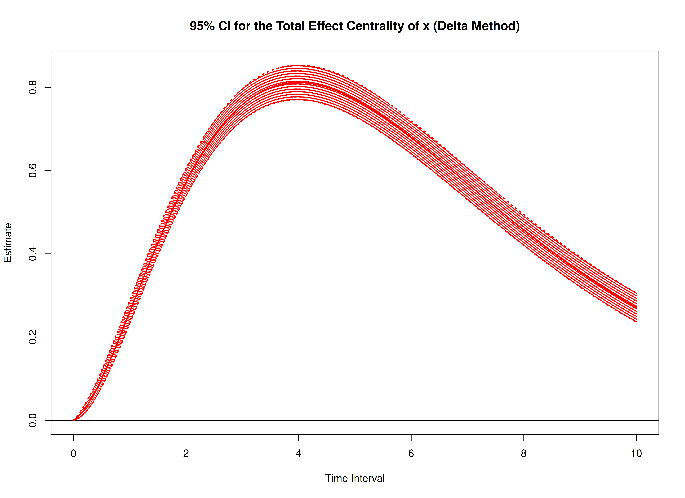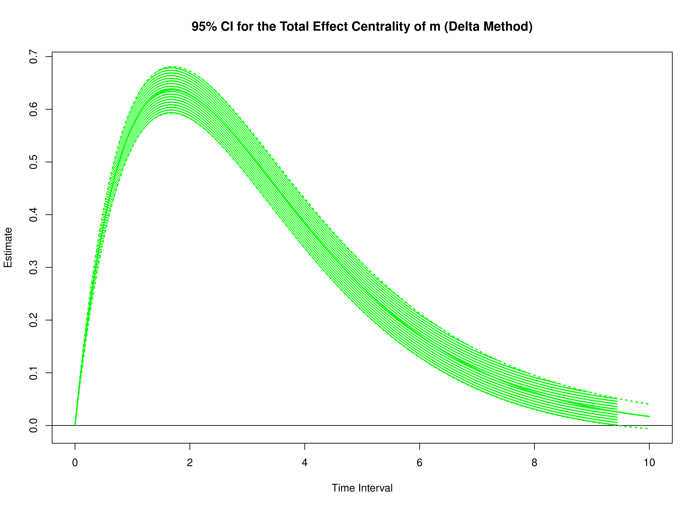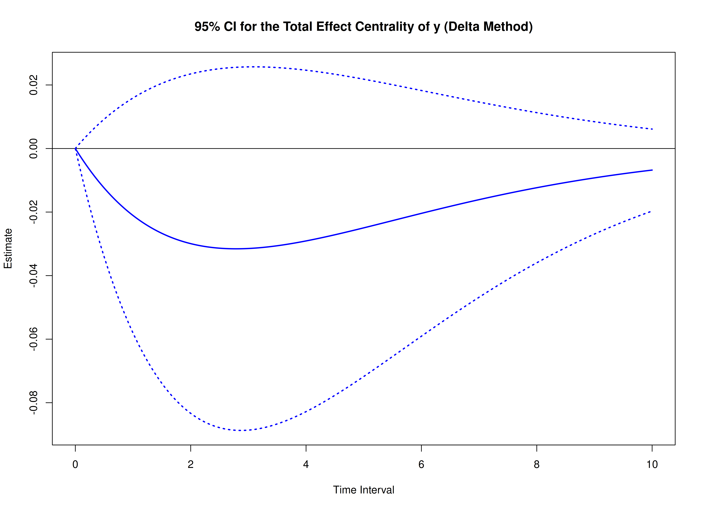


``` r
start <- Sys.time()
delta_indirect_std <- DeltaIndirectCentralStd(
  phi = phi,
  sigma = sigma,
  vcov_theta = vcov_theta,
  delta_t = delta_t,
  ncores = parallel::detectCores() # use multiple cores
)
end <- Sys.time()
elapsed <- end - start
elapsed
#> Time difference of 1.439827 secs
```


``` r
summary(delta_indirect_std)
#> Call:
#> DeltaIndirectCentralStd(phi = phi, sigma = sigma, vcov_theta = vcov_theta, 
#>     delta_t = delta_t, ncores = parallel::detectCores())
#> 
#> Indirect Effect Centrality
#>      variable interval     est     se       z      p    2.5%  97.5%
#> 1           x   0.0010  0.0000 0.0000 -0.7379 0.4606  0.0000 0.0000
#> 2           m   0.0010  0.0000 0.0000 23.9694 0.0000  0.0000 0.0000
#> 3           y   0.0010  0.0000 0.0000 -0.8429 0.3993  0.0000 0.0000
#> 4           x   0.0100  0.0000 0.0000 -0.7380 0.4605  0.0000 0.0000
#> 5           m   0.0100  0.0000 0.0000 23.9932 0.0000  0.0000 0.0000
#> 6           y   0.0100  0.0000 0.0000 -0.8435 0.3990  0.0000 0.0000
#> 7           x   0.0200  0.0000 0.0000 -0.7382 0.4604  0.0000 0.0000
#> 8           m   0.0200  0.0001 0.0000 24.0192 0.0000  0.0001 0.0001
#> 9           y   0.0200  0.0000 0.0000 -0.8441 0.3986  0.0000 0.0000
#> 10          x   0.0300  0.0000 0.0000 -0.7383 0.4603  0.0000 0.0000
#> 11          m   0.0300  0.0003 0.0000 24.0447 0.0000  0.0002 0.0003
#> 12          y   0.0300  0.0000 0.0000 -0.8448 0.3982  0.0000 0.0000
#> 13          x   0.0400  0.0000 0.0000 -0.7385 0.4602 -0.0001 0.0000
#> 14          m   0.0400  0.0005 0.0000 24.0698 0.0000  0.0004 0.0005
#> 15          y   0.0400  0.0000 0.0000 -0.8454 0.3979  0.0000 0.0000
#> 16          x   0.0501  0.0000 0.0000 -0.7387 0.4601 -0.0001 0.0000
#> 17          m   0.0501  0.0007 0.0000 24.0944 0.0000  0.0007 0.0008
#> 18          y   0.0501  0.0000 0.0000 -0.8460 0.3975 -0.0001 0.0000
#> 19          x   0.0601  0.0000 0.0001 -0.7388 0.4600 -0.0001 0.0001
#> 20          m   0.0601  0.0010 0.0000 24.1186 0.0000  0.0009 0.0011
#> 21          y   0.0601  0.0000 0.0000 -0.8467 0.3972 -0.0001 0.0000
#> 22          x   0.0701 -0.0001 0.0001 -0.7390 0.4599 -0.0002 0.0001
#> 23          m   0.0701  0.0014 0.0001 24.1424 0.0000  0.0013 0.0015
#> 24          y   0.0701  0.0000 0.0001 -0.8473 0.3968 -0.0001 0.0001
#> 25          x   0.0801 -0.0001 0.0001 -0.7392 0.4598 -0.0003 0.0001
#> 26          m   0.0801  0.0018 0.0001 24.1657 0.0000  0.0016 0.0019
#> 27          y   0.0801 -0.0001 0.0001 -0.8480 0.3965 -0.0002 0.0001
#> 28          x   0.0901 -0.0001 0.0001 -0.7394 0.4597 -0.0003 0.0001
#> 29          m   0.0901  0.0023 0.0001 24.1885 0.0000  0.0021 0.0024
#> 30          y   0.0901 -0.0001 0.0001 -0.8486 0.3961 -0.0002 0.0001
#> 31          x   0.1001 -0.0001 0.0001 -0.7395 0.4596 -0.0004 0.0002
#> 32          m   0.1001  0.0028 0.0001 24.2109 0.0000  0.0025 0.0030
#> 33          y   0.1001 -0.0001 0.0001 -0.8493 0.3957 -0.0003 0.0001
#> 34          x   0.1101 -0.0001 0.0002 -0.7397 0.4595 -0.0005 0.0002
#> 35          m   0.1101  0.0033 0.0001 24.2329 0.0000  0.0031 0.0036
#> 36          y   0.1101 -0.0001 0.0001 -0.8499 0.3954 -0.0004 0.0001
#> 37          x   0.1201 -0.0002 0.0002 -0.7399 0.4594 -0.0006 0.0003
#> 38          m   0.1201  0.0039 0.0002 24.2544 0.0000  0.0036 0.0043
#> 39          y   0.1201 -0.0001 0.0002 -0.8505 0.3950 -0.0004 0.0002
#> 40          x   0.1301 -0.0002 0.0002 -0.7401 0.4592 -0.0007 0.0003
#> 41          m   0.1301  0.0046 0.0002 24.2755 0.0000  0.0042 0.0050
#> 42          y   0.1301 -0.0001 0.0002 -0.8512 0.3947 -0.0005 0.0002
#> 43          x   0.1401 -0.0002 0.0003 -0.7403 0.4591 -0.0008 0.0003
#> 44          m   0.1401  0.0053 0.0002 24.2961 0.0000  0.0049 0.0057
#> 45          y   0.1401 -0.0002 0.0002 -0.8518 0.3943 -0.0006 0.0002
#> 46          x   0.1502 -0.0002 0.0003 -0.7405 0.4590 -0.0009 0.0004
#> 47          m   0.1502  0.0061 0.0002 24.3163 0.0000  0.0056 0.0066
#> 48          y   0.1502 -0.0002 0.0002 -0.8525 0.3939 -0.0006 0.0003
#> 49          x   0.1602 -0.0003 0.0004 -0.7407 0.4589 -0.0010 0.0004
#> 50          m   0.1602  0.0069 0.0003 24.3360 0.0000  0.0063 0.0074
#> 51          y   0.1602 -0.0002 0.0003 -0.8532 0.3936 -0.0007 0.0003
#> 52          x   0.1702 -0.0003 0.0004 -0.7409 0.4587 -0.0011 0.0005
#> 53          m   0.1702  0.0077 0.0003 24.3553 0.0000  0.0071 0.0083
#> 54          y   0.1702 -0.0002 0.0003 -0.8538 0.3932 -0.0008 0.0003
#> 55          x   0.1802 -0.0003 0.0004 -0.7411 0.4586 -0.0012 0.0005
#> 56          m   0.1802  0.0086 0.0004 24.3741 0.0000  0.0079 0.0093
#> 57          y   0.1802 -0.0003 0.0003 -0.8545 0.3929 -0.0009 0.0004
#> 58          x   0.1902 -0.0004 0.0005 -0.7413 0.4585 -0.0013 0.0006
#> 59          m   0.1902  0.0095 0.0004 24.3925 0.0000  0.0088 0.0103
#> 60          y   0.1902 -0.0003 0.0004 -0.8551 0.3925 -0.0010 0.0004
#> 61          x   0.2002 -0.0004 0.0005 -0.7415 0.4584 -0.0015 0.0007
#> 62          m   0.2002  0.0105 0.0004 24.4105 0.0000  0.0097 0.0114
#> 63          y   0.2002 -0.0003 0.0004 -0.8558 0.3921 -0.0011 0.0004
#> 64          x   0.2102 -0.0004 0.0006 -0.7418 0.4582 -0.0016 0.0007
#> 65          m   0.2102  0.0115 0.0005 24.4280 0.0000  0.0106 0.0125
#> 66          y   0.2102 -0.0004 0.0004 -0.8564 0.3918 -0.0012 0.0005
#> 67          x   0.2202 -0.0005 0.0006 -0.7420 0.4581 -0.0017 0.0008
#> 68          m   0.2202  0.0126 0.0005 24.4451 0.0000  0.0116 0.0136
#> 69          y   0.2202 -0.0004 0.0005 -0.8571 0.3914 -0.0013 0.0005
#> 70          x   0.2302 -0.0005 0.0007 -0.7422 0.4580 -0.0019 0.0009
#> 71          m   0.2302  0.0137 0.0006 24.4618 0.0000  0.0126 0.0148
#> 72          y   0.2302 -0.0004 0.0005 -0.8577 0.3910 -0.0015 0.0006
#> 73          x   0.2402 -0.0006 0.0008 -0.7424 0.4578 -0.0020 0.0009
#> 74          m   0.2402  0.0148 0.0006 24.4780 0.0000  0.0137 0.0160
#> 75          y   0.2402 -0.0005 0.0006 -0.8584 0.3907 -0.0016 0.0006
#> 76          x   0.2503 -0.0006 0.0008 -0.7427 0.4577 -0.0022 0.0010
#> 77          m   0.2503  0.0160 0.0007 24.4938 0.0000  0.0147 0.0173
#> 78          y   0.2503 -0.0005 0.0006 -0.8591 0.3903 -0.0017 0.0007
#> 79          x   0.2603 -0.0006 0.0009 -0.7429 0.4575 -0.0024 0.0011
#> 80          m   0.2603  0.0172 0.0007 24.5092 0.0000  0.0159 0.0186
#> 81          y   0.2603 -0.0006 0.0006 -0.8597 0.3899 -0.0018 0.0007
#> 82          x   0.2703 -0.0007 0.0009 -0.7432 0.4574 -0.0025 0.0011
#> 83          m   0.2703  0.0185 0.0008 24.5241 0.0000  0.0170 0.0200
#> 84          y   0.2703 -0.0006 0.0007 -0.8604 0.3896 -0.0020 0.0008
#> 85          x   0.2803 -0.0007 0.0010 -0.7434 0.4572 -0.0027 0.0012
#> 86          m   0.2803  0.0198 0.0008 24.5386 0.0000  0.0182 0.0214
#> 87          y   0.2803 -0.0006 0.0007 -0.8611 0.3892 -0.0021 0.0008
#> 88          x   0.2903 -0.0008 0.0011 -0.7436 0.4571 -0.0029 0.0013
#> 89          m   0.2903  0.0211 0.0009 24.5527 0.0000  0.0194 0.0228
#> 90          y   0.2903 -0.0007 0.0008 -0.8617 0.3888 -0.0022 0.0009
#> 91          x   0.3003 -0.0008 0.0011 -0.7439 0.4569 -0.0030 0.0014
#> 92          m   0.3003  0.0225 0.0009 24.5663 0.0000  0.0207 0.0243
#> 93          y   0.3003 -0.0007 0.0008 -0.8624 0.3885 -0.0024 0.0009
#> 94          x   0.3103 -0.0009 0.0012 -0.7442 0.4568 -0.0032 0.0014
#> 95          m   0.3103  0.0239 0.0010 24.5795 0.0000  0.0220 0.0258
#> 96          y   0.3103 -0.0008 0.0009 -0.8631 0.3881 -0.0025 0.0010
#> 97          x   0.3203 -0.0009 0.0013 -0.7444 0.4566 -0.0034 0.0015
#> 98          m   0.3203  0.0253 0.0010 24.5923 0.0000  0.0233 0.0274
#> 99          y   0.3203 -0.0008 0.0009 -0.8637 0.3877 -0.0027 0.0010
#> 100         x   0.3303 -0.0010 0.0013 -0.7447 0.4565 -0.0036 0.0016
#> 101         m   0.3303  0.0268 0.0011 24.6047 0.0000  0.0247 0.0289
#> 102         y   0.3303 -0.0009 0.0010 -0.8644 0.3874 -0.0028 0.0011
#> 103         x   0.3403 -0.0010 0.0014 -0.7449 0.4563 -0.0038 0.0017
#> 104         m   0.3403  0.0283 0.0012 24.6167 0.0000  0.0261 0.0306
#> 105         y   0.3403 -0.0009 0.0011 -0.8651 0.3870 -0.0030 0.0012
#> 106         x   0.3504 -0.0011 0.0015 -0.7452 0.4561 -0.0039 0.0018
#> 107         m   0.3504  0.0299 0.0012 24.6282 0.0000  0.0275 0.0322
#> 108         y   0.3504 -0.0010 0.0011 -0.8657 0.3866 -0.0031 0.0012
#> 109         x   0.3604 -0.0011 0.0015 -0.7455 0.4560 -0.0041 0.0019
#> 110         m   0.3604  0.0314 0.0013 24.6394 0.0000  0.0289 0.0339
#> 111         y   0.3604 -0.0010 0.0012 -0.8664 0.3863 -0.0033 0.0013
#> 112         x   0.3704 -0.0012 0.0016 -0.7458 0.4558 -0.0043 0.0019
#> 113         m   0.3704  0.0330 0.0013 24.6501 0.0000  0.0304 0.0357
#> 114         y   0.3704 -0.0011 0.0012 -0.8671 0.3859 -0.0035 0.0013
#> 115         x   0.3804 -0.0012 0.0017 -0.7461 0.4556 -0.0045 0.0020
#> 116         m   0.3804  0.0347 0.0014 24.6604 0.0000  0.0319 0.0374
#> 117         y   0.3804 -0.0011 0.0013 -0.8677 0.3855 -0.0036 0.0014
#> 118         x   0.3904 -0.0013 0.0017 -0.7463 0.4555 -0.0047 0.0021
#> 119         m   0.3904  0.0363 0.0015 24.6704 0.0000  0.0334 0.0392
#> 120         y   0.3904 -0.0012 0.0013 -0.8684 0.3852 -0.0038 0.0015
#> 121         x   0.4004 -0.0014 0.0018 -0.7466 0.4553 -0.0049 0.0022
#> 122         m   0.4004  0.0380 0.0015 24.6799 0.0000  0.0350 0.0410
#> 123         y   0.4004 -0.0012 0.0014 -0.8691 0.3848 -0.0040 0.0015
#> 124         x   0.4104 -0.0014 0.0019 -0.7469 0.4551 -0.0051 0.0023
#> 125         m   0.4104  0.0397 0.0016 24.6890 0.0000  0.0366 0.0429
#> 126         y   0.4104 -0.0013 0.0015 -0.8698 0.3844 -0.0042 0.0016
#> 127         x   0.4204 -0.0015 0.0020 -0.7472 0.4549 -0.0053 0.0024
#> 128         m   0.4204  0.0415 0.0017 24.6977 0.0000  0.0382 0.0448
#> 129         y   0.4204 -0.0013 0.0015 -0.8704 0.3841 -0.0043 0.0017
#> 130         x   0.4304 -0.0015 0.0020 -0.7475 0.4547 -0.0055 0.0025
#> 131         m   0.4304  0.0433 0.0018 24.7060 0.0000  0.0398 0.0467
#> 132         y   0.4304 -0.0014 0.0016 -0.8711 0.3837 -0.0045 0.0017
#> 133         x   0.4404 -0.0016 0.0021 -0.7478 0.4546 -0.0058 0.0026
#> 134         m   0.4404  0.0451 0.0018 24.7140 0.0000  0.0415 0.0486
#> 135         y   0.4404 -0.0014 0.0017 -0.8718 0.3833 -0.0047 0.0018
#> 136         x   0.4505 -0.0016 0.0022 -0.7482 0.4544 -0.0060 0.0027
#> 137         m   0.4505  0.0469 0.0019 24.7215 0.0000  0.0432 0.0506
#> 138         y   0.4505 -0.0015 0.0017 -0.8725 0.3830 -0.0049 0.0019
#> 139         x   0.4605 -0.0017 0.0023 -0.7485 0.4542 -0.0062 0.0028
#> 140         m   0.4605  0.0488 0.0020 24.7287 0.0000  0.0449 0.0526
#> 141         y   0.4605 -0.0016 0.0018 -0.8731 0.3826 -0.0051 0.0019
#> 142         x   0.4705 -0.0018 0.0024 -0.7488 0.4540 -0.0064 0.0029
#> 143         m   0.4705  0.0507 0.0020 24.7354 0.0000  0.0466 0.0547
#> 144         y   0.4705 -0.0016 0.0019 -0.8738 0.3822 -0.0053 0.0020
#> 145         x   0.4805 -0.0018 0.0024 -0.7491 0.4538 -0.0066 0.0030
#> 146         m   0.4805  0.0526 0.0021 24.7418 0.0000  0.0484 0.0567
#> 147         y   0.4805 -0.0017 0.0019 -0.8745 0.3818 -0.0055 0.0021
#> 148         x   0.4905 -0.0019 0.0025 -0.7495 0.4536 -0.0068 0.0031
#> 149         m   0.4905  0.0545 0.0022 24.7478 0.0000  0.0502 0.0588
#> 150         y   0.4905 -0.0017 0.0020 -0.8752 0.3815 -0.0057 0.0022
#> 151         x   0.5005 -0.0020 0.0026 -0.7498 0.4534 -0.0071 0.0032
#> 152         m   0.5005  0.0565 0.0023 24.7534 0.0000  0.0520 0.0609
#> 153         y   0.5005 -0.0018 0.0021 -0.8759 0.3811 -0.0059 0.0022
#> 154         x   0.5105 -0.0020 0.0027 -0.7501 0.4532 -0.0073 0.0032
#> 155         m   0.5105  0.0584 0.0024 24.7587 0.0000  0.0538 0.0631
#> 156         y   0.5105 -0.0019 0.0021 -0.8765 0.3807 -0.0061 0.0023
#> 157         x   0.5205 -0.0021 0.0028 -0.7505 0.4530 -0.0075 0.0033
#> 158         m   0.5205  0.0605 0.0024 24.7636 0.0000  0.0557 0.0652
#> 159         y   0.5205 -0.0019 0.0022 -0.8772 0.3804 -0.0063 0.0024
#> 160         x   0.5305 -0.0021 0.0028 -0.7508 0.4528 -0.0077 0.0034
#> 161         m   0.5305  0.0625 0.0025 24.7681 0.0000  0.0575 0.0674
#> 162         y   0.5305 -0.0020 0.0023 -0.8779 0.3800 -0.0065 0.0025
#> 163         x   0.5405 -0.0022 0.0029 -0.7512 0.4525 -0.0079 0.0035
#> 164         m   0.5405  0.0645 0.0026 24.7723 0.0000  0.0594 0.0696
#> 165         y   0.5405 -0.0021 0.0024 -0.8786 0.3796 -0.0067 0.0025
#> 166         x   0.5506 -0.0023 0.0030 -0.7515 0.4523 -0.0082 0.0036
#> 167         m   0.5506  0.0666 0.0027 24.7761 0.0000  0.0613 0.0719
#> 168         y   0.5506 -0.0021 0.0024 -0.8793 0.3793 -0.0069 0.0026
#> 169         x   0.5606 -0.0023 0.0031 -0.7519 0.4521 -0.0084 0.0037
#> 170         m   0.5606  0.0687 0.0028 24.7795 0.0000  0.0633 0.0741
#> 171         y   0.5606 -0.0022 0.0025 -0.8800 0.3789 -0.0071 0.0027
#> 172         x   0.5706 -0.0024 0.0032 -0.7523 0.4519 -0.0086 0.0038
#> 173         m   0.5706  0.0708 0.0029 24.7826 0.0000  0.0652 0.0764
#> 174         y   0.5706 -0.0023 0.0026 -0.8806 0.3785 -0.0073 0.0028
#> 175         x   0.5806 -0.0025 0.0033 -0.7527 0.4517 -0.0089 0.0039
#> 176         m   0.5806  0.0730 0.0029 24.7853 0.0000  0.0672 0.0787
#> 177         y   0.5806 -0.0023 0.0027 -0.8813 0.3781 -0.0075 0.0029
#> 178         x   0.5906 -0.0025 0.0033 -0.7530 0.4514 -0.0091 0.0040
#> 179         m   0.5906  0.0751 0.0030 24.7877 0.0000  0.0692 0.0810
#> 180         y   0.5906 -0.0024 0.0027 -0.8820 0.3778 -0.0078 0.0029
#> 181         x   0.6006 -0.0026 0.0034 -0.7534 0.4512 -0.0093 0.0041
#> 182         m   0.6006  0.0773 0.0031 24.7897 0.0000  0.0712 0.0834
#> 183         y   0.6006 -0.0025 0.0028 -0.8827 0.3774 -0.0080 0.0030
#> 184         x   0.6106 -0.0026 0.0035 -0.7538 0.4510 -0.0095 0.0042
#> 185         m   0.6106  0.0795 0.0032 24.7914 0.0000  0.0732 0.0858
#> 186         y   0.6106 -0.0025 0.0029 -0.8834 0.3770 -0.0082 0.0031
#> 187         x   0.6206 -0.0027 0.0036 -0.7542 0.4507 -0.0098 0.0043
#> 188         m   0.6206  0.0817 0.0033 24.7928 0.0000  0.0752 0.0881
#> 189         y   0.6206 -0.0026 0.0030 -0.8841 0.3767 -0.0084 0.0032
#> 190         x   0.6306 -0.0028 0.0037 -0.7546 0.4505 -0.0100 0.0044
#> 191         m   0.6306  0.0839 0.0034 24.7938 0.0000  0.0773 0.0906
#> 192         y   0.6306 -0.0027 0.0030 -0.8848 0.3763 -0.0087 0.0033
#> 193         x   0.6406 -0.0028 0.0038 -0.7550 0.4502 -0.0102 0.0045
#> 194         m   0.6406  0.0862 0.0035 24.7945 0.0000  0.0794 0.0930
#> 195         y   0.6406 -0.0028 0.0031 -0.8854 0.3759 -0.0089 0.0034
#> 196         x   0.6507 -0.0029 0.0039 -0.7554 0.4500 -0.0105 0.0046
#> 197         m   0.6507  0.0884 0.0036 24.7948 0.0000  0.0814 0.0954
#> 198         y   0.6507 -0.0028 0.0032 -0.8861 0.3755 -0.0091 0.0034
#> 199         x   0.6607 -0.0030 0.0039 -0.7558 0.4498 -0.0107 0.0047
#> 200         m   0.6607  0.0907 0.0037 24.7948 0.0000  0.0835 0.0979
#> 201         y   0.6607 -0.0029 0.0033 -0.8868 0.3752 -0.0093 0.0035
#> 202         x   0.6707 -0.0030 0.0040 -0.7562 0.4495 -0.0109 0.0048
#> 203         m   0.6707  0.0930 0.0038 24.7945 0.0000  0.0857 0.1004
#> 204         y   0.6707 -0.0030 0.0034 -0.8875 0.3748 -0.0096 0.0036
#> 205         x   0.6807 -0.0031 0.0041 -0.7567 0.4492 -0.0111 0.0049
#> 206         m   0.6807  0.0953 0.0038 24.7939 0.0000  0.0878 0.1029
#> 207         y   0.6807 -0.0031 0.0034 -0.8882 0.3744 -0.0098 0.0037
#> 208         x   0.6907 -0.0032 0.0042 -0.7571 0.4490 -0.0114 0.0050
#> 209         m   0.6907  0.0977 0.0039 24.7930 0.0000  0.0899 0.1054
#> 210         y   0.6907 -0.0031 0.0035 -0.8889 0.3741 -0.0100 0.0038
#> 211         x   0.7007 -0.0032 0.0043 -0.7575 0.4487 -0.0116 0.0051
#> 212         m   0.7007  0.1000 0.0040 24.7918 0.0000  0.0921 0.1079
#> 213         y   0.7007 -0.0032 0.0036 -0.8896 0.3737 -0.0103 0.0039
#> 214         x   0.7107 -0.0033 0.0044 -0.7580 0.4485 -0.0118 0.0052
#> 215         m   0.7107  0.1024 0.0041 24.7902 0.0000  0.0943 0.1104
#> 216         y   0.7107 -0.0033 0.0037 -0.8903 0.3733 -0.0105 0.0039
#> 217         x   0.7207 -0.0034 0.0044 -0.7584 0.4482 -0.0121 0.0053
#> 218         m   0.7207  0.1047 0.0042 24.7884 0.0000  0.0964 0.1130
#> 219         y   0.7207 -0.0034 0.0038 -0.8910 0.3729 -0.0108 0.0040
#> 220         x   0.7307 -0.0034 0.0045 -0.7589 0.4479 -0.0123 0.0054
#> 221         m   0.7307  0.1071 0.0043 24.7862 0.0000  0.0986 0.1156
#> 222         y   0.7307 -0.0034 0.0039 -0.8917 0.3726 -0.0110 0.0041
#> 223         x   0.7407 -0.0035 0.0046 -0.7593 0.4476 -0.0125 0.0055
#> 224         m   0.7407  0.1095 0.0044 24.7837 0.0000  0.1009 0.1182
#> 225         y   0.7407 -0.0035 0.0039 -0.8923 0.3722 -0.0112 0.0042
#> 226         x   0.7508 -0.0036 0.0047 -0.7598 0.4474 -0.0127 0.0056
#> 227         m   0.7508  0.1119 0.0045 24.7810 0.0000  0.1031 0.1208
#> 228         y   0.7508 -0.0036 0.0040 -0.8930 0.3718 -0.0115 0.0043
#> 229         x   0.7608 -0.0036 0.0048 -0.7603 0.4471 -0.0130 0.0057
#> 230         m   0.7608  0.1144 0.0046 24.7779 0.0000  0.1053 0.1234
#> 231         y   0.7608 -0.0037 0.0041 -0.8937 0.3715 -0.0117 0.0044
#> 232         x   0.7708 -0.0037 0.0049 -0.7608 0.4468 -0.0132 0.0058
#> 233         m   0.7708  0.1168 0.0047 24.7746 0.0000  0.1075 0.1260
#> 234         y   0.7708 -0.0037 0.0042 -0.8944 0.3711 -0.0120 0.0045
#> 235         x   0.7808 -0.0038 0.0049 -0.7612 0.4465 -0.0134 0.0059
#> 236         m   0.7808  0.1192 0.0048 24.7710 0.0000  0.1098 0.1287
#> 237         y   0.7808 -0.0038 0.0043 -0.8951 0.3707 -0.0122 0.0046
#> 238         x   0.7908 -0.0038 0.0050 -0.7617 0.4462 -0.0136 0.0060
#> 239         m   0.7908  0.1217 0.0049 24.7671 0.0000  0.1121 0.1313
#> 240         y   0.7908 -0.0039 0.0044 -0.8958 0.3704 -0.0125 0.0046
#> 241         x   0.8008 -0.0039 0.0051 -0.7622 0.4459 -0.0139 0.0061
#> 242         m   0.8008  0.1242 0.0050 24.7629 0.0000  0.1143 0.1340
#> 243         y   0.8008 -0.0040 0.0044 -0.8965 0.3700 -0.0127 0.0047
#> 244         x   0.8108 -0.0039 0.0052 -0.7627 0.4456 -0.0141 0.0062
#> 245         m   0.8108  0.1267 0.0051 24.7585 0.0000  0.1166 0.1367
#> 246         y   0.8108 -0.0041 0.0045 -0.8972 0.3696 -0.0129 0.0048
#> 247         x   0.8208 -0.0040 0.0053 -0.7632 0.4453 -0.0143 0.0063
#> 248         m   0.8208  0.1291 0.0052 24.7538 0.0000  0.1189 0.1394
#> 249         y   0.8208 -0.0041 0.0046 -0.8979 0.3692 -0.0132 0.0049
#> 250         x   0.8308 -0.0041 0.0053 -0.7637 0.4450 -0.0145 0.0064
#> 251         m   0.8308  0.1316 0.0053 24.7488 0.0000  0.1212 0.1421
#> 252         y   0.8308 -0.0042 0.0047 -0.8986 0.3689 -0.0134 0.0050
#> 253         x   0.8408 -0.0041 0.0054 -0.7643 0.4447 -0.0148 0.0065
#> 254         m   0.8408  0.1342 0.0054 24.7435 0.0000  0.1235 0.1448
#> 255         y   0.8408 -0.0043 0.0048 -0.8993 0.3685 -0.0137 0.0051
#> 256         x   0.8509 -0.0042 0.0055 -0.7648 0.4444 -0.0150 0.0066
#> 257         m   0.8509  0.1367 0.0055 24.7380 0.0000  0.1259 0.1475
#> 258         y   0.8509 -0.0044 0.0049 -0.9000 0.3681 -0.0140 0.0052
#> 259         x   0.8609 -0.0043 0.0056 -0.7653 0.4441 -0.0152 0.0067
#> 260         m   0.8609  0.1392 0.0056 24.7322 0.0000  0.1282 0.1502
#> 261         y   0.8609 -0.0045 0.0050 -0.9007 0.3678 -0.0142 0.0053
#> 262         x   0.8709 -0.0043 0.0057 -0.7658 0.4438 -0.0154 0.0068
#> 263         m   0.8709  0.1418 0.0057 24.7262 0.0000  0.1305 0.1530
#> 264         y   0.8709 -0.0046 0.0051 -0.9013 0.3674 -0.0145 0.0053
#> 265         x   0.8809 -0.0044 0.0057 -0.7664 0.4434 -0.0156 0.0068
#> 266         m   0.8809  0.1443 0.0058 24.7199 0.0000  0.1329 0.1557
#> 267         y   0.8809 -0.0046 0.0051 -0.9020 0.3670 -0.0147 0.0054
#> 268         x   0.8909 -0.0045 0.0058 -0.7669 0.4431 -0.0158 0.0069
#> 269         m   0.8909  0.1469 0.0059 24.7134 0.0000  0.1352 0.1585
#> 270         y   0.8909 -0.0047 0.0052 -0.9027 0.3667 -0.0150 0.0055
#> 271         x   0.9009 -0.0045 0.0059 -0.7675 0.4428 -0.0161 0.0070
#> 272         m   0.9009  0.1494 0.0060 24.7067 0.0000  0.1376 0.1613
#> 273         y   0.9009 -0.0048 0.0053 -0.9034 0.3663 -0.0152 0.0056
#> 274         x   0.9109 -0.0046 0.0060 -0.7681 0.4425 -0.0163 0.0071
#> 275         m   0.9109  0.1520 0.0062 24.6997 0.0000  0.1399 0.1641
#> 276         y   0.9109 -0.0049 0.0054 -0.9041 0.3659 -0.0155 0.0057
#> 277         x   0.9209 -0.0046 0.0060 -0.7686 0.4421 -0.0165 0.0072
#> 278         m   0.9209  0.1546 0.0063 24.6924 0.0000  0.1423 0.1668
#> 279         y   0.9209 -0.0050 0.0055 -0.9048 0.3656 -0.0157 0.0058
#> 280         x   0.9309 -0.0047 0.0061 -0.7692 0.4418 -0.0167 0.0073
#> 281         m   0.9309  0.1572 0.0064 24.6850 0.0000  0.1447 0.1696
#> 282         y   0.9309 -0.0051 0.0056 -0.9055 0.3652 -0.0160 0.0059
#> 283         x   0.9409 -0.0048 0.0062 -0.7698 0.4414 -0.0169 0.0074
#> 284         m   0.9409  0.1597 0.0065 24.6773 0.0000  0.1471 0.1724
#> 285         y   0.9409 -0.0051 0.0057 -0.9062 0.3648 -0.0163 0.0060
#> 286         x   0.9510 -0.0048 0.0063 -0.7704 0.4411 -0.0171 0.0075
#> 287         m   0.9510  0.1623 0.0066 24.6693 0.0000  0.1494 0.1752
#> 288         y   0.9510 -0.0052 0.0058 -0.9069 0.3645 -0.0165 0.0061
#> 289         x   0.9610 -0.0049 0.0063 -0.7710 0.4407 -0.0173 0.0075
#> 290         m   0.9610  0.1649 0.0067 24.6612 0.0000  0.1518 0.1781
#> 291         y   0.9610 -0.0053 0.0058 -0.9076 0.3641 -0.0168 0.0062
#> 292         x   0.9710 -0.0050 0.0064 -0.7716 0.4404 -0.0175 0.0076
#> 293         m   0.9710  0.1676 0.0068 24.6528 0.0000  0.1542 0.1809
#> 294         y   0.9710 -0.0054 0.0059 -0.9083 0.3637 -0.0170 0.0062
#> 295         x   0.9810 -0.0050 0.0065 -0.7722 0.4400 -0.0177 0.0077
#> 296         m   0.9810  0.1702 0.0069 24.6442 0.0000  0.1566 0.1837
#> 297         y   0.9810 -0.0055 0.0060 -0.9090 0.3634 -0.0173 0.0063
#> 298         x   0.9910 -0.0051 0.0066 -0.7728 0.4396 -0.0179 0.0078
#> 299         m   0.9910  0.1728 0.0070 24.6354 0.0000  0.1590 0.1865
#> 300         y   0.9910 -0.0056 0.0061 -0.9097 0.3630 -0.0176 0.0064
#> 301         x   1.0010 -0.0051 0.0066 -0.7734 0.4393 -0.0181 0.0079
#> 302         m   1.0010  0.1754 0.0071 24.6264 0.0000  0.1614 0.1894
#> 303         y   1.0010 -0.0056 0.0062 -0.9104 0.3626 -0.0178 0.0065
#> 304         x   1.0110 -0.0052 0.0067 -0.7741 0.4389 -0.0183 0.0080
#> 305         m   1.0110  0.1780 0.0072 24.6172 0.0000  0.1639 0.1922
#> 306         y   1.0110 -0.0057 0.0063 -0.9110 0.3623 -0.0181 0.0066
#> 307         x   1.0210 -0.0053 0.0068 -0.7747 0.4385 -0.0185 0.0080
#> 308         m   1.0210  0.1807 0.0073 24.6078 0.0000  0.1663 0.1951
#> 309         y   1.0210 -0.0058 0.0064 -0.9117 0.3619 -0.0183 0.0067
#> 310         x   1.0310 -0.0053 0.0069 -0.7753 0.4381 -0.0187 0.0081
#> 311         m   1.0310  0.1833 0.0075 24.5982 0.0000  0.1687 0.1979
#> 312         y   1.0310 -0.0059 0.0065 -0.9124 0.3615 -0.0186 0.0068
#> 313         x   1.0410 -0.0054 0.0069 -0.7760 0.4377 -0.0189 0.0082
#> 314         m   1.0410  0.1859 0.0076 24.5884 0.0000  0.1711 0.2008
#> 315         y   1.0410 -0.0060 0.0066 -0.9131 0.3612 -0.0189 0.0069
#> 316         x   1.0511 -0.0054 0.0070 -0.7767 0.4374 -0.0191 0.0083
#> 317         m   1.0511  0.1886 0.0077 24.5784 0.0000  0.1735 0.2036
#> 318         y   1.0511 -0.0061 0.0067 -0.9138 0.3608 -0.0191 0.0070
#> 319         x   1.0611 -0.0055 0.0071 -0.7773 0.4370 -0.0193 0.0083
#> 320         m   1.0611  0.1912 0.0078 24.5682 0.0000  0.1760 0.2065
#> 321         y   1.0611 -0.0062 0.0067 -0.9145 0.3605 -0.0194 0.0071
#> 322         x   1.0711 -0.0055 0.0071 -0.7780 0.4366 -0.0195 0.0084
#> 323         m   1.0711  0.1939 0.0079 24.5578 0.0000  0.1784 0.2093
#> 324         y   1.0711 -0.0063 0.0068 -0.9152 0.3601 -0.0197 0.0071
#> 325         x   1.0811 -0.0056 0.0072 -0.7787 0.4362 -0.0197 0.0085
#> 326         m   1.0811  0.1965 0.0080 24.5473 0.0000  0.1808 0.2122
#> 327         y   1.0811 -0.0063 0.0069 -0.9159 0.3597 -0.0199 0.0072
#> 328         x   1.0911 -0.0057 0.0073 -0.7794 0.4358 -0.0199 0.0086
#> 329         m   1.0911  0.1992 0.0081 24.5365 0.0000  0.1833 0.2151
#> 330         y   1.0911 -0.0064 0.0070 -0.9166 0.3594 -0.0202 0.0073
#> 331         x   1.1011 -0.0057 0.0073 -0.7801 0.4353 -0.0201 0.0086
#> 332         m   1.1011  0.2018 0.0082 24.5256 0.0000  0.1857 0.2180
#> 333         y   1.1011 -0.0065 0.0071 -0.9173 0.3590 -0.0204 0.0074
#> 334         x   1.1111 -0.0058 0.0074 -0.7808 0.4349 -0.0203 0.0087
#> 335         m   1.1111  0.2045 0.0083 24.5145 0.0000  0.1881 0.2208
#> 336         y   1.1111 -0.0066 0.0072 -0.9180 0.3586 -0.0207 0.0075
#> 337         x   1.1211 -0.0058 0.0075 -0.7815 0.4345 -0.0204 0.0088
#> 338         m   1.1211  0.2071 0.0085 24.5033 0.0000  0.1906 0.2237
#> 339         y   1.1211 -0.0067 0.0073 -0.9186 0.3583 -0.0210 0.0076
#> 340         x   1.1311 -0.0059 0.0075 -0.7822 0.4341 -0.0206 0.0089
#> 341         m   1.1311  0.2098 0.0086 24.4918 0.0000  0.1930 0.2266
#> 342         y   1.1311 -0.0068 0.0074 -0.9193 0.3579 -0.0212 0.0077
#> 343         x   1.1411 -0.0059 0.0076 -0.7830 0.4337 -0.0208 0.0089
#> 344         m   1.1411  0.2125 0.0087 24.4803 0.0000  0.1954 0.2295
#> 345         y   1.1411 -0.0069 0.0075 -0.9200 0.3576 -0.0215 0.0078
#> 346         x   1.1512 -0.0060 0.0076 -0.7837 0.4332 -0.0210 0.0090
#> 347         m   1.1512  0.2151 0.0088 24.4685 0.0000  0.1979 0.2324
#> 348         y   1.1512 -0.0070 0.0076 -0.9207 0.3572 -0.0218 0.0079
#> 349         x   1.1612 -0.0060 0.0077 -0.7844 0.4328 -0.0212 0.0091
#> 350         m   1.1612  0.2178 0.0089 24.4566 0.0000  0.2003 0.2352
#> 351         y   1.1612 -0.0070 0.0076 -0.9214 0.3568 -0.0220 0.0079
#> 352         x   1.1712 -0.0061 0.0078 -0.7852 0.4323 -0.0213 0.0091
#> 353         m   1.1712  0.2204 0.0090 24.4445 0.0000  0.2028 0.2381
#> 354         y   1.1712 -0.0071 0.0077 -0.9221 0.3565 -0.0223 0.0080
#> 355         x   1.1812 -0.0062 0.0078 -0.7860 0.4319 -0.0215 0.0092
#> 356         m   1.1812  0.2231 0.0091 24.4323 0.0000  0.2052 0.2410
#> 357         y   1.1812 -0.0072 0.0078 -0.9228 0.3561 -0.0226 0.0081
#> 358         x   1.1912 -0.0062 0.0079 -0.7867 0.4314 -0.0217 0.0093
#> 359         m   1.1912  0.2258 0.0092 24.4200 0.0000  0.2076 0.2439
#> 360         y   1.1912 -0.0073 0.0079 -0.9235 0.3558 -0.0228 0.0082
#> 361         x   1.2012 -0.0063 0.0079 -0.7875 0.4310 -0.0218 0.0093
#> 362         m   1.2012  0.2284 0.0094 24.4075 0.0000  0.2101 0.2468
#> 363         y   1.2012 -0.0074 0.0080 -0.9241 0.3554 -0.0231 0.0083
#> 364         x   1.2112 -0.0063 0.0080 -0.7883 0.4305 -0.0220 0.0094
#> 365         m   1.2112  0.2311 0.0095 24.3948 0.0000  0.2125 0.2497
#> 366         y   1.2112 -0.0075 0.0081 -0.9248 0.3551 -0.0234 0.0084
#> 367         x   1.2212 -0.0064 0.0081 -0.7891 0.4301 -0.0222 0.0094
#> 368         m   1.2212  0.2337 0.0096 24.3820 0.0000  0.2150 0.2525
#> 369         y   1.2212 -0.0076 0.0082 -0.9255 0.3547 -0.0236 0.0085
#> 370         x   1.2312 -0.0064 0.0081 -0.7899 0.4296 -0.0223 0.0095
#> 371         m   1.2312  0.2364 0.0097 24.3691 0.0000  0.2174 0.2554
#> 372         y   1.2312 -0.0077 0.0083 -0.9262 0.3543 -0.0239 0.0086
#> 373         x   1.2412 -0.0065 0.0082 -0.7907 0.4291 -0.0225 0.0096
#> 374         m   1.2412  0.2391 0.0098 24.3560 0.0000  0.2198 0.2583
#> 375         y   1.2412 -0.0078 0.0084 -0.9269 0.3540 -0.0242 0.0086
#> 376         x   1.2513 -0.0065 0.0082 -0.7915 0.4286 -0.0227 0.0096
#> 377         m   1.2513  0.2417 0.0099 24.3428 0.0000  0.2223 0.2612
#> 378         y   1.2513 -0.0078 0.0085 -0.9276 0.3536 -0.0244 0.0087
#> 379         x   1.2613 -0.0066 0.0083 -0.7924 0.4281 -0.0228 0.0097
#> 380         m   1.2613  0.2444 0.0100 24.3295 0.0000  0.2247 0.2641
#> 381         y   1.2613 -0.0079 0.0085 -0.9282 0.3533 -0.0247 0.0088
#> 382         x   1.2713 -0.0066 0.0083 -0.7932 0.4277 -0.0230 0.0097
#> 383         m   1.2713  0.2470 0.0102 24.3160 0.0000  0.2271 0.2669
#> 384         y   1.2713 -0.0080 0.0086 -0.9289 0.3529 -0.0250 0.0089
#> 385         x   1.2813 -0.0067 0.0084 -0.7941 0.4272 -0.0231 0.0098
#> 386         m   1.2813  0.2497 0.0103 24.3025 0.0000  0.2295 0.2698
#> 387         y   1.2813 -0.0081 0.0087 -0.9296 0.3526 -0.0252 0.0090
#> 388         x   1.2913 -0.0067 0.0084 -0.7949 0.4267 -0.0233 0.0098
#> 389         m   1.2913  0.2523 0.0104 24.2888 0.0000  0.2320 0.2727
#> 390         y   1.2913 -0.0082 0.0088 -0.9303 0.3522 -0.0255 0.0091
#> 391         x   1.3013 -0.0068 0.0085 -0.7958 0.4262 -0.0234 0.0099
#> 392         m   1.3013  0.2550 0.0105 24.2750 0.0000  0.2344 0.2756
#> 393         y   1.3013 -0.0083 0.0089 -0.9310 0.3519 -0.0258 0.0092
#> 394         x   1.3113 -0.0068 0.0086 -0.7967 0.4256 -0.0236 0.0099
#> 395         m   1.3113  0.2576 0.0106 24.2610 0.0000  0.2368 0.2784
#> 396         y   1.3113 -0.0084 0.0090 -0.9316 0.3515 -0.0260 0.0093
#> 397         x   1.3213 -0.0069 0.0086 -0.7976 0.4251 -0.0237 0.0100
#> 398         m   1.3213  0.2603 0.0107 24.2470 0.0000  0.2392 0.2813
#> 399         y   1.3213 -0.0085 0.0091 -0.9323 0.3512 -0.0263 0.0093
#> 400         x   1.3313 -0.0069 0.0087 -0.7984 0.4246 -0.0239 0.0101
#> 401         m   1.3313  0.2629 0.0108 24.2329 0.0000  0.2416 0.2842
#> 402         y   1.3313 -0.0086 0.0092 -0.9330 0.3508 -0.0265 0.0094
#> 403         x   1.3413 -0.0070 0.0087 -0.7994 0.4241 -0.0240 0.0101
#> 404         m   1.3413  0.2655 0.0110 24.2186 0.0000  0.2440 0.2870
#> 405         y   1.3413 -0.0087 0.0093 -0.9337 0.3505 -0.0268 0.0095
#> 406         x   1.3514 -0.0070 0.0087 -0.8003 0.4236 -0.0242 0.0101
#> 407         m   1.3514  0.2682 0.0111 24.2042 0.0000  0.2464 0.2899
#> 408         y   1.3514 -0.0087 0.0094 -0.9344 0.3501 -0.0271 0.0096
#> 409         x   1.3614 -0.0070 0.0088 -0.8012 0.4230 -0.0243 0.0102
#> 410         m   1.3614  0.2708 0.0112 24.1898 0.0000  0.2488 0.2927
#> 411         y   1.3614 -0.0088 0.0094 -0.9350 0.3498 -0.0273 0.0097
#> 412         x   1.3714 -0.0071 0.0088 -0.8021 0.4225 -0.0244 0.0102
#> 413         m   1.3714  0.2734 0.0113 24.1752 0.0000  0.2512 0.2956
#> 414         y   1.3714 -0.0089 0.0095 -0.9357 0.3494 -0.0276 0.0098
#> 415         x   1.3814 -0.0071 0.0089 -0.8031 0.4219 -0.0246 0.0103
#> 416         m   1.3814  0.2760 0.0114 24.1606 0.0000  0.2536 0.2984
#> 417         y   1.3814 -0.0090 0.0096 -0.9364 0.3491 -0.0279 0.0099
#> 418         x   1.3914 -0.0072 0.0089 -0.8040 0.4214 -0.0247 0.0103
#> 419         m   1.3914  0.2787 0.0115 24.1458 0.0000  0.2560 0.3013
#> 420         y   1.3914 -0.0091 0.0097 -0.9371 0.3487 -0.0281 0.0099
#> 421         x   1.4014 -0.0072 0.0090 -0.8050 0.4208 -0.0248 0.0104
#> 422         m   1.4014  0.2813 0.0117 24.1310 0.0000  0.2584 0.3041
#> 423         y   1.4014 -0.0092 0.0098 -0.9377 0.3484 -0.0284 0.0100
#> 424         x   1.4114 -0.0073 0.0090 -0.8060 0.4203 -0.0250 0.0104
#> 425         m   1.4114  0.2839 0.0118 24.1160 0.0000  0.2608 0.3069
#> 426         y   1.4114 -0.0093 0.0099 -0.9384 0.3480 -0.0287 0.0101
#> 427         x   1.4214 -0.0073 0.0091 -0.8069 0.4197 -0.0251 0.0105
#> 428         m   1.4214  0.2865 0.0119 24.1010 0.0000  0.2632 0.3098
#> 429         y   1.4214 -0.0094 0.0100 -0.9391 0.3477 -0.0289 0.0102
#> 430         x   1.4314 -0.0074 0.0091 -0.8079 0.4191 -0.0252 0.0105
#> 431         m   1.4314  0.2891 0.0120 24.0859 0.0000  0.2656 0.3126
#> 432         y   1.4314 -0.0095 0.0101 -0.9397 0.3474 -0.0292 0.0103
#> 433         x   1.4414 -0.0074 0.0091 -0.8089 0.4185 -0.0253 0.0105
#> 434         m   1.4414  0.2917 0.0121 24.0707 0.0000  0.2679 0.3154
#> 435         y   1.4414 -0.0095 0.0102 -0.9404 0.3470 -0.0295 0.0104
#> 436         x   1.4515 -0.0074 0.0092 -0.8100 0.4180 -0.0255 0.0106
#> 437         m   1.4515  0.2943 0.0122 24.0554 0.0000  0.2703 0.3182
#> 438         y   1.4515 -0.0096 0.0102 -0.9411 0.3467 -0.0297 0.0104
#> 439         x   1.4615 -0.0075 0.0092 -0.8110 0.4174 -0.0256 0.0106
#> 440         m   1.4615  0.2968 0.0123 24.0401 0.0000  0.2726 0.3210
#> 441         y   1.4615 -0.0097 0.0103 -0.9417 0.3463 -0.0300 0.0105
#> 442         x   1.4715 -0.0075 0.0093 -0.8120 0.4168 -0.0257 0.0106
#> 443         m   1.4715  0.2994 0.0125 24.0247 0.0000  0.2750 0.3239
#> 444         y   1.4715 -0.0098 0.0104 -0.9424 0.3460 -0.0302 0.0106
#> 445         x   1.4815 -0.0076 0.0093 -0.8131 0.4162 -0.0258 0.0107
#> 446         m   1.4815  0.3020 0.0126 24.0092 0.0000  0.2773 0.3267
#> 447         y   1.4815 -0.0099 0.0105 -0.9431 0.3456 -0.0305 0.0107
#> 448         x   1.4915 -0.0076 0.0093 -0.8141 0.4156 -0.0259 0.0107
#> 449         m   1.4915  0.3046 0.0127 23.9936 0.0000  0.2797 0.3294
#> 450         y   1.4915 -0.0100 0.0106 -0.9437 0.3453 -0.0308 0.0108
#> 451         x   1.5015 -0.0076 0.0094 -0.8152 0.4150 -0.0260 0.0107
#> 452         m   1.5015  0.3071 0.0128 23.9780 0.0000  0.2820 0.3322
#> 453         y   1.5015 -0.0101 0.0107 -0.9444 0.3450 -0.0310 0.0108
#> 454         x   1.5115 -0.0077 0.0094 -0.8163 0.4143 -0.0261 0.0108
#> 455         m   1.5115  0.3097 0.0129 23.9622 0.0000  0.2844 0.3350
#> 456         y   1.5115 -0.0102 0.0108 -0.9451 0.3446 -0.0313 0.0109
#> 457         x   1.5215 -0.0077 0.0095 -0.8174 0.4137 -0.0263 0.0108
#> 458         m   1.5215  0.3122 0.0130 23.9465 0.0000  0.2867 0.3378
#> 459         y   1.5215 -0.0103 0.0109 -0.9457 0.3443 -0.0315 0.0110
#> 460         x   1.5315 -0.0078 0.0095 -0.8185 0.4131 -0.0264 0.0108
#> 461         m   1.5315  0.3148 0.0132 23.9306 0.0000  0.2890 0.3406
#> 462         y   1.5315 -0.0104 0.0109 -0.9464 0.3440 -0.0318 0.0111
#> 463         x   1.5415 -0.0078 0.0095 -0.8196 0.4125 -0.0265 0.0109
#> 464         m   1.5415  0.3173 0.0133 23.9148 0.0000  0.2913 0.3433
#> 465         y   1.5415 -0.0104 0.0110 -0.9470 0.3436 -0.0321 0.0112
#> 466         x   1.5516 -0.0078 0.0096 -0.8207 0.4118 -0.0266 0.0109
#> 467         m   1.5516  0.3199 0.0134 23.8988 0.0000  0.2936 0.3461
#> 468         y   1.5516 -0.0105 0.0111 -0.9477 0.3433 -0.0323 0.0113
#> 469         x   1.5616 -0.0079 0.0096 -0.8218 0.4112 -0.0267 0.0109
#> 470         m   1.5616  0.3224 0.0135 23.8828 0.0000  0.2959 0.3488
#> 471         y   1.5616 -0.0106 0.0112 -0.9483 0.3430 -0.0326 0.0113
#> 472         x   1.5716 -0.0079 0.0096 -0.8230 0.4105 -0.0268 0.0109
#> 473         m   1.5716  0.3249 0.0136 23.8667 0.0000  0.2982 0.3516
#> 474         y   1.5716 -0.0107 0.0113 -0.9490 0.3426 -0.0328 0.0114
#> 475         x   1.5816 -0.0080 0.0096 -0.8241 0.4099 -0.0269 0.0110
#> 476         m   1.5816  0.3274 0.0137 23.8506 0.0000  0.3005 0.3543
#> 477         y   1.5816 -0.0108 0.0114 -0.9497 0.3423 -0.0331 0.0115
#> 478         x   1.5916 -0.0080 0.0097 -0.8253 0.4092 -0.0270 0.0110
#> 479         m   1.5916  0.3299 0.0138 23.8345 0.0000  0.3028 0.3571
#> 480         y   1.5916 -0.0109 0.0115 -0.9503 0.3420 -0.0334 0.0116
#> 481         x   1.6016 -0.0080 0.0097 -0.8265 0.4085 -0.0271 0.0110
#> 482         m   1.6016  0.3324 0.0140 23.8182 0.0000  0.3051 0.3598
#> 483         y   1.6016 -0.0110 0.0115 -0.9510 0.3416 -0.0336 0.0117
#> 484         x   1.6116 -0.0081 0.0097 -0.8277 0.4079 -0.0271 0.0110
#> 485         m   1.6116  0.3349 0.0141 23.8020 0.0000  0.3073 0.3625
#> 486         y   1.6116 -0.0111 0.0116 -0.9516 0.3413 -0.0339 0.0117
#> 487         x   1.6216 -0.0081 0.0098 -0.8289 0.4072 -0.0272 0.0110
#> 488         m   1.6216  0.3374 0.0142 23.7857 0.0000  0.3096 0.3652
#> 489         y   1.6216 -0.0112 0.0117 -0.9523 0.3410 -0.0341 0.0118
#> 490         x   1.6316 -0.0081 0.0098 -0.8301 0.4065 -0.0273 0.0111
#> 491         m   1.6316  0.3399 0.0143 23.7693 0.0000  0.3119 0.3679
#> 492         y   1.6316 -0.0113 0.0118 -0.9529 0.3406 -0.0344 0.0119
#> 493         x   1.6416 -0.0082 0.0098 -0.8313 0.4058 -0.0274 0.0111
#> 494         m   1.6416  0.3424 0.0144 23.7529 0.0000  0.3141 0.3706
#> 495         y   1.6416 -0.0113 0.0119 -0.9535 0.3403 -0.0346 0.0120
#> 496         x   1.6517 -0.0082 0.0098 -0.8325 0.4051 -0.0275 0.0111
#> 497         m   1.6517  0.3448 0.0145 23.7365 0.0000  0.3164 0.3733
#> 498         y   1.6517 -0.0114 0.0120 -0.9542 0.3400 -0.0349 0.0120
#> 499         x   1.6617 -0.0082 0.0099 -0.8338 0.4044 -0.0276 0.0111
#> 500         m   1.6617  0.3473 0.0146 23.7200 0.0000  0.3186 0.3760
#> 501         y   1.6617 -0.0115 0.0121 -0.9548 0.3397 -0.0352 0.0121
#> 502         x   1.6717 -0.0083 0.0099 -0.8350 0.4037 -0.0277 0.0111
#> 503         m   1.6717  0.3497 0.0148 23.7035 0.0000  0.3208 0.3786
#> 504         y   1.6717 -0.0116 0.0121 -0.9555 0.3393 -0.0354 0.0122
#> 505         x   1.6817 -0.0083 0.0099 -0.8363 0.4030 -0.0277 0.0111
#> 506         m   1.6817  0.3522 0.0149 23.6870 0.0000  0.3230 0.3813
#> 507         y   1.6817 -0.0117 0.0122 -0.9561 0.3390 -0.0357 0.0123
#> 508         x   1.6917 -0.0083 0.0099 -0.8376 0.4023 -0.0278 0.0112
#> 509         m   1.6917  0.3546 0.0150 23.6704 0.0000  0.3252 0.3840
#> 510         y   1.6917 -0.0118 0.0123 -0.9568 0.3387 -0.0359 0.0124
#> 511         x   1.7017 -0.0084 0.0100 -0.8389 0.4015 -0.0279 0.0112
#> 512         m   1.7017  0.3570 0.0151 23.6538 0.0000  0.3274 0.3866
#> 513         y   1.7017 -0.0119 0.0124 -0.9574 0.3384 -0.0362 0.0124
#> 514         x   1.7117 -0.0084 0.0100 -0.8402 0.4008 -0.0280 0.0112
#> 515         m   1.7117  0.3595 0.0152 23.6372 0.0000  0.3296 0.3893
#> 516         y   1.7117 -0.0120 0.0125 -0.9580 0.3380 -0.0364 0.0125
#> 517         x   1.7217 -0.0084 0.0100 -0.8415 0.4000 -0.0280 0.0112
#> 518         m   1.7217  0.3619 0.0153 23.6205 0.0000  0.3318 0.3919
#> 519         y   1.7217 -0.0120 0.0126 -0.9587 0.3377 -0.0367 0.0126
#> 520         x   1.7317 -0.0085 0.0100 -0.8429 0.3993 -0.0281 0.0112
#> 521         m   1.7317  0.3643 0.0154 23.6038 0.0000  0.3340 0.3945
#> 522         y   1.7317 -0.0121 0.0127 -0.9593 0.3374 -0.0369 0.0127
#> 523         x   1.7417 -0.0085 0.0100 -0.8442 0.3985 -0.0282 0.0112
#> 524         m   1.7417  0.3667 0.0155 23.5871 0.0000  0.3362 0.3971
#> 525         y   1.7417 -0.0122 0.0127 -0.9599 0.3371 -0.0372 0.0127
#> 526         x   1.7518 -0.0085 0.0101 -0.8456 0.3978 -0.0282 0.0112
#> 527         m   1.7518  0.3690 0.0157 23.5704 0.0000  0.3384 0.3997
#> 528         y   1.7518 -0.0123 0.0128 -0.9606 0.3368 -0.0374 0.0128
#> 529         x   1.7618 -0.0085 0.0101 -0.8470 0.3970 -0.0283 0.0112
#> 530         m   1.7618  0.3714 0.0158 23.5537 0.0000  0.3405 0.4023
#> 531         y   1.7618 -0.0124 0.0129 -0.9612 0.3365 -0.0377 0.0129
#> 532         x   1.7718 -0.0086 0.0101 -0.8484 0.3962 -0.0284 0.0112
#> 533         m   1.7718  0.3738 0.0159 23.5369 0.0000  0.3427 0.4049
#> 534         y   1.7718 -0.0125 0.0130 -0.9618 0.3361 -0.0379 0.0130
#> 535         x   1.7818 -0.0086 0.0101 -0.8498 0.3955 -0.0284 0.0112
#> 536         m   1.7818  0.3761 0.0160 23.5201 0.0000  0.3448 0.4075
#> 537         y   1.7818 -0.0126 0.0131 -0.9625 0.3358 -0.0382 0.0130
#> 538         x   1.7918 -0.0086 0.0101 -0.8512 0.3947 -0.0285 0.0112
#> 539         m   1.7918  0.3785 0.0161 23.5033 0.0000  0.3469 0.4101
#> 540         y   1.7918 -0.0127 0.0132 -0.9631 0.3355 -0.0384 0.0131
#> 541         x   1.8018 -0.0087 0.0102 -0.8526 0.3939 -0.0285 0.0112
#> 542         m   1.8018  0.3808 0.0162 23.4865 0.0000  0.3491 0.4126
#> 543         y   1.8018 -0.0128 0.0132 -0.9637 0.3352 -0.0387 0.0132
#> 544         x   1.8118 -0.0087 0.0102 -0.8540 0.3931 -0.0286 0.0112
#> 545         m   1.8118  0.3832 0.0163 23.4696 0.0000  0.3512 0.4152
#> 546         y   1.8118 -0.0128 0.0133 -0.9643 0.3349 -0.0389 0.0133
#> 547         x   1.8218 -0.0087 0.0102 -0.8555 0.3923 -0.0287 0.0112
#> 548         m   1.8218  0.3855 0.0164 23.4528 0.0000  0.3533 0.4177
#> 549         y   1.8218 -0.0129 0.0134 -0.9650 0.3346 -0.0392 0.0133
#> 550         x   1.8318 -0.0087 0.0102 -0.8570 0.3915 -0.0287 0.0112
#> 551         m   1.8318  0.3878 0.0165 23.4359 0.0000  0.3554 0.4202
#> 552         y   1.8318 -0.0130 0.0135 -0.9656 0.3343 -0.0394 0.0134
#> 553         x   1.8418 -0.0088 0.0102 -0.8584 0.3906 -0.0288 0.0112
#> 554         m   1.8418  0.3901 0.0167 23.4190 0.0000  0.3575 0.4228
#> 555         y   1.8418 -0.0131 0.0136 -0.9662 0.3339 -0.0397 0.0135
#> 556         x   1.8519 -0.0088 0.0102 -0.8599 0.3898 -0.0288 0.0112
#> 557         m   1.8519  0.3924 0.0168 23.4022 0.0000  0.3595 0.4253
#> 558         y   1.8519 -0.0132 0.0136 -0.9668 0.3336 -0.0399 0.0136
#> 559         x   1.8619 -0.0088 0.0102 -0.8614 0.3890 -0.0289 0.0112
#> 560         m   1.8619  0.3947 0.0169 23.3853 0.0000  0.3616 0.4278
#> 561         y   1.8619 -0.0133 0.0137 -0.9674 0.3333 -0.0402 0.0136
#> 562         x   1.8719 -0.0088 0.0102 -0.8630 0.3882 -0.0289 0.0112
#> 563         m   1.8719  0.3970 0.0170 23.3684 0.0000  0.3637 0.4303
#> 564         y   1.8719 -0.0134 0.0138 -0.9680 0.3330 -0.0404 0.0137
#> 565         x   1.8819 -0.0089 0.0103 -0.8645 0.3873 -0.0290 0.0112
#> 566         m   1.8819  0.3992 0.0171 23.3515 0.0000  0.3657 0.4327
#> 567         y   1.8819 -0.0135 0.0139 -0.9686 0.3327 -0.0407 0.0138
#> 568         x   1.8919 -0.0089 0.0103 -0.8661 0.3865 -0.0290 0.0112
#> 569         m   1.8919  0.4015 0.0172 23.3346 0.0000  0.3678 0.4352
#> 570         y   1.8919 -0.0135 0.0140 -0.9693 0.3324 -0.0409 0.0138
#> 571         x   1.9019 -0.0089 0.0103 -0.8676 0.3856 -0.0290 0.0112
#> 572         m   1.9019  0.4037 0.0173 23.3177 0.0000  0.3698 0.4377
#> 573         y   1.9019 -0.0136 0.0140 -0.9699 0.3321 -0.0412 0.0139
#> 574         x   1.9119 -0.0089 0.0103 -0.8692 0.3847 -0.0291 0.0112
#> 575         m   1.9119  0.4060 0.0174 23.3008 0.0000  0.3718 0.4401
#> 576         y   1.9119 -0.0137 0.0141 -0.9705 0.3318 -0.0414 0.0140
#> 577         x   1.9219 -0.0090 0.0103 -0.8708 0.3839 -0.0291 0.0112
#> 578         m   1.9219  0.4082 0.0175 23.2839 0.0000  0.3739 0.4426
#> 579         y   1.9219 -0.0138 0.0142 -0.9711 0.3315 -0.0416 0.0141
#> 580         x   1.9319 -0.0090 0.0103 -0.8724 0.3830 -0.0292 0.0112
#> 581         m   1.9319  0.4104 0.0176 23.2670 0.0000  0.3759 0.4450
#> 582         y   1.9319 -0.0139 0.0143 -0.9717 0.3312 -0.0419 0.0141
#> 583         x   1.9419 -0.0090 0.0103 -0.8740 0.3821 -0.0292 0.0112
#> 584         m   1.9419  0.4126 0.0177 23.2501 0.0000  0.3779 0.4474
#> 585         y   1.9419 -0.0140 0.0144 -0.9723 0.3309 -0.0421 0.0142
#> 586         x   1.9520 -0.0090 0.0103 -0.8757 0.3812 -0.0292 0.0112
#> 587         m   1.9520  0.4148 0.0179 23.2332 0.0000  0.3799 0.4498
#> 588         y   1.9520 -0.0141 0.0144 -0.9729 0.3306 -0.0424 0.0143
#> 589         x   1.9620 -0.0090 0.0103 -0.8773 0.3803 -0.0293 0.0112
#> 590         m   1.9620  0.4170 0.0180 23.2163 0.0000  0.3818 0.4522
#> 591         y   1.9620 -0.0141 0.0145 -0.9735 0.3303 -0.0426 0.0143
#> 592         x   1.9720 -0.0091 0.0103 -0.8790 0.3794 -0.0293 0.0112
#> 593         m   1.9720  0.4192 0.0181 23.1994 0.0000  0.3838 0.4546
#> 594         y   1.9720 -0.0142 0.0146 -0.9741 0.3300 -0.0429 0.0144
#> 595         x   1.9820 -0.0091 0.0103 -0.8807 0.3785 -0.0293 0.0111
#> 596         m   1.9820  0.4214 0.0182 23.1825 0.0000  0.3858 0.4570
#> 597         y   1.9820 -0.0143 0.0147 -0.9747 0.3297 -0.0431 0.0145
#> 598         x   1.9920 -0.0091 0.0103 -0.8824 0.3776 -0.0294 0.0111
#> 599         m   1.9920  0.4235 0.0183 23.1657 0.0000  0.3877 0.4594
#> 600         y   1.9920 -0.0144 0.0148 -0.9753 0.3294 -0.0433 0.0145
#> 601         x   2.0020 -0.0091 0.0103 -0.8841 0.3767 -0.0294 0.0111
#> 602         m   2.0020  0.4257 0.0184 23.1488 0.0000  0.3897 0.4617
#> 603         y   2.0020 -0.0145 0.0148 -0.9759 0.3291 -0.0436 0.0146
#> 604         x   2.0120 -0.0092 0.0103 -0.8858 0.3757 -0.0294 0.0111
#> 605         m   2.0120  0.4278 0.0185 23.1319 0.0000  0.3916 0.4641
#> 606         y   2.0120 -0.0146 0.0149 -0.9765 0.3288 -0.0438 0.0147
#> 607         x   2.0220 -0.0092 0.0103 -0.8876 0.3748 -0.0294 0.0111
#> 608         m   2.0220  0.4300 0.0186 23.1151 0.0000  0.3935 0.4664
#> 609         y   2.0220 -0.0147 0.0150 -0.9770 0.3285 -0.0441 0.0147
#> 610         x   2.0320 -0.0092 0.0103 -0.8893 0.3738 -0.0294 0.0111
#> 611         m   2.0320  0.4321 0.0187 23.0983 0.0000  0.3954 0.4688
#> 612         y   2.0320 -0.0147 0.0151 -0.9776 0.3283 -0.0443 0.0148
#> 613         x   2.0420 -0.0092 0.0103 -0.8911 0.3729 -0.0295 0.0110
#> 614         m   2.0420  0.4342 0.0188 23.0815 0.0000  0.3973 0.4711
#> 615         y   2.0420 -0.0148 0.0152 -0.9782 0.3280 -0.0445 0.0149
#> 616         x   2.0521 -0.0092 0.0103 -0.8929 0.3719 -0.0295 0.0110
#> 617         m   2.0521  0.4363 0.0189 23.0647 0.0000  0.3992 0.4734
#> 618         y   2.0521 -0.0149 0.0152 -0.9788 0.3277 -0.0448 0.0149
#> 619         x   2.0621 -0.0092 0.0103 -0.8947 0.3710 -0.0295 0.0110
#> 620         m   2.0621  0.4384 0.0190 23.0479 0.0000  0.4011 0.4757
#> 621         y   2.0621 -0.0150 0.0153 -0.9794 0.3274 -0.0450 0.0150
#> 622         x   2.0721 -0.0093 0.0103 -0.8965 0.3700 -0.0295 0.0110
#> 623         m   2.0721  0.4405 0.0191 23.0311 0.0000  0.4030 0.4779
#> 624         y   2.0721 -0.0151 0.0154 -0.9800 0.3271 -0.0452 0.0151
#> 625         x   2.0821 -0.0093 0.0103 -0.8983 0.3690 -0.0295 0.0110
#> 626         m   2.0821  0.4425 0.0192 23.0144 0.0000  0.4048 0.4802
#> 627         y   2.0821 -0.0152 0.0155 -0.9805 0.3268 -0.0455 0.0151
#> 628         x   2.0921 -0.0093 0.0103 -0.9002 0.3680 -0.0296 0.0110
#> 629         m   2.0921  0.4446 0.0193 22.9976 0.0000  0.4067 0.4825
#> 630         y   2.0921 -0.0153 0.0155 -0.9811 0.3265 -0.0457 0.0152
#> 631         x   2.1021 -0.0093 0.0103 -0.9020 0.3670 -0.0296 0.0109
#> 632         m   2.1021  0.4466 0.0194 22.9809 0.0000  0.4085 0.4847
#> 633         y   2.1021 -0.0153 0.0156 -0.9817 0.3263 -0.0459 0.0153
#> 634         x   2.1121 -0.0093 0.0103 -0.9039 0.3660 -0.0296 0.0109
#> 635         m   2.1121  0.4487 0.0195 22.9642 0.0000  0.4104 0.4870
#> 636         y   2.1121 -0.0154 0.0157 -0.9823 0.3260 -0.0462 0.0153
#> 637         x   2.1221 -0.0094 0.0103 -0.9058 0.3650 -0.0296 0.0109
#> 638         m   2.1221  0.4507 0.0196 22.9475 0.0000  0.4122 0.4892
#> 639         y   2.1221 -0.0155 0.0158 -0.9828 0.3257 -0.0464 0.0154
#> 640         x   2.1321 -0.0094 0.0103 -0.9077 0.3640 -0.0296 0.0109
#> 641         m   2.1321  0.4527 0.0197 22.9309 0.0000  0.4140 0.4914
#> 642         y   2.1321 -0.0156 0.0158 -0.9834 0.3254 -0.0467 0.0155
#> 643         x   2.1421 -0.0094 0.0103 -0.9097 0.3630 -0.0296 0.0108
#> 644         m   2.1421  0.4547 0.0198 22.9142 0.0000  0.4158 0.4936
#> 645         y   2.1421 -0.0157 0.0159 -0.9840 0.3251 -0.0469 0.0155
#> 646         x   2.1522 -0.0094 0.0103 -0.9116 0.3620 -0.0296 0.0108
#> 647         m   2.1522  0.4567 0.0199 22.8976 0.0000  0.4176 0.4958
#> 648         y   2.1522 -0.0158 0.0160 -0.9845 0.3249 -0.0471 0.0156
#> 649         x   2.1622 -0.0094 0.0103 -0.9136 0.3609 -0.0296 0.0108
#> 650         m   2.1622  0.4587 0.0200 22.8810 0.0000  0.4194 0.4980
#> 651         y   2.1622 -0.0158 0.0161 -0.9851 0.3246 -0.0473 0.0157
#> 652         x   2.1722 -0.0094 0.0103 -0.9155 0.3599 -0.0296 0.0108
#> 653         m   2.1722  0.4607 0.0201 22.8644 0.0000  0.4212 0.5001
#> 654         y   2.1722 -0.0159 0.0162 -0.9857 0.3243 -0.0476 0.0157
#> 655         x   2.1822 -0.0094 0.0103 -0.9175 0.3589 -0.0296 0.0107
#> 656         m   2.1822  0.4626 0.0202 22.8479 0.0000  0.4229 0.5023
#> 657         y   2.1822 -0.0160 0.0162 -0.9862 0.3240 -0.0478 0.0158
#> 658         x   2.1922 -0.0095 0.0103 -0.9196 0.3578 -0.0296 0.0107
#> 659         m   2.1922  0.4646 0.0203 22.8314 0.0000  0.4247 0.5045
#> 660         y   2.1922 -0.0161 0.0163 -0.9868 0.3238 -0.0480 0.0159
#> 661         x   2.2022 -0.0095 0.0103 -0.9216 0.3567 -0.0296 0.0107
#> 662         m   2.2022  0.4665 0.0204 22.8149 0.0000  0.4264 0.5066
#> 663         y   2.2022 -0.0162 0.0164 -0.9873 0.3235 -0.0483 0.0159
#> 664         x   2.2122 -0.0095 0.0103 -0.9236 0.3557 -0.0296 0.0107
#> 665         m   2.2122  0.4684 0.0205 22.7984 0.0000  0.4282 0.5087
#> 666         y   2.2122 -0.0163 0.0165 -0.9879 0.3232 -0.0485 0.0160
#> 667         x   2.2222 -0.0095 0.0103 -0.9257 0.3546 -0.0296 0.0106
#> 668         m   2.2222  0.4704 0.0206 22.7820 0.0000  0.4299 0.5108
#> 669         y   2.2222 -0.0163 0.0165 -0.9884 0.3229 -0.0487 0.0161
#> 670         x   2.2322 -0.0095 0.0103 -0.9278 0.3535 -0.0296 0.0106
#> 671         m   2.2322  0.4723 0.0207 22.7656 0.0000  0.4316 0.5129
#> 672         y   2.2322 -0.0164 0.0166 -0.9890 0.3227 -0.0490 0.0161
#> 673         x   2.2422 -0.0095 0.0103 -0.9298 0.3525 -0.0296 0.0106
#> 674         m   2.2422  0.4742 0.0208 22.7492 0.0000  0.4333 0.5150
#> 675         y   2.2422 -0.0165 0.0167 -0.9895 0.3224 -0.0492 0.0162
#> 676         x   2.2523 -0.0095 0.0102 -0.9320 0.3514 -0.0296 0.0105
#> 677         m   2.2523  0.4760 0.0209 22.7329 0.0000  0.4350 0.5171
#> 678         y   2.2523 -0.0166 0.0167 -0.9901 0.3221 -0.0494 0.0162
#> 679         x   2.2623 -0.0096 0.0102 -0.9341 0.3503 -0.0296 0.0105
#> 680         m   2.2623  0.4779 0.0210 22.7165 0.0000  0.4367 0.5191
#> 681         y   2.2623 -0.0167 0.0168 -0.9906 0.3219 -0.0496 0.0163
#> 682         x   2.2723 -0.0096 0.0102 -0.9362 0.3492 -0.0296 0.0105
#> 683         m   2.2723  0.4798 0.0211 22.7002 0.0000  0.4383 0.5212
#> 684         y   2.2723 -0.0167 0.0169 -0.9912 0.3216 -0.0499 0.0164
#> 685         x   2.2823 -0.0096 0.0102 -0.9384 0.3481 -0.0296 0.0104
#> 686         m   2.2823  0.4816 0.0212 22.6840 0.0000  0.4400 0.5232
#> 687         y   2.2823 -0.0168 0.0170 -0.9917 0.3213 -0.0501 0.0164
#> 688         x   2.2923 -0.0096 0.0102 -0.9406 0.3469 -0.0296 0.0104
#> 689         m   2.2923  0.4835 0.0213 22.6678 0.0000  0.4417 0.5253
#> 690         y   2.2923 -0.0169 0.0170 -0.9922 0.3211 -0.0503 0.0165
#> 691         x   2.3023 -0.0096 0.0102 -0.9427 0.3458 -0.0296 0.0104
#> 692         m   2.3023  0.4853 0.0214 22.6516 0.0000  0.4433 0.5273
#> 693         y   2.3023 -0.0170 0.0171 -0.9928 0.3208 -0.0505 0.0166
#> 694         x   2.3123 -0.0096 0.0102 -0.9449 0.3447 -0.0296 0.0103
#> 695         m   2.3123  0.4871 0.0215 22.6354 0.0000  0.4449 0.5293
#> 696         y   2.3123 -0.0171 0.0172 -0.9933 0.3206 -0.0508 0.0166
#> 697         x   2.3223 -0.0096 0.0102 -0.9472 0.3436 -0.0296 0.0103
#> 698         m   2.3223  0.4889 0.0216 22.6193 0.0000  0.4465 0.5313
#> 699         y   2.3223 -0.0172 0.0173 -0.9938 0.3203 -0.0510 0.0167
#> 700         x   2.3323 -0.0096 0.0102 -0.9494 0.3424 -0.0296 0.0103
#> 701         m   2.3323  0.4907 0.0217 22.6032 0.0000  0.4482 0.5333
#> 702         y   2.3323 -0.0172 0.0173 -0.9944 0.3200 -0.0512 0.0167
#> 703         x   2.3423 -0.0097 0.0101 -0.9517 0.3413 -0.0295 0.0102
#> 704         m   2.3423  0.4925 0.0218 22.5871 0.0000  0.4498 0.5352
#> 705         y   2.3423 -0.0173 0.0174 -0.9949 0.3198 -0.0514 0.0168
#> 706         x   2.3524 -0.0097 0.0101 -0.9539 0.3401 -0.0295 0.0102
#> 707         m   2.3524  0.4943 0.0219 22.5711 0.0000  0.4513 0.5372
#> 708         y   2.3524 -0.0174 0.0175 -0.9954 0.3195 -0.0516 0.0169
#> 709         x   2.3624 -0.0097 0.0101 -0.9562 0.3390 -0.0295 0.0102
#> 710         m   2.3624  0.4960 0.0220 22.5551 0.0000  0.4529 0.5391
#> 711         y   2.3624 -0.0175 0.0175 -0.9959 0.3193 -0.0519 0.0169
#> 712         x   2.3724 -0.0097 0.0101 -0.9585 0.3378 -0.0295 0.0101
#> 713         m   2.3724  0.4978 0.0221 22.5391 0.0000  0.4545 0.5411
#> 714         y   2.3724 -0.0176 0.0176 -0.9965 0.3190 -0.0521 0.0170
#> 715         x   2.3824 -0.0097 0.0101 -0.9609 0.3366 -0.0295 0.0101
#> 716         m   2.3824  0.4995 0.0222 22.5232 0.0000  0.4560 0.5430
#> 717         y   2.3824 -0.0176 0.0177 -0.9970 0.3188 -0.0523 0.0170
#> 718         x   2.3924 -0.0097 0.0101 -0.9632 0.3354 -0.0295 0.0100
#> 719         m   2.3924  0.5012 0.0223 22.5073 0.0000  0.4576 0.5449
#> 720         y   2.3924 -0.0177 0.0178 -0.9975 0.3185 -0.0525 0.0171
#> 721         x   2.4024 -0.0097 0.0101 -0.9656 0.3343 -0.0294 0.0100
#> 722         m   2.4024  0.5029 0.0224 22.4915 0.0000  0.4591 0.5468
#> 723         y   2.4024 -0.0178 0.0178 -0.9980 0.3183 -0.0527 0.0172
#> 724         x   2.4124 -0.0097 0.0101 -0.9679 0.3331 -0.0294 0.0100
#> 725         m   2.4124  0.5047 0.0225 22.4757 0.0000  0.4606 0.5487
#> 726         y   2.4124 -0.0179 0.0179 -0.9985 0.3180 -0.0530 0.0172
#> 727         x   2.4224 -0.0097 0.0100 -0.9703 0.3319 -0.0294 0.0099
#> 728         m   2.4224  0.5063 0.0225 22.4599 0.0000  0.4622 0.5505
#> 729         y   2.4224 -0.0180 0.0180 -0.9990 0.3178 -0.0532 0.0173
#> 730         x   2.4324 -0.0097 0.0100 -0.9727 0.3307 -0.0294 0.0099
#> 731         m   2.4324  0.5080 0.0226 22.4442 0.0000  0.4637 0.5524
#> 732         y   2.4324 -0.0180 0.0180 -0.9995 0.3175 -0.0534 0.0173
#> 733         x   2.4424 -0.0098 0.0100 -0.9752 0.3295 -0.0294 0.0099
#> 734         m   2.4424  0.5097 0.0227 22.4285 0.0000  0.4652 0.5542
#> 735         y   2.4424 -0.0181 0.0181 -1.0000 0.3173 -0.0536 0.0174
#> 736         x   2.4525 -0.0098 0.0100 -0.9776 0.3283 -0.0293 0.0098
#> 737         m   2.4525  0.5114 0.0228 22.4128 0.0000  0.4666 0.5561
#> 738         y   2.4525 -0.0182 0.0182 -1.0006 0.3170 -0.0538 0.0174
#> 739         x   2.4625 -0.0098 0.0100 -0.9800 0.3271 -0.0293 0.0098
#> 740         m   2.4625  0.5130 0.0229 22.3972 0.0000  0.4681 0.5579
#> 741         y   2.4625 -0.0183 0.0183 -1.0011 0.3168 -0.0540 0.0175
#> 742         x   2.4725 -0.0098 0.0100 -0.9825 0.3258 -0.0293 0.0097
#> 743         m   2.4725  0.5146 0.0230 22.3817 0.0000  0.4696 0.5597
#> 744         y   2.4725 -0.0184 0.0183 -1.0016 0.3166 -0.0543 0.0176
#> 745         x   2.4825 -0.0098 0.0099 -0.9850 0.3246 -0.0293 0.0097
#> 746         m   2.4825  0.5163 0.0231 22.3661 0.0000  0.4710 0.5615
#> 747         y   2.4825 -0.0184 0.0184 -1.0021 0.3163 -0.0545 0.0176
#> 748         x   2.4925 -0.0098 0.0099 -0.9875 0.3234 -0.0292 0.0096
#> 749         m   2.4925  0.5179 0.0232 22.3506 0.0000  0.4725 0.5633
#> 750         y   2.4925 -0.0185 0.0185 -1.0025 0.3161 -0.0547 0.0177
#> 751         x   2.5025 -0.0098 0.0099 -0.9900 0.3222 -0.0292 0.0096
#> 752         m   2.5025  0.5195 0.0233 22.3352 0.0000  0.4739 0.5651
#> 753         y   2.5025 -0.0186 0.0185 -1.0030 0.3158 -0.0549 0.0177
#> 754         x   2.5125 -0.0098 0.0099 -0.9926 0.3209 -0.0292 0.0096
#> 755         m   2.5125  0.5211 0.0233 22.3198 0.0000  0.4753 0.5668
#> 756         y   2.5125 -0.0187 0.0186 -1.0035 0.3156 -0.0551 0.0178
#> 757         x   2.5225 -0.0098 0.0099 -0.9951 0.3197 -0.0292 0.0095
#> 758         m   2.5225  0.5226 0.0234 22.3044 0.0000  0.4767 0.5686
#> 759         y   2.5225 -0.0187 0.0187 -1.0040 0.3154 -0.0553 0.0178
#> 760         x   2.5325 -0.0098 0.0098 -0.9977 0.3184 -0.0291 0.0095
#> 761         m   2.5325  0.5242 0.0235 22.2891 0.0000  0.4781 0.5703
#> 762         y   2.5325 -0.0188 0.0187 -1.0045 0.3151 -0.0555 0.0179
#> 763         x   2.5425 -0.0098 0.0098 -1.0003 0.3172 -0.0291 0.0094
#> 764         m   2.5425  0.5258 0.0236 22.2738 0.0000  0.4795 0.5720
#> 765         y   2.5425 -0.0189 0.0188 -1.0050 0.3149 -0.0558 0.0180
#> 766         x   2.5526 -0.0098 0.0098 -1.0029 0.3159 -0.0291 0.0094
#> 767         m   2.5526  0.5273 0.0237 22.2586 0.0000  0.4809 0.5737
#> 768         y   2.5526 -0.0190 0.0189 -1.0055 0.3147 -0.0560 0.0180
#> 769         x   2.5626 -0.0098 0.0098 -1.0055 0.3147 -0.0290 0.0093
#> 770         m   2.5626  0.5288 0.0238 22.2434 0.0000  0.4822 0.5754
#> 771         y   2.5626 -0.0191 0.0189 -1.0060 0.3144 -0.0562 0.0181
#> 772         x   2.5726 -0.0099 0.0098 -1.0081 0.3134 -0.0290 0.0093
#> 773         m   2.5726  0.5304 0.0239 22.2282 0.0000  0.4836 0.5771
#> 774         y   2.5726 -0.0191 0.0190 -1.0064 0.3142 -0.0564 0.0181
#> 775         x   2.5826 -0.0099 0.0098 -1.0108 0.3121 -0.0290 0.0093
#> 776         m   2.5826  0.5319 0.0239 22.2131 0.0000  0.4849 0.5788
#> 777         y   2.5826 -0.0192 0.0191 -1.0069 0.3140 -0.0566 0.0182
#> 778         x   2.5926 -0.0099 0.0097 -1.0134 0.3109 -0.0290 0.0092
#> 779         m   2.5926  0.5334 0.0240 22.1980 0.0000  0.4863 0.5805
#> 780         y   2.5926 -0.0193 0.0191 -1.0074 0.3137 -0.0568 0.0182
#> 781         x   2.6026 -0.0099 0.0097 -1.0161 0.3096 -0.0289 0.0092
#> 782         m   2.6026  0.5349 0.0241 22.1830 0.0000  0.4876 0.5821
#> 783         y   2.6026 -0.0194 0.0192 -1.0079 0.3135 -0.0570 0.0183
#> 784         x   2.6126 -0.0099 0.0097 -1.0188 0.3083 -0.0289 0.0091
#> 785         m   2.6126  0.5363 0.0242 22.1680 0.0000  0.4889 0.5838
#> 786         y   2.6126 -0.0194 0.0193 -1.0083 0.3133 -0.0572 0.0183
#> 787         x   2.6226 -0.0099 0.0097 -1.0215 0.3070 -0.0289 0.0091
#> 788         m   2.6226  0.5378 0.0243 22.1531 0.0000  0.4902 0.5854
#> 789         y   2.6226 -0.0195 0.0193 -1.0088 0.3131 -0.0574 0.0184
#> 790         x   2.6326 -0.0099 0.0097 -1.0242 0.3057 -0.0288 0.0090
#> 791         m   2.6326  0.5393 0.0244 22.1382 0.0000  0.4915 0.5870
#> 792         y   2.6326 -0.0196 0.0194 -1.0093 0.3129 -0.0576 0.0185
#> 793         x   2.6426 -0.0099 0.0096 -1.0270 0.3044 -0.0288 0.0090
#> 794         m   2.6426  0.5407 0.0244 22.1234 0.0000  0.4928 0.5886
#> 795         y   2.6426 -0.0197 0.0195 -1.0097 0.3126 -0.0578 0.0185
#> 796         x   2.6527 -0.0099 0.0096 -1.0297 0.3032 -0.0287 0.0089
#> 797         m   2.6527  0.5421 0.0245 22.1086 0.0000  0.4941 0.5902
#> 798         y   2.6527 -0.0197 0.0195 -1.0102 0.3124 -0.0581 0.0186
#> 799         x   2.6627 -0.0099 0.0096 -1.0325 0.3019 -0.0287 0.0089
#> 800         m   2.6627  0.5436 0.0246 22.0938 0.0000  0.4953 0.5918
#> 801         y   2.6627 -0.0198 0.0196 -1.0106 0.3122 -0.0583 0.0186
#> 802         x   2.6727 -0.0099 0.0096 -1.0352 0.3006 -0.0287 0.0089
#> 803         m   2.6727  0.5450 0.0247 22.0791 0.0000  0.4966 0.5933
#> 804         y   2.6727 -0.0199 0.0197 -1.0111 0.3120 -0.0585 0.0187
#> 805         x   2.6827 -0.0099 0.0096 -1.0380 0.2993 -0.0286 0.0088
#> 806         m   2.6827  0.5464 0.0248 22.0645 0.0000  0.4978 0.5949
#> 807         y   2.6827 -0.0200 0.0197 -1.0116 0.3118 -0.0587 0.0187
#> 808         x   2.6927 -0.0099 0.0095 -1.0408 0.2980 -0.0286 0.0088
#> 809         m   2.6927  0.5477 0.0248 22.0498 0.0000  0.4991 0.5964
#> 810         y   2.6927 -0.0200 0.0198 -1.0120 0.3115 -0.0589 0.0188
#> 811         x   2.7027 -0.0099 0.0095 -1.0437 0.2966 -0.0286 0.0087
#> 812         m   2.7027  0.5491 0.0249 22.0353 0.0000  0.5003 0.5980
#> 813         y   2.7027 -0.0201 0.0199 -1.0125 0.3113 -0.0591 0.0188
#> 814         x   2.7127 -0.0099 0.0095 -1.0465 0.2953 -0.0285 0.0087
#> 815         m   2.7127  0.5505 0.0250 22.0207 0.0000  0.5015 0.5995
#> 816         y   2.7127 -0.0202 0.0199 -1.0129 0.3111 -0.0593 0.0189
#> 817         x   2.7227 -0.0099 0.0095 -1.0493 0.2940 -0.0285 0.0086
#> 818         m   2.7227  0.5518 0.0251 22.0063 0.0000  0.5027 0.6010
#> 819         y   2.7227 -0.0203 0.0200 -1.0133 0.3109 -0.0595 0.0189
#> 820         x   2.7327 -0.0099 0.0094 -1.0522 0.2927 -0.0285 0.0086
#> 821         m   2.7327  0.5532 0.0252 21.9918 0.0000  0.5039 0.6025
#> 822         y   2.7327 -0.0203 0.0201 -1.0138 0.3107 -0.0597 0.0190
#> 823         x   2.7427 -0.0099 0.0094 -1.0550 0.2914 -0.0284 0.0085
#> 824         m   2.7427  0.5545 0.0252 21.9775 0.0000  0.5050 0.6040
#> 825         y   2.7427 -0.0204 0.0201 -1.0142 0.3105 -0.0599 0.0190
#> 826         x   2.7528 -0.0099 0.0094 -1.0579 0.2901 -0.0284 0.0085
#> 827         m   2.7528  0.5558 0.0253 21.9631 0.0000  0.5062 0.6054
#> 828         y   2.7528 -0.0205 0.0202 -1.0147 0.3103 -0.0601 0.0191
#> 829         x   2.7628 -0.0100 0.0094 -1.0608 0.2888 -0.0283 0.0084
#> 830         m   2.7628  0.5571 0.0254 21.9488 0.0000  0.5074 0.6069
#> 831         y   2.7628 -0.0206 0.0203 -1.0151 0.3101 -0.0603 0.0191
#> 832         x   2.7728 -0.0100 0.0094 -1.0637 0.2875 -0.0283 0.0084
#> 833         m   2.7728  0.5584 0.0255 21.9346 0.0000  0.5085 0.6083
#> 834         y   2.7728 -0.0206 0.0203 -1.0155 0.3098 -0.0605 0.0192
#> 835         x   2.7828 -0.0100 0.0093 -1.0666 0.2861 -0.0283 0.0083
#> 836         m   2.7828  0.5597 0.0255 21.9204 0.0000  0.5097 0.6097
#> 837         y   2.7828 -0.0207 0.0204 -1.0160 0.3096 -0.0607 0.0193
#> 838         x   2.7928 -0.0100 0.0093 -1.0696 0.2848 -0.0282 0.0083
#> 839         m   2.7928  0.5610 0.0256 21.9062 0.0000  0.5108 0.6112
#> 840         y   2.7928 -0.0208 0.0205 -1.0164 0.3094 -0.0609 0.0193
#> 841         x   2.8028 -0.0100 0.0093 -1.0725 0.2835 -0.0282 0.0082
#> 842         m   2.8028  0.5622 0.0257 21.8921 0.0000  0.5119 0.6126
#> 843         y   2.8028 -0.0209 0.0205 -1.0168 0.3092 -0.0611 0.0194
#> 844         x   2.8128 -0.0100 0.0093 -1.0754 0.2822 -0.0281 0.0082
#> 845         m   2.8128  0.5635 0.0258 21.8781 0.0000  0.5130 0.6140
#> 846         y   2.8128 -0.0209 0.0206 -1.0173 0.3090 -0.0613 0.0194
#> 847         x   2.8228 -0.0100 0.0092 -1.0784 0.2809 -0.0281 0.0082
#> 848         m   2.8228  0.5647 0.0258 21.8641 0.0000  0.5141 0.6153
#> 849         y   2.8228 -0.0210 0.0206 -1.0177 0.3088 -0.0615 0.0195
#> 850         x   2.8328 -0.0100 0.0092 -1.0813 0.2795 -0.0281 0.0081
#> 851         m   2.8328  0.5660 0.0259 21.8501 0.0000  0.5152 0.6167
#> 852         y   2.8328 -0.0211 0.0207 -1.0181 0.3086 -0.0617 0.0195
#> 853         x   2.8428 -0.0100 0.0092 -1.0843 0.2782 -0.0280 0.0081
#> 854         m   2.8428  0.5672 0.0260 21.8362 0.0000  0.5163 0.6181
#> 855         y   2.8428 -0.0212 0.0208 -1.0185 0.3084 -0.0619 0.0196
#> 856         x   2.8529 -0.0100 0.0092 -1.0873 0.2769 -0.0280 0.0080
#> 857         m   2.8529  0.5684 0.0260 21.8224 0.0000  0.5173 0.6194
#> 858         y   2.8529 -0.0212 0.0208 -1.0189 0.3082 -0.0621 0.0196
#> 859         x   2.8629 -0.0100 0.0092 -1.0903 0.2756 -0.0279 0.0080
#> 860         m   2.8629  0.5696 0.0261 21.8085 0.0000  0.5184 0.6208
#> 861         y   2.8629 -0.0213 0.0209 -1.0194 0.3080 -0.0623 0.0197
#> 862         x   2.8729 -0.0100 0.0091 -1.0933 0.2743 -0.0279 0.0079
#> 863         m   2.8729  0.5708 0.0262 21.7948 0.0000  0.5194 0.6221
#> 864         y   2.8729 -0.0214 0.0210 -1.0198 0.3078 -0.0625 0.0197
#> 865         x   2.8829 -0.0100 0.0091 -1.0963 0.2730 -0.0279 0.0079
#> 866         m   2.8829  0.5719 0.0263 21.7811 0.0000  0.5205 0.6234
#> 867         y   2.8829 -0.0214 0.0210 -1.0202 0.3076 -0.0627 0.0198
#> 868         x   2.8929 -0.0100 0.0091 -1.0993 0.2716 -0.0278 0.0078
#> 869         m   2.8929  0.5731 0.0263 21.7674 0.0000  0.5215 0.6247
#> 870         y   2.8929 -0.0215 0.0211 -1.0206 0.3075 -0.0629 0.0198
#> 871         x   2.9029 -0.0100 0.0091 -1.1023 0.2703 -0.0278 0.0078
#> 872         m   2.9029  0.5742 0.0264 21.7538 0.0000  0.5225 0.6260
#> 873         y   2.9029 -0.0216 0.0211 -1.0210 0.3073 -0.0630 0.0199
#> 874         x   2.9129 -0.0100 0.0090 -1.1053 0.2690 -0.0277 0.0077
#> 875         m   2.9129  0.5754 0.0265 21.7402 0.0000  0.5235 0.6272
#> 876         y   2.9129 -0.0217 0.0212 -1.0214 0.3071 -0.0632 0.0199
#> 877         x   2.9229 -0.0100 0.0090 -1.1084 0.2677 -0.0277 0.0077
#> 878         m   2.9229  0.5765 0.0265 21.7267 0.0000  0.5245 0.6285
#> 879         y   2.9229 -0.0217 0.0213 -1.0218 0.3069 -0.0634 0.0200
#> 880         x   2.9329 -0.0100 0.0090 -1.1114 0.2664 -0.0276 0.0076
#> 881         m   2.9329  0.5776 0.0266 21.7132 0.0000  0.5255 0.6298
#> 882         y   2.9329 -0.0218 0.0213 -1.0222 0.3067 -0.0636 0.0200
#> 883         x   2.9429 -0.0100 0.0090 -1.1144 0.2651 -0.0276 0.0076
#> 884         m   2.9429  0.5787 0.0267 21.6998 0.0000  0.5265 0.6310
#> 885         y   2.9429 -0.0219 0.0214 -1.0226 0.3065 -0.0638 0.0201
#> 886         x   2.9530 -0.0100 0.0090 -1.1175 0.2638 -0.0276 0.0075
#> 887         m   2.9530  0.5798 0.0267 21.6864 0.0000  0.5274 0.6322
#> 888         y   2.9530 -0.0220 0.0215 -1.0230 0.3063 -0.0640 0.0201
#> 889         x   2.9630 -0.0100 0.0089 -1.1205 0.2625 -0.0275 0.0075
#> 890         m   2.9630  0.5809 0.0268 21.6730 0.0000  0.5284 0.6334
#> 891         y   2.9630 -0.0220 0.0215 -1.0234 0.3061 -0.0642 0.0202
#> 892         x   2.9730 -0.0100 0.0089 -1.1236 0.2612 -0.0275 0.0075
#> 893         m   2.9730  0.5820 0.0269 21.6598 0.0000  0.5293 0.6346
#> 894         y   2.9730 -0.0221 0.0216 -1.0238 0.3059 -0.0644 0.0202
#> 895         x   2.9830 -0.0100 0.0089 -1.1266 0.2599 -0.0274 0.0074
#> 896         m   2.9830  0.5830 0.0269 21.6465 0.0000  0.5302 0.6358
#> 897         y   2.9830 -0.0222 0.0216 -1.0242 0.3058 -0.0646 0.0203
#> 898         x   2.9930 -0.0100 0.0089 -1.1297 0.2586 -0.0274 0.0074
#> 899         m   2.9930  0.5841 0.0270 21.6333 0.0000  0.5312 0.6370
#> 900         y   2.9930 -0.0222 0.0217 -1.0245 0.3056 -0.0648 0.0203
#> 901         x   3.0030 -0.0100 0.0088 -1.1327 0.2573 -0.0274 0.0073
#> 902         m   3.0030  0.5851 0.0271 21.6202 0.0000  0.5321 0.6382
#> 903         y   3.0030 -0.0223 0.0218 -1.0249 0.3054 -0.0650 0.0203
#> 904         x   3.0130 -0.0100 0.0088 -1.1358 0.2560 -0.0273 0.0073
#> 905         m   3.0130  0.5862 0.0271 21.6071 0.0000  0.5330 0.6393
#> 906         y   3.0130 -0.0224 0.0218 -1.0253 0.3052 -0.0651 0.0204
#> 907         x   3.0230 -0.0100 0.0088 -1.1389 0.2548 -0.0273 0.0072
#> 908         m   3.0230  0.5872 0.0272 21.5941 0.0000  0.5339 0.6405
#> 909         y   3.0230 -0.0224 0.0219 -1.0257 0.3050 -0.0653 0.0204
#> 910         x   3.0330 -0.0100 0.0088 -1.1419 0.2535 -0.0272 0.0072
#> 911         m   3.0330  0.5882 0.0273 21.5811 0.0000  0.5348 0.6416
#> 912         y   3.0330 -0.0225 0.0219 -1.0261 0.3049 -0.0655 0.0205
#> 913         x   3.0430 -0.0100 0.0088 -1.1450 0.2522 -0.0272 0.0071
#> 914         m   3.0430  0.5892 0.0273 21.5681 0.0000  0.5356 0.6427
#> 915         y   3.0430 -0.0226 0.0220 -1.0264 0.3047 -0.0657 0.0205
#> 916         x   3.0531 -0.0100 0.0087 -1.1480 0.2510 -0.0271 0.0071
#> 917         m   3.0531  0.5902 0.0274 21.5552 0.0000  0.5365 0.6438
#> 918         y   3.0531 -0.0227 0.0221 -1.0268 0.3045 -0.0659 0.0206
#> 919         x   3.0631 -0.0100 0.0087 -1.1511 0.2497 -0.0271 0.0070
#> 920         m   3.0631  0.5911 0.0274 21.5424 0.0000  0.5374 0.6449
#> 921         y   3.0631 -0.0227 0.0221 -1.0272 0.3043 -0.0661 0.0206
#> 922         x   3.0731 -0.0100 0.0087 -1.1541 0.2484 -0.0271 0.0070
#> 923         m   3.0731  0.5921 0.0275 21.5296 0.0000  0.5382 0.6460
#> 924         y   3.0731 -0.0228 0.0222 -1.0275 0.3042 -0.0663 0.0207
#> 925         x   3.0831 -0.0100 0.0087 -1.1572 0.2472 -0.0270 0.0070
#> 926         m   3.0831  0.5931 0.0276 21.5168 0.0000  0.5390 0.6471
#> 927         y   3.0831 -0.0229 0.0222 -1.0279 0.3040 -0.0665 0.0207
#> 928         x   3.0931 -0.0100 0.0086 -1.1602 0.2460 -0.0270 0.0069
#> 929         m   3.0931  0.5940 0.0276 21.5041 0.0000  0.5399 0.6482
#> 930         y   3.0931 -0.0229 0.0223 -1.0283 0.3038 -0.0666 0.0208
#> 931         x   3.1031 -0.0100 0.0086 -1.1632 0.2447 -0.0269 0.0069
#> 932         m   3.1031  0.5949 0.0277 21.4915 0.0000  0.5407 0.6492
#> 933         y   3.1031 -0.0230 0.0224 -1.0286 0.3036 -0.0668 0.0208
#> 934         x   3.1131 -0.0100 0.0086 -1.1663 0.2435 -0.0269 0.0068
#> 935         m   3.1131  0.5959 0.0277 21.4789 0.0000  0.5415 0.6502
#> 936         y   3.1131 -0.0231 0.0224 -1.0290 0.3035 -0.0670 0.0209
#> 937         x   3.1231 -0.0100 0.0086 -1.1693 0.2423 -0.0269 0.0068
#> 938         m   3.1231  0.5968 0.0278 21.4663 0.0000  0.5423 0.6513
#> 939         y   3.1231 -0.0231 0.0225 -1.0294 0.3033 -0.0672 0.0209
#> 940         x   3.1331 -0.0100 0.0086 -1.1723 0.2411 -0.0268 0.0067
#> 941         m   3.1331  0.5977 0.0279 21.4538 0.0000  0.5431 0.6523
#> 942         y   3.1331 -0.0232 0.0225 -1.0297 0.3031 -0.0674 0.0210
#> 943         x   3.1431 -0.0100 0.0085 -1.1753 0.2399 -0.0268 0.0067
#> 944         m   3.1431  0.5986 0.0279 21.4414 0.0000  0.5439 0.6533
#> 945         y   3.1431 -0.0233 0.0226 -1.0301 0.3030 -0.0676 0.0210
#> 946         x   3.1532 -0.0100 0.0085 -1.1783 0.2387 -0.0267 0.0067
#> 947         m   3.1532  0.5995 0.0280 21.4289 0.0000  0.5446 0.6543
#> 948         y   3.1532 -0.0233 0.0227 -1.0304 0.3028 -0.0677 0.0211
#> 949         x   3.1632 -0.0100 0.0085 -1.1813 0.2375 -0.0267 0.0066
#> 950         m   3.1632  0.6003 0.0280 21.4166 0.0000  0.5454 0.6553
#> 951         y   3.1632 -0.0234 0.0227 -1.0308 0.3027 -0.0679 0.0211
#> 952         x   3.1732 -0.0100 0.0085 -1.1843 0.2363 -0.0267 0.0066
#> 953         m   3.1732  0.6012 0.0281 21.4043 0.0000  0.5461 0.6562
#> 954         y   3.1732 -0.0235 0.0228 -1.0311 0.3025 -0.0681 0.0212
#> 955         x   3.1832 -0.0100 0.0085 -1.1873 0.2351 -0.0266 0.0065
#> 956         m   3.1832  0.6020 0.0281 21.3920 0.0000  0.5469 0.6572
#> 957         y   3.1832 -0.0235 0.0228 -1.0315 0.3023 -0.0683 0.0212
#> 958         x   3.1932 -0.0100 0.0084 -1.1902 0.2340 -0.0266 0.0065
#> 959         m   3.1932  0.6029 0.0282 21.3798 0.0000  0.5476 0.6581
#> 960         y   3.1932 -0.0236 0.0229 -1.0318 0.3022 -0.0685 0.0212
#> 961         x   3.2032 -0.0100 0.0084 -1.1932 0.2328 -0.0265 0.0065
#> 962         m   3.2032  0.6037 0.0283 21.3676 0.0000  0.5483 0.6591
#> 963         y   3.2032 -0.0237 0.0229 -1.0321 0.3020 -0.0686 0.0213
#> 964         x   3.2132 -0.0100 0.0084 -1.1961 0.2316 -0.0265 0.0064
#> 965         m   3.2132  0.6045 0.0283 21.3555 0.0000  0.5490 0.6600
#> 966         y   3.2132 -0.0237 0.0230 -1.0325 0.3018 -0.0688 0.0213
#> 967         x   3.2232 -0.0100 0.0084 -1.1990 0.2305 -0.0265 0.0064
#> 968         m   3.2232  0.6053 0.0284 21.3434 0.0000  0.5497 0.6609
#> 969         y   3.2232 -0.0238 0.0231 -1.0328 0.3017 -0.0690 0.0214
#> 970         x   3.2332 -0.0100 0.0084 -1.2019 0.2294 -0.0264 0.0063
#> 971         m   3.2332  0.6061 0.0284 21.3314 0.0000  0.5504 0.6618
#> 972         y   3.2332 -0.0239 0.0231 -1.0331 0.3015 -0.0692 0.0214
#> 973         x   3.2432 -0.0100 0.0083 -1.2048 0.2283 -0.0264 0.0063
#> 974         m   3.2432  0.6069 0.0285 21.3194 0.0000  0.5511 0.6627
#> 975         y   3.2432 -0.0239 0.0232 -1.0335 0.3014 -0.0694 0.0215
#> 976         x   3.2533 -0.0100 0.0083 -1.2077 0.2272 -0.0264 0.0063
#> 977         m   3.2533  0.6077 0.0285 21.3074 0.0000  0.5518 0.6636
#> 978         y   3.2533 -0.0240 0.0232 -1.0338 0.3012 -0.0695 0.0215
#> 979         x   3.2633 -0.0101 0.0083 -1.2106 0.2261 -0.0263 0.0062
#> 980         m   3.2633  0.6085 0.0286 21.2955 0.0000  0.5525 0.6645
#> 981         y   3.2633 -0.0241 0.0233 -1.0341 0.3011 -0.0697 0.0216
#> 982         x   3.2733 -0.0101 0.0083 -1.2134 0.2250 -0.0263 0.0062
#> 983         m   3.2733  0.6092 0.0286 21.2837 0.0000  0.5531 0.6653
#> 984         y   3.2733 -0.0241 0.0233 -1.0345 0.3009 -0.0699 0.0216
#> 985         x   3.2833 -0.0101 0.0083 -1.2162 0.2239 -0.0263 0.0061
#> 986         m   3.2833  0.6100 0.0287 21.2719 0.0000  0.5538 0.6662
#> 987         y   3.2833 -0.0242 0.0234 -1.0348 0.3008 -0.0701 0.0216
#> 988         x   3.2933 -0.0101 0.0082 -1.2190 0.2228 -0.0262 0.0061
#> 989         m   3.2933  0.6107 0.0287 21.2602 0.0000  0.5544 0.6670
#> 990         y   3.2933 -0.0243 0.0235 -1.0351 0.3006 -0.0703 0.0217
#> 991         x   3.3033 -0.0101 0.0082 -1.2218 0.2218 -0.0262 0.0061
#> 992         m   3.3033  0.6114 0.0288 21.2485 0.0000  0.5550 0.6678
#> 993         y   3.3033 -0.0243 0.0235 -1.0354 0.3005 -0.0704 0.0217
#> 994         x   3.3133 -0.0101 0.0082 -1.2246 0.2207 -0.0261 0.0060
#> 995         m   3.3133  0.6121 0.0288 21.2368 0.0000  0.5556 0.6686
#> 996         y   3.3133 -0.0244 0.0236 -1.0357 0.3003 -0.0706 0.0218
#> 997         x   3.3233 -0.0101 0.0082 -1.2273 0.2197 -0.0261 0.0060
#> 998         m   3.3233  0.6128 0.0289 21.2252 0.0000  0.5563 0.6694
#> 999         y   3.3233 -0.0245 0.0236 -1.0361 0.3002 -0.0708 0.0218
#> 1000        x   3.3333 -0.0101 0.0082 -1.2300 0.2187 -0.0261 0.0060
#> 1001        m   3.3333  0.6135 0.0289 21.2136 0.0000  0.5569 0.6702
#> 1002        y   3.3333 -0.0245 0.0237 -1.0364 0.3000 -0.0710 0.0219
#> 1003        x   3.3433 -0.0101 0.0082 -1.2327 0.2177 -0.0260 0.0059
#> 1004        m   3.3433  0.6142 0.0290 21.2021 0.0000  0.5574 0.6710
#> 1005        y   3.3433 -0.0246 0.0237 -1.0367 0.2999 -0.0711 0.0219
#> 1006        x   3.3534 -0.0101 0.0081 -1.2354 0.2167 -0.0260 0.0059
#> 1007        m   3.3534  0.6149 0.0290 21.1906 0.0000  0.5580 0.6718
#> 1008        y   3.3534 -0.0247 0.0238 -1.0370 0.2997 -0.0713 0.0220
#> 1009        x   3.3634 -0.0101 0.0081 -1.2380 0.2157 -0.0260 0.0059
#> 1010        m   3.3634  0.6156 0.0291 21.1792 0.0000  0.5586 0.6725
#> 1011        y   3.3634 -0.0247 0.0238 -1.0373 0.2996 -0.0715 0.0220
#> 1012        x   3.3734 -0.0101 0.0081 -1.2407 0.2147 -0.0260 0.0058
#> 1013        m   3.3734  0.6162 0.0291 21.1678 0.0000  0.5592 0.6733
#> 1014        y   3.3734 -0.0248 0.0239 -1.0376 0.2995 -0.0716 0.0220
#> 1015        x   3.3834 -0.0101 0.0081 -1.2432 0.2138 -0.0259 0.0058
#> 1016        m   3.3834  0.6169 0.0292 21.1565 0.0000  0.5597 0.6740
#> 1017        y   3.3834 -0.0249 0.0240 -1.0379 0.2993 -0.0718 0.0221
#> 1018        x   3.3934 -0.0101 0.0081 -1.2458 0.2128 -0.0259 0.0058
#> 1019        m   3.3934  0.6175 0.0292 21.1452 0.0000  0.5603 0.6747
#> 1020        y   3.3934 -0.0249 0.0240 -1.0382 0.2992 -0.0720 0.0221
#> 1021        x   3.4034 -0.0101 0.0081 -1.2483 0.2119 -0.0259 0.0057
#> 1022        m   3.4034  0.6181 0.0292 21.1340 0.0000  0.5608 0.6755
#> 1023        y   3.4034 -0.0250 0.0241 -1.0385 0.2990 -0.0722 0.0222
#> 1024        x   3.4134 -0.0101 0.0080 -1.2508 0.2110 -0.0258 0.0057
#> 1025        m   3.4134  0.6188 0.0293 21.1228 0.0000  0.5613 0.6762
#> 1026        y   3.4134 -0.0251 0.0241 -1.0388 0.2989 -0.0723 0.0222
#> 1027        x   3.4234 -0.0101 0.0080 -1.2533 0.2101 -0.0258 0.0057
#> 1028        m   3.4234  0.6194 0.0293 21.1117 0.0000  0.5619 0.6769
#> 1029        y   3.4234 -0.0251 0.0242 -1.0391 0.2988 -0.0725 0.0223
#> 1030        x   3.4334 -0.0101 0.0080 -1.2558 0.2092 -0.0258 0.0056
#> 1031        m   3.4334  0.6200 0.0294 21.1006 0.0000  0.5624 0.6775
#> 1032        y   3.4334 -0.0252 0.0242 -1.0394 0.2986 -0.0727 0.0223
#> 1033        x   3.4434 -0.0101 0.0080 -1.2582 0.2083 -0.0257 0.0056
#> 1034        m   3.4434  0.6205 0.0294 21.0895 0.0000  0.5629 0.6782
#> 1035        y   3.4434 -0.0252 0.0243 -1.0397 0.2985 -0.0728 0.0223
#> 1036        x   3.4535 -0.0101 0.0080 -1.2605 0.2075 -0.0257 0.0056
#> 1037        m   3.4535  0.6211 0.0295 21.0785 0.0000  0.5634 0.6789
#> 1038        y   3.4535 -0.0253 0.0243 -1.0400 0.2984 -0.0730 0.0224
#> 1039        x   3.4635 -0.0101 0.0080 -1.2629 0.2066 -0.0257 0.0056
#> 1040        m   3.4635  0.6217 0.0295 21.0675 0.0000  0.5639 0.6795
#> 1041        y   3.4635 -0.0254 0.0244 -1.0402 0.2982 -0.0732 0.0224
#> 1042        x   3.4735 -0.0101 0.0080 -1.2652 0.2058 -0.0257 0.0055
#> 1043        m   3.4735  0.6223 0.0296 21.0566 0.0000  0.5643 0.6802
#> 1044        y   3.4735 -0.0254 0.0244 -1.0405 0.2981 -0.0733 0.0225
#> 1045        x   3.4835 -0.0101 0.0079 -1.2675 0.2050 -0.0256 0.0055
#> 1046        m   3.4835  0.6228 0.0296 21.0457 0.0000  0.5648 0.6808
#> 1047        y   3.4835 -0.0255 0.0245 -1.0408 0.2980 -0.0735 0.0225
#> 1048        x   3.4935 -0.0101 0.0079 -1.2697 0.2042 -0.0256 0.0055
#> 1049        m   3.4935  0.6233 0.0296 21.0349 0.0000  0.5653 0.6814
#> 1050        y   3.4935 -0.0256 0.0246 -1.0411 0.2978 -0.0737 0.0226
#> 1051        x   3.5035 -0.0101 0.0079 -1.2719 0.2034 -0.0256 0.0054
#> 1052        m   3.5035  0.6239 0.0297 21.0241 0.0000  0.5657 0.6820
#> 1053        y   3.5035 -0.0256 0.0246 -1.0414 0.2977 -0.0738 0.0226
#> 1054        x   3.5135 -0.0101 0.0079 -1.2741 0.2026 -0.0256 0.0054
#> 1055        m   3.5135  0.6244 0.0297 21.0133 0.0000  0.5662 0.6826
#> 1056        y   3.5135 -0.0257 0.0247 -1.0416 0.2976 -0.0740 0.0226
#> 1057        x   3.5235 -0.0101 0.0079 -1.2762 0.2019 -0.0255 0.0054
#> 1058        m   3.5235  0.6249 0.0298 21.0026 0.0000  0.5666 0.6832
#> 1059        y   3.5235 -0.0257 0.0247 -1.0419 0.2974 -0.0742 0.0227
#> 1060        x   3.5335 -0.0101 0.0079 -1.2783 0.2011 -0.0255 0.0054
#> 1061        m   3.5335  0.6254 0.0298 20.9920 0.0000  0.5670 0.6838
#> 1062        y   3.5335 -0.0258 0.0248 -1.0422 0.2973 -0.0743 0.0227
#> 1063        x   3.5435 -0.0101 0.0079 -1.2803 0.2004 -0.0255 0.0053
#> 1064        m   3.5435  0.6259 0.0298 20.9814 0.0000  0.5674 0.6844
#> 1065        y   3.5435 -0.0259 0.0248 -1.0425 0.2972 -0.0745 0.0228
#> 1066        x   3.5536 -0.0101 0.0079 -1.2824 0.1997 -0.0255 0.0053
#> 1067        m   3.5536  0.6264 0.0299 20.9708 0.0000  0.5678 0.6849
#> 1068        y   3.5536 -0.0259 0.0249 -1.0427 0.2971 -0.0747 0.0228
#> 1069        x   3.5636 -0.0101 0.0078 -1.2843 0.1990 -0.0255 0.0053
#> 1070        m   3.5636  0.6269 0.0299 20.9603 0.0000  0.5683 0.6855
#> 1071        y   3.5636 -0.0260 0.0249 -1.0430 0.2970 -0.0748 0.0229
#> 1072        x   3.5736 -0.0101 0.0078 -1.2863 0.1984 -0.0254 0.0053
#> 1073        m   3.5736  0.6273 0.0299 20.9498 0.0000  0.5686 0.6860
#> 1074        y   3.5736 -0.0261 0.0250 -1.0433 0.2968 -0.0750 0.0229
#> 1075        x   3.5836 -0.0101 0.0078 -1.2881 0.1977 -0.0254 0.0053
#> 1076        m   3.5836  0.6278 0.0300 20.9394 0.0000  0.5690 0.6866
#> 1077        y   3.5836 -0.0261 0.0250 -1.0435 0.2967 -0.0752 0.0229
#> 1078        x   3.5936 -0.0101 0.0078 -1.2900 0.1971 -0.0254 0.0052
#> 1079        m   3.5936  0.6282 0.0300 20.9290 0.0000  0.5694 0.6871
#> 1080        y   3.5936 -0.0262 0.0251 -1.0438 0.2966 -0.0753 0.0230
#> 1081        x   3.6036 -0.0101 0.0078 -1.2918 0.1964 -0.0254 0.0052
#> 1082        m   3.6036  0.6287 0.0301 20.9186 0.0000  0.5698 0.6876
#> 1083        y   3.6036 -0.0262 0.0251 -1.0440 0.2965 -0.0755 0.0230
#> 1084        x   3.6136 -0.0101 0.0078 -1.2935 0.1958 -0.0254 0.0052
#> 1085        m   3.6136  0.6291 0.0301 20.9083 0.0000  0.5701 0.6881
#> 1086        y   3.6136 -0.0263 0.0252 -1.0443 0.2963 -0.0757 0.0231
#> 1087        x   3.6236 -0.0101 0.0078 -1.2953 0.1952 -0.0253 0.0052
#> 1088        m   3.6236  0.6295 0.0301 20.8980 0.0000  0.5705 0.6886
#> 1089        y   3.6236 -0.0264 0.0252 -1.0446 0.2962 -0.0758 0.0231
#> 1090        x   3.6336 -0.0101 0.0078 -1.2969 0.1947 -0.0253 0.0052
#> 1091        m   3.6336  0.6299 0.0302 20.8878 0.0000  0.5708 0.6890
#> 1092        y   3.6336 -0.0264 0.0253 -1.0448 0.2961 -0.0760 0.0231
#> 1093        x   3.6436 -0.0101 0.0078 -1.2985 0.1941 -0.0253 0.0051
#> 1094        m   3.6436  0.6303 0.0302 20.8776 0.0000  0.5712 0.6895
#> 1095        y   3.6436 -0.0265 0.0253 -1.0451 0.2960 -0.0761 0.0232
#> 1096        x   3.6537 -0.0101 0.0078 -1.3001 0.1936 -0.0253 0.0051
#> 1097        m   3.6537  0.6307 0.0302 20.8675 0.0000  0.5715 0.6900
#> 1098        y   3.6537 -0.0265 0.0254 -1.0453 0.2959 -0.0763 0.0232
#> 1099        x   3.6637 -0.0101 0.0077 -1.3017 0.1930 -0.0253 0.0051
#> 1100        m   3.6637  0.6311 0.0303 20.8574 0.0000  0.5718 0.6904
#> 1101        y   3.6637 -0.0266 0.0254 -1.0456 0.2958 -0.0765 0.0233
#> 1102        x   3.6737 -0.0101 0.0077 -1.3031 0.1925 -0.0253 0.0051
#> 1103        m   3.6737  0.6315 0.0303 20.8473 0.0000  0.5721 0.6909
#> 1104        y   3.6737 -0.0267 0.0255 -1.0458 0.2957 -0.0766 0.0233
#> 1105        x   3.6837 -0.0101 0.0077 -1.3046 0.1920 -0.0252 0.0051
#> 1106        m   3.6837  0.6319 0.0303 20.8373 0.0000  0.5724 0.6913
#> 1107        y   3.6837 -0.0267 0.0255 -1.0460 0.2955 -0.0768 0.0233
#> 1108        x   3.6937 -0.0101 0.0077 -1.3060 0.1916 -0.0252 0.0051
#> 1109        m   3.6937  0.6322 0.0304 20.8274 0.0000  0.5727 0.6917
#> 1110        y   3.6937 -0.0268 0.0256 -1.0463 0.2954 -0.0769 0.0234
#> 1111        x   3.7037 -0.0101 0.0077 -1.3073 0.1911 -0.0252 0.0050
#> 1112        m   3.7037  0.6326 0.0304 20.8174 0.0000  0.5730 0.6921
#> 1113        y   3.7037 -0.0268 0.0256 -1.0465 0.2953 -0.0771 0.0234
#> 1114        x   3.7137 -0.0101 0.0077 -1.3086 0.1907 -0.0252 0.0050
#> 1115        m   3.7137  0.6329 0.0304 20.8075 0.0000  0.5733 0.6925
#> 1116        y   3.7137 -0.0269 0.0257 -1.0468 0.2952 -0.0773 0.0235
#> 1117        x   3.7237 -0.0101 0.0077 -1.3098 0.1902 -0.0252 0.0050
#> 1118        m   3.7237  0.6332 0.0304 20.7977 0.0000  0.5736 0.6929
#> 1119        y   3.7237 -0.0270 0.0257 -1.0470 0.2951 -0.0774 0.0235
#> 1120        x   3.7337 -0.0101 0.0077 -1.3110 0.1898 -0.0252 0.0050
#> 1121        m   3.7337  0.6336 0.0305 20.7879 0.0000  0.5738 0.6933
#> 1122        y   3.7337 -0.0270 0.0258 -1.0472 0.2950 -0.0776 0.0235
#> 1123        x   3.7437 -0.0101 0.0077 -1.3122 0.1895 -0.0252 0.0050
#> 1124        m   3.7437  0.6339 0.0305 20.7781 0.0000  0.5741 0.6937
#> 1125        y   3.7437 -0.0271 0.0258 -1.0475 0.2949 -0.0777 0.0236
#> 1126        x   3.7538 -0.0101 0.0077 -1.3133 0.1891 -0.0252 0.0050
#> 1127        m   3.7538  0.6342 0.0305 20.7684 0.0000  0.5743 0.6940
#> 1128        y   3.7538 -0.0271 0.0259 -1.0477 0.2948 -0.0779 0.0236
#> 1129        x   3.7638 -0.0101 0.0077 -1.3143 0.1887 -0.0252 0.0050
#> 1130        m   3.7638  0.6345 0.0306 20.7587 0.0000  0.5746 0.6944
#> 1131        y   3.7638 -0.0272 0.0259 -1.0479 0.2947 -0.0780 0.0237
#> 1132        x   3.7738 -0.0101 0.0077 -1.3153 0.1884 -0.0252 0.0050
#> 1133        m   3.7738  0.6348 0.0306 20.7491 0.0000  0.5748 0.6947
#> 1134        y   3.7738 -0.0272 0.0260 -1.0481 0.2946 -0.0782 0.0237
#> 1135        x   3.7838 -0.0101 0.0077 -1.3163 0.1881 -0.0252 0.0049
#> 1136        m   3.7838  0.6351 0.0306 20.7395 0.0000  0.5750 0.6951
#> 1137        y   3.7838 -0.0273 0.0260 -1.0484 0.2945 -0.0784 0.0237
#> 1138        x   3.7938 -0.0101 0.0077 -1.3172 0.1878 -0.0251 0.0049
#> 1139        m   3.7938  0.6353 0.0306 20.7299 0.0000  0.5753 0.6954
#> 1140        y   3.7938 -0.0274 0.0261 -1.0486 0.2944 -0.0785 0.0238
#> 1141        x   3.8038 -0.0101 0.0077 -1.3181 0.1875 -0.0251 0.0049
#> 1142        m   3.8038  0.6356 0.0307 20.7204 0.0000  0.5755 0.6957
#> 1143        y   3.8038 -0.0274 0.0261 -1.0488 0.2943 -0.0787 0.0238
#> 1144        x   3.8138 -0.0101 0.0077 -1.3189 0.1872 -0.0251 0.0049
#> 1145        m   3.8138  0.6358 0.0307 20.7109 0.0000  0.5757 0.6960
#> 1146        y   3.8138 -0.0275 0.0262 -1.0490 0.2942 -0.0788 0.0239
#> 1147        x   3.8238 -0.0101 0.0077 -1.3196 0.1870 -0.0251 0.0049
#> 1148        m   3.8238  0.6361 0.0307 20.7014 0.0000  0.5759 0.6963
#> 1149        y   3.8238 -0.0275 0.0262 -1.0493 0.2941 -0.0790 0.0239
#> 1150        x   3.8338 -0.0101 0.0077 -1.3203 0.1867 -0.0251 0.0049
#> 1151        m   3.8338  0.6363 0.0308 20.6920 0.0000  0.5761 0.6966
#> 1152        y   3.8338 -0.0276 0.0263 -1.0495 0.2940 -0.0791 0.0239
#> 1153        x   3.8438 -0.0101 0.0077 -1.3210 0.1865 -0.0251 0.0049
#> 1154        m   3.8438  0.6366 0.0308 20.6826 0.0000  0.5762 0.6969
#> 1155        y   3.8438 -0.0276 0.0263 -1.0497 0.2939 -0.0793 0.0240
#> 1156        x   3.8539 -0.0101 0.0077 -1.3216 0.1863 -0.0251 0.0049
#> 1157        m   3.8539  0.6368 0.0308 20.6733 0.0000  0.5764 0.6972
#> 1158        y   3.8539 -0.0277 0.0264 -1.0499 0.2938 -0.0794 0.0240
#> 1159        x   3.8639 -0.0101 0.0077 -1.3221 0.1861 -0.0251 0.0049
#> 1160        m   3.8639  0.6370 0.0308 20.6640 0.0000  0.5766 0.6974
#> 1161        y   3.8639 -0.0278 0.0264 -1.0501 0.2937 -0.0796 0.0241
#> 1162        x   3.8739 -0.0101 0.0077 -1.3226 0.1860 -0.0251 0.0049
#> 1163        m   3.8739  0.6372 0.0309 20.6548 0.0000  0.5767 0.6977
#> 1164        y   3.8739 -0.0278 0.0265 -1.0503 0.2936 -0.0797 0.0241
#> 1165        x   3.8839 -0.0101 0.0077 -1.3231 0.1858 -0.0251 0.0049
#> 1166        m   3.8839  0.6374 0.0309 20.6456 0.0000  0.5769 0.6979
#> 1167        y   3.8839 -0.0279 0.0265 -1.0505 0.2935 -0.0799 0.0241
#> 1168        x   3.8939 -0.0101 0.0077 -1.3235 0.1857 -0.0251 0.0049
#> 1169        m   3.8939  0.6376 0.0309 20.6364 0.0000  0.5770 0.6981
#> 1170        y   3.8939 -0.0279 0.0266 -1.0507 0.2934 -0.0800 0.0242
#> 1171        x   3.9039 -0.0101 0.0077 -1.3238 0.1856 -0.0251 0.0049
#> 1172        m   3.9039  0.6378 0.0309 20.6272 0.0000  0.5772 0.6984
#> 1173        y   3.9039 -0.0280 0.0266 -1.0509 0.2933 -0.0802 0.0242
#> 1174        x   3.9139 -0.0101 0.0077 -1.3241 0.1855 -0.0251 0.0049
#> 1175        m   3.9139  0.6379 0.0309 20.6181 0.0000  0.5773 0.6986
#> 1176        y   3.9139 -0.0280 0.0267 -1.0511 0.2932 -0.0803 0.0242
#> 1177        x   3.9239 -0.0101 0.0077 -1.3244 0.1854 -0.0251 0.0049
#> 1178        m   3.9239  0.6381 0.0310 20.6091 0.0000  0.5774 0.6988
#> 1179        y   3.9239 -0.0281 0.0267 -1.0513 0.2931 -0.0805 0.0243
#> 1180        x   3.9339 -0.0101 0.0077 -1.3246 0.1853 -0.0251 0.0049
#> 1181        m   3.9339  0.6383 0.0310 20.6000 0.0000  0.5775 0.6990
#> 1182        y   3.9339 -0.0282 0.0268 -1.0515 0.2930 -0.0806 0.0243
#> 1183        x   3.9439 -0.0101 0.0077 -1.3248 0.1852 -0.0251 0.0049
#> 1184        m   3.9439  0.6384 0.0310 20.5911 0.0000  0.5777 0.6992
#> 1185        y   3.9439 -0.0282 0.0268 -1.0517 0.2929 -0.0808 0.0244
#> 1186        x   3.9540 -0.0101 0.0077 -1.3249 0.1852 -0.0251 0.0049
#> 1187        m   3.9540  0.6386 0.0310 20.5821 0.0000  0.5778 0.6994
#> 1188        y   3.9540 -0.0283 0.0269 -1.0519 0.2928 -0.0809 0.0244
#> 1189        x   3.9640 -0.0101 0.0077 -1.3250 0.1852 -0.0251 0.0049
#> 1190        m   3.9640  0.6387 0.0310 20.5732 0.0000  0.5778 0.6995
#> 1191        y   3.9640 -0.0283 0.0269 -1.0521 0.2927 -0.0811 0.0244
#> 1192        x   3.9740 -0.0101 0.0077 -1.3250 0.1852 -0.0252 0.0049
#> 1193        m   3.9740  0.6388 0.0311 20.5643 0.0000  0.5779 0.6997
#> 1194        y   3.9740 -0.0284 0.0270 -1.0523 0.2927 -0.0812 0.0245
#> 1195        x   3.9840 -0.0101 0.0077 -1.3250 0.1852 -0.0252 0.0049
#> 1196        m   3.9840  0.6389 0.0311 20.5555 0.0000  0.5780 0.6999
#> 1197        y   3.9840 -0.0284 0.0270 -1.0525 0.2926 -0.0814 0.0245
#> 1198        x   3.9940 -0.0101 0.0077 -1.3249 0.1852 -0.0252 0.0049
#> 1199        m   3.9940  0.6390 0.0311 20.5467 0.0000  0.5781 0.7000
#> 1200        y   3.9940 -0.0285 0.0271 -1.0527 0.2925 -0.0815 0.0245
#> 1201        x   4.0040 -0.0102 0.0077 -1.3248 0.1852 -0.0252 0.0049
#> 1202        m   4.0040  0.6392 0.0311 20.5379 0.0000  0.5782 0.7001
#> 1203        y   4.0040 -0.0285 0.0271 -1.0529 0.2924 -0.0817 0.0246
#> 1204        x   4.0140 -0.0102 0.0077 -1.3246 0.1853 -0.0252 0.0049
#> 1205        m   4.0140  0.6392 0.0311 20.5292 0.0000  0.5782 0.7003
#> 1206        y   4.0140 -0.0286 0.0272 -1.0531 0.2923 -0.0818 0.0246
#> 1207        x   4.0240 -0.0102 0.0077 -1.3244 0.1854 -0.0252 0.0049
#> 1208        m   4.0240  0.6393 0.0312 20.5205 0.0000  0.5783 0.7004
#> 1209        y   4.0240 -0.0286 0.0272 -1.0532 0.2922 -0.0820 0.0247
#> 1210        x   4.0340 -0.0102 0.0077 -1.3242 0.1855 -0.0252 0.0049
#> 1211        m   4.0340  0.6394 0.0312 20.5118 0.0000  0.5783 0.7005
#> 1212        y   4.0340 -0.0287 0.0272 -1.0534 0.2921 -0.0821 0.0247
#> 1213        x   4.0440 -0.0102 0.0077 -1.3239 0.1855 -0.0252 0.0049
#> 1214        m   4.0440  0.6395 0.0312 20.5032 0.0000  0.5784 0.7006
#> 1215        y   4.0440 -0.0288 0.0273 -1.0536 0.2921 -0.0822 0.0247
#> 1216        x   4.0541 -0.0102 0.0077 -1.3235 0.1857 -0.0252 0.0049
#> 1217        m   4.0541  0.6396 0.0312 20.4946 0.0000  0.5784 0.7007
#> 1218        y   4.0541 -0.0288 0.0273 -1.0538 0.2920 -0.0824 0.0248
#> 1219        x   4.0641 -0.0102 0.0077 -1.3231 0.1858 -0.0252 0.0049
#> 1220        m   4.0641  0.6396 0.0312 20.4860 0.0000  0.5784 0.7008
#> 1221        y   4.0641 -0.0289 0.0274 -1.0540 0.2919 -0.0825 0.0248
#> 1222        x   4.0741 -0.0102 0.0077 -1.3227 0.1859 -0.0252 0.0049
#> 1223        m   4.0741  0.6397 0.0312 20.4775 0.0000  0.5784 0.7009
#> 1224        y   4.0741 -0.0289 0.0274 -1.0541 0.2918 -0.0827 0.0248
#> 1225        x   4.0841 -0.0102 0.0077 -1.3223 0.1861 -0.0253 0.0049
#> 1226        m   4.0841  0.6397 0.0313 20.4690 0.0000  0.5784 0.7010
#> 1227        y   4.0841 -0.0290 0.0275 -1.0543 0.2917 -0.0828 0.0249
#> 1228        x   4.0941 -0.0102 0.0077 -1.3217 0.1863 -0.0253 0.0049
#> 1229        m   4.0941  0.6397 0.0313 20.4605 0.0000  0.5785 0.7010
#> 1230        y   4.0941 -0.0290 0.0275 -1.0545 0.2917 -0.0830 0.0249
#> 1231        x   4.1041 -0.0102 0.0077 -1.3212 0.1864 -0.0253 0.0049
#> 1232        m   4.1041  0.6398 0.0313 20.4521 0.0000  0.5785 0.7011
#> 1233        y   4.1041 -0.0291 0.0276 -1.0547 0.2916 -0.0831 0.0250
#> 1234        x   4.1141 -0.0102 0.0077 -1.3206 0.1866 -0.0253 0.0049
#> 1235        m   4.1141  0.6398 0.0313 20.4437 0.0000  0.5784 0.7011
#> 1236        y   4.1141 -0.0291 0.0276 -1.0548 0.2915 -0.0832 0.0250
#> 1237        x   4.1241 -0.0102 0.0077 -1.3200 0.1868 -0.0253 0.0049
#> 1238        m   4.1241  0.6398 0.0313 20.4354 0.0000  0.5784 0.7012
#> 1239        y   4.1241 -0.0292 0.0277 -1.0550 0.2914 -0.0834 0.0250
#> 1240        x   4.1341 -0.0102 0.0077 -1.3193 0.1871 -0.0253 0.0049
#> 1241        m   4.1341  0.6398 0.0313 20.4271 0.0000  0.5784 0.7012
#> 1242        y   4.1341 -0.0292 0.0277 -1.0552 0.2914 -0.0835 0.0251
#> 1243        x   4.1441 -0.0102 0.0077 -1.3186 0.1873 -0.0253 0.0050
#> 1244        m   4.1441  0.6398 0.0313 20.4188 0.0000  0.5784 0.7012
#> 1245        y   4.1441 -0.0293 0.0277 -1.0553 0.2913 -0.0837 0.0251
#> 1246        x   4.1542 -0.0102 0.0077 -1.3179 0.1875 -0.0254 0.0050
#> 1247        m   4.1542  0.6398 0.0313 20.4105 0.0000  0.5784 0.7012
#> 1248        y   4.1542 -0.0293 0.0278 -1.0555 0.2912 -0.0838 0.0251
#> 1249        x   4.1642 -0.0102 0.0077 -1.3171 0.1878 -0.0254 0.0050
#> 1250        m   4.1642  0.6398 0.0314 20.4023 0.0000  0.5783 0.7012
#> 1251        y   4.1642 -0.0294 0.0278 -1.0556 0.2911 -0.0839 0.0252
#> 1252        x   4.1742 -0.0102 0.0078 -1.3163 0.1881 -0.0254 0.0050
#> 1253        m   4.1742  0.6398 0.0314 20.3941 0.0000  0.5783 0.7012
#> 1254        y   4.1742 -0.0294 0.0279 -1.0558 0.2911 -0.0841 0.0252
#> 1255        x   4.1842 -0.0102 0.0078 -1.3155 0.1884 -0.0254 0.0050
#> 1256        m   4.1842  0.6397 0.0314 20.3860 0.0000  0.5782 0.7012
#> 1257        y   4.1842 -0.0295 0.0279 -1.0560 0.2910 -0.0842 0.0252
#> 1258        x   4.1942 -0.0102 0.0078 -1.3146 0.1887 -0.0254 0.0050
#> 1259        m   4.1942  0.6397 0.0314 20.3778 0.0000  0.5782 0.7012
#> 1260        y   4.1942 -0.0295 0.0280 -1.0561 0.2909 -0.0844 0.0253
#> 1261        x   4.2042 -0.0102 0.0078 -1.3137 0.1890 -0.0255 0.0050
#> 1262        m   4.2042  0.6396 0.0314 20.3697 0.0000  0.5781 0.7012
#> 1263        y   4.2042 -0.0296 0.0280 -1.0563 0.2908 -0.0845 0.0253
#> 1264        x   4.2142 -0.0102 0.0078 -1.3127 0.1893 -0.0255 0.0050
#> 1265        m   4.2142  0.6396 0.0314 20.3617 0.0000  0.5780 0.7012
#> 1266        y   4.2142 -0.0296 0.0281 -1.0564 0.2908 -0.0846 0.0254
#> 1267        x   4.2242 -0.0102 0.0078 -1.3117 0.1896 -0.0255 0.0051
#> 1268        m   4.2242  0.6395 0.0314 20.3537 0.0000  0.5780 0.7011
#> 1269        y   4.2242 -0.0297 0.0281 -1.0566 0.2907 -0.0848 0.0254
#> 1270        x   4.2342 -0.0102 0.0078 -1.3107 0.1899 -0.0255 0.0051
#> 1271        m   4.2342  0.6395 0.0314 20.3457 0.0000  0.5779 0.7011
#> 1272        y   4.2342 -0.0297 0.0281 -1.0567 0.2906 -0.0849 0.0254
#> 1273        x   4.2442 -0.0102 0.0078 -1.3097 0.1903 -0.0255 0.0051
#> 1274        m   4.2442  0.6394 0.0314 20.3377 0.0000  0.5778 0.7010
#> 1275        y   4.2442 -0.0298 0.0282 -1.0569 0.2906 -0.0850 0.0255
#> 1276        x   4.2543 -0.0102 0.0078 -1.3086 0.1907 -0.0256 0.0051
#> 1277        m   4.2543  0.6393 0.0314 20.3298 0.0000  0.5777 0.7010
#> 1278        y   4.2543 -0.0298 0.0282 -1.0570 0.2905 -0.0852 0.0255
#> 1279        x   4.2643 -0.0102 0.0078 -1.3075 0.1910 -0.0256 0.0051
#> 1280        m   4.2643  0.6392 0.0315 20.3219 0.0000  0.5776 0.7009
#> 1281        y   4.2643 -0.0299 0.0283 -1.0572 0.2904 -0.0853 0.0255
#> 1282        x   4.2743 -0.0102 0.0078 -1.3064 0.1914 -0.0256 0.0051
#> 1283        m   4.2743  0.6391 0.0315 20.3140 0.0000  0.5775 0.7008
#> 1284        y   4.2743 -0.0299 0.0283 -1.0573 0.2904 -0.0855 0.0256
#> 1285        x   4.2843 -0.0102 0.0079 -1.3052 0.1918 -0.0256 0.0051
#> 1286        m   4.2843  0.6390 0.0315 20.3062 0.0000  0.5774 0.7007
#> 1287        y   4.2843 -0.0300 0.0284 -1.0575 0.2903 -0.0856 0.0256
#> 1288        x   4.2943 -0.0103 0.0079 -1.3041 0.1922 -0.0257 0.0052
#> 1289        m   4.2943  0.6389 0.0315 20.2983 0.0000  0.5772 0.7006
#> 1290        y   4.2943 -0.0300 0.0284 -1.0576 0.2902 -0.0857 0.0256
#> 1291        x   4.3043 -0.0103 0.0079 -1.3029 0.1926 -0.0257 0.0052
#> 1292        m   4.3043  0.6388 0.0315 20.2906 0.0000  0.5771 0.7005
#> 1293        y   4.3043 -0.0301 0.0285 -1.0577 0.2902 -0.0859 0.0257
#> 1294        x   4.3143 -0.0103 0.0079 -1.3016 0.1930 -0.0257 0.0052
#> 1295        m   4.3143  0.6387 0.0315 20.2828 0.0000  0.5770 0.7004
#> 1296        y   4.3143 -0.0301 0.0285 -1.0579 0.2901 -0.0860 0.0257
#> 1297        x   4.3243 -0.0103 0.0079 -1.3004 0.1935 -0.0257 0.0052
#> 1298        m   4.3243  0.6386 0.0315 20.2751 0.0000  0.5769 0.7003
#> 1299        y   4.3243 -0.0302 0.0285 -1.0580 0.2900 -0.0861 0.0257
#> 1300        x   4.3343 -0.0103 0.0079 -1.2991 0.1939 -0.0258 0.0052
#> 1301        m   4.3343  0.6385 0.0315 20.2674 0.0000  0.5767 0.7002
#> 1302        y   4.3343 -0.0302 0.0286 -1.0582 0.2900 -0.0863 0.0258
#> 1303        x   4.3443 -0.0103 0.0079 -1.2978 0.1944 -0.0258 0.0052
#> 1304        m   4.3443  0.6383 0.0315 20.2598 0.0000  0.5766 0.7001
#> 1305        y   4.3443 -0.0303 0.0286 -1.0583 0.2899 -0.0864 0.0258
#> 1306        x   4.3544 -0.0103 0.0079 -1.2965 0.1948 -0.0258 0.0053
#> 1307        m   4.3544  0.6382 0.0315 20.2521 0.0000  0.5764 0.6999
#> 1308        y   4.3544 -0.0303 0.0287 -1.0584 0.2899 -0.0865 0.0258
#> 1309        x   4.3644 -0.0103 0.0079 -1.2951 0.1953 -0.0258 0.0053
#> 1310        m   4.3644  0.6380 0.0315 20.2445 0.0000  0.5762 0.6998
#> 1311        y   4.3644 -0.0304 0.0287 -1.0586 0.2898 -0.0867 0.0259
#> 1312        x   4.3744 -0.0103 0.0080 -1.2937 0.1958 -0.0259 0.0053
#> 1313        m   4.3744  0.6379 0.0315 20.2370 0.0000  0.5761 0.6996
#> 1314        y   4.3744 -0.0304 0.0287 -1.0587 0.2897 -0.0868 0.0259
#> 1315        x   4.3844 -0.0103 0.0080 -1.2923 0.1962 -0.0259 0.0053
#> 1316        m   4.3844  0.6377 0.0315 20.2294 0.0000  0.5759 0.6995
#> 1317        y   4.3844 -0.0305 0.0288 -1.0588 0.2897 -0.0869 0.0259
#> 1318        x   4.3944 -0.0103 0.0080 -1.2909 0.1967 -0.0259 0.0053
#> 1319        m   4.3944  0.6375 0.0315 20.2219 0.0000  0.5757 0.6993
#> 1320        y   4.3944 -0.0305 0.0288 -1.0589 0.2896 -0.0870 0.0260
#> 1321        x   4.4044 -0.0103 0.0080 -1.2895 0.1972 -0.0260 0.0054
#> 1322        m   4.4044  0.6374 0.0315 20.2144 0.0000  0.5756 0.6991
#> 1323        y   4.4044 -0.0306 0.0289 -1.0591 0.2896 -0.0872 0.0260
#> 1324        x   4.4144 -0.0103 0.0080 -1.2881 0.1977 -0.0260 0.0054
#> 1325        m   4.4144  0.6372 0.0315 20.2069 0.0000  0.5754 0.6990
#> 1326        y   4.4144 -0.0306 0.0289 -1.0592 0.2895 -0.0873 0.0260
#> 1327        x   4.4244 -0.0103 0.0080 -1.2866 0.1982 -0.0260 0.0054
#> 1328        m   4.4244  0.6370 0.0315 20.1995 0.0000  0.5752 0.6988
#> 1329        y   4.4244 -0.0307 0.0290 -1.0593 0.2895 -0.0874 0.0261
#> 1330        x   4.4344 -0.0103 0.0080 -1.2851 0.1987 -0.0261 0.0054
#> 1331        m   4.4344  0.6368 0.0315 20.1921 0.0000  0.5750 0.6986
#> 1332        y   4.4344 -0.0307 0.0290 -1.0594 0.2894 -0.0876 0.0261
#> 1333        x   4.4444 -0.0103 0.0080 -1.2836 0.1993 -0.0261 0.0054
#> 1334        m   4.4444  0.6366 0.0315 20.1847 0.0000  0.5748 0.6984
#> 1335        y   4.4444 -0.0308 0.0290 -1.0596 0.2893 -0.0877 0.0261
#> 1336        x   4.4545 -0.0103 0.0081 -1.2821 0.1998 -0.0261 0.0055
#> 1337        m   4.4545  0.6364 0.0315 20.1774 0.0000  0.5746 0.6982
#> 1338        y   4.4545 -0.0308 0.0291 -1.0597 0.2893 -0.0878 0.0262
#> 1339        x   4.4645 -0.0103 0.0081 -1.2806 0.2003 -0.0261 0.0055
#> 1340        m   4.4645  0.6362 0.0315 20.1701 0.0000  0.5743 0.6980
#> 1341        y   4.4645 -0.0309 0.0291 -1.0598 0.2892 -0.0879 0.0262
#> 1342        x   4.4745 -0.0103 0.0081 -1.2791 0.2009 -0.0262 0.0055
#> 1343        m   4.4745  0.6359 0.0315 20.1628 0.0000  0.5741 0.6978
#> 1344        y   4.4745 -0.0309 0.0292 -1.0599 0.2892 -0.0881 0.0262
#> 1345        x   4.4845 -0.0103 0.0081 -1.2775 0.2014 -0.0262 0.0055
#> 1346        m   4.4845  0.6357 0.0315 20.1555 0.0000  0.5739 0.6975
#> 1347        y   4.4845 -0.0310 0.0292 -1.0600 0.2891 -0.0882 0.0263
#> 1348        x   4.4945 -0.0103 0.0081 -1.2760 0.2020 -0.0262 0.0055
#> 1349        m   4.4945  0.6355 0.0315 20.1483 0.0000  0.5737 0.6973
#> 1350        y   4.4945 -0.0310 0.0292 -1.0601 0.2891 -0.0883 0.0263
#> 1351        x   4.5045 -0.0104 0.0081 -1.2744 0.2025 -0.0263 0.0056
#> 1352        m   4.5045  0.6352 0.0315 20.1411 0.0000  0.5734 0.6971
#> 1353        y   4.5045 -0.0311 0.0293 -1.0603 0.2890 -0.0884 0.0263
#> 1354        x   4.5145 -0.0104 0.0081 -1.2728 0.2031 -0.0263 0.0056
#> 1355        m   4.5145  0.6350 0.0315 20.1339 0.0000  0.5732 0.6968
#> 1356        y   4.5145 -0.0311 0.0293 -1.0604 0.2890 -0.0886 0.0264
#> 1357        x   4.5245 -0.0104 0.0082 -1.2712 0.2037 -0.0263 0.0056
#> 1358        m   4.5245  0.6348 0.0315 20.1267 0.0000  0.5729 0.6966
#> 1359        y   4.5245 -0.0311 0.0294 -1.0605 0.2889 -0.0887 0.0264
#> 1360        x   4.5345 -0.0104 0.0082 -1.2696 0.2042 -0.0264 0.0056
#> 1361        m   4.5345  0.6345 0.0315 20.1196 0.0000  0.5727 0.6963
#> 1362        y   4.5345 -0.0312 0.0294 -1.0606 0.2889 -0.0888 0.0264
#> 1363        x   4.5445 -0.0104 0.0082 -1.2680 0.2048 -0.0264 0.0057
#> 1364        m   4.5445  0.6342 0.0315 20.1125 0.0000  0.5724 0.6960
#> 1365        y   4.5445 -0.0312 0.0294 -1.0607 0.2888 -0.0889 0.0265
#> 1366        x   4.5546 -0.0104 0.0082 -1.2664 0.2054 -0.0264 0.0057
#> 1367        m   4.5546  0.6340 0.0315 20.1054 0.0000  0.5722 0.6958
#> 1368        y   4.5546 -0.0313 0.0295 -1.0608 0.2888 -0.0891 0.0265
#> 1369        x   4.5646 -0.0104 0.0082 -1.2647 0.2060 -0.0265 0.0057
#> 1370        m   4.5646  0.6337 0.0315 20.0983 0.0000  0.5719 0.6955
#> 1371        y   4.5646 -0.0313 0.0295 -1.0609 0.2887 -0.0892 0.0265
#> 1372        x   4.5746 -0.0104 0.0082 -1.2631 0.2066 -0.0265 0.0057
#> 1373        m   4.5746  0.6334 0.0315 20.0913 0.0000  0.5716 0.6952
#> 1374        y   4.5746 -0.0314 0.0296 -1.0610 0.2887 -0.0893 0.0266
#> 1375        x   4.5846 -0.0104 0.0082 -1.2615 0.2071 -0.0266 0.0058
#> 1376        m   4.5846  0.6331 0.0315 20.0843 0.0000  0.5714 0.6949
#> 1377        y   4.5846 -0.0314 0.0296 -1.0611 0.2886 -0.0894 0.0266
#> 1378        x   4.5946 -0.0104 0.0083 -1.2598 0.2077 -0.0266 0.0058
#> 1379        m   4.5946  0.6329 0.0315 20.0773 0.0000  0.5711 0.6946
#> 1380        y   4.5946 -0.0315 0.0296 -1.0612 0.2886 -0.0896 0.0266
#> 1381        x   4.6046 -0.0104 0.0083 -1.2581 0.2083 -0.0266 0.0058
#> 1382        m   4.6046  0.6326 0.0315 20.0703 0.0000  0.5708 0.6943
#> 1383        y   4.6046 -0.0315 0.0297 -1.0613 0.2885 -0.0897 0.0267
#> 1384        x   4.6146 -0.0104 0.0083 -1.2565 0.2089 -0.0267 0.0058
#> 1385        m   4.6146  0.6323 0.0315 20.0634 0.0000  0.5705 0.6940
#> 1386        y   4.6146 -0.0315 0.0297 -1.0614 0.2885 -0.0898 0.0267
#> 1387        x   4.6246 -0.0104 0.0083 -1.2548 0.2095 -0.0267 0.0059
#> 1388        m   4.6246  0.6319 0.0315 20.0565 0.0000  0.5702 0.6937
#> 1389        y   4.6246 -0.0316 0.0298 -1.0615 0.2885 -0.0899 0.0267
#> 1390        x   4.6346 -0.0104 0.0083 -1.2532 0.2101 -0.0267 0.0059
#> 1391        m   4.6346  0.6316 0.0315 20.0496 0.0000  0.5699 0.6934
#> 1392        y   4.6346 -0.0316 0.0298 -1.0616 0.2884 -0.0900 0.0268
#> 1393        x   4.6446 -0.0104 0.0083 -1.2515 0.2108 -0.0268 0.0059
#> 1394        m   4.6446  0.6313 0.0315 20.0427 0.0000  0.5696 0.6931
#> 1395        y   4.6446 -0.0317 0.0298 -1.0617 0.2884 -0.0902 0.0268
#> 1396        x   4.6547 -0.0104 0.0084 -1.2498 0.2114 -0.0268 0.0059
#> 1397        m   4.6547  0.6310 0.0315 20.0359 0.0000  0.5693 0.6927
#> 1398        y   4.6547 -0.0317 0.0299 -1.0618 0.2883 -0.0903 0.0268
#> 1399        x   4.6647 -0.0104 0.0084 -1.2481 0.2120 -0.0269 0.0060
#> 1400        m   4.6647  0.6307 0.0315 20.0291 0.0000  0.5690 0.6924
#> 1401        y   4.6647 -0.0318 0.0299 -1.0619 0.2883 -0.0904 0.0269
#> 1402        x   4.6747 -0.0105 0.0084 -1.2465 0.2126 -0.0269 0.0060
#> 1403        m   4.6747  0.6303 0.0315 20.0223 0.0000  0.5686 0.6920
#> 1404        y   4.6747 -0.0318 0.0300 -1.0620 0.2882 -0.0905 0.0269
#> 1405        x   4.6847 -0.0105 0.0084 -1.2448 0.2132 -0.0269 0.0060
#> 1406        m   4.6847  0.6300 0.0315 20.0155 0.0000  0.5683 0.6917
#> 1407        y   4.6847 -0.0319 0.0300 -1.0621 0.2882 -0.0906 0.0269
#> 1408        x   4.6947 -0.0105 0.0084 -1.2431 0.2138 -0.0270 0.0060
#> 1409        m   4.6947  0.6297 0.0315 20.0087 0.0000  0.5680 0.6913
#> 1410        y   4.6947 -0.0319 0.0300 -1.0622 0.2882 -0.0908 0.0270
#> 1411        x   4.7047 -0.0105 0.0084 -1.2414 0.2145 -0.0270 0.0061
#> 1412        m   4.7047  0.6293 0.0315 20.0020 0.0000  0.5676 0.6910
#> 1413        y   4.7047 -0.0319 0.0301 -1.0623 0.2881 -0.0909 0.0270
#> 1414        x   4.7147 -0.0105 0.0085 -1.2397 0.2151 -0.0270 0.0061
#> 1415        m   4.7147  0.6290 0.0315 19.9953 0.0000  0.5673 0.6906
#> 1416        y   4.7147 -0.0320 0.0301 -1.0624 0.2881 -0.0910 0.0270
#> 1417        x   4.7247 -0.0105 0.0085 -1.2381 0.2157 -0.0271 0.0061
#> 1418        m   4.7247  0.6286 0.0314 19.9886 0.0000  0.5670 0.6902
#> 1419        y   4.7247 -0.0320 0.0301 -1.0624 0.2880 -0.0911 0.0271
#> 1420        x   4.7347 -0.0105 0.0085 -1.2364 0.2163 -0.0271 0.0061
#> 1421        m   4.7347  0.6282 0.0314 19.9820 0.0000  0.5666 0.6898
#> 1422        y   4.7347 -0.0321 0.0302 -1.0625 0.2880 -0.0912 0.0271
#> 1423        x   4.7447 -0.0105 0.0085 -1.2347 0.2169 -0.0272 0.0062
#> 1424        m   4.7447  0.6279 0.0314 19.9753 0.0000  0.5663 0.6895
#> 1425        y   4.7447 -0.0321 0.0302 -1.0626 0.2880 -0.0913 0.0271
#> 1426        x   4.7548 -0.0105 0.0085 -1.2330 0.2176 -0.0272 0.0062
#> 1427        m   4.7548  0.6275 0.0314 19.9687 0.0000  0.5659 0.6891
#> 1428        y   4.7548 -0.0322 0.0303 -1.0627 0.2879 -0.0915 0.0271
#> 1429        x   4.7648 -0.0105 0.0085 -1.2314 0.2182 -0.0272 0.0062
#> 1430        m   4.7648  0.6271 0.0314 19.9621 0.0000  0.5655 0.6887
#> 1431        y   4.7648 -0.0322 0.0303 -1.0628 0.2879 -0.0916 0.0272
#> 1432        x   4.7748 -0.0105 0.0086 -1.2297 0.2188 -0.0273 0.0062
#> 1433        m   4.7748  0.6267 0.0314 19.9555 0.0000  0.5652 0.6883
#> 1434        y   4.7748 -0.0322 0.0303 -1.0629 0.2878 -0.0917 0.0272
#> 1435        x   4.7848 -0.0105 0.0086 -1.2280 0.2194 -0.0273 0.0063
#> 1436        m   4.7848  0.6263 0.0314 19.9490 0.0000  0.5648 0.6879
#> 1437        y   4.7848 -0.0323 0.0304 -1.0629 0.2878 -0.0918 0.0272
#> 1438        x   4.7948 -0.0105 0.0086 -1.2264 0.2201 -0.0274 0.0063
#> 1439        m   4.7948  0.6259 0.0314 19.9425 0.0000  0.5644 0.6874
#> 1440        y   4.7948 -0.0323 0.0304 -1.0630 0.2878 -0.0919 0.0273
#> 1441        x   4.8048 -0.0105 0.0086 -1.2247 0.2207 -0.0274 0.0063
#> 1442        m   4.8048  0.6255 0.0314 19.9359 0.0000  0.5640 0.6870
#> 1443        y   4.8048 -0.0324 0.0304 -1.0631 0.2877 -0.0920 0.0273
#> 1444        x   4.8148 -0.0105 0.0086 -1.2230 0.2213 -0.0274 0.0064
#> 1445        m   4.8148  0.6251 0.0314 19.9294 0.0000  0.5636 0.6866
#> 1446        y   4.8148 -0.0324 0.0305 -1.0632 0.2877 -0.0921 0.0273
#> 1447        x   4.8248 -0.0106 0.0086 -1.2214 0.2219 -0.0275 0.0064
#> 1448        m   4.8248  0.6247 0.0314 19.9230 0.0000  0.5633 0.6862
#> 1449        y   4.8248 -0.0324 0.0305 -1.0632 0.2877 -0.0923 0.0274
#> 1450        x   4.8348 -0.0106 0.0087 -1.2197 0.2226 -0.0275 0.0064
#> 1451        m   4.8348  0.6243 0.0313 19.9165 0.0000  0.5629 0.6857
#> 1452        y   4.8348 -0.0325 0.0306 -1.0633 0.2876 -0.0924 0.0274
#> 1453        x   4.8448 -0.0106 0.0087 -1.2181 0.2232 -0.0276 0.0064
#> 1454        m   4.8448  0.6239 0.0313 19.9101 0.0000  0.5625 0.6853
#> 1455        y   4.8448 -0.0325 0.0306 -1.0634 0.2876 -0.0925 0.0274
#> 1456        x   4.8549 -0.0106 0.0087 -1.2165 0.2238 -0.0276 0.0065
#> 1457        m   4.8549  0.6235 0.0313 19.9037 0.0000  0.5621 0.6848
#> 1458        y   4.8549 -0.0326 0.0306 -1.0635 0.2876 -0.0926 0.0275
#> 1459        x   4.8649 -0.0106 0.0087 -1.2148 0.2244 -0.0277 0.0065
#> 1460        m   4.8649  0.6230 0.0313 19.8973 0.0000  0.5617 0.6844
#> 1461        y   4.8649 -0.0326 0.0307 -1.0635 0.2875 -0.0927 0.0275
#> 1462        x   4.8749 -0.0106 0.0087 -1.2132 0.2250 -0.0277 0.0065
#> 1463        m   4.8749  0.6226 0.0313 19.8909 0.0000  0.5612 0.6839
#> 1464        y   4.8749 -0.0326 0.0307 -1.0636 0.2875 -0.0928 0.0275
#> 1465        x   4.8849 -0.0106 0.0087 -1.2116 0.2257 -0.0277 0.0065
#> 1466        m   4.8849  0.6222 0.0313 19.8846 0.0000  0.5608 0.6835
#> 1467        y   4.8849 -0.0327 0.0307 -1.0637 0.2875 -0.0929 0.0275
#> 1468        x   4.8949 -0.0106 0.0088 -1.2100 0.2263 -0.0278 0.0066
#> 1469        m   4.8949  0.6217 0.0313 19.8782 0.0000  0.5604 0.6830
#> 1470        y   4.8949 -0.0327 0.0308 -1.0637 0.2874 -0.0930 0.0276
#> 1471        x   4.9049 -0.0106 0.0088 -1.2084 0.2269 -0.0278 0.0066
#> 1472        m   4.9049  0.6213 0.0313 19.8719 0.0000  0.5600 0.6825
#> 1473        y   4.9049 -0.0328 0.0308 -1.0638 0.2874 -0.0931 0.0276
#> 1474        x   4.9149 -0.0106 0.0088 -1.2068 0.2275 -0.0279 0.0066
#> 1475        m   4.9149  0.6208 0.0313 19.8656 0.0000  0.5596 0.6821
#> 1476        y   4.9149 -0.0328 0.0308 -1.0639 0.2874 -0.0932 0.0276
#> 1477        x   4.9249 -0.0106 0.0088 -1.2052 0.2281 -0.0279 0.0067
#> 1478        m   4.9249  0.6204 0.0312 19.8593 0.0000  0.5591 0.6816
#> 1479        y   4.9249 -0.0328 0.0309 -1.0639 0.2874 -0.0934 0.0277
#> 1480        x   4.9349 -0.0106 0.0088 -1.2036 0.2287 -0.0279 0.0067
#> 1481        m   4.9349  0.6199 0.0312 19.8531 0.0000  0.5587 0.6811
#> 1482        y   4.9349 -0.0329 0.0309 -1.0640 0.2873 -0.0935 0.0277
#> 1483        x   4.9449 -0.0106 0.0089 -1.2020 0.2293 -0.0280 0.0067
#> 1484        m   4.9449  0.6194 0.0312 19.8468 0.0000  0.5583 0.6806
#> 1485        y   4.9449 -0.0329 0.0309 -1.0641 0.2873 -0.0936 0.0277
#> 1486        x   4.9550 -0.0106 0.0089 -1.2005 0.2300 -0.0280 0.0067
#> 1487        m   4.9550  0.6190 0.0312 19.8406 0.0000  0.5578 0.6801
#> 1488        y   4.9550 -0.0330 0.0310 -1.0641 0.2873 -0.0937 0.0278
#> 1489        x   4.9650 -0.0107 0.0089 -1.1989 0.2306 -0.0281 0.0068
#> 1490        m   4.9650  0.6185 0.0312 19.8344 0.0000  0.5574 0.6796
#> 1491        y   4.9650 -0.0330 0.0310 -1.0642 0.2872 -0.0938 0.0278
#> 1492        x   4.9750 -0.0107 0.0089 -1.1974 0.2312 -0.0281 0.0068
#> 1493        m   4.9750  0.6180 0.0312 19.8282 0.0000  0.5569 0.6791
#> 1494        y   4.9750 -0.0330 0.0310 -1.0642 0.2872 -0.0939 0.0278
#> 1495        x   4.9850 -0.0107 0.0089 -1.1958 0.2318 -0.0282 0.0068
#> 1496        m   4.9850  0.6175 0.0312 19.8220 0.0000  0.5565 0.6786
#> 1497        y   4.9850 -0.0331 0.0311 -1.0643 0.2872 -0.0940 0.0278
#> 1498        x   4.9950 -0.0107 0.0089 -1.1943 0.2324 -0.0282 0.0068
#> 1499        m   4.9950  0.6170 0.0311 19.8159 0.0000  0.5560 0.6781
#> 1500        y   4.9950 -0.0331 0.0311 -1.0644 0.2872 -0.0941 0.0279
#> 1501        x   5.0050 -0.0107 0.0090 -1.1928 0.2330 -0.0282 0.0069
#> 1502        m   5.0050  0.6165 0.0311 19.8097 0.0000  0.5555 0.6775
#> 1503        y   5.0050 -0.0332 0.0311 -1.0644 0.2871 -0.0942 0.0279
#> 1504        x   5.0150 -0.0107 0.0090 -1.1913 0.2335 -0.0283 0.0069
#> 1505        m   5.0150  0.6160 0.0311 19.8036 0.0000  0.5551 0.6770
#> 1506        y   5.0150 -0.0332 0.0312 -1.0645 0.2871 -0.0943 0.0279
#> 1507        x   5.0250 -0.0107 0.0090 -1.1898 0.2341 -0.0283 0.0069
#> 1508        m   5.0250  0.6155 0.0311 19.7975 0.0000  0.5546 0.6765
#> 1509        y   5.0250 -0.0332 0.0312 -1.0645 0.2871 -0.0944 0.0280
#> 1510        x   5.0350 -0.0107 0.0090 -1.1883 0.2347 -0.0284 0.0070
#> 1511        m   5.0350  0.6150 0.0311 19.7914 0.0000  0.5541 0.6759
#> 1512        y   5.0350 -0.0333 0.0313 -1.0646 0.2871 -0.0945 0.0280
#> 1513        x   5.0450 -0.0107 0.0090 -1.1868 0.2353 -0.0284 0.0070
#> 1514        m   5.0450  0.6145 0.0311 19.7853 0.0000  0.5536 0.6754
#> 1515        y   5.0450 -0.0333 0.0313 -1.0646 0.2870 -0.0946 0.0280
#> 1516        x   5.0551 -0.0107 0.0090 -1.1853 0.2359 -0.0285 0.0070
#> 1517        m   5.0551  0.6140 0.0310 19.7793 0.0000  0.5532 0.6748
#> 1518        y   5.0551 -0.0333 0.0313 -1.0647 0.2870 -0.0947 0.0280
#> 1519        x   5.0651 -0.0107 0.0091 -1.1839 0.2365 -0.0285 0.0070
#> 1520        m   5.0651  0.6135 0.0310 19.7732 0.0000  0.5527 0.6743
#> 1521        y   5.0651 -0.0334 0.0314 -1.0647 0.2870 -0.0948 0.0281
#> 1522        x   5.0751 -0.0107 0.0091 -1.1824 0.2370 -0.0285 0.0071
#> 1523        m   5.0751  0.6130 0.0310 19.7672 0.0000  0.5522 0.6737
#> 1524        y   5.0751 -0.0334 0.0314 -1.0648 0.2870 -0.0949 0.0281
#> 1525        x   5.0851 -0.0108 0.0091 -1.1810 0.2376 -0.0286 0.0071
#> 1526        m   5.0851  0.6124 0.0310 19.7612 0.0000  0.5517 0.6732
#> 1527        y   5.0851 -0.0335 0.0314 -1.0648 0.2870 -0.0950 0.0281
#> 1528        x   5.0951 -0.0108 0.0091 -1.1795 0.2382 -0.0286 0.0071
#> 1529        m   5.0951  0.6119 0.0310 19.7552 0.0000  0.5512 0.6726
#> 1530        y   5.0951 -0.0335 0.0315 -1.0649 0.2869 -0.0951 0.0282
#> 1531        x   5.1051 -0.0108 0.0091 -1.1781 0.2387 -0.0287 0.0071
#> 1532        m   5.1051  0.6114 0.0310 19.7492 0.0000  0.5507 0.6720
#> 1533        y   5.1051 -0.0335 0.0315 -1.0649 0.2869 -0.0952 0.0282
#> 1534        x   5.1151 -0.0108 0.0092 -1.1767 0.2393 -0.0287 0.0072
#> 1535        m   5.1151  0.6108 0.0309 19.7433 0.0000  0.5502 0.6715
#> 1536        y   5.1151 -0.0336 0.0315 -1.0650 0.2869 -0.0953 0.0282
#> 1537        x   5.1251 -0.0108 0.0092 -1.1753 0.2399 -0.0288 0.0072
#> 1538        m   5.1251  0.6103 0.0309 19.7373 0.0000  0.5497 0.6709
#> 1539        y   5.1251 -0.0336 0.0315 -1.0650 0.2869 -0.0954 0.0282
#> 1540        x   5.1351 -0.0108 0.0092 -1.1739 0.2404 -0.0288 0.0072
#> 1541        m   5.1351  0.6097 0.0309 19.7314 0.0000  0.5492 0.6703
#> 1542        y   5.1351 -0.0336 0.0316 -1.0651 0.2868 -0.0955 0.0283
#> 1543        x   5.1451 -0.0108 0.0092 -1.1726 0.2410 -0.0289 0.0073
#> 1544        m   5.1451  0.6092 0.0309 19.7255 0.0000  0.5487 0.6697
#> 1545        y   5.1451 -0.0337 0.0316 -1.0651 0.2868 -0.0956 0.0283
#> 1546        x   5.1552 -0.0108 0.0092 -1.1712 0.2415 -0.0289 0.0073
#> 1547        m   5.1552  0.6086 0.0309 19.7195 0.0000  0.5481 0.6691
#> 1548        y   5.1552 -0.0337 0.0316 -1.0651 0.2868 -0.0957 0.0283
#> 1549        x   5.1652 -0.0108 0.0092 -1.1698 0.2421 -0.0289 0.0073
#> 1550        m   5.1652  0.6081 0.0308 19.7136 0.0000  0.5476 0.6685
#> 1551        y   5.1652 -0.0337 0.0317 -1.0652 0.2868 -0.0958 0.0283
#> 1552        x   5.1752 -0.0108 0.0093 -1.1685 0.2426 -0.0290 0.0073
#> 1553        m   5.1752  0.6075 0.0308 19.7078 0.0000  0.5471 0.6679
#> 1554        y   5.1752 -0.0338 0.0317 -1.0652 0.2868 -0.0959 0.0284
#> 1555        x   5.1852 -0.0108 0.0093 -1.1672 0.2431 -0.0290 0.0074
#> 1556        m   5.1852  0.6070 0.0308 19.7019 0.0000  0.5466 0.6673
#> 1557        y   5.1852 -0.0338 0.0317 -1.0653 0.2868 -0.0960 0.0284
#> 1558        x   5.1952 -0.0108 0.0093 -1.1658 0.2437 -0.0291 0.0074
#> 1559        m   5.1952  0.6064 0.0308 19.6960 0.0000  0.5460 0.6667
#> 1560        y   5.1952 -0.0338 0.0318 -1.0653 0.2867 -0.0961 0.0284
#> 1561        x   5.2052 -0.0109 0.0093 -1.1645 0.2442 -0.0291 0.0074
#> 1562        m   5.2052  0.6058 0.0308 19.6902 0.0000  0.5455 0.6661
#> 1563        y   5.2052 -0.0339 0.0318 -1.0653 0.2867 -0.0962 0.0285
#> 1564        x   5.2152 -0.0109 0.0093 -1.1633 0.2447 -0.0292 0.0074
#> 1565        m   5.2152  0.6052 0.0307 19.6844 0.0000  0.5450 0.6655
#> 1566        y   5.2152 -0.0339 0.0318 -1.0654 0.2867 -0.0963 0.0285
#> 1567        x   5.2252 -0.0109 0.0094 -1.1620 0.2452 -0.0292 0.0075
#> 1568        m   5.2252  0.6047 0.0307 19.6786 0.0000  0.5444 0.6649
#> 1569        y   5.2252 -0.0340 0.0319 -1.0654 0.2867 -0.0964 0.0285
#> 1570        x   5.2352 -0.0109 0.0094 -1.1607 0.2458 -0.0292 0.0075
#> 1571        m   5.2352  0.6041 0.0307 19.6728 0.0000  0.5439 0.6643
#> 1572        y   5.2352 -0.0340 0.0319 -1.0655 0.2867 -0.0965 0.0285
#> 1573        x   5.2452 -0.0109 0.0094 -1.1594 0.2463 -0.0293 0.0075
#> 1574        m   5.2452  0.6035 0.0307 19.6670 0.0000  0.5433 0.6636
#> 1575        y   5.2452 -0.0340 0.0319 -1.0655 0.2867 -0.0966 0.0286
#> 1576        x   5.2553 -0.0109 0.0094 -1.1582 0.2468 -0.0293 0.0075
#> 1577        m   5.2553  0.6029 0.0307 19.6612 0.0000  0.5428 0.6630
#> 1578        y   5.2553 -0.0341 0.0320 -1.0655 0.2866 -0.0967 0.0286
#> 1579        x   5.2653 -0.0109 0.0094 -1.1570 0.2473 -0.0294 0.0076
#> 1580        m   5.2653  0.6023 0.0306 19.6554 0.0000  0.5422 0.6624
#> 1581        y   5.2653 -0.0341 0.0320 -1.0656 0.2866 -0.0968 0.0286
#> 1582        x   5.2753 -0.0109 0.0094 -1.1557 0.2478 -0.0294 0.0076
#> 1583        m   5.2753  0.6017 0.0306 19.6497 0.0000  0.5417 0.6617
#> 1584        y   5.2753 -0.0341 0.0320 -1.0656 0.2866 -0.0969 0.0286
#> 1585        x   5.2853 -0.0109 0.0095 -1.1545 0.2483 -0.0295 0.0076
#> 1586        m   5.2853  0.6011 0.0306 19.6439 0.0000  0.5411 0.6611
#> 1587        y   5.2853 -0.0342 0.0321 -1.0656 0.2866 -0.0970 0.0287
#> 1588        x   5.2953 -0.0109 0.0095 -1.1533 0.2488 -0.0295 0.0076
#> 1589        m   5.2953  0.6005 0.0306 19.6382 0.0000  0.5406 0.6604
#> 1590        y   5.2953 -0.0342 0.0321 -1.0656 0.2866 -0.0971 0.0287
#> 1591        x   5.3053 -0.0109 0.0095 -1.1522 0.2493 -0.0295 0.0077
#> 1592        m   5.3053  0.5999 0.0306 19.6325 0.0000  0.5400 0.6598
#> 1593        y   5.3053 -0.0342 0.0321 -1.0657 0.2866 -0.0972 0.0287
#> 1594        x   5.3153 -0.0109 0.0095 -1.1510 0.2497 -0.0296 0.0077
#> 1595        m   5.3153  0.5993 0.0305 19.6268 0.0000  0.5394 0.6591
#> 1596        y   5.3153 -0.0343 0.0321 -1.0657 0.2866 -0.0973 0.0287
#> 1597        x   5.3253 -0.0110 0.0095 -1.1498 0.2502 -0.0296 0.0077
#> 1598        m   5.3253  0.5987 0.0305 19.6211 0.0000  0.5389 0.6585
#> 1599        y   5.3253 -0.0343 0.0322 -1.0657 0.2865 -0.0973 0.0288
#> 1600        x   5.3353 -0.0110 0.0095 -1.1487 0.2507 -0.0297 0.0077
#> 1601        m   5.3353  0.5980 0.0305 19.6154 0.0000  0.5383 0.6578
#> 1602        y   5.3353 -0.0343 0.0322 -1.0658 0.2865 -0.0974 0.0288
#> 1603        x   5.3453 -0.0110 0.0096 -1.1475 0.2512 -0.0297 0.0078
#> 1604        m   5.3453  0.5974 0.0305 19.6097 0.0000  0.5377 0.6571
#> 1605        y   5.3453 -0.0344 0.0322 -1.0658 0.2865 -0.0975 0.0288
#> 1606        x   5.3554 -0.0110 0.0096 -1.1464 0.2516 -0.0298 0.0078
#> 1607        m   5.3554  0.5968 0.0304 19.6041 0.0000  0.5371 0.6564
#> 1608        y   5.3554 -0.0344 0.0323 -1.0658 0.2865 -0.0976 0.0288
#> 1609        x   5.3654 -0.0110 0.0096 -1.1453 0.2521 -0.0298 0.0078
#> 1610        m   5.3654  0.5962 0.0304 19.5984 0.0000  0.5365 0.6558
#> 1611        y   5.3654 -0.0344 0.0323 -1.0658 0.2865 -0.0977 0.0289
#> 1612        x   5.3754 -0.0110 0.0096 -1.1442 0.2525 -0.0298 0.0078
#> 1613        m   5.3754  0.5955 0.0304 19.5928 0.0000  0.5359 0.6551
#> 1614        y   5.3754 -0.0344 0.0323 -1.0659 0.2865 -0.0978 0.0289
#> 1615        x   5.3854 -0.0110 0.0096 -1.1431 0.2530 -0.0299 0.0079
#> 1616        m   5.3854  0.5949 0.0304 19.5872 0.0000  0.5354 0.6544
#> 1617        y   5.3854 -0.0345 0.0323 -1.0659 0.2865 -0.0979 0.0289
#> 1618        x   5.3954 -0.0110 0.0096 -1.1421 0.2534 -0.0299 0.0079
#> 1619        m   5.3954  0.5942 0.0303 19.5815 0.0000  0.5348 0.6537
#> 1620        y   5.3954 -0.0345 0.0324 -1.0659 0.2865 -0.0980 0.0289
#> 1621        x   5.4054 -0.0110 0.0097 -1.1410 0.2539 -0.0300 0.0079
#> 1622        m   5.4054  0.5936 0.0303 19.5759 0.0000  0.5342 0.6530
#> 1623        y   5.4054 -0.0345 0.0324 -1.0659 0.2865 -0.0981 0.0290
#> 1624        x   5.4154 -0.0110 0.0097 -1.1399 0.2543 -0.0300 0.0079
#> 1625        m   5.4154  0.5930 0.0303 19.5703 0.0000  0.5336 0.6523
#> 1626        y   5.4154 -0.0346 0.0324 -1.0659 0.2864 -0.0981 0.0290
#> 1627        x   5.4254 -0.0110 0.0097 -1.1389 0.2547 -0.0301 0.0080
#> 1628        m   5.4254  0.5923 0.0303 19.5647 0.0000  0.5330 0.6516
#> 1629        y   5.4254 -0.0346 0.0325 -1.0660 0.2864 -0.0982 0.0290
#> 1630        x   5.4354 -0.0111 0.0097 -1.1379 0.2552 -0.0301 0.0080
#> 1631        m   5.4354  0.5917 0.0302 19.5591 0.0000  0.5324 0.6509
#> 1632        y   5.4354 -0.0346 0.0325 -1.0660 0.2864 -0.0983 0.0290
#> 1633        x   5.4454 -0.0111 0.0097 -1.1369 0.2556 -0.0301 0.0080
#> 1634        m   5.4454  0.5910 0.0302 19.5536 0.0000  0.5318 0.6502
#> 1635        y   5.4454 -0.0347 0.0325 -1.0660 0.2864 -0.0984 0.0291
#> 1636        x   5.4555 -0.0111 0.0097 -1.1359 0.2560 -0.0302 0.0080
#> 1637        m   5.4555  0.5903 0.0302 19.5480 0.0000  0.5312 0.6495
#> 1638        y   5.4555 -0.0347 0.0325 -1.0660 0.2864 -0.0985 0.0291
#> 1639        x   5.4655 -0.0111 0.0098 -1.1349 0.2564 -0.0302 0.0081
#> 1640        m   5.4655  0.5897 0.0302 19.5424 0.0000  0.5305 0.6488
#> 1641        y   5.4655 -0.0347 0.0326 -1.0660 0.2864 -0.0986 0.0291
#> 1642        x   5.4755 -0.0111 0.0098 -1.1339 0.2568 -0.0303 0.0081
#> 1643        m   5.4755  0.5890 0.0301 19.5369 0.0000  0.5299 0.6481
#> 1644        y   5.4755 -0.0348 0.0326 -1.0660 0.2864 -0.0987 0.0291
#> 1645        x   5.4855 -0.0111 0.0098 -1.1330 0.2572 -0.0303 0.0081
#> 1646        m   5.4855  0.5884 0.0301 19.5314 0.0000  0.5293 0.6474
#> 1647        y   5.4855 -0.0348 0.0326 -1.0661 0.2864 -0.0987 0.0292
#> 1648        x   5.4955 -0.0111 0.0098 -1.1320 0.2576 -0.0303 0.0081
#> 1649        m   5.4955  0.5877 0.0301 19.5258 0.0000  0.5287 0.6467
#> 1650        y   5.4955 -0.0348 0.0327 -1.0661 0.2864 -0.0988 0.0292
#> 1651        x   5.5055 -0.0111 0.0098 -1.1311 0.2580 -0.0304 0.0081
#> 1652        m   5.5055  0.5870 0.0301 19.5203 0.0000  0.5281 0.6460
#> 1653        y   5.5055 -0.0348 0.0327 -1.0661 0.2864 -0.0989 0.0292
#> 1654        x   5.5155 -0.0111 0.0098 -1.1302 0.2584 -0.0304 0.0082
#> 1655        m   5.5155  0.5863 0.0300 19.5148 0.0000  0.5274 0.6452
#> 1656        y   5.5155 -0.0349 0.0327 -1.0661 0.2864 -0.0990 0.0292
#> 1657        x   5.5255 -0.0111 0.0099 -1.1292 0.2588 -0.0305 0.0082
#> 1658        m   5.5255  0.5857 0.0300 19.5093 0.0000  0.5268 0.6445
#> 1659        y   5.5255 -0.0349 0.0327 -1.0661 0.2864 -0.0991 0.0293
#> 1660        x   5.5355 -0.0111 0.0099 -1.1283 0.2592 -0.0305 0.0082
#> 1661        m   5.5355  0.5850 0.0300 19.5038 0.0000  0.5262 0.6438
#> 1662        y   5.5355 -0.0349 0.0328 -1.0661 0.2864 -0.0992 0.0293
#> 1663        x   5.5455 -0.0112 0.0099 -1.1275 0.2596 -0.0305 0.0082
#> 1664        m   5.5455  0.5843 0.0300 19.4983 0.0000  0.5256 0.6430
#> 1665        y   5.5455 -0.0350 0.0328 -1.0661 0.2864 -0.0992 0.0293
#> 1666        x   5.5556 -0.0112 0.0099 -1.1266 0.2599 -0.0306 0.0083
#> 1667        m   5.5556  0.5836 0.0299 19.4928 0.0000  0.5249 0.6423
#> 1668        y   5.5556 -0.0350 0.0328 -1.0661 0.2864 -0.0993 0.0293
#> 1669        x   5.5656 -0.0112 0.0099 -1.1257 0.2603 -0.0306 0.0083
#> 1670        m   5.5656  0.5829 0.0299 19.4873 0.0000  0.5243 0.6415
#> 1671        y   5.5656 -0.0350 0.0329 -1.0662 0.2864 -0.0994 0.0294
#> 1672        x   5.5756 -0.0112 0.0099 -1.1249 0.2606 -0.0307 0.0083
#> 1673        m   5.5756  0.5822 0.0299 19.4818 0.0000  0.5236 0.6408
#> 1674        y   5.5756 -0.0351 0.0329 -1.0662 0.2863 -0.0995 0.0294
#> 1675        x   5.5856 -0.0112 0.0100 -1.1240 0.2610 -0.0307 0.0083
#> 1676        m   5.5856  0.5815 0.0299 19.4764 0.0000  0.5230 0.6400
#> 1677        y   5.5856 -0.0351 0.0329 -1.0662 0.2863 -0.0996 0.0294
#> 1678        x   5.5956 -0.0112 0.0100 -1.1232 0.2614 -0.0307 0.0083
#> 1679        m   5.5956  0.5808 0.0298 19.4709 0.0000  0.5224 0.6393
#> 1680        y   5.5956 -0.0351 0.0329 -1.0662 0.2863 -0.0997 0.0294
#> 1681        x   5.6056 -0.0112 0.0100 -1.1224 0.2617 -0.0308 0.0084
#> 1682        m   5.6056  0.5801 0.0298 19.4655 0.0000  0.5217 0.6385
#> 1683        y   5.6056 -0.0351 0.0330 -1.0662 0.2863 -0.0997 0.0295
#> 1684        x   5.6156 -0.0112 0.0100 -1.1216 0.2620 -0.0308 0.0084
#> 1685        m   5.6156  0.5794 0.0298 19.4600 0.0000  0.5211 0.6378
#> 1686        y   5.6156 -0.0352 0.0330 -1.0662 0.2863 -0.0998 0.0295
#> 1687        x   5.6256 -0.0112 0.0100 -1.1208 0.2624 -0.0309 0.0084
#> 1688        m   5.6256  0.5787 0.0297 19.4546 0.0000  0.5204 0.6370
#> 1689        y   5.6256 -0.0352 0.0330 -1.0662 0.2863 -0.0999 0.0295
#> 1690        x   5.6356 -0.0112 0.0100 -1.1200 0.2627 -0.0309 0.0084
#> 1691        m   5.6356  0.5780 0.0297 19.4492 0.0000  0.5198 0.6363
#> 1692        y   5.6356 -0.0352 0.0330 -1.0662 0.2863 -0.1000 0.0295
#> 1693        x   5.6456 -0.0112 0.0101 -1.1193 0.2630 -0.0309 0.0084
#> 1694        m   5.6456  0.5773 0.0297 19.4437 0.0000  0.5191 0.6355
#> 1695        y   5.6456 -0.0352 0.0331 -1.0662 0.2863 -0.1000 0.0295
#> 1696        x   5.6557 -0.0113 0.0101 -1.1185 0.2634 -0.0310 0.0085
#> 1697        m   5.6557  0.5766 0.0297 19.4383 0.0000  0.5184 0.6347
#> 1698        y   5.6557 -0.0353 0.0331 -1.0662 0.2863 -0.1001 0.0296
#> 1699        x   5.6657 -0.0113 0.0101 -1.1178 0.2637 -0.0310 0.0085
#> 1700        m   5.6657  0.5759 0.0296 19.4329 0.0000  0.5178 0.6339
#> 1701        y   5.6657 -0.0353 0.0331 -1.0662 0.2863 -0.1002 0.0296
#> 1702        x   5.6757 -0.0113 0.0101 -1.1170 0.2640 -0.0311 0.0085
#> 1703        m   5.6757  0.5751 0.0296 19.4275 0.0000  0.5171 0.6332
#> 1704        y   5.6757 -0.0353 0.0331 -1.0662 0.2863 -0.1003 0.0296
#> 1705        x   5.6857 -0.0113 0.0101 -1.1163 0.2643 -0.0311 0.0085
#> 1706        m   5.6857  0.5744 0.0296 19.4221 0.0000  0.5165 0.6324
#> 1707        y   5.6857 -0.0354 0.0332 -1.0662 0.2863 -0.1004 0.0296
#> 1708        x   5.6957 -0.0113 0.0101 -1.1156 0.2646 -0.0311 0.0086
#> 1709        m   5.6957  0.5737 0.0295 19.4167 0.0000  0.5158 0.6316
#> 1710        y   5.6957 -0.0354 0.0332 -1.0662 0.2863 -0.1004 0.0297
#> 1711        x   5.7057 -0.0113 0.0101 -1.1149 0.2649 -0.0312 0.0086
#> 1712        m   5.7057  0.5730 0.0295 19.4113 0.0000  0.5151 0.6308
#> 1713        y   5.7057 -0.0354 0.0332 -1.0662 0.2863 -0.1005 0.0297
#> 1714        x   5.7157 -0.0113 0.0102 -1.1142 0.2652 -0.0312 0.0086
#> 1715        m   5.7157  0.5722 0.0295 19.4059 0.0000  0.5144 0.6300
#> 1716        y   5.7157 -0.0354 0.0332 -1.0662 0.2863 -0.1006 0.0297
#> 1717        x   5.7257 -0.0113 0.0102 -1.1135 0.2655 -0.0313 0.0086
#> 1718        m   5.7257  0.5715 0.0295 19.4005 0.0000  0.5138 0.6293
#> 1719        y   5.7257 -0.0355 0.0333 -1.0662 0.2863 -0.1007 0.0297
#> 1720        x   5.7357 -0.0113 0.0102 -1.1129 0.2658 -0.0313 0.0086
#> 1721        m   5.7357  0.5708 0.0294 19.3951 0.0000  0.5131 0.6285
#> 1722        y   5.7357 -0.0355 0.0333 -1.0662 0.2863 -0.1007 0.0297
#> 1723        x   5.7457 -0.0113 0.0102 -1.1122 0.2660 -0.0313 0.0086
#> 1724        m   5.7457  0.5700 0.0294 19.3897 0.0000  0.5124 0.6277
#> 1725        y   5.7457 -0.0355 0.0333 -1.0662 0.2863 -0.1008 0.0298
#> 1726        x   5.7558 -0.0114 0.0102 -1.1116 0.2663 -0.0314 0.0087
#> 1727        m   5.7558  0.5693 0.0294 19.3844 0.0000  0.5117 0.6269
#> 1728        y   5.7558 -0.0355 0.0333 -1.0662 0.2863 -0.1009 0.0298
#> 1729        x   5.7658 -0.0114 0.0102 -1.1110 0.2666 -0.0314 0.0087
#> 1730        m   5.7658  0.5686 0.0293 19.3790 0.0000  0.5111 0.6261
#> 1731        y   5.7658 -0.0356 0.0334 -1.0662 0.2863 -0.1009 0.0298
#> 1732        x   5.7758 -0.0114 0.0102 -1.1103 0.2669 -0.0314 0.0087
#> 1733        m   5.7758  0.5678 0.0293 19.3736 0.0000  0.5104 0.6253
#> 1734        y   5.7758 -0.0356 0.0334 -1.0662 0.2863 -0.1010 0.0298
#> 1735        x   5.7858 -0.0114 0.0103 -1.1097 0.2671 -0.0315 0.0087
#> 1736        m   5.7858  0.5671 0.0293 19.3682 0.0000  0.5097 0.6245
#> 1737        y   5.7858 -0.0356 0.0334 -1.0662 0.2863 -0.1011 0.0299
#> 1738        x   5.7958 -0.0114 0.0103 -1.1091 0.2674 -0.0315 0.0087
#> 1739        m   5.7958  0.5663 0.0292 19.3629 0.0000  0.5090 0.6237
#> 1740        y   5.7958 -0.0356 0.0334 -1.0662 0.2863 -0.1012 0.0299
#> 1741        x   5.8058 -0.0114 0.0103 -1.1086 0.2676 -0.0316 0.0088
#> 1742        m   5.8058  0.5656 0.0292 19.3575 0.0000  0.5083 0.6228
#> 1743        y   5.8058 -0.0357 0.0335 -1.0662 0.2863 -0.1012 0.0299
#> 1744        x   5.8158 -0.0114 0.0103 -1.1080 0.2679 -0.0316 0.0088
#> 1745        m   5.8158  0.5648 0.0292 19.3522 0.0000  0.5076 0.6220
#> 1746        y   5.8158 -0.0357 0.0335 -1.0662 0.2863 -0.1013 0.0299
#> 1747        x   5.8258 -0.0114 0.0103 -1.1074 0.2681 -0.0316 0.0088
#> 1748        m   5.8258  0.5641 0.0292 19.3468 0.0000  0.5069 0.6212
#> 1749        y   5.8258 -0.0357 0.0335 -1.0662 0.2864 -0.1014 0.0299
#> 1750        x   5.8358 -0.0114 0.0103 -1.1069 0.2683 -0.0317 0.0088
#> 1751        m   5.8358  0.5633 0.0291 19.3415 0.0000  0.5062 0.6204
#> 1752        y   5.8358 -0.0357 0.0335 -1.0662 0.2864 -0.1014 0.0300
#> 1753        x   5.8458 -0.0114 0.0103 -1.1063 0.2686 -0.0317 0.0088
#> 1754        m   5.8458  0.5626 0.0291 19.3361 0.0000  0.5055 0.6196
#> 1755        y   5.8458 -0.0358 0.0335 -1.0661 0.2864 -0.1015 0.0300
#> 1756        x   5.8559 -0.0114 0.0104 -1.1058 0.2688 -0.0317 0.0088
#> 1757        m   5.8559  0.5618 0.0291 19.3308 0.0000  0.5048 0.6188
#> 1758        y   5.8559 -0.0358 0.0336 -1.0661 0.2864 -0.1016 0.0300
#> 1759        x   5.8659 -0.0115 0.0104 -1.1053 0.2690 -0.0318 0.0089
#> 1760        m   5.8659  0.5610 0.0290 19.3254 0.0000  0.5041 0.6179
#> 1761        y   5.8659 -0.0358 0.0336 -1.0661 0.2864 -0.1016 0.0300
#> 1762        x   5.8759 -0.0115 0.0104 -1.1048 0.2693 -0.0318 0.0089
#> 1763        m   5.8759  0.5603 0.0290 19.3201 0.0000  0.5034 0.6171
#> 1764        y   5.8759 -0.0358 0.0336 -1.0661 0.2864 -0.1017 0.0300
#> 1765        x   5.8859 -0.0115 0.0104 -1.1043 0.2695 -0.0319 0.0089
#> 1766        m   5.8859  0.5595 0.0290 19.3148 0.0000  0.5027 0.6163
#> 1767        y   5.8859 -0.0359 0.0336 -1.0661 0.2864 -0.1018 0.0301
#> 1768        x   5.8959 -0.0115 0.0104 -1.1038 0.2697 -0.0319 0.0089
#> 1769        m   5.8959  0.5587 0.0289 19.3094 0.0000  0.5020 0.6155
#> 1770        y   5.8959 -0.0359 0.0337 -1.0661 0.2864 -0.1019 0.0301
#> 1771        x   5.9059 -0.0115 0.0104 -1.1033 0.2699 -0.0319 0.0089
#> 1772        m   5.9059  0.5580 0.0289 19.3041 0.0000  0.5013 0.6146
#> 1773        y   5.9059 -0.0359 0.0337 -1.0661 0.2864 -0.1019 0.0301
#> 1774        x   5.9159 -0.0115 0.0104 -1.1028 0.2701 -0.0320 0.0089
#> 1775        m   5.9159  0.5572 0.0289 19.2988 0.0000  0.5006 0.6138
#> 1776        y   5.9159 -0.0359 0.0337 -1.0661 0.2864 -0.1020 0.0301
#> 1777        x   5.9259 -0.0115 0.0104 -1.1024 0.2703 -0.0320 0.0090
#> 1778        m   5.9259  0.5564 0.0288 19.2934 0.0000  0.4999 0.6129
#> 1779        y   5.9259 -0.0360 0.0337 -1.0660 0.2864 -0.1020 0.0301
#> 1780        x   5.9359 -0.0115 0.0105 -1.1019 0.2705 -0.0320 0.0090
#> 1781        m   5.9359  0.5556 0.0288 19.2881 0.0000  0.4992 0.6121
#> 1782        y   5.9359 -0.0360 0.0337 -1.0660 0.2864 -0.1021 0.0302
#> 1783        x   5.9459 -0.0115 0.0105 -1.1015 0.2707 -0.0321 0.0090
#> 1784        m   5.9459  0.5549 0.0288 19.2828 0.0000  0.4985 0.6113
#> 1785        y   5.9459 -0.0360 0.0338 -1.0660 0.2864 -0.1022 0.0302
#> 1786        x   5.9560 -0.0115 0.0105 -1.1011 0.2709 -0.0321 0.0090
#> 1787        m   5.9560  0.5541 0.0287 19.2774 0.0000  0.4978 0.6104
#> 1788        y   5.9560 -0.0360 0.0338 -1.0660 0.2864 -0.1022 0.0302
#> 1789        x   5.9660 -0.0116 0.0105 -1.1007 0.2710 -0.0321 0.0090
#> 1790        m   5.9660  0.5533 0.0287 19.2721 0.0000  0.4970 0.6096
#> 1791        y   5.9660 -0.0360 0.0338 -1.0660 0.2864 -0.1023 0.0302
#> 1792        x   5.9760 -0.0116 0.0105 -1.1003 0.2712 -0.0322 0.0090
#> 1793        m   5.9760  0.5525 0.0287 19.2668 0.0000  0.4963 0.6087
#> 1794        y   5.9760 -0.0361 0.0338 -1.0660 0.2864 -0.1024 0.0302
#> 1795        x   5.9860 -0.0116 0.0105 -1.0999 0.2714 -0.0322 0.0091
#> 1796        m   5.9860  0.5517 0.0286 19.2615 0.0000  0.4956 0.6079
#> 1797        y   5.9860 -0.0361 0.0339 -1.0660 0.2864 -0.1024 0.0303
#> 1798        x   5.9960 -0.0116 0.0105 -1.0995 0.2716 -0.0322 0.0091
#> 1799        m   5.9960  0.5509 0.0286 19.2561 0.0000  0.4949 0.6070
#> 1800        y   5.9960 -0.0361 0.0339 -1.0659 0.2865 -0.1025 0.0303
#> 1801        x   6.0060 -0.0116 0.0105 -1.0991 0.2717 -0.0323 0.0091
#> 1802        m   6.0060  0.5502 0.0286 19.2508 0.0000  0.4941 0.6062
#> 1803        y   6.0060 -0.0361 0.0339 -1.0659 0.2865 -0.1026 0.0303
#> 1804        x   6.0160 -0.0116 0.0106 -1.0987 0.2719 -0.0323 0.0091
#> 1805        m   6.0160  0.5494 0.0285 19.2455 0.0000  0.4934 0.6053
#> 1806        y   6.0160 -0.0362 0.0339 -1.0659 0.2865 -0.1026 0.0303
#> 1807        x   6.0260 -0.0116 0.0106 -1.0984 0.2720 -0.0323 0.0091
#> 1808        m   6.0260  0.5486 0.0285 19.2401 0.0000  0.4927 0.6045
#> 1809        y   6.0260 -0.0362 0.0339 -1.0659 0.2865 -0.1027 0.0303
#> 1810        x   6.0360 -0.0116 0.0106 -1.0980 0.2722 -0.0324 0.0091
#> 1811        m   6.0360  0.5478 0.0285 19.2348 0.0000  0.4920 0.6036
#> 1812        y   6.0360 -0.0362 0.0340 -1.0659 0.2865 -0.1027 0.0304
#> 1813        x   6.0460 -0.0116 0.0106 -1.0977 0.2723 -0.0324 0.0091
#> 1814        m   6.0460  0.5470 0.0284 19.2295 0.0000  0.4912 0.6027
#> 1815        y   6.0460 -0.0362 0.0340 -1.0658 0.2865 -0.1028 0.0304
#> 1816        x   6.0561 -0.0116 0.0106 -1.0974 0.2725 -0.0324 0.0092
#> 1817        m   6.0561  0.5462 0.0284 19.2242 0.0000  0.4905 0.6019
#> 1818        y   6.0561 -0.0362 0.0340 -1.0658 0.2865 -0.1029 0.0304
#> 1819        x   6.0661 -0.0117 0.0106 -1.0971 0.2726 -0.0325 0.0092
#> 1820        m   6.0661  0.5454 0.0284 19.2188 0.0000  0.4898 0.6010
#> 1821        y   6.0661 -0.0363 0.0340 -1.0658 0.2865 -0.1029 0.0304
#> 1822        x   6.0761 -0.0117 0.0106 -1.0967 0.2728 -0.0325 0.0092
#> 1823        m   6.0761  0.5446 0.0283 19.2135 0.0000  0.4890 0.6001
#> 1824        y   6.0761 -0.0363 0.0340 -1.0658 0.2865 -0.1030 0.0304
#> 1825        x   6.0861 -0.0117 0.0106 -1.0964 0.2729 -0.0325 0.0092
#> 1826        m   6.0861  0.5438 0.0283 19.2082 0.0000  0.4883 0.5993
#> 1827        y   6.0861 -0.0363 0.0341 -1.0657 0.2865 -0.1030 0.0305
#> 1828        x   6.0961 -0.0117 0.0107 -1.0962 0.2730 -0.0326 0.0092
#> 1829        m   6.0961  0.5430 0.0283 19.2028 0.0000  0.4876 0.5984
#> 1830        y   6.0961 -0.0363 0.0341 -1.0657 0.2865 -0.1031 0.0305
#> 1831        x   6.1061 -0.0117 0.0107 -1.0959 0.2731 -0.0326 0.0092
#> 1832        m   6.1061  0.5422 0.0282 19.1975 0.0000  0.4868 0.5975
#> 1833        y   6.1061 -0.0363 0.0341 -1.0657 0.2866 -0.1032 0.0305
#> 1834        x   6.1161 -0.0117 0.0107 -1.0956 0.2733 -0.0326 0.0092
#> 1835        m   6.1161  0.5414 0.0282 19.1922 0.0000  0.4861 0.5966
#> 1836        y   6.1161 -0.0364 0.0341 -1.0657 0.2866 -0.1032 0.0305
#> 1837        x   6.1261 -0.0117 0.0107 -1.0953 0.2734 -0.0327 0.0092
#> 1838        m   6.1261  0.5406 0.0282 19.1868 0.0000  0.4853 0.5958
#> 1839        y   6.1261 -0.0364 0.0341 -1.0657 0.2866 -0.1033 0.0305
#> 1840        x   6.1361 -0.0117 0.0107 -1.0951 0.2735 -0.0327 0.0093
#> 1841        m   6.1361  0.5397 0.0281 19.1815 0.0000  0.4846 0.5949
#> 1842        y   6.1361 -0.0364 0.0342 -1.0656 0.2866 -0.1033 0.0305
#> 1843        x   6.1461 -0.0117 0.0107 -1.0948 0.2736 -0.0327 0.0093
#> 1844        m   6.1461  0.5389 0.0281 19.1762 0.0000  0.4838 0.5940
#> 1845        y   6.1461 -0.0364 0.0342 -1.0656 0.2866 -0.1034 0.0306
#> 1846        x   6.1562 -0.0117 0.0107 -1.0946 0.2737 -0.0327 0.0093
#> 1847        m   6.1562  0.5381 0.0281 19.1708 0.0000  0.4831 0.5931
#> 1848        y   6.1562 -0.0364 0.0342 -1.0656 0.2866 -0.1034 0.0306
#> 1849        x   6.1662 -0.0117 0.0107 -1.0944 0.2738 -0.0328 0.0093
#> 1850        m   6.1662  0.5373 0.0280 19.1655 0.0000  0.4824 0.5922
#> 1851        y   6.1662 -0.0365 0.0342 -1.0655 0.2866 -0.1035 0.0306
#> 1852        x   6.1762 -0.0118 0.0107 -1.0942 0.2739 -0.0328 0.0093
#> 1853        m   6.1762  0.5365 0.0280 19.1601 0.0000  0.4816 0.5914
#> 1854        y   6.1762 -0.0365 0.0342 -1.0655 0.2866 -0.1036 0.0306
#> 1855        x   6.1862 -0.0118 0.0108 -1.0939 0.2740 -0.0328 0.0093
#> 1856        m   6.1862  0.5357 0.0280 19.1548 0.0000  0.4809 0.5905
#> 1857        y   6.1862 -0.0365 0.0342 -1.0655 0.2867 -0.1036 0.0306
#> 1858        x   6.1962 -0.0118 0.0108 -1.0937 0.2741 -0.0329 0.0093
#> 1859        m   6.1962  0.5348 0.0279 19.1494 0.0000  0.4801 0.5896
#> 1860        y   6.1962 -0.0365 0.0343 -1.0655 0.2867 -0.1037 0.0306
#> 1861        x   6.2062 -0.0118 0.0108 -1.0935 0.2742 -0.0329 0.0093
#> 1862        m   6.2062  0.5340 0.0279 19.1441 0.0000  0.4794 0.5887
#> 1863        y   6.2062 -0.0365 0.0343 -1.0654 0.2867 -0.1037 0.0307
#> 1864        x   6.2162 -0.0118 0.0108 -1.0934 0.2742 -0.0329 0.0093
#> 1865        m   6.2162  0.5332 0.0279 19.1387 0.0000  0.4786 0.5878
#> 1866        y   6.2162 -0.0365 0.0343 -1.0654 0.2867 -0.1038 0.0307
#> 1867        x   6.2262 -0.0118 0.0108 -1.0932 0.2743 -0.0330 0.0094
#> 1868        m   6.2262  0.5324 0.0278 19.1333 0.0000  0.4778 0.5869
#> 1869        y   6.2262 -0.0366 0.0343 -1.0654 0.2867 -0.1038 0.0307
#> 1870        x   6.2362 -0.0118 0.0108 -1.0930 0.2744 -0.0330 0.0094
#> 1871        m   6.2362  0.5316 0.0278 19.1280 0.0000  0.4771 0.5860
#> 1872        y   6.2362 -0.0366 0.0343 -1.0653 0.2867 -0.1039 0.0307
#> 1873        x   6.2462 -0.0118 0.0108 -1.0929 0.2745 -0.0330 0.0094
#> 1874        m   6.2462  0.5307 0.0278 19.1226 0.0000  0.4763 0.5851
#> 1875        y   6.2462 -0.0366 0.0344 -1.0653 0.2867 -0.1039 0.0307
#> 1876        x   6.2563 -0.0118 0.0108 -1.0927 0.2745 -0.0330 0.0094
#> 1877        m   6.2563  0.5299 0.0277 19.1172 0.0000  0.4756 0.5842
#> 1878        y   6.2563 -0.0366 0.0344 -1.0653 0.2867 -0.1040 0.0308
#> 1879        x   6.2663 -0.0118 0.0108 -1.0926 0.2746 -0.0331 0.0094
#> 1880        m   6.2663  0.5291 0.0277 19.1119 0.0000  0.4748 0.5833
#> 1881        y   6.2663 -0.0366 0.0344 -1.0652 0.2868 -0.1040 0.0308
#> 1882        x   6.2763 -0.0118 0.0108 -1.0924 0.2746 -0.0331 0.0094
#> 1883        m   6.2763  0.5282 0.0276 19.1065 0.0000  0.4741 0.5824
#> 1884        y   6.2763 -0.0366 0.0344 -1.0652 0.2868 -0.1041 0.0308
#> 1885        x   6.2863 -0.0119 0.0109 -1.0923 0.2747 -0.0331 0.0094
#> 1886        m   6.2863  0.5274 0.0276 19.1011 0.0000  0.4733 0.5815
#> 1887        y   6.2863 -0.0367 0.0344 -1.0652 0.2868 -0.1041 0.0308
#> 1888        x   6.2963 -0.0119 0.0109 -1.0922 0.2748 -0.0332 0.0094
#> 1889        m   6.2963  0.5266 0.0276 19.0957 0.0000  0.4725 0.5806
#> 1890        y   6.2963 -0.0367 0.0344 -1.0652 0.2868 -0.1042 0.0308
#> 1891        x   6.3063 -0.0119 0.0109 -1.0921 0.2748 -0.0332 0.0094
#> 1892        m   6.3063  0.5257 0.0275 19.0903 0.0000  0.4718 0.5797
#> 1893        y   6.3063 -0.0367 0.0345 -1.0651 0.2868 -0.1042 0.0308
#> 1894        x   6.3163 -0.0119 0.0109 -1.0920 0.2749 -0.0332 0.0094
#> 1895        m   6.3163  0.5249 0.0275 19.0849 0.0000  0.4710 0.5788
#> 1896        y   6.3163 -0.0367 0.0345 -1.0651 0.2868 -0.1043 0.0308
#> 1897        x   6.3263 -0.0119 0.0109 -1.0919 0.2749 -0.0332 0.0095
#> 1898        m   6.3263  0.5241 0.0275 19.0795 0.0000  0.4702 0.5779
#> 1899        y   6.3263 -0.0367 0.0345 -1.0650 0.2869 -0.1043 0.0309
#> 1900        x   6.3363 -0.0119 0.0109 -1.0918 0.2749 -0.0333 0.0095
#> 1901        m   6.3363  0.5232 0.0274 19.0741 0.0000  0.4695 0.5770
#> 1902        y   6.3363 -0.0367 0.0345 -1.0650 0.2869 -0.1044 0.0309
#> 1903        x   6.3463 -0.0119 0.0109 -1.0917 0.2750 -0.0333 0.0095
#> 1904        m   6.3463  0.5224 0.0274 19.0687 0.0000  0.4687 0.5761
#> 1905        y   6.3463 -0.0368 0.0345 -1.0650 0.2869 -0.1044 0.0309
#> 1906        x   6.3564 -0.0119 0.0109 -1.0916 0.2750 -0.0333 0.0095
#> 1907        m   6.3564  0.5216 0.0274 19.0633 0.0000  0.4679 0.5752
#> 1908        y   6.3564 -0.0368 0.0345 -1.0649 0.2869 -0.1045 0.0309
#> 1909        x   6.3664 -0.0119 0.0109 -1.0916 0.2750 -0.0333 0.0095
#> 1910        m   6.3664  0.5207 0.0273 19.0579 0.0000  0.4672 0.5743
#> 1911        y   6.3664 -0.0368 0.0346 -1.0649 0.2869 -0.1045 0.0309
#> 1912        x   6.3764 -0.0119 0.0109 -1.0915 0.2751 -0.0334 0.0095
#> 1913        m   6.3764  0.5199 0.0273 19.0524 0.0000  0.4664 0.5734
#> 1914        y   6.3764 -0.0368 0.0346 -1.0649 0.2869 -0.1046 0.0309
#> 1915        x   6.3864 -0.0119 0.0109 -1.0914 0.2751 -0.0334 0.0095
#> 1916        m   6.3864  0.5190 0.0273 19.0470 0.0000  0.4656 0.5724
#> 1917        y   6.3864 -0.0368 0.0346 -1.0648 0.2870 -0.1046 0.0310
#> 1918        x   6.3964 -0.0120 0.0110 -1.0914 0.2751 -0.0334 0.0095
#> 1919        m   6.3964  0.5182 0.0272 19.0416 0.0000  0.4649 0.5715
#> 1920        y   6.3964 -0.0368 0.0346 -1.0648 0.2870 -0.1047 0.0310
#> 1921        x   6.4064 -0.0120 0.0110 -1.0914 0.2751 -0.0335 0.0095
#> 1922        m   6.4064  0.5173 0.0272 19.0361 0.0000  0.4641 0.5706
#> 1923        y   6.4064 -0.0369 0.0346 -1.0648 0.2870 -0.1047 0.0310
#> 1924        x   6.4164 -0.0120 0.0110 -1.0913 0.2751 -0.0335 0.0095
#> 1925        m   6.4164  0.5165 0.0271 19.0307 0.0000  0.4633 0.5697
#> 1926        y   6.4164 -0.0369 0.0346 -1.0647 0.2870 -0.1047 0.0310
#> 1927        x   6.4264 -0.0120 0.0110 -1.0913 0.2751 -0.0335 0.0095
#> 1928        m   6.4264  0.5157 0.0271 19.0252 0.0000  0.4625 0.5688
#> 1929        y   6.4264 -0.0369 0.0346 -1.0647 0.2870 -0.1048 0.0310
#> 1930        x   6.4364 -0.0120 0.0110 -1.0913 0.2751 -0.0335 0.0095
#> 1931        m   6.4364  0.5148 0.0271 19.0198 0.0000  0.4618 0.5679
#> 1932        y   6.4364 -0.0369 0.0347 -1.0646 0.2870 -0.1048 0.0310
#> 1933        x   6.4464 -0.0120 0.0110 -1.0913 0.2751 -0.0336 0.0096
#> 1934        m   6.4464  0.5140 0.0270 19.0143 0.0000  0.4610 0.5669
#> 1935        y   6.4464 -0.0369 0.0347 -1.0646 0.2871 -0.1049 0.0310
#> 1936        x   6.4565 -0.0120 0.0110 -1.0913 0.2751 -0.0336 0.0096
#> 1937        m   6.4565  0.5131 0.0270 19.0088 0.0000  0.4602 0.5660
#> 1938        y   6.4565 -0.0369 0.0347 -1.0646 0.2871 -0.1049 0.0311
#> 1939        x   6.4665 -0.0120 0.0110 -1.0913 0.2751 -0.0336 0.0096
#> 1940        m   6.4665  0.5123 0.0270 19.0034 0.0000  0.4594 0.5651
#> 1941        y   6.4665 -0.0369 0.0347 -1.0645 0.2871 -0.1050 0.0311
#> 1942        x   6.4765 -0.0120 0.0110 -1.0913 0.2751 -0.0336 0.0096
#> 1943        m   6.4765  0.5114 0.0269 18.9979 0.0000  0.4586 0.5642
#> 1944        y   6.4765 -0.0370 0.0347 -1.0645 0.2871 -0.1050 0.0311
#> 1945        x   6.4865 -0.0120 0.0110 -1.0913 0.2751 -0.0337 0.0096
#> 1946        m   6.4865  0.5106 0.0269 18.9924 0.0000  0.4579 0.5632
#> 1947        y   6.4865 -0.0370 0.0347 -1.0644 0.2871 -0.1051 0.0311
#> 1948        x   6.4965 -0.0120 0.0110 -1.0913 0.2751 -0.0337 0.0096
#> 1949        m   6.4965  0.5097 0.0268 18.9869 0.0000  0.4571 0.5623
#> 1950        y   6.4965 -0.0370 0.0347 -1.0644 0.2872 -0.1051 0.0311
#> 1951        x   6.5065 -0.0121 0.0110 -1.0914 0.2751 -0.0337 0.0096
#> 1952        m   6.5065  0.5088 0.0268 18.9814 0.0000  0.4563 0.5614
#> 1953        y   6.5065 -0.0370 0.0348 -1.0643 0.2872 -0.1051 0.0311
#> 1954        x   6.5165 -0.0121 0.0111 -1.0914 0.2751 -0.0337 0.0096
#> 1955        m   6.5165  0.5080 0.0268 18.9759 0.0000  0.4555 0.5605
#> 1956        y   6.5165 -0.0370 0.0348 -1.0643 0.2872 -0.1052 0.0311
#> 1957        x   6.5265 -0.0121 0.0111 -1.0915 0.2751 -0.0337 0.0096
#> 1958        m   6.5265  0.5071 0.0267 18.9703 0.0000  0.4547 0.5595
#> 1959        y   6.5265 -0.0370 0.0348 -1.0643 0.2872 -0.1052 0.0312
#> 1960        x   6.5365 -0.0121 0.0111 -1.0915 0.2750 -0.0338 0.0096
#> 1961        m   6.5365  0.5063 0.0267 18.9648 0.0000  0.4540 0.5586
#> 1962        y   6.5365 -0.0370 0.0348 -1.0642 0.2872 -0.1053 0.0312
#> 1963        x   6.5465 -0.0121 0.0111 -1.0916 0.2750 -0.0338 0.0096
#> 1964        m   6.5465  0.5054 0.0267 18.9593 0.0000  0.4532 0.5577
#> 1965        y   6.5465 -0.0371 0.0348 -1.0642 0.2873 -0.1053 0.0312
#> 1966        x   6.5566 -0.0121 0.0111 -1.0916 0.2750 -0.0338 0.0096
#> 1967        m   6.5566  0.5046 0.0266 18.9537 0.0000  0.4524 0.5567
#> 1968        y   6.5566 -0.0371 0.0348 -1.0641 0.2873 -0.1053 0.0312
#> 1969        x   6.5666 -0.0121 0.0111 -1.0917 0.2750 -0.0338 0.0096
#> 1970        m   6.5666  0.5037 0.0266 18.9482 0.0000  0.4516 0.5558
#> 1971        y   6.5666 -0.0371 0.0348 -1.0641 0.2873 -0.1054 0.0312
#> 1972        x   6.5766 -0.0121 0.0111 -1.0918 0.2749 -0.0339 0.0096
#> 1973        m   6.5766  0.5028 0.0265 18.9426 0.0000  0.4508 0.5549
#> 1974        y   6.5766 -0.0371 0.0349 -1.0640 0.2873 -0.1054 0.0312
#> 1975        x   6.5866 -0.0121 0.0111 -1.0919 0.2749 -0.0339 0.0096
#> 1976        m   6.5866  0.5020 0.0265 18.9371 0.0000  0.4500 0.5539
#> 1977        y   6.5866 -0.0371 0.0349 -1.0640 0.2873 -0.1054 0.0312
#> 1978        x   6.5966 -0.0121 0.0111 -1.0920 0.2748 -0.0339 0.0096
#> 1979        m   6.5966  0.5011 0.0265 18.9315 0.0000  0.4492 0.5530
#> 1980        y   6.5966 -0.0371 0.0349 -1.0639 0.2874 -0.1055 0.0313
#> 1981        x   6.6066 -0.0121 0.0111 -1.0921 0.2748 -0.0339 0.0096
#> 1982        m   6.6066  0.5003 0.0264 18.9259 0.0000  0.4484 0.5521
#> 1983        y   6.6066 -0.0371 0.0349 -1.0639 0.2874 -0.1055 0.0313
#> 1984        x   6.6166 -0.0121 0.0111 -1.0922 0.2748 -0.0339 0.0097
#> 1985        m   6.6166  0.4994 0.0264 18.9203 0.0000  0.4477 0.5511
#> 1986        y   6.6166 -0.0371 0.0349 -1.0638 0.2874 -0.1056 0.0313
#> 1987        x   6.6266 -0.0122 0.0111 -1.0923 0.2747 -0.0340 0.0097
#> 1988        m   6.6266  0.4985 0.0264 18.9147 0.0000  0.4469 0.5502
#> 1989        y   6.6266 -0.0371 0.0349 -1.0638 0.2874 -0.1056 0.0313
#> 1990        x   6.6366 -0.0122 0.0111 -1.0924 0.2747 -0.0340 0.0097
#> 1991        m   6.6366  0.4977 0.0263 18.9091 0.0000  0.4461 0.5492
#> 1992        y   6.6366 -0.0372 0.0349 -1.0637 0.2874 -0.1056 0.0313
#> 1993        x   6.6466 -0.0122 0.0111 -1.0925 0.2746 -0.0340 0.0097
#> 1994        m   6.6466  0.4968 0.0263 18.9035 0.0000  0.4453 0.5483
#> 1995        y   6.6466 -0.0372 0.0349 -1.0637 0.2875 -0.1057 0.0313
#> 1996        x   6.6567 -0.0122 0.0111 -1.0926 0.2746 -0.0340 0.0097
#> 1997        m   6.6567  0.4959 0.0262 18.8978 0.0000  0.4445 0.5474
#> 1998        y   6.6567 -0.0372 0.0350 -1.0636 0.2875 -0.1057 0.0313
#> 1999        x   6.6667 -0.0122 0.0112 -1.0928 0.2745 -0.0340 0.0097
#> 2000        m   6.6667  0.4951 0.0262 18.8922 0.0000  0.4437 0.5464
#> 2001        y   6.6667 -0.0372 0.0350 -1.0636 0.2875 -0.1057 0.0313
#> 2002        x   6.6767 -0.0122 0.0112 -1.0929 0.2744 -0.0341 0.0097
#> 2003        m   6.6767  0.4942 0.0262 18.8866 0.0000  0.4429 0.5455
#> 2004        y   6.6767 -0.0372 0.0350 -1.0636 0.2875 -0.1058 0.0314
#> 2005        x   6.6867 -0.0122 0.0112 -1.0930 0.2744 -0.0341 0.0097
#> 2006        m   6.6867  0.4933 0.0261 18.8809 0.0000  0.4421 0.5445
#> 2007        y   6.6867 -0.0372 0.0350 -1.0635 0.2876 -0.1058 0.0314
#> 2008        x   6.6967 -0.0122 0.0112 -1.0932 0.2743 -0.0341 0.0097
#> 2009        m   6.6967  0.4925 0.0261 18.8752 0.0000  0.4413 0.5436
#> 2010        y   6.6967 -0.0372 0.0350 -1.0634 0.2876 -0.1058 0.0314
#> 2011        x   6.7067 -0.0122 0.0112 -1.0933 0.2742 -0.0341 0.0097
#> 2012        m   6.7067  0.4916 0.0261 18.8696 0.0000  0.4405 0.5427
#> 2013        y   6.7067 -0.0372 0.0350 -1.0634 0.2876 -0.1059 0.0314
#> 2014        x   6.7167 -0.0122 0.0112 -1.0935 0.2742 -0.0341 0.0097
#> 2015        m   6.7167  0.4907 0.0260 18.8639 0.0000  0.4397 0.5417
#> 2016        y   6.7167 -0.0372 0.0350 -1.0633 0.2876 -0.1059 0.0314
#> 2017        x   6.7267 -0.0122 0.0112 -1.0937 0.2741 -0.0342 0.0097
#> 2018        m   6.7267  0.4899 0.0260 18.8582 0.0000  0.4389 0.5408
#> 2019        y   6.7267 -0.0373 0.0350 -1.0633 0.2876 -0.1059 0.0314
#> 2020        x   6.7367 -0.0122 0.0112 -1.0938 0.2740 -0.0342 0.0097
#> 2021        m   6.7367  0.4890 0.0259 18.8525 0.0000  0.4382 0.5398
#> 2022        y   6.7367 -0.0373 0.0350 -1.0632 0.2877 -0.1060 0.0314
#> 2023        x   6.7467 -0.0123 0.0112 -1.0940 0.2739 -0.0342 0.0097
#> 2024        m   6.7467  0.4881 0.0259 18.8468 0.0000  0.4374 0.5389
#> 2025        y   6.7467 -0.0373 0.0351 -1.0632 0.2877 -0.1060 0.0314
#> 2026        x   6.7568 -0.0123 0.0112 -1.0942 0.2739 -0.0342 0.0097
#> 2027        m   6.7568  0.4873 0.0259 18.8411 0.0000  0.4366 0.5379
#> 2028        y   6.7568 -0.0373 0.0351 -1.0631 0.2877 -0.1060 0.0315
#> 2029        x   6.7668 -0.0123 0.0112 -1.0944 0.2738 -0.0342 0.0097
#> 2030        m   6.7668  0.4864 0.0258 18.8353 0.0000  0.4358 0.5370
#> 2031        y   6.7668 -0.0373 0.0351 -1.0631 0.2877 -0.1061 0.0315
#> 2032        x   6.7768 -0.0123 0.0112 -1.0946 0.2737 -0.0343 0.0097
#> 2033        m   6.7768  0.4855 0.0258 18.8296 0.0000  0.4350 0.5360
#> 2034        y   6.7768 -0.0373 0.0351 -1.0630 0.2878 -0.1061 0.0315
#> 2035        x   6.7868 -0.0123 0.0112 -1.0948 0.2736 -0.0343 0.0097
#> 2036        m   6.7868  0.4846 0.0257 18.8238 0.0000  0.4342 0.5351
#> 2037        y   6.7868 -0.0373 0.0351 -1.0630 0.2878 -0.1061 0.0315
#> 2038        x   6.7968 -0.0123 0.0112 -1.0950 0.2735 -0.0343 0.0097
#> 2039        m   6.7968  0.4838 0.0257 18.8181 0.0000  0.4334 0.5341
#> 2040        y   6.7968 -0.0373 0.0351 -1.0629 0.2878 -0.1061 0.0315
#> 2041        x   6.8068 -0.0123 0.0112 -1.0952 0.2734 -0.0343 0.0097
#> 2042        m   6.8068  0.4829 0.0257 18.8123 0.0000  0.4326 0.5332
#> 2043        y   6.8068 -0.0373 0.0351 -1.0629 0.2878 -0.1062 0.0315
#> 2044        x   6.8168 -0.0123 0.0112 -1.0954 0.2733 -0.0343 0.0097
#> 2045        m   6.8168  0.4820 0.0256 18.8065 0.0000  0.4318 0.5323
#> 2046        y   6.8168 -0.0373 0.0351 -1.0628 0.2879 -0.1062 0.0315
#> 2047        x   6.8268 -0.0123 0.0112 -1.0956 0.2732 -0.0343 0.0097
#> 2048        m   6.8268  0.4811 0.0256 18.8007 0.0000  0.4310 0.5313
#> 2049        y   6.8268 -0.0373 0.0351 -1.0628 0.2879 -0.1062 0.0315
#> 2050        x   6.8368 -0.0123 0.0112 -1.0958 0.2731 -0.0344 0.0097
#> 2051        m   6.8368  0.4803 0.0256 18.7949 0.0000  0.4302 0.5304
#> 2052        y   6.8368 -0.0374 0.0352 -1.0627 0.2879 -0.1063 0.0315
#> 2053        x   6.8468 -0.0123 0.0112 -1.0961 0.2731 -0.0344 0.0097
#> 2054        m   6.8468  0.4794 0.0255 18.7891 0.0000  0.4294 0.5294
#> 2055        y   6.8468 -0.0374 0.0352 -1.0626 0.2879 -0.1063 0.0316
#> 2056        x   6.8569 -0.0123 0.0113 -1.0963 0.2729 -0.0344 0.0097
#> 2057        m   6.8569  0.4785 0.0255 18.7832 0.0000  0.4286 0.5284
#> 2058        y   6.8569 -0.0374 0.0352 -1.0626 0.2880 -0.1063 0.0316
#> 2059        x   6.8669 -0.0123 0.0113 -1.0965 0.2728 -0.0344 0.0097
#> 2060        m   6.8669  0.4776 0.0254 18.7774 0.0000  0.4278 0.5275
#> 2061        y   6.8669 -0.0374 0.0352 -1.0625 0.2880 -0.1063 0.0316
#> 2062        x   6.8769 -0.0124 0.0113 -1.0968 0.2727 -0.0344 0.0097
#> 2063        m   6.8769  0.4768 0.0254 18.7715 0.0000  0.4270 0.5265
#> 2064        y   6.8769 -0.0374 0.0352 -1.0625 0.2880 -0.1064 0.0316
#> 2065        x   6.8869 -0.0124 0.0113 -1.0970 0.2726 -0.0344 0.0097
#> 2066        m   6.8869  0.4759 0.0254 18.7656 0.0000  0.4262 0.5256
#> 2067        y   6.8869 -0.0374 0.0352 -1.0624 0.2880 -0.1064 0.0316
#> 2068        x   6.8969 -0.0124 0.0113 -1.0973 0.2725 -0.0345 0.0097
#> 2069        m   6.8969  0.4750 0.0253 18.7598 0.0000  0.4254 0.5246
#> 2070        y   6.8969 -0.0374 0.0352 -1.0624 0.2881 -0.1064 0.0316
#> 2071        x   6.9069 -0.0124 0.0113 -1.0975 0.2724 -0.0345 0.0097
#> 2072        m   6.9069  0.4741 0.0253 18.7539 0.0000  0.4246 0.5237
#> 2073        y   6.9069 -0.0374 0.0352 -1.0623 0.2881 -0.1064 0.0316
#> 2074        x   6.9169 -0.0124 0.0113 -1.0978 0.2723 -0.0345 0.0097
#> 2075        m   6.9169  0.4733 0.0252 18.7480 0.0000  0.4238 0.5227
#> 2076        y   6.9169 -0.0374 0.0352 -1.0622 0.2881 -0.1065 0.0316
#> 2077        x   6.9269 -0.0124 0.0113 -1.0981 0.2722 -0.0345 0.0097
#> 2078        m   6.9269  0.4724 0.0252 18.7421 0.0000  0.4230 0.5218
#> 2079        y   6.9269 -0.0374 0.0352 -1.0622 0.2882 -0.1065 0.0316
#> 2080        x   6.9369 -0.0124 0.0113 -1.0983 0.2721 -0.0345 0.0097
#> 2081        m   6.9369  0.4715 0.0252 18.7361 0.0000  0.4222 0.5208
#> 2082        y   6.9369 -0.0374 0.0352 -1.0621 0.2882 -0.1065 0.0316
#> 2083        x   6.9469 -0.0124 0.0113 -1.0986 0.2719 -0.0345 0.0097
#> 2084        m   6.9469  0.4706 0.0251 18.7302 0.0000  0.4214 0.5199
#> 2085        y   6.9469 -0.0374 0.0352 -1.0621 0.2882 -0.1065 0.0316
#> 2086        x   6.9570 -0.0124 0.0113 -1.0989 0.2718 -0.0345 0.0097
#> 2087        m   6.9570  0.4698 0.0251 18.7242 0.0000  0.4206 0.5189
#> 2088        y   6.9570 -0.0374 0.0353 -1.0620 0.2882 -0.1065 0.0317
#> 2089        x   6.9670 -0.0124 0.0113 -1.0992 0.2717 -0.0346 0.0097
#> 2090        m   6.9670  0.4689 0.0250 18.7183 0.0000  0.4198 0.5180
#> 2091        y   6.9670 -0.0374 0.0353 -1.0619 0.2883 -0.1066 0.0317
#> 2092        x   6.9770 -0.0124 0.0113 -1.0994 0.2716 -0.0346 0.0097
#> 2093        m   6.9770  0.4680 0.0250 18.7123 0.0000  0.4190 0.5170
#> 2094        y   6.9770 -0.0375 0.0353 -1.0619 0.2883 -0.1066 0.0317
#> 2095        x   6.9870 -0.0124 0.0113 -1.0997 0.2714 -0.0346 0.0097
#> 2096        m   6.9870  0.4671 0.0250 18.7063 0.0000  0.4182 0.5161
#> 2097        y   6.9870 -0.0375 0.0353 -1.0618 0.2883 -0.1066 0.0317
#> 2098        x   6.9970 -0.0124 0.0113 -1.1000 0.2713 -0.0346 0.0097
#> 2099        m   6.9970  0.4662 0.0249 18.7003 0.0000  0.4174 0.5151
#> 2100        y   6.9970 -0.0375 0.0353 -1.0618 0.2883 -0.1066 0.0317
#> 2101        x   7.0070 -0.0124 0.0113 -1.1003 0.2712 -0.0346 0.0097
#> 2102        m   7.0070  0.4654 0.0249 18.6943 0.0000  0.4166 0.5141
#> 2103        y   7.0070 -0.0375 0.0353 -1.0617 0.2884 -0.1066 0.0317
#> 2104        x   7.0170 -0.0125 0.0113 -1.1006 0.2711 -0.0346 0.0097
#> 2105        m   7.0170  0.4645 0.0249 18.6882 0.0000  0.4158 0.5132
#> 2106        y   7.0170 -0.0375 0.0353 -1.0616 0.2884 -0.1067 0.0317
#> 2107        x   7.0270 -0.0125 0.0113 -1.1009 0.2709 -0.0346 0.0097
#> 2108        m   7.0270  0.4636 0.0248 18.6822 0.0000  0.4150 0.5122
#> 2109        y   7.0270 -0.0375 0.0353 -1.0616 0.2884 -0.1067 0.0317
#> 2110        x   7.0370 -0.0125 0.0113 -1.1012 0.2708 -0.0346 0.0097
#> 2111        m   7.0370  0.4627 0.0248 18.6761 0.0000  0.4142 0.5113
#> 2112        y   7.0370 -0.0375 0.0353 -1.0615 0.2885 -0.1067 0.0317
#> 2113        x   7.0470 -0.0125 0.0113 -1.1016 0.2707 -0.0347 0.0097
#> 2114        m   7.0470  0.4618 0.0247 18.6700 0.0000  0.4134 0.5103
#> 2115        y   7.0470 -0.0375 0.0353 -1.0615 0.2885 -0.1067 0.0317
#> 2116        x   7.0571 -0.0125 0.0113 -1.1019 0.2705 -0.0347 0.0097
#> 2117        m   7.0571  0.4610 0.0247 18.6639 0.0000  0.4126 0.5094
#> 2118        y   7.0571 -0.0375 0.0353 -1.0614 0.2885 -0.1067 0.0317
#> 2119        x   7.0671 -0.0125 0.0113 -1.1022 0.2704 -0.0347 0.0097
#> 2120        m   7.0671  0.4601 0.0247 18.6578 0.0000  0.4118 0.5084
#> 2121        y   7.0671 -0.0375 0.0353 -1.0613 0.2885 -0.1068 0.0318
#> 2122        x   7.0771 -0.0125 0.0113 -1.1025 0.2702 -0.0347 0.0097
#> 2123        m   7.0771  0.4592 0.0246 18.6517 0.0000  0.4110 0.5075
#> 2124        y   7.0771 -0.0375 0.0353 -1.0613 0.2886 -0.1068 0.0318
#> 2125        x   7.0871 -0.0125 0.0113 -1.1029 0.2701 -0.0347 0.0097
#> 2126        m   7.0871  0.4583 0.0246 18.6456 0.0000  0.4101 0.5065
#> 2127        y   7.0871 -0.0375 0.0353 -1.0612 0.2886 -0.1068 0.0318
#> 2128        x   7.0971 -0.0125 0.0113 -1.1032 0.2699 -0.0347 0.0097
#> 2129        m   7.0971  0.4574 0.0245 18.6394 0.0000  0.4093 0.5055
#> 2130        y   7.0971 -0.0375 0.0354 -1.0611 0.2886 -0.1068 0.0318
#> 2131        x   7.1071 -0.0125 0.0113 -1.1035 0.2698 -0.0347 0.0097
#> 2132        m   7.1071  0.4566 0.0245 18.6333 0.0000  0.4085 0.5046
#> 2133        y   7.1071 -0.0375 0.0354 -1.0611 0.2887 -0.1068 0.0318
#> 2134        x   7.1171 -0.0125 0.0113 -1.1039 0.2696 -0.0347 0.0097
#> 2135        m   7.1171  0.4557 0.0245 18.6271 0.0000  0.4077 0.5036
#> 2136        y   7.1171 -0.0375 0.0354 -1.0610 0.2887 -0.1068 0.0318
#> 2137        x   7.1271 -0.0125 0.0113 -1.1042 0.2695 -0.0347 0.0097
#> 2138        m   7.1271  0.4548 0.0244 18.6209 0.0000  0.4069 0.5027
#> 2139        y   7.1271 -0.0375 0.0354 -1.0609 0.2887 -0.1069 0.0318
#> 2140        x   7.1371 -0.0125 0.0113 -1.1046 0.2693 -0.0348 0.0097
#> 2141        m   7.1371  0.4539 0.0244 18.6147 0.0000  0.4061 0.5017
#> 2142        y   7.1371 -0.0375 0.0354 -1.0609 0.2887 -0.1069 0.0318
#> 2143        x   7.1471 -0.0125 0.0113 -1.1049 0.2692 -0.0348 0.0097
#> 2144        m   7.1471  0.4530 0.0243 18.6085 0.0000  0.4053 0.5008
#> 2145        y   7.1471 -0.0375 0.0354 -1.0608 0.2888 -0.1069 0.0318
#> 2146        x   7.1572 -0.0125 0.0113 -1.1053 0.2690 -0.0348 0.0097
#> 2147        m   7.1572  0.4522 0.0243 18.6022 0.0000  0.4045 0.4998
#> 2148        y   7.1572 -0.0375 0.0354 -1.0607 0.2888 -0.1069 0.0318
#> 2149        x   7.1672 -0.0125 0.0113 -1.1056 0.2689 -0.0348 0.0097
#> 2150        m   7.1672  0.4513 0.0243 18.5960 0.0000  0.4037 0.4989
#> 2151        y   7.1672 -0.0375 0.0354 -1.0607 0.2888 -0.1069 0.0318
#> 2152        x   7.1772 -0.0126 0.0114 -1.1060 0.2687 -0.0348 0.0097
#> 2153        m   7.1772  0.4504 0.0242 18.5897 0.0000  0.4029 0.4979
#> 2154        y   7.1772 -0.0375 0.0354 -1.0606 0.2889 -0.1069 0.0318
#> 2155        x   7.1872 -0.0126 0.0114 -1.1064 0.2686 -0.0348 0.0097
#> 2156        m   7.1872  0.4495 0.0242 18.5834 0.0000  0.4021 0.4969
#> 2157        y   7.1872 -0.0375 0.0354 -1.0605 0.2889 -0.1069 0.0318
#> 2158        x   7.1972 -0.0126 0.0114 -1.1067 0.2684 -0.0348 0.0097
#> 2159        m   7.1972  0.4486 0.0242 18.5772 0.0000  0.4013 0.4960
#> 2160        y   7.1972 -0.0376 0.0354 -1.0605 0.2889 -0.1070 0.0319
#> 2161        x   7.2072 -0.0126 0.0114 -1.1071 0.2682 -0.0348 0.0097
#> 2162        m   7.2072  0.4478 0.0241 18.5708 0.0000  0.4005 0.4950
#> 2163        y   7.2072 -0.0376 0.0354 -1.0604 0.2890 -0.1070 0.0319
#> 2164        x   7.2172 -0.0126 0.0114 -1.1075 0.2681 -0.0348 0.0097
#> 2165        m   7.2172  0.4469 0.0241 18.5645 0.0000  0.3997 0.4941
#> 2166        y   7.2172 -0.0376 0.0354 -1.0603 0.2890 -0.1070 0.0319
#> 2167        x   7.2272 -0.0126 0.0114 -1.1079 0.2679 -0.0348 0.0097
#> 2168        m   7.2272  0.4460 0.0240 18.5582 0.0000  0.3989 0.4931
#> 2169        y   7.2272 -0.0376 0.0354 -1.0603 0.2890 -0.1070 0.0319
#> 2170        x   7.2372 -0.0126 0.0114 -1.1082 0.2678 -0.0349 0.0097
#> 2171        m   7.2372  0.4451 0.0240 18.5518 0.0000  0.3981 0.4922
#> 2172        y   7.2372 -0.0376 0.0354 -1.0602 0.2891 -0.1070 0.0319
#> 2173        x   7.2472 -0.0126 0.0114 -1.1086 0.2676 -0.0349 0.0097
#> 2174        m   7.2472  0.4443 0.0240 18.5454 0.0000  0.3973 0.4912
#> 2175        y   7.2472 -0.0376 0.0354 -1.0601 0.2891 -0.1070 0.0319
#> 2176        x   7.2573 -0.0126 0.0114 -1.1090 0.2674 -0.0349 0.0097
#> 2177        m   7.2573  0.4434 0.0239 18.5390 0.0000  0.3965 0.4902
#> 2178        y   7.2573 -0.0376 0.0354 -1.0601 0.2891 -0.1070 0.0319
#> 2179        x   7.2673 -0.0126 0.0114 -1.1094 0.2673 -0.0349 0.0097
#> 2180        m   7.2673  0.4425 0.0239 18.5326 0.0000  0.3957 0.4893
#> 2181        y   7.2673 -0.0376 0.0354 -1.0600 0.2891 -0.1070 0.0319
#> 2182        x   7.2773 -0.0126 0.0114 -1.1098 0.2671 -0.0349 0.0097
#> 2183        m   7.2773  0.4416 0.0238 18.5262 0.0000  0.3949 0.4883
#> 2184        y   7.2773 -0.0376 0.0354 -1.0599 0.2892 -0.1070 0.0319
#> 2185        x   7.2873 -0.0126 0.0114 -1.1102 0.2669 -0.0349 0.0097
#> 2186        m   7.2873  0.4407 0.0238 18.5198 0.0000  0.3941 0.4874
#> 2187        y   7.2873 -0.0376 0.0354 -1.0598 0.2892 -0.1070 0.0319
#> 2188        x   7.2973 -0.0126 0.0114 -1.1106 0.2667 -0.0349 0.0097
#> 2189        m   7.2973  0.4399 0.0238 18.5133 0.0000  0.3933 0.4864
#> 2190        y   7.2973 -0.0376 0.0355 -1.0598 0.2892 -0.1071 0.0319
#> 2191        x   7.3073 -0.0126 0.0114 -1.1110 0.2666 -0.0349 0.0096
#> 2192        m   7.3073  0.4390 0.0237 18.5068 0.0000  0.3925 0.4855
#> 2193        y   7.3073 -0.0376 0.0355 -1.0597 0.2893 -0.1071 0.0319
#> 2194        x   7.3173 -0.0126 0.0114 -1.1114 0.2664 -0.0349 0.0096
#> 2195        m   7.3173  0.4381 0.0237 18.5003 0.0000  0.3917 0.4845
#> 2196        y   7.3173 -0.0376 0.0355 -1.0596 0.2893 -0.1071 0.0319
#> 2197        x   7.3273 -0.0126 0.0114 -1.1118 0.2662 -0.0349 0.0096
#> 2198        m   7.3273  0.4372 0.0236 18.4938 0.0000  0.3909 0.4836
#> 2199        y   7.3273 -0.0376 0.0355 -1.0596 0.2893 -0.1071 0.0319
#> 2200        x   7.3373 -0.0126 0.0114 -1.1122 0.2660 -0.0349 0.0096
#> 2201        m   7.3373  0.4363 0.0236 18.4873 0.0000  0.3901 0.4826
#> 2202        y   7.3373 -0.0376 0.0355 -1.0595 0.2894 -0.1071 0.0319
#> 2203        x   7.3473 -0.0126 0.0114 -1.1127 0.2659 -0.0349 0.0096
#> 2204        m   7.3473  0.4355 0.0236 18.4807 0.0000  0.3893 0.4817
#> 2205        y   7.3473 -0.0376 0.0355 -1.0594 0.2894 -0.1071 0.0319
#> 2206        x   7.3574 -0.0127 0.0114 -1.1131 0.2657 -0.0349 0.0096
#> 2207        m   7.3574  0.4346 0.0235 18.4742 0.0000  0.3885 0.4807
#> 2208        y   7.3574 -0.0376 0.0355 -1.0593 0.2894 -0.1071 0.0319
#> 2209        x   7.3674 -0.0127 0.0114 -1.1135 0.2655 -0.0349 0.0096
#> 2210        m   7.3674  0.4337 0.0235 18.4676 0.0000  0.3877 0.4797
#> 2211        y   7.3674 -0.0376 0.0355 -1.0593 0.2895 -0.1071 0.0320
#> 2212        x   7.3774 -0.0127 0.0114 -1.1139 0.2653 -0.0349 0.0096
#> 2213        m   7.3774  0.4328 0.0234 18.4610 0.0000  0.3869 0.4788
#> 2214        y   7.3774 -0.0376 0.0355 -1.0592 0.2895 -0.1071 0.0320
#> 2215        x   7.3874 -0.0127 0.0114 -1.1143 0.2651 -0.0350 0.0096
#> 2216        m   7.3874  0.4320 0.0234 18.4544 0.0000  0.3861 0.4778
#> 2217        y   7.3874 -0.0376 0.0355 -1.0591 0.2895 -0.1071 0.0320
#> 2218        x   7.3974 -0.0127 0.0114 -1.1148 0.2649 -0.0350 0.0096
#> 2219        m   7.3974  0.4311 0.0234 18.4477 0.0000  0.3853 0.4769
#> 2220        y   7.3974 -0.0376 0.0355 -1.0591 0.2896 -0.1071 0.0320
#> 2221        x   7.4074 -0.0127 0.0114 -1.1152 0.2648 -0.0350 0.0096
#> 2222        m   7.4074  0.4302 0.0233 18.4411 0.0000  0.3845 0.4759
#> 2223        y   7.4074 -0.0376 0.0355 -1.0590 0.2896 -0.1071 0.0320
#> 2224        x   7.4174 -0.0127 0.0114 -1.1156 0.2646 -0.0350 0.0096
#> 2225        m   7.4174  0.4293 0.0233 18.4344 0.0000  0.3837 0.4750
#> 2226        y   7.4174 -0.0376 0.0355 -1.0589 0.2896 -0.1071 0.0320
#> 2227        x   7.4274 -0.0127 0.0114 -1.1161 0.2644 -0.0350 0.0096
#> 2228        m   7.4274  0.4285 0.0233 18.4277 0.0000  0.3829 0.4740
#> 2229        y   7.4274 -0.0376 0.0355 -1.0588 0.2897 -0.1071 0.0320
#> 2230        x   7.4374 -0.0127 0.0114 -1.1165 0.2642 -0.0350 0.0096
#> 2231        m   7.4374  0.4276 0.0232 18.4210 0.0000  0.3821 0.4731
#> 2232        y   7.4374 -0.0376 0.0355 -1.0588 0.2897 -0.1071 0.0320
#> 2233        x   7.4474 -0.0127 0.0114 -1.1170 0.2640 -0.0350 0.0096
#> 2234        m   7.4474  0.4267 0.0232 18.4143 0.0000  0.3813 0.4721
#> 2235        y   7.4474 -0.0376 0.0355 -1.0587 0.2897 -0.1071 0.0320
#> 2236        x   7.4575 -0.0127 0.0114 -1.1174 0.2638 -0.0350 0.0096
#> 2237        m   7.4575  0.4258 0.0231 18.4076 0.0000  0.3805 0.4712
#> 2238        y   7.4575 -0.0376 0.0355 -1.0586 0.2898 -0.1071 0.0320
#> 2239        x   7.4675 -0.0127 0.0114 -1.1179 0.2636 -0.0350 0.0096
#> 2240        m   7.4675  0.4250 0.0231 18.4008 0.0000  0.3797 0.4702
#> 2241        y   7.4675 -0.0376 0.0355 -1.0585 0.2898 -0.1071 0.0320
#> 2242        x   7.4775 -0.0127 0.0114 -1.1183 0.2634 -0.0350 0.0096
#> 2243        m   7.4775  0.4241 0.0231 18.3940 0.0000  0.3789 0.4693
#> 2244        y   7.4775 -0.0376 0.0355 -1.0585 0.2898 -0.1071 0.0320
#> 2245        x   7.4875 -0.0127 0.0114 -1.1188 0.2632 -0.0350 0.0096
#> 2246        m   7.4875  0.4232 0.0230 18.3872 0.0000  0.3781 0.4683
#> 2247        y   7.4875 -0.0376 0.0355 -1.0584 0.2899 -0.1071 0.0320
#> 2248        x   7.4975 -0.0127 0.0114 -1.1192 0.2630 -0.0350 0.0096
#> 2249        m   7.4975  0.4223 0.0230 18.3804 0.0000  0.3773 0.4674
#> 2250        y   7.4975 -0.0376 0.0355 -1.0583 0.2899 -0.1071 0.0320
#> 2251        x   7.5075 -0.0127 0.0114 -1.1197 0.2629 -0.0350 0.0096
#> 2252        m   7.5075  0.4215 0.0229 18.3736 0.0000  0.3765 0.4664
#> 2253        y   7.5075 -0.0376 0.0355 -1.0582 0.2899 -0.1071 0.0320
#> 2254        x   7.5175 -0.0127 0.0114 -1.1201 0.2627 -0.0350 0.0095
#> 2255        m   7.5175  0.4206 0.0229 18.3667 0.0000  0.3757 0.4655
#> 2256        y   7.5175 -0.0376 0.0355 -1.0582 0.2900 -0.1071 0.0320
#> 2257        x   7.5275 -0.0127 0.0114 -1.1206 0.2625 -0.0350 0.0095
#> 2258        m   7.5275  0.4197 0.0229 18.3598 0.0000  0.3749 0.4645
#> 2259        y   7.5275 -0.0376 0.0355 -1.0581 0.2900 -0.1071 0.0320
#> 2260        x   7.5375 -0.0127 0.0114 -1.1211 0.2623 -0.0350 0.0095
#> 2261        m   7.5375  0.4189 0.0228 18.3529 0.0000  0.3741 0.4636
#> 2262        y   7.5375 -0.0376 0.0355 -1.0580 0.2901 -0.1071 0.0320
#> 2263        x   7.5475 -0.0127 0.0114 -1.1215 0.2621 -0.0350 0.0095
#> 2264        m   7.5475  0.4180 0.0228 18.3460 0.0000  0.3733 0.4626
#> 2265        y   7.5475 -0.0376 0.0355 -1.0579 0.2901 -0.1071 0.0320
#> 2266        x   7.5576 -0.0127 0.0114 -1.1220 0.2619 -0.0350 0.0095
#> 2267        m   7.5576  0.4171 0.0227 18.3391 0.0000  0.3725 0.4617
#> 2268        y   7.5576 -0.0376 0.0355 -1.0578 0.2901 -0.1071 0.0320
#> 2269        x   7.5676 -0.0128 0.0114 -1.1225 0.2617 -0.0350 0.0095
#> 2270        m   7.5676  0.4162 0.0227 18.3321 0.0000  0.3717 0.4607
#> 2271        y   7.5676 -0.0376 0.0355 -1.0578 0.2902 -0.1071 0.0320
#> 2272        x   7.5776 -0.0128 0.0114 -1.1229 0.2615 -0.0350 0.0095
#> 2273        m   7.5776  0.4154 0.0227 18.3252 0.0000  0.3709 0.4598
#> 2274        y   7.5776 -0.0376 0.0355 -1.0577 0.2902 -0.1071 0.0320
#> 2275        x   7.5876 -0.0128 0.0114 -1.1234 0.2613 -0.0350 0.0095
#> 2276        m   7.5876  0.4145 0.0226 18.3182 0.0000  0.3702 0.4589
#> 2277        y   7.5876 -0.0375 0.0355 -1.0576 0.2902 -0.1071 0.0320
#> 2278        x   7.5976 -0.0128 0.0114 -1.1239 0.2611 -0.0350 0.0095
#> 2279        m   7.5976  0.4136 0.0226 18.3112 0.0000  0.3694 0.4579
#> 2280        y   7.5976 -0.0375 0.0355 -1.0575 0.2903 -0.1071 0.0320
#> 2281        x   7.6076 -0.0128 0.0114 -1.1244 0.2609 -0.0350 0.0095
#> 2282        m   7.6076  0.4128 0.0226 18.3041 0.0000  0.3686 0.4570
#> 2283        y   7.6076 -0.0375 0.0355 -1.0575 0.2903 -0.1071 0.0320
#> 2284        x   7.6176 -0.0128 0.0114 -1.1248 0.2607 -0.0350 0.0095
#> 2285        m   7.6176  0.4119 0.0225 18.2971 0.0000  0.3678 0.4560
#> 2286        y   7.6176 -0.0375 0.0355 -1.0574 0.2903 -0.1071 0.0320
#> 2287        x   7.6276 -0.0128 0.0114 -1.1253 0.2605 -0.0350 0.0095
#> 2288        m   7.6276  0.4110 0.0225 18.2900 0.0000  0.3670 0.4551
#> 2289        y   7.6276 -0.0375 0.0355 -1.0573 0.2904 -0.1071 0.0320
#> 2290        x   7.6376 -0.0128 0.0113 -1.1258 0.2603 -0.0350 0.0095
#> 2291        m   7.6376  0.4102 0.0224 18.2829 0.0000  0.3662 0.4541
#> 2292        y   7.6376 -0.0375 0.0355 -1.0572 0.2904 -0.1071 0.0320
#> 2293        x   7.6476 -0.0128 0.0113 -1.1263 0.2600 -0.0350 0.0095
#> 2294        m   7.6476  0.4093 0.0224 18.2758 0.0000  0.3654 0.4532
#> 2295        y   7.6476 -0.0375 0.0355 -1.0571 0.2904 -0.1071 0.0321
#> 2296        x   7.6577 -0.0128 0.0113 -1.1268 0.2598 -0.0350 0.0095
#> 2297        m   7.6577  0.4084 0.0224 18.2687 0.0000  0.3646 0.4523
#> 2298        y   7.6577 -0.0375 0.0355 -1.0571 0.2905 -0.1071 0.0321
#> 2299        x   7.6677 -0.0128 0.0113 -1.1273 0.2596 -0.0350 0.0094
#> 2300        m   7.6677  0.4076 0.0223 18.2615 0.0000  0.3638 0.4513
#> 2301        y   7.6677 -0.0375 0.0355 -1.0570 0.2905 -0.1071 0.0321
#> 2302        x   7.6777 -0.0128 0.0113 -1.1278 0.2594 -0.0350 0.0094
#> 2303        m   7.6777  0.4067 0.0223 18.2543 0.0000  0.3630 0.4504
#> 2304        y   7.6777 -0.0375 0.0355 -1.0569 0.2906 -0.1071 0.0321
#> 2305        x   7.6877 -0.0128 0.0113 -1.1282 0.2592 -0.0350 0.0094
#> 2306        m   7.6877  0.4058 0.0222 18.2471 0.0000  0.3622 0.4494
#> 2307        y   7.6877 -0.0375 0.0355 -1.0568 0.2906 -0.1071 0.0321
#> 2308        x   7.6977 -0.0128 0.0113 -1.1287 0.2590 -0.0350 0.0094
#> 2309        m   7.6977  0.4050 0.0222 18.2399 0.0000  0.3615 0.4485
#> 2310        y   7.6977 -0.0375 0.0355 -1.0567 0.2906 -0.1071 0.0321
#> 2311        x   7.7077 -0.0128 0.0113 -1.1292 0.2588 -0.0350 0.0094
#> 2312        m   7.7077  0.4041 0.0222 18.2327 0.0000  0.3607 0.4476
#> 2313        y   7.7077 -0.0375 0.0355 -1.0567 0.2907 -0.1071 0.0321
#> 2314        x   7.7177 -0.0128 0.0113 -1.1297 0.2586 -0.0350 0.0094
#> 2315        m   7.7177  0.4032 0.0221 18.2254 0.0000  0.3599 0.4466
#> 2316        y   7.7177 -0.0375 0.0355 -1.0566 0.2907 -0.1071 0.0321
#> 2317        x   7.7277 -0.0128 0.0113 -1.1302 0.2584 -0.0350 0.0094
#> 2318        m   7.7277  0.4024 0.0221 18.2181 0.0000  0.3591 0.4457
#> 2319        y   7.7277 -0.0375 0.0355 -1.0565 0.2907 -0.1071 0.0321
#> 2320        x   7.7377 -0.0128 0.0113 -1.1307 0.2582 -0.0350 0.0094
#> 2321        m   7.7377  0.4015 0.0220 18.2108 0.0000  0.3583 0.4447
#> 2322        y   7.7377 -0.0375 0.0355 -1.0564 0.2908 -0.1070 0.0321
#> 2323        x   7.7477 -0.0128 0.0113 -1.1312 0.2580 -0.0350 0.0094
#> 2324        m   7.7477  0.4007 0.0220 18.2035 0.0000  0.3575 0.4438
#> 2325        y   7.7477 -0.0375 0.0355 -1.0563 0.2908 -0.1070 0.0321
#> 2326        x   7.7578 -0.0128 0.0113 -1.1317 0.2577 -0.0350 0.0094
#> 2327        m   7.7578  0.3998 0.0220 18.1961 0.0000  0.3567 0.4429
#> 2328        y   7.7578 -0.0375 0.0355 -1.0562 0.2909 -0.1070 0.0321
#> 2329        x   7.7678 -0.0128 0.0113 -1.1322 0.2575 -0.0350 0.0094
#> 2330        m   7.7678  0.3989 0.0219 18.1888 0.0000  0.3560 0.4419
#> 2331        y   7.7678 -0.0375 0.0355 -1.0562 0.2909 -0.1070 0.0321
#> 2332        x   7.7778 -0.0128 0.0113 -1.1328 0.2573 -0.0350 0.0094
#> 2333        m   7.7778  0.3981 0.0219 18.1814 0.0000  0.3552 0.4410
#> 2334        y   7.7778 -0.0375 0.0355 -1.0561 0.2909 -0.1070 0.0321
#> 2335        x   7.7878 -0.0128 0.0113 -1.1333 0.2571 -0.0350 0.0094
#> 2336        m   7.7878  0.3972 0.0219 18.1740 0.0000  0.3544 0.4401
#> 2337        y   7.7878 -0.0375 0.0355 -1.0560 0.2910 -0.1070 0.0321
#> 2338        x   7.7978 -0.0128 0.0113 -1.1338 0.2569 -0.0350 0.0093
#> 2339        m   7.7978  0.3964 0.0218 18.1665 0.0000  0.3536 0.4391
#> 2340        y   7.7978 -0.0375 0.0355 -1.0559 0.2910 -0.1070 0.0321
#> 2341        x   7.8078 -0.0128 0.0113 -1.1343 0.2567 -0.0350 0.0093
#> 2342        m   7.8078  0.3955 0.0218 18.1591 0.0000  0.3528 0.4382
#> 2343        y   7.8078 -0.0375 0.0355 -1.0558 0.2910 -0.1070 0.0321
#> 2344        x   7.8178 -0.0128 0.0113 -1.1348 0.2565 -0.0350 0.0093
#> 2345        m   7.8178  0.3946 0.0217 18.1516 0.0000  0.3520 0.4373
#> 2346        y   7.8178 -0.0374 0.0355 -1.0557 0.2911 -0.1070 0.0321
#> 2347        x   7.8278 -0.0128 0.0113 -1.1353 0.2562 -0.0350 0.0093
#> 2348        m   7.8278  0.3938 0.0217 18.1441 0.0000  0.3513 0.4363
#> 2349        y   7.8278 -0.0374 0.0355 -1.0557 0.2911 -0.1070 0.0321
#> 2350        x   7.8378 -0.0128 0.0113 -1.1358 0.2560 -0.0350 0.0093
#> 2351        m   7.8378  0.3929 0.0217 18.1366 0.0000  0.3505 0.4354
#> 2352        y   7.8378 -0.0374 0.0355 -1.0556 0.2912 -0.1069 0.0321
#> 2353        x   7.8478 -0.0128 0.0113 -1.1363 0.2558 -0.0350 0.0093
#> 2354        m   7.8478  0.3921 0.0216 18.1290 0.0000  0.3497 0.4345
#> 2355        y   7.8478 -0.0374 0.0355 -1.0555 0.2912 -0.1069 0.0321
#> 2356        x   7.8579 -0.0128 0.0113 -1.1369 0.2556 -0.0350 0.0093
#> 2357        m   7.8579  0.3912 0.0216 18.1215 0.0000  0.3489 0.4335
#> 2358        y   7.8579 -0.0374 0.0355 -1.0554 0.2912 -0.1069 0.0321
#> 2359        x   7.8679 -0.0128 0.0113 -1.1374 0.2554 -0.0350 0.0093
#> 2360        m   7.8679  0.3904 0.0216 18.1139 0.0000  0.3481 0.4326
#> 2361        y   7.8679 -0.0374 0.0355 -1.0553 0.2913 -0.1069 0.0321
#> 2362        x   7.8779 -0.0128 0.0113 -1.1379 0.2552 -0.0350 0.0093
#> 2363        m   7.8779  0.3895 0.0215 18.1062 0.0000  0.3474 0.4317
#> 2364        y   7.8779 -0.0374 0.0355 -1.0552 0.2913 -0.1069 0.0321
#> 2365        x   7.8879 -0.0129 0.0113 -1.1384 0.2549 -0.0350 0.0093
#> 2366        m   7.8879  0.3887 0.0215 18.0986 0.0000  0.3466 0.4308
#> 2367        y   7.8879 -0.0374 0.0354 -1.0552 0.2914 -0.1069 0.0321
#> 2368        x   7.8979 -0.0129 0.0113 -1.1390 0.2547 -0.0350 0.0093
#> 2369        m   7.8979  0.3878 0.0214 18.0909 0.0000  0.3458 0.4298
#> 2370        y   7.8979 -0.0374 0.0354 -1.0551 0.2914 -0.1069 0.0321
#> 2371        x   7.9079 -0.0129 0.0113 -1.1395 0.2545 -0.0350 0.0093
#> 2372        m   7.9079  0.3870 0.0214 18.0833 0.0000  0.3450 0.4289
#> 2373        y   7.9079 -0.0374 0.0354 -1.0550 0.2914 -0.1068 0.0321
#> 2374        x   7.9179 -0.0129 0.0113 -1.1400 0.2543 -0.0350 0.0092
#> 2375        m   7.9179  0.3861 0.0214 18.0756 0.0000  0.3442 0.4280
#> 2376        y   7.9179 -0.0374 0.0354 -1.0549 0.2915 -0.1068 0.0321
#> 2377        x   7.9279 -0.0129 0.0113 -1.1405 0.2541 -0.0350 0.0092
#> 2378        m   7.9279  0.3853 0.0213 18.0678 0.0000  0.3435 0.4271
#> 2379        y   7.9279 -0.0374 0.0354 -1.0548 0.2915 -0.1068 0.0321
#> 2380        x   7.9379 -0.0129 0.0113 -1.1411 0.2538 -0.0350 0.0092
#> 2381        m   7.9379  0.3844 0.0213 18.0601 0.0000  0.3427 0.4261
#> 2382        y   7.9379 -0.0374 0.0354 -1.0547 0.2916 -0.1068 0.0321
#> 2383        x   7.9479 -0.0129 0.0113 -1.1416 0.2536 -0.0349 0.0092
#> 2384        m   7.9479  0.3836 0.0212 18.0523 0.0000  0.3419 0.4252
#> 2385        y   7.9479 -0.0374 0.0354 -1.0546 0.2916 -0.1068 0.0321
#> 2386        x   7.9580 -0.0129 0.0113 -1.1421 0.2534 -0.0349 0.0092
#> 2387        m   7.9580  0.3827 0.0212 18.0445 0.0000  0.3411 0.4243
#> 2388        y   7.9580 -0.0373 0.0354 -1.0545 0.2916 -0.1068 0.0321
#> 2389        x   7.9680 -0.0129 0.0113 -1.1427 0.2532 -0.0349 0.0092
#> 2390        m   7.9680  0.3819 0.0212 18.0367 0.0000  0.3404 0.4234
#> 2391        y   7.9680 -0.0373 0.0354 -1.0545 0.2917 -0.1068 0.0321
#> 2392        x   7.9780 -0.0129 0.0113 -1.1432 0.2530 -0.0349 0.0092
#> 2393        m   7.9780  0.3810 0.0211 18.0288 0.0000  0.3396 0.4224
#> 2394        y   7.9780 -0.0373 0.0354 -1.0544 0.2917 -0.1067 0.0321
#> 2395        x   7.9880 -0.0129 0.0113 -1.1437 0.2527 -0.0349 0.0092
#> 2396        m   7.9880  0.3802 0.0211 18.0209 0.0000  0.3388 0.4215
#> 2397        y   7.9880 -0.0373 0.0354 -1.0543 0.2918 -0.1067 0.0321
#> 2398        x   7.9980 -0.0129 0.0112 -1.1443 0.2525 -0.0349 0.0092
#> 2399        m   7.9980  0.3793 0.0211 18.0130 0.0000  0.3381 0.4206
#> 2400        y   7.9980 -0.0373 0.0354 -1.0542 0.2918 -0.1067 0.0321
#> 2401        x   8.0080 -0.0129 0.0112 -1.1448 0.2523 -0.0349 0.0092
#> 2402        m   8.0080  0.3785 0.0210 18.0051 0.0000  0.3373 0.4197
#> 2403        y   8.0080 -0.0373 0.0354 -1.0541 0.2918 -0.1067 0.0321
#> 2404        x   8.0180 -0.0129 0.0112 -1.1453 0.2521 -0.0349 0.0092
#> 2405        m   8.0180  0.3776 0.0210 17.9972 0.0000  0.3365 0.4188
#> 2406        y   8.0180 -0.0373 0.0354 -1.0540 0.2919 -0.1067 0.0321
#> 2407        x   8.0280 -0.0129 0.0112 -1.1459 0.2518 -0.0349 0.0091
#> 2408        m   8.0280  0.3768 0.0209 17.9892 0.0000  0.3357 0.4179
#> 2409        y   8.0280 -0.0373 0.0354 -1.0539 0.2919 -0.1066 0.0321
#> 2410        x   8.0380 -0.0129 0.0112 -1.1464 0.2516 -0.0349 0.0091
#> 2411        m   8.0380  0.3760 0.0209 17.9812 0.0000  0.3350 0.4169
#> 2412        y   8.0380 -0.0373 0.0354 -1.0538 0.2920 -0.1066 0.0321
#> 2413        x   8.0480 -0.0129 0.0112 -1.1469 0.2514 -0.0349 0.0091
#> 2414        m   8.0480  0.3751 0.0209 17.9732 0.0000  0.3342 0.4160
#> 2415        y   8.0480 -0.0373 0.0354 -1.0538 0.2920 -0.1066 0.0321
#> 2416        x   8.0581 -0.0129 0.0112 -1.1475 0.2512 -0.0349 0.0091
#> 2417        m   8.0581  0.3743 0.0208 17.9651 0.0000  0.3334 0.4151
#> 2418        y   8.0581 -0.0373 0.0354 -1.0537 0.2920 -0.1066 0.0321
#> 2419        x   8.0681 -0.0129 0.0112 -1.1480 0.2510 -0.0349 0.0091
#> 2420        m   8.0681  0.3734 0.0208 17.9571 0.0000  0.3327 0.4142
#> 2421        y   8.0681 -0.0373 0.0354 -1.0536 0.2921 -0.1066 0.0321
#> 2422        x   8.0781 -0.0129 0.0112 -1.1486 0.2507 -0.0349 0.0091
#> 2423        m   8.0781  0.3726 0.0208 17.9490 0.0000  0.3319 0.4133
#> 2424        y   8.0781 -0.0372 0.0354 -1.0535 0.2921 -0.1065 0.0320
#> 2425        x   8.0881 -0.0129 0.0112 -1.1491 0.2505 -0.0349 0.0091
#> 2426        m   8.0881  0.3718 0.0207 17.9409 0.0000  0.3311 0.4124
#> 2427        y   8.0881 -0.0372 0.0353 -1.0534 0.2922 -0.1065 0.0320
#> 2428        x   8.0981 -0.0129 0.0112 -1.1497 0.2503 -0.0349 0.0091
#> 2429        m   8.0981  0.3709 0.0207 17.9327 0.0000  0.3304 0.4115
#> 2430        y   8.0981 -0.0372 0.0353 -1.0533 0.2922 -0.1065 0.0320
#> 2431        x   8.1081 -0.0129 0.0112 -1.1502 0.2501 -0.0348 0.0091
#> 2432        m   8.1081  0.3701 0.0206 17.9246 0.0000  0.3296 0.4106
#> 2433        y   8.1081 -0.0372 0.0353 -1.0532 0.2922 -0.1065 0.0320
#> 2434        x   8.1181 -0.0129 0.0112 -1.1508 0.2498 -0.0348 0.0091
#> 2435        m   8.1181  0.3693 0.0206 17.9164 0.0000  0.3289 0.4096
#> 2436        y   8.1181 -0.0372 0.0353 -1.0531 0.2923 -0.1065 0.0320
#> 2437        x   8.1281 -0.0129 0.0112 -1.1513 0.2496 -0.0348 0.0091
#> 2438        m   8.1281  0.3684 0.0206 17.9081 0.0000  0.3281 0.4087
#> 2439        y   8.1281 -0.0372 0.0353 -1.0530 0.2923 -0.1064 0.0320
#> 2440        x   8.1381 -0.0129 0.0112 -1.1518 0.2494 -0.0348 0.0090
#> 2441        m   8.1381  0.3676 0.0205 17.8999 0.0000  0.3273 0.4078
#> 2442        y   8.1381 -0.0372 0.0353 -1.0529 0.2924 -0.1064 0.0320
#> 2443        x   8.1481 -0.0129 0.0112 -1.1524 0.2492 -0.0348 0.0090
#> 2444        m   8.1481  0.3668 0.0205 17.8916 0.0000  0.3266 0.4069
#> 2445        y   8.1481 -0.0372 0.0353 -1.0529 0.2924 -0.1064 0.0320
#> 2446        x   8.1582 -0.0129 0.0112 -1.1529 0.2489 -0.0348 0.0090
#> 2447        m   8.1582  0.3659 0.0205 17.8833 0.0000  0.3258 0.4060
#> 2448        y   8.1582 -0.0372 0.0353 -1.0528 0.2924 -0.1064 0.0320
#> 2449        x   8.1682 -0.0129 0.0112 -1.1535 0.2487 -0.0348 0.0090
#> 2450        m   8.1682  0.3651 0.0204 17.8750 0.0000  0.3251 0.4051
#> 2451        y   8.1682 -0.0372 0.0353 -1.0527 0.2925 -0.1063 0.0320
#> 2452        x   8.1782 -0.0129 0.0112 -1.1540 0.2485 -0.0348 0.0090
#> 2453        m   8.1782  0.3643 0.0204 17.8667 0.0000  0.3243 0.4042
#> 2454        y   8.1782 -0.0371 0.0353 -1.0526 0.2925 -0.1063 0.0320
#> 2455        x   8.1882 -0.0129 0.0112 -1.1546 0.2483 -0.0348 0.0090
#> 2456        m   8.1882  0.3634 0.0204 17.8583 0.0000  0.3235 0.4033
#> 2457        y   8.1882 -0.0371 0.0353 -1.0525 0.2926 -0.1063 0.0320
#> 2458        x   8.1982 -0.0129 0.0112 -1.1551 0.2480 -0.0348 0.0090
#> 2459        m   8.1982  0.3626 0.0203 17.8499 0.0000  0.3228 0.4024
#> 2460        y   8.1982 -0.0371 0.0353 -1.0524 0.2926 -0.1063 0.0320
#> 2461        x   8.2082 -0.0129 0.0112 -1.1557 0.2478 -0.0348 0.0090
#> 2462        m   8.2082  0.3618 0.0203 17.8415 0.0000  0.3220 0.4015
#> 2463        y   8.2082 -0.0371 0.0353 -1.0523 0.2927 -0.1062 0.0320
#> 2464        x   8.2182 -0.0129 0.0111 -1.1563 0.2476 -0.0347 0.0090
#> 2465        m   8.2182  0.3609 0.0202 17.8330 0.0000  0.3213 0.4006
#> 2466        y   8.2182 -0.0371 0.0353 -1.0522 0.2927 -0.1062 0.0320
#> 2467        x   8.2282 -0.0129 0.0111 -1.1568 0.2474 -0.0347 0.0090
#> 2468        m   8.2282  0.3601 0.0202 17.8245 0.0000  0.3205 0.3997
#> 2469        y   8.2282 -0.0371 0.0353 -1.0521 0.2927 -0.1062 0.0320
#> 2470        x   8.2382 -0.0129 0.0111 -1.1574 0.2471 -0.0347 0.0089
#> 2471        m   8.2382  0.3593 0.0202 17.8160 0.0000  0.3198 0.3988
#> 2472        y   8.2382 -0.0371 0.0352 -1.0520 0.2928 -0.1062 0.0320
#> 2473        x   8.2482 -0.0129 0.0111 -1.1579 0.2469 -0.0347 0.0089
#> 2474        m   8.2482  0.3585 0.0201 17.8075 0.0000  0.3190 0.3979
#> 2475        y   8.2482 -0.0371 0.0352 -1.0519 0.2928 -0.1061 0.0320
#> 2476        x   8.2583 -0.0129 0.0111 -1.1585 0.2467 -0.0347 0.0089
#> 2477        m   8.2583  0.3576 0.0201 17.7990 0.0000  0.3183 0.3970
#> 2478        y   8.2583 -0.0371 0.0352 -1.0518 0.2929 -0.1061 0.0320
#> 2479        x   8.2683 -0.0129 0.0111 -1.1590 0.2464 -0.0347 0.0089
#> 2480        m   8.2683  0.3568 0.0201 17.7904 0.0000  0.3175 0.3961
#> 2481        y   8.2683 -0.0370 0.0352 -1.0518 0.2929 -0.1061 0.0320
#> 2482        x   8.2783 -0.0129 0.0111 -1.1596 0.2462 -0.0347 0.0089
#> 2483        m   8.2783  0.3560 0.0200 17.7818 0.0000  0.3168 0.3952
#> 2484        y   8.2783 -0.0370 0.0352 -1.0517 0.2930 -0.1061 0.0320
#> 2485        x   8.2883 -0.0129 0.0111 -1.1601 0.2460 -0.0347 0.0089
#> 2486        m   8.2883  0.3552 0.0200 17.7731 0.0000  0.3160 0.3943
#> 2487        y   8.2883 -0.0370 0.0352 -1.0516 0.2930 -0.1060 0.0320
#> 2488        x   8.2983 -0.0129 0.0111 -1.1607 0.2458 -0.0347 0.0089
#> 2489        m   8.2983  0.3544 0.0199 17.7645 0.0000  0.3153 0.3935
#> 2490        y   8.2983 -0.0370 0.0352 -1.0515 0.2930 -0.1060 0.0320
#> 2491        x   8.3083 -0.0129 0.0111 -1.1612 0.2455 -0.0347 0.0089
#> 2492        m   8.3083  0.3535 0.0199 17.7558 0.0000  0.3145 0.3926
#> 2493        y   8.3083 -0.0370 0.0352 -1.0514 0.2931 -0.1060 0.0320
#> 2494        x   8.3183 -0.0129 0.0111 -1.1618 0.2453 -0.0346 0.0089
#> 2495        m   8.3183  0.3527 0.0199 17.7471 0.0000  0.3138 0.3917
#> 2496        y   8.3183 -0.0370 0.0352 -1.0513 0.2931 -0.1059 0.0320
#> 2497        x   8.3283 -0.0129 0.0111 -1.1624 0.2451 -0.0346 0.0088
#> 2498        m   8.3283  0.3519 0.0198 17.7383 0.0000  0.3130 0.3908
#> 2499        y   8.3283 -0.0370 0.0352 -1.0512 0.2932 -0.1059 0.0320
#> 2500        x   8.3383 -0.0129 0.0111 -1.1629 0.2449 -0.0346 0.0088
#> 2501        m   8.3383  0.3511 0.0198 17.7296 0.0000  0.3123 0.3899
#> 2502        y   8.3383 -0.0370 0.0352 -1.0511 0.2932 -0.1059 0.0320
#> 2503        x   8.3483 -0.0129 0.0111 -1.1635 0.2446 -0.0346 0.0088
#> 2504        m   8.3483  0.3503 0.0198 17.7208 0.0000  0.3115 0.3890
#> 2505        y   8.3483 -0.0369 0.0352 -1.0510 0.2933 -0.1059 0.0320
#> 2506        x   8.3584 -0.0129 0.0111 -1.1640 0.2444 -0.0346 0.0088
#> 2507        m   8.3584  0.3495 0.0197 17.7119 0.0000  0.3108 0.3881
#> 2508        y   8.3584 -0.0369 0.0351 -1.0509 0.2933 -0.1058 0.0320
#> 2509        x   8.3684 -0.0129 0.0111 -1.1646 0.2442 -0.0346 0.0088
#> 2510        m   8.3684  0.3486 0.0197 17.7031 0.0000  0.3100 0.3872
#> 2511        y   8.3684 -0.0369 0.0351 -1.0508 0.2933 -0.1058 0.0319
#> 2512        x   8.3784 -0.0129 0.0111 -1.1652 0.2440 -0.0346 0.0088
#> 2513        m   8.3784  0.3478 0.0197 17.6942 0.0000  0.3093 0.3864
#> 2514        y   8.3784 -0.0369 0.0351 -1.0507 0.2934 -0.1058 0.0319
#> 2515        x   8.3884 -0.0129 0.0111 -1.1657 0.2437 -0.0346 0.0088
#> 2516        m   8.3884  0.3470 0.0196 17.6853 0.0000  0.3086 0.3855
#> 2517        y   8.3884 -0.0369 0.0351 -1.0506 0.2934 -0.1057 0.0319
#> 2518        x   8.3984 -0.0129 0.0110 -1.1663 0.2435 -0.0345 0.0088
#> 2519        m   8.3984  0.3462 0.0196 17.6764 0.0000  0.3078 0.3846
#> 2520        y   8.3984 -0.0369 0.0351 -1.0505 0.2935 -0.1057 0.0319
#> 2521        x   8.4084 -0.0129 0.0110 -1.1668 0.2433 -0.0345 0.0088
#> 2522        m   8.4084  0.3454 0.0195 17.6674 0.0000  0.3071 0.3837
#> 2523        y   8.4084 -0.0369 0.0351 -1.0504 0.2935 -0.1057 0.0319
#> 2524        x   8.4184 -0.0129 0.0110 -1.1674 0.2430 -0.0345 0.0087
#> 2525        m   8.4184  0.3446 0.0195 17.6584 0.0000  0.3063 0.3828
#> 2526        y   8.4184 -0.0369 0.0351 -1.0503 0.2936 -0.1056 0.0319
#> 2527        x   8.4284 -0.0129 0.0110 -1.1680 0.2428 -0.0345 0.0087
#> 2528        m   8.4284  0.3438 0.0195 17.6494 0.0000  0.3056 0.3820
#> 2529        y   8.4284 -0.0368 0.0351 -1.0502 0.2936 -0.1056 0.0319
#> 2530        x   8.4384 -0.0129 0.0110 -1.1685 0.2426 -0.0345 0.0087
#> 2531        m   8.4384  0.3430 0.0194 17.6404 0.0000  0.3049 0.3811
#> 2532        y   8.4384 -0.0368 0.0351 -1.0501 0.2937 -0.1056 0.0319
#> 2533        x   8.4484 -0.0129 0.0110 -1.1691 0.2424 -0.0345 0.0087
#> 2534        m   8.4484  0.3422 0.0194 17.6313 0.0000  0.3041 0.3802
#> 2535        y   8.4484 -0.0368 0.0351 -1.0500 0.2937 -0.1055 0.0319
#> 2536        x   8.4585 -0.0129 0.0110 -1.1696 0.2421 -0.0345 0.0087
#> 2537        m   8.4585  0.3414 0.0194 17.6222 0.0000  0.3034 0.3793
#> 2538        y   8.4585 -0.0368 0.0351 -1.0499 0.2937 -0.1055 0.0319
#> 2539        x   8.4685 -0.0129 0.0110 -1.1702 0.2419 -0.0345 0.0087
#> 2540        m   8.4685  0.3406 0.0193 17.6131 0.0000  0.3027 0.3784
#> 2541        y   8.4685 -0.0368 0.0350 -1.0499 0.2938 -0.1055 0.0319
#> 2542        x   8.4785 -0.0129 0.0110 -1.1708 0.2417 -0.0344 0.0087
#> 2543        m   8.4785  0.3397 0.0193 17.6039 0.0000  0.3019 0.3776
#> 2544        y   8.4785 -0.0368 0.0350 -1.0498 0.2938 -0.1054 0.0319
#> 2545        x   8.4885 -0.0129 0.0110 -1.1713 0.2415 -0.0344 0.0087
#> 2546        m   8.4885  0.3389 0.0193 17.5947 0.0000  0.3012 0.3767
#> 2547        y   8.4885 -0.0368 0.0350 -1.0497 0.2939 -0.1054 0.0319
#> 2548        x   8.4985 -0.0129 0.0110 -1.1719 0.2412 -0.0344 0.0087
#> 2549        m   8.4985  0.3381 0.0192 17.5855 0.0000  0.3005 0.3758
#> 2550        y   8.4985 -0.0367 0.0350 -1.0496 0.2939 -0.1054 0.0319
#> 2551        x   8.5085 -0.0129 0.0110 -1.1725 0.2410 -0.0344 0.0086
#> 2552        m   8.5085  0.3373 0.0192 17.5763 0.0000  0.2997 0.3750
#> 2553        y   8.5085 -0.0367 0.0350 -1.0495 0.2940 -0.1053 0.0319
#> 2554        x   8.5185 -0.0129 0.0110 -1.1730 0.2408 -0.0344 0.0086
#> 2555        m   8.5185  0.3365 0.0192 17.5670 0.0000  0.2990 0.3741
#> 2556        y   8.5185 -0.0367 0.0350 -1.0494 0.2940 -0.1053 0.0319
#> 2557        x   8.5285 -0.0129 0.0110 -1.1736 0.2406 -0.0344 0.0086
#> 2558        m   8.5285  0.3357 0.0191 17.5577 0.0000  0.2983 0.3732
#> 2559        y   8.5285 -0.0367 0.0350 -1.0493 0.2941 -0.1053 0.0319
#> 2560        x   8.5385 -0.0129 0.0110 -1.1741 0.2403 -0.0344 0.0086
#> 2561        m   8.5385  0.3349 0.0191 17.5484 0.0000  0.2975 0.3724
#> 2562        y   8.5385 -0.0367 0.0350 -1.0492 0.2941 -0.1052 0.0318
#> 2563        x   8.5485 -0.0129 0.0110 -1.1747 0.2401 -0.0343 0.0086
#> 2564        m   8.5485  0.3342 0.0191 17.5390 0.0000  0.2968 0.3715
#> 2565        y   8.5485 -0.0367 0.0350 -1.0491 0.2941 -0.1052 0.0318
#> 2566        x   8.5586 -0.0129 0.0109 -1.1753 0.2399 -0.0343 0.0086
#> 2567        m   8.5586  0.3334 0.0190 17.5296 0.0000  0.2961 0.3706
#> 2568        y   8.5586 -0.0367 0.0349 -1.0490 0.2942 -0.1052 0.0318
#> 2569        x   8.5686 -0.0129 0.0109 -1.1758 0.2397 -0.0343 0.0086
#> 2570        m   8.5686  0.3326 0.0190 17.5202 0.0000  0.2954 0.3698
#> 2571        y   8.5686 -0.0366 0.0349 -1.0489 0.2942 -0.1051 0.0318
#> 2572        x   8.5786 -0.0129 0.0109 -1.1764 0.2394 -0.0343 0.0086
#> 2573        m   8.5786  0.3318 0.0189 17.5107 0.0000  0.2946 0.3689
#> 2574        y   8.5786 -0.0366 0.0349 -1.0488 0.2943 -0.1051 0.0318
#> 2575        x   8.5886 -0.0129 0.0109 -1.1770 0.2392 -0.0343 0.0086
#> 2576        m   8.5886  0.3310 0.0189 17.5013 0.0000  0.2939 0.3680
#> 2577        y   8.5886 -0.0366 0.0349 -1.0487 0.2943 -0.1050 0.0318
#> 2578        x   8.5986 -0.0129 0.0109 -1.1775 0.2390 -0.0343 0.0085
#> 2579        m   8.5986  0.3302 0.0189 17.4918 0.0000  0.2932 0.3672
#> 2580        y   8.5986 -0.0366 0.0349 -1.0486 0.2944 -0.1050 0.0318
#> 2581        x   8.6086 -0.0129 0.0109 -1.1781 0.2388 -0.0342 0.0085
#> 2582        m   8.6086  0.3294 0.0188 17.4822 0.0000  0.2925 0.3663
#> 2583        y   8.6086 -0.0366 0.0349 -1.0485 0.2944 -0.1050 0.0318
#> 2584        x   8.6186 -0.0129 0.0109 -1.1787 0.2385 -0.0342 0.0085
#> 2585        m   8.6186  0.3286 0.0188 17.4727 0.0000  0.2917 0.3655
#> 2586        y   8.6186 -0.0366 0.0349 -1.0484 0.2945 -0.1049 0.0318
#> 2587        x   8.6286 -0.0129 0.0109 -1.1792 0.2383 -0.0342 0.0085
#> 2588        m   8.6286  0.3278 0.0188 17.4631 0.0000  0.2910 0.3646
#> 2589        y   8.6286 -0.0366 0.0349 -1.0483 0.2945 -0.1049 0.0318
#> 2590        x   8.6386 -0.0129 0.0109 -1.1798 0.2381 -0.0342 0.0085
#> 2591        m   8.6386  0.3270 0.0187 17.4535 0.0000  0.2903 0.3638
#> 2592        y   8.6386 -0.0365 0.0349 -1.0482 0.2946 -0.1048 0.0318
#> 2593        x   8.6486 -0.0128 0.0109 -1.1803 0.2379 -0.0342 0.0085
#> 2594        m   8.6486  0.3262 0.0187 17.4438 0.0000  0.2896 0.3629
#> 2595        y   8.6486 -0.0365 0.0348 -1.0481 0.2946 -0.1048 0.0318
#> 2596        x   8.6587 -0.0128 0.0109 -1.1809 0.2376 -0.0342 0.0085
#> 2597        m   8.6587  0.3255 0.0187 17.4341 0.0000  0.2889 0.3620
#> 2598        y   8.6587 -0.0365 0.0348 -1.0480 0.2946 -0.1048 0.0318
#> 2599        x   8.6687 -0.0128 0.0109 -1.1815 0.2374 -0.0341 0.0085
#> 2600        m   8.6687  0.3247 0.0186 17.4244 0.0000  0.2882 0.3612
#> 2601        y   8.6687 -0.0365 0.0348 -1.0479 0.2947 -0.1047 0.0318
#> 2602        x   8.6787 -0.0128 0.0109 -1.1820 0.2372 -0.0341 0.0085
#> 2603        m   8.6787  0.3239 0.0186 17.4147 0.0000  0.2874 0.3603
#> 2604        y   8.6787 -0.0365 0.0348 -1.0478 0.2947 -0.1047 0.0317
#> 2605        x   8.6887 -0.0128 0.0109 -1.1826 0.2370 -0.0341 0.0084
#> 2606        m   8.6887  0.3231 0.0186 17.4049 0.0000  0.2867 0.3595
#> 2607        y   8.6887 -0.0365 0.0348 -1.0477 0.2948 -0.1046 0.0317
#> 2608        x   8.6987 -0.0128 0.0108 -1.1832 0.2367 -0.0341 0.0084
#> 2609        m   8.6987  0.3223 0.0185 17.3951 0.0000  0.2860 0.3586
#> 2610        y   8.6987 -0.0364 0.0348 -1.0476 0.2948 -0.1046 0.0317
#> 2611        x   8.7087 -0.0128 0.0108 -1.1837 0.2365 -0.0341 0.0084
#> 2612        m   8.7087  0.3215 0.0185 17.3853 0.0000  0.2853 0.3578
#> 2613        y   8.7087 -0.0364 0.0348 -1.0475 0.2949 -0.1046 0.0317
#> 2614        x   8.7187 -0.0128 0.0108 -1.1843 0.2363 -0.0341 0.0084
#> 2615        m   8.7187  0.3208 0.0185 17.3754 0.0000  0.2846 0.3570
#> 2616        y   8.7187 -0.0364 0.0348 -1.0474 0.2949 -0.1045 0.0317
#> 2617        x   8.7287 -0.0128 0.0108 -1.1848 0.2361 -0.0340 0.0084
#> 2618        m   8.7287  0.3200 0.0184 17.3656 0.0000  0.2839 0.3561
#> 2619        y   8.7287 -0.0364 0.0347 -1.0473 0.2950 -0.1045 0.0317
#> 2620        x   8.7387 -0.0128 0.0108 -1.1854 0.2359 -0.0340 0.0084
#> 2621        m   8.7387  0.3192 0.0184 17.3556 0.0000  0.2832 0.3553
#> 2622        y   8.7387 -0.0364 0.0347 -1.0472 0.2950 -0.1044 0.0317
#> 2623        x   8.7487 -0.0128 0.0108 -1.1860 0.2356 -0.0340 0.0084
#> 2624        m   8.7487  0.3184 0.0184 17.3457 0.0000  0.2825 0.3544
#> 2625        y   8.7487 -0.0364 0.0347 -1.0471 0.2951 -0.1044 0.0317
#> 2626        x   8.7588 -0.0128 0.0108 -1.1865 0.2354 -0.0340 0.0084
#> 2627        m   8.7588  0.3177 0.0183 17.3357 0.0000  0.2817 0.3536
#> 2628        y   8.7588 -0.0363 0.0347 -1.0470 0.2951 -0.1044 0.0317
#> 2629        x   8.7688 -0.0128 0.0108 -1.1871 0.2352 -0.0340 0.0083
#> 2630        m   8.7688  0.3169 0.0183 17.3257 0.0000  0.2810 0.3527
#> 2631        y   8.7688 -0.0363 0.0347 -1.0469 0.2952 -0.1043 0.0317
#> 2632        x   8.7788 -0.0128 0.0108 -1.1877 0.2350 -0.0340 0.0083
#> 2633        m   8.7788  0.3161 0.0183 17.3157 0.0000  0.2803 0.3519
#> 2634        y   8.7788 -0.0363 0.0347 -1.0468 0.2952 -0.1043 0.0317
#> 2635        x   8.7888 -0.0128 0.0108 -1.1882 0.2347 -0.0339 0.0083
#> 2636        m   8.7888  0.3153 0.0182 17.3056 0.0000  0.2796 0.3511
#> 2637        y   8.7888 -0.0363 0.0347 -1.0467 0.2953 -0.1042 0.0317
#> 2638        x   8.7988 -0.0128 0.0108 -1.1888 0.2345 -0.0339 0.0083
#> 2639        m   8.7988  0.3146 0.0182 17.2955 0.0000  0.2789 0.3502
#> 2640        y   8.7988 -0.0363 0.0347 -1.0466 0.2953 -0.1042 0.0317
#> 2641        x   8.8088 -0.0128 0.0108 -1.1893 0.2343 -0.0339 0.0083
#> 2642        m   8.8088  0.3138 0.0182 17.2854 0.0000  0.2782 0.3494
#> 2643        y   8.8088 -0.0362 0.0346 -1.0465 0.2953 -0.1041 0.0316
#> 2644        x   8.8188 -0.0128 0.0108 -1.1899 0.2341 -0.0339 0.0083
#> 2645        m   8.8188  0.3130 0.0181 17.2752 0.0000  0.2775 0.3486
#> 2646        y   8.8188 -0.0362 0.0346 -1.0464 0.2954 -0.1041 0.0316
#> 2647        x   8.8288 -0.0128 0.0108 -1.1905 0.2339 -0.0339 0.0083
#> 2648        m   8.8288  0.3123 0.0181 17.2650 0.0000  0.2768 0.3477
#> 2649        y   8.8288 -0.0362 0.0346 -1.0463 0.2954 -0.1040 0.0316
#> 2650        x   8.8388 -0.0128 0.0107 -1.1910 0.2336 -0.0338 0.0083
#> 2651        m   8.8388  0.3115 0.0181 17.2548 0.0000  0.2761 0.3469
#> 2652        y   8.8388 -0.0362 0.0346 -1.0462 0.2955 -0.1040 0.0316
#> 2653        x   8.8488 -0.0128 0.0107 -1.1916 0.2334 -0.0338 0.0082
#> 2654        m   8.8488  0.3107 0.0180 17.2445 0.0000  0.2754 0.3461
#> 2655        y   8.8488 -0.0362 0.0346 -1.0461 0.2955 -0.1040 0.0316
#> 2656        x   8.8589 -0.0128 0.0107 -1.1921 0.2332 -0.0338 0.0082
#> 2657        m   8.8589  0.3100 0.0180 17.2342 0.0000  0.2747 0.3452
#> 2658        y   8.8589 -0.0362 0.0346 -1.0460 0.2956 -0.1039 0.0316
#> 2659        x   8.8689 -0.0128 0.0107 -1.1927 0.2330 -0.0338 0.0082
#> 2660        m   8.8689  0.3092 0.0180 17.2239 0.0000  0.2740 0.3444
#> 2661        y   8.8689 -0.0361 0.0346 -1.0458 0.2956 -0.1039 0.0316
#> 2662        x   8.8789 -0.0128 0.0107 -1.1933 0.2328 -0.0338 0.0082
#> 2663        m   8.8789  0.3085 0.0179 17.2136 0.0000  0.2733 0.3436
#> 2664        y   8.8789 -0.0361 0.0345 -1.0457 0.2957 -0.1038 0.0316
#> 2665        x   8.8889 -0.0128 0.0107 -1.1938 0.2326 -0.0338 0.0082
#> 2666        m   8.8889  0.3077 0.0179 17.2032 0.0000  0.2726 0.3427
#> 2667        y   8.8889 -0.0361 0.0345 -1.0456 0.2957 -0.1038 0.0316
#> 2668        x   8.8989 -0.0128 0.0107 -1.1944 0.2323 -0.0337 0.0082
#> 2669        m   8.8989  0.3069 0.0179 17.1928 0.0000  0.2719 0.3419
#> 2670        y   8.8989 -0.0361 0.0345 -1.0455 0.2958 -0.1037 0.0316
#> 2671        x   8.9089 -0.0128 0.0107 -1.1949 0.2321 -0.0337 0.0082
#> 2672        m   8.9089  0.3062 0.0178 17.1823 0.0000  0.2712 0.3411
#> 2673        y   8.9089 -0.0361 0.0345 -1.0454 0.2958 -0.1037 0.0315
#> 2674        x   8.9189 -0.0128 0.0107 -1.1955 0.2319 -0.0337 0.0082
#> 2675        m   8.9189  0.3054 0.0178 17.1719 0.0000  0.2706 0.3403
#> 2676        y   8.9189 -0.0360 0.0345 -1.0453 0.2959 -0.1036 0.0315
#> 2677        x   8.9289 -0.0128 0.0107 -1.1960 0.2317 -0.0337 0.0082
#> 2678        m   8.9289  0.3047 0.0178 17.1614 0.0000  0.2699 0.3395
#> 2679        y   8.9289 -0.0360 0.0345 -1.0452 0.2959 -0.1036 0.0315
#> 2680        x   8.9389 -0.0128 0.0107 -1.1966 0.2315 -0.0337 0.0081
#> 2681        m   8.9389  0.3039 0.0177 17.1508 0.0000  0.2692 0.3386
#> 2682        y   8.9389 -0.0360 0.0345 -1.0451 0.2960 -0.1035 0.0315
#> 2683        x   8.9489 -0.0128 0.0107 -1.1972 0.2312 -0.0336 0.0081
#> 2684        m   8.9489  0.3032 0.0177 17.1403 0.0000  0.2685 0.3378
#> 2685        y   8.9489 -0.0360 0.0344 -1.0450 0.2960 -0.1035 0.0315
#> 2686        x   8.9590 -0.0127 0.0106 -1.1977 0.2310 -0.0336 0.0081
#> 2687        m   8.9590  0.3024 0.0177 17.1297 0.0000  0.2678 0.3370
#> 2688        y   8.9590 -0.0360 0.0344 -1.0449 0.2961 -0.1034 0.0315
#> 2689        x   8.9690 -0.0127 0.0106 -1.1983 0.2308 -0.0336 0.0081
#> 2690        m   8.9690  0.3016 0.0176 17.1190 0.0000  0.2671 0.3362
#> 2691        y   8.9690 -0.0360 0.0344 -1.0448 0.2961 -0.1034 0.0315
#> 2692        x   8.9790 -0.0127 0.0106 -1.1988 0.2306 -0.0336 0.0081
#> 2693        m   8.9790  0.3009 0.0176 17.1084 0.0000  0.2664 0.3354
#> 2694        y   8.9790 -0.0359 0.0344 -1.0447 0.2962 -0.1033 0.0315
#> 2695        x   8.9890 -0.0127 0.0106 -1.1994 0.2304 -0.0336 0.0081
#> 2696        m   8.9890  0.3002 0.0176 17.0977 0.0000  0.2657 0.3346
#> 2697        y   8.9890 -0.0359 0.0344 -1.0446 0.2962 -0.1033 0.0315
#> 2698        x   8.9990 -0.0127 0.0106 -1.1999 0.2302 -0.0335 0.0081
#> 2699        m   8.9990  0.2994 0.0175 17.0869 0.0000  0.2651 0.3337
#> 2700        y   8.9990 -0.0359 0.0344 -1.0445 0.2963 -0.1032 0.0315
#> 2701        x   9.0090 -0.0127 0.0106 -1.2005 0.2300 -0.0335 0.0081
#> 2702        m   9.0090  0.2987 0.0175 17.0762 0.0000  0.2644 0.3329
#> 2703        y   9.0090 -0.0359 0.0343 -1.0444 0.2963 -0.1032 0.0314
#> 2704        x   9.0190 -0.0127 0.0106 -1.2010 0.2297 -0.0335 0.0080
#> 2705        m   9.0190  0.2979 0.0175 17.0654 0.0000  0.2637 0.3321
#> 2706        y   9.0190 -0.0359 0.0343 -1.0443 0.2964 -0.1031 0.0314
#> 2707        x   9.0290 -0.0127 0.0106 -1.2016 0.2295 -0.0335 0.0080
#> 2708        m   9.0290  0.2972 0.0174 17.0546 0.0000  0.2630 0.3313
#> 2709        y   9.0290 -0.0358 0.0343 -1.0442 0.2964 -0.1031 0.0314
#> 2710        x   9.0390 -0.0127 0.0106 -1.2021 0.2293 -0.0334 0.0080
#> 2711        m   9.0390  0.2964 0.0174 17.0437 0.0000  0.2623 0.3305
#> 2712        y   9.0390 -0.0358 0.0343 -1.0441 0.2965 -0.1030 0.0314
#> 2713        x   9.0490 -0.0127 0.0106 -1.2027 0.2291 -0.0334 0.0080
#> 2714        m   9.0490  0.2957 0.0174 17.0328 0.0000  0.2617 0.3297
#> 2715        y   9.0490 -0.0358 0.0343 -1.0440 0.2965 -0.1030 0.0314
#> 2716        x   9.0591 -0.0127 0.0106 -1.2032 0.2289 -0.0334 0.0080
#> 2717        m   9.0591  0.2949 0.0173 17.0219 0.0000  0.2610 0.3289
#> 2718        y   9.0591 -0.0358 0.0343 -1.0439 0.2965 -0.1029 0.0314
#> 2719        x   9.0691 -0.0127 0.0106 -1.2038 0.2287 -0.0334 0.0080
#> 2720        m   9.0691  0.2942 0.0173 17.0110 0.0000  0.2603 0.3281
#> 2721        y   9.0691 -0.0358 0.0343 -1.0438 0.2966 -0.1029 0.0314
#> 2722        x   9.0791 -0.0127 0.0105 -1.2043 0.2285 -0.0334 0.0080
#> 2723        m   9.0791  0.2935 0.0173 17.0000 0.0000  0.2596 0.3273
#> 2724        y   9.0791 -0.0357 0.0342 -1.0436 0.2966 -0.1028 0.0314
#> 2725        x   9.0891 -0.0127 0.0105 -1.2049 0.2282 -0.0333 0.0080
#> 2726        m   9.0891  0.2927 0.0172 16.9890 0.0000  0.2590 0.3265
#> 2727        y   9.0891 -0.0357 0.0342 -1.0435 0.2967 -0.1028 0.0314
#> 2728        x   9.0991 -0.0127 0.0105 -1.2054 0.2280 -0.0333 0.0079
#> 2729        m   9.0991  0.2920 0.0172 16.9779 0.0000  0.2583 0.3257
#> 2730        y   9.0991 -0.0357 0.0342 -1.0434 0.2967 -0.1027 0.0314
#> 2731        x   9.1091 -0.0127 0.0105 -1.2060 0.2278 -0.0333 0.0079
#> 2732        m   9.1091  0.2913 0.0172 16.9668 0.0000  0.2576 0.3249
#> 2733        y   9.1091 -0.0357 0.0342 -1.0433 0.2968 -0.1027 0.0313
#> 2734        x   9.1191 -0.0127 0.0105 -1.2065 0.2276 -0.0333 0.0079
#> 2735        m   9.1191  0.2905 0.0171 16.9557 0.0000  0.2569 0.3241
#> 2736        y   9.1191 -0.0356 0.0342 -1.0432 0.2968 -0.1026 0.0313
#> 2737        x   9.1291 -0.0127 0.0105 -1.2071 0.2274 -0.0332 0.0079
#> 2738        m   9.1291  0.2898 0.0171 16.9446 0.0000  0.2563 0.3233
#> 2739        y   9.1291 -0.0356 0.0342 -1.0431 0.2969 -0.1026 0.0313
#> 2740        x   9.1391 -0.0127 0.0105 -1.2076 0.2272 -0.0332 0.0079
#> 2741        m   9.1391  0.2891 0.0171 16.9334 0.0000  0.2556 0.3225
#> 2742        y   9.1391 -0.0356 0.0341 -1.0430 0.2969 -0.1025 0.0313
#> 2743        x   9.1491 -0.0127 0.0105 -1.2082 0.2270 -0.0332 0.0079
#> 2744        m   9.1491  0.2883 0.0170 16.9222 0.0000  0.2549 0.3217
#> 2745        y   9.1491 -0.0356 0.0341 -1.0429 0.2970 -0.1025 0.0313
#> 2746        x   9.1592 -0.0127 0.0105 -1.2087 0.2268 -0.0332 0.0079
#> 2747        m   9.1592  0.2876 0.0170 16.9110 0.0000  0.2543 0.3209
#> 2748        y   9.1592 -0.0356 0.0341 -1.0428 0.2970 -0.1024 0.0313
#> 2749        x   9.1692 -0.0127 0.0105 -1.2093 0.2266 -0.0332 0.0079
#> 2750        m   9.1692  0.2869 0.0170 16.8997 0.0000  0.2536 0.3201
#> 2751        y   9.1692 -0.0355 0.0341 -1.0427 0.2971 -0.1024 0.0313
#> 2752        x   9.1792 -0.0126 0.0105 -1.2098 0.2263 -0.0331 0.0078
#> 2753        m   9.1792  0.2861 0.0169 16.8884 0.0000  0.2529 0.3193
#> 2754        y   9.1792 -0.0355 0.0341 -1.0426 0.2971 -0.1023 0.0313
#> 2755        x   9.1892 -0.0126 0.0104 -1.2104 0.2261 -0.0331 0.0078
#> 2756        m   9.1892  0.2854 0.0169 16.8770 0.0000  0.2523 0.3186
#> 2757        y   9.1892 -0.0355 0.0341 -1.0425 0.2972 -0.1022 0.0312
#> 2758        x   9.1992 -0.0126 0.0104 -1.2109 0.2259 -0.0331 0.0078
#> 2759        m   9.1992  0.2847 0.0169 16.8657 0.0000  0.2516 0.3178
#> 2760        y   9.1992 -0.0355 0.0340 -1.0424 0.2972 -0.1022 0.0312
#> 2761        x   9.2092 -0.0126 0.0104 -1.2115 0.2257 -0.0331 0.0078
#> 2762        m   9.2092  0.2840 0.0168 16.8543 0.0000  0.2509 0.3170
#> 2763        y   9.2092 -0.0355 0.0340 -1.0423 0.2973 -0.1021 0.0312
#> 2764        x   9.2192 -0.0126 0.0104 -1.2120 0.2255 -0.0330 0.0078
#> 2765        m   9.2192  0.2832 0.0168 16.8428 0.0000  0.2503 0.3162
#> 2766        y   9.2192 -0.0354 0.0340 -1.0421 0.2973 -0.1021 0.0312
#> 2767        x   9.2292 -0.0126 0.0104 -1.2125 0.2253 -0.0330 0.0078
#> 2768        m   9.2292  0.2825 0.0168 16.8314 0.0000  0.2496 0.3154
#> 2769        y   9.2292 -0.0354 0.0340 -1.0420 0.2974 -0.1020 0.0312
#> 2770        x   9.2392 -0.0126 0.0104 -1.2131 0.2251 -0.0330 0.0078
#> 2771        m   9.2392  0.2818 0.0168 16.8199 0.0000  0.2490 0.3146
#> 2772        y   9.2392 -0.0354 0.0340 -1.0419 0.2974 -0.1020 0.0312
#> 2773        x   9.2492 -0.0126 0.0104 -1.2136 0.2249 -0.0330 0.0078
#> 2774        m   9.2492  0.2811 0.0167 16.8083 0.0000  0.2483 0.3139
#> 2775        y   9.2492 -0.0354 0.0340 -1.0418 0.2975 -0.1019 0.0312
#> 2776        x   9.2593 -0.0126 0.0104 -1.2142 0.2247 -0.0329 0.0077
#> 2777        m   9.2593  0.2804 0.0167 16.7967 0.0000  0.2476 0.3131
#> 2778        y   9.2593 -0.0353 0.0339 -1.0417 0.2975 -0.1019 0.0312
#> 2779        x   9.2693 -0.0126 0.0104 -1.2147 0.2245 -0.0329 0.0077
#> 2780        m   9.2693  0.2796 0.0167 16.7851 0.0000  0.2470 0.3123
#> 2781        y   9.2693 -0.0353 0.0339 -1.0416 0.2976 -0.1018 0.0311
#> 2782        x   9.2793 -0.0126 0.0104 -1.2153 0.2243 -0.0329 0.0077
#> 2783        m   9.2793  0.2789 0.0166 16.7735 0.0000  0.2463 0.3115
#> 2784        y   9.2793 -0.0353 0.0339 -1.0415 0.2976 -0.1017 0.0311
#> 2785        x   9.2893 -0.0126 0.0104 -1.2158 0.2241 -0.0329 0.0077
#> 2786        m   9.2893  0.2782 0.0166 16.7618 0.0000  0.2457 0.3107
#> 2787        y   9.2893 -0.0353 0.0339 -1.0414 0.2977 -0.1017 0.0311
#> 2788        x   9.2993 -0.0126 0.0103 -1.2163 0.2239 -0.0328 0.0077
#> 2789        m   9.2993  0.2775 0.0166 16.7501 0.0000  0.2450 0.3100
#> 2790        y   9.2993 -0.0353 0.0339 -1.0413 0.2977 -0.1016 0.0311
#> 2791        x   9.3093 -0.0126 0.0103 -1.2169 0.2237 -0.0328 0.0077
#> 2792        m   9.3093  0.2768 0.0165 16.7384 0.0000  0.2444 0.3092
#> 2793        y   9.3093 -0.0352 0.0338 -1.0412 0.2978 -0.1016 0.0311
#> 2794        x   9.3193 -0.0126 0.0103 -1.2174 0.2235 -0.0328 0.0077
#> 2795        m   9.3193  0.2761 0.0165 16.7266 0.0000  0.2437 0.3084
#> 2796        y   9.3193 -0.0352 0.0338 -1.0411 0.2978 -0.1015 0.0311
#> 2797        x   9.3293 -0.0126 0.0103 -1.2179 0.2232 -0.0328 0.0077
#> 2798        m   9.3293  0.2754 0.0165 16.7148 0.0000  0.2431 0.3077
#> 2799        y   9.3293 -0.0352 0.0338 -1.0410 0.2979 -0.1015 0.0311
#> 2800        x   9.3393 -0.0126 0.0103 -1.2185 0.2230 -0.0328 0.0076
#> 2801        m   9.3393  0.2747 0.0164 16.7030 0.0000  0.2424 0.3069
#> 2802        y   9.3393 -0.0352 0.0338 -1.0408 0.2979 -0.1014 0.0311
#> 2803        x   9.3493 -0.0125 0.0103 -1.2190 0.2228 -0.0327 0.0076
#> 2804        m   9.3493  0.2740 0.0164 16.6911 0.0000  0.2418 0.3061
#> 2805        y   9.3493 -0.0351 0.0338 -1.0407 0.2980 -0.1013 0.0310
#> 2806        x   9.3594 -0.0125 0.0103 -1.2195 0.2226 -0.0327 0.0076
#> 2807        m   9.3594  0.2732 0.0164 16.6792 0.0000  0.2411 0.3054
#> 2808        y   9.3594 -0.0351 0.0338 -1.0406 0.2980 -0.1013 0.0310
#> 2809        x   9.3694 -0.0125 0.0103 -1.2201 0.2224 -0.0327 0.0076
#> 2810        m   9.3694  0.2725 0.0164 16.6673 0.0000  0.2405 0.3046
#> 2811        y   9.3694 -0.0351 0.0337 -1.0405 0.2981 -0.1012 0.0310
#> 2812        x   9.3794 -0.0125 0.0103 -1.2206 0.2222 -0.0327 0.0076
#> 2813        m   9.3794  0.2718 0.0163 16.6553 0.0000  0.2399 0.3038
#> 2814        y   9.3794 -0.0351 0.0337 -1.0404 0.2982 -0.1012 0.0310
#> 2815        x   9.3894 -0.0125 0.0103 -1.2211 0.2220 -0.0326 0.0076
#> 2816        m   9.3894  0.2711 0.0163 16.6433 0.0000  0.2392 0.3031
#> 2817        y   9.3894 -0.0351 0.0337 -1.0403 0.2982 -0.1011 0.0310
#> 2818        x   9.3994 -0.0125 0.0102 -1.2217 0.2218 -0.0326 0.0076
#> 2819        m   9.3994  0.2704 0.0163 16.6313 0.0000  0.2386 0.3023
#> 2820        y   9.3994 -0.0350 0.0337 -1.0402 0.2983 -0.1010 0.0310
#> 2821        x   9.4094 -0.0125 0.0102 -1.2222 0.2216 -0.0326 0.0076
#> 2822        m   9.4094  0.2697 0.0162 16.6192 0.0000  0.2379 0.3015
#> 2823        y   9.4094 -0.0350 0.0337 -1.0401 0.2983 -0.1010 0.0310
#> 2824        x   9.4194 -0.0125 0.0102 -1.2227 0.2214 -0.0325 0.0075
#> 2825        m   9.4194  0.2690 0.0162 16.6071 0.0000  0.2373 0.3008
#> 2826        y   9.4194 -0.0350 0.0336 -1.0400 0.2984 -0.1009 0.0309
#> 2827        x   9.4294 -0.0125 0.0102 -1.2233 0.2212 -0.0325 0.0075
#> 2828        m   9.4294  0.2683 0.0162 16.5950 0.0000  0.2366 0.3000
#> 2829        y   9.4294 -0.0350 0.0336 -1.0399 0.2984 -0.1009 0.0309
#> 2830        x   9.4394 -0.0125 0.0102 -1.2238 0.2210 -0.0325 0.0075
#> 2831        m   9.4394  0.2676 0.0161 16.5828 0.0000  0.2360 0.2993
#> 2832        y   9.4394 -0.0349 0.0336 -1.0397 0.2985 -0.1008 0.0309
#> 2833        x   9.4494 -0.0125 0.0102 -1.2243 0.2208 -0.0325 0.0075
#> 2834        m   9.4494  0.2670 0.0161 16.5706 0.0000  0.2354 0.2985
#> 2835        y   9.4494 -0.0349 0.0336 -1.0396 0.2985 -0.1007 0.0309
#> 2836        x   9.4595 -0.0125 0.0102 -1.2249 0.2206 -0.0324 0.0075
#> 2837        m   9.4595  0.2663 0.0161 16.5584 0.0000  0.2347 0.2978
#> 2838        y   9.4595 -0.0349 0.0336 -1.0395 0.2986 -0.1007 0.0309
#> 2839        x   9.4695 -0.0125 0.0102 -1.2254 0.2204 -0.0324 0.0075
#> 2840        m   9.4695  0.2656 0.0161 16.5461 0.0000  0.2341 0.2970
#> 2841        y   9.4695 -0.0349 0.0335 -1.0394 0.2986 -0.1006 0.0309
#> 2842        x   9.4795 -0.0125 0.0102 -1.2259 0.2202 -0.0324 0.0075
#> 2843        m   9.4795  0.2649 0.0160 16.5338 0.0000  0.2335 0.2963
#> 2844        y   9.4795 -0.0348 0.0335 -1.0393 0.2987 -0.1006 0.0309
#> 2845        x   9.4895 -0.0125 0.0102 -1.2264 0.2200 -0.0324 0.0075
#> 2846        m   9.4895  0.2642 0.0160 16.5215 0.0000  0.2328 0.2955
#> 2847        y   9.4895 -0.0348 0.0335 -1.0392 0.2987 -0.1005 0.0309
#> 2848        x   9.4995 -0.0125 0.0101 -1.2270 0.2198 -0.0323 0.0074
#> 2849        m   9.4995  0.2635 0.0160 16.5091 0.0000  0.2322 0.2948
#> 2850        y   9.4995 -0.0348 0.0335 -1.0391 0.2988 -0.1004 0.0308
#> 2851        x   9.5095 -0.0124 0.0101 -1.2275 0.2196 -0.0323 0.0074
#> 2852        m   9.5095  0.2628 0.0159 16.4967 0.0000  0.2316 0.2940
#> 2853        y   9.5095 -0.0348 0.0335 -1.0390 0.2988 -0.1004 0.0308
#> 2854        x   9.5195 -0.0124 0.0101 -1.2280 0.2194 -0.0323 0.0074
#> 2855        m   9.5195  0.2621 0.0159 16.4842 0.0000  0.2310 0.2933
#> 2856        y   9.5195 -0.0347 0.0334 -1.0389 0.2989 -0.1003 0.0308
#> 2857        x   9.5295 -0.0124 0.0101 -1.2285 0.2192 -0.0323 0.0074
#> 2858        m   9.5295  0.2614 0.0159 16.4718 0.0000  0.2303 0.2925
#> 2859        y   9.5295 -0.0347 0.0334 -1.0387 0.2989 -0.1002 0.0308
#> 2860        x   9.5395 -0.0124 0.0101 -1.2290 0.2191 -0.0322 0.0074
#> 2861        m   9.5395  0.2608 0.0158 16.4593 0.0000  0.2297 0.2918
#> 2862        y   9.5395 -0.0347 0.0334 -1.0386 0.2990 -0.1002 0.0308
#> 2863        x   9.5495 -0.0124 0.0101 -1.2296 0.2189 -0.0322 0.0074
#> 2864        m   9.5495  0.2601 0.0158 16.4467 0.0000  0.2291 0.2911
#> 2865        y   9.5495 -0.0347 0.0334 -1.0385 0.2990 -0.1001 0.0308
#> 2866        x   9.5596 -0.0124 0.0101 -1.2301 0.2187 -0.0322 0.0074
#> 2867        m   9.5596  0.2594 0.0158 16.4341 0.0000  0.2285 0.2903
#> 2868        y   9.5596 -0.0346 0.0334 -1.0384 0.2991 -0.1000 0.0307
#> 2869        x   9.5696 -0.0124 0.0101 -1.2306 0.2185 -0.0322 0.0074
#> 2870        m   9.5696  0.2587 0.0158 16.4215 0.0000  0.2278 0.2896
#> 2871        y   9.5696 -0.0346 0.0333 -1.0383 0.2991 -0.1000 0.0307
#> 2872        x   9.5796 -0.0124 0.0101 -1.2311 0.2183 -0.0321 0.0073
#> 2873        m   9.5796  0.2580 0.0157 16.4089 0.0000  0.2272 0.2888
#> 2874        y   9.5796 -0.0346 0.0333 -1.0382 0.2992 -0.0999 0.0307
#> 2875        x   9.5896 -0.0124 0.0101 -1.2316 0.2181 -0.0321 0.0073
#> 2876        m   9.5896  0.2573 0.0157 16.3962 0.0000  0.2266 0.2881
#> 2877        y   9.5896 -0.0346 0.0333 -1.0381 0.2992 -0.0999 0.0307
#> 2878        x   9.5996 -0.0124 0.0100 -1.2322 0.2179 -0.0321 0.0073
#> 2879        m   9.5996  0.2567 0.0157 16.3835 0.0000  0.2260 0.2874
#> 2880        y   9.5996 -0.0345 0.0333 -1.0380 0.2993 -0.0998 0.0307
#> 2881        x   9.6096 -0.0124 0.0100 -1.2327 0.2177 -0.0320 0.0073
#> 2882        m   9.6096  0.2560 0.0156 16.3708 0.0000  0.2253 0.2866
#> 2883        y   9.6096 -0.0345 0.0333 -1.0378 0.2993 -0.0997 0.0307
#> 2884        x   9.6196 -0.0124 0.0100 -1.2332 0.2175 -0.0320 0.0073
#> 2885        m   9.6196  0.2553 0.0156 16.3580 0.0000  0.2247 0.2859
#> 2886        y   9.6196 -0.0345 0.0332 -1.0377 0.2994 -0.0997 0.0307
#> 2887        x   9.6296 -0.0124 0.0100 -1.2337 0.2173 -0.0320 0.0073
#> 2888        m   9.6296  0.2547 0.0156 16.3452 0.0000  0.2241 0.2852
#> 2889        y   9.6296 -0.0345 0.0332 -1.0376 0.2994 -0.0996 0.0306
#> 2890        x   9.6396 -0.0123 0.0100 -1.2342 0.2171 -0.0320 0.0073
#> 2891        m   9.6396  0.2540 0.0156 16.3323 0.0000  0.2235 0.2845
#> 2892        y   9.6396 -0.0344 0.0332 -1.0375 0.2995 -0.0995 0.0306
#> 2893        x   9.6496 -0.0123 0.0100 -1.2347 0.2169 -0.0319 0.0072
#> 2894        m   9.6496  0.2533 0.0155 16.3195 0.0000  0.2229 0.2837
#> 2895        y   9.6496 -0.0344 0.0332 -1.0374 0.2996 -0.0995 0.0306
#> 2896        x   9.6597 -0.0123 0.0100 -1.2352 0.2167 -0.0319 0.0072
#> 2897        m   9.6597  0.2526 0.0155 16.3065 0.0000  0.2223 0.2830
#> 2898        y   9.6597 -0.0344 0.0332 -1.0373 0.2996 -0.0994 0.0306
#> 2899        x   9.6697 -0.0123 0.0100 -1.2358 0.2165 -0.0319 0.0072
#> 2900        m   9.6697  0.2520 0.0155 16.2936 0.0000  0.2217 0.2823
#> 2901        y   9.6697 -0.0344 0.0331 -1.0372 0.2997 -0.0993 0.0306
#> 2902        x   9.6797 -0.0123 0.0100 -1.2363 0.2164 -0.0318 0.0072
#> 2903        m   9.6797  0.2513 0.0154 16.2806 0.0000  0.2211 0.2816
#> 2904        y   9.6797 -0.0343 0.0331 -1.0370 0.2997 -0.0993 0.0306
#> 2905        x   9.6897 -0.0123 0.0100 -1.2368 0.2162 -0.0318 0.0072
#> 2906        m   9.6897  0.2506 0.0154 16.2676 0.0000  0.2204 0.2808
#> 2907        y   9.6897 -0.0343 0.0331 -1.0369 0.2998 -0.0992 0.0306
#> 2908        x   9.6997 -0.0123 0.0099 -1.2373 0.2160 -0.0318 0.0072
#> 2909        m   9.6997  0.2500 0.0154 16.2545 0.0000  0.2198 0.2801
#> 2910        y   9.6997 -0.0343 0.0331 -1.0368 0.2998 -0.0991 0.0305
#> 2911        x   9.7097 -0.0123 0.0099 -1.2378 0.2158 -0.0318 0.0072
#> 2912        m   9.7097  0.2493 0.0154 16.2415 0.0000  0.2192 0.2794
#> 2913        y   9.7097 -0.0343 0.0331 -1.0367 0.2999 -0.0991 0.0305
#> 2914        x   9.7197 -0.0123 0.0099 -1.2383 0.2156 -0.0317 0.0072
#> 2915        m   9.7197  0.2486 0.0153 16.2283 0.0000  0.2186 0.2787
#> 2916        y   9.7197 -0.0342 0.0330 -1.0366 0.2999 -0.0990 0.0305
#> 2917        x   9.7297 -0.0123 0.0099 -1.2388 0.2154 -0.0317 0.0071
#> 2918        m   9.7297  0.2480 0.0153 16.2152 0.0000  0.2180 0.2780
#> 2919        y   9.7297 -0.0342 0.0330 -1.0365 0.3000 -0.0989 0.0305
#> 2920        x   9.7397 -0.0123 0.0099 -1.2393 0.2152 -0.0317 0.0071
#> 2921        m   9.7397  0.2473 0.0153 16.2020 0.0000  0.2174 0.2772
#> 2922        y   9.7397 -0.0342 0.0330 -1.0364 0.3000 -0.0989 0.0305
#> 2923        x   9.7497 -0.0123 0.0099 -1.2398 0.2150 -0.0316 0.0071
#> 2924        m   9.7497  0.2467 0.0152 16.1888 0.0000  0.2168 0.2765
#> 2925        y   9.7497 -0.0342 0.0330 -1.0363 0.3001 -0.0988 0.0305
#> 2926        x   9.7598 -0.0123 0.0099 -1.2403 0.2149 -0.0316 0.0071
#> 2927        m   9.7598  0.2460 0.0152 16.1755 0.0000  0.2162 0.2758
#> 2928        y   9.7598 -0.0341 0.0330 -1.0361 0.3001 -0.0987 0.0304
#> 2929        x   9.7698 -0.0122 0.0099 -1.2408 0.2147 -0.0316 0.0071
#> 2930        m   9.7698  0.2454 0.0152 16.1623 0.0000  0.2156 0.2751
#> 2931        y   9.7698 -0.0341 0.0329 -1.0360 0.3002 -0.0987 0.0304
#> 2932        x   9.7798 -0.0122 0.0099 -1.2413 0.2145 -0.0316 0.0071
#> 2933        m   9.7798  0.2447 0.0152 16.1489 0.0000  0.2150 0.2744
#> 2934        y   9.7798 -0.0341 0.0329 -1.0359 0.3002 -0.0986 0.0304
#> 2935        x   9.7898 -0.0122 0.0098 -1.2418 0.2143 -0.0315 0.0071
#> 2936        m   9.7898  0.2441 0.0151 16.1356 0.0000  0.2144 0.2737
#> 2937        y   9.7898 -0.0341 0.0329 -1.0358 0.3003 -0.0985 0.0304
#> 2938        x   9.7998 -0.0122 0.0098 -1.2423 0.2141 -0.0315 0.0071
#> 2939        m   9.7998  0.2434 0.0151 16.1222 0.0000  0.2138 0.2730
#> 2940        y   9.7998 -0.0340 0.0329 -1.0357 0.3004 -0.0984 0.0304
#> 2941        x   9.8098 -0.0122 0.0098 -1.2428 0.2139 -0.0315 0.0070
#> 2942        m   9.8098  0.2427 0.0151 16.1088 0.0000  0.2132 0.2723
#> 2943        y   9.8098 -0.0340 0.0328 -1.0356 0.3004 -0.0984 0.0304
#> 2944        x   9.8198 -0.0122 0.0098 -1.2433 0.2137 -0.0314 0.0070
#> 2945        m   9.8198  0.2421 0.0150 16.0953 0.0000  0.2126 0.2716
#> 2946        y   9.8198 -0.0340 0.0328 -1.0354 0.3005 -0.0983 0.0303
#> 2947        x   9.8298 -0.0122 0.0098 -1.2438 0.2136 -0.0314 0.0070
#> 2948        m   9.8298  0.2414 0.0150 16.0818 0.0000  0.2120 0.2709
#> 2949        y   9.8298 -0.0340 0.0328 -1.0353 0.3005 -0.0982 0.0303
#> 2950        x   9.8398 -0.0122 0.0098 -1.2443 0.2134 -0.0314 0.0070
#> 2951        m   9.8398  0.2408 0.0150 16.0683 0.0000  0.2114 0.2702
#> 2952        y   9.8398 -0.0339 0.0328 -1.0352 0.3006 -0.0982 0.0303
#> 2953        x   9.8498 -0.0122 0.0098 -1.2448 0.2132 -0.0314 0.0070
#> 2954        m   9.8498  0.2402 0.0150 16.0547 0.0000  0.2108 0.2695
#> 2955        y   9.8498 -0.0339 0.0328 -1.0351 0.3006 -0.0981 0.0303
#> 2956        x   9.8599 -0.0122 0.0098 -1.2453 0.2130 -0.0313 0.0070
#> 2957        m   9.8599  0.2395 0.0149 16.0412 0.0000  0.2102 0.2688
#> 2958        y   9.8599 -0.0339 0.0327 -1.0350 0.3007 -0.0980 0.0303
#> 2959        x   9.8699 -0.0122 0.0098 -1.2458 0.2128 -0.0313 0.0070
#> 2960        m   9.8699  0.2389 0.0149 16.0275 0.0000  0.2097 0.2681
#> 2961        y   9.8699 -0.0338 0.0327 -1.0349 0.3007 -0.0980 0.0303
#> 2962        x   9.8799 -0.0122 0.0098 -1.2463 0.2127 -0.0313 0.0070
#> 2963        m   9.8799  0.2382 0.0149 16.0139 0.0000  0.2091 0.2674
#> 2964        y   9.8799 -0.0338 0.0327 -1.0348 0.3008 -0.0979 0.0302
#> 2965        x   9.8899 -0.0121 0.0097 -1.2468 0.2125 -0.0312 0.0069
#> 2966        m   9.8899  0.2376 0.0148 16.0002 0.0000  0.2085 0.2667
#> 2967        y   9.8899 -0.0338 0.0327 -1.0346 0.3008 -0.0978 0.0302
#> 2968        x   9.8999 -0.0121 0.0097 -1.2473 0.2123 -0.0312 0.0069
#> 2969        m   9.8999  0.2369 0.0148 15.9864 0.0000  0.2079 0.2660
#> 2970        y   9.8999 -0.0338 0.0326 -1.0345 0.3009 -0.0977 0.0302
#> 2971        x   9.9099 -0.0121 0.0097 -1.2478 0.2121 -0.0312 0.0069
#> 2972        m   9.9099  0.2363 0.0148 15.9727 0.0000  0.2073 0.2653
#> 2973        y   9.9099 -0.0337 0.0326 -1.0344 0.3009 -0.0977 0.0302
#> 2974        x   9.9199 -0.0121 0.0097 -1.2483 0.2119 -0.0311 0.0069
#> 2975        m   9.9199  0.2357 0.0148 15.9589 0.0000  0.2067 0.2646
#> 2976        y   9.9199 -0.0337 0.0326 -1.0343 0.3010 -0.0976 0.0302
#> 2977        x   9.9299 -0.0121 0.0097 -1.2488 0.2117 -0.0311 0.0069
#> 2978        m   9.9299  0.2350 0.0147 15.9451 0.0000  0.2061 0.2639
#> 2979        y   9.9299 -0.0337 0.0326 -1.0342 0.3011 -0.0975 0.0302
#> 2980        x   9.9399 -0.0121 0.0097 -1.2493 0.2116 -0.0311 0.0069
#> 2981        m   9.9399  0.2344 0.0147 15.9312 0.0000  0.2056 0.2632
#> 2982        y   9.9399 -0.0337 0.0326 -1.0341 0.3011 -0.0975 0.0301
#> 2983        x   9.9499 -0.0121 0.0097 -1.2497 0.2114 -0.0311 0.0069
#> 2984        m   9.9499  0.2338 0.0147 15.9173 0.0000  0.2050 0.2626
#> 2985        y   9.9499 -0.0336 0.0325 -1.0339 0.3012 -0.0974 0.0301
#> 2986        x   9.9600 -0.0121 0.0097 -1.2502 0.2112 -0.0310 0.0069
#> 2987        m   9.9600  0.2331 0.0147 15.9034 0.0000  0.2044 0.2619
#> 2988        y   9.9600 -0.0336 0.0325 -1.0338 0.3012 -0.0973 0.0301
#> 2989        x   9.9700 -0.0121 0.0097 -1.2507 0.2110 -0.0310 0.0068
#> 2990        m   9.9700  0.2325 0.0146 15.8894 0.0000  0.2038 0.2612
#> 2991        y   9.9700 -0.0336 0.0325 -1.0337 0.3013 -0.0972 0.0301
#> 2992        x   9.9800 -0.0121 0.0096 -1.2512 0.2109 -0.0310 0.0068
#> 2993        m   9.9800  0.2319 0.0146 15.8754 0.0000  0.2032 0.2605
#> 2994        y   9.9800 -0.0335 0.0325 -1.0336 0.3013 -0.0972 0.0301
#> 2995        x   9.9900 -0.0121 0.0096 -1.2517 0.2107 -0.0309 0.0068
#> 2996        m   9.9900  0.2312 0.0146 15.8614 0.0000  0.2027 0.2598
#> 2997        y   9.9900 -0.0335 0.0324 -1.0335 0.3014 -0.0971 0.0301
#> 2998        x  10.0000 -0.0120 0.0096 -1.2522 0.2105 -0.0309 0.0068
#> 2999        m  10.0000  0.2306 0.0146 15.8473 0.0000  0.2021 0.2591
#> 3000        y  10.0000 -0.0335 0.0324 -1.0334 0.3014 -0.0970 0.0300
```


``` r
plot(delta_indirect_std)
```

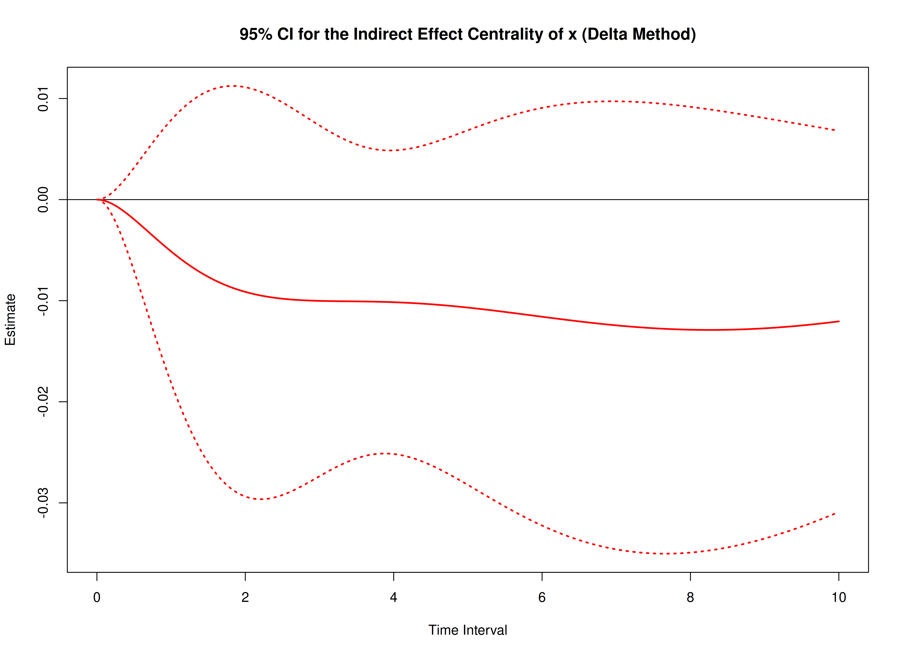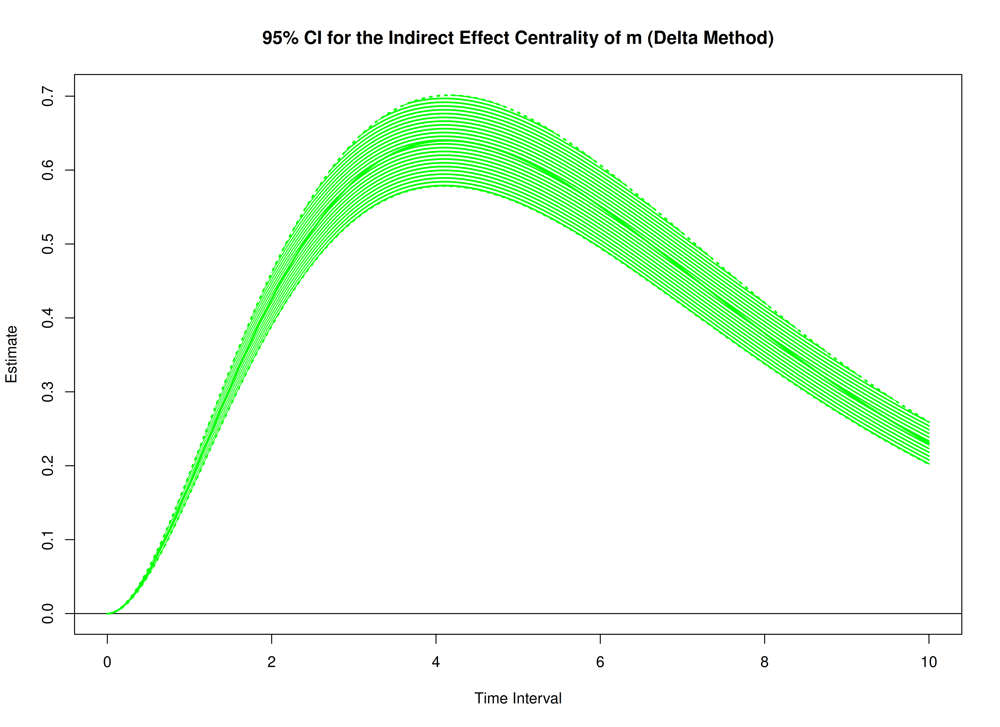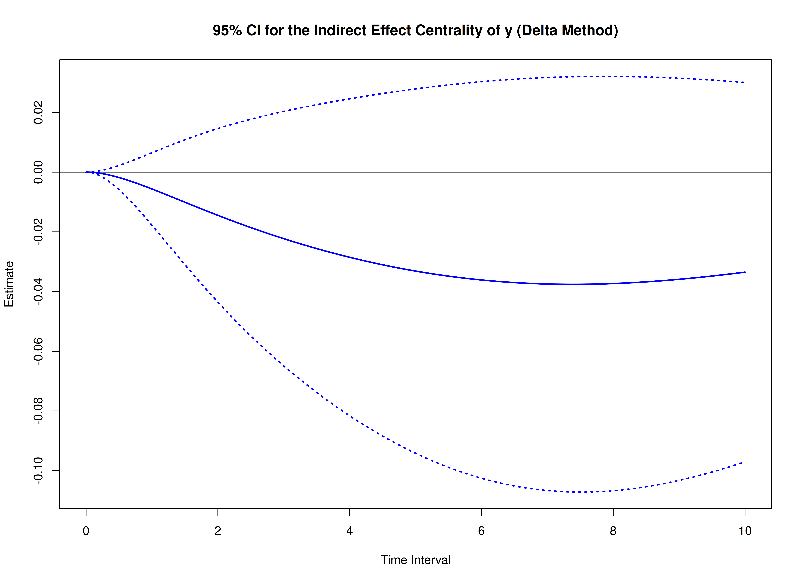

## Monte Carlo Method

The Monte Carlo method draws from the approximate joint sampling distribution of the drift matrix and process noise covariance matrix and evaluates the standardized centrality functions across those draws.


``` r
start <- Sys.time()
mc_total_std <- MCTotalCentralStd(
  phi = phi,
  sigma = sigma,
  vcov_theta = vcov_theta,
  delta_t = delta_t,
  R = 20000L,
  ncores = parallel::detectCores() # use multiple cores
)
end <- Sys.time()
elapsed <- end - start
elapsed
#> Time difference of 14.88392 mins
```


``` r
summary(mc_total_std)
#> Call:
#> MCTotalCentralStd(phi = phi, sigma = sigma, vcov_theta = vcov_theta, 
#>     delta_t = delta_t, R = 20000L, ncores = parallel::detectCores())
#> 
#> Total Effect Centrality
#>      variable interval     est     se     R    2.5%  97.5%
#> 1           x   0.0010  0.0001 0.0000 20000  0.0000 0.0001
#> 2           m   0.0010  0.0010 0.0000 20000  0.0009 0.0011
#> 3           y   0.0010  0.0000 0.0000 20000 -0.0001 0.0000
#> 4           x   0.0100  0.0009 0.0003 20000  0.0003 0.0014
#> 5           m   0.0100  0.0103 0.0004 20000  0.0094 0.0111
#> 6           y   0.0100 -0.0003 0.0003 20000 -0.0008 0.0002
#> 7           x   0.0200  0.0018 0.0006 20000  0.0006 0.0029
#> 8           m   0.0200  0.0204 0.0009 20000  0.0187 0.0221
#> 9           y   0.0200 -0.0006 0.0005 20000 -0.0016 0.0004
#> 10          x   0.0300  0.0028 0.0009 20000  0.0010 0.0045
#> 11          m   0.0300  0.0305 0.0013 20000  0.0279 0.0330
#> 12          y   0.0300 -0.0009 0.0008 20000 -0.0024 0.0006
#> 13          x   0.0400  0.0038 0.0012 20000  0.0015 0.0061
#> 14          m   0.0400  0.0404 0.0017 20000  0.0370 0.0437
#> 15          y   0.0400 -0.0012 0.0010 20000 -0.0031 0.0008
#> 16          x   0.0501  0.0049 0.0015 20000  0.0020 0.0077
#> 17          m   0.0501  0.0502 0.0021 20000  0.0460 0.0543
#> 18          y   0.0501 -0.0014 0.0013 20000 -0.0039 0.0011
#> 19          x   0.0601  0.0060 0.0017 20000  0.0026 0.0094
#> 20          m   0.0601  0.0598 0.0025 20000  0.0549 0.0648
#> 21          y   0.0601 -0.0017 0.0015 20000 -0.0047 0.0013
#> 22          x   0.0701  0.0072 0.0020 20000  0.0033 0.0112
#> 23          m   0.0701  0.0694 0.0029 20000  0.0637 0.0751
#> 24          y   0.0701 -0.0020 0.0018 20000 -0.0055 0.0015
#> 25          x   0.0801  0.0085 0.0023 20000  0.0040 0.0130
#> 26          m   0.0801  0.0788 0.0033 20000  0.0723 0.0853
#> 27          y   0.0801 -0.0023 0.0020 20000 -0.0062 0.0017
#> 28          x   0.0901  0.0098 0.0026 20000  0.0048 0.0148
#> 29          m   0.0901  0.0881 0.0037 20000  0.0809 0.0954
#> 30          y   0.0901 -0.0026 0.0023 20000 -0.0070 0.0019
#> 31          x   0.1001  0.0112 0.0028 20000  0.0056 0.0167
#> 32          m   0.1001  0.0973 0.0041 20000  0.0894 0.1054
#> 33          y   0.1001 -0.0028 0.0025 20000 -0.0077 0.0021
#> 34          x   0.1101  0.0126 0.0031 20000  0.0065 0.0186
#> 35          m   0.1101  0.1064 0.0044 20000  0.0977 0.1152
#> 36          y   0.1101 -0.0031 0.0027 20000 -0.0085 0.0023
#> 37          x   0.1201  0.0141 0.0033 20000  0.0075 0.0206
#> 38          m   0.1201  0.1154 0.0048 20000  0.1060 0.1248
#> 39          y   0.1201 -0.0034 0.0030 20000 -0.0092 0.0025
#> 40          x   0.1301  0.0156 0.0036 20000  0.0085 0.0226
#> 41          m   0.1301  0.1243 0.0051 20000  0.1142 0.1344
#> 42          y   0.1301 -0.0036 0.0032 20000 -0.0099 0.0027
#> 43          x   0.1401  0.0172 0.0038 20000  0.0096 0.0246
#> 44          m   0.1401  0.1330 0.0055 20000  0.1223 0.1438
#> 45          y   0.1401 -0.0039 0.0035 20000 -0.0107 0.0029
#> 46          x   0.1502  0.0188 0.0041 20000  0.0108 0.0267
#> 47          m   0.1502  0.1417 0.0058 20000  0.1302 0.1532
#> 48          y   0.1502 -0.0042 0.0037 20000 -0.0114 0.0031
#> 49          x   0.1602  0.0204 0.0043 20000  0.0120 0.0288
#> 50          m   0.1602  0.1502 0.0062 20000  0.1381 0.1624
#> 51          y   0.1602 -0.0044 0.0039 20000 -0.0121 0.0033
#> 52          x   0.1702  0.0222 0.0045 20000  0.0132 0.0310
#> 53          m   0.1702  0.1587 0.0065 20000  0.1459 0.1714
#> 54          y   0.1702 -0.0047 0.0042 20000 -0.0128 0.0035
#> 55          x   0.1802  0.0239 0.0048 20000  0.0145 0.0332
#> 56          m   0.1802  0.1670 0.0068 20000  0.1536 0.1804
#> 57          y   0.1802 -0.0050 0.0044 20000 -0.0136 0.0037
#> 58          x   0.1902  0.0257 0.0050 20000  0.0159 0.0355
#> 59          m   0.1902  0.1752 0.0071 20000  0.1612 0.1892
#> 60          y   0.1902 -0.0052 0.0046 20000 -0.0143 0.0039
#> 61          x   0.2002  0.0276 0.0052 20000  0.0173 0.0377
#> 62          m   0.2002  0.1833 0.0074 20000  0.1687 0.1980
#> 63          y   0.2002 -0.0055 0.0048 20000 -0.0150 0.0041
#> 64          x   0.2102  0.0295 0.0054 20000  0.0187 0.0400
#> 65          m   0.2102  0.1913 0.0078 20000  0.1761 0.2066
#> 66          y   0.2102 -0.0057 0.0051 20000 -0.0157 0.0043
#> 67          x   0.2202  0.0314 0.0056 20000  0.0203 0.0424
#> 68          m   0.2202  0.1993 0.0081 20000  0.1834 0.2151
#> 69          y   0.2202 -0.0060 0.0053 20000 -0.0163 0.0044
#> 70          x   0.2302  0.0334 0.0059 20000  0.0218 0.0448
#> 71          m   0.2302  0.2071 0.0083 20000  0.1906 0.2235
#> 72          y   0.2302 -0.0062 0.0055 20000 -0.0170 0.0046
#> 73          x   0.2402  0.0354 0.0061 20000  0.0234 0.0472
#> 74          m   0.2402  0.2148 0.0086 20000  0.1978 0.2318
#> 75          y   0.2402 -0.0065 0.0057 20000 -0.0177 0.0048
#> 76          x   0.2503  0.0374 0.0063 20000  0.0251 0.0497
#> 77          m   0.2503  0.2224 0.0089 20000  0.2048 0.2400
#> 78          y   0.2503 -0.0067 0.0060 20000 -0.0184 0.0050
#> 79          x   0.2603  0.0395 0.0065 20000  0.0268 0.0522
#> 80          m   0.2603  0.2299 0.0092 20000  0.2118 0.2480
#> 81          y   0.2603 -0.0070 0.0062 20000 -0.0191 0.0052
#> 82          x   0.2703  0.0417 0.0067 20000  0.0286 0.0547
#> 83          m   0.2703  0.2373 0.0095 20000  0.2186 0.2560
#> 84          y   0.2703 -0.0072 0.0064 20000 -0.0197 0.0054
#> 85          x   0.2803  0.0438 0.0068 20000  0.0304 0.0573
#> 86          m   0.2803  0.2446 0.0097 20000  0.2254 0.2638
#> 87          y   0.2803 -0.0075 0.0066 20000 -0.0204 0.0056
#> 88          x   0.2903  0.0461 0.0070 20000  0.0322 0.0598
#> 89          m   0.2903  0.2519 0.0100 20000  0.2321 0.2715
#> 90          y   0.2903 -0.0077 0.0068 20000 -0.0211 0.0057
#> 91          x   0.3003  0.0483 0.0072 20000  0.0341 0.0625
#> 92          m   0.3003  0.2590 0.0103 20000  0.2388 0.2791
#> 93          y   0.3003 -0.0080 0.0070 20000 -0.0217 0.0059
#> 94          x   0.3103  0.0506 0.0074 20000  0.0360 0.0651
#> 95          m   0.3103  0.2660 0.0105 20000  0.2453 0.2867
#> 96          y   0.3103 -0.0082 0.0073 20000 -0.0224 0.0061
#> 97          x   0.3203  0.0529 0.0076 20000  0.0380 0.0678
#> 98          m   0.3203  0.2730 0.0108 20000  0.2517 0.2941
#> 99          y   0.3203 -0.0084 0.0075 20000 -0.0230 0.0063
#> 100         x   0.3303  0.0553 0.0078 20000  0.0400 0.0704
#> 101         m   0.3303  0.2798 0.0110 20000  0.2581 0.3014
#> 102         y   0.3303 -0.0087 0.0077 20000 -0.0237 0.0065
#> 103         x   0.3403  0.0577 0.0079 20000  0.0421 0.0732
#> 104         m   0.3403  0.2866 0.0113 20000  0.2644 0.3087
#> 105         y   0.3403 -0.0089 0.0079 20000 -0.0243 0.0067
#> 106         x   0.3504  0.0601 0.0081 20000  0.0442 0.0759
#> 107         m   0.3504  0.2932 0.0115 20000  0.2706 0.3158
#> 108         y   0.3504 -0.0091 0.0081 20000 -0.0249 0.0068
#> 109         x   0.3604  0.0625 0.0083 20000  0.0463 0.0787
#> 110         m   0.3604  0.2998 0.0117 20000  0.2767 0.3228
#> 111         y   0.3604 -0.0094 0.0083 20000 -0.0256 0.0070
#> 112         x   0.3704  0.0650 0.0084 20000  0.0484 0.0815
#> 113         m   0.3704  0.3063 0.0120 20000  0.2827 0.3297
#> 114         y   0.3704 -0.0096 0.0085 20000 -0.0262 0.0072
#> 115         x   0.3804  0.0675 0.0086 20000  0.0507 0.0844
#> 116         m   0.3804  0.3127 0.0122 20000  0.2887 0.3366
#> 117         y   0.3804 -0.0098 0.0087 20000 -0.0268 0.0073
#> 118         x   0.3904  0.0701 0.0087 20000  0.0529 0.0872
#> 119         m   0.3904  0.3190 0.0124 20000  0.2946 0.3433
#> 120         y   0.3904 -0.0101 0.0089 20000 -0.0274 0.0075
#> 121         x   0.4004  0.0726 0.0089 20000  0.0552 0.0901
#> 122         m   0.4004  0.3252 0.0126 20000  0.3004 0.3500
#> 123         y   0.4004 -0.0103 0.0091 20000 -0.0280 0.0077
#> 124         x   0.4104  0.0753 0.0090 20000  0.0574 0.0930
#> 125         m   0.4104  0.3314 0.0128 20000  0.3061 0.3565
#> 126         y   0.4104 -0.0105 0.0093 20000 -0.0287 0.0079
#> 127         x   0.4204  0.0779 0.0092 20000  0.0598 0.0959
#> 128         m   0.4204  0.3374 0.0130 20000  0.3117 0.3629
#> 129         y   0.4204 -0.0107 0.0095 20000 -0.0293 0.0080
#> 130         x   0.4304  0.0805 0.0093 20000  0.0622 0.0989
#> 131         m   0.4304  0.3434 0.0132 20000  0.3173 0.3693
#> 132         y   0.4304 -0.0110 0.0097 20000 -0.0299 0.0082
#> 133         x   0.4404  0.0832 0.0095 20000  0.0646 0.1019
#> 134         m   0.4404  0.3493 0.0134 20000  0.3228 0.3756
#> 135         y   0.4404 -0.0112 0.0099 20000 -0.0305 0.0084
#> 136         x   0.4505  0.0860 0.0096 20000  0.0671 0.1049
#> 137         m   0.4505  0.3551 0.0136 20000  0.3282 0.3817
#> 138         y   0.4505 -0.0114 0.0101 20000 -0.0310 0.0085
#> 139         x   0.4605  0.0887 0.0098 20000  0.0696 0.1079
#> 140         m   0.4605  0.3608 0.0138 20000  0.3335 0.3878
#> 141         y   0.4605 -0.0116 0.0103 20000 -0.0316 0.0087
#> 142         x   0.4705  0.0915 0.0099 20000  0.0721 0.1109
#> 143         m   0.4705  0.3664 0.0140 20000  0.3388 0.3938
#> 144         y   0.4705 -0.0118 0.0105 20000 -0.0322 0.0089
#> 145         x   0.4805  0.0942 0.0100 20000  0.0746 0.1140
#> 146         m   0.4805  0.3720 0.0142 20000  0.3440 0.3997
#> 147         y   0.4805 -0.0120 0.0106 20000 -0.0328 0.0090
#> 148         x   0.4905  0.0971 0.0102 20000  0.0771 0.1170
#> 149         m   0.4905  0.3775 0.0144 20000  0.3491 0.4056
#> 150         y   0.4905 -0.0122 0.0108 20000 -0.0333 0.0092
#> 151         x   0.5005  0.0999 0.0103 20000  0.0797 0.1201
#> 152         m   0.5005  0.3829 0.0146 20000  0.3541 0.4114
#> 153         y   0.5005 -0.0124 0.0110 20000 -0.0339 0.0094
#> 154         x   0.5105  0.1028 0.0104 20000  0.0824 0.1232
#> 155         m   0.5105  0.3882 0.0147 20000  0.3591 0.4170
#> 156         y   0.5105 -0.0127 0.0112 20000 -0.0345 0.0095
#> 157         x   0.5205  0.1056 0.0105 20000  0.0850 0.1263
#> 158         m   0.5205  0.3935 0.0149 20000  0.3640 0.4226
#> 159         y   0.5205 -0.0129 0.0114 20000 -0.0350 0.0097
#> 160         x   0.5305  0.1086 0.0106 20000  0.0877 0.1295
#> 161         m   0.5305  0.3986 0.0151 20000  0.3689 0.4281
#> 162         y   0.5305 -0.0131 0.0116 20000 -0.0356 0.0098
#> 163         x   0.5405  0.1115 0.0108 20000  0.0903 0.1326
#> 164         m   0.5405  0.4037 0.0152 20000  0.3736 0.4336
#> 165         y   0.5405 -0.0133 0.0118 20000 -0.0361 0.0100
#> 166         x   0.5506  0.1144 0.0109 20000  0.0931 0.1358
#> 167         m   0.5506  0.4088 0.0154 20000  0.3783 0.4389
#> 168         y   0.5506 -0.0135 0.0119 20000 -0.0367 0.0101
#> 169         x   0.5606  0.1174 0.0110 20000  0.0958 0.1390
#> 170         m   0.5606  0.4137 0.0155 20000  0.3830 0.4442
#> 171         y   0.5606 -0.0137 0.0121 20000 -0.0372 0.0103
#> 172         x   0.5706  0.1204 0.0111 20000  0.0986 0.1422
#> 173         m   0.5706  0.4186 0.0157 20000  0.3875 0.4494
#> 174         y   0.5706 -0.0139 0.0123 20000 -0.0378 0.0105
#> 175         x   0.5806  0.1234 0.0112 20000  0.1013 0.1454
#> 176         m   0.5806  0.4234 0.0159 20000  0.3920 0.4545
#> 177         y   0.5806 -0.0141 0.0125 20000 -0.0383 0.0106
#> 178         x   0.5906  0.1264 0.0113 20000  0.1042 0.1486
#> 179         m   0.5906  0.4281 0.0160 20000  0.3964 0.4595
#> 180         y   0.5906 -0.0143 0.0126 20000 -0.0388 0.0108
#> 181         x   0.6006  0.1295 0.0114 20000  0.1070 0.1518
#> 182         m   0.6006  0.4328 0.0161 20000  0.4008 0.4644
#> 183         y   0.6006 -0.0145 0.0128 20000 -0.0394 0.0109
#> 184         x   0.6106  0.1325 0.0115 20000  0.1098 0.1551
#> 185         m   0.6106  0.4374 0.0163 20000  0.4051 0.4693
#> 186         y   0.6106 -0.0146 0.0130 20000 -0.0399 0.0111
#> 187         x   0.6206  0.1356 0.0116 20000  0.1127 0.1584
#> 188         m   0.6206  0.4419 0.0164 20000  0.4093 0.4741
#> 189         y   0.6206 -0.0148 0.0132 20000 -0.0404 0.0112
#> 190         x   0.6306  0.1387 0.0117 20000  0.1157 0.1616
#> 191         m   0.6306  0.4463 0.0166 20000  0.4135 0.4788
#> 192         y   0.6306 -0.0150 0.0133 20000 -0.0409 0.0113
#> 193         x   0.6406  0.1418 0.0118 20000  0.1186 0.1649
#> 194         m   0.6406  0.4507 0.0167 20000  0.4176 0.4835
#> 195         y   0.6406 -0.0152 0.0135 20000 -0.0414 0.0115
#> 196         x   0.6507  0.1449 0.0119 20000  0.1215 0.1683
#> 197         m   0.6507  0.4550 0.0168 20000  0.4216 0.4881
#> 198         y   0.6507 -0.0154 0.0137 20000 -0.0420 0.0116
#> 199         x   0.6607  0.1481 0.0120 20000  0.1245 0.1716
#> 200         m   0.6607  0.4593 0.0170 20000  0.4255 0.4926
#> 201         y   0.6607 -0.0156 0.0138 20000 -0.0425 0.0117
#> 202         x   0.6707  0.1512 0.0121 20000  0.1275 0.1749
#> 203         m   0.6707  0.4635 0.0171 20000  0.4294 0.4971
#> 204         y   0.6707 -0.0158 0.0140 20000 -0.0430 0.0119
#> 205         x   0.6807  0.1544 0.0122 20000  0.1305 0.1782
#> 206         m   0.6807  0.4676 0.0172 20000  0.4333 0.5014
#> 207         y   0.6807 -0.0160 0.0142 20000 -0.0435 0.0121
#> 208         x   0.6907  0.1576 0.0123 20000  0.1335 0.1816
#> 209         m   0.6907  0.4716 0.0173 20000  0.4371 0.5057
#> 210         y   0.6907 -0.0161 0.0143 20000 -0.0440 0.0122
#> 211         x   0.7007  0.1608 0.0123 20000  0.1365 0.1849
#> 212         m   0.7007  0.4756 0.0175 20000  0.4408 0.5099
#> 213         y   0.7007 -0.0163 0.0145 20000 -0.0445 0.0124
#> 214         x   0.7107  0.1640 0.0124 20000  0.1396 0.1883
#> 215         m   0.7107  0.4795 0.0176 20000  0.4445 0.5140
#> 216         y   0.7107 -0.0165 0.0146 20000 -0.0449 0.0125
#> 217         x   0.7207  0.1672 0.0125 20000  0.1426 0.1916
#> 218         m   0.7207  0.4834 0.0177 20000  0.4482 0.5181
#> 219         y   0.7207 -0.0167 0.0148 20000 -0.0454 0.0127
#> 220         x   0.7307  0.1704 0.0126 20000  0.1457 0.1950
#> 221         m   0.7307  0.4872 0.0178 20000  0.4517 0.5221
#> 222         y   0.7307 -0.0168 0.0150 20000 -0.0459 0.0128
#> 223         x   0.7407  0.1737 0.0127 20000  0.1488 0.1984
#> 224         m   0.7407  0.4909 0.0179 20000  0.4553 0.5261
#> 225         y   0.7407 -0.0170 0.0151 20000 -0.0464 0.0130
#> 226         x   0.7508  0.1769 0.0127 20000  0.1519 0.2018
#> 227         m   0.7508  0.4946 0.0180 20000  0.4587 0.5299
#> 228         y   0.7508 -0.0172 0.0153 20000 -0.0468 0.0131
#> 229         x   0.7608  0.1802 0.0128 20000  0.1550 0.2052
#> 230         m   0.7608  0.4982 0.0181 20000  0.4620 0.5338
#> 231         y   0.7608 -0.0174 0.0154 20000 -0.0473 0.0132
#> 232         x   0.7708  0.1835 0.0129 20000  0.1582 0.2086
#> 233         m   0.7708  0.5018 0.0182 20000  0.4654 0.5375
#> 234         y   0.7708 -0.0175 0.0156 20000 -0.0478 0.0133
#> 235         x   0.7808  0.1868 0.0130 20000  0.1613 0.2121
#> 236         m   0.7808  0.5052 0.0183 20000  0.4686 0.5412
#> 237         y   0.7808 -0.0177 0.0157 20000 -0.0482 0.0134
#> 238         x   0.7908  0.1901 0.0130 20000  0.1645 0.2155
#> 239         m   0.7908  0.5087 0.0184 20000  0.4719 0.5448
#> 240         y   0.7908 -0.0179 0.0159 20000 -0.0487 0.0136
#> 241         x   0.8008  0.1934 0.0131 20000  0.1677 0.2189
#> 242         m   0.8008  0.5121 0.0185 20000  0.4750 0.5483
#> 243         y   0.8008 -0.0180 0.0160 20000 -0.0491 0.0137
#> 244         x   0.8108  0.1967 0.0132 20000  0.1708 0.2223
#> 245         m   0.8108  0.5154 0.0186 20000  0.4781 0.5519
#> 246         y   0.8108 -0.0182 0.0162 20000 -0.0496 0.0138
#> 247         x   0.8208  0.2000 0.0132 20000  0.1741 0.2258
#> 248         m   0.8208  0.5186 0.0187 20000  0.4811 0.5553
#> 249         y   0.8208 -0.0184 0.0163 20000 -0.0500 0.0139
#> 250         x   0.8308  0.2033 0.0133 20000  0.1773 0.2292
#> 251         m   0.8308  0.5218 0.0188 20000  0.4842 0.5586
#> 252         y   0.8308 -0.0185 0.0165 20000 -0.0504 0.0141
#> 253         x   0.8408  0.2067 0.0133 20000  0.1805 0.2326
#> 254         m   0.8408  0.5250 0.0189 20000  0.4871 0.5620
#> 255         y   0.8408 -0.0187 0.0166 20000 -0.0509 0.0142
#> 256         x   0.8509  0.2100 0.0134 20000  0.1837 0.2361
#> 257         m   0.8509  0.5281 0.0190 20000  0.4900 0.5652
#> 258         y   0.8509 -0.0189 0.0168 20000 -0.0513 0.0143
#> 259         x   0.8609  0.2134 0.0135 20000  0.1870 0.2395
#> 260         m   0.8609  0.5311 0.0191 20000  0.4929 0.5684
#> 261         y   0.8609 -0.0190 0.0169 20000 -0.0517 0.0145
#> 262         x   0.8709  0.2167 0.0135 20000  0.1902 0.2430
#> 263         m   0.8709  0.5341 0.0192 20000  0.4957 0.5716
#> 264         y   0.8709 -0.0192 0.0171 20000 -0.0522 0.0146
#> 265         x   0.8809  0.2201 0.0136 20000  0.1935 0.2465
#> 266         m   0.8809  0.5370 0.0193 20000  0.4985 0.5746
#> 267         y   0.8809 -0.0193 0.0172 20000 -0.0526 0.0147
#> 268         x   0.8909  0.2235 0.0136 20000  0.1967 0.2500
#> 269         m   0.8909  0.5399 0.0193 20000  0.5012 0.5777
#> 270         y   0.8909 -0.0195 0.0173 20000 -0.0530 0.0148
#> 271         x   0.9009  0.2268 0.0137 20000  0.2000 0.2534
#> 272         m   0.9009  0.5427 0.0194 20000  0.5038 0.5806
#> 273         y   0.9009 -0.0196 0.0175 20000 -0.0534 0.0149
#> 274         x   0.9109  0.2302 0.0137 20000  0.2033 0.2570
#> 275         m   0.9109  0.5455 0.0195 20000  0.5064 0.5835
#> 276         y   0.9109 -0.0198 0.0176 20000 -0.0538 0.0150
#> 277         x   0.9209  0.2336 0.0138 20000  0.2066 0.2605
#> 278         m   0.9209  0.5482 0.0196 20000  0.5090 0.5864
#> 279         y   0.9209 -0.0199 0.0178 20000 -0.0543 0.0151
#> 280         x   0.9309  0.2370 0.0138 20000  0.2099 0.2640
#> 281         m   0.9309  0.5508 0.0196 20000  0.5115 0.5892
#> 282         y   0.9309 -0.0201 0.0179 20000 -0.0547 0.0153
#> 283         x   0.9409  0.2404 0.0139 20000  0.2132 0.2674
#> 284         m   0.9409  0.5534 0.0197 20000  0.5140 0.5919
#> 285         y   0.9409 -0.0202 0.0180 20000 -0.0551 0.0154
#> 286         x   0.9510  0.2438 0.0139 20000  0.2166 0.2709
#> 287         m   0.9510  0.5560 0.0198 20000  0.5164 0.5946
#> 288         y   0.9510 -0.0204 0.0182 20000 -0.0555 0.0155
#> 289         x   0.9610  0.2472 0.0140 20000  0.2198 0.2744
#> 290         m   0.9610  0.5585 0.0199 20000  0.5188 0.5972
#> 291         y   0.9610 -0.0205 0.0183 20000 -0.0559 0.0157
#> 292         x   0.9710  0.2506 0.0140 20000  0.2231 0.2779
#> 293         m   0.9710  0.5610 0.0199 20000  0.5211 0.5999
#> 294         y   0.9710 -0.0207 0.0184 20000 -0.0564 0.0158
#> 295         x   0.9810  0.2540 0.0141 20000  0.2264 0.2814
#> 296         m   0.9810  0.5634 0.0200 20000  0.5234 0.6024
#> 297         y   0.9810 -0.0208 0.0186 20000 -0.0568 0.0159
#> 298         x   0.9910  0.2574 0.0141 20000  0.2298 0.2849
#> 299         m   0.9910  0.5658 0.0201 20000  0.5256 0.6049
#> 300         y   0.9910 -0.0210 0.0187 20000 -0.0572 0.0160
#> 301         x   1.0010  0.2608 0.0142 20000  0.2331 0.2884
#> 302         m   1.0010  0.5681 0.0201 20000  0.5277 0.6073
#> 303         y   1.0010 -0.0211 0.0188 20000 -0.0575 0.0161
#> 304         x   1.0110  0.2642 0.0142 20000  0.2364 0.2918
#> 305         m   1.0110  0.5704 0.0202 20000  0.5299 0.6097
#> 306         y   1.0110 -0.0212 0.0189 20000 -0.0579 0.0162
#> 307         x   1.0210  0.2676 0.0142 20000  0.2398 0.2953
#> 308         m   1.0210  0.5726 0.0203 20000  0.5320 0.6121
#> 309         y   1.0210 -0.0214 0.0191 20000 -0.0583 0.0163
#> 310         x   1.0310  0.2710 0.0143 20000  0.2431 0.2987
#> 311         m   1.0310  0.5748 0.0203 20000  0.5340 0.6144
#> 312         y   1.0310 -0.0215 0.0192 20000 -0.0587 0.0165
#> 313         x   1.0410  0.2744 0.0143 20000  0.2465 0.3022
#> 314         m   1.0410  0.5769 0.0204 20000  0.5361 0.6166
#> 315         y   1.0410 -0.0216 0.0193 20000 -0.0590 0.0166
#> 316         x   1.0511  0.2778 0.0144 20000  0.2498 0.3056
#> 317         m   1.0511  0.5790 0.0204 20000  0.5381 0.6188
#> 318         y   1.0511 -0.0218 0.0194 20000 -0.0594 0.0167
#> 319         x   1.0611  0.2812 0.0144 20000  0.2531 0.3091
#> 320         m   1.0611  0.5810 0.0205 20000  0.5400 0.6209
#> 321         y   1.0611 -0.0219 0.0196 20000 -0.0598 0.0168
#> 322         x   1.0711  0.2847 0.0144 20000  0.2565 0.3126
#> 323         m   1.0711  0.5830 0.0206 20000  0.5419 0.6231
#> 324         y   1.0711 -0.0220 0.0197 20000 -0.0601 0.0169
#> 325         x   1.0811  0.2881 0.0145 20000  0.2598 0.3162
#> 326         m   1.0811  0.5850 0.0206 20000  0.5437 0.6252
#> 327         y   1.0811 -0.0222 0.0198 20000 -0.0605 0.0170
#> 328         x   1.0911  0.2915 0.0145 20000  0.2631 0.3197
#> 329         m   1.0911  0.5869 0.0207 20000  0.5455 0.6272
#> 330         y   1.0911 -0.0223 0.0199 20000 -0.0609 0.0171
#> 331         x   1.1011  0.2949 0.0146 20000  0.2664 0.3231
#> 332         m   1.1011  0.5887 0.0207 20000  0.5473 0.6292
#> 333         y   1.1011 -0.0224 0.0200 20000 -0.0612 0.0171
#> 334         x   1.1111  0.2983 0.0146 20000  0.2698 0.3267
#> 335         m   1.1111  0.5906 0.0208 20000  0.5491 0.6311
#> 336         y   1.1111 -0.0226 0.0202 20000 -0.0616 0.0173
#> 337         x   1.1211  0.3017 0.0146 20000  0.2731 0.3301
#> 338         m   1.1211  0.5924 0.0208 20000  0.5507 0.6330
#> 339         y   1.1211 -0.0227 0.0203 20000 -0.0619 0.0174
#> 340         x   1.1311  0.3051 0.0147 20000  0.2765 0.3336
#> 341         m   1.1311  0.5941 0.0209 20000  0.5524 0.6348
#> 342         y   1.1311 -0.0228 0.0204 20000 -0.0623 0.0175
#> 343         x   1.1411  0.3085 0.0147 20000  0.2799 0.3370
#> 344         m   1.1411  0.5958 0.0209 20000  0.5540 0.6366
#> 345         y   1.1411 -0.0229 0.0205 20000 -0.0626 0.0176
#> 346         x   1.1512  0.3119 0.0147 20000  0.2833 0.3404
#> 347         m   1.1512  0.5975 0.0210 20000  0.5556 0.6384
#> 348         y   1.1512 -0.0231 0.0206 20000 -0.0630 0.0177
#> 349         x   1.1612  0.3153 0.0147 20000  0.2866 0.3439
#> 350         m   1.1612  0.5991 0.0210 20000  0.5571 0.6400
#> 351         y   1.1612 -0.0232 0.0207 20000 -0.0634 0.0178
#> 352         x   1.1712  0.3187 0.0148 20000  0.2899 0.3474
#> 353         m   1.1712  0.6006 0.0211 20000  0.5586 0.6417
#> 354         y   1.1712 -0.0233 0.0208 20000 -0.0637 0.0179
#> 355         x   1.1812  0.3221 0.0148 20000  0.2933 0.3508
#> 356         m   1.1812  0.6022 0.0211 20000  0.5601 0.6433
#> 357         y   1.1812 -0.0234 0.0210 20000 -0.0640 0.0179
#> 358         x   1.1912  0.3255 0.0148 20000  0.2966 0.3543
#> 359         m   1.1912  0.6037 0.0212 20000  0.5615 0.6449
#> 360         y   1.1912 -0.0235 0.0211 20000 -0.0643 0.0181
#> 361         x   1.2012  0.3289 0.0149 20000  0.3000 0.3577
#> 362         m   1.2012  0.6051 0.0212 20000  0.5628 0.6464
#> 363         y   1.2012 -0.0237 0.0212 20000 -0.0647 0.0182
#> 364         x   1.2112  0.3322 0.0149 20000  0.3034 0.3610
#> 365         m   1.2112  0.6066 0.0212 20000  0.5642 0.6479
#> 366         y   1.2112 -0.0238 0.0213 20000 -0.0650 0.0183
#> 367         x   1.2212  0.3356 0.0149 20000  0.3067 0.3645
#> 368         m   1.2212  0.6080 0.0213 20000  0.5655 0.6493
#> 369         y   1.2212 -0.0239 0.0214 20000 -0.0653 0.0184
#> 370         x   1.2312  0.3390 0.0149 20000  0.3100 0.3679
#> 371         m   1.2312  0.6093 0.0213 20000  0.5667 0.6507
#> 372         y   1.2312 -0.0240 0.0215 20000 -0.0657 0.0185
#> 373         x   1.2412  0.3424 0.0150 20000  0.3133 0.3714
#> 374         m   1.2412  0.6106 0.0214 20000  0.5679 0.6521
#> 375         y   1.2412 -0.0241 0.0216 20000 -0.0660 0.0186
#> 376         x   1.2513  0.3457 0.0150 20000  0.3166 0.3748
#> 377         m   1.2513  0.6119 0.0214 20000  0.5691 0.6535
#> 378         y   1.2513 -0.0242 0.0217 20000 -0.0663 0.0187
#> 379         x   1.2613  0.3491 0.0150 20000  0.3199 0.3782
#> 380         m   1.2613  0.6131 0.0214 20000  0.5702 0.6548
#> 381         y   1.2613 -0.0243 0.0218 20000 -0.0666 0.0188
#> 382         x   1.2713  0.3524 0.0151 20000  0.3232 0.3816
#> 383         m   1.2713  0.6143 0.0215 20000  0.5713 0.6560
#> 384         y   1.2713 -0.0245 0.0219 20000 -0.0669 0.0189
#> 385         x   1.2813  0.3558 0.0151 20000  0.3266 0.3850
#> 386         m   1.2813  0.6155 0.0215 20000  0.5724 0.6572
#> 387         y   1.2813 -0.0246 0.0220 20000 -0.0672 0.0190
#> 388         x   1.2913  0.3591 0.0151 20000  0.3298 0.3884
#> 389         m   1.2913  0.6166 0.0216 20000  0.5735 0.6584
#> 390         y   1.2913 -0.0247 0.0221 20000 -0.0675 0.0191
#> 391         x   1.3013  0.3625 0.0151 20000  0.3331 0.3917
#> 392         m   1.3013  0.6177 0.0216 20000  0.5745 0.6596
#> 393         y   1.3013 -0.0248 0.0222 20000 -0.0678 0.0192
#> 394         x   1.3113  0.3658 0.0152 20000  0.3364 0.3951
#> 395         m   1.3113  0.6188 0.0216 20000  0.5755 0.6607
#> 396         y   1.3113 -0.0249 0.0223 20000 -0.0681 0.0192
#> 397         x   1.3213  0.3691 0.0152 20000  0.3397 0.3985
#> 398         m   1.3213  0.6198 0.0217 20000  0.5764 0.6618
#> 399         y   1.3213 -0.0250 0.0224 20000 -0.0684 0.0193
#> 400         x   1.3313  0.3724 0.0152 20000  0.3430 0.4019
#> 401         m   1.3313  0.6208 0.0217 20000  0.5773 0.6629
#> 402         y   1.3313 -0.0251 0.0225 20000 -0.0687 0.0194
#> 403         x   1.3413  0.3758 0.0152 20000  0.3463 0.4052
#> 404         m   1.3413  0.6217 0.0217 20000  0.5782 0.6639
#> 405         y   1.3413 -0.0252 0.0226 20000 -0.0690 0.0195
#> 406         x   1.3514  0.3791 0.0152 20000  0.3496 0.4086
#> 407         m   1.3514  0.6227 0.0218 20000  0.5791 0.6649
#> 408         y   1.3514 -0.0253 0.0227 20000 -0.0693 0.0196
#> 409         x   1.3614  0.3824 0.0153 20000  0.3528 0.4119
#> 410         m   1.3614  0.6236 0.0218 20000  0.5799 0.6658
#> 411         y   1.3614 -0.0254 0.0228 20000 -0.0696 0.0198
#> 412         x   1.3714  0.3856 0.0153 20000  0.3560 0.4152
#> 413         m   1.3714  0.6244 0.0218 20000  0.5807 0.6668
#> 414         y   1.3714 -0.0255 0.0229 20000 -0.0699 0.0198
#> 415         x   1.3814  0.3889 0.0153 20000  0.3593 0.4185
#> 416         m   1.3814  0.6253 0.0218 20000  0.5815 0.6676
#> 417         y   1.3814 -0.0256 0.0230 20000 -0.0702 0.0199
#> 418         x   1.3914  0.3922 0.0153 20000  0.3625 0.4218
#> 419         m   1.3914  0.6261 0.0219 20000  0.5823 0.6684
#> 420         y   1.3914 -0.0257 0.0231 20000 -0.0705 0.0200
#> 421         x   1.4014  0.3955 0.0154 20000  0.3658 0.4252
#> 422         m   1.4014  0.6268 0.0219 20000  0.5829 0.6693
#> 423         y   1.4014 -0.0258 0.0232 20000 -0.0707 0.0201
#> 424         x   1.4114  0.3987 0.0154 20000  0.3690 0.4285
#> 425         m   1.4114  0.6276 0.0219 20000  0.5837 0.6700
#> 426         y   1.4114 -0.0259 0.0232 20000 -0.0710 0.0202
#> 427         x   1.4214  0.4020 0.0154 20000  0.3723 0.4318
#> 428         m   1.4214  0.6283 0.0220 20000  0.5844 0.6707
#> 429         y   1.4214 -0.0260 0.0233 20000 -0.0713 0.0203
#> 430         x   1.4314  0.4052 0.0154 20000  0.3755 0.4349
#> 431         m   1.4314  0.6289 0.0220 20000  0.5850 0.6715
#> 432         y   1.4314 -0.0261 0.0234 20000 -0.0716 0.0204
#> 433         x   1.4414  0.4085 0.0154 20000  0.3787 0.4382
#> 434         m   1.4414  0.6296 0.0220 20000  0.5856 0.6721
#> 435         y   1.4414 -0.0262 0.0235 20000 -0.0718 0.0205
#> 436         x   1.4515  0.4117 0.0155 20000  0.3818 0.4414
#> 437         m   1.4515  0.6302 0.0220 20000  0.5862 0.6728
#> 438         y   1.4515 -0.0263 0.0236 20000 -0.0721 0.0206
#> 439         x   1.4615  0.4149 0.0155 20000  0.3850 0.4447
#> 440         m   1.4615  0.6308 0.0221 20000  0.5867 0.6734
#> 441         y   1.4615 -0.0264 0.0237 20000 -0.0723 0.0207
#> 442         x   1.4715  0.4181 0.0155 20000  0.3882 0.4480
#> 443         m   1.4715  0.6313 0.0221 20000  0.5872 0.6740
#> 444         y   1.4715 -0.0264 0.0238 20000 -0.0726 0.0208
#> 445         x   1.4815  0.4213 0.0155 20000  0.3913 0.4512
#> 446         m   1.4815  0.6319 0.0221 20000  0.5877 0.6745
#> 447         y   1.4815 -0.0265 0.0239 20000 -0.0728 0.0208
#> 448         x   1.4915  0.4245 0.0155 20000  0.3944 0.4545
#> 449         m   1.4915  0.6324 0.0221 20000  0.5882 0.6751
#> 450         y   1.4915 -0.0266 0.0239 20000 -0.0731 0.0209
#> 451         x   1.5015  0.4277 0.0156 20000  0.3976 0.4577
#> 452         m   1.5015  0.6328 0.0222 20000  0.5886 0.6756
#> 453         y   1.5015 -0.0267 0.0240 20000 -0.0733 0.0210
#> 454         x   1.5115  0.4309 0.0156 20000  0.4007 0.4610
#> 455         m   1.5115  0.6333 0.0222 20000  0.5890 0.6760
#> 456         y   1.5115 -0.0268 0.0241 20000 -0.0736 0.0210
#> 457         x   1.5215  0.4341 0.0156 20000  0.4038 0.4643
#> 458         m   1.5215  0.6337 0.0222 20000  0.5893 0.6765
#> 459         y   1.5215 -0.0269 0.0242 20000 -0.0738 0.0211
#> 460         x   1.5315  0.4372 0.0156 20000  0.4069 0.4675
#> 461         m   1.5315  0.6341 0.0222 20000  0.5896 0.6770
#> 462         y   1.5315 -0.0270 0.0243 20000 -0.0740 0.0212
#> 463         x   1.5415  0.4404 0.0156 20000  0.4101 0.4707
#> 464         m   1.5415  0.6345 0.0223 20000  0.5899 0.6774
#> 465         y   1.5415 -0.0270 0.0243 20000 -0.0743 0.0213
#> 466         x   1.5516  0.4435 0.0157 20000  0.4132 0.4738
#> 467         m   1.5516  0.6348 0.0223 20000  0.5903 0.6778
#> 468         y   1.5516 -0.0271 0.0244 20000 -0.0745 0.0214
#> 469         x   1.5616  0.4466 0.0157 20000  0.4162 0.4770
#> 470         m   1.5616  0.6351 0.0223 20000  0.5905 0.6782
#> 471         y   1.5616 -0.0272 0.0245 20000 -0.0748 0.0214
#> 472         x   1.5716  0.4497 0.0157 20000  0.4193 0.4802
#> 473         m   1.5716  0.6354 0.0223 20000  0.5907 0.6785
#> 474         y   1.5716 -0.0273 0.0246 20000 -0.0750 0.0215
#> 475         x   1.5816  0.4528 0.0157 20000  0.4223 0.4833
#> 476         m   1.5816  0.6357 0.0223 20000  0.5910 0.6788
#> 477         y   1.5816 -0.0274 0.0246 20000 -0.0752 0.0216
#> 478         x   1.5916  0.4559 0.0157 20000  0.4253 0.4864
#> 479         m   1.5916  0.6359 0.0224 20000  0.5911 0.6791
#> 480         y   1.5916 -0.0274 0.0247 20000 -0.0754 0.0217
#> 481         x   1.6016  0.4590 0.0158 20000  0.4283 0.4895
#> 482         m   1.6016  0.6361 0.0224 20000  0.5913 0.6794
#> 483         y   1.6016 -0.0275 0.0248 20000 -0.0756 0.0218
#> 484         x   1.6116  0.4621 0.0158 20000  0.4314 0.4926
#> 485         m   1.6116  0.6363 0.0224 20000  0.5914 0.6796
#> 486         y   1.6116 -0.0276 0.0249 20000 -0.0759 0.0218
#> 487         x   1.6216  0.4652 0.0158 20000  0.4344 0.4957
#> 488         m   1.6216  0.6365 0.0224 20000  0.5915 0.6798
#> 489         y   1.6216 -0.0277 0.0249 20000 -0.0761 0.0219
#> 490         x   1.6316  0.4682 0.0158 20000  0.4374 0.4989
#> 491         m   1.6316  0.6366 0.0224 20000  0.5916 0.6800
#> 492         y   1.6316 -0.0278 0.0250 20000 -0.0763 0.0219
#> 493         x   1.6416  0.4713 0.0158 20000  0.4404 0.5020
#> 494         m   1.6416  0.6367 0.0225 20000  0.5917 0.6801
#> 495         y   1.6416 -0.0278 0.0251 20000 -0.0765 0.0220
#> 496         x   1.6517  0.4743 0.0159 20000  0.4434 0.5051
#> 497         m   1.6517  0.6368 0.0225 20000  0.5918 0.6803
#> 498         y   1.6517 -0.0279 0.0252 20000 -0.0767 0.0221
#> 499         x   1.6617  0.4773 0.0159 20000  0.4464 0.5082
#> 500         m   1.6617  0.6369 0.0225 20000  0.5918 0.6804
#> 501         y   1.6617 -0.0280 0.0252 20000 -0.0770 0.0222
#> 502         x   1.6717  0.4803 0.0159 20000  0.4494 0.5113
#> 503         m   1.6717  0.6369 0.0225 20000  0.5918 0.6805
#> 504         y   1.6717 -0.0280 0.0253 20000 -0.0772 0.0223
#> 505         x   1.6817  0.4833 0.0159 20000  0.4524 0.5143
#> 506         m   1.6817  0.6369 0.0225 20000  0.5918 0.6806
#> 507         y   1.6817 -0.0281 0.0254 20000 -0.0774 0.0223
#> 508         x   1.6917  0.4863 0.0159 20000  0.4553 0.5173
#> 509         m   1.6917  0.6369 0.0226 20000  0.5917 0.6806
#> 510         y   1.6917 -0.0282 0.0254 20000 -0.0776 0.0224
#> 511         x   1.7017  0.4893 0.0160 20000  0.4582 0.5203
#> 512         m   1.7017  0.6369 0.0226 20000  0.5917 0.6807
#> 513         y   1.7017 -0.0283 0.0255 20000 -0.0778 0.0224
#> 514         x   1.7117  0.4922 0.0160 20000  0.4611 0.5234
#> 515         m   1.7117  0.6369 0.0226 20000  0.5916 0.6806
#> 516         y   1.7117 -0.0283 0.0256 20000 -0.0780 0.0225
#> 517         x   1.7217  0.4952 0.0160 20000  0.4640 0.5264
#> 518         m   1.7217  0.6368 0.0226 20000  0.5914 0.6806
#> 519         y   1.7217 -0.0284 0.0256 20000 -0.0782 0.0225
#> 520         x   1.7317  0.4981 0.0160 20000  0.4669 0.5293
#> 521         m   1.7317  0.6367 0.0226 20000  0.5913 0.6805
#> 522         y   1.7317 -0.0285 0.0257 20000 -0.0784 0.0226
#> 523         x   1.7417  0.5011 0.0161 20000  0.4699 0.5323
#> 524         m   1.7417  0.6366 0.0226 20000  0.5912 0.6804
#> 525         y   1.7417 -0.0285 0.0258 20000 -0.0786 0.0227
#> 526         x   1.7518  0.5040 0.0161 20000  0.4728 0.5352
#> 527         m   1.7518  0.6365 0.0227 20000  0.5910 0.6803
#> 528         y   1.7518 -0.0286 0.0258 20000 -0.0788 0.0227
#> 529         x   1.7618  0.5069 0.0161 20000  0.4757 0.5382
#> 530         m   1.7618  0.6363 0.0227 20000  0.5908 0.6803
#> 531         y   1.7618 -0.0286 0.0259 20000 -0.0790 0.0228
#> 532         x   1.7718  0.5098 0.0161 20000  0.4785 0.5411
#> 533         m   1.7718  0.6361 0.0227 20000  0.5905 0.6802
#> 534         y   1.7718 -0.0287 0.0259 20000 -0.0791 0.0228
#> 535         x   1.7818  0.5126 0.0161 20000  0.4813 0.5440
#> 536         m   1.7818  0.6360 0.0227 20000  0.5903 0.6800
#> 537         y   1.7818 -0.0288 0.0260 20000 -0.0793 0.0229
#> 538         x   1.7918  0.5155 0.0162 20000  0.4841 0.5469
#> 539         m   1.7918  0.6357 0.0227 20000  0.5901 0.6798
#> 540         y   1.7918 -0.0288 0.0261 20000 -0.0795 0.0230
#> 541         x   1.8018  0.5184 0.0162 20000  0.4869 0.5498
#> 542         m   1.8018  0.6355 0.0227 20000  0.5899 0.6797
#> 543         y   1.8018 -0.0289 0.0261 20000 -0.0797 0.0230
#> 544         x   1.8118  0.5212 0.0162 20000  0.4898 0.5527
#> 545         m   1.8118  0.6353 0.0227 20000  0.5897 0.6795
#> 546         y   1.8118 -0.0290 0.0262 20000 -0.0798 0.0231
#> 547         x   1.8218  0.5240 0.0162 20000  0.4926 0.5557
#> 548         m   1.8218  0.6350 0.0228 20000  0.5893 0.6792
#> 549         y   1.8218 -0.0290 0.0262 20000 -0.0800 0.0232
#> 550         x   1.8318  0.5268 0.0162 20000  0.4953 0.5585
#> 551         m   1.8318  0.6347 0.0228 20000  0.5890 0.6790
#> 552         y   1.8318 -0.0291 0.0263 20000 -0.0801 0.0232
#> 553         x   1.8418  0.5296 0.0163 20000  0.4981 0.5614
#> 554         m   1.8418  0.6344 0.0228 20000  0.5887 0.6787
#> 555         y   1.8418 -0.0291 0.0264 20000 -0.0803 0.0233
#> 556         x   1.8519  0.5324 0.0163 20000  0.5009 0.5643
#> 557         m   1.8519  0.6341 0.0228 20000  0.5883 0.6783
#> 558         y   1.8519 -0.0292 0.0264 20000 -0.0804 0.0234
#> 559         x   1.8619  0.5352 0.0163 20000  0.5036 0.5671
#> 560         m   1.8619  0.6337 0.0228 20000  0.5879 0.6780
#> 561         y   1.8619 -0.0292 0.0265 20000 -0.0806 0.0234
#> 562         x   1.8719  0.5380 0.0163 20000  0.5064 0.5700
#> 563         m   1.8719  0.6334 0.0228 20000  0.5875 0.6776
#> 564         y   1.8719 -0.0293 0.0265 20000 -0.0808 0.0235
#> 565         x   1.8819  0.5407 0.0164 20000  0.5091 0.5728
#> 566         m   1.8819  0.6330 0.0228 20000  0.5871 0.6773
#> 567         y   1.8819 -0.0294 0.0266 20000 -0.0809 0.0235
#> 568         x   1.8919  0.5435 0.0164 20000  0.5119 0.5755
#> 569         m   1.8919  0.6326 0.0229 20000  0.5867 0.6769
#> 570         y   1.8919 -0.0294 0.0266 20000 -0.0811 0.0236
#> 571         x   1.9019  0.5462 0.0164 20000  0.5145 0.5783
#> 572         m   1.9019  0.6322 0.0229 20000  0.5863 0.6765
#> 573         y   1.9019 -0.0295 0.0267 20000 -0.0813 0.0236
#> 574         x   1.9119  0.5489 0.0164 20000  0.5172 0.5811
#> 575         m   1.9119  0.6318 0.0229 20000  0.5858 0.6762
#> 576         y   1.9119 -0.0295 0.0267 20000 -0.0814 0.0237
#> 577         x   1.9219  0.5516 0.0164 20000  0.5198 0.5839
#> 578         m   1.9219  0.6313 0.0229 20000  0.5854 0.6758
#> 579         y   1.9219 -0.0296 0.0268 20000 -0.0816 0.0237
#> 580         x   1.9319  0.5543 0.0165 20000  0.5224 0.5866
#> 581         m   1.9319  0.6308 0.0229 20000  0.5849 0.6754
#> 582         y   1.9319 -0.0296 0.0268 20000 -0.0817 0.0238
#> 583         x   1.9419  0.5569 0.0165 20000  0.5250 0.5894
#> 584         m   1.9419  0.6304 0.0229 20000  0.5843 0.6749
#> 585         y   1.9419 -0.0297 0.0269 20000 -0.0819 0.0238
#> 586         x   1.9520  0.5596 0.0165 20000  0.5276 0.5920
#> 587         m   1.9520  0.6299 0.0229 20000  0.5838 0.6744
#> 588         y   1.9520 -0.0297 0.0269 20000 -0.0820 0.0239
#> 589         x   1.9620  0.5622 0.0165 20000  0.5302 0.5947
#> 590         m   1.9620  0.6294 0.0229 20000  0.5832 0.6739
#> 591         y   1.9620 -0.0298 0.0270 20000 -0.0822 0.0239
#> 592         x   1.9720  0.5649 0.0166 20000  0.5327 0.5975
#> 593         m   1.9720  0.6288 0.0230 20000  0.5827 0.6734
#> 594         y   1.9720 -0.0298 0.0270 20000 -0.0823 0.0240
#> 595         x   1.9820  0.5675 0.0166 20000  0.5353 0.6001
#> 596         m   1.9820  0.6283 0.0230 20000  0.5821 0.6728
#> 597         y   1.9820 -0.0299 0.0271 20000 -0.0825 0.0240
#> 598         x   1.9920  0.5701 0.0166 20000  0.5378 0.6027
#> 599         m   1.9920  0.6277 0.0230 20000  0.5815 0.6723
#> 600         y   1.9920 -0.0299 0.0271 20000 -0.0826 0.0241
#> 601         x   2.0020  0.5727 0.0166 20000  0.5403 0.6053
#> 602         m   2.0020  0.6271 0.0230 20000  0.5809 0.6717
#> 603         y   2.0020 -0.0299 0.0272 20000 -0.0827 0.0242
#> 604         x   2.0120  0.5752 0.0167 20000  0.5429 0.6080
#> 605         m   2.0120  0.6266 0.0230 20000  0.5803 0.6711
#> 606         y   2.0120 -0.0300 0.0272 20000 -0.0829 0.0242
#> 607         x   2.0220  0.5778 0.0167 20000  0.5454 0.6106
#> 608         m   2.0220  0.6259 0.0230 20000  0.5797 0.6706
#> 609         y   2.0220 -0.0300 0.0273 20000 -0.0830 0.0243
#> 610         x   2.0320  0.5804 0.0167 20000  0.5479 0.6132
#> 611         m   2.0320  0.6253 0.0230 20000  0.5790 0.6700
#> 612         y   2.0320 -0.0301 0.0273 20000 -0.0832 0.0244
#> 613         x   2.0420  0.5829 0.0167 20000  0.5504 0.6158
#> 614         m   2.0420  0.6247 0.0230 20000  0.5784 0.6694
#> 615         y   2.0420 -0.0301 0.0274 20000 -0.0833 0.0244
#> 616         x   2.0521  0.5854 0.0168 20000  0.5529 0.6183
#> 617         m   2.0521  0.6240 0.0230 20000  0.5777 0.6687
#> 618         y   2.0521 -0.0302 0.0274 20000 -0.0834 0.0245
#> 619         x   2.0621  0.5879 0.0168 20000  0.5553 0.6209
#> 620         m   2.0621  0.6234 0.0231 20000  0.5771 0.6681
#> 621         y   2.0621 -0.0302 0.0274 20000 -0.0836 0.0245
#> 622         x   2.0721  0.5904 0.0168 20000  0.5578 0.6234
#> 623         m   2.0721  0.6227 0.0231 20000  0.5763 0.6674
#> 624         y   2.0721 -0.0302 0.0275 20000 -0.0837 0.0246
#> 625         x   2.0821  0.5929 0.0168 20000  0.5602 0.6260
#> 626         m   2.0821  0.6220 0.0231 20000  0.5756 0.6668
#> 627         y   2.0821 -0.0303 0.0275 20000 -0.0838 0.0246
#> 628         x   2.0921  0.5953 0.0169 20000  0.5626 0.6285
#> 629         m   2.0921  0.6213 0.0231 20000  0.5749 0.6661
#> 630         y   2.0921 -0.0303 0.0276 20000 -0.0839 0.0247
#> 631         x   2.1021  0.5978 0.0169 20000  0.5649 0.6310
#> 632         m   2.1021  0.6206 0.0231 20000  0.5742 0.6654
#> 633         y   2.1021 -0.0304 0.0276 20000 -0.0840 0.0247
#> 634         x   2.1121  0.6002 0.0169 20000  0.5673 0.6335
#> 635         m   2.1121  0.6199 0.0231 20000  0.5735 0.6647
#> 636         y   2.1121 -0.0304 0.0276 20000 -0.0841 0.0248
#> 637         x   2.1221  0.6026 0.0169 20000  0.5697 0.6360
#> 638         m   2.1221  0.6191 0.0231 20000  0.5727 0.6641
#> 639         y   2.1221 -0.0304 0.0277 20000 -0.0842 0.0248
#> 640         x   2.1321  0.6050 0.0170 20000  0.5720 0.6384
#> 641         m   2.1321  0.6184 0.0231 20000  0.5720 0.6632
#> 642         y   2.1321 -0.0305 0.0277 20000 -0.0843 0.0248
#> 643         x   2.1421  0.6074 0.0170 20000  0.5744 0.6408
#> 644         m   2.1421  0.6176 0.0231 20000  0.5712 0.6625
#> 645         y   2.1421 -0.0305 0.0278 20000 -0.0844 0.0249
#> 646         x   2.1522  0.6098 0.0170 20000  0.5767 0.6433
#> 647         m   2.1522  0.6168 0.0232 20000  0.5704 0.6617
#> 648         y   2.1522 -0.0305 0.0278 20000 -0.0846 0.0249
#> 649         x   2.1622  0.6122 0.0170 20000  0.5790 0.6457
#> 650         m   2.1622  0.6160 0.0232 20000  0.5696 0.6610
#> 651         y   2.1622 -0.0306 0.0278 20000 -0.0847 0.0249
#> 652         x   2.1722  0.6145 0.0171 20000  0.5813 0.6481
#> 653         m   2.1722  0.6152 0.0232 20000  0.5688 0.6603
#> 654         y   2.1722 -0.0306 0.0279 20000 -0.0848 0.0249
#> 655         x   2.1822  0.6169 0.0171 20000  0.5836 0.6505
#> 656         m   2.1822  0.6144 0.0232 20000  0.5680 0.6595
#> 657         y   2.1822 -0.0306 0.0279 20000 -0.0849 0.0250
#> 658         x   2.1922  0.6192 0.0171 20000  0.5858 0.6529
#> 659         m   2.1922  0.6136 0.0232 20000  0.5671 0.6586
#> 660         y   2.1922 -0.0307 0.0279 20000 -0.0850 0.0250
#> 661         x   2.2022  0.6215 0.0171 20000  0.5881 0.6552
#> 662         m   2.2022  0.6127 0.0232 20000  0.5663 0.6578
#> 663         y   2.2022 -0.0307 0.0280 20000 -0.0851 0.0251
#> 664         x   2.2122  0.6238 0.0172 20000  0.5903 0.6576
#> 665         m   2.2122  0.6119 0.0232 20000  0.5654 0.6570
#> 666         y   2.2122 -0.0307 0.0280 20000 -0.0851 0.0251
#> 667         x   2.2222  0.6260 0.0172 20000  0.5925 0.6599
#> 668         m   2.2222  0.6110 0.0232 20000  0.5645 0.6562
#> 669         y   2.2222 -0.0308 0.0280 20000 -0.0852 0.0251
#> 670         x   2.2322  0.6283 0.0172 20000  0.5947 0.6623
#> 671         m   2.2322  0.6101 0.0232 20000  0.5637 0.6553
#> 672         y   2.2322 -0.0308 0.0281 20000 -0.0853 0.0252
#> 673         x   2.2422  0.6306 0.0172 20000  0.5969 0.6645
#> 674         m   2.2422  0.6093 0.0232 20000  0.5628 0.6545
#> 675         y   2.2422 -0.0308 0.0281 20000 -0.0854 0.0252
#> 676         x   2.2523  0.6328 0.0173 20000  0.5991 0.6669
#> 677         m   2.2523  0.6084 0.0232 20000  0.5619 0.6536
#> 678         y   2.2523 -0.0309 0.0281 20000 -0.0855 0.0253
#> 679         x   2.2623  0.6350 0.0173 20000  0.6013 0.6691
#> 680         m   2.2623  0.6075 0.0233 20000  0.5610 0.6527
#> 681         y   2.2623 -0.0309 0.0282 20000 -0.0856 0.0253
#> 682         x   2.2723  0.6372 0.0173 20000  0.6035 0.6714
#> 683         m   2.2723  0.6065 0.0233 20000  0.5600 0.6518
#> 684         y   2.2723 -0.0309 0.0282 20000 -0.0857 0.0253
#> 685         x   2.2823  0.6394 0.0174 20000  0.6057 0.6737
#> 686         m   2.2823  0.6056 0.0233 20000  0.5591 0.6509
#> 687         y   2.2823 -0.0309 0.0282 20000 -0.0858 0.0253
#> 688         x   2.2923  0.6416 0.0174 20000  0.6079 0.6759
#> 689         m   2.2923  0.6047 0.0233 20000  0.5581 0.6500
#> 690         y   2.2923 -0.0310 0.0283 20000 -0.0859 0.0253
#> 691         x   2.3023  0.6437 0.0174 20000  0.6101 0.6781
#> 692         m   2.3023  0.6037 0.0233 20000  0.5572 0.6491
#> 693         y   2.3023 -0.0310 0.0283 20000 -0.0860 0.0254
#> 694         x   2.3123  0.6459 0.0174 20000  0.6121 0.6803
#> 695         m   2.3123  0.6028 0.0233 20000  0.5562 0.6481
#> 696         y   2.3123 -0.0310 0.0283 20000 -0.0861 0.0254
#> 697         x   2.3223  0.6480 0.0175 20000  0.6142 0.6825
#> 698         m   2.3223  0.6018 0.0233 20000  0.5553 0.6472
#> 699         y   2.3223 -0.0310 0.0283 20000 -0.0862 0.0255
#> 700         x   2.3323  0.6501 0.0175 20000  0.6163 0.6846
#> 701         m   2.3323  0.6008 0.0233 20000  0.5543 0.6462
#> 702         y   2.3323 -0.0311 0.0284 20000 -0.0862 0.0255
#> 703         x   2.3423  0.6522 0.0175 20000  0.6184 0.6868
#> 704         m   2.3423  0.5998 0.0233 20000  0.5533 0.6453
#> 705         y   2.3423 -0.0311 0.0284 20000 -0.0863 0.0255
#> 706         x   2.3524  0.6543 0.0176 20000  0.6204 0.6890
#> 707         m   2.3524  0.5988 0.0233 20000  0.5522 0.6443
#> 708         y   2.3524 -0.0311 0.0284 20000 -0.0864 0.0255
#> 709         x   2.3624  0.6564 0.0176 20000  0.6225 0.6911
#> 710         m   2.3624  0.5978 0.0233 20000  0.5512 0.6433
#> 711         y   2.3624 -0.0311 0.0284 20000 -0.0865 0.0255
#> 712         x   2.3724  0.6584 0.0176 20000  0.6245 0.6932
#> 713         m   2.3724  0.5968 0.0234 20000  0.5502 0.6423
#> 714         y   2.3724 -0.0311 0.0285 20000 -0.0866 0.0255
#> 715         x   2.3824  0.6605 0.0176 20000  0.6265 0.6953
#> 716         m   2.3824  0.5958 0.0234 20000  0.5492 0.6413
#> 717         y   2.3824 -0.0312 0.0285 20000 -0.0866 0.0256
#> 718         x   2.3924  0.6625 0.0177 20000  0.6285 0.6974
#> 719         m   2.3924  0.5948 0.0234 20000  0.5481 0.6404
#> 720         y   2.3924 -0.0312 0.0285 20000 -0.0867 0.0256
#> 721         x   2.4024  0.6645 0.0177 20000  0.6304 0.6995
#> 722         m   2.4024  0.5937 0.0234 20000  0.5471 0.6393
#> 723         y   2.4024 -0.0312 0.0285 20000 -0.0867 0.0256
#> 724         x   2.4124  0.6665 0.0177 20000  0.6324 0.7016
#> 725         m   2.4124  0.5927 0.0234 20000  0.5461 0.6383
#> 726         y   2.4124 -0.0312 0.0286 20000 -0.0868 0.0256
#> 727         x   2.4224  0.6685 0.0178 20000  0.6344 0.7036
#> 728         m   2.4224  0.5916 0.0234 20000  0.5450 0.6372
#> 729         y   2.4224 -0.0312 0.0286 20000 -0.0869 0.0257
#> 730         x   2.4324  0.6705 0.0178 20000  0.6363 0.7056
#> 731         m   2.4324  0.5906 0.0234 20000  0.5439 0.6362
#> 732         y   2.4324 -0.0313 0.0286 20000 -0.0869 0.0257
#> 733         x   2.4424  0.6724 0.0178 20000  0.6382 0.7076
#> 734         m   2.4424  0.5895 0.0234 20000  0.5429 0.6351
#> 735         y   2.4424 -0.0313 0.0286 20000 -0.0870 0.0257
#> 736         x   2.4525  0.6743 0.0178 20000  0.6401 0.7096
#> 737         m   2.4525  0.5884 0.0234 20000  0.5418 0.6340
#> 738         y   2.4525 -0.0313 0.0286 20000 -0.0871 0.0257
#> 739         x   2.4625  0.6763 0.0179 20000  0.6420 0.7115
#> 740         m   2.4625  0.5873 0.0234 20000  0.5406 0.6329
#> 741         y   2.4625 -0.0313 0.0287 20000 -0.0871 0.0258
#> 742         x   2.4725  0.6782 0.0179 20000  0.6438 0.7135
#> 743         m   2.4725  0.5862 0.0234 20000  0.5395 0.6319
#> 744         y   2.4725 -0.0313 0.0287 20000 -0.0872 0.0258
#> 745         x   2.4825  0.6801 0.0179 20000  0.6457 0.7155
#> 746         m   2.4825  0.5851 0.0234 20000  0.5384 0.6308
#> 747         y   2.4825 -0.0313 0.0287 20000 -0.0873 0.0258
#> 748         x   2.4925  0.6819 0.0180 20000  0.6474 0.7174
#> 749         m   2.4925  0.5840 0.0235 20000  0.5372 0.6297
#> 750         y   2.4925 -0.0314 0.0287 20000 -0.0873 0.0258
#> 751         x   2.5025  0.6838 0.0180 20000  0.6492 0.7194
#> 752         m   2.5025  0.5829 0.0235 20000  0.5361 0.6286
#> 753         y   2.5025 -0.0314 0.0287 20000 -0.0874 0.0258
#> 754         x   2.5125  0.6857 0.0180 20000  0.6510 0.7213
#> 755         m   2.5125  0.5818 0.0235 20000  0.5349 0.6275
#> 756         y   2.5125 -0.0314 0.0288 20000 -0.0875 0.0259
#> 757         x   2.5225  0.6875 0.0180 20000  0.6527 0.7231
#> 758         m   2.5225  0.5806 0.0235 20000  0.5338 0.6263
#> 759         y   2.5225 -0.0314 0.0288 20000 -0.0875 0.0259
#> 760         x   2.5325  0.6893 0.0181 20000  0.6544 0.7250
#> 761         m   2.5325  0.5795 0.0235 20000  0.5327 0.6251
#> 762         y   2.5325 -0.0314 0.0288 20000 -0.0875 0.0259
#> 763         x   2.5425  0.6911 0.0181 20000  0.6562 0.7269
#> 764         m   2.5425  0.5784 0.0235 20000  0.5315 0.6240
#> 765         y   2.5425 -0.0314 0.0288 20000 -0.0876 0.0260
#> 766         x   2.5526  0.6929 0.0181 20000  0.6579 0.7287
#> 767         m   2.5526  0.5772 0.0235 20000  0.5304 0.6228
#> 768         y   2.5526 -0.0314 0.0288 20000 -0.0876 0.0260
#> 769         x   2.5626  0.6947 0.0182 20000  0.6596 0.7306
#> 770         m   2.5626  0.5760 0.0235 20000  0.5292 0.6217
#> 771         y   2.5626 -0.0314 0.0288 20000 -0.0877 0.0260
#> 772         x   2.5726  0.6965 0.0182 20000  0.6613 0.7324
#> 773         m   2.5726  0.5749 0.0235 20000  0.5280 0.6205
#> 774         y   2.5726 -0.0315 0.0289 20000 -0.0877 0.0260
#> 775         x   2.5826  0.6982 0.0182 20000  0.6630 0.7342
#> 776         m   2.5826  0.5737 0.0235 20000  0.5268 0.6193
#> 777         y   2.5826 -0.0315 0.0289 20000 -0.0877 0.0260
#> 778         x   2.5926  0.6999 0.0182 20000  0.6647 0.7360
#> 779         m   2.5926  0.5725 0.0235 20000  0.5256 0.6182
#> 780         y   2.5926 -0.0315 0.0289 20000 -0.0877 0.0260
#> 781         x   2.6026  0.7017 0.0183 20000  0.6663 0.7377
#> 782         m   2.6026  0.5713 0.0235 20000  0.5244 0.6171
#> 783         y   2.6026 -0.0315 0.0289 20000 -0.0878 0.0260
#> 784         x   2.6126  0.7034 0.0183 20000  0.6679 0.7395
#> 785         m   2.6126  0.5701 0.0235 20000  0.5232 0.6159
#> 786         y   2.6126 -0.0315 0.0289 20000 -0.0878 0.0260
#> 787         x   2.6226  0.7050 0.0183 20000  0.6696 0.7412
#> 788         m   2.6226  0.5690 0.0236 20000  0.5220 0.6148
#> 789         y   2.6226 -0.0315 0.0289 20000 -0.0878 0.0260
#> 790         x   2.6326  0.7067 0.0184 20000  0.6712 0.7429
#> 791         m   2.6326  0.5678 0.0236 20000  0.5207 0.6135
#> 792         y   2.6326 -0.0315 0.0289 20000 -0.0879 0.0261
#> 793         x   2.6426  0.7084 0.0184 20000  0.6728 0.7446
#> 794         m   2.6426  0.5665 0.0236 20000  0.5196 0.6123
#> 795         y   2.6426 -0.0315 0.0289 20000 -0.0879 0.0260
#> 796         x   2.6527  0.7100 0.0184 20000  0.6744 0.7463
#> 797         m   2.6527  0.5653 0.0236 20000  0.5183 0.6111
#> 798         y   2.6527 -0.0315 0.0290 20000 -0.0879 0.0260
#> 799         x   2.6627  0.7117 0.0184 20000  0.6760 0.7480
#> 800         m   2.6627  0.5641 0.0236 20000  0.5171 0.6100
#> 801         y   2.6627 -0.0315 0.0290 20000 -0.0879 0.0260
#> 802         x   2.6727  0.7133 0.0185 20000  0.6776 0.7497
#> 803         m   2.6727  0.5629 0.0236 20000  0.5159 0.6087
#> 804         y   2.6727 -0.0315 0.0290 20000 -0.0879 0.0261
#> 805         x   2.6827  0.7149 0.0185 20000  0.6792 0.7513
#> 806         m   2.6827  0.5617 0.0236 20000  0.5146 0.6075
#> 807         y   2.6827 -0.0315 0.0290 20000 -0.0880 0.0261
#> 808         x   2.6927  0.7165 0.0185 20000  0.6807 0.7529
#> 809         m   2.6927  0.5604 0.0236 20000  0.5134 0.6063
#> 810         y   2.6927 -0.0315 0.0290 20000 -0.0880 0.0261
#> 811         x   2.7027  0.7180 0.0186 20000  0.6822 0.7546
#> 812         m   2.7027  0.5592 0.0236 20000  0.5121 0.6050
#> 813         y   2.7027 -0.0315 0.0290 20000 -0.0880 0.0261
#> 814         x   2.7127  0.7196 0.0186 20000  0.6837 0.7562
#> 815         m   2.7127  0.5579 0.0236 20000  0.5109 0.6038
#> 816         y   2.7127 -0.0315 0.0290 20000 -0.0880 0.0261
#> 817         x   2.7227  0.7211 0.0186 20000  0.6852 0.7579
#> 818         m   2.7227  0.5567 0.0236 20000  0.5096 0.6026
#> 819         y   2.7227 -0.0316 0.0290 20000 -0.0881 0.0261
#> 820         x   2.7327  0.7227 0.0186 20000  0.6867 0.7595
#> 821         m   2.7327  0.5554 0.0236 20000  0.5084 0.6014
#> 822         y   2.7327 -0.0316 0.0290 20000 -0.0881 0.0261
#> 823         x   2.7427  0.7242 0.0187 20000  0.6881 0.7611
#> 824         m   2.7427  0.5542 0.0236 20000  0.5071 0.6001
#> 825         y   2.7427 -0.0316 0.0290 20000 -0.0881 0.0261
#> 826         x   2.7528  0.7257 0.0187 20000  0.6895 0.7627
#> 827         m   2.7528  0.5529 0.0236 20000  0.5059 0.5989
#> 828         y   2.7528 -0.0316 0.0290 20000 -0.0882 0.0261
#> 829         x   2.7628  0.7272 0.0187 20000  0.6910 0.7642
#> 830         m   2.7628  0.5516 0.0237 20000  0.5046 0.5976
#> 831         y   2.7628 -0.0316 0.0291 20000 -0.0882 0.0262
#> 832         x   2.7728  0.7286 0.0188 20000  0.6924 0.7657
#> 833         m   2.7728  0.5504 0.0237 20000  0.5033 0.5964
#> 834         y   2.7728 -0.0316 0.0291 20000 -0.0882 0.0262
#> 835         x   2.7828  0.7301 0.0188 20000  0.6938 0.7673
#> 836         m   2.7828  0.5491 0.0237 20000  0.5020 0.5951
#> 837         y   2.7828 -0.0316 0.0291 20000 -0.0882 0.0262
#> 838         x   2.7928  0.7315 0.0188 20000  0.6952 0.7688
#> 839         m   2.7928  0.5478 0.0237 20000  0.5008 0.5939
#> 840         y   2.7928 -0.0316 0.0291 20000 -0.0882 0.0262
#> 841         x   2.8028  0.7330 0.0188 20000  0.6966 0.7702
#> 842         m   2.8028  0.5465 0.0237 20000  0.4994 0.5925
#> 843         y   2.8028 -0.0316 0.0291 20000 -0.0882 0.0262
#> 844         x   2.8128  0.7344 0.0189 20000  0.6979 0.7716
#> 845         m   2.8128  0.5452 0.0237 20000  0.4982 0.5913
#> 846         y   2.8128 -0.0316 0.0291 20000 -0.0882 0.0262
#> 847         x   2.8228  0.7358 0.0189 20000  0.6992 0.7731
#> 848         m   2.8228  0.5439 0.0237 20000  0.4969 0.5900
#> 849         y   2.8228 -0.0316 0.0291 20000 -0.0882 0.0262
#> 850         x   2.8328  0.7372 0.0189 20000  0.7006 0.7745
#> 851         m   2.8328  0.5427 0.0237 20000  0.4956 0.5887
#> 852         y   2.8328 -0.0316 0.0291 20000 -0.0882 0.0262
#> 853         x   2.8428  0.7385 0.0190 20000  0.7019 0.7760
#> 854         m   2.8428  0.5414 0.0237 20000  0.4943 0.5874
#> 855         y   2.8428 -0.0316 0.0291 20000 -0.0882 0.0263
#> 856         x   2.8529  0.7399 0.0190 20000  0.7032 0.7774
#> 857         m   2.8529  0.5400 0.0237 20000  0.4929 0.5861
#> 858         y   2.8529 -0.0316 0.0291 20000 -0.0882 0.0263
#> 859         x   2.8629  0.7412 0.0190 20000  0.7046 0.7788
#> 860         m   2.8629  0.5387 0.0237 20000  0.4916 0.5848
#> 861         y   2.8629 -0.0315 0.0291 20000 -0.0882 0.0264
#> 862         x   2.8729  0.7426 0.0190 20000  0.7058 0.7802
#> 863         m   2.8729  0.5374 0.0237 20000  0.4903 0.5836
#> 864         y   2.8729 -0.0315 0.0291 20000 -0.0882 0.0264
#> 865         x   2.8829  0.7439 0.0191 20000  0.7071 0.7816
#> 866         m   2.8829  0.5361 0.0237 20000  0.4890 0.5823
#> 867         y   2.8829 -0.0315 0.0291 20000 -0.0882 0.0264
#> 868         x   2.8929  0.7452 0.0191 20000  0.7083 0.7830
#> 869         m   2.8929  0.5348 0.0237 20000  0.4876 0.5810
#> 870         y   2.8929 -0.0315 0.0291 20000 -0.0882 0.0264
#> 871         x   2.9029  0.7465 0.0191 20000  0.7095 0.7843
#> 872         m   2.9029  0.5335 0.0237 20000  0.4863 0.5797
#> 873         y   2.9029 -0.0315 0.0291 20000 -0.0882 0.0264
#> 874         x   2.9129  0.7478 0.0192 20000  0.7107 0.7856
#> 875         m   2.9129  0.5322 0.0237 20000  0.4850 0.5783
#> 876         y   2.9129 -0.0315 0.0291 20000 -0.0882 0.0264
#> 877         x   2.9229  0.7490 0.0192 20000  0.7119 0.7869
#> 878         m   2.9229  0.5308 0.0238 20000  0.4837 0.5770
#> 879         y   2.9229 -0.0315 0.0291 20000 -0.0882 0.0264
#> 880         x   2.9329  0.7503 0.0192 20000  0.7131 0.7883
#> 881         m   2.9329  0.5295 0.0238 20000  0.4824 0.5757
#> 882         y   2.9329 -0.0315 0.0291 20000 -0.0882 0.0264
#> 883         x   2.9429  0.7515 0.0192 20000  0.7143 0.7896
#> 884         m   2.9429  0.5282 0.0238 20000  0.4810 0.5744
#> 885         y   2.9429 -0.0315 0.0291 20000 -0.0882 0.0264
#> 886         x   2.9530  0.7527 0.0193 20000  0.7155 0.7908
#> 887         m   2.9530  0.5268 0.0238 20000  0.4796 0.5730
#> 888         y   2.9530 -0.0315 0.0291 20000 -0.0881 0.0264
#> 889         x   2.9630  0.7539 0.0193 20000  0.7167 0.7921
#> 890         m   2.9630  0.5255 0.0238 20000  0.4783 0.5718
#> 891         y   2.9630 -0.0315 0.0291 20000 -0.0881 0.0265
#> 892         x   2.9730  0.7551 0.0193 20000  0.7178 0.7933
#> 893         m   2.9730  0.5241 0.0238 20000  0.4769 0.5705
#> 894         y   2.9730 -0.0315 0.0291 20000 -0.0881 0.0265
#> 895         x   2.9830  0.7563 0.0193 20000  0.7190 0.7945
#> 896         m   2.9830  0.5228 0.0238 20000  0.4756 0.5691
#> 897         y   2.9830 -0.0315 0.0291 20000 -0.0880 0.0265
#> 898         x   2.9930  0.7575 0.0194 20000  0.7200 0.7958
#> 899         m   2.9930  0.5215 0.0238 20000  0.4742 0.5678
#> 900         y   2.9930 -0.0315 0.0291 20000 -0.0880 0.0265
#> 901         x   3.0030  0.7586 0.0194 20000  0.7211 0.7969
#> 902         m   3.0030  0.5201 0.0238 20000  0.4729 0.5664
#> 903         y   3.0030 -0.0315 0.0291 20000 -0.0880 0.0265
#> 904         x   3.0130  0.7597 0.0194 20000  0.7223 0.7982
#> 905         m   3.0130  0.5188 0.0238 20000  0.4715 0.5651
#> 906         y   3.0130 -0.0315 0.0291 20000 -0.0879 0.0265
#> 907         x   3.0230  0.7609 0.0194 20000  0.7233 0.7993
#> 908         m   3.0230  0.5174 0.0238 20000  0.4702 0.5638
#> 909         y   3.0230 -0.0314 0.0291 20000 -0.0879 0.0265
#> 910         x   3.0330  0.7620 0.0195 20000  0.7244 0.8005
#> 911         m   3.0330  0.5160 0.0238 20000  0.4688 0.5624
#> 912         y   3.0330 -0.0314 0.0291 20000 -0.0879 0.0265
#> 913         x   3.0430  0.7631 0.0195 20000  0.7254 0.8016
#> 914         m   3.0430  0.5147 0.0238 20000  0.4675 0.5610
#> 915         y   3.0430 -0.0314 0.0291 20000 -0.0879 0.0265
#> 916         x   3.0531  0.7642 0.0195 20000  0.7264 0.8027
#> 917         m   3.0531  0.5133 0.0238 20000  0.4661 0.5597
#> 918         y   3.0531 -0.0314 0.0291 20000 -0.0879 0.0265
#> 919         x   3.0631  0.7652 0.0195 20000  0.7275 0.8038
#> 920         m   3.0631  0.5120 0.0238 20000  0.4647 0.5584
#> 921         y   3.0631 -0.0314 0.0291 20000 -0.0879 0.0265
#> 922         x   3.0731  0.7663 0.0196 20000  0.7285 0.8050
#> 923         m   3.0731  0.5106 0.0238 20000  0.4633 0.5570
#> 924         y   3.0731 -0.0314 0.0291 20000 -0.0880 0.0265
#> 925         x   3.0831  0.7673 0.0196 20000  0.7295 0.8061
#> 926         m   3.0831  0.5092 0.0238 20000  0.4620 0.5557
#> 927         y   3.0831 -0.0314 0.0291 20000 -0.0879 0.0265
#> 928         x   3.0931  0.7684 0.0196 20000  0.7305 0.8072
#> 929         m   3.0931  0.5079 0.0238 20000  0.4606 0.5543
#> 930         y   3.0931 -0.0314 0.0291 20000 -0.0879 0.0265
#> 931         x   3.1031  0.7694 0.0197 20000  0.7315 0.8083
#> 932         m   3.1031  0.5065 0.0239 20000  0.4592 0.5529
#> 933         y   3.1031 -0.0314 0.0290 20000 -0.0879 0.0265
#> 934         x   3.1131  0.7704 0.0197 20000  0.7324 0.8093
#> 935         m   3.1131  0.5051 0.0239 20000  0.4578 0.5516
#> 936         y   3.1131 -0.0313 0.0290 20000 -0.0878 0.0265
#> 937         x   3.1231  0.7714 0.0197 20000  0.7333 0.8103
#> 938         m   3.1231  0.5038 0.0239 20000  0.4564 0.5502
#> 939         y   3.1231 -0.0313 0.0290 20000 -0.0878 0.0265
#> 940         x   3.1331  0.7723 0.0197 20000  0.7343 0.8114
#> 941         m   3.1331  0.5024 0.0239 20000  0.4550 0.5488
#> 942         y   3.1331 -0.0313 0.0290 20000 -0.0878 0.0265
#> 943         x   3.1431  0.7733 0.0198 20000  0.7352 0.8124
#> 944         m   3.1431  0.5010 0.0239 20000  0.4537 0.5474
#> 945         y   3.1431 -0.0313 0.0290 20000 -0.0878 0.0265
#> 946         x   3.1532  0.7742 0.0198 20000  0.7361 0.8134
#> 947         m   3.1532  0.4996 0.0239 20000  0.4522 0.5460
#> 948         y   3.1532 -0.0313 0.0290 20000 -0.0878 0.0265
#> 949         x   3.1632  0.7752 0.0198 20000  0.7370 0.8144
#> 950         m   3.1632  0.4983 0.0239 20000  0.4508 0.5447
#> 951         y   3.1632 -0.0313 0.0290 20000 -0.0878 0.0265
#> 952         x   3.1732  0.7761 0.0198 20000  0.7378 0.8153
#> 953         m   3.1732  0.4969 0.0239 20000  0.4495 0.5433
#> 954         y   3.1732 -0.0313 0.0290 20000 -0.0878 0.0265
#> 955         x   3.1832  0.7770 0.0198 20000  0.7387 0.8163
#> 956         m   3.1832  0.4955 0.0239 20000  0.4481 0.5419
#> 957         y   3.1832 -0.0312 0.0290 20000 -0.0877 0.0265
#> 958         x   3.1932  0.7779 0.0199 20000  0.7396 0.8173
#> 959         m   3.1932  0.4941 0.0239 20000  0.4467 0.5406
#> 960         y   3.1932 -0.0312 0.0290 20000 -0.0877 0.0265
#> 961         x   3.2032  0.7788 0.0199 20000  0.7404 0.8182
#> 962         m   3.2032  0.4927 0.0239 20000  0.4453 0.5392
#> 963         y   3.2032 -0.0312 0.0290 20000 -0.0876 0.0265
#> 964         x   3.2132  0.7797 0.0199 20000  0.7413 0.8191
#> 965         m   3.2132  0.4913 0.0239 20000  0.4439 0.5378
#> 966         y   3.2132 -0.0312 0.0290 20000 -0.0876 0.0264
#> 967         x   3.2232  0.7805 0.0199 20000  0.7421 0.8200
#> 968         m   3.2232  0.4900 0.0239 20000  0.4425 0.5365
#> 969         y   3.2232 -0.0312 0.0289 20000 -0.0876 0.0264
#> 970         x   3.2332  0.7814 0.0200 20000  0.7429 0.8209
#> 971         m   3.2332  0.4886 0.0239 20000  0.4411 0.5351
#> 972         y   3.2332 -0.0312 0.0289 20000 -0.0876 0.0264
#> 973         x   3.2432  0.7822 0.0200 20000  0.7437 0.8218
#> 974         m   3.2432  0.4872 0.0239 20000  0.4397 0.5337
#> 975         y   3.2432 -0.0311 0.0289 20000 -0.0875 0.0264
#> 976         x   3.2533  0.7830 0.0200 20000  0.7445 0.8226
#> 977         m   3.2533  0.4858 0.0239 20000  0.4383 0.5324
#> 978         y   3.2533 -0.0311 0.0289 20000 -0.0875 0.0264
#> 979         x   3.2633  0.7838 0.0200 20000  0.7453 0.8235
#> 980         m   3.2633  0.4844 0.0239 20000  0.4369 0.5310
#> 981         y   3.2633 -0.0311 0.0289 20000 -0.0875 0.0264
#> 982         x   3.2733  0.7846 0.0201 20000  0.7460 0.8243
#> 983         m   3.2733  0.4830 0.0239 20000  0.4355 0.5296
#> 984         y   3.2733 -0.0311 0.0289 20000 -0.0874 0.0265
#> 985         x   3.2833  0.7854 0.0201 20000  0.7468 0.8252
#> 986         m   3.2833  0.4816 0.0239 20000  0.4340 0.5281
#> 987         y   3.2833 -0.0311 0.0289 20000 -0.0874 0.0264
#> 988         x   3.2933  0.7862 0.0201 20000  0.7475 0.8260
#> 989         m   3.2933  0.4802 0.0239 20000  0.4327 0.5267
#> 990         y   3.2933 -0.0311 0.0289 20000 -0.0873 0.0264
#> 991         x   3.3033  0.7869 0.0201 20000  0.7482 0.8269
#> 992         m   3.3033  0.4788 0.0239 20000  0.4313 0.5253
#> 993         y   3.3033 -0.0310 0.0289 20000 -0.0873 0.0264
#> 994         x   3.3133  0.7877 0.0201 20000  0.7489 0.8276
#> 995         m   3.3133  0.4775 0.0239 20000  0.4298 0.5239
#> 996         y   3.3133 -0.0310 0.0288 20000 -0.0873 0.0264
#> 997         x   3.3233  0.7884 0.0202 20000  0.7496 0.8283
#> 998         m   3.3233  0.4761 0.0239 20000  0.4284 0.5226
#> 999         y   3.3233 -0.0310 0.0288 20000 -0.0872 0.0264
#> 1000        x   3.3333  0.7891 0.0202 20000  0.7503 0.8291
#> 1001        m   3.3333  0.4747 0.0239 20000  0.4269 0.5212
#> 1002        y   3.3333 -0.0310 0.0288 20000 -0.0872 0.0264
#> 1003        x   3.3433  0.7899 0.0202 20000  0.7510 0.8299
#> 1004        m   3.3433  0.4733 0.0239 20000  0.4255 0.5198
#> 1005        y   3.3433 -0.0310 0.0288 20000 -0.0872 0.0264
#> 1006        x   3.3534  0.7905 0.0202 20000  0.7517 0.8306
#> 1007        m   3.3534  0.4719 0.0239 20000  0.4241 0.5184
#> 1008        y   3.3534 -0.0309 0.0288 20000 -0.0871 0.0264
#> 1009        x   3.3634  0.7912 0.0203 20000  0.7523 0.8313
#> 1010        m   3.3634  0.4705 0.0240 20000  0.4227 0.5170
#> 1011        y   3.3634 -0.0309 0.0288 20000 -0.0871 0.0264
#> 1012        x   3.3734  0.7919 0.0203 20000  0.7529 0.8320
#> 1013        m   3.3734  0.4691 0.0240 20000  0.4213 0.5157
#> 1014        y   3.3734 -0.0309 0.0288 20000 -0.0870 0.0264
#> 1015        x   3.3834  0.7926 0.0203 20000  0.7535 0.8327
#> 1016        m   3.3834  0.4677 0.0240 20000  0.4199 0.5142
#> 1017        y   3.3834 -0.0309 0.0287 20000 -0.0869 0.0264
#> 1018        x   3.3934  0.7932 0.0203 20000  0.7541 0.8334
#> 1019        m   3.3934  0.4663 0.0240 20000  0.4185 0.5128
#> 1020        y   3.3934 -0.0308 0.0287 20000 -0.0868 0.0264
#> 1021        x   3.4034  0.7938 0.0203 20000  0.7548 0.8341
#> 1022        m   3.4034  0.4649 0.0240 20000  0.4171 0.5115
#> 1023        y   3.4034 -0.0308 0.0287 20000 -0.0868 0.0264
#> 1024        x   3.4134  0.7945 0.0204 20000  0.7554 0.8348
#> 1025        m   3.4134  0.4635 0.0240 20000  0.4157 0.5101
#> 1026        y   3.4134 -0.0308 0.0287 20000 -0.0867 0.0264
#> 1027        x   3.4234  0.7951 0.0204 20000  0.7559 0.8354
#> 1028        m   3.4234  0.4621 0.0240 20000  0.4143 0.5087
#> 1029        y   3.4234 -0.0308 0.0287 20000 -0.0867 0.0264
#> 1030        x   3.4334  0.7957 0.0204 20000  0.7565 0.8361
#> 1031        m   3.4334  0.4607 0.0240 20000  0.4129 0.5074
#> 1032        y   3.4334 -0.0308 0.0287 20000 -0.0866 0.0264
#> 1033        x   3.4434  0.7963 0.0204 20000  0.7571 0.8367
#> 1034        m   3.4434  0.4593 0.0240 20000  0.4115 0.5060
#> 1035        y   3.4434 -0.0307 0.0286 20000 -0.0866 0.0264
#> 1036        x   3.4535  0.7968 0.0204 20000  0.7577 0.8373
#> 1037        m   3.4535  0.4580 0.0240 20000  0.4102 0.5046
#> 1038        y   3.4535 -0.0307 0.0286 20000 -0.0865 0.0264
#> 1039        x   3.4635  0.7974 0.0205 20000  0.7582 0.8379
#> 1040        m   3.4635  0.4566 0.0240 20000  0.4088 0.5032
#> 1041        y   3.4635 -0.0307 0.0286 20000 -0.0865 0.0264
#> 1042        x   3.4735  0.7980 0.0205 20000  0.7587 0.8385
#> 1043        m   3.4735  0.4552 0.0240 20000  0.4074 0.5018
#> 1044        y   3.4735 -0.0307 0.0286 20000 -0.0864 0.0264
#> 1045        x   3.4835  0.7985 0.0205 20000  0.7592 0.8391
#> 1046        m   3.4835  0.4538 0.0240 20000  0.4060 0.5004
#> 1047        y   3.4835 -0.0306 0.0286 20000 -0.0863 0.0264
#> 1048        x   3.4935  0.7990 0.0205 20000  0.7597 0.8397
#> 1049        m   3.4935  0.4524 0.0240 20000  0.4046 0.4991
#> 1050        y   3.4935 -0.0306 0.0286 20000 -0.0863 0.0264
#> 1051        x   3.5035  0.7995 0.0205 20000  0.7603 0.8403
#> 1052        m   3.5035  0.4510 0.0240 20000  0.4032 0.4977
#> 1053        y   3.5035 -0.0306 0.0285 20000 -0.0862 0.0264
#> 1054        x   3.5135  0.8000 0.0205 20000  0.7607 0.8408
#> 1055        m   3.5135  0.4496 0.0240 20000  0.4019 0.4963
#> 1056        y   3.5135 -0.0306 0.0285 20000 -0.0861 0.0264
#> 1057        x   3.5235  0.8005 0.0206 20000  0.7612 0.8414
#> 1058        m   3.5235  0.4482 0.0240 20000  0.4005 0.4949
#> 1059        y   3.5235 -0.0305 0.0285 20000 -0.0861 0.0264
#> 1060        x   3.5335  0.8010 0.0206 20000  0.7616 0.8420
#> 1061        m   3.5335  0.4468 0.0240 20000  0.3991 0.4935
#> 1062        y   3.5335 -0.0305 0.0285 20000 -0.0860 0.0263
#> 1063        x   3.5435  0.8015 0.0206 20000  0.7621 0.8425
#> 1064        m   3.5435  0.4454 0.0240 20000  0.3977 0.4921
#> 1065        y   3.5435 -0.0305 0.0285 20000 -0.0859 0.0263
#> 1066        x   3.5536  0.8019 0.0206 20000  0.7625 0.8430
#> 1067        m   3.5536  0.4440 0.0240 20000  0.3963 0.4907
#> 1068        y   3.5536 -0.0305 0.0284 20000 -0.0859 0.0263
#> 1069        x   3.5636  0.8024 0.0206 20000  0.7630 0.8434
#> 1070        m   3.5636  0.4427 0.0240 20000  0.3949 0.4893
#> 1071        y   3.5636 -0.0304 0.0284 20000 -0.0858 0.0263
#> 1072        x   3.5736  0.8028 0.0207 20000  0.7634 0.8439
#> 1073        m   3.5736  0.4413 0.0240 20000  0.3935 0.4879
#> 1074        y   3.5736 -0.0304 0.0284 20000 -0.0858 0.0263
#> 1075        x   3.5836  0.8033 0.0207 20000  0.7638 0.8444
#> 1076        m   3.5836  0.4399 0.0240 20000  0.3921 0.4865
#> 1077        y   3.5836 -0.0304 0.0284 20000 -0.0857 0.0263
#> 1078        x   3.5936  0.8037 0.0207 20000  0.7642 0.8449
#> 1079        m   3.5936  0.4385 0.0240 20000  0.3907 0.4852
#> 1080        y   3.5936 -0.0304 0.0284 20000 -0.0857 0.0263
#> 1081        x   3.6036  0.8041 0.0207 20000  0.7645 0.8453
#> 1082        m   3.6036  0.4371 0.0240 20000  0.3893 0.4837
#> 1083        y   3.6036 -0.0303 0.0283 20000 -0.0856 0.0263
#> 1084        x   3.6136  0.8045 0.0207 20000  0.7648 0.8457
#> 1085        m   3.6136  0.4357 0.0240 20000  0.3880 0.4823
#> 1086        y   3.6136 -0.0303 0.0283 20000 -0.0855 0.0263
#> 1087        x   3.6236  0.8048 0.0207 20000  0.7652 0.8462
#> 1088        m   3.6236  0.4343 0.0240 20000  0.3866 0.4808
#> 1089        y   3.6236 -0.0303 0.0283 20000 -0.0855 0.0263
#> 1090        x   3.6336  0.8052 0.0208 20000  0.7655 0.8466
#> 1091        m   3.6336  0.4330 0.0240 20000  0.3852 0.4795
#> 1092        y   3.6336 -0.0302 0.0283 20000 -0.0854 0.0262
#> 1093        x   3.6436  0.8056 0.0208 20000  0.7658 0.8470
#> 1094        m   3.6436  0.4316 0.0240 20000  0.3838 0.4781
#> 1095        y   3.6436 -0.0302 0.0283 20000 -0.0854 0.0262
#> 1096        x   3.6537  0.8059 0.0208 20000  0.7662 0.8474
#> 1097        m   3.6537  0.4302 0.0240 20000  0.3824 0.4767
#> 1098        y   3.6537 -0.0302 0.0282 20000 -0.0854 0.0262
#> 1099        x   3.6637  0.8062 0.0208 20000  0.7665 0.8478
#> 1100        m   3.6637  0.4288 0.0240 20000  0.3810 0.4754
#> 1101        y   3.6637 -0.0302 0.0282 20000 -0.0853 0.0262
#> 1102        x   3.6737  0.8066 0.0208 20000  0.7668 0.8482
#> 1103        m   3.6737  0.4274 0.0240 20000  0.3797 0.4740
#> 1104        y   3.6737 -0.0301 0.0282 20000 -0.0852 0.0262
#> 1105        x   3.6837  0.8069 0.0208 20000  0.7670 0.8485
#> 1106        m   3.6837  0.4261 0.0240 20000  0.3783 0.4726
#> 1107        y   3.6837 -0.0301 0.0282 20000 -0.0851 0.0262
#> 1108        x   3.6937  0.8072 0.0208 20000  0.7673 0.8489
#> 1109        m   3.6937  0.4247 0.0240 20000  0.3769 0.4712
#> 1110        y   3.6937 -0.0301 0.0281 20000 -0.0851 0.0261
#> 1111        x   3.7037  0.8075 0.0209 20000  0.7676 0.8492
#> 1112        m   3.7037  0.4233 0.0240 20000  0.3755 0.4699
#> 1113        y   3.7037 -0.0300 0.0281 20000 -0.0850 0.0261
#> 1114        x   3.7137  0.8078 0.0209 20000  0.7678 0.8495
#> 1115        m   3.7137  0.4219 0.0240 20000  0.3741 0.4686
#> 1116        y   3.7137 -0.0300 0.0281 20000 -0.0849 0.0261
#> 1117        x   3.7237  0.8080 0.0209 20000  0.7680 0.8498
#> 1118        m   3.7237  0.4206 0.0240 20000  0.3728 0.4672
#> 1119        y   3.7237 -0.0300 0.0281 20000 -0.0849 0.0261
#> 1120        x   3.7337  0.8083 0.0209 20000  0.7682 0.8502
#> 1121        m   3.7337  0.4192 0.0240 20000  0.3714 0.4658
#> 1122        y   3.7337 -0.0300 0.0281 20000 -0.0848 0.0261
#> 1123        x   3.7437  0.8085 0.0209 20000  0.7685 0.8505
#> 1124        m   3.7437  0.4178 0.0240 20000  0.3701 0.4645
#> 1125        y   3.7437 -0.0299 0.0280 20000 -0.0847 0.0260
#> 1126        x   3.7538  0.8088 0.0209 20000  0.7687 0.8508
#> 1127        m   3.7538  0.4164 0.0240 20000  0.3687 0.4631
#> 1128        y   3.7538 -0.0299 0.0280 20000 -0.0847 0.0260
#> 1129        x   3.7638  0.8090 0.0209 20000  0.7689 0.8510
#> 1130        m   3.7638  0.4151 0.0240 20000  0.3673 0.4618
#> 1131        y   3.7638 -0.0299 0.0280 20000 -0.0846 0.0260
#> 1132        x   3.7738  0.8092 0.0210 20000  0.7691 0.8513
#> 1133        m   3.7738  0.4137 0.0240 20000  0.3660 0.4604
#> 1134        y   3.7738 -0.0298 0.0280 20000 -0.0845 0.0260
#> 1135        x   3.7838  0.8094 0.0210 20000  0.7693 0.8515
#> 1136        m   3.7838  0.4123 0.0240 20000  0.3646 0.4590
#> 1137        y   3.7838 -0.0298 0.0279 20000 -0.0844 0.0260
#> 1138        x   3.7938  0.8096 0.0210 20000  0.7695 0.8518
#> 1139        m   3.7938  0.4110 0.0240 20000  0.3632 0.4577
#> 1140        y   3.7938 -0.0298 0.0279 20000 -0.0843 0.0260
#> 1141        x   3.8038  0.8098 0.0210 20000  0.7697 0.8520
#> 1142        m   3.8038  0.4096 0.0240 20000  0.3619 0.4563
#> 1143        y   3.8038 -0.0297 0.0279 20000 -0.0843 0.0260
#> 1144        x   3.8138  0.8100 0.0210 20000  0.7698 0.8522
#> 1145        m   3.8138  0.4083 0.0240 20000  0.3605 0.4549
#> 1146        y   3.8138 -0.0297 0.0279 20000 -0.0842 0.0259
#> 1147        x   3.8238  0.8102 0.0210 20000  0.7699 0.8523
#> 1148        m   3.8238  0.4069 0.0240 20000  0.3591 0.4535
#> 1149        y   3.8238 -0.0297 0.0278 20000 -0.0841 0.0259
#> 1150        x   3.8338  0.8103 0.0210 20000  0.7701 0.8525
#> 1151        m   3.8338  0.4055 0.0240 20000  0.3577 0.4522
#> 1152        y   3.8338 -0.0296 0.0278 20000 -0.0840 0.0259
#> 1153        x   3.8438  0.8105 0.0211 20000  0.7702 0.8527
#> 1154        m   3.8438  0.4042 0.0240 20000  0.3564 0.4508
#> 1155        y   3.8438 -0.0296 0.0278 20000 -0.0839 0.0259
#> 1156        x   3.8539  0.8106 0.0211 20000  0.7704 0.8529
#> 1157        m   3.8539  0.4028 0.0240 20000  0.3550 0.4494
#> 1158        y   3.8539 -0.0296 0.0278 20000 -0.0838 0.0258
#> 1159        x   3.8639  0.8107 0.0211 20000  0.7705 0.8531
#> 1160        m   3.8639  0.4015 0.0240 20000  0.3536 0.4481
#> 1161        y   3.8639 -0.0295 0.0277 20000 -0.0838 0.0258
#> 1162        x   3.8739  0.8108 0.0211 20000  0.7707 0.8532
#> 1163        m   3.8739  0.4001 0.0240 20000  0.3522 0.4468
#> 1164        y   3.8739 -0.0295 0.0277 20000 -0.0837 0.0257
#> 1165        x   3.8839  0.8110 0.0211 20000  0.7708 0.8533
#> 1166        m   3.8839  0.3988 0.0240 20000  0.3509 0.4454
#> 1167        y   3.8839 -0.0295 0.0277 20000 -0.0836 0.0257
#> 1168        x   3.8939  0.8111 0.0211 20000  0.7709 0.8534
#> 1169        m   3.8939  0.3974 0.0240 20000  0.3495 0.4441
#> 1170        y   3.8939 -0.0294 0.0277 20000 -0.0835 0.0257
#> 1171        x   3.9039  0.8111 0.0211 20000  0.7710 0.8535
#> 1172        m   3.9039  0.3961 0.0240 20000  0.3482 0.4427
#> 1173        y   3.9039 -0.0294 0.0276 20000 -0.0834 0.0257
#> 1174        x   3.9139  0.8112 0.0211 20000  0.7710 0.8536
#> 1175        m   3.9139  0.3947 0.0240 20000  0.3469 0.4414
#> 1176        y   3.9139 -0.0294 0.0276 20000 -0.0833 0.0257
#> 1177        x   3.9239  0.8113 0.0211 20000  0.7710 0.8537
#> 1178        m   3.9239  0.3934 0.0240 20000  0.3456 0.4400
#> 1179        y   3.9239 -0.0293 0.0276 20000 -0.0832 0.0256
#> 1180        x   3.9339  0.8113 0.0212 20000  0.7711 0.8537
#> 1181        m   3.9339  0.3921 0.0240 20000  0.3443 0.4387
#> 1182        y   3.9339 -0.0293 0.0275 20000 -0.0831 0.0256
#> 1183        x   3.9439  0.8114 0.0212 20000  0.7712 0.8538
#> 1184        m   3.9439  0.3907 0.0240 20000  0.3430 0.4373
#> 1185        y   3.9439 -0.0293 0.0275 20000 -0.0830 0.0256
#> 1186        x   3.9540  0.8114 0.0212 20000  0.7712 0.8539
#> 1187        m   3.9540  0.3894 0.0240 20000  0.3416 0.4360
#> 1188        y   3.9540 -0.0292 0.0275 20000 -0.0829 0.0256
#> 1189        x   3.9640  0.8115 0.0212 20000  0.7712 0.8539
#> 1190        m   3.9640  0.3880 0.0240 20000  0.3403 0.4347
#> 1191        y   3.9640 -0.0292 0.0275 20000 -0.0828 0.0256
#> 1192        x   3.9740  0.8115 0.0212 20000  0.7712 0.8540
#> 1193        m   3.9740  0.3867 0.0240 20000  0.3390 0.4333
#> 1194        y   3.9740 -0.0292 0.0274 20000 -0.0828 0.0255
#> 1195        x   3.9840  0.8115 0.0212 20000  0.7711 0.8540
#> 1196        m   3.9840  0.3854 0.0240 20000  0.3377 0.4319
#> 1197        y   3.9840 -0.0291 0.0274 20000 -0.0827 0.0255
#> 1198        x   3.9940  0.8115 0.0212 20000  0.7711 0.8541
#> 1199        m   3.9940  0.3840 0.0240 20000  0.3364 0.4306
#> 1200        y   3.9940 -0.0291 0.0274 20000 -0.0826 0.0255
#> 1201        x   4.0040  0.8115 0.0212 20000  0.7711 0.8541
#> 1202        m   4.0040  0.3827 0.0239 20000  0.3351 0.4292
#> 1203        y   4.0040 -0.0291 0.0273 20000 -0.0825 0.0254
#> 1204        x   4.0140  0.8115 0.0212 20000  0.7711 0.8541
#> 1205        m   4.0140  0.3814 0.0239 20000  0.3337 0.4279
#> 1206        y   4.0140 -0.0290 0.0273 20000 -0.0824 0.0254
#> 1207        x   4.0240  0.8114 0.0212 20000  0.7710 0.8541
#> 1208        m   4.0240  0.3801 0.0239 20000  0.3324 0.4266
#> 1209        y   4.0240 -0.0290 0.0273 20000 -0.0823 0.0254
#> 1210        x   4.0340  0.8114 0.0213 20000  0.7710 0.8541
#> 1211        m   4.0340  0.3787 0.0239 20000  0.3310 0.4252
#> 1212        y   4.0340 -0.0290 0.0273 20000 -0.0822 0.0254
#> 1213        x   4.0440  0.8114 0.0213 20000  0.7709 0.8541
#> 1214        m   4.0440  0.3774 0.0239 20000  0.3297 0.4239
#> 1215        y   4.0440 -0.0289 0.0272 20000 -0.0821 0.0253
#> 1216        x   4.0541  0.8113 0.0213 20000  0.7708 0.8541
#> 1217        m   4.0541  0.3761 0.0239 20000  0.3284 0.4226
#> 1218        y   4.0541 -0.0289 0.0272 20000 -0.0820 0.0253
#> 1219        x   4.0641  0.8112 0.0213 20000  0.7707 0.8540
#> 1220        m   4.0641  0.3748 0.0239 20000  0.3270 0.4213
#> 1221        y   4.0641 -0.0289 0.0272 20000 -0.0819 0.0252
#> 1222        x   4.0741  0.8112 0.0213 20000  0.7706 0.8540
#> 1223        m   4.0741  0.3735 0.0239 20000  0.3257 0.4199
#> 1224        y   4.0741 -0.0288 0.0271 20000 -0.0818 0.0252
#> 1225        x   4.0841  0.8111 0.0213 20000  0.7706 0.8540
#> 1226        m   4.0841  0.3722 0.0239 20000  0.3244 0.4186
#> 1227        y   4.0841 -0.0288 0.0271 20000 -0.0817 0.0252
#> 1228        x   4.0941  0.8110 0.0213 20000  0.7704 0.8539
#> 1229        m   4.0941  0.3709 0.0239 20000  0.3232 0.4173
#> 1230        y   4.0941 -0.0287 0.0271 20000 -0.0816 0.0252
#> 1231        x   4.1041  0.8109 0.0213 20000  0.7703 0.8538
#> 1232        m   4.1041  0.3696 0.0239 20000  0.3218 0.4160
#> 1233        y   4.1041 -0.0287 0.0270 20000 -0.0815 0.0252
#> 1234        x   4.1141  0.8108 0.0213 20000  0.7702 0.8537
#> 1235        m   4.1141  0.3682 0.0239 20000  0.3206 0.4147
#> 1236        y   4.1141 -0.0287 0.0270 20000 -0.0814 0.0251
#> 1237        x   4.1241  0.8107 0.0213 20000  0.7700 0.8536
#> 1238        m   4.1241  0.3669 0.0239 20000  0.3193 0.4133
#> 1239        y   4.1241 -0.0286 0.0270 20000 -0.0813 0.0251
#> 1240        x   4.1341  0.8105 0.0213 20000  0.7699 0.8535
#> 1241        m   4.1341  0.3656 0.0239 20000  0.3180 0.4120
#> 1242        y   4.1341 -0.0286 0.0270 20000 -0.0812 0.0250
#> 1243        x   4.1441  0.8104 0.0213 20000  0.7698 0.8534
#> 1244        m   4.1441  0.3643 0.0239 20000  0.3167 0.4107
#> 1245        y   4.1441 -0.0286 0.0269 20000 -0.0811 0.0250
#> 1246        x   4.1542  0.8103 0.0213 20000  0.7697 0.8533
#> 1247        m   4.1542  0.3631 0.0239 20000  0.3155 0.4093
#> 1248        y   4.1542 -0.0285 0.0269 20000 -0.0810 0.0250
#> 1249        x   4.1642  0.8101 0.0213 20000  0.7694 0.8531
#> 1250        m   4.1642  0.3618 0.0239 20000  0.3142 0.4080
#> 1251        y   4.1642 -0.0285 0.0269 20000 -0.0809 0.0250
#> 1252        x   4.1742  0.8099 0.0214 20000  0.7693 0.8530
#> 1253        m   4.1742  0.3605 0.0239 20000  0.3129 0.4067
#> 1254        y   4.1742 -0.0284 0.0268 20000 -0.0808 0.0250
#> 1255        x   4.1842  0.8098 0.0214 20000  0.7691 0.8528
#> 1256        m   4.1842  0.3592 0.0239 20000  0.3116 0.4054
#> 1257        y   4.1842 -0.0284 0.0268 20000 -0.0807 0.0249
#> 1258        x   4.1942  0.8096 0.0214 20000  0.7689 0.8526
#> 1259        m   4.1942  0.3579 0.0239 20000  0.3103 0.4041
#> 1260        y   4.1942 -0.0284 0.0268 20000 -0.0806 0.0249
#> 1261        x   4.2042  0.8094 0.0214 20000  0.7687 0.8524
#> 1262        m   4.2042  0.3566 0.0239 20000  0.3091 0.4028
#> 1263        y   4.2042 -0.0283 0.0267 20000 -0.0805 0.0249
#> 1264        x   4.2142  0.8092 0.0214 20000  0.7686 0.8523
#> 1265        m   4.2142  0.3553 0.0239 20000  0.3078 0.4015
#> 1266        y   4.2142 -0.0283 0.0267 20000 -0.0804 0.0249
#> 1267        x   4.2242  0.8090 0.0214 20000  0.7683 0.8521
#> 1268        m   4.2242  0.3540 0.0239 20000  0.3065 0.4002
#> 1269        y   4.2242 -0.0283 0.0267 20000 -0.0803 0.0248
#> 1270        x   4.2342  0.8088 0.0214 20000  0.7681 0.8519
#> 1271        m   4.2342  0.3528 0.0238 20000  0.3052 0.3989
#> 1272        y   4.2342 -0.0282 0.0266 20000 -0.0802 0.0248
#> 1273        x   4.2442  0.8086 0.0214 20000  0.7679 0.8517
#> 1274        m   4.2442  0.3515 0.0238 20000  0.3040 0.3976
#> 1275        y   4.2442 -0.0282 0.0266 20000 -0.0801 0.0248
#> 1276        x   4.2543  0.8083 0.0214 20000  0.7676 0.8515
#> 1277        m   4.2543  0.3502 0.0238 20000  0.3027 0.3963
#> 1278        y   4.2543 -0.0281 0.0266 20000 -0.0800 0.0247
#> 1279        x   4.2643  0.8081 0.0214 20000  0.7674 0.8513
#> 1280        m   4.2643  0.3489 0.0238 20000  0.3014 0.3951
#> 1281        y   4.2643 -0.0281 0.0265 20000 -0.0799 0.0247
#> 1282        x   4.2743  0.8079 0.0214 20000  0.7672 0.8510
#> 1283        m   4.2743  0.3477 0.0238 20000  0.3002 0.3938
#> 1284        y   4.2743 -0.0281 0.0265 20000 -0.0798 0.0247
#> 1285        x   4.2843  0.8076 0.0214 20000  0.7669 0.8508
#> 1286        m   4.2843  0.3464 0.0238 20000  0.2989 0.3925
#> 1287        y   4.2843 -0.0280 0.0265 20000 -0.0797 0.0246
#> 1288        x   4.2943  0.8074 0.0214 20000  0.7666 0.8506
#> 1289        m   4.2943  0.3452 0.0238 20000  0.2977 0.3913
#> 1290        y   4.2943 -0.0280 0.0264 20000 -0.0796 0.0246
#> 1291        x   4.3043  0.8071 0.0214 20000  0.7663 0.8503
#> 1292        m   4.3043  0.3439 0.0238 20000  0.2964 0.3900
#> 1293        y   4.3043 -0.0279 0.0264 20000 -0.0795 0.0246
#> 1294        x   4.3143  0.8068 0.0214 20000  0.7661 0.8500
#> 1295        m   4.3143  0.3426 0.0238 20000  0.2952 0.3887
#> 1296        y   4.3143 -0.0279 0.0264 20000 -0.0794 0.0246
#> 1297        x   4.3243  0.8065 0.0214 20000  0.7658 0.8498
#> 1298        m   4.3243  0.3414 0.0238 20000  0.2939 0.3874
#> 1299        y   4.3243 -0.0279 0.0263 20000 -0.0792 0.0245
#> 1300        x   4.3343  0.8062 0.0214 20000  0.7655 0.8495
#> 1301        m   4.3343  0.3401 0.0238 20000  0.2927 0.3861
#> 1302        y   4.3343 -0.0278 0.0263 20000 -0.0791 0.0245
#> 1303        x   4.3443  0.8059 0.0214 20000  0.7652 0.8493
#> 1304        m   4.3443  0.3389 0.0238 20000  0.2915 0.3849
#> 1305        y   4.3443 -0.0278 0.0263 20000 -0.0790 0.0245
#> 1306        x   4.3544  0.8056 0.0214 20000  0.7649 0.8490
#> 1307        m   4.3544  0.3376 0.0238 20000  0.2903 0.3837
#> 1308        y   4.3544 -0.0277 0.0262 20000 -0.0789 0.0245
#> 1309        x   4.3644  0.8053 0.0214 20000  0.7646 0.8486
#> 1310        m   4.3644  0.3364 0.0238 20000  0.2891 0.3824
#> 1311        y   4.3644 -0.0277 0.0262 20000 -0.0788 0.0244
#> 1312        x   4.3744  0.8050 0.0214 20000  0.7643 0.8483
#> 1313        m   4.3744  0.3351 0.0238 20000  0.2878 0.3812
#> 1314        y   4.3744 -0.0277 0.0262 20000 -0.0787 0.0244
#> 1315        x   4.3844  0.8047 0.0215 20000  0.7640 0.8480
#> 1316        m   4.3844  0.3339 0.0237 20000  0.2866 0.3799
#> 1317        y   4.3844 -0.0276 0.0261 20000 -0.0786 0.0244
#> 1318        x   4.3944  0.8043 0.0215 20000  0.7636 0.8476
#> 1319        m   4.3944  0.3327 0.0237 20000  0.2854 0.3786
#> 1320        y   4.3944 -0.0276 0.0261 20000 -0.0785 0.0243
#> 1321        x   4.4044  0.8040 0.0215 20000  0.7633 0.8473
#> 1322        m   4.4044  0.3314 0.0237 20000  0.2842 0.3774
#> 1323        y   4.4044 -0.0275 0.0261 20000 -0.0784 0.0243
#> 1324        x   4.4144  0.8036 0.0215 20000  0.7629 0.8470
#> 1325        m   4.4144  0.3302 0.0237 20000  0.2830 0.3761
#> 1326        y   4.4144 -0.0275 0.0260 20000 -0.0783 0.0243
#> 1327        x   4.4244  0.8033 0.0215 20000  0.7625 0.8467
#> 1328        m   4.4244  0.3290 0.0237 20000  0.2818 0.3749
#> 1329        y   4.4244 -0.0275 0.0260 20000 -0.0782 0.0242
#> 1330        x   4.4344  0.8029 0.0215 20000  0.7622 0.8462
#> 1331        m   4.4344  0.3277 0.0237 20000  0.2806 0.3737
#> 1332        y   4.4344 -0.0274 0.0260 20000 -0.0781 0.0242
#> 1333        x   4.4444  0.8025 0.0215 20000  0.7618 0.8459
#> 1334        m   4.4444  0.3265 0.0237 20000  0.2794 0.3725
#> 1335        y   4.4444 -0.0274 0.0259 20000 -0.0780 0.0242
#> 1336        x   4.4545  0.8021 0.0215 20000  0.7614 0.8455
#> 1337        m   4.4545  0.3253 0.0237 20000  0.2782 0.3712
#> 1338        y   4.4545 -0.0273 0.0259 20000 -0.0779 0.0241
#> 1339        x   4.4645  0.8017 0.0215 20000  0.7610 0.8451
#> 1340        m   4.4645  0.3241 0.0237 20000  0.2771 0.3700
#> 1341        y   4.4645 -0.0273 0.0259 20000 -0.0778 0.0241
#> 1342        x   4.4745  0.8013 0.0215 20000  0.7606 0.8447
#> 1343        m   4.4745  0.3229 0.0237 20000  0.2759 0.3688
#> 1344        y   4.4745 -0.0273 0.0258 20000 -0.0777 0.0241
#> 1345        x   4.4845  0.8009 0.0215 20000  0.7602 0.8443
#> 1346        m   4.4845  0.3216 0.0237 20000  0.2747 0.3676
#> 1347        y   4.4845 -0.0272 0.0258 20000 -0.0775 0.0241
#> 1348        x   4.4945  0.8005 0.0215 20000  0.7598 0.8439
#> 1349        m   4.4945  0.3204 0.0237 20000  0.2735 0.3664
#> 1350        y   4.4945 -0.0272 0.0257 20000 -0.0774 0.0240
#> 1351        x   4.5045  0.8001 0.0215 20000  0.7594 0.8435
#> 1352        m   4.5045  0.3192 0.0236 20000  0.2723 0.3652
#> 1353        y   4.5045 -0.0271 0.0257 20000 -0.0773 0.0240
#> 1354        x   4.5145  0.7997 0.0215 20000  0.7590 0.8431
#> 1355        m   4.5145  0.3180 0.0236 20000  0.2711 0.3640
#> 1356        y   4.5145 -0.0271 0.0257 20000 -0.0772 0.0240
#> 1357        x   4.5245  0.7992 0.0215 20000  0.7586 0.8426
#> 1358        m   4.5245  0.3168 0.0236 20000  0.2699 0.3628
#> 1359        y   4.5245 -0.0270 0.0256 20000 -0.0771 0.0240
#> 1360        x   4.5345  0.7988 0.0215 20000  0.7581 0.8422
#> 1361        m   4.5345  0.3156 0.0236 20000  0.2687 0.3615
#> 1362        y   4.5345 -0.0270 0.0256 20000 -0.0770 0.0239
#> 1363        x   4.5445  0.7984 0.0215 20000  0.7577 0.8417
#> 1364        m   4.5445  0.3144 0.0236 20000  0.2676 0.3603
#> 1365        y   4.5445 -0.0270 0.0256 20000 -0.0769 0.0239
#> 1366        x   4.5546  0.7979 0.0215 20000  0.7572 0.8413
#> 1367        m   4.5546  0.3132 0.0236 20000  0.2664 0.3591
#> 1368        y   4.5546 -0.0269 0.0255 20000 -0.0768 0.0239
#> 1369        x   4.5646  0.7974 0.0215 20000  0.7568 0.8409
#> 1370        m   4.5646  0.3120 0.0236 20000  0.2652 0.3579
#> 1371        y   4.5646 -0.0269 0.0255 20000 -0.0767 0.0238
#> 1372        x   4.5746  0.7970 0.0215 20000  0.7563 0.8404
#> 1373        m   4.5746  0.3108 0.0236 20000  0.2640 0.3567
#> 1374        y   4.5746 -0.0268 0.0255 20000 -0.0765 0.0238
#> 1375        x   4.5846  0.7965 0.0215 20000  0.7557 0.8399
#> 1376        m   4.5846  0.3097 0.0236 20000  0.2628 0.3555
#> 1377        y   4.5846 -0.0268 0.0254 20000 -0.0764 0.0238
#> 1378        x   4.5946  0.7960 0.0215 20000  0.7552 0.8395
#> 1379        m   4.5946  0.3085 0.0236 20000  0.2617 0.3543
#> 1380        y   4.5946 -0.0267 0.0254 20000 -0.0763 0.0238
#> 1381        x   4.6046  0.7955 0.0215 20000  0.7548 0.8390
#> 1382        m   4.6046  0.3073 0.0236 20000  0.2606 0.3531
#> 1383        y   4.6046 -0.0267 0.0253 20000 -0.0762 0.0237
#> 1384        x   4.6146  0.7950 0.0215 20000  0.7543 0.8385
#> 1385        m   4.6146  0.3061 0.0235 20000  0.2595 0.3519
#> 1386        y   4.6146 -0.0267 0.0253 20000 -0.0761 0.0237
#> 1387        x   4.6246  0.7945 0.0215 20000  0.7538 0.8380
#> 1388        m   4.6246  0.3049 0.0235 20000  0.2583 0.3507
#> 1389        y   4.6246 -0.0266 0.0253 20000 -0.0759 0.0236
#> 1390        x   4.6346  0.7940 0.0215 20000  0.7532 0.8375
#> 1391        m   4.6346  0.3038 0.0235 20000  0.2572 0.3495
#> 1392        y   4.6346 -0.0266 0.0252 20000 -0.0758 0.0236
#> 1393        x   4.6446  0.7935 0.0215 20000  0.7527 0.8370
#> 1394        m   4.6446  0.3026 0.0235 20000  0.2560 0.3483
#> 1395        y   4.6446 -0.0265 0.0252 20000 -0.0757 0.0236
#> 1396        x   4.6547  0.7930 0.0215 20000  0.7522 0.8365
#> 1397        m   4.6547  0.3014 0.0235 20000  0.2549 0.3471
#> 1398        y   4.6547 -0.0265 0.0252 20000 -0.0756 0.0236
#> 1399        x   4.6647  0.7925 0.0215 20000  0.7517 0.8360
#> 1400        m   4.6647  0.3003 0.0235 20000  0.2538 0.3459
#> 1401        y   4.6647 -0.0264 0.0251 20000 -0.0755 0.0235
#> 1402        x   4.6747  0.7919 0.0215 20000  0.7511 0.8354
#> 1403        m   4.6747  0.2991 0.0235 20000  0.2526 0.3447
#> 1404        y   4.6747 -0.0264 0.0251 20000 -0.0754 0.0235
#> 1405        x   4.6847  0.7914 0.0215 20000  0.7506 0.8349
#> 1406        m   4.6847  0.2979 0.0235 20000  0.2515 0.3436
#> 1407        y   4.6847 -0.0264 0.0251 20000 -0.0753 0.0234
#> 1408        x   4.6947  0.7909 0.0215 20000  0.7501 0.8344
#> 1409        m   4.6947  0.2968 0.0235 20000  0.2504 0.3424
#> 1410        y   4.6947 -0.0263 0.0250 20000 -0.0751 0.0234
#> 1411        x   4.7047  0.7903 0.0215 20000  0.7495 0.8339
#> 1412        m   4.7047  0.2956 0.0235 20000  0.2492 0.3412
#> 1413        y   4.7047 -0.0263 0.0250 20000 -0.0750 0.0234
#> 1414        x   4.7147  0.7897 0.0215 20000  0.7489 0.8333
#> 1415        m   4.7147  0.2945 0.0234 20000  0.2481 0.3401
#> 1416        y   4.7147 -0.0262 0.0249 20000 -0.0749 0.0233
#> 1417        x   4.7247  0.7892 0.0215 20000  0.7484 0.8327
#> 1418        m   4.7247  0.2933 0.0234 20000  0.2470 0.3389
#> 1419        y   4.7247 -0.0262 0.0249 20000 -0.0748 0.0233
#> 1420        x   4.7347  0.7886 0.0215 20000  0.7478 0.8321
#> 1421        m   4.7347  0.2922 0.0234 20000  0.2458 0.3377
#> 1422        y   4.7347 -0.0261 0.0249 20000 -0.0747 0.0233
#> 1423        x   4.7447  0.7880 0.0215 20000  0.7473 0.8316
#> 1424        m   4.7447  0.2911 0.0234 20000  0.2447 0.3366
#> 1425        y   4.7447 -0.0261 0.0248 20000 -0.0745 0.0233
#> 1426        x   4.7548  0.7874 0.0215 20000  0.7467 0.8310
#> 1427        m   4.7548  0.2899 0.0234 20000  0.2435 0.3354
#> 1428        y   4.7548 -0.0261 0.0248 20000 -0.0744 0.0232
#> 1429        x   4.7648  0.7869 0.0215 20000  0.7462 0.8304
#> 1430        m   4.7648  0.2888 0.0234 20000  0.2424 0.3342
#> 1431        y   4.7648 -0.0260 0.0247 20000 -0.0743 0.0232
#> 1432        x   4.7748  0.7863 0.0215 20000  0.7456 0.8298
#> 1433        m   4.7748  0.2876 0.0234 20000  0.2413 0.3330
#> 1434        y   4.7748 -0.0260 0.0247 20000 -0.0742 0.0232
#> 1435        x   4.7848  0.7857 0.0215 20000  0.7450 0.8292
#> 1436        m   4.7848  0.2865 0.0234 20000  0.2402 0.3319
#> 1437        y   4.7848 -0.0259 0.0247 20000 -0.0741 0.0232
#> 1438        x   4.7948  0.7851 0.0215 20000  0.7444 0.8286
#> 1439        m   4.7948  0.2854 0.0233 20000  0.2391 0.3307
#> 1440        y   4.7948 -0.0259 0.0246 20000 -0.0740 0.0231
#> 1441        x   4.8048  0.7844 0.0215 20000  0.7438 0.8280
#> 1442        m   4.8048  0.2843 0.0233 20000  0.2381 0.3296
#> 1443        y   4.8048 -0.0258 0.0246 20000 -0.0738 0.0231
#> 1444        x   4.8148  0.7838 0.0214 20000  0.7432 0.8274
#> 1445        m   4.8148  0.2831 0.0233 20000  0.2370 0.3285
#> 1446        y   4.8148 -0.0258 0.0246 20000 -0.0737 0.0231
#> 1447        x   4.8248  0.7832 0.0214 20000  0.7425 0.8267
#> 1448        m   4.8248  0.2820 0.0233 20000  0.2359 0.3274
#> 1449        y   4.8248 -0.0257 0.0245 20000 -0.0736 0.0230
#> 1450        x   4.8348  0.7826 0.0214 20000  0.7419 0.8261
#> 1451        m   4.8348  0.2809 0.0233 20000  0.2348 0.3262
#> 1452        y   4.8348 -0.0257 0.0245 20000 -0.0735 0.0230
#> 1453        x   4.8448  0.7819 0.0214 20000  0.7413 0.8255
#> 1454        m   4.8448  0.2798 0.0233 20000  0.2336 0.3250
#> 1455        y   4.8448 -0.0257 0.0244 20000 -0.0734 0.0230
#> 1456        x   4.8549  0.7813 0.0214 20000  0.7407 0.8248
#> 1457        m   4.8549  0.2787 0.0233 20000  0.2326 0.3239
#> 1458        y   4.8549 -0.0256 0.0244 20000 -0.0733 0.0229
#> 1459        x   4.8649  0.7807 0.0214 20000  0.7400 0.8242
#> 1460        m   4.8649  0.2776 0.0233 20000  0.2315 0.3228
#> 1461        y   4.8649 -0.0256 0.0244 20000 -0.0731 0.0229
#> 1462        x   4.8749  0.7800 0.0214 20000  0.7394 0.8235
#> 1463        m   4.8749  0.2765 0.0232 20000  0.2304 0.3217
#> 1464        y   4.8749 -0.0255 0.0243 20000 -0.0730 0.0229
#> 1465        x   4.8849  0.7793 0.0214 20000  0.7387 0.8229
#> 1466        m   4.8849  0.2754 0.0232 20000  0.2293 0.3207
#> 1467        y   4.8849 -0.0255 0.0243 20000 -0.0729 0.0228
#> 1468        x   4.8949  0.7787 0.0214 20000  0.7381 0.8222
#> 1469        m   4.8949  0.2743 0.0232 20000  0.2282 0.3195
#> 1470        y   4.8949 -0.0254 0.0242 20000 -0.0728 0.0228
#> 1471        x   4.9049  0.7780 0.0214 20000  0.7374 0.8215
#> 1472        m   4.9049  0.2732 0.0232 20000  0.2272 0.3184
#> 1473        y   4.9049 -0.0254 0.0242 20000 -0.0726 0.0227
#> 1474        x   4.9149  0.7773 0.0214 20000  0.7368 0.8208
#> 1475        m   4.9149  0.2721 0.0232 20000  0.2261 0.3173
#> 1476        y   4.9149 -0.0254 0.0242 20000 -0.0725 0.0227
#> 1477        x   4.9249  0.7767 0.0214 20000  0.7361 0.8201
#> 1478        m   4.9249  0.2710 0.0232 20000  0.2250 0.3161
#> 1479        y   4.9249 -0.0253 0.0241 20000 -0.0724 0.0227
#> 1480        x   4.9349  0.7760 0.0214 20000  0.7355 0.8194
#> 1481        m   4.9349  0.2699 0.0232 20000  0.2240 0.3150
#> 1482        y   4.9349 -0.0253 0.0241 20000 -0.0723 0.0226
#> 1483        x   4.9449  0.7753 0.0214 20000  0.7348 0.8187
#> 1484        m   4.9449  0.2688 0.0232 20000  0.2229 0.3139
#> 1485        y   4.9449 -0.0252 0.0240 20000 -0.0722 0.0226
#> 1486        x   4.9550  0.7746 0.0214 20000  0.7341 0.8180
#> 1487        m   4.9550  0.2678 0.0231 20000  0.2219 0.3128
#> 1488        y   4.9550 -0.0252 0.0240 20000 -0.0720 0.0225
#> 1489        x   4.9650  0.7739 0.0214 20000  0.7334 0.8172
#> 1490        m   4.9650  0.2667 0.0231 20000  0.2208 0.3117
#> 1491        y   4.9650 -0.0251 0.0240 20000 -0.0719 0.0225
#> 1492        x   4.9750  0.7732 0.0214 20000  0.7327 0.8165
#> 1493        m   4.9750  0.2656 0.0231 20000  0.2198 0.3105
#> 1494        y   4.9750 -0.0251 0.0239 20000 -0.0718 0.0225
#> 1495        x   4.9850  0.7725 0.0214 20000  0.7320 0.8158
#> 1496        m   4.9850  0.2645 0.0231 20000  0.2188 0.3095
#> 1497        y   4.9850 -0.0250 0.0239 20000 -0.0717 0.0224
#> 1498        x   4.9950  0.7718 0.0214 20000  0.7313 0.8151
#> 1499        m   4.9950  0.2635 0.0231 20000  0.2177 0.3084
#> 1500        y   4.9950 -0.0250 0.0239 20000 -0.0716 0.0224
#> 1501        x   5.0050  0.7710 0.0214 20000  0.7306 0.8144
#> 1502        m   5.0050  0.2624 0.0231 20000  0.2167 0.3073
#> 1503        y   5.0050 -0.0249 0.0238 20000 -0.0715 0.0224
#> 1504        x   5.0150  0.7703 0.0214 20000  0.7298 0.8136
#> 1505        m   5.0150  0.2613 0.0231 20000  0.2156 0.3062
#> 1506        y   5.0150 -0.0249 0.0238 20000 -0.0713 0.0223
#> 1507        x   5.0250  0.7696 0.0214 20000  0.7291 0.8128
#> 1508        m   5.0250  0.2603 0.0230 20000  0.2146 0.3051
#> 1509        y   5.0250 -0.0249 0.0237 20000 -0.0712 0.0223
#> 1510        x   5.0350  0.7688 0.0214 20000  0.7283 0.8121
#> 1511        m   5.0350  0.2592 0.0230 20000  0.2136 0.3040
#> 1512        y   5.0350 -0.0248 0.0237 20000 -0.0711 0.0222
#> 1513        x   5.0450  0.7681 0.0214 20000  0.7276 0.8114
#> 1514        m   5.0450  0.2582 0.0230 20000  0.2125 0.3029
#> 1515        y   5.0450 -0.0248 0.0237 20000 -0.0710 0.0222
#> 1516        x   5.0551  0.7673 0.0214 20000  0.7269 0.8106
#> 1517        m   5.0551  0.2571 0.0230 20000  0.2115 0.3018
#> 1518        y   5.0551 -0.0247 0.0236 20000 -0.0708 0.0222
#> 1519        x   5.0651  0.7666 0.0213 20000  0.7261 0.8099
#> 1520        m   5.0651  0.2561 0.0230 20000  0.2105 0.3007
#> 1521        y   5.0651 -0.0247 0.0236 20000 -0.0707 0.0221
#> 1522        x   5.0751  0.7658 0.0213 20000  0.7254 0.8091
#> 1523        m   5.0751  0.2550 0.0230 20000  0.2095 0.2996
#> 1524        y   5.0751 -0.0246 0.0235 20000 -0.0706 0.0221
#> 1525        x   5.0851  0.7651 0.0213 20000  0.7247 0.8083
#> 1526        m   5.0851  0.2540 0.0230 20000  0.2085 0.2986
#> 1527        y   5.0851 -0.0246 0.0235 20000 -0.0705 0.0220
#> 1528        x   5.0951  0.7643 0.0213 20000  0.7239 0.8075
#> 1529        m   5.0951  0.2530 0.0229 20000  0.2075 0.2975
#> 1530        y   5.0951 -0.0245 0.0235 20000 -0.0703 0.0220
#> 1531        x   5.1051  0.7635 0.0213 20000  0.7231 0.8067
#> 1532        m   5.1051  0.2519 0.0229 20000  0.2066 0.2964
#> 1533        y   5.1051 -0.0245 0.0234 20000 -0.0702 0.0220
#> 1534        x   5.1151  0.7628 0.0213 20000  0.7224 0.8059
#> 1535        m   5.1151  0.2509 0.0229 20000  0.2056 0.2954
#> 1536        y   5.1151 -0.0244 0.0234 20000 -0.0701 0.0219
#> 1537        x   5.1251  0.7620 0.0213 20000  0.7216 0.8051
#> 1538        m   5.1251  0.2499 0.0229 20000  0.2046 0.2943
#> 1539        y   5.1251 -0.0244 0.0233 20000 -0.0699 0.0219
#> 1540        x   5.1351  0.7612 0.0213 20000  0.7208 0.8044
#> 1541        m   5.1351  0.2488 0.0229 20000  0.2035 0.2933
#> 1542        y   5.1351 -0.0244 0.0233 20000 -0.0698 0.0219
#> 1543        x   5.1451  0.7604 0.0213 20000  0.7200 0.8036
#> 1544        m   5.1451  0.2478 0.0229 20000  0.2025 0.2922
#> 1545        y   5.1451 -0.0243 0.0232 20000 -0.0697 0.0218
#> 1546        x   5.1552  0.7596 0.0213 20000  0.7192 0.8028
#> 1547        m   5.1552  0.2468 0.0229 20000  0.2015 0.2912
#> 1548        y   5.1552 -0.0243 0.0232 20000 -0.0696 0.0218
#> 1549        x   5.1652  0.7588 0.0213 20000  0.7185 0.8020
#> 1550        m   5.1652  0.2458 0.0228 20000  0.2005 0.2902
#> 1551        y   5.1652 -0.0242 0.0232 20000 -0.0695 0.0217
#> 1552        x   5.1752  0.7580 0.0213 20000  0.7177 0.8012
#> 1553        m   5.1752  0.2448 0.0228 20000  0.1995 0.2891
#> 1554        y   5.1752 -0.0242 0.0231 20000 -0.0693 0.0217
#> 1555        x   5.1852  0.7572 0.0213 20000  0.7169 0.8004
#> 1556        m   5.1852  0.2437 0.0228 20000  0.1985 0.2881
#> 1557        y   5.1852 -0.0241 0.0231 20000 -0.0692 0.0217
#> 1558        x   5.1952  0.7564 0.0213 20000  0.7162 0.7995
#> 1559        m   5.1952  0.2427 0.0228 20000  0.1975 0.2871
#> 1560        y   5.1952 -0.0241 0.0230 20000 -0.0690 0.0216
#> 1561        x   5.2052  0.7556 0.0213 20000  0.7154 0.7987
#> 1562        m   5.2052  0.2417 0.0228 20000  0.1965 0.2860
#> 1563        y   5.2052 -0.0240 0.0230 20000 -0.0689 0.0216
#> 1564        x   5.2152  0.7548 0.0213 20000  0.7146 0.7978
#> 1565        m   5.2152  0.2407 0.0228 20000  0.1955 0.2850
#> 1566        y   5.2152 -0.0240 0.0230 20000 -0.0688 0.0216
#> 1567        x   5.2252  0.7540 0.0213 20000  0.7138 0.7969
#> 1568        m   5.2252  0.2397 0.0227 20000  0.1946 0.2840
#> 1569        y   5.2252 -0.0239 0.0229 20000 -0.0687 0.0215
#> 1570        x   5.2352  0.7531 0.0212 20000  0.7129 0.7961
#> 1571        m   5.2352  0.2387 0.0227 20000  0.1936 0.2830
#> 1572        y   5.2352 -0.0239 0.0229 20000 -0.0686 0.0215
#> 1573        x   5.2452  0.7523 0.0212 20000  0.7121 0.7952
#> 1574        m   5.2452  0.2377 0.0227 20000  0.1926 0.2819
#> 1575        y   5.2452 -0.0239 0.0228 20000 -0.0684 0.0214
#> 1576        x   5.2553  0.7515 0.0212 20000  0.7113 0.7944
#> 1577        m   5.2553  0.2367 0.0227 20000  0.1917 0.2809
#> 1578        y   5.2553 -0.0238 0.0228 20000 -0.0683 0.0214
#> 1579        x   5.2653  0.7506 0.0212 20000  0.7105 0.7936
#> 1580        m   5.2653  0.2358 0.0227 20000  0.1908 0.2799
#> 1581        y   5.2653 -0.0238 0.0228 20000 -0.0682 0.0213
#> 1582        x   5.2753  0.7498 0.0212 20000  0.7096 0.7928
#> 1583        m   5.2753  0.2348 0.0227 20000  0.1898 0.2789
#> 1584        y   5.2753 -0.0237 0.0227 20000 -0.0681 0.0213
#> 1585        x   5.2853  0.7489 0.0212 20000  0.7088 0.7919
#> 1586        m   5.2853  0.2338 0.0226 20000  0.1889 0.2779
#> 1587        y   5.2853 -0.0237 0.0227 20000 -0.0680 0.0213
#> 1588        x   5.2953  0.7481 0.0212 20000  0.7080 0.7910
#> 1589        m   5.2953  0.2328 0.0226 20000  0.1880 0.2769
#> 1590        y   5.2953 -0.0236 0.0226 20000 -0.0678 0.0212
#> 1591        x   5.3053  0.7472 0.0212 20000  0.7071 0.7901
#> 1592        m   5.3053  0.2318 0.0226 20000  0.1870 0.2758
#> 1593        y   5.3053 -0.0236 0.0226 20000 -0.0677 0.0212
#> 1594        x   5.3153  0.7464 0.0212 20000  0.7063 0.7892
#> 1595        m   5.3153  0.2309 0.0226 20000  0.1861 0.2748
#> 1596        y   5.3153 -0.0235 0.0226 20000 -0.0676 0.0212
#> 1597        x   5.3253  0.7455 0.0212 20000  0.7054 0.7884
#> 1598        m   5.3253  0.2299 0.0226 20000  0.1852 0.2738
#> 1599        y   5.3253 -0.0235 0.0225 20000 -0.0675 0.0211
#> 1600        x   5.3353  0.7446 0.0212 20000  0.7046 0.7875
#> 1601        m   5.3353  0.2289 0.0226 20000  0.1843 0.2728
#> 1602        y   5.3353 -0.0234 0.0225 20000 -0.0673 0.0211
#> 1603        x   5.3453  0.7438 0.0212 20000  0.7038 0.7866
#> 1604        m   5.3453  0.2280 0.0225 20000  0.1833 0.2719
#> 1605        y   5.3453 -0.0234 0.0224 20000 -0.0672 0.0211
#> 1606        x   5.3554  0.7429 0.0212 20000  0.7029 0.7857
#> 1607        m   5.3554  0.2270 0.0225 20000  0.1824 0.2709
#> 1608        y   5.3554 -0.0234 0.0224 20000 -0.0671 0.0210
#> 1609        x   5.3654  0.7420 0.0212 20000  0.7021 0.7848
#> 1610        m   5.3654  0.2260 0.0225 20000  0.1815 0.2699
#> 1611        y   5.3654 -0.0233 0.0223 20000 -0.0670 0.0210
#> 1612        x   5.3754  0.7411 0.0212 20000  0.7012 0.7839
#> 1613        m   5.3754  0.2251 0.0225 20000  0.1806 0.2688
#> 1614        y   5.3754 -0.0233 0.0223 20000 -0.0668 0.0210
#> 1615        x   5.3854  0.7402 0.0211 20000  0.7003 0.7830
#> 1616        m   5.3854  0.2241 0.0225 20000  0.1797 0.2678
#> 1617        y   5.3854 -0.0232 0.0223 20000 -0.0667 0.0209
#> 1618        x   5.3954  0.7393 0.0211 20000  0.6995 0.7822
#> 1619        m   5.3954  0.2232 0.0225 20000  0.1788 0.2668
#> 1620        y   5.3954 -0.0232 0.0222 20000 -0.0666 0.0209
#> 1621        x   5.4054  0.7384 0.0211 20000  0.6986 0.7813
#> 1622        m   5.4054  0.2222 0.0224 20000  0.1779 0.2659
#> 1623        y   5.4054 -0.0231 0.0222 20000 -0.0665 0.0209
#> 1624        x   5.4154  0.7375 0.0211 20000  0.6977 0.7804
#> 1625        m   5.4154  0.2213 0.0224 20000  0.1769 0.2649
#> 1626        y   5.4154 -0.0231 0.0221 20000 -0.0663 0.0208
#> 1627        x   5.4254  0.7366 0.0211 20000  0.6969 0.7794
#> 1628        m   5.4254  0.2204 0.0224 20000  0.1760 0.2639
#> 1629        y   5.4254 -0.0230 0.0221 20000 -0.0662 0.0208
#> 1630        x   5.4354  0.7357 0.0211 20000  0.6960 0.7785
#> 1631        m   5.4354  0.2194 0.0224 20000  0.1751 0.2629
#> 1632        y   5.4354 -0.0230 0.0221 20000 -0.0661 0.0208
#> 1633        x   5.4454  0.7348 0.0211 20000  0.6951 0.7776
#> 1634        m   5.4454  0.2185 0.0224 20000  0.1742 0.2620
#> 1635        y   5.4454 -0.0229 0.0220 20000 -0.0660 0.0207
#> 1636        x   5.4555  0.7339 0.0211 20000  0.6943 0.7766
#> 1637        m   5.4555  0.2175 0.0224 20000  0.1733 0.2610
#> 1638        y   5.4555 -0.0229 0.0220 20000 -0.0658 0.0207
#> 1639        x   5.4655  0.7330 0.0211 20000  0.6934 0.7757
#> 1640        m   5.4655  0.2166 0.0223 20000  0.1724 0.2601
#> 1641        y   5.4655 -0.0228 0.0219 20000 -0.0657 0.0207
#> 1642        x   5.4755  0.7321 0.0211 20000  0.6924 0.7747
#> 1643        m   5.4755  0.2157 0.0223 20000  0.1715 0.2591
#> 1644        y   5.4755 -0.0228 0.0219 20000 -0.0656 0.0206
#> 1645        x   5.4855  0.7312 0.0211 20000  0.6915 0.7738
#> 1646        m   5.4855  0.2148 0.0223 20000  0.1706 0.2582
#> 1647        y   5.4855 -0.0228 0.0219 20000 -0.0655 0.0206
#> 1648        x   5.4955  0.7302 0.0211 20000  0.6906 0.7729
#> 1649        m   5.4955  0.2138 0.0223 20000  0.1697 0.2572
#> 1650        y   5.4955 -0.0227 0.0218 20000 -0.0653 0.0206
#> 1651        x   5.5055  0.7293 0.0211 20000  0.6898 0.7719
#> 1652        m   5.5055  0.2129 0.0223 20000  0.1688 0.2563
#> 1653        y   5.5055 -0.0227 0.0218 20000 -0.0652 0.0205
#> 1654        x   5.5155  0.7284 0.0210 20000  0.6888 0.7709
#> 1655        m   5.5155  0.2120 0.0222 20000  0.1679 0.2553
#> 1656        y   5.5155 -0.0226 0.0217 20000 -0.0651 0.0205
#> 1657        x   5.5255  0.7274 0.0210 20000  0.6879 0.7699
#> 1658        m   5.5255  0.2111 0.0222 20000  0.1670 0.2544
#> 1659        y   5.5255 -0.0226 0.0217 20000 -0.0650 0.0205
#> 1660        x   5.5355  0.7265 0.0210 20000  0.6870 0.7689
#> 1661        m   5.5355  0.2102 0.0222 20000  0.1661 0.2534
#> 1662        y   5.5355 -0.0225 0.0216 20000 -0.0648 0.0204
#> 1663        x   5.5455  0.7256 0.0210 20000  0.6860 0.7679
#> 1664        m   5.5455  0.2093 0.0222 20000  0.1652 0.2525
#> 1665        y   5.5455 -0.0225 0.0216 20000 -0.0647 0.0204
#> 1666        x   5.5556  0.7246 0.0210 20000  0.6851 0.7670
#> 1667        m   5.5556  0.2084 0.0222 20000  0.1644 0.2515
#> 1668        y   5.5556 -0.0224 0.0216 20000 -0.0646 0.0203
#> 1669        x   5.5656  0.7237 0.0210 20000  0.6842 0.7660
#> 1670        m   5.5656  0.2075 0.0221 20000  0.1635 0.2506
#> 1671        y   5.5656 -0.0224 0.0215 20000 -0.0645 0.0203
#> 1672        x   5.5756  0.7227 0.0210 20000  0.6832 0.7651
#> 1673        m   5.5756  0.2066 0.0221 20000  0.1627 0.2496
#> 1674        y   5.5756 -0.0223 0.0215 20000 -0.0643 0.0202
#> 1675        x   5.5856  0.7218 0.0210 20000  0.6823 0.7641
#> 1676        m   5.5856  0.2057 0.0221 20000  0.1619 0.2487
#> 1677        y   5.5856 -0.0223 0.0214 20000 -0.0642 0.0202
#> 1678        x   5.5956  0.7208 0.0210 20000  0.6814 0.7631
#> 1679        m   5.5956  0.2048 0.0221 20000  0.1610 0.2478
#> 1680        y   5.5956 -0.0223 0.0214 20000 -0.0641 0.0202
#> 1681        x   5.6056  0.7198 0.0210 20000  0.6804 0.7621
#> 1682        m   5.6056  0.2039 0.0221 20000  0.1601 0.2468
#> 1683        y   5.6056 -0.0222 0.0214 20000 -0.0639 0.0201
#> 1684        x   5.6156  0.7189 0.0210 20000  0.6794 0.7612
#> 1685        m   5.6156  0.2030 0.0221 20000  0.1593 0.2459
#> 1686        y   5.6156 -0.0222 0.0213 20000 -0.0638 0.0201
#> 1687        x   5.6256  0.7179 0.0210 20000  0.6785 0.7602
#> 1688        m   5.6256  0.2021 0.0220 20000  0.1585 0.2450
#> 1689        y   5.6256 -0.0221 0.0213 20000 -0.0637 0.0201
#> 1690        x   5.6356  0.7169 0.0209 20000  0.6775 0.7592
#> 1691        m   5.6356  0.2013 0.0220 20000  0.1577 0.2441
#> 1692        y   5.6356 -0.0221 0.0212 20000 -0.0636 0.0200
#> 1693        x   5.6456  0.7160 0.0209 20000  0.6765 0.7582
#> 1694        m   5.6456  0.2004 0.0220 20000  0.1569 0.2432
#> 1695        y   5.6456 -0.0220 0.0212 20000 -0.0634 0.0200
#> 1696        x   5.6557  0.7150 0.0209 20000  0.6755 0.7572
#> 1697        m   5.6557  0.1995 0.0220 20000  0.1561 0.2422
#> 1698        y   5.6557 -0.0220 0.0211 20000 -0.0633 0.0199
#> 1699        x   5.6657  0.7140 0.0209 20000  0.6745 0.7563
#> 1700        m   5.6657  0.1986 0.0220 20000  0.1552 0.2413
#> 1701        y   5.6657 -0.0219 0.0211 20000 -0.0632 0.0199
#> 1702        x   5.6757  0.7130 0.0209 20000  0.6736 0.7553
#> 1703        m   5.6757  0.1978 0.0219 20000  0.1544 0.2404
#> 1704        y   5.6757 -0.0219 0.0211 20000 -0.0630 0.0199
#> 1705        x   5.6857  0.7121 0.0209 20000  0.6726 0.7543
#> 1706        m   5.6857  0.1969 0.0219 20000  0.1536 0.2395
#> 1707        y   5.6857 -0.0218 0.0210 20000 -0.0629 0.0198
#> 1708        x   5.6957  0.7111 0.0209 20000  0.6716 0.7533
#> 1709        m   5.6957  0.1961 0.0219 20000  0.1528 0.2386
#> 1710        y   5.6957 -0.0218 0.0210 20000 -0.0628 0.0198
#> 1711        x   5.7057  0.7101 0.0209 20000  0.6706 0.7523
#> 1712        m   5.7057  0.1952 0.0219 20000  0.1520 0.2377
#> 1713        y   5.7057 -0.0217 0.0209 20000 -0.0627 0.0197
#> 1714        x   5.7157  0.7091 0.0209 20000  0.6697 0.7513
#> 1715        m   5.7157  0.1943 0.0219 20000  0.1512 0.2368
#> 1716        y   5.7157 -0.0217 0.0209 20000 -0.0626 0.0197
#> 1717        x   5.7257  0.7081 0.0209 20000  0.6687 0.7503
#> 1718        m   5.7257  0.1935 0.0218 20000  0.1505 0.2359
#> 1719        y   5.7257 -0.0217 0.0208 20000 -0.0624 0.0197
#> 1720        x   5.7357  0.7071 0.0209 20000  0.6677 0.7493
#> 1721        m   5.7357  0.1926 0.0218 20000  0.1497 0.2350
#> 1722        y   5.7357 -0.0216 0.0208 20000 -0.0623 0.0196
#> 1723        x   5.7457  0.7061 0.0208 20000  0.6667 0.7482
#> 1724        m   5.7457  0.1918 0.0218 20000  0.1489 0.2341
#> 1725        y   5.7457 -0.0216 0.0208 20000 -0.0622 0.0196
#> 1726        x   5.7558  0.7051 0.0208 20000  0.6658 0.7472
#> 1727        m   5.7558  0.1909 0.0218 20000  0.1481 0.2332
#> 1728        y   5.7558 -0.0215 0.0207 20000 -0.0620 0.0196
#> 1729        x   5.7658  0.7041 0.0208 20000  0.6647 0.7462
#> 1730        m   5.7658  0.1901 0.0218 20000  0.1472 0.2324
#> 1731        y   5.7658 -0.0215 0.0207 20000 -0.0619 0.0195
#> 1732        x   5.7758  0.7031 0.0208 20000  0.6637 0.7452
#> 1733        m   5.7758  0.1893 0.0217 20000  0.1464 0.2314
#> 1734        y   5.7758 -0.0214 0.0206 20000 -0.0618 0.0195
#> 1735        x   5.7858  0.7021 0.0208 20000  0.6628 0.7442
#> 1736        m   5.7858  0.1884 0.0217 20000  0.1457 0.2306
#> 1737        y   5.7858 -0.0214 0.0206 20000 -0.0616 0.0195
#> 1738        x   5.7958  0.7011 0.0208 20000  0.6618 0.7431
#> 1739        m   5.7958  0.1876 0.0217 20000  0.1449 0.2297
#> 1740        y   5.7958 -0.0213 0.0206 20000 -0.0615 0.0194
#> 1741        x   5.8058  0.7000 0.0208 20000  0.6608 0.7421
#> 1742        m   5.8058  0.1868 0.0217 20000  0.1441 0.2288
#> 1743        y   5.8058 -0.0213 0.0205 20000 -0.0614 0.0194
#> 1744        x   5.8158  0.6990 0.0208 20000  0.6598 0.7411
#> 1745        m   5.8158  0.1859 0.0217 20000  0.1433 0.2279
#> 1746        y   5.8158 -0.0212 0.0205 20000 -0.0613 0.0194
#> 1747        x   5.8258  0.6980 0.0208 20000  0.6587 0.7400
#> 1748        m   5.8258  0.1851 0.0216 20000  0.1425 0.2271
#> 1749        y   5.8258 -0.0212 0.0204 20000 -0.0611 0.0194
#> 1750        x   5.8358  0.6970 0.0208 20000  0.6577 0.7390
#> 1751        m   5.8358  0.1843 0.0216 20000  0.1417 0.2262
#> 1752        y   5.8358 -0.0212 0.0204 20000 -0.0610 0.0193
#> 1753        x   5.8458  0.6960 0.0208 20000  0.6567 0.7380
#> 1754        m   5.8458  0.1835 0.0216 20000  0.1409 0.2254
#> 1755        y   5.8458 -0.0211 0.0203 20000 -0.0609 0.0193
#> 1756        x   5.8559  0.6949 0.0207 20000  0.6557 0.7369
#> 1757        m   5.8559  0.1826 0.0216 20000  0.1401 0.2245
#> 1758        y   5.8559 -0.0211 0.0203 20000 -0.0608 0.0192
#> 1759        x   5.8659  0.6939 0.0207 20000  0.6546 0.7359
#> 1760        m   5.8659  0.1818 0.0215 20000  0.1393 0.2236
#> 1761        y   5.8659 -0.0210 0.0203 20000 -0.0606 0.0192
#> 1762        x   5.8759  0.6929 0.0207 20000  0.6536 0.7349
#> 1763        m   5.8759  0.1810 0.0215 20000  0.1385 0.2228
#> 1764        y   5.8759 -0.0210 0.0202 20000 -0.0605 0.0191
#> 1765        x   5.8859  0.6918 0.0207 20000  0.6526 0.7338
#> 1766        m   5.8859  0.1802 0.0215 20000  0.1378 0.2220
#> 1767        y   5.8859 -0.0209 0.0202 20000 -0.0604 0.0191
#> 1768        x   5.8959  0.6908 0.0207 20000  0.6516 0.7328
#> 1769        m   5.8959  0.1794 0.0215 20000  0.1370 0.2211
#> 1770        y   5.8959 -0.0209 0.0201 20000 -0.0602 0.0191
#> 1771        x   5.9059  0.6898 0.0207 20000  0.6506 0.7318
#> 1772        m   5.9059  0.1786 0.0215 20000  0.1363 0.2203
#> 1773        y   5.9059 -0.0208 0.0201 20000 -0.0601 0.0190
#> 1774        x   5.9159  0.6887 0.0207 20000  0.6496 0.7308
#> 1775        m   5.9159  0.1778 0.0214 20000  0.1355 0.2194
#> 1776        y   5.9159 -0.0208 0.0201 20000 -0.0600 0.0190
#> 1777        x   5.9259  0.6877 0.0207 20000  0.6486 0.7297
#> 1778        m   5.9259  0.1770 0.0214 20000  0.1348 0.2186
#> 1779        y   5.9259 -0.0207 0.0200 20000 -0.0598 0.0190
#> 1780        x   5.9359  0.6866 0.0207 20000  0.6476 0.7287
#> 1781        m   5.9359  0.1762 0.0214 20000  0.1340 0.2178
#> 1782        y   5.9359 -0.0207 0.0200 20000 -0.0597 0.0189
#> 1783        x   5.9459  0.6856 0.0207 20000  0.6465 0.7276
#> 1784        m   5.9459  0.1754 0.0214 20000  0.1333 0.2169
#> 1785        y   5.9459 -0.0207 0.0199 20000 -0.0596 0.0189
#> 1786        x   5.9560  0.6846 0.0207 20000  0.6455 0.7266
#> 1787        m   5.9560  0.1746 0.0214 20000  0.1325 0.2161
#> 1788        y   5.9560 -0.0206 0.0199 20000 -0.0595 0.0189
#> 1789        x   5.9660  0.6835 0.0206 20000  0.6444 0.7256
#> 1790        m   5.9660  0.1738 0.0213 20000  0.1318 0.2153
#> 1791        y   5.9660 -0.0206 0.0198 20000 -0.0593 0.0188
#> 1792        x   5.9760  0.6825 0.0206 20000  0.6434 0.7245
#> 1793        m   5.9760  0.1730 0.0213 20000  0.1311 0.2145
#> 1794        y   5.9760 -0.0205 0.0198 20000 -0.0592 0.0188
#> 1795        x   5.9860  0.6814 0.0206 20000  0.6424 0.7235
#> 1796        m   5.9860  0.1723 0.0213 20000  0.1303 0.2137
#> 1797        y   5.9860 -0.0205 0.0198 20000 -0.0591 0.0188
#> 1798        x   5.9960  0.6803 0.0206 20000  0.6414 0.7224
#> 1799        m   5.9960  0.1715 0.0213 20000  0.1296 0.2129
#> 1800        y   5.9960 -0.0204 0.0197 20000 -0.0590 0.0187
#> 1801        x   6.0060  0.6793 0.0206 20000  0.6403 0.7213
#> 1802        m   6.0060  0.1707 0.0212 20000  0.1289 0.2120
#> 1803        y   6.0060 -0.0204 0.0197 20000 -0.0589 0.0187
#> 1804        x   6.0160  0.6782 0.0206 20000  0.6393 0.7202
#> 1805        m   6.0160  0.1699 0.0212 20000  0.1281 0.2112
#> 1806        y   6.0160 -0.0203 0.0196 20000 -0.0587 0.0186
#> 1807        x   6.0260  0.6772 0.0206 20000  0.6382 0.7191
#> 1808        m   6.0260  0.1692 0.0212 20000  0.1274 0.2104
#> 1809        y   6.0260 -0.0203 0.0196 20000 -0.0586 0.0186
#> 1810        x   6.0360  0.6761 0.0206 20000  0.6372 0.7181
#> 1811        m   6.0360  0.1684 0.0212 20000  0.1267 0.2096
#> 1812        y   6.0360 -0.0202 0.0196 20000 -0.0585 0.0186
#> 1813        x   6.0460  0.6750 0.0206 20000  0.6361 0.7170
#> 1814        m   6.0460  0.1676 0.0212 20000  0.1260 0.2088
#> 1815        y   6.0460 -0.0202 0.0195 20000 -0.0583 0.0185
#> 1816        x   6.0561  0.6740 0.0206 20000  0.6351 0.7159
#> 1817        m   6.0561  0.1669 0.0211 20000  0.1253 0.2080
#> 1818        y   6.0561 -0.0202 0.0195 20000 -0.0582 0.0185
#> 1819        x   6.0661  0.6729 0.0206 20000  0.6341 0.7148
#> 1820        m   6.0661  0.1661 0.0211 20000  0.1245 0.2072
#> 1821        y   6.0661 -0.0201 0.0194 20000 -0.0581 0.0185
#> 1822        x   6.0761  0.6718 0.0205 20000  0.6330 0.7137
#> 1823        m   6.0761  0.1654 0.0211 20000  0.1238 0.2064
#> 1824        y   6.0761 -0.0201 0.0194 20000 -0.0580 0.0184
#> 1825        x   6.0861  0.6708 0.0205 20000  0.6320 0.7126
#> 1826        m   6.0861  0.1646 0.0211 20000  0.1232 0.2056
#> 1827        y   6.0861 -0.0200 0.0193 20000 -0.0578 0.0184
#> 1828        x   6.0961  0.6697 0.0205 20000  0.6310 0.7114
#> 1829        m   6.0961  0.1638 0.0211 20000  0.1224 0.2048
#> 1830        y   6.0961 -0.0200 0.0193 20000 -0.0577 0.0184
#> 1831        x   6.1061  0.6686 0.0205 20000  0.6299 0.7103
#> 1832        m   6.1061  0.1631 0.0210 20000  0.1218 0.2040
#> 1833        y   6.1061 -0.0199 0.0193 20000 -0.0576 0.0183
#> 1834        x   6.1161  0.6675 0.0205 20000  0.6289 0.7093
#> 1835        m   6.1161  0.1623 0.0210 20000  0.1211 0.2032
#> 1836        y   6.1161 -0.0199 0.0192 20000 -0.0575 0.0183
#> 1837        x   6.1261  0.6665 0.0205 20000  0.6278 0.7082
#> 1838        m   6.1261  0.1616 0.0210 20000  0.1203 0.2024
#> 1839        y   6.1261 -0.0198 0.0192 20000 -0.0573 0.0182
#> 1840        x   6.1361  0.6654 0.0205 20000  0.6268 0.7071
#> 1841        m   6.1361  0.1609 0.0210 20000  0.1197 0.2016
#> 1842        y   6.1361 -0.0198 0.0191 20000 -0.0572 0.0182
#> 1843        x   6.1461  0.6643 0.0205 20000  0.6257 0.7059
#> 1844        m   6.1461  0.1601 0.0209 20000  0.1190 0.2008
#> 1845        y   6.1461 -0.0198 0.0191 20000 -0.0571 0.0182
#> 1846        x   6.1562  0.6632 0.0205 20000  0.6246 0.7048
#> 1847        m   6.1562  0.1594 0.0209 20000  0.1183 0.2000
#> 1848        y   6.1562 -0.0197 0.0191 20000 -0.0569 0.0181
#> 1849        x   6.1662  0.6621 0.0205 20000  0.6236 0.7036
#> 1850        m   6.1662  0.1587 0.0209 20000  0.1176 0.1993
#> 1851        y   6.1662 -0.0197 0.0190 20000 -0.0568 0.0181
#> 1852        x   6.1762  0.6610 0.0205 20000  0.6225 0.7025
#> 1853        m   6.1762  0.1579 0.0209 20000  0.1169 0.1985
#> 1854        y   6.1762 -0.0196 0.0190 20000 -0.0567 0.0181
#> 1855        x   6.1862  0.6599 0.0204 20000  0.6214 0.7014
#> 1856        m   6.1862  0.1572 0.0208 20000  0.1162 0.1977
#> 1857        y   6.1862 -0.0196 0.0189 20000 -0.0566 0.0180
#> 1858        x   6.1962  0.6589 0.0204 20000  0.6203 0.7002
#> 1859        m   6.1962  0.1565 0.0208 20000  0.1155 0.1969
#> 1860        y   6.1962 -0.0195 0.0189 20000 -0.0564 0.0180
#> 1861        x   6.2062  0.6578 0.0204 20000  0.6192 0.6991
#> 1862        m   6.2062  0.1557 0.0208 20000  0.1148 0.1961
#> 1863        y   6.2062 -0.0195 0.0188 20000 -0.0563 0.0179
#> 1864        x   6.2162  0.6567 0.0204 20000  0.6182 0.6981
#> 1865        m   6.2162  0.1550 0.0208 20000  0.1142 0.1954
#> 1866        y   6.2162 -0.0194 0.0188 20000 -0.0562 0.0179
#> 1867        x   6.2262  0.6556 0.0204 20000  0.6171 0.6970
#> 1868        m   6.2262  0.1543 0.0208 20000  0.1135 0.1946
#> 1869        y   6.2262 -0.0194 0.0188 20000 -0.0561 0.0179
#> 1870        x   6.2362  0.6545 0.0204 20000  0.6160 0.6959
#> 1871        m   6.2362  0.1536 0.0207 20000  0.1128 0.1939
#> 1872        y   6.2362 -0.0194 0.0187 20000 -0.0559 0.0178
#> 1873        x   6.2462  0.6534 0.0204 20000  0.6149 0.6947
#> 1874        m   6.2462  0.1529 0.0207 20000  0.1121 0.1931
#> 1875        y   6.2462 -0.0193 0.0187 20000 -0.0558 0.0178
#> 1876        x   6.2563  0.6523 0.0204 20000  0.6138 0.6936
#> 1877        m   6.2563  0.1522 0.0207 20000  0.1115 0.1923
#> 1878        y   6.2563 -0.0193 0.0186 20000 -0.0557 0.0178
#> 1879        x   6.2663  0.6512 0.0204 20000  0.6127 0.6925
#> 1880        m   6.2663  0.1515 0.0207 20000  0.1108 0.1916
#> 1881        y   6.2663 -0.0192 0.0186 20000 -0.0555 0.0177
#> 1882        x   6.2763  0.6501 0.0204 20000  0.6116 0.6914
#> 1883        m   6.2763  0.1508 0.0206 20000  0.1102 0.1908
#> 1884        y   6.2763 -0.0192 0.0186 20000 -0.0554 0.0177
#> 1885        x   6.2863  0.6490 0.0203 20000  0.6105 0.6903
#> 1886        m   6.2863  0.1501 0.0206 20000  0.1095 0.1901
#> 1887        y   6.2863 -0.0191 0.0185 20000 -0.0553 0.0177
#> 1888        x   6.2963  0.6479 0.0203 20000  0.6095 0.6892
#> 1889        m   6.2963  0.1494 0.0206 20000  0.1088 0.1893
#> 1890        y   6.2963 -0.0191 0.0185 20000 -0.0552 0.0176
#> 1891        x   6.3063  0.6468 0.0203 20000  0.6084 0.6881
#> 1892        m   6.3063  0.1487 0.0206 20000  0.1082 0.1886
#> 1893        y   6.3063 -0.0190 0.0184 20000 -0.0551 0.0176
#> 1894        x   6.3163  0.6457 0.0203 20000  0.6073 0.6870
#> 1895        m   6.3163  0.1480 0.0206 20000  0.1075 0.1878
#> 1896        y   6.3163 -0.0190 0.0184 20000 -0.0549 0.0175
#> 1897        x   6.3263  0.6446 0.0203 20000  0.6062 0.6859
#> 1898        m   6.3263  0.1473 0.0205 20000  0.1069 0.1871
#> 1899        y   6.3263 -0.0190 0.0184 20000 -0.0548 0.0175
#> 1900        x   6.3363  0.6435 0.0203 20000  0.6051 0.6847
#> 1901        m   6.3363  0.1466 0.0205 20000  0.1062 0.1864
#> 1902        y   6.3363 -0.0189 0.0183 20000 -0.0547 0.0175
#> 1903        x   6.3463  0.6424 0.0203 20000  0.6040 0.6836
#> 1904        m   6.3463  0.1459 0.0205 20000  0.1056 0.1857
#> 1905        y   6.3463 -0.0189 0.0183 20000 -0.0546 0.0174
#> 1906        x   6.3564  0.6413 0.0203 20000  0.6029 0.6825
#> 1907        m   6.3564  0.1452 0.0205 20000  0.1049 0.1849
#> 1908        y   6.3564 -0.0188 0.0182 20000 -0.0544 0.0174
#> 1909        x   6.3664  0.6401 0.0203 20000  0.6018 0.6813
#> 1910        m   6.3664  0.1445 0.0204 20000  0.1043 0.1842
#> 1911        y   6.3664 -0.0188 0.0182 20000 -0.0543 0.0174
#> 1912        x   6.3764  0.6390 0.0203 20000  0.6008 0.6802
#> 1913        m   6.3764  0.1439 0.0204 20000  0.1037 0.1835
#> 1914        y   6.3764 -0.0187 0.0181 20000 -0.0542 0.0173
#> 1915        x   6.3864  0.6379 0.0203 20000  0.5997 0.6790
#> 1916        m   6.3864  0.1432 0.0204 20000  0.1030 0.1828
#> 1917        y   6.3864 -0.0187 0.0181 20000 -0.0541 0.0173
#> 1918        x   6.3964  0.6368 0.0202 20000  0.5986 0.6779
#> 1919        m   6.3964  0.1425 0.0204 20000  0.1024 0.1820
#> 1920        y   6.3964 -0.0186 0.0181 20000 -0.0539 0.0173
#> 1921        x   6.4064  0.6357 0.0202 20000  0.5975 0.6767
#> 1922        m   6.4064  0.1418 0.0203 20000  0.1018 0.1813
#> 1923        y   6.4064 -0.0186 0.0180 20000 -0.0538 0.0172
#> 1924        x   6.4164  0.6346 0.0202 20000  0.5964 0.6756
#> 1925        m   6.4164  0.1412 0.0203 20000  0.1012 0.1806
#> 1926        y   6.4164 -0.0186 0.0180 20000 -0.0537 0.0172
#> 1927        x   6.4264  0.6335 0.0202 20000  0.5953 0.6745
#> 1928        m   6.4264  0.1405 0.0203 20000  0.1006 0.1799
#> 1929        y   6.4264 -0.0185 0.0179 20000 -0.0535 0.0172
#> 1930        x   6.4364  0.6323 0.0202 20000  0.5943 0.6734
#> 1931        m   6.4364  0.1398 0.0203 20000  0.0999 0.1791
#> 1932        y   6.4364 -0.0185 0.0179 20000 -0.0534 0.0171
#> 1933        x   6.4464  0.6312 0.0202 20000  0.5931 0.6723
#> 1934        m   6.4464  0.1392 0.0202 20000  0.0993 0.1784
#> 1935        y   6.4464 -0.0184 0.0179 20000 -0.0533 0.0171
#> 1936        x   6.4565  0.6301 0.0202 20000  0.5920 0.6711
#> 1937        m   6.4565  0.1385 0.0202 20000  0.0987 0.1777
#> 1938        y   6.4565 -0.0184 0.0178 20000 -0.0532 0.0170
#> 1939        x   6.4665  0.6290 0.0202 20000  0.5909 0.6700
#> 1940        m   6.4665  0.1379 0.0202 20000  0.0981 0.1770
#> 1941        y   6.4665 -0.0183 0.0178 20000 -0.0530 0.0170
#> 1942        x   6.4765  0.6279 0.0202 20000  0.5898 0.6689
#> 1943        m   6.4765  0.1372 0.0202 20000  0.0975 0.1763
#> 1944        y   6.4765 -0.0183 0.0177 20000 -0.0529 0.0170
#> 1945        x   6.4865  0.6267 0.0202 20000  0.5887 0.6678
#> 1946        m   6.4865  0.1366 0.0202 20000  0.0969 0.1756
#> 1947        y   6.4865 -0.0183 0.0177 20000 -0.0528 0.0169
#> 1948        x   6.4965  0.6256 0.0202 20000  0.5876 0.6667
#> 1949        m   6.4965  0.1359 0.0201 20000  0.0963 0.1749
#> 1950        y   6.4965 -0.0182 0.0177 20000 -0.0526 0.0169
#> 1951        x   6.5065  0.6245 0.0201 20000  0.5865 0.6656
#> 1952        m   6.5065  0.1353 0.0201 20000  0.0957 0.1743
#> 1953        y   6.5065 -0.0182 0.0176 20000 -0.0525 0.0169
#> 1954        x   6.5165  0.6234 0.0201 20000  0.5854 0.6644
#> 1955        m   6.5165  0.1346 0.0201 20000  0.0951 0.1736
#> 1956        y   6.5165 -0.0181 0.0176 20000 -0.0524 0.0168
#> 1957        x   6.5265  0.6222 0.0201 20000  0.5842 0.6633
#> 1958        m   6.5265  0.1340 0.0201 20000  0.0945 0.1729
#> 1959        y   6.5265 -0.0181 0.0175 20000 -0.0523 0.0168
#> 1960        x   6.5365  0.6211 0.0201 20000  0.5831 0.6622
#> 1961        m   6.5365  0.1333 0.0200 20000  0.0939 0.1722
#> 1962        y   6.5365 -0.0180 0.0175 20000 -0.0521 0.0168
#> 1963        x   6.5465  0.6200 0.0201 20000  0.5820 0.6610
#> 1964        m   6.5465  0.1327 0.0200 20000  0.0933 0.1715
#> 1965        y   6.5465 -0.0180 0.0175 20000 -0.0520 0.0167
#> 1966        x   6.5566  0.6189 0.0201 20000  0.5809 0.6599
#> 1967        m   6.5566  0.1321 0.0200 20000  0.0927 0.1708
#> 1968        y   6.5566 -0.0179 0.0174 20000 -0.0519 0.0167
#> 1969        x   6.5666  0.6177 0.0201 20000  0.5798 0.6587
#> 1970        m   6.5666  0.1314 0.0200 20000  0.0921 0.1701
#> 1971        y   6.5666 -0.0179 0.0174 20000 -0.0518 0.0167
#> 1972        x   6.5766  0.6166 0.0201 20000  0.5787 0.6576
#> 1973        m   6.5766  0.1308 0.0199 20000  0.0915 0.1695
#> 1974        y   6.5766 -0.0179 0.0173 20000 -0.0517 0.0166
#> 1975        x   6.5866  0.6155 0.0201 20000  0.5776 0.6564
#> 1976        m   6.5866  0.1302 0.0199 20000  0.0910 0.1688
#> 1977        y   6.5866 -0.0178 0.0173 20000 -0.0515 0.0166
#> 1978        x   6.5966  0.6144 0.0201 20000  0.5765 0.6553
#> 1979        m   6.5966  0.1295 0.0199 20000  0.0904 0.1681
#> 1980        y   6.5966 -0.0178 0.0173 20000 -0.0514 0.0165
#> 1981        x   6.6066  0.6132 0.0201 20000  0.5754 0.6542
#> 1982        m   6.6066  0.1289 0.0199 20000  0.0898 0.1675
#> 1983        y   6.6066 -0.0177 0.0172 20000 -0.0513 0.0165
#> 1984        x   6.6166  0.6121 0.0200 20000  0.5742 0.6530
#> 1985        m   6.6166  0.1283 0.0198 20000  0.0892 0.1668
#> 1986        y   6.6166 -0.0177 0.0172 20000 -0.0511 0.0165
#> 1987        x   6.6266  0.6110 0.0200 20000  0.5731 0.6519
#> 1988        m   6.6266  0.1277 0.0198 20000  0.0886 0.1662
#> 1989        y   6.6266 -0.0176 0.0171 20000 -0.0510 0.0164
#> 1990        x   6.6366  0.6098 0.0200 20000  0.5720 0.6507
#> 1991        m   6.6366  0.1271 0.0198 20000  0.0881 0.1656
#> 1992        y   6.6366 -0.0176 0.0171 20000 -0.0509 0.0164
#> 1993        x   6.6466  0.6087 0.0200 20000  0.5709 0.6495
#> 1994        m   6.6466  0.1264 0.0198 20000  0.0875 0.1649
#> 1995        y   6.6466 -0.0176 0.0171 20000 -0.0508 0.0164
#> 1996        x   6.6567  0.6076 0.0200 20000  0.5698 0.6484
#> 1997        m   6.6567  0.1258 0.0197 20000  0.0870 0.1642
#> 1998        y   6.6567 -0.0175 0.0170 20000 -0.0506 0.0163
#> 1999        x   6.6667  0.6064 0.0200 20000  0.5687 0.6472
#> 2000        m   6.6667  0.1252 0.0197 20000  0.0864 0.1635
#> 2001        y   6.6667 -0.0175 0.0170 20000 -0.0505 0.0163
#> 2002        x   6.6767  0.6053 0.0200 20000  0.5676 0.6461
#> 2003        m   6.6767  0.1246 0.0197 20000  0.0859 0.1629
#> 2004        y   6.6767 -0.0174 0.0169 20000 -0.0504 0.0163
#> 2005        x   6.6867  0.6042 0.0200 20000  0.5665 0.6450
#> 2006        m   6.6867  0.1240 0.0197 20000  0.0853 0.1622
#> 2007        y   6.6867 -0.0174 0.0169 20000 -0.0502 0.0162
#> 2008        x   6.6967  0.6030 0.0200 20000  0.5654 0.6438
#> 2009        m   6.6967  0.1234 0.0196 20000  0.0848 0.1616
#> 2010        y   6.6967 -0.0174 0.0169 20000 -0.0501 0.0162
#> 2011        x   6.7067  0.6019 0.0200 20000  0.5643 0.6426
#> 2012        m   6.7067  0.1228 0.0196 20000  0.0842 0.1610
#> 2013        y   6.7067 -0.0173 0.0168 20000 -0.0500 0.0162
#> 2014        x   6.7167  0.6008 0.0200 20000  0.5632 0.6415
#> 2015        m   6.7167  0.1222 0.0196 20000  0.0837 0.1603
#> 2016        y   6.7167 -0.0173 0.0168 20000 -0.0499 0.0161
#> 2017        x   6.7267  0.5996 0.0199 20000  0.5620 0.6404
#> 2018        m   6.7267  0.1216 0.0196 20000  0.0831 0.1597
#> 2019        y   6.7267 -0.0172 0.0167 20000 -0.0498 0.0161
#> 2020        x   6.7367  0.5985 0.0199 20000  0.5610 0.6392
#> 2021        m   6.7367  0.1210 0.0195 20000  0.0826 0.1591
#> 2022        y   6.7367 -0.0172 0.0167 20000 -0.0496 0.0161
#> 2023        x   6.7467  0.5974 0.0199 20000  0.5599 0.6381
#> 2024        m   6.7467  0.1204 0.0195 20000  0.0820 0.1584
#> 2025        y   6.7467 -0.0171 0.0167 20000 -0.0495 0.0160
#> 2026        x   6.7568  0.5962 0.0199 20000  0.5588 0.6369
#> 2027        m   6.7568  0.1199 0.0195 20000  0.0815 0.1578
#> 2028        y   6.7568 -0.0171 0.0166 20000 -0.0494 0.0160
#> 2029        x   6.7668  0.5951 0.0199 20000  0.5577 0.6358
#> 2030        m   6.7668  0.1193 0.0195 20000  0.0809 0.1572
#> 2031        y   6.7668 -0.0171 0.0166 20000 -0.0493 0.0160
#> 2032        x   6.7768  0.5939 0.0199 20000  0.5566 0.6346
#> 2033        m   6.7768  0.1187 0.0194 20000  0.0803 0.1566
#> 2034        y   6.7768 -0.0170 0.0165 20000 -0.0492 0.0159
#> 2035        x   6.7868  0.5928 0.0199 20000  0.5554 0.6335
#> 2036        m   6.7868  0.1181 0.0194 20000  0.0798 0.1560
#> 2037        y   6.7868 -0.0170 0.0165 20000 -0.0490 0.0159
#> 2038        x   6.7968  0.5917 0.0199 20000  0.5543 0.6323
#> 2039        m   6.7968  0.1175 0.0194 20000  0.0792 0.1554
#> 2040        y   6.7968 -0.0169 0.0165 20000 -0.0489 0.0159
#> 2041        x   6.8068  0.5905 0.0199 20000  0.5531 0.6311
#> 2042        m   6.8068  0.1169 0.0194 20000  0.0787 0.1547
#> 2043        y   6.8068 -0.0169 0.0164 20000 -0.0488 0.0158
#> 2044        x   6.8168  0.5894 0.0199 20000  0.5520 0.6299
#> 2045        m   6.8168  0.1164 0.0193 20000  0.0782 0.1541
#> 2046        y   6.8168 -0.0168 0.0164 20000 -0.0487 0.0158
#> 2047        x   6.8268  0.5883 0.0199 20000  0.5509 0.6287
#> 2048        m   6.8268  0.1158 0.0193 20000  0.0776 0.1535
#> 2049        y   6.8268 -0.0168 0.0163 20000 -0.0485 0.0157
#> 2050        x   6.8368  0.5871 0.0198 20000  0.5498 0.6275
#> 2051        m   6.8368  0.1152 0.0193 20000  0.0771 0.1529
#> 2052        y   6.8368 -0.0168 0.0163 20000 -0.0484 0.0157
#> 2053        x   6.8468  0.5860 0.0198 20000  0.5487 0.6264
#> 2054        m   6.8468  0.1147 0.0193 20000  0.0767 0.1522
#> 2055        y   6.8468 -0.0167 0.0163 20000 -0.0483 0.0157
#> 2056        x   6.8569  0.5848 0.0198 20000  0.5476 0.6252
#> 2057        m   6.8569  0.1141 0.0193 20000  0.0761 0.1516
#> 2058        y   6.8569 -0.0167 0.0162 20000 -0.0482 0.0156
#> 2059        x   6.8669  0.5837 0.0198 20000  0.5465 0.6241
#> 2060        m   6.8669  0.1135 0.0192 20000  0.0757 0.1510
#> 2061        y   6.8669 -0.0166 0.0162 20000 -0.0481 0.0156
#> 2062        x   6.8769  0.5826 0.0198 20000  0.5454 0.6229
#> 2063        m   6.8769  0.1130 0.0192 20000  0.0751 0.1504
#> 2064        y   6.8769 -0.0166 0.0161 20000 -0.0479 0.0156
#> 2065        x   6.8869  0.5814 0.0198 20000  0.5442 0.6217
#> 2066        m   6.8869  0.1124 0.0192 20000  0.0746 0.1498
#> 2067        y   6.8869 -0.0166 0.0161 20000 -0.0478 0.0155
#> 2068        x   6.8969  0.5803 0.0198 20000  0.5431 0.6206
#> 2069        m   6.8969  0.1119 0.0192 20000  0.0741 0.1492
#> 2070        y   6.8969 -0.0165 0.0161 20000 -0.0477 0.0155
#> 2071        x   6.9069  0.5791 0.0198 20000  0.5421 0.6194
#> 2072        m   6.9069  0.1113 0.0191 20000  0.0736 0.1486
#> 2073        y   6.9069 -0.0165 0.0160 20000 -0.0476 0.0154
#> 2074        x   6.9169  0.5780 0.0198 20000  0.5410 0.6182
#> 2075        m   6.9169  0.1108 0.0191 20000  0.0731 0.1480
#> 2076        y   6.9169 -0.0164 0.0160 20000 -0.0475 0.0154
#> 2077        x   6.9269  0.5769 0.0198 20000  0.5399 0.6171
#> 2078        m   6.9269  0.1102 0.0191 20000  0.0727 0.1473
#> 2079        y   6.9269 -0.0164 0.0159 20000 -0.0474 0.0154
#> 2080        x   6.9369  0.5757 0.0198 20000  0.5388 0.6160
#> 2081        m   6.9369  0.1097 0.0191 20000  0.0721 0.1467
#> 2082        y   6.9369 -0.0163 0.0159 20000 -0.0472 0.0153
#> 2083        x   6.9469  0.5746 0.0198 20000  0.5376 0.6148
#> 2084        m   6.9469  0.1091 0.0190 20000  0.0716 0.1462
#> 2085        y   6.9469 -0.0163 0.0159 20000 -0.0471 0.0153
#> 2086        x   6.9570  0.5734 0.0197 20000  0.5365 0.6137
#> 2087        m   6.9570  0.1086 0.0190 20000  0.0711 0.1456
#> 2088        y   6.9570 -0.0163 0.0158 20000 -0.0470 0.0153
#> 2089        x   6.9670  0.5723 0.0197 20000  0.5354 0.6125
#> 2090        m   6.9670  0.1080 0.0190 20000  0.0706 0.1450
#> 2091        y   6.9670 -0.0162 0.0158 20000 -0.0469 0.0152
#> 2092        x   6.9770  0.5712 0.0197 20000  0.5343 0.6114
#> 2093        m   6.9770  0.1075 0.0190 20000  0.0702 0.1444
#> 2094        y   6.9770 -0.0162 0.0158 20000 -0.0468 0.0152
#> 2095        x   6.9870  0.5700 0.0197 20000  0.5332 0.6102
#> 2096        m   6.9870  0.1069 0.0189 20000  0.0697 0.1438
#> 2097        y   6.9870 -0.0161 0.0157 20000 -0.0467 0.0152
#> 2098        x   6.9970  0.5689 0.0197 20000  0.5321 0.6091
#> 2099        m   6.9970  0.1064 0.0189 20000  0.0692 0.1432
#> 2100        y   6.9970 -0.0161 0.0157 20000 -0.0465 0.0151
#> 2101        x   7.0070  0.5677 0.0197 20000  0.5309 0.6079
#> 2102        m   7.0070  0.1059 0.0189 20000  0.0687 0.1427
#> 2103        y   7.0070 -0.0161 0.0156 20000 -0.0464 0.0151
#> 2104        x   7.0170  0.5666 0.0197 20000  0.5298 0.6067
#> 2105        m   7.0170  0.1054 0.0189 20000  0.0682 0.1421
#> 2106        y   7.0170 -0.0160 0.0156 20000 -0.0463 0.0151
#> 2107        x   7.0270  0.5655 0.0197 20000  0.5287 0.6056
#> 2108        m   7.0270  0.1048 0.0188 20000  0.0677 0.1415
#> 2109        y   7.0270 -0.0160 0.0156 20000 -0.0462 0.0150
#> 2110        x   7.0370  0.5643 0.0197 20000  0.5276 0.6045
#> 2111        m   7.0370  0.1043 0.0188 20000  0.0672 0.1410
#> 2112        y   7.0370 -0.0159 0.0155 20000 -0.0461 0.0150
#> 2113        x   7.0470  0.5632 0.0197 20000  0.5264 0.6033
#> 2114        m   7.0470  0.1038 0.0188 20000  0.0668 0.1404
#> 2115        y   7.0470 -0.0159 0.0155 20000 -0.0460 0.0150
#> 2116        x   7.0571  0.5620 0.0197 20000  0.5253 0.6022
#> 2117        m   7.0571  0.1032 0.0188 20000  0.0663 0.1398
#> 2118        y   7.0571 -0.0159 0.0154 20000 -0.0459 0.0149
#> 2119        x   7.0671  0.5609 0.0197 20000  0.5242 0.6011
#> 2120        m   7.0671  0.1027 0.0187 20000  0.0658 0.1392
#> 2121        y   7.0671 -0.0158 0.0154 20000 -0.0457 0.0149
#> 2122        x   7.0771  0.5598 0.0196 20000  0.5231 0.5999
#> 2123        m   7.0771  0.1022 0.0187 20000  0.0654 0.1387
#> 2124        y   7.0771 -0.0158 0.0154 20000 -0.0456 0.0149
#> 2125        x   7.0871  0.5586 0.0196 20000  0.5219 0.5987
#> 2126        m   7.0871  0.1017 0.0187 20000  0.0649 0.1381
#> 2127        y   7.0871 -0.0157 0.0153 20000 -0.0455 0.0148
#> 2128        x   7.0971  0.5575 0.0196 20000  0.5208 0.5976
#> 2129        m   7.0971  0.1012 0.0187 20000  0.0645 0.1376
#> 2130        y   7.0971 -0.0157 0.0153 20000 -0.0454 0.0148
#> 2131        x   7.1071  0.5563 0.0196 20000  0.5197 0.5965
#> 2132        m   7.1071  0.1007 0.0186 20000  0.0640 0.1370
#> 2133        y   7.1071 -0.0157 0.0153 20000 -0.0453 0.0148
#> 2134        x   7.1171  0.5552 0.0196 20000  0.5185 0.5953
#> 2135        m   7.1171  0.1002 0.0186 20000  0.0635 0.1365
#> 2136        y   7.1171 -0.0156 0.0152 20000 -0.0452 0.0147
#> 2137        x   7.1271  0.5541 0.0196 20000  0.5175 0.5941
#> 2138        m   7.1271  0.0997 0.0186 20000  0.0631 0.1359
#> 2139        y   7.1271 -0.0156 0.0152 20000 -0.0451 0.0147
#> 2140        x   7.1371  0.5529 0.0196 20000  0.5163 0.5930
#> 2141        m   7.1371  0.0991 0.0186 20000  0.0626 0.1353
#> 2142        y   7.1371 -0.0155 0.0151 20000 -0.0449 0.0146
#> 2143        x   7.1471  0.5518 0.0196 20000  0.5152 0.5918
#> 2144        m   7.1471  0.0986 0.0185 20000  0.0622 0.1348
#> 2145        y   7.1471 -0.0155 0.0151 20000 -0.0448 0.0146
#> 2146        x   7.1572  0.5507 0.0196 20000  0.5141 0.5907
#> 2147        m   7.1572  0.0981 0.0185 20000  0.0617 0.1342
#> 2148        y   7.1572 -0.0155 0.0151 20000 -0.0447 0.0146
#> 2149        x   7.1672  0.5495 0.0196 20000  0.5130 0.5896
#> 2150        m   7.1672  0.0976 0.0185 20000  0.0613 0.1337
#> 2151        y   7.1672 -0.0154 0.0150 20000 -0.0446 0.0145
#> 2152        x   7.1772  0.5484 0.0196 20000  0.5119 0.5885
#> 2153        m   7.1772  0.0971 0.0185 20000  0.0608 0.1331
#> 2154        y   7.1772 -0.0154 0.0150 20000 -0.0445 0.0145
#> 2155        x   7.1872  0.5473 0.0196 20000  0.5108 0.5873
#> 2156        m   7.1872  0.0966 0.0184 20000  0.0604 0.1326
#> 2157        y   7.1872 -0.0153 0.0150 20000 -0.0444 0.0145
#> 2158        x   7.1972  0.5461 0.0195 20000  0.5096 0.5861
#> 2159        m   7.1972  0.0962 0.0184 20000  0.0599 0.1321
#> 2160        y   7.1972 -0.0153 0.0149 20000 -0.0443 0.0144
#> 2161        x   7.2072  0.5450 0.0195 20000  0.5085 0.5850
#> 2162        m   7.2072  0.0957 0.0184 20000  0.0595 0.1315
#> 2163        y   7.2072 -0.0153 0.0149 20000 -0.0442 0.0144
#> 2164        x   7.2172  0.5438 0.0195 20000  0.5073 0.5838
#> 2165        m   7.2172  0.0952 0.0183 20000  0.0591 0.1310
#> 2166        y   7.2172 -0.0152 0.0148 20000 -0.0441 0.0144
#> 2167        x   7.2272  0.5427 0.0195 20000  0.5062 0.5827
#> 2168        m   7.2272  0.0947 0.0183 20000  0.0587 0.1305
#> 2169        y   7.2272 -0.0152 0.0148 20000 -0.0440 0.0143
#> 2170        x   7.2372  0.5416 0.0195 20000  0.5051 0.5816
#> 2171        m   7.2372  0.0942 0.0183 20000  0.0582 0.1299
#> 2172        y   7.2372 -0.0151 0.0148 20000 -0.0439 0.0143
#> 2173        x   7.2472  0.5404 0.0195 20000  0.5040 0.5804
#> 2174        m   7.2472  0.0937 0.0183 20000  0.0578 0.1294
#> 2175        y   7.2472 -0.0151 0.0147 20000 -0.0438 0.0142
#> 2176        x   7.2573  0.5393 0.0195 20000  0.5028 0.5793
#> 2177        m   7.2573  0.0932 0.0182 20000  0.0574 0.1289
#> 2178        y   7.2573 -0.0151 0.0147 20000 -0.0436 0.0142
#> 2179        x   7.2673  0.5382 0.0195 20000  0.5017 0.5781
#> 2180        m   7.2673  0.0928 0.0182 20000  0.0570 0.1283
#> 2181        y   7.2673 -0.0150 0.0146 20000 -0.0435 0.0142
#> 2182        x   7.2773  0.5370 0.0195 20000  0.5006 0.5770
#> 2183        m   7.2773  0.0923 0.0182 20000  0.0565 0.1278
#> 2184        y   7.2773 -0.0150 0.0146 20000 -0.0434 0.0141
#> 2185        x   7.2873  0.5359 0.0195 20000  0.4994 0.5758
#> 2186        m   7.2873  0.0918 0.0182 20000  0.0561 0.1273
#> 2187        y   7.2873 -0.0149 0.0146 20000 -0.0433 0.0141
#> 2188        x   7.2973  0.5348 0.0195 20000  0.4983 0.5747
#> 2189        m   7.2973  0.0913 0.0181 20000  0.0557 0.1267
#> 2190        y   7.2973 -0.0149 0.0145 20000 -0.0432 0.0141
#> 2191        x   7.3073  0.5336 0.0195 20000  0.4972 0.5736
#> 2192        m   7.3073  0.0909 0.0181 20000  0.0553 0.1262
#> 2193        y   7.3073 -0.0149 0.0145 20000 -0.0431 0.0140
#> 2194        x   7.3173  0.5325 0.0195 20000  0.4961 0.5724
#> 2195        m   7.3173  0.0904 0.0181 20000  0.0549 0.1257
#> 2196        y   7.3173 -0.0148 0.0145 20000 -0.0430 0.0140
#> 2197        x   7.3273  0.5314 0.0194 20000  0.4950 0.5712
#> 2198        m   7.3273  0.0899 0.0181 20000  0.0545 0.1252
#> 2199        y   7.3273 -0.0148 0.0144 20000 -0.0429 0.0139
#> 2200        x   7.3373  0.5303 0.0194 20000  0.4939 0.5701
#> 2201        m   7.3373  0.0895 0.0180 20000  0.0541 0.1247
#> 2202        y   7.3373 -0.0148 0.0144 20000 -0.0427 0.0139
#> 2203        x   7.3473  0.5291 0.0194 20000  0.4928 0.5690
#> 2204        m   7.3473  0.0890 0.0180 20000  0.0537 0.1242
#> 2205        y   7.3473 -0.0147 0.0144 20000 -0.0426 0.0139
#> 2206        x   7.3574  0.5280 0.0194 20000  0.4917 0.5678
#> 2207        m   7.3574  0.0885 0.0180 20000  0.0533 0.1237
#> 2208        y   7.3574 -0.0147 0.0143 20000 -0.0425 0.0138
#> 2209        x   7.3674  0.5269 0.0194 20000  0.4906 0.5667
#> 2210        m   7.3674  0.0881 0.0180 20000  0.0529 0.1232
#> 2211        y   7.3674 -0.0146 0.0143 20000 -0.0424 0.0138
#> 2212        x   7.3774  0.5257 0.0194 20000  0.4895 0.5656
#> 2213        m   7.3774  0.0876 0.0179 20000  0.0525 0.1227
#> 2214        y   7.3774 -0.0146 0.0142 20000 -0.0423 0.0138
#> 2215        x   7.3874  0.5246 0.0194 20000  0.4884 0.5645
#> 2216        m   7.3874  0.0872 0.0179 20000  0.0520 0.1222
#> 2217        y   7.3874 -0.0146 0.0142 20000 -0.0422 0.0137
#> 2218        x   7.3974  0.5235 0.0194 20000  0.4873 0.5633
#> 2219        m   7.3974  0.0867 0.0179 20000  0.0516 0.1217
#> 2220        y   7.3974 -0.0145 0.0142 20000 -0.0421 0.0137
#> 2221        x   7.4074  0.5224 0.0194 20000  0.4862 0.5622
#> 2222        m   7.4074  0.0863 0.0179 20000  0.0512 0.1212
#> 2223        y   7.4074 -0.0145 0.0141 20000 -0.0420 0.0137
#> 2224        x   7.4174  0.5212 0.0194 20000  0.4851 0.5610
#> 2225        m   7.4174  0.0858 0.0178 20000  0.0508 0.1207
#> 2226        y   7.4174 -0.0144 0.0141 20000 -0.0419 0.0136
#> 2227        x   7.4274  0.5201 0.0194 20000  0.4840 0.5598
#> 2228        m   7.4274  0.0854 0.0178 20000  0.0504 0.1202
#> 2229        y   7.4274 -0.0144 0.0141 20000 -0.0418 0.0136
#> 2230        x   7.4374  0.5190 0.0194 20000  0.4828 0.5588
#> 2231        m   7.4374  0.0849 0.0178 20000  0.0500 0.1197
#> 2232        y   7.4374 -0.0144 0.0140 20000 -0.0417 0.0136
#> 2233        x   7.4474  0.5179 0.0194 20000  0.4817 0.5576
#> 2234        m   7.4474  0.0845 0.0178 20000  0.0496 0.1192
#> 2235        y   7.4474 -0.0143 0.0140 20000 -0.0416 0.0136
#> 2236        x   7.4575  0.5167 0.0193 20000  0.4805 0.5564
#> 2237        m   7.4575  0.0840 0.0177 20000  0.0491 0.1187
#> 2238        y   7.4575 -0.0143 0.0140 20000 -0.0415 0.0135
#> 2239        x   7.4675  0.5156 0.0193 20000  0.4794 0.5553
#> 2240        m   7.4675  0.0836 0.0177 20000  0.0487 0.1182
#> 2241        y   7.4675 -0.0143 0.0139 20000 -0.0414 0.0135
#> 2242        x   7.4775  0.5145 0.0193 20000  0.4783 0.5542
#> 2243        m   7.4775  0.0831 0.0177 20000  0.0483 0.1178
#> 2244        y   7.4775 -0.0142 0.0139 20000 -0.0413 0.0135
#> 2245        x   7.4875  0.5134 0.0193 20000  0.4772 0.5531
#> 2246        m   7.4875  0.0827 0.0177 20000  0.0480 0.1173
#> 2247        y   7.4875 -0.0142 0.0138 20000 -0.0412 0.0134
#> 2248        x   7.4975  0.5123 0.0193 20000  0.4761 0.5520
#> 2249        m   7.4975  0.0823 0.0176 20000  0.0476 0.1169
#> 2250        y   7.4975 -0.0141 0.0138 20000 -0.0410 0.0134
#> 2251        x   7.5075  0.5111 0.0193 20000  0.4750 0.5508
#> 2252        m   7.5075  0.0818 0.0176 20000  0.0472 0.1164
#> 2253        y   7.5075 -0.0141 0.0138 20000 -0.0409 0.0134
#> 2254        x   7.5175  0.5100 0.0193 20000  0.4739 0.5497
#> 2255        m   7.5175  0.0814 0.0176 20000  0.0468 0.1159
#> 2256        y   7.5175 -0.0141 0.0137 20000 -0.0408 0.0133
#> 2257        x   7.5275  0.5089 0.0193 20000  0.4728 0.5485
#> 2258        m   7.5275  0.0810 0.0176 20000  0.0464 0.1154
#> 2259        y   7.5275 -0.0140 0.0137 20000 -0.0407 0.0133
#> 2260        x   7.5375  0.5078 0.0193 20000  0.4717 0.5474
#> 2261        m   7.5375  0.0805 0.0175 20000  0.0460 0.1149
#> 2262        y   7.5375 -0.0140 0.0137 20000 -0.0406 0.0133
#> 2263        x   7.5475  0.5067 0.0193 20000  0.4706 0.5463
#> 2264        m   7.5475  0.0801 0.0175 20000  0.0457 0.1145
#> 2265        y   7.5475 -0.0140 0.0136 20000 -0.0405 0.0132
#> 2266        x   7.5576  0.5056 0.0193 20000  0.4695 0.5451
#> 2267        m   7.5576  0.0797 0.0175 20000  0.0453 0.1140
#> 2268        y   7.5576 -0.0139 0.0136 20000 -0.0404 0.0132
#> 2269        x   7.5676  0.5044 0.0193 20000  0.4684 0.5440
#> 2270        m   7.5676  0.0793 0.0175 20000  0.0450 0.1135
#> 2271        y   7.5676 -0.0139 0.0136 20000 -0.0403 0.0132
#> 2272        x   7.5776  0.5033 0.0193 20000  0.4672 0.5429
#> 2273        m   7.5776  0.0788 0.0174 20000  0.0446 0.1131
#> 2274        y   7.5776 -0.0138 0.0135 20000 -0.0402 0.0131
#> 2275        x   7.5876  0.5022 0.0193 20000  0.4661 0.5418
#> 2276        m   7.5876  0.0784 0.0174 20000  0.0442 0.1126
#> 2277        y   7.5876 -0.0138 0.0135 20000 -0.0401 0.0131
#> 2278        x   7.5976  0.5011 0.0192 20000  0.4650 0.5407
#> 2279        m   7.5976  0.0780 0.0174 20000  0.0438 0.1121
#> 2280        y   7.5976 -0.0138 0.0134 20000 -0.0400 0.0131
#> 2281        x   7.6076  0.5000 0.0192 20000  0.4639 0.5395
#> 2282        m   7.6076  0.0776 0.0174 20000  0.0435 0.1117
#> 2283        y   7.6076 -0.0137 0.0134 20000 -0.0399 0.0130
#> 2284        x   7.6176  0.4989 0.0192 20000  0.4628 0.5384
#> 2285        m   7.6176  0.0772 0.0173 20000  0.0431 0.1112
#> 2286        y   7.6176 -0.0137 0.0134 20000 -0.0398 0.0130
#> 2287        x   7.6276  0.4978 0.0192 20000  0.4617 0.5372
#> 2288        m   7.6276  0.0768 0.0173 20000  0.0427 0.1108
#> 2289        y   7.6276 -0.0137 0.0133 20000 -0.0397 0.0130
#> 2290        x   7.6376  0.4967 0.0192 20000  0.4605 0.5361
#> 2291        m   7.6376  0.0764 0.0173 20000  0.0424 0.1103
#> 2292        y   7.6376 -0.0136 0.0133 20000 -0.0395 0.0129
#> 2293        x   7.6476  0.4955 0.0192 20000  0.4594 0.5350
#> 2294        m   7.6476  0.0759 0.0173 20000  0.0420 0.1099
#> 2295        y   7.6476 -0.0136 0.0133 20000 -0.0394 0.0129
#> 2296        x   7.6577  0.4944 0.0192 20000  0.4583 0.5338
#> 2297        m   7.6577  0.0755 0.0172 20000  0.0416 0.1094
#> 2298        y   7.6577 -0.0135 0.0132 20000 -0.0393 0.0129
#> 2299        x   7.6677  0.4933 0.0192 20000  0.4573 0.5327
#> 2300        m   7.6677  0.0751 0.0172 20000  0.0412 0.1090
#> 2301        y   7.6677 -0.0135 0.0132 20000 -0.0392 0.0128
#> 2302        x   7.6777  0.4922 0.0192 20000  0.4562 0.5317
#> 2303        m   7.6777  0.0747 0.0172 20000  0.0409 0.1085
#> 2304        y   7.6777 -0.0135 0.0132 20000 -0.0391 0.0128
#> 2305        x   7.6877  0.4911 0.0192 20000  0.4551 0.5305
#> 2306        m   7.6877  0.0743 0.0172 20000  0.0406 0.1081
#> 2307        y   7.6877 -0.0134 0.0131 20000 -0.0390 0.0128
#> 2308        x   7.6977  0.4900 0.0192 20000  0.4541 0.5294
#> 2309        m   7.6977  0.0739 0.0171 20000  0.0402 0.1077
#> 2310        y   7.6977 -0.0134 0.0131 20000 -0.0389 0.0128
#> 2311        x   7.7077  0.4889 0.0192 20000  0.4529 0.5283
#> 2312        m   7.7077  0.0735 0.0171 20000  0.0399 0.1072
#> 2313        y   7.7077 -0.0134 0.0131 20000 -0.0388 0.0127
#> 2314        x   7.7177  0.4878 0.0192 20000  0.4519 0.5272
#> 2315        m   7.7177  0.0731 0.0171 20000  0.0395 0.1067
#> 2316        y   7.7177 -0.0133 0.0130 20000 -0.0386 0.0127
#> 2317        x   7.7277  0.4867 0.0192 20000  0.4508 0.5261
#> 2318        m   7.7277  0.0727 0.0171 20000  0.0392 0.1063
#> 2319        y   7.7277 -0.0133 0.0130 20000 -0.0385 0.0127
#> 2320        x   7.7377  0.4856 0.0192 20000  0.4497 0.5249
#> 2321        m   7.7377  0.0723 0.0170 20000  0.0388 0.1059
#> 2322        y   7.7377 -0.0133 0.0130 20000 -0.0384 0.0126
#> 2323        x   7.7477  0.4845 0.0191 20000  0.4486 0.5238
#> 2324        m   7.7477  0.0720 0.0170 20000  0.0385 0.1055
#> 2325        y   7.7477 -0.0132 0.0129 20000 -0.0383 0.0126
#> 2326        x   7.7578  0.4834 0.0191 20000  0.4475 0.5227
#> 2327        m   7.7578  0.0716 0.0170 20000  0.0382 0.1050
#> 2328        y   7.7578 -0.0132 0.0129 20000 -0.0382 0.0126
#> 2329        x   7.7678  0.4823 0.0191 20000  0.4464 0.5216
#> 2330        m   7.7678  0.0712 0.0170 20000  0.0378 0.1046
#> 2331        y   7.7678 -0.0131 0.0129 20000 -0.0381 0.0125
#> 2332        x   7.7778  0.4812 0.0191 20000  0.4453 0.5204
#> 2333        m   7.7778  0.0708 0.0169 20000  0.0375 0.1042
#> 2334        y   7.7778 -0.0131 0.0128 20000 -0.0380 0.0125
#> 2335        x   7.7878  0.4801 0.0191 20000  0.4442 0.5194
#> 2336        m   7.7878  0.0704 0.0169 20000  0.0371 0.1038
#> 2337        y   7.7878 -0.0131 0.0128 20000 -0.0379 0.0125
#> 2338        x   7.7978  0.4790 0.0191 20000  0.4431 0.5182
#> 2339        m   7.7978  0.0700 0.0169 20000  0.0368 0.1033
#> 2340        y   7.7978 -0.0130 0.0127 20000 -0.0378 0.0124
#> 2341        x   7.8078  0.4779 0.0191 20000  0.4421 0.5171
#> 2342        m   7.8078  0.0696 0.0169 20000  0.0365 0.1029
#> 2343        y   7.8078 -0.0130 0.0127 20000 -0.0377 0.0124
#> 2344        x   7.8178  0.4768 0.0191 20000  0.4410 0.5160
#> 2345        m   7.8178  0.0693 0.0168 20000  0.0361 0.1024
#> 2346        y   7.8178 -0.0130 0.0127 20000 -0.0376 0.0124
#> 2347        x   7.8278  0.4757 0.0191 20000  0.4399 0.5149
#> 2348        m   7.8278  0.0689 0.0168 20000  0.0358 0.1020
#> 2349        y   7.8278 -0.0129 0.0126 20000 -0.0375 0.0123
#> 2350        x   7.8378  0.4746 0.0191 20000  0.4388 0.5138
#> 2351        m   7.8378  0.0685 0.0168 20000  0.0355 0.1016
#> 2352        y   7.8378 -0.0129 0.0126 20000 -0.0374 0.0123
#> 2353        x   7.8478  0.4736 0.0191 20000  0.4377 0.5127
#> 2354        m   7.8478  0.0681 0.0168 20000  0.0352 0.1012
#> 2355        y   7.8478 -0.0129 0.0126 20000 -0.0373 0.0123
#> 2356        x   7.8579  0.4725 0.0191 20000  0.4367 0.5116
#> 2357        m   7.8579  0.0678 0.0167 20000  0.0349 0.1008
#> 2358        y   7.8579 -0.0128 0.0125 20000 -0.0372 0.0123
#> 2359        x   7.8679  0.4714 0.0191 20000  0.4356 0.5105
#> 2360        m   7.8679  0.0674 0.0167 20000  0.0345 0.1004
#> 2361        y   7.8679 -0.0128 0.0125 20000 -0.0371 0.0122
#> 2362        x   7.8779  0.4703 0.0191 20000  0.4345 0.5094
#> 2363        m   7.8779  0.0670 0.0167 20000  0.0342 0.0999
#> 2364        y   7.8779 -0.0128 0.0125 20000 -0.0370 0.0122
#> 2365        x   7.8879  0.4692 0.0191 20000  0.4334 0.5083
#> 2366        m   7.8879  0.0666 0.0167 20000  0.0339 0.0995
#> 2367        y   7.8879 -0.0127 0.0124 20000 -0.0369 0.0122
#> 2368        x   7.8979  0.4681 0.0190 20000  0.4323 0.5072
#> 2369        m   7.8979  0.0663 0.0166 20000  0.0336 0.0991
#> 2370        y   7.8979 -0.0127 0.0124 20000 -0.0368 0.0121
#> 2371        x   7.9079  0.4670 0.0190 20000  0.4313 0.5061
#> 2372        m   7.9079  0.0659 0.0166 20000  0.0333 0.0987
#> 2373        y   7.9079 -0.0127 0.0124 20000 -0.0367 0.0121
#> 2374        x   7.9179  0.4659 0.0190 20000  0.4302 0.5050
#> 2375        m   7.9179  0.0656 0.0166 20000  0.0329 0.0983
#> 2376        y   7.9179 -0.0126 0.0123 20000 -0.0366 0.0121
#> 2377        x   7.9279  0.4649 0.0190 20000  0.4291 0.5039
#> 2378        m   7.9279  0.0652 0.0166 20000  0.0327 0.0979
#> 2379        y   7.9279 -0.0126 0.0123 20000 -0.0365 0.0121
#> 2380        x   7.9379  0.4638 0.0190 20000  0.4281 0.5029
#> 2381        m   7.9379  0.0648 0.0165 20000  0.0324 0.0975
#> 2382        y   7.9379 -0.0125 0.0123 20000 -0.0364 0.0120
#> 2383        x   7.9479  0.4627 0.0190 20000  0.4270 0.5018
#> 2384        m   7.9479  0.0645 0.0165 20000  0.0321 0.0971
#> 2385        y   7.9479 -0.0125 0.0122 20000 -0.0363 0.0120
#> 2386        x   7.9580  0.4616 0.0190 20000  0.4259 0.5007
#> 2387        m   7.9580  0.0641 0.0165 20000  0.0318 0.0967
#> 2388        y   7.9580 -0.0125 0.0122 20000 -0.0362 0.0120
#> 2389        x   7.9680  0.4605 0.0190 20000  0.4248 0.4996
#> 2390        m   7.9680  0.0638 0.0165 20000  0.0315 0.0963
#> 2391        y   7.9680 -0.0124 0.0122 20000 -0.0361 0.0119
#> 2392        x   7.9780  0.4595 0.0190 20000  0.4238 0.4985
#> 2393        m   7.9780  0.0634 0.0164 20000  0.0312 0.0959
#> 2394        y   7.9780 -0.0124 0.0121 20000 -0.0360 0.0119
#> 2395        x   7.9880  0.4584 0.0190 20000  0.4227 0.4974
#> 2396        m   7.9880  0.0630 0.0164 20000  0.0309 0.0955
#> 2397        y   7.9880 -0.0124 0.0121 20000 -0.0359 0.0119
#> 2398        x   7.9980  0.4573 0.0190 20000  0.4216 0.4963
#> 2399        m   7.9980  0.0627 0.0164 20000  0.0306 0.0951
#> 2400        y   7.9980 -0.0123 0.0121 20000 -0.0358 0.0119
#> 2401        x   8.0080  0.4562 0.0190 20000  0.4205 0.4953
#> 2402        m   8.0080  0.0623 0.0164 20000  0.0303 0.0947
#> 2403        y   8.0080 -0.0123 0.0120 20000 -0.0357 0.0118
#> 2404        x   8.0180  0.4552 0.0190 20000  0.4195 0.4942
#> 2405        m   8.0180  0.0620 0.0163 20000  0.0300 0.0943
#> 2406        y   8.0180 -0.0123 0.0120 20000 -0.0356 0.0118
#> 2407        x   8.0280  0.4541 0.0190 20000  0.4184 0.4931
#> 2408        m   8.0280  0.0617 0.0163 20000  0.0297 0.0940
#> 2409        y   8.0280 -0.0122 0.0120 20000 -0.0355 0.0118
#> 2410        x   8.0380  0.4530 0.0190 20000  0.4174 0.4920
#> 2411        m   8.0380  0.0613 0.0163 20000  0.0295 0.0936
#> 2412        y   8.0380 -0.0122 0.0119 20000 -0.0354 0.0117
#> 2413        x   8.0480  0.4520 0.0189 20000  0.4163 0.4910
#> 2414        m   8.0480  0.0610 0.0163 20000  0.0291 0.0932
#> 2415        y   8.0480 -0.0122 0.0119 20000 -0.0353 0.0117
#> 2416        x   8.0581  0.4509 0.0189 20000  0.4153 0.4899
#> 2417        m   8.0581  0.0606 0.0162 20000  0.0288 0.0928
#> 2418        y   8.0581 -0.0121 0.0119 20000 -0.0352 0.0117
#> 2419        x   8.0681  0.4498 0.0189 20000  0.4142 0.4888
#> 2420        m   8.0681  0.0603 0.0162 20000  0.0286 0.0925
#> 2421        y   8.0681 -0.0121 0.0118 20000 -0.0351 0.0117
#> 2422        x   8.0781  0.4488 0.0189 20000  0.4132 0.4877
#> 2423        m   8.0781  0.0599 0.0162 20000  0.0283 0.0921
#> 2424        y   8.0781 -0.0121 0.0118 20000 -0.0350 0.0116
#> 2425        x   8.0881  0.4477 0.0189 20000  0.4121 0.4867
#> 2426        m   8.0881  0.0596 0.0162 20000  0.0280 0.0917
#> 2427        y   8.0881 -0.0120 0.0118 20000 -0.0349 0.0116
#> 2428        x   8.0981  0.4466 0.0189 20000  0.4111 0.4856
#> 2429        m   8.0981  0.0593 0.0161 20000  0.0277 0.0913
#> 2430        y   8.0981 -0.0120 0.0117 20000 -0.0348 0.0116
#> 2431        x   8.1081  0.4456 0.0189 20000  0.4100 0.4845
#> 2432        m   8.1081  0.0589 0.0161 20000  0.0274 0.0909
#> 2433        y   8.1081 -0.0120 0.0117 20000 -0.0347 0.0115
#> 2434        x   8.1181  0.4445 0.0189 20000  0.4090 0.4834
#> 2435        m   8.1181  0.0586 0.0161 20000  0.0271 0.0905
#> 2436        y   8.1181 -0.0119 0.0117 20000 -0.0346 0.0115
#> 2437        x   8.1281  0.4435 0.0189 20000  0.4079 0.4824
#> 2438        m   8.1281  0.0583 0.0161 20000  0.0269 0.0901
#> 2439        y   8.1281 -0.0119 0.0116 20000 -0.0345 0.0115
#> 2440        x   8.1381  0.4424 0.0189 20000  0.4069 0.4813
#> 2441        m   8.1381  0.0579 0.0160 20000  0.0266 0.0897
#> 2442        y   8.1381 -0.0119 0.0116 20000 -0.0344 0.0115
#> 2443        x   8.1481  0.4413 0.0189 20000  0.4058 0.4803
#> 2444        m   8.1481  0.0576 0.0160 20000  0.0263 0.0894
#> 2445        y   8.1481 -0.0118 0.0116 20000 -0.0343 0.0114
#> 2446        x   8.1582  0.4403 0.0189 20000  0.4048 0.4792
#> 2447        m   8.1582  0.0573 0.0160 20000  0.0260 0.0890
#> 2448        y   8.1582 -0.0118 0.0115 20000 -0.0342 0.0114
#> 2449        x   8.1682  0.4392 0.0189 20000  0.4037 0.4781
#> 2450        m   8.1682  0.0570 0.0160 20000  0.0257 0.0886
#> 2451        y   8.1682 -0.0118 0.0115 20000 -0.0341 0.0114
#> 2452        x   8.1782  0.4382 0.0189 20000  0.4027 0.4770
#> 2453        m   8.1782  0.0566 0.0159 20000  0.0255 0.0882
#> 2454        y   8.1782 -0.0117 0.0115 20000 -0.0340 0.0113
#> 2455        x   8.1882  0.4371 0.0189 20000  0.4016 0.4760
#> 2456        m   8.1882  0.0563 0.0159 20000  0.0252 0.0879
#> 2457        y   8.1882 -0.0117 0.0114 20000 -0.0339 0.0113
#> 2458        x   8.1982  0.4361 0.0189 20000  0.4006 0.4749
#> 2459        m   8.1982  0.0560 0.0159 20000  0.0250 0.0875
#> 2460        y   8.1982 -0.0117 0.0114 20000 -0.0338 0.0113
#> 2461        x   8.2082  0.4350 0.0188 20000  0.3996 0.4738
#> 2462        m   8.2082  0.0557 0.0159 20000  0.0247 0.0871
#> 2463        y   8.2082 -0.0116 0.0114 20000 -0.0337 0.0112
#> 2464        x   8.2182  0.4340 0.0188 20000  0.3986 0.4728
#> 2465        m   8.2182  0.0554 0.0158 20000  0.0244 0.0867
#> 2466        y   8.2182 -0.0116 0.0114 20000 -0.0336 0.0112
#> 2467        x   8.2282  0.4329 0.0188 20000  0.3975 0.4717
#> 2468        m   8.2282  0.0550 0.0158 20000  0.0242 0.0863
#> 2469        y   8.2282 -0.0116 0.0113 20000 -0.0335 0.0112
#> 2470        x   8.2382  0.4319 0.0188 20000  0.3965 0.4706
#> 2471        m   8.2382  0.0547 0.0158 20000  0.0239 0.0860
#> 2472        y   8.2382 -0.0115 0.0113 20000 -0.0334 0.0112
#> 2473        x   8.2482  0.4308 0.0188 20000  0.3954 0.4696
#> 2474        m   8.2482  0.0544 0.0158 20000  0.0237 0.0856
#> 2475        y   8.2482 -0.0115 0.0113 20000 -0.0333 0.0111
#> 2476        x   8.2583  0.4298 0.0188 20000  0.3944 0.4686
#> 2477        m   8.2583  0.0541 0.0157 20000  0.0234 0.0852
#> 2478        y   8.2583 -0.0115 0.0112 20000 -0.0332 0.0111
#> 2479        x   8.2683  0.4288 0.0188 20000  0.3934 0.4675
#> 2480        m   8.2683  0.0538 0.0157 20000  0.0231 0.0848
#> 2481        y   8.2683 -0.0114 0.0112 20000 -0.0331 0.0111
#> 2482        x   8.2783  0.4277 0.0188 20000  0.3924 0.4665
#> 2483        m   8.2783  0.0535 0.0157 20000  0.0229 0.0845
#> 2484        y   8.2783 -0.0114 0.0112 20000 -0.0330 0.0111
#> 2485        x   8.2883  0.4267 0.0188 20000  0.3914 0.4654
#> 2486        m   8.2883  0.0532 0.0157 20000  0.0226 0.0841
#> 2487        y   8.2883 -0.0114 0.0111 20000 -0.0329 0.0110
#> 2488        x   8.2983  0.4256 0.0188 20000  0.3903 0.4644
#> 2489        m   8.2983  0.0529 0.0156 20000  0.0224 0.0838
#> 2490        y   8.2983 -0.0113 0.0111 20000 -0.0328 0.0110
#> 2491        x   8.3083  0.4246 0.0188 20000  0.3893 0.4633
#> 2492        m   8.3083  0.0526 0.0156 20000  0.0221 0.0834
#> 2493        y   8.3083 -0.0113 0.0111 20000 -0.0327 0.0110
#> 2494        x   8.3183  0.4236 0.0188 20000  0.3883 0.4622
#> 2495        m   8.3183  0.0522 0.0156 20000  0.0219 0.0831
#> 2496        y   8.3183 -0.0113 0.0110 20000 -0.0326 0.0109
#> 2497        x   8.3283  0.4225 0.0188 20000  0.3873 0.4612
#> 2498        m   8.3283  0.0519 0.0156 20000  0.0216 0.0827
#> 2499        y   8.3283 -0.0112 0.0110 20000 -0.0325 0.0109
#> 2500        x   8.3383  0.4215 0.0188 20000  0.3862 0.4601
#> 2501        m   8.3383  0.0516 0.0155 20000  0.0213 0.0824
#> 2502        y   8.3383 -0.0112 0.0110 20000 -0.0324 0.0109
#> 2503        x   8.3483  0.4205 0.0188 20000  0.3852 0.4591
#> 2504        m   8.3483  0.0513 0.0155 20000  0.0211 0.0820
#> 2505        y   8.3483 -0.0112 0.0109 20000 -0.0323 0.0109
#> 2506        x   8.3584  0.4194 0.0188 20000  0.3842 0.4581
#> 2507        m   8.3584  0.0510 0.0155 20000  0.0208 0.0817
#> 2508        y   8.3584 -0.0111 0.0109 20000 -0.0322 0.0108
#> 2509        x   8.3684  0.4184 0.0188 20000  0.3832 0.4570
#> 2510        m   8.3684  0.0507 0.0155 20000  0.0206 0.0813
#> 2511        y   8.3684 -0.0111 0.0109 20000 -0.0321 0.0108
#> 2512        x   8.3784  0.4174 0.0187 20000  0.3822 0.4560
#> 2513        m   8.3784  0.0505 0.0155 20000  0.0203 0.0810
#> 2514        y   8.3784 -0.0111 0.0108 20000 -0.0320 0.0108
#> 2515        x   8.3884  0.4164 0.0187 20000  0.3811 0.4549
#> 2516        m   8.3884  0.0502 0.0154 20000  0.0201 0.0807
#> 2517        y   8.3884 -0.0111 0.0108 20000 -0.0320 0.0107
#> 2518        x   8.3984  0.4153 0.0187 20000  0.3801 0.4539
#> 2519        m   8.3984  0.0499 0.0154 20000  0.0199 0.0803
#> 2520        y   8.3984 -0.0110 0.0108 20000 -0.0319 0.0107
#> 2521        x   8.4084  0.4143 0.0187 20000  0.3791 0.4529
#> 2522        m   8.4084  0.0496 0.0154 20000  0.0196 0.0800
#> 2523        y   8.4084 -0.0110 0.0108 20000 -0.0318 0.0107
#> 2524        x   8.4184  0.4133 0.0187 20000  0.3781 0.4518
#> 2525        m   8.4184  0.0493 0.0154 20000  0.0193 0.0796
#> 2526        y   8.4184 -0.0110 0.0107 20000 -0.0317 0.0107
#> 2527        x   8.4284  0.4123 0.0187 20000  0.3771 0.4508
#> 2528        m   8.4284  0.0490 0.0153 20000  0.0191 0.0793
#> 2529        y   8.4284 -0.0109 0.0107 20000 -0.0316 0.0106
#> 2530        x   8.4384  0.4112 0.0187 20000  0.3761 0.4498
#> 2531        m   8.4384  0.0487 0.0153 20000  0.0189 0.0789
#> 2532        y   8.4384 -0.0109 0.0107 20000 -0.0315 0.0106
#> 2533        x   8.4484  0.4102 0.0187 20000  0.3751 0.4487
#> 2534        m   8.4484  0.0484 0.0153 20000  0.0186 0.0786
#> 2535        y   8.4484 -0.0109 0.0106 20000 -0.0314 0.0106
#> 2536        x   8.4585  0.4092 0.0187 20000  0.3741 0.4477
#> 2537        m   8.4585  0.0481 0.0153 20000  0.0184 0.0783
#> 2538        y   8.4585 -0.0108 0.0106 20000 -0.0313 0.0106
#> 2539        x   8.4685  0.4082 0.0187 20000  0.3731 0.4467
#> 2540        m   8.4685  0.0478 0.0152 20000  0.0182 0.0779
#> 2541        y   8.4685 -0.0108 0.0106 20000 -0.0312 0.0105
#> 2542        x   8.4785  0.4072 0.0187 20000  0.3721 0.4457
#> 2543        m   8.4785  0.0476 0.0152 20000  0.0179 0.0776
#> 2544        y   8.4785 -0.0108 0.0105 20000 -0.0311 0.0105
#> 2545        x   8.4885  0.4062 0.0187 20000  0.3711 0.4447
#> 2546        m   8.4885  0.0473 0.0152 20000  0.0177 0.0773
#> 2547        y   8.4885 -0.0107 0.0105 20000 -0.0310 0.0105
#> 2548        x   8.4985  0.4052 0.0187 20000  0.3701 0.4437
#> 2549        m   8.4985  0.0470 0.0152 20000  0.0175 0.0770
#> 2550        y   8.4985 -0.0107 0.0105 20000 -0.0309 0.0104
#> 2551        x   8.5085  0.4041 0.0187 20000  0.3691 0.4426
#> 2552        m   8.5085  0.0467 0.0151 20000  0.0173 0.0766
#> 2553        y   8.5085 -0.0107 0.0105 20000 -0.0308 0.0104
#> 2554        x   8.5185  0.4031 0.0187 20000  0.3681 0.4416
#> 2555        m   8.5185  0.0464 0.0151 20000  0.0171 0.0763
#> 2556        y   8.5185 -0.0106 0.0104 20000 -0.0308 0.0104
#> 2557        x   8.5285  0.4021 0.0187 20000  0.3671 0.4406
#> 2558        m   8.5285  0.0462 0.0151 20000  0.0169 0.0760
#> 2559        y   8.5285 -0.0106 0.0104 20000 -0.0307 0.0104
#> 2560        x   8.5385  0.4011 0.0187 20000  0.3662 0.4396
#> 2561        m   8.5385  0.0459 0.0151 20000  0.0166 0.0757
#> 2562        y   8.5385 -0.0106 0.0104 20000 -0.0306 0.0103
#> 2563        x   8.5485  0.4001 0.0186 20000  0.3652 0.4386
#> 2564        m   8.5485  0.0456 0.0150 20000  0.0164 0.0754
#> 2565        y   8.5485 -0.0106 0.0103 20000 -0.0305 0.0103
#> 2566        x   8.5586  0.3991 0.0186 20000  0.3642 0.4375
#> 2567        m   8.5586  0.0453 0.0150 20000  0.0161 0.0750
#> 2568        y   8.5586 -0.0105 0.0103 20000 -0.0304 0.0103
#> 2569        x   8.5686  0.3981 0.0186 20000  0.3632 0.4365
#> 2570        m   8.5686  0.0451 0.0150 20000  0.0159 0.0747
#> 2571        y   8.5686 -0.0105 0.0103 20000 -0.0303 0.0103
#> 2572        x   8.5786  0.3971 0.0186 20000  0.3622 0.4355
#> 2573        m   8.5786  0.0448 0.0150 20000  0.0157 0.0744
#> 2574        y   8.5786 -0.0105 0.0102 20000 -0.0302 0.0102
#> 2575        x   8.5886  0.3961 0.0186 20000  0.3612 0.4345
#> 2576        m   8.5886  0.0445 0.0149 20000  0.0155 0.0741
#> 2577        y   8.5886 -0.0104 0.0102 20000 -0.0301 0.0102
#> 2578        x   8.5986  0.3951 0.0186 20000  0.3603 0.4335
#> 2579        m   8.5986  0.0443 0.0149 20000  0.0153 0.0738
#> 2580        y   8.5986 -0.0104 0.0102 20000 -0.0300 0.0102
#> 2581        x   8.6086  0.3941 0.0186 20000  0.3593 0.4325
#> 2582        m   8.6086  0.0440 0.0149 20000  0.0150 0.0735
#> 2583        y   8.6086 -0.0104 0.0102 20000 -0.0299 0.0102
#> 2584        x   8.6186  0.3931 0.0186 20000  0.3583 0.4315
#> 2585        m   8.6186  0.0437 0.0149 20000  0.0148 0.0732
#> 2586        y   8.6186 -0.0103 0.0101 20000 -0.0298 0.0101
#> 2587        x   8.6286  0.3921 0.0186 20000  0.3573 0.4305
#> 2588        m   8.6286  0.0435 0.0149 20000  0.0146 0.0728
#> 2589        y   8.6286 -0.0103 0.0101 20000 -0.0297 0.0101
#> 2590        x   8.6386  0.3912 0.0186 20000  0.3563 0.4295
#> 2591        m   8.6386  0.0432 0.0148 20000  0.0144 0.0725
#> 2592        y   8.6386 -0.0103 0.0101 20000 -0.0297 0.0101
#> 2593        x   8.6486  0.3902 0.0186 20000  0.3554 0.4285
#> 2594        m   8.6486  0.0430 0.0148 20000  0.0141 0.0722
#> 2595        y   8.6486 -0.0103 0.0100 20000 -0.0296 0.0101
#> 2596        x   8.6587  0.3892 0.0186 20000  0.3544 0.4275
#> 2597        m   8.6587  0.0427 0.0148 20000  0.0139 0.0719
#> 2598        y   8.6587 -0.0102 0.0100 20000 -0.0295 0.0100
#> 2599        x   8.6687  0.3882 0.0186 20000  0.3534 0.4265
#> 2600        m   8.6687  0.0424 0.0148 20000  0.0137 0.0716
#> 2601        y   8.6687 -0.0102 0.0100 20000 -0.0294 0.0100
#> 2602        x   8.6787  0.3872 0.0186 20000  0.3524 0.4255
#> 2603        m   8.6787  0.0422 0.0147 20000  0.0135 0.0713
#> 2604        y   8.6787 -0.0102 0.0099 20000 -0.0293 0.0100
#> 2605        x   8.6887  0.3862 0.0186 20000  0.3514 0.4245
#> 2606        m   8.6887  0.0419 0.0147 20000  0.0133 0.0710
#> 2607        y   8.6887 -0.0101 0.0099 20000 -0.0292 0.0100
#> 2608        x   8.6987  0.3852 0.0186 20000  0.3504 0.4235
#> 2609        m   8.6987  0.0417 0.0147 20000  0.0131 0.0706
#> 2610        y   8.6987 -0.0101 0.0099 20000 -0.0291 0.0099
#> 2611        x   8.7087  0.3843 0.0186 20000  0.3495 0.4225
#> 2612        m   8.7087  0.0414 0.0147 20000  0.0129 0.0703
#> 2613        y   8.7087 -0.0101 0.0099 20000 -0.0290 0.0099
#> 2614        x   8.7187  0.3833 0.0186 20000  0.3485 0.4215
#> 2615        m   8.7187  0.0412 0.0146 20000  0.0127 0.0700
#> 2616        y   8.7187 -0.0100 0.0098 20000 -0.0289 0.0099
#> 2617        x   8.7287  0.3823 0.0185 20000  0.3475 0.4205
#> 2618        m   8.7287  0.0409 0.0146 20000  0.0125 0.0698
#> 2619        y   8.7287 -0.0100 0.0098 20000 -0.0288 0.0098
#> 2620        x   8.7387  0.3813 0.0185 20000  0.3466 0.4195
#> 2621        m   8.7387  0.0407 0.0146 20000  0.0123 0.0695
#> 2622        y   8.7387 -0.0100 0.0098 20000 -0.0287 0.0098
#> 2623        x   8.7487  0.3804 0.0185 20000  0.3456 0.4185
#> 2624        m   8.7487  0.0404 0.0146 20000  0.0121 0.0692
#> 2625        y   8.7487 -0.0100 0.0097 20000 -0.0287 0.0098
#> 2626        x   8.7588  0.3794 0.0185 20000  0.3447 0.4175
#> 2627        m   8.7588  0.0402 0.0145 20000  0.0119 0.0689
#> 2628        y   8.7588 -0.0099 0.0097 20000 -0.0286 0.0098
#> 2629        x   8.7688  0.3784 0.0185 20000  0.3437 0.4166
#> 2630        m   8.7688  0.0399 0.0145 20000  0.0117 0.0686
#> 2631        y   8.7688 -0.0099 0.0097 20000 -0.0285 0.0097
#> 2632        x   8.7788  0.3774 0.0185 20000  0.3427 0.4156
#> 2633        m   8.7788  0.0397 0.0145 20000  0.0115 0.0683
#> 2634        y   8.7788 -0.0099 0.0097 20000 -0.0284 0.0097
#> 2635        x   8.7888  0.3765 0.0185 20000  0.3418 0.4146
#> 2636        m   8.7888  0.0394 0.0145 20000  0.0113 0.0680
#> 2637        y   8.7888 -0.0098 0.0096 20000 -0.0283 0.0097
#> 2638        x   8.7988  0.3755 0.0185 20000  0.3409 0.4136
#> 2639        m   8.7988  0.0392 0.0144 20000  0.0111 0.0677
#> 2640        y   8.7988 -0.0098 0.0096 20000 -0.0282 0.0097
#> 2641        x   8.8088  0.3745 0.0185 20000  0.3399 0.4126
#> 2642        m   8.8088  0.0389 0.0144 20000  0.0109 0.0674
#> 2643        y   8.8088 -0.0098 0.0096 20000 -0.0281 0.0096
#> 2644        x   8.8188  0.3736 0.0185 20000  0.3390 0.4116
#> 2645        m   8.8188  0.0387 0.0144 20000  0.0107 0.0672
#> 2646        y   8.8188 -0.0098 0.0095 20000 -0.0280 0.0096
#> 2647        x   8.8288  0.3726 0.0185 20000  0.3380 0.4106
#> 2648        m   8.8288  0.0385 0.0144 20000  0.0105 0.0669
#> 2649        y   8.8288 -0.0097 0.0095 20000 -0.0280 0.0096
#> 2650        x   8.8388  0.3716 0.0185 20000  0.3371 0.4096
#> 2651        m   8.8388  0.0382 0.0144 20000  0.0103 0.0666
#> 2652        y   8.8388 -0.0097 0.0095 20000 -0.0279 0.0096
#> 2653        x   8.8488  0.3707 0.0185 20000  0.3361 0.4086
#> 2654        m   8.8488  0.0380 0.0143 20000  0.0101 0.0663
#> 2655        y   8.8488 -0.0097 0.0095 20000 -0.0278 0.0096
#> 2656        x   8.8589  0.3697 0.0185 20000  0.3352 0.4077
#> 2657        m   8.8589  0.0377 0.0143 20000  0.0099 0.0661
#> 2658        y   8.8589 -0.0096 0.0094 20000 -0.0277 0.0095
#> 2659        x   8.8689  0.3688 0.0185 20000  0.3342 0.4067
#> 2660        m   8.8689  0.0375 0.0143 20000  0.0097 0.0658
#> 2661        y   8.8689 -0.0096 0.0094 20000 -0.0276 0.0095
#> 2662        x   8.8789  0.3678 0.0185 20000  0.3333 0.4057
#> 2663        m   8.8789  0.0373 0.0143 20000  0.0095 0.0655
#> 2664        y   8.8789 -0.0096 0.0094 20000 -0.0275 0.0095
#> 2665        x   8.8889  0.3669 0.0185 20000  0.3324 0.4047
#> 2666        m   8.8889  0.0370 0.0142 20000  0.0093 0.0653
#> 2667        y   8.8889 -0.0096 0.0093 20000 -0.0274 0.0095
#> 2668        x   8.8989  0.3659 0.0185 20000  0.3314 0.4038
#> 2669        m   8.8989  0.0368 0.0142 20000  0.0091 0.0650
#> 2670        y   8.8989 -0.0095 0.0093 20000 -0.0273 0.0094
#> 2671        x   8.9089  0.3650 0.0184 20000  0.3305 0.4028
#> 2672        m   8.9089  0.0366 0.0142 20000  0.0090 0.0647
#> 2673        y   8.9089 -0.0095 0.0093 20000 -0.0273 0.0094
#> 2674        x   8.9189  0.3640 0.0184 20000  0.3296 0.4018
#> 2675        m   8.9189  0.0363 0.0142 20000  0.0088 0.0644
#> 2676        y   8.9189 -0.0095 0.0093 20000 -0.0272 0.0094
#> 2677        x   8.9289  0.3631 0.0184 20000  0.3286 0.4009
#> 2678        m   8.9289  0.0361 0.0141 20000  0.0086 0.0642
#> 2679        y   8.9289 -0.0094 0.0092 20000 -0.0271 0.0094
#> 2680        x   8.9389  0.3621 0.0184 20000  0.3277 0.3999
#> 2681        m   8.9389  0.0359 0.0141 20000  0.0085 0.0639
#> 2682        y   8.9389 -0.0094 0.0092 20000 -0.0270 0.0093
#> 2683        x   8.9489  0.3612 0.0184 20000  0.3268 0.3990
#> 2684        m   8.9489  0.0357 0.0141 20000  0.0083 0.0636
#> 2685        y   8.9489 -0.0094 0.0092 20000 -0.0269 0.0093
#> 2686        x   8.9590  0.3602 0.0184 20000  0.3258 0.3981
#> 2687        m   8.9590  0.0354 0.0141 20000  0.0081 0.0633
#> 2688        y   8.9590 -0.0094 0.0092 20000 -0.0268 0.0093
#> 2689        x   8.9690  0.3593 0.0184 20000  0.3249 0.3971
#> 2690        m   8.9690  0.0352 0.0141 20000  0.0079 0.0631
#> 2691        y   8.9690 -0.0093 0.0091 20000 -0.0268 0.0093
#> 2692        x   8.9790  0.3583 0.0184 20000  0.3239 0.3962
#> 2693        m   8.9790  0.0350 0.0140 20000  0.0078 0.0628
#> 2694        y   8.9790 -0.0093 0.0091 20000 -0.0267 0.0092
#> 2695        x   8.9890  0.3574 0.0184 20000  0.3230 0.3952
#> 2696        m   8.9890  0.0348 0.0140 20000  0.0076 0.0625
#> 2697        y   8.9890 -0.0093 0.0091 20000 -0.0266 0.0092
#> 2698        x   8.9990  0.3565 0.0184 20000  0.3220 0.3942
#> 2699        m   8.9990  0.0345 0.0140 20000  0.0074 0.0623
#> 2700        y   8.9990 -0.0092 0.0090 20000 -0.0265 0.0092
#> 2701        x   9.0090  0.3555 0.0184 20000  0.3211 0.3933
#> 2702        m   9.0090  0.0343 0.0140 20000  0.0073 0.0620
#> 2703        y   9.0090 -0.0092 0.0090 20000 -0.0264 0.0092
#> 2704        x   9.0190  0.3546 0.0184 20000  0.3202 0.3924
#> 2705        m   9.0190  0.0341 0.0139 20000  0.0071 0.0617
#> 2706        y   9.0190 -0.0092 0.0090 20000 -0.0263 0.0091
#> 2707        x   9.0290  0.3537 0.0184 20000  0.3193 0.3915
#> 2708        m   9.0290  0.0339 0.0139 20000  0.0069 0.0615
#> 2709        y   9.0290 -0.0092 0.0090 20000 -0.0263 0.0091
#> 2710        x   9.0390  0.3527 0.0184 20000  0.3183 0.3906
#> 2711        m   9.0390  0.0337 0.0139 20000  0.0068 0.0612
#> 2712        y   9.0390 -0.0091 0.0089 20000 -0.0262 0.0091
#> 2713        x   9.0490  0.3518 0.0184 20000  0.3174 0.3897
#> 2714        m   9.0490  0.0335 0.0139 20000  0.0066 0.0610
#> 2715        y   9.0490 -0.0091 0.0089 20000 -0.0261 0.0091
#> 2716        x   9.0591  0.3509 0.0184 20000  0.3165 0.3887
#> 2717        m   9.0591  0.0332 0.0138 20000  0.0064 0.0607
#> 2718        y   9.0591 -0.0091 0.0089 20000 -0.0260 0.0090
#> 2719        x   9.0691  0.3500 0.0184 20000  0.3156 0.3878
#> 2720        m   9.0691  0.0330 0.0138 20000  0.0062 0.0605
#> 2721        y   9.0691 -0.0090 0.0089 20000 -0.0259 0.0090
#> 2722        x   9.0791  0.3490 0.0183 20000  0.3147 0.3868
#> 2723        m   9.0791  0.0328 0.0138 20000  0.0061 0.0602
#> 2724        y   9.0791 -0.0090 0.0088 20000 -0.0258 0.0090
#> 2725        x   9.0891  0.3481 0.0183 20000  0.3138 0.3858
#> 2726        m   9.0891  0.0326 0.0138 20000  0.0059 0.0600
#> 2727        y   9.0891 -0.0090 0.0088 20000 -0.0258 0.0090
#> 2728        x   9.0991  0.3472 0.0183 20000  0.3129 0.3849
#> 2729        m   9.0991  0.0324 0.0138 20000  0.0058 0.0597
#> 2730        y   9.0991 -0.0090 0.0088 20000 -0.0257 0.0089
#> 2731        x   9.1091  0.3463 0.0183 20000  0.3120 0.3840
#> 2732        m   9.1091  0.0322 0.0137 20000  0.0056 0.0595
#> 2733        y   9.1091 -0.0089 0.0088 20000 -0.0256 0.0089
#> 2734        x   9.1191  0.3454 0.0183 20000  0.3110 0.3831
#> 2735        m   9.1191  0.0320 0.0137 20000  0.0054 0.0592
#> 2736        y   9.1191 -0.0089 0.0087 20000 -0.0255 0.0089
#> 2737        x   9.1291  0.3444 0.0183 20000  0.3101 0.3821
#> 2738        m   9.1291  0.0318 0.0137 20000  0.0053 0.0590
#> 2739        y   9.1291 -0.0089 0.0087 20000 -0.0255 0.0089
#> 2740        x   9.1391  0.3435 0.0183 20000  0.3093 0.3812
#> 2741        m   9.1391  0.0316 0.0137 20000  0.0051 0.0587
#> 2742        y   9.1391 -0.0089 0.0087 20000 -0.0254 0.0089
#> 2743        x   9.1491  0.3426 0.0183 20000  0.3083 0.3803
#> 2744        m   9.1491  0.0313 0.0136 20000  0.0049 0.0585
#> 2745        y   9.1491 -0.0088 0.0086 20000 -0.0253 0.0088
#> 2746        x   9.1592  0.3417 0.0183 20000  0.3075 0.3794
#> 2747        m   9.1592  0.0311 0.0136 20000  0.0048 0.0583
#> 2748        y   9.1592 -0.0088 0.0086 20000 -0.0252 0.0088
#> 2749        x   9.1692  0.3408 0.0183 20000  0.3066 0.3785
#> 2750        m   9.1692  0.0309 0.0136 20000  0.0046 0.0580
#> 2751        y   9.1692 -0.0088 0.0086 20000 -0.0251 0.0088
#> 2752        x   9.1792  0.3399 0.0183 20000  0.3057 0.3776
#> 2753        m   9.1792  0.0307 0.0136 20000  0.0044 0.0578
#> 2754        y   9.1792 -0.0088 0.0086 20000 -0.0251 0.0088
#> 2755        x   9.1892  0.3390 0.0183 20000  0.3048 0.3767
#> 2756        m   9.1892  0.0305 0.0135 20000  0.0042 0.0575
#> 2757        y   9.1892 -0.0087 0.0085 20000 -0.0250 0.0087
#> 2758        x   9.1992  0.3381 0.0183 20000  0.3039 0.3758
#> 2759        m   9.1992  0.0303 0.0135 20000  0.0041 0.0573
#> 2760        y   9.1992 -0.0087 0.0085 20000 -0.0249 0.0087
#> 2761        x   9.2092  0.3372 0.0183 20000  0.3030 0.3749
#> 2762        m   9.2092  0.0301 0.0135 20000  0.0039 0.0570
#> 2763        y   9.2092 -0.0087 0.0085 20000 -0.0248 0.0087
#> 2764        x   9.2192  0.3363 0.0183 20000  0.3021 0.3740
#> 2765        m   9.2192  0.0299 0.0135 20000  0.0038 0.0568
#> 2766        y   9.2192 -0.0086 0.0085 20000 -0.0247 0.0087
#> 2767        x   9.2292  0.3354 0.0183 20000  0.3012 0.3731
#> 2768        m   9.2292  0.0297 0.0135 20000  0.0036 0.0565
#> 2769        y   9.2292 -0.0086 0.0084 20000 -0.0247 0.0086
#> 2770        x   9.2392  0.3345 0.0183 20000  0.3003 0.3722
#> 2771        m   9.2392  0.0295 0.0134 20000  0.0035 0.0563
#> 2772        y   9.2392 -0.0086 0.0084 20000 -0.0246 0.0086
#> 2773        x   9.2492  0.3336 0.0183 20000  0.2995 0.3713
#> 2774        m   9.2492  0.0293 0.0134 20000  0.0033 0.0561
#> 2775        y   9.2492 -0.0086 0.0084 20000 -0.0245 0.0086
#> 2776        x   9.2593  0.3327 0.0182 20000  0.2986 0.3704
#> 2777        m   9.2593  0.0291 0.0134 20000  0.0032 0.0558
#> 2778        y   9.2593 -0.0085 0.0084 20000 -0.0244 0.0086
#> 2779        x   9.2693  0.3318 0.0182 20000  0.2977 0.3695
#> 2780        m   9.2693  0.0290 0.0134 20000  0.0031 0.0556
#> 2781        y   9.2693 -0.0085 0.0083 20000 -0.0243 0.0085
#> 2782        x   9.2793  0.3309 0.0182 20000  0.2968 0.3686
#> 2783        m   9.2793  0.0288 0.0133 20000  0.0029 0.0554
#> 2784        y   9.2793 -0.0085 0.0083 20000 -0.0243 0.0085
#> 2785        x   9.2893  0.3300 0.0182 20000  0.2959 0.3677
#> 2786        m   9.2893  0.0286 0.0133 20000  0.0028 0.0551
#> 2787        y   9.2893 -0.0085 0.0083 20000 -0.0242 0.0085
#> 2788        x   9.2993  0.3291 0.0182 20000  0.2950 0.3668
#> 2789        m   9.2993  0.0284 0.0133 20000  0.0026 0.0549
#> 2790        y   9.2993 -0.0084 0.0083 20000 -0.0241 0.0085
#> 2791        x   9.3093  0.3282 0.0182 20000  0.2941 0.3659
#> 2792        m   9.3093  0.0282 0.0133 20000  0.0025 0.0547
#> 2793        y   9.3093 -0.0084 0.0082 20000 -0.0241 0.0084
#> 2794        x   9.3193  0.3273 0.0182 20000  0.2933 0.3649
#> 2795        m   9.3193  0.0280 0.0133 20000  0.0023 0.0544
#> 2796        y   9.3193 -0.0084 0.0082 20000 -0.0240 0.0084
#> 2797        x   9.3293  0.3265 0.0182 20000  0.2924 0.3641
#> 2798        m   9.3293  0.0278 0.0132 20000  0.0022 0.0542
#> 2799        y   9.3293 -0.0084 0.0082 20000 -0.0239 0.0084
#> 2800        x   9.3393  0.3256 0.0182 20000  0.2915 0.3632
#> 2801        m   9.3393  0.0276 0.0132 20000  0.0021 0.0539
#> 2802        y   9.3393 -0.0083 0.0082 20000 -0.0238 0.0084
#> 2803        x   9.3493  0.3247 0.0182 20000  0.2906 0.3622
#> 2804        m   9.3493  0.0274 0.0132 20000  0.0019 0.0537
#> 2805        y   9.3493 -0.0083 0.0081 20000 -0.0238 0.0084
#> 2806        x   9.3594  0.3238 0.0182 20000  0.2898 0.3614
#> 2807        m   9.3594  0.0273 0.0132 20000  0.0017 0.0535
#> 2808        y   9.3594 -0.0083 0.0081 20000 -0.0237 0.0083
#> 2809        x   9.3694  0.3229 0.0182 20000  0.2889 0.3605
#> 2810        m   9.3694  0.0271 0.0131 20000  0.0016 0.0533
#> 2811        y   9.3694 -0.0083 0.0081 20000 -0.0236 0.0083
#> 2812        x   9.3794  0.3221 0.0182 20000  0.2880 0.3596
#> 2813        m   9.3794  0.0269 0.0131 20000  0.0015 0.0531
#> 2814        y   9.3794 -0.0082 0.0081 20000 -0.0235 0.0083
#> 2815        x   9.3894  0.3212 0.0182 20000  0.2872 0.3587
#> 2816        m   9.3894  0.0267 0.0131 20000  0.0013 0.0528
#> 2817        y   9.3894 -0.0082 0.0080 20000 -0.0235 0.0083
#> 2818        x   9.3994  0.3203 0.0182 20000  0.2863 0.3578
#> 2819        m   9.3994  0.0265 0.0131 20000  0.0012 0.0526
#> 2820        y   9.3994 -0.0082 0.0080 20000 -0.0234 0.0082
#> 2821        x   9.4094  0.3194 0.0182 20000  0.2854 0.3569
#> 2822        m   9.4094  0.0263 0.0131 20000  0.0011 0.0524
#> 2823        y   9.4094 -0.0082 0.0080 20000 -0.0233 0.0082
#> 2824        x   9.4194  0.3186 0.0182 20000  0.2846 0.3561
#> 2825        m   9.4194  0.0262 0.0130 20000  0.0009 0.0522
#> 2826        y   9.4194 -0.0081 0.0080 20000 -0.0232 0.0082
#> 2827        x   9.4294  0.3177 0.0181 20000  0.2837 0.3552
#> 2828        m   9.4294  0.0260 0.0130 20000  0.0008 0.0520
#> 2829        y   9.4294 -0.0081 0.0079 20000 -0.0232 0.0082
#> 2830        x   9.4394  0.3168 0.0181 20000  0.2828 0.3543
#> 2831        m   9.4394  0.0258 0.0130 20000  0.0006 0.0518
#> 2832        y   9.4394 -0.0081 0.0079 20000 -0.0231 0.0082
#> 2833        x   9.4494  0.3160 0.0181 20000  0.2820 0.3534
#> 2834        m   9.4494  0.0256 0.0130 20000  0.0005 0.0515
#> 2835        y   9.4494 -0.0081 0.0079 20000 -0.0230 0.0081
#> 2836        x   9.4595  0.3151 0.0181 20000  0.2811 0.3525
#> 2837        m   9.4595  0.0254 0.0129 20000  0.0004 0.0513
#> 2838        y   9.4595 -0.0080 0.0079 20000 -0.0229 0.0081
#> 2839        x   9.4695  0.3142 0.0181 20000  0.2803 0.3516
#> 2840        m   9.4695  0.0253 0.0129 20000  0.0002 0.0511
#> 2841        y   9.4695 -0.0080 0.0078 20000 -0.0228 0.0081
#> 2842        x   9.4795  0.3134 0.0181 20000  0.2794 0.3508
#> 2843        m   9.4795  0.0251 0.0129 20000  0.0001 0.0509
#> 2844        y   9.4795 -0.0080 0.0078 20000 -0.0228 0.0081
#> 2845        x   9.4895  0.3125 0.0181 20000  0.2786 0.3499
#> 2846        m   9.4895  0.0249 0.0129 20000  0.0000 0.0507
#> 2847        y   9.4895 -0.0080 0.0078 20000 -0.0227 0.0080
#> 2848        x   9.4995  0.3117 0.0181 20000  0.2778 0.3490
#> 2849        m   9.4995  0.0247 0.0129 20000 -0.0001 0.0504
#> 2850        y   9.4995 -0.0079 0.0078 20000 -0.0226 0.0080
#> 2851        x   9.5095  0.3108 0.0181 20000  0.2769 0.3481
#> 2852        m   9.5095  0.0246 0.0128 20000 -0.0003 0.0502
#> 2853        y   9.5095 -0.0079 0.0077 20000 -0.0225 0.0080
#> 2854        x   9.5195  0.3100 0.0181 20000  0.2761 0.3472
#> 2855        m   9.5195  0.0244 0.0128 20000 -0.0004 0.0500
#> 2856        y   9.5195 -0.0079 0.0077 20000 -0.0225 0.0080
#> 2857        x   9.5295  0.3091 0.0181 20000  0.2752 0.3464
#> 2858        m   9.5295  0.0242 0.0128 20000 -0.0005 0.0498
#> 2859        y   9.5295 -0.0079 0.0077 20000 -0.0224 0.0080
#> 2860        x   9.5395  0.3083 0.0181 20000  0.2744 0.3455
#> 2861        m   9.5395  0.0241 0.0128 20000 -0.0007 0.0496
#> 2862        y   9.5395 -0.0078 0.0077 20000 -0.0223 0.0079
#> 2863        x   9.5495  0.3074 0.0181 20000  0.2736 0.3447
#> 2864        m   9.5495  0.0239 0.0127 20000 -0.0007 0.0494
#> 2865        y   9.5495 -0.0078 0.0076 20000 -0.0223 0.0079
#> 2866        x   9.5596  0.3066 0.0181 20000  0.2728 0.3438
#> 2867        m   9.5596  0.0237 0.0127 20000 -0.0009 0.0491
#> 2868        y   9.5596 -0.0078 0.0076 20000 -0.0222 0.0079
#> 2869        x   9.5696  0.3057 0.0181 20000  0.2719 0.3429
#> 2870        m   9.5696  0.0236 0.0127 20000 -0.0010 0.0489
#> 2871        y   9.5696 -0.0078 0.0076 20000 -0.0221 0.0079
#> 2872        x   9.5796  0.3049 0.0181 20000  0.2711 0.3421
#> 2873        m   9.5796  0.0234 0.0127 20000 -0.0012 0.0487
#> 2874        y   9.5796 -0.0077 0.0076 20000 -0.0220 0.0078
#> 2875        x   9.5896  0.3040 0.0181 20000  0.2703 0.3412
#> 2876        m   9.5896  0.0232 0.0127 20000 -0.0013 0.0485
#> 2877        y   9.5896 -0.0077 0.0075 20000 -0.0220 0.0078
#> 2878        x   9.5996  0.3032 0.0180 20000  0.2694 0.3404
#> 2879        m   9.5996  0.0231 0.0126 20000 -0.0014 0.0483
#> 2880        y   9.5996 -0.0077 0.0075 20000 -0.0219 0.0078
#> 2881        x   9.6096  0.3024 0.0180 20000  0.2686 0.3395
#> 2882        m   9.6096  0.0229 0.0126 20000 -0.0015 0.0481
#> 2883        y   9.6096 -0.0077 0.0075 20000 -0.0218 0.0078
#> 2884        x   9.6196  0.3015 0.0180 20000  0.2678 0.3387
#> 2885        m   9.6196  0.0227 0.0126 20000 -0.0016 0.0479
#> 2886        y   9.6196 -0.0076 0.0075 20000 -0.0218 0.0078
#> 2887        x   9.6296  0.3007 0.0180 20000  0.2670 0.3378
#> 2888        m   9.6296  0.0226 0.0126 20000 -0.0017 0.0477
#> 2889        y   9.6296 -0.0076 0.0075 20000 -0.0217 0.0077
#> 2890        x   9.6396  0.2999 0.0180 20000  0.2662 0.3370
#> 2891        m   9.6396  0.0224 0.0126 20000 -0.0018 0.0475
#> 2892        y   9.6396 -0.0076 0.0074 20000 -0.0216 0.0077
#> 2893        x   9.6496  0.2990 0.0180 20000  0.2654 0.3361
#> 2894        m   9.6496  0.0223 0.0125 20000 -0.0019 0.0473
#> 2895        y   9.6496 -0.0076 0.0074 20000 -0.0215 0.0077
#> 2896        x   9.6597  0.2982 0.0180 20000  0.2645 0.3353
#> 2897        m   9.6597  0.0221 0.0125 20000 -0.0020 0.0471
#> 2898        y   9.6597 -0.0076 0.0074 20000 -0.0215 0.0077
#> 2899        x   9.6697  0.2974 0.0180 20000  0.2637 0.3344
#> 2900        m   9.6697  0.0219 0.0125 20000 -0.0022 0.0469
#> 2901        y   9.6697 -0.0075 0.0074 20000 -0.0214 0.0077
#> 2902        x   9.6797  0.2965 0.0180 20000  0.2629 0.3336
#> 2903        m   9.6797  0.0218 0.0125 20000 -0.0023 0.0467
#> 2904        y   9.6797 -0.0075 0.0073 20000 -0.0213 0.0076
#> 2905        x   9.6897  0.2957 0.0180 20000  0.2621 0.3327
#> 2906        m   9.6897  0.0216 0.0124 20000 -0.0024 0.0465
#> 2907        y   9.6897 -0.0075 0.0073 20000 -0.0213 0.0076
#> 2908        x   9.6997  0.2949 0.0180 20000  0.2613 0.3319
#> 2909        m   9.6997  0.0215 0.0124 20000 -0.0025 0.0463
#> 2910        y   9.6997 -0.0075 0.0073 20000 -0.0212 0.0076
#> 2911        x   9.7097  0.2941 0.0180 20000  0.2605 0.3311
#> 2912        m   9.7097  0.0213 0.0124 20000 -0.0026 0.0461
#> 2913        y   9.7097 -0.0074 0.0073 20000 -0.0211 0.0076
#> 2914        x   9.7197  0.2932 0.0180 20000  0.2597 0.3302
#> 2915        m   9.7197  0.0212 0.0124 20000 -0.0027 0.0459
#> 2916        y   9.7197 -0.0074 0.0072 20000 -0.0211 0.0075
#> 2917        x   9.7297  0.2924 0.0180 20000  0.2589 0.3294
#> 2918        m   9.7297  0.0210 0.0124 20000 -0.0028 0.0457
#> 2919        y   9.7297 -0.0074 0.0072 20000 -0.0210 0.0075
#> 2920        x   9.7397  0.2916 0.0180 20000  0.2580 0.3286
#> 2921        m   9.7397  0.0209 0.0123 20000 -0.0030 0.0455
#> 2922        y   9.7397 -0.0074 0.0072 20000 -0.0209 0.0075
#> 2923        x   9.7497  0.2908 0.0180 20000  0.2572 0.3277
#> 2924        m   9.7497  0.0207 0.0123 20000 -0.0031 0.0453
#> 2925        y   9.7497 -0.0073 0.0072 20000 -0.0209 0.0075
#> 2926        x   9.7598  0.2900 0.0180 20000  0.2564 0.3269
#> 2927        m   9.7598  0.0205 0.0123 20000 -0.0032 0.0452
#> 2928        y   9.7598 -0.0073 0.0072 20000 -0.0208 0.0075
#> 2929        x   9.7698  0.2892 0.0179 20000  0.2556 0.3261
#> 2930        m   9.7698  0.0204 0.0123 20000 -0.0033 0.0450
#> 2931        y   9.7698 -0.0073 0.0071 20000 -0.0207 0.0074
#> 2932        x   9.7798  0.2884 0.0179 20000  0.2548 0.3253
#> 2933        m   9.7798  0.0202 0.0123 20000 -0.0033 0.0448
#> 2934        y   9.7798 -0.0073 0.0071 20000 -0.0207 0.0074
#> 2935        x   9.7898  0.2875 0.0179 20000  0.2540 0.3245
#> 2936        m   9.7898  0.0201 0.0122 20000 -0.0034 0.0446
#> 2937        y   9.7898 -0.0073 0.0071 20000 -0.0206 0.0074
#> 2938        x   9.7998  0.2867 0.0179 20000  0.2532 0.3236
#> 2939        m   9.7998  0.0199 0.0122 20000 -0.0035 0.0444
#> 2940        y   9.7998 -0.0072 0.0071 20000 -0.0205 0.0074
#> 2941        x   9.8098  0.2859 0.0179 20000  0.2524 0.3228
#> 2942        m   9.8098  0.0198 0.0122 20000 -0.0036 0.0442
#> 2943        y   9.8098 -0.0072 0.0070 20000 -0.0205 0.0074
#> 2944        x   9.8198  0.2851 0.0179 20000  0.2516 0.3220
#> 2945        m   9.8198  0.0197 0.0122 20000 -0.0038 0.0440
#> 2946        y   9.8198 -0.0072 0.0070 20000 -0.0204 0.0073
#> 2947        x   9.8298  0.2843 0.0179 20000  0.2508 0.3212
#> 2948        m   9.8298  0.0195 0.0121 20000 -0.0038 0.0438
#> 2949        y   9.8298 -0.0072 0.0070 20000 -0.0203 0.0073
#> 2950        x   9.8398  0.2835 0.0179 20000  0.2501 0.3204
#> 2951        m   9.8398  0.0194 0.0121 20000 -0.0040 0.0437
#> 2952        y   9.8398 -0.0071 0.0070 20000 -0.0203 0.0073
#> 2953        x   9.8498  0.2827 0.0179 20000  0.2493 0.3196
#> 2954        m   9.8498  0.0192 0.0121 20000 -0.0041 0.0435
#> 2955        y   9.8498 -0.0071 0.0069 20000 -0.0202 0.0073
#> 2956        x   9.8599  0.2819 0.0179 20000  0.2485 0.3187
#> 2957        m   9.8599  0.0191 0.0121 20000 -0.0042 0.0433
#> 2958        y   9.8599 -0.0071 0.0069 20000 -0.0201 0.0073
#> 2959        x   9.8699  0.2811 0.0179 20000  0.2477 0.3179
#> 2960        m   9.8699  0.0189 0.0121 20000 -0.0043 0.0432
#> 2961        y   9.8699 -0.0071 0.0069 20000 -0.0201 0.0072
#> 2962        x   9.8799  0.2803 0.0179 20000  0.2469 0.3171
#> 2963        m   9.8799  0.0188 0.0120 20000 -0.0044 0.0430
#> 2964        y   9.8799 -0.0070 0.0069 20000 -0.0200 0.0072
#> 2965        x   9.8899  0.2795 0.0179 20000  0.2461 0.3163
#> 2966        m   9.8899  0.0186 0.0120 20000 -0.0045 0.0428
#> 2967        y   9.8899 -0.0070 0.0069 20000 -0.0199 0.0072
#> 2968        x   9.8999  0.2788 0.0179 20000  0.2453 0.3155
#> 2969        m   9.8999  0.0185 0.0120 20000 -0.0046 0.0426
#> 2970        y   9.8999 -0.0070 0.0068 20000 -0.0199 0.0072
#> 2971        x   9.9099  0.2780 0.0179 20000  0.2445 0.3147
#> 2972        m   9.9099  0.0184 0.0120 20000 -0.0047 0.0425
#> 2973        y   9.9099 -0.0070 0.0068 20000 -0.0198 0.0072
#> 2974        x   9.9199  0.2772 0.0179 20000  0.2437 0.3139
#> 2975        m   9.9199  0.0182 0.0120 20000 -0.0048 0.0423
#> 2976        y   9.9199 -0.0070 0.0068 20000 -0.0197 0.0071
#> 2977        x   9.9299  0.2764 0.0178 20000  0.2430 0.3131
#> 2978        m   9.9299  0.0181 0.0119 20000 -0.0049 0.0421
#> 2979        y   9.9299 -0.0069 0.0068 20000 -0.0197 0.0071
#> 2980        x   9.9399  0.2756 0.0178 20000  0.2422 0.3123
#> 2981        m   9.9399  0.0180 0.0119 20000 -0.0050 0.0419
#> 2982        y   9.9399 -0.0069 0.0068 20000 -0.0196 0.0071
#> 2983        x   9.9499  0.2748 0.0178 20000  0.2414 0.3115
#> 2984        m   9.9499  0.0178 0.0119 20000 -0.0051 0.0417
#> 2985        y   9.9499 -0.0069 0.0067 20000 -0.0195 0.0071
#> 2986        x   9.9600  0.2740 0.0178 20000  0.2407 0.3107
#> 2987        m   9.9600  0.0177 0.0119 20000 -0.0052 0.0416
#> 2988        y   9.9600 -0.0069 0.0067 20000 -0.0195 0.0071
#> 2989        x   9.9700  0.2733 0.0178 20000  0.2399 0.3099
#> 2990        m   9.9700  0.0175 0.0119 20000 -0.0053 0.0414
#> 2991        y   9.9700 -0.0068 0.0067 20000 -0.0194 0.0070
#> 2992        x   9.9800  0.2725 0.0178 20000  0.2392 0.3091
#> 2993        m   9.9800  0.0174 0.0118 20000 -0.0054 0.0412
#> 2994        y   9.9800 -0.0068 0.0067 20000 -0.0193 0.0070
#> 2995        x   9.9900  0.2717 0.0178 20000  0.2384 0.3083
#> 2996        m   9.9900  0.0173 0.0118 20000 -0.0055 0.0410
#> 2997        y   9.9900 -0.0068 0.0066 20000 -0.0193 0.0070
#> 2998        x  10.0000  0.2709 0.0178 20000  0.2376 0.3075
#> 2999        m  10.0000  0.0171 0.0118 20000 -0.0056 0.0409
#> 3000        y  10.0000 -0.0068 0.0066 20000 -0.0192 0.0070
```


``` r
plot(mc_total_std)
```

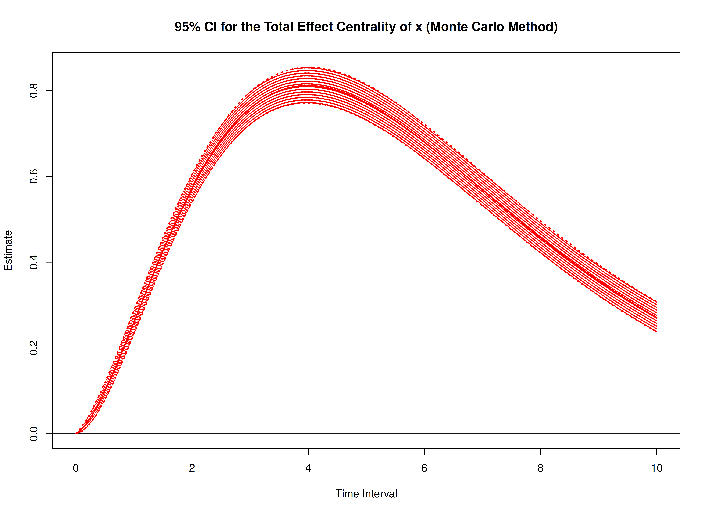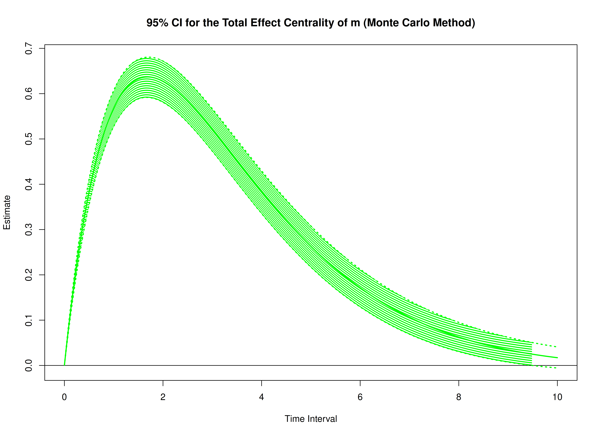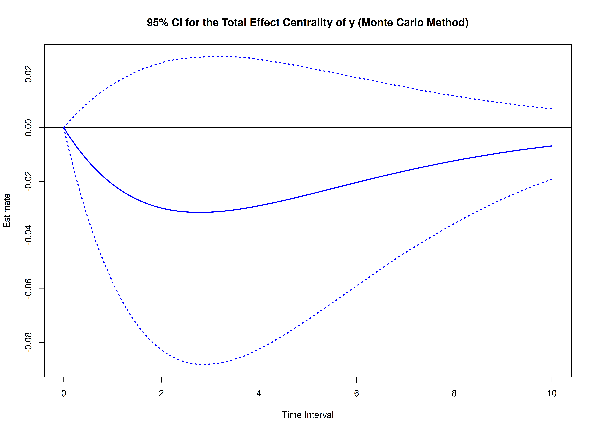


``` r
start <- Sys.time()
mc_indirect_std <- MCIndirectCentralStd(
  phi = phi,
  sigma = sigma,
  vcov_theta = vcov_theta,
  delta_t = delta_t,
  R = 20000L,
  ncores = parallel::detectCores() # use multiple cores
)
end <- Sys.time()
elapsed <- end - start
elapsed
#> Time difference of 24.59172 mins
```


``` r
summary(mc_indirect_std)
#> Call:
#> MCIndirectCentralStd(phi = phi, sigma = sigma, vcov_theta = vcov_theta, 
#>     delta_t = delta_t, R = 20000L, ncores = parallel::detectCores())
#> 
#> Indirect Effect Centrality
#>      variable interval     est     se     R    2.5%  97.5%
#> 1           x   0.0010  0.0000 0.0000 20000  0.0000 0.0000
#> 2           m   0.0010  0.0000 0.0000 20000  0.0000 0.0000
#> 3           y   0.0010  0.0000 0.0000 20000  0.0000 0.0000
#> 4           x   0.0100  0.0000 0.0000 20000  0.0000 0.0000
#> 5           m   0.0100  0.0000 0.0000 20000  0.0000 0.0000
#> 6           y   0.0100  0.0000 0.0000 20000  0.0000 0.0000
#> 7           x   0.0200  0.0000 0.0000 20000  0.0000 0.0000
#> 8           m   0.0200  0.0001 0.0000 20000  0.0001 0.0001
#> 9           y   0.0200  0.0000 0.0000 20000  0.0000 0.0000
#> 10          x   0.0300  0.0000 0.0000 20000  0.0000 0.0000
#> 11          m   0.0300  0.0003 0.0000 20000  0.0002 0.0003
#> 12          y   0.0300  0.0000 0.0000 20000  0.0000 0.0000
#> 13          x   0.0400  0.0000 0.0000 20000 -0.0001 0.0000
#> 14          m   0.0400  0.0005 0.0000 20000  0.0004 0.0005
#> 15          y   0.0400  0.0000 0.0000 20000  0.0000 0.0000
#> 16          x   0.0501  0.0000 0.0000 20000 -0.0001 0.0000
#> 17          m   0.0501  0.0007 0.0000 20000  0.0007 0.0008
#> 18          y   0.0501  0.0000 0.0000 20000 -0.0001 0.0000
#> 19          x   0.0601  0.0000 0.0001 20000 -0.0001 0.0001
#> 20          m   0.0601  0.0010 0.0000 20000  0.0009 0.0011
#> 21          y   0.0601  0.0000 0.0000 20000 -0.0001 0.0000
#> 22          x   0.0701 -0.0001 0.0001 20000 -0.0002 0.0001
#> 23          m   0.0701  0.0014 0.0001 20000  0.0013 0.0015
#> 24          y   0.0701  0.0000 0.0001 20000 -0.0001 0.0001
#> 25          x   0.0801 -0.0001 0.0001 20000 -0.0003 0.0001
#> 26          m   0.0801  0.0018 0.0001 20000  0.0016 0.0019
#> 27          y   0.0801 -0.0001 0.0001 20000 -0.0002 0.0001
#> 28          x   0.0901 -0.0001 0.0001 20000 -0.0003 0.0001
#> 29          m   0.0901  0.0023 0.0001 20000  0.0021 0.0024
#> 30          y   0.0901 -0.0001 0.0001 20000 -0.0002 0.0001
#> 31          x   0.1001 -0.0001 0.0001 20000 -0.0004 0.0002
#> 32          m   0.1001  0.0028 0.0001 20000  0.0025 0.0030
#> 33          y   0.1001 -0.0001 0.0001 20000 -0.0003 0.0001
#> 34          x   0.1101 -0.0001 0.0002 20000 -0.0005 0.0002
#> 35          m   0.1101  0.0033 0.0001 20000  0.0031 0.0036
#> 36          y   0.1101 -0.0001 0.0001 20000 -0.0004 0.0001
#> 37          x   0.1201 -0.0002 0.0002 20000 -0.0006 0.0003
#> 38          m   0.1201  0.0039 0.0002 20000  0.0036 0.0043
#> 39          y   0.1201 -0.0001 0.0001 20000 -0.0004 0.0002
#> 40          x   0.1301 -0.0002 0.0002 20000 -0.0007 0.0003
#> 41          m   0.1301  0.0046 0.0002 20000  0.0042 0.0050
#> 42          y   0.1301 -0.0001 0.0002 20000 -0.0005 0.0002
#> 43          x   0.1401 -0.0002 0.0003 20000 -0.0007 0.0003
#> 44          m   0.1401  0.0053 0.0002 20000  0.0049 0.0058
#> 45          y   0.1401 -0.0002 0.0002 20000 -0.0006 0.0002
#> 46          x   0.1502 -0.0002 0.0003 20000 -0.0009 0.0004
#> 47          m   0.1502  0.0061 0.0003 20000  0.0056 0.0066
#> 48          y   0.1502 -0.0002 0.0002 20000 -0.0006 0.0003
#> 49          x   0.1602 -0.0003 0.0004 20000 -0.0010 0.0004
#> 50          m   0.1602  0.0069 0.0003 20000  0.0063 0.0074
#> 51          y   0.1602 -0.0002 0.0003 20000 -0.0007 0.0003
#> 52          x   0.1702 -0.0003 0.0004 20000 -0.0011 0.0005
#> 53          m   0.1702  0.0077 0.0003 20000  0.0071 0.0084
#> 54          y   0.1702 -0.0002 0.0003 20000 -0.0008 0.0003
#> 55          x   0.1802 -0.0003 0.0004 20000 -0.0012 0.0006
#> 56          m   0.1802  0.0086 0.0004 20000  0.0079 0.0093
#> 57          y   0.1802 -0.0003 0.0003 20000 -0.0009 0.0004
#> 58          x   0.1902 -0.0004 0.0005 20000 -0.0013 0.0006
#> 59          m   0.1902  0.0095 0.0004 20000  0.0088 0.0103
#> 60          y   0.1902 -0.0003 0.0004 20000 -0.0010 0.0004
#> 61          x   0.2002 -0.0004 0.0005 20000 -0.0014 0.0007
#> 62          m   0.2002  0.0105 0.0004 20000  0.0097 0.0114
#> 63          y   0.2002 -0.0003 0.0004 20000 -0.0011 0.0004
#> 64          x   0.2102 -0.0004 0.0006 20000 -0.0016 0.0007
#> 65          m   0.2102  0.0115 0.0005 20000  0.0106 0.0125
#> 66          y   0.2102 -0.0004 0.0004 20000 -0.0012 0.0005
#> 67          x   0.2202 -0.0005 0.0006 20000 -0.0017 0.0008
#> 68          m   0.2202  0.0126 0.0005 20000  0.0116 0.0136
#> 69          y   0.2202 -0.0004 0.0005 20000 -0.0013 0.0005
#> 70          x   0.2302 -0.0005 0.0007 20000 -0.0019 0.0009
#> 71          m   0.2302  0.0137 0.0006 20000  0.0126 0.0148
#> 72          y   0.2302 -0.0004 0.0005 20000 -0.0014 0.0006
#> 73          x   0.2402 -0.0006 0.0008 20000 -0.0020 0.0009
#> 74          m   0.2402  0.0148 0.0006 20000  0.0137 0.0161
#> 75          y   0.2402 -0.0005 0.0006 20000 -0.0016 0.0006
#> 76          x   0.2503 -0.0006 0.0008 20000 -0.0022 0.0010
#> 77          m   0.2503  0.0160 0.0007 20000  0.0147 0.0173
#> 78          y   0.2503 -0.0005 0.0006 20000 -0.0017 0.0007
#> 79          x   0.2603 -0.0006 0.0009 20000 -0.0023 0.0011
#> 80          m   0.2603  0.0172 0.0007 20000  0.0159 0.0187
#> 81          y   0.2603 -0.0006 0.0006 20000 -0.0018 0.0007
#> 82          x   0.2703 -0.0007 0.0009 20000 -0.0025 0.0012
#> 83          m   0.2703  0.0185 0.0008 20000  0.0170 0.0200
#> 84          y   0.2703 -0.0006 0.0007 20000 -0.0019 0.0008
#> 85          x   0.2803 -0.0007 0.0010 20000 -0.0026 0.0012
#> 86          m   0.2803  0.0198 0.0008 20000  0.0182 0.0214
#> 87          y   0.2803 -0.0006 0.0007 20000 -0.0021 0.0008
#> 88          x   0.2903 -0.0008 0.0011 20000 -0.0028 0.0013
#> 89          m   0.2903  0.0211 0.0009 20000  0.0194 0.0229
#> 90          y   0.2903 -0.0007 0.0008 20000 -0.0022 0.0009
#> 91          x   0.3003 -0.0008 0.0011 20000 -0.0030 0.0014
#> 92          m   0.3003  0.0225 0.0009 20000  0.0207 0.0243
#> 93          y   0.3003 -0.0007 0.0008 20000 -0.0023 0.0009
#> 94          x   0.3103 -0.0009 0.0012 20000 -0.0032 0.0015
#> 95          m   0.3103  0.0239 0.0010 20000  0.0220 0.0259
#> 96          y   0.3103 -0.0008 0.0009 20000 -0.0025 0.0010
#> 97          x   0.3203 -0.0009 0.0013 20000 -0.0033 0.0015
#> 98          m   0.3203  0.0253 0.0010 20000  0.0233 0.0274
#> 99          y   0.3203 -0.0008 0.0009 20000 -0.0026 0.0011
#> 100         x   0.3303 -0.0010 0.0013 20000 -0.0035 0.0016
#> 101         m   0.3303  0.0268 0.0011 20000  0.0247 0.0290
#> 102         y   0.3303 -0.0009 0.0010 20000 -0.0028 0.0011
#> 103         x   0.3403 -0.0010 0.0014 20000 -0.0037 0.0017
#> 104         m   0.3403  0.0283 0.0012 20000  0.0261 0.0306
#> 105         y   0.3403 -0.0009 0.0011 20000 -0.0029 0.0012
#> 106         x   0.3504 -0.0011 0.0015 20000 -0.0039 0.0018
#> 107         m   0.3504  0.0299 0.0012 20000  0.0275 0.0323
#> 108         y   0.3504 -0.0010 0.0011 20000 -0.0031 0.0012
#> 109         x   0.3604 -0.0011 0.0015 20000 -0.0041 0.0019
#> 110         m   0.3604  0.0314 0.0013 20000  0.0289 0.0340
#> 111         y   0.3604 -0.0010 0.0012 20000 -0.0033 0.0013
#> 112         x   0.3704 -0.0012 0.0016 20000 -0.0043 0.0020
#> 113         m   0.3704  0.0330 0.0013 20000  0.0304 0.0357
#> 114         y   0.3704 -0.0011 0.0012 20000 -0.0034 0.0014
#> 115         x   0.3804 -0.0012 0.0017 20000 -0.0045 0.0021
#> 116         m   0.3804  0.0347 0.0014 20000  0.0319 0.0375
#> 117         y   0.3804 -0.0011 0.0013 20000 -0.0036 0.0014
#> 118         x   0.3904 -0.0013 0.0017 20000 -0.0047 0.0022
#> 119         m   0.3904  0.0363 0.0015 20000  0.0334 0.0393
#> 120         y   0.3904 -0.0012 0.0013 20000 -0.0037 0.0015
#> 121         x   0.4004 -0.0014 0.0018 20000 -0.0049 0.0022
#> 122         m   0.4004  0.0380 0.0016 20000  0.0350 0.0411
#> 123         y   0.4004 -0.0012 0.0014 20000 -0.0039 0.0016
#> 124         x   0.4104 -0.0014 0.0019 20000 -0.0051 0.0023
#> 125         m   0.4104  0.0397 0.0016 20000  0.0366 0.0430
#> 126         y   0.4104 -0.0013 0.0015 20000 -0.0041 0.0016
#> 127         x   0.4204 -0.0015 0.0020 20000 -0.0053 0.0024
#> 128         m   0.4204  0.0415 0.0017 20000  0.0382 0.0449
#> 129         y   0.4204 -0.0013 0.0015 20000 -0.0043 0.0017
#> 130         x   0.4304 -0.0015 0.0020 20000 -0.0055 0.0025
#> 131         m   0.4304  0.0433 0.0018 20000  0.0398 0.0468
#> 132         y   0.4304 -0.0014 0.0016 20000 -0.0045 0.0018
#> 133         x   0.4404 -0.0016 0.0021 20000 -0.0057 0.0026
#> 134         m   0.4404  0.0451 0.0018 20000  0.0415 0.0487
#> 135         y   0.4404 -0.0014 0.0017 20000 -0.0046 0.0018
#> 136         x   0.4505 -0.0016 0.0022 20000 -0.0059 0.0027
#> 137         m   0.4505  0.0469 0.0019 20000  0.0432 0.0507
#> 138         y   0.4505 -0.0015 0.0017 20000 -0.0048 0.0019
#> 139         x   0.4605 -0.0017 0.0023 20000 -0.0061 0.0028
#> 140         m   0.4605  0.0488 0.0020 20000  0.0449 0.0527
#> 141         y   0.4605 -0.0016 0.0018 20000 -0.0050 0.0020
#> 142         x   0.4705 -0.0018 0.0024 20000 -0.0063 0.0029
#> 143         m   0.4705  0.0507 0.0021 20000  0.0466 0.0548
#> 144         y   0.4705 -0.0016 0.0019 20000 -0.0052 0.0021
#> 145         x   0.4805 -0.0018 0.0024 20000 -0.0065 0.0030
#> 146         m   0.4805  0.0526 0.0021 20000  0.0484 0.0568
#> 147         y   0.4805 -0.0017 0.0019 20000 -0.0054 0.0021
#> 148         x   0.4905 -0.0019 0.0025 20000 -0.0068 0.0031
#> 149         m   0.4905  0.0545 0.0022 20000  0.0502 0.0589
#> 150         y   0.4905 -0.0017 0.0020 20000 -0.0056 0.0022
#> 151         x   0.5005 -0.0020 0.0026 20000 -0.0070 0.0032
#> 152         m   0.5005  0.0565 0.0023 20000  0.0520 0.0610
#> 153         y   0.5005 -0.0018 0.0021 20000 -0.0058 0.0023
#> 154         x   0.5105 -0.0020 0.0027 20000 -0.0072 0.0033
#> 155         m   0.5105  0.0584 0.0024 20000  0.0538 0.0632
#> 156         y   0.5105 -0.0019 0.0021 20000 -0.0060 0.0024
#> 157         x   0.5205 -0.0021 0.0028 20000 -0.0074 0.0034
#> 158         m   0.5205  0.0605 0.0025 20000  0.0557 0.0653
#> 159         y   0.5205 -0.0019 0.0022 20000 -0.0062 0.0025
#> 160         x   0.5305 -0.0021 0.0028 20000 -0.0076 0.0035
#> 161         m   0.5305  0.0625 0.0025 20000  0.0575 0.0675
#> 162         y   0.5305 -0.0020 0.0023 20000 -0.0064 0.0025
#> 163         x   0.5405 -0.0022 0.0029 20000 -0.0079 0.0036
#> 164         m   0.5405  0.0645 0.0026 20000  0.0594 0.0698
#> 165         y   0.5405 -0.0021 0.0024 20000 -0.0066 0.0026
#> 166         x   0.5506 -0.0023 0.0030 20000 -0.0081 0.0037
#> 167         m   0.5506  0.0666 0.0027 20000  0.0613 0.0720
#> 168         y   0.5506 -0.0021 0.0024 20000 -0.0068 0.0027
#> 169         x   0.5606 -0.0023 0.0031 20000 -0.0083 0.0038
#> 170         m   0.5606  0.0687 0.0028 20000  0.0633 0.0743
#> 171         y   0.5606 -0.0022 0.0025 20000 -0.0070 0.0028
#> 172         x   0.5706 -0.0024 0.0032 20000 -0.0085 0.0039
#> 173         m   0.5706  0.0708 0.0029 20000  0.0652 0.0765
#> 174         y   0.5706 -0.0023 0.0026 20000 -0.0072 0.0029
#> 175         x   0.5806 -0.0025 0.0033 20000 -0.0087 0.0040
#> 176         m   0.5806  0.0730 0.0030 20000  0.0672 0.0789
#> 177         y   0.5806 -0.0023 0.0027 20000 -0.0074 0.0029
#> 178         x   0.5906 -0.0025 0.0033 20000 -0.0090 0.0041
#> 179         m   0.5906  0.0751 0.0031 20000  0.0692 0.0812
#> 180         y   0.5906 -0.0024 0.0027 20000 -0.0076 0.0030
#> 181         x   0.6006 -0.0026 0.0034 20000 -0.0092 0.0042
#> 182         m   0.6006  0.0773 0.0031 20000  0.0712 0.0836
#> 183         y   0.6006 -0.0025 0.0028 20000 -0.0079 0.0031
#> 184         x   0.6106 -0.0026 0.0035 20000 -0.0094 0.0043
#> 185         m   0.6106  0.0795 0.0032 20000  0.0732 0.0859
#> 186         y   0.6106 -0.0025 0.0029 20000 -0.0081 0.0032
#> 187         x   0.6206 -0.0027 0.0036 20000 -0.0097 0.0044
#> 188         m   0.6206  0.0817 0.0033 20000  0.0752 0.0883
#> 189         y   0.6206 -0.0026 0.0030 20000 -0.0083 0.0033
#> 190         x   0.6306 -0.0028 0.0037 20000 -0.0099 0.0045
#> 191         m   0.6306  0.0839 0.0034 20000  0.0773 0.0907
#> 192         y   0.6306 -0.0027 0.0030 20000 -0.0085 0.0034
#> 193         x   0.6406 -0.0028 0.0038 20000 -0.0101 0.0046
#> 194         m   0.6406  0.0862 0.0035 20000  0.0794 0.0932
#> 195         y   0.6406 -0.0028 0.0031 20000 -0.0087 0.0035
#> 196         x   0.6507 -0.0029 0.0038 20000 -0.0103 0.0047
#> 197         m   0.6507  0.0884 0.0036 20000  0.0814 0.0956
#> 198         y   0.6507 -0.0028 0.0032 20000 -0.0090 0.0036
#> 199         x   0.6607 -0.0030 0.0039 20000 -0.0105 0.0048
#> 200         m   0.6607  0.0907 0.0037 20000  0.0836 0.0981
#> 201         y   0.6607 -0.0029 0.0033 20000 -0.0092 0.0036
#> 202         x   0.6707 -0.0030 0.0040 20000 -0.0108 0.0049
#> 203         m   0.6707  0.0930 0.0038 20000  0.0857 0.1006
#> 204         y   0.6707 -0.0030 0.0034 20000 -0.0094 0.0037
#> 205         x   0.6807 -0.0031 0.0041 20000 -0.0110 0.0050
#> 206         m   0.6807  0.0953 0.0039 20000  0.0878 0.1031
#> 207         y   0.6807 -0.0031 0.0034 20000 -0.0096 0.0038
#> 208         x   0.6907 -0.0032 0.0042 20000 -0.0112 0.0051
#> 209         m   0.6907  0.0977 0.0040 20000  0.0900 0.1056
#> 210         y   0.6907 -0.0031 0.0035 20000 -0.0099 0.0039
#> 211         x   0.7007 -0.0032 0.0043 20000 -0.0114 0.0052
#> 212         m   0.7007  0.1000 0.0041 20000  0.0921 0.1081
#> 213         y   0.7007 -0.0032 0.0036 20000 -0.0101 0.0040
#> 214         x   0.7107 -0.0033 0.0043 20000 -0.0117 0.0053
#> 215         m   0.7107  0.1024 0.0042 20000  0.0943 0.1107
#> 216         y   0.7107 -0.0033 0.0037 20000 -0.0103 0.0041
#> 217         x   0.7207 -0.0034 0.0044 20000 -0.0119 0.0054
#> 218         m   0.7207  0.1047 0.0043 20000  0.0965 0.1132
#> 219         y   0.7207 -0.0034 0.0038 20000 -0.0105 0.0042
#> 220         x   0.7307 -0.0034 0.0045 20000 -0.0121 0.0055
#> 221         m   0.7307  0.1071 0.0043 20000  0.0987 0.1158
#> 222         y   0.7307 -0.0034 0.0039 20000 -0.0108 0.0043
#> 223         x   0.7407 -0.0035 0.0046 20000 -0.0123 0.0056
#> 224         m   0.7407  0.1095 0.0044 20000  0.1009 0.1184
#> 225         y   0.7407 -0.0035 0.0039 20000 -0.0110 0.0044
#> 226         x   0.7508 -0.0036 0.0047 20000 -0.0126 0.0058
#> 227         m   0.7508  0.1119 0.0045 20000  0.1031 0.1210
#> 228         y   0.7508 -0.0036 0.0040 20000 -0.0112 0.0044
#> 229         x   0.7608 -0.0036 0.0048 20000 -0.0128 0.0059
#> 230         m   0.7608  0.1144 0.0046 20000  0.1054 0.1236
#> 231         y   0.7608 -0.0037 0.0041 20000 -0.0115 0.0045
#> 232         x   0.7708 -0.0037 0.0048 20000 -0.0130 0.0060
#> 233         m   0.7708  0.1168 0.0047 20000  0.1076 0.1262
#> 234         y   0.7708 -0.0037 0.0042 20000 -0.0117 0.0046
#> 235         x   0.7808 -0.0038 0.0049 20000 -0.0132 0.0060
#> 236         m   0.7808  0.1192 0.0048 20000  0.1099 0.1288
#> 237         y   0.7808 -0.0038 0.0043 20000 -0.0120 0.0047
#> 238         x   0.7908 -0.0038 0.0050 20000 -0.0134 0.0061
#> 239         m   0.7908  0.1217 0.0049 20000  0.1121 0.1315
#> 240         y   0.7908 -0.0039 0.0044 20000 -0.0122 0.0048
#> 241         x   0.8008 -0.0039 0.0051 20000 -0.0137 0.0062
#> 242         m   0.8008  0.1242 0.0050 20000  0.1144 0.1342
#> 243         y   0.8008 -0.0040 0.0044 20000 -0.0125 0.0049
#> 244         x   0.8108 -0.0039 0.0052 20000 -0.0139 0.0063
#> 245         m   0.8108  0.1267 0.0051 20000  0.1167 0.1368
#> 246         y   0.8108 -0.0041 0.0045 20000 -0.0127 0.0050
#> 247         x   0.8208 -0.0040 0.0053 20000 -0.0141 0.0064
#> 248         m   0.8208  0.1291 0.0053 20000  0.1190 0.1395
#> 249         y   0.8208 -0.0041 0.0046 20000 -0.0129 0.0051
#> 250         x   0.8308 -0.0041 0.0053 20000 -0.0143 0.0065
#> 251         m   0.8308  0.1316 0.0054 20000  0.1213 0.1422
#> 252         y   0.8308 -0.0042 0.0047 20000 -0.0132 0.0052
#> 253         x   0.8408 -0.0041 0.0054 20000 -0.0145 0.0066
#> 254         m   0.8408  0.1342 0.0055 20000  0.1236 0.1449
#> 255         y   0.8408 -0.0043 0.0048 20000 -0.0134 0.0053
#> 256         x   0.8509 -0.0042 0.0055 20000 -0.0147 0.0067
#> 257         m   0.8509  0.1367 0.0056 20000  0.1260 0.1477
#> 258         y   0.8509 -0.0044 0.0049 20000 -0.0137 0.0054
#> 259         x   0.8609 -0.0043 0.0056 20000 -0.0150 0.0068
#> 260         m   0.8609  0.1392 0.0057 20000  0.1283 0.1504
#> 261         y   0.8609 -0.0045 0.0050 20000 -0.0139 0.0055
#> 262         x   0.8709 -0.0043 0.0057 20000 -0.0152 0.0069
#> 263         m   0.8709  0.1418 0.0058 20000  0.1306 0.1531
#> 264         y   0.8709 -0.0046 0.0051 20000 -0.0142 0.0056
#> 265         x   0.8809 -0.0044 0.0057 20000 -0.0154 0.0070
#> 266         m   0.8809  0.1443 0.0059 20000  0.1330 0.1559
#> 267         y   0.8809 -0.0046 0.0051 20000 -0.0144 0.0057
#> 268         x   0.8909 -0.0045 0.0058 20000 -0.0156 0.0071
#> 269         m   0.8909  0.1469 0.0060 20000  0.1353 0.1587
#> 270         y   0.8909 -0.0047 0.0052 20000 -0.0147 0.0058
#> 271         x   0.9009 -0.0045 0.0059 20000 -0.0158 0.0072
#> 272         m   0.9009  0.1494 0.0061 20000  0.1377 0.1614
#> 273         y   0.9009 -0.0048 0.0053 20000 -0.0149 0.0059
#> 274         x   0.9109 -0.0046 0.0060 20000 -0.0160 0.0073
#> 275         m   0.9109  0.1520 0.0062 20000  0.1401 0.1642
#> 276         y   0.9109 -0.0049 0.0054 20000 -0.0152 0.0060
#> 277         x   0.9209 -0.0046 0.0060 20000 -0.0162 0.0074
#> 278         m   0.9209  0.1546 0.0063 20000  0.1424 0.1670
#> 279         y   0.9209 -0.0050 0.0055 20000 -0.0154 0.0061
#> 280         x   0.9309 -0.0047 0.0061 20000 -0.0165 0.0075
#> 281         m   0.9309  0.1572 0.0064 20000  0.1448 0.1698
#> 282         y   0.9309 -0.0051 0.0056 20000 -0.0157 0.0062
#> 283         x   0.9409 -0.0048 0.0062 20000 -0.0167 0.0076
#> 284         m   0.9409  0.1597 0.0065 20000  0.1472 0.1726
#> 285         y   0.9409 -0.0051 0.0057 20000 -0.0159 0.0062
#> 286         x   0.9510 -0.0048 0.0063 20000 -0.0169 0.0077
#> 287         m   0.9510  0.1623 0.0066 20000  0.1496 0.1754
#> 288         y   0.9510 -0.0052 0.0058 20000 -0.0162 0.0063
#> 289         x   0.9610 -0.0049 0.0063 20000 -0.0171 0.0077
#> 290         m   0.9610  0.1649 0.0067 20000  0.1520 0.1782
#> 291         y   0.9610 -0.0053 0.0058 20000 -0.0164 0.0064
#> 292         x   0.9710 -0.0050 0.0064 20000 -0.0173 0.0078
#> 293         m   0.9710  0.1676 0.0068 20000  0.1544 0.1810
#> 294         y   0.9710 -0.0054 0.0059 20000 -0.0167 0.0065
#> 295         x   0.9810 -0.0050 0.0065 20000 -0.0175 0.0079
#> 296         m   0.9810  0.1702 0.0069 20000  0.1568 0.1839
#> 297         y   0.9810 -0.0055 0.0060 20000 -0.0169 0.0066
#> 298         x   0.9910 -0.0051 0.0066 20000 -0.0177 0.0080
#> 299         m   0.9910  0.1728 0.0071 20000  0.1592 0.1867
#> 300         y   0.9910 -0.0056 0.0061 20000 -0.0172 0.0067
#> 301         x   1.0010 -0.0051 0.0066 20000 -0.0179 0.0081
#> 302         m   1.0010  0.1754 0.0072 20000  0.1616 0.1896
#> 303         y   1.0010 -0.0056 0.0062 20000 -0.0174 0.0068
#> 304         x   1.0110 -0.0052 0.0067 20000 -0.0181 0.0082
#> 305         m   1.0110  0.1780 0.0073 20000  0.1641 0.1924
#> 306         y   1.0110 -0.0057 0.0063 20000 -0.0177 0.0069
#> 307         x   1.0210 -0.0053 0.0068 20000 -0.0183 0.0083
#> 308         m   1.0210  0.1807 0.0074 20000  0.1665 0.1953
#> 309         y   1.0210 -0.0058 0.0064 20000 -0.0180 0.0070
#> 310         x   1.0310 -0.0053 0.0068 20000 -0.0185 0.0083
#> 311         m   1.0310  0.1833 0.0075 20000  0.1689 0.1981
#> 312         y   1.0310 -0.0059 0.0065 20000 -0.0182 0.0071
#> 313         x   1.0410 -0.0054 0.0069 20000 -0.0186 0.0084
#> 314         m   1.0410  0.1859 0.0076 20000  0.1713 0.2010
#> 315         y   1.0410 -0.0060 0.0066 20000 -0.0185 0.0072
#> 316         x   1.0511 -0.0054 0.0070 20000 -0.0188 0.0085
#> 317         m   1.0511  0.1886 0.0077 20000  0.1738 0.2038
#> 318         y   1.0511 -0.0061 0.0067 20000 -0.0187 0.0073
#> 319         x   1.0611 -0.0055 0.0071 20000 -0.0190 0.0086
#> 320         m   1.0611  0.1912 0.0078 20000  0.1762 0.2067
#> 321         y   1.0611 -0.0062 0.0067 20000 -0.0190 0.0074
#> 322         x   1.0711 -0.0055 0.0071 20000 -0.0192 0.0087
#> 323         m   1.0711  0.1939 0.0079 20000  0.1786 0.2096
#> 324         y   1.0711 -0.0063 0.0068 20000 -0.0193 0.0075
#> 325         x   1.0811 -0.0056 0.0072 20000 -0.0194 0.0087
#> 326         m   1.0811  0.1965 0.0081 20000  0.1811 0.2124
#> 327         y   1.0811 -0.0063 0.0069 20000 -0.0195 0.0076
#> 328         x   1.0911 -0.0057 0.0073 20000 -0.0196 0.0088
#> 329         m   1.0911  0.1992 0.0082 20000  0.1835 0.2153
#> 330         y   1.0911 -0.0064 0.0070 20000 -0.0198 0.0077
#> 331         x   1.1011 -0.0057 0.0073 20000 -0.0198 0.0089
#> 332         m   1.1011  0.2018 0.0083 20000  0.1860 0.2182
#> 333         y   1.1011 -0.0065 0.0071 20000 -0.0200 0.0078
#> 334         x   1.1111 -0.0058 0.0074 20000 -0.0200 0.0090
#> 335         m   1.1111  0.2045 0.0084 20000  0.1884 0.2210
#> 336         y   1.1111 -0.0066 0.0072 20000 -0.0203 0.0079
#> 337         x   1.1211 -0.0058 0.0075 20000 -0.0201 0.0090
#> 338         m   1.1211  0.2071 0.0085 20000  0.1909 0.2239
#> 339         y   1.1211 -0.0067 0.0073 20000 -0.0205 0.0080
#> 340         x   1.1311 -0.0059 0.0075 20000 -0.0203 0.0091
#> 341         m   1.1311  0.2098 0.0086 20000  0.1933 0.2268
#> 342         y   1.1311 -0.0068 0.0074 20000 -0.0208 0.0081
#> 343         x   1.1411 -0.0059 0.0076 20000 -0.0205 0.0092
#> 344         m   1.1411  0.2125 0.0087 20000  0.1958 0.2297
#> 345         y   1.1411 -0.0069 0.0075 20000 -0.0211 0.0082
#> 346         x   1.1512 -0.0060 0.0076 20000 -0.0207 0.0093
#> 347         m   1.1512  0.2151 0.0088 20000  0.1982 0.2326
#> 348         y   1.1512 -0.0070 0.0076 20000 -0.0213 0.0083
#> 349         x   1.1612 -0.0060 0.0077 20000 -0.0208 0.0093
#> 350         m   1.1612  0.2178 0.0090 20000  0.2007 0.2355
#> 351         y   1.1612 -0.0070 0.0076 20000 -0.0216 0.0083
#> 352         x   1.1712 -0.0061 0.0078 20000 -0.0210 0.0094
#> 353         m   1.1712  0.2204 0.0091 20000  0.2031 0.2384
#> 354         y   1.1712 -0.0071 0.0077 20000 -0.0218 0.0084
#> 355         x   1.1812 -0.0062 0.0078 20000 -0.0212 0.0095
#> 356         m   1.1812  0.2231 0.0092 20000  0.2056 0.2413
#> 357         y   1.1812 -0.0072 0.0078 20000 -0.0221 0.0085
#> 358         x   1.1912 -0.0062 0.0079 20000 -0.0213 0.0095
#> 359         m   1.1912  0.2258 0.0093 20000  0.2080 0.2442
#> 360         y   1.1912 -0.0073 0.0079 20000 -0.0224 0.0086
#> 361         x   1.2012 -0.0063 0.0079 20000 -0.0215 0.0096
#> 362         m   1.2012  0.2284 0.0094 20000  0.2104 0.2470
#> 363         y   1.2012 -0.0074 0.0080 20000 -0.0226 0.0087
#> 364         x   1.2112 -0.0063 0.0080 20000 -0.0217 0.0097
#> 365         m   1.2112  0.2311 0.0095 20000  0.2129 0.2499
#> 366         y   1.2112 -0.0075 0.0081 20000 -0.0229 0.0088
#> 367         x   1.2212 -0.0064 0.0081 20000 -0.0218 0.0097
#> 368         m   1.2212  0.2337 0.0096 20000  0.2153 0.2528
#> 369         y   1.2212 -0.0076 0.0082 20000 -0.0231 0.0089
#> 370         x   1.2312 -0.0064 0.0081 20000 -0.0220 0.0098
#> 371         m   1.2312  0.2364 0.0098 20000  0.2178 0.2557
#> 372         y   1.2312 -0.0077 0.0083 20000 -0.0234 0.0090
#> 373         x   1.2412 -0.0065 0.0082 20000 -0.0222 0.0099
#> 374         m   1.2412  0.2391 0.0099 20000  0.2202 0.2586
#> 375         y   1.2412 -0.0078 0.0084 20000 -0.0237 0.0091
#> 376         x   1.2513 -0.0065 0.0082 20000 -0.0223 0.0099
#> 377         m   1.2513  0.2417 0.0100 20000  0.2226 0.2615
#> 378         y   1.2513 -0.0078 0.0085 20000 -0.0239 0.0092
#> 379         x   1.2613 -0.0066 0.0083 20000 -0.0225 0.0100
#> 380         m   1.2613  0.2444 0.0101 20000  0.2251 0.2644
#> 381         y   1.2613 -0.0079 0.0085 20000 -0.0242 0.0093
#> 382         x   1.2713 -0.0066 0.0083 20000 -0.0226 0.0101
#> 383         m   1.2713  0.2470 0.0102 20000  0.2275 0.2673
#> 384         y   1.2713 -0.0080 0.0086 20000 -0.0245 0.0094
#> 385         x   1.2813 -0.0067 0.0084 20000 -0.0228 0.0101
#> 386         m   1.2813  0.2497 0.0103 20000  0.2299 0.2701
#> 387         y   1.2813 -0.0081 0.0087 20000 -0.0247 0.0095
#> 388         x   1.2913 -0.0067 0.0084 20000 -0.0229 0.0102
#> 389         m   1.2913  0.2523 0.0104 20000  0.2324 0.2730
#> 390         y   1.2913 -0.0082 0.0088 20000 -0.0250 0.0096
#> 391         x   1.3013 -0.0068 0.0085 20000 -0.0231 0.0102
#> 392         m   1.3013  0.2550 0.0106 20000  0.2348 0.2759
#> 393         y   1.3013 -0.0083 0.0089 20000 -0.0253 0.0097
#> 394         x   1.3113 -0.0068 0.0085 20000 -0.0232 0.0103
#> 395         m   1.3113  0.2576 0.0107 20000  0.2372 0.2787
#> 396         y   1.3113 -0.0084 0.0090 20000 -0.0255 0.0098
#> 397         x   1.3213 -0.0069 0.0086 20000 -0.0233 0.0103
#> 398         m   1.3213  0.2603 0.0108 20000  0.2396 0.2816
#> 399         y   1.3213 -0.0085 0.0091 20000 -0.0258 0.0099
#> 400         x   1.3313 -0.0069 0.0086 20000 -0.0235 0.0104
#> 401         m   1.3313  0.2629 0.0109 20000  0.2421 0.2845
#> 402         y   1.3313 -0.0086 0.0092 20000 -0.0260 0.0099
#> 403         x   1.3413 -0.0070 0.0087 20000 -0.0236 0.0104
#> 404         m   1.3413  0.2655 0.0110 20000  0.2445 0.2873
#> 405         y   1.3413 -0.0087 0.0093 20000 -0.0263 0.0100
#> 406         x   1.3514 -0.0070 0.0087 20000 -0.0237 0.0105
#> 407         m   1.3514  0.2682 0.0111 20000  0.2469 0.2902
#> 408         y   1.3514 -0.0087 0.0094 20000 -0.0265 0.0101
#> 409         x   1.3614 -0.0070 0.0088 20000 -0.0239 0.0105
#> 410         m   1.3614  0.2708 0.0113 20000  0.2493 0.2930
#> 411         y   1.3614 -0.0088 0.0094 20000 -0.0268 0.0102
#> 412         x   1.3714 -0.0071 0.0088 20000 -0.0240 0.0106
#> 413         m   1.3714  0.2734 0.0114 20000  0.2517 0.2959
#> 414         y   1.3714 -0.0089 0.0095 20000 -0.0270 0.0103
#> 415         x   1.3814 -0.0071 0.0089 20000 -0.0242 0.0106
#> 416         m   1.3814  0.2760 0.0115 20000  0.2541 0.2987
#> 417         y   1.3814 -0.0090 0.0096 20000 -0.0273 0.0104
#> 418         x   1.3914 -0.0072 0.0089 20000 -0.0243 0.0107
#> 419         m   1.3914  0.2787 0.0116 20000  0.2565 0.3015
#> 420         y   1.3914 -0.0091 0.0097 20000 -0.0276 0.0105
#> 421         x   1.4014 -0.0072 0.0090 20000 -0.0244 0.0107
#> 422         m   1.4014  0.2813 0.0117 20000  0.2589 0.3044
#> 423         y   1.4014 -0.0092 0.0098 20000 -0.0278 0.0106
#> 424         x   1.4114 -0.0073 0.0090 20000 -0.0245 0.0107
#> 425         m   1.4114  0.2839 0.0118 20000  0.2613 0.3072
#> 426         y   1.4114 -0.0093 0.0099 20000 -0.0281 0.0107
#> 427         x   1.4214 -0.0073 0.0091 20000 -0.0247 0.0108
#> 428         m   1.4214  0.2865 0.0119 20000  0.2637 0.3101
#> 429         y   1.4214 -0.0094 0.0100 20000 -0.0283 0.0108
#> 430         x   1.4314 -0.0074 0.0091 20000 -0.0248 0.0108
#> 431         m   1.4314  0.2891 0.0121 20000  0.2660 0.3129
#> 432         y   1.4314 -0.0095 0.0101 20000 -0.0286 0.0108
#> 433         x   1.4414 -0.0074 0.0091 20000 -0.0249 0.0109
#> 434         m   1.4414  0.2917 0.0122 20000  0.2684 0.3157
#> 435         y   1.4414 -0.0095 0.0102 20000 -0.0288 0.0109
#> 436         x   1.4515 -0.0074 0.0092 20000 -0.0251 0.0109
#> 437         m   1.4515  0.2943 0.0123 20000  0.2708 0.3185
#> 438         y   1.4515 -0.0096 0.0102 20000 -0.0291 0.0110
#> 439         x   1.4615 -0.0075 0.0092 20000 -0.0252 0.0109
#> 440         m   1.4615  0.2968 0.0124 20000  0.2731 0.3214
#> 441         y   1.4615 -0.0097 0.0103 20000 -0.0293 0.0111
#> 442         x   1.4715 -0.0075 0.0093 20000 -0.0253 0.0110
#> 443         m   1.4715  0.2994 0.0125 20000  0.2755 0.3242
#> 444         y   1.4715 -0.0098 0.0104 20000 -0.0296 0.0112
#> 445         x   1.4815 -0.0076 0.0093 20000 -0.0254 0.0110
#> 446         m   1.4815  0.3020 0.0126 20000  0.2779 0.3269
#> 447         y   1.4815 -0.0099 0.0105 20000 -0.0298 0.0113
#> 448         x   1.4915 -0.0076 0.0093 20000 -0.0255 0.0111
#> 449         m   1.4915  0.3046 0.0128 20000  0.2802 0.3297
#> 450         y   1.4915 -0.0100 0.0106 20000 -0.0301 0.0114
#> 451         x   1.5015 -0.0076 0.0094 20000 -0.0256 0.0111
#> 452         m   1.5015  0.3071 0.0129 20000  0.2825 0.3325
#> 453         y   1.5015 -0.0101 0.0107 20000 -0.0303 0.0114
#> 454         x   1.5115 -0.0077 0.0094 20000 -0.0257 0.0111
#> 455         m   1.5115  0.3097 0.0130 20000  0.2848 0.3353
#> 456         y   1.5115 -0.0102 0.0108 20000 -0.0306 0.0115
#> 457         x   1.5215 -0.0077 0.0094 20000 -0.0259 0.0111
#> 458         m   1.5215  0.3122 0.0131 20000  0.2872 0.3381
#> 459         y   1.5215 -0.0103 0.0109 20000 -0.0309 0.0116
#> 460         x   1.5315 -0.0078 0.0095 20000 -0.0260 0.0112
#> 461         m   1.5315  0.3148 0.0132 20000  0.2895 0.3409
#> 462         y   1.5315 -0.0104 0.0109 20000 -0.0311 0.0117
#> 463         x   1.5415 -0.0078 0.0095 20000 -0.0261 0.0112
#> 464         m   1.5415  0.3173 0.0133 20000  0.2918 0.3437
#> 465         y   1.5415 -0.0104 0.0110 20000 -0.0314 0.0118
#> 466         x   1.5516 -0.0078 0.0095 20000 -0.0262 0.0112
#> 467         m   1.5516  0.3199 0.0134 20000  0.2941 0.3465
#> 468         y   1.5516 -0.0105 0.0111 20000 -0.0316 0.0119
#> 469         x   1.5616 -0.0079 0.0096 20000 -0.0263 0.0113
#> 470         m   1.5616  0.3224 0.0136 20000  0.2964 0.3492
#> 471         y   1.5616 -0.0106 0.0112 20000 -0.0319 0.0119
#> 472         x   1.5716 -0.0079 0.0096 20000 -0.0264 0.0113
#> 473         m   1.5716  0.3249 0.0137 20000  0.2987 0.3519
#> 474         y   1.5716 -0.0107 0.0113 20000 -0.0321 0.0120
#> 475         x   1.5816 -0.0080 0.0096 20000 -0.0264 0.0113
#> 476         m   1.5816  0.3274 0.0138 20000  0.3010 0.3547
#> 477         y   1.5816 -0.0108 0.0114 20000 -0.0324 0.0121
#> 478         x   1.5916 -0.0080 0.0097 20000 -0.0265 0.0114
#> 479         m   1.5916  0.3299 0.0139 20000  0.3033 0.3574
#> 480         y   1.5916 -0.0109 0.0115 20000 -0.0326 0.0122
#> 481         x   1.6016 -0.0080 0.0097 20000 -0.0266 0.0114
#> 482         m   1.6016  0.3324 0.0140 20000  0.3056 0.3601
#> 483         y   1.6016 -0.0110 0.0115 20000 -0.0329 0.0123
#> 484         x   1.6116 -0.0081 0.0097 20000 -0.0267 0.0114
#> 485         m   1.6116  0.3349 0.0141 20000  0.3080 0.3628
#> 486         y   1.6116 -0.0111 0.0116 20000 -0.0331 0.0124
#> 487         x   1.6216 -0.0081 0.0098 20000 -0.0268 0.0114
#> 488         m   1.6216  0.3374 0.0143 20000  0.3102 0.3656
#> 489         y   1.6216 -0.0112 0.0117 20000 -0.0334 0.0125
#> 490         x   1.6316 -0.0081 0.0098 20000 -0.0269 0.0114
#> 491         m   1.6316  0.3399 0.0144 20000  0.3125 0.3683
#> 492         y   1.6316 -0.0113 0.0118 20000 -0.0336 0.0125
#> 493         x   1.6416 -0.0082 0.0098 20000 -0.0270 0.0114
#> 494         m   1.6416  0.3424 0.0145 20000  0.3148 0.3710
#> 495         y   1.6416 -0.0113 0.0119 20000 -0.0339 0.0126
#> 496         x   1.6517 -0.0082 0.0098 20000 -0.0271 0.0115
#> 497         m   1.6517  0.3448 0.0146 20000  0.3171 0.3736
#> 498         y   1.6517 -0.0114 0.0120 20000 -0.0341 0.0127
#> 499         x   1.6617 -0.0082 0.0099 20000 -0.0271 0.0115
#> 500         m   1.6617  0.3473 0.0147 20000  0.3193 0.3763
#> 501         y   1.6617 -0.0115 0.0121 20000 -0.0344 0.0128
#> 502         x   1.6717 -0.0083 0.0099 20000 -0.0272 0.0115
#> 503         m   1.6717  0.3497 0.0148 20000  0.3215 0.3790
#> 504         y   1.6717 -0.0116 0.0121 20000 -0.0346 0.0129
#> 505         x   1.6817 -0.0083 0.0099 20000 -0.0273 0.0115
#> 506         m   1.6817  0.3522 0.0149 20000  0.3237 0.3817
#> 507         y   1.6817 -0.0117 0.0122 20000 -0.0349 0.0129
#> 508         x   1.6917 -0.0083 0.0099 20000 -0.0274 0.0115
#> 509         m   1.6917  0.3546 0.0150 20000  0.3260 0.3844
#> 510         y   1.6917 -0.0118 0.0123 20000 -0.0351 0.0130
#> 511         x   1.7017 -0.0084 0.0100 20000 -0.0274 0.0115
#> 512         m   1.7017  0.3570 0.0152 20000  0.3282 0.3870
#> 513         y   1.7017 -0.0119 0.0124 20000 -0.0353 0.0131
#> 514         x   1.7117 -0.0084 0.0100 20000 -0.0275 0.0115
#> 515         m   1.7117  0.3595 0.0153 20000  0.3304 0.3897
#> 516         y   1.7117 -0.0120 0.0125 20000 -0.0356 0.0132
#> 517         x   1.7217 -0.0084 0.0100 20000 -0.0275 0.0116
#> 518         m   1.7217  0.3619 0.0154 20000  0.3326 0.3923
#> 519         y   1.7217 -0.0120 0.0126 20000 -0.0358 0.0133
#> 520         x   1.7317 -0.0085 0.0100 20000 -0.0276 0.0116
#> 521         m   1.7317  0.3643 0.0155 20000  0.3348 0.3950
#> 522         y   1.7317 -0.0121 0.0127 20000 -0.0361 0.0134
#> 523         x   1.7417 -0.0085 0.0100 20000 -0.0277 0.0116
#> 524         m   1.7417  0.3667 0.0156 20000  0.3370 0.3976
#> 525         y   1.7417 -0.0122 0.0127 20000 -0.0364 0.0134
#> 526         x   1.7518 -0.0085 0.0101 20000 -0.0277 0.0116
#> 527         m   1.7518  0.3690 0.0157 20000  0.3391 0.4001
#> 528         y   1.7518 -0.0123 0.0128 20000 -0.0366 0.0135
#> 529         x   1.7618 -0.0085 0.0101 20000 -0.0278 0.0116
#> 530         m   1.7618  0.3714 0.0158 20000  0.3413 0.4028
#> 531         y   1.7618 -0.0124 0.0129 20000 -0.0369 0.0136
#> 532         x   1.7718 -0.0086 0.0101 20000 -0.0279 0.0116
#> 533         m   1.7718  0.3738 0.0160 20000  0.3434 0.4053
#> 534         y   1.7718 -0.0125 0.0130 20000 -0.0371 0.0136
#> 535         x   1.7818 -0.0086 0.0101 20000 -0.0279 0.0116
#> 536         m   1.7818  0.3761 0.0161 20000  0.3456 0.4079
#> 537         y   1.7818 -0.0126 0.0131 20000 -0.0374 0.0137
#> 538         x   1.7918 -0.0086 0.0101 20000 -0.0280 0.0116
#> 539         m   1.7918  0.3785 0.0162 20000  0.3477 0.4104
#> 540         y   1.7918 -0.0127 0.0131 20000 -0.0376 0.0138
#> 541         x   1.8018 -0.0087 0.0101 20000 -0.0280 0.0116
#> 542         m   1.8018  0.3808 0.0163 20000  0.3498 0.4130
#> 543         y   1.8018 -0.0128 0.0132 20000 -0.0379 0.0139
#> 544         x   1.8118 -0.0087 0.0102 20000 -0.0281 0.0116
#> 545         m   1.8118  0.3832 0.0164 20000  0.3520 0.4156
#> 546         y   1.8118 -0.0128 0.0133 20000 -0.0381 0.0140
#> 547         x   1.8218 -0.0087 0.0102 20000 -0.0281 0.0116
#> 548         m   1.8218  0.3855 0.0165 20000  0.3541 0.4181
#> 549         y   1.8218 -0.0129 0.0134 20000 -0.0383 0.0140
#> 550         x   1.8318 -0.0087 0.0102 20000 -0.0282 0.0117
#> 551         m   1.8318  0.3878 0.0166 20000  0.3562 0.4207
#> 552         y   1.8318 -0.0130 0.0135 20000 -0.0386 0.0141
#> 553         x   1.8418 -0.0088 0.0102 20000 -0.0282 0.0116
#> 554         m   1.8418  0.3901 0.0167 20000  0.3583 0.4232
#> 555         y   1.8418 -0.0131 0.0136 20000 -0.0388 0.0142
#> 556         x   1.8519 -0.0088 0.0102 20000 -0.0283 0.0116
#> 557         m   1.8519  0.3924 0.0168 20000  0.3604 0.4257
#> 558         y   1.8519 -0.0132 0.0136 20000 -0.0391 0.0143
#> 559         x   1.8619 -0.0088 0.0102 20000 -0.0283 0.0116
#> 560         m   1.8619  0.3947 0.0170 20000  0.3625 0.4282
#> 561         y   1.8619 -0.0133 0.0137 20000 -0.0393 0.0143
#> 562         x   1.8719 -0.0088 0.0102 20000 -0.0283 0.0116
#> 563         m   1.8719  0.3970 0.0171 20000  0.3645 0.4307
#> 564         y   1.8719 -0.0134 0.0138 20000 -0.0395 0.0144
#> 565         x   1.8819 -0.0089 0.0102 20000 -0.0284 0.0116
#> 566         m   1.8819  0.3992 0.0172 20000  0.3666 0.4332
#> 567         y   1.8819 -0.0135 0.0139 20000 -0.0398 0.0145
#> 568         x   1.8919 -0.0089 0.0102 20000 -0.0284 0.0116
#> 569         m   1.8919  0.4015 0.0173 20000  0.3687 0.4357
#> 570         y   1.8919 -0.0135 0.0140 20000 -0.0400 0.0146
#> 571         x   1.9019 -0.0089 0.0103 20000 -0.0285 0.0116
#> 572         m   1.9019  0.4037 0.0174 20000  0.3707 0.4382
#> 573         y   1.9019 -0.0136 0.0140 20000 -0.0403 0.0147
#> 574         x   1.9119 -0.0089 0.0103 20000 -0.0285 0.0116
#> 575         m   1.9119  0.4060 0.0175 20000  0.3728 0.4406
#> 576         y   1.9119 -0.0137 0.0141 20000 -0.0405 0.0147
#> 577         x   1.9219 -0.0090 0.0103 20000 -0.0286 0.0116
#> 578         m   1.9219  0.4082 0.0176 20000  0.3748 0.4431
#> 579         y   1.9219 -0.0138 0.0142 20000 -0.0408 0.0148
#> 580         x   1.9319 -0.0090 0.0103 20000 -0.0286 0.0116
#> 581         m   1.9319  0.4104 0.0177 20000  0.3768 0.4455
#> 582         y   1.9319 -0.0139 0.0143 20000 -0.0410 0.0149
#> 583         x   1.9419 -0.0090 0.0103 20000 -0.0286 0.0116
#> 584         m   1.9419  0.4126 0.0178 20000  0.3788 0.4480
#> 585         y   1.9419 -0.0140 0.0144 20000 -0.0413 0.0150
#> 586         x   1.9520 -0.0090 0.0103 20000 -0.0287 0.0116
#> 587         m   1.9520  0.4148 0.0179 20000  0.3808 0.4504
#> 588         y   1.9520 -0.0141 0.0144 20000 -0.0415 0.0150
#> 589         x   1.9620 -0.0090 0.0103 20000 -0.0287 0.0116
#> 590         m   1.9620  0.4170 0.0180 20000  0.3828 0.4529
#> 591         y   1.9620 -0.0141 0.0145 20000 -0.0417 0.0151
#> 592         x   1.9720 -0.0091 0.0103 20000 -0.0287 0.0116
#> 593         m   1.9720  0.4192 0.0181 20000  0.3848 0.4553
#> 594         y   1.9720 -0.0142 0.0146 20000 -0.0420 0.0152
#> 595         x   1.9820 -0.0091 0.0103 20000 -0.0288 0.0116
#> 596         m   1.9820  0.4214 0.0183 20000  0.3867 0.4577
#> 597         y   1.9820 -0.0143 0.0147 20000 -0.0422 0.0152
#> 598         x   1.9920 -0.0091 0.0103 20000 -0.0288 0.0116
#> 599         m   1.9920  0.4235 0.0184 20000  0.3887 0.4600
#> 600         y   1.9920 -0.0144 0.0148 20000 -0.0424 0.0153
#> 601         x   2.0020 -0.0091 0.0103 20000 -0.0288 0.0115
#> 602         m   2.0020  0.4257 0.0185 20000  0.3906 0.4624
#> 603         y   2.0020 -0.0145 0.0148 20000 -0.0427 0.0154
#> 604         x   2.0120 -0.0092 0.0103 20000 -0.0288 0.0115
#> 605         m   2.0120  0.4278 0.0186 20000  0.3925 0.4648
#> 606         y   2.0120 -0.0146 0.0149 20000 -0.0430 0.0154
#> 607         x   2.0220 -0.0092 0.0103 20000 -0.0289 0.0115
#> 608         m   2.0220  0.4300 0.0187 20000  0.3945 0.4671
#> 609         y   2.0220 -0.0147 0.0150 20000 -0.0432 0.0155
#> 610         x   2.0320 -0.0092 0.0103 20000 -0.0289 0.0115
#> 611         m   2.0320  0.4321 0.0188 20000  0.3964 0.4694
#> 612         y   2.0320 -0.0147 0.0151 20000 -0.0434 0.0156
#> 613         x   2.0420 -0.0092 0.0103 20000 -0.0289 0.0115
#> 614         m   2.0420  0.4342 0.0189 20000  0.3983 0.4718
#> 615         y   2.0420 -0.0148 0.0152 20000 -0.0437 0.0156
#> 616         x   2.0521 -0.0092 0.0103 20000 -0.0289 0.0115
#> 617         m   2.0521  0.4363 0.0190 20000  0.4002 0.4741
#> 618         y   2.0521 -0.0149 0.0152 20000 -0.0439 0.0157
#> 619         x   2.0621 -0.0092 0.0103 20000 -0.0289 0.0114
#> 620         m   2.0621  0.4384 0.0191 20000  0.4021 0.4764
#> 621         y   2.0621 -0.0150 0.0153 20000 -0.0442 0.0158
#> 622         x   2.0721 -0.0093 0.0103 20000 -0.0289 0.0114
#> 623         m   2.0721  0.4405 0.0192 20000  0.4040 0.4787
#> 624         y   2.0721 -0.0151 0.0154 20000 -0.0444 0.0159
#> 625         x   2.0821 -0.0093 0.0103 20000 -0.0290 0.0114
#> 626         m   2.0821  0.4425 0.0193 20000  0.4059 0.4810
#> 627         y   2.0821 -0.0152 0.0155 20000 -0.0446 0.0159
#> 628         x   2.0921 -0.0093 0.0103 20000 -0.0290 0.0114
#> 629         m   2.0921  0.4446 0.0194 20000  0.4077 0.4833
#> 630         y   2.0921 -0.0153 0.0155 20000 -0.0449 0.0160
#> 631         x   2.1021 -0.0093 0.0103 20000 -0.0290 0.0114
#> 632         m   2.1021  0.4466 0.0195 20000  0.4096 0.4855
#> 633         y   2.1021 -0.0153 0.0156 20000 -0.0451 0.0160
#> 634         x   2.1121 -0.0093 0.0103 20000 -0.0290 0.0114
#> 635         m   2.1121  0.4487 0.0196 20000  0.4115 0.4878
#> 636         y   2.1121 -0.0154 0.0157 20000 -0.0453 0.0161
#> 637         x   2.1221 -0.0094 0.0103 20000 -0.0290 0.0114
#> 638         m   2.1221  0.4507 0.0197 20000  0.4133 0.4901
#> 639         y   2.1221 -0.0155 0.0158 20000 -0.0455 0.0162
#> 640         x   2.1321 -0.0094 0.0103 20000 -0.0290 0.0113
#> 641         m   2.1321  0.4527 0.0198 20000  0.4151 0.4923
#> 642         y   2.1321 -0.0156 0.0158 20000 -0.0458 0.0162
#> 643         x   2.1421 -0.0094 0.0103 20000 -0.0290 0.0113
#> 644         m   2.1421  0.4547 0.0199 20000  0.4169 0.4945
#> 645         y   2.1421 -0.0157 0.0159 20000 -0.0460 0.0163
#> 646         x   2.1522 -0.0094 0.0103 20000 -0.0291 0.0113
#> 647         m   2.1522  0.4567 0.0200 20000  0.4187 0.4967
#> 648         y   2.1522 -0.0158 0.0160 20000 -0.0463 0.0163
#> 649         x   2.1622 -0.0094 0.0103 20000 -0.0291 0.0112
#> 650         m   2.1622  0.4587 0.0201 20000  0.4205 0.4990
#> 651         y   2.1622 -0.0158 0.0161 20000 -0.0465 0.0164
#> 652         x   2.1722 -0.0094 0.0103 20000 -0.0291 0.0112
#> 653         m   2.1722  0.4607 0.0202 20000  0.4223 0.5011
#> 654         y   2.1722 -0.0159 0.0162 20000 -0.0467 0.0164
#> 655         x   2.1822 -0.0094 0.0103 20000 -0.0291 0.0112
#> 656         m   2.1822  0.4626 0.0203 20000  0.4241 0.5033
#> 657         y   2.1822 -0.0160 0.0162 20000 -0.0470 0.0165
#> 658         x   2.1922 -0.0095 0.0103 20000 -0.0291 0.0111
#> 659         m   2.1922  0.4646 0.0204 20000  0.4258 0.5055
#> 660         y   2.1922 -0.0161 0.0163 20000 -0.0472 0.0166
#> 661         x   2.2022 -0.0095 0.0103 20000 -0.0291 0.0111
#> 662         m   2.2022  0.4665 0.0205 20000  0.4275 0.5076
#> 663         y   2.2022 -0.0162 0.0164 20000 -0.0474 0.0166
#> 664         x   2.2122 -0.0095 0.0103 20000 -0.0291 0.0111
#> 665         m   2.2122  0.4684 0.0206 20000  0.4292 0.5098
#> 666         y   2.2122 -0.0163 0.0164 20000 -0.0476 0.0167
#> 667         x   2.2222 -0.0095 0.0103 20000 -0.0291 0.0111
#> 668         m   2.2222  0.4704 0.0207 20000  0.4309 0.5119
#> 669         y   2.2222 -0.0163 0.0165 20000 -0.0479 0.0168
#> 670         x   2.2322 -0.0095 0.0102 20000 -0.0291 0.0110
#> 671         m   2.2322  0.4723 0.0208 20000  0.4326 0.5140
#> 672         y   2.2322 -0.0164 0.0166 20000 -0.0481 0.0168
#> 673         x   2.2422 -0.0095 0.0102 20000 -0.0291 0.0110
#> 674         m   2.2422  0.4742 0.0209 20000  0.4343 0.5161
#> 675         y   2.2422 -0.0165 0.0167 20000 -0.0483 0.0169
#> 676         x   2.2523 -0.0095 0.0102 20000 -0.0291 0.0109
#> 677         m   2.2523  0.4760 0.0210 20000  0.4361 0.5182
#> 678         y   2.2523 -0.0166 0.0167 20000 -0.0486 0.0170
#> 679         x   2.2623 -0.0096 0.0102 20000 -0.0291 0.0109
#> 680         m   2.2623  0.4779 0.0211 20000  0.4378 0.5202
#> 681         y   2.2623 -0.0167 0.0168 20000 -0.0488 0.0170
#> 682         x   2.2723 -0.0096 0.0102 20000 -0.0291 0.0109
#> 683         m   2.2723  0.4798 0.0212 20000  0.4395 0.5223
#> 684         y   2.2723 -0.0167 0.0169 20000 -0.0490 0.0171
#> 685         x   2.2823 -0.0096 0.0102 20000 -0.0291 0.0108
#> 686         m   2.2823  0.4816 0.0213 20000  0.4412 0.5243
#> 687         y   2.2823 -0.0168 0.0170 20000 -0.0492 0.0172
#> 688         x   2.2923 -0.0096 0.0102 20000 -0.0291 0.0108
#> 689         m   2.2923  0.4835 0.0214 20000  0.4428 0.5263
#> 690         y   2.2923 -0.0169 0.0170 20000 -0.0495 0.0172
#> 691         x   2.3023 -0.0096 0.0102 20000 -0.0291 0.0108
#> 692         m   2.3023  0.4853 0.0215 20000  0.4444 0.5283
#> 693         y   2.3023 -0.0170 0.0171 20000 -0.0497 0.0173
#> 694         x   2.3123 -0.0096 0.0102 20000 -0.0291 0.0107
#> 695         m   2.3123  0.4871 0.0216 20000  0.4461 0.5303
#> 696         y   2.3123 -0.0171 0.0172 20000 -0.0500 0.0174
#> 697         x   2.3223 -0.0096 0.0102 20000 -0.0291 0.0106
#> 698         m   2.3223  0.4889 0.0217 20000  0.4477 0.5323
#> 699         y   2.3223 -0.0172 0.0173 20000 -0.0502 0.0174
#> 700         x   2.3323 -0.0096 0.0101 20000 -0.0291 0.0106
#> 701         m   2.3323  0.4907 0.0218 20000  0.4493 0.5343
#> 702         y   2.3323 -0.0172 0.0173 20000 -0.0504 0.0175
#> 703         x   2.3423 -0.0097 0.0101 20000 -0.0291 0.0106
#> 704         m   2.3423  0.4925 0.0219 20000  0.4509 0.5362
#> 705         y   2.3423 -0.0173 0.0174 20000 -0.0506 0.0176
#> 706         x   2.3524 -0.0097 0.0101 20000 -0.0291 0.0105
#> 707         m   2.3524  0.4943 0.0220 20000  0.4525 0.5382
#> 708         y   2.3524 -0.0174 0.0175 20000 -0.0509 0.0176
#> 709         x   2.3624 -0.0097 0.0101 20000 -0.0291 0.0105
#> 710         m   2.3624  0.4960 0.0221 20000  0.4541 0.5402
#> 711         y   2.3624 -0.0175 0.0175 20000 -0.0511 0.0177
#> 712         x   2.3724 -0.0097 0.0101 20000 -0.0291 0.0104
#> 713         m   2.3724  0.4978 0.0222 20000  0.4556 0.5421
#> 714         y   2.3724 -0.0176 0.0176 20000 -0.0513 0.0177
#> 715         x   2.3824 -0.0097 0.0101 20000 -0.0291 0.0104
#> 716         m   2.3824  0.4995 0.0223 20000  0.4572 0.5440
#> 717         y   2.3824 -0.0176 0.0177 20000 -0.0515 0.0178
#> 718         x   2.3924 -0.0097 0.0101 20000 -0.0290 0.0104
#> 719         m   2.3924  0.5012 0.0224 20000  0.4587 0.5460
#> 720         y   2.3924 -0.0177 0.0178 20000 -0.0518 0.0179
#> 721         x   2.4024 -0.0097 0.0101 20000 -0.0290 0.0103
#> 722         m   2.4024  0.5029 0.0224 20000  0.4602 0.5479
#> 723         y   2.4024 -0.0178 0.0178 20000 -0.0520 0.0179
#> 724         x   2.4124 -0.0097 0.0100 20000 -0.0290 0.0103
#> 725         m   2.4124  0.5047 0.0225 20000  0.4618 0.5498
#> 726         y   2.4124 -0.0179 0.0179 20000 -0.0522 0.0180
#> 727         x   2.4224 -0.0097 0.0100 20000 -0.0290 0.0102
#> 728         m   2.4224  0.5063 0.0226 20000  0.4634 0.5517
#> 729         y   2.4224 -0.0180 0.0180 20000 -0.0524 0.0180
#> 730         x   2.4324 -0.0097 0.0100 20000 -0.0290 0.0102
#> 731         m   2.4324  0.5080 0.0227 20000  0.4648 0.5536
#> 732         y   2.4324 -0.0180 0.0180 20000 -0.0527 0.0181
#> 733         x   2.4424 -0.0098 0.0100 20000 -0.0290 0.0102
#> 734         m   2.4424  0.5097 0.0228 20000  0.4664 0.5555
#> 735         y   2.4424 -0.0181 0.0181 20000 -0.0529 0.0181
#> 736         x   2.4525 -0.0098 0.0100 20000 -0.0289 0.0101
#> 737         m   2.4525  0.5114 0.0229 20000  0.4679 0.5573
#> 738         y   2.4525 -0.0182 0.0182 20000 -0.0531 0.0182
#> 739         x   2.4625 -0.0098 0.0100 20000 -0.0289 0.0101
#> 740         m   2.4625  0.5130 0.0230 20000  0.4694 0.5592
#> 741         y   2.4625 -0.0183 0.0183 20000 -0.0533 0.0182
#> 742         x   2.4725 -0.0098 0.0099 20000 -0.0289 0.0100
#> 743         m   2.4725  0.5146 0.0231 20000  0.4708 0.5610
#> 744         y   2.4725 -0.0184 0.0183 20000 -0.0535 0.0183
#> 745         x   2.4825 -0.0098 0.0099 20000 -0.0289 0.0099
#> 746         m   2.4825  0.5163 0.0232 20000  0.4722 0.5628
#> 747         y   2.4825 -0.0184 0.0184 20000 -0.0537 0.0183
#> 748         x   2.4925 -0.0098 0.0099 20000 -0.0289 0.0098
#> 749         m   2.4925  0.5179 0.0233 20000  0.4737 0.5646
#> 750         y   2.4925 -0.0185 0.0185 20000 -0.0539 0.0184
#> 751         x   2.5025 -0.0098 0.0099 20000 -0.0289 0.0098
#> 752         m   2.5025  0.5195 0.0233 20000  0.4751 0.5664
#> 753         y   2.5025 -0.0186 0.0185 20000 -0.0541 0.0185
#> 754         x   2.5125 -0.0098 0.0099 20000 -0.0288 0.0097
#> 755         m   2.5125  0.5211 0.0234 20000  0.4765 0.5682
#> 756         y   2.5125 -0.0187 0.0186 20000 -0.0543 0.0185
#> 757         x   2.5225 -0.0098 0.0099 20000 -0.0288 0.0097
#> 758         m   2.5225  0.5226 0.0235 20000  0.4779 0.5700
#> 759         y   2.5225 -0.0187 0.0187 20000 -0.0545 0.0186
#> 760         x   2.5325 -0.0098 0.0098 20000 -0.0288 0.0097
#> 761         m   2.5325  0.5242 0.0236 20000  0.4793 0.5717
#> 762         y   2.5325 -0.0188 0.0187 20000 -0.0548 0.0186
#> 763         x   2.5425 -0.0098 0.0098 20000 -0.0288 0.0096
#> 764         m   2.5425  0.5258 0.0237 20000  0.4807 0.5734
#> 765         y   2.5425 -0.0189 0.0188 20000 -0.0550 0.0187
#> 766         x   2.5526 -0.0098 0.0098 20000 -0.0287 0.0096
#> 767         m   2.5526  0.5273 0.0238 20000  0.4822 0.5752
#> 768         y   2.5526 -0.0190 0.0189 20000 -0.0552 0.0187
#> 769         x   2.5626 -0.0098 0.0098 20000 -0.0287 0.0095
#> 770         m   2.5626  0.5288 0.0239 20000  0.4836 0.5769
#> 771         y   2.5626 -0.0191 0.0189 20000 -0.0554 0.0188
#> 772         x   2.5726 -0.0099 0.0098 20000 -0.0287 0.0095
#> 773         m   2.5726  0.5304 0.0240 20000  0.4849 0.5785
#> 774         y   2.5726 -0.0191 0.0190 20000 -0.0556 0.0188
#> 775         x   2.5826 -0.0099 0.0097 20000 -0.0287 0.0094
#> 776         m   2.5826  0.5319 0.0240 20000  0.4863 0.5802
#> 777         y   2.5826 -0.0192 0.0191 20000 -0.0558 0.0189
#> 778         x   2.5926 -0.0099 0.0097 20000 -0.0286 0.0094
#> 779         m   2.5926  0.5334 0.0241 20000  0.4876 0.5819
#> 780         y   2.5926 -0.0193 0.0191 20000 -0.0560 0.0189
#> 781         x   2.6026 -0.0099 0.0097 20000 -0.0286 0.0093
#> 782         m   2.6026  0.5349 0.0242 20000  0.4889 0.5835
#> 783         y   2.6026 -0.0194 0.0192 20000 -0.0562 0.0190
#> 784         x   2.6126 -0.0099 0.0097 20000 -0.0286 0.0093
#> 785         m   2.6126  0.5363 0.0243 20000  0.4902 0.5851
#> 786         y   2.6126 -0.0194 0.0193 20000 -0.0564 0.0190
#> 787         x   2.6226 -0.0099 0.0097 20000 -0.0285 0.0092
#> 788         m   2.6226  0.5378 0.0244 20000  0.4916 0.5868
#> 789         y   2.6226 -0.0195 0.0193 20000 -0.0566 0.0191
#> 790         x   2.6326 -0.0099 0.0096 20000 -0.0285 0.0092
#> 791         m   2.6326  0.5393 0.0245 20000  0.4929 0.5884
#> 792         y   2.6326 -0.0196 0.0194 20000 -0.0568 0.0192
#> 793         x   2.6426 -0.0099 0.0096 20000 -0.0285 0.0091
#> 794         m   2.6426  0.5407 0.0245 20000  0.4942 0.5900
#> 795         y   2.6426 -0.0197 0.0195 20000 -0.0570 0.0192
#> 796         x   2.6527 -0.0099 0.0096 20000 -0.0285 0.0091
#> 797         m   2.6527  0.5421 0.0246 20000  0.4955 0.5916
#> 798         y   2.6527 -0.0197 0.0195 20000 -0.0572 0.0192
#> 799         x   2.6627 -0.0099 0.0096 20000 -0.0284 0.0091
#> 800         m   2.6627  0.5436 0.0247 20000  0.4967 0.5932
#> 801         y   2.6627 -0.0198 0.0196 20000 -0.0575 0.0193
#> 802         x   2.6727 -0.0099 0.0096 20000 -0.0284 0.0090
#> 803         m   2.6727  0.5450 0.0248 20000  0.4980 0.5948
#> 804         y   2.6727 -0.0199 0.0197 20000 -0.0577 0.0193
#> 805         x   2.6827 -0.0099 0.0095 20000 -0.0283 0.0090
#> 806         m   2.6827  0.5464 0.0249 20000  0.4992 0.5964
#> 807         y   2.6827 -0.0200 0.0197 20000 -0.0579 0.0194
#> 808         x   2.6927 -0.0099 0.0095 20000 -0.0283 0.0089
#> 809         m   2.6927  0.5477 0.0249 20000  0.5005 0.5980
#> 810         y   2.6927 -0.0200 0.0198 20000 -0.0581 0.0194
#> 811         x   2.7027 -0.0099 0.0095 20000 -0.0283 0.0089
#> 812         m   2.7027  0.5491 0.0250 20000  0.5017 0.5996
#> 813         y   2.7027 -0.0201 0.0199 20000 -0.0583 0.0195
#> 814         x   2.7127 -0.0099 0.0095 20000 -0.0283 0.0088
#> 815         m   2.7127  0.5505 0.0251 20000  0.5029 0.6011
#> 816         y   2.7127 -0.0202 0.0199 20000 -0.0585 0.0195
#> 817         x   2.7227 -0.0099 0.0095 20000 -0.0282 0.0088
#> 818         m   2.7227  0.5518 0.0252 20000  0.5041 0.6026
#> 819         y   2.7227 -0.0203 0.0200 20000 -0.0587 0.0195
#> 820         x   2.7327 -0.0099 0.0094 20000 -0.0282 0.0087
#> 821         m   2.7327  0.5532 0.0252 20000  0.5053 0.6042
#> 822         y   2.7327 -0.0203 0.0201 20000 -0.0589 0.0196
#> 823         x   2.7427 -0.0099 0.0094 20000 -0.0281 0.0087
#> 824         m   2.7427  0.5545 0.0253 20000  0.5065 0.6057
#> 825         y   2.7427 -0.0204 0.0201 20000 -0.0591 0.0196
#> 826         x   2.7528 -0.0099 0.0094 20000 -0.0281 0.0086
#> 827         m   2.7528  0.5558 0.0254 20000  0.5077 0.6071
#> 828         y   2.7528 -0.0205 0.0202 20000 -0.0593 0.0197
#> 829         x   2.7628 -0.0100 0.0094 20000 -0.0281 0.0086
#> 830         m   2.7628  0.5571 0.0255 20000  0.5088 0.6086
#> 831         y   2.7628 -0.0206 0.0203 20000 -0.0595 0.0197
#> 832         x   2.7728 -0.0100 0.0093 20000 -0.0280 0.0085
#> 833         m   2.7728  0.5584 0.0256 20000  0.5100 0.6100
#> 834         y   2.7728 -0.0206 0.0203 20000 -0.0597 0.0198
#> 835         x   2.7828 -0.0100 0.0093 20000 -0.0280 0.0085
#> 836         m   2.7828  0.5597 0.0256 20000  0.5111 0.6115
#> 837         y   2.7828 -0.0207 0.0204 20000 -0.0599 0.0199
#> 838         x   2.7928 -0.0100 0.0093 20000 -0.0279 0.0084
#> 839         m   2.7928  0.5610 0.0257 20000  0.5123 0.6129
#> 840         y   2.7928 -0.0208 0.0205 20000 -0.0601 0.0199
#> 841         x   2.8028 -0.0100 0.0093 20000 -0.0279 0.0084
#> 842         m   2.8028  0.5622 0.0258 20000  0.5134 0.6143
#> 843         y   2.8028 -0.0209 0.0205 20000 -0.0603 0.0200
#> 844         x   2.8128 -0.0100 0.0093 20000 -0.0279 0.0083
#> 845         m   2.8128  0.5635 0.0259 20000  0.5146 0.6157
#> 846         y   2.8128 -0.0209 0.0206 20000 -0.0605 0.0200
#> 847         x   2.8228 -0.0100 0.0092 20000 -0.0278 0.0083
#> 848         m   2.8228  0.5647 0.0259 20000  0.5157 0.6171
#> 849         y   2.8228 -0.0210 0.0206 20000 -0.0607 0.0201
#> 850         x   2.8328 -0.0100 0.0092 20000 -0.0278 0.0082
#> 851         m   2.8328  0.5660 0.0260 20000  0.5168 0.6185
#> 852         y   2.8328 -0.0211 0.0207 20000 -0.0609 0.0201
#> 853         x   2.8428 -0.0100 0.0092 20000 -0.0278 0.0082
#> 854         m   2.8428  0.5672 0.0261 20000  0.5178 0.6198
#> 855         y   2.8428 -0.0212 0.0208 20000 -0.0611 0.0202
#> 856         x   2.8529 -0.0100 0.0092 20000 -0.0277 0.0081
#> 857         m   2.8529  0.5684 0.0261 20000  0.5189 0.6212
#> 858         y   2.8529 -0.0212 0.0208 20000 -0.0613 0.0203
#> 859         x   2.8629 -0.0100 0.0091 20000 -0.0277 0.0081
#> 860         m   2.8629  0.5696 0.0262 20000  0.5199 0.6225
#> 861         y   2.8629 -0.0213 0.0209 20000 -0.0615 0.0203
#> 862         x   2.8729 -0.0100 0.0091 20000 -0.0276 0.0080
#> 863         m   2.8729  0.5708 0.0263 20000  0.5210 0.6238
#> 864         y   2.8729 -0.0214 0.0210 20000 -0.0617 0.0204
#> 865         x   2.8829 -0.0100 0.0091 20000 -0.0276 0.0080
#> 866         m   2.8829  0.5719 0.0264 20000  0.5221 0.6252
#> 867         y   2.8829 -0.0214 0.0210 20000 -0.0619 0.0204
#> 868         x   2.8929 -0.0100 0.0091 20000 -0.0275 0.0080
#> 869         m   2.8929  0.5731 0.0264 20000  0.5231 0.6265
#> 870         y   2.8929 -0.0215 0.0211 20000 -0.0620 0.0205
#> 871         x   2.9029 -0.0100 0.0091 20000 -0.0275 0.0079
#> 872         m   2.9029  0.5742 0.0265 20000  0.5242 0.6278
#> 873         y   2.9029 -0.0216 0.0211 20000 -0.0622 0.0205
#> 874         x   2.9129 -0.0100 0.0090 20000 -0.0274 0.0079
#> 875         m   2.9129  0.5754 0.0266 20000  0.5252 0.6290
#> 876         y   2.9129 -0.0217 0.0212 20000 -0.0624 0.0206
#> 877         x   2.9229 -0.0100 0.0090 20000 -0.0274 0.0078
#> 878         m   2.9229  0.5765 0.0266 20000  0.5262 0.6303
#> 879         y   2.9229 -0.0217 0.0213 20000 -0.0626 0.0206
#> 880         x   2.9329 -0.0100 0.0090 20000 -0.0273 0.0077
#> 881         m   2.9329  0.5776 0.0267 20000  0.5272 0.6315
#> 882         y   2.9329 -0.0218 0.0213 20000 -0.0628 0.0207
#> 883         x   2.9429 -0.0100 0.0090 20000 -0.0273 0.0077
#> 884         m   2.9429  0.5787 0.0268 20000  0.5281 0.6328
#> 885         y   2.9429 -0.0219 0.0214 20000 -0.0629 0.0208
#> 886         x   2.9530 -0.0100 0.0089 20000 -0.0272 0.0077
#> 887         m   2.9530  0.5798 0.0268 20000  0.5292 0.6340
#> 888         y   2.9530 -0.0220 0.0215 20000 -0.0631 0.0208
#> 889         x   2.9630 -0.0100 0.0089 20000 -0.0272 0.0076
#> 890         m   2.9630  0.5809 0.0269 20000  0.5301 0.6352
#> 891         y   2.9630 -0.0220 0.0215 20000 -0.0633 0.0209
#> 892         x   2.9730 -0.0100 0.0089 20000 -0.0272 0.0076
#> 893         m   2.9730  0.5820 0.0270 20000  0.5310 0.6364
#> 894         y   2.9730 -0.0221 0.0216 20000 -0.0635 0.0209
#> 895         x   2.9830 -0.0100 0.0089 20000 -0.0271 0.0076
#> 896         m   2.9830  0.5830 0.0270 20000  0.5319 0.6376
#> 897         y   2.9830 -0.0222 0.0216 20000 -0.0637 0.0210
#> 898         x   2.9930 -0.0100 0.0089 20000 -0.0271 0.0076
#> 899         m   2.9930  0.5841 0.0271 20000  0.5329 0.6388
#> 900         y   2.9930 -0.0222 0.0217 20000 -0.0639 0.0210
#> 901         x   3.0030 -0.0100 0.0088 20000 -0.0270 0.0075
#> 902         m   3.0030  0.5851 0.0272 20000  0.5338 0.6400
#> 903         y   3.0030 -0.0223 0.0218 20000 -0.0641 0.0211
#> 904         x   3.0130 -0.0100 0.0088 20000 -0.0270 0.0075
#> 905         m   3.0130  0.5862 0.0272 20000  0.5347 0.6411
#> 906         y   3.0130 -0.0224 0.0218 20000 -0.0642 0.0212
#> 907         x   3.0230 -0.0100 0.0088 20000 -0.0270 0.0074
#> 908         m   3.0230  0.5872 0.0273 20000  0.5356 0.6424
#> 909         y   3.0230 -0.0224 0.0219 20000 -0.0644 0.0212
#> 910         x   3.0330 -0.0100 0.0088 20000 -0.0270 0.0074
#> 911         m   3.0330  0.5882 0.0274 20000  0.5365 0.6435
#> 912         y   3.0330 -0.0225 0.0219 20000 -0.0646 0.0213
#> 913         x   3.0430 -0.0100 0.0087 20000 -0.0270 0.0073
#> 914         m   3.0430  0.5892 0.0274 20000  0.5374 0.6446
#> 915         y   3.0430 -0.0226 0.0220 20000 -0.0648 0.0213
#> 916         x   3.0531 -0.0100 0.0087 20000 -0.0269 0.0073
#> 917         m   3.0531  0.5902 0.0275 20000  0.5382 0.6457
#> 918         y   3.0531 -0.0227 0.0221 20000 -0.0650 0.0214
#> 919         x   3.0631 -0.0100 0.0087 20000 -0.0270 0.0072
#> 920         m   3.0631  0.5911 0.0275 20000  0.5391 0.6468
#> 921         y   3.0631 -0.0227 0.0221 20000 -0.0652 0.0214
#> 922         x   3.0731 -0.0100 0.0087 20000 -0.0269 0.0072
#> 923         m   3.0731  0.5921 0.0276 20000  0.5400 0.6479
#> 924         y   3.0731 -0.0228 0.0222 20000 -0.0654 0.0215
#> 925         x   3.0831 -0.0100 0.0087 20000 -0.0269 0.0072
#> 926         m   3.0831  0.5931 0.0277 20000  0.5408 0.6490
#> 927         y   3.0831 -0.0229 0.0222 20000 -0.0655 0.0215
#> 928         x   3.0931 -0.0100 0.0086 20000 -0.0268 0.0071
#> 929         m   3.0931  0.5940 0.0277 20000  0.5416 0.6500
#> 930         y   3.0931 -0.0229 0.0223 20000 -0.0657 0.0216
#> 931         x   3.1031 -0.0100 0.0086 20000 -0.0268 0.0071
#> 932         m   3.1031  0.5949 0.0278 20000  0.5425 0.6511
#> 933         y   3.1031 -0.0230 0.0224 20000 -0.0659 0.0216
#> 934         x   3.1131 -0.0100 0.0086 20000 -0.0268 0.0070
#> 935         m   3.1131  0.5959 0.0278 20000  0.5433 0.6521
#> 936         y   3.1131 -0.0231 0.0224 20000 -0.0661 0.0217
#> 937         x   3.1231 -0.0100 0.0086 20000 -0.0267 0.0070
#> 938         m   3.1231  0.5968 0.0279 20000  0.5441 0.6531
#> 939         y   3.1231 -0.0231 0.0225 20000 -0.0663 0.0217
#> 940         x   3.1331 -0.0100 0.0086 20000 -0.0267 0.0069
#> 941         m   3.1331  0.5977 0.0280 20000  0.5449 0.6541
#> 942         y   3.1331 -0.0232 0.0225 20000 -0.0665 0.0217
#> 943         x   3.1431 -0.0100 0.0085 20000 -0.0267 0.0069
#> 944         m   3.1431  0.5986 0.0280 20000  0.5457 0.6551
#> 945         y   3.1431 -0.0233 0.0226 20000 -0.0667 0.0218
#> 946         x   3.1532 -0.0100 0.0085 20000 -0.0266 0.0069
#> 947         m   3.1532  0.5995 0.0281 20000  0.5465 0.6561
#> 948         y   3.1532 -0.0233 0.0226 20000 -0.0669 0.0218
#> 949         x   3.1632 -0.0100 0.0085 20000 -0.0266 0.0068
#> 950         m   3.1632  0.6003 0.0281 20000  0.5473 0.6572
#> 951         y   3.1632 -0.0234 0.0227 20000 -0.0671 0.0219
#> 952         x   3.1732 -0.0100 0.0085 20000 -0.0265 0.0067
#> 953         m   3.1732  0.6012 0.0282 20000  0.5480 0.6581
#> 954         y   3.1732 -0.0235 0.0228 20000 -0.0673 0.0219
#> 955         x   3.1832 -0.0100 0.0085 20000 -0.0265 0.0067
#> 956         m   3.1832  0.6020 0.0283 20000  0.5487 0.6591
#> 957         y   3.1832 -0.0235 0.0228 20000 -0.0674 0.0219
#> 958         x   3.1932 -0.0100 0.0084 20000 -0.0265 0.0066
#> 959         m   3.1932  0.6029 0.0283 20000  0.5495 0.6601
#> 960         y   3.1932 -0.0236 0.0229 20000 -0.0676 0.0220
#> 961         x   3.2032 -0.0100 0.0084 20000 -0.0264 0.0066
#> 962         m   3.2032  0.6037 0.0284 20000  0.5502 0.6610
#> 963         y   3.2032 -0.0237 0.0229 20000 -0.0678 0.0220
#> 964         x   3.2132 -0.0100 0.0084 20000 -0.0263 0.0065
#> 965         m   3.2132  0.6045 0.0284 20000  0.5509 0.6620
#> 966         y   3.2132 -0.0237 0.0230 20000 -0.0680 0.0220
#> 967         x   3.2232 -0.0100 0.0084 20000 -0.0263 0.0065
#> 968         m   3.2232  0.6053 0.0285 20000  0.5516 0.6629
#> 969         y   3.2232 -0.0238 0.0230 20000 -0.0682 0.0221
#> 970         x   3.2332 -0.0100 0.0084 20000 -0.0263 0.0065
#> 971         m   3.2332  0.6061 0.0285 20000  0.5524 0.6638
#> 972         y   3.2332 -0.0239 0.0231 20000 -0.0684 0.0221
#> 973         x   3.2432 -0.0100 0.0083 20000 -0.0262 0.0064
#> 974         m   3.2432  0.6069 0.0286 20000  0.5531 0.6648
#> 975         y   3.2432 -0.0239 0.0232 20000 -0.0686 0.0222
#> 976         x   3.2533 -0.0100 0.0083 20000 -0.0262 0.0064
#> 977         m   3.2533  0.6077 0.0286 20000  0.5537 0.6657
#> 978         y   3.2533 -0.0240 0.0232 20000 -0.0688 0.0222
#> 979         x   3.2633 -0.0101 0.0083 20000 -0.0261 0.0064
#> 980         m   3.2633  0.6085 0.0287 20000  0.5543 0.6666
#> 981         y   3.2633 -0.0241 0.0233 20000 -0.0690 0.0222
#> 982         x   3.2733 -0.0101 0.0083 20000 -0.0261 0.0063
#> 983         m   3.2733  0.6092 0.0287 20000  0.5550 0.6674
#> 984         y   3.2733 -0.0241 0.0233 20000 -0.0692 0.0223
#> 985         x   3.2833 -0.0101 0.0083 20000 -0.0261 0.0063
#> 986         m   3.2833  0.6100 0.0288 20000  0.5557 0.6683
#> 987         y   3.2833 -0.0242 0.0234 20000 -0.0694 0.0223
#> 988         x   3.2933 -0.0101 0.0082 20000 -0.0261 0.0062
#> 989         m   3.2933  0.6107 0.0288 20000  0.5563 0.6691
#> 990         y   3.2933 -0.0243 0.0234 20000 -0.0696 0.0224
#> 991         x   3.3033 -0.0101 0.0082 20000 -0.0261 0.0062
#> 992         m   3.3033  0.6114 0.0289 20000  0.5569 0.6699
#> 993         y   3.3033 -0.0243 0.0235 20000 -0.0697 0.0225
#> 994         x   3.3133 -0.0101 0.0082 20000 -0.0260 0.0062
#> 995         m   3.3133  0.6121 0.0289 20000  0.5575 0.6707
#> 996         y   3.3133 -0.0244 0.0236 20000 -0.0699 0.0225
#> 997         x   3.3233 -0.0101 0.0082 20000 -0.0260 0.0062
#> 998         m   3.3233  0.6128 0.0290 20000  0.5581 0.6715
#> 999         y   3.3233 -0.0245 0.0236 20000 -0.0701 0.0225
#> 1000        x   3.3333 -0.0101 0.0082 20000 -0.0260 0.0061
#> 1001        m   3.3333  0.6135 0.0290 20000  0.5587 0.6723
#> 1002        y   3.3333 -0.0245 0.0237 20000 -0.0703 0.0226
#> 1003        x   3.3433 -0.0101 0.0082 20000 -0.0259 0.0061
#> 1004        m   3.3433  0.6142 0.0291 20000  0.5594 0.6731
#> 1005        y   3.3433 -0.0246 0.0237 20000 -0.0705 0.0226
#> 1006        x   3.3534 -0.0101 0.0081 20000 -0.0259 0.0061
#> 1007        m   3.3534  0.6149 0.0291 20000  0.5600 0.6739
#> 1008        y   3.3534 -0.0247 0.0238 20000 -0.0707 0.0226
#> 1009        x   3.3634 -0.0101 0.0081 20000 -0.0259 0.0060
#> 1010        m   3.3634  0.6156 0.0292 20000  0.5605 0.6746
#> 1011        y   3.3634 -0.0247 0.0238 20000 -0.0709 0.0227
#> 1012        x   3.3734 -0.0101 0.0081 20000 -0.0259 0.0060
#> 1013        m   3.3734  0.6162 0.0292 20000  0.5611 0.6754
#> 1014        y   3.3734 -0.0248 0.0239 20000 -0.0710 0.0227
#> 1015        x   3.3834 -0.0101 0.0081 20000 -0.0258 0.0059
#> 1016        m   3.3834  0.6169 0.0293 20000  0.5616 0.6761
#> 1017        y   3.3834 -0.0249 0.0239 20000 -0.0712 0.0227
#> 1018        x   3.3934 -0.0101 0.0081 20000 -0.0258 0.0059
#> 1019        m   3.3934  0.6175 0.0293 20000  0.5622 0.6769
#> 1020        y   3.3934 -0.0249 0.0240 20000 -0.0714 0.0228
#> 1021        x   3.4034 -0.0101 0.0081 20000 -0.0258 0.0058
#> 1022        m   3.4034  0.6181 0.0294 20000  0.5627 0.6776
#> 1023        y   3.4034 -0.0250 0.0241 20000 -0.0715 0.0228
#> 1024        x   3.4134 -0.0101 0.0080 20000 -0.0257 0.0058
#> 1025        m   3.4134  0.6188 0.0294 20000  0.5632 0.6784
#> 1026        y   3.4134 -0.0251 0.0241 20000 -0.0717 0.0228
#> 1027        x   3.4234 -0.0101 0.0080 20000 -0.0257 0.0058
#> 1028        m   3.4234  0.6194 0.0295 20000  0.5638 0.6791
#> 1029        y   3.4234 -0.0251 0.0242 20000 -0.0719 0.0228
#> 1030        x   3.4334 -0.0101 0.0080 20000 -0.0257 0.0057
#> 1031        m   3.4334  0.6200 0.0295 20000  0.5643 0.6798
#> 1032        y   3.4334 -0.0252 0.0242 20000 -0.0721 0.0229
#> 1033        x   3.4434 -0.0101 0.0080 20000 -0.0257 0.0057
#> 1034        m   3.4434  0.6205 0.0295 20000  0.5648 0.6804
#> 1035        y   3.4434 -0.0252 0.0243 20000 -0.0722 0.0229
#> 1036        x   3.4535 -0.0101 0.0080 20000 -0.0256 0.0057
#> 1037        m   3.4535  0.6211 0.0296 20000  0.5653 0.6811
#> 1038        y   3.4535 -0.0253 0.0243 20000 -0.0724 0.0230
#> 1039        x   3.4635 -0.0101 0.0080 20000 -0.0256 0.0056
#> 1040        m   3.4635  0.6217 0.0296 20000  0.5657 0.6818
#> 1041        y   3.4635 -0.0254 0.0244 20000 -0.0726 0.0230
#> 1042        x   3.4735 -0.0101 0.0080 20000 -0.0256 0.0056
#> 1043        m   3.4735  0.6223 0.0297 20000  0.5662 0.6824
#> 1044        y   3.4735 -0.0254 0.0244 20000 -0.0728 0.0230
#> 1045        x   3.4835 -0.0101 0.0079 20000 -0.0256 0.0056
#> 1046        m   3.4835  0.6228 0.0297 20000  0.5667 0.6831
#> 1047        y   3.4835 -0.0255 0.0245 20000 -0.0730 0.0230
#> 1048        x   3.4935 -0.0101 0.0079 20000 -0.0255 0.0056
#> 1049        m   3.4935  0.6233 0.0298 20000  0.5672 0.6837
#> 1050        y   3.4935 -0.0256 0.0245 20000 -0.0731 0.0230
#> 1051        x   3.5035 -0.0101 0.0079 20000 -0.0255 0.0055
#> 1052        m   3.5035  0.6239 0.0298 20000  0.5676 0.6844
#> 1053        y   3.5035 -0.0256 0.0246 20000 -0.0733 0.0231
#> 1054        x   3.5135 -0.0101 0.0079 20000 -0.0255 0.0055
#> 1055        m   3.5135  0.6244 0.0298 20000  0.5680 0.6850
#> 1056        y   3.5135 -0.0257 0.0246 20000 -0.0734 0.0231
#> 1057        x   3.5235 -0.0101 0.0079 20000 -0.0255 0.0055
#> 1058        m   3.5235  0.6249 0.0299 20000  0.5684 0.6857
#> 1059        y   3.5235 -0.0257 0.0247 20000 -0.0736 0.0232
#> 1060        x   3.5335 -0.0101 0.0079 20000 -0.0255 0.0054
#> 1061        m   3.5335  0.6254 0.0299 20000  0.5689 0.6864
#> 1062        y   3.5335 -0.0258 0.0247 20000 -0.0738 0.0232
#> 1063        x   3.5435 -0.0101 0.0079 20000 -0.0255 0.0054
#> 1064        m   3.5435  0.6259 0.0300 20000  0.5693 0.6869
#> 1065        y   3.5435 -0.0259 0.0248 20000 -0.0739 0.0233
#> 1066        x   3.5536 -0.0101 0.0079 20000 -0.0254 0.0054
#> 1067        m   3.5536  0.6264 0.0300 20000  0.5697 0.6875
#> 1068        y   3.5536 -0.0259 0.0249 20000 -0.0741 0.0233
#> 1069        x   3.5636 -0.0101 0.0078 20000 -0.0254 0.0053
#> 1070        m   3.5636  0.6269 0.0300 20000  0.5701 0.6881
#> 1071        y   3.5636 -0.0260 0.0249 20000 -0.0743 0.0234
#> 1072        x   3.5736 -0.0101 0.0078 20000 -0.0254 0.0053
#> 1073        m   3.5736  0.6273 0.0301 20000  0.5705 0.6887
#> 1074        y   3.5736 -0.0261 0.0250 20000 -0.0744 0.0234
#> 1075        x   3.5836 -0.0101 0.0078 20000 -0.0254 0.0053
#> 1076        m   3.5836  0.6278 0.0301 20000  0.5709 0.6892
#> 1077        y   3.5836 -0.0261 0.0250 20000 -0.0746 0.0234
#> 1078        x   3.5936 -0.0101 0.0078 20000 -0.0254 0.0053
#> 1079        m   3.5936  0.6282 0.0301 20000  0.5713 0.6898
#> 1080        y   3.5936 -0.0262 0.0251 20000 -0.0747 0.0234
#> 1081        x   3.6036 -0.0101 0.0078 20000 -0.0254 0.0052
#> 1082        m   3.6036  0.6287 0.0302 20000  0.5716 0.6902
#> 1083        y   3.6036 -0.0262 0.0251 20000 -0.0749 0.0234
#> 1084        x   3.6136 -0.0101 0.0078 20000 -0.0254 0.0052
#> 1085        m   3.6136  0.6291 0.0302 20000  0.5720 0.6907
#> 1086        y   3.6136 -0.0263 0.0252 20000 -0.0751 0.0235
#> 1087        x   3.6236 -0.0101 0.0078 20000 -0.0254 0.0051
#> 1088        m   3.6236  0.6295 0.0303 20000  0.5723 0.6912
#> 1089        y   3.6236 -0.0264 0.0252 20000 -0.0753 0.0235
#> 1090        x   3.6336 -0.0101 0.0078 20000 -0.0253 0.0051
#> 1091        m   3.6336  0.6299 0.0303 20000  0.5727 0.6917
#> 1092        y   3.6336 -0.0264 0.0253 20000 -0.0754 0.0235
#> 1093        x   3.6436 -0.0101 0.0078 20000 -0.0253 0.0051
#> 1094        m   3.6436  0.6303 0.0303 20000  0.5730 0.6921
#> 1095        y   3.6436 -0.0265 0.0253 20000 -0.0756 0.0236
#> 1096        x   3.6537 -0.0101 0.0078 20000 -0.0253 0.0050
#> 1097        m   3.6537  0.6307 0.0304 20000  0.5733 0.6926
#> 1098        y   3.6537 -0.0265 0.0254 20000 -0.0757 0.0236
#> 1099        x   3.6637 -0.0101 0.0078 20000 -0.0253 0.0050
#> 1100        m   3.6637  0.6311 0.0304 20000  0.5737 0.6931
#> 1101        y   3.6637 -0.0266 0.0254 20000 -0.0759 0.0236
#> 1102        x   3.6737 -0.0101 0.0078 20000 -0.0253 0.0050
#> 1103        m   3.6737  0.6315 0.0304 20000  0.5740 0.6936
#> 1104        y   3.6737 -0.0267 0.0255 20000 -0.0760 0.0236
#> 1105        x   3.6837 -0.0101 0.0077 20000 -0.0253 0.0050
#> 1106        m   3.6837  0.6319 0.0305 20000  0.5743 0.6941
#> 1107        y   3.6837 -0.0267 0.0255 20000 -0.0762 0.0237
#> 1108        x   3.6937 -0.0101 0.0077 20000 -0.0253 0.0050
#> 1109        m   3.6937  0.6322 0.0305 20000  0.5746 0.6945
#> 1110        y   3.6937 -0.0268 0.0256 20000 -0.0764 0.0237
#> 1111        x   3.7037 -0.0101 0.0077 20000 -0.0253 0.0050
#> 1112        m   3.7037  0.6326 0.0305 20000  0.5749 0.6949
#> 1113        y   3.7037 -0.0268 0.0256 20000 -0.0766 0.0237
#> 1114        x   3.7137 -0.0101 0.0077 20000 -0.0253 0.0050
#> 1115        m   3.7137  0.6329 0.0305 20000  0.5752 0.6953
#> 1116        y   3.7137 -0.0269 0.0257 20000 -0.0767 0.0238
#> 1117        x   3.7237 -0.0101 0.0077 20000 -0.0253 0.0049
#> 1118        m   3.7237  0.6332 0.0306 20000  0.5755 0.6957
#> 1119        y   3.7237 -0.0270 0.0257 20000 -0.0769 0.0238
#> 1120        x   3.7337 -0.0101 0.0077 20000 -0.0253 0.0049
#> 1121        m   3.7337  0.6336 0.0306 20000  0.5758 0.6962
#> 1122        y   3.7337 -0.0270 0.0258 20000 -0.0770 0.0238
#> 1123        x   3.7437 -0.0101 0.0077 20000 -0.0253 0.0049
#> 1124        m   3.7437  0.6339 0.0306 20000  0.5761 0.6966
#> 1125        y   3.7437 -0.0271 0.0258 20000 -0.0772 0.0238
#> 1126        x   3.7538 -0.0101 0.0077 20000 -0.0253 0.0049
#> 1127        m   3.7538  0.6342 0.0307 20000  0.5763 0.6970
#> 1128        y   3.7538 -0.0271 0.0259 20000 -0.0774 0.0239
#> 1129        x   3.7638 -0.0101 0.0077 20000 -0.0253 0.0049
#> 1130        m   3.7638  0.6345 0.0307 20000  0.5765 0.6974
#> 1131        y   3.7638 -0.0272 0.0259 20000 -0.0776 0.0239
#> 1132        x   3.7738 -0.0101 0.0077 20000 -0.0252 0.0048
#> 1133        m   3.7738  0.6348 0.0307 20000  0.5768 0.6977
#> 1134        y   3.7738 -0.0272 0.0260 20000 -0.0777 0.0239
#> 1135        x   3.7838 -0.0101 0.0077 20000 -0.0253 0.0048
#> 1136        m   3.7838  0.6351 0.0308 20000  0.5770 0.6980
#> 1137        y   3.7838 -0.0273 0.0260 20000 -0.0779 0.0239
#> 1138        x   3.7938 -0.0101 0.0077 20000 -0.0252 0.0048
#> 1139        m   3.7938  0.6353 0.0308 20000  0.5772 0.6984
#> 1140        y   3.7938 -0.0274 0.0261 20000 -0.0780 0.0240
#> 1141        x   3.8038 -0.0101 0.0077 20000 -0.0252 0.0048
#> 1142        m   3.8038  0.6356 0.0308 20000  0.5775 0.6987
#> 1143        y   3.8038 -0.0274 0.0261 20000 -0.0782 0.0240
#> 1144        x   3.8138 -0.0101 0.0077 20000 -0.0252 0.0048
#> 1145        m   3.8138  0.6358 0.0308 20000  0.5777 0.6991
#> 1146        y   3.8138 -0.0275 0.0262 20000 -0.0783 0.0240
#> 1147        x   3.8238 -0.0101 0.0077 20000 -0.0252 0.0048
#> 1148        m   3.8238  0.6361 0.0309 20000  0.5779 0.6994
#> 1149        y   3.8238 -0.0275 0.0262 20000 -0.0785 0.0240
#> 1150        x   3.8338 -0.0101 0.0077 20000 -0.0252 0.0048
#> 1151        m   3.8338  0.6363 0.0309 20000  0.5781 0.6997
#> 1152        y   3.8338 -0.0276 0.0263 20000 -0.0787 0.0241
#> 1153        x   3.8438 -0.0101 0.0077 20000 -0.0252 0.0048
#> 1154        m   3.8438  0.6366 0.0309 20000  0.5783 0.7001
#> 1155        y   3.8438 -0.0276 0.0263 20000 -0.0788 0.0241
#> 1156        x   3.8539 -0.0101 0.0077 20000 -0.0252 0.0047
#> 1157        m   3.8539  0.6368 0.0309 20000  0.5785 0.7003
#> 1158        y   3.8539 -0.0277 0.0264 20000 -0.0790 0.0241
#> 1159        x   3.8639 -0.0101 0.0077 20000 -0.0252 0.0047
#> 1160        m   3.8639  0.6370 0.0310 20000  0.5787 0.7006
#> 1161        y   3.8639 -0.0278 0.0264 20000 -0.0791 0.0241
#> 1162        x   3.8739 -0.0101 0.0077 20000 -0.0253 0.0047
#> 1163        m   3.8739  0.6372 0.0310 20000  0.5789 0.7008
#> 1164        y   3.8739 -0.0278 0.0265 20000 -0.0793 0.0242
#> 1165        x   3.8839 -0.0101 0.0077 20000 -0.0253 0.0047
#> 1166        m   3.8839  0.6374 0.0310 20000  0.5790 0.7011
#> 1167        y   3.8839 -0.0279 0.0265 20000 -0.0795 0.0242
#> 1168        x   3.8939 -0.0101 0.0077 20000 -0.0253 0.0047
#> 1169        m   3.8939  0.6376 0.0310 20000  0.5791 0.7013
#> 1170        y   3.8939 -0.0279 0.0266 20000 -0.0796 0.0243
#> 1171        x   3.9039 -0.0101 0.0077 20000 -0.0253 0.0047
#> 1172        m   3.9039  0.6378 0.0311 20000  0.5793 0.7016
#> 1173        y   3.9039 -0.0280 0.0266 20000 -0.0798 0.0243
#> 1174        x   3.9139 -0.0101 0.0077 20000 -0.0253 0.0047
#> 1175        m   3.9139  0.6379 0.0311 20000  0.5794 0.7018
#> 1176        y   3.9139 -0.0280 0.0267 20000 -0.0799 0.0243
#> 1177        x   3.9239 -0.0101 0.0077 20000 -0.0253 0.0047
#> 1178        m   3.9239  0.6381 0.0311 20000  0.5795 0.7021
#> 1179        y   3.9239 -0.0281 0.0267 20000 -0.0801 0.0243
#> 1180        x   3.9339 -0.0101 0.0077 20000 -0.0253 0.0047
#> 1181        m   3.9339  0.6383 0.0311 20000  0.5796 0.7023
#> 1182        y   3.9339 -0.0282 0.0268 20000 -0.0802 0.0243
#> 1183        x   3.9439 -0.0101 0.0077 20000 -0.0253 0.0047
#> 1184        m   3.9439  0.6384 0.0311 20000  0.5797 0.7025
#> 1185        y   3.9439 -0.0282 0.0268 20000 -0.0804 0.0243
#> 1186        x   3.9540 -0.0101 0.0077 20000 -0.0253 0.0047
#> 1187        m   3.9540  0.6386 0.0312 20000  0.5799 0.7027
#> 1188        y   3.9540 -0.0283 0.0268 20000 -0.0805 0.0244
#> 1189        x   3.9640 -0.0101 0.0077 20000 -0.0254 0.0047
#> 1190        m   3.9640  0.6387 0.0312 20000  0.5800 0.7029
#> 1191        y   3.9640 -0.0283 0.0269 20000 -0.0807 0.0244
#> 1192        x   3.9740 -0.0101 0.0077 20000 -0.0254 0.0047
#> 1193        m   3.9740  0.6388 0.0312 20000  0.5800 0.7031
#> 1194        y   3.9740 -0.0284 0.0269 20000 -0.0808 0.0245
#> 1195        x   3.9840 -0.0101 0.0077 20000 -0.0254 0.0047
#> 1196        m   3.9840  0.6389 0.0312 20000  0.5801 0.7032
#> 1197        y   3.9840 -0.0284 0.0270 20000 -0.0810 0.0245
#> 1198        x   3.9940 -0.0101 0.0077 20000 -0.0254 0.0047
#> 1199        m   3.9940  0.6390 0.0312 20000  0.5802 0.7033
#> 1200        y   3.9940 -0.0285 0.0270 20000 -0.0811 0.0246
#> 1201        x   4.0040 -0.0102 0.0077 20000 -0.0254 0.0047
#> 1202        m   4.0040  0.6392 0.0313 20000  0.5803 0.7035
#> 1203        y   4.0040 -0.0285 0.0271 20000 -0.0813 0.0246
#> 1204        x   4.0140 -0.0102 0.0077 20000 -0.0254 0.0047
#> 1205        m   4.0140  0.6392 0.0313 20000  0.5804 0.7036
#> 1206        y   4.0140 -0.0286 0.0271 20000 -0.0814 0.0246
#> 1207        x   4.0240 -0.0102 0.0077 20000 -0.0254 0.0047
#> 1208        m   4.0240  0.6393 0.0313 20000  0.5804 0.7037
#> 1209        y   4.0240 -0.0286 0.0272 20000 -0.0816 0.0246
#> 1210        x   4.0340 -0.0102 0.0077 20000 -0.0254 0.0047
#> 1211        m   4.0340  0.6394 0.0313 20000  0.5805 0.7038
#> 1212        y   4.0340 -0.0287 0.0272 20000 -0.0817 0.0247
#> 1213        x   4.0440 -0.0102 0.0077 20000 -0.0254 0.0048
#> 1214        m   4.0440  0.6395 0.0313 20000  0.5805 0.7039
#> 1215        y   4.0440 -0.0288 0.0273 20000 -0.0819 0.0247
#> 1216        x   4.0541 -0.0102 0.0077 20000 -0.0254 0.0048
#> 1217        m   4.0541  0.6396 0.0314 20000  0.5805 0.7040
#> 1218        y   4.0541 -0.0288 0.0273 20000 -0.0820 0.0247
#> 1219        x   4.0641 -0.0102 0.0077 20000 -0.0254 0.0048
#> 1220        m   4.0641  0.6396 0.0314 20000  0.5806 0.7041
#> 1221        y   4.0641 -0.0289 0.0274 20000 -0.0822 0.0247
#> 1222        x   4.0741 -0.0102 0.0077 20000 -0.0255 0.0047
#> 1223        m   4.0741  0.6397 0.0314 20000  0.5806 0.7042
#> 1224        y   4.0741 -0.0289 0.0274 20000 -0.0823 0.0248
#> 1225        x   4.0841 -0.0102 0.0077 20000 -0.0255 0.0047
#> 1226        m   4.0841  0.6397 0.0314 20000  0.5806 0.7042
#> 1227        y   4.0841 -0.0290 0.0274 20000 -0.0825 0.0248
#> 1228        x   4.0941 -0.0102 0.0077 20000 -0.0255 0.0048
#> 1229        m   4.0941  0.6397 0.0314 20000  0.5806 0.7044
#> 1230        y   4.0941 -0.0290 0.0275 20000 -0.0826 0.0248
#> 1231        x   4.1041 -0.0102 0.0077 20000 -0.0255 0.0048
#> 1232        m   4.1041  0.6398 0.0314 20000  0.5806 0.7044
#> 1233        y   4.1041 -0.0291 0.0275 20000 -0.0828 0.0248
#> 1234        x   4.1141 -0.0102 0.0077 20000 -0.0256 0.0048
#> 1235        m   4.1141  0.6398 0.0314 20000  0.5806 0.7045
#> 1236        y   4.1141 -0.0291 0.0276 20000 -0.0829 0.0249
#> 1237        x   4.1241 -0.0102 0.0077 20000 -0.0256 0.0048
#> 1238        m   4.1241  0.6398 0.0315 20000  0.5805 0.7046
#> 1239        y   4.1241 -0.0292 0.0276 20000 -0.0831 0.0249
#> 1240        x   4.1341 -0.0102 0.0078 20000 -0.0256 0.0048
#> 1241        m   4.1341  0.6398 0.0315 20000  0.5805 0.7046
#> 1242        y   4.1341 -0.0292 0.0277 20000 -0.0832 0.0249
#> 1243        x   4.1441 -0.0102 0.0078 20000 -0.0256 0.0048
#> 1244        m   4.1441  0.6398 0.0315 20000  0.5805 0.7046
#> 1245        y   4.1441 -0.0293 0.0277 20000 -0.0834 0.0250
#> 1246        x   4.1542 -0.0102 0.0078 20000 -0.0256 0.0048
#> 1247        m   4.1542  0.6398 0.0315 20000  0.5805 0.7047
#> 1248        y   4.1542 -0.0293 0.0278 20000 -0.0835 0.0249
#> 1249        x   4.1642 -0.0102 0.0078 20000 -0.0257 0.0048
#> 1250        m   4.1642  0.6398 0.0315 20000  0.5805 0.7047
#> 1251        y   4.1642 -0.0294 0.0278 20000 -0.0837 0.0250
#> 1252        x   4.1742 -0.0102 0.0078 20000 -0.0257 0.0049
#> 1253        m   4.1742  0.6398 0.0315 20000  0.5804 0.7047
#> 1254        y   4.1742 -0.0294 0.0279 20000 -0.0838 0.0250
#> 1255        x   4.1842 -0.0102 0.0078 20000 -0.0257 0.0049
#> 1256        m   4.1842  0.6397 0.0315 20000  0.5804 0.7047
#> 1257        y   4.1842 -0.0295 0.0279 20000 -0.0840 0.0250
#> 1258        x   4.1942 -0.0102 0.0078 20000 -0.0257 0.0049
#> 1259        m   4.1942  0.6397 0.0315 20000  0.5803 0.7047
#> 1260        y   4.1942 -0.0295 0.0279 20000 -0.0841 0.0250
#> 1261        x   4.2042 -0.0102 0.0078 20000 -0.0257 0.0049
#> 1262        m   4.2042  0.6396 0.0316 20000  0.5803 0.7047
#> 1263        y   4.2042 -0.0296 0.0280 20000 -0.0843 0.0251
#> 1264        x   4.2142 -0.0102 0.0078 20000 -0.0258 0.0049
#> 1265        m   4.2142  0.6396 0.0316 20000  0.5802 0.7047
#> 1266        y   4.2142 -0.0296 0.0280 20000 -0.0844 0.0251
#> 1267        x   4.2242 -0.0102 0.0078 20000 -0.0258 0.0050
#> 1268        m   4.2242  0.6395 0.0316 20000  0.5802 0.7047
#> 1269        y   4.2242 -0.0297 0.0281 20000 -0.0846 0.0251
#> 1270        x   4.2342 -0.0102 0.0078 20000 -0.0258 0.0050
#> 1271        m   4.2342  0.6395 0.0316 20000  0.5801 0.7047
#> 1272        y   4.2342 -0.0297 0.0281 20000 -0.0847 0.0251
#> 1273        x   4.2442 -0.0102 0.0078 20000 -0.0258 0.0050
#> 1274        m   4.2442  0.6394 0.0316 20000  0.5800 0.7046
#> 1275        y   4.2442 -0.0298 0.0282 20000 -0.0849 0.0252
#> 1276        x   4.2543 -0.0102 0.0079 20000 -0.0259 0.0050
#> 1277        m   4.2543  0.6393 0.0316 20000  0.5799 0.7046
#> 1278        y   4.2543 -0.0298 0.0282 20000 -0.0850 0.0252
#> 1279        x   4.2643 -0.0102 0.0079 20000 -0.0259 0.0050
#> 1280        m   4.2643  0.6392 0.0316 20000  0.5799 0.7045
#> 1281        y   4.2643 -0.0299 0.0282 20000 -0.0852 0.0252
#> 1282        x   4.2743 -0.0102 0.0079 20000 -0.0259 0.0050
#> 1283        m   4.2743  0.6391 0.0316 20000  0.5798 0.7044
#> 1284        y   4.2743 -0.0299 0.0283 20000 -0.0853 0.0253
#> 1285        x   4.2843 -0.0102 0.0079 20000 -0.0260 0.0051
#> 1286        m   4.2843  0.6390 0.0316 20000  0.5797 0.7043
#> 1287        y   4.2843 -0.0300 0.0283 20000 -0.0854 0.0253
#> 1288        x   4.2943 -0.0103 0.0079 20000 -0.0260 0.0051
#> 1289        m   4.2943  0.6389 0.0316 20000  0.5796 0.7043
#> 1290        y   4.2943 -0.0300 0.0284 20000 -0.0856 0.0253
#> 1291        x   4.3043 -0.0103 0.0079 20000 -0.0260 0.0051
#> 1292        m   4.3043  0.6388 0.0316 20000  0.5795 0.7042
#> 1293        y   4.3043 -0.0301 0.0284 20000 -0.0857 0.0254
#> 1294        x   4.3143 -0.0103 0.0079 20000 -0.0261 0.0051
#> 1295        m   4.3143  0.6387 0.0317 20000  0.5794 0.7041
#> 1296        y   4.3143 -0.0301 0.0285 20000 -0.0858 0.0254
#> 1297        x   4.3243 -0.0103 0.0079 20000 -0.0261 0.0051
#> 1298        m   4.3243  0.6386 0.0317 20000  0.5792 0.7040
#> 1299        y   4.3243 -0.0302 0.0285 20000 -0.0860 0.0254
#> 1300        x   4.3343 -0.0103 0.0079 20000 -0.0261 0.0051
#> 1301        m   4.3343  0.6385 0.0317 20000  0.5791 0.7039
#> 1302        y   4.3343 -0.0302 0.0285 20000 -0.0861 0.0254
#> 1303        x   4.3443 -0.0103 0.0080 20000 -0.0262 0.0051
#> 1304        m   4.3443  0.6383 0.0317 20000  0.5789 0.7038
#> 1305        y   4.3443 -0.0303 0.0286 20000 -0.0862 0.0254
#> 1306        x   4.3544 -0.0103 0.0080 20000 -0.0262 0.0051
#> 1307        m   4.3544  0.6382 0.0317 20000  0.5788 0.7037
#> 1308        y   4.3544 -0.0303 0.0286 20000 -0.0864 0.0254
#> 1309        x   4.3644 -0.0103 0.0080 20000 -0.0262 0.0051
#> 1310        m   4.3644  0.6380 0.0317 20000  0.5786 0.7035
#> 1311        y   4.3644 -0.0304 0.0287 20000 -0.0865 0.0254
#> 1312        x   4.3744 -0.0103 0.0080 20000 -0.0262 0.0051
#> 1313        m   4.3744  0.6379 0.0317 20000  0.5785 0.7033
#> 1314        y   4.3744 -0.0304 0.0287 20000 -0.0867 0.0254
#> 1315        x   4.3844 -0.0103 0.0080 20000 -0.0263 0.0051
#> 1316        m   4.3844  0.6377 0.0317 20000  0.5783 0.7032
#> 1317        y   4.3844 -0.0305 0.0288 20000 -0.0868 0.0254
#> 1318        x   4.3944 -0.0103 0.0080 20000 -0.0263 0.0052
#> 1319        m   4.3944  0.6375 0.0317 20000  0.5781 0.7031
#> 1320        y   4.3944 -0.0305 0.0288 20000 -0.0870 0.0254
#> 1321        x   4.4044 -0.0103 0.0080 20000 -0.0263 0.0052
#> 1322        m   4.4044  0.6374 0.0317 20000  0.5779 0.7029
#> 1323        y   4.4044 -0.0306 0.0288 20000 -0.0871 0.0254
#> 1324        x   4.4144 -0.0103 0.0080 20000 -0.0264 0.0052
#> 1325        m   4.4144  0.6372 0.0317 20000  0.5777 0.7028
#> 1326        y   4.4144 -0.0306 0.0289 20000 -0.0873 0.0254
#> 1327        x   4.4244 -0.0103 0.0081 20000 -0.0264 0.0052
#> 1328        m   4.4244  0.6370 0.0317 20000  0.5775 0.7026
#> 1329        y   4.4244 -0.0307 0.0289 20000 -0.0874 0.0255
#> 1330        x   4.4344 -0.0103 0.0081 20000 -0.0264 0.0053
#> 1331        m   4.4344  0.6368 0.0317 20000  0.5773 0.7024
#> 1332        y   4.4344 -0.0307 0.0290 20000 -0.0876 0.0255
#> 1333        x   4.4444 -0.0103 0.0081 20000 -0.0265 0.0053
#> 1334        m   4.4444  0.6366 0.0317 20000  0.5771 0.7022
#> 1335        y   4.4444 -0.0308 0.0290 20000 -0.0877 0.0255
#> 1336        x   4.4545 -0.0103 0.0081 20000 -0.0265 0.0053
#> 1337        m   4.4545  0.6364 0.0317 20000  0.5769 0.7020
#> 1338        y   4.4545 -0.0308 0.0290 20000 -0.0878 0.0256
#> 1339        x   4.4645 -0.0103 0.0081 20000 -0.0266 0.0053
#> 1340        m   4.4645  0.6362 0.0317 20000  0.5767 0.7018
#> 1341        y   4.4645 -0.0309 0.0291 20000 -0.0879 0.0256
#> 1342        x   4.4745 -0.0103 0.0081 20000 -0.0266 0.0053
#> 1343        m   4.4745  0.6359 0.0317 20000  0.5765 0.7016
#> 1344        y   4.4745 -0.0309 0.0291 20000 -0.0881 0.0256
#> 1345        x   4.4845 -0.0103 0.0081 20000 -0.0266 0.0054
#> 1346        m   4.4845  0.6357 0.0317 20000  0.5762 0.7014
#> 1347        y   4.4845 -0.0310 0.0292 20000 -0.0882 0.0256
#> 1348        x   4.4945 -0.0103 0.0082 20000 -0.0266 0.0054
#> 1349        m   4.4945  0.6355 0.0317 20000  0.5760 0.7012
#> 1350        y   4.4945 -0.0310 0.0292 20000 -0.0883 0.0257
#> 1351        x   4.5045 -0.0104 0.0082 20000 -0.0267 0.0054
#> 1352        m   4.5045  0.6352 0.0317 20000  0.5758 0.7009
#> 1353        y   4.5045 -0.0311 0.0292 20000 -0.0885 0.0257
#> 1354        x   4.5145 -0.0104 0.0082 20000 -0.0267 0.0054
#> 1355        m   4.5145  0.6350 0.0317 20000  0.5755 0.7007
#> 1356        y   4.5145 -0.0311 0.0293 20000 -0.0886 0.0257
#> 1357        x   4.5245 -0.0104 0.0082 20000 -0.0268 0.0055
#> 1358        m   4.5245  0.6348 0.0317 20000  0.5753 0.7005
#> 1359        y   4.5245 -0.0311 0.0293 20000 -0.0888 0.0258
#> 1360        x   4.5345 -0.0104 0.0082 20000 -0.0268 0.0055
#> 1361        m   4.5345  0.6345 0.0317 20000  0.5750 0.7002
#> 1362        y   4.5345 -0.0312 0.0294 20000 -0.0889 0.0258
#> 1363        x   4.5445 -0.0104 0.0082 20000 -0.0268 0.0055
#> 1364        m   4.5445  0.6342 0.0317 20000  0.5748 0.7000
#> 1365        y   4.5445 -0.0312 0.0294 20000 -0.0891 0.0259
#> 1366        x   4.5546 -0.0104 0.0082 20000 -0.0269 0.0056
#> 1367        m   4.5546  0.6340 0.0317 20000  0.5746 0.6997
#> 1368        y   4.5546 -0.0313 0.0294 20000 -0.0892 0.0259
#> 1369        x   4.5646 -0.0104 0.0083 20000 -0.0269 0.0056
#> 1370        m   4.5646  0.6337 0.0317 20000  0.5743 0.6994
#> 1371        y   4.5646 -0.0313 0.0295 20000 -0.0893 0.0259
#> 1372        x   4.5746 -0.0104 0.0083 20000 -0.0270 0.0056
#> 1373        m   4.5746  0.6334 0.0317 20000  0.5740 0.6991
#> 1374        y   4.5746 -0.0314 0.0295 20000 -0.0895 0.0260
#> 1375        x   4.5846 -0.0104 0.0083 20000 -0.0270 0.0056
#> 1376        m   4.5846  0.6331 0.0317 20000  0.5737 0.6989
#> 1377        y   4.5846 -0.0314 0.0296 20000 -0.0896 0.0260
#> 1378        x   4.5946 -0.0104 0.0083 20000 -0.0270 0.0056
#> 1379        m   4.5946  0.6329 0.0317 20000  0.5734 0.6986
#> 1380        y   4.5946 -0.0315 0.0296 20000 -0.0897 0.0260
#> 1381        x   4.6046 -0.0104 0.0083 20000 -0.0271 0.0056
#> 1382        m   4.6046  0.6326 0.0317 20000  0.5731 0.6982
#> 1383        y   4.6046 -0.0315 0.0296 20000 -0.0899 0.0261
#> 1384        x   4.6146 -0.0104 0.0083 20000 -0.0271 0.0057
#> 1385        m   4.6146  0.6323 0.0317 20000  0.5728 0.6979
#> 1386        y   4.6146 -0.0315 0.0297 20000 -0.0900 0.0261
#> 1387        x   4.6246 -0.0104 0.0084 20000 -0.0272 0.0057
#> 1388        m   4.6246  0.6319 0.0317 20000  0.5725 0.6977
#> 1389        y   4.6246 -0.0316 0.0297 20000 -0.0901 0.0261
#> 1390        x   4.6346 -0.0104 0.0084 20000 -0.0272 0.0057
#> 1391        m   4.6346  0.6316 0.0317 20000  0.5722 0.6973
#> 1392        y   4.6346 -0.0316 0.0298 20000 -0.0903 0.0261
#> 1393        x   4.6446 -0.0104 0.0084 20000 -0.0273 0.0057
#> 1394        m   4.6446  0.6313 0.0317 20000  0.5719 0.6970
#> 1395        y   4.6446 -0.0317 0.0298 20000 -0.0904 0.0261
#> 1396        x   4.6547 -0.0104 0.0084 20000 -0.0273 0.0058
#> 1397        m   4.6547  0.6310 0.0317 20000  0.5716 0.6967
#> 1398        y   4.6547 -0.0317 0.0298 20000 -0.0905 0.0261
#> 1399        x   4.6647 -0.0104 0.0084 20000 -0.0273 0.0058
#> 1400        m   4.6647  0.6307 0.0317 20000  0.5713 0.6963
#> 1401        y   4.6647 -0.0318 0.0299 20000 -0.0907 0.0262
#> 1402        x   4.6747 -0.0105 0.0084 20000 -0.0274 0.0058
#> 1403        m   4.6747  0.6303 0.0317 20000  0.5710 0.6960
#> 1404        y   4.6747 -0.0318 0.0299 20000 -0.0908 0.0262
#> 1405        x   4.6847 -0.0105 0.0085 20000 -0.0274 0.0058
#> 1406        m   4.6847  0.6300 0.0317 20000  0.5707 0.6957
#> 1407        y   4.6847 -0.0319 0.0300 20000 -0.0909 0.0262
#> 1408        x   4.6947 -0.0105 0.0085 20000 -0.0275 0.0059
#> 1409        m   4.6947  0.6297 0.0317 20000  0.5704 0.6953
#> 1410        y   4.6947 -0.0319 0.0300 20000 -0.0910 0.0262
#> 1411        x   4.7047 -0.0105 0.0085 20000 -0.0275 0.0059
#> 1412        m   4.7047  0.6293 0.0317 20000  0.5701 0.6950
#> 1413        y   4.7047 -0.0319 0.0300 20000 -0.0912 0.0262
#> 1414        x   4.7147 -0.0105 0.0085 20000 -0.0276 0.0059
#> 1415        m   4.7147  0.6290 0.0316 20000  0.5697 0.6946
#> 1416        y   4.7147 -0.0320 0.0301 20000 -0.0913 0.0263
#> 1417        x   4.7247 -0.0105 0.0085 20000 -0.0276 0.0060
#> 1418        m   4.7247  0.6286 0.0316 20000  0.5693 0.6943
#> 1419        y   4.7247 -0.0320 0.0301 20000 -0.0914 0.0263
#> 1420        x   4.7347 -0.0105 0.0085 20000 -0.0276 0.0060
#> 1421        m   4.7347  0.6282 0.0316 20000  0.5690 0.6939
#> 1422        y   4.7347 -0.0321 0.0301 20000 -0.0915 0.0263
#> 1423        x   4.7447 -0.0105 0.0086 20000 -0.0276 0.0060
#> 1424        m   4.7447  0.6279 0.0316 20000  0.5686 0.6935
#> 1425        y   4.7447 -0.0321 0.0302 20000 -0.0917 0.0263
#> 1426        x   4.7548 -0.0105 0.0086 20000 -0.0277 0.0060
#> 1427        m   4.7548  0.6275 0.0316 20000  0.5683 0.6931
#> 1428        y   4.7548 -0.0322 0.0302 20000 -0.0918 0.0263
#> 1429        x   4.7648 -0.0105 0.0086 20000 -0.0277 0.0060
#> 1430        m   4.7648  0.6271 0.0316 20000  0.5680 0.6928
#> 1431        y   4.7648 -0.0322 0.0303 20000 -0.0919 0.0263
#> 1432        x   4.7748 -0.0105 0.0086 20000 -0.0278 0.0061
#> 1433        m   4.7748  0.6267 0.0316 20000  0.5676 0.6924
#> 1434        y   4.7748 -0.0322 0.0303 20000 -0.0920 0.0264
#> 1435        x   4.7848 -0.0105 0.0086 20000 -0.0278 0.0061
#> 1436        m   4.7848  0.6263 0.0316 20000  0.5673 0.6920
#> 1437        y   4.7848 -0.0323 0.0303 20000 -0.0922 0.0264
#> 1438        x   4.7948 -0.0105 0.0087 20000 -0.0279 0.0061
#> 1439        m   4.7948  0.6259 0.0316 20000  0.5669 0.6916
#> 1440        y   4.7948 -0.0323 0.0304 20000 -0.0923 0.0264
#> 1441        x   4.8048 -0.0105 0.0087 20000 -0.0279 0.0061
#> 1442        m   4.8048  0.6255 0.0316 20000  0.5665 0.6911
#> 1443        y   4.8048 -0.0324 0.0304 20000 -0.0924 0.0265
#> 1444        x   4.8148 -0.0105 0.0087 20000 -0.0280 0.0061
#> 1445        m   4.8148  0.6251 0.0316 20000  0.5662 0.6907
#> 1446        y   4.8148 -0.0324 0.0304 20000 -0.0926 0.0265
#> 1447        x   4.8248 -0.0106 0.0087 20000 -0.0280 0.0062
#> 1448        m   4.8248  0.6247 0.0316 20000  0.5658 0.6903
#> 1449        y   4.8248 -0.0324 0.0305 20000 -0.0927 0.0265
#> 1450        x   4.8348 -0.0106 0.0087 20000 -0.0281 0.0062
#> 1451        m   4.8348  0.6243 0.0315 20000  0.5654 0.6898
#> 1452        y   4.8348 -0.0325 0.0305 20000 -0.0928 0.0265
#> 1453        x   4.8448 -0.0106 0.0087 20000 -0.0281 0.0062
#> 1454        m   4.8448  0.6239 0.0315 20000  0.5650 0.6894
#> 1455        y   4.8448 -0.0325 0.0305 20000 -0.0929 0.0265
#> 1456        x   4.8549 -0.0106 0.0088 20000 -0.0282 0.0062
#> 1457        m   4.8549  0.6235 0.0315 20000  0.5646 0.6890
#> 1458        y   4.8549 -0.0326 0.0306 20000 -0.0931 0.0266
#> 1459        x   4.8649 -0.0106 0.0088 20000 -0.0282 0.0063
#> 1460        m   4.8649  0.6230 0.0315 20000  0.5643 0.6886
#> 1461        y   4.8649 -0.0326 0.0306 20000 -0.0932 0.0266
#> 1462        x   4.8749 -0.0106 0.0088 20000 -0.0283 0.0063
#> 1463        m   4.8749  0.6226 0.0315 20000  0.5639 0.6881
#> 1464        y   4.8749 -0.0326 0.0307 20000 -0.0933 0.0266
#> 1465        x   4.8849 -0.0106 0.0088 20000 -0.0283 0.0064
#> 1466        m   4.8849  0.6222 0.0315 20000  0.5635 0.6876
#> 1467        y   4.8849 -0.0327 0.0307 20000 -0.0934 0.0266
#> 1468        x   4.8949 -0.0106 0.0088 20000 -0.0283 0.0064
#> 1469        m   4.8949  0.6217 0.0315 20000  0.5631 0.6872
#> 1470        y   4.8949 -0.0327 0.0307 20000 -0.0935 0.0267
#> 1471        x   4.9049 -0.0106 0.0088 20000 -0.0284 0.0064
#> 1472        m   4.9049  0.6213 0.0315 20000  0.5627 0.6867
#> 1473        y   4.9049 -0.0328 0.0308 20000 -0.0937 0.0267
#> 1474        x   4.9149 -0.0106 0.0089 20000 -0.0284 0.0064
#> 1475        m   4.9149  0.6208 0.0315 20000  0.5623 0.6862
#> 1476        y   4.9149 -0.0328 0.0308 20000 -0.0938 0.0267
#> 1477        x   4.9249 -0.0106 0.0089 20000 -0.0285 0.0064
#> 1478        m   4.9249  0.6204 0.0314 20000  0.5618 0.6858
#> 1479        y   4.9249 -0.0328 0.0308 20000 -0.0939 0.0267
#> 1480        x   4.9349 -0.0106 0.0089 20000 -0.0285 0.0065
#> 1481        m   4.9349  0.6199 0.0314 20000  0.5614 0.6853
#> 1482        y   4.9349 -0.0329 0.0309 20000 -0.0940 0.0268
#> 1483        x   4.9449 -0.0106 0.0089 20000 -0.0286 0.0065
#> 1484        m   4.9449  0.6194 0.0314 20000  0.5610 0.6848
#> 1485        y   4.9449 -0.0329 0.0309 20000 -0.0941 0.0268
#> 1486        x   4.9550 -0.0106 0.0089 20000 -0.0286 0.0065
#> 1487        m   4.9550  0.6190 0.0314 20000  0.5606 0.6844
#> 1488        y   4.9550 -0.0330 0.0309 20000 -0.0943 0.0268
#> 1489        x   4.9650 -0.0107 0.0090 20000 -0.0286 0.0066
#> 1490        m   4.9650  0.6185 0.0314 20000  0.5601 0.6839
#> 1491        y   4.9650 -0.0330 0.0310 20000 -0.0944 0.0268
#> 1492        x   4.9750 -0.0107 0.0090 20000 -0.0287 0.0066
#> 1493        m   4.9750  0.6180 0.0314 20000  0.5597 0.6834
#> 1494        y   4.9750 -0.0330 0.0310 20000 -0.0945 0.0268
#> 1495        x   4.9850 -0.0107 0.0090 20000 -0.0287 0.0066
#> 1496        m   4.9850  0.6175 0.0314 20000  0.5592 0.6829
#> 1497        y   4.9850 -0.0331 0.0310 20000 -0.0946 0.0269
#> 1498        x   4.9950 -0.0107 0.0090 20000 -0.0288 0.0066
#> 1499        m   4.9950  0.6170 0.0313 20000  0.5588 0.6824
#> 1500        y   4.9950 -0.0331 0.0311 20000 -0.0947 0.0269
#> 1501        x   5.0050 -0.0107 0.0090 20000 -0.0288 0.0067
#> 1502        m   5.0050  0.6165 0.0313 20000  0.5583 0.6818
#> 1503        y   5.0050 -0.0332 0.0311 20000 -0.0948 0.0269
#> 1504        x   5.0150 -0.0107 0.0090 20000 -0.0288 0.0067
#> 1505        m   5.0150  0.6160 0.0313 20000  0.5579 0.6813
#> 1506        y   5.0150 -0.0332 0.0311 20000 -0.0949 0.0269
#> 1507        x   5.0250 -0.0107 0.0091 20000 -0.0289 0.0067
#> 1508        m   5.0250  0.6155 0.0313 20000  0.5574 0.6808
#> 1509        y   5.0250 -0.0332 0.0312 20000 -0.0951 0.0270
#> 1510        x   5.0350 -0.0107 0.0091 20000 -0.0289 0.0068
#> 1511        m   5.0350  0.6150 0.0313 20000  0.5570 0.6803
#> 1512        y   5.0350 -0.0333 0.0312 20000 -0.0952 0.0270
#> 1513        x   5.0450 -0.0107 0.0091 20000 -0.0290 0.0068
#> 1514        m   5.0450  0.6145 0.0313 20000  0.5565 0.6798
#> 1515        y   5.0450 -0.0333 0.0312 20000 -0.0953 0.0270
#> 1516        x   5.0551 -0.0107 0.0091 20000 -0.0290 0.0068
#> 1517        m   5.0551  0.6140 0.0313 20000  0.5560 0.6793
#> 1518        y   5.0551 -0.0333 0.0313 20000 -0.0954 0.0270
#> 1519        x   5.0651 -0.0107 0.0091 20000 -0.0291 0.0068
#> 1520        m   5.0651  0.6135 0.0312 20000  0.5556 0.6787
#> 1521        y   5.0651 -0.0334 0.0313 20000 -0.0955 0.0270
#> 1522        x   5.0751 -0.0107 0.0092 20000 -0.0291 0.0068
#> 1523        m   5.0751  0.6130 0.0312 20000  0.5551 0.6782
#> 1524        y   5.0751 -0.0334 0.0313 20000 -0.0957 0.0270
#> 1525        x   5.0851 -0.0108 0.0092 20000 -0.0292 0.0069
#> 1526        m   5.0851  0.6124 0.0312 20000  0.5546 0.6776
#> 1527        y   5.0851 -0.0335 0.0314 20000 -0.0958 0.0270
#> 1528        x   5.0951 -0.0108 0.0092 20000 -0.0292 0.0069
#> 1529        m   5.0951  0.6119 0.0312 20000  0.5541 0.6771
#> 1530        y   5.0951 -0.0335 0.0314 20000 -0.0959 0.0271
#> 1531        x   5.1051 -0.0108 0.0092 20000 -0.0293 0.0069
#> 1532        m   5.1051  0.6114 0.0312 20000  0.5537 0.6765
#> 1533        y   5.1051 -0.0335 0.0314 20000 -0.0960 0.0271
#> 1534        x   5.1151 -0.0108 0.0092 20000 -0.0293 0.0069
#> 1535        m   5.1151  0.6108 0.0312 20000  0.5532 0.6759
#> 1536        y   5.1151 -0.0336 0.0315 20000 -0.0961 0.0271
#> 1537        x   5.1251 -0.0108 0.0093 20000 -0.0294 0.0069
#> 1538        m   5.1251  0.6103 0.0311 20000  0.5526 0.6753
#> 1539        y   5.1251 -0.0336 0.0315 20000 -0.0962 0.0271
#> 1540        x   5.1351 -0.0108 0.0093 20000 -0.0294 0.0070
#> 1541        m   5.1351  0.6097 0.0311 20000  0.5521 0.6748
#> 1542        y   5.1351 -0.0336 0.0315 20000 -0.0964 0.0271
#> 1543        x   5.1451 -0.0108 0.0093 20000 -0.0295 0.0070
#> 1544        m   5.1451  0.6092 0.0311 20000  0.5516 0.6742
#> 1545        y   5.1451 -0.0337 0.0316 20000 -0.0965 0.0271
#> 1546        x   5.1552 -0.0108 0.0093 20000 -0.0295 0.0071
#> 1547        m   5.1552  0.6086 0.0311 20000  0.5511 0.6736
#> 1548        y   5.1552 -0.0337 0.0316 20000 -0.0966 0.0272
#> 1549        x   5.1652 -0.0108 0.0093 20000 -0.0296 0.0071
#> 1550        m   5.1652  0.6081 0.0311 20000  0.5506 0.6730
#> 1551        y   5.1652 -0.0337 0.0316 20000 -0.0967 0.0272
#> 1552        x   5.1752 -0.0108 0.0093 20000 -0.0296 0.0071
#> 1553        m   5.1752  0.6075 0.0310 20000  0.5501 0.6723
#> 1554        y   5.1752 -0.0338 0.0317 20000 -0.0968 0.0272
#> 1555        x   5.1852 -0.0108 0.0094 20000 -0.0296 0.0071
#> 1556        m   5.1852  0.6070 0.0310 20000  0.5496 0.6718
#> 1557        y   5.1852 -0.0338 0.0317 20000 -0.0969 0.0272
#> 1558        x   5.1952 -0.0108 0.0094 20000 -0.0297 0.0071
#> 1559        m   5.1952  0.6064 0.0310 20000  0.5490 0.6711
#> 1560        y   5.1952 -0.0338 0.0317 20000 -0.0970 0.0272
#> 1561        x   5.2052 -0.0109 0.0094 20000 -0.0297 0.0071
#> 1562        m   5.2052  0.6058 0.0310 20000  0.5485 0.6705
#> 1563        y   5.2052 -0.0339 0.0318 20000 -0.0971 0.0272
#> 1564        x   5.2152 -0.0109 0.0094 20000 -0.0298 0.0072
#> 1565        m   5.2152  0.6052 0.0310 20000  0.5480 0.6699
#> 1566        y   5.2152 -0.0339 0.0318 20000 -0.0972 0.0273
#> 1567        x   5.2252 -0.0109 0.0094 20000 -0.0298 0.0072
#> 1568        m   5.2252  0.6047 0.0309 20000  0.5474 0.6693
#> 1569        y   5.2252 -0.0340 0.0318 20000 -0.0973 0.0273
#> 1570        x   5.2352 -0.0109 0.0094 20000 -0.0299 0.0072
#> 1571        m   5.2352  0.6041 0.0309 20000  0.5469 0.6686
#> 1572        y   5.2352 -0.0340 0.0318 20000 -0.0974 0.0273
#> 1573        x   5.2452 -0.0109 0.0095 20000 -0.0299 0.0072
#> 1574        m   5.2452  0.6035 0.0309 20000  0.5463 0.6680
#> 1575        y   5.2452 -0.0340 0.0319 20000 -0.0975 0.0273
#> 1576        x   5.2553 -0.0109 0.0095 20000 -0.0300 0.0072
#> 1577        m   5.2553  0.6029 0.0309 20000  0.5457 0.6674
#> 1578        y   5.2553 -0.0341 0.0319 20000 -0.0976 0.0274
#> 1579        x   5.2653 -0.0109 0.0095 20000 -0.0300 0.0073
#> 1580        m   5.2653  0.6023 0.0309 20000  0.5452 0.6668
#> 1581        y   5.2653 -0.0341 0.0319 20000 -0.0977 0.0274
#> 1582        x   5.2753 -0.0109 0.0095 20000 -0.0300 0.0073
#> 1583        m   5.2753  0.6017 0.0308 20000  0.5446 0.6662
#> 1584        y   5.2753 -0.0341 0.0320 20000 -0.0978 0.0274
#> 1585        x   5.2853 -0.0109 0.0095 20000 -0.0301 0.0073
#> 1586        m   5.2853  0.6011 0.0308 20000  0.5441 0.6655
#> 1587        y   5.2853 -0.0342 0.0320 20000 -0.0980 0.0274
#> 1588        x   5.2953 -0.0109 0.0096 20000 -0.0301 0.0074
#> 1589        m   5.2953  0.6005 0.0308 20000  0.5436 0.6649
#> 1590        y   5.2953 -0.0342 0.0320 20000 -0.0981 0.0274
#> 1591        x   5.3053 -0.0109 0.0096 20000 -0.0302 0.0074
#> 1592        m   5.3053  0.5999 0.0308 20000  0.5430 0.6642
#> 1593        y   5.3053 -0.0342 0.0321 20000 -0.0982 0.0274
#> 1594        x   5.3153 -0.0109 0.0096 20000 -0.0302 0.0074
#> 1595        m   5.3153  0.5993 0.0308 20000  0.5425 0.6636
#> 1596        y   5.3153 -0.0343 0.0321 20000 -0.0983 0.0274
#> 1597        x   5.3253 -0.0110 0.0096 20000 -0.0303 0.0074
#> 1598        m   5.3253  0.5987 0.0307 20000  0.5419 0.6629
#> 1599        y   5.3253 -0.0343 0.0321 20000 -0.0984 0.0274
#> 1600        x   5.3353 -0.0110 0.0096 20000 -0.0303 0.0074
#> 1601        m   5.3353  0.5980 0.0307 20000  0.5413 0.6623
#> 1602        y   5.3353 -0.0343 0.0322 20000 -0.0985 0.0274
#> 1603        x   5.3453 -0.0110 0.0096 20000 -0.0303 0.0075
#> 1604        m   5.3453  0.5974 0.0307 20000  0.5408 0.6616
#> 1605        y   5.3453 -0.0344 0.0322 20000 -0.0986 0.0275
#> 1606        x   5.3554 -0.0110 0.0097 20000 -0.0304 0.0075
#> 1607        m   5.3554  0.5968 0.0307 20000  0.5402 0.6609
#> 1608        y   5.3554 -0.0344 0.0322 20000 -0.0987 0.0275
#> 1609        x   5.3654 -0.0110 0.0097 20000 -0.0304 0.0075
#> 1610        m   5.3654  0.5962 0.0306 20000  0.5396 0.6603
#> 1611        y   5.3654 -0.0344 0.0322 20000 -0.0988 0.0275
#> 1612        x   5.3754 -0.0110 0.0097 20000 -0.0305 0.0075
#> 1613        m   5.3754  0.5955 0.0306 20000  0.5390 0.6596
#> 1614        y   5.3754 -0.0344 0.0323 20000 -0.0989 0.0275
#> 1615        x   5.3854 -0.0110 0.0097 20000 -0.0305 0.0075
#> 1616        m   5.3854  0.5949 0.0306 20000  0.5384 0.6590
#> 1617        y   5.3854 -0.0345 0.0323 20000 -0.0989 0.0275
#> 1618        x   5.3954 -0.0110 0.0097 20000 -0.0305 0.0076
#> 1619        m   5.3954  0.5942 0.0306 20000  0.5378 0.6583
#> 1620        y   5.3954 -0.0345 0.0323 20000 -0.0990 0.0275
#> 1621        x   5.4054 -0.0110 0.0097 20000 -0.0306 0.0076
#> 1622        m   5.4054  0.5936 0.0306 20000  0.5373 0.6576
#> 1623        y   5.4054 -0.0345 0.0324 20000 -0.0991 0.0275
#> 1624        x   5.4154 -0.0110 0.0098 20000 -0.0306 0.0076
#> 1625        m   5.4154  0.5930 0.0305 20000  0.5367 0.6570
#> 1626        y   5.4154 -0.0346 0.0324 20000 -0.0992 0.0275
#> 1627        x   5.4254 -0.0110 0.0098 20000 -0.0307 0.0076
#> 1628        m   5.4254  0.5923 0.0305 20000  0.5361 0.6562
#> 1629        y   5.4254 -0.0346 0.0324 20000 -0.0993 0.0275
#> 1630        x   5.4354 -0.0111 0.0098 20000 -0.0307 0.0076
#> 1631        m   5.4354  0.5917 0.0305 20000  0.5355 0.6555
#> 1632        y   5.4354 -0.0346 0.0324 20000 -0.0994 0.0276
#> 1633        x   5.4454 -0.0111 0.0098 20000 -0.0308 0.0077
#> 1634        m   5.4454  0.5910 0.0305 20000  0.5348 0.6548
#> 1635        y   5.4454 -0.0347 0.0325 20000 -0.0995 0.0276
#> 1636        x   5.4555 -0.0111 0.0098 20000 -0.0308 0.0077
#> 1637        m   5.4555  0.5903 0.0304 20000  0.5342 0.6541
#> 1638        y   5.4555 -0.0347 0.0325 20000 -0.0996 0.0276
#> 1639        x   5.4655 -0.0111 0.0099 20000 -0.0308 0.0077
#> 1640        m   5.4655  0.5897 0.0304 20000  0.5336 0.6534
#> 1641        y   5.4655 -0.0347 0.0325 20000 -0.0997 0.0276
#> 1642        x   5.4755 -0.0111 0.0099 20000 -0.0309 0.0077
#> 1643        m   5.4755  0.5890 0.0304 20000  0.5330 0.6527
#> 1644        y   5.4755 -0.0348 0.0326 20000 -0.0998 0.0276
#> 1645        x   5.4855 -0.0111 0.0099 20000 -0.0309 0.0078
#> 1646        m   5.4855  0.5884 0.0304 20000  0.5324 0.6520
#> 1647        y   5.4855 -0.0348 0.0326 20000 -0.0999 0.0277
#> 1648        x   5.4955 -0.0111 0.0099 20000 -0.0310 0.0078
#> 1649        m   5.4955  0.5877 0.0303 20000  0.5318 0.6513
#> 1650        y   5.4955 -0.0348 0.0326 20000 -0.1000 0.0277
#> 1651        x   5.5055 -0.0111 0.0099 20000 -0.0310 0.0078
#> 1652        m   5.5055  0.5870 0.0303 20000  0.5311 0.6506
#> 1653        y   5.5055 -0.0348 0.0326 20000 -0.1001 0.0276
#> 1654        x   5.5155 -0.0111 0.0099 20000 -0.0311 0.0078
#> 1655        m   5.5155  0.5863 0.0303 20000  0.5305 0.6499
#> 1656        y   5.5155 -0.0349 0.0327 20000 -0.1001 0.0276
#> 1657        x   5.5255 -0.0111 0.0100 20000 -0.0311 0.0078
#> 1658        m   5.5255  0.5857 0.0303 20000  0.5299 0.6492
#> 1659        y   5.5255 -0.0349 0.0327 20000 -0.1002 0.0277
#> 1660        x   5.5355 -0.0111 0.0100 20000 -0.0312 0.0079
#> 1661        m   5.5355  0.5850 0.0302 20000  0.5292 0.6485
#> 1662        y   5.5355 -0.0349 0.0327 20000 -0.1003 0.0277
#> 1663        x   5.5455 -0.0112 0.0100 20000 -0.0312 0.0079
#> 1664        m   5.5455  0.5843 0.0302 20000  0.5286 0.6477
#> 1665        y   5.5455 -0.0350 0.0327 20000 -0.1004 0.0277
#> 1666        x   5.5556 -0.0112 0.0100 20000 -0.0312 0.0079
#> 1667        m   5.5556  0.5836 0.0302 20000  0.5279 0.6470
#> 1668        y   5.5556 -0.0350 0.0328 20000 -0.1005 0.0277
#> 1669        x   5.5656 -0.0112 0.0100 20000 -0.0313 0.0079
#> 1670        m   5.5656  0.5829 0.0302 20000  0.5273 0.6463
#> 1671        y   5.5656 -0.0350 0.0328 20000 -0.1005 0.0278
#> 1672        x   5.5756 -0.0112 0.0100 20000 -0.0313 0.0079
#> 1673        m   5.5756  0.5822 0.0301 20000  0.5267 0.6455
#> 1674        y   5.5756 -0.0351 0.0328 20000 -0.1006 0.0278
#> 1675        x   5.5856 -0.0112 0.0100 20000 -0.0314 0.0080
#> 1676        m   5.5856  0.5815 0.0301 20000  0.5261 0.6448
#> 1677        y   5.5856 -0.0351 0.0328 20000 -0.1007 0.0278
#> 1678        x   5.5956 -0.0112 0.0101 20000 -0.0314 0.0080
#> 1679        m   5.5956  0.5808 0.0301 20000  0.5254 0.6440
#> 1680        y   5.5956 -0.0351 0.0329 20000 -0.1008 0.0278
#> 1681        x   5.6056 -0.0112 0.0101 20000 -0.0315 0.0080
#> 1682        m   5.6056  0.5801 0.0300 20000  0.5248 0.6432
#> 1683        y   5.6056 -0.0351 0.0329 20000 -0.1009 0.0278
#> 1684        x   5.6156 -0.0112 0.0101 20000 -0.0315 0.0080
#> 1685        m   5.6156  0.5794 0.0300 20000  0.5241 0.6425
#> 1686        y   5.6156 -0.0352 0.0329 20000 -0.1010 0.0279
#> 1687        x   5.6256 -0.0112 0.0101 20000 -0.0315 0.0080
#> 1688        m   5.6256  0.5787 0.0300 20000  0.5235 0.6417
#> 1689        y   5.6256 -0.0352 0.0330 20000 -0.1011 0.0279
#> 1690        x   5.6356 -0.0112 0.0101 20000 -0.0316 0.0081
#> 1691        m   5.6356  0.5780 0.0300 20000  0.5228 0.6409
#> 1692        y   5.6356 -0.0352 0.0330 20000 -0.1011 0.0279
#> 1693        x   5.6456 -0.0112 0.0101 20000 -0.0316 0.0081
#> 1694        m   5.6456  0.5773 0.0299 20000  0.5222 0.6402
#> 1695        y   5.6456 -0.0352 0.0330 20000 -0.1012 0.0279
#> 1696        x   5.6557 -0.0113 0.0102 20000 -0.0317 0.0081
#> 1697        m   5.6557  0.5766 0.0299 20000  0.5215 0.6394
#> 1698        y   5.6557 -0.0353 0.0330 20000 -0.1013 0.0279
#> 1699        x   5.6657 -0.0113 0.0102 20000 -0.0317 0.0081
#> 1700        m   5.6657  0.5759 0.0299 20000  0.5208 0.6386
#> 1701        y   5.6657 -0.0353 0.0331 20000 -0.1014 0.0279
#> 1702        x   5.6757 -0.0113 0.0102 20000 -0.0317 0.0081
#> 1703        m   5.6757  0.5751 0.0299 20000  0.5202 0.6378
#> 1704        y   5.6757 -0.0353 0.0331 20000 -0.1015 0.0279
#> 1705        x   5.6857 -0.0113 0.0102 20000 -0.0318 0.0082
#> 1706        m   5.6857  0.5744 0.0298 20000  0.5195 0.6370
#> 1707        y   5.6857 -0.0354 0.0331 20000 -0.1015 0.0279
#> 1708        x   5.6957 -0.0113 0.0102 20000 -0.0318 0.0082
#> 1709        m   5.6957  0.5737 0.0298 20000  0.5189 0.6363
#> 1710        y   5.6957 -0.0354 0.0331 20000 -0.1016 0.0280
#> 1711        x   5.7057 -0.0113 0.0102 20000 -0.0319 0.0082
#> 1712        m   5.7057  0.5730 0.0298 20000  0.5182 0.6354
#> 1713        y   5.7057 -0.0354 0.0332 20000 -0.1017 0.0280
#> 1714        x   5.7157 -0.0113 0.0102 20000 -0.0319 0.0082
#> 1715        m   5.7157  0.5722 0.0297 20000  0.5175 0.6347
#> 1716        y   5.7157 -0.0354 0.0332 20000 -0.1018 0.0280
#> 1717        x   5.7257 -0.0113 0.0103 20000 -0.0319 0.0082
#> 1718        m   5.7257  0.5715 0.0297 20000  0.5168 0.6339
#> 1719        y   5.7257 -0.0355 0.0332 20000 -0.1018 0.0280
#> 1720        x   5.7357 -0.0113 0.0103 20000 -0.0320 0.0082
#> 1721        m   5.7357  0.5708 0.0297 20000  0.5161 0.6331
#> 1722        y   5.7357 -0.0355 0.0332 20000 -0.1019 0.0280
#> 1723        x   5.7457 -0.0113 0.0103 20000 -0.0320 0.0083
#> 1724        m   5.7457  0.5700 0.0297 20000  0.5155 0.6323
#> 1725        y   5.7457 -0.0355 0.0333 20000 -0.1020 0.0280
#> 1726        x   5.7558 -0.0114 0.0103 20000 -0.0320 0.0083
#> 1727        m   5.7558  0.5693 0.0296 20000  0.5148 0.6315
#> 1728        y   5.7558 -0.0355 0.0333 20000 -0.1021 0.0280
#> 1729        x   5.7658 -0.0114 0.0103 20000 -0.0321 0.0083
#> 1730        m   5.7658  0.5686 0.0296 20000  0.5141 0.6307
#> 1731        y   5.7658 -0.0356 0.0333 20000 -0.1022 0.0280
#> 1732        x   5.7758 -0.0114 0.0103 20000 -0.0321 0.0083
#> 1733        m   5.7758  0.5678 0.0296 20000  0.5134 0.6299
#> 1734        y   5.7758 -0.0356 0.0333 20000 -0.1022 0.0280
#> 1735        x   5.7858 -0.0114 0.0104 20000 -0.0322 0.0083
#> 1736        m   5.7858  0.5671 0.0295 20000  0.5127 0.6291
#> 1737        y   5.7858 -0.0356 0.0333 20000 -0.1023 0.0280
#> 1738        x   5.7958 -0.0114 0.0104 20000 -0.0322 0.0083
#> 1739        m   5.7958  0.5663 0.0295 20000  0.5120 0.6283
#> 1740        y   5.7958 -0.0356 0.0334 20000 -0.1024 0.0280
#> 1741        x   5.8058 -0.0114 0.0104 20000 -0.0322 0.0084
#> 1742        m   5.8058  0.5656 0.0295 20000  0.5113 0.6275
#> 1743        y   5.8058 -0.0357 0.0334 20000 -0.1025 0.0280
#> 1744        x   5.8158 -0.0114 0.0104 20000 -0.0323 0.0084
#> 1745        m   5.8158  0.5648 0.0294 20000  0.5107 0.6267
#> 1746        y   5.8158 -0.0357 0.0334 20000 -0.1026 0.0280
#> 1747        x   5.8258 -0.0114 0.0104 20000 -0.0323 0.0084
#> 1748        m   5.8258  0.5641 0.0294 20000  0.5099 0.6259
#> 1749        y   5.8258 -0.0357 0.0334 20000 -0.1027 0.0280
#> 1750        x   5.8358 -0.0114 0.0104 20000 -0.0324 0.0084
#> 1751        m   5.8358  0.5633 0.0294 20000  0.5092 0.6252
#> 1752        y   5.8358 -0.0357 0.0335 20000 -0.1027 0.0280
#> 1753        x   5.8458 -0.0114 0.0104 20000 -0.0324 0.0084
#> 1754        m   5.8458  0.5626 0.0294 20000  0.5085 0.6244
#> 1755        y   5.8458 -0.0358 0.0335 20000 -0.1028 0.0280
#> 1756        x   5.8559 -0.0114 0.0105 20000 -0.0324 0.0084
#> 1757        m   5.8559  0.5618 0.0293 20000  0.5078 0.6235
#> 1758        y   5.8559 -0.0358 0.0335 20000 -0.1029 0.0280
#> 1759        x   5.8659 -0.0115 0.0105 20000 -0.0325 0.0085
#> 1760        m   5.8659  0.5610 0.0293 20000  0.5071 0.6227
#> 1761        y   5.8659 -0.0358 0.0335 20000 -0.1030 0.0280
#> 1762        x   5.8759 -0.0115 0.0105 20000 -0.0325 0.0085
#> 1763        m   5.8759  0.5603 0.0293 20000  0.5064 0.6218
#> 1764        y   5.8759 -0.0358 0.0336 20000 -0.1030 0.0280
#> 1765        x   5.8859 -0.0115 0.0105 20000 -0.0325 0.0085
#> 1766        m   5.8859  0.5595 0.0292 20000  0.5057 0.6211
#> 1767        y   5.8859 -0.0359 0.0336 20000 -0.1031 0.0280
#> 1768        x   5.8959 -0.0115 0.0105 20000 -0.0326 0.0085
#> 1769        m   5.8959  0.5587 0.0292 20000  0.5051 0.6202
#> 1770        y   5.8959 -0.0359 0.0336 20000 -0.1032 0.0280
#> 1771        x   5.9059 -0.0115 0.0105 20000 -0.0326 0.0085
#> 1772        m   5.9059  0.5580 0.0292 20000  0.5043 0.6194
#> 1773        y   5.9059 -0.0359 0.0336 20000 -0.1033 0.0280
#> 1774        x   5.9159 -0.0115 0.0105 20000 -0.0327 0.0086
#> 1775        m   5.9159  0.5572 0.0291 20000  0.5036 0.6185
#> 1776        y   5.9159 -0.0359 0.0336 20000 -0.1034 0.0280
#> 1777        x   5.9259 -0.0115 0.0105 20000 -0.0327 0.0086
#> 1778        m   5.9259  0.5564 0.0291 20000  0.5029 0.6177
#> 1779        y   5.9259 -0.0360 0.0337 20000 -0.1035 0.0280
#> 1780        x   5.9359 -0.0115 0.0106 20000 -0.0327 0.0086
#> 1781        m   5.9359  0.5556 0.0291 20000  0.5021 0.6168
#> 1782        y   5.9359 -0.0360 0.0337 20000 -0.1035 0.0280
#> 1783        x   5.9459 -0.0115 0.0106 20000 -0.0328 0.0086
#> 1784        m   5.9459  0.5549 0.0290 20000  0.5014 0.6160
#> 1785        y   5.9459 -0.0360 0.0337 20000 -0.1036 0.0281
#> 1786        x   5.9560 -0.0115 0.0106 20000 -0.0328 0.0086
#> 1787        m   5.9560  0.5541 0.0290 20000  0.5007 0.6152
#> 1788        y   5.9560 -0.0360 0.0337 20000 -0.1037 0.0281
#> 1789        x   5.9660 -0.0116 0.0106 20000 -0.0329 0.0086
#> 1790        m   5.9660  0.5533 0.0290 20000  0.5000 0.6144
#> 1791        y   5.9660 -0.0360 0.0338 20000 -0.1038 0.0281
#> 1792        x   5.9760 -0.0116 0.0106 20000 -0.0329 0.0086
#> 1793        m   5.9760  0.5525 0.0289 20000  0.4993 0.6135
#> 1794        y   5.9760 -0.0361 0.0338 20000 -0.1039 0.0281
#> 1795        x   5.9860 -0.0116 0.0106 20000 -0.0329 0.0087
#> 1796        m   5.9860  0.5517 0.0289 20000  0.4985 0.6126
#> 1797        y   5.9860 -0.0361 0.0338 20000 -0.1039 0.0281
#> 1798        x   5.9960 -0.0116 0.0106 20000 -0.0330 0.0087
#> 1799        m   5.9960  0.5509 0.0289 20000  0.4978 0.6118
#> 1800        y   5.9960 -0.0361 0.0338 20000 -0.1040 0.0281
#> 1801        x   6.0060 -0.0116 0.0106 20000 -0.0330 0.0087
#> 1802        m   6.0060  0.5502 0.0288 20000  0.4971 0.6110
#> 1803        y   6.0060 -0.0361 0.0338 20000 -0.1041 0.0281
#> 1804        x   6.0160 -0.0116 0.0107 20000 -0.0331 0.0087
#> 1805        m   6.0160  0.5494 0.0288 20000  0.4964 0.6101
#> 1806        y   6.0160 -0.0362 0.0339 20000 -0.1042 0.0281
#> 1807        x   6.0260 -0.0116 0.0107 20000 -0.0331 0.0087
#> 1808        m   6.0260  0.5486 0.0288 20000  0.4956 0.6092
#> 1809        y   6.0260 -0.0362 0.0339 20000 -0.1042 0.0281
#> 1810        x   6.0360 -0.0116 0.0107 20000 -0.0331 0.0087
#> 1811        m   6.0360  0.5478 0.0287 20000  0.4949 0.6084
#> 1812        y   6.0360 -0.0362 0.0339 20000 -0.1043 0.0281
#> 1813        x   6.0460 -0.0116 0.0107 20000 -0.0332 0.0087
#> 1814        m   6.0460  0.5470 0.0287 20000  0.4942 0.6076
#> 1815        y   6.0460 -0.0362 0.0339 20000 -0.1044 0.0281
#> 1816        x   6.0561 -0.0116 0.0107 20000 -0.0332 0.0088
#> 1817        m   6.0561  0.5462 0.0287 20000  0.4934 0.6067
#> 1818        y   6.0561 -0.0362 0.0339 20000 -0.1044 0.0281
#> 1819        x   6.0661 -0.0117 0.0107 20000 -0.0332 0.0088
#> 1820        m   6.0661  0.5454 0.0286 20000  0.4927 0.6059
#> 1821        y   6.0661 -0.0363 0.0340 20000 -0.1045 0.0281
#> 1822        x   6.0761 -0.0117 0.0107 20000 -0.0333 0.0088
#> 1823        m   6.0761  0.5446 0.0286 20000  0.4919 0.6050
#> 1824        y   6.0761 -0.0363 0.0340 20000 -0.1046 0.0281
#> 1825        x   6.0861 -0.0117 0.0107 20000 -0.0333 0.0088
#> 1826        m   6.0861  0.5438 0.0286 20000  0.4912 0.6042
#> 1827        y   6.0861 -0.0363 0.0340 20000 -0.1046 0.0281
#> 1828        x   6.0961 -0.0117 0.0108 20000 -0.0333 0.0088
#> 1829        m   6.0961  0.5430 0.0285 20000  0.4904 0.6033
#> 1830        y   6.0961 -0.0363 0.0340 20000 -0.1047 0.0281
#> 1831        x   6.1061 -0.0117 0.0108 20000 -0.0334 0.0088
#> 1832        m   6.1061  0.5422 0.0285 20000  0.4897 0.6025
#> 1833        y   6.1061 -0.0363 0.0340 20000 -0.1048 0.0281
#> 1834        x   6.1161 -0.0117 0.0108 20000 -0.0334 0.0088
#> 1835        m   6.1161  0.5414 0.0285 20000  0.4889 0.6016
#> 1836        y   6.1161 -0.0364 0.0341 20000 -0.1049 0.0281
#> 1837        x   6.1261 -0.0117 0.0108 20000 -0.0334 0.0088
#> 1838        m   6.1261  0.5406 0.0284 20000  0.4882 0.6007
#> 1839        y   6.1261 -0.0364 0.0341 20000 -0.1049 0.0282
#> 1840        x   6.1361 -0.0117 0.0108 20000 -0.0334 0.0088
#> 1841        m   6.1361  0.5397 0.0284 20000  0.4874 0.5999
#> 1842        y   6.1361 -0.0364 0.0341 20000 -0.1050 0.0282
#> 1843        x   6.1461 -0.0117 0.0108 20000 -0.0335 0.0089
#> 1844        m   6.1461  0.5389 0.0284 20000  0.4867 0.5990
#> 1845        y   6.1461 -0.0364 0.0341 20000 -0.1051 0.0282
#> 1846        x   6.1562 -0.0117 0.0108 20000 -0.0335 0.0089
#> 1847        m   6.1562  0.5381 0.0283 20000  0.4859 0.5981
#> 1848        y   6.1562 -0.0364 0.0341 20000 -0.1052 0.0282
#> 1849        x   6.1662 -0.0117 0.0108 20000 -0.0335 0.0089
#> 1850        m   6.1662  0.5373 0.0283 20000  0.4852 0.5972
#> 1851        y   6.1662 -0.0365 0.0342 20000 -0.1052 0.0282
#> 1852        x   6.1762 -0.0118 0.0108 20000 -0.0336 0.0089
#> 1853        m   6.1762  0.5365 0.0283 20000  0.4844 0.5963
#> 1854        y   6.1762 -0.0365 0.0342 20000 -0.1053 0.0282
#> 1855        x   6.1862 -0.0118 0.0109 20000 -0.0336 0.0089
#> 1856        m   6.1862  0.5357 0.0282 20000  0.4836 0.5954
#> 1857        y   6.1862 -0.0365 0.0342 20000 -0.1053 0.0282
#> 1858        x   6.1962 -0.0118 0.0109 20000 -0.0336 0.0089
#> 1859        m   6.1962  0.5348 0.0282 20000  0.4829 0.5945
#> 1860        y   6.1962 -0.0365 0.0342 20000 -0.1054 0.0282
#> 1861        x   6.2062 -0.0118 0.0109 20000 -0.0337 0.0089
#> 1862        m   6.2062  0.5340 0.0282 20000  0.4822 0.5936
#> 1863        y   6.2062 -0.0365 0.0342 20000 -0.1054 0.0282
#> 1864        x   6.2162 -0.0118 0.0109 20000 -0.0337 0.0089
#> 1865        m   6.2162  0.5332 0.0281 20000  0.4814 0.5927
#> 1866        y   6.2162 -0.0365 0.0342 20000 -0.1055 0.0282
#> 1867        x   6.2262 -0.0118 0.0109 20000 -0.0337 0.0089
#> 1868        m   6.2262  0.5324 0.0281 20000  0.4806 0.5918
#> 1869        y   6.2262 -0.0366 0.0343 20000 -0.1056 0.0283
#> 1870        x   6.2362 -0.0118 0.0109 20000 -0.0337 0.0089
#> 1871        m   6.2362  0.5316 0.0281 20000  0.4799 0.5909
#> 1872        y   6.2362 -0.0366 0.0343 20000 -0.1056 0.0283
#> 1873        x   6.2462 -0.0118 0.0109 20000 -0.0338 0.0089
#> 1874        m   6.2462  0.5307 0.0280 20000  0.4791 0.5901
#> 1875        y   6.2462 -0.0366 0.0343 20000 -0.1057 0.0283
#> 1876        x   6.2563 -0.0118 0.0109 20000 -0.0338 0.0090
#> 1877        m   6.2563  0.5299 0.0280 20000  0.4784 0.5892
#> 1878        y   6.2563 -0.0366 0.0343 20000 -0.1057 0.0283
#> 1879        x   6.2663 -0.0118 0.0109 20000 -0.0338 0.0090
#> 1880        m   6.2663  0.5291 0.0280 20000  0.4776 0.5883
#> 1881        y   6.2663 -0.0366 0.0343 20000 -0.1058 0.0283
#> 1882        x   6.2763 -0.0118 0.0109 20000 -0.0339 0.0090
#> 1883        m   6.2763  0.5282 0.0279 20000  0.4769 0.5875
#> 1884        y   6.2763 -0.0366 0.0343 20000 -0.1059 0.0283
#> 1885        x   6.2863 -0.0119 0.0110 20000 -0.0339 0.0090
#> 1886        m   6.2863  0.5274 0.0279 20000  0.4761 0.5866
#> 1887        y   6.2863 -0.0367 0.0344 20000 -0.1059 0.0283
#> 1888        x   6.2963 -0.0119 0.0110 20000 -0.0339 0.0090
#> 1889        m   6.2963  0.5266 0.0279 20000  0.4754 0.5857
#> 1890        y   6.2963 -0.0367 0.0344 20000 -0.1060 0.0283
#> 1891        x   6.3063 -0.0119 0.0110 20000 -0.0339 0.0090
#> 1892        m   6.3063  0.5257 0.0278 20000  0.4746 0.5848
#> 1893        y   6.3063 -0.0367 0.0344 20000 -0.1060 0.0283
#> 1894        x   6.3163 -0.0119 0.0110 20000 -0.0340 0.0090
#> 1895        m   6.3163  0.5249 0.0278 20000  0.4739 0.5838
#> 1896        y   6.3163 -0.0367 0.0344 20000 -0.1061 0.0283
#> 1897        x   6.3263 -0.0119 0.0110 20000 -0.0340 0.0090
#> 1898        m   6.3263  0.5241 0.0277 20000  0.4731 0.5828
#> 1899        y   6.3263 -0.0367 0.0344 20000 -0.1062 0.0284
#> 1900        x   6.3363 -0.0119 0.0110 20000 -0.0340 0.0090
#> 1901        m   6.3363  0.5232 0.0277 20000  0.4724 0.5819
#> 1902        y   6.3363 -0.0367 0.0344 20000 -0.1062 0.0284
#> 1903        x   6.3463 -0.0119 0.0110 20000 -0.0341 0.0090
#> 1904        m   6.3463  0.5224 0.0277 20000  0.4716 0.5810
#> 1905        y   6.3463 -0.0368 0.0345 20000 -0.1063 0.0284
#> 1906        x   6.3564 -0.0119 0.0110 20000 -0.0341 0.0091
#> 1907        m   6.3564  0.5216 0.0276 20000  0.4709 0.5801
#> 1908        y   6.3564 -0.0368 0.0345 20000 -0.1063 0.0284
#> 1909        x   6.3664 -0.0119 0.0110 20000 -0.0341 0.0091
#> 1910        m   6.3664  0.5207 0.0276 20000  0.4701 0.5792
#> 1911        y   6.3664 -0.0368 0.0345 20000 -0.1064 0.0284
#> 1912        x   6.3764 -0.0119 0.0110 20000 -0.0342 0.0091
#> 1913        m   6.3764  0.5199 0.0276 20000  0.4693 0.5783
#> 1914        y   6.3764 -0.0368 0.0345 20000 -0.1065 0.0284
#> 1915        x   6.3864 -0.0119 0.0111 20000 -0.0342 0.0091
#> 1916        m   6.3864  0.5190 0.0275 20000  0.4686 0.5774
#> 1917        y   6.3864 -0.0368 0.0345 20000 -0.1065 0.0284
#> 1918        x   6.3964 -0.0120 0.0111 20000 -0.0342 0.0091
#> 1919        m   6.3964  0.5182 0.0275 20000  0.4678 0.5765
#> 1920        y   6.3964 -0.0368 0.0345 20000 -0.1066 0.0284
#> 1921        x   6.4064 -0.0120 0.0111 20000 -0.0342 0.0091
#> 1922        m   6.4064  0.5173 0.0275 20000  0.4671 0.5755
#> 1923        y   6.4064 -0.0369 0.0346 20000 -0.1066 0.0284
#> 1924        x   6.4164 -0.0120 0.0111 20000 -0.0343 0.0091
#> 1925        m   6.4164  0.5165 0.0274 20000  0.4663 0.5746
#> 1926        y   6.4164 -0.0369 0.0346 20000 -0.1067 0.0284
#> 1927        x   6.4264 -0.0120 0.0111 20000 -0.0343 0.0091
#> 1928        m   6.4264  0.5157 0.0274 20000  0.4655 0.5737
#> 1929        y   6.4264 -0.0369 0.0346 20000 -0.1068 0.0284
#> 1930        x   6.4364 -0.0120 0.0111 20000 -0.0343 0.0091
#> 1931        m   6.4364  0.5148 0.0274 20000  0.4648 0.5728
#> 1932        y   6.4364 -0.0369 0.0346 20000 -0.1068 0.0284
#> 1933        x   6.4464 -0.0120 0.0111 20000 -0.0343 0.0091
#> 1934        m   6.4464  0.5140 0.0273 20000  0.4640 0.5719
#> 1935        y   6.4464 -0.0369 0.0346 20000 -0.1069 0.0285
#> 1936        x   6.4565 -0.0120 0.0111 20000 -0.0344 0.0091
#> 1937        m   6.4565  0.5131 0.0273 20000  0.4632 0.5710
#> 1938        y   6.4565 -0.0369 0.0346 20000 -0.1070 0.0285
#> 1939        x   6.4665 -0.0120 0.0111 20000 -0.0344 0.0091
#> 1940        m   6.4665  0.5123 0.0272 20000  0.4624 0.5700
#> 1941        y   6.4665 -0.0369 0.0346 20000 -0.1070 0.0285
#> 1942        x   6.4765 -0.0120 0.0111 20000 -0.0344 0.0092
#> 1943        m   6.4765  0.5114 0.0272 20000  0.4616 0.5691
#> 1944        y   6.4765 -0.0370 0.0347 20000 -0.1071 0.0285
#> 1945        x   6.4865 -0.0120 0.0111 20000 -0.0344 0.0092
#> 1946        m   6.4865  0.5106 0.0272 20000  0.4608 0.5681
#> 1947        y   6.4865 -0.0370 0.0347 20000 -0.1072 0.0285
#> 1948        x   6.4965 -0.0120 0.0111 20000 -0.0344 0.0092
#> 1949        m   6.4965  0.5097 0.0271 20000  0.4601 0.5672
#> 1950        y   6.4965 -0.0370 0.0347 20000 -0.1072 0.0285
#> 1951        x   6.5065 -0.0121 0.0112 20000 -0.0345 0.0092
#> 1952        m   6.5065  0.5088 0.0271 20000  0.4593 0.5662
#> 1953        y   6.5065 -0.0370 0.0347 20000 -0.1073 0.0285
#> 1954        x   6.5165 -0.0121 0.0112 20000 -0.0345 0.0092
#> 1955        m   6.5165  0.5080 0.0271 20000  0.4585 0.5653
#> 1956        y   6.5165 -0.0370 0.0347 20000 -0.1073 0.0285
#> 1957        x   6.5265 -0.0121 0.0112 20000 -0.0345 0.0092
#> 1958        m   6.5265  0.5071 0.0270 20000  0.4578 0.5643
#> 1959        y   6.5265 -0.0370 0.0347 20000 -0.1074 0.0285
#> 1960        x   6.5365 -0.0121 0.0112 20000 -0.0345 0.0092
#> 1961        m   6.5365  0.5063 0.0270 20000  0.4570 0.5633
#> 1962        y   6.5365 -0.0370 0.0347 20000 -0.1074 0.0285
#> 1963        x   6.5465 -0.0121 0.0112 20000 -0.0346 0.0092
#> 1964        m   6.5465  0.5054 0.0270 20000  0.4562 0.5624
#> 1965        y   6.5465 -0.0371 0.0348 20000 -0.1075 0.0285
#> 1966        x   6.5566 -0.0121 0.0112 20000 -0.0346 0.0092
#> 1967        m   6.5566  0.5046 0.0269 20000  0.4554 0.5614
#> 1968        y   6.5566 -0.0371 0.0348 20000 -0.1075 0.0285
#> 1969        x   6.5666 -0.0121 0.0112 20000 -0.0346 0.0092
#> 1970        m   6.5666  0.5037 0.0269 20000  0.4546 0.5605
#> 1971        y   6.5666 -0.0371 0.0348 20000 -0.1076 0.0285
#> 1972        x   6.5766 -0.0121 0.0112 20000 -0.0346 0.0092
#> 1973        m   6.5766  0.5028 0.0268 20000  0.4538 0.5595
#> 1974        y   6.5766 -0.0371 0.0348 20000 -0.1076 0.0285
#> 1975        x   6.5866 -0.0121 0.0112 20000 -0.0347 0.0092
#> 1976        m   6.5866  0.5020 0.0268 20000  0.4531 0.5586
#> 1977        y   6.5866 -0.0371 0.0348 20000 -0.1076 0.0285
#> 1978        x   6.5966 -0.0121 0.0112 20000 -0.0347 0.0092
#> 1979        m   6.5966  0.5011 0.0268 20000  0.4523 0.5577
#> 1980        y   6.5966 -0.0371 0.0348 20000 -0.1077 0.0285
#> 1981        x   6.6066 -0.0121 0.0112 20000 -0.0347 0.0092
#> 1982        m   6.6066  0.5003 0.0267 20000  0.4515 0.5568
#> 1983        y   6.6066 -0.0371 0.0348 20000 -0.1077 0.0285
#> 1984        x   6.6166 -0.0121 0.0112 20000 -0.0347 0.0092
#> 1985        m   6.6166  0.4994 0.0267 20000  0.4507 0.5559
#> 1986        y   6.6166 -0.0371 0.0348 20000 -0.1077 0.0285
#> 1987        x   6.6266 -0.0122 0.0112 20000 -0.0347 0.0093
#> 1988        m   6.6266  0.4985 0.0267 20000  0.4499 0.5550
#> 1989        y   6.6266 -0.0371 0.0349 20000 -0.1078 0.0285
#> 1990        x   6.6366 -0.0122 0.0112 20000 -0.0348 0.0093
#> 1991        m   6.6366  0.4977 0.0266 20000  0.4491 0.5540
#> 1992        y   6.6366 -0.0372 0.0349 20000 -0.1078 0.0285
#> 1993        x   6.6466 -0.0122 0.0112 20000 -0.0348 0.0093
#> 1994        m   6.6466  0.4968 0.0266 20000  0.4483 0.5531
#> 1995        y   6.6466 -0.0372 0.0349 20000 -0.1079 0.0285
#> 1996        x   6.6567 -0.0122 0.0113 20000 -0.0348 0.0093
#> 1997        m   6.6567  0.4959 0.0265 20000  0.4475 0.5521
#> 1998        y   6.6567 -0.0372 0.0349 20000 -0.1079 0.0285
#> 1999        x   6.6667 -0.0122 0.0113 20000 -0.0348 0.0093
#> 2000        m   6.6667  0.4951 0.0265 20000  0.4467 0.5512
#> 2001        y   6.6667 -0.0372 0.0349 20000 -0.1079 0.0285
#> 2002        x   6.6767 -0.0122 0.0113 20000 -0.0348 0.0093
#> 2003        m   6.6767  0.4942 0.0265 20000  0.4459 0.5503
#> 2004        y   6.6767 -0.0372 0.0349 20000 -0.1080 0.0285
#> 2005        x   6.6867 -0.0122 0.0113 20000 -0.0348 0.0093
#> 2006        m   6.6867  0.4933 0.0264 20000  0.4451 0.5493
#> 2007        y   6.6867 -0.0372 0.0349 20000 -0.1080 0.0286
#> 2008        x   6.6967 -0.0122 0.0113 20000 -0.0349 0.0093
#> 2009        m   6.6967  0.4925 0.0264 20000  0.4443 0.5484
#> 2010        y   6.6967 -0.0372 0.0349 20000 -0.1081 0.0286
#> 2011        x   6.7067 -0.0122 0.0113 20000 -0.0349 0.0093
#> 2012        m   6.7067  0.4916 0.0264 20000  0.4435 0.5474
#> 2013        y   6.7067 -0.0372 0.0350 20000 -0.1081 0.0286
#> 2014        x   6.7167 -0.0122 0.0113 20000 -0.0349 0.0093
#> 2015        m   6.7167  0.4907 0.0263 20000  0.4427 0.5465
#> 2016        y   6.7167 -0.0372 0.0350 20000 -0.1082 0.0286
#> 2017        x   6.7267 -0.0122 0.0113 20000 -0.0349 0.0093
#> 2018        m   6.7267  0.4899 0.0263 20000  0.4419 0.5455
#> 2019        y   6.7267 -0.0373 0.0350 20000 -0.1082 0.0286
#> 2020        x   6.7367 -0.0122 0.0113 20000 -0.0349 0.0093
#> 2021        m   6.7367  0.4890 0.0262 20000  0.4411 0.5446
#> 2022        y   6.7367 -0.0373 0.0350 20000 -0.1083 0.0286
#> 2023        x   6.7467 -0.0123 0.0113 20000 -0.0350 0.0093
#> 2024        m   6.7467  0.4881 0.0262 20000  0.4404 0.5436
#> 2025        y   6.7467 -0.0373 0.0350 20000 -0.1083 0.0286
#> 2026        x   6.7568 -0.0123 0.0113 20000 -0.0350 0.0093
#> 2027        m   6.7568  0.4873 0.0262 20000  0.4396 0.5426
#> 2028        y   6.7568 -0.0373 0.0350 20000 -0.1083 0.0286
#> 2029        x   6.7668 -0.0123 0.0113 20000 -0.0350 0.0093
#> 2030        m   6.7668  0.4864 0.0261 20000  0.4388 0.5417
#> 2031        y   6.7668 -0.0373 0.0350 20000 -0.1084 0.0286
#> 2032        x   6.7768 -0.0123 0.0113 20000 -0.0350 0.0093
#> 2033        m   6.7768  0.4855 0.0261 20000  0.4380 0.5408
#> 2034        y   6.7768 -0.0373 0.0350 20000 -0.1084 0.0286
#> 2035        x   6.7868 -0.0123 0.0113 20000 -0.0350 0.0093
#> 2036        m   6.7868  0.4846 0.0260 20000  0.4372 0.5399
#> 2037        y   6.7868 -0.0373 0.0350 20000 -0.1085 0.0286
#> 2038        x   6.7968 -0.0123 0.0113 20000 -0.0350 0.0093
#> 2039        m   6.7968  0.4838 0.0260 20000  0.4364 0.5389
#> 2040        y   6.7968 -0.0373 0.0351 20000 -0.1085 0.0286
#> 2041        x   6.8068 -0.0123 0.0113 20000 -0.0351 0.0093
#> 2042        m   6.8068  0.4829 0.0260 20000  0.4355 0.5380
#> 2043        y   6.8068 -0.0373 0.0351 20000 -0.1085 0.0286
#> 2044        x   6.8168 -0.0123 0.0113 20000 -0.0351 0.0093
#> 2045        m   6.8168  0.4820 0.0259 20000  0.4347 0.5371
#> 2046        y   6.8168 -0.0373 0.0351 20000 -0.1086 0.0286
#> 2047        x   6.8268 -0.0123 0.0113 20000 -0.0351 0.0093
#> 2048        m   6.8268  0.4811 0.0259 20000  0.4339 0.5361
#> 2049        y   6.8268 -0.0373 0.0351 20000 -0.1086 0.0286
#> 2050        x   6.8368 -0.0123 0.0114 20000 -0.0351 0.0093
#> 2051        m   6.8368  0.4803 0.0259 20000  0.4331 0.5351
#> 2052        y   6.8368 -0.0374 0.0351 20000 -0.1086 0.0286
#> 2053        x   6.8468 -0.0123 0.0114 20000 -0.0351 0.0093
#> 2054        m   6.8468  0.4794 0.0258 20000  0.4323 0.5342
#> 2055        y   6.8468 -0.0374 0.0351 20000 -0.1087 0.0286
#> 2056        x   6.8569 -0.0123 0.0114 20000 -0.0351 0.0093
#> 2057        m   6.8569  0.4785 0.0258 20000  0.4315 0.5333
#> 2058        y   6.8569 -0.0374 0.0351 20000 -0.1087 0.0286
#> 2059        x   6.8669 -0.0123 0.0114 20000 -0.0351 0.0093
#> 2060        m   6.8669  0.4776 0.0257 20000  0.4307 0.5323
#> 2061        y   6.8669 -0.0374 0.0351 20000 -0.1087 0.0286
#> 2062        x   6.8769 -0.0124 0.0114 20000 -0.0351 0.0093
#> 2063        m   6.8769  0.4768 0.0257 20000  0.4299 0.5314
#> 2064        y   6.8769 -0.0374 0.0351 20000 -0.1088 0.0286
#> 2065        x   6.8869 -0.0124 0.0114 20000 -0.0352 0.0093
#> 2066        m   6.8869  0.4759 0.0257 20000  0.4291 0.5305
#> 2067        y   6.8869 -0.0374 0.0351 20000 -0.1088 0.0286
#> 2068        x   6.8969 -0.0124 0.0114 20000 -0.0352 0.0093
#> 2069        m   6.8969  0.4750 0.0256 20000  0.4284 0.5296
#> 2070        y   6.8969 -0.0374 0.0351 20000 -0.1088 0.0286
#> 2071        x   6.9069 -0.0124 0.0114 20000 -0.0352 0.0093
#> 2072        m   6.9069  0.4741 0.0256 20000  0.4275 0.5286
#> 2073        y   6.9069 -0.0374 0.0352 20000 -0.1088 0.0286
#> 2074        x   6.9169 -0.0124 0.0114 20000 -0.0352 0.0093
#> 2075        m   6.9169  0.4733 0.0255 20000  0.4267 0.5276
#> 2076        y   6.9169 -0.0374 0.0352 20000 -0.1089 0.0286
#> 2077        x   6.9269 -0.0124 0.0114 20000 -0.0352 0.0093
#> 2078        m   6.9269  0.4724 0.0255 20000  0.4258 0.5267
#> 2079        y   6.9269 -0.0374 0.0352 20000 -0.1089 0.0286
#> 2080        x   6.9369 -0.0124 0.0114 20000 -0.0352 0.0093
#> 2081        m   6.9369  0.4715 0.0255 20000  0.4250 0.5257
#> 2082        y   6.9369 -0.0374 0.0352 20000 -0.1089 0.0286
#> 2083        x   6.9469 -0.0124 0.0114 20000 -0.0352 0.0093
#> 2084        m   6.9469  0.4706 0.0254 20000  0.4242 0.5248
#> 2085        y   6.9469 -0.0374 0.0352 20000 -0.1090 0.0286
#> 2086        x   6.9570 -0.0124 0.0114 20000 -0.0353 0.0094
#> 2087        m   6.9570  0.4698 0.0254 20000  0.4234 0.5238
#> 2088        y   6.9570 -0.0374 0.0352 20000 -0.1090 0.0286
#> 2089        x   6.9670 -0.0124 0.0114 20000 -0.0353 0.0094
#> 2090        m   6.9670  0.4689 0.0254 20000  0.4226 0.5229
#> 2091        y   6.9670 -0.0374 0.0352 20000 -0.1090 0.0286
#> 2092        x   6.9770 -0.0124 0.0114 20000 -0.0353 0.0094
#> 2093        m   6.9770  0.4680 0.0253 20000  0.4218 0.5220
#> 2094        y   6.9770 -0.0375 0.0352 20000 -0.1090 0.0286
#> 2095        x   6.9870 -0.0124 0.0114 20000 -0.0353 0.0094
#> 2096        m   6.9870  0.4671 0.0253 20000  0.4210 0.5210
#> 2097        y   6.9870 -0.0375 0.0352 20000 -0.1091 0.0286
#> 2098        x   6.9970 -0.0124 0.0114 20000 -0.0353 0.0094
#> 2099        m   6.9970  0.4662 0.0252 20000  0.4202 0.5201
#> 2100        y   6.9970 -0.0375 0.0352 20000 -0.1091 0.0286
#> 2101        x   7.0070 -0.0124 0.0114 20000 -0.0353 0.0094
#> 2102        m   7.0070  0.4654 0.0252 20000  0.4194 0.5192
#> 2103        y   7.0070 -0.0375 0.0352 20000 -0.1091 0.0286
#> 2104        x   7.0170 -0.0125 0.0114 20000 -0.0353 0.0094
#> 2105        m   7.0170  0.4645 0.0252 20000  0.4186 0.5182
#> 2106        y   7.0170 -0.0375 0.0352 20000 -0.1091 0.0286
#> 2107        x   7.0270 -0.0125 0.0114 20000 -0.0353 0.0094
#> 2108        m   7.0270  0.4636 0.0251 20000  0.4177 0.5173
#> 2109        y   7.0270 -0.0375 0.0353 20000 -0.1092 0.0286
#> 2110        x   7.0370 -0.0125 0.0114 20000 -0.0354 0.0094
#> 2111        m   7.0370  0.4627 0.0251 20000  0.4169 0.5164
#> 2112        y   7.0370 -0.0375 0.0353 20000 -0.1092 0.0286
#> 2113        x   7.0470 -0.0125 0.0114 20000 -0.0354 0.0094
#> 2114        m   7.0470  0.4618 0.0250 20000  0.4161 0.5154
#> 2115        y   7.0470 -0.0375 0.0353 20000 -0.1092 0.0286
#> 2116        x   7.0571 -0.0125 0.0114 20000 -0.0354 0.0094
#> 2117        m   7.0571  0.4610 0.0250 20000  0.4153 0.5145
#> 2118        y   7.0571 -0.0375 0.0353 20000 -0.1092 0.0286
#> 2119        x   7.0671 -0.0125 0.0114 20000 -0.0354 0.0094
#> 2120        m   7.0671  0.4601 0.0250 20000  0.4146 0.5135
#> 2121        y   7.0671 -0.0375 0.0353 20000 -0.1092 0.0286
#> 2122        x   7.0771 -0.0125 0.0114 20000 -0.0354 0.0094
#> 2123        m   7.0771  0.4592 0.0249 20000  0.4137 0.5126
#> 2124        y   7.0771 -0.0375 0.0353 20000 -0.1093 0.0286
#> 2125        x   7.0871 -0.0125 0.0114 20000 -0.0354 0.0094
#> 2126        m   7.0871  0.4583 0.0249 20000  0.4130 0.5116
#> 2127        y   7.0871 -0.0375 0.0353 20000 -0.1093 0.0286
#> 2128        x   7.0971 -0.0125 0.0114 20000 -0.0354 0.0094
#> 2129        m   7.0971  0.4574 0.0249 20000  0.4122 0.5107
#> 2130        y   7.0971 -0.0375 0.0353 20000 -0.1093 0.0286
#> 2131        x   7.1071 -0.0125 0.0114 20000 -0.0354 0.0094
#> 2132        m   7.1071  0.4566 0.0248 20000  0.4114 0.5097
#> 2133        y   7.1071 -0.0375 0.0353 20000 -0.1093 0.0286
#> 2134        x   7.1171 -0.0125 0.0115 20000 -0.0355 0.0094
#> 2135        m   7.1171  0.4557 0.0248 20000  0.4106 0.5087
#> 2136        y   7.1171 -0.0375 0.0353 20000 -0.1094 0.0286
#> 2137        x   7.1271 -0.0125 0.0115 20000 -0.0355 0.0094
#> 2138        m   7.1271  0.4548 0.0247 20000  0.4098 0.5078
#> 2139        y   7.1271 -0.0375 0.0353 20000 -0.1094 0.0286
#> 2140        x   7.1371 -0.0125 0.0115 20000 -0.0355 0.0094
#> 2141        m   7.1371  0.4539 0.0247 20000  0.4091 0.5068
#> 2142        y   7.1371 -0.0375 0.0353 20000 -0.1094 0.0286
#> 2143        x   7.1471 -0.0125 0.0115 20000 -0.0355 0.0094
#> 2144        m   7.1471  0.4530 0.0247 20000  0.4082 0.5059
#> 2145        y   7.1471 -0.0375 0.0353 20000 -0.1095 0.0286
#> 2146        x   7.1572 -0.0125 0.0115 20000 -0.0355 0.0094
#> 2147        m   7.1572  0.4522 0.0246 20000  0.4074 0.5049
#> 2148        y   7.1572 -0.0375 0.0353 20000 -0.1095 0.0286
#> 2149        x   7.1672 -0.0125 0.0115 20000 -0.0355 0.0093
#> 2150        m   7.1672  0.4513 0.0246 20000  0.4066 0.5040
#> 2151        y   7.1672 -0.0375 0.0353 20000 -0.1095 0.0286
#> 2152        x   7.1772 -0.0126 0.0115 20000 -0.0355 0.0093
#> 2153        m   7.1772  0.4504 0.0245 20000  0.4058 0.5030
#> 2154        y   7.1772 -0.0375 0.0353 20000 -0.1095 0.0286
#> 2155        x   7.1872 -0.0126 0.0115 20000 -0.0355 0.0093
#> 2156        m   7.1872  0.4495 0.0245 20000  0.4050 0.5021
#> 2157        y   7.1872 -0.0375 0.0354 20000 -0.1096 0.0286
#> 2158        x   7.1972 -0.0126 0.0115 20000 -0.0355 0.0093
#> 2159        m   7.1972  0.4486 0.0245 20000  0.4042 0.5011
#> 2160        y   7.1972 -0.0376 0.0354 20000 -0.1096 0.0286
#> 2161        x   7.2072 -0.0126 0.0115 20000 -0.0355 0.0093
#> 2162        m   7.2072  0.4478 0.0244 20000  0.4034 0.5002
#> 2163        y   7.2072 -0.0376 0.0354 20000 -0.1096 0.0286
#> 2164        x   7.2172 -0.0126 0.0115 20000 -0.0355 0.0093
#> 2165        m   7.2172  0.4469 0.0244 20000  0.4026 0.4992
#> 2166        y   7.2172 -0.0376 0.0354 20000 -0.1096 0.0286
#> 2167        x   7.2272 -0.0126 0.0115 20000 -0.0356 0.0093
#> 2168        m   7.2272  0.4460 0.0243 20000  0.4019 0.4982
#> 2169        y   7.2272 -0.0376 0.0354 20000 -0.1096 0.0286
#> 2170        x   7.2372 -0.0126 0.0115 20000 -0.0356 0.0093
#> 2171        m   7.2372  0.4451 0.0243 20000  0.4011 0.4973
#> 2172        y   7.2372 -0.0376 0.0354 20000 -0.1096 0.0286
#> 2173        x   7.2472 -0.0126 0.0115 20000 -0.0356 0.0093
#> 2174        m   7.2472  0.4443 0.0243 20000  0.4003 0.4964
#> 2175        y   7.2472 -0.0376 0.0354 20000 -0.1097 0.0286
#> 2176        x   7.2573 -0.0126 0.0115 20000 -0.0356 0.0093
#> 2177        m   7.2573  0.4434 0.0242 20000  0.3995 0.4954
#> 2178        y   7.2573 -0.0376 0.0354 20000 -0.1097 0.0286
#> 2179        x   7.2673 -0.0126 0.0115 20000 -0.0356 0.0093
#> 2180        m   7.2673  0.4425 0.0242 20000  0.3987 0.4945
#> 2181        y   7.2673 -0.0376 0.0354 20000 -0.1097 0.0286
#> 2182        x   7.2773 -0.0126 0.0115 20000 -0.0356 0.0093
#> 2183        m   7.2773  0.4416 0.0242 20000  0.3979 0.4935
#> 2184        y   7.2773 -0.0376 0.0354 20000 -0.1097 0.0286
#> 2185        x   7.2873 -0.0126 0.0115 20000 -0.0356 0.0093
#> 2186        m   7.2873  0.4407 0.0241 20000  0.3971 0.4926
#> 2187        y   7.2873 -0.0376 0.0354 20000 -0.1097 0.0286
#> 2188        x   7.2973 -0.0126 0.0115 20000 -0.0356 0.0093
#> 2189        m   7.2973  0.4399 0.0241 20000  0.3963 0.4916
#> 2190        y   7.2973 -0.0376 0.0354 20000 -0.1098 0.0286
#> 2191        x   7.3073 -0.0126 0.0115 20000 -0.0356 0.0093
#> 2192        m   7.3073  0.4390 0.0240 20000  0.3955 0.4906
#> 2193        y   7.3073 -0.0376 0.0354 20000 -0.1098 0.0286
#> 2194        x   7.3173 -0.0126 0.0115 20000 -0.0356 0.0093
#> 2195        m   7.3173  0.4381 0.0240 20000  0.3947 0.4897
#> 2196        y   7.3173 -0.0376 0.0354 20000 -0.1098 0.0286
#> 2197        x   7.3273 -0.0126 0.0115 20000 -0.0356 0.0093
#> 2198        m   7.3273  0.4372 0.0240 20000  0.3939 0.4887
#> 2199        y   7.3273 -0.0376 0.0354 20000 -0.1098 0.0286
#> 2200        x   7.3373 -0.0126 0.0115 20000 -0.0356 0.0093
#> 2201        m   7.3373  0.4363 0.0239 20000  0.3931 0.4877
#> 2202        y   7.3373 -0.0376 0.0354 20000 -0.1098 0.0286
#> 2203        x   7.3473 -0.0126 0.0115 20000 -0.0356 0.0093
#> 2204        m   7.3473  0.4355 0.0239 20000  0.3923 0.4868
#> 2205        y   7.3473 -0.0376 0.0354 20000 -0.1099 0.0286
#> 2206        x   7.3574 -0.0127 0.0115 20000 -0.0356 0.0093
#> 2207        m   7.3574  0.4346 0.0238 20000  0.3915 0.4858
#> 2208        y   7.3574 -0.0376 0.0354 20000 -0.1099 0.0286
#> 2209        x   7.3674 -0.0127 0.0115 20000 -0.0356 0.0093
#> 2210        m   7.3674  0.4337 0.0238 20000  0.3907 0.4849
#> 2211        y   7.3674 -0.0376 0.0354 20000 -0.1099 0.0286
#> 2212        x   7.3774 -0.0127 0.0115 20000 -0.0356 0.0093
#> 2213        m   7.3774  0.4328 0.0238 20000  0.3899 0.4839
#> 2214        y   7.3774 -0.0376 0.0354 20000 -0.1099 0.0286
#> 2215        x   7.3874 -0.0127 0.0115 20000 -0.0356 0.0093
#> 2216        m   7.3874  0.4320 0.0237 20000  0.3891 0.4829
#> 2217        y   7.3874 -0.0376 0.0354 20000 -0.1099 0.0286
#> 2218        x   7.3974 -0.0127 0.0115 20000 -0.0356 0.0093
#> 2219        m   7.3974  0.4311 0.0237 20000  0.3883 0.4820
#> 2220        y   7.3974 -0.0376 0.0354 20000 -0.1099 0.0286
#> 2221        x   7.4074 -0.0127 0.0115 20000 -0.0356 0.0093
#> 2222        m   7.4074  0.4302 0.0236 20000  0.3875 0.4810
#> 2223        y   7.4074 -0.0376 0.0354 20000 -0.1100 0.0286
#> 2224        x   7.4174 -0.0127 0.0115 20000 -0.0356 0.0093
#> 2225        m   7.4174  0.4293 0.0236 20000  0.3867 0.4800
#> 2226        y   7.4174 -0.0376 0.0354 20000 -0.1100 0.0285
#> 2227        x   7.4274 -0.0127 0.0115 20000 -0.0356 0.0093
#> 2228        m   7.4274  0.4285 0.0236 20000  0.3859 0.4791
#> 2229        y   7.4274 -0.0376 0.0354 20000 -0.1100 0.0285
#> 2230        x   7.4374 -0.0127 0.0115 20000 -0.0356 0.0093
#> 2231        m   7.4374  0.4276 0.0235 20000  0.3852 0.4781
#> 2232        y   7.4374 -0.0376 0.0354 20000 -0.1100 0.0285
#> 2233        x   7.4474 -0.0127 0.0115 20000 -0.0356 0.0093
#> 2234        m   7.4474  0.4267 0.0235 20000  0.3844 0.4772
#> 2235        y   7.4474 -0.0376 0.0354 20000 -0.1100 0.0285
#> 2236        x   7.4575 -0.0127 0.0115 20000 -0.0356 0.0093
#> 2237        m   7.4575  0.4258 0.0235 20000  0.3836 0.4763
#> 2238        y   7.4575 -0.0376 0.0354 20000 -0.1100 0.0285
#> 2239        x   7.4675 -0.0127 0.0115 20000 -0.0356 0.0093
#> 2240        m   7.4675  0.4250 0.0234 20000  0.3828 0.4753
#> 2241        y   7.4675 -0.0376 0.0354 20000 -0.1100 0.0285
#> 2242        x   7.4775 -0.0127 0.0115 20000 -0.0356 0.0093
#> 2243        m   7.4775  0.4241 0.0234 20000  0.3820 0.4744
#> 2244        y   7.4775 -0.0376 0.0354 20000 -0.1101 0.0285
#> 2245        x   7.4875 -0.0127 0.0115 20000 -0.0356 0.0093
#> 2246        m   7.4875  0.4232 0.0233 20000  0.3812 0.4734
#> 2247        y   7.4875 -0.0376 0.0354 20000 -0.1101 0.0285
#> 2248        x   7.4975 -0.0127 0.0115 20000 -0.0356 0.0093
#> 2249        m   7.4975  0.4223 0.0233 20000  0.3805 0.4725
#> 2250        y   7.4975 -0.0376 0.0354 20000 -0.1101 0.0285
#> 2251        x   7.5075 -0.0127 0.0115 20000 -0.0356 0.0093
#> 2252        m   7.5075  0.4215 0.0233 20000  0.3797 0.4715
#> 2253        y   7.5075 -0.0376 0.0355 20000 -0.1101 0.0285
#> 2254        x   7.5175 -0.0127 0.0115 20000 -0.0356 0.0093
#> 2255        m   7.5175  0.4206 0.0232 20000  0.3789 0.4705
#> 2256        y   7.5175 -0.0376 0.0355 20000 -0.1101 0.0285
#> 2257        x   7.5275 -0.0127 0.0115 20000 -0.0356 0.0093
#> 2258        m   7.5275  0.4197 0.0232 20000  0.3781 0.4695
#> 2259        y   7.5275 -0.0376 0.0355 20000 -0.1101 0.0285
#> 2260        x   7.5375 -0.0127 0.0115 20000 -0.0356 0.0093
#> 2261        m   7.5375  0.4189 0.0231 20000  0.3773 0.4686
#> 2262        y   7.5375 -0.0376 0.0355 20000 -0.1101 0.0285
#> 2263        x   7.5475 -0.0127 0.0115 20000 -0.0356 0.0093
#> 2264        m   7.5475  0.4180 0.0231 20000  0.3764 0.4677
#> 2265        y   7.5475 -0.0376 0.0355 20000 -0.1101 0.0285
#> 2266        x   7.5576 -0.0127 0.0115 20000 -0.0356 0.0093
#> 2267        m   7.5576  0.4171 0.0231 20000  0.3756 0.4667
#> 2268        y   7.5576 -0.0376 0.0355 20000 -0.1101 0.0285
#> 2269        x   7.5676 -0.0128 0.0115 20000 -0.0356 0.0092
#> 2270        m   7.5676  0.4162 0.0230 20000  0.3748 0.4657
#> 2271        y   7.5676 -0.0376 0.0355 20000 -0.1101 0.0285
#> 2272        x   7.5776 -0.0128 0.0115 20000 -0.0356 0.0092
#> 2273        m   7.5776  0.4154 0.0230 20000  0.3740 0.4648
#> 2274        y   7.5776 -0.0376 0.0355 20000 -0.1102 0.0285
#> 2275        x   7.5876 -0.0128 0.0115 20000 -0.0356 0.0092
#> 2276        m   7.5876  0.4145 0.0230 20000  0.3732 0.4639
#> 2277        y   7.5876 -0.0375 0.0355 20000 -0.1102 0.0285
#> 2278        x   7.5976 -0.0128 0.0115 20000 -0.0356 0.0092
#> 2279        m   7.5976  0.4136 0.0229 20000  0.3724 0.4630
#> 2280        y   7.5976 -0.0375 0.0355 20000 -0.1102 0.0285
#> 2281        x   7.6076 -0.0128 0.0115 20000 -0.0356 0.0092
#> 2282        m   7.6076  0.4128 0.0229 20000  0.3716 0.4620
#> 2283        y   7.6076 -0.0375 0.0355 20000 -0.1102 0.0285
#> 2284        x   7.6176 -0.0128 0.0115 20000 -0.0356 0.0092
#> 2285        m   7.6176  0.4119 0.0228 20000  0.3708 0.4611
#> 2286        y   7.6176 -0.0375 0.0355 20000 -0.1102 0.0285
#> 2287        x   7.6276 -0.0128 0.0115 20000 -0.0356 0.0092
#> 2288        m   7.6276  0.4110 0.0228 20000  0.3700 0.4601
#> 2289        y   7.6276 -0.0375 0.0355 20000 -0.1102 0.0285
#> 2290        x   7.6376 -0.0128 0.0115 20000 -0.0356 0.0092
#> 2291        m   7.6376  0.4102 0.0228 20000  0.3692 0.4592
#> 2292        y   7.6376 -0.0375 0.0355 20000 -0.1102 0.0285
#> 2293        x   7.6476 -0.0128 0.0115 20000 -0.0356 0.0092
#> 2294        m   7.6476  0.4093 0.0227 20000  0.3684 0.4583
#> 2295        y   7.6476 -0.0375 0.0355 20000 -0.1102 0.0285
#> 2296        x   7.6577 -0.0128 0.0115 20000 -0.0356 0.0092
#> 2297        m   7.6577  0.4084 0.0227 20000  0.3676 0.4573
#> 2298        y   7.6577 -0.0375 0.0355 20000 -0.1102 0.0285
#> 2299        x   7.6677 -0.0128 0.0115 20000 -0.0356 0.0092
#> 2300        m   7.6677  0.4076 0.0226 20000  0.3668 0.4564
#> 2301        y   7.6677 -0.0375 0.0355 20000 -0.1103 0.0284
#> 2302        x   7.6777 -0.0128 0.0115 20000 -0.0356 0.0091
#> 2303        m   7.6777  0.4067 0.0226 20000  0.3660 0.4554
#> 2304        y   7.6777 -0.0375 0.0355 20000 -0.1103 0.0284
#> 2305        x   7.6877 -0.0128 0.0115 20000 -0.0356 0.0091
#> 2306        m   7.6877  0.4058 0.0226 20000  0.3652 0.4545
#> 2307        y   7.6877 -0.0375 0.0355 20000 -0.1103 0.0284
#> 2308        x   7.6977 -0.0128 0.0114 20000 -0.0356 0.0091
#> 2309        m   7.6977  0.4050 0.0225 20000  0.3644 0.4536
#> 2310        y   7.6977 -0.0375 0.0355 20000 -0.1103 0.0284
#> 2311        x   7.7077 -0.0128 0.0114 20000 -0.0356 0.0091
#> 2312        m   7.7077  0.4041 0.0225 20000  0.3636 0.4526
#> 2313        y   7.7077 -0.0375 0.0354 20000 -0.1103 0.0284
#> 2314        x   7.7177 -0.0128 0.0114 20000 -0.0356 0.0091
#> 2315        m   7.7177  0.4032 0.0225 20000  0.3628 0.4517
#> 2316        y   7.7177 -0.0375 0.0354 20000 -0.1103 0.0284
#> 2317        x   7.7277 -0.0128 0.0114 20000 -0.0355 0.0091
#> 2318        m   7.7277  0.4024 0.0224 20000  0.3620 0.4507
#> 2319        y   7.7277 -0.0375 0.0354 20000 -0.1103 0.0284
#> 2320        x   7.7377 -0.0128 0.0114 20000 -0.0355 0.0091
#> 2321        m   7.7377  0.4015 0.0224 20000  0.3612 0.4498
#> 2322        y   7.7377 -0.0375 0.0354 20000 -0.1103 0.0284
#> 2323        x   7.7477 -0.0128 0.0114 20000 -0.0355 0.0091
#> 2324        m   7.7477  0.4007 0.0223 20000  0.3604 0.4488
#> 2325        y   7.7477 -0.0375 0.0354 20000 -0.1103 0.0284
#> 2326        x   7.7578 -0.0128 0.0114 20000 -0.0355 0.0091
#> 2327        m   7.7578  0.3998 0.0223 20000  0.3596 0.4479
#> 2328        y   7.7578 -0.0375 0.0354 20000 -0.1102 0.0284
#> 2329        x   7.7678 -0.0128 0.0114 20000 -0.0355 0.0091
#> 2330        m   7.7678  0.3989 0.0223 20000  0.3589 0.4470
#> 2331        y   7.7678 -0.0375 0.0354 20000 -0.1102 0.0284
#> 2332        x   7.7778 -0.0128 0.0114 20000 -0.0355 0.0091
#> 2333        m   7.7778  0.3981 0.0222 20000  0.3581 0.4460
#> 2334        y   7.7778 -0.0375 0.0354 20000 -0.1102 0.0284
#> 2335        x   7.7878 -0.0128 0.0114 20000 -0.0355 0.0091
#> 2336        m   7.7878  0.3972 0.0222 20000  0.3573 0.4451
#> 2337        y   7.7878 -0.0375 0.0354 20000 -0.1102 0.0284
#> 2338        x   7.7978 -0.0128 0.0114 20000 -0.0355 0.0091
#> 2339        m   7.7978  0.3964 0.0221 20000  0.3565 0.4442
#> 2340        y   7.7978 -0.0375 0.0354 20000 -0.1102 0.0284
#> 2341        x   7.8078 -0.0128 0.0114 20000 -0.0355 0.0091
#> 2342        m   7.8078  0.3955 0.0221 20000  0.3557 0.4433
#> 2343        y   7.8078 -0.0375 0.0354 20000 -0.1102 0.0284
#> 2344        x   7.8178 -0.0128 0.0114 20000 -0.0355 0.0091
#> 2345        m   7.8178  0.3946 0.0221 20000  0.3549 0.4423
#> 2346        y   7.8178 -0.0374 0.0354 20000 -0.1102 0.0284
#> 2347        x   7.8278 -0.0128 0.0114 20000 -0.0355 0.0091
#> 2348        m   7.8278  0.3938 0.0220 20000  0.3541 0.4414
#> 2349        y   7.8278 -0.0374 0.0354 20000 -0.1102 0.0284
#> 2350        x   7.8378 -0.0128 0.0114 20000 -0.0355 0.0090
#> 2351        m   7.8378  0.3929 0.0220 20000  0.3534 0.4405
#> 2352        y   7.8378 -0.0374 0.0354 20000 -0.1102 0.0284
#> 2353        x   7.8478 -0.0128 0.0114 20000 -0.0355 0.0090
#> 2354        m   7.8478  0.3921 0.0220 20000  0.3526 0.4396
#> 2355        y   7.8478 -0.0374 0.0354 20000 -0.1102 0.0283
#> 2356        x   7.8579 -0.0128 0.0114 20000 -0.0355 0.0090
#> 2357        m   7.8579  0.3912 0.0219 20000  0.3518 0.4386
#> 2358        y   7.8579 -0.0374 0.0354 20000 -0.1102 0.0283
#> 2359        x   7.8679 -0.0128 0.0114 20000 -0.0355 0.0090
#> 2360        m   7.8679  0.3904 0.0219 20000  0.3510 0.4377
#> 2361        y   7.8679 -0.0374 0.0354 20000 -0.1102 0.0283
#> 2362        x   7.8779 -0.0128 0.0114 20000 -0.0355 0.0090
#> 2363        m   7.8779  0.3895 0.0218 20000  0.3502 0.4368
#> 2364        y   7.8779 -0.0374 0.0354 20000 -0.1102 0.0283
#> 2365        x   7.8879 -0.0129 0.0114 20000 -0.0355 0.0090
#> 2366        m   7.8879  0.3887 0.0218 20000  0.3495 0.4358
#> 2367        y   7.8879 -0.0374 0.0354 20000 -0.1102 0.0283
#> 2368        x   7.8979 -0.0129 0.0114 20000 -0.0355 0.0090
#> 2369        m   7.8979  0.3878 0.0218 20000  0.3487 0.4349
#> 2370        y   7.8979 -0.0374 0.0354 20000 -0.1101 0.0283
#> 2371        x   7.9079 -0.0129 0.0114 20000 -0.0355 0.0090
#> 2372        m   7.9079  0.3870 0.0217 20000  0.3479 0.4340
#> 2373        y   7.9079 -0.0374 0.0354 20000 -0.1101 0.0283
#> 2374        x   7.9179 -0.0129 0.0114 20000 -0.0355 0.0090
#> 2375        m   7.9179  0.3861 0.0217 20000  0.3471 0.4330
#> 2376        y   7.9179 -0.0374 0.0354 20000 -0.1101 0.0283
#> 2377        x   7.9279 -0.0129 0.0114 20000 -0.0355 0.0090
#> 2378        m   7.9279  0.3853 0.0217 20000  0.3464 0.4321
#> 2379        y   7.9279 -0.0374 0.0354 20000 -0.1101 0.0283
#> 2380        x   7.9379 -0.0129 0.0114 20000 -0.0355 0.0090
#> 2381        m   7.9379  0.3844 0.0216 20000  0.3456 0.4312
#> 2382        y   7.9379 -0.0374 0.0354 20000 -0.1101 0.0283
#> 2383        x   7.9479 -0.0129 0.0114 20000 -0.0355 0.0090
#> 2384        m   7.9479  0.3836 0.0216 20000  0.3448 0.4303
#> 2385        y   7.9479 -0.0374 0.0354 20000 -0.1101 0.0283
#> 2386        x   7.9580 -0.0129 0.0114 20000 -0.0355 0.0090
#> 2387        m   7.9580  0.3827 0.0215 20000  0.3440 0.4293
#> 2388        y   7.9580 -0.0373 0.0354 20000 -0.1101 0.0283
#> 2389        x   7.9680 -0.0129 0.0114 20000 -0.0354 0.0090
#> 2390        m   7.9680  0.3819 0.0215 20000  0.3433 0.4284
#> 2391        y   7.9680 -0.0373 0.0354 20000 -0.1101 0.0283
#> 2392        x   7.9780 -0.0129 0.0114 20000 -0.0354 0.0090
#> 2393        m   7.9780  0.3810 0.0215 20000  0.3425 0.4275
#> 2394        y   7.9780 -0.0373 0.0354 20000 -0.1101 0.0283
#> 2395        x   7.9880 -0.0129 0.0114 20000 -0.0354 0.0089
#> 2396        m   7.9880  0.3802 0.0214 20000  0.3417 0.4265
#> 2397        y   7.9880 -0.0373 0.0354 20000 -0.1101 0.0283
#> 2398        x   7.9980 -0.0129 0.0114 20000 -0.0354 0.0089
#> 2399        m   7.9980  0.3793 0.0214 20000  0.3409 0.4256
#> 2400        y   7.9980 -0.0373 0.0354 20000 -0.1101 0.0282
#> 2401        x   8.0080 -0.0129 0.0114 20000 -0.0354 0.0089
#> 2402        m   8.0080  0.3785 0.0213 20000  0.3402 0.4247
#> 2403        y   8.0080 -0.0373 0.0354 20000 -0.1101 0.0282
#> 2404        x   8.0180 -0.0129 0.0114 20000 -0.0354 0.0089
#> 2405        m   8.0180  0.3776 0.0213 20000  0.3394 0.4238
#> 2406        y   8.0180 -0.0373 0.0354 20000 -0.1101 0.0282
#> 2407        x   8.0280 -0.0129 0.0113 20000 -0.0354 0.0089
#> 2408        m   8.0280  0.3768 0.0213 20000  0.3387 0.4228
#> 2409        y   8.0280 -0.0373 0.0353 20000 -0.1101 0.0282
#> 2410        x   8.0380 -0.0129 0.0113 20000 -0.0354 0.0090
#> 2411        m   8.0380  0.3760 0.0212 20000  0.3379 0.4219
#> 2412        y   8.0380 -0.0373 0.0353 20000 -0.1101 0.0282
#> 2413        x   8.0480 -0.0129 0.0113 20000 -0.0354 0.0090
#> 2414        m   8.0480  0.3751 0.0212 20000  0.3371 0.4210
#> 2415        y   8.0480 -0.0373 0.0353 20000 -0.1101 0.0282
#> 2416        x   8.0581 -0.0129 0.0113 20000 -0.0354 0.0090
#> 2417        m   8.0581  0.3743 0.0212 20000  0.3364 0.4200
#> 2418        y   8.0581 -0.0373 0.0353 20000 -0.1100 0.0282
#> 2419        x   8.0681 -0.0129 0.0113 20000 -0.0354 0.0090
#> 2420        m   8.0681  0.3734 0.0211 20000  0.3356 0.4191
#> 2421        y   8.0681 -0.0373 0.0353 20000 -0.1100 0.0282
#> 2422        x   8.0781 -0.0129 0.0113 20000 -0.0354 0.0089
#> 2423        m   8.0781  0.3726 0.0211 20000  0.3349 0.4182
#> 2424        y   8.0781 -0.0372 0.0353 20000 -0.1100 0.0282
#> 2425        x   8.0881 -0.0129 0.0113 20000 -0.0354 0.0089
#> 2426        m   8.0881  0.3718 0.0211 20000  0.3341 0.4172
#> 2427        y   8.0881 -0.0372 0.0353 20000 -0.1100 0.0282
#> 2428        x   8.0981 -0.0129 0.0113 20000 -0.0354 0.0089
#> 2429        m   8.0981  0.3709 0.0210 20000  0.3333 0.4163
#> 2430        y   8.0981 -0.0372 0.0353 20000 -0.1100 0.0282
#> 2431        x   8.1081 -0.0129 0.0113 20000 -0.0353 0.0089
#> 2432        m   8.1081  0.3701 0.0210 20000  0.3326 0.4154
#> 2433        y   8.1081 -0.0372 0.0353 20000 -0.1100 0.0281
#> 2434        x   8.1181 -0.0129 0.0113 20000 -0.0353 0.0089
#> 2435        m   8.1181  0.3693 0.0209 20000  0.3318 0.4145
#> 2436        y   8.1181 -0.0372 0.0353 20000 -0.1100 0.0281
#> 2437        x   8.1281 -0.0129 0.0113 20000 -0.0353 0.0089
#> 2438        m   8.1281  0.3684 0.0209 20000  0.3311 0.4135
#> 2439        y   8.1281 -0.0372 0.0353 20000 -0.1100 0.0281
#> 2440        x   8.1381 -0.0129 0.0113 20000 -0.0353 0.0089
#> 2441        m   8.1381  0.3676 0.0209 20000  0.3303 0.4127
#> 2442        y   8.1381 -0.0372 0.0353 20000 -0.1100 0.0281
#> 2443        x   8.1481 -0.0129 0.0113 20000 -0.0353 0.0089
#> 2444        m   8.1481  0.3668 0.0208 20000  0.3295 0.4117
#> 2445        y   8.1481 -0.0372 0.0353 20000 -0.1100 0.0281
#> 2446        x   8.1582 -0.0129 0.0113 20000 -0.0353 0.0089
#> 2447        m   8.1582  0.3659 0.0208 20000  0.3288 0.4108
#> 2448        y   8.1582 -0.0372 0.0353 20000 -0.1100 0.0281
#> 2449        x   8.1682 -0.0129 0.0113 20000 -0.0353 0.0089
#> 2450        m   8.1682  0.3651 0.0208 20000  0.3280 0.4099
#> 2451        y   8.1682 -0.0372 0.0353 20000 -0.1100 0.0281
#> 2452        x   8.1782 -0.0129 0.0113 20000 -0.0353 0.0089
#> 2453        m   8.1782  0.3643 0.0207 20000  0.3272 0.4091
#> 2454        y   8.1782 -0.0371 0.0353 20000 -0.1100 0.0280
#> 2455        x   8.1882 -0.0129 0.0113 20000 -0.0353 0.0089
#> 2456        m   8.1882  0.3634 0.0207 20000  0.3264 0.4082
#> 2457        y   8.1882 -0.0371 0.0353 20000 -0.1099 0.0280
#> 2458        x   8.1982 -0.0129 0.0113 20000 -0.0353 0.0088
#> 2459        m   8.1982  0.3626 0.0206 20000  0.3257 0.4073
#> 2460        y   8.1982 -0.0371 0.0352 20000 -0.1099 0.0280
#> 2461        x   8.2082 -0.0129 0.0113 20000 -0.0353 0.0088
#> 2462        m   8.2082  0.3618 0.0206 20000  0.3249 0.4063
#> 2463        y   8.2082 -0.0371 0.0352 20000 -0.1099 0.0280
#> 2464        x   8.2182 -0.0129 0.0113 20000 -0.0352 0.0088
#> 2465        m   8.2182  0.3609 0.0206 20000  0.3242 0.4054
#> 2466        y   8.2182 -0.0371 0.0352 20000 -0.1099 0.0280
#> 2467        x   8.2282 -0.0129 0.0113 20000 -0.0352 0.0088
#> 2468        m   8.2282  0.3601 0.0205 20000  0.3234 0.4045
#> 2469        y   8.2282 -0.0371 0.0352 20000 -0.1099 0.0280
#> 2470        x   8.2382 -0.0129 0.0112 20000 -0.0352 0.0088
#> 2471        m   8.2382  0.3593 0.0205 20000  0.3227 0.4037
#> 2472        y   8.2382 -0.0371 0.0352 20000 -0.1098 0.0280
#> 2473        x   8.2482 -0.0129 0.0112 20000 -0.0352 0.0088
#> 2474        m   8.2482  0.3585 0.0205 20000  0.3219 0.4028
#> 2475        y   8.2482 -0.0371 0.0352 20000 -0.1098 0.0279
#> 2476        x   8.2583 -0.0129 0.0112 20000 -0.0352 0.0088
#> 2477        m   8.2583  0.3576 0.0204 20000  0.3212 0.4019
#> 2478        y   8.2583 -0.0371 0.0352 20000 -0.1098 0.0279
#> 2479        x   8.2683 -0.0129 0.0112 20000 -0.0352 0.0088
#> 2480        m   8.2683  0.3568 0.0204 20000  0.3204 0.4010
#> 2481        y   8.2683 -0.0370 0.0352 20000 -0.1098 0.0279
#> 2482        x   8.2783 -0.0129 0.0112 20000 -0.0352 0.0088
#> 2483        m   8.2783  0.3560 0.0203 20000  0.3197 0.4001
#> 2484        y   8.2783 -0.0370 0.0352 20000 -0.1098 0.0279
#> 2485        x   8.2883 -0.0129 0.0112 20000 -0.0352 0.0088
#> 2486        m   8.2883  0.3552 0.0203 20000  0.3189 0.3992
#> 2487        y   8.2883 -0.0370 0.0352 20000 -0.1098 0.0279
#> 2488        x   8.2983 -0.0129 0.0112 20000 -0.0351 0.0088
#> 2489        m   8.2983  0.3544 0.0203 20000  0.3182 0.3984
#> 2490        y   8.2983 -0.0370 0.0352 20000 -0.1098 0.0279
#> 2491        x   8.3083 -0.0129 0.0112 20000 -0.0351 0.0088
#> 2492        m   8.3083  0.3535 0.0202 20000  0.3174 0.3975
#> 2493        y   8.3083 -0.0370 0.0352 20000 -0.1098 0.0279
#> 2494        x   8.3183 -0.0129 0.0112 20000 -0.0351 0.0088
#> 2495        m   8.3183  0.3527 0.0202 20000  0.3167 0.3966
#> 2496        y   8.3183 -0.0370 0.0352 20000 -0.1097 0.0279
#> 2497        x   8.3283 -0.0129 0.0112 20000 -0.0351 0.0088
#> 2498        m   8.3283  0.3519 0.0202 20000  0.3159 0.3957
#> 2499        y   8.3283 -0.0370 0.0351 20000 -0.1097 0.0279
#> 2500        x   8.3383 -0.0129 0.0112 20000 -0.0351 0.0088
#> 2501        m   8.3383  0.3511 0.0201 20000  0.3151 0.3948
#> 2502        y   8.3383 -0.0370 0.0351 20000 -0.1097 0.0279
#> 2503        x   8.3483 -0.0129 0.0112 20000 -0.0351 0.0088
#> 2504        m   8.3483  0.3503 0.0201 20000  0.3144 0.3939
#> 2505        y   8.3483 -0.0369 0.0351 20000 -0.1097 0.0279
#> 2506        x   8.3584 -0.0129 0.0112 20000 -0.0351 0.0088
#> 2507        m   8.3584  0.3495 0.0201 20000  0.3136 0.3931
#> 2508        y   8.3584 -0.0369 0.0351 20000 -0.1096 0.0279
#> 2509        x   8.3684 -0.0129 0.0112 20000 -0.0351 0.0088
#> 2510        m   8.3684  0.3486 0.0200 20000  0.3129 0.3921
#> 2511        y   8.3684 -0.0369 0.0351 20000 -0.1096 0.0278
#> 2512        x   8.3784 -0.0129 0.0112 20000 -0.0351 0.0087
#> 2513        m   8.3784  0.3478 0.0200 20000  0.3122 0.3913
#> 2514        y   8.3784 -0.0369 0.0351 20000 -0.1096 0.0278
#> 2515        x   8.3884 -0.0129 0.0112 20000 -0.0351 0.0087
#> 2516        m   8.3884  0.3470 0.0200 20000  0.3115 0.3904
#> 2517        y   8.3884 -0.0369 0.0351 20000 -0.1096 0.0278
#> 2518        x   8.3984 -0.0129 0.0112 20000 -0.0351 0.0087
#> 2519        m   8.3984  0.3462 0.0199 20000  0.3107 0.3895
#> 2520        y   8.3984 -0.0369 0.0351 20000 -0.1095 0.0278
#> 2521        x   8.4084 -0.0129 0.0111 20000 -0.0350 0.0087
#> 2522        m   8.4084  0.3454 0.0199 20000  0.3099 0.3886
#> 2523        y   8.4084 -0.0369 0.0351 20000 -0.1095 0.0278
#> 2524        x   8.4184 -0.0129 0.0111 20000 -0.0350 0.0087
#> 2525        m   8.4184  0.3446 0.0198 20000  0.3092 0.3878
#> 2526        y   8.4184 -0.0369 0.0351 20000 -0.1095 0.0277
#> 2527        x   8.4284 -0.0129 0.0111 20000 -0.0350 0.0087
#> 2528        m   8.4284  0.3438 0.0198 20000  0.3084 0.3869
#> 2529        y   8.4284 -0.0368 0.0351 20000 -0.1095 0.0277
#> 2530        x   8.4384 -0.0129 0.0111 20000 -0.0350 0.0087
#> 2531        m   8.4384  0.3430 0.0198 20000  0.3077 0.3860
#> 2532        y   8.4384 -0.0368 0.0350 20000 -0.1095 0.0277
#> 2533        x   8.4484 -0.0129 0.0111 20000 -0.0350 0.0087
#> 2534        m   8.4484  0.3422 0.0197 20000  0.3069 0.3851
#> 2535        y   8.4484 -0.0368 0.0350 20000 -0.1094 0.0277
#> 2536        x   8.4585 -0.0129 0.0111 20000 -0.0350 0.0087
#> 2537        m   8.4585  0.3414 0.0197 20000  0.3062 0.3842
#> 2538        y   8.4585 -0.0368 0.0350 20000 -0.1094 0.0277
#> 2539        x   8.4685 -0.0129 0.0111 20000 -0.0350 0.0087
#> 2540        m   8.4685  0.3406 0.0197 20000  0.3054 0.3833
#> 2541        y   8.4685 -0.0368 0.0350 20000 -0.1094 0.0277
#> 2542        x   8.4785 -0.0129 0.0111 20000 -0.0349 0.0087
#> 2543        m   8.4785  0.3397 0.0196 20000  0.3047 0.3825
#> 2544        y   8.4785 -0.0368 0.0350 20000 -0.1094 0.0277
#> 2545        x   8.4885 -0.0129 0.0111 20000 -0.0349 0.0087
#> 2546        m   8.4885  0.3389 0.0196 20000  0.3040 0.3816
#> 2547        y   8.4885 -0.0368 0.0350 20000 -0.1094 0.0276
#> 2548        x   8.4985 -0.0129 0.0111 20000 -0.0349 0.0086
#> 2549        m   8.4985  0.3381 0.0196 20000  0.3033 0.3807
#> 2550        y   8.4985 -0.0367 0.0350 20000 -0.1094 0.0276
#> 2551        x   8.5085 -0.0129 0.0111 20000 -0.0349 0.0087
#> 2552        m   8.5085  0.3373 0.0195 20000  0.3025 0.3798
#> 2553        y   8.5085 -0.0367 0.0350 20000 -0.1093 0.0276
#> 2554        x   8.5185 -0.0129 0.0111 20000 -0.0349 0.0086
#> 2555        m   8.5185  0.3365 0.0195 20000  0.3018 0.3789
#> 2556        y   8.5185 -0.0367 0.0350 20000 -0.1093 0.0276
#> 2557        x   8.5285 -0.0129 0.0111 20000 -0.0348 0.0086
#> 2558        m   8.5285  0.3357 0.0195 20000  0.3011 0.3780
#> 2559        y   8.5285 -0.0367 0.0350 20000 -0.1093 0.0276
#> 2560        x   8.5385 -0.0129 0.0111 20000 -0.0348 0.0086
#> 2561        m   8.5385  0.3349 0.0194 20000  0.3004 0.3772
#> 2562        y   8.5385 -0.0367 0.0349 20000 -0.1093 0.0276
#> 2563        x   8.5485 -0.0129 0.0111 20000 -0.0348 0.0086
#> 2564        m   8.5485  0.3342 0.0194 20000  0.2997 0.3763
#> 2565        y   8.5485 -0.0367 0.0349 20000 -0.1092 0.0276
#> 2566        x   8.5586 -0.0129 0.0111 20000 -0.0348 0.0086
#> 2567        m   8.5586  0.3334 0.0193 20000  0.2990 0.3754
#> 2568        y   8.5586 -0.0367 0.0349 20000 -0.1092 0.0276
#> 2569        x   8.5686 -0.0129 0.0110 20000 -0.0348 0.0086
#> 2570        m   8.5686  0.3326 0.0193 20000  0.2982 0.3746
#> 2571        y   8.5686 -0.0366 0.0349 20000 -0.1092 0.0275
#> 2572        x   8.5786 -0.0129 0.0110 20000 -0.0348 0.0086
#> 2573        m   8.5786  0.3318 0.0193 20000  0.2975 0.3737
#> 2574        y   8.5786 -0.0366 0.0349 20000 -0.1091 0.0275
#> 2575        x   8.5886 -0.0129 0.0110 20000 -0.0348 0.0086
#> 2576        m   8.5886  0.3310 0.0192 20000  0.2968 0.3728
#> 2577        y   8.5886 -0.0366 0.0349 20000 -0.1091 0.0275
#> 2578        x   8.5986 -0.0129 0.0110 20000 -0.0348 0.0086
#> 2579        m   8.5986  0.3302 0.0192 20000  0.2961 0.3719
#> 2580        y   8.5986 -0.0366 0.0349 20000 -0.1091 0.0275
#> 2581        x   8.6086 -0.0129 0.0110 20000 -0.0347 0.0086
#> 2582        m   8.6086  0.3294 0.0192 20000  0.2953 0.3711
#> 2583        y   8.6086 -0.0366 0.0349 20000 -0.1091 0.0275
#> 2584        x   8.6186 -0.0129 0.0110 20000 -0.0347 0.0086
#> 2585        m   8.6186  0.3286 0.0191 20000  0.2946 0.3702
#> 2586        y   8.6186 -0.0366 0.0349 20000 -0.1090 0.0275
#> 2587        x   8.6286 -0.0129 0.0110 20000 -0.0347 0.0086
#> 2588        m   8.6286  0.3278 0.0191 20000  0.2939 0.3694
#> 2589        y   8.6286 -0.0366 0.0348 20000 -0.1090 0.0275
#> 2590        x   8.6386 -0.0129 0.0110 20000 -0.0347 0.0085
#> 2591        m   8.6386  0.3270 0.0191 20000  0.2931 0.3685
#> 2592        y   8.6386 -0.0365 0.0348 20000 -0.1090 0.0274
#> 2593        x   8.6486 -0.0128 0.0110 20000 -0.0347 0.0085
#> 2594        m   8.6486  0.3262 0.0190 20000  0.2924 0.3676
#> 2595        y   8.6486 -0.0365 0.0348 20000 -0.1089 0.0274
#> 2596        x   8.6587 -0.0128 0.0110 20000 -0.0346 0.0085
#> 2597        m   8.6587  0.3255 0.0190 20000  0.2917 0.3668
#> 2598        y   8.6587 -0.0365 0.0348 20000 -0.1089 0.0274
#> 2599        x   8.6687 -0.0128 0.0110 20000 -0.0346 0.0085
#> 2600        m   8.6687  0.3247 0.0190 20000  0.2910 0.3659
#> 2601        y   8.6687 -0.0365 0.0348 20000 -0.1089 0.0274
#> 2602        x   8.6787 -0.0128 0.0110 20000 -0.0346 0.0085
#> 2603        m   8.6787  0.3239 0.0189 20000  0.2902 0.3651
#> 2604        y   8.6787 -0.0365 0.0348 20000 -0.1088 0.0274
#> 2605        x   8.6887 -0.0128 0.0110 20000 -0.0346 0.0085
#> 2606        m   8.6887  0.3231 0.0189 20000  0.2895 0.3642
#> 2607        y   8.6887 -0.0365 0.0348 20000 -0.1088 0.0274
#> 2608        x   8.6987 -0.0128 0.0110 20000 -0.0346 0.0085
#> 2609        m   8.6987  0.3223 0.0189 20000  0.2888 0.3633
#> 2610        y   8.6987 -0.0364 0.0348 20000 -0.1087 0.0274
#> 2611        x   8.7087 -0.0128 0.0109 20000 -0.0346 0.0085
#> 2612        m   8.7087  0.3215 0.0188 20000  0.2881 0.3625
#> 2613        y   8.7087 -0.0364 0.0348 20000 -0.1087 0.0274
#> 2614        x   8.7187 -0.0128 0.0109 20000 -0.0345 0.0085
#> 2615        m   8.7187  0.3208 0.0188 20000  0.2874 0.3617
#> 2616        y   8.7187 -0.0364 0.0347 20000 -0.1087 0.0274
#> 2617        x   8.7287 -0.0128 0.0109 20000 -0.0345 0.0085
#> 2618        m   8.7287  0.3200 0.0188 20000  0.2866 0.3608
#> 2619        y   8.7287 -0.0364 0.0347 20000 -0.1086 0.0274
#> 2620        x   8.7387 -0.0128 0.0109 20000 -0.0345 0.0085
#> 2621        m   8.7387  0.3192 0.0187 20000  0.2860 0.3600
#> 2622        y   8.7387 -0.0364 0.0347 20000 -0.1086 0.0274
#> 2623        x   8.7487 -0.0128 0.0109 20000 -0.0345 0.0085
#> 2624        m   8.7487  0.3184 0.0187 20000  0.2852 0.3591
#> 2625        y   8.7487 -0.0364 0.0347 20000 -0.1085 0.0274
#> 2626        x   8.7588 -0.0128 0.0109 20000 -0.0345 0.0085
#> 2627        m   8.7588  0.3177 0.0187 20000  0.2845 0.3583
#> 2628        y   8.7588 -0.0363 0.0347 20000 -0.1085 0.0273
#> 2629        x   8.7688 -0.0128 0.0109 20000 -0.0344 0.0084
#> 2630        m   8.7688  0.3169 0.0186 20000  0.2838 0.3575
#> 2631        y   8.7688 -0.0363 0.0347 20000 -0.1085 0.0273
#> 2632        x   8.7788 -0.0128 0.0109 20000 -0.0344 0.0084
#> 2633        m   8.7788  0.3161 0.0186 20000  0.2831 0.3566
#> 2634        y   8.7788 -0.0363 0.0347 20000 -0.1084 0.0273
#> 2635        x   8.7888 -0.0128 0.0109 20000 -0.0344 0.0084
#> 2636        m   8.7888  0.3153 0.0185 20000  0.2824 0.3558
#> 2637        y   8.7888 -0.0363 0.0347 20000 -0.1084 0.0273
#> 2638        x   8.7988 -0.0128 0.0109 20000 -0.0344 0.0084
#> 2639        m   8.7988  0.3146 0.0185 20000  0.2817 0.3549
#> 2640        y   8.7988 -0.0363 0.0346 20000 -0.1084 0.0273
#> 2641        x   8.8088 -0.0128 0.0109 20000 -0.0343 0.0084
#> 2642        m   8.8088  0.3138 0.0185 20000  0.2810 0.3541
#> 2643        y   8.8088 -0.0362 0.0346 20000 -0.1083 0.0273
#> 2644        x   8.8188 -0.0128 0.0109 20000 -0.0343 0.0084
#> 2645        m   8.8188  0.3130 0.0184 20000  0.2803 0.3533
#> 2646        y   8.8188 -0.0362 0.0346 20000 -0.1083 0.0273
#> 2647        x   8.8288 -0.0128 0.0109 20000 -0.0343 0.0084
#> 2648        m   8.8288  0.3123 0.0184 20000  0.2796 0.3524
#> 2649        y   8.8288 -0.0362 0.0346 20000 -0.1082 0.0273
#> 2650        x   8.8388 -0.0128 0.0108 20000 -0.0343 0.0084
#> 2651        m   8.8388  0.3115 0.0184 20000  0.2789 0.3516
#> 2652        y   8.8388 -0.0362 0.0346 20000 -0.1082 0.0272
#> 2653        x   8.8488 -0.0128 0.0108 20000 -0.0343 0.0084
#> 2654        m   8.8488  0.3107 0.0183 20000  0.2782 0.3508
#> 2655        y   8.8488 -0.0362 0.0346 20000 -0.1081 0.0272
#> 2656        x   8.8589 -0.0128 0.0108 20000 -0.0343 0.0084
#> 2657        m   8.8589  0.3100 0.0183 20000  0.2775 0.3499
#> 2658        y   8.8589 -0.0362 0.0346 20000 -0.1081 0.0272
#> 2659        x   8.8689 -0.0128 0.0108 20000 -0.0342 0.0084
#> 2660        m   8.8689  0.3092 0.0183 20000  0.2768 0.3491
#> 2661        y   8.8689 -0.0361 0.0345 20000 -0.1080 0.0272
#> 2662        x   8.8789 -0.0128 0.0108 20000 -0.0342 0.0084
#> 2663        m   8.8789  0.3085 0.0182 20000  0.2761 0.3483
#> 2664        y   8.8789 -0.0361 0.0345 20000 -0.1080 0.0272
#> 2665        x   8.8889 -0.0128 0.0108 20000 -0.0342 0.0083
#> 2666        m   8.8889  0.3077 0.0182 20000  0.2754 0.3475
#> 2667        y   8.8889 -0.0361 0.0345 20000 -0.1079 0.0272
#> 2668        x   8.8989 -0.0128 0.0108 20000 -0.0342 0.0083
#> 2669        m   8.8989  0.3069 0.0182 20000  0.2747 0.3466
#> 2670        y   8.8989 -0.0361 0.0345 20000 -0.1079 0.0272
#> 2671        x   8.9089 -0.0128 0.0108 20000 -0.0342 0.0083
#> 2672        m   8.9089  0.3062 0.0181 20000  0.2740 0.3458
#> 2673        y   8.9089 -0.0361 0.0345 20000 -0.1079 0.0272
#> 2674        x   8.9189 -0.0128 0.0108 20000 -0.0342 0.0083
#> 2675        m   8.9189  0.3054 0.0181 20000  0.2733 0.3450
#> 2676        y   8.9189 -0.0360 0.0345 20000 -0.1078 0.0271
#> 2677        x   8.9289 -0.0128 0.0108 20000 -0.0341 0.0083
#> 2678        m   8.9289  0.3047 0.0181 20000  0.2726 0.3441
#> 2679        y   8.9289 -0.0360 0.0345 20000 -0.1078 0.0271
#> 2680        x   8.9389 -0.0128 0.0108 20000 -0.0341 0.0083
#> 2681        m   8.9389  0.3039 0.0180 20000  0.2719 0.3433
#> 2682        y   8.9389 -0.0360 0.0344 20000 -0.1078 0.0271
#> 2683        x   8.9489 -0.0128 0.0108 20000 -0.0341 0.0083
#> 2684        m   8.9489  0.3032 0.0180 20000  0.2712 0.3425
#> 2685        y   8.9489 -0.0360 0.0344 20000 -0.1077 0.0271
#> 2686        x   8.9590 -0.0127 0.0107 20000 -0.0340 0.0082
#> 2687        m   8.9590  0.3024 0.0180 20000  0.2705 0.3417
#> 2688        y   8.9590 -0.0360 0.0344 20000 -0.1077 0.0271
#> 2689        x   8.9690 -0.0127 0.0107 20000 -0.0340 0.0082
#> 2690        m   8.9690  0.3016 0.0179 20000  0.2698 0.3408
#> 2691        y   8.9690 -0.0360 0.0344 20000 -0.1076 0.0271
#> 2692        x   8.9790 -0.0127 0.0107 20000 -0.0340 0.0082
#> 2693        m   8.9790  0.3009 0.0179 20000  0.2691 0.3400
#> 2694        y   8.9790 -0.0359 0.0344 20000 -0.1076 0.0271
#> 2695        x   8.9890 -0.0127 0.0107 20000 -0.0340 0.0082
#> 2696        m   8.9890  0.3002 0.0179 20000  0.2685 0.3392
#> 2697        y   8.9890 -0.0359 0.0344 20000 -0.1075 0.0270
#> 2698        x   8.9990 -0.0127 0.0107 20000 -0.0339 0.0082
#> 2699        m   8.9990  0.2994 0.0178 20000  0.2678 0.3384
#> 2700        y   8.9990 -0.0359 0.0344 20000 -0.1075 0.0270
#> 2701        x   9.0090 -0.0127 0.0107 20000 -0.0339 0.0082
#> 2702        m   9.0090  0.2987 0.0178 20000  0.2671 0.3375
#> 2703        y   9.0090 -0.0359 0.0343 20000 -0.1074 0.0270
#> 2704        x   9.0190 -0.0127 0.0107 20000 -0.0339 0.0082
#> 2705        m   9.0190  0.2979 0.0178 20000  0.2664 0.3367
#> 2706        y   9.0190 -0.0359 0.0343 20000 -0.1074 0.0270
#> 2707        x   9.0290 -0.0127 0.0107 20000 -0.0339 0.0082
#> 2708        m   9.0290  0.2972 0.0177 20000  0.2657 0.3359
#> 2709        y   9.0290 -0.0358 0.0343 20000 -0.1073 0.0269
#> 2710        x   9.0390 -0.0127 0.0107 20000 -0.0338 0.0082
#> 2711        m   9.0390  0.2964 0.0177 20000  0.2650 0.3351
#> 2712        y   9.0390 -0.0358 0.0343 20000 -0.1073 0.0269
#> 2713        x   9.0490 -0.0127 0.0107 20000 -0.0338 0.0082
#> 2714        m   9.0490  0.2957 0.0177 20000  0.2643 0.3343
#> 2715        y   9.0490 -0.0358 0.0343 20000 -0.1072 0.0269
#> 2716        x   9.0591 -0.0127 0.0107 20000 -0.0338 0.0082
#> 2717        m   9.0591  0.2949 0.0176 20000  0.2637 0.3334
#> 2718        y   9.0591 -0.0358 0.0343 20000 -0.1072 0.0269
#> 2719        x   9.0691 -0.0127 0.0106 20000 -0.0337 0.0082
#> 2720        m   9.0691  0.2942 0.0176 20000  0.2630 0.3326
#> 2721        y   9.0691 -0.0358 0.0343 20000 -0.1072 0.0269
#> 2722        x   9.0791 -0.0127 0.0106 20000 -0.0337 0.0081
#> 2723        m   9.0791  0.2935 0.0176 20000  0.2623 0.3318
#> 2724        y   9.0791 -0.0357 0.0342 20000 -0.1071 0.0269
#> 2725        x   9.0891 -0.0127 0.0106 20000 -0.0337 0.0081
#> 2726        m   9.0891  0.2927 0.0176 20000  0.2616 0.3310
#> 2727        y   9.0891 -0.0357 0.0342 20000 -0.1071 0.0268
#> 2728        x   9.0991 -0.0127 0.0106 20000 -0.0337 0.0081
#> 2729        m   9.0991  0.2920 0.0175 20000  0.2610 0.3303
#> 2730        y   9.0991 -0.0357 0.0342 20000 -0.1070 0.0268
#> 2731        x   9.1091 -0.0127 0.0106 20000 -0.0337 0.0081
#> 2732        m   9.1091  0.2913 0.0175 20000  0.2603 0.3295
#> 2733        y   9.1091 -0.0357 0.0342 20000 -0.1070 0.0268
#> 2734        x   9.1191 -0.0127 0.0106 20000 -0.0336 0.0081
#> 2735        m   9.1191  0.2905 0.0175 20000  0.2596 0.3287
#> 2736        y   9.1191 -0.0356 0.0342 20000 -0.1069 0.0268
#> 2737        x   9.1291 -0.0127 0.0106 20000 -0.0336 0.0081
#> 2738        m   9.1291  0.2898 0.0174 20000  0.2589 0.3279
#> 2739        y   9.1291 -0.0356 0.0342 20000 -0.1069 0.0268
#> 2740        x   9.1391 -0.0127 0.0106 20000 -0.0336 0.0081
#> 2741        m   9.1391  0.2891 0.0174 20000  0.2583 0.3270
#> 2742        y   9.1391 -0.0356 0.0341 20000 -0.1068 0.0267
#> 2743        x   9.1491 -0.0127 0.0106 20000 -0.0336 0.0080
#> 2744        m   9.1491  0.2883 0.0174 20000  0.2576 0.3262
#> 2745        y   9.1491 -0.0356 0.0341 20000 -0.1068 0.0267
#> 2746        x   9.1592 -0.0127 0.0106 20000 -0.0335 0.0080
#> 2747        m   9.1592  0.2876 0.0173 20000  0.2570 0.3254
#> 2748        y   9.1592 -0.0356 0.0341 20000 -0.1067 0.0267
#> 2749        x   9.1692 -0.0127 0.0106 20000 -0.0335 0.0080
#> 2750        m   9.1692  0.2869 0.0173 20000  0.2563 0.3246
#> 2751        y   9.1692 -0.0355 0.0341 20000 -0.1067 0.0267
#> 2752        x   9.1792 -0.0126 0.0105 20000 -0.0335 0.0080
#> 2753        m   9.1792  0.2861 0.0173 20000  0.2556 0.3238
#> 2754        y   9.1792 -0.0355 0.0341 20000 -0.1066 0.0267
#> 2755        x   9.1892 -0.0126 0.0105 20000 -0.0335 0.0080
#> 2756        m   9.1892  0.2854 0.0172 20000  0.2550 0.3230
#> 2757        y   9.1892 -0.0355 0.0341 20000 -0.1066 0.0267
#> 2758        x   9.1992 -0.0126 0.0105 20000 -0.0334 0.0080
#> 2759        m   9.1992  0.2847 0.0172 20000  0.2543 0.3223
#> 2760        y   9.1992 -0.0355 0.0340 20000 -0.1065 0.0266
#> 2761        x   9.2092 -0.0126 0.0105 20000 -0.0334 0.0080
#> 2762        m   9.2092  0.2840 0.0172 20000  0.2536 0.3215
#> 2763        y   9.2092 -0.0355 0.0340 20000 -0.1065 0.0266
#> 2764        x   9.2192 -0.0126 0.0105 20000 -0.0334 0.0080
#> 2765        m   9.2192  0.2832 0.0171 20000  0.2529 0.3207
#> 2766        y   9.2192 -0.0354 0.0340 20000 -0.1064 0.0266
#> 2767        x   9.2292 -0.0126 0.0105 20000 -0.0334 0.0079
#> 2768        m   9.2292  0.2825 0.0171 20000  0.2523 0.3199
#> 2769        y   9.2292 -0.0354 0.0340 20000 -0.1064 0.0266
#> 2770        x   9.2392 -0.0126 0.0105 20000 -0.0333 0.0079
#> 2771        m   9.2392  0.2818 0.0171 20000  0.2516 0.3191
#> 2772        y   9.2392 -0.0354 0.0340 20000 -0.1064 0.0266
#> 2773        x   9.2492 -0.0126 0.0105 20000 -0.0333 0.0079
#> 2774        m   9.2492  0.2811 0.0170 20000  0.2509 0.3183
#> 2775        y   9.2492 -0.0354 0.0340 20000 -0.1063 0.0266
#> 2776        x   9.2593 -0.0126 0.0105 20000 -0.0333 0.0079
#> 2777        m   9.2593  0.2804 0.0170 20000  0.2503 0.3175
#> 2778        y   9.2593 -0.0353 0.0339 20000 -0.1063 0.0265
#> 2779        x   9.2693 -0.0126 0.0105 20000 -0.0333 0.0079
#> 2780        m   9.2693  0.2796 0.0170 20000  0.2496 0.3167
#> 2781        y   9.2693 -0.0353 0.0339 20000 -0.1062 0.0265
#> 2782        x   9.2793 -0.0126 0.0105 20000 -0.0332 0.0079
#> 2783        m   9.2793  0.2789 0.0169 20000  0.2490 0.3159
#> 2784        y   9.2793 -0.0353 0.0339 20000 -0.1062 0.0265
#> 2785        x   9.2893 -0.0126 0.0104 20000 -0.0332 0.0078
#> 2786        m   9.2893  0.2782 0.0169 20000  0.2483 0.3151
#> 2787        y   9.2893 -0.0353 0.0339 20000 -0.1061 0.0265
#> 2788        x   9.2993 -0.0126 0.0104 20000 -0.0332 0.0078
#> 2789        m   9.2993  0.2775 0.0169 20000  0.2477 0.3144
#> 2790        y   9.2993 -0.0353 0.0339 20000 -0.1061 0.0265
#> 2791        x   9.3093 -0.0126 0.0104 20000 -0.0332 0.0078
#> 2792        m   9.3093  0.2768 0.0169 20000  0.2470 0.3136
#> 2793        y   9.3093 -0.0352 0.0339 20000 -0.1060 0.0264
#> 2794        x   9.3193 -0.0126 0.0104 20000 -0.0331 0.0078
#> 2795        m   9.3193  0.2761 0.0168 20000  0.2464 0.3128
#> 2796        y   9.3193 -0.0352 0.0338 20000 -0.1060 0.0264
#> 2797        x   9.3293 -0.0126 0.0104 20000 -0.0331 0.0078
#> 2798        m   9.3293  0.2754 0.0168 20000  0.2457 0.3120
#> 2799        y   9.3293 -0.0352 0.0338 20000 -0.1059 0.0264
#> 2800        x   9.3393 -0.0126 0.0104 20000 -0.0331 0.0078
#> 2801        m   9.3393  0.2747 0.0168 20000  0.2451 0.3113
#> 2802        y   9.3393 -0.0352 0.0338 20000 -0.1059 0.0264
#> 2803        x   9.3493 -0.0125 0.0104 20000 -0.0331 0.0078
#> 2804        m   9.3493  0.2740 0.0167 20000  0.2444 0.3105
#> 2805        y   9.3493 -0.0351 0.0338 20000 -0.1058 0.0264
#> 2806        x   9.3594 -0.0125 0.0104 20000 -0.0330 0.0078
#> 2807        m   9.3594  0.2732 0.0167 20000  0.2438 0.3098
#> 2808        y   9.3594 -0.0351 0.0338 20000 -0.1058 0.0263
#> 2809        x   9.3694 -0.0125 0.0104 20000 -0.0330 0.0078
#> 2810        m   9.3694  0.2725 0.0167 20000  0.2431 0.3090
#> 2811        y   9.3694 -0.0351 0.0337 20000 -0.1057 0.0263
#> 2812        x   9.3794 -0.0125 0.0104 20000 -0.0330 0.0078
#> 2813        m   9.3794  0.2718 0.0166 20000  0.2425 0.3082
#> 2814        y   9.3794 -0.0351 0.0337 20000 -0.1056 0.0263
#> 2815        x   9.3894 -0.0125 0.0103 20000 -0.0330 0.0078
#> 2816        m   9.3894  0.2711 0.0166 20000  0.2418 0.3075
#> 2817        y   9.3894 -0.0351 0.0337 20000 -0.1056 0.0263
#> 2818        x   9.3994 -0.0125 0.0103 20000 -0.0329 0.0077
#> 2819        m   9.3994  0.2704 0.0166 20000  0.2411 0.3067
#> 2820        y   9.3994 -0.0350 0.0337 20000 -0.1055 0.0263
#> 2821        x   9.4094 -0.0125 0.0103 20000 -0.0329 0.0077
#> 2822        m   9.4094  0.2697 0.0165 20000  0.2405 0.3059
#> 2823        y   9.4094 -0.0350 0.0337 20000 -0.1055 0.0263
#> 2824        x   9.4194 -0.0125 0.0103 20000 -0.0329 0.0077
#> 2825        m   9.4194  0.2690 0.0165 20000  0.2399 0.3051
#> 2826        y   9.4194 -0.0350 0.0337 20000 -0.1055 0.0262
#> 2827        x   9.4294 -0.0125 0.0103 20000 -0.0328 0.0077
#> 2828        m   9.4294  0.2683 0.0165 20000  0.2393 0.3044
#> 2829        y   9.4294 -0.0350 0.0336 20000 -0.1054 0.0262
#> 2830        x   9.4394 -0.0125 0.0103 20000 -0.0328 0.0077
#> 2831        m   9.4394  0.2676 0.0165 20000  0.2386 0.3036
#> 2832        y   9.4394 -0.0349 0.0336 20000 -0.1053 0.0262
#> 2833        x   9.4494 -0.0125 0.0103 20000 -0.0328 0.0077
#> 2834        m   9.4494  0.2670 0.0164 20000  0.2380 0.3029
#> 2835        y   9.4494 -0.0349 0.0336 20000 -0.1053 0.0262
#> 2836        x   9.4595 -0.0125 0.0103 20000 -0.0327 0.0077
#> 2837        m   9.4595  0.2663 0.0164 20000  0.2373 0.3021
#> 2838        y   9.4595 -0.0349 0.0336 20000 -0.1053 0.0262
#> 2839        x   9.4695 -0.0125 0.0103 20000 -0.0327 0.0077
#> 2840        m   9.4695  0.2656 0.0164 20000  0.2367 0.3013
#> 2841        y   9.4695 -0.0349 0.0336 20000 -0.1052 0.0261
#> 2842        x   9.4795 -0.0125 0.0103 20000 -0.0327 0.0077
#> 2843        m   9.4795  0.2649 0.0163 20000  0.2361 0.3005
#> 2844        y   9.4795 -0.0348 0.0335 20000 -0.1052 0.0261
#> 2845        x   9.4895 -0.0125 0.0102 20000 -0.0327 0.0076
#> 2846        m   9.4895  0.2642 0.0163 20000  0.2354 0.2998
#> 2847        y   9.4895 -0.0348 0.0335 20000 -0.1051 0.0261
#> 2848        x   9.4995 -0.0125 0.0102 20000 -0.0326 0.0076
#> 2849        m   9.4995  0.2635 0.0163 20000  0.2348 0.2990
#> 2850        y   9.4995 -0.0348 0.0335 20000 -0.1050 0.0261
#> 2851        x   9.5095 -0.0124 0.0102 20000 -0.0326 0.0076
#> 2852        m   9.5095  0.2628 0.0162 20000  0.2341 0.2983
#> 2853        y   9.5095 -0.0348 0.0335 20000 -0.1050 0.0261
#> 2854        x   9.5195 -0.0124 0.0102 20000 -0.0326 0.0076
#> 2855        m   9.5195  0.2621 0.0162 20000  0.2335 0.2975
#> 2856        y   9.5195 -0.0347 0.0335 20000 -0.1049 0.0261
#> 2857        x   9.5295 -0.0124 0.0102 20000 -0.0326 0.0076
#> 2858        m   9.5295  0.2614 0.0162 20000  0.2328 0.2968
#> 2859        y   9.5295 -0.0347 0.0334 20000 -0.1049 0.0260
#> 2860        x   9.5395 -0.0124 0.0102 20000 -0.0325 0.0076
#> 2861        m   9.5395  0.2608 0.0162 20000  0.2322 0.2960
#> 2862        y   9.5395 -0.0347 0.0334 20000 -0.1048 0.0260
#> 2863        x   9.5495 -0.0124 0.0102 20000 -0.0325 0.0076
#> 2864        m   9.5495  0.2601 0.0161 20000  0.2315 0.2953
#> 2865        y   9.5495 -0.0347 0.0334 20000 -0.1048 0.0260
#> 2866        x   9.5596 -0.0124 0.0102 20000 -0.0325 0.0076
#> 2867        m   9.5596  0.2594 0.0161 20000  0.2309 0.2946
#> 2868        y   9.5596 -0.0346 0.0334 20000 -0.1047 0.0260
#> 2869        x   9.5696 -0.0124 0.0102 20000 -0.0325 0.0076
#> 2870        m   9.5696  0.2587 0.0161 20000  0.2303 0.2938
#> 2871        y   9.5696 -0.0346 0.0334 20000 -0.1047 0.0260
#> 2872        x   9.5796 -0.0124 0.0102 20000 -0.0324 0.0076
#> 2873        m   9.5796  0.2580 0.0160 20000  0.2297 0.2930
#> 2874        y   9.5796 -0.0346 0.0333 20000 -0.1046 0.0259
#> 2875        x   9.5896 -0.0124 0.0101 20000 -0.0324 0.0075
#> 2876        m   9.5896  0.2573 0.0160 20000  0.2291 0.2923
#> 2877        y   9.5896 -0.0346 0.0333 20000 -0.1045 0.0259
#> 2878        x   9.5996 -0.0124 0.0101 20000 -0.0324 0.0075
#> 2879        m   9.5996  0.2567 0.0160 20000  0.2285 0.2915
#> 2880        y   9.5996 -0.0345 0.0333 20000 -0.1045 0.0259
#> 2881        x   9.6096 -0.0124 0.0101 20000 -0.0323 0.0075
#> 2882        m   9.6096  0.2560 0.0159 20000  0.2278 0.2908
#> 2883        y   9.6096 -0.0345 0.0333 20000 -0.1044 0.0259
#> 2884        x   9.6196 -0.0124 0.0101 20000 -0.0323 0.0075
#> 2885        m   9.6196  0.2553 0.0159 20000  0.2272 0.2900
#> 2886        y   9.6196 -0.0345 0.0333 20000 -0.1044 0.0259
#> 2887        x   9.6296 -0.0124 0.0101 20000 -0.0323 0.0075
#> 2888        m   9.6296  0.2547 0.0159 20000  0.2266 0.2893
#> 2889        y   9.6296 -0.0345 0.0332 20000 -0.1043 0.0258
#> 2890        x   9.6396 -0.0123 0.0101 20000 -0.0322 0.0075
#> 2891        m   9.6396  0.2540 0.0159 20000  0.2260 0.2885
#> 2892        y   9.6396 -0.0344 0.0332 20000 -0.1042 0.0258
#> 2893        x   9.6496 -0.0123 0.0101 20000 -0.0322 0.0075
#> 2894        m   9.6496  0.2533 0.0158 20000  0.2254 0.2878
#> 2895        y   9.6496 -0.0344 0.0332 20000 -0.1042 0.0258
#> 2896        x   9.6597 -0.0123 0.0101 20000 -0.0322 0.0075
#> 2897        m   9.6597  0.2526 0.0158 20000  0.2248 0.2871
#> 2898        y   9.6597 -0.0344 0.0332 20000 -0.1041 0.0258
#> 2899        x   9.6697 -0.0123 0.0101 20000 -0.0321 0.0075
#> 2900        m   9.6697  0.2520 0.0158 20000  0.2242 0.2863
#> 2901        y   9.6697 -0.0344 0.0332 20000 -0.1041 0.0258
#> 2902        x   9.6797 -0.0123 0.0101 20000 -0.0321 0.0074
#> 2903        m   9.6797  0.2513 0.0157 20000  0.2236 0.2856
#> 2904        y   9.6797 -0.0343 0.0331 20000 -0.1040 0.0258
#> 2905        x   9.6897 -0.0123 0.0100 20000 -0.0321 0.0074
#> 2906        m   9.6897  0.2506 0.0157 20000  0.2230 0.2848
#> 2907        y   9.6897 -0.0343 0.0331 20000 -0.1040 0.0258
#> 2908        x   9.6997 -0.0123 0.0100 20000 -0.0320 0.0074
#> 2909        m   9.6997  0.2500 0.0157 20000  0.2224 0.2841
#> 2910        y   9.6997 -0.0343 0.0331 20000 -0.1039 0.0257
#> 2911        x   9.7097 -0.0123 0.0100 20000 -0.0320 0.0074
#> 2912        m   9.7097  0.2493 0.0157 20000  0.2217 0.2834
#> 2913        y   9.7097 -0.0343 0.0331 20000 -0.1038 0.0257
#> 2914        x   9.7197 -0.0123 0.0100 20000 -0.0320 0.0074
#> 2915        m   9.7197  0.2486 0.0156 20000  0.2211 0.2827
#> 2916        y   9.7197 -0.0342 0.0331 20000 -0.1038 0.0257
#> 2917        x   9.7297 -0.0123 0.0100 20000 -0.0319 0.0074
#> 2918        m   9.7297  0.2480 0.0156 20000  0.2205 0.2820
#> 2919        y   9.7297 -0.0342 0.0330 20000 -0.1037 0.0257
#> 2920        x   9.7397 -0.0123 0.0100 20000 -0.0319 0.0074
#> 2921        m   9.7397  0.2473 0.0156 20000  0.2199 0.2813
#> 2922        y   9.7397 -0.0342 0.0330 20000 -0.1037 0.0257
#> 2923        x   9.7497 -0.0123 0.0100 20000 -0.0319 0.0074
#> 2924        m   9.7497  0.2467 0.0155 20000  0.2194 0.2805
#> 2925        y   9.7497 -0.0342 0.0330 20000 -0.1036 0.0256
#> 2926        x   9.7598 -0.0123 0.0100 20000 -0.0319 0.0073
#> 2927        m   9.7598  0.2460 0.0155 20000  0.2188 0.2798
#> 2928        y   9.7598 -0.0341 0.0330 20000 -0.1036 0.0256
#> 2929        x   9.7698 -0.0122 0.0100 20000 -0.0318 0.0073
#> 2930        m   9.7698  0.2454 0.0155 20000  0.2182 0.2791
#> 2931        y   9.7698 -0.0341 0.0330 20000 -0.1035 0.0256
#> 2932        x   9.7798 -0.0122 0.0099 20000 -0.0318 0.0073
#> 2933        m   9.7798  0.2447 0.0155 20000  0.2176 0.2784
#> 2934        y   9.7798 -0.0341 0.0329 20000 -0.1034 0.0256
#> 2935        x   9.7898 -0.0122 0.0099 20000 -0.0318 0.0073
#> 2936        m   9.7898  0.2441 0.0154 20000  0.2169 0.2777
#> 2937        y   9.7898 -0.0341 0.0329 20000 -0.1034 0.0255
#> 2938        x   9.7998 -0.0122 0.0099 20000 -0.0317 0.0073
#> 2939        m   9.7998  0.2434 0.0154 20000  0.2163 0.2770
#> 2940        y   9.7998 -0.0340 0.0329 20000 -0.1033 0.0255
#> 2941        x   9.8098 -0.0122 0.0099 20000 -0.0317 0.0073
#> 2942        m   9.8098  0.2427 0.0154 20000  0.2157 0.2763
#> 2943        y   9.8098 -0.0340 0.0329 20000 -0.1032 0.0255
#> 2944        x   9.8198 -0.0122 0.0099 20000 -0.0317 0.0073
#> 2945        m   9.8198  0.2421 0.0153 20000  0.2151 0.2756
#> 2946        y   9.8198 -0.0340 0.0328 20000 -0.1032 0.0255
#> 2947        x   9.8298 -0.0122 0.0099 20000 -0.0316 0.0073
#> 2948        m   9.8298  0.2414 0.0153 20000  0.2145 0.2749
#> 2949        y   9.8298 -0.0340 0.0328 20000 -0.1031 0.0255
#> 2950        x   9.8398 -0.0122 0.0099 20000 -0.0316 0.0073
#> 2951        m   9.8398  0.2408 0.0153 20000  0.2139 0.2742
#> 2952        y   9.8398 -0.0339 0.0328 20000 -0.1030 0.0254
#> 2953        x   9.8498 -0.0122 0.0099 20000 -0.0316 0.0073
#> 2954        m   9.8498  0.2402 0.0153 20000  0.2133 0.2735
#> 2955        y   9.8498 -0.0339 0.0328 20000 -0.1030 0.0254
#> 2956        x   9.8599 -0.0122 0.0099 20000 -0.0315 0.0072
#> 2957        m   9.8599  0.2395 0.0152 20000  0.2127 0.2728
#> 2958        y   9.8599 -0.0339 0.0328 20000 -0.1029 0.0254
#> 2959        x   9.8699 -0.0122 0.0098 20000 -0.0315 0.0072
#> 2960        m   9.8699  0.2389 0.0152 20000  0.2121 0.2721
#> 2961        y   9.8699 -0.0338 0.0327 20000 -0.1028 0.0254
#> 2962        x   9.8799 -0.0122 0.0098 20000 -0.0315 0.0072
#> 2963        m   9.8799  0.2382 0.0152 20000  0.2115 0.2714
#> 2964        y   9.8799 -0.0338 0.0327 20000 -0.1028 0.0254
#> 2965        x   9.8899 -0.0121 0.0098 20000 -0.0314 0.0072
#> 2966        m   9.8899  0.2376 0.0151 20000  0.2109 0.2706
#> 2967        y   9.8899 -0.0338 0.0327 20000 -0.1027 0.0253
#> 2968        x   9.8999 -0.0121 0.0098 20000 -0.0314 0.0072
#> 2969        m   9.8999  0.2369 0.0151 20000  0.2103 0.2699
#> 2970        y   9.8999 -0.0338 0.0327 20000 -0.1026 0.0253
#> 2971        x   9.9099 -0.0121 0.0098 20000 -0.0314 0.0072
#> 2972        m   9.9099  0.2363 0.0151 20000  0.2097 0.2692
#> 2973        y   9.9099 -0.0337 0.0327 20000 -0.1026 0.0253
#> 2974        x   9.9199 -0.0121 0.0098 20000 -0.0313 0.0072
#> 2975        m   9.9199  0.2357 0.0151 20000  0.2092 0.2685
#> 2976        y   9.9199 -0.0337 0.0326 20000 -0.1025 0.0253
#> 2977        x   9.9299 -0.0121 0.0098 20000 -0.0313 0.0072
#> 2978        m   9.9299  0.2350 0.0150 20000  0.2086 0.2678
#> 2979        y   9.9299 -0.0337 0.0326 20000 -0.1024 0.0253
#> 2980        x   9.9399 -0.0121 0.0098 20000 -0.0313 0.0072
#> 2981        m   9.9399  0.2344 0.0150 20000  0.2080 0.2671
#> 2982        y   9.9399 -0.0337 0.0326 20000 -0.1024 0.0252
#> 2983        x   9.9499 -0.0121 0.0098 20000 -0.0313 0.0071
#> 2984        m   9.9499  0.2338 0.0150 20000  0.2074 0.2664
#> 2985        y   9.9499 -0.0336 0.0326 20000 -0.1023 0.0252
#> 2986        x   9.9600 -0.0121 0.0097 20000 -0.0312 0.0071
#> 2987        m   9.9600  0.2331 0.0150 20000  0.2068 0.2657
#> 2988        y   9.9600 -0.0336 0.0325 20000 -0.1022 0.0252
#> 2989        x   9.9700 -0.0121 0.0097 20000 -0.0312 0.0071
#> 2990        m   9.9700  0.2325 0.0149 20000  0.2062 0.2650
#> 2991        y   9.9700 -0.0336 0.0325 20000 -0.1022 0.0252
#> 2992        x   9.9800 -0.0121 0.0097 20000 -0.0312 0.0071
#> 2993        m   9.9800  0.2319 0.0149 20000  0.2057 0.2643
#> 2994        y   9.9800 -0.0335 0.0325 20000 -0.1021 0.0252
#> 2995        x   9.9900 -0.0121 0.0097 20000 -0.0311 0.0071
#> 2996        m   9.9900  0.2312 0.0149 20000  0.2051 0.2636
#> 2997        y   9.9900 -0.0335 0.0325 20000 -0.1020 0.0251
#> 2998        x  10.0000 -0.0120 0.0097 20000 -0.0311 0.0071
#> 2999        m  10.0000  0.2306 0.0148 20000  0.2045 0.2630
#> 3000        y  10.0000 -0.0335 0.0325 20000 -0.1019 0.0251
```


``` r
plot(mc_indirect_std)
```

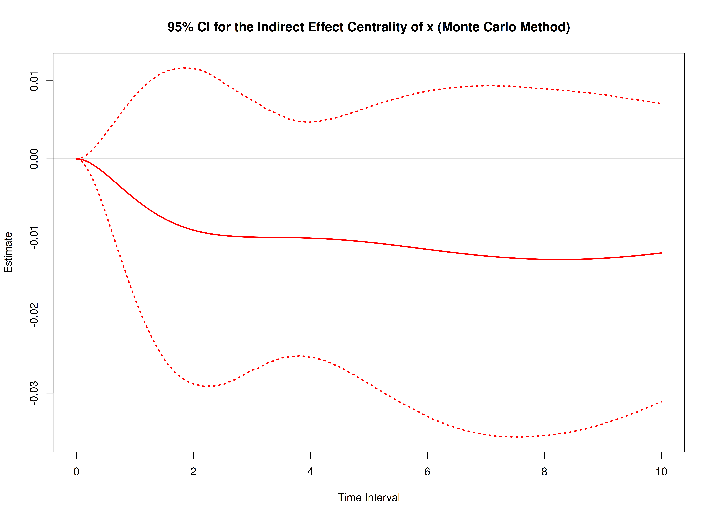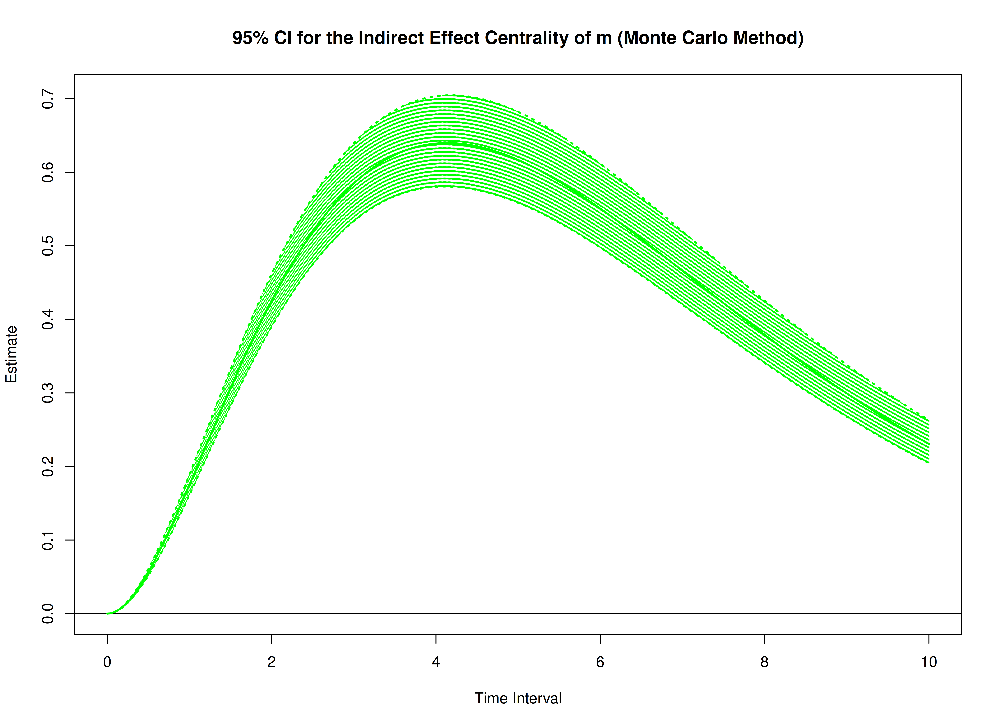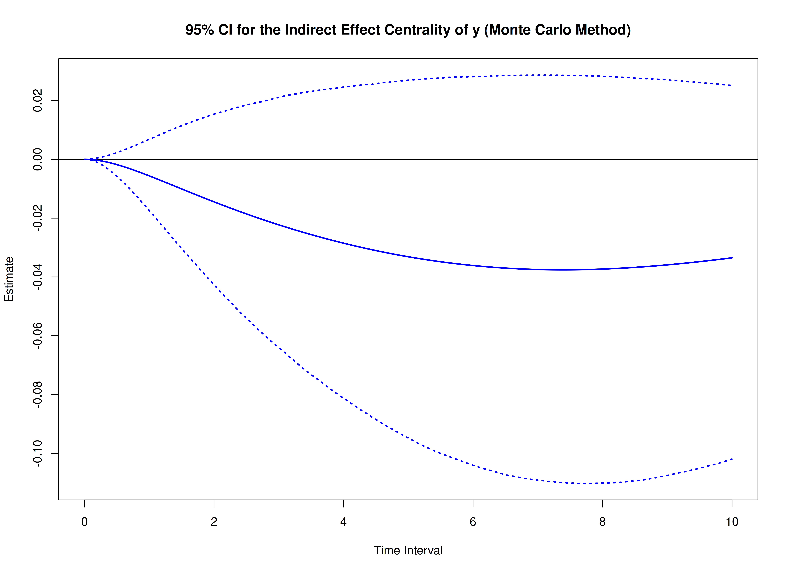

## References


