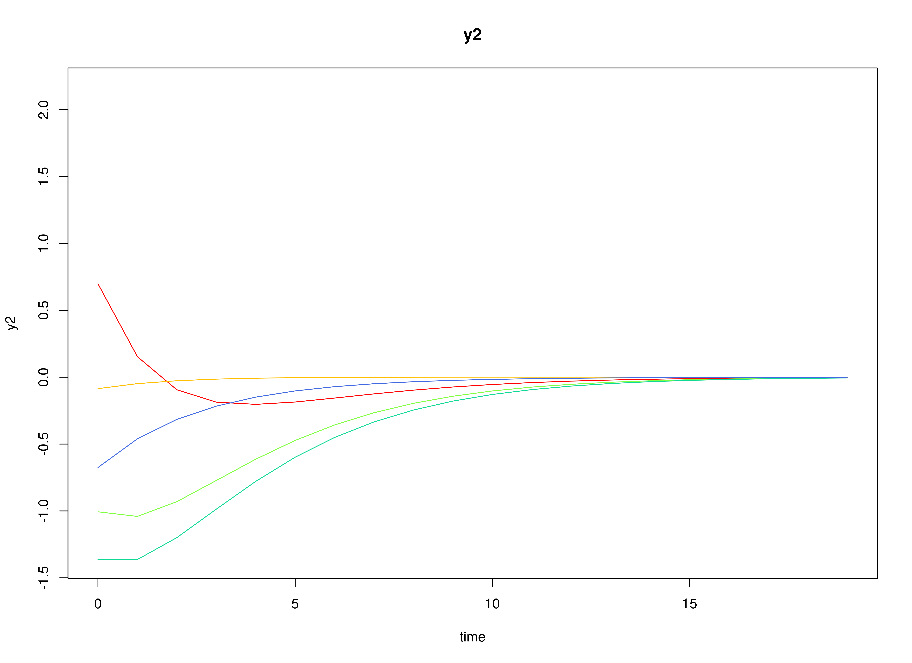
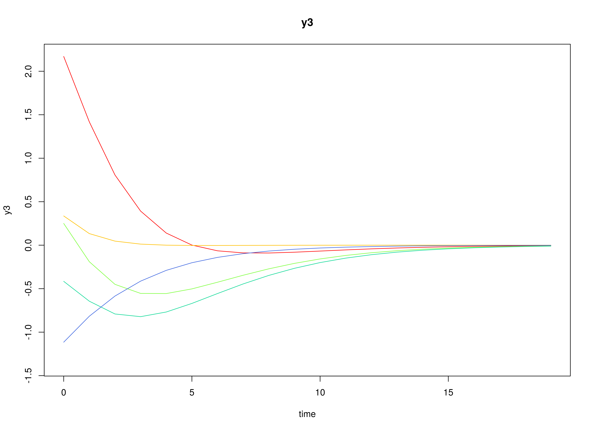
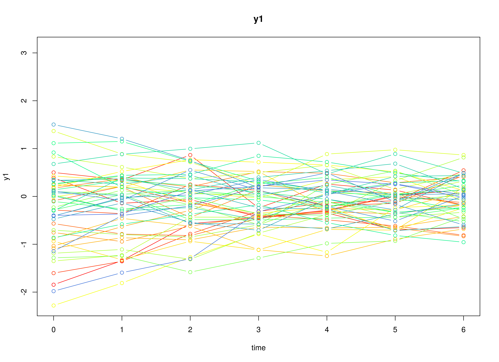
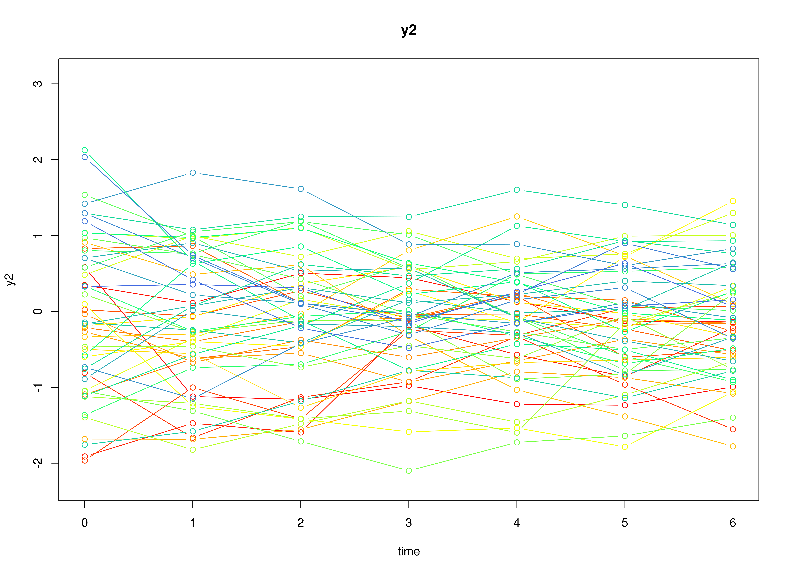
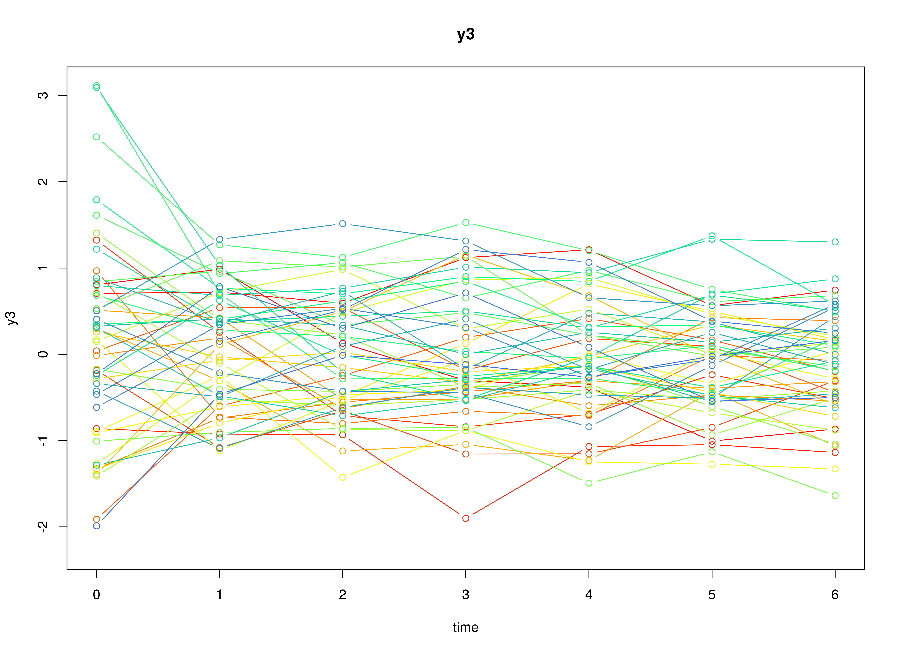

This article provides the details on how the data set `deboeck2015` was generated.

## Model

The measurement model is given by
\begin{equation}
  \mathbf{y}_{i, t}
  =
  \boldsymbol{\eta}_{i, t}
\end{equation}
where $\mathbf{y}_{i, t}$
represents a vector of observed variables
and $\boldsymbol{\eta}_{i, t}$
a vector of latent variables
for individual $i$ and time $t$.
Since the observed and latent variables are equal,
we only generate data
from the dynamic structure.

The dynamic structure is given by
\begin{equation}
  \boldsymbol{\eta}_{i, t}
  =
  \boldsymbol{\alpha}
  +
  \boldsymbol{\beta}
  \boldsymbol{\eta}_{i, t - 1}
  +
  \boldsymbol{\zeta}_{i, t},
  \quad
  \mathrm{with}
  \quad
  \boldsymbol{\zeta}_{i, t}
  \sim
  \mathcal{N}
  \left(
  \mathbf{0},
  \boldsymbol{\Psi}
  \right)
\end{equation}
where
$\boldsymbol{\eta}_{i, t}$,
$\boldsymbol{\eta}_{i, t - 1}$,
and
$\boldsymbol{\zeta}_{i, t}$
are random variables,
and
$\boldsymbol{\alpha}$,
$\boldsymbol{\beta}$,
and
$\boldsymbol{\Psi}$
are model parameters.
Here,
$\boldsymbol{\eta}_{i, t}$
is a vector of latent variables
at time $t$ and individual $i$,
$\boldsymbol{\eta}_{i, t - 1}$
represents a vector of latent variables
at time $t - 1$ and individual $i$,
and
$\boldsymbol{\zeta}_{i, t}$
represents a vector of dynamic noise
at time $t$ and individual $i$.
$\boldsymbol{\alpha}$
denotes a vector of intercepts,
$\boldsymbol{\beta}$
a matrix of autoregression
and cross regression coefficients,
and
$\boldsymbol{\Psi}$
the covariance matrix of
$\boldsymbol{\zeta}_{i, t}$.

An alternative representation of the dynamic noise
is given by
\begin{equation}
  \boldsymbol{\zeta}_{i, t}
  =
  \boldsymbol{\Psi}^{\frac{1}{2}}
  \mathbf{z}_{i, t},
  \quad
  \mathrm{with}
  \quad
  \mathbf{z}_{i, t}
  \sim
  \mathcal{N}
  \left(
  \mathbf{0},
  \mathbf{I}
  \right)
\end{equation}
where
$\left( \boldsymbol{\Psi}^{\frac{1}{2}} \right) \left( \boldsymbol{\Psi}^{\frac{1}{2}} \right)^{\prime} = \boldsymbol{\Psi}$ .

## Data Generation

### Notation

Let $t = 7$ be the number of time points and $n = 50$ be the number of individuals.

Let the initial condition
$\boldsymbol{\eta}_{0}$
be given by

\begin{equation}
\boldsymbol{\eta}_{0} \sim \mathcal{N} \left( \boldsymbol{\mu}_{\boldsymbol{\eta} \mid 0}, \boldsymbol{\Sigma}_{\boldsymbol{\eta} \mid 0} \right)
\end{equation}

\begin{equation}
\boldsymbol{\mu}_{\boldsymbol{\eta} \mid 0}
=
\left(
\begin{array}{c}
  0 \\
  0 \\
  0 \\
\end{array}
\right)
\end{equation}

\begin{equation}
\boldsymbol{\Sigma}_{\boldsymbol{\eta} \mid 0}
=
\left(
\begin{array}{ccc}
  1 & 0.2 & 0.2 \\
  0.2 & 1 & 0.2 \\
  0.2 & 0.2 & 1 \\
\end{array}
\right) .
\end{equation}

Let the constant vector $\boldsymbol{\alpha}$ be given by

\begin{equation}
\boldsymbol{\alpha}
=
\left(
\begin{array}{c}
  0 \\
  0 \\
  0 \\
\end{array}
\right) .
\end{equation}

Let the transition matrix $\boldsymbol{\beta}$ be given by

\begin{equation}
\boldsymbol{\beta}
=
\left(
\begin{array}{ccc}
  0.7 & 0 & 0 \\
  0.5 & 0.6 & 0 \\
  -0.1 & 0.4 & 0.5 \\
\end{array}
\right) .
\end{equation}

Let the dynamic process noise $\boldsymbol{\Psi}$ be given by

\begin{equation}
\boldsymbol{\Psi}
=
\left(
\begin{array}{ccc}
  0.1 & 0 & 0 \\
  0 & 0.1 & 0 \\
  0 & 0 & 0.1 \\
\end{array}
\right) .
\end{equation}

### R Function Arguments


```r
n
#> [1] 50
time
#> [1] 7
mu0
#> [1] 0 0 0
sigma0
#>      [,1] [,2] [,3]
#> [1,]  1.0  0.2  0.2
#> [2,]  0.2  1.0  0.2
#> [3,]  0.2  0.2  1.0
sigma0_l
#>      [,1]      [,2]      [,3]
#> [1,]  1.0 0.0000000 0.0000000
#> [2,]  0.2 0.9797959 0.0000000
#> [3,]  0.2 0.1632993 0.9660918
alpha
#> [1] 0 0 0
beta
#>      [,1] [,2] [,3]
#> [1,]  0.7  0.0  0.0
#> [2,]  0.5  0.6  0.0
#> [3,] -0.1  0.4  0.5
psi
#>      [,1] [,2] [,3]
#> [1,]  0.1  0.0  0.0
#> [2,]  0.0  0.1  0.0
#> [3,]  0.0  0.0  0.1
psi_l
#>           [,1]      [,2]      [,3]
#> [1,] 0.3162278 0.0000000 0.0000000
#> [2,] 0.0000000 0.3162278 0.0000000
#> [3,] 0.0000000 0.0000000 0.3162278
```

### Visualizing the Dynamics Without Process Noise ($n = 5$ with Different Initial Condition)



### Using the SimSSMVARFixed Function from the simStateSpace Package to Simulate Data


```r
library(simStateSpace)
sim <- SimSSMVARFixed(
  n = n,
  time = time,
  mu0 = mu0,
  sigma0_l = sigma0_l,
  alpha = alpha,
  beta = beta,
  psi_l = psi_l
)
data <- as.data.frame(sim)
head(data)
#>   id time          y1         y2         y3
#> 1  1    0 -1.84569501  0.5815402  0.8057225
#> 2  1    1 -1.34252674 -1.1219724  0.9873906
#> 3  1    2 -0.57123433 -1.1591679  0.1280274
#> 4  1    3 -0.44448720 -0.9783200 -0.3028425
#> 5  1    4 -0.28796224 -1.2222325 -0.3807219
#> 6  1    5  0.01622801 -1.2362032 -1.0056038
plot(sim)
```




```r
colnames(data) <- c(
  "id",
  "time",
  "x",
  "m",
  "y"
)
dim(data)
#> [1] 350   5
head(data)
#>   id time           x          m          y
#> 1  1    0 -1.84569501  0.5815402  0.8057225
#> 2  1    1 -1.34252674 -1.1219724  0.9873906
#> 3  1    2 -0.57123433 -1.1591679  0.1280274
#> 4  1    3 -0.44448720 -0.9783200 -0.3028425
#> 5  1    4 -0.28796224 -1.2222325 -0.3807219
#> 6  1    5  0.01622801 -1.2362032 -1.0056038
```


```r
deboeck2015 <- data
```


## References


