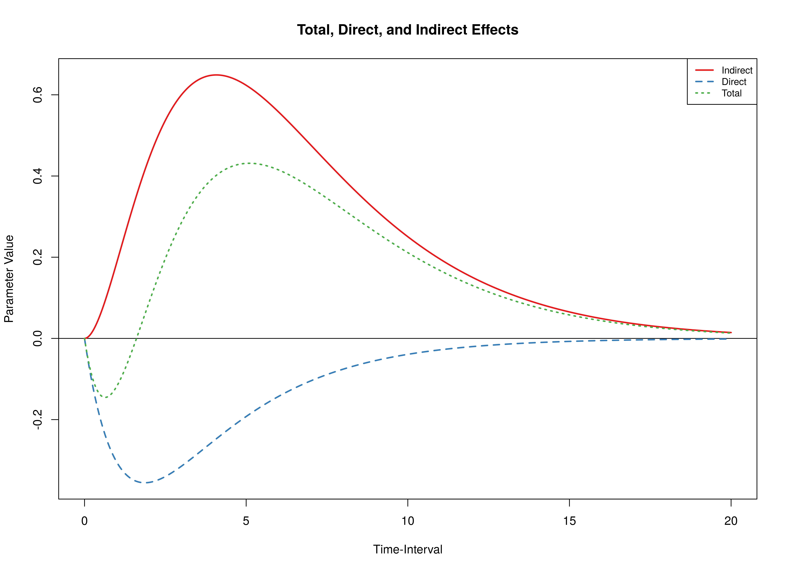
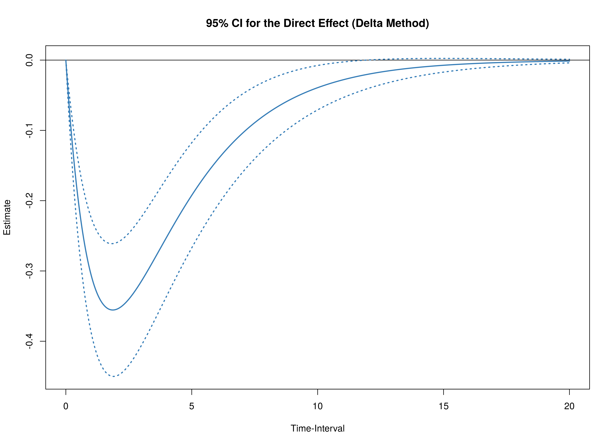
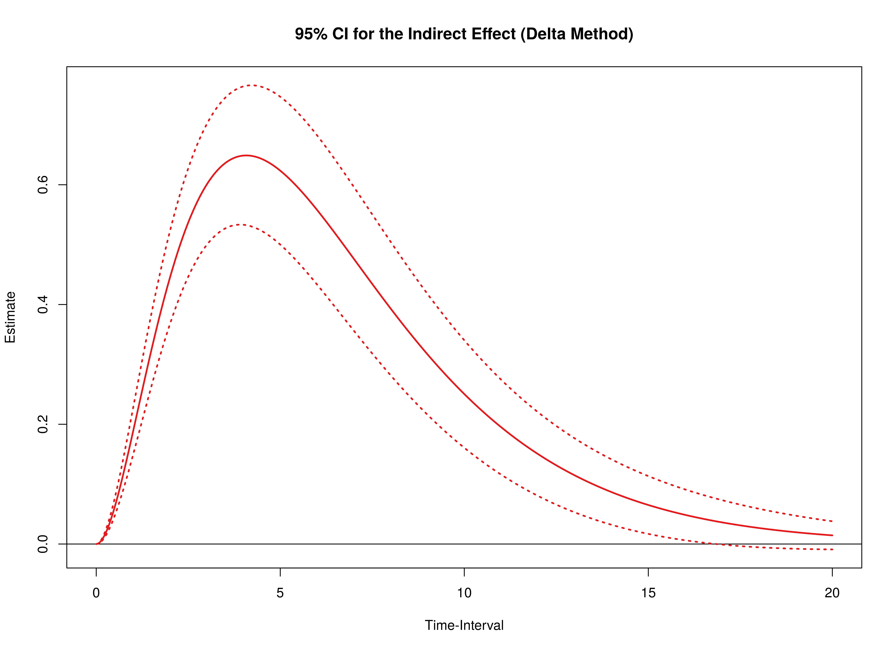
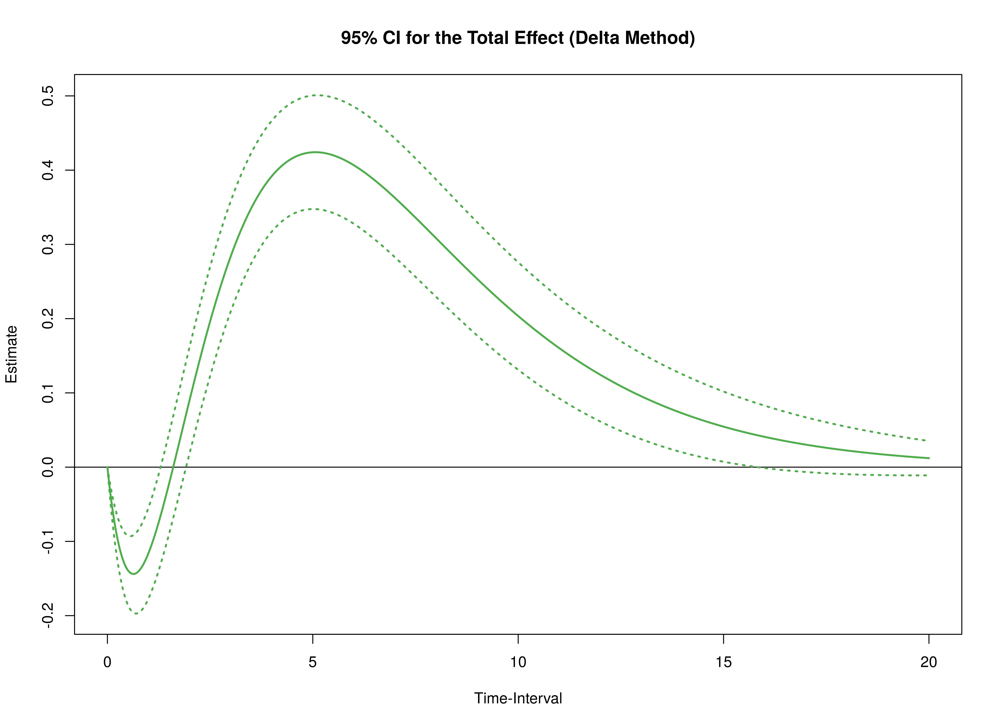
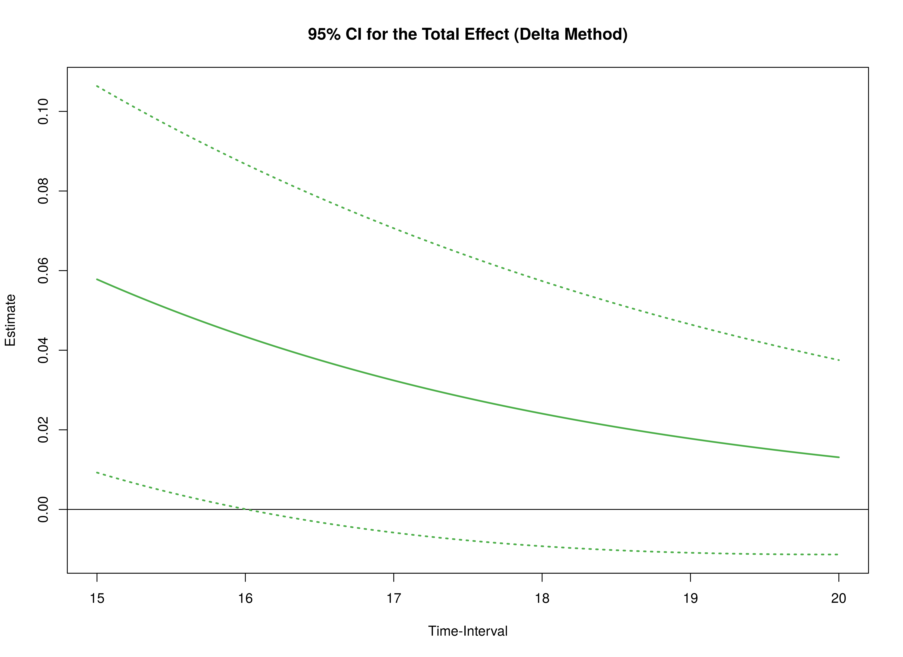
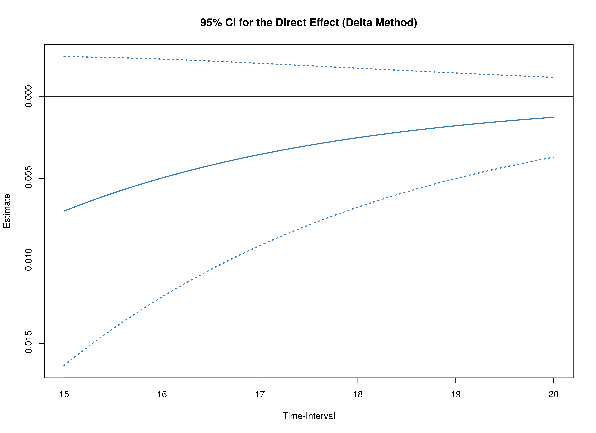
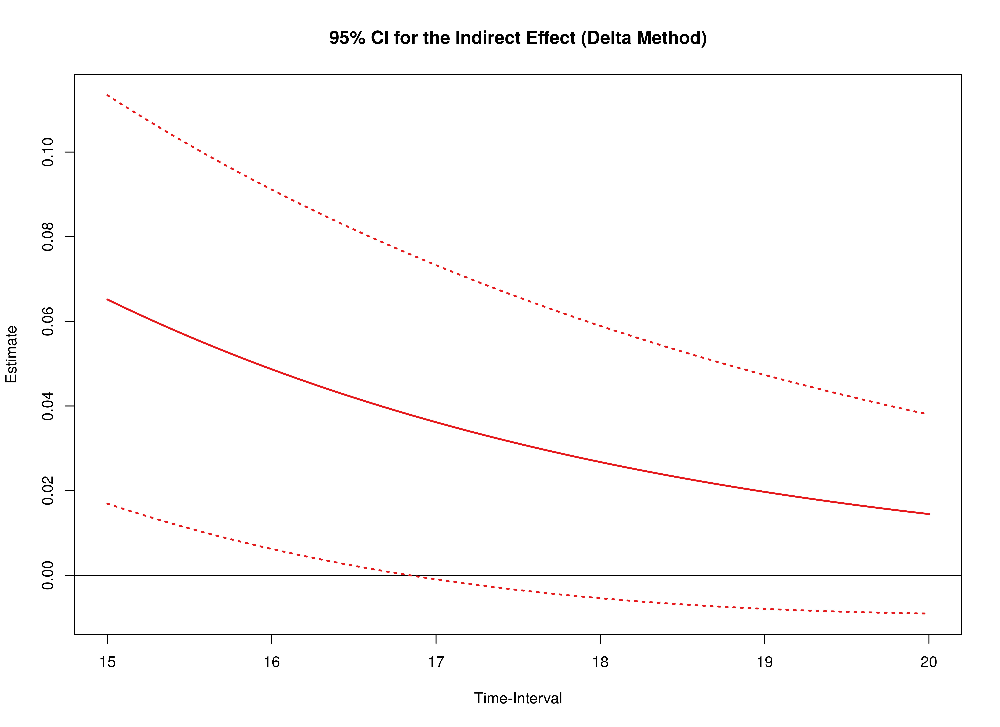

```r
library(cTMed)
```

The drift matrix and the corresponding sampling variance-covariance matrix
of the fitted OU model is available in the data object `deboeck2015phi`.
See this [link](ou.html) for more details on how the model was fitted.


```r
data("deboeck2015phi", package = "cTMed")
```


## Using Results from the dynr Package


```r
phi <- deboeck2015phi$dynr$phi
vcov_phi_vec <- deboeck2015phi$dynr$vcov
phi
#>            x           m           y
#> x -0.3537864  0.02461296 -0.01454772
#> m  0.7745076 -0.47616825  0.01994299
#> y -0.5347597  0.83210494 -0.78593715
vcov_phi_vec
#>               phi_11        phi_21        phi_31        phi_12        phi_22
#> phi_11  0.0027042735 -0.0014752750  0.0009491216 -0.0016194215  0.0008851215
#> phi_21 -0.0014752750  0.0044284423 -0.0026423032  0.0009805729 -0.0027181697
#> phi_31  0.0009491216 -0.0026423032  0.0064026677 -0.0006977982  0.0018134711
#> phi_12 -0.0016194215  0.0009805729 -0.0006977982  0.0020792855 -0.0011525005
#> phi_22  0.0008851215 -0.0027181697  0.0018134711 -0.0011525005  0.0034260496
#> phi_32 -0.0005694040  0.0016188053 -0.0040431377  0.0007530002 -0.0020750048
#> phi_13  0.0008549300 -0.0005869213  0.0004630856 -0.0015287013  0.0008991651
#> phi_23 -0.0004658235  0.0014784214 -0.0011209493  0.0008205870 -0.0025328492
#> phi_33  0.0002978145 -0.0008715465  0.0022717108 -0.0005175244  0.0014755785
#>               phi_32        phi_13        phi_23        phi_33
#> phi_11 -0.0005694040  0.0008549300 -0.0004658235  0.0002978145
#> phi_21  0.0016188053 -0.0005869213  0.0014784214 -0.0008715465
#> phi_31 -0.0040431377  0.0004630856 -0.0011209493  0.0022717108
#> phi_12  0.0007530002 -0.0015287013  0.0008205870 -0.0005175244
#> phi_22 -0.0020750048  0.0008991651 -0.0025328492  0.0014755785
#> phi_32  0.0049840324 -0.0006222547  0.0016349169 -0.0037056607
#> phi_13 -0.0006222547  0.0020600755 -0.0010966843  0.0006863857
#> phi_23  0.0016349169 -0.0010966843  0.0033286919 -0.0019260876
#> phi_33 -0.0037056607  0.0006863857 -0.0019260876  0.0047262347
```

> **Note:** The input argument `phi` matrix is required to have column and rownames
> as they are used to trace the path of the independent variable column (`from = "x"`)
> to the dependent variable row (`to = "y"`) through mediator variables (`med = "m"`).
> The argument `vcov_phi_vec` does not require names.

### Plot the Effects as a Function of the Time-Interval


```r
med <- Med(
  phi = phi,
  delta_t = seq(from = 0, to = 20, length.out = 1000),
  from = "x",
  to = "y",
  med = "m"
)
plot(med)
```



### Delta Method for Total, Direct, and Indirect Effects for a Range of Time-Intervals

The delta method confidence intervals of the total, direct, and indirect effects
from $X$ to $Y$ through $M$ at a range of time-intervals (0 to 20) is calculated using the `DeltaMed()` function.
If the length of `delta_t` is long,
using multiple cores by specifying the number of cores to use `ncores` can make the calculations run faster.


```r
delta <- DeltaMed(
  phi = phi,
  vcov_phi_vec = vcov_phi_vec,
  delta_t = seq(from = 0, to = 20, length.out = 1000),
  from = "x",
  to = "y",
  med = "m",
  ncores = parallel::detectCores()
)
plot(delta)
```



## Using Results from the ctsem Package

`phi` in the case of the `ctsem` results is the mean of the posterior distribution of the drift matrix
and `vcov_phi_vec` is the corresponding covariance matrix.


```r
phi <- deboeck2015phi$ctsem$phi
vcov_phi_vec <- deboeck2015phi$ctsem$vcov
phi
#>            x           m           y
#> x -0.3560172  0.02264243 -0.01344054
#> m  0.7735648 -0.47936461  0.02013954
#> y -0.5315668  0.83112753 -0.78845099
vcov_phi_vec
#>                [,1]          [,2]          [,3]          [,4]          [,5]
#>  [1,]  0.0027203000 -0.0015970313  0.0009920594 -0.0015759171  0.0009625203
#>  [2,] -0.0015970313  0.0046750800 -0.0027858588  0.0011674434 -0.0030119591
#>  [3,]  0.0009920594 -0.0027858588  0.0066686739 -0.0007615475  0.0021097110
#>  [4,] -0.0015759171  0.0011674434 -0.0007615475  0.0020609848 -0.0012713100
#>  [5,]  0.0009625203 -0.0030119591  0.0021097110 -0.0012713100  0.0038085901
#>  [6,] -0.0006497787  0.0019063097 -0.0045048618  0.0008840249 -0.0024510249
#>  [7,]  0.0008091685 -0.0006900233  0.0005367671 -0.0015361385  0.0009999485
#>  [8,] -0.0004633075  0.0016125298 -0.0013519017  0.0008330685 -0.0027404294
#>  [9,]  0.0003380657 -0.0010394225  0.0027755591 -0.0006490546  0.0016977932
#>                [,6]          [,7]          [,8]          [,9]
#>  [1,] -0.0006497787  0.0008091685 -0.0004633075  0.0003380657
#>  [2,]  0.0019063097 -0.0006900233  0.0016125298 -0.0010394225
#>  [3,] -0.0045048618  0.0005367671 -0.0013519017  0.0027755591
#>  [4,]  0.0008840249 -0.0015361385  0.0008330685 -0.0006490546
#>  [5,] -0.0024510249  0.0009999485 -0.0027404294  0.0016977932
#>  [6,]  0.0055103655 -0.0007856074  0.0019507734 -0.0042293676
#>  [7,] -0.0007856074  0.0020930771 -0.0010690175  0.0008387837
#>  [8,]  0.0019507734 -0.0010690175  0.0034544832 -0.0021401405
#>  [9,] -0.0042293676  0.0008387837 -0.0021401405  0.0052749605
```

### Plot the Effects as a Function of the Time-Interval


```r
med <- Med(
  phi = phi,
  delta_t = seq(from = 0, to = 20, length.out = 1000),
  from = "x",
  to = "y",
  med = "m"
)
plot(med)
```


### Delta Method for Total, Direct, and Indirect Effects for a Range of Time-Intervals


```r
delta <- DeltaMed(
  phi = phi,
  vcov_phi_vec = vcov_phi_vec,
  delta_t = seq(from = 0, to = 20, length.out = 1000),
  from = "x",
  to = "y",
  med = "m",
  ncores = parallel::detectCores()
)
plot(delta)
```




Notice that the lower and upper bounds of the confidence intervals are symmetric around the estimate.



## References


