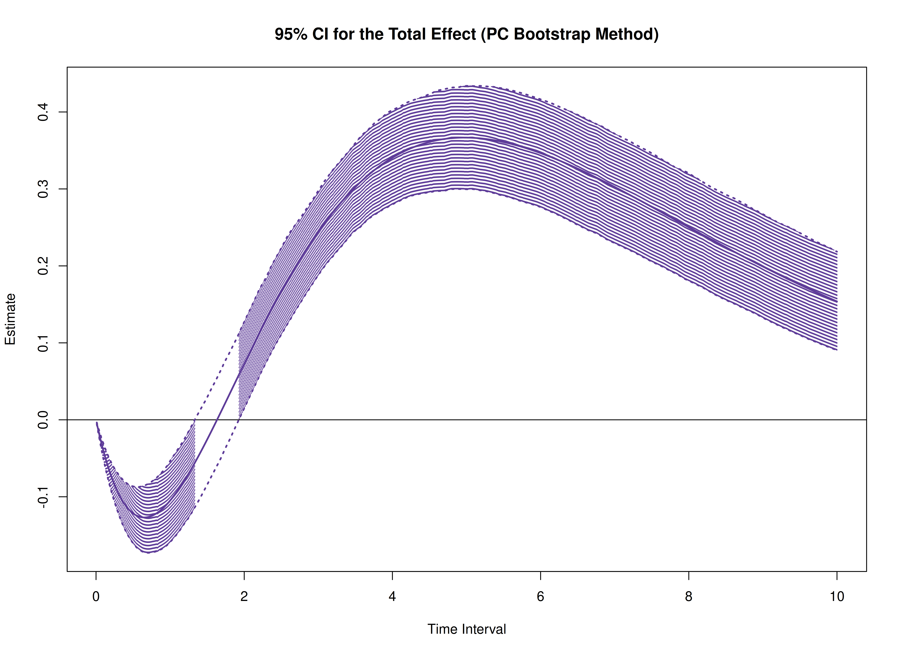
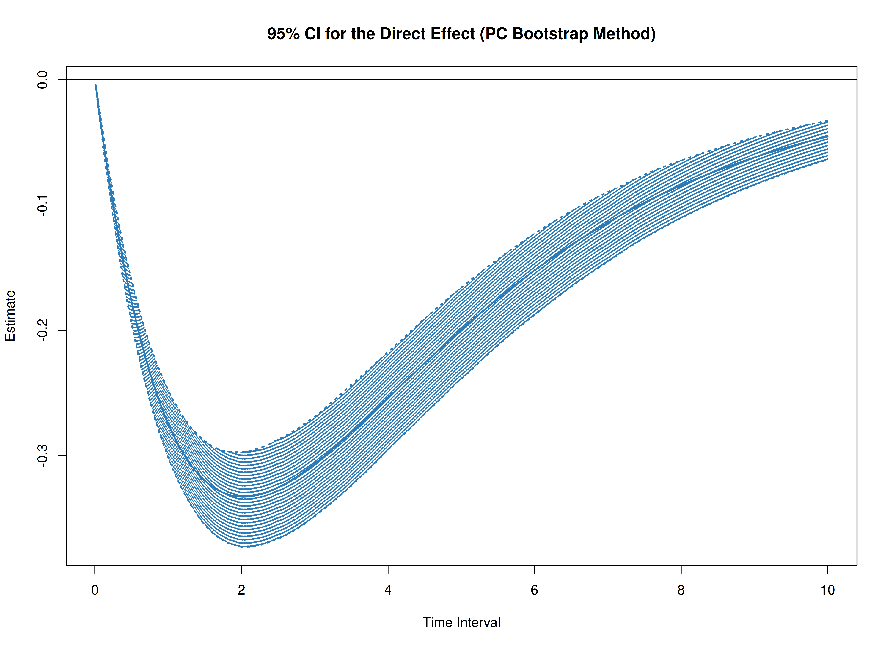
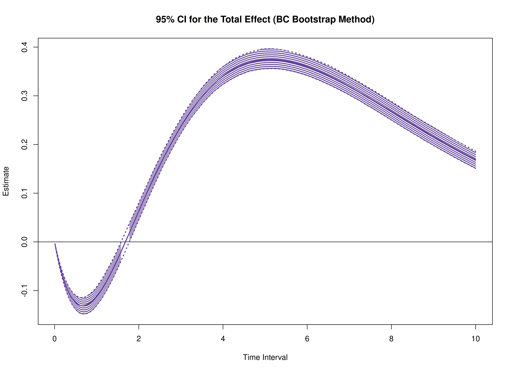
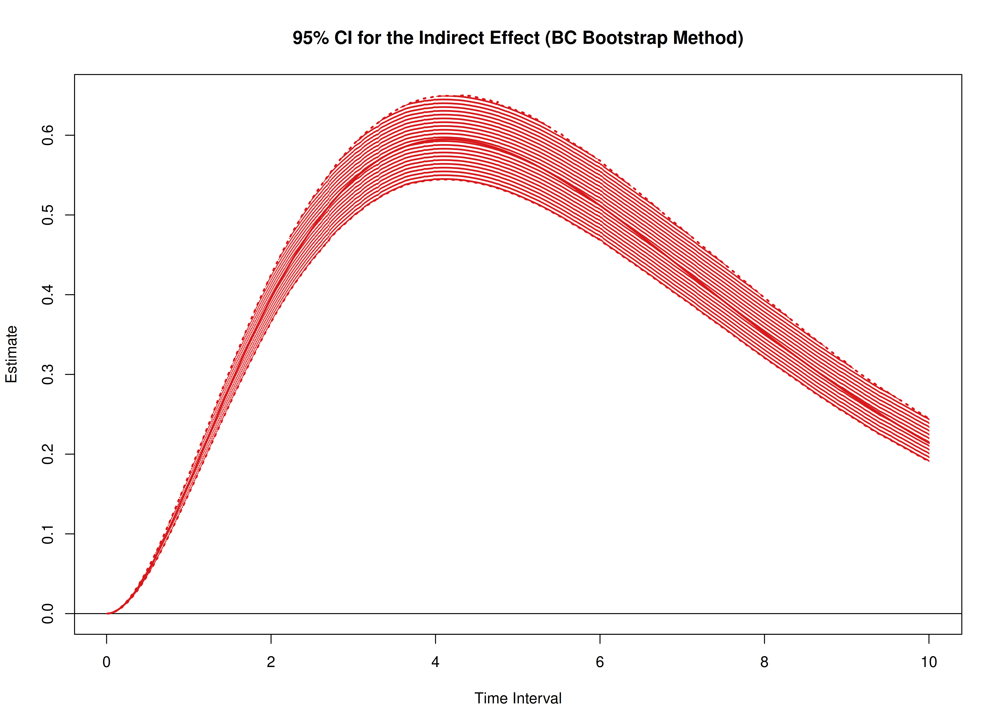
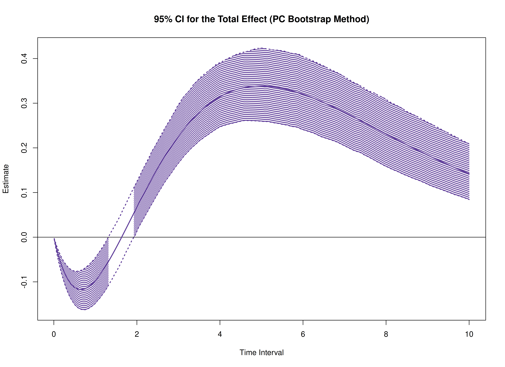
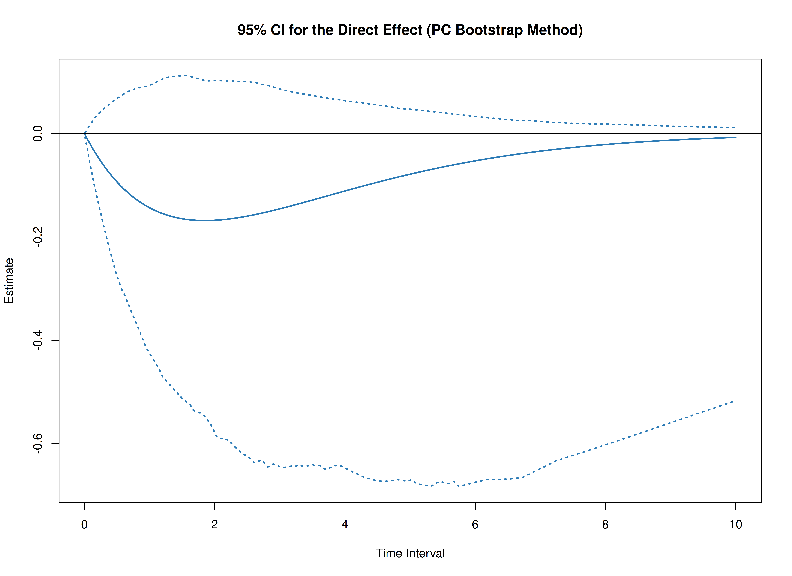
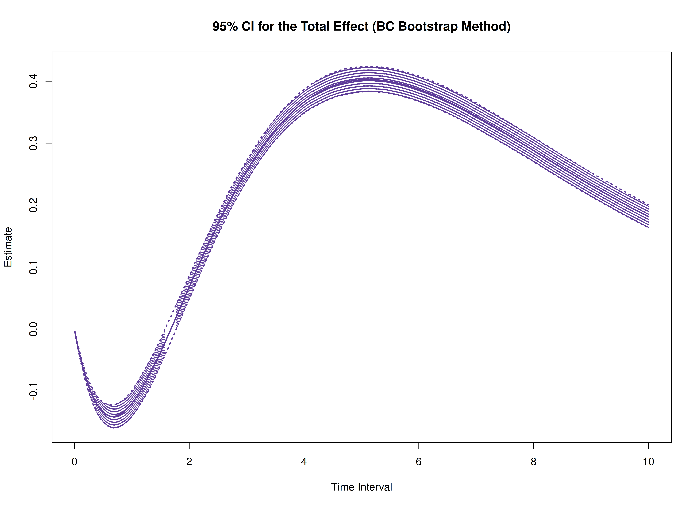

The `cTMed` package provides a bootstrap approach, in addition to the delta and Monte Carlo methods, for estimating and quantifying uncertainty in total, direct, and indirect effects within continuous-time mediation models across different time intervals.


In this example, we will use the fitted model from [Fit the Continuous-Time Vector Autoregressive Model Using the dynr Package](https://jeksterslab.github.io/cTMed/articles/fit-ct-var-dynr.html). The object `fit` represents a fitted CT-VAR model created using the `dynr` package.


``` r
summary(fit)
#> Coefficients:
#>              Estimate Std. Error t value   ci.lower   ci.upper Pr(>|t|)    
#> phi_1_1    -0.3518738  0.0345599 -10.182 -0.4196100 -0.2841377   <2e-16 ***
#> phi_2_1     0.7442754  0.0213025  34.938  0.7025233  0.7860275   <2e-16 ***
#> phi_3_1    -0.4586681  0.0224194 -20.459 -0.5026093 -0.4147269   <2e-16 ***
#> phi_1_2     0.0173316  0.0304068   0.570 -0.0422645  0.0769278   0.2843    
#> phi_2_2    -0.4888138  0.0188377 -25.949 -0.5257350 -0.4518927   <2e-16 ***
#> phi_3_2     0.7267855  0.0198254  36.659  0.6879284  0.7656426   <2e-16 ***
#> phi_1_3    -0.0238213  0.0233767  -1.019 -0.0696387  0.0219962   0.1541    
#> phi_2_3    -0.0098181  0.0144220  -0.681 -0.0380848  0.0184485   0.2480    
#> phi_3_3    -0.6883228  0.0152967 -44.998 -0.7183038 -0.6583418   <2e-16 ***
#> sigma_1_1   0.2421847  0.0064484  37.557  0.2295461  0.2548232   <2e-16 ***
#> sigma_2_1   0.0232727  0.0025183   9.241  0.0183369  0.0282084   <2e-16 ***
#> sigma_3_1  -0.0505753  0.0026989 -18.739 -0.0558649 -0.0452856   <2e-16 ***
#> sigma_2_2   0.0707197  0.0018899  37.420  0.0670155  0.0744238   <2e-16 ***
#> sigma_3_2   0.0149893  0.0013541  11.070  0.0123354  0.0176433   <2e-16 ***
#> sigma_3_3   0.0723762  0.0020868  34.683  0.0682861  0.0764663   <2e-16 ***
#> theta_1_1   0.1988610  0.0011588 171.608  0.1965898  0.2011323   <2e-16 ***
#> theta_2_2   0.1995204  0.0009996 199.609  0.1975613  0.2014795   <2e-16 ***
#> theta_3_3   0.2011716  0.0010145 198.288  0.1991832  0.2031601   <2e-16 ***
#> mu0_1_1     0.0062149  0.1219710   0.051 -0.2328439  0.2452737   0.4797    
#> mu0_2_1    -0.0425006  0.1208284  -0.352 -0.2793200  0.1943187   0.3625    
#> mu0_3_1     0.1300648  0.1041761   1.249 -0.0741167  0.3342462   0.1059    
#> sigma0_1_1  1.1504264  0.1810442   6.354  0.7955863  1.5052665   <2e-16 ***
#> sigma0_2_1  0.4136629  0.1418008   2.917  0.1357384  0.6915875   0.0018 ** 
#> sigma0_3_1  0.2260142  0.1187792   1.903 -0.0067889  0.4588172   0.0285 *  
#> sigma0_2_2  1.2218038  0.1985814   6.153  0.8325914  1.6110161   <2e-16 ***
#> sigma0_3_2  0.2353104  0.1267133   1.857 -0.0130432  0.4836640   0.0317 *  
#> sigma0_3_3  0.9626701  0.1594441   6.038  0.6501655  1.2751747   <2e-16 ***
#> ---
#> Signif. codes:  0 '***' 0.001 '**' 0.01 '*' 0.05 '.' 0.1 ' ' 1
#> 
#> -2 log-likelihood value at convergence = 429365.49
#> AIC = 429419.49
#> BIC = 429676.34
```

We need to extract the estimated parameters from the fitted object, which will be used to generate bootstrap samples.


``` r
est <- coef(fit)
n
#> [1] 100
time
#> [1] 1000
delta_t
#> [1] 0.1
lambda
#>      [,1] [,2] [,3]
#> [1,]    1    0    0
#> [2,]    0    1    0
#> [3,]    0    0    1
nu
#> [1] 0 0 0
mu
#> [1] 0 0 0
mu0 <- est[
  c(
    "mu0_1_1",
    "mu0_2_1",
    "mu0_3_1"
  )
]
mu0
#>      mu0_1_1      mu0_2_1      mu0_3_1 
#>  0.006214893 -0.042500647  0.130064755
sigma0 <- matrix(
  data = est[
    c(
      "sigma0_1_1",
      "sigma0_2_1",
      "sigma0_3_1",
      "sigma0_2_1",
      "sigma0_2_2",
      "sigma0_3_2",
      "sigma0_3_1",
      "sigma0_3_2",
      "sigma0_3_3"
    )
  ],
  nrow = 3,
  ncol = 3
)
sigma0
#>           [,1]      [,2]      [,3]
#> [1,] 1.1504264 0.4136629 0.2260142
#> [2,] 0.4136629 1.2218038 0.2353104
#> [3,] 0.2260142 0.2353104 0.9626701
sigma0_l <- t(chol(sigma0))
phi <- matrix(
  data = est[
    c(
      "phi_1_1",
      "phi_2_1",
      "phi_3_1",
      "phi_1_2",
      "phi_2_2",
      "phi_3_2",
      "phi_1_3",
      "phi_2_3",
      "phi_3_3"
    )
  ],
  nrow = 3,
  ncol = 3
)
phi
#>            [,1]        [,2]         [,3]
#> [1,] -0.3518738  0.01733165 -0.023821271
#> [2,]  0.7442754 -0.48881381 -0.009818147
#> [3,] -0.4586681  0.72678550 -0.688322785
sigma <- matrix(
  data = est[
    c(
      "sigma_1_1", "sigma_2_1", "sigma_3_1",
      "sigma_2_1", "sigma_2_2", "sigma_3_2",
      "sigma_3_1", "sigma_3_2", "sigma_3_3"
    )
  ],
  nrow = 3,
  ncol = 3
)
sigma
#>             [,1]       [,2]        [,3]
#> [1,]  0.24218466 0.02327267 -0.05057526
#> [2,]  0.02327267 0.07071965  0.01498933
#> [3,] -0.05057526 0.01498933  0.07237617
sigma_l <- t(chol(sigma))
theta <- diag(3)
diag(theta) <- est[
  c(
    "theta_1_1",
    "theta_2_2",
    "theta_3_3"
  )
]
theta
#>          [,1]      [,2]      [,3]
#> [1,] 0.198861 0.0000000 0.0000000
#> [2,] 0.000000 0.1995204 0.0000000
#> [3,] 0.000000 0.0000000 0.2011716
theta_l <- t(chol(theta))
```


``` r
R <- 1000L # use at least 1000 in actual research
path <- getwd()
prefix <- "ou"
```

The estimated parameters are then passed as arguments to the `PBSSMOUFixed` function from the `bootStateSpace` package, which generates a parametric bootstrap sampling distribution of the parameter estimates. The argument `R` specifies the number of bootstrap replications.
The generated data and model estimates are stored in `path` using the specified `prefix` for the file names.
The `ncores = parallel::detectCores()` argument instructs the function to use all available CPU cores in the system.

> **_NOTE:_**  Fitting the CT-VAR model multiple times is computationally intensive. 


``` r
library(bootStateSpace)
boot <- PBSSMOUFixed(
  R = R,
  path = path,
  prefix = prefix,
  n = n,
  time = time,
  delta_t = delta_t,
  mu0 = mu0,
  sigma0_l = sigma0_l,
  mu = mu,
  phi = phi,
  sigma_l = sigma_l,
  nu = nu,
  lambda = lambda,
  theta_l = theta_l,
  ncores = parallel::detectCores(),
  seed = 42,
  clean = FALSE
)
```

The `extract` function from the `bootStateSpace` package is used to extract the bootstrap phi matrices as well as the sigma matrices.


``` r
phi <- extract(object = boot, what = "phi")
```


``` r
sigma <- extract(object = boot, what = "sigma")
```

In this example, we aim to calculate the total, direct, and indirect effects of `x` on `y`, mediated through `m`, over time intervals ranging from 0 to 10.


``` r
# time intervals
delta_t <- seq(from = 0, to = 10, length.out = 1000)
```

We also need the estimated drift matrix from the original sample.


``` r
# estimated drift matrix
phi_hat <- matrix(
  data = est[
    c(
      "phi_1_1",
      "phi_2_1",
      "phi_3_1",
      "phi_1_2",
      "phi_2_2",
      "phi_3_2",
      "phi_1_3",
      "phi_2_3",
      "phi_3_3"
    )
  ],
  nrow = 3,
  ncol = 3
)
colnames(phi_hat) <- rownames(phi_hat) <- c("x", "m", "y")
```

For the standardized effects, the estimated process noise covariance matrix from the original sample is also needed.


``` r
# estimated process noise covariance matrix
sigma_hat <- matrix(
  data = est[
    c(
      "sigma_1_1", "sigma_2_1", "sigma_3_1",
      "sigma_2_1", "sigma_2_2", "sigma_3_2",
      "sigma_3_1", "sigma_3_2", "sigma_3_3"
    )
  ],
  nrow = 3,
  ncol = 3
)
```

## Bootstrap Method


``` r
library(cTMed)
boot <- BootMed(
  phi = phi,
  phi_hat = phi_hat,
  delta_t = delta_t,
  from = "x",
  to = "y",
  med = "m",
  ncores = parallel::detectCores() # use multiple cores
)
```


``` r
plot(boot)
```



``` r
plot(boot, type = "bc")
```



The following generates bootstrap confidence intervals for the standardized effects.


``` r
boot <- BootMedStd(
  phi = phi,
  sigma = sigma,
  phi_hat = phi_hat,
  sigma_hat = sigma_hat,
  delta_t = delta_t,
  from = "x",
  to = "y",
  med = "m",
  ncores = parallel::detectCores() # use multiple cores
)
```


``` r
plot(boot)
```



``` r
plot(boot, type = "bc")
```



## References


