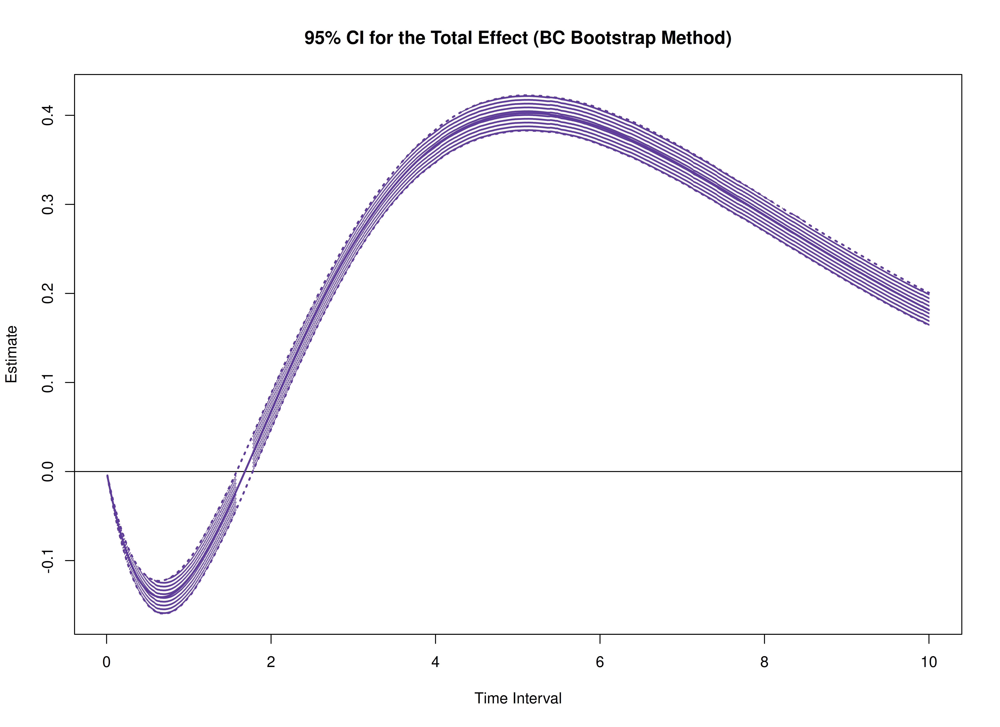

The `cTMed` package provides a bootstrap approach, in addition to the delta and Monte Carlo methods, for estimating and quantifying uncertainty in total, direct, and indirect effects within continuous-time mediation models across different time intervals.


In this example, we will use the fitted model from [Fit the Continuous-Time Vector Autoregressive Model Using the dynr Package](https://jeksterslab.github.io/cTMed/articles/fit-ct-var-dynr.html). The object `fit` represents a fitted CT-VAR model created using the `dynr` package.


``` r
summary(fit)
#> Coefficients:
#>              Estimate Std. Error t value   ci.lower   ci.upper Pr(>|t|)    
#> phi_1_1    -0.2938068  0.0820046  -3.583 -0.4545328 -0.1330807   0.0002 ***
#> phi_2_1     0.8243958  0.0566320  14.557  0.7133991  0.9353925   <2e-16 ***
#> phi_3_1    -0.4543161  0.0574999  -7.901 -0.5670137 -0.3416184   <2e-16 ***
#> phi_1_2    -0.0719155  0.0683123  -1.053 -0.2058053  0.0619742   0.1463    
#> phi_2_2    -0.5689988  0.0482579 -11.791 -0.6635825 -0.4744151   <2e-16 ***
#> phi_3_2     0.7076470  0.0485039  14.589  0.6125811  0.8027128   <2e-16 ***
#> phi_1_3     0.0257906  0.0622339   0.414 -0.0961855  0.1477667   0.3393    
#> phi_2_3     0.0826678  0.0432912   1.910 -0.0021815  0.1675170   0.0281 *  
#> phi_3_3    -0.6875018  0.0439895 -15.629 -0.7737196 -0.6012840   <2e-16 ***
#> sigma_1_1   0.2358056  0.0226976  10.389  0.1913191  0.2802920   <2e-16 ***
#> sigma_2_1   0.0186682  0.0100337   1.861 -0.0009975  0.0383339   0.0314 *  
#> sigma_3_1  -0.0646873  0.0107504  -6.017 -0.0857577 -0.0436168   <2e-16 ***
#> sigma_2_2   0.0770878  0.0094136   8.189  0.0586374  0.0955381   <2e-16 ***
#> sigma_3_2   0.0082777  0.0066195   1.251 -0.0046963  0.0212518   0.1056    
#> sigma_3_3   0.0806545  0.0101752   7.927  0.0607115  0.1005975   <2e-16 ***
#> theta_1_1   0.2010327  0.0051032  39.394  0.1910306  0.2110348   <2e-16 ***
#> theta_2_2   0.1916402  0.0043702  43.851  0.1830748  0.2002057   <2e-16 ***
#> theta_3_3   0.1974485  0.0045195  43.688  0.1885905  0.2063066   <2e-16 ***
#> mu0_1_1    -0.0685466  0.1417041  -0.484 -0.3462816  0.2091883   0.3143    
#> mu0_2_1     0.0845735  0.1744574   0.485 -0.2573568  0.4265038   0.3139    
#> mu0_3_1     0.1157208  0.1405318   0.823 -0.1597166  0.3911581   0.2051    
#> sigma0_1_1  0.9426793  0.2001859   4.709  0.5503221  1.3350365   <2e-16 ***
#> sigma0_2_1  0.1617882  0.1775634   0.911 -0.1862298  0.5098061   0.1811    
#> sigma0_3_1  0.1032567  0.1428290   0.723 -0.1766831  0.3831964   0.2349    
#> sigma0_2_2  1.4897212  0.3064350   4.861  0.8891197  2.0903227   <2e-16 ***
#> sigma0_3_2 -0.1004635  0.1764438  -0.569 -0.4462870  0.2453600   0.2846    
#> sigma0_3_3  0.9461440  0.1974849   4.791  0.5590807  1.3332073   <2e-16 ***
#> ---
#> Signif. codes:  0 '***' 0.001 '**' 0.01 '*' 0.05 '.' 0.1 ' ' 1
#> 
#> -2 log-likelihood value at convergence = 21626.57
#> AIC = 21680.57
#> BIC = 21856.53
```

We need to extract the estimated parameters from the fitted object, which will be used to generate bootstrap samples.


``` r
est <- coef(fit)
n
#> [1] 50
time
#> [1] 100
delta_t
#> [1] 0.1
lambda
#>      [,1] [,2] [,3]
#> [1,]    1    0    0
#> [2,]    0    1    0
#> [3,]    0    0    1
nu
#> [1] 0 0 0
mu
#> [1] 0 0 0
mu0 <- est[
  c(
    "mu0_1_1",
    "mu0_2_1",
    "mu0_3_1"
  )
]
mu0
#>     mu0_1_1     mu0_2_1     mu0_3_1 
#> -0.06854665  0.08457349  0.11572075
sigma0 <- matrix(
  data = est[
    c(
      "sigma0_1_1",
      "sigma0_2_1",
      "sigma0_3_1",
      "sigma0_2_1",
      "sigma0_2_2",
      "sigma0_3_2",
      "sigma0_3_1",
      "sigma0_3_2",
      "sigma0_3_3"
    )
  ],
  nrow = 3,
  ncol = 3
)
sigma0
#>           [,1]       [,2]       [,3]
#> [1,] 0.9426793  0.1617882  0.1032567
#> [2,] 0.1617882  1.4897212 -0.1004635
#> [3,] 0.1032567 -0.1004635  0.9461440
sigma0_l <- t(chol(sigma0))
phi <- matrix(
  data = est[
    c(
      "phi_1_1",
      "phi_2_1",
      "phi_3_1",
      "phi_1_2",
      "phi_2_2",
      "phi_3_2",
      "phi_1_3",
      "phi_2_3",
      "phi_3_3"
    )
  ],
  nrow = 3,
  ncol = 3
)
phi
#>            [,1]        [,2]        [,3]
#> [1,] -0.2938068 -0.07191554  0.02579060
#> [2,]  0.8243958 -0.56899879  0.08266777
#> [3,] -0.4543161  0.70764697 -0.68750180
sigma <- matrix(
  data = est[
    c(
      "sigma_1_1", "sigma_2_1", "sigma_3_1",
      "sigma_2_1", "sigma_2_2", "sigma_3_2",
      "sigma_3_1", "sigma_3_2", "sigma_3_3"
    )
  ],
  nrow = 3,
  ncol = 3
)
sigma
#>             [,1]        [,2]         [,3]
#> [1,]  0.23580555 0.018668186 -0.064687274
#> [2,]  0.01866819 0.077087751  0.008277734
#> [3,] -0.06468727 0.008277734  0.080654490
sigma_l <- t(chol(sigma))
theta <- diag(3)
diag(theta) <- est[
  c(
    "theta_1_1",
    "theta_2_2",
    "theta_3_3"
  )
]
theta
#>           [,1]      [,2]      [,3]
#> [1,] 0.2010327 0.0000000 0.0000000
#> [2,] 0.0000000 0.1916402 0.0000000
#> [3,] 0.0000000 0.0000000 0.1974485
theta_l <- t(chol(theta))
```


``` r
R <- 5L # use at least 1000 in actual research
path <- getwd()
prefix <- "ou"
```

The estimated parameters are then passed as arguments to the `PBSSMOUFixed` function from the `bootStateSpace` package, which generates a parametric bootstrap sampling distribution of the parameter estimates. The argument `R` specifies the number of bootstrap replications.
The generated data and model estimates are stored in `path` using the specified `prefix` for the file names.
The `ncores = parallel::detectCores()` argument instructs the function to use all available CPU cores in the system.

> **_NOTE:_**  Fitting the CT-VAR model multiple times is computationally intensive. 


``` r
library(bootStateSpace)
boot <- PBSSMOUFixed(
  R = R,
  path = path,
  prefix = prefix,
  n = n,
  time = time,
  delta_t = delta_t,
  mu0 = mu0,
  sigma0_l = sigma0_l,
  mu = mu,
  phi = phi,
  sigma_l = sigma_l,
  nu = nu,
  lambda = lambda,
  theta_l = theta_l,
  ncores = parallel::detectCores(),
  seed = 42
)
```

The `extract` function from the `bootStateSpace` package is used to extract the bootstrap phi matrices as well as the sigma matrices.


``` r
phi <- extract(object = boot, what = "phi")
```


``` r
sigma <- extract(object = boot, what = "sigma")
```

In this example, we aim to calculate the total, direct, and indirect effects of `x` on `y`, mediated through `m`, over time intervals ranging from 0 to 10.


``` r
# time intervals
delta_t <- seq(from = 0, to = 10, length.out = 1000)
```

We also need the estimated drift matrix from the original sample.


``` r
# estimated drift matrix
phi_hat <- matrix(
  data = est[
    c(
      "phi_1_1",
      "phi_2_1",
      "phi_3_1",
      "phi_1_2",
      "phi_2_2",
      "phi_3_2",
      "phi_1_3",
      "phi_2_3",
      "phi_3_3"
    )
  ],
  nrow = 3,
  ncol = 3
)
colnames(phi_hat) <- rownames(phi_hat) <- c("x", "m", "y")
```

For the standardized effects, the estimated process noise covariance matrix from the original sample is also needed.


``` r
# estimated process noise covariance matrix
sigma_hat <- matrix(
  data = est[
    c(
      "sigma_1_1", "sigma_2_1", "sigma_3_1",
      "sigma_2_1", "sigma_2_2", "sigma_3_2",
      "sigma_3_1", "sigma_3_2", "sigma_3_3"
    )
  ],
  nrow = 3,
  ncol = 3
)
```

## Bootstrap Method


``` r
library(cTMed)
boot <- BootMed(
  phi = phi,
  phi_hat = phi_hat,
  delta_t = delta_t,
  from = "x",
  to = "y",
  med = "m",
  ncores = parallel::detectCores() # use multiple cores
)
plot(boot)
```


``` r
plot(boot, type = "bc")
```


The following generates bootstrap confidence intervals for the standardized effects.


``` r
boot <- BootMedStd(
  phi = phi,
  sigma = sigma,
  phi_hat = phi_hat,
  sigma_hat = sigma_hat,
  delta_t = delta_t,
  from = "x",
  to = "y",
  med = "m",
  ncores = parallel::detectCores() # use multiple cores
)
plot(boot)
```


``` r
plot(boot, type = "bc")
```



## References


