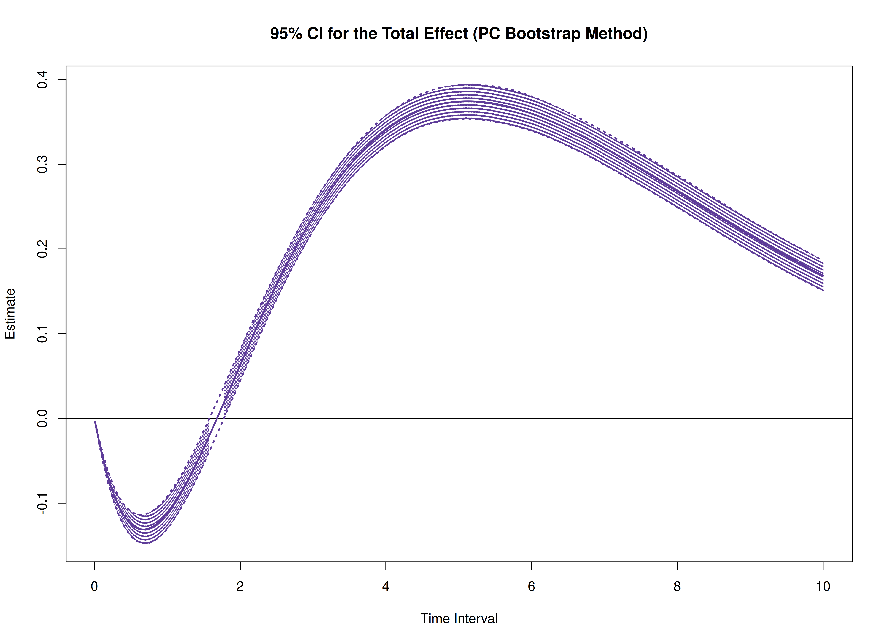

The `cTMed` package provides a bootstrap approach, in addition to the delta and Monte Carlo methods, for estimating and quantifying uncertainty in total, direct, and indirect effects within continuous-time mediation models across different time intervals.


In this example, we will use the fitted model from [Fit the Continuous-Time Vector Autoregressive Model Using the dynr Package](https://jeksterslab.github.io/cTMed/articles/fit-ct-var-dynr.html). The object `fit` represents a fitted CT-VAR model created using the `dynr` package.


``` r
summary(fit)
#> Coefficients:
#>             Estimate Std. Error t value  ci.lower  ci.upper Pr(>|t|)    
#> phi_1_1    -0.351837   0.040477  -8.692 -0.431170 -0.272503   <2e-16 ***
#> phi_2_1     0.744281   0.022684  32.810  0.699821  0.788741   <2e-16 ***
#> phi_3_1    -0.458683   0.023307 -19.680 -0.504364 -0.413001   <2e-16 ***
#> phi_1_2     0.017299   0.035160   0.492 -0.051614  0.086211   0.3114    
#> phi_2_2    -0.488816   0.019999 -24.442 -0.528013 -0.449619   <2e-16 ***
#> phi_3_2     0.726799   0.020673  35.157  0.686280  0.767318   <2e-16 ***
#> phi_1_3    -0.023825   0.026208  -0.909 -0.075191  0.027542   0.1817    
#> phi_2_3    -0.009800   0.015134  -0.648 -0.039463  0.019863   0.2586    
#> phi_3_3    -0.688346   0.015868 -43.379 -0.719448 -0.657245   <2e-16 ***
#> sigma_1_1   0.242175   0.007291  33.216  0.227885  0.256465   <2e-16 ***
#> sigma_2_1   0.023273   0.002647   8.792  0.018084  0.028461   <2e-16 ***
#> sigma_3_1  -0.050572   0.002740 -18.459 -0.055941 -0.045202   <2e-16 ***
#> sigma_2_2   0.070721   0.001916  36.921  0.066967  0.074476   <2e-16 ***
#> sigma_3_2   0.014990   0.001380  10.865  0.012286  0.017695   <2e-16 ***
#> sigma_3_3   0.072377   0.002106  34.361  0.068249  0.076505   <2e-16 ***
#> theta_1_1   0.198862   0.001189 167.270  0.196532  0.201192   <2e-16 ***
#> theta_2_2   0.199520   0.001001 199.355  0.197558  0.201481   <2e-16 ***
#> theta_3_3   0.201171   0.001017 197.798  0.199178  0.203165   <2e-16 ***
#> mu0_1_1     0.006365   0.118695   0.054 -0.226274  0.239004   0.4786    
#> mu0_2_1    -0.042579   0.113165  -0.376 -0.264378  0.179220   0.3534    
#> mu0_3_1     0.130157   0.102344   1.272 -0.070434  0.330747   0.1017    
#> sigma0_1_1  1.150287   0.205378   5.601  0.747754  1.552820   <2e-16 ***
#> sigma0_2_1  0.413683   0.134865   3.067  0.149352  0.678015   0.0011 ** 
#> sigma0_3_1  0.225909   0.118800   1.902 -0.006935  0.458753   0.0286 *  
#> sigma0_2_2  1.221862   0.198459   6.157  0.832890  1.610835   <2e-16 ***
#> sigma0_3_2  0.235429   0.125869   1.870 -0.011271  0.482128   0.0307 *  
#> sigma0_3_3  0.962525   0.150708   6.387  0.667142  1.257908   <2e-16 ***
#> ---
#> Signif. codes:  0 '***' 0.001 '**' 0.01 '*' 0.05 '.' 0.1 ' ' 1
#> 
#> -2 log-likelihood value at convergence = 429365.49
#> AIC = 429419.49
#> BIC = 429676.34
```

We need to extract the estimated parameters from the fitted object, which will be used to generate bootstrap samples.


``` r
est <- coef(fit)
n
#> [1] 100
time
#> [1] 1000
delta_t
#> [1] 0.1
lambda
#>      [,1] [,2] [,3]
#> [1,]    1    0    0
#> [2,]    0    1    0
#> [3,]    0    0    1
nu
#> [1] 0 0 0
mu
#> [1] 0 0 0
mu0 <- est[
  c(
    "mu0_1_1",
    "mu0_2_1",
    "mu0_3_1"
  )
]
mu0
#>      mu0_1_1      mu0_2_1      mu0_3_1 
#>  0.006364943 -0.042579267  0.130156689
sigma0 <- matrix(
  data = est[
    c(
      "sigma0_1_1",
      "sigma0_2_1",
      "sigma0_3_1",
      "sigma0_2_1",
      "sigma0_2_2",
      "sigma0_3_2",
      "sigma0_3_1",
      "sigma0_3_2",
      "sigma0_3_3"
    )
  ],
  nrow = 3,
  ncol = 3
)
sigma0
#>           [,1]      [,2]      [,3]
#> [1,] 1.1502871 0.4136832 0.2259086
#> [2,] 0.4136832 1.2218621 0.2354286
#> [3,] 0.2259086 0.2354286 0.9625248
sigma0_l <- t(chol(sigma0))
phi <- matrix(
  data = est[
    c(
      "phi_1_1",
      "phi_2_1",
      "phi_3_1",
      "phi_1_2",
      "phi_2_2",
      "phi_3_2",
      "phi_1_3",
      "phi_2_3",
      "phi_3_3"
    )
  ],
  nrow = 3,
  ncol = 3
)
phi
#>            [,1]        [,2]        [,3]
#> [1,] -0.3518368  0.01729864 -0.02382471
#> [2,]  0.7442809 -0.48881584 -0.00979981
#> [3,] -0.4586826  0.72679902 -0.68834647
sigma <- matrix(
  data = est[
    c(
      "sigma_1_1", "sigma_2_1", "sigma_3_1",
      "sigma_2_1", "sigma_2_2", "sigma_3_2",
      "sigma_3_1", "sigma_3_2", "sigma_3_3"
    )
  ],
  nrow = 3,
  ncol = 3
)
sigma
#>             [,1]       [,2]        [,3]
#> [1,]  0.24217468 0.02327250 -0.05057192
#> [2,]  0.02327250 0.07072140  0.01499047
#> [3,] -0.05057192 0.01499047  0.07237695
sigma_l <- t(chol(sigma))
theta <- diag(3)
diag(theta) <- est[
  c(
    "theta_1_1",
    "theta_2_2",
    "theta_3_3"
  )
]
theta
#>           [,1]      [,2]      [,3]
#> [1,] 0.1988618 0.0000000 0.0000000
#> [2,] 0.0000000 0.1995199 0.0000000
#> [3,] 0.0000000 0.0000000 0.2011713
theta_l <- t(chol(theta))
```


``` r
R <- 1000L # use at least 1000 in actual research
path <- getwd()
prefix <- "ou"
```

The estimated parameters are then passed as arguments to the `PBSSMOUFixed` function from the `bootStateSpace` package, which generates a parametric bootstrap sampling distribution of the parameter estimates. The argument `R` specifies the number of bootstrap replications.
The generated data and model estimates are stored in `path` using the specified `prefix` for the file names.
The `ncores = parallel::detectCores()` argument instructs the function to use all available CPU cores in the system.

> **_NOTE:_**  Fitting the CT-VAR model multiple times is computationally intensive. 


``` r
library(bootStateSpace)
start <- Sys.time()
boot <- PBSSMOUFixed(
  R = R,
  path = path,
  prefix = prefix,
  n = n,
  time = time,
  delta_t = delta_t,
  mu0 = mu0,
  sigma0_l = sigma0_l,
  mu = mu,
  phi = phi,
  sigma_l = sigma_l,
  nu = nu,
  lambda = lambda,
  theta_l = theta_l,
  ncores = parallel::detectCores(),
  seed = 42
)
end <- Sys.time()
elapsed <- end - start
elapsed
#> Time difference of 11.13199 hours
```

The `extract` function from the `bootStateSpace` package is used to extract the bootstrap phi matrices as well as the sigma matrices.


``` r
phi <- extract(object = boot, what = "phi")
```


``` r
sigma <- extract(object = boot, what = "sigma")
```

In this example, we aim to calculate the total, direct, and indirect effects of `x` on `y`, mediated through `m`, over time intervals ranging from 0 to 10.


``` r
# time intervals
delta_t <- seq(from = 0, to = 10, length.out = 1000)
```

We also need the estimated drift matrix from the original sample.


``` r
# estimated drift matrix
phi_hat <- matrix(
  data = est[
    c(
      "phi_1_1",
      "phi_2_1",
      "phi_3_1",
      "phi_1_2",
      "phi_2_2",
      "phi_3_2",
      "phi_1_3",
      "phi_2_3",
      "phi_3_3"
    )
  ],
  nrow = 3,
  ncol = 3
)
colnames(phi_hat) <- rownames(phi_hat) <- c("x", "m", "y")
```

For the standardized effects, the estimated process noise covariance matrix from the original sample is also needed.


``` r
# estimated process noise covariance matrix
sigma_hat <- matrix(
  data = est[
    c(
      "sigma_1_1", "sigma_2_1", "sigma_3_1",
      "sigma_2_1", "sigma_2_2", "sigma_3_2",
      "sigma_3_1", "sigma_3_2", "sigma_3_3"
    )
  ],
  nrow = 3,
  ncol = 3
)
```

## Bootstrap Method


``` r
library(cTMed)
start <- Sys.time()
boot <- BootMed(
  phi = phi,
  phi_hat = phi_hat,
  delta_t = delta_t,
  from = "x",
  to = "y",
  med = "m",
  ncores = parallel::detectCores() # use multiple cores
)
end <- Sys.time()
elapsed <- end - start
elapsed
#> Time difference of 9.870953 mins
```


``` r
plot(boot)
```



``` r
plot(boot, type = "bc")
```


The following generates bootstrap confidence intervals for the standardized effects.


``` r
start <- Sys.time()
boot <- BootMedStd(
  phi = phi,
  sigma = sigma,
  phi_hat = phi_hat,
  sigma_hat = sigma_hat,
  delta_t = delta_t,
  from = "x",
  to = "y",
  med = "m",
  ncores = parallel::detectCores() # use multiple cores
)
#> Warning in cleanup(mc.cleanup): unable to terminate child: No such process
end <- Sys.time()
elapsed <- end - start
elapsed
#> Time difference of 11.28642 mins
```


``` r
plot(boot)
```


``` r
plot(boot, type = "bc")
```


## References


