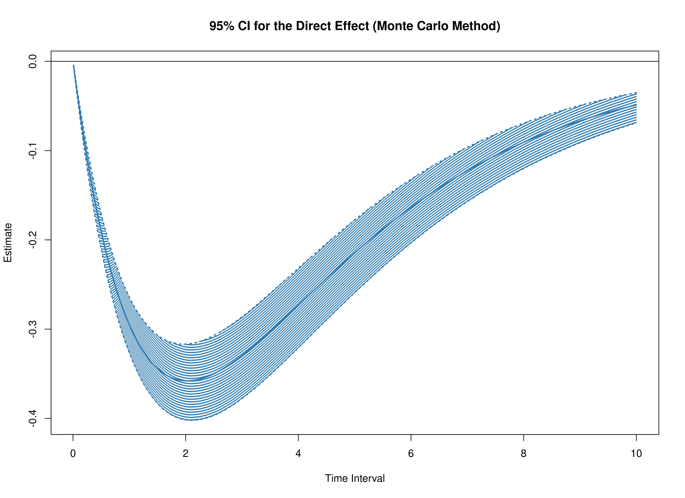
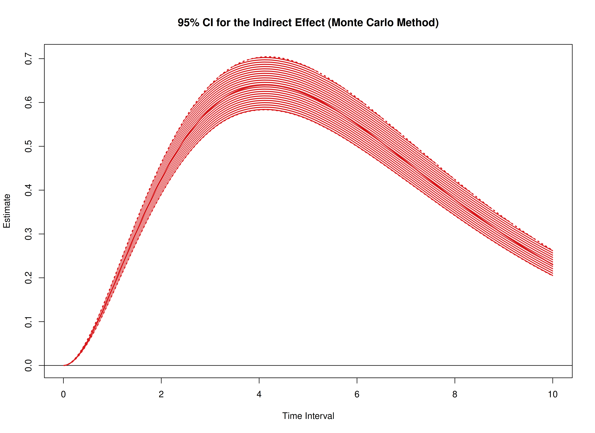

The `cTMed` package offers tools for estimating and quantifying uncertainty in standardized total, direct, and indirect effects within continuous-time mediation models across various time intervals using the delta and Monte Carlo methods. To implement these approaches, estimates from a continuous-time vector autoregressive (CT-VAR) model are required, particularly the drift matrix, and process noise covariance matrix with the corresponding sampling variance-covariance matrix. For guidance on fitting CT-VAR models using the `dynr` or `OpenMx` packages, refer to [Fit the Continuous-Time Vector Autoregressive Model Using the dynr Package](https://jeksterslab.github.io/cTMed/articles/fit-ct-var-dynr.html) and [Fit the Continuous-Time Vector Autoregressive Model Using the OpenMx Package](https://jeksterslab.github.io/cTMed/articles/fit-ct-var-mx.html), respectively.


``` r
summary(fit)
#> Coefficients:
#>              Estimate Std. Error t value   ci.lower   ci.upper Pr(>|t|)    
#> phi_1_1    -0.3518738  0.0345599 -10.182 -0.4196100 -0.2841377   <2e-16 ***
#> phi_2_1     0.7442754  0.0213025  34.938  0.7025233  0.7860275   <2e-16 ***
#> phi_3_1    -0.4586681  0.0224194 -20.459 -0.5026093 -0.4147269   <2e-16 ***
#> phi_1_2     0.0173316  0.0304068   0.570 -0.0422645  0.0769278   0.2843    
#> phi_2_2    -0.4888138  0.0188377 -25.949 -0.5257350 -0.4518927   <2e-16 ***
#> phi_3_2     0.7267855  0.0198254  36.659  0.6879284  0.7656426   <2e-16 ***
#> phi_1_3    -0.0238213  0.0233767  -1.019 -0.0696387  0.0219962   0.1541    
#> phi_2_3    -0.0098181  0.0144220  -0.681 -0.0380848  0.0184485   0.2480    
#> phi_3_3    -0.6883228  0.0152967 -44.998 -0.7183038 -0.6583418   <2e-16 ***
#> sigma_1_1   0.2421847  0.0064484  37.557  0.2295461  0.2548232   <2e-16 ***
#> sigma_2_1   0.0232727  0.0025183   9.241  0.0183369  0.0282084   <2e-16 ***
#> sigma_3_1  -0.0505753  0.0026989 -18.739 -0.0558649 -0.0452856   <2e-16 ***
#> sigma_2_2   0.0707197  0.0018899  37.420  0.0670155  0.0744238   <2e-16 ***
#> sigma_3_2   0.0149893  0.0013541  11.070  0.0123354  0.0176433   <2e-16 ***
#> sigma_3_3   0.0723762  0.0020868  34.683  0.0682861  0.0764663   <2e-16 ***
#> theta_1_1   0.1988610  0.0011588 171.608  0.1965898  0.2011323   <2e-16 ***
#> theta_2_2   0.1995204  0.0009996 199.609  0.1975613  0.2014795   <2e-16 ***
#> theta_3_3   0.2011716  0.0010145 198.288  0.1991832  0.2031601   <2e-16 ***
#> mu0_1_1     0.0062149  0.1219710   0.051 -0.2328439  0.2452737   0.4797    
#> mu0_2_1    -0.0425006  0.1208284  -0.352 -0.2793200  0.1943187   0.3625    
#> mu0_3_1     0.1300648  0.1041761   1.249 -0.0741167  0.3342462   0.1059    
#> sigma0_1_1  1.1504264  0.1810442   6.354  0.7955863  1.5052665   <2e-16 ***
#> sigma0_2_1  0.4136629  0.1418008   2.917  0.1357384  0.6915875   0.0018 ** 
#> sigma0_3_1  0.2260142  0.1187792   1.903 -0.0067889  0.4588172   0.0285 *  
#> sigma0_2_2  1.2218038  0.1985814   6.153  0.8325914  1.6110161   <2e-16 ***
#> sigma0_3_2  0.2353104  0.1267133   1.857 -0.0130432  0.4836640   0.0317 *  
#> sigma0_3_3  0.9626701  0.1594441   6.038  0.6501655  1.2751747   <2e-16 ***
#> ---
#> Signif. codes:  0 '***' 0.001 '**' 0.01 '*' 0.05 '.' 0.1 ' ' 1
#> 
#> -2 log-likelihood value at convergence = 429365.49
#> AIC = 429419.49
#> BIC = 429676.34
```


``` r
phi_varnames <- c(
  "phi_1_1",
  "phi_2_1",
  "phi_3_1",
  "phi_1_2",
  "phi_2_2",
  "phi_3_2",
  "phi_1_3",
  "phi_2_3",
  "phi_3_3"
)
phi <- matrix(
  data = coef(fit)[phi_varnames],
  nrow = 3,
  ncol = 3
)
colnames(phi) <- rownames(phi) <- c("x", "m", "y")
sigma_varnames <- c(
  "sigma_1_1", "sigma_2_1", "sigma_3_1",
  "sigma_2_1", "sigma_2_2", "sigma_3_2",
  "sigma_3_1", "sigma_3_2", "sigma_3_3"
)
sigma <- matrix(
  data = coef(fit)[sigma_varnames],
  nrow = 3,
  ncol = 3
)
theta_varnames <- c(
  phi_varnames,
  "sigma_1_1", "sigma_2_1", "sigma_3_1",
  "sigma_2_2", "sigma_3_2",
  "sigma_3_3"
)
vcov_theta <- vcov(fit)[theta_varnames, theta_varnames]
```


``` r
# Drift matrix
phi
#>            x           m            y
#> x -0.3518738  0.01733165 -0.023821271
#> m  0.7442754 -0.48881381 -0.009818147
#> y -0.4586681  0.72678550 -0.688322785
# Process noise covariance matrix
sigma
#>             [,1]       [,2]        [,3]
#> [1,]  0.24218466 0.02327267 -0.05057526
#> [2,]  0.02327267 0.07071965  0.01498933
#> [3,] -0.05057526 0.01498933  0.07237617
# Sampling variance-covariance matrix
vcov_theta
#>                 phi_1_1       phi_2_1       phi_3_1       phi_1_2       phi_2_2
#> phi_1_1    1.194386e-03  9.434520e-05 -1.832722e-04 -1.004483e-03 -8.964831e-05
#> phi_2_1    9.434520e-05  4.537958e-04 -4.543459e-06 -6.913945e-05 -3.836601e-04
#> phi_3_1   -1.832722e-04 -4.543459e-06  5.026282e-04  1.483225e-04  1.026409e-05
#> phi_1_2   -1.004483e-03 -6.913945e-05  1.483225e-04  9.245720e-04  7.282409e-05
#> phi_2_2   -8.964831e-05 -3.836601e-04  1.026409e-05  7.282409e-05  3.548578e-04
#> phi_3_2    1.607647e-04 -2.804753e-06 -4.250983e-04 -1.450161e-04 -2.919274e-06
#> phi_1_3    6.774418e-04  4.293486e-05 -9.128814e-05 -6.468942e-04 -4.622427e-05
#> phi_2_3    7.077153e-05  2.572020e-04 -1.302596e-05 -6.094418e-05 -2.476033e-04
#> phi_3_3   -1.143637e-04  6.496454e-06  2.868236e-04  1.076101e-04 -3.253344e-06
#> sigma_1_1 -1.729920e-04 -2.237575e-05  2.852008e-05  1.340106e-04  1.876584e-05
#> sigma_2_1  1.322993e-05 -3.283686e-05 -5.521064e-06 -1.446626e-05  2.438253e-05
#> sigma_3_1  1.541527e-05  4.680862e-06 -3.927416e-05 -9.108262e-06 -3.735018e-06
#> sigma_2_2  1.607424e-06  1.345058e-05  1.017099e-06 -1.221604e-06 -1.378053e-05
#> sigma_3_2 -1.924164e-06  1.728793e-06  7.082798e-06  2.066926e-06  2.530022e-07
#> sigma_3_3  6.711228e-09 -9.215972e-07  4.134147e-06 -8.068151e-07  5.584090e-07
#>                 phi_3_2       phi_1_3       phi_2_3       phi_3_3     sigma_1_1
#> phi_1_1    1.607647e-04  6.774418e-04  7.077153e-05 -1.143637e-04 -1.729920e-04
#> phi_2_1   -2.804753e-06  4.293486e-05  2.572020e-04  6.496454e-06 -2.237575e-05
#> phi_3_1   -4.250983e-04 -9.128814e-05 -1.302596e-05  2.868236e-04  2.852008e-05
#> phi_1_2   -1.450161e-04 -6.468942e-04 -6.094418e-05  1.076101e-04  1.340106e-04
#> phi_2_2   -2.919274e-06 -4.622427e-05 -2.476033e-04 -3.253344e-06  1.876584e-05
#> phi_3_2    3.930470e-04  9.435689e-05  8.776401e-06 -2.762247e-04 -2.291365e-05
#> phi_1_3    9.435689e-05  5.464686e-04  4.564710e-05 -8.808095e-05 -8.158519e-05
#> phi_2_3    8.776401e-06  4.564710e-05  2.079953e-04 -1.947278e-06 -1.283264e-05
#> phi_3_3   -2.762247e-04 -8.808095e-05 -1.947278e-06  2.339894e-04  1.465593e-05
#> sigma_1_1 -2.291365e-05 -8.158519e-05 -1.283264e-05  1.465593e-05  4.158154e-05
#> sigma_2_1  5.290129e-06  9.403917e-06 -1.409233e-05 -3.513111e-06  6.272750e-09
#> sigma_3_1  2.962004e-05  2.206458e-07  2.046372e-06 -1.675644e-05 -5.206212e-06
#> sigma_2_2 -1.398553e-06  8.112480e-07  8.663912e-06  9.962591e-07 -3.547992e-07
#> sigma_3_2 -7.103547e-06 -1.323634e-06 -2.461897e-06  4.199434e-06  4.766463e-08
#> sigma_3_3 -2.118570e-08  1.882929e-06  1.338675e-07 -5.198197e-06  4.762538e-07
#>               sigma_2_1     sigma_3_1     sigma_2_2     sigma_3_2     sigma_3_3
#> phi_1_1    1.322993e-05  1.541527e-05  1.607424e-06 -1.924164e-06  6.711228e-09
#> phi_2_1   -3.283686e-05  4.680862e-06  1.345058e-05  1.728793e-06 -9.215972e-07
#> phi_3_1   -5.521064e-06 -3.927416e-05  1.017099e-06  7.082798e-06  4.134147e-06
#> phi_1_2   -1.446626e-05 -9.108262e-06 -1.221604e-06  2.066926e-06 -8.068151e-07
#> phi_2_2    2.438253e-05 -3.735018e-06 -1.378053e-05  2.530022e-07  5.584090e-07
#> phi_3_2    5.290129e-06  2.962004e-05 -1.398553e-06 -7.103547e-06 -2.118570e-08
#> phi_1_3    9.403917e-06  2.206458e-07  8.112480e-07 -1.323634e-06  1.882929e-06
#> phi_2_3   -1.409233e-05  2.046372e-06  8.663912e-06 -2.461897e-06  1.338675e-07
#> phi_3_3   -3.513111e-06 -1.675644e-05  9.962591e-07  4.199434e-06 -5.198197e-06
#> sigma_1_1  6.272750e-09 -5.206212e-06 -3.547992e-07  4.766463e-08  4.762538e-07
#> sigma_2_1  6.341788e-06  4.599255e-08 -3.676482e-07 -9.306099e-07  6.122437e-08
#> sigma_3_1  4.599255e-08  7.283856e-06  8.207137e-08 -2.042095e-07 -1.970287e-06
#> sigma_2_2 -3.676482e-07  8.207137e-08  3.571711e-06  7.140861e-08 -3.991608e-08
#> sigma_3_2 -9.306099e-07 -2.042095e-07  7.140861e-08  1.833491e-06  7.177255e-08
#> sigma_3_3  6.122437e-08 -1.970287e-06 -3.991608e-08  7.177255e-08  4.354813e-06
```

In this example, we aim to calculate the total, direct, and indirect effects of `x` on `y`, mediated through `m`, over time intervals ranging from 0 to 10.


``` r
# time intervals
delta_t <- seq(from = 0, to = 10, length.out = 1000)
```

## Delta Method


``` r
library(cTMed)
start <- Sys.time()
delta <- DeltaMedStd(
  phi = phi,
  sigma = sigma,
  vcov_theta = vcov_theta,
  delta_t = delta_t,
  from = "x",
  to = "y",
  med = "m",
  ncores = parallel::detectCores() # use multiple cores
)
end <- Sys.time()
elapsed <- end - start
elapsed
#> Time difference of 1.320528 secs
```


``` r
plot(delta)
```


## Monte Carlo Method


``` r
start <- Sys.time()
mc <- MCMedStd(
  phi = phi,
  sigma = sigma,
  vcov_theta = vcov_theta,
  delta_t = delta_t,
  from = "x",
  to = "y",
  med = "m",
  R = 20000L,
  ncores = parallel::detectCores() # use multiple cores
)
end <- Sys.time()
elapsed <- end - start
elapsed
#> Time difference of 18.90861 mins
```


``` r
plot(mc)
```



## References


