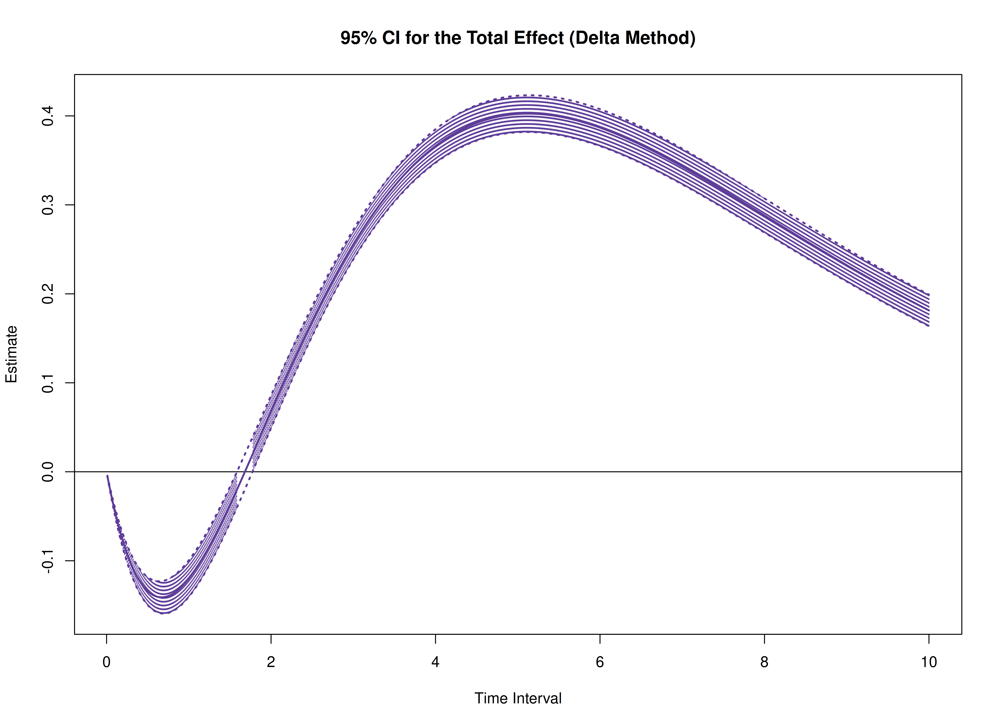

The `cTMed` package offers tools for estimating and quantifying uncertainty in standardized total, direct, and indirect effects within continuous-time mediation models across various time intervals using the delta and Monte Carlo methods. To implement these approaches, estimates from a continuous-time vector autoregressive (CT-VAR) model are required, particularly the drift matrix, and process noise covariance matrix with the corresponding sampling variance-covariance matrix. For guidance on fitting CT-VAR models using the `dynr` or `OpenMx` packages, refer to [Fit the Continuous-Time Vector Autoregressive Model Using the dynr Package](https://jeksterslab.github.io/cTMed/articles/fit-ct-var-dynr.html) and [Fit the Continuous-Time Vector Autoregressive Model Using the OpenMx Package](https://jeksterslab.github.io/cTMed/articles/fit-ct-var-mx.html), respectively.


``` r
summary(fit)
#> Coefficients:
#>             Estimate Std. Error t value  ci.lower  ci.upper Pr(>|t|)    
#> phi_1_1    -0.351837   0.040477  -8.692 -0.431170 -0.272503   <2e-16 ***
#> phi_2_1     0.744281   0.022684  32.810  0.699821  0.788741   <2e-16 ***
#> phi_3_1    -0.458683   0.023307 -19.680 -0.504364 -0.413001   <2e-16 ***
#> phi_1_2     0.017299   0.035160   0.492 -0.051614  0.086211   0.3114    
#> phi_2_2    -0.488816   0.019999 -24.442 -0.528013 -0.449619   <2e-16 ***
#> phi_3_2     0.726799   0.020673  35.157  0.686280  0.767318   <2e-16 ***
#> phi_1_3    -0.023825   0.026208  -0.909 -0.075191  0.027542   0.1817    
#> phi_2_3    -0.009800   0.015134  -0.648 -0.039463  0.019863   0.2586    
#> phi_3_3    -0.688346   0.015868 -43.379 -0.719448 -0.657245   <2e-16 ***
#> sigma_1_1   0.242175   0.007291  33.216  0.227885  0.256465   <2e-16 ***
#> sigma_2_1   0.023273   0.002647   8.792  0.018084  0.028461   <2e-16 ***
#> sigma_3_1  -0.050572   0.002740 -18.459 -0.055941 -0.045202   <2e-16 ***
#> sigma_2_2   0.070721   0.001916  36.921  0.066967  0.074476   <2e-16 ***
#> sigma_3_2   0.014990   0.001380  10.865  0.012286  0.017695   <2e-16 ***
#> sigma_3_3   0.072377   0.002106  34.361  0.068249  0.076505   <2e-16 ***
#> theta_1_1   0.198862   0.001189 167.270  0.196532  0.201192   <2e-16 ***
#> theta_2_2   0.199520   0.001001 199.355  0.197558  0.201481   <2e-16 ***
#> theta_3_3   0.201171   0.001017 197.798  0.199178  0.203165   <2e-16 ***
#> mu0_1_1     0.006365   0.118695   0.054 -0.226274  0.239004   0.4786    
#> mu0_2_1    -0.042579   0.113165  -0.376 -0.264378  0.179220   0.3534    
#> mu0_3_1     0.130157   0.102344   1.272 -0.070434  0.330747   0.1017    
#> sigma0_1_1  1.150287   0.205378   5.601  0.747754  1.552820   <2e-16 ***
#> sigma0_2_1  0.413683   0.134865   3.067  0.149352  0.678015   0.0011 ** 
#> sigma0_3_1  0.225909   0.118800   1.902 -0.006935  0.458753   0.0286 *  
#> sigma0_2_2  1.221862   0.198459   6.157  0.832890  1.610835   <2e-16 ***
#> sigma0_3_2  0.235429   0.125869   1.870 -0.011271  0.482128   0.0307 *  
#> sigma0_3_3  0.962525   0.150708   6.387  0.667142  1.257908   <2e-16 ***
#> ---
#> Signif. codes:  0 '***' 0.001 '**' 0.01 '*' 0.05 '.' 0.1 ' ' 1
#> 
#> -2 log-likelihood value at convergence = 429365.49
#> AIC = 429419.49
#> BIC = 429676.34
```


``` r
phi_varnames <- c(
  "phi_1_1",
  "phi_2_1",
  "phi_3_1",
  "phi_1_2",
  "phi_2_2",
  "phi_3_2",
  "phi_1_3",
  "phi_2_3",
  "phi_3_3"
)
phi <- matrix(
  data = coef(fit)[phi_varnames],
  nrow = 3,
  ncol = 3
)
colnames(phi) <- rownames(phi) <- c("x", "m", "y")
sigma_varnames <- c(
  "sigma_1_1", "sigma_2_1", "sigma_3_1",
  "sigma_2_1", "sigma_2_2", "sigma_3_2",
  "sigma_3_1", "sigma_3_2", "sigma_3_3"
)
sigma <- matrix(
  data = coef(fit)[sigma_varnames],
  nrow = 3,
  ncol = 3
)
theta_varnames <- c(
  phi_varnames,
  "sigma_1_1", "sigma_2_1", "sigma_3_1",
  "sigma_2_2", "sigma_3_2",
  "sigma_3_3"
)
vcov_theta <- vcov(fit)[theta_varnames, theta_varnames]
```


``` r
# Drift matrix
phi
#>            x           m           y
#> x -0.3518368  0.01729864 -0.02382471
#> m  0.7442809 -0.48881584 -0.00979981
#> y -0.4586826  0.72679902 -0.68834647
# Process noise covariance matrix
sigma
#>             [,1]       [,2]        [,3]
#> [1,]  0.24217468 0.02327250 -0.05057192
#> [2,]  0.02327250 0.07072140  0.01499047
#> [3,] -0.05057192 0.01499047  0.07237695
# Sampling variance-covariance matrix
vcov_theta
#>                 phi_1_1       phi_2_1       phi_3_1       phi_1_2       phi_2_2
#> phi_1_1    1.638395e-03  4.205720e-05 -2.365513e-04 -1.376185e-03 -4.400313e-05
#> phi_2_1    4.205720e-05  5.145749e-04  1.901381e-05 -2.143907e-05 -4.359631e-04
#> phi_3_1   -2.365513e-04  1.901381e-05  5.432299e-04  1.936645e-04 -9.386709e-06
#> phi_1_2   -1.376185e-03 -2.143907e-05  1.936645e-04  1.236241e-03  3.126359e-05
#> phi_2_2   -4.400313e-05 -4.359631e-04 -9.386709e-06  3.126359e-05  3.999593e-04
#> phi_3_2    2.074921e-04 -2.517298e-05 -4.623548e-04 -1.848726e-04  1.576373e-05
#> phi_1_3    9.257184e-04  8.251254e-06 -1.204207e-04 -8.555641e-04 -1.597444e-05
#> phi_2_3    3.762530e-05  2.928343e-04  7.109899e-07 -3.090243e-05 -2.783699e-04
#> phi_3_3   -1.487146e-04  2.380476e-05  3.133472e-04  1.369958e-04 -1.775455e-05
#> sigma_1_1 -2.442013e-04 -1.579694e-05  3.757720e-05  1.933901e-04  1.302756e-05
#> sigma_2_1  2.297497e-05 -3.896357e-05 -7.962854e-06 -2.294436e-05  2.962651e-05
#> sigma_3_1  1.863072e-05  3.619382e-06 -4.198918e-05 -1.170724e-05 -2.840243e-06
#> sigma_2_2 -3.578211e-06  1.541868e-05  2.332149e-06  3.281239e-06 -1.545537e-05
#> sigma_3_2 -1.431835e-06  1.927127e-06  8.322808e-06  1.615242e-06  1.176296e-07
#> sigma_3_3 -2.203611e-06 -1.270215e-06  4.429654e-06  1.092348e-06  8.732957e-07
#>                 phi_3_2       phi_1_3       phi_2_3       phi_3_3     sigma_1_1
#> phi_1_1    2.074921e-04  9.257184e-04  3.762530e-05 -1.487146e-04 -2.442013e-04
#> phi_2_1   -2.517298e-05  8.251254e-06  2.928343e-04  2.380476e-05 -1.579694e-05
#> phi_3_1   -4.623548e-04 -1.204207e-04  7.109899e-07  3.133472e-04  3.757720e-05
#> phi_1_2   -1.848726e-04 -8.555641e-04 -3.090243e-05  1.369958e-04  1.933901e-04
#> phi_2_2    1.576373e-05 -1.597444e-05 -2.783699e-04 -1.775455e-05  1.302756e-05
#> phi_3_2    4.273789e-04  1.199960e-04 -4.260080e-06 -3.007907e-04 -3.085525e-05
#> phi_1_3    1.199960e-04  6.868542e-04  2.386256e-05 -1.071758e-04 -1.210257e-04
#> phi_2_3   -4.260080e-06  2.386256e-05  2.290520e-04  8.181839e-06 -8.695992e-06
#> phi_3_3   -3.007907e-04 -1.071758e-04  8.181839e-06  2.518045e-04  2.042787e-05
#> sigma_1_1 -3.085525e-05 -1.210257e-04 -8.695992e-06  2.042787e-05  5.315788e-05
#> sigma_2_1  7.563860e-06  1.524066e-05 -1.770462e-05 -5.242933e-06 -1.473938e-06
#> sigma_3_1  3.205242e-05  1.735962e-06  1.379332e-06 -1.843388e-05 -5.848017e-06
#> sigma_2_2 -2.613218e-06 -2.319797e-06  9.763319e-06  1.906244e-06  4.039293e-07
#> sigma_3_2 -8.237631e-06 -9.189074e-07 -2.405728e-06  4.981899e-06 -2.565611e-08
#> sigma_3_3 -2.240050e-07  5.646350e-07 -1.197923e-07 -5.157492e-06  7.654383e-07
#>               sigma_2_1     sigma_3_1     sigma_2_2     sigma_3_2     sigma_3_3
#> phi_1_1    2.297497e-05  1.863072e-05 -3.578211e-06 -1.431835e-06 -2.203611e-06
#> phi_2_1   -3.896357e-05  3.619382e-06  1.541868e-05  1.927127e-06 -1.270215e-06
#> phi_3_1   -7.962854e-06 -4.198918e-05  2.332149e-06  8.322808e-06  4.429654e-06
#> phi_1_2   -2.294436e-05 -1.170724e-05  3.281239e-06  1.615242e-06  1.092348e-06
#> phi_2_2    2.962651e-05 -2.840243e-06 -1.545537e-05  1.176296e-07  8.732957e-07
#> phi_3_2    7.563860e-06  3.205242e-05 -2.613218e-06 -8.237631e-06 -2.240050e-07
#> phi_1_3    1.524066e-05  1.735962e-06 -2.319797e-06 -9.189074e-07  5.646350e-07
#> phi_2_3   -1.770462e-05  1.379332e-06  9.763319e-06 -2.405728e-06 -1.197923e-07
#> phi_3_3   -5.242933e-06 -1.843388e-05  1.906244e-06  4.981899e-06 -5.157492e-06
#> sigma_1_1 -1.473938e-06 -5.848017e-06  4.039293e-07 -2.565611e-08  7.654383e-07
#> sigma_2_1  7.006599e-06  1.438703e-07 -6.227217e-07 -9.558368e-07  2.524688e-08
#> sigma_3_1  1.438703e-07  7.505554e-06  7.860849e-09 -2.941660e-07 -2.011280e-06
#> sigma_2_2 -6.227217e-07  7.860849e-09  3.669146e-06  6.984348e-08 -4.218391e-08
#> sigma_3_2 -9.558368e-07 -2.941660e-07  6.984348e-08  1.903497e-06  5.149938e-08
#> sigma_3_3  2.524688e-08 -2.011280e-06 -4.218391e-08  5.149938e-08  4.436798e-06
```

In this example, we aim to calculate the total, direct, and indirect effects of `x` on `y`, mediated through `m`, over time intervals ranging from 0 to 10.


``` r
# time intervals
delta_t <- seq(from = 0, to = 10, length.out = 1000)
```

## Delta Method


``` r
library(cTMed)
start <- Sys.time()
delta <- DeltaMedStd(
  phi = phi,
  sigma = sigma,
  vcov_theta = vcov_theta,
  delta_t = delta_t,
  from = "x",
  to = "y",
  med = "m",
  ncores = parallel::detectCores() # use multiple cores
)
end <- Sys.time()
elapsed <- end - start
elapsed
#> Time difference of 1.48478 secs
```


``` r
plot(delta)
```



## Monte Carlo Method


``` r
start <- Sys.time()
mc <- MCMedStd(
  phi = phi,
  sigma = sigma,
  vcov_theta = vcov_theta,
  delta_t = delta_t,
  from = "x",
  to = "y",
  med = "m",
  R = 20000L,
  ncores = parallel::detectCores() # use multiple cores
)
end <- Sys.time()
elapsed <- end - start
elapsed
#> Time difference of 19.19607 mins
```


``` r
plot(mc)
```


## References


