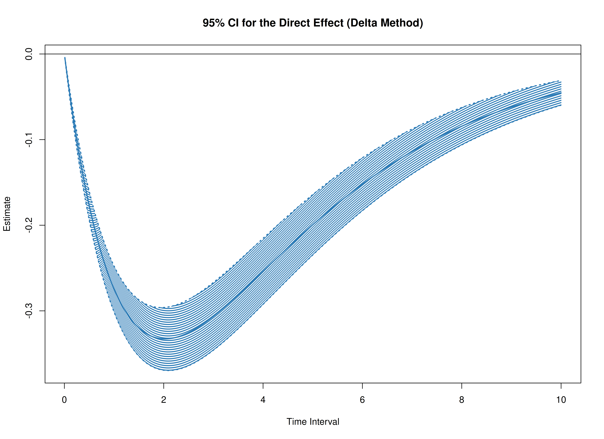

The `cTMed` package offers tools for estimating and quantifying uncertainty in total, direct, and indirect effects within continuous-time mediation models across various time intervals using the delta and Monte Carlo methods. To implement these approaches, estimates from a continuous-time vector autoregressive (CT-VAR) model are required, particularly the drift matrix and its corresponding sampling variance-covariance matrix. For guidance on fitting CT-VAR models using the `dynr` or `OpenMx` packages, refer to [Fit the Continuous-Time Vector Autoregressive Model Using the dynr Package](https://jeksterslab.github.io/cTMed/articles/fit-ct-var-dynr.html) and [Fit the Continuous-Time Vector Autoregressive Model Using the OpenMx Package](https://jeksterslab.github.io/cTMed/articles/fit-ct-var-mx.html), respectively.


``` r
summary(fit)
#> Coefficients:
#>             Estimate Std. Error t value  ci.lower  ci.upper Pr(>|t|)    
#> phi_1_1    -0.351839   0.036416  -9.662 -0.423213 -0.280465   <2e-16 ***
#> phi_2_1     0.744282   0.021777  34.177  0.701599  0.786964   <2e-16 ***
#> phi_3_1    -0.458680   0.023534 -19.490 -0.504806 -0.412554   <2e-16 ***
#> phi_1_2     0.017311   0.031705   0.546 -0.044829  0.079451   0.2925    
#> phi_2_2    -0.488821   0.019277 -25.358 -0.526602 -0.451039   <2e-16 ***
#> phi_3_2     0.726800   0.020871  34.824  0.685894  0.767706   <2e-16 ***
#> phi_1_3    -0.023814   0.024025  -0.991 -0.070903  0.023275   0.1608    
#> phi_2_3    -0.009810   0.014718  -0.667 -0.038657  0.019036   0.2525    
#> phi_3_3    -0.688334   0.016040 -42.913 -0.719773 -0.656896   <2e-16 ***
#> sigma_1_1   0.242180   0.006794  35.646  0.228864  0.255496   <2e-16 ***
#> sigma_2_1   0.023273   0.002545   9.146  0.018285  0.028261   <2e-16 ***
#> sigma_3_1  -0.050574   0.002749 -18.395 -0.055963 -0.045186   <2e-16 ***
#> sigma_2_2   0.070722   0.001907  37.093  0.066985  0.074458   <2e-16 ***
#> sigma_3_2   0.014987   0.001381  10.854  0.012281  0.017694   <2e-16 ***
#> sigma_3_3   0.072376   0.002099  34.475  0.068261  0.076491   <2e-16 ***
#> theta_1_1   0.198861   0.001170 169.909  0.196567  0.201155   <2e-16 ***
#> theta_2_2   0.199520   0.001000 199.500  0.197560  0.201480   <2e-16 ***
#> theta_3_3   0.201172   0.001016 198.052  0.199181  0.203162   <2e-16 ***
#> mu0_1_1     0.006324   0.111110   0.057 -0.211447  0.224095   0.4773    
#> mu0_2_1    -0.042530   0.114320  -0.372 -0.266593  0.181533   0.3549    
#> mu0_3_1     0.130043   0.102109   1.274 -0.070086  0.330172   0.1014    
#> sigma0_1_1  1.150287   0.168811   6.814  0.819425  1.481150   <2e-16 ***
#> sigma0_2_1  0.413648   0.133495   3.099  0.152003  0.675293   0.0010 ***
#> sigma0_3_1  0.225993   0.123478   1.830 -0.016019  0.468006   0.0336 *  
#> sigma0_2_2  1.221957   0.182233   6.705  0.864787  1.579128   <2e-16 ***
#> sigma0_3_2  0.235327   0.117629   2.001  0.004779  0.465875   0.0227 *  
#> sigma0_3_3  0.962594   0.142152   6.772  0.683981  1.241207   <2e-16 ***
#> ---
#> Signif. codes:  0 '***' 0.001 '**' 0.01 '*' 0.05 '.' 0.1 ' ' 1
#> 
#> -2 log-likelihood value at convergence = 429365.49
#> AIC = 429419.49
#> BIC = 429676.34
```


``` r
phi_varnames <- c(
  "phi_1_1",
  "phi_2_1",
  "phi_3_1",
  "phi_1_2",
  "phi_2_2",
  "phi_3_2",
  "phi_1_3",
  "phi_2_3",
  "phi_3_3"
)
phi <- matrix(
  data = coef(fit)[phi_varnames],
  nrow = 3,
  ncol = 3
)
colnames(phi) <- rownames(phi) <- c("x", "m", "y")
vcov_phi_vec <- vcov(fit)[phi_varnames, phi_varnames]
```


``` r
# Drift matrix
phi
#>            x           m            y
#> x -0.3518392  0.01731083 -0.023814339
#> m  0.7442816 -0.48882067 -0.009810166
#> y -0.4586796  0.72679980 -0.688334177
# Sampling variance-covariance matrix
vcov_phi_vec
#>               phi_1_1       phi_2_1       phi_3_1       phi_1_2       phi_2_2
#> phi_1_1  1.326121e-03  9.158296e-05 -2.258193e-04 -1.108000e-03 -8.829144e-05
#> phi_2_1  9.158296e-05  4.742430e-04 -3.596064e-06 -6.566903e-05 -4.021299e-04
#> phi_3_1 -2.258193e-04 -3.596064e-06  5.538551e-04  1.845433e-04  1.077730e-05
#> phi_1_2 -1.108000e-03 -6.566903e-05  1.845433e-04  1.005190e-03  7.060966e-05
#> phi_2_2 -8.829144e-05 -4.021299e-04  1.077730e-05  7.060966e-05  3.715859e-04
#> phi_3_2  1.994853e-04 -3.470399e-06 -4.716662e-04 -1.780693e-04 -3.561584e-06
#> phi_1_3  7.414387e-04  3.913166e-05 -1.151977e-04 -6.965449e-04 -4.344659e-05
#> phi_2_3  6.974956e-05  2.704005e-04 -1.452237e-05 -5.931610e-05 -2.595864e-04
#> phi_3_3 -1.424724e-04  7.176532e-06  3.208390e-04  1.318148e-04 -2.963173e-06
#>               phi_3_2       phi_1_3       phi_2_3       phi_3_3
#> phi_1_1  1.994853e-04  7.414387e-04  6.974956e-05 -1.424724e-04
#> phi_2_1 -3.470399e-06  3.913166e-05  2.704005e-04  7.176532e-06
#> phi_3_1 -4.716662e-04 -1.151977e-04 -1.452237e-05  3.208390e-04
#> phi_1_2 -1.780693e-04 -6.965449e-04 -5.931610e-05  1.318148e-04
#> phi_2_2 -3.561584e-06 -4.344659e-05 -2.595864e-04 -2.963173e-06
#> phi_3_2  4.355884e-04  1.163975e-04  1.028072e-05 -3.075120e-04
#> phi_1_3  1.163975e-04  5.772234e-04  4.373490e-05 -1.045143e-04
#> phi_2_3  1.028072e-05  4.373490e-05  2.166149e-04 -2.958830e-06
#> phi_3_3 -3.075120e-04 -1.045143e-04 -2.958830e-06  2.572924e-04
```

In this example, we aim to calculate the total, direct, and indirect effects of `x` on `y`, mediated through `m`, over time intervals ranging from 0 to 10.


``` r
# time intervals
delta_t <- seq(from = 0, to = 10, length.out = 1000)
```

## Delta Method


``` r
library(cTMed)
start <- Sys.time()
delta <- DeltaMed(
  phi = phi,
  vcov_phi_vec = vcov_phi_vec,
  delta_t = delta_t,
  from = "x",
  to = "y",
  med = "m",
  ncores = parallel::detectCores() # use multiple cores
)
end <- Sys.time()
elapsed <- end - start
elapsed
#> Time difference of 0.783798 secs
```


``` r
plot(delta)
```



## Monte Carlo Method


``` r
start <- Sys.time()
mc <- MCMed(
  phi = phi,
  vcov_phi_vec = vcov_phi_vec,
  delta_t = delta_t,
  from = "x",
  to = "y",
  med = "m",
  R = 20000L,
  ncores = parallel::detectCores() # use multiple cores
)
end <- Sys.time()
elapsed <- end - start
elapsed
#> Time difference of 14.76688 mins
```


``` r
plot(mc)
```


## References


