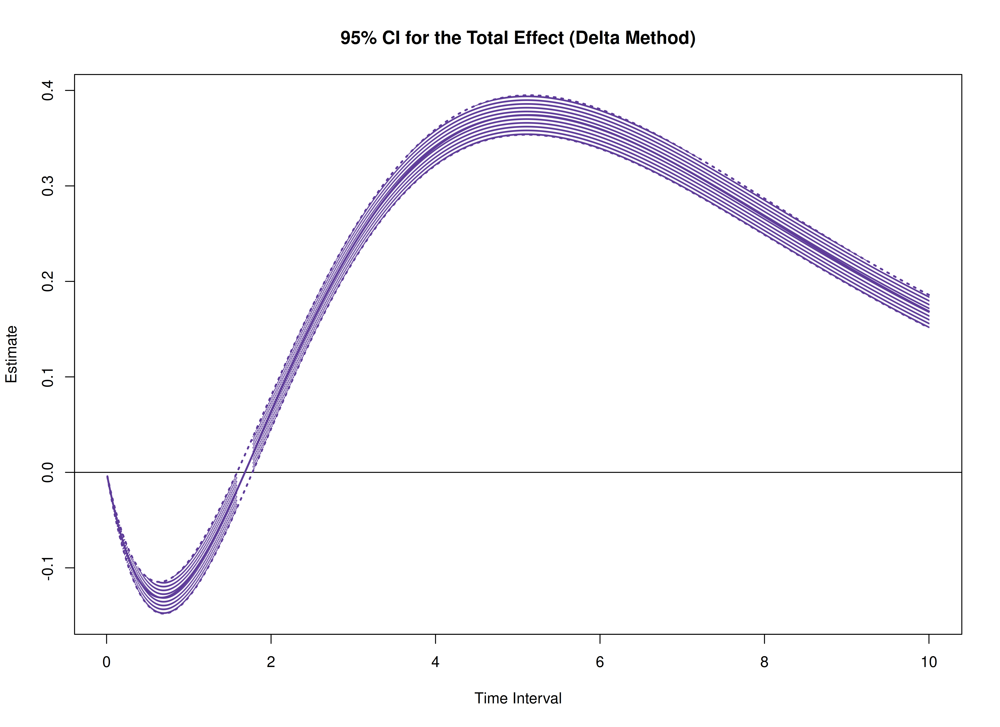
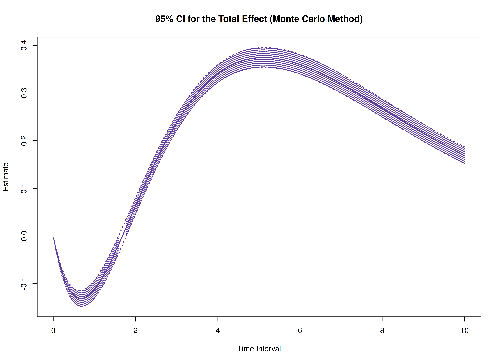
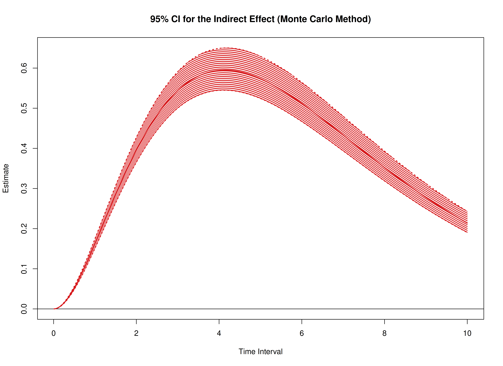

The `cTMed` package offers tools for estimating and quantifying uncertainty in total, direct, and indirect effects within continuous-time mediation models across various time intervals using the delta and Monte Carlo methods. To implement these approaches, estimates from a continuous-time vector autoregressive (CT-VAR) model are required, particularly the drift matrix and its corresponding sampling variance-covariance matrix. For guidance on fitting CT-VAR models using the `dynr` or `OpenMx` packages, refer to [Fit the Continuous-Time Vector Autoregressive Model Using the dynr Package](https://jeksterslab.github.io/cTMed/articles/fit-ct-var-dynr.html) and [Fit the Continuous-Time Vector Autoregressive Model Using the OpenMx Package](https://jeksterslab.github.io/cTMed/articles/fit-ct-var-mx.html), respectively.


``` r
# Drift matrix
phi <- matrix(
  data = c(
    -0.357, 0.771, -0.450,
    0.0, -0.511, 0.729,
    0, 0, -0.693
  ),
  nrow = 3
)
colnames(phi) <- rownames(phi) <- c("x", "m", "y")
# Sampling variance-covariance matrix
vcov_phi_vec <- matrix(
  data = c(
    0.00843, 0.00040, -0.00151, -0.00600, -0.00033, 0.00110,
    0.00324, 0.00020, -0.00061, 0.00040, 0.00374, 0.00016,
    -0.00022, -0.00273, -0.00016, 0.00009, 0.00150, 0.00012,
    -0.00151, 0.00016, 0.00389, 0.00103, -0.00007, -0.00283,
    -0.00050, 0.00000, 0.00156, -0.00600, -0.00022, 0.00103,
    0.00644, 0.00031, -0.00119, -0.00374, -0.00021, 0.00070,
    -0.00033, -0.00273, -0.00007, 0.00031, 0.00287, 0.00013,
    -0.00014, -0.00170, -0.00012, 0.00110, -0.00016, -0.00283,
    -0.00119, 0.00013, 0.00297, 0.00063, -0.00004, -0.00177,
    0.00324, 0.00009, -0.00050, -0.00374, -0.00014, 0.00063,
    0.00495, 0.00024, -0.00093, 0.00020, 0.00150, 0.00000,
    -0.00021, -0.00170, -0.00004, 0.00024, 0.00214, 0.00012,
    -0.00061, 0.00012, 0.00156, 0.00070, -0.00012, -0.00177,
    -0.00093, 0.00012, 0.00223
  ),
  nrow = 9
)
```

In this example, we aim to calculate the total, direct, and indirect effects of `x` on `y`, mediated through `m`, over time intervals ranging from 0 to 10.


``` r
# time intervals
delta_t <- seq(from = 0, to = 10, length.out = 1000)
```

## Delta Method


``` r
library(cTMed)
delta <- DeltaMed(
  phi = phi,
  vcov_phi_vec = vcov_phi_vec,
  delta_t = delta_t,
  from = "x",
  to = "y",
  med = "m",
  ncores = parallel::detectCores() # use multiple cores
)
plot(delta)
```



## Monte Carlo Method


``` r
mc <- MCMed(
  phi = phi,
  vcov_phi_vec = vcov_phi_vec,
  delta_t = delta_t,
  from = "x",
  to = "y",
  med = "m",
  R = 20000L,
  ncores = parallel::detectCores() # use multiple cores
)
plot(mc)
```



## References


