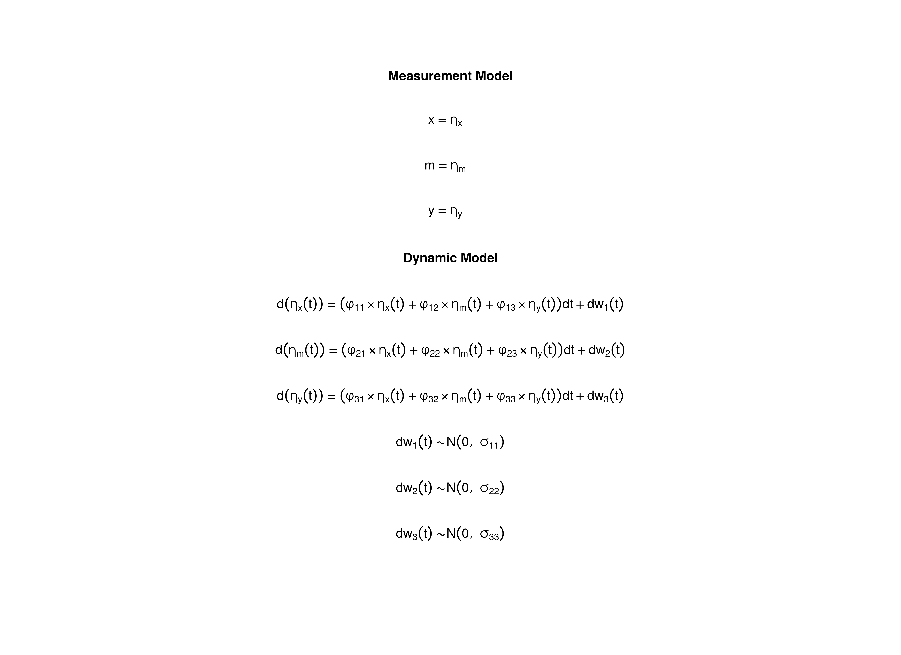

```r
library(cTMed)
```

## Model

The measurement model is given by
\begin{equation}
  \mathbf{y}_{i, t}
  =
  \boldsymbol{\nu}
  +
  \boldsymbol{\Lambda}
  \boldsymbol{\eta}_{i, t}
  +
  \boldsymbol{\varepsilon}_{i, t},
  \quad
  \mathrm{with}
  \quad
  \boldsymbol{\varepsilon}_{i, t}
  \sim
  \mathcal{N}
  \left(
  \mathbf{0},
  \boldsymbol{\Theta}
  \right)
\end{equation}
where
$\mathbf{y}_{i, t}$,
$\boldsymbol{\eta}_{i, t}$,
and
$\boldsymbol{\varepsilon}_{i, t}$
are random variables
and
$\boldsymbol{\nu}$,
$\boldsymbol{\Lambda}$,
and
$\boldsymbol{\Theta}$
are model parameters.
$\mathbf{y}_{i, t}$
represents a vector of observed random variables,
$\boldsymbol{\eta}_{i, t}$
a vector of latent random variables,
and
$\boldsymbol{\varepsilon}_{i, t}$
a vector of random measurement errors,
at time $t$ and individual $i$.
$\boldsymbol{\nu}$
denotes a vector of intercepts,
$\boldsymbol{\Lambda}$
a matrix of factor loadings,
and
$\boldsymbol{\Theta}$
the covariance matrix of
$\boldsymbol{\varepsilon}$.

An alternative representation of the measurement error
is given by
\begin{equation}
  \boldsymbol{\varepsilon}_{i, t}
  =
  \boldsymbol{\Theta}^{\frac{1}{2}}
  \mathbf{z}_{i, t},
  \quad
  \mathrm{with}
  \quad
  \mathbf{z}_{i, t}
  \sim
  \mathcal{N}
  \left(
  \mathbf{0},
  \mathbf{I}
  \right)
\end{equation}
where
$\mathbf{z}_{i, t}$ is a vector of
independent standard normal random variables and
$\left( \boldsymbol{\Theta}^{\frac{1}{2}} \right) \left( \boldsymbol{\Theta}^{\frac{1}{2}} \right)^{\prime} = \boldsymbol{\Theta}$ .

The dynamic structure is given by
\begin{equation}
  \mathrm{d} \boldsymbol{\eta}_{i, t}
  =
  - \boldsymbol{\Phi}
  \left(
  \boldsymbol{\mu}
  -
  \boldsymbol{\eta}_{i, t}
  \right)
  \mathrm{d}t
  +
  \boldsymbol{\Sigma}^{\frac{1}{2}}
  \mathrm{d}
  \mathbf{W}_{i, t}
\end{equation}
where
$\boldsymbol{\mu}$
is the long-term mean or equilibrium level,
$- \boldsymbol{\Phi}$
is the rate of mean reversion,
determining how quickly the variable returns to its mean,
$\boldsymbol{\Sigma}$
is the matrix of volatility
or randomness in the process, and
$\mathrm{d}\boldsymbol{W}$
is a Wiener process or Brownian motion,
which represents random fluctuations.


```r
data("deboeck2015phi", package = "cTMed")
```


## Model Fitting using the `dynr` Package

### Prepare Data

Before fitting the model, we set a small $\Delta t$ and insert NAs on rows with missing observations.


```r
data <- dynUtils::InsertNA(
  data = deboeck2015,
  id = "id",
  time = "time",
  observed = c("x", "m", "y"),
  delta_t = 0.10,
  ncores = parallel::detectCores()
)
head(data)
#>   id time          x         m       y
#> 1  1  0.0 -0.5315017 0.6983597 2.17007
#> 2  1  0.1         NA        NA      NA
#> 3  1  0.2         NA        NA      NA
#> 4  1  0.3         NA        NA      NA
#> 5  1  0.4         NA        NA      NA
#> 6  1  0.5         NA        NA      NA
```


```r
library(dynr)
```


```r
dynr_data <- dynr.data(
  dataframe = data,
  id = "id",
  time = "time",
  observed = c("x", "m", "y")
)
```

### Prepare Initial Condition


```r
dynr_initial <- prep.initial(
  values.inistate = rep(x = 0, times = 3),
  params.inistate = c("mu0_1", "mu0_2", "mu0_3"),
  values.inicov = diag(3),
  params.inicov = matrix(
    data = c(
      "sigma0_11", "sigma0_12", "sigma0_13",
      "sigma0_12", "sigma0_22", "sigma0_23",
      "sigma0_13", "sigma0_23", "sigma0_33"
    ),
    nrow = 3
  )
)
```

### Prepare Measurement Model


```r
dynr_measurement <- prep.measurement(
  values.load = diag(3),
  params.load = matrix(data = "fixed", nrow = 3, ncol = 3),
  state.names = c("eta_x", "eta_m", "eta_y"),
  obs.names = c("x", "m", "y")
)
```

### Prepare Dynamic Process


```r
dynr_dynamics <- prep.formulaDynamics(
  formula = list(  
    eta_x ~ phi_11 * eta_x + phi_12 * eta_m + phi_13 * eta_y,
    eta_m ~ phi_21 * eta_x + phi_22 * eta_m + phi_23 * eta_y,
    eta_y ~ phi_31 * eta_x + phi_32 * eta_m + phi_33 * eta_y
  ),
  startval = c(
    phi_11 = -0.357, phi_12 = 0, phi_13 = 0,
    phi_21 = 0.771, phi_22 = -0.511, phi_23 = 0,
    phi_31 = -0.450, phi_32 = 0.729, phi_33 = -0.693
  ),
  isContinuousTime = TRUE
)
```

### Prepare Process Noise


```r
dynr_noise <- prep.noise(
  values.latent = 0.01 * diag(3),
  params.latent = matrix(
    data = c(
      "sigma_11", "sigma_12", "sigma_13",
      "sigma_12", "sigma_22", "sigma_23",
      "sigma_13", "sigma_23", "sigma_33"
    ),
    nrow = 3
  ),
  values.observed = matrix(data = 0, nrow = 3, ncol = 3),
  params.observed = matrix(data = "fixed", nrow = 3, ncol = 3)
)
```

### Prepare the Model


```r
model <- dynr.model(
  data = dynr_data,
  initial = dynr_initial,
  measurement = dynr_measurement,
  dynamics = dynr_dynamics,
  noise = dynr_noise,
  outfile = "ou.c"
)
```

Set lower and upper bounds to aid in optimization.


```r
lb <- ub <- rep(NA, times = length(model$xstart))
names(ub) <- names(lb) <- names(model$xstart)
lb[
  c(
    "phi_11",
    "phi_21",
    "phi_31",
    "phi_12",
    "phi_22",
    "phi_32",
    "phi_13",
    "phi_23",
    "phi_33"
  )
] <- -1.5
ub[
  c(
    "phi_11",
    "phi_21",
    "phi_31",
    "phi_12",
    "phi_22",
    "phi_32",
    "phi_13",
    "phi_23",
    "phi_33"
  )
] <- 1.5
model$lb <- lb
model$ub <- ub
```



### Fit the Model


```r
dynr_fit <- dynr.cook(
  model,
  debug_flag = TRUE,
  verbose = FALSE
)
#> [1] "Get ready!!!!"
#> using C compiler: ‘gcc (Ubuntu 11.4.0-1ubuntu1~22.04) 11.4.0’
#> Optimization function called.
#> Starting Hessian calculation ...
#> Finished Hessian calculation.
#> Original exit flag:  3 
#> Modified exit flag:  3 
#> Optimization terminated successfully: ftol_rel or ftol_abs was reached. 
#> Original fitted parameters:  -0.3537864 0.02461296 -0.01454772 0.7745076 
#> -0.4761682 0.01994299 -0.5347597 0.8321049 -0.7859372 -2.119013 -0.4472824 
#> 0.2237069 -1.895274 -0.4334241 -1.724992 -0.1065631 -0.384853 0.05342032 
#> -0.05236702 0.2034092 0.3107022 0.1075105 0.08245522 -0.2412857 
#> 
#> Transformed fitted parameters:  -0.3537864 0.02461296 -0.01454772 0.7745076 
#> -0.4761682 0.01994299 -0.5347597 0.8321049 -0.7859372 0.1201502 -0.05374106 
#> 0.02687843 0.1743146 -0.07715598 0.2124178 -0.1065631 -0.384853 0.05342032 
#> 0.9489805 0.1930314 0.2948503 1.152767 0.1517894 0.8847984 
#> 
#> Doing end processing
#> Successful trial
#> Total Time: 1.540131 
#> Backend Time: 1.532238
```

## Summary


```r
summary(dynr_fit)
#> Coefficients:
#>            Estimate Std. Error t value  ci.lower  ci.upper Pr(>|t|)    
#> phi_11    -0.353786   0.052003  -6.803 -0.455710 -0.251863   <2e-16 ***
#> phi_12     0.024613   0.045599   0.540 -0.064760  0.113986   0.2947    
#> phi_13    -0.014548   0.045388  -0.321 -0.103507  0.074411   0.3743    
#> phi_21     0.774508   0.066547  11.639  0.644079  0.904936   <2e-16 ***
#> phi_22    -0.476168   0.058532  -8.135 -0.590890 -0.361447   <2e-16 ***
#> phi_23     0.019943   0.057695   0.346 -0.093137  0.133023   0.3648    
#> phi_31    -0.534760   0.080017  -6.683 -0.691589 -0.377930   <2e-16 ***
#> phi_32     0.832105   0.070598  11.787  0.693736  0.970474   <2e-16 ***
#> phi_33    -0.785937   0.068748 -11.432 -0.920680 -0.651194   <2e-16 ***
#> sigma_11   0.120150   0.011570  10.385  0.097474  0.142826   <2e-16 ***
#> sigma_12  -0.053741   0.011312  -4.751 -0.075913 -0.031569   <2e-16 ***
#> sigma_13   0.026878   0.012049   2.231  0.003262  0.050495   0.0129 *  
#> sigma_22   0.174315   0.018047   9.659  0.138942  0.209687   <2e-16 ***
#> sigma_23  -0.077156   0.016072  -4.801 -0.108657 -0.045655   <2e-16 ***
#> sigma_33   0.212418   0.022111   9.607  0.169082  0.255754   <2e-16 ***
#> mu0_1     -0.106563   0.137768  -0.773 -0.376584  0.163458   0.2196    
#> mu0_2     -0.384853   0.151837  -2.535 -0.682448 -0.087258   0.0057 ** 
#> mu0_3      0.053420   0.133026   0.402 -0.207305  0.314146   0.3440    
#> sigma0_11  0.948981   0.189785   5.000  0.577009  1.320952   <2e-16 ***
#> sigma0_12  0.193031   0.150412   1.283 -0.101770  0.487833   0.0997 .  
#> sigma0_13  0.294850   0.136129   2.166  0.028042  0.561658   0.0152 *  
#> sigma0_22  1.152767   0.230542   5.000  0.700914  1.604620   <2e-16 ***
#> sigma0_23  0.151789   0.144424   1.051 -0.131277  0.434856   0.1467    
#> sigma0_33  0.884798   0.176952   5.000  0.537980  1.231617   <2e-16 ***
#> ---
#> Signif. codes:  0 '***' 0.001 '**' 0.01 '*' 0.05 '.' 0.1 ' ' 1
#> 
#> -2 log-likelihood value at convergence = 849.23
#> AIC = 897.23
#> BIC = 1041.78
```


```r
parnames <- c(
  "phi_11",
  "phi_21",
  "phi_31",
  "phi_12",
  "phi_22",
  "phi_32",
  "phi_13",
  "phi_23",
  "phi_33"
)
phi_vec <- coef(dynr_fit)[parnames]
phi <- matrix(
  data = phi_vec,
  nrow = 3
)
colnames(phi) <- rownames(phi) <- c("x", "m", "y")
vcov_phi_vec <- vcov(dynr_fit)[parnames, parnames]
dynr <- list(
  phi = phi,
  vcov = vcov_phi_vec
)
```


## Model Fitting using the `ctsem` Package

### Define the Model


```r
library(ctsem)
```


```r
model <- ctModel(
  type = "stanct",
  manifestNames = c("x", "m", "y"),
  latentNames = c("eta_x", "eta_m", "eta_y"),
  id = "id",
  time = "time",
  silent = TRUE,
  LAMBDA = diag(3),
  DRIFT = "auto",
  MANIFESTMEANS = matrix(data = 0, nrow = 3, ncol = 1),
  MANIFESTVAR = diag(0, 3),
  CINT = "auto",
  DIFFUSION = "auto"
)
```

### Fit the Model


```r
set.seed(42)
ctsem_fit <- ctStanFit(
  datalong = data,
  ctstanmodel = model,
  optimize = TRUE,
  cores = parallel::detectCores()
)
```

### Summary


```r
summary(ctsem_fit)
#> $residCovStd
#>       x     m     y
#> x 0.534 0.038 0.077
#> m 0.038 0.319 0.023
#> y 0.077 0.023 0.374
#> 
#> $resiCovStdNote
#> [1] "Standardised covariance of residuals"
#> 
#> $rawpopcorr
#>                        mean     sd    2.5%    50%  97.5%      z
#> T0m_eta_m__T0m_eta_x 0.1769 0.1390 -0.1004 0.1812 0.4235 1.2728
#> T0m_eta_y__T0m_eta_x 0.3104 0.1252  0.0472 0.3133 0.5396 2.4804
#> T0m_eta_y__T0m_eta_m 0.1412 0.1348 -0.1214 0.1409 0.4063 1.0471
#> 
#> $parmatrices
#>              matrix row col    Mean     sd    2.5%     50%   97.5%
#> 1           T0MEANS   1   1 -0.1024 0.1347 -0.3603 -0.1022  0.1619
#> 2           T0MEANS   2   1 -0.3784 0.1547 -0.6869 -0.3742 -0.0738
#> 3           T0MEANS   3   1  0.0544 0.1330 -0.2036  0.0531  0.3193
#> 4            LAMBDA   1   1  1.0000 0.0000  1.0000  1.0000  1.0000
#> 5            LAMBDA   1   2  0.0000 0.0000  0.0000  0.0000  0.0000
#> 6            LAMBDA   1   3  0.0000 0.0000  0.0000  0.0000  0.0000
#> 7            LAMBDA   2   1  0.0000 0.0000  0.0000  0.0000  0.0000
#> 8            LAMBDA   2   2  1.0000 0.0000  1.0000  1.0000  1.0000
#> 9            LAMBDA   2   3  0.0000 0.0000  0.0000  0.0000  0.0000
#> 10           LAMBDA   3   1  0.0000 0.0000  0.0000  0.0000  0.0000
#> 11           LAMBDA   3   2  0.0000 0.0000  0.0000  0.0000  0.0000
#> 12           LAMBDA   3   3  1.0000 0.0000  1.0000  1.0000  1.0000
#> 13            DRIFT   1   1 -0.3560 0.0522 -0.4659 -0.3521 -0.2670
#> 14            DRIFT   1   2  0.0226 0.0454 -0.0610  0.0229  0.1144
#> 15            DRIFT   1   3 -0.0134 0.0458 -0.1071 -0.0134  0.0759
#> 16            DRIFT   2   1  0.7736 0.0684  0.6401  0.7742  0.9086
#> 17            DRIFT   2   2 -0.4794 0.0617 -0.6110 -0.4764 -0.3733
#> 18            DRIFT   2   3  0.0201 0.0588 -0.0977  0.0189  0.1332
#> 19            DRIFT   3   1 -0.5316 0.0817 -0.6964 -0.5309 -0.3768
#> 20            DRIFT   3   2  0.8311 0.0742  0.6835  0.8304  0.9752
#> 21            DRIFT   3   3 -0.7885 0.0726 -0.9379 -0.7867 -0.6522
#> 31    MANIFESTMEANS   1   1  0.0000 0.0000  0.0000  0.0000  0.0000
#> 32    MANIFESTMEANS   2   1  0.0000 0.0000  0.0000  0.0000  0.0000
#> 33    MANIFESTMEANS   3   1  0.0000 0.0000  0.0000  0.0000  0.0000
#> 34             CINT   1   1  0.0000 0.0000  0.0000  0.0000  0.0000
#> 35             CINT   2   1  0.0000 0.0000  0.0000  0.0000  0.0000
#> 36             CINT   3   1  0.0000 0.0000  0.0000  0.0000  0.0000
#> 46         asymCINT   1   1  0.0000 0.0000  0.0000  0.0000  0.0000
#> 47         asymCINT   2   1  0.0000 0.0000  0.0000  0.0000  0.0000
#> 48         asymCINT   3   1  0.0000 0.0000  0.0000  0.0000  0.0000
#> 49 asymDIFFUSIONcov   1   1  0.1781 0.0201  0.1420  0.1774  0.2197
#> 50 asymDIFFUSIONcov   1   2  0.1088 0.0244  0.0690  0.1065  0.1648
#> 51 asymDIFFUSIONcov   1   3  0.0196 0.0166 -0.0100  0.0188  0.0543
#> 52 asymDIFFUSIONcov   2   1  0.1088 0.0244  0.0690  0.1065  0.1648
#> 53 asymDIFFUSIONcov   2   2  0.3663 0.0440  0.2896  0.3630  0.4636
#> 54 asymDIFFUSIONcov   2   3  0.1500 0.0291  0.1017  0.1472  0.2183
#> 55 asymDIFFUSIONcov   3   1  0.0196 0.0166 -0.0100  0.0188  0.0543
#> 56 asymDIFFUSIONcov   3   2  0.1500 0.0291  0.1017  0.1472  0.2183
#> 57 asymDIFFUSIONcov   3   3  0.2813 0.0279  0.2320  0.2797  0.3425
#> 58     DIFFUSIONcov   1   1  0.1206 0.0119  0.0994  0.1198  0.1469
#> 59     DIFFUSIONcov   1   2 -0.0538 0.0113 -0.0767 -0.0533 -0.0333
#> 60     DIFFUSIONcov   1   3  0.0267 0.0120  0.0025  0.0264  0.0501
#> 61     DIFFUSIONcov   2   1 -0.0538 0.0113 -0.0767 -0.0533 -0.0333
#> 62     DIFFUSIONcov   2   2  0.1753 0.0190  0.1422  0.1738  0.2148
#> 63     DIFFUSIONcov   2   3 -0.0772 0.0164 -0.1092 -0.0764 -0.0482
#> 64     DIFFUSIONcov   3   1  0.0267 0.0120  0.0025  0.0264  0.0501
#> 65     DIFFUSIONcov   3   2 -0.0772 0.0164 -0.1092 -0.0764 -0.0482
#> 66     DIFFUSIONcov   3   3  0.2137 0.0225  0.1749  0.2123  0.2582
#> 67      MANIFESTcov   1   1  0.0000 0.0000  0.0000  0.0000  0.0000
#> 68      MANIFESTcov   1   2  0.0000 0.0000  0.0000  0.0000  0.0000
#> 69      MANIFESTcov   1   3  0.0000 0.0000  0.0000  0.0000  0.0000
#> 70      MANIFESTcov   2   1  0.0000 0.0000  0.0000  0.0000  0.0000
#> 71      MANIFESTcov   2   2  0.0000 0.0000  0.0000  0.0000  0.0000
#> 72      MANIFESTcov   2   3  0.0000 0.0000  0.0000  0.0000  0.0000
#> 73      MANIFESTcov   3   1  0.0000 0.0000  0.0000  0.0000  0.0000
#> 74      MANIFESTcov   3   2  0.0000 0.0000  0.0000  0.0000  0.0000
#> 75      MANIFESTcov   3   3  0.0000 0.0000  0.0000  0.0000  0.0000
#> 76            T0cov   1   1  0.9722 0.1960  0.6443  0.9563  1.4040
#> 77            T0cov   1   2  0.1924 0.1556 -0.0977  0.1904  0.4990
#> 78            T0cov   1   3  0.2923 0.1370  0.0405  0.2856  0.5853
#> 79            T0cov   2   1  0.1924 0.1556 -0.0977  0.1904  0.4990
#> 80            T0cov   2   2  1.1803 0.2451  0.7651  1.1536  1.7100
#> 81            T0cov   2   3  0.1464 0.1433 -0.1162  0.1390  0.4488
#> 82            T0cov   3   1  0.2923 0.1370  0.0405  0.2856  0.5853
#> 83            T0cov   3   2  0.1464 0.1433 -0.1162  0.1390  0.4488
#> 84            T0cov   3   3  0.8933 0.1777  0.5984  0.8774  1.2681
#> 85          dtDRIFT   1   1  0.7086 0.0296  0.6475  0.7105  0.7632
#> 86          dtDRIFT   1   2  0.0111 0.0227 -0.0338  0.0115  0.0535
#> 87          dtDRIFT   1   3 -0.0072 0.0259 -0.0605 -0.0073  0.0435
#> 88          dtDRIFT   2   1  0.5090 0.0325  0.4437  0.5094  0.5708
#> 89          dtDRIFT   2   2  0.6298 0.0260  0.5757  0.6305  0.6780
#> 90          dtDRIFT   2   3  0.0068 0.0288 -0.0525  0.0071  0.0613
#> 91          dtDRIFT   3   1 -0.1155 0.0313 -0.1807 -0.1147 -0.0572
#> 92          dtDRIFT   3   2  0.4414 0.0251  0.3887  0.4424  0.4858
#> 93          dtDRIFT   3   3  0.4611 0.0285  0.4057  0.4608  0.5197
#> 
#> $popsd
#>             mean     sd   2.5%    50%  97.5%
#> T0m_eta_x 0.9812 0.0993 0.8013 0.9777 1.1836
#> T0m_eta_m 1.0806 0.1138 0.8691 1.0766 1.3206
#> T0m_eta_y 0.9405 0.0951 0.7679 0.9371 1.1292
#> 
#> $popmeans
#>                      mean     sd    2.5%     50%   97.5%
#> T0m_eta_x         -0.1024 0.1347 -0.3603 -0.1022  0.1619
#> T0m_eta_m         -0.3784 0.1547 -0.6869 -0.3742 -0.0738
#> T0m_eta_y          0.0544 0.1330 -0.2036  0.0531  0.3193
#> drift_eta_x       -0.3560 0.0522 -0.4659 -0.3521 -0.2670
#> drift_eta_x_eta_m  0.0226 0.0454 -0.0610  0.0229  0.1144
#> drift_eta_x_eta_y -0.0134 0.0458 -0.1071 -0.0134  0.0759
#> drift_eta_m_eta_x  0.7736 0.0684  0.6401  0.7742  0.9086
#> drift_eta_m       -0.4794 0.0617 -0.6110 -0.4764 -0.3733
#> drift_eta_m_eta_y  0.0201 0.0588 -0.0977  0.0189  0.1332
#> drift_eta_y_eta_x -0.5316 0.0817 -0.6964 -0.5309 -0.3768
#> drift_eta_y_eta_m  0.8311 0.0742  0.6835  0.8304  0.9752
#> drift_eta_y       -0.7885 0.0726 -0.9379 -0.7867 -0.6522
#> diff_eta_x         0.3469 0.0170  0.3152  0.3462  0.3832
#> diff_eta_m_eta_x  -0.1974 0.0349 -0.2647 -0.1980 -0.1252
#> diff_eta_m         0.4181 0.0226  0.3772  0.4169  0.4635
#> diff_eta_y_eta_x   0.0688 0.0364 -0.0072  0.0692  0.1403
#> diff_eta_y_eta_m  -0.2145 0.0370 -0.2867 -0.2146 -0.1439
#> diff_eta_y         0.4616 0.0242  0.4182  0.4607  0.5082
#> 
#> $popNote
#> [1] "popmeans are reported as specified in ctModel -- covariance related matrices are in sd / unconstrained correlation form -- see $parmatrices for simpler interpretations!"
#> 
#> $loglik
#> [1] -424.6148
#> 
#> $npars
#> [1] 24
#> 
#> $aic
#> [1] 897.2295
#> 
#> $logposterior
#> [1] -424.6148
```

### Extract the Posterior Distribution of the Drift Matrix


```r
posterior <- ctExtract(ctsem_fit)$pop_DRIFT
posterior_phi <- lapply(
  X = seq_len(dim(posterior)[1]),
  FUN = function(i) {
    phi <- posterior[i, , ]
    colnames(phi) <- rownames(phi) <- c("x", "m", "y")
    return(phi)
  }
)
posterior_phi_vec <- lapply(
  X = posterior_phi,
  FUN = function(i) {
    dim(i) <- NULL
    return(i)
  }
)
phi_vec <- colMeans(do.call(what = "rbind", args = posterior_phi_vec))
phi <- matrix(
  data = phi_vec,
  nrow = 3
)
colnames(phi) <- rownames(phi) <- c("x", "m", "y")
vcov_phi_vec <- var(do.call(what = "rbind", args = posterior_phi_vec))
ctsem <- list(
  posterior = posterior,
  posterior_phi = posterior_phi,
  phi = phi,
  vcov = vcov_phi_vec
)
```


```r
deboeck2015phi <- list(
  dynr = dynr,
  ctsem = ctsem
)
```


## References


